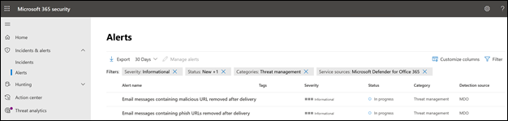

# Nuevas directivas de alerta en Microsoft Defender para Office 365

Microsoft Defender para Office 365 está introduciendo directivas de alerta nuevas y mejoradas relacionadas con las detección posterior a la entrega. Esto incluye mejoras en las guías de Investigación y respuesta automatizadas (AIR) asociados a ellas. Además, estamos modificando la clasificación de gravedad para seis directivas de alerta predeterminadas para alinear mejor las alertas generadas por estas directivas con su impacto en la organización.

## Detecciones posteriores a la entrega

Vamos a introducir cuatro nuevas directivas de alerta predeterminadas relacionadas con las detección posterior a la entrega después de que la purga automática (ZAP) de Microsoft Defender para Office 365 quite los mensajes de una bandeja de entrada. Estas cuatro directivas de alerta nuevas reemplazarán a las dos directivas de alerta predeterminadas existentes que abarcan escenarios de ZAP y proporcionarán a las organizaciones detalles mejorados sobre la detección subyacente y los indicadores relacionados. Estas alertas (y las guías de AIR que se activarán a partir de estas alertas) capturarán con precisión las amenazas de los correos electrónicos y entidades, incluyendo si la dirección URL apunta a un archivo malintencionado o si el archivo contiene una dirección URL malintencionada.

En la tabla siguiente se enumeran las nuevas directivas de alerta y las directivas de alerta existentes que se quitarán. Consulte la sección[Cómo afectará esto a su organización](#how-this-will-affect-your-organization) para ver más información sobre la implementación.

| Directiva de alerta nueva o existente | Nombre de la directiva de alerta | Id. de directiva de alerta|
|:-----------------------------|:----------------|:--------------|
| Nueva| **Mensajes de correo electrónico que contienen direcciones URL malintencionadas quitados después de la entrega**   | 8e6ba277-ef39-404e-aaf1-294f6d9a2b88 |
| Nueva| **Mensajes de correo electrónico que contienen archivos malintencionados quitados después de la entrega**  | 4b1820ec-39dc-45f3-abf6-5ee80df51fd2 |
| Nueva| **Mensajes de correo electrónico de una campaña se entregaron y se quitaron más tarde** | c8522cbb-9368-4e25-4ee9-08d8d899dfab |
| Nuevo|**Mensajes de correo electrónico quitados después de la entrega**                | b8f6b088-5487-4c70-037c-08d8d71a43fe |
| Existente (se quitará)| **Mensajes de correo electrónico que contienen direcciones URL de cebo quitados después de la entrega**| EA8169FA-0678-4751-8854-AEBEA7ADECEB |
| Existente (se quitará)| **Mensajes de correo electrónico que contienen malware quitados después de la entrega**| 0179B3F7-3FDA-40C3-8F24-278563978DBB |
||||

## Mejoras de gravedad de las alertas

En la tabla siguiente se identifican las directivas de alerta predeterminadas cuyas clasificaciones de gravedad se van a modificar. Estamos cambiando la clasificación de gravedad de estas directivas de alerta para que se alineen mejor con el posible riesgo e impacto en su organización, y para ayudar a sus equipos de seguridad a clasificar por orden de prioridad las alertas generadas por estas directivas.

| Alerta| Id. de directiva de alerta| Gravedad anterior| Nueva gravedad  |
|:----------|:---------------|:------------|:--------------|
| **Actividad de reenvío de correo electrónico sospechoso**| BFD48F06-0865-41A6-85FF-ADB746423EBF | Mediano| Alto|
| **Correo electrónico notificado por el usuario como malware o cebo** | B26A5770-0C38-434A-9380-3A3C2C27BBB3 | Informativo | Bajo|
| **Aumento inusual en el correo electrónico notificado como cebo** | A00D8C62-9320-4EEA-A7E5-966B9AC09558 | Alto| Medio |
| **Resultado de envío de administrador completado** | AE9B83DD-6039-4EA9-B675-6B0AC3BF4A41 | Bajo| Informativo |
| **Creación de una regla de reenvío o redirección** | D59A8FD4-1272-41EE-9408-86F7BCF72479 | Bajo| Informativo |
| **Búsqueda de eDiscovery iniciada o exportada** | 6FDC5710-3998-47F0-AFBB-57CEFD7378A | Medium | Informativo |
|||||

## ¿Cuándo se realizarán estos cambios?

En la tabla siguiente se indica cuándo las nuevas directivas de alertas empezarán a desencadenar alertas posteriores a la entrega. La tabla también indica cuándo se quitarán las dos directivas de alerta existentes.

| Directiva de alerta| Fecha |
|:------------|:-----|
| **Mensajes de correo electrónico que contienen direcciones URL malintencionadas quitados después de la entrega** (nueva) | Las alertas se empezarán a desencadenar el 11 de abril de 2021|
| **Mensajes de correo electrónico que contienen archivos malintencionados quitados después de la entrega** (nueva) | Las alertas se empezarán a desencadenar el 11 de abril de 2021 |
| **Mensajes de correo electrónico de una campaña se entregaron y se quitaron más tarde** (nueva) | Las alertas empezarán a desencadenarse el 28 de mayo de 2021|
| **Correos electrónicos malintencionados que se entregaron y se quitaron posteriormente** (nueva) | Las alertas empezarán a desencadenarse el 28 de mayo de 2021|
| **Mensajes de correo electrónico que contienen direcciones URL de cebo quitados después de la entrega** (existente, va a eliminarse)| La directiva de alerta se quitará el 28 de mayo de 2021. Vea la sección [Lo que tiene que hacer para prepararse para estos cambios](#what-you-need-to-do-to-prepare-for-these-changes).|
| **Mensajes de correo electrónico que contienen malware quitados después de la entrega** (existente, va a eliminarse) | La directiva de alerta se quitará el 28 de mayo de 2021. Vea la sección [Lo que tiene que hacer para prepararse para estos cambios](#what-you-need-to-do-to-prepare-for-these-changes). |
|||

Los cambios de gravedad de las alertas se implantarán en todas las organizaciones antes del 14 de mayo de 2021.

## Cómo afectará esto a su organización

Las nuevas alertas empezarán a activarse y desencadenarán investigaciones de AIR en su organización en las fechas indicadas anteriormente. Para reducir el impacto en las organizaciones de seguridad que han puesto en funcionamiento las dos alertas que se van a quitar, verá las alertas activadas por las directivas de alerta existentes *y* las alertas activadas por las nuevas directivas de alerta entre el 5 de abril de 2021 y el 28 de mayo de 2021. De esta forma, los equipos de seguridad disponen de tiempo para afrontar los cambios necesarios. Para ayudar a los equipos de seguridad con el aumento del volumen de alertas durante esta breve duración, tanto las alertas existentes como las nuevas se correlacionarán en la misma investigación de AIR y en un mismo incidente. Más concretamente, se incluye el comportamiento siguiente para alertas, investigaciones de AIR e incidentes:

- **Alertas**: de forma predeterminada, verá los siguientes pares de alertas en las alertas nuevas y existentes:

  - **Mensajes de correo electrónico que contienen direcciones URL de cebo quitados después de la entrega** Y **Mensajes de correo electrónico que contienen direcciones URL malintencionadas quitados después de la entrega**

  - **Mensajes de correo electrónico que contienen malware quitados después de la entrega** Y **Mensajes de correo electrónico que contienen archivos malintencionados quitados después de la entrega**

  

   Para más información acerca de la administración de estos pares de alertas, consulte la sección [Lo que tiene que hacer para prepararse para estos cambios](#what-you-need-to-do-to-prepare-for-these-changes).

- **Investigaciones de AIR**: las alertas se correlacionarán en una sola investigación de AIR, con una de las alertas clasificada como "desencadenante" y la otra como "repetida".

  

- **Incidentes**: ambas alertas se correlacionarán en el mismo incidente

  

## Lo que tiene que hacer para prepararse para estos cambios

La manera en que su organización utiliza estas alertas determina lo que necesita hacer para prepararse. Si ha puesto en funcionamiento las alertas y las está utilizando o las usa a través de una API, una notificación de correo electrónico de alerta, en el Centro de seguridad y cumplimiento de Office 365 (`https://protection.office.com/viewalerts`) o el Centro de seguridad de Microsoft (`https://security.microsoft.com/viewalerts`), deberá modificar sus flujos de trabajo.

**Si no ha puesto en funcionamiento estas alertas, puede seguir uno de estos procedimientos:**

- Deshabilite las siguientes directivas de alerta (que se quitarán) para reducir el volumen de alertas en su organización:

  - **Mensajes de correo electrónico que contienen direcciones URL de cebo quitados después de la entrega**

  - **Mensajes de correo electrónico que contienen malware quitados después de la entrega**

- No haga nada. Deshabilitaremos las directivas de alerta existentes el 28 de mayo de 2021.

**Si ha puesto en funcionamiento estas alertas:**

- Empiece a usar las nuevas alertas como parte de sus flujos de trabajo como preparación para la eliminación de la directiva de alerta existente el 28 de mayo de 2021. Si tiene lógica personalizada en su sistema de vales, un buzón de seguridad donde recibe notificaciones de correo electrónico de alerta o una solución SIEM que depende del nombre de la alerta o del Id. de directiva de alerta (CorrelationId), necesitará modificar la lógica para adaptarla al cambio.

  > [!NOTE]
  > La información de las alertas, las investigaciones y los incidentes no ha cambiado. De hecho, esta información se ha mejorado con detalles adicionales sobre las amenazas asociadas con ellas.

- Después de realizar las modificaciones, puede deshabilitar las directivas de alerta existentes para reducir el volumen de alertas en la organización:

  - **Mensajes de correo electrónico que contienen direcciones URL de cebo quitados después de la entrega**

  - **Mensajes de correo electrónico que contienen malware quitados después de la entrega**

  Como alternativa, puede dejar estas directivas de alerta habilitadas hasta que las eliminemos el 28 de mayo de 2021.
