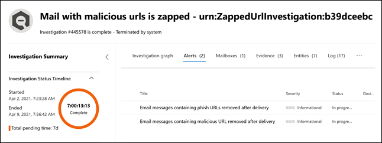

# Nuevas directivas de alerta en Microsoft Defender para Office 365New alert policies in Microsoft Defender for Office 365

Microsoft Defender para Office 365 está introduciendo directivas de alerta nuevas y mejoradas relacionadas con las detección posterior a la entrega.Microsoft Defender for Office 365 is introducing new and improved alert policies related to post-delivery detections. Esto incluye mejoras en las guías de Investigación y respuesta automatizadas (AIR) asociados a ellas.This includes enhancements to the Automated Investigation & Response (AIR) playbooks associated with them. Además, estamos modificando la clasificación de gravedad para seis directivas de alerta predeterminadas para alinear mejor las alertas generadas por estas directivas con su impacto en la organización.In addition, we're modifying the severity classification for six default alert policies to better align the alerts generated by these policies with their impact on your organization.

## Detecciones posteriores a la entregaPost-delivery detections

Vamos a introducir cuatro nuevas directivas de alerta predeterminadas relacionadas con las detección posterior a la entrega después de que la purga automática (ZAP) de Microsoft Defender para Office 365 quite los mensajes de una bandeja de entrada.We'll be introducing four new default alert policies related to post-delivery detections after the Microsoft Defender for Office 365 Zero-hour auto purge (ZAP) removes messages from an inbox. Estas cuatro directivas de alerta nuevas reemplazarán a las dos directivas de alerta predeterminadas existentes que abarcan escenarios de ZAP y proporcionarán a las organizaciones detalles mejorados sobre la detección subyacente y los indicadores relacionados.These four new alert policies will replace two existing default alert policies that cover ZAP scenarios and will provide organizations enhanced details about the underlying detection and related indicators. Estas alertas (y las guías de AIR que se activarán a partir de estas alertas) capturarán con precisión las amenazas de los correos electrónicos y entidades, incluyendo si la dirección URL apunta a un archivo malintencionado o si el archivo contiene una dirección URL malintencionada.These alerts (and the AIR playbooks that will be triggered from these alerts) will accurately capture the threats of the emails and entities, including if the URL points to a malicious file or if the file contains a malicious URL.

En la tabla siguiente se enumeran las nuevas directivas de alerta y las directivas de alerta existentes que se quitarán.The following table lists the new alert policies and the existing alert policies that will be removed. Consulte la sección[Cómo afectará esto a su organización](#how-this-will-affect-your-organization) para ver más información sobre la implementación.See the [How this will affect your organization](#how-this-will-affect-your-organization) section for details about the rollout.

| Directiva de alerta nueva o existenteNew or existing alert policy | Nombre de la directiva de alertaAlert policy name | Id. de directiva de alertaAlert policy ID|
|:-----------------------------|:----------------|:--------------|
| NuevaNew| **Mensajes de correo electrónico que contienen direcciones URL malintencionadas quitados después de la entrega****Email messages containing malicious URL removed after delivery**   | 0179B3F7-3FDA-40C3-8F24-278563978DBB0179B3F7-3FDA-40C3-8F24-278563978DBB |
| NuevaNew| **Mensajes de correo electrónico que contienen archivos malintencionados quitados después de la entrega****Email messages containing malicious file removed after delivery**  | 8E6BA277-EF39-404E-AAF1-294F6D9A2B888E6BA277-EF39-404E-AAF1-294F6D9A2B88 |
| NuevaNew| **Mensajes de correo electrónico de una campaña se entregaron y se quitaron más tarde****Email messages from a campaign were delivered and later removed** | ef850570-5624-42b2-ff0a-08d8d899d578ef850570-5624-42b2-ff0a-08d8d899d578 |
| NuevaNew|**Correos electrónicos malintencionados se entregaron y se quitaron posteriormente****Malicious emails were delivered and later removed**                | a1f563cc-fb1f-466b-1fb5-08d8d71a3050a1f563cc-fb1f-466b-1fb5-08d8d71a3050 |
| Existente (se quitará)Existing (will be removed)| **Mensajes de correo electrónico que contienen direcciones URL de cebo quitados después de la entrega****Email messages containing phish URLs removed after delivery**| EA8169FA-0678-4751-8854-AEBEA7ADECEBEA8169FA-0678-4751-8854-AEBEA7ADECEB |
| Existente (se quitará)Existing (will be removed)| **Mensajes de correo electrónico que contienen malware quitados después de la entrega****Email messages containing malware removed after delivery**| 0179B3F7-3FDA-40C3-8F24-278563978DBB0179B3F7-3FDA-40C3-8F24-278563978DBB |
||||

## Mejoras de gravedad de las alertasAlert severity enhancements

En la tabla siguiente se identifican las directivas de alerta predeterminadas cuyas clasificaciones de gravedad se van a modificar. Estamos cambiando la clasificación de gravedad de estas directivas de alerta para que se alineen mejor con el posible riesgo e impacto en su organización, y para ayudar a sus equipos de seguridad a clasificar por orden de prioridad las alertas generadas por estas directivas.For the following table identifies the default alert policies whose severity classifications are being modified. We're changing the severity classification for these alert policies to better align with the potential risk and impact on your organization and to help your security teams prioritize the alerts generated by these policies.

| AlertaAlert| Id. de directiva de alertaAlert policy ID| Gravedad anteriorOld severity| Nueva gravedadNew severity  |
|:----------|:---------------|:------------|:--------------|
| **Actividad de reenvío de correo electrónico sospechoso****Suspicious email forwarding activity**| BFD48F06-0865-41A6-85FF-ADB746423EBFBFD48F06-0865-41A6-85FF-ADB746423EBF | MedianoMedium| AltoHigh|
| **Correo electrónico notificado por el usuario como malware o cebo****Email reported by user as malware or phish** | B26A5770-0C38-434A-9380-3A3C2C27BBB3B26A5770-0C38-434A-9380-3A3C2C27BBB3 | InformativoInformational | BajoLow|
| **Aumento inusual en el correo electrónico notificado como cebo****Unusual increase in email reported as phish** | A00D8C62-9320-4EEA-A7E5-966B9AC09558A00D8C62-9320-4EEA-A7E5-966B9AC09558 | AltoHigh| MedioMedium |
| **Resultado de envío de administrador completado****Admin Submission result completed** | AE9B83DD-6039-4EA9-B675-6B0AC3BF4A41AE9B83DD-6039-4EA9-B675-6B0AC3BF4A41 | BajoLow| InformativoInformational |
| **Creación de una regla de reenvío o redirección****Creation of forwarding/redirect rule** | D59A8FD4-1272-41EE-9408-86F7BCF72479D59A8FD4-1272-41EE-9408-86F7BCF72479 | BajoLow| InformativoInformational |
| **Búsqueda de eDiscovery iniciada o exportada**e **Discovery search started or exported**| 6FDC5710-3998-47F0-AFBB-57CEFD7378AE6FDC5710-3998-47F0-AFBB-57CEFD7378AE | MedioMedium| InformativoInformational |
|||||

## ¿Cuándo se realizarán estos cambios?When will these changes happen

En la tabla siguiente se indica cuándo las nuevas directivas de alertas empezarán a desencadenar alertas posteriores a la entrega.The following table identifies when the new alert policies will begin triggering post-delivery alerts. La tabla también indica cuándo se quitarán las dos directivas de alerta existentes.The table also identifies when the two existing alert policies will be removed.

| Directiva de alertaAlert policy| FechaDate |
|:------------|:-----|
| **Mensajes de correo electrónico que contienen direcciones URL malintencionadas quitados después de la entrega** (nueva)**Email messages containing malicious URL removed after delivery** (new) | Las alertas se empezarán a desencadenar el 11 de abril de 2021Alerts will start triggering on April 11, 2021|
| **Mensajes de correo electrónico que contienen archivos malintencionados quitados después de la entrega** (nueva)**Email messages containing malicious file removed after delivery** (new) | Las alertas se empezarán a desencadenar el 11 de abril de 2021Alerts will start triggering on April 11, 2021 |
| **Mensajes de correo electrónico de una campaña se entregaron y se quitaron más tarde** (nueva)**Emails messages from a campaign were delivered and later removed** (new) | Las alertas empezarán a desencadenarse el 14 de mayo de 2021Alerts will start triggering on May 14, 2021|
| **Correos electrónicos malintencionados que se entregaron y se quitaron posteriormente** (nueva)**Malicious emails were delivered and later removed** (new) | Las alertas empezarán a desencadenarse el 14 de mayo de 2021Alerts will start triggering on May 14, 2021|
| **Mensajes de correo electrónico que contienen direcciones URL de cebo quitados después de la entrega** (existente, va a eliminarse)**Email messages containing phish URLs removed after delivery** (existing, will be removed)| La directiva de alerta se quitará el 14 de mayo de 2021.The alert policy will be removed on May 14, 2021. Vea la sección [Lo que tiene que hacer para prepararse para estos cambios](#what-you-need-to-do-to-prepare-for-these-changes).See the [What you need to do to prepare for these changes](#what-you-need-to-do-to-prepare-for-these-changes) section.|
| **Mensajes de correo electrónico que contienen malware quitados después de la entrega** (existente, va a eliminarse)**Email messages containing malware removed after delivery** (existing, will be removed) | La directiva de alerta se quitará el 14 de mayo de 2021.The alert policy will be removed on May 14, 2021. Vea la sección [Lo que tiene que hacer para prepararse para estos cambios](#what-you-need-to-do-to-prepare-for-these-changes).See the [What you need to do to prepare for these changes](#what-you-need-to-do-to-prepare-for-these-changes) section. |
|||

Los cambios de gravedad de las alertas se implantarán en todas las organizaciones antes del 14 de mayo de 2021.The alert severity changes will be rolled out to all organizations by May 14, 2021.

## Cómo afectará esto a su organizaciónHow this will affect your organization

Las nuevas alertas empezarán a activarse y desencadenarán investigaciones de AIR en su organización en las fechas indicadas anteriormente.The new alerts will begin firing, and triggering the AIR investigations in your organization on the dates listed above. Para reducir el impacto en las organizaciones de seguridad que han puesto en funcionamiento las dos alertas que se van a quitar, verá las alertas activadas por las directivas de alerta existentes *y* las alertas activadas por las nuevas directivas de alerta entre el 5 de abril de 2021 y el 14 de mayo de 2021.To reduce the impact on security organizations that have operationalized the two alerts that are to be removed, you will see alerts triggered by the existing alert policies *and* the alerts triggered by the new alert policies between April 5, 2021 and May 14, 2021. De esta forma, los equipos de seguridad disponen de tiempo para afrontar los cambios necesarios.This is to provide security teams with time to handle the required changes. Para ayudar a los equipos de seguridad con el aumento del volumen de alertas durante esta breve duración, tanto las alertas existentes como las nuevas se correlacionarán en la misma investigación de AIR y en un mismo incidente.To help security teams with the increased alert volume during this short duration, both the existing alerts and the new alerts will be correlated into the same AIR investigation and correlated into a same Incident. Más concretamente, se incluye el comportamiento siguiente para alertas, investigaciones de AIR e incidentes:More specifically, this includes the following behavior for alerts, AIR investigations, and Incidents:

- **Alertas**: de forma predeterminada, verá los siguientes pares de alertas en las alertas nuevas y existentes:**Alerts**: By design, you will see the following alert pairs across the existing and new alerts:

  - **Mensajes de correo electrónico que contienen direcciones URL de cebo quitados después de la entrega** Y **Mensajes de correo electrónico que contienen direcciones URL malintencionadas quitados después de la entrega****Email messages containing phish URLs removed after delivery** AND **Email messages containing malicious URL removed after delivery**

  - **Mensajes de correo electrónico que contienen malware quitados después de la entrega** Y **Mensajes de correo electrónico que contienen archivos malintencionados quitados después de la entrega****Email messages containing malware removed after delivery** AND **Email messages containing malicious file removed after delivery**

  

   Para más información acerca de la administración de estos pares de alertas, consulte la sección [Lo que tiene que hacer para prepararse para estos cambios](#what-you-need-to-do-to-prepare-for-these-changes).For more information about managing these alert pairs, see the [What you need to do to prepare for these changes](#what-you-need-to-do-to-prepare-for-these-changes) section.

- **Investigaciones de AIR**: las alertas se correlacionarán en una sola investigación de AIR, con una de las alertas clasificada como "desencadenante" y la otra como "repetida".**AIR Investigations**: Alerts will be correlated into a single AIR Investigation, with one of the alerts classified as "triggering" and the other as "repeated".

  

- **Incidentes**: ambas alertas se correlacionarán en el mismo incidente**Incidents**: Both alerts will correlate into the same Incident

  

## Lo que tiene que hacer para prepararse para estos cambiosWhat you need to do to prepare for these changes

La manera en que su organización utiliza estas alertas determina lo que necesita hacer para prepararse.How your organization utilizes these alerts will determine what you need to do to prepare. Si ha puesto en funcionamiento las alertas y las está utilizando o las usa a través de una API, una notificación de correo electrónico de alerta, en el Centro de seguridad y cumplimiento de Office 365 (`https://protection.office.com/viewalerts`) o el Centro de seguridad de Microsoft (`https://security.microsoft.com/viewalerts`), deberá modificar sus flujos de trabajo.If you have operationalized the alerts and are using or consuming them either through an API, an alert email notification, or in the Office 365 Security & Compliance Center (`https://protection.office.com/viewalerts`) or the Microsoft security center (`https://security.microsoft.com/viewalerts`), you'll need to modify your workflows.

**Si no ha puesto en funcionamiento estas alertas, puede seguir uno de estos procedimientos:****If you haven't operationalized these alerts, you can do one of the following:**

- Deshabilite las siguientes directivas de alerta (que se quitarán) para reducir el volumen de alertas en su organización:Disable the following alert policies (that are being removed) to reduce alert volume in your organization:

  - **Mensajes de correo electrónico que contienen direcciones URL de cebo quitados después de la entrega****Email messages containing phish URLs removed after delivery**

  - **Mensajes de correo electrónico que contienen malware quitados después de la entrega****Email messages containing malware removed after delivery**

- No haga nada.Do nothing. Deshabilitaremos las directivas de alerta existentes el 14 de mayo de 2021.We'll disable the existing alert policies on May 14, 2021.

**Si ha puesto en funcionamiento estas alertas:****If you have operationalized these alerts:**

- Empiece a usar las nuevas alertas como parte de sus flujos de trabajo como preparación para la eliminación de la directiva de alerta existente el 14 de mayo de 2021.Start consuming the new alerts as a part of your workflows, in anticipation of the existing alert policy removal on May 14, 2021. Si tiene lógica personalizada en su sistema de vales, un buzón de seguridad donde recibe notificaciones de correo electrónico de alerta o una solución SIEM que depende del nombre de la alerta o del Id. de directiva de alerta (CorrelationId), necesitará modificar la lógica para adaptarla al cambio.If you have custom logic in your ticketing system, a security mailbox where you receive alert email notifications, or a SIEM solution that depends on the alert name or alert policy Id (CorrelationId), you will need to modify the logic to accommodate the change.

  > [!NOTE]
  > La información de las alertas, las investigaciones y los incidentes no ha cambiado.The information in the alerts, investigations, and incidents has not changed. De hecho, esta información se ha mejorado con detalles adicionales sobre las amenazas asociadas con ellas.In fact, this information has been enhanced with additional detail about the threats associated with them.

- Después de realizar las modificaciones, puede deshabilitar las directivas de alerta existentes para reducir el volumen de alertas en la organización:After you've made the modifications, you can disable the existing alert policies to reduce alert volume in your organization:

  - **Mensajes de correo electrónico que contienen direcciones URL de cebo quitados después de la entrega****Email messages containing phish URLs removed after delivery**

  - **Mensajes de correo electrónico que contienen malware quitados después de la entrega****Email messages containing malware removed after delivery**

  Como alternativa, puede dejar estas directivas de alerta habilitadas hasta que las eliminemos el 14 de mayo de 2021.Alternatively, you can leave these alert policies enabled until we delete them on May 14, 2021.
