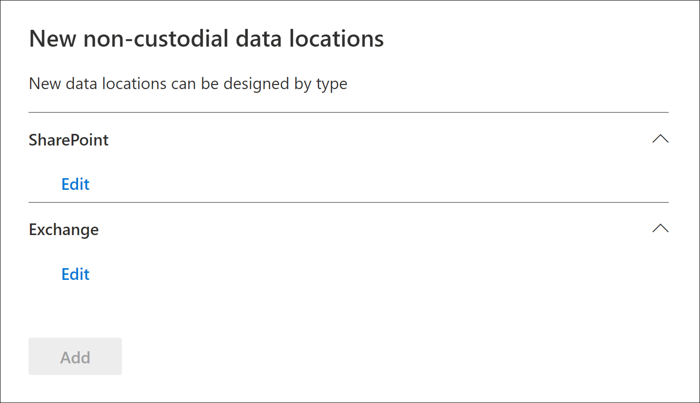
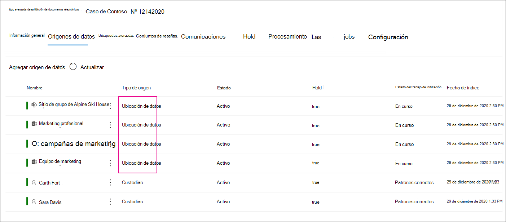

# Agregar orígenes de datos sin custodia a un Advanced eDiscovery caso

En Advanced eDiscovery casos, no siempre satisface sus necesidades para asociar un origen de datos Microsoft 365 a un administrador en el caso. Sin embargo, es posible que deba asociar los datos con un caso para poder buscarlos, agregarlos a un conjunto de revisión y analizarlos y revisarlos. La característica de Advanced eDiscovery se  denomina orígenes de datos sin custodia y le permite agregar datos a un caso sin tener que asociarlos a un administrador. También aplica la misma funcionalidad de Advanced eDiscovery a los datos que no son custodia que están disponibles para los datos asociados con el administrador. Dos de las cosas más útiles que puede aplicar a los datos que no son custodia es colocarlos en espera y procesarlos mediante [la indización avanzada](indexing-custodian-data.md).

## Agregar un origen de datos sin custodia

Siga estos pasos para agregar y administrar orígenes de datos sin custodia en un Advanced eDiscovery caso.

1. En la **Advanced eDiscovery** principal, haga clic en el caso al que desea agregar los datos.

2. Haga clic en **la pestaña Orígenes de** datos y, a continuación, haga clic en Agregar origen de **datos** Agregar ubicaciones  >  **de datos**.

3. En la **página desplegable Nuevas ubicaciones** de datos no custodiales, elija los orígenes de datos que desea agregar al caso. Puede agregar varios buzones y sitios  expandiendo las secciones SharePoint o **Exchange** y, a continuación, haciendo clic en **Editar**.

   

   - **SharePoint:** haga clic **en Editar** para agregar sitios. Seleccione un sitio en la lista o puede buscar un sitio escribiendo la dirección URL del sitio en la barra de búsqueda. Seleccione los sitios que desea agregar como orígenes de datos que no son custodios y haga clic en **Agregar**.

   - **Exchange:** haga clic **en Editar** para agregar buzones. Escriba un nombre o alias (un mínimo de tres caracteres) en el cuadro de búsqueda de buzones o grupos de distribución. Seleccione los buzones que desea agregar como orígenes de datos no custodios y haga clic en **Agregar**.

   > [!NOTE]
   > Puede usar las secciones **SharePoint** y **Exchange** para agregar sitios y buzones asociados con un grupo de servidores o Yammer como orígenes de datos sin custodia. Debe agregar por separado el buzón y el sitio asociados con un grupo de Yammer grupo.

4. Después de agregar orígenes de datos sin custodia, tiene la opción de poner esas ubicaciones en espera o no. Active o anule la selección **de la casilla De** retención situada junto al origen de datos para colocarla en espera.

5. Haga **clic en** Agregar en la parte inferior de la página desplegable Nuevas ubicaciones de datos no **custodiales** para agregar los orígenes de datos al caso.

   Cada origen de datos no custodiado que agregó aparece en la **página Orígenes de** datos. Los orígenes de datos que no son custodiados se identifican mediante el **valor Ubicación de** datos en la columna Tipo **de** origen.

   

Después de agregar orígenes de datos no custodiales al caso, se crea un trabajo denominado  *Reindexing non-custodial data* y se muestra en la pestaña Trabajos del caso. Una vez creado el trabajo, se inicia el proceso de indización avanzada y se vuelve a indizar los orígenes de datos.

## Administrar la retención de orígenes de datos sin custodia

Después de realizar una retención en un origen de datos sin custodia, se crea automáticamente una directiva de retención que contiene los orígenes de datos sin custodia para el caso. Al poner otros orígenes de datos no custodiados en espera, se agregan a esta directiva de retención.

1. Abra el Advanced eDiscovery y seleccione la **pestaña** Retención.

2. Haga **clic en \<GUID\> NCDSHold-**, donde el valor GUID es único para el caso.

   La página desplegable muestra información y estadísticas sobre los orígenes de datos no custodiados en espera.

   

3. Haga **clic en** Editar retención para ver los orígenes de datos que no son custodiados y realizar las siguientes tareas de administración:

   - En la **página** Ubicaciones, puede liberar un origen de datos sin custodia quitándoselo de la retención. Liberar un origen de datos no quita el origen de datos que no es custodia del caso. Solo quita la retención que se colocó en el origen de datos.

   - En la **página** Consulta, puede editar la retención para crear una retención basada en consultas que se aplique a todos los orígenes de datos que no son custodia en el caso.
