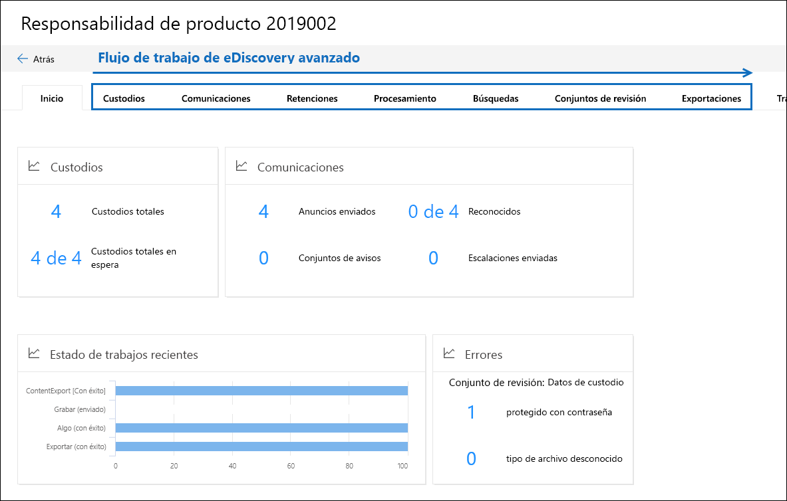

# Información general sobre la solución de exhibición de documentos electrónicos avanzada en Microsoft 365Overview of the Advanced eDiscovery solution in Microsoft 365

La solución Advanced eDiscovery de Microsoft 365 se basa en las capacidades existentes de eDiscovery y de análisis en Office 365.The Advanced eDiscovery solution in Microsoft 365 builds on the existing eDiscovery and analytics capabilities in Office 365. Esta nueva solución, denominada *exhibición avanzada*de documentos electrónicos, proporciona un flujo de trabajo de un extremo a otro para preservar, recopilar, revisar, analizar y exportar contenido que responde a las investigaciones internas y externas de la organización.This new solution, called *Advanced eDiscovery*, provides an end-to-end workflow to preserve, collect, review, analyze, and export content that's responsive to your organization's internal and external investigations. También permite a los equipos jurídicos administrar todo el flujo de trabajo de notificación de retención legal para comunicarse con los administradores involucrados en un caso.It also lets legal teams manage the entire legal hold notification workflow to communicate with custodians involved in a case. 

## Alineación con EDRMAlignment with EDRM

El flujo de trabajo integrado de eDiscovery avanzado se alinea con el proceso de eDiscovery descrito por el modelo de referencia de detección electrónica (EDRM).The built-in workflow of Advanced eDiscovery aligns with the eDiscovery process outlined by the Electronic Discovery Reference Model (EDRM). 

(Origen de la imagen por cortesía de edrm.net.(Image source courtesy of edrm.net. La imagen de origen estaba disponible en la licencia no desported de Creative Commons Atribution 3,0.)The source image was made available under Creative Commons Attribution 3.0 Unported License.)

En un nivel alto, a continuación se muestra cómo la exhibición avanzada de documentos electrónicos admite el flujo de trabajo EDRM:At a high level, here's how Advanced eDiscovery supports the EDRM workflow:

- **Determinación.****Identification.** Después de identificar las posibles personas de interés en una investigación, puede agregarlas como custodios (también denominadas *custodios de datos*, ya que pueden tener información relevante para la investigación) a un caso avanzado de eDiscovery.After you identify potential persons of interest in an investigation, you can add them as custodians (also called *data custodians*, because they may possess information that's relevant to the investigation) to an Advanced eDiscovery case. Una vez que los usuarios se agregan como custodios, es fácil preservar, recopilar y revisar los documentos de custodios.After users are added as custodians, it's easy to preserve, collect, and review custodian documents.

- **Buena.****Preservation.** Para preservar y proteger los datos relevantes para una investigación, eDiscovery avanzado le permite realizar una retención legal en los orígenes de datos asociados con los custodios en un caso.To preserve and protect data that's relevant to an investigation, Advanced eDiscovery lets you place a legal hold on the data sources associated with the custodians in a case. También puede poner los datos que no son de Private en espera.You can also place non-custodial data on hold. EDiscovery avanzado también tiene un flujo de trabajo de comunicaciones integrado para que pueda enviar notificaciones de retención legal a los custodios y realizar un seguimiento de sus confirmaciones.Advanced eDiscovery also has a built-in communications workflow so you can send legal hold notifications to custodians and track their acknowledgments.

- **Colección.****Collection.** Después de identificar (y conservar) los orígenes de datos relevantes para la investigación, puede usar la herramienta de búsqueda integrada en la búsqueda avanzada de exhibición de documentos electrónicos y recopilar datos activos de los orígenes de datos de Private (y de los orígenes de datos que no sean de privación, si procede) que puede ser relevante para el caso.After you identified (and preserved) the data sources relevant to the investigation, you can use the built-in search tool in Advanced eDiscovery search for and collect live data from the custodial data sources (and non-custodial data sources, if applicable) that may be relevant to the case.

- **Procesar.****Processing.** Una vez que haya recopilado todos los datos relevantes para el caso, el paso siguiente es procesarlo para su posterior revisión y análisis.After you've collected all data relevant to the case, the next step is process it for further review and analysis. En la exhibición avanzada de documentos electrónicos, los datos locales que identificó en la fase de recopilación se copian en una ubicación de Azure Storage (denominada un *conjunto de revisión*), que proporciona una vista estática de los datos de caso.In Advanced eDiscovery, the in-place data that you identified in the collection phase is copied to an Azure Storage location (called a *review set*), which provides you with a static view of the case data. 
 
- **Comprueba.****Review.** Una vez agregados los datos a un conjunto de revisión, puede ver documentos específicos y ejecutar otras consultas para reducir los datos a lo que sea más importante para el caso.After data has been added to a review set, you can view specific documents and run another queries to reduce the data to what is most relevant to the case. Además, puede anotar y etiquetar documentos específicos.Also, can annotate and tag specific documents.
 
- **Analice.****Analysis.** EDiscovery avanzado ofrece una herramienta de análisis integrada que le ayuda a agregar más datos del conjunto de revisión que usted determina que no es relevante para la investigación.Advanced eDiscovery provides integrated analytics tool that helps you further cull data from the review set that you determine isn't relevant to the investigation. Además de reducir el volumen de datos relevantes, la exhibición avanzada de documentos electrónicos también le ayuda a ahorrar costos legales de revisión permitiéndole organizar el contenido para que el proceso de revisión sea más fácil y eficaz.In addition to reducing the volume of relevant data, Advance eDiscovery also helps you save legal review costs by letting you organize content to make the review process easier and more efficient.

- **Producción** y **presentación.****Production** and **Presentation.** Cuando esté listo, puede exportar documentos de un conjunto de revisiones para revisión legal.When you're ready, you can export documents from a review set for legal review. Puede exportar documentos en su formato nativo o en un formato especificado por el EDRM para que se puedan importar en aplicaciones de revisión de terceros.You can export documents in their native format or in an EDRM-specified format so they can be imported into third-party review applications.

## Flujo de trabajo avanzado de eDiscoveryAdvanced eDiscovery workflow

En las secciones siguientes se describe cada paso del flujo de trabajo integrado en eDiscovery avanzado.The following sections describe each step in the built-in workflow in Advanced eDiscovery. En la siguiente captura de pantalla se muestra la pestaña **Inicio** de un caso denominado *pasivo del producto 2019002*.The following screenshot shows the **Home** tab of a case named *Product Liability 2019002*. Nota las pestañas de flujo de trabajo en la parte superior de la página se ordenan para alinearse con el proceso EDRM.Note the workflow tabs at the top of the page are sequenced to align with the EDRM process. 

Para obtener más información acerca del flujo de trabajo de un extremo a otro en la exhibición avanzada de documentos electrónicos, vea este [vídeo de Microsoft](https://go.microsoft.com/fwlink/?linkid=2066133).For more information about the end-to-end workflow in Advanced eDiscovery, see this [Microsoft Mechanics video](https://go.microsoft.com/fwlink/?linkid=2066133). 

## Administración de custodiosManaging custodians

Use la ficha **custodios** para agregar y administrar las personas que ha identificado como personas de interés en el caso.Use the **Custodians** tab to add and manage the people that you've identified as persons of interest in the case. Al agregar custodios, puede realizar rápidamente acciones relacionadas con el custodio, como colocar una retención legal en fuentes de datos de custodios, comunicarse con custodios y buscar fuentes de datos de custodios para recopilar contenido relevante para el caso.When you add custodians, you can quickly perform custodian-related actions like placing a legal hold on custodian data sources, communicating with custodians, and searching custodian data sources to collect content that's relevant to the case. A medida que avanza el caso, es fácil agregar custodios nuevos o liberar los custodios del caso.As the case progresses, it's easy to add new custodians or release custodians from the case. Para obtener más información, consulte [work with custodios in Advanced eDiscovery](managing-custodians.md).For more information, see [Work with custodians in Advanced eDiscovery](managing-custodians.md).

## Administración de notificaciones de retención legalManaging legal hold notifications

Use la pestaña **comunicaciones** para administrar el proceso de comunicación con los custodios en el caso.Use the **Communications** tab to manage the process of communicating with the custodians in the case. Un aviso de suspensión legal instruye a los custodios para que conserven el contenido relevante para el caso.A legal hold notice instructs custodians to preserve any content that's relevant to the case. Los equipos jurídicos deben ser capaces de realizar un seguimiento de los avisos recibidos, leídos y reconocidos por los custodios.Legal teams must be able to track the notices that have been received, read, and acknowledged by custodians. El flujo de trabajo de comunicaciones en eDiscovery avanzado permite crear y enviar notificaciones iniciales, recordatorios, avisos de versión y escalamientos si los custodios no reconocen una notificación de retención.The communications workflow in Advanced eDiscovery allows you to create and send initial notifications, reminders, release notices, and escalations if custodians fail to acknowledge a hold notification. Para obtener más información, consulte [trabajar con comunicaciones en la exhibición avanzada de](managing-custodian-communications.md)documentos electrónicos.For more information, see [Work with communications in Advanced eDiscovery](managing-custodian-communications.md).

## Administración de la conservación de contenidoManaging content preservation

Cuando agrega un custodio a un caso, puede poner una retención en los datos de Private.When you add a custodian to a case, you can place a hold on custodial data. Use la pestaña **suspensiones** para administrar la suspensión creada al agregar custodios y para administrar otras retenciones legales asociadas con el caso; por ejemplo, puede identificar y poner una retención en orígenes de datos que no sean de Private.Use the **Holds** tab to manage the hold created when you add custodians, and to manage other legal holds associated with the case; for example, you can identify and place a hold on non-custodial data sources. También puede editar cualquier suspensión en el caso y convertirlo en una retención basada en consulta para conservar solo el contenido que coincida con la consulta.You can also edit any hold in the case and make it a query-based hold to preserve only the content that matches the query. Por ejemplo, puede Agregar un intervalo de fechas a la suspensión para que solo se conserve el contenido creado en un intervalo de fechas específico.For example, you could add a date range to the hold so that only content created within a specific date ranged in preserved. También puede obtener estadísticas de contenido que está en suspensión, quitar la retención después de que ya no sea relevante para el caso o eliminarla.You can also get statistics on content that's on hold, remove the hold after it's no longer relevant to the case, or delete it. Para obtener más información, consulte [Administrar suspensiones en EDiscovery avanzado](managing-holds.md).For more information, see [Manage holds in Advanced eDiscovery](managing-holds.md).

## Indización de datos del custodioIndexing custodian data

Cuando se agrega un custodio y los orígenes de datos Private correspondientes a un caso, cualquier elemento parcialmente indizado de un origen de datos de custodio se vuelve a indexar mediante un proceso denominado *indización avanzada*.When you add a custodian and the corresponding custodial data sources to a case, any partially indexed item from a custodian data source is re-indexed by a process called *Advanced indexing*. Esto permite que el contenido de apoyo como imágenes, tipos de archivo no admitidos y otro contenido no indexado se pueda buscar por completo al ejecutar búsquedas para recopilar datos en el caso.This allows custodial content such as images, unsupported file types, and other potentially unindexed content to be fully searchable when you run searches to collect data for the case. Use la ficha **procesamiento** para supervisar el estado de la indización avanzada y corregir los errores de procesamiento mediante un proceso denominado *corrección de errores*.Use the **Processing** tab to monitor the status of Advanced indexing and fix processing errors by using a process called *error remediation*. Para obtener más información, vea [corregir errores de procesamiento en la exhibición avanzada de](processing-data-for-case.md)documentos electrónicos.For more information, see [Fix processing errors in Advanced eDiscovery](processing-data-for-case.md).

## Recopilar datos de casosCollecting case data

Use la ficha **búsquedas** para crear búsquedas para buscar en los orígenes de datos de la custodia y no Private en Office 365 el contenido relevante para el caso.Use the **Searches** tab to create searches to search the in-place custodial and non-custodial data sources in Office 365 for content relevant to the case. Puede crear y ejecutar búsquedas basadas en consultas (usando palabras clave y condiciones) para identificar un conjunto de mensajes de correo electrónico y documentos que sean relevantes para el caso y que desee revisar y analizar en los siguientes pasos del flujo de trabajo de eDiscovery.You can create and run query-based searches (using keywords and conditions) to identify a set of email messages and documents that are relevant to the case and that you want to further review and analyze in subsequent steps in the eDiscovery workflow. Puede crear una o más búsquedas asociadas con el caso.You can create one or more searches associated with the case. También puede usar la herramienta de búsqueda para obtener una vista previa de los documentos de ejemplo y ver estadísticas de búsqueda para ayudarle a refinar y mejorar los resultados de la búsqueda.You can also use the search tool to preview sample documents and view search statistics to help you refine and improve the search results. Una vez que haya comprobado que los resultados de la búsqueda contienen todos los datos relevantes para el caso, agregue los resultados de la búsqueda a un conjunto de revisión para la revisión, el análisis y la selección adicionales.After you're satisfied the search results contain the all data relevant to the case, you add the search results to a review set for further review, analysis, and culling. Para obtener más información, vea [recopilar datos para un caso en EDiscovery avanzado](collecting-data-for-ediscovery.md).For more information, see [Collect data for a case in Advanced eDiscovery](collecting-data-for-ediscovery.md).

## Revisión y análisis de datos de casosReviewing and analyzing case data

Use la pestaña **conjuntos de revisiones** para revisar y analizar el contenido que ha recopilado desde el sistema activo y que se ha agregado a un conjunto de revisión.Use the **Review sets** tab to review and analyze the content that you've collected from the live system and added to a review set. Un *conjunto de revisiones* es una colección estática de los datos (es decir, una copia sin conexión de datos) de los datos de Private (y, si procede, de datos no de Private) que haya recopilado en la fase anterior del flujo de trabajo de eDiscovery.A *review set* is a static collection of that data (in other words, an offline copy of data) of custodial data (and if applicable, non-custodial data) that you collected in the previous phase of the eDiscovery workflow. Cuando se agregan los resultados de la búsqueda a un conjunto de revisión, se desencadena un proceso que extrae los archivos de los contenedores, extrae los metadatos y extrae el texto.When you add search results to a review set, a process is triggered that extracts files from containers, extracts metadata, and extracts text. Cuando se completa este proceso, el sistema crea un nuevo índice de todos los datos recopilados por los custodios y los agrega al conjunto de revisión.When this process is complete, the system builds a new index of all the data collected from custodians and adds it to the review set. Una vez que los datos se agregan al conjunto de revisión, puede ejecutar más consultas para acotar los datos de mayúsculas y minúsculas, ver datos como texto o en el formato de archivo nativo, y anotar, censurar y etiquetar documentos en el conjunto de revisión.After the data is added to the review set, you can run more queries to narrow the case data, view data as text or in the native file format, and annotate, redact, and tag documents in the review set. También puede realizar análisis avanzados, como identificar la duplicación de documentos, los subprocesos de correo electrónico y los temas.You can also perform advanced analytics such as identify document duplication, email threading, and themes. Una vez que haya seleccionado los datos solo para lo que sea relevante para el caso, puede descargar los documentos directamente o exportarlos junto con los metadatos de archivo, las anotaciones y cualquier etiqueta.After you've culled the data to only what is relevant to the case, you can either download documents directly or export them along with file metadata, annotations, and any tags. Para obtener más información, vea:For more information, see:

- [Ver documentos de un conjunto de revisiónView documents in a review set](view-documents-in-review-set.md)

- [Consultar los datos de un conjunto de revisiónQuery the data in a review set](review-set-search.md)

- [Etiquetar documentos en un conjunto de revisiónTag documents in a review set](tagging-documents.md)

- [Analizar datos en un conjunto de revisiónAnalyze data in a review set](analyzing-data-in-review-set.md)

## Exportar datos para revisión y presentaciónExporting data for review and presentation

Después de exportar los datos de un conjunto de revisión, use la pestaña **exportaciones** para administrar un trabajo de exportación y descargar datos de un conjunto de revisión.After you export the data from a review set, use the **Exports** tab to manage an export job and download data from a review set. Al exportar un conjunto de revisión, los datos se cargan en una ubicación de almacenamiento de Azure proporcionada por Microsoft (o en una ubicación de almacenamiento de Azure administrada por la organización).When you export a review set, the data is uploaded to a Microsoft-provided Azure Storage location (or an Azure Storage location managed by your organization). Una vez que se carga en Azure, es posible descargarla en un equipo local.After it's uploaded to Azure, it's then and available to download to a local computer. Puede obtener la clave de evaluación de almacenamiento necesaria para descargar los datos exportados en la pestaña **exportaciones** . Para obtener más información, vea [exportar datos de casos en EDiscovery avanzado](exporting-data-ediscover20.md).You can obtain the storage assess key necessary to download the exported data on the **Exports** tab. For more information, see [Export case data in Advanced eDiscovery](exporting-data-ediscover20.md).

## Administración de trabajosManaging jobs

Use la ficha **trabajos** para supervisar procesos de ejecución prolongada para las tareas relacionadas con casos que haya iniciado.Use the **Jobs** tab to monitor long-running processes for case-related tasks that you've initiated. Algunos ejemplos de trabajos son los relacionados con la reindización, la búsqueda y la exportación de datos de casos.Examples of jobs include ones related to reindexing, searching, and exporting case data. Por ejemplo, si crea una búsqueda en la ficha **búsquedas** que incluye muchos orígenes de datos, el estado de este proceso de búsqueda se mostrará en la ficha **trabajos** . Para obtener más información, consulte [administrar trabajos en EDiscovery avanzado](managing-jobs-ediscovery20.md).For example, if you create a search on the **Searches** tab that includes many data sources, the status of this search process will be displayed on the **Jobs** tab. For more information, see [Manage jobs in Advanced eDiscovery](managing-jobs-ediscovery20.md).

## Configuración de los casosConfiguring case settings

Use la pestaña **configuración** para establecer la configuración de casos.Use the **Settings** tab to configure case-wide settings. Esto incluye agregar miembros a un caso, cerrar o eliminar un caso y configurar las opciones de búsqueda y análisis.This includes adding members to a case, closing or deleting a case, and configuring search and analytics settings.

## Informes avanzados de eDiscoveryAdvanced eDiscovery reports

Puede usar los informes avanzados de exhibición de documentos electrónicos de la Página principal para ayudar a su organización a realizar un seguimiento de la actividad y el estado en todos los casos avanzados de eDiscovery.You can use the Advanced eDiscovery reports on the home page to help your organization track activity and status across all Advanced eDiscovery cases. La característica Advanced eDiscovery Reports agrega información sobre casos, custodios, orígenes de datos y comunicaciones.The Advanced eDiscovery reports feature aggregates information about cases, custodians, data sources, and communications. Puede filtrar los datos del informe basándose en varios criterios y exportar la información agregada a un archivo CSV para un análisis posterior.You can filter the report data based on various criteria and export the aggregated information to a CSV file for further analysis.  Para obtener más información, consulte [Advanced eDiscovery Reports](advanced-ediscovery-reports.md).For more information, see [Advanced eDiscovery reports](advanced-ediscovery-reports.md).
