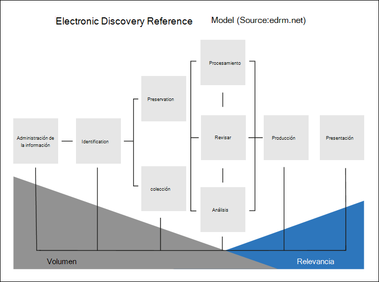

# Información general sobre Microsoft 365 Advanced eDiscoveryOverview of Microsoft 365 Advanced eDiscovery

La Advanced eDiscovery en Microsoft 365 se basa en las capacidades de análisis y exhibición de documentos electrónicos de Microsoft existentes.The Advanced eDiscovery solution in Microsoft 365 builds on the existing Microsoft eDiscovery and analytics capabilities. Advanced eDiscovery proporciona un flujo de trabajo completo para conservar, recopilar, analizar, revisar y exportar contenido que responda a las investigaciones internas y externas de su organización.Advanced eDiscovery provides an end-to-end workflow to preserve, collect, analyze, review, and export content that's responsive to your organization's internal and external investigations. También permite al equipo legal gestionar todo el flujo de trabajo de notificación de retención legal para comunicarse con los administradores de un caso.It also lets legal teams manage the entire legal hold notification workflow to communicate with custodians involved in a case.

## Advanced eDiscovery capacidadesAdvanced eDiscovery capabilities

Advanced eDiscovery puede ayudar a su organización a responder a asuntos legales o investigaciones internas mediante el descubrimiento de datos donde vive.Advanced eDiscovery can help your organization respond to legal matters or internal investigations by discovering data where it lives. Puede administrar sin problemas flujos de trabajo de exhibición de documentos electrónicos mediante la identificación de personas de interés y sus orígenes de datos, aplicar retención sin problemas para conservar los datos y, a continuación, administrar el proceso de comunicación de retención legal.You can seamlessly manage eDiscovery workflows by identifying persons of interest and their data sources, seamlessly apply holds to preserve data, and then manage the legal hold communication process. Al recopilar datos del origen, puede buscar en la plataforma de búsqueda Microsoft 365 para encontrar rápidamente lo que necesita.By collecting data from the source, you can search the live Microsoft 365 platform to quickly find what you need. Las capacidades inteligentes de aprendizaje automático, como la indización profunda, el subproceso de correo electrónico y la detección de duplicados cercanos también le ayudan a reducir grandes volúmenes de datos a un conjunto de datos relevante.Intelligent, machine learning capabilities such as deep indexing, email threading, and near duplicate detection also help you reduce large volumes of data to a relevant data set.

En las secciones siguientes se describe cómo estas Advanced eDiscovery pueden ayudar a su organización.The following sections describe how these Advanced eDiscovery capabilities can help your organization.

### Detectar y recopilar datos en el lugarDiscover and collect data in-place

Tradicionalmente, las organizaciones que dependen de varias soluciones de exhibición de documentos electrónicos de terceros requieren copiar grandes volúmenes de datos fuera de Microsoft 365 para procesar y tener que hospedar datos duplicados.Traditionally, organizations that rely on multiple third-party eDiscovery solutions require copying large volumes of data out of Microsoft 365 to process and having to host duplicate data. Esta necesidad aumenta el tiempo para encontrar datos relevantes y el riesgo, costo y complejidad de administrar varias soluciones.This necessity increases the time to find relevant data and the risk, cost, and complexity of managing multiple solutions.

Advanced eDiscovery en Microsoft 365 permite detectar datos en el origen y mantenerse dentro de los límites Microsoft 365 seguridad y cumplimiento.Advanced eDiscovery in Microsoft 365 lets you discover data at the source and staying within your Microsoft 365 security and compliance boundary.  Al recopilar datos en su lugar desde el sistema dinámico, Advanced eDiscovery reduce la fricción de volver al origen y reduce el trabajo innecesario de tener que buscar contenido que falta, lo que suele ocurrir cuando el registro en diario se abate en soluciones de exhibición de documentos electrónicos tradicionales.By collecting data in-place from the live system, Advanced eDiscovery reduces the friction of going back to the source and reduces unnecessary work of having to find missing content, which often happens when journaling lags in traditional eDiscovery solutions.

Las capacidades nativas de búsqueda y recopilación de datos en Teams, Yammer, SharePoint Online, OneDrive para la Empresa y Exchange Online mejora aún más la detección de datos.Native search and collection capabilities for data in Teams, Yammer, SharePoint Online, OneDrive for Business, and Exchange Online further enhances data discovery. Por ejemplo, Advanced eDiscovery:For example,  Advanced eDiscovery:

- Reconstruye Teams conversaciones (en lugar de devolver mensajes individuales de conversaciones).Reconstructs Teams conversations (instead of returning individual messages from conversations).

- Recopila contenido basado en la nube compartido con los usuarios mediante el uso de vínculos o datos adjuntos modernos en mensajes de correo electrónico y Teams chats.Collects cloud-based content shared with users by use of links or modern attachments in email message and Teams chats.

- Tiene compatibilidad integrada con cientos de tipos de Microsoft 365 no integrados.Has built-in support for hundreds of non-Microsoft 365 file types.

- Recopila datos de orígenes de terceros (como Bloomberg, Facebook, Slack y Reuniones de zoom) que los conectores de datos importan y archivan en Microsoft 365 de [datos.](archiving-third-party-data.md)Collects data from third-party sources (such as Bloomberg, Facebook, Slack, and Zoom Meetings) that's imported and archived in Microsoft 365 by [data connectors](archiving-third-party-data.md).

### Administrar el flujo de trabajo de exhibición de documentos electrónicos en una plataformaManage eDiscovery workflow in one platform

Advanced eDiscovery puede ayudarle a reducir el número de soluciones de exhibición de documentos electrónicos en las que necesita confiar.Advanced eDiscovery can help you reduce the number of eDiscovery solutions you need to rely on. Proporciona un flujo de trabajo sencillo y completo, todo lo que se produce en Microsoft 365.It provides a streamlined, end-to-end workflow, all which occurs within Microsoft 365. Advanced eDiscovery ayuda a reducir la fricción de identificar y recopilar posibles orígenes de información relevante asignando automáticamente orígenes de datos únicos y compartidos a la persona de interés (conocido como custodio) y proporcionando informes y análisis sobre datos potencialmente relevantes antes de recopilarlo para su análisis y *revisión.*Advanced eDiscovery helps reduce the friction of identifying and collecting potential sources of relevant information by automatically mapping unique and shared data sources to the person of interest (known as a *custodian*), and by providing reporting and analytics on potentially relevant data prior to collecting it for analysis and review.

Además, las API Graph Microsoft pueden ayudarle a automatizar el flujo de trabajo de exhibición de documentos electrónicos y ampliar Advanced eDiscovery soluciones personalizadas.Additionally, Microsoft Graph APIs can help you automate the eDiscovery workflow and extend Advanced eDiscovery for custom solutions.

### Datos Cull de forma inteligenteCull data intelligently

Las capacidades de aprendizaje automático inteligentes Advanced eDiscovery le ayudarán a reducir la cantidad de datos que se revisarán.Intelligent, machine learning capabilities in Advanced eDiscovery help you reduce the amount of data to review. Estas funcionalidades inteligentes le ayudan a reducir y reducir grandes volúmenes de datos a un conjunto relevante.These intelligent capabilities help you reduce and cull large volumes of data to a relevant set. Por ejemplo, una consulta de conjunto de revisión integrada ayuda a filtrar solo por contenido único mediante la identificación de duplicados cercanos.For example, a built-in review set query helps filter only for unique content by identifying near duplicates. Esta funcionalidad puede reducir considerablemente la cantidad de datos que se revisarán.This capability can substantially reduce the amount of data to review.

Las capacidades adicionales de aprendizaje automático pueden refinar e identificar los datos relevantes mediante etiquetas inteligentes y herramientas de revisión asistida por tecnología, como los módulos relevancia.Additional machine learning capabilities can further refine and identify relevant data using smart tags and technology assisted review tools like the Relevance modules.

## Advanced eDiscovery alineación con el modelo de referencia de detección electrónicaAdvanced eDiscovery alignment with the Electronic Discovery Reference Model

El flujo de trabajo integrado de Advanced eDiscovery en Microsoft 365 se alinea con el proceso de exhibición de documentos electrónicos descrito por el Modelo de referencia de detección electrónica (EDRM).The built-in workflow of Advanced eDiscovery in Microsoft 365 aligns with the eDiscovery process outlined by the Electronic Discovery Reference Model (EDRM).

(Origen de la imagen cortesía de edrm.net.(Image source courtesy of edrm.net. La imagen de origen estaba disponible en Creative Commons Attribution 3.0 Unported License).)The source image was made available under Creative Commons Attribution 3.0 Unported License.)

A grandes rasgos, así es como eDiscovery avanzado apoya el flujo de trabajo de EDRM:At a high level, here's how Advanced eDiscovery supports the EDRM workflow:

- **Identificación.****Identification.** Una vez identificadas las posibles personas de interés en una investigación, puede añadirlas como custodios (también llamados *custodios de datos*, porque pueden poseer información relevante para la investigación) a un caso de eDiscovery avanzado.After you identify potential persons of interest in an investigation, you can add them as custodians (also called *data custodians*, because they may possess information that's relevant to the investigation) to an Advanced eDiscovery case. Una vez añadidos los usuarios como custodios, es fácil conservar, recopilar y revisar los documentos de los custodios.After users are added as custodians, it's easy to preserve, collect, and review custodian documents.

- **Conservación.****Preservation.** Para preservar y proteger los datos que son relevantes para una investigación, eDiscovery avanzado le permite colocar una retención legal en las fuentes de datos asociadas con los custodios de un caso.To preserve and protect data that's relevant to an investigation, Advanced eDiscovery lets you place a legal hold on the data sources associated with the custodians in a case. También puede poner en espera los datos no custodiados.You can also place non-custodial data on hold. eDiscovery avanzado también cuenta con un flujo de trabajo de comunicaciones integrado para que pueda enviar notificaciones de retención legal a los custodios y realizar un seguimiento de sus acuses de recibo.Advanced eDiscovery also has a built-in communications workflow so you can send legal hold notifications to custodians and track their acknowledgments.

- **Colección.****Collection.** Una vez identificadas (y conservadas) las fuentes de datos relevantes para la investigación, puede utilizar la herramienta de búsqueda integrada en eDiscovery avanzado para buscar y recopilar datos vivos de las fuentes de datos custodiados (y de las fuentes de datos no custodiados, si procede) que puedan ser relevantes para el caso.After you identified (and preserved) the data sources relevant to the investigation, you can use the built-in search tool in Advanced eDiscovery search for and collect live data from the custodial data sources (and non-custodial data sources, if applicable) that may be relevant to the case.

- **Procesamiento.****Processing.** Una vez recopilados todos los datos relevantes para el caso, el siguiente paso es procesarlos para su posterior revisión y análisis.After you've collected all data relevant to the case, the next step is process it for further review and analysis. En eDiscovery avanzado, los datos in situ que identificó en la fase de recopilación se copian en una ubicación de Azure Storage (denominada *conjunto de revisión*), que le proporciona una vista estática de los datos del caso.In Advanced eDiscovery, the in-place data that you identified in the collection phase is copied to an Azure Storage location (called a *review set*), which provides you with a static view of the case data. 

- **Revisar.****Review.** Después de agregar datos a un conjunto de revisión, puede ver documentos específicos y ejecutar consultas adicionales para reducir los datos a lo que es más relevante para el caso.After data has been added to a review set, you can view specific documents and run additional queries to reduce the data to what is most relevant to the case. Además, puede anotar y etiquetar documentos específicos.Also, can annotate and tag specific documents.

- **Análisis.****Analysis.** eDiscovery avanzado proporciona una herramienta de análisis integrada que le ayuda a eliminar los datos del conjunto de revisiones que determine que no son relevantes para la investigación.Advanced eDiscovery provides integrated analytics tool that helps you further cull data from the review set that you determine isn't relevant to the investigation. Además de reducir el volumen de datos relevantes, eDiscovery avanzado también le ayuda a ahorrar costes de revisión legal al permitirle organizar el contenido para que el proceso de revisión sea más fácil y eficiente.In addition to reducing the volume of relevant data, Advance eDiscovery also helps you save legal review costs by letting you organize content to make the review process easier and more efficient.

- **Producción** y **presentación.****Production** and **Presentation.** Cuando esté listo, puede exportar los documentos de un conjunto de revisión para su revisión legal.When you're ready, you can export documents from a review set for legal review. Puede exportar los documentos en su formato nativo o en un formato especificado por EDRM para poder importarlos en aplicaciones de revisión de terceros.You can export documents in their native format or in an EDRM-specified format so they can be imported into third-party review applications.

## Suscripciones y licenciasSubscriptions and licensing

Las licencias Advanced eDiscovery requieren la suscripción de la organización adecuada y las licencias por usuario.Licensing for Advanced eDiscovery requires the appropriate organization subscription and per-user licensing.

- **Suscripción a la organización:** Para obtener Advanced eDiscovery en el centro Microsoft 365 cumplimiento, la organización debe tener uno de los siguientes elementos:**Organization subscription:** To access Advanced eDiscovery in the Microsoft 365 compliance center, your organization must have one of the following:

  - Suscripciones a Microsoft 365 E5 u Office 365 E5.Microsoft 365 E5 or Office 365 E5 subscription
  
  - Suscripción a Microsoft 365 E3 con complemento de cumplimiento E5Microsoft 365 E3 subscription with E5 Compliance add-on

  - Microsoft 365 E3 suscripción con el complemento E5 eDiscovery and AuditMicrosoft 365 E3 subscription with E5 eDiscovery and Audit add-on

  - Microsoft 365 Educación Suscripción A5 o Office 365 Educación A5Microsoft 365 Education A5 or Office 365 Education A5 subscription

   Si no tiene un plan de Microsoft 365 E5 existente y desea probar Advanced eDiscovery, puede agregar [Microsoft 365](https://docs.microsoft.com/office365/admin/try-or-buy-microsoft-365) [a](https://www.microsoft.com/microsoft-365/enterprise) su suscripción existente o registrarse para una prueba de Microsoft 365 E5.If you don't have an existing Microsoft 365 E5 plan and want to try Advanced eDiscovery, you can [add Microsoft 365](https://docs.microsoft.com/office365/admin/try-or-buy-microsoft-365) to your existing subscription or [sign up for a trial](https://www.microsoft.com/microsoft-365/enterprise) of Microsoft 365 E5.

- **Licencias por usuario:** Para agregar un usuario como custodio en un caso de exhibición de documentos electrónicos avanzados, ese usuario debe tener asignada una de las siguientes licencias, según la suscripción de la organización:**Per-user licensing:** To add a user as a custodian in an Advance eDiscovery case, that user must be assigned one of the following licenses, depending on your organization subscription:

  - Microsoft 365: a los usuarios se les debe asignar una licencia de Microsoft 365 E5, una licencia de complemento de cumplimiento de E5 o una licencia de complemento E5 eDiscovery and Audit.Microsoft 365: Users must be assigned a Microsoft 365 E5 license, an E5 Compliance add-on license, or an E5 eDiscovery and Audit add-on license. Microsoft 365 Educación los usuarios deben tener asignada una licencia A5.Microsoft 365 Education users must be assigned an A5 license.

  - Office 365: se debe asignar a los usuarios Office 365 una licencia de E5 Office 365 Educación A5.Office 365: Users must be assigned an Office 365 E5 or Office 365 Education A5 license.

   Para obtener información sobre cómo asignar licencias, vea [Asignar licencias a usuarios.](https://docs.microsoft.com/microsoft-365/admin/manage/assign-licenses-to-users)For information about how to assign licenses, see [Assign licenses to users](https://docs.microsoft.com/microsoft-365/admin/manage/assign-licenses-to-users).

> [!NOTE]
> Los usuarios solo necesitan una licencia E5 o A5 (o la licencia de complemento adecuada) para agregarse como custodios a un Advanced eDiscovery caso.Users only need an E5 or A5 license (or the appropriate add-on license) to be added as custodians to an Advanced eDiscovery case. Los administradores de TI, administradores de exhibición de documentos electrónicos, abogados, asistentes legales o investigadores que usan Advanced eDiscovery para administrar casos y revisar datos de casos no necesitan una licencia de E5, A5 o complemento.IT admins, eDiscovery managers, lawyers, paralegals, or investigators who use Advanced eDiscovery to manage cases and review case data don't need an E5, A5, or add-on license.

## Introducción a eDiscovery avanzadoGet started with Advanced eDiscovery

Hay dos pasos rápidos y fáciles para empezar con Advanced eDiscovery.There are two quick and easy steps to get started with Advanced eDiscovery.

|PasosSteps  |DescripciónDescription  |
|:---------|:---------|
|[Configurar eDiscovery avanzadoSet up Advanced eDiscovery](get-started-with-advanced-ediscovery.md)| Después de comprobar los requisitos de suscripción y licencias, puede asignar permisos y configurar la configuración de toda la organización para empezar a usar Advanced eDiscovery.After verifying the subscription and licensing requirements, you can assign permissions and configure organization-wide settings to get started using Advanced eDiscovery.|
|[Crear y administrar casosCreate and manage cases](create-and-manage-advanced-ediscoveryv2-case.md) | Cree casos para administrar el flujo Advanced eDiscovery de trabajo para todos los tipos de investigaciones legales y de otro tipo de la organización.Create cases to manage the Advanced eDiscovery workflow for all legal and other types of investigations in your organization.|
|||

## Advanced eDiscovery arquitecturaAdvanced eDiscovery architecture

Este es un diagrama de arquitectura Advanced eDiscovery que muestra el flujo de trabajo de un extremo a otro en un entorno de una sola ubicación geográfica y en un entorno multigeografía, y el flujo de datos de un extremo a otro alineado con [EDRM.](#advanced-ediscovery-alignment-with-the-electronic-discovery-reference-model)Here's an Advanced eDiscovery architecture diagram that shows the end-to-end workflow in a single-geo environment and in a multi-geo environment, and the end-to-end data flow that's aligned with the [EDRM](#advanced-ediscovery-alignment-with-the-electronic-discovery-reference-model).

[Ver como una imagenView as an image](../media/solutions-architecture-center/m365-advanced-ediscovery-architecture.png)

[Descargar como archivo PDFDownload as a PDF file](https://download.microsoft.com/download/d/1/c/d1ce536d-9bcf-4d31-b75b-fcf0dc560665/m365-advanced-ediscovery-architecture.pdf)

[Descargar como archivo Visio archivoDownload as a Visio file](https://download.microsoft.com/download/d/1/c/d1ce536d-9bcf-4d31-b75b-fcf0dc560665/m365-advanced-ediscovery-architecture.vsdx)
