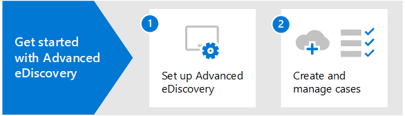

# Información general sobre Microsoft 365 Advanced eDiscovery

La Advanced eDiscovery en Microsoft 365 se basa en las capacidades de análisis y exhibición de documentos electrónicos de Microsoft existentes. Advanced eDiscovery proporciona un flujo de trabajo completo para conservar, recopilar, analizar, revisar y exportar contenido que responda a las investigaciones internas y externas de su organización. También permite al equipo legal gestionar todo el flujo de trabajo de notificación de retención legal para comunicarse con los administradores de un caso.

## Advanced eDiscovery capacidades

Advanced eDiscovery puede ayudar a su organización a responder a asuntos legales o investigaciones internas mediante el descubrimiento de datos donde vive. Puede administrar sin problemas flujos de trabajo de exhibición de documentos electrónicos mediante la identificación de personas de interés y sus orígenes de datos, aplicar retención sin problemas para conservar los datos y, a continuación, administrar el proceso de comunicación de retención legal. Al recopilar datos del origen, puede buscar en la plataforma de búsqueda Microsoft 365 para encontrar rápidamente lo que necesita. Las capacidades inteligentes de aprendizaje automático, como la indización profunda, el subproceso de correo electrónico y la detección de duplicados cercanos también le ayudan a reducir grandes volúmenes de datos a un conjunto de datos relevante.

En las secciones siguientes se describe cómo estas Advanced eDiscovery pueden ayudar a su organización.

### Detectar y recopilar datos en el lugar

Tradicionalmente, las organizaciones que dependen de varias soluciones de exhibición de documentos electrónicos de terceros requieren copiar grandes volúmenes de datos fuera de Microsoft 365 para procesar y tener que hospedar datos duplicados. Esta necesidad aumenta el tiempo para encontrar datos relevantes y el riesgo, costo y complejidad de administrar varias soluciones.

Advanced eDiscovery en Microsoft 365 permite detectar datos en el origen y mantenerse dentro de los límites Microsoft 365 seguridad y cumplimiento.  Al recopilar datos en su lugar desde el sistema dinámico, Advanced eDiscovery reduce la fricción de volver al origen y reduce el trabajo innecesario de tener que buscar contenido que falta, lo que suele ocurrir cuando el registro en diario se abate en soluciones de exhibición de documentos electrónicos tradicionales.

Las capacidades nativas de búsqueda y recopilación de datos en Teams, Yammer, SharePoint Online, OneDrive para la Empresa y Exchange Online mejora aún más la detección de datos. Por ejemplo, Advanced eDiscovery:

- Reconstruye Teams conversaciones (en lugar de devolver mensajes individuales de conversaciones).

- Recopila contenido basado en la nube compartido con los usuarios mediante el uso de vínculos o datos adjuntos modernos en mensajes de correo electrónico y Teams chats.

- Tiene compatibilidad integrada con cientos de tipos de Microsoft 365 no integrados.

- Recopila datos de orígenes de terceros (como Bloomberg, Facebook, Slack y Reuniones de zoom) que los conectores de datos importan y archivan en Microsoft 365 de [datos.](archiving-third-party-data.md)

### Administrar el flujo de trabajo de exhibición de documentos electrónicos en una plataforma

Advanced eDiscovery puede ayudarle a reducir el número de soluciones de exhibición de documentos electrónicos en las que necesita confiar. Proporciona un flujo de trabajo sencillo y completo, todo lo que se produce en Microsoft 365. Advanced eDiscovery ayuda a reducir la fricción de identificar y recopilar posibles orígenes de información relevante asignando automáticamente orígenes de datos únicos y compartidos a la persona de interés (conocido como custodio) y proporcionando informes y análisis sobre datos potencialmente relevantes antes de recopilarlo para su análisis y *revisión.*

Además, las API Graph Microsoft pueden ayudarle a automatizar el flujo de trabajo de exhibición de documentos electrónicos y ampliar Advanced eDiscovery soluciones personalizadas.

### Datos Cull de forma inteligente

Las capacidades de aprendizaje automático inteligentes Advanced eDiscovery le ayudarán a reducir la cantidad de datos que se revisarán. Estas funcionalidades inteligentes le ayudan a reducir y reducir grandes volúmenes de datos a un conjunto relevante. Por ejemplo, una consulta de conjunto de revisión integrada ayuda a filtrar solo por contenido único mediante la identificación de duplicados cercanos. Esta funcionalidad puede reducir considerablemente la cantidad de datos que se revisarán.

Las capacidades adicionales de aprendizaje automático pueden refinar e identificar los datos relevantes mediante etiquetas inteligentes y herramientas de revisión asistida por tecnología, como los módulos relevancia.

## Advanced eDiscovery alineación con el modelo de referencia de detección electrónica

El flujo de trabajo integrado de Advanced eDiscovery en Microsoft 365 se alinea con el proceso de exhibición de documentos electrónicos descrito por el Modelo de referencia de detección electrónica (EDRM).

(Origen de la imagen cortesía de edrm.net. La imagen de origen estaba disponible en Creative Commons Attribution 3.0 Unported License).)

A grandes rasgos, así es como eDiscovery avanzado apoya el flujo de trabajo de EDRM:

- **Identificación.** Una vez identificadas las posibles personas de interés en una investigación, puede añadirlas como custodios (también llamados *custodios de datos*, porque pueden poseer información relevante para la investigación) a un caso de eDiscovery avanzado. Una vez añadidos los usuarios como custodios, es fácil conservar, recopilar y revisar los documentos de los custodios.

- **Conservación.** Para preservar y proteger los datos que son relevantes para una investigación, eDiscovery avanzado le permite colocar una retención legal en las fuentes de datos asociadas con los custodios de un caso. También puede poner en espera los datos no custodiados. eDiscovery avanzado también cuenta con un flujo de trabajo de comunicaciones integrado para que pueda enviar notificaciones de retención legal a los custodios y realizar un seguimiento de sus acuses de recibo.

- **Colección.** Una vez identificadas (y conservadas) las fuentes de datos relevantes para la investigación, puede utilizar la herramienta de búsqueda integrada en eDiscovery avanzado para buscar y recopilar datos vivos de las fuentes de datos custodiados (y de las fuentes de datos no custodiados, si procede) que puedan ser relevantes para el caso.

- **Procesamiento.** Una vez recopilados todos los datos relevantes para el caso, el siguiente paso es procesarlos para su posterior revisión y análisis. En eDiscovery avanzado, los datos in situ que identificó en la fase de recopilación se copian en una ubicación de Azure Storage (denominada *conjunto de revisión*), que le proporciona una vista estática de los datos del caso. 

- **Revisar.** Después de agregar datos a un conjunto de revisión, puede ver documentos específicos y ejecutar consultas adicionales para reducir los datos a lo que es más relevante para el caso. Además, puede anotar y etiquetar documentos específicos.

- **Análisis.** eDiscovery avanzado proporciona una herramienta de análisis integrada que le ayuda a eliminar los datos del conjunto de revisiones que determine que no son relevantes para la investigación. Además de reducir el volumen de datos relevantes, eDiscovery avanzado también le ayuda a ahorrar costes de revisión legal al permitirle organizar el contenido para que el proceso de revisión sea más fácil y eficiente.

- **Producción** y **presentación.** Cuando esté listo, puede exportar los documentos de un conjunto de revisión para su revisión legal. Puede exportar los documentos en su formato nativo o en un formato especificado por EDRM para poder importarlos en aplicaciones de revisión de terceros.

## Suscripciones y licencias

Las licencias Advanced eDiscovery requieren la suscripción de la organización adecuada y las licencias por usuario.

- **Suscripción a la organización:** Para obtener Advanced eDiscovery en el Centro de cumplimiento de Microsoft 365, la organización debe tener uno de los siguientes elementos:

  - Suscripciones a Microsoft 365 E5 u Office 365 E5.
  
  - Suscripción a Microsoft 365 E3 con complemento de cumplimiento E5

  - Microsoft 365 E3 suscripción con el complemento E5 eDiscovery and Audit

  - Microsoft 365 Educación Suscripción A5 o Office 365 Educación A5

   Si no tiene un plan de Microsoft 365 E5 existente y desea probar Advanced eDiscovery, puede agregar [Microsoft 365](/office365/admin/try-or-buy-microsoft-365) [a](https://www.microsoft.com/microsoft-365/enterprise) su suscripción existente o registrarse para una prueba de Microsoft 365 E5.

- **Licencias por usuario:** Para agregar un usuario como custodio en un caso de exhibición de documentos electrónicos avanzados, ese usuario debe tener asignada una de las siguientes licencias, según la suscripción de la organización:

  - Microsoft 365: a los usuarios se les debe asignar una licencia de Microsoft 365 E5, una licencia de complemento de cumplimiento de E5 o una licencia de complemento E5 eDiscovery and Audit. Microsoft 365 Educación los usuarios deben tener asignada una licencia A5.

  - Office 365: se debe asignar a los usuarios una Office 365 E5 o Office 365 Educación de A5.

   Para obtener información sobre cómo asignar licencias, vea [Asignar licencias a usuarios.](/microsoft-365/admin/manage/assign-licenses-to-users)

> [!NOTE]
> Los usuarios solo necesitan una licencia E5 o A5 (o la licencia de complemento adecuada) para agregarse como custodios a un Advanced eDiscovery caso. Los administradores de TI, administradores de exhibición de documentos electrónicos, abogados, asistentes legales o investigadores que usan Advanced eDiscovery para administrar casos y revisar datos de casos no necesitan una licencia de E5, A5 o complemento.

## Introducción a eDiscovery avanzado

Hay dos pasos rápidos y fáciles para empezar con Advanced eDiscovery.

|Pasos  |Descripción  |
|:---------|:---------|
|[Configurar eDiscovery avanzado](get-started-with-advanced-ediscovery.md)| Después de comprobar los requisitos de suscripción y licencias, puede asignar permisos y configurar la configuración de toda la organización para empezar a usar Advanced eDiscovery.|
|[Crear y administrar casos](create-and-manage-advanced-ediscoveryv2-case.md) | Cree casos para administrar el flujo Advanced eDiscovery de trabajo para todos los tipos de investigaciones legales y de otro tipo de la organización.|
|||

## Advanced eDiscovery arquitectura

Este es un diagrama de arquitectura Advanced eDiscovery que muestra el flujo de trabajo de un extremo a otro en un entorno de una sola ubicación geográfica y en un entorno multigeografía, y el flujo de datos de un extremo a otro alineado con [EDRM.](#advanced-ediscovery-alignment-with-the-electronic-discovery-reference-model)

[Ver como una imagen](../media/solutions-architecture-center/m365-advanced-ediscovery-architecture.png)

[Descargar como archivo PDF](https://download.microsoft.com/download/d/1/c/d1ce536d-9bcf-4d31-b75b-fcf0dc560665/m365-advanced-ediscovery-architecture.pdf)

[Descargar como archivo Visio archivo](https://download.microsoft.com/download/d/1/c/d1ce536d-9bcf-4d31-b75b-fcf0dc560665/m365-advanced-ediscovery-architecture.vsdx)

## Aprendizaje

La formación de los administradores de TI, los administradores de exhibición de documentos electrónicos y los equipos de investigación de cumplimiento en los conceptos básicos de Advanced eDiscovery puede ayudar a su organización a empezar a usar más rápidamente Microsoft 365 herramientas de exhibición de documentos electrónicos. Microsoft 365 proporciona el siguiente recurso para ayudar a estos usuarios de la organización a empezar con la exhibición de documentos electrónicos: Describir las capacidades de [eDiscovery y auditoría](/learn/modules/describe-ediscovery-capabilities-of-microsoft-365)de Microsoft 365 .
