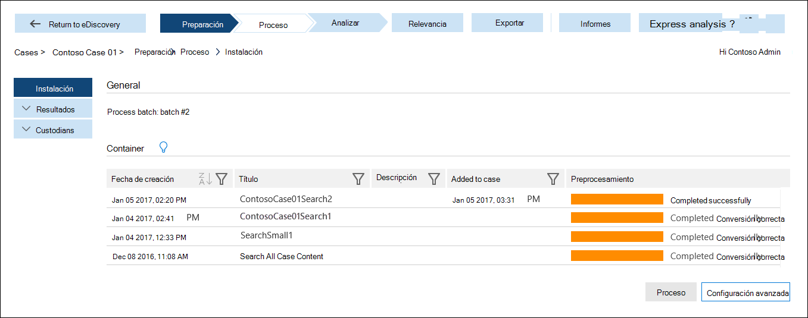

# Preparar datos para la exhibición avanzada de documentos electrónicos (Classic)Prepare data for Advanced eDiscovery (classic)

En este tema se describe cómo cargar los resultados de una búsqueda de contenido en un caso en la exhibición avanzada de documentos electrónicos (Classic).This topic describes how to load the results of a Content Search in to a case in Advanced eDiscovery (classic). 
  
> [!IMPORTANT]
> A medida que continuamos invirtiendo en nuevas versiones de eDiscovery avanzado, anunciamos la retirada de eDiscovery avanzado, también conocido como *eDiscovery avanzado (clásico)* o *eDiscovery avanzado v1.0*As we continue to invest in newer versions of Advanced eDiscovery, we are announcing the retirement of Advanced eDiscovery, also known as *Advanced eDiscovery (classic)* or *Advanced eDiscovery v1.0*. Si todavía está usando eDiscovery avanzado v1.0, cambie a [eDiscovery avanzado v2.0](overview-ediscovery-20.md) (también conocido como la *Solución de eDiscovery avanzado en Microsoft 365*) tan pronto como sea posible.If you're still using Advanced eDiscovery v1.0, please transition to [Advanced eDiscovery v2.0](overview-ediscovery-20.md) (also known as the *Advanced eDiscovery solution in Microsoft 365*) as soon as possible. eDiscovery avanzado 2.0 tiene funcionalidades similares a las que se encuentra en eDiscovery avanzado v1.0, pero también ofrece muchas características nuevas, como la administración de custodios, la administración de comunicaciones y los conjuntos de revisión.Advanced eDiscovery 2.0 contains similar functionality found in Advanced eDiscovery v1.0, but also offers many new features such as custodian management, communications management, and review sets. Para obtener más información sobre la retirada de eDiscovery avanzado v1.0, consulte [Retirada de herramientas heredadas de eDiscovery](legacy-ediscovery-retirement.md#advanced-ediscovery-v10).To learn more about the retirement of Advanced eDiscovery v1.0, see [Retirement of legacy eDiscovery tools](legacy-ediscovery-retirement.md#advanced-ediscovery-v10).  
  
## Paso 1: preparar datos para la exhibición avanzada de documentos electrónicosStep 1: Prepare data for Advanced eDiscovery

Para analizar datos con la exhibición avanzada de documentos electrónicos, puede usar los resultados de una búsqueda de contenido que se ejecuta en el centro de seguridad y cumplimiento de Microsoft 365 &amp; (que aparece en la página **búsqueda de contenido** en el centro de seguridad y cumplimiento de Microsoft 365 &amp; ) o en una búsqueda asociada a un caso de exhibición de documentos electrónicos (en la página **eDiscovery** del centro de seguridad y &amp; cumplimiento).To analyze data with Advanced eDiscovery, you can use the results of a Content Search that you run in the Microsoft 365 Security &amp; Compliance Center (listed on the **Content search** page in the Microsoft 365 Security &amp; Compliance Center) or a search associated with an eDiscovery case (listed on the **eDiscovery** page in the Security &amp; Compliance Center). 
  
Para obtener los pasos detallados sobre cómo preparar los resultados de búsqueda para analizarlos en eDiscovery avanzado, consulte [preparar los resultados de la búsqueda para la exhibición avanzada](prepare-search-results-for-advanced-ediscovery.md)de documentos electrónicos.For the detailed steps on preparing search results for analysis in Advanced eDiscovery, see [Prepare search results for Advanced eDiscovery](prepare-search-results-for-advanced-ediscovery.md).
  
> [!NOTE]
> Si tiene datos fuera de Microsoft 365 y desea importarlos a Microsoft 365 para poder prepararlo y analizarlo en la exhibición avanzada de documentos electrónicos, vea [información general sobre la importación de archivos PST a microsoft 365](https://docs.microsoft.com/microsoft-365/compliance/importing-pst-files-to-office-365) y el [archivado de datos de terceros](https://www.microsoft.com/?ref=go).If you have data outside of Microsoft 365 and want to import it to Microsoft 365 so that you can prepare and analyze it in Advanced eDiscovery, a see [Overview of importing PST files to Microsoft 365](https://docs.microsoft.com/microsoft-365/compliance/importing-pst-files-to-office-365) and [Archiving third-party data](https://www.microsoft.com/?ref=go). 
  
## Paso 2: cargar datos de resultados de búsqueda en un caso en eDiscovery avanzadoStep 2: Load search result data in to a case in Advanced eDiscovery

Después de preparar los resultados de la búsqueda en el &amp; centro de seguridad y cumplimiento para el análisis, el siguiente paso consiste en cargar los resultados de la búsqueda en un caso en EDiscovery avanzado.After you prepare the search results in the Security &amp; Compliance Center for analysis, the next step is to load the search results in to a case in Advanced eDiscovery. Para obtener información más detallada, consulte [ejecutar el módulo de proceso](run-the-process-module-in-advanced-ediscovery.md).For more detailed information, see [Run the Process module](run-the-process-module-in-advanced-ediscovery.md).
  
1. Vaya a [https://protection.office.com](https://protection.office.com).Go to [https://protection.office.com](https://protection.office.com).
    
2. Inicie sesión con su cuenta profesional o educativa.Sign in using your work or school account.
    
3. En el Centro de seguridad y cumplimiento, haga clic en **Búsqueda e investigación** \> **eDiscovery** para mostrar la lista de casos en su organización.In the Security &amp; Compliance Center, click **Search &amp; investigation** \> **eDiscovery** to display the list of cases in your organization. 
    
4. Haga clic en **abrir** junto al caso en el que desea cargar datos en la exhibición avanzada de documentos electrónicos.Click **Open** next to the case that you want to load data in to in Advanced eDiscovery. 
    
5. En la **página principal** del caso, haga clic en **eDiscovery avanzado**.On the **Home** page for the case, click **Advanced eDiscovery**. 
    
    
  
    Se muestra la barra de progreso **conectarse a la exhibición avanzada de** documentos electrónicos.The **Connecting to Advanced eDiscovery** progress bar is displayed. Cuando está conectado a la exhibición avanzada de documentos electrónicos, se muestra una lista de contenedores en la página de configuración del caso.When you're connected to Advanced eDiscovery, a list of containers is displayed on the setup page for the case. 
    
    
  
     Estos contenedores representan los resultados de búsqueda que ha preparado para el análisis en la exhibición avanzada de documentos electrónicos en el paso 1.These containers represent the search results that you prepared for analysis in Advanced eDiscovery in Step 1. Tenga en cuenta que el nombre del contenedor tiene el mismo nombre que la búsqueda de contenido en el caso del centro de seguridad y &amp; cumplimiento.Note that the name of the container has the same name as the Content Search in the case in the Security &amp; Compliance Center. Los contenedores de la lista son los que ha preparado.The containers in the list are the ones that you prepared. Si un usuario diferente ha preparado los resultados de búsqueda para la exhibición avanzada de documentos electrónicos, los contenedores correspondientes no se incluirán en la lista.If a different user prepared search results for Advanced eDiscovery, the corresponding containers won't be included in the list. 
    
6. Para cargar los datos de resultados de búsqueda de un contenedor en el caso de eDiscovery avanzado, seleccione un contenedor y, a continuación, haga clic en **procesar**.To load the search result data from a container in to the case in Advanced eDiscovery, select a container and then click **Process**.
    
Una vez que se agregan los resultados de la búsqueda del centro de seguridad &amp; y cumplimiento al caso de la exhibición avanzada de documentos electrónicos, el siguiente paso consiste en usar las herramientas de la exhibición avanzada de documentos electrónicos para analizar y deselección de los datos relevantes para el caso.After the search results from the Security &amp; Compliance Center are added to the case in Advanced eDiscovery, the next step is to use the tools in Advanced eDiscovery to analyze and cull the data that's relevant to the case. 
  
## Vea tambiénSee also

[Advanced eDiscovery (clásico)Advanced eDiscovery (classic)](office-365-advanced-ediscovery.md)
  
[Configurar usuarios y casosSet up users and cases](set-up-users-and-cases-in-advanced-ediscovery.md)
  
[Analizar datos de casosAnalyzing case data](analyze-case-data-with-advanced-ediscovery.md)
  
[Administración de la configuración de relevanciaManaging Relevance setup](manage-relevance-setup-in-advanced-ediscovery.md)
  
[Usar el módulo de relevanciaUsing the Relevance module](use-relevance-in-advanced-ediscovery.md)
  
[Exportar datos de casosExporting case data](export-case-data-in-advanced-ediscovery.md)

