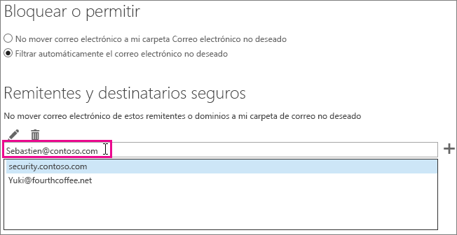

# <a name="how-to-prevent-real-email-from-being-marked-as-spam-in-office-365"></a><span data-ttu-id="dfba7-103">Evitar que el correo electrónico real se marque como correo no deseado en Office 365</span><span class="sxs-lookup"><span data-stu-id="dfba7-103">How to prevent real email from being marked as spam in Office 365</span></span>

 <span data-ttu-id="dfba7-104">**¿Se está marcando el correo electrónico real como correo no deseado en Office 365? Siga este procedimiento.**</span><span class="sxs-lookup"><span data-stu-id="dfba7-104">**Is your real email getting marked as spam in Office 365? Do this.**</span></span>

<span data-ttu-id="dfba7-p101">Si recibe un falso positivo, debe informar del mensaje a Microsoft mediante el [complemento de mensaje de informe](https://support.office.com/article/b5caa9f1-cdf3-4443-af8c-ff724ea719d2). Además, puede enviar el mensaje con el [Explorador de envíos](https://docs.microsoft.com/microsoft-365/security/office-365-security/admin-submission).</span><span class="sxs-lookup"><span data-stu-id="dfba7-p101">If you get a false positive, you should report the message to Microsoft by using the [Use the Report Message add-in](https://support.office.com/article/b5caa9f1-cdf3-4443-af8c-ff724ea719d2). Additionally, you can forward the message [as an attachment](https://docs.microsoft.com/microsoft-365/security/office-365-security/admin-submission) to not_junk@office365.microsoft.com.</span></span>

> [!NOTE]
> <span data-ttu-id="dfba7-107">Los demás campos del encabezado que no se mencionan a continuación se usan exclusivamente para el equipo contra correo electrónico no deseado de Microsoft.</span><span class="sxs-lookup"><span data-stu-id="dfba7-107">Any other fields in the header that are not mentioned below are exclusively used by the Microsoft anti-spam team for diagnostic purposes.</span></span>

## <a name="determine-the-reason-why-the-message-was-marked-as-spam"></a><span data-ttu-id="dfba7-108">Determinar el motivo por el que un mensaje se marcó como correo no deseado</span><span class="sxs-lookup"><span data-stu-id="dfba7-108">Determine the reason why the message was marked as spam</span></span>

<span data-ttu-id="dfba7-p102">Muchos de los problemas relacionados con el correo no deseado en Office 365 pueden solucionarse si se [analizan los encabezados de mensaje de correo electrónico](https://support.office.com/article/cd039382-dc6e-4264-ac74-c048563d212c) y se determina cuál fue el problema. Deberá buscar un encabezado llamado X-Forefront-Antispam-Report. Obtenga más información sobre los [encabezados de mensaje contra correo no deseado](https://docs.microsoft.com/microsoft-365/security/office-365-security/anti-spam-message-headers).</span><span class="sxs-lookup"><span data-stu-id="dfba7-p102">Many issues with spam in Office 365 can be resolved by [View e-mail message headers](https://support.office.com/article/cd039382-dc6e-4264-ac74-c048563d212c) and determining what went wrong. You will need to look for a header named X-Forefront-Antispam-Report. You can [learn more about anti-spam message headers](https://docs.microsoft.com/microsoft-365/security/office-365-security/anti-spam-message-headers).</span></span>

<span data-ttu-id="dfba7-112">En el encabezado, busque los siguientes encabezados y valores.</span><span class="sxs-lookup"><span data-stu-id="dfba7-112">In the header, look for the following headings and values.</span></span>

### <a name="x-forefront-antispam-report"></a><span data-ttu-id="dfba7-113">X-Forefront-Antispam-Report</span><span class="sxs-lookup"><span data-stu-id="dfba7-113">X-Forefront-Antispam-Report</span></span>

- <span data-ttu-id="dfba7-114">**SFV:SPM**: Indica que el mensaje se marcó como correo no deseado por el filtro contra correo no deseado EOP.</span><span class="sxs-lookup"><span data-stu-id="dfba7-114">**SFV:SPM** Indicates that the message was marked as spam because of the EOP spam filters.</span></span>

- <span data-ttu-id="dfba7-115">**SFV:BLK**: Indica que el mensaje se marcó como correo no deseado porque la dirección de envío se encuentra en la lista de remitentes bloqueados del destinatario.</span><span class="sxs-lookup"><span data-stu-id="dfba7-115">**SFV:BLK** Indicates that the message was marked as spam because the sending address is on the recipient's Blocked Senders List.</span></span>

- <span data-ttu-id="dfba7-p103">**SFV:SKS**: Indica que el mensaje se marcó como correo no deseado antes del filtro de contenido. Esto puede ocurrir debido a una regla de flujo de correo (también conocida como regla de transporte) que marca el mensaje como correo no deseado. Ejecute un seguimiento de mensajes para ver si se desencadenó una regla de flujo de correo que pudiera establecer un nivel de confianza contra correo no deseado (SCL) alto.</span><span class="sxs-lookup"><span data-stu-id="dfba7-p103">**SFV:SKS** Indicates that the message was marked as spam prior to the content filter. This could include a mail flow rule (also known as a transport rule) marking the message as spam. Run a message trace to see if a mail flow rule triggered which may have set a high spam confidence level (SCL).</span></span>

- <span data-ttu-id="dfba7-119">**SFV:SKB**: Indica que el mensaje se marcó como correo no deseado porque coincidía con una lista de bloqueados en la directiva de filtro contra correo no deseado.</span><span class="sxs-lookup"><span data-stu-id="dfba7-119">**SFV:SKB** Indicates that the message was marked as spam because it matched a block list in the spam filter policy.</span></span>

- <span data-ttu-id="dfba7-p104">**SFV:BULK**: Indica que el valor de nivel de quejas masivas (BCL) que se encuentran en el encabezado X-Microsoft-Antispam está por encima del umbral de correo masivo que se estableció para el filtro de contenido. El correo masivo es un correo electrónico al que puede que los usuarios se hayan suscrito, pero que se sigue considerando como correo no deseado. En el encabezado de mensaje, busque la propiedad BCL (nivel de confianza en masa) en el encabezado X-Microsoft-Antispam. Si el valor de BCL es inferior al umbral establecido en el filtro de correo no deseado, puede ajustar el umbral para que, en su lugar, marque estos tipos de mensajes masivos como correo no deseado. Diferentes usuarios tienen distintas tolerancias y preferencias para la [administración del correo masivo](https://docs.microsoft.com/microsoft-365/security/office-365-security/bulk-complaint-level-values). Puede crear distintas directivas o reglas para diferentes preferencias de usuario.</span><span class="sxs-lookup"><span data-stu-id="dfba7-p104">**SFV:BULK** Indicates that the Bulk Complaint Level (BCL) value located in the x-microsoft-antispam header is above the Bulk threshold that has been set for the content filter. Bulk email is email which users may have signed up for, but may still be undesirable. In the message header find the BCL (Bulk Confidence Level) property in the X-Microsoft-Antispam header. If the BCL value is less than the threshold set in the Spam Filter, you may want to adjust the threshold to instead mark these types of bulk messages as spam. Different users have different tolerances and preferences for [how bulk email is handled](https://docs.microsoft.com/microsoft-365/security/office-365-security/bulk-complaint-level-values). You can create different policies or rules for different user preferences.</span></span>

- <span data-ttu-id="dfba7-p105">**CAT:SPOOF** o **CAT:PHISH**: Indica que el mensaje parece suplantado, lo que significa que el origen del mensaje no se puede validar y podría ser sospechoso. Si es válido, el remitente deberá asegurarse de que tiene una configuración correcta de SPF y DKIM. Para obtener más información, vea el encabezado Authentication-Results. Aunque puede resultar difícil conseguir que todos los remitentes usen métodos de autenticación de correo electrónico adecuados, omitir estas comprobaciones puede ser muy peligroso y se considera una de las principales causas de peligro.</span><span class="sxs-lookup"><span data-stu-id="dfba7-p105">**CAT:SPOOF** or **CAT:PHISH** Indicates that the message appears to be spoofed, meaning that the message source cannot be validated and could be suspicious. If valid, the sender will need to make sure that they have proper SPF and DKIM configuration. Check the Authentication-Results header for more information. Although it may be difficult to get all senders to use proper email authentication methods, bypassing these checks can be extremely dangerous and is the top cause of compromises.</span></span>

### <a name="x-customspam"></a><span data-ttu-id="dfba7-130">X-CustomSpam</span><span class="sxs-lookup"><span data-stu-id="dfba7-130">x-customspam</span></span>

- <span data-ttu-id="dfba7-p106">La presencia de este encabezado indica que el mensaje se marcó como correo no deseado porque una de las [opciones avanzadas contra correo no deseado está habilitada](https://docs.microsoft.com/microsoft-365/security/office-365-security/advanced-spam-filtering-asf-options) en el filtro de correo no deseado. A menos que necesite estas características, le recomendamos que use la configuración predeterminada.</span><span class="sxs-lookup"><span data-stu-id="dfba7-p106">The presence of this header indicates that the message was marked as spam because one of the [advanced spam options is enabled](https://docs.microsoft.com/microsoft-365/security/office-365-security/advanced-spam-filtering-asf-options) in your spam filter. Unless you need these features, we recommend that you use the default settings.</span></span>

## <a name="solutions-to-additional-causes-of-too-much-spam"></a><span data-ttu-id="dfba7-133">Soluciones para otras causas de recibir demasiado correo no deseado</span><span class="sxs-lookup"><span data-stu-id="dfba7-133">Solutions to additional causes of too much spam</span></span>

<span data-ttu-id="dfba7-p107">Para funcionar correctamente, Exchange Online Protection (EOP) necesita que los administradores completen algunas tareas. Si no es el administrador de su espacio empresarial de Office 365 y recibe demasiado correo no deseado, le recomendamos que trabaje con su administrador en relación con estas tareas. De lo contrario, puede ir directamente a la sección para usuarios.</span><span class="sxs-lookup"><span data-stu-id="dfba7-p107">In order to work effectively, Exchange Online Protection (EOP) requires that administrators complete a few tasks. If you are not the administrator for your Office 365 tenant and you are getting too much spam, then you may want to work with your administrator on these tasks. Otherwise, you can skip to the user section.</span></span>

### <a name="for-admins"></a><span data-ttu-id="dfba7-137">Para administradores</span><span class="sxs-lookup"><span data-stu-id="dfba7-137">For admins</span></span>

- <span data-ttu-id="dfba7-p108">**Apuntar los registros DNS a Office 365** Para que EOP proporcione protección, los registros DNS del agente de intercambio de correo (MX) de todos los dominios tienen que apuntar a Office 365 (y únicamente a Office 365). Si MX no apuntan a Office 365, EOP no proporcionará el filtrado de correo no deseado para los usuarios. Si quiere usar otro servicio o dispositivo para proporcionar filtrado de correo no deseado para su dominio, puede deshabilitar la protección contra correo no deseado en EOP. Para hacerlo, cree una regla de flujo de correo que establezca el valor de SCL en -1. Si luego decide usar EOP, asegúrese de quitar esta regla de flujo de correo.</span><span class="sxs-lookup"><span data-stu-id="dfba7-p108">**Point your DNS records to Office 365** In order for EOP to provide protection, your mail exchanger (MX) DNS record(s) for all domains must be pointed to Office 365 -- and only to Office 365. If your MX does not point to Office 365, then EOP will not provide spam filtering for your users. In the situation where you wish to use another service or appliance to provide spam filtering for your domain, you should consider disabling the spam protection in EOP. You can do this by creating a mail flow rule that sets the SCL value to -1. If you later decide to use EOP, make sure to remove this mail flow rule.</span></span>

- <span data-ttu-id="dfba7-143">**Activar el complemento de mensaje de informe para los usuarios**: Es muy recomendable que [habilite el complemento de mensaje de informe para los usuarios](https://docs.microsoft.com/microsoft-365/security/office-365-security/enable-the-report-message-add-in).</span><span class="sxs-lookup"><span data-stu-id="dfba7-143">**Turn on the report message add-in for users** We strongly recommend that you [enable the report message add-in for you users](https://docs.microsoft.com/microsoft-365/security/office-365-security/enable-the-report-message-add-in).</span></span>

- <span data-ttu-id="dfba7-144">**Usar [el explorador de envíos](https://docs.microsoft.com/microsoft-365/security/office-365-security/admin-submission)**: Ahora los administradores pueden enviar mensajes de correo electrónico con el ID de mensaje de red o archivo, las direcciones URL y los archivos para que Microsoft pueda analizarlos en Office 365.</span><span class="sxs-lookup"><span data-stu-id="dfba7-144">**Use [Submissions Explorer](https://docs.microsoft.com/microsoft-365/security/office-365-security/admin-submission)** Admins can now send emails by using file or network message ID, URLs, and files for scanning by Microsoft in Office 365.</span></span> <span data-ttu-id="dfba7-145">Como administrador, también puede ver los comentarios que envían los usuarios y usar patrones para ajustar las opciones de configuración que pueden causar problemas.</span><span class="sxs-lookup"><span data-stu-id="dfba7-145">As an administrator, you may also be able to view the feedback your users are sending and use any patterns to adjust any settings that may be causing problems.</span></span>

- <span data-ttu-id="dfba7-146">**Asegúrese de que sus usuarios se encuentran dentro de los límites permitidos** para enviar y recibir correos electrónicos, como se muestra [aquí](https://docs.microsoft.com/office365/servicedescriptions/exchange-online-service-description/exchange-online-limits).</span><span class="sxs-lookup"><span data-stu-id="dfba7-146">**Make sure that your users are inside the allowed limits** for sending and receiving emails as showed [here](https://docs.microsoft.com/office365/servicedescriptions/exchange-online-service-description/exchange-online-limits).</span></span>

- <span data-ttu-id="dfba7-147">**Vuelva a comprobar los niveles de quejas** tal como se especifica [aquí](https://docs.microsoft.com/microsoft-365/security/office-365-security/bulk-complaint-level-values).</span><span class="sxs-lookup"><span data-stu-id="dfba7-147">**Double-check the bulk levels** as specified [here](https://docs.microsoft.com/microsoft-365/security/office-365-security/bulk-complaint-level-values)</span></span>

### <a name="for-users"></a><span data-ttu-id="dfba7-148">Para los usuarios</span><span class="sxs-lookup"><span data-stu-id="dfba7-148">For users</span></span>

- <span data-ttu-id="dfba7-149">**Crear una lista de remitentes seguros**: los usuarios pueden agregar direcciones de los remitentes en los que confían en la lista de remitentes seguros de [Outlook](https://go.microsoft.com/fwlink/p/?LinkId=270065) o [Outlook en la Web](https://go.microsoft.com/fwlink/p/?LinkId=294862) (anteriormente conocido como Outlook Web App).</span><span class="sxs-lookup"><span data-stu-id="dfba7-149">**Create a safe sender list**: Users can add addresses from senders that they trust to their safe sender list in [Outlook](https://go.microsoft.com/fwlink/p/?LinkId=270065) or [Outlook on the web](https://go.microsoft.com/fwlink/p/?LinkId=294862) (formerly known as Outlook Web App).</span></span> <span data-ttu-id="dfba7-150">Para empezar a usar Outlook en la Web, elija **Configuración**  \> **Opciones** \> **Bloquear o permitir**.</span><span class="sxs-lookup"><span data-stu-id="dfba7-150">To get started in Outlook on the web, choose **Settings**  \> **Options** \> **Block or allow**.</span></span> <span data-ttu-id="dfba7-151">El siguiente diagrama muestra un ejemplo de cómo agregar un elemento a una lista de remitentes seguros.</span><span class="sxs-lookup"><span data-stu-id="dfba7-151">The following diagram shows an example of adding something to a safe sender list.</span></span>



<span data-ttu-id="dfba7-153">EOP se aplicará a los remitentes y destinatarios seguros de los usuarios, pero no a los dominios seguros.</span><span class="sxs-lookup"><span data-stu-id="dfba7-153">EOP will honor your users' Safe Senders and Recipients, but not Safe Domains.</span></span> <span data-ttu-id="dfba7-154">Esto es cierto, independientemente de si el dominio se agrega a través de Outlook en la Web o se agrega en Outlook y se sincroniza con la Sincronización de directorios.</span><span class="sxs-lookup"><span data-stu-id="dfba7-154">EOP will honor your users' Safe Senders and Recipients, but not Safe Domains. This is true regardless of whether the domain is added through the Outlook on the Web, or added in Outlook and synchronized using Directory Sync.</span></span>

- <span data-ttu-id="dfba7-155">**Deshabilitar el filtro SmartScreen en Outlook**: Si los usuarios usan el cliente para equipo de escritorio de Outlook antiguo, tendrán que deshabilitar la función de filtro SmartScreen, que está descontinuada.</span><span class="sxs-lookup"><span data-stu-id="dfba7-155">**Disable SmartScreen filtering in Outlook** If you are using an older Outlook desktop client, you should disable the SmartScreen filtering functionality, which has been discontinued. If enabled, it can cause false positives. This should not be required if running an updated desktop Outlook client.</span></span> <span data-ttu-id="dfba7-156">Si está habilitada, puede causar falsos positivos.</span><span class="sxs-lookup"><span data-stu-id="dfba7-156">If enabled, it can cause false positives.</span></span> <span data-ttu-id="dfba7-157">Esto no tendría que ser necesario si ejecuta una versión actualizada del cliente de Outlook para equipo de escritorio.</span><span class="sxs-lookup"><span data-stu-id="dfba7-157">This should not be required if running an updated desktop Outlook client.</span></span>

## <a name="troubleshooting-a-message-ends-up-in-the-junk-folder-even-though-eop-marked-the-message-as-non-spam"></a><span data-ttu-id="dfba7-158">Solución de problemas: Un mensaje acaba en la carpeta de correo no deseado aunque EOP lo haya marcado como correo deseado</span><span class="sxs-lookup"><span data-stu-id="dfba7-158">Troubleshooting: A message ends up in the Junk folder even though EOP marked the message as non-spam</span></span>

<span data-ttu-id="dfba7-p113">Si los usuarios tienen habilitada la opción de Outlook "Solo listas seguras: solo correo de personas o dominios de la lista de remitentes seguros o de la lista de destinatarios seguros se enviará a la Bandeja de entrada", todo el correo electrónico se enviará a la carpeta de correo no deseado a menos que el remitente esté incluido en la lista de remitentes seguros del destinatario. Esto ocurre independientemente de si EOP marca un mensaje como no deseado o si ha configurado una regla en EOP para marcar un mensaje como correo deseado.</span><span class="sxs-lookup"><span data-stu-id="dfba7-p113">If your users have the option in Outlook enabled for "Safe Lists Only: Only mail from people or domains on your Safe Senders list or Safe Recipients List will be delivered to your Inbox", then all email will go to the junk folder for a sender unless the sender is on the recipient's Safe Sender list. This will happen regardless of whether EOP marks a message as non-spam, or if you have set up a rule in EOP to mark a message as non-spam.</span></span>

<span data-ttu-id="dfba7-161">Si ve el mensaje en Outlook en la Web, habrá un aviso de seguridad amarillo que indica que el mensaje está en la carpeta de correo no deseado porque el remitente no está en la lista de remitentes seguros del destinatario.</span><span class="sxs-lookup"><span data-stu-id="dfba7-161">If you view the message in Outlook on the Web, there will be a yellow safety tip that indicates that the message is in the Junk folder because the sender is not on the recipient's Safe Senders list.</span></span>

<span data-ttu-id="dfba7-p114">Si observa el encabezado de un mensaje, es posible que incluya la marca SFV:SKN (direcciones IP o ETR permitidas) o SFV:NSPM (correo deseado), pero, aun así, el mensaje llegue a la carpeta de correo no deseado del usuario. No hay nada en el encabezado del mensaje que indique que el usuario tiene habilitada la opción "Solo listas seguras". Esto ocurre porque dicha opción, configurada por los usuarios de Outlook, anula la configuración de EOP.</span><span class="sxs-lookup"><span data-stu-id="dfba7-p114">If you look at the header of a message, it may include the stamp SFV:SKN (IP Allow or ETR Allow) or SFV:NSPM (non-spam), but the message is still placed in the user's junk folder. There is nothing in the message header that indicates that the user has "Safe Lists Only" enabled. This happens because the "Safe Lists Only" option set by users in Outlook overrides the EOP setting.</span></span>

### <a name="to-verify-why-a-message-from-a-safe-sender-is-marked-as-non-spam-in-the-message-header-but-still-ends-up-in-the-users-junk-folder"></a><span data-ttu-id="dfba7-165">Cómo comprobar por qué un mensaje de un remitente seguro se marca como correo deseado en el encabezado del mensaje y, aun así, termina en la carpeta de correo no deseado del usuario</span><span class="sxs-lookup"><span data-stu-id="dfba7-165">To verify why a message from a safe sender is marked as non-spam in the message header, but still ends up in the user's Junk folder</span></span>

1. <span data-ttu-id="dfba7-166">Para más información sobre cómo conectarse a Exchange Online PowerShell, vea [Conectarse a Exchange Online PowerShell](https://go.microsoft.com/fwlink/p/?LinkId=396554).</span><span class="sxs-lookup"><span data-stu-id="dfba7-166">To learn how to connect to Exchange Online PowerShell, see [Connect to Exchange Online PowerShell](https://go.microsoft.com/fwlink/p/?LinkId=396554).</span></span>

2. <span data-ttu-id="dfba7-167">Ejecute el siguiente comando para ver la configuración de correo no deseado del usuario:</span><span class="sxs-lookup"><span data-stu-id="dfba7-167">Run the following command to view the user's junk email configuration settings:</span></span>

  ```Powershell
  Get-MailboxJunkEmailConfiguration example@contoso.com | Format-List TrustedListsOnly,ContactsTrusted,TrustedSendersAndDomains
  ```

- <span data-ttu-id="dfba7-168">Si TrustedListsOnly es True, significa que esta configuración está habilitada.</span><span class="sxs-lookup"><span data-stu-id="dfba7-168">If TrustedListsOnly is set to True, it means that this setting is enabled</span></span>

- <span data-ttu-id="dfba7-169">Si ContactsTrusted es True, significa que el usuario confía en los contactos y en los remitentes seguros.</span><span class="sxs-lookup"><span data-stu-id="dfba7-169">If ContactsTrusted is set to True, it means that the user trusts both Contacts and Safe Senders</span></span>

- <span data-ttu-id="dfba7-170">TrustedSendersAndDomains enumera el contenido de la lista de remitentes seguros del usuario.</span><span class="sxs-lookup"><span data-stu-id="dfba7-170">The TrustedSendersAndDomains lists the contents of the user's Safe Senders list</span></span>

## <a name="eop-only-customers-use-directory-synchronization"></a><span data-ttu-id="dfba7-171">Solo clientes de EOP: uso de la sincronización de directorios</span><span class="sxs-lookup"><span data-stu-id="dfba7-171">EOP-only customers: use directory synchronization</span></span>

<span data-ttu-id="dfba7-p115">Si es un cliente de EOP, es decir, se suscribe al servicio de EOP para su uso con el servidor de correo local (Exchange), se recomienda sincronizar la configuración de usuario con el servicio mediante la sincronización de directorios. Esto garantiza que EOP respete las listas de remitentes seguros. Para obtener más información, consulte "Usar sincronización de directorios para administrar usuarios de correo" en [Administrar usuarios de correo en EOP](https://go.microsoft.com/fwlink/?LinkId=534098).</span><span class="sxs-lookup"><span data-stu-id="dfba7-p115">If you're an EOP-only customer, that is, you subscribe to the EOP service for use with your on-premises (Exchange) email server, you should sync user settings with the service by using directory synchronization. Doing this ensures that your safe senders lists are respected by EOP. For more information, see "Use directory synchronization to manage mail users" in [Manage Mail Users in EOP](https://go.microsoft.com/fwlink/?LinkId=534098).</span></span>
