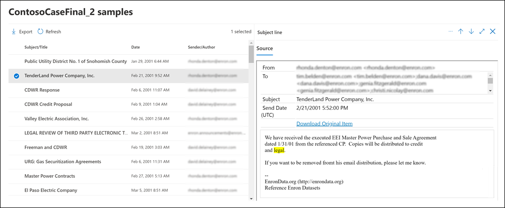

# Vista previa de los resultados de búsqueda de eDiscovery

Después de ejecutar una búsqueda de contenido o una búsqueda asociada a un caso de eDiscovery Core, puede obtener una vista previa de un ejemplo de los resultados devueltos por la búsqueda. La vista previa de elementos devueltos por la consulta de búsqueda puede ayudarle a determinar si la búsqueda devuelve los resultados que espera o si necesita cambiar la consulta de búsqueda y volver a ejecutar la búsqueda.

Para obtener una vista previa de un ejemplo de resultados devuelto por una búsqueda:

1. En el Centro de cumplimiento de Microsoft 365, vaya a la página Búsqueda de contenido o a un caso de eDiscovery Core.

2. Seleccione la búsqueda para mostrar la página de controles flotantes.

3. En la parte inferior de la página de controles flotantes, haga clic en **Revisar muestra**.

   

   Se muestra una página que contiene un ejemplo de los resultados de búsqueda.

4. Seleccione un elemento para ver su contenido en el panel de lectura.

   

   En el recorte de pantalla anterior, observe que las palabras clave de búsqueda están resaltadas al previsualizar los elementos.

## Cómo se seleccionan las muestras de resultados

Hay un máximo de 1 000 elementos seleccionados aleatoriamente disponibles para previsualizar. Además de seleccionarse aleatoriamente, los elementos disponibles para la vista previa deben cumplir los siguientes criterios:

- Se puede previsualizar un máximo de 100 elementos de una sola ubicación de contenido (un buzón o un sitio). Esto significa que es posible que menos de 1 000 elementos estén disponibles para previsualizar. Por ejemplo, si busca cuatro buzones y la búsqueda obtiene 1 500 elementos estimados, solo 400 estarán disponibles para la vista previa, ya que solo se pueden previsualizar 100 elementos de cada buzón.

- Para los elementos del buzón, solo se pueden previsualizar los mensajes de correo electrónico. No se pueden previsualizar elementos como tareas, elementos de calendario y contactos.

- Para los elementos del sitio, solo los documentos están disponibles para previsualizar. No se pueden previsualizar elementos como carpetas, listas o archivos adjuntos de listas.

## Los tipos de archivos se admiten al obtener una vista previa de los resultados de la búsqueda

Puede obtener una vista previa de los tipos de archivo compatibles en el panel de vista previa. Si un tipo de archivo no es compatible, necesitará descargar una copia en el equipo local (haciendo clic en **Descargar artículo original**). Para las páginas web .aspx se incluye la dirección URL de la página, aunque es posible que no tenga permiso para acceder a ella. No se puede obtener una vista previa de los elementos sin indexar.

Se admiten los siguientes tipos de archivo y se puede obtener una vista previa en el panel Resultados de búsqueda.
  
- .txt, .html, .mhtml

- .eml

- .doc, .docx, .docm

- .pptm, .pptx

- .pdf

Asimismo, se admiten los siguientes tipos de contenedor de archivo. Puede ver la lista de archivos del contenedor en el panel de vista previa.
  
- .zip

- .gzip