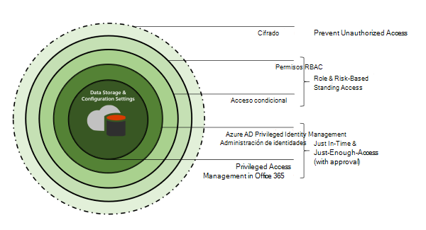
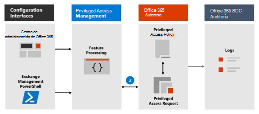
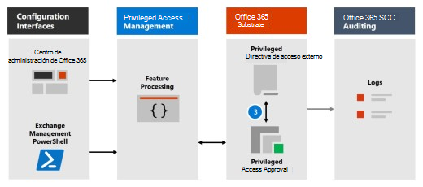
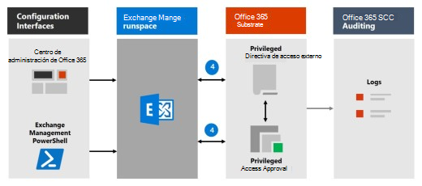

# Obtenga más información sobre la administración del acceso con privilegiosLearn about privileged access management

La administración de acceso con privilegios permite el control de acceso granular sobre las tareas de administración con privilegios en Office 365.Privileged access management allows granular access control over privileged admin tasks in Office 365. Puede ayudar a proteger su organización contra infracciones que usan cuentas de administrador con privilegios existentes con acceso permanente a datos confidenciales o acceso a opciones de configuración críticas.It can help protect your organization from breaches that use existing privileged admin accounts with standing access to sensitive data or access to critical configuration settings. La administración del acceso con privilegios requiere que los usuarios soliciten acceso just-in-time para completar tareas con privilegios elevados y con privilegios a través de un flujo de trabajo de aprobación muy limitado por tiempo y ámbito.Privileged access management requires users to request just-in-time access to complete elevated and privileged tasks through a highly scoped and time-bounded approval workflow. Esta configuración proporciona a los usuarios acceso suficiente para realizar la tarea a mano, sin riesgo de exposición de datos confidenciales o opciones de configuración críticas.This configuration gives users just-enough-access to perform the task at hand, without risking exposure of sensitive data or critical configuration settings. Habilitar la administración de acceso con privilegios en Microsoft 365 permite que su organización funcione con cero privilegios permanentes y proporcione un nivel de defensa contra vulnerabilidades de acceso administrativo permanentes.Enabling privileged access management in Microsoft 365 allows your organization to operate with zero standing privileges and provide a layer of defense against standing administrative access vulnerabilities.

Para obtener información general rápida sobre la Caja de seguridad del cliente integrada y el flujo de trabajo de administración de acceso con privilegios, vea este vídeo sobre la caja de seguridad del cliente y la [administración del acceso con privilegios.](https://go.microsoft.com/fwlink/?linkid=2066800)For a quick overview of the integrated Customer Lockbox and privileged access management workflow, see this [Customer Lockbox and privileged access management video](https://go.microsoft.com/fwlink/?linkid=2066800).

## Capas de protecciónLayers of protection

La administración del acceso con privilegios complementa otras protecciones de características de acceso y datos dentro de la arquitectura de seguridad de Microsoft 365.Privileged access management complements other data and access feature protections within the Microsoft 365 security architecture. La inclusión de la administración de acceso con privilegios como parte de un enfoque integrado y en capas de seguridad proporciona un modelo de seguridad que maximiza la protección de información confidencial y las opciones de configuración de Microsoft 365.Including privileged access management as part of an integrated and layered approach to security provides a security model that maximizes protection of sensitive information and Microsoft 365 configuration settings. Como se muestra en el diagrama, la administración de acceso con privilegios se basa en la protección proporcionada con cifrado nativo de datos de Microsoft 365 y el modelo de seguridad de control de acceso basado en roles de los servicios de Microsoft 365.As shown in the diagram, privileged access management builds on the protection provided with native encryption of Microsoft 365 data and the role-based access control security model of Microsoft 365 services. Cuando se usan [con Azure AD Privileged Identity Management,](/azure/active-directory/active-directory-privileged-identity-management-configure)estas dos características proporcionan control de acceso con acceso just-in-time en diferentes ámbitos.When used with [Azure AD Privileged Identity Management](/azure/active-directory/active-directory-privileged-identity-management-configure), these two features provide access control with just-in-time access at different scopes.

La administración de acceso con privilegios se define y se define en  el ámbito en el nivel de tarea, mientras que Azure AD Privileged Identity Management aplica protección en el nivel de rol con la capacidad de ejecutar varias tareas. Privileged access management is defined and scoped at the **task** level, while Azure AD Privileged Identity Management applies protection at the **role** level with the ability to execute multiple tasks. Azure AD Privileged Identity Management permite principalmente la administración de accesos para roles y grupos de roles de AD, mientras que la administración de acceso con privilegios en Microsoft 365 solo se aplica en el nivel de tareas.Azure AD Privileged Identity Management primarily allows managing accesses for AD roles and role groups, while privileged access management in Microsoft 365 applies only at the task level.

- **Habilitar la administración de acceso con privilegios mientras ya usa Azure AD Privileged Identity Management:** La adición de la administración del acceso con privilegios proporciona otro nivel granular de protección y capacidades de auditoría para el acceso con privilegios a los datos de Microsoft 365.**Enabling privileged access management while already using Azure AD Privileged Identity Management:** Adding privileged access management provides another granular layer of protection and audit capabilities for privileged access to Microsoft 365 data.

- **Habilitar Azure AD Privileged Identity Management mientras ya usa la administración de acceso con privilegios en Office 365:**  Agregar Azure AD Privileged Identity Management a la administración de acceso con privilegios puede ampliar el acceso con privilegios a los datos fuera de Microsoft 365 que se define principalmente mediante roles de usuario o identidad.**Enabling Azure AD Privileged Identity Management while already using privileged access management in Office 365:**  Adding Azure AD Privileged Identity Management to privileged access management can extend privileged access to data outside of Microsoft 365 that's primarily defined by user roles or identity.  

## Arquitectura de administración de acceso con privilegios y flujo de procesosPrivileged access management architecture and process flow

Cada uno de los siguientes flujos de proceso describe la arquitectura del acceso con privilegios y cómo interactúa con el substrato de Microsoft 365, la auditoría y el espacio de ejecución de administración de Exchange.Each of the following process flows outline the architecture of privileged access and how it interacts with the Microsoft 365 substrate, auditing, and the Exchange Management runspace.

### Paso 1: Configurar una directiva de acceso con privilegiosStep 1: Configure a privileged access policy

Cuando configura una directiva de acceso con privilegios con el Centro de administración de [Microsoft 365](https://admin.microsoft.com) o El PowerShell de administración de Exchange, define la directiva y los procesos de características de acceso con privilegios y los atributos de directiva en el substrato de Microsoft 365.When you configure a privileged access policy with the [Microsoft 365 admin center](https://admin.microsoft.com) or the Exchange Management PowerShell, you define the policy and the privileged access feature processes and the policy attributes in the Microsoft 365 substrate. Las actividades se registran en el Centro de &amp; cumplimiento de seguridad.The activities are logged in the Security &amp; Compliance Center. La directiva ya está habilitada y lista para controlar las solicitudes entrantes de aprobaciones.The policy is now enabled and ready to handle incoming requests for approvals.

### Paso 2: Solicitud de accesoStep 2: Access request

En el [Centro de administración de Microsoft 365](https://admin.microsoft.com) o con El PowerShell de administración de Exchange, los usuarios pueden solicitar acceso a tareas con privilegios elevados o con privilegios.In the [Microsoft 365 admin center](https://admin.microsoft.com) or with the Exchange Management PowerShell, users can request access to elevated or privileged tasks. La característica de acceso con privilegios envía la solicitud al substrato de Microsoft 365 para procesarla con la directiva de acceso con privilegios configurada y registra la actividad en los registros del Centro de &amp; cumplimiento de seguridad.The privileged access feature sends the request to the Microsoft 365 substrate for processing against the configured privilege access policy and records the Activity in the Security &amp; Compliance Center logs.

### Paso 3: Aprobación de accesoStep 3: Access approval

Se genera una solicitud de aprobación y la notificación de solicitud pendiente se envía por correo electrónico a los aprobadores.An approval request is generated and the pending request notification is emailed to approvers. Si se aprueba, la solicitud de acceso con privilegios se procesa como una aprobación y la tarea está lista para completarse.If approved, the privileged access request is processed as an approval and the task is ready to be completed. Si se deniega, la tarea se bloquea y no se concede acceso al solicitante.If denied, the task is blocked and no access is granted to the requestor. El solicitante es notificado de la aprobación o denegación de la solicitud a través de un mensaje de correo electrónico.The requestor is notified of the request approval or denial via email message.

### Paso 4: Procesamiento de accesoStep 4: Access processing

Para una solicitud aprobada, el espacio de ejecución de administración de Exchange procesa la tarea.For an approved request, the task is processed by the Exchange Management runspace. La aprobación se comprueba con la directiva de acceso con privilegios y se procesa mediante el substrato de Microsoft 365.The approval is checked against the privileged access policy and processed by the Microsoft 365 substrate. Toda la actividad de la tarea se registra en el Centro de &amp; cumplimiento de seguridad.All activity for the task is logged in the Security &amp; Compliance Center.

## Preguntas más frecuentesFrequently asked questions

### ¿Qué SKU pueden usar el acceso con privilegios en Office 365?What SKUs can use privileged access in Office 365?

La administración de acceso con privilegios está disponible para los clientes para una amplia selección de complementos y suscripciones de Microsoft 365 y Office 365.Privileged access management is available for customers for a wide selection of Microsoft 365 and Office 365 subscriptions and add-ons. Consulte [Introducción a la administración de acceso con privilegios](privileged-access-management-configuration.md) para obtener más información.See [Get started with privileged access management](privileged-access-management-configuration.md) for details.

### ¿Cuándo admitirá el acceso con privilegios las cargas de trabajo de Office 365 más allá de Exchange?When will privileged access support Office 365 workloads beyond Exchange?

La administración de acceso con privilegios estará disponible en otras cargas de trabajo de Office 365 próximamente.Privileged access management will be available in other Office 365 workloads soon. Para obtener más información, visite el mapa de ruta de [Microsoft 365.](https://www.microsoft.com/microsoft-365/roadmap)Visit the [Microsoft 365 Roadmap](https://www.microsoft.com/microsoft-365/roadmap) for more details.

### Mi organización necesita más de 30 directivas de acceso con privilegios, ¿se incrementará este límite?My organization needs more than 30 privileged access policies, will this limit be increased?

Sí, el aumento del límite actual de 30 directivas de acceso con privilegios por organización se encuentra en la guía básica de características.Yes, raising the current limit of 30 privileged access policies per organization is on the feature roadmap.

### ¿Necesito ser administrador global para administrar el acceso con privilegios en Office 365?Do I need to be a Global Admin to manage privileged access in Office 365?

No, necesita el rol Administración de roles de Exchange asignado a las cuentas que administran el acceso con privilegios en Office 365.No, you need the Exchange Role Management role assigned to accounts that manage privileged access in Office 365. Si no desea configurar el rol Administración de roles como un permiso de cuenta independiente, el rol Administrador global incluye este rol de forma predeterminada y puede administrar el acceso con privilegios.If you don't want to configure the Role Management role as a stand-alone account permission, the Global Administrator role includes this role by default and can manage privileged access. Los usuarios incluidos en un grupo de aprobadores no necesitan ser administradores globales ni tener asignado el rol administración de roles para revisar y aprobar solicitudes con PowerShell.Users included in an approvers' group don't need to be a Global Admin or have the Role Management role assigned to review and approve requests with PowerShell.

### ¿Cómo está relacionada la administración del acceso con privilegios con la Caja de seguridad del cliente?How is privileged access management related to Customer Lockbox?

[La Caja de seguridad del cliente](/office365/admin/manage/customer-lockbox-requests) permite un nivel de control de acceso para las organizaciones cuando Microsoft accede a los datos.[Customer Lockbox](/office365/admin/manage/customer-lockbox-requests) allows a level of access control for organizations when Microsoft accesses data. La administración de acceso con privilegios permite un control de acceso granular dentro de una organización para todas las tareas con privilegios de Microsoft 365.Privileged access management allows granular access control within an organization for all Microsoft 365 privileged tasks.

## ¿Está listo para empezar?Ready to get started?

Empiece [a configurar su organización para la administración del acceso con privilegios.](privileged-access-management-configuration.md)Start [configuring your organization for privileged access management](privileged-access-management-configuration.md).

## Más informaciónLearn more

[Guía interactiva: Supervisar y controlar tareas de administrador con administración de acceso con privilegiosInteractive guide: Monitor and control administrator tasks with privileged access management](https://content.cloudguides.com/guides/Privileged%20Access%20Management)
