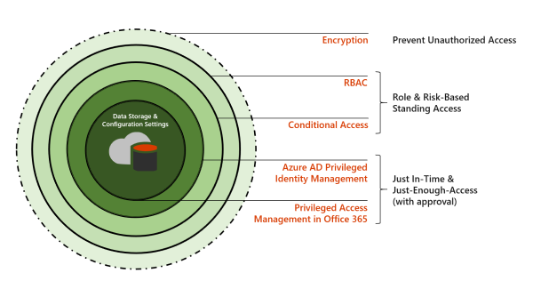

# Administración del acceso con privilegiosPrivileged access management

La administración de acceso privilegiado permite un control de acceso granular sobre las tareas de administración con privilegios en Office 365.Privileged access management allows granular access control over privileged admin tasks in Office 365. Puede ayudar a proteger a su organización de las infracciones que usan cuentas de administrador con privilegios existentes con acceso permanente a los datos confidenciales o al acceso a las opciones de configuración críticas.It can help protect your organization from breaches that use existing privileged admin accounts with standing access to sensitive data or access to critical configuration settings. La administración de acceso privilegiado requiere que los usuarios soliciten acceso puntual para completar las tareas elevadas y privilegiadas a través de un flujo de trabajo de aprobación limitado por el ámbito y de gran alcance.Privileged access management requires users to request just-in-time access to complete elevated and privileged tasks through a highly scoped and time-bounded approval workflow. Esta configuración proporciona a los usuarios un acceso suficiente para realizar la tarea a mano, sin arriesgar la exposición de los datos confidenciales o las opciones de configuración críticas.This configuration gives users just-enough-access to perform the task at hand, without risking exposure of sensitive data or critical configuration settings. La habilitación de la administración de acceso privilegiada en Microsoft 365 permite que su organización opere con privilegios que no tienen ningún derecho y proporciona un nivel de defensa contra las vulnerabilidades de acceso administrativo.Enabling privileged access management in Microsoft 365 allows your organization to operate with zero standing privileges and provide a layer of defense against standing administrative access vulnerabilities.

Para obtener una introducción rápida a los flujos de trabajo de clientes integrados y el flujo de trabajo de administración de acceso privilegiado, consulte este [vídeo de caja de control de acceso de cliente y acceso privilegiado](https://go.microsoft.com/fwlink/?linkid=2066800).For a quick overview of the integrated Customer Lockbox and privileged access management workflow, see this [Customer Lockbox and privileged access management video](https://go.microsoft.com/fwlink/?linkid=2066800).

## Niveles de protecciónLayers of protection

La administración de acceso privilegiada complementa a otros datos y otras protecciones de características de la arquitectura de seguridad de Microsoft 365.Privileged access management complements other data and access feature protections within the Microsoft 365 security architecture. La inclusión de la administración de acceso privilegiada como parte de un enfoque integrado y por capas de la seguridad proporciona un modelo de seguridad que maximiza la protección de la información confidencial y las opciones de configuración de Microsoft 365.Including privileged access management as part of an integrated and layered approach to security provides a security model that maximizes protection of sensitive information and Microsoft 365 configuration settings. Como se muestra en el diagrama, la administración del acceso con privilegios se basa en la protección proporcionada con el cifrado nativo de los datos de Microsoft 365 y el modelo de seguridad de control de acceso basado en roles de los servicios de Microsoft 365.As shown in the diagram, privileged access management builds on the protection provided with native encryption of Microsoft 365 data and the role-based access control security model of Microsoft 365 services. Cuando se usan con [Azure ad privileged Identity Management](https://docs.microsoft.com/azure/active-directory/active-directory-privileged-identity-management-configure), estas dos características proporcionan control de acceso con acceso Just-in-Time en diferentes ámbitos.When used with [Azure AD Privileged Identity Management](https://docs.microsoft.com/azure/active-directory/active-directory-privileged-identity-management-configure), these two features provide access control with just-in-time access at different scopes.

La administración del acceso con privilegios se define y se limita en el nivel de la **tarea** , mientras que la administración de identidades de Azure ad privilegiada aplica protección a nivel de **rol** con la capacidad de ejecutar varias tareas.Privileged access management is defined and scoped at the **task** level, while Azure AD Privileged Identity Management applies protection at the **role** level with the ability to execute multiple tasks. Azure AD privileged Identity Management permite básicamente administrar los accesos para los grupos de roles y roles de AD, mientras que la administración de acceso privilegiada en Microsoft 365 solo se aplica en el nivel de tarea.Azure AD Privileged Identity Management primarily allows managing accesses for AD roles and role groups, while privileged access management in Microsoft 365 applies only at the task level.

- **Habilitación de la administración de acceso privilegiado mientras se usa Azure ad privileged Identity Management:** Agregar administración de acceso privilegiada proporciona otra capa granular de capacidades de protección y auditoría para el acceso privilegiado a los datos de Microsoft 365.**Enabling privileged access management while already using Azure AD Privileged Identity Management:** Adding privileged access management provides another granular layer of protection and audit capabilities for privileged access to Microsoft 365 data.

- **Habilitación de la administración de identidades privilegiada de Azure ad mientras se usa la administración de acceso con privilegios en Office 365:**  La adición de la administración de identidades privilegiada de Azure AD a la administración de acceso privilegiada puede ampliar el acceso privilegiado a datos externos a Microsoft 365 que se definen principalmente por los roles de usuario o la identidad.**Enabling Azure AD Privileged Identity Management while already using privileged access management in Office 365:**  Adding Azure AD Privileged Identity Management to privileged access management can extend privileged access to data outside of Microsoft 365 that's primarily defined by user roles or identity.  

## Arquitectura de administración del acceso privilegiado y flujo del procesoPrivileged access management architecture and process flow

Cada uno de los siguientes flujos de proceso describe la arquitectura de acceso privilegiado y el modo en que interactúa con el sustrato de Microsoft 365, la auditoría y el espacio de ejecución de administración de Exchange.Each of the following process flows outline the architecture of privileged access and how it interacts with the Microsoft 365 substrate, auditing, and the Exchange Management runspace.

### Paso 1: configurar una directiva de acceso privilegiadoStep 1: Configure a privileged access policy

Cuando se configura una directiva de acceso privilegiado con el [centro de administración de Microsoft 365](https://admin.microsoft.com) o PowerShell de administración de Exchange, se define la Directiva y los procesos de características de acceso privilegiado y los atributos de directiva en el sustrato de Microsoft 365.When you configure a privileged access policy with the [Microsoft 365 admin center](https://admin.microsoft.com) or the Exchange Management PowerShell, you define the policy and the privileged access feature processes and the policy attributes in the Microsoft 365 substrate. Las actividades se registran en el &amp; centro de seguridad y cumplimiento.The activities are logged in the Security &amp; Compliance Center. La Directiva está ahora habilitada y lista para administrar las solicitudes entrantes para aprobaciones.The policy is now enabled and ready to handle incoming requests for approvals.

### Paso 2: solicitud de accesoStep 2: Access request

En el [centro de administración de Microsoft 365](https://admin.microsoft.com) o con PowerShell de administración de Exchange, los usuarios pueden solicitar acceso a tareas elevadas o privilegiadas.In the [Microsoft 365 admin center](https://admin.microsoft.com) or with the Exchange Management PowerShell, users can request access to elevated or privileged tasks. La característica de acceso privilegiado envía la solicitud al sustrato de 365 de Microsoft para su procesamiento con respecto a la Directiva configurada de &amp; acceso a privilegios y registra la actividad en los registros del centro de cumplimiento de seguridad.The privileged access feature sends the request to the Microsoft 365 substrate for processing against the configured privilege access policy and records the Activity in the Security &amp; Compliance Center logs.

### Paso 3: aprobación de accesoStep 3: Access approval

Se genera una solicitud de aprobación y la notificación de solicitud pendiente se envíe por correo electrónico a los aprobadores.An approval request is generated and the pending request notification is emailed to approvers. Si se aprueba, la solicitud de acceso privilegiado se procesa como una aprobación y la tarea está lista para completarse.If approved, the privileged access request is processed as an approval and the task is ready to be completed. Si se deniega, la tarea se bloqueará y no se concederá acceso al solicitante.If denied, the task is blocked and no access is granted to the requestor. El solicitante recibe la notificación de la aprobación o la denegación de la solicitud mediante un mensaje de correo electrónico.The requestor is notified of the request approval or denial via email message.

### Paso 4: acceso al procesamientoStep 4: Access processing

Para una solicitud aprobada, el espacio de ejecución de administración de Exchange procesa la tarea.For an approved request, the task is processed by the Exchange Management runspace. La aprobación se comprueba contra la Directiva de acceso privilegiado y la procesa el sustrato 365 de Microsoft.The approval is checked against the privileged access policy and processed by the Microsoft 365 substrate. Toda la actividad de la tarea se registra en el &amp; centro de seguridad y cumplimiento.All activity for the task is logged in the Security &amp; Compliance Center.

## Preguntas más frecuentesFrequently asked questions

### ¿Qué SKU puede usar el acceso con privilegios en Office 365?What SKUs can use privileged access in Office 365?

La administración del acceso con privilegios está disponible para los clientes para una amplia selección de suscripciones y complementos de Microsoft 365 y Office 365.Privileged access management is available for customers for a wide selection of Microsoft 365 and Office 365 subscriptions and add-ons. Consulte [Get Started with privileged Access Management](privileged-access-management-configuration.md) para obtener más información.See [Get started with privileged access management](privileged-access-management-configuration.md) for details.

### ¿Cuándo será compatible el acceso a Office 365 cargas de trabajo de Office más allá de Exchange?When will privileged access support Office 365 workloads beyond Exchange?

La administración del acceso privilegiado estará disponible en otras cargas de trabajo de Office 365 pronto.Privileged access management will be available in other Office 365 workloads soon. Visite el [mapa de ruta de Microsoft 365](https://www.microsoft.com/microsoft-365/roadmap) para obtener más información.Visit the [Microsoft 365 Roadmap](https://www.microsoft.com/microsoft-365/roadmap) for more details.

### Mi organización necesita más de 30 directivas de acceso privilegiadas, ¿aumentará este límite?My organization needs more than 30 privileged access policies, will this limit be increased?

Sí, aumentar el límite actual de 30 directivas de acceso con privilegios por organización se encuentra en la guía básica de características.Yes, raising the current limit of 30 privileged access policies per organization is on the feature roadmap.

### ¿Es necesario ser administrador global para administrar el acceso con privilegios en Office 365?Do I need to be a Global Admin to manage privileged access in Office 365?

No, necesita la función de administración de roles de Exchange asignada a cuentas que administran el acceso privilegiado en Office 365.No, you need the Exchange Role Management role assigned to accounts that manage privileged access in Office 365. Si no desea configurar el rol de administración de roles como un permiso de cuenta independiente, el rol de administrador global incluye esta función de forma predeterminada y puede administrar el acceso privilegiado.If you don't want to configure the Role Management role as a stand-alone account permission, the Global Administrator role includes this role by default and can manage privileged access. Los usuarios incluidos en un grupo de aprobadores no tienen que ser administrador global o tener el rol de administración de roles asignado para revisar y aprobar solicitudes con PowerShell.Users included in an approvers' group don't need to be a Global Admin or have the Role Management role assigned to review and approve requests with PowerShell.

### ¿Cómo se relaciona la administración del acceso con privilegios con las cajas de caja del cliente?How is privileged access management related to Customer Lockbox?

[Caja de caja del cliente](https://docs.microsoft.com/office365/admin/manage/customer-lockbox-requests) permite un nivel de control de acceso para las organizaciones cuando Microsoft obtiene acceso a los datos.[Customer Lockbox](https://docs.microsoft.com/office365/admin/manage/customer-lockbox-requests) allows a level of access control for organizations when Microsoft accesses data. La administración de acceso privilegiado permite un control de acceso granular dentro de una organización para todas las tareas privilegiadas de Microsoft 365.Privileged access management allows granular access control within an organization for all Microsoft 365 privileged tasks.

## ¿Está listo para empezar?Ready to get started?

Inicie [la configuración de la organización para la administración del acceso privilegiado](privileged-access-management-configuration.md).Start [configuring your organization for privileged access management](privileged-access-management-configuration.md).

## Más informaciónLearn more

[Guía interactiva: supervise y controle las tareas de administrador con privilegios de administración de accesoInteractive guide: Monitor and control administrator tasks with privileged access management](https://content.cloudguides.com/guides/Privileged%20Access%20Management)
