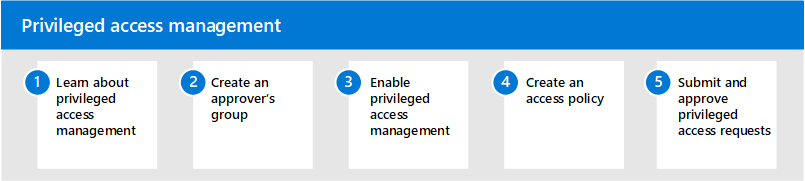

# Administración de acceso con privilegios en Microsoft 365Privileged access management in Microsoft 365

Tener acceso permanente a algunos usuarios a la información confidencial o a la configuración de red crítica en Microsoft Exchange Online es una posible vía para las actividades comprometidas o las actividades de amenazas internas.Having standing access by some users to sensitive information or critical network configuration settings in Microsoft Exchange Online is a potential pathway for compromised accounts or internal threat activities. La administración de acceso con privilegios ayuda a proteger la organización de las infracciones y ayuda a cumplir los procedimientos recomendados al limitar el acceso permanente a los datos confidenciales o el acceso a las opciones de configuración fundamentales.Privileged access management helps protect your organization from breaches and helps to meet compliance best practices by limiting standing access to sensitive data or access to critical configuration settings. En lugar de que los administradores tengan acceso constante, las reglas de acceso Just-in-Time se implementan para las tareas que necesitan permisos elevados.Instead of administrators having constant access, just-in-time access rules are implemented for tasks that need elevated permissions. La habilitación de la administración de acceso privilegiada para Exchange online en Microsoft 365 permite que su organización opere con privilegios de cero posición y que proporcione un nivel de defensa contra las vulnerabilidades de acceso administrativo.Enabling privileged access management for Exchange Online in Microsoft 365 allows your organization to operate with zero standing privileges and provide a layer of defense against standing administrative access vulnerabilities.

## Configurar la administración del acceso con privilegios para Microsoft 365Configure privileged access management for Microsoft 365

Siga estos pasos para configurar la administración del acceso con privilegios para su organización:Use the following steps to configure privileged access management for your organization:

1. Obtenga información sobre la [Administración del acceso con privilegios](privileged-access-management-overview.md) en Microsoft 365Learn about [privileged access management](privileged-access-management-overview.md) in Microsoft 365
2. Crear un [grupo de aprobadores](privileged-access-management-configuration.md#step-1-create-an-approvers-group)Create an [approver's group](privileged-access-management-configuration.md#step-1-create-an-approvers-group)
3. Habilitar la [Administración del acceso con privilegios](privileged-access-management-configuration.md#step-2-enable-privileged-access)Enable [privileged access management](privileged-access-management-configuration.md#step-2-enable-privileged-access)
4. Crear una [Directiva de acceso](privileged-access-management-configuration.md#step-3-create-an-access-policy)Create an [access policy](privileged-access-management-configuration.md#step-3-create-an-access-policy)
5. Enviar o aprobar [solicitudes de acceso privilegiadas](privileged-access-management-configuration.md#step-4-submitapprove-privileged-access-requests)Submit/approve [privileged access requests](privileged-access-management-configuration.md#step-4-submitapprove-privileged-access-requests)

## Más información acerca de la administración del acceso con privilegiosMore information about privileged access management

- [Preguntas más frecuentes acerca de la administración del acceso con privilegiosFrequently asked questions about privileged access management](privileged-access-management-overview.md#frequently-asked-questions)