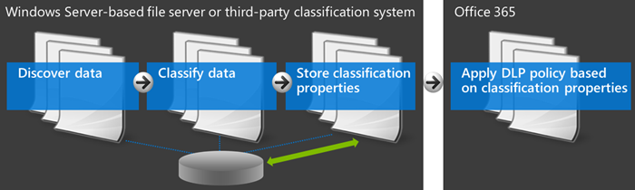

# <a name="create-a-dlp-policy-to-protect-documents-with-fci-or-other-properties"></a>Crear una directiva DLP para proteger documentos con FCI u otras propiedades

las directivas de Prevención de pérdida de datos de Microsoft Purview (DLP) pueden usar propiedades de clasificación o propiedades de elemento para identificar elementos confidenciales. Por ejemplo, puede usar:

- Propiedades de la infraestructura de clasificación de archivos (FCI) de Windows Server
- Propiedades del documento de SharePoint
- propiedades de documento del sistema de terceros



Por ejemplo, su organización podría usar la FCI de Windows Server para identificar elementos con datos personales como números de seguridad social y, a continuación, clasificar el documento estableciendo la propiedad **Información de identificación personal** en **Alta**, **Moderada**, **Baja**, **Pública** o **No PII** en función del tipo y número de repeticiones de datos personales que se encuentran en el documento.

En Microsoft 365, puede crear una directiva DLP que identifique documentos que tengan esa propiedad establecida en valores específicos, como **High** y **Medium**, y, a continuación, realice una acción como bloquear el acceso a esos archivos. La misma directiva puede tener otra regla que realice una acción diferente si la propiedad se establece en **Bajo**, por ejemplo, enviar una notificación por correo electrónico. De este modo, DLP se integra con la FCI de Windows Server y puede ayudar a proteger los documentos de Office cargados o compartidos en Microsoft 365 desde servidores de archivos basados en Windows Server.

Una directiva DLP simplemente busca un par de nombre/valor de propiedad específico. Se puede usar cualquier propiedad de documento, siempre que la propiedad tenga una propiedad administrada correspondiente para la búsqueda de SharePoint. Por ejemplo, una colección de sitios de SharePoint podría usar un tipo de contenido denominado **Trip Report** con un campo obligatorio denominado **Customer**. Cada vez que una persona crea un informe de viaje, debe escribir el nombre del cliente. Este par nombre-valor de propiedad también se puede usar en una directiva DLP, por ejemplo, si desea una regla que bloquee el acceso al documento para los invitados cuando el campo **Cliente** contiene **Contoso**.

Si desea aplicar la directiva DLP al contenido con etiquetas específicas de Microsoft 365, no debe seguir estos pasos. En su lugar, obtenga información sobre cómo [usar una etiqueta de retención como condición en una directiva DLP](data-loss-prevention-policies.md#using-a-retention-label-as-a-condition-in-a-dlp-policy).

## <a name="before-you-create-the-dlp-policy"></a>Antes de crear la directiva DLP

Para poder usar una propiedad fci de Windows Server u otra propiedad en una directiva DLP, debe crear una propiedad administrada en el Centro de <a href="https://go.microsoft.com/fwlink/?linkid=2185219" target="_blank">administración de SharePoint</a>. Este es el motivo.

Ejemplos

> [!NOTE]
> Asegúrese de usar un nombre de propiedad administrada y no un nombre de propiedad rastreado al crear reglas DLP mediante la `ContentPropertyContainsWords` condición .

Esto es importante porque DLP usa el rastreador de búsqueda para identificar y clasificar información confidencial en los sitios y, a continuación, almacenar esa información confidencial en una parte segura del índice de búsqueda. Al cargar un documento en Office 365, SharePoint crea automáticamente propiedades rastreadas en función de las propiedades del documento. Pero para usar una FCI u otra propiedad en una directiva DLP, la propiedad rastreada debe asignarse a una propiedad administrada para que el contenido con esa propiedad se conserve en el índice.

Para obtener más información sobre las propiedades administradas y de búsqueda, vea [Administrar el esquema de búsqueda en SharePoint Online](/sharepoint/manage-search-schema).

### <a name="step-1-upload-a-document-with-the-needed-property-to-office-365"></a>Paso 1: Cargar un documento con la propiedad necesaria en Office 365

Primero debe cargar un documento con la propiedad a la que desea hacer referencia en la directiva DLP. Microsoft 365 detectará la propiedad y creará automáticamente una propiedad rastreada a partir de ella. En el paso siguiente, creará una propiedad administrada y, a continuación, asignará la propiedad administrada a esta propiedad rastreada.

### <a name="step-2-create-a-managed-property"></a>Paso 2: Crear una propiedad administrada

1. Inicie sesión en el <a href="https://go.microsoft.com/fwlink/p/?linkid=2024339" target="_blank">Centro de administración de Microsoft 365</a>.

2. En el panel de navegación izquierdo, elija **Administración centros** \> **de SharePoint**. Ahora está en el Centro de <a href="https://go.microsoft.com/fwlink/?linkid=2185219" target="_blank">administración de SharePoint</a>.

3. En el panel de navegación izquierdo, elija **Buscar** \> en la página \> **administración de búsqueda** **Administrar esquema de búsqueda**.

   

4. En la página \> **Propiedades administradas** **Nueva propiedad administrada**.

   

5. Escriba un nombre y una descripción para la propiedad. Este nombre es lo que aparecerá en las directivas DLP.

6. En **Tipo**, elija **Texto**.

7. En **Características principales**, seleccione **Consultable** y **Recuperable**.

8. En **Asignaciones a propiedades** \> rastreadas **, agregue una asignación**.

9. En el cuadro \> de diálogo **de selección de propiedades rastreadas**, busque y seleccione la propiedad rastreada correspondiente a la propiedad FCI de Windows Server u otra propiedad que usará en la directiva \> DLP **Aceptar**.

   

10. En la parte inferior de la página \> **Aceptar**.

## <a name="create-a-dlp-policy-that-uses-an-fci-property-or-other-property"></a>Crear una directiva DLP que use una propiedad de FCI u otra propiedad

En este ejemplo, una organización usa FCI en sus servidores de archivos basados en Windows Server; específicamente, usan la propiedad de clasificación fci denominada **Información de identificación personal** con los valores posibles de **Alta**, **Moderada**, **Baja**, **Pública** y **No PII**. Ahora quieren usar su clasificación de FCI existente en sus directivas DLP en Office 365.

En primer lugar, siguen los pasos anteriores para crear una propiedad administrada en SharePoint Online, que se asigna a la propiedad rastreada creada automáticamente a partir de la propiedad FCI.

A continuación, crean una directiva DLP con dos reglas que usan la condición **Propiedades del documento contienen cualquiera de estos valores**:

- **Contenido de I PII de FCI: alto, moderado** La primera regla restringe el acceso al documento si la propiedad de clasificación FCI **Información de identificación personal** es igual a **Alta** o **Moderada** y el documento se comparte con personas ajenas a la organización.

- **Contenido de FCI PII: bajo** La segunda regla envía una notificación al propietario del documento si la propiedad de clasificación FCI **Información de identificación personal** es **igual a Baja** y el documento se comparte con personas ajenas a la organización.

### <a name="create-the-dlp-policy-by-using-security--compliance-powershell"></a>Creación de la directiva DLP mediante PowerShell de cumplimiento de & de seguridad

La condición **Propiedades del documento contiene cualquiera de estos valores** no está disponible temporalmente en el portal de cumplimiento Microsoft Purview, pero todavía puede usar esta condición en PowerShell de cumplimiento de seguridad &. Puede usar los `New\Set\Get-DlpCompliancePolicy` cmdlets para trabajar con una directiva DLP y usar los `New\Set\Get-DlpComplianceRule` cmdlets con el `ContentPropertyContainsWords` parámetro para agregar la condición **Las propiedades del documento contienen cualquiera de estos valores**.

1. [Conexión a PowerShell de cumplimiento de & de seguridad](/powershell/exchange/connect-to-scc-powershell)

2. Cree la directiva mediante `New-DlpCompliancePolicy`.

   Este PowerShell crea una directiva DLP que se aplica a todas las ubicaciones.

   ```powershell
   New-DlpCompliancePolicy -Name FCI_PII_policy -ExchangeLocation All -SharePointLocation All -OneDriveLocation All -Mode Enable
   ```

3. Cree las dos reglas descritas anteriormente mediante `New-DlpComplianceRule`, donde una regla es para el valor **Bajo** y otra regla es para los valores **Alto** y **Moderado** .

   Este es un ejemplo de PowerShell que crea estas dos reglas. Los pares nombre/valor de propiedad se incluyen entre comillas y un nombre de propiedad puede especificar varios valores separados por comas sin espacios, como `"<Property1>:<Value1>,<Value2>","<Property2>:<Value3>,<Value4>"....`

   ```powershell
   New-DlpComplianceRule -Name FCI_PII_content-High,Moderate -Policy FCI_PII_policy -AccessScope NotInOrganization -BlockAccess $true -ContentPropertyContainsWords "Personally Identifiable Information:High,Moderate" -Disabled $falseNew-DlpComplianceRule -Name FCI_PII_content-Low -Policy FCI_PII_policy -AccessScope NotInOrganization -BlockAccess $false -ContentPropertyContainsWords "Personally Identifiable Information:Low" -Disabled $false -NotifyUser Owner
   ```

   La FCI de Windows Server incluye muchas propiedades integradas, incluida la **información de identificación personal** que se usa en este ejemplo. Los valores posibles de cada propiedad pueden ser diferentes para cada organización. Los valores **High**, **Moderate** y **Low** que se usan aquí son solo un ejemplo. Para su organización, puede ver las propiedades de clasificación de FCI de Windows Server con sus valores posibles en el Resource Manager de servidor de archivos en el servidor de archivos basado en Windows Server. Para obtener más información, consulte [Creación de una propiedad de clasificación](/previous-versions/windows/it-pro/windows-server-2008-R2-and-2008/dd759215(v=ws.11)).

Cuando termine, la directiva debe tener dos nuevas reglas que usen las **propiedades Document que contengan cualquiera de estas condiciones de valores** . Esta condición no aparecerá en la interfaz de usuario, aunque aparecerán las otras condiciones, acciones y configuraciones.

Una regla bloquea el acceso al contenido donde la propiedad **Información de identificación personal** es igual a **Alto** o **Moderado**. Una segunda regla envía una notificación sobre el contenido donde la propiedad **Información de identificación personal** es igual a **Bajo**.


## <a name="after-you-create-the-dlp-policy"></a>Después de crear la directiva DLP

Al realizar los pasos descritos en las secciones anteriores, se creará una directiva DLP que detectará rápidamente el contenido con esa propiedad, pero solo si ese contenido se ha cargado recientemente (para que el contenido se indexe) o si ese contenido es antiguo pero se acaba de editar (para que el contenido se vuelva a indexar).

Para detectar contenido con esa propiedad en todas partes, tal vez le convenga solicitar de forma manual que la biblioteca, sitio o colección de sitios se vuelva a indexar para que la directiva DLP tenga conocimiento de todo el contenido que incluye esa propiedad. En SharePoint Online, el contenido se rastrea automáticamente según una programación de rastreo definida. El rastreador toma el contenido que ha cambiado desde el último rastreo y actualiza el índice. Si necesita que la directiva DLP proteja contenido antes del siguiente rastreo programado, puede llevar a cabo estos pasos.

> [!CAUTION]
> Volver a indexar un sitio puede provocar una carga masiva en el sistema de búsqueda. No vuelva a indexar el sitio a menos que el escenario lo requiera de forma absoluta.

Para obtener más información, vea [Solicitar manualmente el rastreo y una nueva indexación de un sitio, una biblioteca o una lista](/sharepoint/crawl-site-content).

### <a name="reindex-a-site-optional"></a>Volver a indexar un sitio (opcional)

1. En el sitio, elija **Configuración** (icono de engranaje en la esquina superior derecha) \> **Configuración del sitio**.

2. En **Buscar**, elija Buscar y volver **a indexar sitio** de **disponibilidad** \> sin conexión.

## <a name="more-information"></a>Más información

- [Obtenga más información acerca de la prevención de pérdida de datos](dlp-learn-about-dlp.md)

- [Crear una directiva DLP desde una plantilla](create-a-dlp-policy-from-a-template.md)

- [Enviar notificaciones y mostrar sugerencias de directivas para directivas DLP](use-notifications-and-policy-tips.md)

- [Qué incluyen las plantillas de directiva DLP](what-the-dlp-policy-templates-include.md)

- [Definiciones de entidad de tipos de información confidencial](sensitive-information-type-entity-definitions.md)
