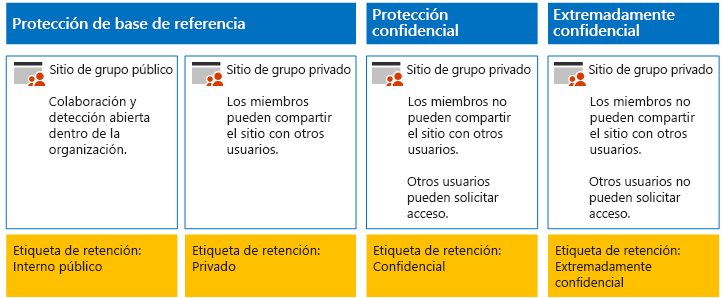
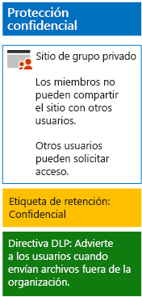
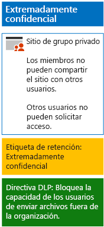

# Proteger archivos de SharePoint Online con DLP y etiquetas de retenciónProtect SharePoint Online files with retention labels and DLP

Siga los pasos de este artículo para diseñar e implementar directivas de etiquetas de retención y de prevención de pérdida de datos (DLP) para sitios de grupo de base de referencia, confidenciales y extremadamente confidenciales de SharePoint Online.Use the steps in this article to design and deploy retention labels and DLP policies for baseline, sensitive, and highly confidential SharePoint Online team sites. Para más información sobre estos tres niveles de protección, vea [Proteger sitios y archivos de SharePoint Online](../security/office-365-security/secure-sharepoint-online-sites-and-files.md).For more information about these three tiers of protection, see [Secure SharePoint Online sites and files](../security/office-365-security/secure-sharepoint-online-sites-and-files.md).
  
## Cómo funcionaHow this works

1. Crear las etiquetas de retención deseadas y publicarlas.Create the desired retention labels and publish these. Su publicación puede tardar hasta 12 horas.It can take up to 12 hours for these to be published.
2. Para los sitios de SharePoint deseados, edite la configuración de la biblioteca de documentos para aplicar las etiquetas de retención deseadas a los elementos de la biblioteca.For the desired SharePoint sites, edit the document library settings to apply the desired retention labels to items in the library.
3. Crear directivas DLP que actúen en función de las etiquetas de retención.Create DLP policies to take action based on the retention labels.

Cuando los usuarios agregan un documento a la biblioteca, el documento recibirá la etiqueta de retención asignada de forma predeterminada.When users add a document to the library, the document will receive the assigned retention label by default. Los usuarios pueden cambiar la etiqueta, si fuera necesario.Users can change the label, if needed. Cuando un usuario comparte un documento fuera de la organización, DLP comprobará si se le ha asignado una etiqueta y tomará medidas si una directiva DLP coincide con la etiqueta.When a user shares a document outside the organization, DLP will check to see if a label is assigned and take action if a DLP policy matches the label. DLP buscará otras coincidencias de directivas, como la protección de archivos con números de tarjetas de crédito si se ha configurado este tipo de directiva.DLP will look for other policy matches as well, such as protecting files with credit card numbers if this type of policy is configured. 

## Etiquetas de retención para los sitios de SharePoint OnlineRetention labels for your SharePoint Online sites

Hay tres fases para crear y luego asignar etiquetas de retención a sitios de grupo de SharePoint Online.There are three phases to creating and then assigning retention labels to SharePoint Online team sites.
  
### Fase 1: Determinar los nombres de etiqueta de retenciónPhase 1: Determine the retention label names

En esta fase se determinan los nombres de las etiquetas de retención para los cuatro niveles de protección de la información aplicados a los sitios de grupo de SharePoint Online.In this phase, you determine the names of your retention labels for the four levels of information protection applied to SharePoint Online team sites. En la siguiente tabla se indican los nombres recomendados para cada nivel.The following table lists the recommended names for each level.
  
|**Nivel de protección de sitio de grupo de SharePoint Online****SharePoint Online team site protection level**|**Nombre de etiqueta****Label name**|
|:-----|:-----|
|Base de referencia-PúblicoBaseline-Public    |Interno públicoInternal public    |
|Base de referencia-PrivadoBaseline-Private    |PrivatePrivate    |
|ConfidencialSensitive    |ConfidencialSensitive    |
|Extremadamente confidencialHighly Confidential    |Extremadamente confidencialHighly Confidential    |
   
### Fase 2: Crear las etiquetas de retenciónPhase 2: Create the retention labels

En esta fase se crean y luego se publican las etiquetas determinadas para los diferentes niveles de protección de la información.In this phase, you create and then publish your determined labels for the different levels of information protection.
  
1. Inicie sesión en el [portal de cumplimiento de Microsoft 365](https://compliance.microsoft.com) con una cuenta que tenga el rol de administrador de seguridad o administrador de la empresa.Sign in to the [Microsoft 365 compliance portal](https://compliance.microsoft.com) with an account that has the Security Administrator or Company Administrator role.
    
2. En la pestaña **Inicio: Cumplimiento de Microsoft 365** del explorador, haga clic en **Clasificaciones > Etiquetas**.From the **Home - Microsoft 365 compliance** tab of your browser, click **Classifications > Labels**.
    
3. Haga clic en **Etiquetas de retención > Crear una etiqueta**.Click **Retention labels > Create a label**.
    
4. En el panel **Asignar un nombre a la etiqueta**, escriba el nombre de la etiqueta y una descripción para administradores y usuarios, después, haga clic en **Siguiente**.On the **Name your label** pane, type the name of the label and a description for admins and users, and then click **Next**.

5. En el panel **Descriptores del plan de archivos**, rellene lo que sea necesario y, a continuación, haga clic en **Siguiente**.On the **File plan descriptors** pane, fill in as needed, and then click **Next**.
    
6. En el panel **Configuración de etiqueta**, si es necesario, marque **Retención** como **Activado** y establezca la configuración de retención.On the **Label settings** pane, if needed, set **Retention** to **On** and configure retention settings. Haga clic en **Siguiente**.Click **Next**.
    
7. En el panel **Revise su configuración**, haga clic en **Crear la etiqueta**.On the **Review your settings** pane, click **Create the label**.
    
8. Para las otras etiquetas, haga clic en **Crear una etiqueta**, y, después, repita los pasos del 3 al 7 según sea necesario.For your additional labels, click **Create a label**, and then repeat steps 3-7 as needed.
    

### Publicar las nuevas etiquetasPublish your new labels

Luego siga estos pasos para publicar las nuevas etiquetas de retención.Next, use these steps to publish the new retention labels.
  
1. En el panel **Etiquetas**, haga clic en la pestaña **Retención** y, después, haga clic en **Publicar etiquetas**.From the **Labels** pane, click the **Retention labels** tab, and then click **Publish labels**.
    
2. En el panel **Elegir etiquetas para publicar**, haga clic en **Elegir etiquetas para publicar**.On the **Choose labels to publish** pane, click **Choose labels to publish**.
    
3. En el panel **Elección de etiquetas**, haga clic en **Agregar**, seleccione las cuatro etiquetas y haga clic en **Agregar**.On the **Choose labels** pane, click **Add**, select all four labels, click **Add**.
    
4. Haga clic en **Listo**.Click **Done**.
    
5. En el panel **Elegir etiquetas para publicar**, haga clic en **Siguiente**.On the **Choose labels to publish** pane, click **Next**.
    
6. En el panel **Elegir ubicaciones**, haga clic en **Siguiente**.On the **Choose locations** pane, click **Next**.
    
7. En el panel **Escriba un nombre para la directiva**, escriba un nombre para el conjunto de etiquetas en **Nombre** y haga clic en **Siguiente**.On the **Name your policy** pane, type a name for your set of labels in **Name**, and then click **Next**.
    
8. En el panel **Revise la configuración**, haga clic en **Publicar etiquetas** y, después, en **Cerrar**.On the **Review your settings** pane, click **Publish labels**, and then click **Close**.

    
### Fase 3: Aplicar las etiquetas de retención a los sitios de SharePoint OnlinePhase 3: Apply the retention labels to your SharePoint Online sites

Siga estos pasos para aplicar las etiquetas de retención a las carpetas de documentos de los sitios de grupo de SharePoint Online.Use these steps to apply the retention labels to the documents folders of your SharePoint Online team sites.
  
1. Inicie sesión en el [portal de Office 365](https://www.office.com), haga clic en la aplicación **SharePoint**.Sign in to the [Office 365 portal](https://www.office.com), click the **SharePoint** app.
    
2. En la nueva pestaña **SharePoint** del explorador, haga clic en un sitio al que haya que asignarle una etiqueta de retención.On the new **SharePoint** tab in your browser, click a site that needs a retention label assigned.
    
3. En la nueva pestaña del sitio de SharePoint del explorador, haga clic en **Documentos**.In the new SharePoint site tab of your browser, click **Documents**.
    
4. Haga clic en el icono de configuración y luego en **Configuración de biblioteca**.Click the settings icon, and then click **Library settings**.
    
5. En **Permisos y administración**, haga clic en **Apply label to items in this library** (Aplicar la etiqueta a los elementos de esta biblioteca).Under **Permissions and Management**, click **Apply label to items in this library**.
    
6. En **Configuración-Aplicar etiqueta**, seleccione la etiqueta de retención adecuada y haga clic en **Guardar**.In **Settings-Apply Label**, select the appropriate retention label, and then click **Save**.
    
7. Cierre la pestaña del sitio de SharePoint Online.Close the tab for the SharePoint Online site.
    
8. Repita los pasos del 2 al 8 para asignar etiquetas de retención a otros sitios de SharePoint Online.Repeat steps 2-8 to assign retention labels to your additional SharePoint Online sites.
    
Este es el resultado de la configuración.Here is your resulting configuration.
  

  
## Directivas de DLP para los sitios de SharePoint OnlineDLP policies for your SharePoint Online sites

Siga estos pasos para configurar una directiva de DLP que notifique a los usuarios cada vez que compartan un documento en un sitio de grupo confidencial de SharePoint Online de fuera de la organización.Use these steps to configure a DLP policy that notifies users when they share a document on a SharePoint Online sensitive team site outside the organization.

1. Inicie sesión en el [portal de cumplimiento de Microsoft 365](https://compliance.microsoft.com/) con una cuenta que tenga el rol Administrador de seguridad o Administrador de la compañía.Sign in to the [Microsoft 365 compliance portal](https://compliance.microsoft.com/) with an account that has the Security Administrator or Company Administrator role.
    
2. En la nueva pestaña **cumplimiento de Microsoft 365** del explorador, haga clic en **Directivas  > Prevención de pérdida de datos**.On the new **Microsoft 365 compliance** tab in your browser, click **Policies > Data loss prevention**.
    
3. En el panel **Inicio > Prevención de pérdida de datos**, haga clic en **Crear una directiva**.In the **Home > Data loss prevention** pane, click **Create a policy**.
    
4. En el panel **Start with a template or create a custom policy** (Empezar con una plantilla o crear una directiva personalizada), haga clic en **Personalizada** y luego en **Siguiente**.In the **Start with a template or create a custom policy** pane, click **Custom**, and then click **Next**.
    
5. En el panel **Escriba un nombre para la directiva**, escriba el nombre de la directiva de DLP de nivel confidencial en **Nombre** y haga clic en **Siguiente**.In the **Name your policy** pane, type the name for the sensitive level DLP policy in **Name**, and then click **Next**.
    
6. En el panel **Elegir ubicaciones**, haga clic en **Let me choose specific locations** (Permitir elegir ubicaciones concretas) y luego en **Siguiente**.In the **Choose locations** pane, click **Let me choose specific locations**, and then click **Next**.
    
7. En la lista de ubicaciones, deshabilite las ubicaciones **Correo electrónico de Exchange**, **Cuentas de OneDrive** y **mensajes de chat y de canal de Teams** y, después, haga clic en **Siguiente**.In the list of locations, disable the **Exchange email**, **OneDrive accounts**, and **Teams chat and channel messages** locations, and then click **Next**.
    
8. En el panel **Personalizar los tipos de información confidencial que quiere proteger**, haga clic en **Editar**.In the **Customize the type of content you want to protect** pane, click **Edit**.
    
9. En el panel **Choose the types of content to protect** (Elegir los tipos de contenido que se va a proteger), haga clic en **Agregar** en el cuadro desplegable y luego en **Etiquetas de retención**.In the **Choose the types of content to protect** pane, click **Add** in the drop-down box, and then click **Retention labels**.
    
10. En el panel **Etiquetas de retención**, haga clic en **Agregar**, seleccione la etiqueta **Confidencial**, haga clic en **Agregar** y luego en **Listo**.In the **Retention labels** pane, click **Add**, select the **Sensitive** label, click **Add**, and then click **Done**.
    
11. En el panel **Choose the types of content to protect** (Elegir los tipos de contenido que se va a proteger), haga clic en **Guardar**.In the **Choose the types of content to protect** pane, click **Save**.
    
12. En el panel **Personalizar los tipos de información confidencial que quiere proteger**, haga clic en **Siguiente**.In the **Customize the type of content you want to protect** pane, click **Next**.

13. En el panel **What do you want to do if we detect sensitive info?** (¿Qué quiere hacer si se detecta información confidencial?), haga clic en **Customize the tip and email** (Personalizar la sugerencia y el correo electrónico).In the **What do you want to do if we detect sensitive info?** pane, click **Customize the tip and email**.
    
14. En el panel **Customize policy tips and email notifications** (Personalizar sugerencias de directiva y notificaciones de correo electrónico), haga clic en **Customize the policy tip text** (Personalizar el texto de la sugerencia de directiva).In the **Customize policy tips and email notifications** pane, click **Customize the policy tip text**.
    
15. En el cuadro de texto, escriba o pegue una de las siguientes sugerencias, dependiendo de si está utilizando etiquetas de confidencialidad opcionales para proteger los archivos confidenciales:In the text box, type or paste in one of the following tips, depending on if you are optionallyusing sensitivity labels to protect sensitive files:
    
  - Para compartir con un usuario de fuera de la organización, descargue el archivo y luego ábralo. Haga clic en Archivo, Proteger documento y Cifrar con contraseña y, luego, especifique una contraseña segura. Envíe la contraseña en un correo electrónico diferente u otro medio de comunicación.To share with a user outside the organization, download the file and then open it. Click File, then Protect Document, and then Encrypt with Password, and then specify a strong password. Send the password in a separate email or other means of communication.
  - Los archivos extremadamente confidenciales están protegidos con cifrado. Solo pueden leerlos aquellos usuarios externos a los que su departamento de TI les ha concedido permiso para acceder a los archivos.Highly confidential files are protected with encryption. Only external users who are granted permissions to these files by your IT department can read them.
    
    Otra opción es escribir o pegar una sugerencia de directiva propia que indique a los usuarios cómo compartir un archivo fuera de la organización.Alternately, type or paste in your own policy tip that instructs users on how to share a file outside your organization.
    
16. Haga clic en **Aceptar**.Click **OK**.
    
17. En el panel **¿Qué quiere hacer si se detecta información confidencial?**, haga clic en **Siguiente**.In the **What do you want to do if we detect sensitive info?** pane, click **Next**.
    
18. En el panel **Do you want to turn on the policy or test things out first?** (¿Desea activar la directiva o probarla primero?), haga clic en **Yes, turn it on right away** (Sí, activarla inmediatamente) y luego en **Siguiente**.In the **Do you want to turn on the policy or test things out first?** pane, click **Yes, turn it on right away**, and then click **Next**.
    
19. En el panel **Revise su configuración**, haga clic en **Crear** y luego en **Cerrar**.In the **Review your settings** pane, click **Create**, and then click **Close**.
    
Esta es la configuración resultante para los sitios de grupo confidenciales de SharePoint Online.Here is your resulting configuration for sensitive SharePoint Online team sites.
  

  
Ahora siga estos pasos para configurar una directiva de DLP que impida a los usuarios compartir un documento en un sitio de grupo extremadamente confidencial de SharePoint Online de fuera de la organización.Next, use these steps to configure a DLP policy that blocks users when they share a document on a SharePoint Online highly confidential team site outside the organization.
  
1. En la nueva pestaña **cumplimiento de Microsoft 365** del explorador, haga clic en **Directivas  > Prevención de pérdida de datos**.On the new **Microsoft 365 compliance** tab in your browser, click **Policies > Data loss prevention**.
    
2. En el panel **Prevención de pérdida de datos**, haga clic en **Crear una directiva**.In the **Data loss prevention** pane, click **Create a policy**.
    
3. En el panel **Start with a template or create a custom policy** (Empezar con una plantilla o crear una directiva personalizada), haga clic en **Personalizada** y luego en **Siguiente**.In the **Start with a template or create a custom policy** pane, click **Custom**, and then click **Next**.
    
4. En el panel **Escriba un nombre para la directiva**, escriba el nombre de la directiva de DLP de nivel extremadamente confidencial en **Nombre** y haga clic en **Siguiente**.In the **Name your policy** pane, type the name for the highly sensitive level DLP policy in **Name**, and then click **Next**.
    
5. En el panel **Elegir ubicaciones**, haga clic en **Let me choose specific locations** (Permitir elegir ubicaciones concretas) y luego en **Siguiente**.In the **Choose locations** pane, click **Let me choose specific locations**, and then click **Next**.
    
6. En la lista de ubicaciones, deshabilite las ubicaciones **Correo electrónico de Exchange**, **Cuentas de OneDrive** y **mensajes de chat y de canal de Teams** y, después, haga clic en **Siguiente**.In the list of locations, disable the **Exchange email**, **OneDrive accounts**, and **Teams chat and channel messages** locations, and then click **Next**.
    
7. En el panel **Customize the types of sensitive info you want to protect** (Personalizar los tipos de información confidencial que quiere proteger), haga clic en **Editar**.In the **Customize the types of sensitive info you want to protect** pane, click **Edit**.
    
8. En el panel **Choose the types of content to protect** (Elegir los tipos de contenido que se va a proteger), haga clic en **Agregar** en el cuadro desplegable y luego en **Etiquetas de retención**.In the **Choose the types of content to protect** pane, click **Add** in the drop-down box, and then click **Retention labels**.
    
9. En el panel **Etiquetas de retención**, haga clic en **Agregar**, seleccione la etiqueta **Extremadamente confidencial**, haga clic en **Agregar** y luego en **Listo**.In the **Retention labels** pane, click **Add**, select the **Highly Confidential** label, click **Add**, and then click **Done**.
    
10. En el panel **Choose the types of content to protect** (Elegir los tipos de contenido que se va a proteger), haga clic en **Guardar**.In the **Choose the types of content to protect** pane, click **Save**.
    
12. En el panel **Customize the types of sensitive info you want to protect** (Personalizar los tipos de información confidencial que quiere proteger), haga clic en **Siguiente**.In the **Customize the types of sensitive info you want to protect** pane, click **Next**.
    
13. En el panel **What do you want to do if we detect sensitive info?** (¿Qué quiere hacer si se detecta información confidencial?), haga clic en **Customize the tip and email** (Personalizar la sugerencia y el correo electrónico).In the **What do you want to do if we detect sensitive info?** pane, click **Customize the tip and email**.
    
14. En el panel **Customize policy tips and email notifications** (Personalizar sugerencias de directiva y notificaciones de correo electrónico), haga clic en **Customize the policy tip text** (Personalizar el texto de la sugerencia de directiva).In the **Customize policy tips and email notifications** pane, click **Customize the policy tip text**.
    
15. En el cuadro de texto, escriba o pegue lo siguiente:In the text box, type or paste in the following:
    
  - Para compartir con un usuario de fuera de la organización, descargue el archivo y luego ábralo. Haga clic en Archivo, Proteger documento y Cifrar con contraseña y, luego, especifique una contraseña segura. Envíe la contraseña en un correo electrónico diferente u otro medio de comunicación.To share with a user outside the organization, download the file and then open it. Click File, then Protect Document, and then Encrypt with Password, and then specify a strong password. Send the password in a separate email or other means of communication.
    
    O bien escriba o pegue una sugerencia de directiva propia que indique a los usuarios cómo compartir un archivo fuera de la organización.Alternately, type or paste in your own policy tip that instructs users on how to share a file outside your organization.
    
16. Haga clic en **Aceptar**.Click **OK**.
    
17. En el panel **¿Qué desea hacer si detectamos información confidencial?**, en **Detectar cuando una cantidad específica de información confidencial se comparte al mismo tiempo**, haga clic en **Restringir acceso o encriptar el contenido**, y luego haga clic en **Siguiente**.In the **What do you want to do if we detect sensitive info?** pane, under **Detect when a specific amount of sensitive info is being shared at one time**, click **Restrict access or encrypt the content**, and then click **Next**.
    
18. En el panel **Do you want to turn on the policy or test things out first?** (¿Desea activar la directiva o probarla primero?), haga clic en **Yes, turn it on right away** (Sí, activarla inmediatamente) y luego en **Siguiente**.In the **Do you want to turn on the policy or test things out first?** pane, click **Yes, turn it on right away**, and then click **Next**.
    
19. En el panel **Revise su configuración**, haga clic en **Crear** y luego en **Cerrar**.In the **Review your settings** pane, click **Create**, and then click **Close**.
    
Esta es la configuración resultante para los sitios de grupo extremadamente confidenciales de SharePoint Online.Here is your resulting configuration for high confidentiality SharePoint Online team sites.
  

  
## Paso siguienteNext step

[Proteger los archivos de SharePoint Online con DLP y etiquetas de confidencialidadProtect SharePoint Online files with sensitivity labels](protect-sharepoint-online-files-with-sensitivity-label.md)
    
## Vea tambiénSee Also

[Instrucciones de seguridad de Microsoft para campañas políticas, organizaciones sin ánimo de lucro y otras organizaciones ágilesMicrosoft Security Guidance for Political Campaigns, Nonprofits, and Other Agile Organizations](../security/office-365-security/microsoft-security-guidance-for-political-campaigns-nonprofits-and-other-agile-o.md)
  
[Adopción de la nube y soluciones híbridasCloud adoption and hybrid solutions](https://docs.microsoft.com/office365/enterprise/cloud-adoption-and-hybrid-solutions)

