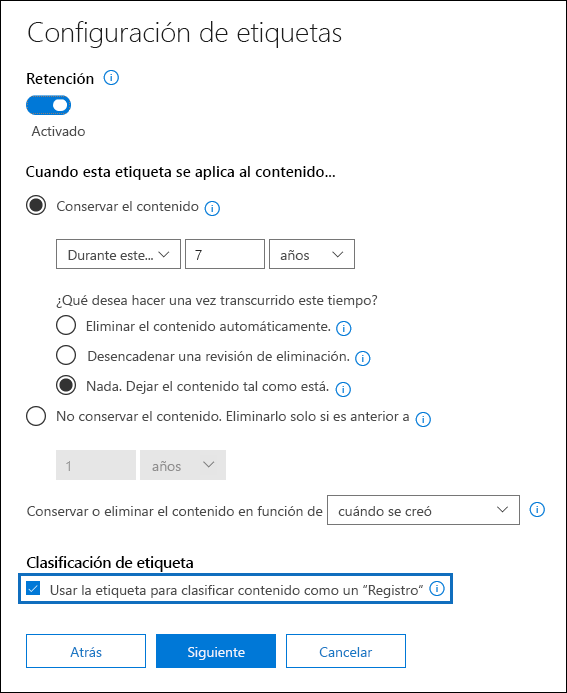
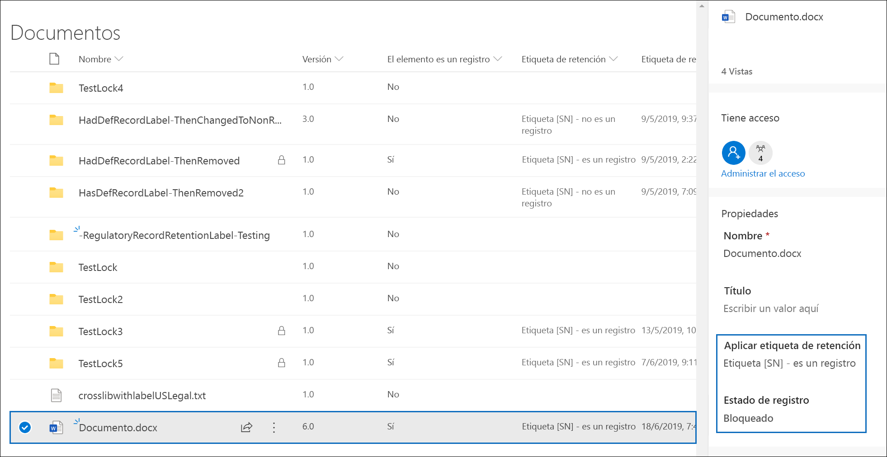
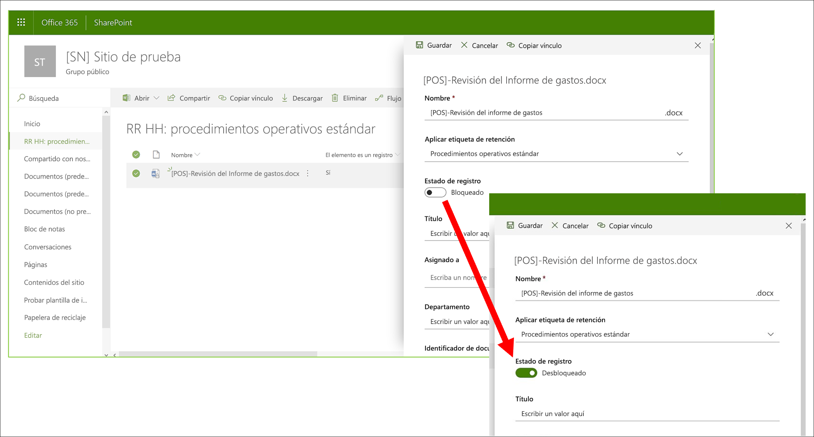
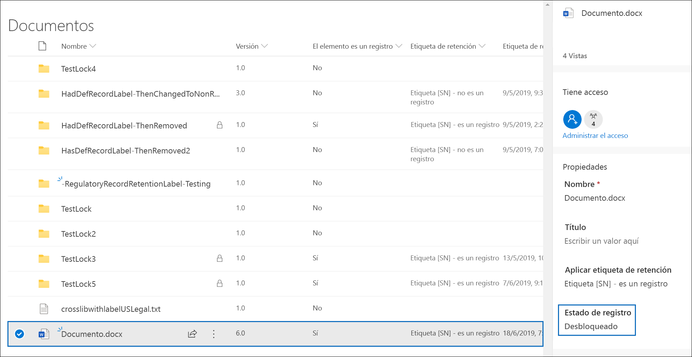
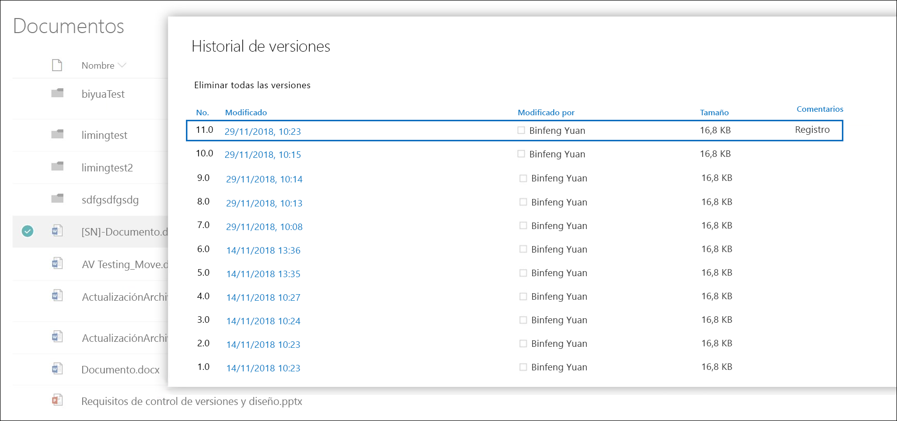
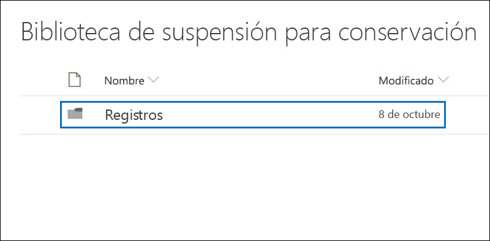
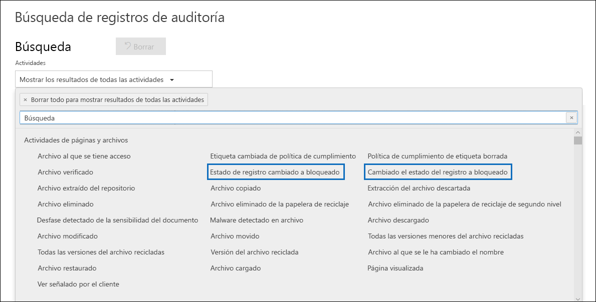

# Obtenga más información sobre los registros

>*[Instrucciones de licencias de Microsoft 365 para la seguridad y el cumplimiento](https://aka.ms/ComplianceSD).*

La administración de registros de Microsoft 365 ayuda a su organización a cumplir con las directivas corporativas y las obligaciones legales o reglamentarias, al mismo tiempo que reduce el riesgo y la responsabilidad legal.

Cuando el contenido está marcado como un registro:

- El elemento pasa a ser inmutable, lo que significa que un registro no se puede modificar ni eliminar.

- Se registran otras actividades sobre el elemento.

- Usted tendrá la prueba de disposición cuando se eliminen al final de su período de retención.

Puede usar las [etiquetas de retención](labels.md) para marcar el contenido como un registro. Una vez que haya creado las etiquetas de retención que declaran registros, puede publicarlas (de modo que los usuarios y administradores puedan aplicarlas manualmente al contenido) o aplicarlas automáticamente al contenido que desee marcar como registro. Para más instrucciones, consulte [Crear, publicar y aplicar automáticamente etiquetas de retención](create-retention-labels.md).

Al usar las etiquetas de retención para declarar registros, puede implementar una estrategia de administración de registros uniforme en todo el entorno de Microsoft 365.

Tenga en cuenta lo siguiente respecto a los registros:

  - **Los registros son inmutables**. Se puede aplicar una etiqueta de retención que marque el contenido como un registro en el contenido de Exchange, además de SharePoint y OneDrive. Sin embargo, el [control de versiones de registros](#record-versioning) solo está disponible en SharePoint y en OneDrive, y no en Exchange.

    En Exchange, el contenido etiquetado como un registro no es mutable hasta su eliminación final. Cuando un elemento de Exchange se etiqueta como un registro, suceden cuatro situaciones:

    - El elemento no se puede eliminar de forma permanente.

    - El elemento no se puede editar.

    - La etiqueta no se puede cambiar.

    - La etiqueta no se puede quitar.

  - **Registros y carpetas**. Puede aplicar una etiqueta de retención a una carpeta de Exchange, SharePoint y OneDrive. Si una carpeta se etiqueta como un registro y se mueve un elemento a la carpeta, el elemento se etiquetará como un registro. Cuando se mueve el elemento fuera de la carpeta, el elemento seguirá etiquetado como un registro.

    Además, si cambia la etiqueta de registro aplicada a una carpeta (en SharePoint y OneDrive) a una etiqueta de retención que no declare el contenido como un registro, los elementos de la carpeta mantendrán su etiqueta de registro existente.

    Para obtener más información sobre cómo aplicar etiquetas de retención a carpetas de SharePoint y OneDrive, consulte [Aplicar una etiqueta de retención predeterminada a todo el contenido de una biblioteca, carpeta o conjunto de documentos de SharePoint](labels.md#applying-a-default-retention-label-to-all-content-in-a-sharepoint-library-folder-or-document-set).

  - **No se pueden eliminar los registros**. Si un usuario intenta eliminar un registro en Exchange, el elemento se mueve a la carpeta Elementos recuperables, tal y como se describe en [Cómo funciona una directiva de retención con Exchange](retention-policies-exchange.md#how-a-retention-policy-works-with-exchange).

    Si un usuario intenta eliminar un registro en SharePoint, se muestra un error que indica que no se eliminó el elemento y permanece en la biblioteca.

    

    Si un usuario trata de eliminar un registro en OneDrive, el elemento se mueve a la biblioteca de conservación de documentos, tal y como se describe en [Cómo funciona una directiva de retención con SharePoint y OneDrive](retention-policies-sharepoint.md#how-a-retention-policy-works-with-sharepoint-and-onedrive).

  - **Las etiquetas de registros no se pueden quitar**. Después de que se ha aplicado una etiqueta de registro a un elemento, solo el administrador de esa ubicación (por ejemplo, un administrador de la colección de sitios de un sitio de SharePoint) puede quitar la etiqueta de registro.

## Usar etiquetas de retención para declarar registros

Al crear una etiqueta de retención, tiene la opción de usarla para marcar el contenido como un registro:

1. En el Centro de cumplimiento de Microsoft 365, vaya a **Administración de registros** \> **Plan de archivos**. En la página **Plan de archivos**, seleccione **Crear una etiqueta**.

2. En la página **Configuración de la etiqueta** del asistente, elija la opción para establecer la etiqueta de retención para declarar el contenido como un registro.
    
   

3. [Publicar](labels.md#how-retention-labels-work-with-retention-label-policies) o [aplicar automáticamente](labels.md#applying-a-retention-label-automatically-based-on-conditions) la etiqueta de retención en los sitios de SharePoint y/o cuentas de OneDrive.

### Aplicar una etiqueta de retención al contenido

Para Exchange, todos los usuarios con acceso de escritura al buzón pueden aplicar una etiqueta de registro a un mensaje de correo electrónico. Para el contenido de SharePoint y OneDrive, cualquier usuario del grupo predeterminado miembros (con nivel de permisos de contribución) puede aplicar una etiqueta de registro al contenido. Solo el administrador de la colección de sitios puede quitar o cambiar la etiqueta de registro una vez que se ha aplicado. Como ya se explicó anteriormente, una etiqueta de retención que clasifica el contenido como un registro que se puede aplicar automáticamente al contenido.

Este es el aspecto que tiene esto cuando se aplica una etiqueta de registro a un documento en un sitio de SharePoint o en una cuenta de OneDrive.
  

## Control de versiones de registros

Una parte esencial de la administración de registros es la capacidad para declarar un documento como un registro y tener ese registro. Al mismo tiempo, la inestabilidad del registro evita que la colaboración se realice en el documento si los usuarios necesitan crear versiones posteriores. Por ejemplo, puede declarar un contrato de ventas como un registro, pero después necesita actualizar el contrato con nuevos términos y declarar la versión más reciente como un nuevo registro, manteniendo aún la versión de registro anterior. Para estos tipos de escenarios, SharePoint Online y OneDrive admite el *control de versiones de registros*. Las carpetas del Bloc de notas de OneNote no admiten el control de versiones de registros.

Para usar el control de versiones de registros, el primer paso es usar el Centro de cumplimiento de Microsoft 365 para crear y publicar etiquetas de retención que declaren registros para todos los sitios de SharePoint y las cuentas de OneDrive, o bien puede publicarlas en sitios de SharePoint específicos o cuentas de OneDrive. El siguiente paso es aplicar una etiqueta de registro de retención publicada a un documento. Cuando esto pase, se mostrará la propiedad de documento, llamada *Estado del registro* junto a la etiqueta de retención, y el estado de la grabación inicial estará **bloqueada**. En este punto, puede llevar a cabo una de las acciones siguientes:

  - **Edite y declare continuamente versiones individuales del documento como registros, desbloqueando y bloqueando la propiedad Estado del registro**. Solo se conservan las versiones declaradas como registros al establecer la propiedad **Estado del registro** en **bloqueada**. Esto reduce el riesgo de conservar las versiones y copias innecesarias del documento.

  - **Hacer que los registros se almacenen automáticamente en un repositorio de registros locales que se encuentra dentro de la colección de sitios**. Todas las colecciones de sitios de SharePoint y OneDrive conserva el contenido en su biblioteca de suspensión para conservación. Las versiones de registro se almacenan en la carpeta registros de esta biblioteca.

  - **Mantenga un documento de hoja perenne que contenga todas las versiones**. De forma predeterminada, todos los documentos de SharePoint y OneDrive tienen un historial de versiones disponible en el menú elemento. En esta historia de versiones, puede ver fácilmente las versiones que son registros y ver esos documentos.

El control de versiones de registros está disponible automáticamente para todos los documentos que contengan una etiqueta de retención que declara el elemento como un registro. Cuando un usuario ve las propiedades del documento en el panel de detalles, se activa el **Estado del registro** de **bloqueado** a **desbloqueado**. Este solo clic crea un registro en la carpeta registros de la biblioteca de suspensión para conservación, donde se encuentra por el resto de su período de retención. 

Cuando el documento esté desbloqueado, todos los usuarios con permisos podrán editar el archivo. Sin embargo, los usuarios no pueden eliminar el archivo porque se considera un registro. Después de realizar los cambios necesarios, el usuario puede alternar el estado de **Estado del registro** de **Desbloqueado** a **Bloqueado**, de modo que el documento se declare nuevamente un registro y no se pueda editar.
  

### Bloquear y desbloquear un registro

Cuando se asigna una etiqueta de registro a un documento, cualquier usuario con permisos de Colaboración o un nivel de permisos más limitado puede desbloquear un registro o bloquear un registro desbloqueado.
  

Cuando un usuario desbloquea un registro, tienen lugar las siguientes acciones:

1. Si la colección de sitios actual no tiene una biblioteca de suspensión para conservación, se crea una.

2. Si la biblioteca de suspensión para conservación no tiene una carpeta de registros, se crea una.

3. Una acción **Copiar a** copia la última versión del documento en la carpeta registros. La acción **Copiar a** solo incluye la versión más reciente y ninguna de las versiones anteriores. Este documento copiado se considera ahora una versión de registro del documento y su nombre de archivo tiene el formato: \[Título GUID versión\#\]

4. La copia que se ha creado en la carpeta registros que se ha agregado al historial de versiones del documento original, y esta versión muestra el **registro** de Word en el campo Comentarios.

5. El documento original es una nueva versión que se puede editar (pero no eliminar). La columna de la biblioteca de documentos **el elemento es un registro** aún muestra el valor **sí**, ya que el documento se considera un registro aún cuando se puede modificar ahora.

Cuando un usuario bloquea un registro, no se puede editar el documento original. Sin embargo, es la acción de desbloquear un registro que copia una versión en la carpeta registros de la biblioteca de suspensión para conservación.

### Versiones de registro

Cada vez que un usuario desbloquea un registro, la versión más reciente se copia en la carpeta registros de la biblioteca de suspensión para conservación, que contiene el valor de **registro** en el campo **comentarios** del historial de versiones.
  

Para ver el historial de versiones, seleccione un documento de la biblioteca de documentos y, a continuación, haga clic en **Historial de versiones** en el menú elemento.

### Dónde se almacenan los registros

Los registros se almacenan en la carpeta registros de la biblioteca de suspensión para conservación en el sitio de nivel superior de la colección de sitios. En el panel de navegación izquierdo en el sitio de nivel superior, elija **Contenidos del sitio** \> **biblioteca de suspensión para conservación**.
  

  

La biblioteca de suspensión para conservación solo es visible para los administradores de la colección de sitios. Asimismo, la biblioteca de suspensión para conservación no existe de forma predeterminada. Solo se crea cuando el contenido sometido a una etiqueta de retención o una directiva de retención se elimina por primera vez en la colección de sitios.

### Buscar en el registro de auditoría los eventos de control de versiones de registros

Las acciones para bloquear y desbloquear registros se registran en el registro de auditoría. Puede buscar actividades específicas **cambiado el estado del registro a bloqueado** y **cambiado el estado del registros a desbloqueado**, que se encuentran en la sección **Actividades de archivo y de página** de la lista desplegable **Actividades** en la página **Búsqueda de registros de auditoría** en el centro de seguridad y cumplimiento.
  

Para obtener más información sobre la búsqueda de estos eventos, vea la sección "Actividades de archivo y de página" en [Buscar el registro de auditoría en el centro de seguridad y cumplimiento](search-the-audit-log-in-security-and-compliance.md#file-and-page-activities).

## Siguientes pasos

Para obtener instrucciones sobre cómo crear y publicar las etiquetas de retención que contengan la configuración para marcar contenido como un registro, vea [Crear, publicar y aplicar automáticamente etiquetas de retención](create-retention-labels.md).
