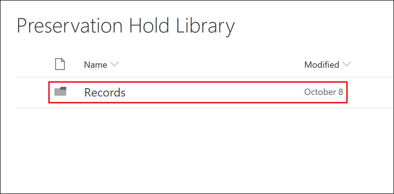

# Información general de registrosOverview of records

La administración de registros de Microsoft 365 ayuda a las organizaciones a cumplir con sus obligaciones corporativas, jurídicas y reglamentarias, al tiempo que reduce el riesgo y la responsabilidad legal.Managing records in Microsoft 365 helps an organization comply with their corporate policies, legal and regulatory obligations while reducing risk and legal liability.

En un nivel alto, la declaración de contenido como un registro significa que:At a high level, declaring content as a record means that:

- El elemento pasa a ser inmutable (un registro no se puede modificar ni eliminar)The item becomes immutable (a record can't be modified or deleted)

- Se registran otras actividades sobre el elementoAdditional activities about the item are logged

- Los registros se eliminan cuando se supera el período de retención declarado.Records are disposed of after their stated retention period is past

Puede usar las [etiquetas de retención](labels.md) para clasificar el contenido como un registro.You can use [retention labels](labels.md) to classify content as a record. Una vez que haya creado las etiquetas de retención que declaran registros, puede [publicarlas](labels.md#how-retention-labels-work-with-retention-label-policies) (de modo que los usuarios puedan usarlas para clasificar el contenido como registros) o [aplicar automáticamente estas etiquetas](labels.md#applying-a-retention-label-automatically-based-on-conditions) al contenido que desea clasificar como registro.After you create retention labels that declare records, you can either [publish](labels.md#how-retention-labels-work-with-retention-label-policies) those labels (so that users can use them to classify content as records) or [auto-apply those labels](labels.md#applying-a-retention-label-automatically-based-on-conditions) to content that you want to classify as a record. Al usar las etiquetas de retención para declarar registros, puede implementar una única estrategia coherente de administración de registros para todos los Office 365, mientras que otras características de administración de registros, como el Centro de registros, solo se aplican al contenido de SharePoint Online.By using retention labels to declare records, you can implement a single, consistent records-management strategy across all of Office 365, whereas other records-management features such as the Record Center apply only to content in SharePoint Online.

Tenga en cuenta lo siguiente respecto a los registros:Keep the following things in mind about records:

  - **Los registros son inmutables**.**Records are immutable.** Se puede aplicar una etiqueta de retención que declara el contenido como un registro en el contenido de Exchange, además de SharePoint y OneDrive para la Empresa.A retention label that declares content as a record can be applied to content in Exchange, in addition to SharePoint and OneDrive for Business. Sin embargo, el [control de versiones de registros](#record-versioning) solo está disponible en SharePoint y en OneDrive, y no en Exchange.However, [record versioning](#record-versioning) is available only in SharePoint and OneDrive, and not for Exchange.

    En Exchange, el contenido etiquetado como un registro no es mutable hasta su eliminación final.In Exchange, content labeled as a record is immutable until its final deletion. Cuando un elemento de Exchange se etiqueta como un registro, suceden cuatro situaciones:When an Exchange item is labeled as a record, four things happen:

    - El elemento no se puede eliminar de forma permanente.The item can't be permanently deleted.

    - El elemento no se puede editar.The item can't be edited.

    - La etiqueta no se puede cambiar.The label can't be changed.

    - La etiqueta no se puede quitar.The label can't be removed.

  - **Registros y carpetas**.**Records and folders.** Puede aplicar una etiqueta de retención a una carpeta de Exchange, SharePoint y OneDrive.You can apply a retention label to a folder in Exchange, SharePoint, and OneDrive. Si una carpeta se etiqueta como un registro y se mueve un elemento a la carpeta, el elemento se etiquetará como un registro.If a folder is labeled as a record, and you move an item into the folder, the item is labeled as a record. Cuando se mueve el elemento fuera de la carpeta, el elemento seguirá etiquetado como un registro.When you move the item out of the folder, the item remains labeled as a record.

    Además, si cambia la etiqueta de registro aplicada a una carpeta (en SharePoint y OneDrive) a una etiqueta de retención que no declara el contenido como un registro, los elementos de la carpeta mantienen su etiqueta de registro existente.Also, if you change the record label that's applied to a folder (in SharePoint and OneDrive) to a retention label that does not declare content as a record, then items in the folder keep their existing  record label.

    Para obtener más información sobre cómo aplicar etiquetas de retención a carpetas de SharePoint y OneDrive, consulte [Aplicar una etiqueta de retención predeterminada a todo el contenido de una biblioteca, carpeta o conjunto de documentos de SharePoint](labels.md#applying-a-default-retention-label-to-all-content-in-a-sharepoint-library-folder-or-document-set).For more information about applying retention labels to SharePoint and OneDrive folders, see [Applying a default retention label to all content in a SharePoint library, folder, or document set](labels.md#applying-a-default-retention-label-to-all-content-in-a-sharepoint-library-folder-or-document-set).

  - **No se pueden eliminar los registros**.**Records can't be deleted**. Si un usuario intenta eliminar un registro en Exchange, el elemento se mueve a la carpeta elementos recuperables, tal y como se describe en [Cómo funciona una directiva de retención local](retention-policies.md#content-in-mailboxes-and-public-folders).If a user attempts to delete a record in Exchange, the item is moved to the Recoverable Items folder as described in [How a retention policy works with content in place](retention-policies.md#content-in-mailboxes-and-public-folders).

    Si un usuario intenta eliminar un registro en SharePoint, se muestra un error que indica que no se eliminó el elemento y permanece en la biblioteca.If a user attempts to delete a record in a SharePoint, an error is displayed say that the item wasn't deleted, and remains in the library.

    

    Si un usuario trata de eliminar un registro en OneDrive, el elemento se mueve a la biblioteca de conservación de documentos, tal y como se describe en [cómo funciona una directiva de retención con el contenido en su sitio](retention-policies.md#content-in-onedrive-accounts-and-sharepoint-sites).If a user attempts to delete a record in OneDrive, the item is moved to the Preservation Hold library as described in [How a retention policy works with content in place](retention-policies.md#content-in-onedrive-accounts-and-sharepoint-sites).

  - **Las etiquetas de registros no se pueden quitar**.**Records labels can't be removed.** Cuando se ha aplicado una etiqueta de registro a un elemento, solo el administrador de esa ubicación (por ejemplo, un administrador de la colección de sitios de un sitio de SharePoint) puede quitar la etiqueta de registro.Once a record label has been applied to an item, only the admin of that location (for example, a site collection admin of a SharePoint site) can remove that record label.

## Usar etiquetas de retención para declarar registrosUsing retention labels to declare records

Al crear una etiqueta de retención, puede usarla para clasificar el contenido como un registro.When you create a retention label, you have the option to use the retention label to classify the content as a record. Para declarar el contenido como un registro, siga estos pasos:To declare content as a record, follow these steps:

1. Cree una etiqueta de retención.Create a retention label. En el Centro de cumplimiento de Microsoft 365, vaya a **Administración de registros** \> **Plan de archivos**.In the Microsoft 365 compliance center, go to **Records Management** \> **File Plan**. En la página **Plan de archivos**, haga clic en **Crear una etiqueta**.On the **File plan** page, click  **Create a label**.

2. En la página **Configuración de la etiqueta** del asistente, elija la opción para establecer la etiqueta de retención para declarar el contenido como un registro.On the **Label settings** page in the wizard, choose the option to set the retention label to declare content as a record. 

   

3. [Publicar](labels.md#how-retention-labels-work-with-retention-label-policies) o [aplicar automáticamente](labels.md#applying-a-retention-label-automatically-based-on-conditions) la etiqueta de retención en los sitios de SharePoint y/o cuentas de OneDrive.[Publish](labels.md#how-retention-labels-work-with-retention-label-policies) or [auto-apply](labels.md#applying-a-retention-label-automatically-based-on-conditions) the retention label to SharePoint sites and/or OneDrive accounts.

> [!NOTE]
> La declaración de un elemento como registro con [etiquetas de retención](labels.md) requiere una licencia de Office 365 Enterprise E5 o equivalente para cada usuario que tenga permisos para editar el contenido en esta ubicación.Declaring an item as a record using [retention labels](labels.md) requires an Office 365 Enterprise E5 license or equivalent for each user who has permissions to edit content in this location. Los usuarios que tienen acceso de solo lectura no necesitan una licencia.Users who have read-only access don't require a license.

### Aplicar una etiqueta de retención al contenidoApplying a retention label to content

Para Exchange, todos los usuarios con acceso de escritura al buzón pueden aplicar una etiqueta de registro a un mensaje de correo electrónico.For Exchange, any user with write-access to the mailbox can apply a record label to an email message. Para el contenido de SharePoint y OneDrive, cualquier usuario del grupo predeterminado miembros (con nivel de permisos de contribución) puede aplicar una etiqueta de registro al contenido.For content in SharePoint and OneDrive, any user in the default Members group (the Contribute permission level) can apply a record label to content. Solo el administrador de la colección de sitios puede quitar o cambiar la etiqueta de registro una vez que se ha aplicado.Only a site collection admin can remove or change that record label after it's been applied. Como ya se explicó anteriormente, una etiqueta de retención que clasifica el contenido como un registro que se puede aplicar automáticamente al contenido.As previously explained, a retention label that classifies content as a record can be auto-applied to content.

Este es el aspecto que tiene esto cuando se aplica una etiqueta de registro a un documento en un sitio de SharePoint o en una cuenta de OneDrive.Here's what this looks like when a record label is applied to a document on a SharePoint site or OneDrive account.
  

## Control de versiones de registrosRecord versioning

Una parte esencial de la administración de registros es la capacidad para declarar un documento como un registro y tener ese registro.An essential part of records management is the ability to declare a document as a record and have that record be immutable. Al mismo tiempo, la inestabilidad del registro evita que la colaboración se realice en el documento si los usuarios necesitan crear versiones posteriores.At the same time, record immutability prevents collaboration on the document if people need to create subsequent versions. Por ejemplo, puede declarar un contrato de ventas como un registro, pero después necesita actualizar el contrato con nuevos términos y declarar la versión más reciente como un nuevo registro, manteniendo aún la versión de registro anterior.For example, you might declare a sales contract as a record, but then need to update the contract with new terms and declare the latest version as a new record while still retaining the previous record version. Para estos tipos de escenarios, SharePoint Online y OneDrive para la Empresa ahora son compatibles con el *control de versiones de registros*.For these types of scenarios, SharePoint Online and OneDrive for Business now support *record versioning*. Las carpetas del Bloc de notas de OneNote no son compatibles.OneNote notebook folders are not supported.

Para usar el control de versiones de registros, el primer paso es usar el Centro de cumplimiento de Microsoft 365 para crear y publicar etiquetas de retención que declaren registros para todos los sitios de SharePoint y/o cuentas de OneDrive, o bien puede publicarlas en sitios de SharePoint específicos y/o cuentas de OneDrive.To use record versioning, the first step is to use the Microsoft 365 compliance center to create and publish retention labels that declare records to all SharePoint sites and/or OneDrive accounts, or publish them to specific SharePoint sites and/or OneDrive accounts. El siguiente paso es aplicar una etiqueta de registro de retención publicada a un documento.The next step is to apply a published retention record label to a document. Cuando se haya completado este paso, se mostrará la propiedad de documento, llamada *Estado del registro* junto a la etiqueta de retención, y el estado de la grabación inicial estará **bloqueada**.When this is done, a document property, called *Record status* is displayed next to the retention label, and the initial record status will be **Locked**. En este punto, puede llevar a cabo una de las acciones siguientes:At this point, you can do the following things:

  - **Edite y declare continuamente versiones individuales del documento como registros, desbloqueando y bloqueando la propiedad Estado del registro**.**Continually edit and declare individual versions of the document as records, by unlocking and locking the Record status property.** Solo se conservan las versiones declaradas como registros al establecer la propiedad **Estado del registro** en **bloqueada**.Only the versions declared as records are retained when the **Record status** property is set to **Locked**. Esto reduce el riesgo de conservar las versiones y copias innecesarias del documento.This reduces the risk of retaining unnecessary versions and copies of the document.

  - **Hacer que los registros se almacenen automáticamente en un repositorio de registros locales que se encuentra dentro de la colección de sitios**.**Have the records automatically stored in an in-place records repository located within the site collection.** Todas las colecciones de sitios de SharePoint y OneDrive conserva el contenido en su biblioteca de suspensión para conservación.Each site collection in SharePoint and OneDrive preserves content in its Preservation Hold library. Las versiones de registro se almacenan en la carpeta registros de esta biblioteca.Record versions are stored in the Records folder in this library.

  - **Mantenga un documento de hoja perenne que contenga todas las versiones**.**Maintain an evergreen document that contains all versions.** De forma predeterminada, todos los documentos de SharePoint y OneDrive tienen un historial de versiones disponible en el menú elemento.By default, each SharePoint and OneDrive document has a version history available on the item menu. En esta historia de versiones, puede ver fácilmente las versiones que son registros y ver esos documentos.In this version history, you can easily see which versions are records and view those documents.

El control de versiones de registros está disponible automáticamente para todos los documentos que contengan una etiqueta de retención que declara el elemento como un registro.Record versioning is automatically available for any document that has a retention label that declares the item as a record. Cuando un usuario ve las propiedades del documento en el panel de detalles, se activa el **Estado del registro** de **bloqueado** a **desbloqueado**.When a user views the document properties through the details pane, they toggle the **Record status** from **Locked** to **Unlocked**. Este solo clic crea un registro en la carpeta registros de la biblioteca de suspensión para conservación, donde se encuentra por el resto de su período de retención.This single click creates a record in the Records folder in the Preservation Hold library, where it resides for the remainder of its retention period. Cuando el documento esté desbloqueado, todos los usuarios con permisos podrán editar el archivo.While the document is unlocked, any user with permissions can edit the file. Sin embargo, los usuarios no pueden eliminar el archivo porque se considera un registro declarado.However, users can't delete the file, because it's considered a declared record. Después de realizar los cambios necesarios, el usuario puede alternar el estado de **Estado del registro** de **Desbloqueado** a **Bloqueado**, de modo que el documento se declare nuevamente un registro y no se pueda editar.After the necessary changes are made, the user can then toggle the **Record status** from **Unlocked** to **Locked**, so that the document is again declared a record and can't be edited.
  

> [!NOTE]
> El control de versiones de registros requiere una licencia de Office 365 Enterprise E5 para cada usuario que tenga permisos para editar el contenido que se ha declarado como un registro en un sitio de SharePoint o en una cuenta de OneDrive.Record versioning requires an Office 365 Enterprise E5 license for each user who has permissions to edit content that's been declared a record in a SharePoint site or OneDrive account. Los usuarios que tienen acceso de solo lectura no necesitan esta licencia.Users who have read-only access don't require this license.

### Bloquear y desbloquear un registroLocking and unlocking a record

Cuando se asigna una etiqueta de registro a un documento, cualquier usuario con permisos de Colaboración o un nivel de permisos más limitado puede desbloquear un registro o bloquear un registro desbloqueado.After a record label is assigned to a document, any user with Contribute permissions or a narrower permission level can unlock a record or lock an unlocked record.
  

Cuando un usuario desbloquea un registro, tienen lugar las siguientes acciones:When a user unlocks a record, the following actions occur:

1. Si la colección de sitios actual no tiene una biblioteca de suspensión para conservación, se crea una.If the current site collection doesn't have a Preservation Hold library, one is created.

2. Si la biblioteca de suspensión para conservación no tiene una carpeta de registros, se crea una.If the Preservation Hold library doesn't have a Records folder, one is created.

3. Una acción **Copiar a** copia la última versión del documento en la carpeta registros.A **Copy to** action copies the latest version of the document to the Records folder. La acción **Copiar a** solo incluye la versión más reciente y ninguna de las versiones anteriores.The **Copy to** action includes only the latest version and no prior versions. Este documento copiado se considera ahora una versión de registro del documento y su nombre de archivo tiene el formato: \[Título GUID versión\#\]This copied document is now considered a record version of the document, and its file name has the format: \[Title GUID Version\#\]

4. La copia que se ha creado en la carpeta registros que se ha agregado al historial de versiones del documento original, y esta versión muestra el **registro** de Word en el campo Comentarios.The copy created in the Records folder added to the version history of the original document, and this version shows the word **Record** in the comments field.

5. El documento original es una nueva versión que se puede editar (pero no eliminar).The original document is a new version that can be edited (but not deleted). La columna de la biblioteca de documentos **el elemento es un registro** aún muestra el valor **sí**, ya que el documento se considera un registro aún cuando se puede modificar ahora.The document library column **Item is a Record** still shows the **Yes** value because the document is still considered a record, even if it can now be edited.

Cuando un usuario bloquea un registro, no se puede editar el documento original.When a user locks a record, the original document again can't be edited. Sin embargo, es la acción de desbloquear un registro que copia una versión en la carpeta registros de la biblioteca de suspensión para conservación.But it is the action of unlocking a record that copies a version to the Records folder in the Preservation Hold library.

### Versiones de registroRecord versions

Cada vez que un usuario desbloquea un registro, la versión más reciente se copia en la carpeta registros de la biblioteca de suspensión para conservación, que contiene el valor de **registro** en el campo **comentarios** del historial de versiones.Each time a user unlocks a record, the latest version is copied to the Records folder in the Preservation Hold library, and that version contains the value of **Record** in the **Comments** field of the version history.
  

Para ver el historial de versiones, seleccione un documento de la biblioteca de documentos y, a continuación, haga clic en **Historial de versiones** en el menú elemento.To view the version history, select a document in the document library and then click **Version history** in the item menu.

### Dónde se almacenan los registrosWhere records are stored

Los registros se almacenan en la carpeta registros de la biblioteca de suspensión para conservación en el sitio de nivel superior de la colección de sitios.Records are stored in the Records folder in the Preservation Hold library in the top-level site in the site collection. En el panel de navegación izquierdo en el sitio de nivel superior, elija **Contenidos del sitio** \> **biblioteca de suspensión para conservación**.In the left nav on the top-level site, choose **Site contents** \> **Preservation Hold Library**.
  

  

La biblioteca de suspensión para conservación solo es visible para los administradores de la colección de sitios.The Preservation Hold library is visible only to site collection admins. Asimismo, la biblioteca de suspensión para conservación no existe de forma predeterminada.Also, the Preservation Hold library doesn't exist by default. Solo se crea cuando el contenido sometido a una etiqueta de retención o una directiva de retención se elimina por primera vez en la colección de sitios.It's created only when content subject to a retention label or retention policy is deleted for the first time in the site collection.

### Buscar en el registro de auditoría los eventos de control de versiones de registrosSearching the audit log for record versioning events

Las acciones para bloquear y desbloquear registros se registran en el registro de auditoría de Office 365.The actions of locking and unlocking records are logged in the Office 365 audit log. Puede buscar actividades específicas **cambiado el estado del registro a bloqueado** y **cambiado el estado del registros a desbloqueado**, que se encuentran en la sección **Actividades de archivo y de página** de la lista desplegable **Actividades** en la página **Búsqueda de registros de auditoría** en el centro de seguridad y cumplimiento.You can search for the specific activities **Changed record status to locked** and **Changed record status to unlocked**, which are located in the **File and page activities** section in the **Activities** dropdown list on the **Audit log search** page in the security and compliance center.
  

Para obtener más información sobre la búsqueda de estos eventos, vea la sección "Actividades de archivo y de página" en [Buscar el registro de auditoría en el centro de seguridad y cumplimiento](search-the-audit-log-in-security-and-compliance.md#file-and-page-activities).For more information about searching for these events, see the "File and page activities" section in [Search the audit log in the Security & Compliance Center](search-the-audit-log-in-security-and-compliance.md#file-and-page-activities).
