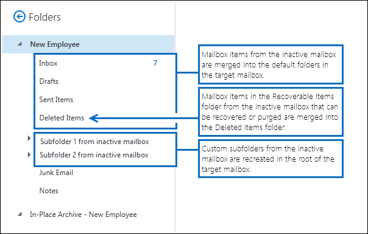

# <a name="restore-an-inactive-mailbox"></a>Restaurar un buzón inactivo

Un buzón inactivo (que es un tipo de buzón eliminado temporalmente) se usa para conservar el correo electrónico de un antiguo empleado después de que abandone la organización. Si otro empleado asume las responsabilidades del empleado que se marchó o si dicho empleado vuelve a la organización, hay dos maneras en que puede hacer que el contenido del buzón inactivo esté disponible para un usuario:
  
- **Restore an inactive mailbox** If another employee takes on the job responsibilities of the departed employee, or if another user needs access to the contents of the inactive mailbox, you can restore (or merge) the contents of the inactive mailbox to an existing mailbox. You can also restore the archive from an inactive mailbox. After it's restored, the inactive mailbox is preserved and is retained as an inactive mailbox. This topic describes the procedures for restoring an inactive mailbox.

- **Recuperar un buzón inactivo** Si el empleado que se marchó vuelve a la organización o si se contrata a un nuevo empleado para que asuma las responsabilidades del empleado anterior, puede recuperar el contenido del buzón inactivo. Este método convierte el buzón inactivo en un buzón nuevo que contiene el contenido del buzón inactivo. Una vez recuperado, el buzón inactivo deja de existir. Para conocer los procedimientos paso a paso, vea [recuperar un buzón inactivo en Office 365](recover-an-inactive-mailbox.md).

Consulte la sección **más información** de este artículo para obtener más información sobre las diferencias entre restaurar y recuperar un buzón inactivo.
  
## <a name="requirements-to-restore-an-inactive-mailbox"></a>Requisitos para restaurar un buzón inactivo

- Debe usar Exchange Online PowerShell para restaurar un buzón inactivo. No puede usar el Centro de administración de Exchange (EAC). Para obtener instrucciones paso a paso, consulte [conectarse a Exchange Online PowerShell](https://go.microsoft.com/fwlink/?linkid=396554).

- Ejecute el siguiente comando en Exchange Online PowerShell para obtener información de identidad para los buzones inactivos en la organización.

    ```powershell
    Get-Mailbox -InactiveMailboxOnly | FL Name,DistinguishedName,ExchangeGuid,PrimarySmtpAddress
    ```

     Use la información devuelta por este comando para restaurar un buzón inactivo específico.

- Para obtener más información acerca de los buzones inactivos, consulte [buzones inactivos en Office 365](inactive-mailboxes-in-office-365.md).

## <a name="restore-an-inactive-mailbox"></a>Restaurar un buzón inactivo

Use the **New-MailboxRestoreRequest** cmdlet with the  _SourceMailbox_ and  _TargetMailbox_ parameters to restore the contents of an inactive mailbox to an existing mailbox. For more information about using this cmdlet, see [New-MailboxRestoreRequest](https://go.microsoft.com/fwlink/?linkid=856298).
  
1. Cree una variable que contenga las propiedades del buzón inactivo.

    ```powershell
    $InactiveMailbox = Get-Mailbox -InactiveMailboxOnly -Identity <identity of inactive mailbox>
    ```

    > [!IMPORTANT]
    > In the previous command, use the value of the **DistinguishedName** or **ExchangeGUID** property to identify the inactive mailbox. These properties are unique for each mailbox in your organization, whereas it's possible that an active and an inactive mailbox might have the same primary SMTP address.
  
2. Restore the contents of the inactive mailbox to an existing mailbox. The contents of the inactive mailbox (source mailbox) will be merged into the corresponding folders in the existing mailbox (target mailbox).

    ```powershell
    New-MailboxRestoreRequest -SourceMailbox $InactiveMailbox.DistinguishedName -TargetMailbox newemployee@contoso.com -AllowLegacyDNMismatch
    ```

   Alternatively, you can specify a top-level folder in the target mailbox in which to restore the contents from the inactive mailbox. If the specified target folder or target folder structure doesn't already exist in the target mailbox, it is created during the restore process. 

    En este ejemplo se copian los elementos del buzón y las subcarpetas de un buzón inactivo a una carpeta denominada "Buzón inactivo" en la estructura de carpetas de nivel superior del buzón de destino.

   ```powershell
   New-MailboxRestoreRequest -SourceMailbox $InactiveMailbox.DistinguishedName -TargetMailbox newemployee@contoso.com -TargetRootFolder "Inactive Mailbox" -AllowLegacyDNMismatch
   ```

## <a name="restore-the-archive-from-an-inactive-mailbox"></a>Restaurar el archivo a partir de un buzón inactivo

If an inactive mailbox has an archive mailbox, you can also restore it to the archive mailbox of an existing mailbox. To restore the archive from an inactive mailbox, you have to add the  _SourceIsArchive_ and  _TargetIsAchive_ switches to the command used to restore an inactive mailbox.
  
1. Cree una variable que contenga las propiedades del buzón inactivo.

    ```powershell
    $InactiveMailbox = Get-Mailbox -InactiveMailboxOnly -Identity <identity of inactive mailbox>
    ```

    > [!NOTE]
    > In the previous command, use the value of the **DistinguishedName** or **ExchangeGUID** property to identify the inactive mailbox. These properties are unique for each mailbox in your organization, whereas it's possible that an active and an inactive mailbox might have the same primary SMTP address. 
  
2. Restore the contents of the archive from the inactive mailbox (source archive) to the archive of an existing mailbox (target archive). In this example, the contents from the source archive are copied to a folder named "Inactive Mailbox Archive" in the archive of the target mailbox.

    ```powershell
    New-MailboxRestoreRequest -SourceMailbox $InactiveMailbox.DistinguishedName -SourceIsArchive -TargetMailbox newemployee@contoso.com -TargetIsArchive -TargetRootFolder "Inactive Mailbox Archive" -AllowLegacyDNMismatch
    ```

## <a name="more-information"></a>Más información

- **¿Cuál es la diferencia principal entre recuperar y restaurar un buzón inactivo?** Al recuperar un buzón inactivo, el buzón se convierte básicamente en un buzón nuevo, el contenido y la estructura de carpetas del buzón inactivo se conservan y el buzón se vincula a una nueva cuenta de usuario. Una vez recuperado, el buzón inactivo deja de existir y los cambios realizados en el contenido en el nuevo buzón afectarán el contenido que se encontraba originalmente en retención en el buzón inactivo. Por el contrario, cuando se restaura un buzón inactivo, el contenido simplemente se copia a otro buzón de correo. El buzón inactivo se conserva y sigue siendo un buzón inactivo. Los cambios realizados en el contenido del buzón de destino no afectan el contenido original del buzón inactivo. El buzón inactivo se puede seguir buscando mediante la herramienta de [búsqueda de contenido](content-search.md), su contenido se puede restaurar a otro buzón o se puede recuperar o eliminar en una fecha posterior.

- **How do you find inactive mailboxes?** To get a list of the inactive mailboxes in your organization and display information that is useful for restoring an inactive mailbox, you can run this command.

  ```powershell
  Get-Mailbox -InactiveMailboxOnly | FL Name,PrimarySMTPAddress,DistinguishedName,ExchangeGUID,LegacyExchangeDN,ArchiveStatus
  ```

- **Use una retención por juicio o una directiva de retención de Microsoft 365 para conservar el contenido de los buzones inactivos.** Si desea conservar el estado de un buzón inactivo después de que se restaure, puede poner el buzón de destino en retención por [juicio](https://go.microsoft.com/fwlink/?linkid=856286) o aplicar una [Directiva de retención de Microsoft 365](retention.md) antes de restaurar el buzón inactivo. Esto evitará la eliminación permanente de los elementos del buzón inactivo después de que se restauran en el buzón de destino.

- **Habilitar la suspensión de retención en el buzón de destino antes de restaurar un buzón inactivo.** Como los elementos del buzón de un buzón inactivo podrían ser antiguos, considere la posibilidad de habilitar la suspensión de retención en el buzón de destino antes de restaurar un buzón inactivo. Al colocar un buzón en suspensión de retención, no se procesará la directiva de retención que se le asigna hasta que se elimine la suspensión de retención o hasta que expire el período de suspensión de retención. De este modo, el propietario del buzón de destino tiene tiempo para administrar los mensajes antiguos del buzón inactivo. De lo contrario, la directiva de retención puede eliminar los elementos antiguos (o mover elementos al buzón de archivo, si está habilitado) que han expirado en función de las opciones de retención configuradas para el buzón de destino. Para obtener más información, vea [poner un buzón de correo en suspensión de retención en Exchange Online](https://go.microsoft.com/fwlink/?linkid=856300).

- **¿Qué hace el modificador AllowLegacyDNMismatch?** En los ejemplos anteriores para restaurar un buzón inactivo, el modificador **AllowLegacyDNMismatch** se usa para permitir la restauración del buzón inactivo en un buzón de destino diferente. En un escenario típico de restauración, el objetivo es restaurar el contenido donde los buzones de origen y destino son el mismo buzón. Por lo tanto, de manera predeterminada, el cmdlet **New-MailboxRestoreRequest** se asegura de que el valor de la propiedad **legacyExchangeDN** en los buzones de origen y de destino sea el mismo. Esto ayuda a evitar que se restaure un buzón de origen en el buzón de destino incorrecto por accidente. Si intenta restaurar un buzón inactivo sin usar el modificador **AllowLegacyDNMismatch**, el comando puede dejar de funcionar si los buzones de origen y de destino tienen diferentes valores para la propiedad **LegacyExchangeDN**.

- **You can use other parameters with the New-MailboxRestoreRequest cmdlet to implement different restore scenarios for inactive mailboxes.** For example, you can run this command to restore the archive from the inactive mailbox into the primary mailbox of the target mailbox. 

  ```powershell
  New-MailboxRestoreRequest -SourceMailbox <inactive mailbox> -SourceIsArchive -TargetMailbox <target mailbox> -TargetRootFolder "Inactive Mailbox Archive" -AllowLegacyDNMismatch
  ```

  Al ejecutar este comando también puede restaurar el buzón principal inactivo en el archivo del buzón de destino.

  ```powershell
  New-MailboxRestoreRequest -SourceMailbox <inactive mailbox> -TargetMailbox <target mailbox> -TargetIsArchive -TargetRootFolder "Inactive Mailbox" -AllowLegacyDNMismatch
  ```

- **What does the TargetRootFolder parameter do?** As previously explained, you can use the **TargetRootFolder** parameter to specify a folder in the top of the folder structure (also called the root) in the target mailbox in which to restore the contents of the inactive mailbox. If you don't use this parameter, mailbox items from the inactive mailbox are merged into the corresponding default folders of the target mailbox, and custom folders are re-created in the root of the target mailbox. The following illustrations highlight these differences between not using and using the **TargetRootFolder** parameter.

    **Jerarquía de carpetas en el buzón de destino cuando no se usa el parámetro TargetRootFolder**

    
  
    **Jerarquía de carpetas en el buzón de destino cuando se usa el parámetro TargetRootFolder**

    
