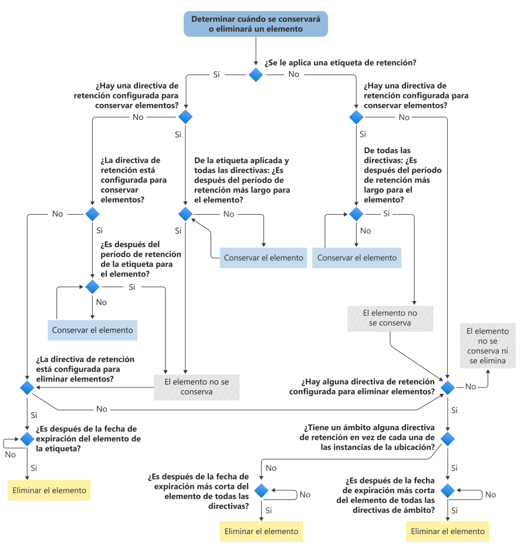

# Diagrama de flujo para determinar cuándo se conservará o eliminará permanentemente un elemento

>*[Guía de licencias de Microsoft 365 para la seguridad y el cumplimiento](/office365/servicedescriptions/microsoft-365-service-descriptions/microsoft-365-tenantlevel-services-licensing-guidance/microsoft-365-security-compliance-licensing-guidance).*

Use el siguiente diagrama de flujo para aplicar los [principios de retención](retention.md#the-principles-of-retention-or-what-takes-precedence) para un elemento y así determinar si el sistema lo conservará o lo eliminará permanentemente como resultado de una etiqueta de retención o directiva de retención.

Este flujo lógico se usa para un elemento cuando se aplica cualquiera de las condiciones siguientes:

- Se aplicó más de una directiva de retención
- Hay una etiqueta de retención y una o varias directivas de retención

Cuando un elemento está sujeto a una suspensión de exhibición de documentos electrónicos, siempre se conservará antes de que la decisión fluya para las directivas de retención y una etiqueta de retención.

Si alguno de los términos usados en este diagrama de flujo no le resulta familiar, consulte [Más información sobre las directivas de retención y las etiquetas de retención](retention.md).

   

> [!NOTE]
> Es importante distinguir entre el período de retención más largo para el elemento con respecto al período más largo especificado en una etiqueta o directiva de retención. De forma similar, entre la fecha de expiración más corta para el elemento con respecto al período más corto especificado en una directiva de retención.
> 
> Para obtener más información, vea la explicación después del gráfico en la sección de [principios de retención](retention.md#the-principles-of-retention-or-what-takes-precedence).
