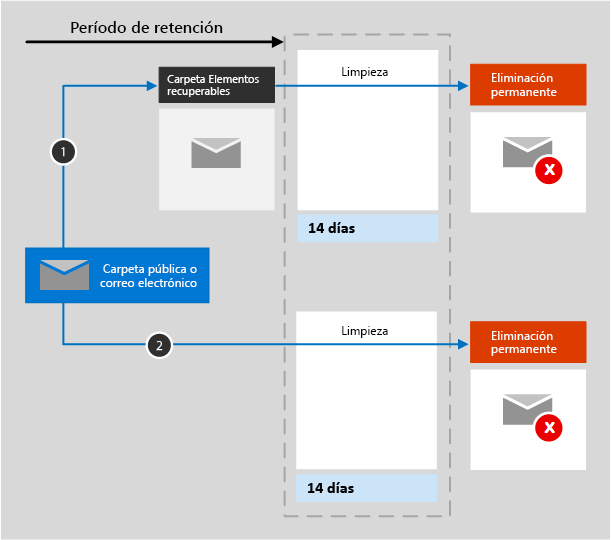

# Más información sobre las directivas de retención de Exchange

La información de este artículo complementa[Más información sobre directivas de retención](retention-policies.md) porque tiene información que es específica de Exchange.

## Cómo funciona una directiva de retención en Exchange

Para el correo, el calendario y otros elementos del buzón de un usuario, se aplica una directiva de retención a nivel de buzón.

Para las carpetas públicas, se aplica una directiva de retención a todas estas y no a nivel de carpeta o buzón.

Cuando se configura una directiva de retención para estas ubicaciones, se incluyen los siguientes elementos de correo: mensajes de correo (incluidos los borradores) con los datos adjuntos, las tareas y los elementos del calendario cuando tienen una fecha de finalización y notas. No se incluyen contactos, tareas o elementos del calendario que no tienen una fecha de finalización. El resto de los elementos almacenados en un buzón de correo, como los mensajes guardados de Skype y Teams, se incluyen con una directiva de retención diferente.

Tanto un buzón como una carpeta pública utilizan la [carpeta Elementos recuperables](https://docs.microsoft.com/exchange/security-and-compliance/recoverable-items-folder/recoverable-items-folder) para retener elementos. Sólo las personas a las que se les han asignado permisos de eDiscovery pueden ver los elementos de la carpeta Elementos recuperables de otro usuario.
  
Cuando una persona elimina un mensaje en una carpeta distinta de la carpeta Elementos eliminados, de forma predeterminada, el mensaje pasa a la carpeta Elementos eliminados. Cuando una persona elimina un elemento de la carpeta Elementos eliminados, el mensaje se mueve a la carpeta Elementos recuperables. Sin embargo, un usuario puede borrar un elemento (Mayús+Supr) en cualquier carpeta, lo que evita la carpeta Elementos eliminados y mueve el elemento directamente a la carpeta Elementos recuperables.
  
Cuando se aplica una directiva de retención a una ubicación de Exchange, un trabajo de temporizador evalúa periódicamente los elementos de la carpeta Elementos recuperables. Si un elemento no coincide con las reglas de al menos una directiva de retención, el elemento se elimina permanentemente (también denominado eliminado permanentemente) de la carpeta Elementos recuperables.

El trabajo del temporizador puede tardar hasta siete días en ejecutarse y la ubicación de Exchange debe contar con al menos 10 MB de espacio.
  
When a user attempts to change properties of a mailbox item—such as the subject, body, attachments, senders and recipients, or date sent or received for a message—a copy of the original item is saved to the Recoverable Items folder before the change is committed. Esto ocurre con cada cambio posterior. Al final del período de retención, se eliminan de forma permanente las copias de la carpeta Elementos recuperables.

Después de asignar una directiva de retención a un buzón o carpeta pública, las rutas que toma el contenido dependen de si la configuración de retención es para retener y eliminar, sólo para retener o sólo para eliminar.

Cuando los ajustes de retención son para retener y borrar:

1. **Si el elemento se ha modificado o eliminado permanentemente** por el usuario (usando MAYÚS+SUPR o eliminarlo de Elementos eliminados) durante el periodo de retención: el elemento se mueve (o es copiado, en el caso de la modificación) a la carpeta Elementos recuperables. Allí, un trabajo de temporizador se ejecuta periódicamente e identifica los artículos cuyo período de retención ha expirado, y estos artículos se eliminan de forma permanente dentro de los 14 días siguientes a la finalización del período de retención. Tenga en cuenta que 14 días es la opción predeterminada, pero puede configurar hasta 30 días.

2. **Si no se modifica ni elimina el elemento** durante el periodo de retención: se ejecuta periódicamente el mismo proceso en todas las carpetas en el buzón y se identifican los elementos cuyo periodo de retención ha caducado. Estos elementos se eliminan permanentemente en el plazo de 14 días al finalizar el periodo de retención. Tenga en cuenta que 14 días es la opción predeterminada, pero puede configurar hasta 30 días. 

Cuando los ajustes de retención son sólo de retención o sólo de borrado, las rutas de contenido son variaciones de retención y borrado:

### Rutas de contenido para la configuración de la retención de sólo lectura

1. **Si el elemento se modifica o elimina** durante el período de retención, se crea una copia del elemento original en la carpeta elementos recuperables y se conserva hasta el final del período de retención, cuando la copia en la carpeta elementos recuperables se elimina permanentemente dentro de los 14 días posteriores a la caducidad del elemento. 

2. **Si el elemento se modifica o elimina** durante el período de retención, nada sucede antes y después del período de retención; el artículo permanece en su ubicación original.

### Rutas de contenido para la configuración de retención de sólo borrado

1. **Si el elemento no se elimina** durante el período configurado: al final del período configurado en la directiva de retención, el elemento se mueve a la carpeta Elementos recuperables. 

2. **Si el elemento se elimina** durante el período configurado: el elemento se mueve inmediatamente a la carpeta Elementos recuperables. Si un usuario elimina el elemento o vacía la carpeta Elementos recuperables, el elemento se elimina de forma permanente. En caso contrario, el elemento se elimina permanentemente después de estar en la carpeta Elementos recuperables durante 14 días. 

## Excluir determinados tipos de elementos de Exchange de una directiva de retención

Mediante el uso de PowerShell, puede excluir tipos específicos de elementos de Exchange de una directiva de retención cuando la configuración de retención es solo para retención. Por ejemplo, puede excluir mensajes de correo de voz, conversaciones de mensajería instantánea y otro contenido en línea de Skype Empresarial Online en los buzones. También puede excluir los elementos de calendario, notas y tareas. Esta capacidad sólo está disponible mediante el uso de PowerShell; no está disponible cuando se crea una directiva de retención mediante el asistente en el centro de cumplimiento de Microsoft 365.
  
Para excluir los tipos seleccionados para los elementos de Exchange en una directiva de retención, utilice el parámetro`ExcludedItemClasses` con los cmdlets [New-RetentionComplianceRule](https://docs.microsoft.com/powershell/module/exchange/new-retentioncompliancerule) y [Set-RetentionComplianceRule](https://docs.microsoft.com/powershell/module/exchange/set-retentioncompliancerule).

Para usar los cmdlets de directivas de retención, primero debe [conectarse a PowerShell del Centro de seguridad y cumplimiento](https://docs.microsoft.com/powershell/exchange/connect-to-scc-powershell?view=exchange-ps).

## Cuando un usuario deja la organización 

Si un usuario deja la organización y su buzón está incluido en una directiva de retención, el buzón pasa a estado inactivo cuando se elimina la cuenta de Microsoft 365 del usuario. El contenido de un buzón inactivo sigue estando sujeto a cualquier directiva de retención que se hubiera aplicado al buzón antes de que pasara a estar inactivo, y está disponible para una búsqueda de eDiscovery. Para obtener más información, vea [Buzones de correo inactivos en Exchange Online](inactive-mailboxes-in-office-365.md). 

## Cómo configurar una directiva de retención para Exchange

Siga las instrucciones para [Crear y configurar directivas de retención](create-retention-policies.md) y para la página **Elegir ubicaciones** del asistente, seleccione una de las siguientes opciones:

- ** Aplicar la directiva sólo al contenido del correo electrónico de Exchange, las carpetas públicas, los grupos de Office 365, los documentos de OneDrive y SharePoint**

- **Permitirme elegir ubicaciones específicas** > **Correo electrónico de Exchange**, **Carpetas públicas de Exchange** y **Grupos de Office 365**.

Aunque un grupo Microsoft 365 tiene un buzón de Exchange, una directiva de retención que incluya toda la ubicación de**correo electrónico de Exchange** no incluirá el contenido de los buzones del grupo Microsoft 365. Para conservar el contenido de estos buzones, seleccione la ubicación **Grupos de Office 365**.
