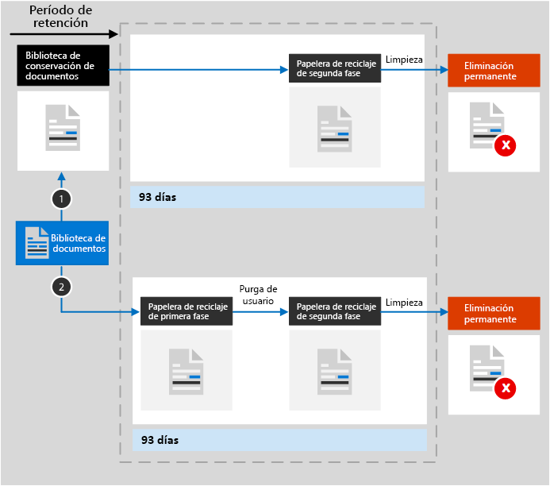

# Obtenga más información sobre la retención para SharePoint y OneDrive

>*[Instrucciones de licencias de Microsoft 365 para la seguridad y el cumplimiento](https://aka.ms/ComplianceSD).*

La información de este artículo complementa[Obtenga más información sobre las directivas de retención](retention.md)porque tiene información específica de SharePoint y OneDrive.

Para otras cargas de trabajo, vea:

- [Más información sobre las directivas de retención para Microsoft Teams](retention-policies-teams.md)
- [Más información sobre la retención para Yammer](retention-policies-yammer.md)
- [Más información sobre las directivas de retención de Exchange](retention-policies-exchange.md)

## Qué se incluye para la retención y eliminación

Todos los archivos almacenados en los sitios de SharePoint o OneDrive se pueden conservar si se aplica una directiva de retención o una etiqueta de retención. 

Se pueden eliminar los siguientes archivos:

- Al usar una directiva de retención: todos los archivos de las bibliotecas de documentos, lo cual incluye cualquier biblioteca de documentos de SharePoint que se cree automáticamente, como **Activos del sitio**.
    
- Al usar las etiquetas de retención: todos los archivos de todas las bibliotecas de documentos y todos los archivos en el nivel raíz que no estén en una carpeta.
    
> [!TIP]
> Al usar una [consulta con una directiva de aplicación automática para una etiqueta de retención](apply-retention-labels-automatically.md#auto-apply-labels-to-content-with-keywords-or-searchable-properties), puede excluir las bibliotecas de documentos específicas mediante la siguiente entrada: `NOT(DocumentLink:"<URL to document library>")`

Los elementos de la lista no son compatibles con las directivas de retención, pero sí con las etiquetas de retención, a excepción de los elementos en las listas de sistema. Se trata de listas ocultas utilizadas por SharePoint para administrar el sistema e incluir el catálogo de la página principal, el catálogo de soluciones y los orígenes de datos.

La configuración de retención de las directivas de retención y de las etiquetas de retención no se aplica a las estructuras de organización que contienen bibliotecas, listas y carpetas.

Para directivas de retención y directivas de etiqueta de aplicación automática: los sitios de SharePoint deben estar indexados para que se aplique la configuración de retención. Sin embargo, si los elementos de la biblioteca de documentos de SharePoint se configuran para que no aparezcan en los resultados de búsqueda, esta configuración no excluirá los archivos de la configuración de retención.

## Obtenga información acerca de cómo funciona la retención para SharePoint y OneDrive

Para admitir la retención, SharePoint y OneDrive crean una biblioteca de suspensión para conservación si no existe una. Puede ver esta biblioteca en la página **Contenidos del sitio** en el sitio de nivel superior de la colección de sitios. La mayoría de los usuarios no puede ver la biblioteca de suspensión para conservación porque solo es visible para los administradores de la colección de sitios.
  
Si alguien intenta cambiar o eliminar un documento que está sujeto a la configuración de retención, se comprueba si el contenido se ha cambiado desde que se aplicó la configuración de retención. Si este es el primer cambio desde que se aplicaron los ajustes de retención, el contenido se copia a la biblioteca de retención de preservación, lo que permite a la persona cambiar o eliminar el contenido original. El contenido de una colección de sitios puede copiarse a la biblioteca de conservación de documentos, independientemente de la configuración de retención.
  
Un trabajo de temporizador limpia periódicamente la biblioteca de suspensión para conservación. Este trabajo compara todo el contenido de la biblioteca de conservación de documentos con todas las consultas empleadas en la configuración de retención para este contenido. El contenido que es más antiguo que su período de retención configurado se elimina de la biblioteca de suspensión para conservación, y la ubicación original si todavía está allí. Este trabajo de temporizador se ejecuta cada siete días, lo que significa que el contenido puede tardar hasta siete días en eliminarse.
  
Este comportamiento se aplica al contenido que existe cuando se aplica la configuración de retención. Además, en el caso de las directivas de retención, el contenido nuevo que se cree o se agregue a la colección de sitios después de que se incluya en la directiva se conservará después de la eliminación. Sin embargo, el contenido nuevo no se copia en la biblioteca de suspensión para conservación la primera vez que se edita, solo cuando se elimina. Para conservar todas las versiones de un archivo, debe activar el[control de versiones](#how-retention-works-with-document-versions).
  
Un usuario recibe un error si intenta eliminar una biblioteca, lista, carpeta o sitio que está sujeto a una directiva de retención. Un usuario puede eliminar una carpeta, si primero se mueven o eliminan los archivos en la carpeta que están sujetos a la directiva. Asimismo, en esta fase se crea una biblioteca de conservación de documentos y no cuando se crea una directiva de retención o se aplica una etiqueta de retención. Esto significa que para probar la retención, en primer lugar debe editar o eliminar un documento de un sitio sujeto a una directiva de retención o que tenga una etiqueta de retención aplicada y, a continuación, vaya a la biblioteca de conservación de documentos para ver la copia retenida.
  
Cuando se asigna el contenido de una cuenta de OneDrive o un sitio de SharePoint a la configuración de retención, dependen de si la configuración de retención debe retener, eliminar, solo retener o eliminar.

Cuando los ajustes de retención son para retener y borrar:

  
1. **Si el contenido se ha modificado o eliminado** durante el periodo de retención, se crea en la biblioteca de suspensión para conservación una copia del contenido original tal como era cuando se asignó la directiva de retención. Allí, el trabajo del temporizador identifica los artículos cuyo período de retención ha expirado. Esos artículos se mueven a la segunda etapa de la Papelera de reciclaje, donde se borran permanentemente al final de los 93 días. La papelera de reciclaje de la segunda etapa no es visible para los usuarios finales (solo la papelera de reciclaje de primer nivel), pero los administradores de colecciones de sitios pueden ver y restaurar el contenido desde allí.

    > [!NOTE]
    > Para ayudar a evitar la pérdida accidental de datos, ya no se elimina permanentemente el contenido de la biblioteca de conservación de documentos. Ahora solo eliminamos de forma permanentemente el contenido de la Papelera de reciclaje. Todo el contenido de la biblioteca de suspensión para conservación pasa por la Papelera de reciclaje de segundo nivel.
    
2. **Si no se modifica ni elimina el contenido** durante el período de retención, el trabajo del temporizador mueve este contenido a la primera etapa de la Papelera de reciclaje al final del período de retención. Si un usuario elimina el contenido desde allí o vacía esta papelera de reciclaje (lo que también se conoce como purgar), el documento se mueve a la Papelera de reciclaje de segundo nivel. Un período de retención de 93 días abarca las Papeleras de reciclaje de primer y de segundo nivel. Después de 93 días, el documento se elimina de forma permanente de la ubicación donde se encuentre, ya sea en la Papelera de reciclaje de primer nivel o en la de segundo nivel. La papelera de reciclaje no está indexada y, por lo tanto, no está disponible para la búsqueda. Como resultado, una búsqueda de eDiscovery no puede encontrar ningún contenido en la papelera de reciclaje para el que aplicar una retención.

Cuando los ajustes de retención son sólo de retención o sólo de borrado, las rutas de contenido son variaciones de retención y borrado:

### Rutas de contenido para la configuración de la retención de sólo lectura

1. **Si el contenido se modifica o se elimina** durante el período de retención, una copia del documento original se crea en la biblioteca de suspensión para conservación y se conserva hasta el final del período de retención, cuando la copia de la biblioteca de suspensión para conservación se mueve a la Papelera de reciclaje de segundo nivel y se elimina de forma permanente después de 93 días.

2. **Si el contenido no se modifica ni elimina** durante el período de retención, no sucede nada antes y después del período de retención; el documento permanece en su ubicación original.

### Rutas de contenido para la configuración de retención de solo eliminación

1. **Si el contenido se elimina** durante el período configurado: el documento es trasladado a la primera etapa de la Papelera de reciclaje. Si un usuario elimina el documento desde allí o vacía esta Papelera de reciclaje, el documento se mueve a la Papelera de reciclaje de segundo nivel. Un período de retención de 93 días abarca las Papeleras de reciclaje de primer nivel y de segundo nivel. Después de 93 días, el documento se elimina de forma permanente de donde se encuentre, ya sea en la Papelera de reciclaje de primer nivel o de segundo nivel. Si el contenido se modifica durante el período configurado, sigue la misma ruta de eliminación después del período configurado.

2. **Si el contenido no se elimina** durante el período configurado: al final del período configurado en la directiva de retención, el documento se traslada a la primera etapa de la Papelera de reciclaje. Si un usuario elimina el documento desde allí o vacía esta papelera de reciclaje (lo que también se conoce como purgar), el documento se mueve a la Papelera de reciclaje de segundo nivel. Un período de retención de 93 días abarca las Papeleras de reciclaje de primer nivel y de segundo nivel. Después de 93 días, el documento se elimina de forma permanente de donde se encuentre, ya sea en la Papelera de reciclaje de primer nivel o de segundo nivel. La papelera de reciclaje no está indexada y, por lo tanto, no está disponible para la búsqueda. Como resultado, una búsqueda de eDiscovery no puede encontrar ningún contenido en la papelera de reciclaje para el que aplicar una retención.

## Cómo funciona la retención para el contenido de OneNote

Cuando aplica una directiva de retención a una ubicación que incluye contenido de OneNote, las distintas secciones de OneNote son a nivel de software archivos individuales. Esto significa que cada sección se retendrá y eliminará de forma individual, según la configuración de retención que especifique.

## Funcionamiento de una directiva de retención con versiones de documentos

El control de versiones es una característica de todas las bibliotecas de documentos en SharePoint y OneDrive. De forma predeterminada, el control de versiones retiene un mínimo de 500 versiones principales, aunque puede aumentar este límite. Para obtener más información, consulte [Habilitar y configurar el control de versiones para una lista o biblioteca](https://support.office.com/article/1555d642-23ee-446a-990a-bcab618c7a37) y [Cómo funciona el control de versiones en las listas y bibliotecas](https://support.microsoft.com/office/how-versioning-works-in-lists-and-libraries-0f6cd105-974f-44a4-aadb-43ac5bdfd247).
  
Cuando un documento con versiones está sujeto a la configuración de retención que retiene el contenido, las versiones que se copian en la biblioteca de suspensión para conservación se encuentran como un elemento independiente. Si la configuración de retención se configura para eliminar al final del período de retención:

- Si el período de retención se basa en el momento de la creación del contenido, cada versión tiene la misma fecha de caducidad que el documento original Todos los documentos originales y todas las versiones expiran al mismo tiempo.

- Si el período de retención se basa en la fecha en que se modificó el contenido por última vez, cada versión tiene su propia fecha de caducidad según la fecha en que se modificó el documento original para crear esa versión. Los documentos originales y sus versiones expiran de forma independiente.

> [!NOTE]
> Las versiones retenidas de los documentos de SharePoint y OneDrive no se pueden buscar con las herramientas de eDiscovery.

Cuando la acción de retención es eliminar el documento, todas las versiones que no se encuentren en la biblioteca de suspensión para conservación se eliminarán al mismo tiempo de acuerdo con la versión actual.

En el caso de los elementos sujetos a las directivas de retención (o a una suspensión de eDiscovery), los límites del control de versiones de la biblioteca de documentos se omiten hasta que se alcanza el período de retención del documento (o se libera la suspensión de eDiscovery). En este escenario, las versiones antiguas no se purgan automáticamente y los usuarios no pueden eliminar versiones.

Este no es el caso de las etiquetas de retención cuando el contenido está sujeto a una directiva de retención (o a una retención de eDiscovery). En su lugar, se tienen en cuenta los límites del control de versiones, por lo que las versiones anteriores se eliminan automáticamente para dar lugar a nuevas versiones, pero los usuarios todavía no pueden eliminar versiones.

## Cuando un usuario deja la organización

**SharePoint**:

Cuando un usuario deja la organización, no se verá afectado el contenido creado por el usuario, ya que SharePoint se considera un entorno de colaboración, al contrario que el buzón de un usuario o la cuenta de OneDrive.

**OneDrive**:

Si un usuario abandona su organización, cualquier archivo que esté sujeto a una directiva de retención o que tenga una etiqueta de retención permanecerá durante la duración de la directiva o la etiqueta. Durante ese período de tiempo, todo el acceso para compartir sigue funcionando. Cuando expire el período de retención, el contenido se mueve a la papelera de reciclaje de la colección de sitios y no es accesible para nadie excepto el administrador. Si un documento está marcado con una etiqueta de retención como registro, el documento no se eliminará hasta que finalice el período de retención, tras lo cual el contenido se eliminará de forma permanente.

## Instrucciones de configuración

Si va a configurar la retención en Microsoft 365 por primera vez, consulte [Introducción a las directivas y etiquetas de retención](get-started-with-retention.md).

Si está listo para configurar una directiva de retención o etiqueta de retención para Exchange, consulte las siguientes instrucciones:
- [Crear y configurar directivas de retención](create-retention-policies.md)
- [Crear etiquetas de retención y aplicarlas en aplicaciones](create-apply-retention-labels.md)
- [Aplicar una etiqueta de retención automáticamente al contenido](apply-retention-labels-automatically.md)
