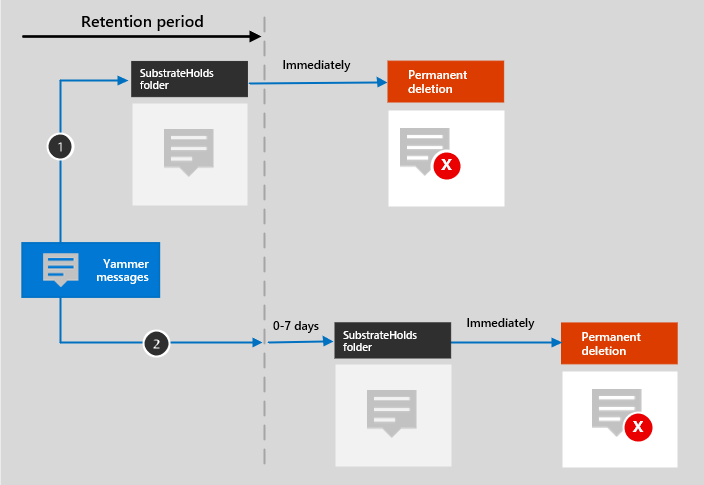

# Más información sobre la retención para YammerLearn about retention for Yammer

>*[Instrucciones de licencias de Microsoft 365 para la seguridad y el cumplimiento](/office365/servicedescriptions/microsoft-365-service-descriptions/microsoft-365-tenantlevel-services-licensing-guidance/microsoft-365-security-compliance-licensing-guidance).**[Microsoft 365 licensing guidance for security & compliance](/office365/servicedescriptions/microsoft-365-service-descriptions/microsoft-365-tenantlevel-services-licensing-guidance/microsoft-365-security-compliance-licensing-guidance).*

> [!NOTE]
> Esta característica se encuentra en versión preliminar y todavía no está disponible para todos los clientes.This feature is in preview and not yet available for all customers.

La información de este artículo complementa el contenido de [Más información sobre la retención](retention.md) porque tiene información que es específica de Yammer.The information in this article supplements [Learn about retention](retention.md) because it has information that's specific to Yammer.

Para otras cargas de trabajo, vea:For other workloads, see:

- [Obtenga más información sobre la retención de SharePoint y OneDriveLearn about retention for SharePoint and OneDrive](retention-policies-sharepoint.md)
- [Más información sobre las directivas de retención para Microsoft TeamsLearn about retention for Microsoft Teams](retention-policies-teams.md)
- [Más información sobre las directivas de retención de ExchangeLearn about retention for Exchange](retention-policies-exchange.md)

## Qué se incluye para la retención y eliminaciónWhat's included for retention and deletion

Los siguientes elementos Yammer se pueden retener y eliminar mediante directivas de retención para los Yammer: chats y mensajes de canal.The following Yammer items can be retained and deleted by using retention policies for Yammer: Community messages and private messages.

En estos mensajes no se incluyen las reacciones de otras personas en forma de iconos gestuales.Reactions from others in the form of emoticons are not included in these messages.

## Cómo funciona la retención con YammerHow retention works with Yammer

Puede usar una directiva de retención para conservar y eliminar mensajes de la comunidad y mensajes privados en Yammer.You can use a retention policy to retain and delete community messages and private messages in Yammer. Los mensajes privados se almacenan en una carpeta oculta en el buzón de cada usuario incluido en el mensaje, y los mensajes de la comunidad se almacenan en una carpeta oculta similar en el buzón de correo del grupo de la comunidad.Private messages are stored in a hidden folder in the mailbox of each user included in the message, and community messages are stored in a similar hidden folder in the group mailbox for the community.

Los mensajes de Yammer no se ven afectados por las directivas de retención que se configuran para los buzones de los usuarios o grupos.Yammer messages are not affected by retention policies that are configured for user or group mailboxes. Si bien los mensajes de Yammer se almacenan en Exchange, estos datos de Yammer se incluyen solo por una directiva de retención que está configurada para los **mensajes de la comunidad de Yammer** y las ubicaciones de los **mensajes privados de Yammer**.Even though Yammer messages are stored in Exchange, this Yammer data is included only by a retention policy that's configured for the **Yammer community messages** and **Yammer user messages** locations.

> [!NOTE]
> Si un usuario está incluido en una directiva de retención activa que retiene los datos de Yammer y usted elimina el buzón de un usuario incluido en esta directiva, dicho buzón se convierte en un [buzón inactivo](inactive-mailboxes-in-office-365.md) para retener los datos de Yammer.If a user is included in an active retention policy that retains Yammer data and you a delete a mailbox of a user who is included in this policy, to retain the Yammer data, the mailbox is converted into an [inactive mailbox](inactive-mailboxes-in-office-365.md). Si no necesita retener los datos de Yammer del usuario, excluya la cuenta del usuario de la directiva de retención antes de eliminar su buzón.If you don't need to retain this Yammer data for the user, exclude the user account from the retention policy before you delete their mailbox.

Una vez que se configura una directiva de retención para los mensajes de Yammer, un trabajo de temporizador del servicio de Exchange evalúa de manera periódica los elementos de la carpeta oculta en la que se almacenan estos mensajes de Yammer.After a retention policy is configured for Yammer messages, a timer job from the Exchange service periodically evaluates items in the hidden folder where these Yammer messages are stored. El trabajo de temporizador tarda hasta siete días en ejecutarse.The timer job takes up to seven days to run. Cuando el período de retención de estos elementos caduca, se trasladan a la carpeta SubstrateHolds, una carpeta oculta ubicada en cada buzón de usuario o grupo para almacenar los elementos "eliminados temporalmente" antes de que se eliminen de forma permanente.When these items have expired their retention period, they are moved to the SubstrateHolds folder—a hidden folder that's in every user or group mailbox to store "soft-deleted" items before they are permanently deleted.

> [!NOTE]
> Debido al [primer principio de retención](retention.md#the-principles-of-retention-or-what-takes-precedence), la eliminación permanente siempre se suspende si el mismo elemento debe conservarse debido a otra directiva de retención o está en retención en eDiscovery por motivos legales o de investigación.Because of the [first principle of retention](retention.md#the-principles-of-retention-or-what-takes-precedence), permanent deletion is always suspended if the same item must be retained because of another retention policy, or it is under eDiscovery holds for legal or investigative reasons.

Una vez que se configura una directiva de retención para los mensajes de Yammer, las rutas que seguirá el contenido dependerán de si la directiva de retención se configura para retener y luego eliminar, solo para retener, o solo para eliminar.After a retention policy is configured for Yammer messages, the paths the content takes depend on whether the retention policy is to retain and then delete, to retain only, or delete only.

Cuando la directiva de retención consiste en retener y luego eliminar:When the retention policy is to retain and then delete:

Para las dos rutas en el diagrama:For the two paths in the diagram:

1. Si el usuario **edita o elimina un mensaje de Yammer** durante el período de retención, el mensaje original se copia (si se edita) o se traslada (si se elimina) a la carpeta SubstrateHolds de manera inmediata.**If a Yammer message is edited or deleted** by the user during the retention period, the original message is immediately copied (if edited) or moved (if deleted) to the SubstrateHolds folder. El mensaje se almacena hasta que finaliza el período de retención y, luego, se elimina de forma permanente e inmediata.The message is stored there until the retention period expires and then the message is immediately permanently deleted.

2. **Si no se elimina un mensaje de Yammer**, o se editan mensajes actuales, el mensaje se traslada a la carpeta SubstrateHolds después de que el período de retención expire.**If a Yammer message is not deleted** and for current messages after editing, the message is moved to the SubstrateHolds folder after the retention period expires. Esta acción tarda hasta siete días después de la fecha de expiración.This action takes up to seven days from the expiry date. Cuando un mensaje se encuentra en la carpeta SubstrateHolds, se elimina entonces de forma permanente e inmediata.When the message is in the SubstrateHolds folder, it is then immediately permanently deleted. 

> [!NOTE]
> Los mensajes de la carpeta SubstrateHolds se pueden buscar con las herramientas de eDiscovery.Messages in the SubstrateHolds folder are searchable by eDiscovery tools. Hasta antes de que los mensajes se eliminen de forma permanente (en la carpeta SubstrateHolds), aún se los puede encontrar con las herramientas de eDiscovery.Until messages are permanently deleted (in the SubstrateHolds folder), they remain searchable by eDiscovery tools.

Cuando la directiva de retención es de solo retención, o solo eliminación, las rutas de acceso de contenido son variaciones de retener y eliminar.When the retention policy is retain-only, or delete-only, the content's paths are variations of retain and delete.

### Rutas de contenido para la directiva de retención de solo retenciónContent paths for retain-only retention policy

1. **Si se edita o elimina un mensaje de Yammer**: se crea, de manera inmediata, una copia del mensaje original en la carpeta SubstrateHolds y se retiene ahí hasta que expire el periodo de retención.**If a Yammer message is edited or deleted**: A copy of the original message is immediately created in the SubstrateHolds folder and retained there until the retention period expires. Luego, el mensaje se elimina de forma permanente e inmediata de la carpeta SubstrateHolds.Then the message is immediately permanently deleted from the SubstrateHolds folder.

2. **Si el mensaje de Yammer no se modifica ni se elimina** y se editan mensajes actuales durante el período de retención: no sucede nada antes ni después del período de retención. El mensaje permanece en su ubicación original.**If the Yammer message is not modified or deleted** and for current messages after editing during the retention period: Nothing happens before and after the retention period; the message remains in its original location.

### Rutas de contenido para la directiva de retención de sólo eliminarContent paths for delete-only retention policy

1. **Si el mensaje de Yammer no se elimina** durante el período de retención: al final del período de retención, el mensaje se mueve a la carpeta SubstrateHolds.**If the Yammer message is not deleted** during the retention period: At the end of the retention period, the message is moved to the SubstrateHolds folder. Esta acción tarda hasta siete días después de la fecha de expiración.This action takes up to seven days from the expiry date. Luego, el mensaje se elimina de forma permanente e inmediata de la carpeta SubstrateHolds.Then the message is immediately permanently deleted from the SubstrateHolds folder.

2. **Si el usuario elimina el mensaje de Yammer** durante el período, el elemento se mueve inmediatamente a la carpeta SubstrateHolds, donde se eliminará de forma permanente e inmediata.**If the Yammer message is deleted by the user** during the period, the item is immediately moved to the SubstrateHolds folder where it is immediately permanently deleted.

## Mensajes y usuarios externosMessages and external users

De forma predeterminada, las directivas de retención para los mensajes del usuario de Yammer aplican a todos los usuarios de su organización, pero no aplica a los usuarios externos.By default, a retention policy for Yammer user messages applies to all users in your organization, but not external users. Puede aplicar una directiva de retención a usuarios externos con la opción **Elegir usuario** y especificando su cuenta.You can apply a retention policy to external users if you use the **Choose user** and specify their account. 

En este momento, no se admiten usuarios invitados B2B de Azure.At this time, Azure B2B guest users are not supported.

## Cuando un usuario deja la organizaciónWhen a user leaves the organization 

Si un usuario deja la organización y se elimina su cuenta de Microsoft 365, los mensajes del usuario de Yammer que estén sujetos a la retención se almacenarán en un buzón inactivo.If a user leaves your organization and their Microsoft 365 account is deleted, their Yammer user messages that are subject to retention are stored in an inactive mailbox. Estos mensajes seguirán sujetos a cualquier directiva de retención que se haya aplicado al buzón antes de pasar a estado inactivo, y el contenido estará disponible para la búsqueda de eDiscovery.These messages remain subject to any retention policy that was placed on the user before their mailbox was made inactive, and the contents are available to an eDiscovery search. Para obtener más información, consulte [Buzones de correo inactivos en Exchange Online](inactive-mailboxes-in-office-365.md).For more information, see [Inactive mailboxes in Exchange Online](inactive-mailboxes-in-office-365.md). 

Si el usuario ha guardado archivos en Yammer, consulte la [sección equivalente](retention-policies-sharepoint.md#when-a-user-leaves-the-organization) para SharePoint y OneDrive.If the user stored any files in Yammer, see the [equivalent section](retention-policies-sharepoint.md#when-a-user-leaves-the-organization) for SharePoint and OneDrive.

## LimitacionesLimitations

Actualmente, las directivas de retención de Yammer se encuentran en versión preliminar y estamos trabajando continuamente para optimizar la funcionalidad de retención.Yammer retention policies are currently in preview and we're continuously working on optimizing retention functionality. Mientras tanto, tenga en cuenta las siguientes limitaciones al usar la retención para los mensajes de la comunidad de Yammer y los mensajes privados:In the meantime, be aware of the following limitation when you use retention for Yammer community messages and private messages:

- Al seleccionar **Elegir usuarios** para la ubicación de los **mensajes del usuario de Yammer**, es posible que pueda ver a los invitados y a los usuarios sin buzón de correo.When you select **Choose users** for the **Yammer user messages** location, you might see guests and non-mailbox users. Las directivas de retención no están diseñadas para estos usuarios, así que no los seleccione.Retention policies aren't designed for these users, so don't select them.

## Instrucciones de configuraciónConfiguration guidance

Si va a configurar la retención en Microsoft 365 por primera vez, consulte [Introducción a las directivas y las etiquetas de retención](get-started-with-retention.md).If you're new to configuring retention in Microsoft 365, see [Get started with retention policies and retention labels](get-started-with-retention.md).

Si está listo para configurar una directiva de retención para Yammer, consulte [Crear y configurar directivas de retención](create-retention-policies.md).If you're ready to configure a retention policy for Yammer, see [Create and configure retention policies](create-retention-policies.md).