# Introducción a las directivas de retenciónOverview of retention policies

Para la mayoría de las organizaciones, el volumen y la complejidad de los datos se incrementa diariamente: correo electrónico, documentos, mensajes instantáneos y mucho más. Administrar o gobernar esta información es importante, ya que necesita:For most organizations, the volume and complexity of their data is increasing daily - email, documents, instant messages, and more. Effectively managing or governing this information is important because you need to:
  
- **Cumplir de forma proactiva con las normas del sector y las directivas internas** que le exigen retener contenido durante un período mínimo de tiempo. Por ejemplo, la ley Sarbanes-Oxley puede exigirle que retenga determinados tipos de contenido durante siete años.**Comply proactively with industry regulations and internal policies** that require you to retain content for a minimum period of time - for example, the Sarbanes-Oxley Act might require you to retain certain types of content for seven years. 
    
- **Reducir el riesgo en caso de litigio o una infracción de seguridad** al eliminar de forma permanente contenido antiguo que ya no es necesario mantener.**Reduce your risk in the event of litigation or a security breach** by permanently deleting old content that you're no longer required to keep. 
    
- **Ayudar a su organización a compartir los conocimientos de manera eficaz y ser más ágil** al asegurarse de que los usuarios trabajan solo con contenido actualizado y relevante para ellos.**Help your organization to share knowledge effectively and be more agile** by ensuring that your users work only with content that's current and relevant to them. 
    
Una directiva de retención puede ayudarle a lograr todos estos objetivos. Administrar el contenido suele requerir dos acciones:A retention policy can help you achieve all of these goals. Managing content commonly requires two actions:
  
- **Conservar** contenido para que no pueda eliminarse de forma permanente antes del fin del período de retención.**Retaining** content so that it can't be permanently deleted before the end of the retention period. 
    
- **Eliminar** contenido de forma permanente al final del período de retención.**Deleting** content permanently at the end of the retention period. 
    
Con una directiva de retención, puede:With a retention policy, you can:
  
- Decidir de forma proactiva si quiere retener o eliminar el contenido, o ambas opciones: retener y, a continuación, eliminar el contenido.Decide proactively whether to retain content, delete content, or both - retain and then delete the content.
    
- Aplicar una única directiva a toda la organización o a ubicaciones o usuarios específicos.Apply a single policy to the entire organization or specific locations or users.
    
- Aplicar una directiva a todo el contenido o solo a aquel que cumpla ciertas condiciones, como contener palabras clave específicas o [tipos específicos de información confidencial](what-the-sensitive-information-types-look-for.md).Apply a policy to all content or content meeting certain conditions, such as content containing specific keywords or [specific types of sensitive information](what-the-sensitive-information-types-look-for.md).
    
Cuando el contenido está sujeto a una directiva de retención, las personas pueden seguir editando el contenido y trabajando con él como si no hubiera cambiado nada porque el contenido se retiene en su lugar, en su ubicación original. Pero si alguien edita o elimina el contenido sujeto a la directiva, se guardará una copia en una ubicación segura donde se retendrá mientras la directiva esté en vigor.When content is subject to a retention policy, people can continue to edit and work with the content as if nothing's changed because the content is retained in place, in its original location. But if someone edits or deletes content that's subject to the policy, a copy is saved to a secure location where it's retained while the policy is in effect.
  
Finalmente, algunas organizaciones deben cumplir con regulaciones como la Regla 17a-4 de la Comisión de Intercambio y Valores (SEC, por sus siglas en inglés), que requiere que, después de activar una directiva de retención, no se pueda desactivar o hacer menos restrictiva. Para cumplir este requisito, puede usar el bloqueo de conservación. Cuando se ha bloqueado una directiva, nadie (ni siquiera un administrador) puede desactivar la directiva o hacer que sea menos restrictiva.Finally, some organizations might need to comply with regulations such as Securities and Exchange Commission (SEC) Rule 17a-4, which requires that after a retention policy is turned on, it cannot be turned off or made less restrictive. To meet this requirement, you can use Preservation Lock. After a policy's been locked, no one (including an administrator) can turn off the policy or make it less restrictive.
  
Crear y administrar directivas de retención en:You create and manage retention policies on the:

- La página **Directivas** en el [Centro de cumplimiento de Microsoft 365](https://compliance.microsoft.com/).**Policies** page in the [Microsoft 365 compliance center](https://compliance.microsoft.com/).
- La página **Retención** en **Gobierno de datos** en el [Centro de seguridad y &amp;cumplimiento de Office 365](https://protection.office.com/).**Retention** page under **Information governance** in the [Office 365 Security &amp; Compliance Center](https://protection.office.com/).
  
## Funcionamiento de una directiva de retención localHow a retention policy works with content in place

Cuando se incluye en una directiva de retención una ubicación como un sitio o buzón, el contenido permanece en su ubicación original. Los usuarios pueden seguir trabajando con sus documentos o buzones como si nada hubiera cambiado, pero si modifican o eliminan contenido que esté incluido en la directiva, se conservará una copia del mismo tal como era cuando se aplicó la directiva.When you include a location such as a site or mailbox in a retention policy, the content remains in its original location. People can continue to work with their documents or mail as if nothing's changed. But if they edit or delete content that's included in the policy, a copy of the content as it existed when you applied the policy is retained.
  
En el caso de las colecciones de sitios de SharePoint, cuando los usuarios la editen o eliminen, se conservará una copia del contenido original en la biblioteca de suspensión para conservación. Para el correo electrónico y las carpetas públicas, la copia se conserva en la carpeta elementos recuperables. La mayoría de los usuarios no pueden ver las ubicaciones seguras y el contenido mantenido. Con una directiva de retención, los usuarios ni siquiera necesitan que sepan que su contenido está sujeto a la Directiva.For SharePoint site collections, a copy of the original content is retained in the Preservation Hold library when users edit or delete it. For email and public folders, the copy is retained in the Recoverable Items folder. These secure locations and the retained content are not visible to most people. With a retention policy, people do not even need to know that their content is subject to the policy.
  
Notas:Notes:
  
- El contenido del chat en Teams se almacena en Exchange, donde se aplica la norma según el tipo de mensaje (correo electrónico o conversación).Teams (chat) content is stored in Exchange, where the policy is applied based on message type (email or conversation).
    
- Una directiva de retención aplicada a un grupo de Office 365 incluye tanto el buzón como el sitio del grupo.A retention policy applied to an Office 365 group includes both the group mailbox and site.

- La biblioteca de conservación de documentos consume cuota de almacenamiento del sitio.The Preservation Hold library consumes storage quota for the site.
    
### Contenido en cuentas de OneDrive y sitios de SharePointContent in OneDrive accounts and SharePoint sites

Las directivas de retención se aplican en el nivel de la colección de sitios.A retention policy is applied at the level of a site collection. Si incluye una colección de sitios de SharePoint o una cuenta de OneDrive en una directiva de retención, se crea una biblioteca de suspensión para conservación, si no existe una.When you include a SharePoint site collection or OneDrive account in a retention policy, a Preservation Hold library will be created, if one doesn't exist. Puede ver esta biblioteca en la página **Contenidos del sitio** en el sitio de nivel superior de la colección de sitios.You can view this library on the **Site contents** page in the top-level site of the site collection. La mayoría de los usuarios no puede ver la biblioteca de suspensión para conservación porque solo es visible para los administradores de la colección de sitios.Most users can't view the Preservation Hold library because it's visible only to site collection administrators.
  
Si una persona intenta cambiar o eliminar el contenido de un sitio que está sujeto a una directiva de retención, en primer lugar, la Directiva comprueba si el contenido se ha cambiado desde que se aplicó la Directiva.If a person attempts to change or delete content in a site that's subject to a retention policy, first the policy checks whether the content's been changed since the policy was applied. Si esta es la primera vez que se ha aplicado la Directiva, la Directiva de retención copia el contenido a la biblioteca de conservación de documentos y, a continuación, permite a la persona cambiar o eliminar el contenido original.If this is the first change since the policy was applied, the retention policy copies the content to the Preservation Hold library, and then allows the person to change or delete the original content. El contenido de la colección de sitios puede copiarse en la biblioteca de suspensión para conservación, incluso si el contenido no coincide con la consulta usada por la Directiva de retención.Any content in the site collection can be copied to the Preservation Hold library, even if the content does not match the query used by the retention policy.
  
Después, un trabajo del temporizador limpia la biblioteca de conservación de documentos.Then a timer job cleans up the Preservation Hold library. El trabajo del temporizador se ejecuta periódicamente y compara todo el contenido de la biblioteca de conservación de documentos con las consultas utilizadas por las directivas de retención del sitio.Then a timer job cleans up the Preservation Hold library. The timer job runs periodically and compares all content in the Preservation Hold library to all of the queries used by the retention policies on the site. Unless content matches at least one of the queries, the timer job permanently deletes the content from the Preservation Hold library. A menos que el contenido coincida con, como mínimo, una de las consultas, el trabajo del temporizador eliminará permanentemente el contenido de la biblioteca de conservación de documentos.Unless content matches at least one of the filters, the timer job deletes the content from the preservation hold library.
  
Esto es aplicable al contenido existente en el momento de aplicar la directiva de retención. Además, después de la eliminación, se conservará cualquier contenido nuevo que se haya creado o agregado al sitio tras incluirlo en la directiva. Sin embargo, el contenido nuevo no se copia en la biblioteca de conservación de documentos la primera vez que se edita, solo cuando se elimina. Para conservar todas las versiones de un archivo, debe activar el control de versiones (consulte más adelante la sección sobre el control de versiones).The previous applies to content that exists when the retention policy is applied. In addition, any new content that's created or added to the site collection after it was included in the policy will be retained after deletion. However, new content isn't copied to the Preservation Hold library the first time it's edited, only when it's deleted. To retain all versions of a file, you need to turn on versioning — see the below section on versioning.
  
Tenga en cuenta que los usuarios recibirán un error si intentan eliminar una biblioteca, lista, carpeta o sitio que estén sujetas a una directiva de retención.Note that a user receives an error if they try to delete a library, list, folder, or site that's subject to a retention policy. Un usuario puede eliminar una carpeta, si primero se mueven o eliminan los archivos en la carpeta que están sujetos a la directiva.A user can delete a folder if they first move or delete any files in the folder that are subject to the policy. Asimismo, la biblioteca de suspensión para conservación solo se crea cuando es necesario copiar el primer elemento a la biblioteca de y no al crear la Directiva de retención.Also, the Preservation Hold library is created only when the first item needs to be copied to the library and not when you create the retention policy. Por lo tanto, para probar su Directiva, en primer lugar debe editar o eliminar un documento de un sitio sujeto a la Directiva y, a continuación, vaya a la biblioteca de suspensión para conservación para ver la copia retenida.Therefore, to test your policy, you first need to edit or delete a document in a site subject to the policy, and then browse to the Preservation Hold library to view the retained copy.
  
Cuando se asigna una directiva de retención a una cuenta de OneDrive o un sitio de SharePoint, el contenido puede seguir una de estas dos rutas:After a retention policy is assigned to a OneDrive account or SharePoint site, content can follow one of two paths:

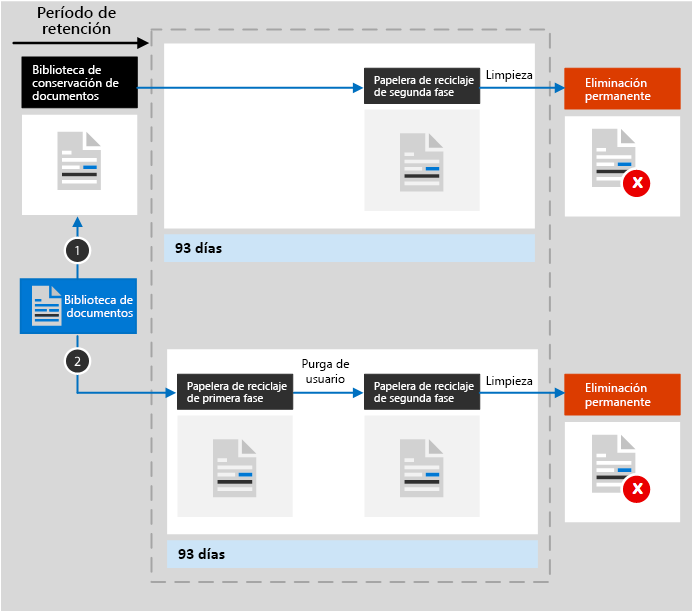
  
1. **Si el contenido se ha modificado o eliminado** durante el periodo de retención, se crea en la biblioteca de suspensión para conservación una copia del contenido original tal como era cuando se asignó la directiva de retención.**If the content is modified or deleted** during the retention period, a copy of the original content as it existed when the retention policy was assigned is created in the Preservation Hold library. Allí se ejecuta de forma periódica un trabajo de temporizador que identifica los elementos cuyo periodo de retención ha caducado. Estos elementos se mueven a la Papelera de reciclaje de segundo nivel, donde se eliminarán permanentemente 93 días después.There, a timer job runs periodically and identifies items whose retention period has expired, and those items are moved to the second-stage Recycle Bin, where they're permanently deleted at the end of 93 days. La papelera de reciclaje de la segunda etapa no es visible para los usuarios finales (solo la papelera de reciclaje de primer nivel), pero los administradores de colecciones de sitios pueden ver y restaurar el contenido desde allí.The second-stage Recycle Bin is not visible to end users (only the first-stage Recycle Bin is), but site collection admins can view and restore content from there.

    > [!NOTE]
    > Recientemente, hemos cambiado la forma de eliminar contenido de la biblioteca de suspensión para conservación.We've recently changed how content is deleted from the Preservation Hold library. Para ayudar a evitar la pérdida accidental de datos, ya no se elimina permanentemente el contenido de la biblioteca de conservación de documentos.To help prevent inadvertent data loss, we no longer permanently delete content from the Preservation Hold library. Ahora solo eliminamos de forma permanentemente el contenido de la Papelera de reciclaje. Todo el contenido de la biblioteca de suspensión para conservación pasa por la Papelera de reciclaje de segundo nivel.Instead, we permanently delete content only from the Recycle Bin, so all content from the Preservation Hold library now goes through the second-stage Recycle Bin.
    
2. **Si no se modifica ni elimina el contenido** durante el período de retención, se mueve a la papelera de reciclaje de primer nivel al final del período de retención.**If the content is not modified or deleted** during the retention period, it's moved to the first-stage Recycle Bin at the end of the retention period. Si un usuario elimina el contenido desde allí o vacía esta papelera de reciclaje (lo que también se conoce como purgar), el documento se mueve a la Papelera de reciclaje de segundo nivel.If a user deletes the content from there or empties this Recycle Bin (also known as purging), the document is moved to the second-stage Recycle Bin. Un período de retención de 93 días abarca las papeleras de reciclaje de primera y segunda etapa. Al final de 93 días, el documento se elimina de forma permanente de donde se encuentre, ya sea en la papelera de reciclaje de primer nivel o de segundo nivel.A 93-day retention period spans both the first- and second-stage recycle bins. At the end of 93 days, the document is permanently deleted from wherever it resides, in either the first- or second-stage Recycle Bin. La papelera de reciclaje no está indizada y, por lo tanto, las búsquedas no encuentran contenido.The Recycle Bin is not indexed and therefore searches do not find content there. Esto significa que una retención de eDiscovery no puede encontrar contenido en la papelera de reciclaje para mantenerla.This means that an eDiscovery hold can't locate any content in the Recycle Bin to hold it. 
    
### Contenido de buzones y carpetas públicasContent in mailboxes and public folders

En el caso del correo del usuario, calendario y otros elementos, las directivas de retención se aplican en el nivel de un buzón. En el caso de una carpeta pública, las directivas de retención se aplican en el nivel de carpeta, no en el nivel de buzón. Tanto un buzón como una carpeta pública usan la carpeta Elementos recuperables para retener los elementos. Solo las personas a las que se les han asignado permisos de eDiscovery pueden ver el contenido de la carpeta Elementos recuperables de otro usuario.For a user's mail, calendar, and other items, a retention policy is applied at the level of a mailbox. For a public folder, a retention policy is applied at the folder level, not the mailbox level. Both a mailbox and a public folder use the Recoverable Items folder to retain items. Only people whom have been assigned eDiscovery permissions can view items in another user's Recoverable Items folder.
  
De manera predeterminada, cuando un usuario elimina un mensaje de una carpeta que no es la carpeta Elementos eliminados, el mensaje se mueve a esta carpeta. Cuando un usuario elimina un elemento de la carpeta Elementos eliminados, el mensaje se mueve a la carpeta Elementos recuperables. Además, un usuario puede eliminar temporalmente un elemento de cualquier carpeta (presionando MAYÚS+SUPR). Esta acción omite la carpeta Elementos eliminados y coloca el elemento directamente en la carpeta Elementos recuperables.By default, when a person deletes a message in a folder other than the Deleted Items folder, the message is moved to the Deleted Items folder. When a person deletes an item in the Deleted Items folder, the message is moved to the Recoverable Items folder. In addition, a person can soft delete an item (SHIFT+DELETE) in any folder, which bypasses the Deleted Items folder and moves the item directly to the Recoverable Items folder.
  
Un proceso evalúa periódicamente los elementos de la carpeta Elementos recuperables. Si un elemento no coincide con las reglas de al menos una directiva de retención, se elimina de forma permanente (lo que también se conoce como "eliminación permanente") de la carpeta Elementos recuperables.A process periodically evaluates items in the Recoverable Items folder. If an item doesn't match the rules of at least one retention policy, the item is permanently deleted (also called hard deleted) from the Recoverable Items folder.
  
Cuando un usuario intenta cambiar determinadas propiedades de un elemento de buzón (como el asunto, el cuerpo, los datos adjuntos, los remitentes y los destinatarios, o la fecha de envío o recepción de un mensaje) se guarda una copia del elemento original en la carpeta Elementos recuperables antes de aplicar el cambio.When a person attempts to change certain properties of a mailbox item — such as the subject, body, attachments, senders and recipients, or date sent or received for a message — a copy of the original item is saved to the Recoverable Items folder before the change is committed. This happens for each subsequent change. At the end of the retention period, copies in the Recoverable Items folder are permanently deleted. Esto ocurre con cada cambio posterior.This action happens for each subsequent change. Al final del período de retención, se eliminan de forma permanente las copias de la carpeta Elementos recuperables.At the end of the retention period, copies in the Recoverable Items folder are permanently deleted.
  
Si un usuario deja la organización y su buzón está incluido en una directiva de retención, el buzón pasa a estar inactivo cuando se elimina la cuenta de Office 365 de dicho usuario. El contenido de un buzón inactivo sigue estando sujeto a cualquier directiva de retención que se le hubiera aplicado antes de que pasara a estar inactivo, y el contenido está disponible para una búsqueda de eDiscovery. Para obtener más información, vea [Buzones inactivos en Exchange Online](inactive-mailboxes-in-office-365.md).If a user leaves your organization, and their mailbox is included in a retention policy, the mailbox becomes an inactive mailbox when the user's Office 365 account is deleted. The contents of an inactive mailbox are still subject to any retention policy that was placed on the mailbox before it was made inactive, and the contents are available to an eDiscovery search. For more information, see [Inactive mailboxes in Exchange Online](inactive-mailboxes-in-office-365.md).
  
Cuando se asigna una directiva de retención a un buzón de correo o una carpeta pública, el contenido puede seguir una de estas dos rutas:After a retention policy is assigned to a mailbox or public folder, content can follow one of two paths:

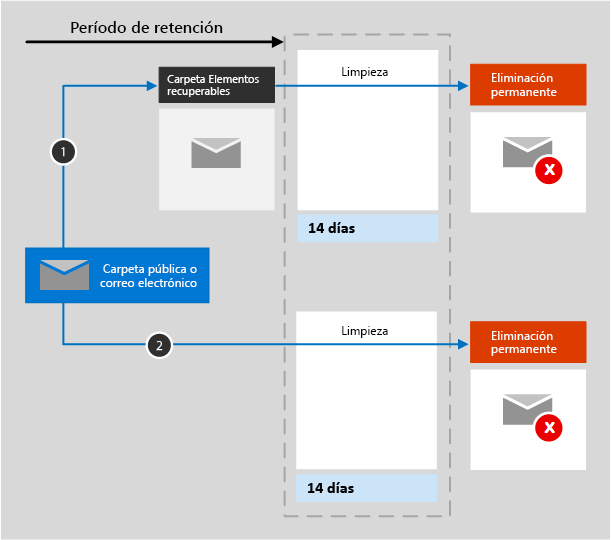

1. **Si el elemento se ha modificado o eliminado de forma permanente** por parte del usuario (con MAYÚS+SUPR o eliminándolo de Elementos eliminados) durante el período de retención, el elemento se mueve (o copia, en el caso de la edición) a la carpeta Elementos recuperables. Allí se ejecuta un proceso de forma periódica que identifica los elementos cuyo período de retención ha expirado y estos se eliminan permanentemente en un plazo de 14 días al finalizar el período de retención. Tenga en cuenta que 14 días es la configuración predeterminada, pero es posible configurar hasta 30 días.**If the item is modified or permanently deleted** by the user (either SHIFT+DELETE or deleted from Deleted Items) during the retention period, the item is moved (or copied, in the case of edit) to the Recoverable Items folder. There, a process runs periodically and identifies items whose retention period has expired, and these items are permanently deleted within 14 days of the end of the retention period. Note that 14 days is the default setting, but it can be configured up to 30 days.
    
2. **Si no se modifica ni elimina el elemento** durante el periodo de retención, se ejecuta periódicamente el mismo proceso en todas las carpetas en el buzón y se identifican los elementos cuyo periodo de retención ha caducado. Estos elementos se eliminan permanentemente en el plazo de 14 días al finalizar el periodo de retención.**If the item is not modified or deleted** during the retention period, the same process runs periodically on all folders in the mailbox and identifies items whose retention period has expired, and these items are permanently deleted within 14 days of the end of the retention period. Tenga en cuenta que 14 días es la opción predeterminada, pero puede configurar hasta 30 días.Note that 14 days is the default setting, but it can be configured up to 30 days. 
    
## Funcionamiento de una directiva de retención con versiones de documentos de un sitioHow a retention policy works with document versions in a site collection

El control de versiones es una característica de todas las bibliotecas de documentos de SharePoint Online y OneDrive para la Empresa.Versioning is a feature of all document libraries in SharePoint Online and OneDrive for Business. De forma predeterminada, el control de versiones retiene un mínimo de 500 versiones principales, aunque puede aumentar este límite.By default, versioning retains a minimum of 500 major versions, though you can increase this limit. Para obtener más información, vea [Habilitar y configurar el control de versiones para una lista o biblioteca](https://support.office.com/article/1555d642-23ee-446a-990a-bcab618c7a37).For more information, see [Enable and configure versioning for a list or library](https://support.office.com/article/1555d642-23ee-446a-990a-bcab618c7a37).
  
Una directiva para retener (una directiva de retención que retiene contenido y no es solo de eliminación) retiene todas las versiones de un documento en una cuenta de OneDrive o una colección de sitios de SharePoint.A retain policy (retention policy that retains content instead of delete-only) retains all versions of a document in a SharePoint site collection or OneDrive account. Cada vez que se edita un documento sujeto a una directiva de retención o suspensión, se copia una versión a la Biblioteca de suspensión para conservación.Each time a document subject to a hold or retain policy is edited, a version is copied to the Preservation Hold library. Cada vez que un documento sujeto a una directiva de retención o conservación se elimina, todas las versiones se copian en la Biblioteca de conservación de documentos si está habilitado el control de versiones.Each time a document subject to a hold or retain policy is deleted, all versions are copied to the Preservation Hold library if versioning is enabled. Cada versión de un documento de la Biblioteca de conservación de documentos es un elemento independiente con un periodo de retención distinto:Each version of a document in the Preservation Hold library exists as a separate item with its own retention period:
  
- Si la directiva de retención se basa en la fecha de creación del contenido, cada versión tiene la misma fecha de vencimiento que el documento original. El documento original y sus versiones expiran al mismo tiempo.If the retention policy is based on when the content was created, each version has the same expiration date as the original document. The original document and its versions all expire at the same time.
    
- Si la directiva de retención se basa en la fecha de última modificación del contenido, cada versión contará con su propia fecha de expiración en función de cuándo se modificó el documento original para crear esa versión. Los documentos originales y sus versiones expiran independientemente los unos de los otros.If the retention policy is based on when the content was last modified, each version has its own expiration date based on when the original document was modified to create that version. The original documents and its versions expire independently of each other.

> [!NOTE]
> Las versiones preservadas de los documentos de SharePoint y OneDrive no se pueden buscar con las herramientas de eDiscovery.The preserved versions of SharePoint and OneDrive documents are not searchable by eDiscovery tools.

## Retención de contenido durante un período de tiempo específicoRetaining content for a specific period of time

Con una directiva de retención, puede mantener el contenido indefinidamente o durante un número concreto de días, meses o años.With a retention policy, you can retain content indefinitely or for a specific number of days, months, or years. El período de tiempo que se retiene el contenido se calcula en la antigüedad del contenido, no en el momento en que se aplica la Directiva de retención.The duration for how long content is retained is calculated from the age of the content, not from when the retention policy is applied. Puede elegir si la antigüedad se basa en el momento en que se creó el contenido o (para OneDrive y SharePoint) en el momento en que se modificó por última vez.You can choose whether the age is based on when the content was created or (for OneDrive and SharePoint) when it was last modified.
  
Por ejemplo, si desea retener el contenido de un sitio durante siete años a partir de la última modificación, y un documento de ese sitio no se ha modificado en seis años, el documento se retendrá solo durante un año más, a no ser que se modifique. Si el documento se edita de nuevo, la antigüedad de dicho documento se calculará a partir de la fecha de la última modificación y se retendrá durante otros siete años.For example, if you want to retain content in a site collection for seven years since it was last modified, and a document in that site collection hasn't been modified in six years, the document will be retained for only another year if it's not modified. If the document is edited again, the age of the document is calculated from the new last modified date, and it will be retained for another seven years.
  
De forma similar, si desea retener el contenido en un buzón durante siete años y un mensaje se envió hace seis, se retendrá solo durante un año. Para el contenido de Exchange, la antigüedad siempre se basa en la fecha de envío o recepción (son iguales). Conservar el contenido en función de cuándo se realizó esa modificación solo se aplica a contenido de sitio de OneDrive y SharePoint.Similarly, if you want to retain content in a mailbox for seven years, and a message was sent six years ago, the message will be retained for only one year. For Exchange content, the age is always based on the date received or sent (they are the same). Retaining content based on when it was last modified applies only to site content in OneDrive and SharePoint.
  
Puede elegir si desea que el contenido se elimine permanentemente al final del periodo de retención.You can choose whether you want the content to be permanently deleted at the end of the retention period. Una directiva de retención también puede eliminar contenido antiguo sin retenerlo.A retention policy can also delete old content without retaining it. Vea la sección siguiente.See the next section.
  
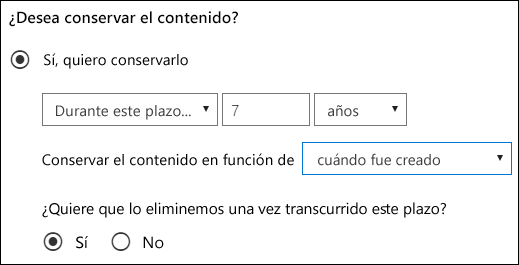
  
## Eliminar el contenido que supera una antigüedad determinadaDeleting content that's older than a specific age

Una directiva de retención puede retener y, a continuación, eliminar contenido o eliminar contenido antiguo sin retenerlo.A retention policy can both retain and then delete content, or delete old content without retaining it.
  
Si su directiva de retención elimina contenido, es importante entender que el período de tiempo especificado para una directiva de retención se calcula a partir del tiempo desde que se creó o modificó el documento, no el tiempo desde que se asignó la directiva.If your retention policy deletes content, it's important to understand that the time period specified for a retention policy is calculated from the time when the content was created or modified, not the time since the policy was assigned.
  
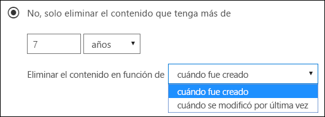
  
Por ejemplo, suponga que crea una directiva de retención que elimina el contenido después de tres años y, a continuación, la asigna a todas las cuentas de OneDrive, que contienen una gran cantidad de contenido creado hace cuatro o cinco años. En este caso, una gran cantidad de contenido se eliminará tan pronto como asigne la directiva de retención por primera vez. Por este motivo, **una directiva de retención que elimina contenido puede afectar considerablemente a su contenido**.For example, suppose that you create a retention policy that deletes content after three years, and then assign that policy to all OneDrive accounts, which contain a lot of content that was created four or five years ago. In this case, a lot of content will be deleted soon after assigning the retention policy for the first time. For this reason, **a retention policy that deletes content can have a considerable impact on your content**. 
  
Por lo tanto, antes de asignar una directiva de retención a un sitio por primera vez, primero debería considerar la antigüedad del contenido existente y cuál será el impacto de esa directiva. También es recomendable comunicar la nueva directiva a sus usuarios antes de asignarla para darles tiempo a evaluar el posible impacto. Tenga en cuenta esta advertencia que aparece al revisar la configuración de la directiva de retención justo antes de crearla.Therefore, before you assign a retention policy to a site collection for the first time, you should first consider the age of the existing content and how the policy may impact that content. You may also want to communicate the new policy to your users before assigning it, to give them time to assess the possible impact. Note this warning that appears when you review the settings for your retention policy just before creating it.
  
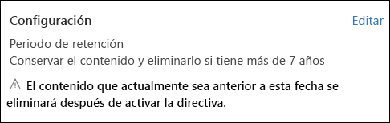
  
## Configuración avanzada que aplica una directiva solo al contenido que cumple ciertas condicionesAdvanced settings that apply a policy only to content that meets certain conditions

Puede aplicar una directiva de retención a todo el contenido de las ubicaciones que incluya, o bien, puede aplicar una directiva de retención solo al contenido que contenga determinadas palabras clave o [determinados tipos de información confidencial](what-the-sensitive-information-types-look-for.md).A retention policy can apply to all content in the locations that it includes, or you can choose to apply a retention policy only to content that contains specific keywords or [specific types of sensitive information](what-the-sensitive-information-types-look-for.md).
  

  
### Retener el contenido que contenga determinadas palabras claveRetain content that contains specific keywords

Puede aplicar una directiva de retención al contenido que cumpla determinadas condiciones y, a continuación, realizar acciones de retención con solo con ese contenido. Las condiciones disponibles ahora admiten aplicar una directiva de retención al contenido que contiene palabras o frases específicas. Puede restringir su consulta usando operadores de búsqueda como AND, OR y NOT. Para obtener más información sobre los operadores, vea [Consultas de palabras clave y condiciones de búsqueda para la búsqueda de contenido](keyword-queries-and-search-conditions.md).You can apply a retention policy only to content that satisfies certain conditions, and then take retention actions on just that content. The conditions available now support applying a retention policy to content that contains specific words or phrases. You can refine your query by using search operators like AND, OR, and NOT. For more information on these operators, see [Keyword queries and search conditions for Content Search](keyword-queries-and-search-conditions.md).
  
La compatibilidad para agregar propiedades susceptibles de búsqueda (por ejemplo, **asunto:**) estará disponible próximamente.Support for adding searchable properties (for example, **subject:**) is coming soon.
  
La retención basada en consultas usa el índice de búsqueda para identificar el contenido.Query-based retention uses the search index to identify content.
  
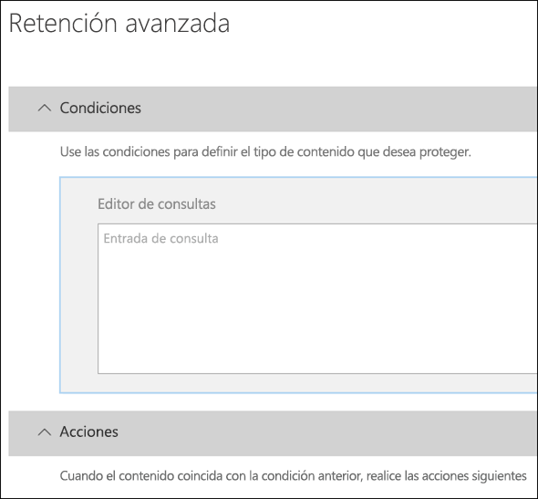
  
### Retener contenido que contenga información confidencialRetain content that contains sensitive information

También puede aplicar una directiva de retención solo al contenido que contenga [determinados tipos de información confidencial](what-the-sensitive-information-types-look-for.md). Por ejemplo, puede aplicar requisitos de retención solo a contenido con información de identificación personal (DCP), como números de identificación fiscal, números de la seguridad social o números de pasaporte.You can also apply a retention policy only to content that contains [specific types of sensitive information](what-the-sensitive-information-types-look-for.md). For example, you can choose to apply unique retention requirements only to content that contains personally identifiable information (PII) such as taxpayer identification numbers, social security numbers, or passport numbers.
  
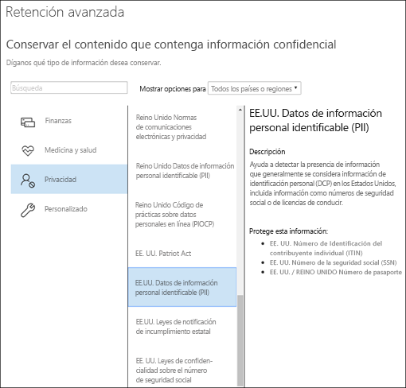
  
Notas:Notes:
  
- La retención avanzada de información confidencial no se aplica a las carpetas públicas de Exchange o Skype Empresarial porque estas ubicaciones no admiten tipos de información confidencial.Advanced retention for sensitive information doesn't apply to Exchange public folders or Skype for Business because those locations don't support sensitive information types.
    
- Debe comprender que Exchange Online usa las reglas de flujo de correo (también conocidas como reglas de transporte) para identificar información confidencial, por lo que funciona con mensajes en tránsito, no con todos los elementos que ya están almacenados en un buzón. Para Exchange Online, esto significa que una directiva de retención puede identificar información confidencial y realizar acciones de retención en los mensajes recibidos **después** de aplicar la directiva al buzón. (Tenga en cuenta que la retención basada en consultas descrita en la sección anterior no tiene esta limitación, ya que utiliza el índice de búsqueda para identificar el contenido).You should understand that Exchange Online uses mail flow rules (also known as transport rules) to identify sensitive information, so this works only on messages in transit — not on all items already stored in a mailbox. For Exchange Online, this means that a retention policy can identify sensitive information and take retention actions only on messages that are received **after** the policy is applied to the mailbox. (Note that query-based retention described in the previous section doesn't have this limitation because it uses the search index to identify content.) 
    
## Aplicar una directiva de retención a toda la organización o a ubicaciones específicasApplying a retention policy to an entire organization or specific locations

Puede aplicar fácilmente una directiva de retención a toda la organización, a ubicaciones completas o solo a determinados usuarios o ubicaciones.You can easily apply a retention policy to an entire organization, entire locations, or only to specific locations or users.
  
### Directiva para toda la organizaciónOrg-wide policy

Una de las características más eficaces de una directiva de retención es que de forma predeterminada se aplica a las ubicaciones de Office 365, como:One of the most powerful features of a retention policy is that by default it applies to locations across Office 365, including:
  
- Correo electrónico de ExchangeExchange email
    
- Colecciones de sitios de SharePointSharePoint site collections
    
- Cuentas de OneDriveOneDrive accounts
    
- Grupos de Office 365 (se aplica al contenido del buzón de correo, el sitio y los documentos del grupo).Office 365 groups (applies to content in the group's mailbox, site, and documents. La compatibilidad con el contenido de Planner, Yammer y CRM Microsoft Teams, PowerBI, Stream, Exchange y sitios de grupo de SharePoint estará disponible próximamente.Support for content in Planner, Yammer, CRM Microsoft Teams, PowerBI, Stream, Exchange, and SharePoint Team Sites is coming soon.)
    
- Carpetas públicas de ExchangeExchange public folders
    
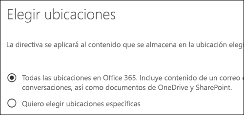
  
Otras características importantes de una directiva de retención para toda la organización son:Other important features of an org-wide retention policy include:
  
- No hay ningún límite en el número de buzones o sitios que puede incluir la directiva.There is no limit to the number of mailboxes or sites the policy can include.
    
- Para Exchange, todos los buzones creados tras la aplicación de la directiva la heredarán automáticamente.For Exchange, any new mailbox created after the policy is applied will automatically inherit the policy.
  
### Una directiva para ubicaciones completasA policy that applies to entire locations

Al elegir ubicaciones, puede incluir o excluir fácilmente una ubicación completa, como correo electrónico de Exchange o cuentas de OneDrive.When you choose locations, you can easily include or exclude an entire location, such as Exchange email or OneDrive accounts. Para ello, active o desactive el **estado** de esa ubicación.To do so, toggle the **Status** of that location on or off. 
  
Al igual que una directiva para toda la organización, si una directiva se aplica a cualquier combinación de ubicaciones completas, no hay ningún límite en el número de buzones o sitios que puede incluir la directiva. Por ejemplo, si la directiva incluye todo el correo electrónico de Exchange y todos los sitios de SharePoint, todos los sitios y buzones se incluirán, sin importar el número. Y en Exchange, todos los buzones que se creen una vez que se aplica la directiva, heredarán automáticamente la directiva.Like an org-wide policy, if a policy applies to any combination of entire locations, there is no limit to the number of mailboxes or sites the policy can include. For example, if a policy includes all Exchange email and all SharePoint sites, all sites and mailboxes will be included, no matter how many. And for Exchange, any new mailbox created after the policy is applied will automatically inherit the policy.
 
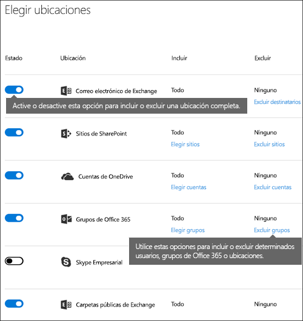
  
### Una directiva con inclusiones o exclusiones específicasA policy with specific inclusions or exclusions

También puede aplicar una directiva de retención a usuarios específicos, grupos de Office 365 o sitios. Para ello, cambie el **estado** de esa ubicación y, después, use los vínculos para incluir o excluir determinados usuarios, grupos de Office 365 o sitios.You can also apply a retention policy to specific users, Office 365 groups, or sites. To do so, toggle the **Status** of that location on, and then use the links to include or exclude specific users, Office 365 groups, or sites. 
  
Sin embargo, tenga en cuenta que existen los siguientes límites para una directiva de retención que incluya o excluya más de 1000 ubicaciones específicas:However, note that the following limits exist for a retention policy that includes or excludes over 1,000 specific locations:
  
- Una directiva de retención semejante no puede contener más de 1000 buzones de correo y 100 colecciones de sitios.Such a retention policy can contain no more than 1,000 mailboxes and 100 site collections.
    
- Un espacio empresarial no puede contener más de 10000 directivas de retención.A tenant can contain no more than 10,000 retention policies.
    
Aunque existen estos límites, comprenda que puede superarlos si aplica una directiva para toda la organización o una directiva para ubicaciones completas.Although these limits exist, understand that you can get over these limits by applying either an org-wide policy or a policy that applies to entire locations.
  
### Ubicaciones de SkypeSkype locations

Al contrario que el correo electrónico de Exchange, no puede cambiar el estado de la ubicación de Skype en para incluir todos los usuarios, pero puede activar dicha ubicación y, a continuación, elegir manualmente los usuarios cuyas conversaciones quiera conservar.Unlike Exchange email, you can't toggle the status of the Skype location on to include all users, but you can turn on that location and then manually choose the users whose conversations you want to retain.
  
Si elige usuarios de Skype Empresarial, puede incluir rápidamente todos los usuarios seleccionando el cuadro **nombre** en el encabezado de columna.When you choose Skype for Business users, you can quickly include all users by selecting the **Name** box in the column header. Sin embargo, es importante entender que cada usuario tiene que contar con una inclusión específica en la Directiva.However, it's important to understand that each user counts as a specific inclusion in the policy. Por lo tanto, si incluye más de 1 000 usuarios, se aplicarán los límites señalados en la sección anterior.Therefore, if you include over 1,000 users, the limits noted in the previous section apply. Seleccionar aquí todos los usuarios de Skype no es lo mismo que usar una directiva para toda la organización que pudiera incluir todos los usuarios de Skype de forma predeterminada.Selecting all Skype users here is not the same as if an org-wide policy were able to include all Skype users by default. 
  
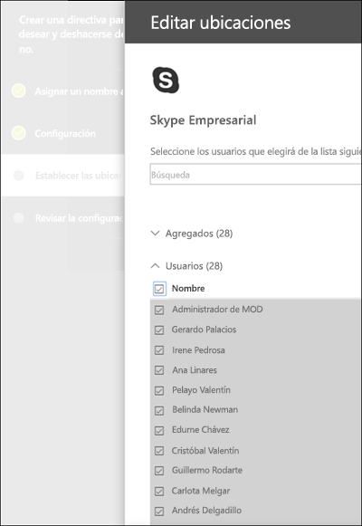
  
Tenga en cuenta que **Historial de conversaciones**, una carpeta de Outlook, es una característica que no tiene nada que ver con el archivado de Skype. El usuario final puede desactivar **Historial de conversaciones**, pero el archivado para Skype se realiza almacenando una copia de las conversaciones de Skype en una carpeta oculta que está disponible para eDiscovery, pero inaccesible para el usuario.Note that **Conversation History**, a folder in Outlook, is a feature that has nothing to do with Skype archiving. **Conversation History** can be turned off by the end user, but archiving for Skype is done by storing a copy of Skype conversations in a hidden folder that is inaccessible to the user but available to eDiscovery.

### Ubicaciones de TeamsTeams locations

Puede usar una directiva de retención para retener chats y mensajes de canales en Teams. Los chats de Teams se almacenan en una carpeta oculta en el buzón de cada usuario incluido en el chat y los mensajes de canales de Teams se almacenan en una carpeta similar, también oculta, en el buzón de grupo del equipo. Sin embargo, es importante comprender que Teams utiliza un servicio de chat de Azure que también almacena estos datos y, de forma predeterminada, este servicio almacena los datos para siempre. Por este motivo, recomendamos que use la ubicación de Teams para retener y eliminar datos de Teams. Con la ubicación de Teams podrá eliminar datos de forma permanente tanto de los buzones de Exchange como del servicio de chat de Azure subyacente. Para más información, consulte [Información general sobre la seguridad y cumplimiento en Microsoft Teams](https://go.microsoft.com/fwlink/?linkid=871258).You can use a retention policy to retain chats and channel messages in Teams. Teams chats are stored in a hidden folder in the mailbox of each user included in the chat, and Teams channel messages are stored in a similar hidden folder in the group mailbox for the team. However, it's important to understand that Teams uses an Azure-powered chat service that also stores this data, and by default this service stores the data forever. For this reason, we strongly recommend that you use the Teams location to retain and delete Teams data. Using the Teams location will permanently delete data from both the Exchange mailboxes and the underlying Azure-powered chat service. For more information, see [Overview of security and compliance in Microsoft Teams](https://go.microsoft.com/fwlink/?linkid=871258).
  
Las directivas de retención que se aplican a los buzones de usuario o grupo de las ubicaciones de grupos de Exchange u Office 365 no afectan a los mensajes de canal y canales de Teams.Teams chats and channel messages are not affected by retention policies applied to user or group mailboxes in the Exchange or Office 365 groups locations. A pesar de que los chat de Teams y los mensajes de canal se almacenan en Exchange, solo se verán afectados por una directiva de retención que se aplique a la ubicación de Teams.Even though Teams chats and channel messages are stored in Exchange, they're affected only by a retention policy that's applied to the Teams location.
  
Cuando se asigna una directiva de retención a un equipo, los mensajes de chat y canales pueden seguir una de estas dos rutas:After a retention policy is assigned to a team, chat and channel messages can follow one of two paths:

1. **Si el usuario modifica o elimina un mensaje de una conversación o un canal** durante el período de retención, el mensaje se mueve (o copia, en el caso de edición) a la carpeta SubstrateHolds (que es una carpeta oculta en cada buzón de usuario o grupo) y se almacena en esta carpeta hasta que finalice el período de retención.**If a chat or channel message is modified or deleted** by the user during the retention period, the message is moved (or copied, in the case of edit) to the SubstrateHolds folder (which is a hidden folder in every user or group mailbox) and is stored in this folder until the retention period expires. Los mensajes se eliminan permanentemente el día en que expire el período de retención.Messages are permanently deleted on the day the retention period expires.

2. **Si un mensaje de canal o de chat no se elimina** durante el período de retención, el mensaje se mueve a la carpeta SubstrateHolds en un plazo de un día después de que expire el período de retención (tarda de 0 a 24 horas).**If a chat or channel message isn't deleted** during the retention period, the message is moved to the SubstrateHolds folder within one day after the retention period expires (it takes from 0 to 24 hours). El mensaje se elimina permanentemente un día después de que se mueva a la carpeta SubstrateHolds.The message is permanently deleted one day after it is moved to the SubstrateHolds folder. 

> [!NOTE]
> Los mensajes de la carpeta SubstrateHolds se pueden buscar en las herramientas de eDiscovery.Messages in the SubstrateHolds folder are searchable by eDiscovery tools. Cuando un mensaje se elimina de forma permanente, no se mostrará en una búsqueda de eDiscovery.After a message is permanently deleted, it won't be returned in an eDiscovery search.

Estamos trabajando continuamente en optimizar la funcionalidad de retención en Teams y, por lo que estamos pensando en publicar nuevas características en los próximos meses.We're continuously working on optimizing retention functionality in Teams, and we plan to release new features in the coming months. Por el momento, tenga en cuenta algunas de las limitaciones actuales:In the meantime, here are a few limitations to be aware of:
  
- **Teams requieren una directiva de retención diferente**.**Teams require a separate retention policy**. Cuando se crea una directiva de retención y se activan las teclas en la ubicación del equipo, todas las demás ubicaciones se desactivan.When you create a retention policy and toggle on the Teams location, all other locations toggle off. Una directiva de retención que incluya Teams puede comprender solo su ubicación y ninguna más.A retention policy that includes Teams can include only Teams and no other locations. 
    
- **Teams no se incluye en el de directiva para toda la organización**.**Teams aren't included in an org-wide policy**. Si crea una directiva para toda la organización, Teams no se incluye porque necesitan una directiva de retención diferente.If you create an org-wide policy, Teams are not included because they require a separate retention policy. 
    
- **Teams no es compatibles con la retención avanzada**.**Teams doesn't support advanced retention**. Cuando se crea una directiva de retención, si elige la [ configuración avanzada que aplica una directiva solo al contenido que cumpla ciertas condiciones](#advanced-settings-that-apply-a-policy-only-to-content-that-meets-certain-conditions), la ubicación de Teams no estará disponible.When you create a retention policy, if you choose the [Advanced settings that apply a policy only to content that meets certain conditions](#advanced-settings-that-apply-a-policy-only-to-content-that-meets-certain-conditions), the Teams location is not available. Actualmente, la función de retención en Teams se aplica a todo el contenido de los mensajes de canal y chat.At this time, retention in Teams applies to all of the chat and channel message content. 

- **El contenido de Teams en canales privados no es compatible**.**Teams content in private channels isn't supported**. En este momento, las directivas de retención creadas para Teams no se aplican a los mensajes de canal privado.At this time, retention policies created for Teams don't apply to private channel messages. Solo los mensajes de canales estándares se someten a una directiva de retención creada para Teams.Only messages in standard channels are subject to a retention policy created for Teams. La compatibilidad con las directivas de retención de canales privados estará disponible próximamente.Support for retention policies for private channels is coming soon. 
    
- **Teams puede tardar un máximo de tres días en limpiar los mensajes caducados**.**Teams may take up to three days to clean up expired messages**. Cuando expire el período de retención, las directivas de retención aplicadas a Teams se eliminarán.A retention policy applied to Teams will delete chat and channel messages when the retention period expires. Sin embargo, puede que tarde hasta tres días limpiar estos mensajes y eliminarlos permanentemente.However, it may take up to three days to clean up these messages and permanently delete them. Asimismo, los mensajes de chat y canales se podrán buscar con las herramientas de eDiscovery durante el tiempo que transcurra durante el período de retención y cuando los mensajes se eliminan de forma permanente.Also, chat and channel messages will be searchable with eDiscovery tools during the time after the retention period expires and when messages are permanently deleted.

   > [!NOTE]
   > Se ha usado para ser verdadera que una directiva de retención no pudo eliminar el contenido de Teams que tiene menos de 30 días, pero hemos quitado esta limitación.It used to be true that a retention policy couldn't delete Teams content that's less than 30 days old, but we've removed this limitation. Ahora, el período de retención de contenido de Teams puede ser el número de días que elija y tan breve como un día.Now the retention period for Teams content can be any number of days you choose and as short as one day. Si tiene un período de retención de un día, se tardará hasta tres días después de que expire el período de retención antes de que se eliminen de forma permanente los mensajes.If you do have a retention period of one day, it will take up to three days after the retention period expires before messages are permanently deleted.
    
En un equipo, los archivos compartidos en un chat se almacenan en la cuenta de OneDrive del usuario que ha compartido el archivo.In a Team, files that are shared in chat are stored in the OneDrive account of the user who shared the file. Los archivos que se cargan en canales se almacenan en el sitio de SharePoint para el equipo.Files that are uploaded into channels are stored in the SharePoint site for the Team. Por lo tanto, para conservar o eliminar archivos de un equipo, deberá crear una directiva de retención que se aplique específicamente a las ubicaciones de SharePoint y OneDrive.Therefore, to retain or delete files in a Team, you need to create a retention policy that applies to the SharePoint and OneDrive locations specifically. Si quiere aplicar una directiva a los archivos de un único grupo específico, puede elegir el sitio de SharePoint para el equipo y las cuentas de OneDrive de los usuarios del equipo.If you want to apply a policy to the files of just a specific team, you can choose the SharePoint site for the Team and the OneDrive accounts of users in the Team.
  
Una directiva de retención que se aplica a Teams puede usar [Bloqueo de conservación](#locking-a-retention-policy).A retention policy that applies to Teams can use [Preservation Lock](#locking-a-retention-policy).
  
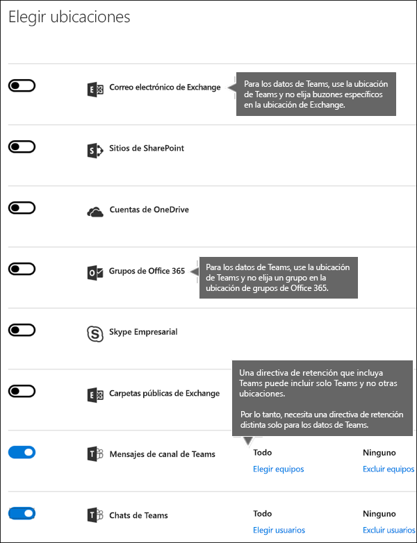
  
> [!NOTE]
> Si crea directivas de retención para las ubicaciones de Skype o Teams de su organización, se mostrará una de estas directivas como Directiva de carpeta predeterminada cuando un usuario vea las propiedades de una carpeta de buzón de correo en el cliente de escritorio de Outlook.If you create retention policies for Skype or Teams locations in your organization, one of those policies is shown as the default folder policy when a user views the properties of a mailbox folder in the Outlook desktop client. Este es un problema de presentación incorrecto en Outlook y [un problema conocido](https://support.microsoft.com/help/4491013/outlook-client-displays-teams-or-skype-for-business-retention-policies).This is an incorrect display issue in Outlook and [a known issue](https://support.microsoft.com/help/4491013/outlook-client-displays-teams-or-skype-for-business-retention-policies). Qué se debe mostrar como directiva predeterminada para carpetas es la Directiva de retención de buzón que se aplica a la carpeta.What should be displayed as the default folder policy is the mailbox retention policy that's applied to the folder. La Directiva de retención de Skype o de Teams no se aplica al buzón del usuario.The Skype or Teams retention policy is not applied to the user's mailbox.  

### Ubicaciones de grupos de Office 365Office 365 groups locations

Para conservar el contenido de un grupo de Office 365, debe usar la ubicación de grupos de Office 365.To retain content for an Office 365 group, you need to use the Office 365 groups location. Aunque un grupo de Office 365 tiene un buzón de Exchange, una directiva de retención que incluya toda la ubicación de Exchange no incluirá contenido en los buzones de grupo de Office 365.Even though an Office 365 group has an Exchange mailbox, a retention policy that includes the entire Exchange location won't include content in Office 365 group mailboxes. Una directiva de retención aplicada a un grupo de Office 365 incluye tanto el buzón como el sitio del grupo.A retention policy applied to an Office 365 group includes both the group mailbox and site. Una directiva de retención aplicada a un grupo de Office 365 protege los recursos que creó un grupo de Office 365, incluido Microsoft Teams.A retention policy applied to an Office 365 group protects the resources created by an Office 365 group, which would include Microsoft Teams.

Además, no es posible usar la ubicación de Exchange para incluir o excluir un buzón de grupo específico.In addition, it's not possible to use the Exchange location to include or exclude a specific group mailbox. Aunque la ubicación de Exchange inicialmente permite seleccionar un buzón de grupo, cuando intenta guardar la directiva de retención, recibe el error de que "RemoteGroupMailbox" no es una selección válida para la ubicación de Exchange.Although the Exchange location initially allows a group mailbox to be selected, when you try to save the retention policy, you receive an error that "RemoteGroupMailbox" is not a valid selection for the Exchange location. 

## Excluir determinados tipos de elementos de Exchange de una directiva de retenciónExcluding specific types of Exchange items from a retention policy
Con PowerShell, puede excluir determinados tipos de elementos de Exchange de una directiva de retención. Por ejemplo, puede excluir mensajes de correo de voz, conversaciones de mensajería instantánea y otros contenidos de Skype Empresarial Online en los buzones. También puede excluir calendario, notas y elementos de la tarea. Esta función está disponible solo mediante PowerShell, no en la interfaz de usuario cuando se crea una directiva de retención.By using PowerShell, you can exclude specific types of Exchange items from a retention policy. For example, you can exclude voicemail messages, IM conversations, and other Skype for Business Online content in mailboxes. You can also exclude calendar, note, and task items. This capability is available only by using PowerShell; it's not available in the UI when you create a retention policy.
  
Para ello, utilice el parámetro `ExcludedItemClasses` de los cmdlets `New-RetentionComplianceRule` y `Set-RetentionComplianceRule`. Para obtener más información sobre PowerShell, vea la sección siguiente [Buscar los cmdlets de PowerShell para directivas de retención](#find-the-powershell-cmdlets-for-retention-policies).To do this, use the  `ExcludedItemClasses` parameter of the  `New-RetentionComplianceRule` and  `Set-RetentionComplianceRule` cmdlets. For more information about PowerShell, see the below section [Find the PowerShell cmdlets for retention policies](#find-the-powershell-cmdlets-for-retention-policies).

## Bloquear una directiva de retenciónLocking a retention policy
Algunas organizaciones podrían tener que cumplir con las reglas que definen los organismos reguladores, como la regla 17a-4 de la SEC (Comisión de intercambio y valores), lo que requiere que, después de activar una directiva de retención, esta no se pueda desactivar ni hacer menos restrictiva. Con el Bloqueo de retención, puede bloquear una directiva de modo que ninguna persona pueda desactivarla ni hacerla menos restrictiva, ni siquiera el administrador.Some organizations may need to comply with rules defined by regulatory bodies such as the Securities and Exchange Commission (SEC) Rule 17a-4, which requires that after a retention policy is turned on, it cannot be turned off or made less restrictive. With Preservation Lock, you can lock the policy so that no one — including the administrator — can turn off the policy or make it less restrictive.
  
Después de que se haya bloqueado una directiva, nadie puede desactivarla ni quitar ubicaciones de ella. Tampoco es posible modificar o eliminar el contenido que está sujeto a la directiva durante el período de retención. Una vez que se ha bloqueado la directiva, la única manera de modificar la directiva de conservación consiste en agregarle contenido o ampliar su duración. Una directiva bloqueada se puede incrementar o ampliar, pero no se puede reducir, deshabilitar ni desactivar.After a policy's been locked, no one can turn it off or remove locations from the policy. And it's not possible to modify or delete content that's subject to the policy during the retention period. After the policy's been locked, the only ways you can modify the retention policy are by adding locations to it or extending its duration. A locked policy can be increased or extended, but it can't be reduced or turned off.
  
Por lo tanto, antes de bloquear una directiva de retención, es **muy importante** que comprenda los requisitos de cumplimiento de la organización y que **no bloquee** una directiva hasta que no esté seguro de que es necesario.Therefore, before you lock a retention policy, it's **critical** that you understand your organization's compliance requirements, and that **you do not lock a policy** until you're certain that's what you need.

### Bloquear una directiva de retención con PowerShellLock a retention policy by using PowerShell
  
Puede bloquear una directiva de retención solo con PowerShellYou can lock a retention policy only by using PowerShell.

En primer lugar, [conéctese a PowerShell del Centro de seguridad y cumplimiento de Office 365](https://docs.microsoft.com/powershell/exchange/office-365-scc/connect-to-scc-powershell/connect-to-scc-powershell?view=exchange-ps).First, [connect to Office 365 Security & Compliance Center PowerShell](https://docs.microsoft.com/powershell/exchange/office-365-scc/connect-to-scc-powershell/connect-to-scc-powershell?view=exchange-ps).

Después, para ver una lista de las directivas de retención y buscar el nombre de la directiva que desea bloquear, ejecute `Get-RetentionCompliancePolicy`.Second, to view a list of your retention policies and find the name of the policy that you want to lock, run `Get-RetentionCompliancePolicy`.

Por último, para colocar un bloqueo de preservación en la Directiva de retención, ejecute `Set-RetentionCompliancePolicy` con el parámetro `RestrictiveRetention` establecido en True.Third, to place a Preservation Lock on the retention policy, run `Set-RetentionCompliancePolicy` with the `RestrictiveRetention` parameter set to true. Por ejemplo:For example:

`Set-RetentionCompliancePolicy -Identity “<Name of Policy>” – RestrictiveRetention $true`

Después de ejecutar ese cmdlet, verá un mensaje de confirmación. Elija **Sí a todo**.After you run that cmdlet, you see a confirmation prompt. Choose **Yes to All**.

Ahora, se coloca un bloqueo de preservación en la Directiva de retención.A Preservation Lock is now placed on the retention policy. Si ejecuta `Get-RetentionCompliancePolicy`, el parámetro `RestrictiveRetention` se establece en True.If you run `Get-RetentionCompliancePolicy`, the `RestrictiveRetention` parameter is set to true. Por ejemplo:For example:

`Get-RetentionCompliancePolicy -Identity “<Name of Policy>” |Fl`

  
## Publicar una directiva de retenciónReleasing a retention policy

Puede desactivar o eliminar una directiva de retención en cualquier momento.You can turn off or delete a retention policy at any time. Al hacerlo, el contenido de SharePoint o de OneDrive que se retiene en la biblioteca de conservación de documentos se elimina de forma inmediata y permanente.When you do so, any SharePoint or OneDrive content that's being retained in the Preservation Hold library is not immediately and permanently deleted. A partir de ahora, y para evitar pérdidas accidentales de datos, existe un período de gracia de 30 días durante el cual la expiración del contenido para esa directiva no se produce en la biblioteca de conservación de documentos, de modo que puede restaurar desde allí el contenido si lo ve necesario.Instead, to help prevent inadvertent data loss, there is a 30-day grace period, during which content expiration for that policy does not happen in the Preservation Hold library, so that you can restore any content from there, if needed. También puede activar la directiva de retención durante el período de gracia y no se eliminará ningún contenido para esa directiva.You can also turn on the retention policy again during the grace period, and no content will be deleted for that policy.

Este periodo de gracia de 30 días en SharePoint y OneDrive corresponde a la retención de retraso de 30 días de Exchange.This 30-day grace period in SharePoint and OneDrive corresponds to the 30-day delay hold in Exchange. Para obtener más información, consulte [Gestionar buzón con una retención de retraso](identify-a-hold-on-an-exchange-online-mailbox.md#managing-mailboxes-on-delay-hold).For more information, see [Managing mailboxes on delay hold](identify-a-hold-on-an-exchange-online-mailbox.md#managing-mailboxes-on-delay-hold).

## Los principios de retención o qué tiene precedenciaThe principles of retention, or what takes precedence?

Es posible (o incluso probable) que se apliquen varias directivas de retención a contenido, cada una con una acción (conservar, eliminar o ambas) y un período de retención. ¿Qué tiene precedencia? En general, puede estar seguro de que el contenido conservado por una directiva no se puede eliminar de forma permanente con otra directiva.It's possible or even likely that content might have several retention policies applied to it, each with a different action (retain, delete, or both) and retention period. What takes precedence? At the highest level, rest assured that content being retained by one policy can't be permanently deleted by another policy.
  
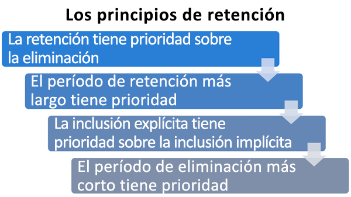
  
Para entender cómo diferentes directivas de retención se aplican al contenido, tenga en cuenta estos principios de retención:To understand how different retention policies are applied to content, keep these principles of retention in mind:
  
1. **La retención gana a la eliminación.****Retention wins over deletion.** Suponga que una directiva de retención dice que se elimine el correo electrónico de Exchange después de tres años, pero otra directiva de retención dice que se conserve el correo electrónico de Exchange durante cinco años y después se elimine.Suppose that one retention policy says to delete Exchange email after three years, but another retention policy says to retain Exchange email for five years and then delete it. Todo el contenido que llegue a tres años de antigüedad se eliminará y quedará oculto de la vista de los usuarios, pero se mantendrá en la carpeta elementos recuperables hasta que llegue a la antigüedad de cinco años, cuando se elimine de forma permanente.Any content that reaches three years old will be deleted and hidden from the users' view, but still retained in the Recoverable Items folder until the content reaches five years old, when it is permanently deleted. 
    
2. **El período de retención más largo gana**.**The longest retention period wins.** Si el contenido está sujeto a varias directivas que retienen el contenido, se conservará hasta el final del período de retención más largo.If content is subject to multiple policies that retain content, it will be retained until the end of the longest retention period. 
    
3. **La inclusión explícita gana a la inclusión implícita**.**Explicit inclusion wins over implicit inclusion.** Esto significa que:This means: 
    
    1. Si un usuario asigna automáticamente una etiqueta con la configuración de retención a un elemento, como un correo electrónico de Exchange o un documento de OneDrive, esa etiqueta tiene prioridad sobre una directiva asignada en el nivel de sitio o buzón, y una etiqueta predeterminada asignada por la biblioteca de documentos.If a label with retention settings is manually assigned by a user to an item, such as an Exchange email or OneDrive document, that label takes precedence over both a policy assigned at the site or mailbox level and a default label assigned by the document library. Por ejemplo, si la etiqueta explícita dice que conserve durante 10 años, pero la directiva asignada al sitio dice que se conserva durante cinco años, la etiqueta tiene prioridad.For example, if the explicit label says to retain for 10 years, but the policy assigned to the site says to retain for only five years, the label takes precedence. Las etiquetas de aplicación automática se consideran implícitas en lugar de explícitas, ya que se aplican automáticamente en Office 365.Auto-applied labels are considered implicit, not explicit, because they're applied automatically by Office 365.
    
    2. Si una directiva de retención incluye una ubicación específica (como el buzón de un usuario o una cuenta de OneDrive para la Empresa), tendrá precedencia sobre cualquier otra directiva de retención que se aplique a los buzones de todos los usuarios o a las cuentas de OneDrive para la Empresa, pero que no incluyan específicamente ese buzón de usuario.If a retention policy includes a specific location, such as a specific user's mailbox or OneDrive for Business account, that policy takes precedence over another retention policy that applies to all users' mailboxes or OneDrive for Business accounts but doesn't specifically include that user's mailbox.
    
4. **El período de eliminación más corto tiene prioridad.** De forma similar, si el contenido está sujeto a varias directivas que eliminan contenido (sin retención), se eliminará al final del período de retención más corto.**The shortest deletion period wins.** Similarly, if content's subject to multiple policies that delete content (with no retention), it will be deleted at the end of the shortest retention period. 
    
Tenga en cuenta que los principios de retención funcionan como un flujo de desempate de arriba abajo: si las reglas aplicadas por todas las directivas o etiquetas son las mismas en un nivel, el flujo baja al siguiente nivel para determinar la precedencia de la regla que se aplica.Understand that the principles of retention work as a tie-breaking flow from top to bottom: If the rules applied by all policies or labels are the same at one level, the flow moves down to the next level to determine precedence for which rule is applied.
  
Por último, una etiqueta o directiva de retención no puede eliminar ningún contenido de forma permanente si está en suspensión para eDiscovery. Cuando se levante la suspensión, el contenido estará disponible para el período de limpieza descrito anteriormente.Finally, a retention policy or label cannot permanently delete any content that's on hold for eDiscovery. When the hold is released, the content again becomes eligible for the cleanup process described above.
  
## Usar una directiva de retención en lugar de estas característicasUse a retention policy instead of these features

Se puede aplicar fácilmente una sola directiva de retención a toda la organización y las ubicaciones de Office 365, como Exchange Online, SharePoint Online, OneDrive para la Empresa y grupos de Office 365.A single retention policy can easily apply to an entire organization and locations across Office 365, including Exchange Online, SharePoint Online, OneDrive for Business, and Office 365 groups. Si necesita retener o eliminar contenido de cualquier parte de Office 365, le recomendamos que use una directiva de retención.If you need to retain or delete content anywhere in Office 365, we recommend that you use a retention policy. (También puede usar etiquetas con la configuración de retención.(You can also use labels with retention settings. Para obtener más información, vea [Introducción a registros](labels.md)). For more information, see [Overview of labels](labels.md).)
  
Hay otras características que se han utilizado anteriormente para retener o eliminar contenido en Office 365.There are several other features that have previously been used to retain or delete content in Office 365. Se muestran a continuación.These are listed below. Estas características seguirán funcionando en paralelo con las directivas de retención y las etiquetas de retención.These features will continue to work side by side with retention policies and retention labels. Y, para el gobierno de información, se recomienda usar una directiva de retención o etiquetas en lugar de todas estas características.But moving forward, for information governance, we recommend that you use a retention policy or labels instead of all of these features. Una directiva de retención es la única característica que puede conservar y eliminar contenido en Office 365.A retention policy is the only feature that can both retain and delete content across Office 365.
  
### Exchange OnlineExchange Online

- [Administrar casos de eDiscovery en el Centro de seguridad y cumplimiento de Office 365](https://support.office.com/article/edea80d6-20a7-40fb-b8c4-5e8c8395f6da) (suspensión de eDiscovery)[Manage eDiscovery cases in the Office 365 Security &amp; Compliance Center](https://support.office.com/article/edea80d6-20a7-40fb-b8c4-5e8c8395f6da) (eDiscovery hold) 
    
- [Conservación local y Retención por juicio](https://go.microsoft.com/fwlink/?linkid=846124) (suspensión de eDiscovery)[In-Place Hold and Litigation Hold](https://go.microsoft.com/fwlink/?linkid=846124) (eDiscovery hold) 

- [Cómo identificar el tipo de retención en un buzón de Exchange OnlineHow to identify the type of hold placed on an Exchange Online mailbox](identify-a-hold-on-an-exchange-online-mailbox.md)
    
- [Etiquetas de retención y directivas de retención](https://go.microsoft.com/fwlink/?linkid=846125), lo que también se conoce como [administración de registros de mensajes (MRM)](https://go.microsoft.com/fwlink/?linkid=846126) (solo eliminación)[Retention tags and retention policies](https://go.microsoft.com/fwlink/?linkid=846125), also known as [messaging records management (MRM)](https://go.microsoft.com/fwlink/?linkid=846126) (Deletion only) 
    
### SharePoint Online y OneDrive para la EmpresaSharePoint Online and OneDrive for Business

- [Administrar casos de eDiscovery en el Centro de seguridad y cumplimiento de Office 365](https://support.office.com/article/edea80d6-20a7-40fb-b8c4-5e8c8395f6da) (suspensión de eDiscovery)[Manage eDiscovery cases in the Office 365 Security &amp; Compliance Center](https://support.office.com/article/edea80d6-20a7-40fb-b8c4-5e8c8395f6da) (eDiscovery hold) 
    
- [Agregar contenido a un caso y poner orígenes en suspensión en el Centro de eDiscovery](https://support.office.com/article/54d70de9-1ec2-4325-84f3-aeb588554479) (suspensión de eDiscovery)[Add content to a case and place sources on hold in the eDiscovery Center](https://support.office.com/article/54d70de9-1ec2-4325-84f3-aeb588554479) (eDiscovery hold) 
    
- [Información general sobre las directivas de eliminación de documentos](https://support.office.com/article/55e8d858-f278-482b-a198-2e62d6a2e6e5) (solo eliminación)[Overview of document deletion policies](https://support.office.com/article/55e8d858-f278-482b-a198-2e62d6a2e6e5) (Deletion only) 
    
- [Configuración de administración de registros local](https://support.office.com/article/7707a878-780c-4be6-9cb0-9718ecde050a) (retención)[Configuring in place records management](https://support.office.com/article/7707a878-780c-4be6-9cb0-9718ecde050a) (Retention) 
    
- [Usar las directivas de cierre y eliminación de sitio](https://support.office.com/article/a8280d82-27fd-48c5-9adf-8a5431208ba5) (solo eliminación)[Use policies for site closure and deletion](https://support.office.com/article/a8280d82-27fd-48c5-9adf-8a5431208ba5) (Deletion only) 
    
- [Directivas de administración de información](intro-to-info-mgmt-policies.md) (solo eliminación)[Information management policies](intro-to-info-mgmt-policies.md) (Deletion only) 
    
Si ha usado previamente cualquiera de las retenciones de eDiscovery con el propósito del gobierno de información, debe usar en su lugar una directiva de retención para el cumplimiento proactivo.If you've previously used any of the eDiscovery holds for the purpose of information governance, you should instead use a retention policy for proactive compliance. Debería usar una retención solo para eDiscovery.You should use a hold only for eDiscovery.
  
### Las directivas de retención prevalecen sobre las de administración de la informaciónRetention policies override information management policies

En los sitios de SharePoint, es posible que use [directivas de administración de la información](intro-to-info-mgmt-policies.md) para conservar contenido.In SharePoint sites, you may be using [information management policies](intro-to-info-mgmt-policies.md) to retain content. Si aplica una directiva de retención a un sitio que ya usa directivas de tipo de contenido o directivas de administración de información para una lista o biblioteca, dichas directivas se ignorarán mientras la directiva de retención esté activa.If you apply a retention policy to a site that already uses content type policies or information management policies for a list or library, those policies are ignored while the retention policy is in effect. 
  
## ¿Qué ha ocurrido con las directivas de conservación?What happened to preservation policies?

Si usa una directiva de conservación, esa Directiva se ha convertido automáticamente en una directiva de retención que usa solo la acción de retener, la Directiva no eliminará el contenido.If you were using a preservation policy, that policy has been automatically converted to a retention policy that uses only the retain action — the policy won't delete content. La Directiva de preservación continúa funcionando y conserve el contenido sin tener que realizar ningún cambio por usted.The preservation policy continues to work and preserve your content without requiring any changes from you. Puede encontrar estas directivas en la página de**Directivas** en la página de [Centro de cumplimiento de Microsoft 365](https://compliance.microsoft.com/), o en la página **Retención** en **Control de la información** en el [Centro de cumplimiento &amp; de seguridad](https://protection.office.com/).You can find these policies on the **Policies** page in the [Microsoft 365 compliance center](https://compliance.microsoft.com/), or on the **Retention** page under **Information governance** in the [Security &amp; Compliance Center](https://protection.office.com/). Puede editar una directiva de conservación para cambiar el periodo de retención, pero no puede realizar otros cambios, como agregar o quitar ubicaciones.You can edit a preservation policy to change the retention period, but you can't make other changes, such as adding or removing locations. 
  
## PermisosPermissions

Los miembros de su equipo de cumplimiento normativo que vayan a crear las directivas de retención necesitan permisos para el [Centro&amp; de cumplimiento de seguridad](https://protection.office.com/).Members of your compliance team who will create retention policies need permissions to the [Security &amp; Compliance Center](https://protection.office.com/). De forma predeterminada, el administrador de inquilinos tendrá acceso a esta ubicación y puede conceder a los responsables de cumplimiento y a otros usuarios acceso al [Centro de cumplimiento de seguridad &amp; cumplimiento](https://protection.office.com/), sin concederles todos los permisos de un administrador de inquilinos. Para hacerlo, le recomendamos que vaya a la página de **Permisos** del [Centro de cumplimiento de seguridad &amp; cumplimiento](https://protection.office.com/), edite el grupo de roles **Administrador de cumplimiento normativo** y agregue miembros a ese grupo de roles.By default, your tenant admin has access to this location and can give compliance officers and other people access to the [Security &amp; Compliance Center](https://protection.office.com/), without giving them all of the permissions of a tenant admin. To do this, we recommend that you go to the **Permissions** page of the [Security &amp; Compliance Center](https://protection.office.com/), edit the **Compliance Administrator** role group, and add members to that role group. 
  
Para más información, vea [Conceder acceso a los usuarios para el Centro de seguridad y cumplimiento de Office 365](/security/office-365-security/grant-access-to-the-security-and-compliance-center).For more information, see [Give users access to the Office 365 Security & Compliance Center](/security/office-365-security/grant-access-to-the-security-and-compliance-center). 

Estos permisos son necesarios solo para crear y aplicar una directiva de retención. La aplicación de directivas no requiere acceso al contenido.These permissions are required only to create and apply a retention policy. Policy enforcement does not require access to the content.
  
## Buscar los cmdlets de PowerShell para directivas de retenciónFind the PowerShell cmdlets for retention policies

Para usar los cmdlets de directiva de retención, debe:To use the retention policy cmdlets, you need to:
  
1. [Conectarse al Centro de seguridad y cumplimiento de Office 365 mediante PowerShell remotoConnect to the Office 365 Security &amp; Compliance Center using remote PowerShell](https://go.microsoft.com/fwlink/?LinkID=799771&amp;clcid=0x409)
    
2. Usar estos [Cmdlets del Centro de seguridad y cumplimiento de Office 365](https://go.microsoft.com/fwlink/?LinkID=799772&amp;clcid=0x409)Use these [Office 365 Security &amp; Compliance Center cmdlets](https://go.microsoft.com/fwlink/?LinkID=799772&amp;clcid=0x409)
    
## Más informaciónMore information

- [Introducción a las etiquetasOverview of labels](labels.md)
- [Límites de SharePoint OnlineSharePoint Online Limits](https://docs.microsoft.com/office365/servicedescriptions/sharepoint-online-service-description/sharepoint-online-limits)
- [Límites y especificaciones para Microsoft TeamsLimits and specifications for Microsoft Teams](https://docs.microsoft.com/microsoftteams/limits-specifications-teams) 
    
