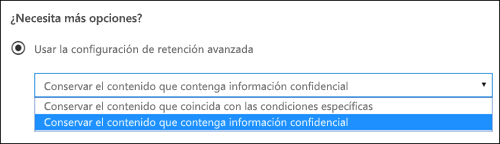

# Introducción a las directivas de retención

Para la mayoría de las organizaciones, el volumen y la complejidad de los datos se incrementa diariamente: correo electrónico, documentos, mensajes instantáneos y mucho más. Administrar o gobernar esta información es importante, ya que necesita:
  
- **Cumplir de forma proactiva con las normas del sector y las directivas internas** que le exigen retener contenido durante un período mínimo de tiempo. Por ejemplo, la ley Sarbanes-Oxley puede exigirle que retenga determinados tipos de contenido durante siete años. 
    
- **Reducir el riesgo en caso de litigio o una infracción de seguridad** al eliminar de forma permanente contenido antiguo que ya no es necesario mantener. 
    
- **Ayudar a su organización a compartir los conocimientos de manera eficaz y ser más ágil** al asegurarse de que los usuarios trabajan solo con contenido actualizado y relevante para ellos. 
    
Una directiva de retención puede ayudarle a lograr todos estos objetivos. Administrar el contenido suele requerir dos acciones:
  
- **Conservar** contenido para que no pueda eliminarse de forma permanente antes del fin del período de retención. 
    
- **Eliminar** contenido de forma permanente al final del período de retención. 
    
Con una directiva de retención, puede:
  
- Decidir de forma proactiva si quiere retener o eliminar el contenido, o ambas opciones: retener y, a continuación, eliminar el contenido.
    
- Aplicar una única directiva a toda la organización o a ubicaciones o usuarios específicos.
    
- Aplicar una directiva a todo el contenido o solo a aquel que cumpla ciertas condiciones, como contener palabras clave específicas o [tipos específicos de información confidencial](what-the-sensitive-information-types-look-for.md).
    
Cuando el contenido está sujeto a una directiva de retención, las personas pueden seguir editando el contenido y trabajando con él como si no hubiera cambiado nada porque el contenido se retiene en su lugar, en su ubicación original. Pero si alguien edita o elimina el contenido sujeto a la directiva, se guardará una copia en una ubicación segura donde se retendrá mientras la directiva esté en vigor.
  
Finalmente, algunas organizaciones deben cumplir con regulaciones como la Regla 17a-4 de la Comisión de Intercambio y Valores (SEC, por sus siglas en inglés), que requiere que, después de activar una directiva de retención, no se pueda desactivar o hacer menos restrictiva. Para cumplir este requisito, puede usar el bloqueo de conservación. Cuando se ha bloqueado una directiva, nadie (ni siquiera un administrador) puede desactivar la directiva o hacer que sea menos restrictiva.
  
Crear y administrar directivas de retención en:

- La página **Directivas** en el [Centro de cumplimiento de Microsoft 365](https://compliance.microsoft.com/).
- La página **Retención** en **Gobierno de datos** en el [Centro de seguridad y &amp;cumplimiento de Office 365](https://protection.office.com/).

**Si desea poder revisar el contenido antes de que se elimine de forma permanente,** considere la posibilidad de usar [etiquetas de retención](labels.md) en lugar de una directiva de retención. Cuando se crea una etiqueta de retención, puede configurar una [revisión de disposición](disposition-reviews.md) para revisar el contenido al final de su período de retención.

## Funcionamiento de una directiva de retención local

Cuando se incluye en una directiva de retención una ubicación como un sitio o buzón, el contenido permanece en su ubicación original. Los usuarios pueden seguir trabajando con sus documentos o buzones como si nada hubiera cambiado, pero si modifican o eliminan contenido que esté incluido en la directiva, se conservará una copia del mismo tal como era cuando se aplicó la directiva.
  
En el caso de las colecciones de sitios de SharePoint, cuando los usuarios la editen o eliminen, se conservará una copia del contenido original en la biblioteca de suspensión para conservación. Para el correo electrónico y las carpetas públicas, la copia se conserva en la carpeta elementos recuperables. La mayoría de los usuarios no pueden ver las ubicaciones seguras y el contenido mantenido. Con una directiva de retención, los usuarios ni siquiera necesitan que sepan que su contenido está sujeto a la Directiva.
  
Notas:
  
- El contenido del chat en Teams se almacena en Exchange, donde se aplica la norma según el tipo de mensaje (correo electrónico o conversación).
    
- Una directiva de retención aplicada a un grupo de Office 365 incluye tanto el buzón como el sitio del grupo.

- La biblioteca de conservación de documentos consume cuota de almacenamiento del sitio.
    
### Contenido en cuentas de OneDrive y sitios de SharePoint

Las directivas de retención se aplican en el nivel de la colección de sitios. Si incluye una colección de sitios de SharePoint o una cuenta de OneDrive en una directiva de retención, se crea una biblioteca de suspensión para conservación, si no existe una. Puede ver esta biblioteca en la página **Contenidos del sitio** en el sitio de nivel superior de la colección de sitios. La mayoría de los usuarios no puede ver la biblioteca de suspensión para conservación porque solo es visible para los administradores de la colección de sitios.
  
Si una persona intenta cambiar o eliminar el contenido de un sitio que está sujeto a una directiva de retención, en primer lugar, la Directiva comprueba si el contenido se ha cambiado desde que se aplicó la Directiva. Si esta es la primera vez que se ha aplicado la Directiva, la Directiva de retención copia el contenido a la biblioteca de conservación de documentos y, a continuación, permite a la persona cambiar o eliminar el contenido original. El contenido de la colección de sitios puede copiarse en la biblioteca de suspensión para conservación, incluso si el contenido no coincide con la consulta usada por la Directiva de retención.
  
Después, un trabajo del temporizador limpia la biblioteca de conservación de documentos. El trabajo del temporizador se ejecuta periódicamente y compara todo el contenido de la biblioteca de conservación de documentos con las consultas utilizadas por las directivas de retención del sitio. A menos que el contenido coincida con, como mínimo, una de las consultas, el trabajo del temporizador eliminará permanentemente el contenido de la biblioteca de conservación de documentos.
  
Esto es aplicable al contenido existente en el momento de aplicar la directiva de retención. Además, después de la eliminación, se conservará cualquier contenido nuevo que se haya creado o agregado al sitio tras incluirlo en la directiva. Sin embargo, el contenido nuevo no se copia en la biblioteca de conservación de documentos la primera vez que se edita, solo cuando se elimina. Para conservar todas las versiones de un archivo, debe activar el control de versiones (consulte más adelante la sección sobre el control de versiones).
  
Tenga en cuenta que los usuarios recibirán un error si intentan eliminar una biblioteca, lista, carpeta o sitio que estén sujetas a una directiva de retención. Un usuario puede eliminar una carpeta, si primero se mueven o eliminan los archivos en la carpeta que están sujetos a la directiva. Asimismo, la biblioteca de suspensión para conservación solo se crea cuando es necesario copiar el primer elemento a la biblioteca de y no al crear la Directiva de retención. Por lo tanto, para probar su Directiva, en primer lugar debe editar o eliminar un documento de un sitio sujeto a la Directiva y, a continuación, vaya a la biblioteca de suspensión para conservación para ver la copia retenida.
  
Cuando se asigna una directiva de retención a una cuenta de OneDrive o un sitio de SharePoint, el contenido puede seguir una de estas dos rutas:

  
1. **Si el contenido se ha modificado o eliminado** durante el periodo de retención, se crea en la biblioteca de suspensión para conservación una copia del contenido original tal como era cuando se asignó la directiva de retención. Allí se ejecuta de forma periódica un trabajo de temporizador que identifica los elementos cuyo periodo de retención ha caducado. Estos elementos se mueven a la Papelera de reciclaje de segundo nivel, donde se eliminarán permanentemente 93 días después. La papelera de reciclaje de la segunda etapa no es visible para los usuarios finales (solo la papelera de reciclaje de primer nivel), pero los administradores de colecciones de sitios pueden ver y restaurar el contenido desde allí.

    > [!NOTE]
    > Recientemente, hemos cambiado la forma de eliminar contenido de la biblioteca de suspensión para conservación. Para ayudar a evitar la pérdida accidental de datos, ya no se elimina permanentemente el contenido de la biblioteca de conservación de documentos. Ahora solo eliminamos de forma permanentemente el contenido de la Papelera de reciclaje. Todo el contenido de la biblioteca de suspensión para conservación pasa por la Papelera de reciclaje de segundo nivel.
    
2. **Si no se modifica ni elimina el contenido** durante el período de retención, se mueve a la papelera de reciclaje de primer nivel al final del período de retención. Si un usuario elimina el contenido desde allí o vacía esta papelera de reciclaje (lo que también se conoce como purgar), el documento se mueve a la Papelera de reciclaje de segundo nivel. Un período de retención de 93 días abarca las papeleras de reciclaje de primera y segunda etapa. Al final de 93 días, el documento se elimina de forma permanente de donde se encuentre, ya sea en la papelera de reciclaje de primer nivel o de segundo nivel. La papelera de reciclaje no está indizada y, por lo tanto, las búsquedas no encuentran contenido. Esto significa que una retención de eDiscovery no puede encontrar contenido en la papelera de reciclaje para mantenerla. 
    
### Contenido de buzones y carpetas públicas

En el caso del correo del usuario, calendario y otros elementos, las directivas de retención se aplican en el nivel de un buzón. En el caso de una carpeta pública, las directivas de retención se aplican en el nivel de carpeta, no en el nivel de buzón. Tanto un buzón como una carpeta pública usan la carpeta Elementos recuperables para retener los elementos. Solo las personas a las que se les han asignado permisos de eDiscovery pueden ver el contenido de la carpeta Elementos recuperables de otro usuario.
  
De manera predeterminada, cuando un usuario elimina un mensaje de una carpeta que no es la carpeta Elementos eliminados, el mensaje se mueve a esta carpeta. Cuando un usuario elimina un elemento de la carpeta Elementos eliminados, el mensaje se mueve a la carpeta Elementos recuperables. Además, un usuario puede eliminar temporalmente un elemento de cualquier carpeta (presionando MAYÚS+SUPR). Esta acción omite la carpeta Elementos eliminados y coloca el elemento directamente en la carpeta Elementos recuperables.
  
Un proceso evalúa periódicamente los elementos de la carpeta Elementos recuperables. Si un elemento no coincide con las reglas de al menos una directiva de retención, se elimina de forma permanente (lo que también se conoce como "eliminación permanente") de la carpeta Elementos recuperables.
  
Cuando un usuario intenta cambiar determinadas propiedades de un elemento de buzón (como el asunto, el cuerpo, los datos adjuntos, los remitentes y los destinatarios, o la fecha de envío o recepción de un mensaje) se guarda una copia del elemento original en la carpeta Elementos recuperables antes de aplicar el cambio. Esto ocurre con cada cambio posterior. Al final del período de retención, se eliminan de forma permanente las copias de la carpeta Elementos recuperables.
  
Si un usuario deja la organización y su buzón está incluido en una directiva de retención, el buzón pasa a estar inactivo cuando se elimina la cuenta de Office 365 de dicho usuario. El contenido de un buzón inactivo sigue estando sujeto a cualquier directiva de retención que se le hubiera aplicado antes de que pasara a estar inactivo, y el contenido está disponible para una búsqueda de eDiscovery. Para obtener más información, vea [Buzones inactivos en Exchange Online](inactive-mailboxes-in-office-365.md).
  
Cuando se asigna una directiva de retención a un buzón de correo o una carpeta pública, el contenido puede seguir una de estas dos rutas:

1. **Si el elemento se ha modificado o eliminado de forma permanente** por parte del usuario (con MAYÚS+SUPR o eliminándolo de Elementos eliminados) durante el período de retención, el elemento se mueve (o copia, en el caso de la edición) a la carpeta Elementos recuperables. Allí se ejecuta un proceso de forma periódica que identifica los elementos cuyo período de retención ha expirado y estos se eliminan permanentemente en un plazo de 14 días al finalizar el período de retención. Tenga en cuenta que 14 días es la configuración predeterminada, pero es posible configurar hasta 30 días.
    
2. **Si no se modifica ni elimina el elemento** durante el periodo de retención, se ejecuta periódicamente el mismo proceso en todas las carpetas en el buzón y se identifican los elementos cuyo periodo de retención ha caducado. Estos elementos se eliminan permanentemente en el plazo de 14 días al finalizar el periodo de retención. Tenga en cuenta que 14 días es la opción predeterminada, pero puede configurar hasta 30 días. 
    
## Funcionamiento de una directiva de retención con versiones de documentos de un sitio

El control de versiones es una característica de todas las bibliotecas de documentos de SharePoint Online y OneDrive para la Empresa. De forma predeterminada, el control de versiones retiene un mínimo de 500 versiones principales, aunque puede aumentar este límite. Para obtener más información, vea [Habilitar y configurar el control de versiones para una lista o biblioteca](https://support.office.com/article/1555d642-23ee-446a-990a-bcab618c7a37).
  
Una directiva para retener (una directiva de retención que retiene contenido y no es solo de eliminación) retiene todas las versiones de un documento en una cuenta de OneDrive o una colección de sitios de SharePoint. Cuando un documento está sujeto a una directiva de retención o retención se edita por primera vez, se copia una versión del documento original a la biblioteca de conservación de documentos. Cuando se elimina un documento con una directiva de retención o retención, todas las versiones se copian en la biblioteca de conservación de documentos si está habilitado el control de versiones. Cada versión de un documento de la Biblioteca de conservación de documentos es un elemento independiente con un periodo de retención distinto:
  
- Si la directiva de retención se basa en la fecha de creación del contenido, cada versión tiene la misma fecha de vencimiento que el documento original. El documento original y sus versiones expiran al mismo tiempo.
    
- Si la directiva de retención se basa en la fecha de última modificación del contenido, cada versión contará con su propia fecha de expiración en función de cuándo se modificó el documento original para crear esa versión. Los documentos originales y sus versiones expiran independientemente los unos de los otros.

> [!NOTE]
> Las versiones preservadas de los documentos de SharePoint y OneDrive no se pueden buscar con las herramientas de eDiscovery.

## Retención de contenido durante un período de tiempo específico

Con una directiva de retención, puede mantener el contenido indefinidamente o durante un número concreto de días, meses o años. El período de tiempo que se retiene el contenido se calcula en la antigüedad del contenido, no en el momento en que se aplica la Directiva de retención. Puede elegir si la antigüedad se basa en el momento en que se creó el contenido o (para OneDrive y SharePoint) en el momento en que se modificó por última vez.
  
Por ejemplo, si desea retener el contenido de un sitio durante siete años a partir de la última modificación, y un documento de ese sitio no se ha modificado en seis años, el documento se retendrá solo durante un año más, a no ser que se modifique. Si el documento se edita de nuevo, la antigüedad de dicho documento se calculará a partir de la fecha de la última modificación y se retendrá durante otros siete años.
  
De forma similar, si desea retener el contenido en un buzón durante siete años y un mensaje se envió hace seis, se retendrá solo durante un año. Para el contenido de Exchange, la antigüedad siempre se basa en la fecha de envío o recepción (son iguales). Conservar el contenido en función de cuándo se realizó esa modificación solo se aplica a contenido de sitio de OneDrive y SharePoint.
  
Puede elegir si desea que el contenido se elimine permanentemente al final del periodo de retención. Una directiva de retención también puede eliminar contenido antiguo sin retenerlo. Vea la sección siguiente.
  

  
## Eliminar el contenido que supera una antigüedad determinada

Una directiva de retención puede retener y, a continuación, eliminar contenido o eliminar contenido antiguo sin retenerlo.
  
Si su directiva de retención elimina contenido, es importante entender que el período de tiempo especificado para una directiva de retención se calcula a partir del tiempo desde que se creó o modificó el documento, no el tiempo desde que se asignó la directiva.
  

  
Por ejemplo, suponga que crea una directiva de retención que elimina el contenido después de tres años y, a continuación, la asigna a todas las cuentas de OneDrive, que contienen una gran cantidad de contenido creado hace cuatro o cinco años. En este caso, una gran cantidad de contenido se eliminará tan pronto como asigne la directiva de retención por primera vez. Por este motivo, **una directiva de retención que elimina contenido puede afectar considerablemente a su contenido**. 
  
Por lo tanto, antes de asignar una directiva de retención a un sitio por primera vez, primero debería considerar la antigüedad del contenido existente y cuál será el impacto de esa directiva. También es recomendable comunicar la nueva directiva a sus usuarios antes de asignarla para darles tiempo a evaluar el posible impacto. Tenga en cuenta esta advertencia que aparece al revisar la configuración de la directiva de retención justo antes de crearla.
  

  
## Configuración avanzada que aplica una directiva solo al contenido que cumple ciertas condiciones

Puede aplicar una directiva de retención a todo el contenido de las ubicaciones que incluya, o bien, puede aplicar una directiva de retención solo al contenido que contenga determinadas palabras clave o [determinados tipos de información confidencial](what-the-sensitive-information-types-look-for.md).
  

  
### Retener el contenido que contenga determinadas palabras clave

Puede aplicar una directiva de retención al contenido que cumpla determinadas condiciones y, a continuación, realizar acciones de retención con solo con ese contenido. Las condiciones disponibles ahora admiten aplicar una directiva de retención al contenido que contiene palabras o frases específicas. Puede restringir su consulta usando operadores de búsqueda como AND, OR y NOT. Para obtener más información sobre los operadores, vea [Consultas de palabras clave y condiciones de búsqueda para la búsqueda de contenido](keyword-queries-and-search-conditions.md).
  
La compatibilidad para agregar propiedades susceptibles de búsqueda (por ejemplo, **asunto:**) estará disponible próximamente.
  
La retención basada en consultas usa el índice de búsqueda para identificar el contenido.
  

  
### Retener contenido que contenga información confidencial

También puede aplicar una directiva de retención solo al contenido que contenga [determinados tipos de información confidencial](what-the-sensitive-information-types-look-for.md). Por ejemplo, puede aplicar requisitos de retención solo a contenido con información de identificación personal (DCP), como números de identificación fiscal, números de la seguridad social o números de pasaporte.
  

  
Notas:
  
- La retención avanzada de información confidencial no se aplica a las carpetas públicas de Exchange o Skype Empresarial porque estas ubicaciones no admiten tipos de información confidencial.
    
- Debe comprender que Exchange Online usa las reglas de flujo de correo (también conocidas como reglas de transporte) para identificar información confidencial, por lo que funciona con mensajes en tránsito, no con todos los elementos que ya están almacenados en un buzón. Para Exchange Online, esto significa que una directiva de retención puede identificar información confidencial y realizar acciones de retención en los mensajes recibidos **después** de aplicar la directiva al buzón. (Tenga en cuenta que la retención basada en consultas descrita en la sección anterior no tiene esta limitación, ya que utiliza el índice de búsqueda para identificar el contenido). 
    
## Aplicar una directiva de retención a toda la organización o a ubicaciones específicas

Puede aplicar fácilmente una directiva de retención a toda la organización, a ubicaciones completas o solo a determinados usuarios o ubicaciones.
  
### Directiva para toda la organización

Una de las características más eficaces de una directiva de retención es que de forma predeterminada se aplica a las ubicaciones de Office 365, como:
  
- Correo electrónico de Exchange
    
- Colecciones de sitios de SharePoint
    
- Cuentas de OneDrive
    
- Grupos de Office 365 (se aplica al contenido del buzón del grupo y al sitio de SharePoint asociado).
    
- Carpetas públicas de Exchange
    

Otras características importantes de una directiva de retención para toda la organización son:
  
- No hay ningún límite en el número de buzones o sitios que puede incluir la directiva.
    
- Para Exchange, todos los buzones creados tras la aplicación de la directiva la heredarán automáticamente.
  
### Una directiva para ubicaciones completas

Al elegir ubicaciones, puede incluir o excluir fácilmente una ubicación completa, como correo electrónico de Exchange o cuentas de OneDrive. Para ello, active o desactive el **estado** de esa ubicación. 
  
Al igual que una directiva para toda la organización, si una directiva se aplica a cualquier combinación de ubicaciones completas, no hay ningún límite en el número de buzones o sitios que puede incluir la directiva. Por ejemplo, si la directiva incluye todo el correo electrónico de Exchange y todos los sitios de SharePoint, todos los sitios y buzones se incluirán, sin importar el número. Y en Exchange, todos los buzones que se creen una vez que se aplica la directiva, heredarán automáticamente la directiva.
 

  
### Una directiva con inclusiones o exclusiones específicas

También puede aplicar una directiva de retención a usuarios específicos, grupos de Office 365 o sitios. Para ello, cambie el **estado** de esa ubicación y, después, use los vínculos para incluir o excluir determinados usuarios, grupos de Office 365 o sitios. 
  
Sin embargo, tenga en cuenta que existen los siguientes límites para una directiva de retención que incluya o excluya más de 1000 ubicaciones específicas:
  
- Una directiva de retención semejante no puede contener más de 1000 buzones de correo y 100 colecciones de sitios.
    
- Un espacio empresarial no puede contener más de 10000 directivas de retención.
    
Aunque existen estos límites, comprenda que puede superarlos si aplica una directiva para toda la organización o una directiva para ubicaciones completas.
  
### Ubicaciones de Skype

Al contrario que el correo electrónico de Exchange, no puede cambiar el estado de la ubicación de Skype en para incluir todos los usuarios, pero puede activar dicha ubicación y, a continuación, elegir manualmente los usuarios cuyas conversaciones quiera conservar.
  
Si elige usuarios de Skype Empresarial, puede incluir rápidamente todos los usuarios seleccionando el cuadro **nombre** en el encabezado de columna. Sin embargo, es importante entender que cada usuario tiene que contar con una inclusión específica en la Directiva. Por lo tanto, si incluye más de 1 000 usuarios, se aplicarán los límites señalados en la sección anterior. Seleccionar aquí todos los usuarios de Skype no es lo mismo que usar una directiva para toda la organización que pudiera incluir todos los usuarios de Skype de forma predeterminada. 
  

  
Tenga en cuenta que **Historial de conversaciones**, una carpeta de Outlook, es una característica que no tiene nada que ver con el archivado de Skype. El usuario final puede desactivar **Historial de conversaciones**, pero el archivado para Skype se realiza almacenando una copia de las conversaciones de Skype en una carpeta oculta que está disponible para eDiscovery, pero inaccesible para el usuario.

### Ubicaciones de Teams

Puede usar una directiva de retención para retener chats y mensajes de canales en Teams. Los chats de Teams se almacenan en una carpeta oculta en el buzón de cada usuario incluido en el chat y los mensajes de canales de Teams se almacenan en una carpeta similar, también oculta, en el buzón de grupo del equipo. Sin embargo, es importante comprender que Teams utiliza un servicio de chat de Azure que también almacena estos datos y, de forma predeterminada, este servicio almacena los datos para siempre. Por este motivo, recomendamos que use la ubicación de Teams para retener y eliminar datos de Teams. Con la ubicación de Teams podrá eliminar datos de forma permanente tanto de los buzones de Exchange como del servicio de chat de Azure subyacente. Para más información, consulte [Información general sobre la seguridad y cumplimiento en Microsoft Teams](https://go.microsoft.com/fwlink/?linkid=871258).
  
Las directivas de retención que se aplican a los buzones de usuario o grupo de las ubicaciones de grupos de Exchange u Office 365 no afectan a los mensajes de canal y canales de Teams. A pesar de que los chat de Teams y los mensajes de canal se almacenan en Exchange, solo se verán afectados por una directiva de retención que se aplique a la ubicación de Teams.

> [!NOTE]
> Si un usuario está incluido en una directiva de retención activa que conserva los datos de Teams, no se permite eliminar un buzón de este usuario, ya que es necesario mantener el almacenamiento de los datos. Para eliminar un buzón de este tipo de usuario, el administrador debe, primero, excluir al usuario de la directiva de retención.
  
Cuando se asigna una directiva de retención a un equipo, los mensajes de chat y canales pueden seguir una de estas dos rutas:

1. **Si el usuario modifica o elimina un mensaje de una conversación o un canal** durante el período de retención, el mensaje se mueve (o copia, en el caso de edición) a la carpeta SubstrateHolds (que es una carpeta oculta en cada buzón de usuario o grupo) y se almacena en esta carpeta hasta que finalice el período de retención. Los mensajes se eliminan permanentemente el día en que expire el período de retención.

2. **Si un mensaje de canal o de chat no se elimina** durante el período de retención, el mensaje se mueve a la carpeta SubstrateHolds en un plazo de un día después de que expire el período de retención (tarda de 0 a 24 horas). El mensaje se elimina permanentemente un día después de que se mueva a la carpeta SubstrateHolds. 

> [!NOTE]
> Los mensajes de la carpeta SubstrateHolds se pueden buscar en las herramientas de eDiscovery. Cuando un mensaje se elimina de forma permanente, no se mostrará en una búsqueda de eDiscovery.

Estamos trabajando continuamente en optimizar la funcionalidad de retención en Teams y, por lo que estamos pensando en publicar nuevas características en los próximos meses. Por el momento, tenga en cuenta algunas de las limitaciones actuales:
  
- **Teams requieren una directiva de retención diferente**. Cuando se crea una directiva de retención y se activan las teclas en la ubicación del equipo, todas las demás ubicaciones se desactivan. Una directiva de retención que incluya Teams puede comprender solo su ubicación y ninguna más. 
    
- **Teams no se incluye en el de directiva para toda la organización**. Si crea una directiva para toda la organización, Teams no se incluye porque necesitan una directiva de retención diferente. 
    
- **Teams no es compatibles con la retención avanzada**. Cuando se crea una directiva de retención, si elige la [ configuración avanzada que aplica una directiva solo al contenido que cumpla ciertas condiciones](#advanced-settings-that-apply-a-policy-only-to-content-that-meets-certain-conditions), la ubicación de Teams no estará disponible. Actualmente, la función de retención en Teams se aplica a todo el contenido de los mensajes de canal y chat. 

- **El contenido de Teams en canales privados no es compatible**. En este momento, las directivas de retención creadas para Teams no se aplican a los mensajes de canal privado. Solo los mensajes de canales estándares se someten a una directiva de retención creada para Teams. La compatibilidad con las directivas de retención de canales privados estará disponible próximamente. 
    
- **Teams puede tardar un máximo de tres días en limpiar los mensajes caducados**. Cuando expire el período de retención, las directivas de retención aplicadas a Teams se eliminarán. Sin embargo, puede que tarde hasta tres días limpiar estos mensajes y eliminarlos permanentemente. Asimismo, los mensajes de chat y canales se podrán buscar con las herramientas de eDiscovery durante el tiempo que transcurra durante el período de retención y cuando los mensajes se eliminan de forma permanente.

   > [!NOTE]
   > Se ha usado para ser verdadera que una directiva de retención no pudo eliminar el contenido de Teams que tiene menos de 30 días, pero hemos quitado esta limitación. Ahora, el período de retención de contenido de Teams puede ser el número de días que elija y tan breve como un día. Si tiene un período de retención de un día, se tardará hasta tres días después de que expire el período de retención antes de que se eliminen de forma permanente los mensajes.
    
En un equipo, los archivos compartidos en un chat se almacenan en la cuenta de OneDrive del usuario que ha compartido el archivo. Los archivos que se cargan en canales se almacenan en el sitio de SharePoint para el equipo. Por lo tanto, para conservar o eliminar archivos de un equipo, deberá crear una directiva de retención que se aplique específicamente a las ubicaciones de SharePoint y OneDrive. Si quiere aplicar una directiva a los archivos de un único grupo específico, puede elegir el sitio de SharePoint para el equipo y las cuentas de OneDrive de los usuarios del equipo.
  
Una directiva de retención que se aplica a Teams puede usar [Bloqueo de conservación](#locking-a-retention-policy).
  

  
> [!NOTE]
> Si crea directivas de retención para las ubicaciones de Skype o Teams de su organización, se mostrará una de estas directivas como Directiva de carpeta predeterminada cuando un usuario vea las propiedades de una carpeta de buzón de correo en el cliente de escritorio de Outlook. Este es un problema de presentación incorrecto en Outlook y [un problema conocido](https://support.microsoft.com/help/4491013/outlook-client-displays-teams-or-skype-for-business-retention-policies). Qué se debe mostrar como directiva predeterminada para carpetas es la Directiva de retención de buzón que se aplica a la carpeta. La Directiva de retención de Skype o de Teams no se aplica al buzón del usuario.  

### Ubicaciones de grupos de Office 365

Para conservar el contenido de un grupo de Office 365, debe usar la ubicación de grupos de Office 365. Aunque un grupo de Office 365 tiene un buzón de Exchange, una directiva de retención que incluya toda la ubicación de Exchange no incluirá contenido en los buzones de grupo de Office 365. Una directiva de retención aplicada a un grupo de Office 365 incluye tanto el buzón como el sitio del grupo. Una directiva de retención aplicada a un grupo de Office 365 protege los recursos que creó un grupo de Office 365, incluido Microsoft Teams.

Además, no es posible usar la ubicación de Exchange para incluir o excluir un buzón de grupo específico. Aunque la ubicación de Exchange inicialmente permite seleccionar un buzón de grupo, cuando intenta guardar la directiva de retención, recibe el error de que "RemoteGroupMailbox" no es una selección válida para la ubicación de Exchange. 

## Excluir determinados tipos de elementos de Exchange de una directiva de retención
Con PowerShell, puede excluir determinados tipos de elementos de Exchange de una directiva de retención. Por ejemplo, puede excluir mensajes de correo de voz, conversaciones de mensajería instantánea y otros contenidos de Skype Empresarial Online en los buzones. También puede excluir calendario, notas y elementos de la tarea. Esta función está disponible solo mediante PowerShell, no en la interfaz de usuario cuando se crea una directiva de retención.
  
Para ello, utilice el parámetro `ExcludedItemClasses` de los cmdlets `New-RetentionComplianceRule` y `Set-RetentionComplianceRule`. Para obtener más información sobre PowerShell, vea la sección siguiente [Buscar los cmdlets de PowerShell para directivas de retención](#find-the-powershell-cmdlets-for-retention-policies).

## Bloquear una directiva de retención
Algunas organizaciones podrían tener que cumplir con las reglas que definen los organismos reguladores, como la regla 17a-4 de la SEC (Comisión de intercambio y valores), lo que requiere que, después de activar una directiva de retención, esta no se pueda desactivar ni hacer menos restrictiva. Con el Bloqueo de retención, puede bloquear una directiva de modo que ninguna persona pueda desactivarla ni hacerla menos restrictiva, ni siquiera el administrador.
  
Después de que se haya bloqueado una directiva, nadie puede desactivarla ni quitar ubicaciones de ella. Tampoco es posible modificar o eliminar el contenido que está sujeto a la directiva durante el período de retención. Una vez que se ha bloqueado la directiva, la única manera de modificar la directiva de conservación consiste en agregarle contenido o ampliar su duración. Una directiva bloqueada se puede incrementar o ampliar, pero no se puede reducir, deshabilitar ni desactivar.
  
Por lo tanto, antes de bloquear una directiva de retención, es **muy importante** que comprenda los requisitos de cumplimiento de la organización y que **no bloquee** una directiva hasta que no esté seguro de que es necesario.

### Bloquear una directiva de retención con PowerShell
  
Puede bloquear una directiva de retención solo con PowerShell

En primer lugar, [conéctese a PowerShell del Centro de seguridad y cumplimiento de Office 365](https://docs.microsoft.com/powershell/exchange/office-365-scc/connect-to-scc-powershell/connect-to-scc-powershell?view=exchange-ps).

Después, para ver una lista de las directivas de retención y buscar el nombre de la directiva que desea bloquear, ejecute `Get-RetentionCompliancePolicy`.

Por último, para colocar un bloqueo de preservación en la Directiva de retención, ejecute `Set-RetentionCompliancePolicy` con el parámetro `RestrictiveRetention` establecido en True. Por ejemplo:

`Set-RetentionCompliancePolicy -Identity “<Name of Policy>” – RestrictiveRetention $true`

Después de ejecutar ese cmdlet, verá un mensaje de confirmación. Elija **Sí a todo**.

Ahora, se coloca un bloqueo de preservación en la Directiva de retención. Si ejecuta `Get-RetentionCompliancePolicy`, el parámetro `RestrictiveRetention` se establece en True. Por ejemplo:

`Get-RetentionCompliancePolicy -Identity “<Name of Policy>” |Fl`

  
## Publicar una directiva de retención

Puede desactivar o eliminar una directiva de retención en cualquier momento. Al hacerlo, el contenido de SharePoint o de OneDrive que se retiene en la biblioteca de conservación de documentos se elimina de forma inmediata y permanente. A partir de ahora, y para evitar pérdidas accidentales de datos, existe un período de gracia de 30 días durante el cual la expiración del contenido para esa directiva no se produce en la biblioteca de conservación de documentos, de modo que puede restaurar desde allí el contenido si lo ve necesario. También puede activar la directiva de retención durante el período de gracia y no se eliminará ningún contenido para esa directiva.

Este periodo de gracia de 30 días en SharePoint y OneDrive corresponde a la retención de retraso de 30 días de Exchange. Para obtener más información, consulte [Gestionar buzón con una retención de retraso](identify-a-hold-on-an-exchange-online-mailbox.md#managing-mailboxes-on-delay-hold).

## Los principios de retención o qué tiene precedencia

Es posible (o incluso probable) que se apliquen varias directivas de retención a contenido, cada una con una acción (conservar, eliminar o ambas) y un período de retención. ¿Qué tiene precedencia? En general, puede estar seguro de que el contenido conservado por una directiva no se puede eliminar de forma permanente con otra directiva.
  

  
Para entender cómo diferentes directivas de retención se aplican al contenido, tenga en cuenta estos principios de retención:
  
1. **La retención gana a la eliminación.** Suponga que una directiva de retención dice que se elimine el correo electrónico de Exchange después de tres años, pero otra directiva de retención dice que se conserve el correo electrónico de Exchange durante cinco años y después se elimine. Todo el contenido que llegue a tres años de antigüedad se eliminará y quedará oculto de la vista de los usuarios, pero se mantendrá en la carpeta elementos recuperables hasta que llegue a la antigüedad de cinco años, cuando se elimine de forma permanente. 
    
2. **El período de retención más largo gana**. Si el contenido está sujeto a varias directivas que retienen el contenido, se conservará hasta el final del período de retención más largo. 
    
3. **La inclusión explícita gana a la inclusión implícita**. Esto significa que: 
    
    1. Si un usuario asigna automáticamente una etiqueta con la configuración de retención a un elemento, como un correo electrónico de Exchange o un documento de OneDrive, esa etiqueta tiene prioridad sobre una directiva asignada en el nivel de sitio o buzón, y una etiqueta predeterminada asignada por la biblioteca de documentos. Por ejemplo, si la etiqueta explícita dice que conserve durante 10 años, pero la directiva asignada al sitio dice que se conserva durante cinco años, la etiqueta tiene prioridad. Las etiquetas de aplicación automática se consideran implícitas en lugar de explícitas, ya que se aplican automáticamente en Office 365.
    
    2. Si una directiva de retención incluye una ubicación específica (como el buzón de un usuario o una cuenta de OneDrive para la Empresa), tendrá precedencia sobre cualquier otra directiva de retención que se aplique a los buzones de todos los usuarios o a las cuentas de OneDrive para la Empresa, pero que no incluyan específicamente ese buzón de usuario.
    
4. **El período de eliminación más corto tiene prioridad.** De forma similar, si el contenido está sujeto a varias directivas que eliminan contenido (sin retención), se eliminará al final del período de retención más corto. 
    
Tenga en cuenta que los principios de retención funcionan como un flujo de desempate de arriba abajo: si las reglas aplicadas por todas las directivas o etiquetas son las mismas en un nivel, el flujo baja al siguiente nivel para determinar la precedencia de la regla que se aplica.
  
Por último, una etiqueta o directiva de retención no puede eliminar ningún contenido de forma permanente si está en suspensión para eDiscovery. Cuando se levante la suspensión, el contenido estará disponible para el período de limpieza descrito anteriormente.
  
## Usar una directiva de retención en lugar de estas características

Se puede aplicar fácilmente una sola directiva de retención a toda la organización y las ubicaciones de Office 365, como Exchange Online, SharePoint Online, OneDrive para la Empresa y grupos de Office 365. Si necesita retener o eliminar contenido de cualquier parte de Office 365, le recomendamos que use una directiva de retención. (También puede usar etiquetas con la configuración de retención. Para obtener más información, vea [Introducción a registros](labels.md)). 
  
Hay otras características que se han utilizado anteriormente para retener o eliminar contenido en Office 365. Se muestran a continuación. Estas características seguirán funcionando en paralelo con las directivas de retención y las etiquetas de retención. Y, para el gobierno de información, se recomienda usar una directiva de retención o etiquetas en lugar de todas estas características. Una directiva de retención es la única característica que puede conservar y eliminar contenido en Office 365.
  
### Exchange Online

- [Administrar casos de eDiscovery en el Centro de seguridad y cumplimiento de Office 365](https://support.office.com/article/edea80d6-20a7-40fb-b8c4-5e8c8395f6da) (suspensión de eDiscovery) 
    
- [Conservación local y Retención por juicio](https://go.microsoft.com/fwlink/?linkid=846124) (suspensión de eDiscovery) 

- [Cómo identificar el tipo de retención en un buzón de Exchange Online](identify-a-hold-on-an-exchange-online-mailbox.md)
    
- [Etiquetas de retención y directivas de retención](https://go.microsoft.com/fwlink/?linkid=846125), lo que también se conoce como [administración de registros de mensajes (MRM)](https://go.microsoft.com/fwlink/?linkid=846126) (solo eliminación) 
    
### SharePoint Online y OneDrive para la Empresa

- [Administrar casos de eDiscovery en el Centro de seguridad y cumplimiento de Office 365](https://support.office.com/article/edea80d6-20a7-40fb-b8c4-5e8c8395f6da) (suspensión de eDiscovery) 
    
- [Agregar contenido a un caso y poner orígenes en suspensión en el Centro de eDiscovery](https://support.office.com/article/54d70de9-1ec2-4325-84f3-aeb588554479) (suspensión de eDiscovery) 
    
- [Información general sobre las directivas de eliminación de documentos](https://support.office.com/article/55e8d858-f278-482b-a198-2e62d6a2e6e5) (solo eliminación) 
    
- [Configuración de administración de registros local](https://support.office.com/article/7707a878-780c-4be6-9cb0-9718ecde050a) (retención) 
    
- [Usar las directivas de cierre y eliminación de sitio](https://support.office.com/article/a8280d82-27fd-48c5-9adf-8a5431208ba5) (solo eliminación) 
    
- [Directivas de administración de información](intro-to-info-mgmt-policies.md) (solo eliminación) 
    
Si ha usado previamente cualquiera de las retenciones de eDiscovery con el propósito del gobierno de información, debe usar en su lugar una directiva de retención para el cumplimiento proactivo. Debería usar una retención solo para eDiscovery.
  
### Las directivas de retención prevalecen sobre las de administración de la información

En los sitios de SharePoint, es posible que use [directivas de administración de la información](intro-to-info-mgmt-policies.md) para conservar contenido. Si aplica una directiva de retención a un sitio que ya usa directivas de tipo de contenido o directivas de administración de información para una lista o biblioteca, dichas directivas se ignorarán mientras la directiva de retención esté activa. 
  
## ¿Qué ha ocurrido con las directivas de conservación?

Si usa una directiva de conservación, esa Directiva se ha convertido automáticamente en una directiva de retención que usa solo la acción de retener, la Directiva no eliminará el contenido. La Directiva de preservación continúa funcionando y conserve el contenido sin tener que realizar ningún cambio por usted. Puede encontrar estas directivas en la página de**Directivas** en la página de [Centro de cumplimiento de Microsoft 365](https://compliance.microsoft.com/), o en la página **Retención** en **Control de la información** en el [Centro de cumplimiento &amp; de seguridad](https://protection.office.com/). Puede editar una directiva de conservación para cambiar el periodo de retención, pero no puede realizar otros cambios, como agregar o quitar ubicaciones. 
  
## Permisos

Los miembros de su equipo de cumplimiento normativo que vayan a crear las directivas de retención necesitan permisos para el [Centro&amp; de cumplimiento de seguridad](https://protection.office.com/). De forma predeterminada, el administrador de inquilinos tendrá acceso a esta ubicación y puede conceder a los responsables de cumplimiento y a otros usuarios acceso al [Centro de cumplimiento de seguridad &amp; cumplimiento](https://protection.office.com/), sin concederles todos los permisos de un administrador de inquilinos. Para hacerlo, le recomendamos que vaya a la página de **Permisos** del [Centro de cumplimiento de seguridad &amp; cumplimiento](https://protection.office.com/), edite el grupo de roles **Administrador de cumplimiento normativo** y agregue miembros a ese grupo de roles. 
  
Para más información, vea [Conceder acceso a los usuarios para el Centro de seguridad y cumplimiento de Office 365](/security/office-365-security/grant-access-to-the-security-and-compliance-center). 

Estos permisos son necesarios solo para crear y aplicar una directiva de retención. La aplicación de directivas no requiere acceso al contenido.
  
## Buscar los cmdlets de PowerShell para directivas de retención

Para usar los cmdlets de directiva de retención, debe:
  
1. [Conectarse al Centro de seguridad y cumplimiento de Office 365 mediante PowerShell remoto](https://go.microsoft.com/fwlink/?LinkID=799771&amp;clcid=0x409)
    
2. Usar estos [Cmdlets del Centro de seguridad y cumplimiento de Office 365](https://go.microsoft.com/fwlink/?LinkID=799772&amp;clcid=0x409)
    
## Más información

- [Introducción a las etiquetas](labels.md)
- [Límites de SharePoint Online](https://docs.microsoft.com/office365/servicedescriptions/sharepoint-online-service-description/sharepoint-online-limits)
- [Límites y especificaciones para Microsoft Teams](https://docs.microsoft.com/microsoftteams/limits-specifications-teams) 
    
