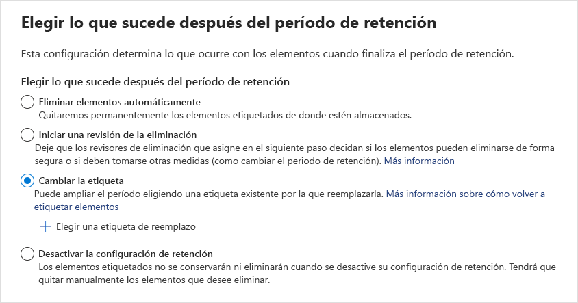

# <a name="common-settings-for-retention-policies-and-retention-label-policies"></a>Configuración normal para directivas de retención y directivas de etiquetas de retención

>*[Instrucciones de licencias de Microsoft 365 para la seguridad y el cumplimiento](https://aka.ms/ComplianceSD).*

Varias configuraciones de retención son comunes tanto a las directivas de retención como a las directivas de etiquetas de retención. Use la siguiente información para que le ayude a configurar estas opciones y conservar de forma proactiva el contenido, eliminar contenido o ambas cosas, es decir, conservar y luego eliminar el contenido.

Para ver los escenarios que admiten estas directivas para la retención, vea:

- [Crear y configurar directivas de retención](create-retention-policies.md).
- [Publicar etiquetas de retención y aplicarlas en aplicaciones](create-apply-retention-labels.md)
- [Aplicar una etiqueta de retención automáticamente al contenido](apply-retention-labels-automatically.md)

La configuración específica de cada escenario se explica en su correspondiente documentación.

Para obtener información general sobre las directivas de retención y cómo funciona la retención en Microsoft 365, vea [Obtener información sobre las directivas de retención y las etiquetas de retención](retention.md).

[!INCLUDE [purview-preview](../includes/purview-preview.md)]

## <a name="scopes---adaptive-and-static"></a>Ámbitos: adaptables y estáticos

Si no está familiarizado con los ámbitos adaptables y estáticos, y si necesita ayuda para elegir cuál usar al configurar una directiva de retención, consulte [Ámbitos de directiva adaptables o estáticos para la retención](retention.md#adaptive-or-static-policy-scopes-for-retention). 

Cuando haya decidido si va a usar un ámbito adaptable o estático, use la siguiente información para llevar a cabo la configuración:
- [Información de configuración para ámbitos adaptables](#configuration-information-for-adaptive-scopes)
- [Información de configuración para ámbitos estáticos](#configuration-information-for-static-scopes)

> [!TIP]
> Si tiene directivas que usan ámbitos estáticos y desea convertirlos en ámbitos adaptables, mantenga las directivas existentes mientras crea nuevas directivas que usan ámbitos adaptables con la misma configuración de retención. Compruebe que estas nuevas directivas están dirigidas a los usuarios, sitios y grupos correctos antes de deshabilitar o eliminar las antiguas directivas de ámbitos estáticos.

### <a name="configuration-information-for-adaptive-scopes"></a>Información de configuración para ámbitos adaptables

Si elige usar ámbitos adaptables, se le pedirá que seleccione qué tipo de ámbito adaptable desea. Hay tres tipos diferentes de ámbitos adaptables y cada uno admite diferentes atributos o propiedades:

| Tipo de ámbito adaptable | Entre los atributos o propiedades admitidos se incluyen |
|:-----|:-----|
|**Usuarios**. Se aplica a:  <br/> - Correo electrónico de Exchange <br/> - Cuentas de OneDrive <br/> - Chats de Teams <br/> - Mensajes de canales privados de Teams <br/> - Mensajes de usuarios de Yammer| Nombre <br/> Apellidos <br/>Nombre para mostrar <br/> Puesto en la organización <br/> Departamento <br/> Oficina <br/>Dirección <br/> Ciudad <br/>Estado o provincia <br/>Código postal <br/> País o región <br/> Direcciones de correo <br/> Alias <br/> Atributos personalizados de Exchange: CustomAttribute1 - CustomAttribute15|
|**Sitios de SharePoint**. Se aplica a:  <br/> - Sitios de SharePoint <br/> - Cuentas de OneDrive |Dirección URL del sitio <br/>Nombre del sitio <br/> Propiedades personalizadas de SharePoint: RefinableString00 - RefinableString99 |
|**Grupos de Microsoft 365**. Se aplica a:  <br/> - Grupos de Microsoft 365 <br/> - Mensajes de canal de Teams (estándar y compartidos) <br/> - Mensajes de la comunidad de Yammer |Nombre <br/> Nombre para mostrar <br/> Descripción <br/> Direcciones de correo <br/> Alias <br/> Atributos personalizados de Exchange: CustomAttribute1 - CustomAttribute15 |

Los nombres de propiedad de los sitios se basan en las propiedades administradas del sitio de SharePoint. Para obtener información sobre los atributos personalizados, vea [Usar propiedades personalizadas del sitio de SharePoint para aplicar la retención de Microsoft 365 con ámbitos de directiva adaptables](https://techcommunity.microsoft.com/t5/security-compliance-and-identity/using-custom-sharepoint-site-properties-to-apply-microsoft-365/ba-p/3133970).

Los nombres de atributo para usuarios y grupos se basan en [propiedades de destinatario filtrables](/powershell/exchange/recipientfilter-properties#filterable-recipient-properties) que se asignan a atributos de Azure AD. Por ejemplo:

- **Alias** se asigna al nombre LDAP **mailNickname** que se muestra como **Email** en el Centro de administración de Azure AD.
- **Email direcciones** se asignan al **nombre LDAP proxyAddresses** que se muestra como **dirección proxy** en el Centro de administración de Azure AD.

Los atributos y propiedades enumerados en la tabla se pueden especificar fácilmente al configurar un ámbito adaptable mediante el generador de consultas simple. Los atributos y propiedades adicionales se admiten con el generador de consultas avanzado, como se describe en la sección siguiente.

> [!TIP]
> Para obtener más información sobre el uso del generador de consultas avanzado, consulte los siguientes seminarios web: 
> - [Compilar consultas avanzadas para usuarios y grupos con ámbitos de directiva adaptables](https://mipc.eventbuilder.com/event/52683/occurrence/49452/recording?rauth=853.3181650.1f2b6e8b4a05b4441f19b890dfeadcec24c4325e90ac492b7a58eb3045c546ea)
> - [Compilar consultas avanzadas para sitios SharePoint con ámbitos de directiva adaptable](https://aka.ms/AdaptivePolicyScopes-AdvancedSharePoint)

Una única directiva de retención puede tener uno o varios ámbitos adaptables.

#### <a name="to-configure-an-adaptive-scope"></a>Para configurar un ámbito adaptable

Antes de configurar el ámbito adaptable, use la sección anterior para identificar qué tipo de ámbito crear y qué atributos y valores usará. Es posible que tenga que trabajar con otros administradores para confirmar esta información. 

Específicamente para los sitios de SharePoint, es posible que se necesite una configuración adicional de SharePoint si planea usar [propiedades de sitio personalizadas](https://techcommunity.microsoft.com/t5/security-compliance-and-identity/using-custom-sharepoint-site-properties-to-apply-microsoft-365/ba-p/3133970).

1. En el [portal de cumplimiento de Microsoft Purview](https://compliance.microsoft.com/), navegue a una de las siguientes ubicaciones:
    
    - Si usa la solución de administración de registros:
        - **Soluciones** \> **Administración de** \> registros **Pestaña Ámbitos adaptables** \> + **Crear ámbito**
        
    - Si usa la solución de administración del ciclo de vida de los datos:
       - **Soluciones** \> **Administración del ciclo de vida de los** \> datos **Microsoft 365** \> **Pestaña Ámbitos adaptables** \> + **Crear ámbito**
    
    ¿No encuentra inmediatamente la solución en el panel de navegación? Primero seleccione **Mostrar todo**. 

2. Siga los avisos de configuración para seleccionar primero el tipo de ámbito y luego los atributos o propiedades que desea usar para crear la pertenencia dinámica y escriba los valores de atributo o propiedad.
    
    Por ejemplo, para configurar un ámbito adaptable que se usará para identificar usuarios en Europa, primero seleccione **Usuarios** como tipo de ámbito y, a continuación, seleccione el atributo **País o región** y escriba **Europa**:
    
    
    
    Una vez al día, esta consulta se ejecutará en Azure AD e identificará a todos los usuarios que tengan especificado el valor **Europa** en su cuenta para el atributo **País o región**.
    
    > [!IMPORTANT]
    > Dado que la consulta no se ejecuta inmediatamente, no hay ninguna comprobación de que se haya especificado correctamente el valor.
    
    Seleccione **Agregar atributo** (para usuarios y grupos) o **Agregar propiedad** (para sitios) para usar cualquier combinación de atributos o propiedades que sean compatibles con el tipo de ámbito, junto con operadores lógicos para crear consultas. Los operadores admitidos son **es igual a**, **no es igual a**, **comienza por** y **no comienza por**, y puede agrupar atributos o propiedades seleccionados. Por ejemplo:
    
    
    
    Como alternativa, puede seleccionar **Generador de consultas avanzadas** para especificar sus propias consultas:
    
    - Para los ámbitos de **Usuario** y **Grupos de Microsoft 365**, use la [Sintaxis de filtrado OPATH](/powershell/exchange/recipient-filters). Por ejemplo, para crear un ámbito de usuario que defina su pertenencia por departamento, país y estado:
    
        
        
        Una de las ventajas de usar el generador de consultas avanzado para estos ámbitos es tener una opción más amplia de operadores de consulta:
        - **y**
        - **o**
        - **no**
        - **eq** (igual a)
        - **ne** (no es igual a)
        - **lt** (menor que)
        - **gt**(mayor que)
        - **like** (comparación de cadenas)
        - **notlike** (comparación de cadenas)
    
    - Para ámbitos de **sitios de SharePoint**, use Lenguaje de consulta de palabras clave (KQL). Es posible que ya esté familiarizado con el uso de KQL para búsquedas en SharePoint mediante propiedades de sitio indexadas. Para ayudarle a especificar estas consultas KQL, vea [Referencia de sintaxis del lenguaje de consulta de palabras clave (KQL)](/sharepoint/dev/general-development/keyword-query-language-kql-syntax-reference).
        
        Por ejemplo, dado que los ámbitos de sitio de SharePoint incluyen automáticamente todos los tipos de sitio de SharePoint, que incluyen sitios conectados a grupos de Microsoft 365 y OneDrive, puede usar la propiedad de sitio indexada **SiteTemplate** para incluir o excluir tipos de sitio específicos. Las plantillas que puede especificar:
        - `SITEPAGEPUBLISHING` para sitios de comunicación modernos
        - `GROUP` para sitios conectados a grupos de Microsoft 365
        - `TEAMCHANNEL` para sitios de canal privado de Microsoft Teams
        - `STS` para un sitio de grupo clásico de SharePoint
        - `SPSPERS` para sitios de OneDrive
        
        Por lo tanto, para crear un ámbito adaptable que incluya solo sitios de comunicación modernos y excluya sitios de OneDrive y conectados a grupos de Microsoft 365, especifique la siguiente consulta de KQL:
        ````console
        SiteTemplate=SITEPAGEPUBLISHING
        ````
    
    Puede [validar estas consultas avanzadas](#validating-advanced-queries) independientemente de la configuración del ámbito.
    
    > [!TIP]
    > Debe usar el generador de consultas avanzado si desea excluir buzones de correo inactivos. O, por el contrario, dirigirse solo a buzones de correo inactivos. Para esta configuración, use la propiedad OPATH *IsInactiveMailbox*:
    > 
    > - Para excluir buzones de correo inactivos, asegúrese de que la consulta incluye: `(IsInactiveMailbox -eq "False")`
    > - Para dirigirse solo a buzones inactivos, especifique: `(IsInactiveMailbox -eq "True")`

3. Cree tantos ámbitos adaptables como necesite. Puede seleccionar uno o más ámbitos adaptables al crear la directiva de retención.

> [!NOTE]
> Las consultas pueden tardar hasta cinco días en rellenarse por completo y los cambios no serán inmediatos. Considere este retraso y espere unos días antes de agregar un ámbito que se acaba de crear a una directiva de retención.

Para confirmar la pertenencia actual y los cambios de pertenencia para un ámbito adaptable:

1. Haga doble clic (o seleccione y presione Entrar) en el ámbito en la página **Ámbitos adaptables**

2. En el panel **Detalles** del control flotante, seleccione **Detalles del ámbito**. 
    
    Revise la información que identifica a todos los usuarios, sitios o grupos actualmente en el ámbito, si se agregaron o quitaron automáticamente y la fecha y hora del cambio de pertenencia.

> [!TIP]
> Use la opción de [Búsqueda de directivas](retention.md#policy-lookup) para ayudarle a identificar las directivas que están asignadas actualmente a usuarios, sitios y grupos de Microsoft 365 específicos.

#### <a name="validating-advanced-queries"></a>Validación de consultas avanzadas

Puede validar manualmente las consultas avanzadas mediante PowerShell y la búsqueda de SharePoint:
- Use PowerShell para los tipos de ámbito **Usuarios** y **Grupos de Microsoft 365**
- Use la búsqueda de SharePoint para el tipo de ámbito **sitios de SharePoint**

Para ejecutar una consulta con PowerShell:

1. [Conectarse a Exchange Online PowerShell](/powershell/exchange/connect-to-exchange-online-powershell) usando una cuenta con [permisos de administrador de Exchange Online adecuados](/powershell/exchange/find-exchange-cmdlet-permissions#use-powershell-to-find-the-permissions-required-to-run-a-cmdlet)

2. Use [Get-Recipient](/powershell/module/exchange/get-recipient), [Get-Mailbox](/powershell/module/exchange/get-mailbox) o [Get-User](/powershell/module/exchange/get-user) con el parámetro *-Filtro* y la [consulta OPATH](/powershell/exchange/filter-properties) para el ámbito adaptativo encerrado entre corchetes (`{`,`}`). Si los valores de atributo son cadenas, escríbalos entre comillas dobles o simples.

    Puede determinar si desea usar Get-Mailbox, Get-Recipient o Get-User para la validación mediante la identificación del cmdlet que admite la [propiedad OPATH](/powershell/exchange/filter-properties) que elija para su consulta.

    > [!IMPORTANT]
    > Get-Mailbox no admite el tipo de destinatario *MailUser*, por lo que se debe usar Get-Recipient o Get-User para validar consultas que incluyan buzones locales en un entorno híbrido.

    Para validar un ámbito **Usuario**, use el comando adecuado:
    - `Get-Mailbox` con *-RecipientTypeDetails UserMailbox,SharedMailbox,RoomMailbox,EquipmentMailbox*
    - `Get-Recipient` con *-RecipientTypeDetails UserMailbox,MailUser,SharedMailbox,RoomMailbox,EquipmentMailbox*
    
    Para validar un ámbito de **grupo de Microsoft 365**, use:
    - `Get-Mailbox` con *-GroupMailbox* o `Get-Recipient` con *-RecipientTypeDetails GroupMailbox*

    Por ejemplo, para validar un ámbito de **usuario,** puede usar:
    
    ````PowerShell
    Get-Recipient -RecipientTypeDetails UserMailbox,MailUser -Filter {Department -eq "Marketing"} -ResultSize Unlimited
    ````
    
    Para validar un **grupo de Microsoft 365**, puede usar:
    
    ```PowerShell
    Get-Mailbox -RecipientTypeDetails GroupMailbox -Filter {CustomAttribute15 -eq "Marketing"} -ResultSize Unlimited
    ```
    
    > [!TIP]
    > When you use these commands to validate a user scope, if the number of recipients returned is higher than expected, it might be because it includes users who don't have a valid license for adaptive scopes. These users won't have the retention settings applied to them.
    > 
    > For example, in a hybrid environment, you might have unlicensed synchronized user accounts without an Exchange mailbox on-premises or in Exchange Online. You can identify these users by running the following command: `Get-User -RecipientTypeDetails User`

3. Compruebe que el resultado coincide con los usuarios o grupos previstos en el ámbito adaptable. Si no es así, compruebe la consulta y los valores con el administrador correspondiente para Azure AD o Exchange.
 
Para ejecutar una consulta mediante la búsqueda de SharePoint:

1. Con una cuenta de administrador global o una cuenta que tenga el rol de administrador de SharePoint, vaya a `https://<your_tenant>.sharepoint.com/search`.

2. Use la barra de búsqueda para especificar la consulta KQL.

3. Compruebe que los resultados de la búsqueda coincidan con las direcciones URL de sitio previstas para el ámbito adaptable. Si no es así, compruebe la consulta y las direcciones URL con el administrador de SharePoint correspondiente.

### <a name="configuration-information-for-static-scopes"></a>Información de configuración para ámbitos estáticos

Si elige usar ámbitos estáticos, debe decidir si la directiva ha de aplicarse a todas las instancias de la ubicación seleccionada (toda la ubicación) o si se incluyen o excluyen instancias específicas (inclusiones o exclusiones específicas).

#### <a name="a-policy-that-applies-to-entire-locations"></a>Una directiva que se aplica a todas las ubicaciones

A excepción de Skype Empresarial, el valor predeterminado indica que todas las instancias de las ubicaciones seleccionadas se incluyen automáticamente en la directiva sin que tenga que especificarlas como incluidas.

For example, **All recipients** for the **Exchange email** location. With this default setting, all existing user mailboxes will be included in the policy, and any new mailboxes created after the policy is applied will automatically inherit the policy.

#### <a name="a-policy-with-specific-inclusions-or-exclusions"></a>Una directiva con inclusiones o exclusiones específicas

Be aware that if you use the optional configuration to scope your retention settings to specific users, specific Microsoft 365 groups, or specific sites, there are some limits per policy to be aware of. For more information, see [Limits for retention policies and retention label policies](retention-limits.md). 

Para usar la configuración opcional para definir el ámbito de la configuración de retención, asegúrese de que el **Estado** de esa ubicación esté **Activado** y, a continuación, use los vínculos para incluir o excluir determinados usuarios, grupos de Microsoft 365 o sitios.

> [!WARNING]
> Si configura instancias para incluir y luego quita la última, la configuración se revierte a **Todos** para la ubicación.  Asegúrese de que esta es la configuración que desea antes de guardar la directiva.
>
> For example, if you specify one SharePoint site to include in your retention policy that's configured to delete data, and then remove the single site, by default all SharePoint sites will then be subject to the retention policy that permanently deletes data. The same applies to includes for Exchange recipients, OneDrive accounts, Teams chat users, and so on.
>
> In this scenario, toggle the location off if you don't want the **All** setting for the location to be subject to the retention policy. Alternatively, specify exclude instances to be exempt from the policy.

## <a name="locations"></a>Ubicaciones

Las ubicaciones en las directivas de retención identifican servicios Microsoft 365 específicos que admiten la configuración de retención, tales como el correo electrónico de Exchange y sitios de SharePoint. Use la siguiente sección para las ubicaciones que tienen detalles de configuración y posibles excepciones que debe tener en cuenta al seleccionarlas para la directiva.

### <a name="configuration-information-for-exchange-email-and-exchange-public-folders"></a>Información de configuración para el correo electrónico de Exchange y las carpetas públicas de Exchange

Tanto la ubicación del **correo electrónico de Exchange** como la ubicación de las **carpetas públicas de Exchange** requieren que los buzones tengan al menos 10 MB de datos antes de que se les aplique la configuración de retención.

The **Exchange email** location supports retention for users' email, calendar, and other mailbox items, by applying retention settings at the level of a mailbox. Shared mailboxes and resource mailboxes for equipment and rooms are also supported.

Los contactos de correo electrónico y los grupos de Microsoft 365 no son compatibles con el correo electrónico de Exchange. Para los buzones de grupo de Microsoft 365, seleccione en su lugar la ubicación de **Microsoft 365 Groups**. Aunque la ubicación de Exchange inicialmente permite seleccionar un buzón de correo de grupo para un ámbito estático, cuando intenta guardar la directiva de retención, recibe un error que indica que "RemoteGroupMailbox" no es una selección válida para esta ubicación.

Según la configuración de directivas, los [buzones de correo inactivos](inactive-mailboxes-in-office-365.md) pueden incluirse o no:

- Los ámbitos de directiva estática incluyen buzones inactivos cuando se usa la configuración predeterminada **Todos los destinatarios**, pero no se admiten para [inclusiones o exclusiones específicas](#a-policy-with-specific-inclusions-or-exclusions). Sin embargo, si incluye o excluye un destinatario que tiene un buzón de correo activo en el momento en que se aplica la directiva y el buzón más adelante pasa a estar inactivo, la configuración de retención se seguirá aplicando o excluyendo.

- De forma predeterminada, los ámbitos de directiva adaptables incluyen buzones inactivos cuando cumplen la consulta del ámbito. Puede excluirlos mediante el generador de consultas avanzado y la propiedad OPATH *IsInactiveMailbox*:
    
    ```console
    (IsInactiveMailbox -eq "False")
    ```

Si usa un ámbito de directiva estática y elige destinatarios para incluir o excluir, puede seleccionar grupos de distribución y grupos de seguridad habilitados para correo electrónico como una forma eficaz de seleccionar varios destinatarios en lugar de seleccionarlos uno a uno. Cuando se usa esta opción, estos grupos se expanden automáticamente en segundo plano en el momento de la configuración para seleccionar los buzones de los usuarios del grupo. Si la pertenencia a esos grupos cambia más adelante, la directiva de retención existente no se actualiza automáticamente, a diferencia de los ámbitos de directiva adaptables.

Para obtener información detallada sobre los elementos del buzón de correo que se incluyen y excluyen cuando se configuran las opciones de retención para Exchange, consulte [Qué se incluye en la retención y la eliminación](retention-policies-exchange.md#whats-included-for-retention-and-deletion).

La ubicación de las **carpetas públicas de Exchange** aplica la configuración de retención a todas las carpetas públicas y no se puede aplicar en el nivel de carpeta o de buzón de correo.

#### <a name="exceptions-for-auto-apply-policies-configured-for-sensitive-information-types"></a>Excepciones para directivas de aplicación automática configuradas para tipos de información confidencial

Al configurar una directiva de aplicación automática que usa tipos de información confidencial y seleccionar la ubicación de **correo electrónico de Exchange**:

- Consulte la llamada importante para [aplicar automáticamente etiquetas al contenido con tipos específicos de información confidencial](apply-retention-labels-automatically.md#auto-apply-labels-to-content-with-specific-types-of-sensitive-information).

### <a name="configuration-information-for-sharepoint-sites-and-onedrive-accounts"></a>Información de configuración para los sitios de SharePoint y las cuentas de OneDrive

Cuando elige la ubicación de los **sitios de SharePoint**, la directiva de retención puede conservar y eliminar documentos en los sitios de comunicación de SharePoint, en los sitios de equipo no conectados mediante grupos de Microsoft 365 y en los sitios clásicos. A menos que use [ámbitos de directiva adaptables](#exceptions-for-adaptive-policy-scopes), los sitios de equipo conectados por grupos de Microsoft 365 no son compatibles con esta opción y, en su lugar, use la ubicación **Grupos de Microsoft 365** que se corresponda con el contenido del buzón, el sitio y los archivos del grupo.

> [!TIP]
> Puede usar un [filtro en el Centro de administración de SharePoint](/sharepoint/customize-admin-center-site-list) o un [comando de PowerShell de SharePoint](/powershell/module/sharepoint-online/get-sposite#example-10) para confirmar si un sitio está conectado a un grupo. Para ámbitos estáticos, estos sitios son compatibles con la ubicación **Grupos de Microsoft 365**.

Para obtener información detallada sobre lo que se incluye y excluye al configurar las opciones de retención para SharePoint y OneDrive, consulte [¿Qué se incluye para la retención y eliminación?](retention-policies-sharepoint.md#whats-included-for-retention-and-deletion)

Al especificar ubicaciones para sitios de SharePoint o cuentas de OneDrive, no necesita permisos para acceder a los sitios. En el caso de los ámbitos estáticos, no se realiza ninguna validación al especificar la dirección URL en la página **Editar ubicaciones**. Sin embargo, se comprueba que los sitios de SharePoint que especifique existan en la página final de la configuración. Si se produce un error en esta comprobación, verá un mensaje que indica que no se pudo realizar la validación de la dirección URL que ha indicado y la directiva de retención no se podrá crear hasta que se realice la comprobación de validación.  Si ve este mensaje, vuelva atrás en el proceso de configuración para cambiar la dirección URL o bien para quitar el sitio de la directiva de retención.

Para especificar cuentas individuales de OneDrive, vea [Obtener una lista de las direcciones URL de OneDrive de todos los usuarios de su organización](/onedrive/list-onedrive-urls).

> [!NOTE]
> Cuando especifique cuentas de OneDrive individuales, tenga en cuenta que, a menos que las cuentas de OneDrive estén [aprovisionadas previamente](/onedrive/pre-provision-accounts), la dirección URL no se creará hasta que un usuario tenga acceso a sus cuentas de OneDrive por primera vez.
>
> Además, la URL de OneDrive cambiará [automáticamente](/onedrive/upn-changes) si hay un cambio en el UPN del usuario. Por ejemplo, un evento por el que se cambie de nombre, como el matrimonio, o un cambio de nombre de dominio para admitir el cambio de nombre o la reestructuración empresarial de una organización. Si el UPN cambia, deberá actualizar las direcciones URL de OneDrive que se especifiquen para la configuración de retención.
>
> Debido al reto que supone especificar de forma confiable direcciones URL para que los usuarios individuales se incluyan o excluyan en ámbitos estáticos, los [ámbitos adaptables](retention.md#adaptive-or-static-policy-scopes-for-retention) con el tipo de ámbito **Usuario** son más adecuados para este propósito.

#### <a name="exceptions-for-adaptive-policy-scopes"></a>Excepciones para ámbitos de directivas adaptables

Al configurar una directiva de retención que use ámbitos de directiva adaptables y seleccione la ubicación de **sitios SharePoint**:

- Se incluyen sitios OneDrive y grupo de Microsoft 365 conectado además de los sitios de comunicación de SharePoint, los sitios de grupo que no están conectados por grupos de Microsoft 365 y sitios clásicos.

### <a name="configuration-information-for-microsoft-365-groups"></a>Información de configuración para los Grupos de Microsoft 365

Para conservar o eliminar el contenido de un grupo de Microsoft 365 (anteriormente llamado "grupo de Office 365"), utilice la ubicación de los **Grupos de Microsoft 365**. Para las directivas de retención, esta ubicación incluye el buzón de grupo y el sitio de equipos de SharePoint. Para las etiquetas de retención, esta ubicación solo incluye el sitio de equipos de SharePoint.

Para obtener información detallada sobre qué elementos se incluyen y excluyen para Grupos de Microsoft 365:
- Para los buzones de grupo, consulte [Qué se incluye para la retención y eliminación](retention-policies-exchange.md#whats-included-for-retention-and-deletion) de la retención de Exchange.
- Para los sitios de equipos de SharePoint, consulte [Qué se incluye para la retención y eliminación](retention-policies-sharepoint.md#whats-included-for-retention-and-deletion) de la retención de SharePoint.

Los buzones de correo de destino con esta ubicación de directiva requieren al menos 10 MB de datos antes de que se les aplique la configuración de retención.

> [!NOTE]
> Aunque un grupo de Microsoft 365 tiene un buzón de Exchange, una directiva de retención para la ubicación del **Correo electrónico de Exchange** no incluirá el contenido de los buzones del grupo de Microsoft 365.

Si usa ámbitos estáticos: aunque la ubicación del **Correo electrónico de Exchange** para un ámbito estático le permite inicialmente especificar un buzón de grupo para incluirlo o excluirlo, cuando intente guardar la directiva de retención, verá un error que indica que "RemoteGroupMailbox" no es una selección válida para la ubicación de Exchange.

De manera predeterminada, una directiva de retención aplicada a un grupo de Microsoft 365 incluye el buzón de grupo y el sitio de equipos de SharePoint. Los archivos almacenados en el sitio de equipos de SharePoint se tratan en esta ubicación, pero no los mensajes de chats ni canales de Teams que tienen sus propias ubicaciones de directivas de retención.

Para cambiar el valor predeterminado porque quiere que la directiva de retención se aplique solo a los buzones de Microsoft 365 o solo a los sitios de equipos de SharePoint conectados, use el cmdlet de PowerShell [Set-RetentionCompliancePolicy](/powershell/module/exchange/set-retentioncompliancepolicy) y el parámetro *Applications* con uno de los siguientes valores:

- `Group:Exchange` solo para los buzones de Microsoft 365 conectados al grupo.
- `Group:SharePoint` solo para sitios de SharePoint conectados al grupo.

Para volver al valor predeterminado del buzón y del sitio de SharePoint para los grupos de Microsoft 365 seleccionados, especifique `Group:Exchange,SharePoint`.

#### <a name="exceptions-for-auto-apply-policies-configured-for-sensitive-information-types"></a>Excepciones para directivas de aplicación automática configuradas para tipos de información confidencial

Al configurar una directiva de aplicación automática que usa tipos de información confidencial y seleccionar la ubicación **Grupos de Microsoft 365**:

- Microsoft 365 group mailboxes aren't included. To include these mailboxes in your policy, select the **Exchange email** location instead.

#### <a name="what-happens-if-a-microsoft-365-group-is-deleted-after-a-policy-is-applied"></a>Qué sucede si un grupo de Microsoft 365 se elimina después de aplicar una directiva

Cuando se aplica una directiva de retención (ámbito de directiva estática o adaptable) a un grupo de Microsoft 365 y ese grupo se elimina de Azure Active Directory:

- El sitio de grupo de SharePoint conectado se conserva y continúa siendo administrado por la directiva de retención con la ubicación **Grupos de Microsoft 365**. El sitio sigue siendo accesible para las personas que tenían acceso a él antes de eliminar el grupo y los nuevos permisos ahora deben administrarse a través de SharePoint.
    
    En este momento, no puede excluir el sitio de la ubicación Grupos de Microsoft 365, ya que no puede especificar el grupo eliminado. Si necesita liberar la directiva de retención de este sitio, póngase en contacto con el Soporte técnico de Microsoft. Por ejemplo, [abra una solicitud de soporte técnico en el Centro de Administración de Microsoft 365](/microsoft-365/admin/get-help-support#online-support).

- El buzón del grupo eliminado se vuelve inactivo y, al igual que el sitio de SharePoint, permanece sujeto a la configuración de retención. Para obtener más información, consulte [Buzones de correo inactivos en Exchange Online](inactive-mailboxes-in-office-365.md).

### <a name="configuration-information-for-skype-for-business"></a>Información de configuración de Skype Empresarial

> [!NOTE]
> Skype Empresarial fue [retirado el 31 de julio de 2021](https://techcommunity.microsoft.com/t5/microsoft-teams-blog/skype-for-business-online-to-be-retired-in-2021/ba-p/777833) y animamos a los clientes a migrar a Microsoft Teams. Sin embargo, las directivas de retención para Skype Empresarial siguen siendo compatibles con los clientes existentes.

A diferencia del correo electrónico de Exchange, no puede activar el estado de ubicación de Skype para incluir automáticamente a todos los usuarios, pero cuando active esta ubicación, debe elegir manualmente los usuarios cuyas conversaciones desea conservar:


Después de seleccionar la opción **Editar**, en el panel **Skype Empresarial**, puede seleccionar el cuadro oculto antes de la columna **Nombre** para incluir rápidamente a todos los usuarios. Sin embargo, es importante entender que cada usuario tiene que contar con una inclusión específica en la directiva. Por lo tanto, si selecciona esta casilla para incluir 1 000, será lo mismo que si selecciona manualmente 1 000 usuarios, que es el máximo admitido en Skype Empresarial.

Be aware that **Conversation History**, a folder in Outlook, is a feature that has nothing to do with Skype archiving. **Conversation History** can be turned off by the end user, but archiving for Skype is done by storing a copy of Skype conversations in a hidden folder that is inaccessible to the user but available to eDiscovery.

## <a name="settings-for-retaining-and-deleting-content"></a>Configuración para conservar y eliminar el contenido

Al elegir las configuraciones para conservar y eliminar contenido, la directiva de retención tendrá una de las siguientes configuraciones durante un período de tiempo especificado:

- Sólo conservar
    
    Para esta configuración, elija las siguientes opciones:
    
    - For retention policies: On the **Decide if you want to retain content, delete it, or both** page, select **Retain items for a specific period**, specify the retention period and then for **At end of the retention period** select **Do nothing** for the retention settings to be removed.  Or to retain without an end date, select **Retain items forever** on this page.
    
    - Para las etiquetas de retención: en la página **Definir configuración de etiquetas**, seleccione **Conservar elementos indefinidamente o durante un período específico** y, a continuación:
        - Para que la configuración de retención deje de estar en vigor en el contenido etiquetado después de un tiempo específico: en la página **Definir el período de retención**, para **Conservar elementos para**, especifique el período de tiempo. A continuación, en la página **Elegir lo que sucede después del período de retención**, seleccione **Desactivar configuración de retención**. La etiqueta permanece en el contenido, pero sin restricciones, como si fuera una [etiqueta que solo clasifica](retention.md#classifying-content-without-applying-any-actions).
        - Para conservar sin una fecha de finalización: en la página **Definir el período de retención**, para **Conservar elementos para**, seleccione **Un período indefinido**. La etiqueta permanece en el contenido con las[restricciones existentes](records-management.md#compare-restrictions-for-what-actions-are-allowed-or-blocked ).

- Conservar y luego eliminar

    Para esta configuración, elija las siguientes opciones:
    
    - Para las políticas de retención: en la página **Decidir si quiere retener el contenido, eliminarlo o ambas cosas**, seleccione **Retener elementos durante un período específico**, especifique el período de retención y, a continuación, para **Al finalizar el período de retención**, seleccione **Eliminar elementos automáticamente**.
    
    - For retention labels: On the **Define label settings** page, select **Retain items indefinitely or for a specific period**, specify the retention period and then for **Choose what happens after the retention period**, select either **Delete items automatically** or **Start a disposition review**. For information about disposition reviews, see [Disposition review](disposition.md#disposition-reviews).

- Solo eliminar

    Para esta configuración, elija las siguientes opciones:
    
    - Para las directivas de retención: en la página **Decidir si desea conservar el contenido, eliminarlo o ambas cosas**, seleccione **Eliminar solo los elementos cuando alcancen una determinada antigüedad** y especifique el período de tiempo.
    
    - Para las etiquetas de retención: en la página **Definir configuración de etiquetas**, seleccione **Aplicar acciones después de un período específico** y especifique el período de tiempo, que todavía se denomina período de retención. La opción **Elegir lo que sucede después del período** se establece automáticamente en **Eliminar elementos automáticamente**.

### <a name="retaining-content-for-a-specific-period-of-time"></a>Conservar el contenido durante un período de tiempo determinado

Cuando se configura una etiqueta o directiva de retención de contenidos, se elige retener los elementos durante un número específico de días, meses (se asume que 30 días para un mes) o años. Como alternativa, conserve siempre los elementos. El período de retención no se calcula a partir del momento en que se asignó la directiva, sino según el inicio del período de retención especificado.

Para iniciar el período de retención, puede elegir cuándo se creó el contenido o, solo en el caso de los archivos y los grupos de SharePoint, OneDrive y Microsoft 365, cuándo se modificó el contenido por última vez. En el caso de las etiquetas de retención, puede iniciar el período de retención desde que se etiquetó el contenido y cuándo se produce un evento.

Ejemplos:

- SharePoint: If you want to retain items in a site collection for seven years after this content is last modified, and a document in that site collection hasn't been modified in six years, the document will be retained for only another year if it's not modified. If the document is edited again, the age of the document is calculated from the new last modified date, and it will be retained for another seven years.

- Exchange: If you want to retain items in a mailbox for seven years, and a message was sent six years ago, the message will be retained for only one year. For Exchange items, the age is based on the date received for incoming email, or the date sent for outgoing email. Retaining items based on when it was last modified applies only to site content in OneDrive and SharePoint.

At the end of the retention period, you choose whether you want the content to be permanently deleted. For example, for retention policies:


Las etiquetas de retención tienen dos opciones más. Como se describe en la sección siguiente, pueden aplicar otra etiqueta de retención con su propio período de retención. O bien, pueden [desencadenar un flujo de Power Automate](retention-label-flow.md) para acciones personalizadas.

Antes de configurar la retención, familiarícese primero con los límites de capacidad y almacenamiento de las cargas de trabajo correspondientes:

- Para SharePoint y OneDrive, los elementos retenidos se almacenan en la biblioteca de conservación de documentos del sitio, que se incluye en la cuota de almacenamiento del sitio. Para obtener más información, consulte [Administrar los límites de almacenamiento del sitio](/sharepoint/manage-site-collection-storage-limits) de la documentación de SharePoint.

- Para Exchange, Teams y Yammer, donde los mensajes retenidos se almacenan en buzones, consulte [límites de Exchange Online](/office365/servicedescriptions/exchange-online-service-description/exchange-online-limits) y habilite [archivo de expansión automática](autoexpanding-archiving.md).
    
    In extreme cases where a high volume of email is deleted in a short time period, either by users or automatically from policy settings, you might also need to configure Exchange to more frequently move items from the Recoverable Items folder in the user's primary mailbox to the Recoverable Items folder in their archive mailbox. For step-by-step instructions, see [Increase the Recoverable Items quota for mailboxes on hold](increase-the-recoverable-quota-for-mailboxes-on-hold.md).

#### <a name="relabeling-at-the-end-of-the-retention-period"></a>Volver a etiquetar al final del período de retención

Al configurar una etiqueta de retención para aplicar automáticamente otra etiqueta de retención al final del período de retención, el elemento está sujeto a la configuración de retención de la etiqueta de retención recién seleccionada. Esta opción le permite cambiar automáticamente la configuración de retención del elemento.

Puede cambiar la etiqueta de reemplazo después de crear y guardar la etiqueta de retención principal. Para los elementos que ya tienen aplicada la etiqueta de retención principal y dentro del período de retención configurado, el cambio de etiqueta de reemplazo se sincronizará con estos elementos. Al igual que con otros cambios de etiqueta, espere hasta 7 días para este período de sincronización.

Para la etiqueta de reemplazo, normalmente elegirá una etiqueta que tenga un período de retención más largo que la etiqueta de retención principal. Sin embargo, este no siempre es el caso y depende de la configuración de la etiqueta respecto al inicio del período de retención. Por ejemplo, la etiqueta de retención principal está configurada para iniciar el período de retención cuando se crea el elemento y la etiqueta de reemplazo inicia el período de retención cuando se etiqueta o cuando se produce un evento.

Si también hay un cambio en si la etiqueta [marca el elemento como un registro o un registro regular](declare-records.md), la etiqueta de retención de reemplazo también podrá cambiar las [restricciones sobre qué acciones se permiten o bloquean](records-management.md#records) para ese elemento.

##### <a name="relabeling-example-configuration"></a>Volver a etiquetar la configuración de ejemplo

Cree y configure una etiqueta de retención para que un requisito de cumplimiento del sector conserve el contenido durante tres años después de su creación y marque el elemento como un registro. Cuando se aplique esta etiqueta, los usuarios no podrán eliminar el elemento de su aplicación, porque es una de las restricciones de un registro.

Al final de los tres años, desea conservar automáticamente el contenido durante dos años más debido a las directivas de cumplimiento interno, pero no es necesario marcarlo como un registro con las restricciones que aplica esta configuración.

Para completar la configuración, seleccione la configuración de etiqueta para cambiar la etiqueta al final del período de retención y elija una etiqueta que conserve el contenido durante cinco años después de crearlo y que no marque el elemento como registro. 

Con esta configuración concatenada, los usuarios podrán eliminar el elemento de su aplicación después de tres años, pero seguirá siendo accesible para las búsquedas de exhibición de documentos electrónicos durante cinco años.

##### <a name="considerations-for-the-relabeling-option"></a>Consideraciones para la opción de reetiquetado

- No se puede volver a etiquetar un registro normativo, pero la etiqueta de reemplazo se puede configurar para marcar el contenido como un registro normativo.

- No podrá eliminar una etiqueta de retención seleccionada como etiqueta de reemplazo.

- Puede elegir una etiqueta de reemplazo que esté configurada para aplicar otra etiqueta de reemplazo. No hay ningún límite en el número de etiquetas de reemplazo que puede tener un elemento.

- Si la etiqueta de reemplazo marca el elemento como un registro o registro normativo, pero no se puede aplicar porque el archivo está actualmente desprotegido, se reintenta el proceso de volver a etiquetar cuando se vuelve a proteger el archivo o se descarta la desprotección.

- Debido a un problema conocido de esta versión preliminar, una etiqueta de reemplazo solo es visible para los usuarios de Outlook cuando se incluye en una directiva de etiqueta publicada para la misma ubicación o se configura para solo eliminación.

##### <a name="configuration-paths-for-relabeling"></a>Rutas de configuración para volver a etiquetar

Al crear una etiqueta de retención, existen dos rutas de configuración para volver a etiquetar al final del período de retención:

- Si necesita conservar inicialmente el contenido con la etiqueta principal (lo más habitual): en la página **Definir configuración de etiqueta**, seleccione **Conservar elementos indefinidamente o durante un período específico** y especifique el período de retención. A continuación, en la página **Elegir lo que sucede después del período de retención**, seleccione **Cambiar la etiqueta** > **Elija una etiqueta de reemplazo**.

- Si no necesita conservar inicialmente el contenido con la etiqueta principal: en la página **Definir configuración de etiqueta**, seleccione **Aplicar acciones después de un período específico**, especifique el período de retención y, a continuación, seleccione **Cambiar la etiqueta** > **Elegir una etiqueta de reemplazo**.

En ambos casos, la etiqueta de reemplazo ya debe haberse creado, pero no es necesario incluirla en una directiva de etiqueta existente.



Otra opción es que los revisores de eliminación seleccionen manualmente una etiqueta de reemplazo como parte del [proceso de revisión de eliminación](disposition.md#disposition-reviews) si la configuración de etiqueta **Iniciar una revisión de eliminación** está seleccionada en la página **Elegir lo que sucede después del período de retención**.

### <a name="deleting-content-thats-older-than-a-specific-age"></a>Eliminar el contenido que supera una antigüedad determinada

La configuración de retención puede conservar y luego eliminar elementos o eliminar elementos antiguos sin conservarlos.

In both cases, if your retention settings delete items, it's important to understand that the time period you specify isn't calculated from the time the policy was assigned, but according to the start of the retention period specified. For example, from the time when the item was created or modified, or labeled.

Por este motivo, considere primero la antigüedad del contenido existente y cómo la configuración podría afectar a ese contenido. Considere la posibilidad de comunicar los ajustes elegidos a sus usuarios y al servicio de asistencia antes de que se aplique la configuración al contenido, lo que les da tiempo para evaluar el posible impacto.

### <a name="a-policy-that-applies-to-entire-locations"></a>Una directiva que se aplica a todas las ubicaciones

Al elegir ubicaciones, excepto Skype Empresarial, la configuración predeterminada es **Todo** cuando el estado de la ubicación está **Activado**.

Cuando una directiva de retención se aplica a cualquier combinación de todas las ubicaciones, no hay ningún límite en el número de destinatarios, sitios, cuentas, grupos, etc. que la directiva pueda incluir.

For example, if a policy includes all Exchange email and all SharePoint sites, all sites and recipients will be included, no matter how many. And for Exchange, any new mailbox created after the policy is applied will automatically inherit the policy.

### <a name="a-policy-with-specific-inclusions-or-exclusions"></a>Una directiva con inclusiones o exclusiones específicas

Be aware that if you use the optional configuration to scope your retention settings to specific users, specific Microsoft 365 groups, or specific sites, there are some limits per policy to be aware of. For more information, see [Limits for retention policies and retention label policies](retention-limits.md). 

Para usar la configuración opcional para definir el ámbito de la configuración de retención, asegúrese de que el **Estado** de esa ubicación esté **Activado** y, a continuación, use los vínculos para incluir o excluir determinados usuarios, grupos de Microsoft 365 o sitios.

> [!WARNING]
> Si configura inclusiones y, a continuación, quita la última, la configuración de su ubicación se revertirá a **Todos**.  Asegúrese de que esta es la configuración que desea antes de guardar la directiva.
>
> For example, if you specify one SharePoint site to include in your retention policy that's configured to delete data, and then remove the single site, by default all SharePoint sites will then be subject to the retention policy that permanently deletes data. The same applies to includes for Exchange recipients, OneDrive accounts, Teams chat users etc.
>
> In this scenario, toggle the location off if you don't want the **All** setting for the location to be subject to the retention policy. Alternatively, specify excludes to be exempt from the policy.

## <a name="updating-policies-for-retention"></a>Actualización de directivas de retención

Algunas opciones de configuración no se pueden cambiar después de haber creado y guardado una directiva de retención. Esto incluye:
- El nombre de la directiva y la configuración de retención, excepto el período de retención y cuándo se ha de iniciar el mismo.

Si edita una directiva de retención y el contenido ya está sujeto a la configuración original de su directiva de retención, la configuración actualizada se aplicará automáticamente a estos elementos, además de los elementos identificados recientemente.

Usually this update is fairly quick but can take several days. When the policy replication across your Microsoft 365 locations is complete, you'll see the status of the retention policy in the Microsoft Purview compliance portal change from **On (Pending)** to **On (Success)**.

## <a name="locking-the-policy-to-prevent-changes"></a>Bloquear la directiva para impedir que se realicen cambios

Si necesita asegurarse de que nadie pueda desactivar, eliminar, o hacer que la directiva sea menos restrictiva, consulte [Usar el Bloqueo de conservación para restringir los cambios en directivas de retención y directivas de etiquetas de retención](retention-preservation-lock.md).
