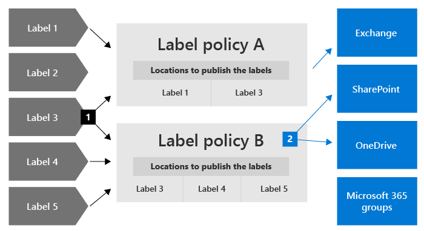
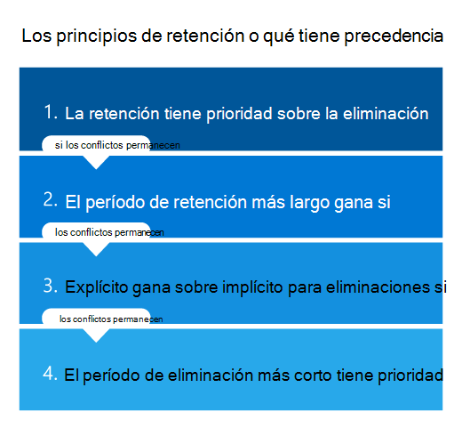

# Más información sobre directivas y etiquetas de retenciónLearn about retention policies and retention labels

>*[Instrucciones de licencias de Microsoft 365 para la seguridad y el cumplimiento](/office365/servicedescriptions/microsoft-365-service-descriptions/microsoft-365-tenantlevel-services-licensing-guidance/microsoft-365-security-compliance-licensing-guidance).**[Microsoft 365 licensing guidance for security & compliance](/office365/servicedescriptions/microsoft-365-service-descriptions/microsoft-365-tenantlevel-services-licensing-guidance/microsoft-365-security-compliance-licensing-guidance).*

> [!NOTE]
> Si ve mensajes sobre directivas de retención en sus aplicaciones, contacte con el departamento de TI para obtener información sobre cómo lo han configurado para usted.If you're seeing seeing messages about retention policies in your apps, contact your IT department for information about how they have been configured for you. Si estos mensajes son para el chat de Teams o los mensajes de canal, consulte [Mensajes de Teams sobre la retención de directivas](https://support.microsoft.com/office/teams-messages-about-retention-policies-c151fa2f-1558-4cf9-8e51-854e925b483b).If these messages are for Teams chat or channel messages, see [Teams messages about retention policies](https://support.microsoft.com/office/teams-messages-about-retention-policies-c151fa2f-1558-4cf9-8e51-854e925b483b).
>
> La información de esta página es para administradores de TI que pueden crear directivas y etiquetas de retención por motivos de cumplimiento.The information on this page is for IT administrators who can create retention policies and retention labels for compliance reasons.

Para la mayoría de las organizaciones, el volumen y la complejidad de los datos se incrementa diariamente: correo electrónico, documentos, mensajes instantáneos y mucho más. Administrar o gobernar esta información es importante, ya que necesita:For most organizations, the volume and complexity of their data is increasing daily—email, documents, instant messages, and more. Effectively managing or governing this information is important because you need to:

- **Cumplir de forma proactiva con las normas del sector y las directivas internas** que le exigen retener contenido durante un período mínimo de tiempo. Por ejemplo, la ley Sarbanes-Oxley puede exigirle que retenga determinados tipos de contenido durante siete años.**Comply proactively with industry regulations and internal policies** that require you to retain content for a minimum period of time—for example, the Sarbanes-Oxley Act might require you to retain certain types of content for seven years.

- **Reducir el riesgo en caso de litigio o una infracción de seguridad** al eliminar de forma permanente contenido antiguo que ya no es necesario mantener.**Reduce your risk in the event of litigation or a security breach** by permanently deleting old content that you're no longer required to keep.

- **Ayudar a su organización a compartir los conocimientos de manera eficaz y ser más ágil** al asegurarse de que los usuarios trabajan solo con contenido actualizado y relevante para ellos.**Help your organization to share knowledge effectively and be more agile** by ensuring that your users work only with content that's current and relevant to them.

Las opciones de retención que configure pueden ayudarle a lograr estos objetivos.Retention settings that you configure can help you achieve these goals. Por lo general, administrar el contenido requiere dos acciones:Managing content commonly requires two actions:

| AcciónAction| ObjetivoPurpose |
|:-----|:-----|
|Conservar el contenidoRetain content | Evite la eliminación permanente y facilite que siga disponible en eDiscoveryPrevent permanent deletion and remain available for eDiscovery |
|Eliminar contenidoDelete content | Elimine el contenido de la organización de forma permanentePermanently delete content from your organization|

Con estas dos acciones de retención, puede establecer la configuración de retención para los siguientes resultados:With these two retention actions, you can configure retention settings for the following outcomes:

- Solo conservar: conserve el contenido para siempre o durante un determinado período de tiempo.Retain-only: Retain content forever or for a specified period of time.
- Solo eliminar: elimine el contenido al cabo de un determinado período de tiempo.Delete-only: Permanently delete content after a specified period of time.
- Conserve y, después, elimine el contenido: conserve el contenido durante un determinado período de tiempo y, a continuación, elimínelo de forma permanente.Retain and then delete: Retain content for a specified period of time and then permanently delete it.

Esta configuración de retención funciona con contenido local y le ahorra los costes generales adicionales de crear y configurar almacenamiento añadido cuando necesita conservar contenido por motivos de cumplimiento.These retention settings work with content in place that saves you the additional overheads of creating and configuring additional storage when you need to retain content for compliance reasons. Además, no es necesario implementar procesos personalizados para copiar y sincronizar estos datos.In addition, you don't need to implement customized processes to copy and synchronize this data.

Use las secciones siguientes para obtener más información sobre cómo funcionan las directivas y las etiquetas de retención, cuándo usarlas y cómo se complementan entre sí.Use the following sections to learn more about how retention policies and retention labels work, when to use them, and how they supplement each other. Y si ya está listo para empezar e implementar la configuración de retención en algunos escenarios comunes, consulte [Introducción a las directivas y etiquetas de retención](get-started-with-retention.md).But if you're ready to get started and deploy retention settings for some common scenarios, see [Get started with retention policies and retention labels](get-started-with-retention.md).

## Cómo funciona la configuración de retención con el contenido localHow retention settings work with content in place

Cuando se establece la configuración de retención, el contenido permanece en su ubicación original.When content has retention settings assigned to it, that content remains in its original location. Los usuarios pueden seguir trabajando con sus documentos o buzones como si nada hubiera cambiado.People can continue to work with their documents or mail as if nothing's changed. Sin embargo, si modifican o eliminan el contenido incluido en la directiva de retención, se retendrá automáticamente una copia del contenido.But if they edit or delete content that's included in the retention policy, a copy of the content is automatically retained.
  
- Para sitios de SharePoint y OneDrive: la copia se conserva en la biblioteca de **Suspensión para conservación**.For SharePoint and OneDrive sites: The copy is retained in the **Preservation Hold** library.

- Para buzones de Exchange: la copia se conserva en la carpeta **Elementos recuperables**.For Exchange mailboxes: The copy is retained in the **Recoverable Items** folder. 

- Para mensajes de Teams y Yammer: la copia se conserva en una carpeta oculta llamada **SubstrateHolds** dentro de la carpeta **Elementos recuperables** de Exchange.For Teams and Yammer messages: The copy is retained in a hidden folder named **SubstrateHolds** as a subfolder in the Exchange **Recoverable Items** folder.

> [!NOTE]
> La biblioteca de Suspensión para conservación consume almacenamiento que no está exento de la cuota de almacenamiento de un sitio.The Preservation Hold library consumes storage that isn't exempt from a site's storage quota. Es posible que tenga que aumentar el almacenamiento al usar la configuración de retención para los grupos de Microsoft 365 y SharePoint.You might need to increase your storage when you use retention settings for SharePoint and Microsoft 365 groups.
> 
Ni estas ubicaciones seguras ni el contenido retenido son visibles para la mayoría de los usuarios.These secure locations and the retained content are not visible to most people. En la mayoría de los casos, ni siquiera es necesario que los usuarios sepan que su contenido está sujeto a la configuración de retención.In most cases, people do not even need to know that their content is subject to retention settings.

Para obtener información más detallada sobre cómo funciona la configuración de retención con distintas cargas de trabajo, consulte los artículos siguientes:For more detailed information about how retention settings work for different workloads, see the following articles:

- [Más información sobre las directivas de retención de SharePoint y OneDriveLearn about retention for SharePoint and OneDrive](retention-policies-sharepoint.md)
- [Más información sobre las directivas de retención para Microsoft TeamsLearn about retention for Microsoft Teams](retention-policies-teams.md)
- [Más información sobre la retención para YammerLearn about retention for Yammer](retention-policies-yammer.md)
- [Más información sobre las directivas de retención de ExchangeLearn about retention for Exchange](retention-policies-exchange.md)

## Directivas de retención y etiquetas de retenciónRetention policies and retention labels

Puede usar tanto las **directivas de retención** como las **etiquetas de retención con directivas de etiquetas** para asignar su configuración de retención al contenido.To assign your retention settings to content, use **retention policies** and **retention labels with label policies**. Puede usar solo uno de estos métodos o combinarlos.You can use just one of these methods, or combine them.

Use una directiva de retención para asignar la misma configuración de retención al contenido en el nivel de sitio o buzón y use una etiqueta de retención para asignar la configuración de retención en el nivel de elemento (carpeta, documento o correo electrónico).Use a retention policy to assign the same retention settings for content at a site or mailbox level, and use a retention label to assign retention settings at an item level (folder, document, email).

Por ejemplo, si es necesario conservar todos los documentos de un sitio de SharePoint durante cinco años, es más eficaz usar una directiva de retención que aplicar la misma etiqueta de retención a todos los documentos del sitio.For example, if all documents in a SharePoint site should be retained for 5 years, it's more efficient to do this with a retention policy than apply the same retention label to all documents in that site. Sin embargo, si algunos documentos del sitio se deben conservar durante cinco años y otros durante diez años, no es posible hacerlo con una directiva de retención.However, if some documents in that site should be retained for 5 years and others retained for 10 years, a retention policy wouldn't be able to do this. Cuando tenga que especificar la configuración de retención en el nivel de elemento, use etiquetas de retención.When you need to specify retention settings at the item level, use retention labels. 

A diferencia de las directivas de retención, la configuración de retención de las etiquetas de retención se mantendrá con el contenido si se copia o se mueve a una ubicación diferente dentro del espacio empresarial de Microsoft 365.Unlike retention policies, retention settings from retention labels travel with the content if it’s moved to a different location within your Microsoft 365 tenant. Además, las etiquetas de retención tienen las siguientes funcionalidades que no son compatibles con las directivas de retención:In addition, retention labels have the following capabilities that retention policies don't support: 
 
- Opciones para iniciar el período de retención desde el momento en que se etiquetó el contenido o en función de un evento, en lugar de la antigüedad del contenido o cuando se modificó por última vez.Options to start the retention period from when the content was labeled or based on an event, in addition to the age of the content or when it was last modified.

- Uso de [clasificadores que se pueden entrenar](classifier-learn-about.md) para identificar el contenido que se va a etiquetar.Use [trainable classifiers](classifier-learn-about.md) to identify content to label.

- Aplicación de una etiqueta predeterminada a los documentos de SharePoint.Apply a default label for SharePoint documents.

- Soporte de [revisión para eliminación](./disposition.md)  para revisar el contenido antes de que se elimine de forma permanente.Support [disposition review](./disposition.md) to review the content before it's permanently deleted.

- Marcado del contenido como un [registro](records-management.md#records) como parte de la configuración de la etiqueta para disponer siempre de una  [prueba de eliminación](disposition.md#disposition-of-records) cuando el contenido se elimine al final de su período de retención.Mark the content as a [record](records-management.md#records) as part of the label settings, and always have [proof of disposition](disposition.md#disposition-of-records) when content is deleted at the end of its retention period.

### Directivas de retenciónRetention policies

Las directivas de retención se pueden aplicar a las siguientes ubicaciones:Retention policies can be applied to the following locations:
- Correo electrónico de ExchangeExchange email
- Sitio de SharePointSharePoint site
- Cuentas de OneDriveOneDrive accounts
- Grupos de Microsoft 365Microsoft 365 Groups
- Skype EmpresarialSkype for Business
- Carpetas públicas de ExchangeExchange public folders
- Mensajes de canal de TeamsTeams channel messages
- Chats de TeamsTeams chats
- Mensajes de la comunidad de YammerYammer community messages
- Mensajes privados de YammerYammer private messages

Puede aplicar una sola directiva en varias ubicaciones, o bien en determinadas ubicaciones o usuarios.You can very efficiently apply a single policy to multiple locations, or to specific locations or users.

Para iniciar el período de retención, puede elegir cuándo se creó el contenido o, solo en el caso de los archivos y las ubicaciones de SharePoint, OneDrive y Grupos de Microsoft 365, cuándo se modificó el contenido por última vez.For the start of the retention period, you can choose when the content was created or, supported only for files and the SharePoint, OneDrive, and Microsoft 365 Groups locations, when the content was last modified.

Los elementos heredan la configuración de retención de su contenedor especificado en la directiva de retención.Items inherit the retention settings from their container specified in the retention policy. Si se mueven fuera del contenedor cuando la directiva está configurada para conservar el contenido, se conservará una copia de ese elemento en la ubicación segura de la carga de trabajo.If they are then moved outside that container when the policy is configured to retain content, a copy of that item is retained in the workload's secured location. Sin embargo, la configuración de retención no viaja con el contenido a su nueva ubicación.However, the retention settings don't travel with the content in its new location. Si es necesario, use las etiquetas de retención en lugar de las directivas de retención.If that's required, use retention labels instead of retention policies.

### Etiquetas de retenciónRetention labels

Use las etiquetas de retención para diferentes tipos de contenido que requieran una configuración de retención diferente.Use retention labels for different types of content that require different retention settings. Por ejemplo:For example:
  
- Formularios fiscales que deben conservarse durante un período mínimo de tiempo.Tax forms that need to be retained for a minimum period of time. 
    
- Materiales de prensa que deben eliminarse de forma permanente cuando alcanzan una antigüedad específica.Press materials that need to be permanently deleted when they reach a specific age. 
    
- Información sobre la competencia que sea necesario conservar durante un determinado período de tiempo y, después, eliminar de forma permanente.Competitive research that needs to be retained for a specific period and then permanently deleted. 
    
- Visados de trabajo que tengan que marcarse como registros para que no se puedan editar ni eliminar.Work visas that must be marked as a record so that they can't be edited or deleted. 
    
En todos estos casos, las etiquetas de retención le permiten aplicar la configuración de retención para el control de gobernanza en el nivel de elemento (documento o correo electrónico).In all these cases, retention labels let you apply retention settings for governance control at the item level (document or email).
  
Con las etiquetas de retención, puede:With retention labels, you can:
  
- **Permitir que personas de la organización apliquen una etiqueta de retención manualmente** a contenido en Outlook y Outlook en la Web, OneDrive, SharePoint y grupos de Microsoft 365.**Enable people in your organization to apply a retention label manually** to content in Outlook and Outlook on the web, OneDrive, SharePoint, and Microsoft 365 groups. Los usuarios a menudo conocen mejor el tipo de contenido con el que están trabajando, por lo que pueden clasificarlo y aplicar la configuración de retención correspondiente.Users often know best what type of content they're working with, so they can classify it and have the appropriate retention settings applied. 
    
- **Aplicar etiquetas de retención a contenido automáticamente** si coincide con condiciones específicas, como:**Apply retention labels to content automatically** if it matches specific conditions, such as when the content contains: 
    - Tipos específicos de información confidencial.Specific types of sensitive information.
    - Palabras clave específicas que coinciden con una consulta que haya creado.Specific keywords that match a query you create.
    - Coincidencias de patrón para un clasificador que se puede entrenar.Pattern matches for a trainable classifier.

- **Iniciar el período de retención desde el momento en que se etiquetó el contenido** para los documentos de los sitios de SharePoint y las cuentas de OneDrive, así como para elementos de correo electrónico salvo los elementos de calendario.**Start the retention period from when the content was labeled** for documents in SharePoint sites and OneDrive accounts, and to email items with the exception of calendar items. Si aplica una etiqueta de retención con esta configuración a un elemento del calendario, el período de retención comienza desde el momento en que se envía.If you apply a retention label with this configuration to a calendar item, the retention period starts from when it is sent.

- **Iniciar el período de retención cuando se produzca un evento**, por ejemplo, cuando los empleados abandonan la organización o cuando vencen los contratos.**Start the retention period when an event occurs**, such as employees leave the organization, or contracts expire.

- **Aplicar una etiqueta de retención predeterminada a una biblioteca, carpeta o conjunto de documentos** en SharePoint, de modo que todos los documentos almacenados en esa ubicación hereden la etiqueta de retención predeterminada.**Apply a default retention label to a document library, folder, or document set** in SharePoint, so that all documents that are stored in that location inherit the default retention label.

Además, las etiquetas de retención admiten la [administración de registros](records-management.md) de correo electrónico y documentos en todas las aplicaciones y servicios de Microsoft 365.Additionally, retention labels support [records management](records-management.md) for email and documents across Microsoft 365 apps and services. Puede usar una etiqueta de para marcar elementos como un registro.You can use a retention label to mark items as a record. Cuando ocurre esto y el contenido permanece en Microsoft 365, la etiqueta coloca otras restricciones en el contenido que podrían ser necesarias por razones reglamentarias.When this happens and the content remains in Microsoft 365, the label places further restrictions on the content that might be needed for regulatory reasons. Para más información, vea [Comparar restricciones de acciones permitidas o bloqueadas](records-management.md#compare-restrictions-for-what-actions-are-allowed-or-blocked).For more information, see [Compare restrictions for what actions are allowed or blocked](records-management.md#compare-restrictions-for-what-actions-are-allowed-or-blocked).

Las etiquetas de retención, al igual que las [etiquetas de confidencialidad de ](sensitivity-labels.md), no se conservan si el contenido se mueve fuera de Microsoft 365.Retention labels, unlike [sensitivity labels](sensitivity-labels.md), do not persist if the content is moved outside Microsoft 365.

No hay límite en el número de etiquetas de retención que se apoyan para un inquilino.There is no limit to the number of retention labels that are supported for a tenant. Sin embargo, 10 000 es el número máximo de directivas que se admiten para un inquilino y éstas incluyen las directivas que aplican las etiquetas (directivas de etiquetas de retención y directivas de retención de aplicación automática), así como las directivas de retención.However, 10,000 is the maximum number of policies that are supported for a tenant and these include the policies that apply the labels (retention label policies and auto-apply retention policies), as well as retention policies.

#### Clasificar contenido sin aplicar accionesClassifying content without applying any actions

Aunque el propósito principal de las etiquetas de retención es conservar o eliminar contenido, también puede usar las etiquetas de retención sin activar la retención u otras acciones.Although the main purpose of retention labels is to retain or delete content, you can also use retention labels without turning on any retention or other actions. En este caso, se puede utilizar una etiqueta de retención simplemente como una etiqueta de texto, sin imponer ninguna acción.In this case, you can use a retention label simply as a text label, without enforcing any actions.
  
Por ejemplo, puede crear y aplicar una etiqueta de retención denominada "revisar más adelante" sin acciones y, a continuación, usar esa etiqueta para buscar el contenido posteriormente.For example, you can create and apply a retention label named "Review later" with no actions, and then use that label to find that content later.
  

#### Usar una etiqueta de retención como condición en una directiva DLPUsing a retention label as a condition in a DLP policy

Puede especificar una etiqueta de retención como condición en una directiva de prevención de pérdida de datos (DLP) para los documentos de SharePoint.You can specify a retention label as a condition in a data loss prevention (DLP) policy for documents in SharePoint. Por ejemplo, configure una directiva DLP para evitar que los documentos se compartan fuera de la organización si se les aplicó una etiqueta de retención específica.For example, configure a DLP policy to prevent documents from being shared outside the organization if they have a specified retention label applied to it.

Para obtener más información, vea [Usar una etiqueta de retención como condición en una directiva DLP](data-loss-prevention-policies.md#using-a-retention-label-as-a-condition-in-a-dlp-policy).For more information, see [Using a retention label as a condition in a DLP policy](data-loss-prevention-policies.md#using-a-retention-label-as-a-condition-in-a-dlp-policy).

#### Etiquetas de retención y directivas que se aplican a ellasRetention labels and policies that apply them

Cuando se publican las etiquetas de retención, se incluyen en una **directiva de etiqueta de retención** que permite que los administradores y usuarios las apliquen al contenido.When you publish retention labels, they're included in a **retention label policy** that makes them available for admins and users to apply to content. Como muestra el siguiente diagrama:As the following diagram shows:

1. Se puede incluir una única etiqueta de retención en varias directivas de etiquetas de retención.A single retention label can be included in multiple retention label policies.

2. Las directivas de etiquetas de retención especifican las ubicaciones donde se publicarán las etiquetas de retención.Retention label policies specify the locations to publish the retention labels. La misma ubicación se puede incluir en varias directivas de etiquetas de retención.The same location can be included in multiple retention label policies.

También puede crear una o varias **directivas de etiquetas de retención de aplicación automática**, cada una con una sola etiqueta de retención.You can also create one or more **auto-apply retention label policies**, each with a single retention label. Con esta directiva, se aplica una etiqueta de retención automáticamente cuando se cumplan las condiciones especificadas en la directiva.With this policy, a retention label is automatically applied when conditions that you specify in the policy are met.

#### Ubicaciones y directivas de etiquetas de retenciónRetention label policies and locations

En función de la finalidad de las etiquetas de retención, pueden publicarse en distintas ubicaciones.Different types of retention labels can be published to different locations, depending on what the retention label does.
  
| Si la etiqueta de retención...If the retention label is… | Entonces, se puede aplicar la directiva de etiqueta a...Then the label policy can be applied to… |
|:-----|:-----|
|Se publica para administradores y usuarios finalesPublished to admins and end users    |Exchange, SharePoint, OneDrive, Grupos de Microsoft 365Exchange, SharePoint, OneDrive, Microsoft 365 Groups    |
|Se aplica automáticamente en función de los tipos de información confidencial o clasificadores que se pueden entrenarAuto-applied based on sensitive information types or trainable classifiers    |Exchange (solo todos los buzones), SharePoint, OneDriveExchange (all mailboxes only), SharePoint, OneDrive    |
|Se aplica automáticamente basándose en una consultaAuto-applied based on a query    |Exchange, SharePoint, OneDrive, Grupos de Microsoft 365Exchange, SharePoint, OneDrive, Microsoft 365 Groups    |
   
En Exchange, las etiquetas de retención que aplica de manera automática solo se aplican a mensajes nuevos enviados (datos en tránsito), no a todos los elementos que estén actualmente en el buzón (datos en reposo).In Exchange, retention labels that you auto-apply are applied only to messages newly sent (data in transit), not to all items currently in the mailbox (data at rest). Además, las etiquetas de aplicación automática para tipos de información confidencial y clasificadores que se pueden entrenar solo se pueden aplicar a todos los buzones; es decir, no puede seleccionar buzones concretos.Also, auto-apply retention labels for sensitive information types and trainable classifiers apply to all mailboxes; you can't select specific mailboxes.
  
Las carpetas públicas de Exchange y los mensajes de Skype, Teams y Yammer no admiten etiquetas de retención.Exchange public folders, Skype, Teams and Yammer messages do not support retention labels. Para conservar y eliminar contenido de estas ubicaciones, use en cambio directivas de retención.To retain and delete contain from these locations, use retention policies instead.

#### Solo una etiqueta de retención a la vezOnly one retention label at a time

Solo se puede aplicar una etiqueta de retención al contenido (como un correo electrónico o un documento) al mismo tiempo:An email or document can have only a single retention label applied to it at a time. Un usuario final o administrador pueden aplicar una etiqueta de retención [manualmente](create-apply-retention-labels.md#manually-apply-retention-labels), o bien se puede aplicar automáticamente mediante cualquiera de los siguientes métodos:A retention label can be applied [manually](create-apply-retention-labels.md#manually-apply-retention-labels) by an end user or admin, or automatically by using any of the following methods:

- [Aplicar automáticamente para crear la directiva de etiquetaAuto-apply label policy](apply-retention-labels-automatically.md)
- [Modelo de comprensión mediante documentos para SharePoint SyntexDocument understanding model for SharePoint Syntex](../contentunderstanding/apply-a-retention-label-to-a-model.md)
- [Etiqueta predeterminada para SharePoint](create-apply-retention-labels.md#applying-a-default-retention-label-to-all-content-in-a-sharepoint-library-folder-or-document-set) o [Outlook](create-apply-retention-labels.md#applying-a-default-retention-label-to-an-outlook-folder)[Default label for SharePoint](create-apply-retention-labels.md#applying-a-default-retention-label-to-all-content-in-a-sharepoint-library-folder-or-document-set) or [Outlook](create-apply-retention-labels.md#applying-a-default-retention-label-to-an-outlook-folder)
- [Reglas de OutlookOutlook rules](create-apply-retention-labels.md#automatically-applying-a-retention-label-to-email-by-using-rules)

Para las etiquetas de retención estándar (no marcan los elementos como un [registro o un registro normativo](records-management.md#records)):For standard retention labels (they don't mark items as a [record or regulatory record](records-management.md#records)):

- Los administradores y los usuarios finales pueden cambiar o quitar manualmente una etiqueta de retención existente que se aplique al contenido.Admins and end users can manually change or remove an existing retention label that's applied on content. 

- Cuando el contenido ya tiene una etiqueta de retención aplicada, la etiqueta existente no se eliminará ni reemplazará automáticamente por otra etiqueta de retención con una posible excepción: si la etiqueta existente se aplicó como etiqueta predeterminada.When content already has a retention label applied, the existing label won't be automatically removed or replaced by another retention label with one possible exception: The existing label was applied as a default label.
    
    Para más información sobre el comportamiento de la etiqueta cuando se aplica utilizando una etiqueta predeterminada:For more information about the label behavior when it's applied by using a default label:
    - Etiqueta predeterminada para SharePoint: [El comportamiento de la etiqueta cuando se usa una etiqueta predeterminada para SharePoint](create-apply-retention-labels.md#label-behavior-when-you-use-a-default-label-for-sharepoint)Default label for SharePoint: [Label behavior when you use a default label for SharePoint](create-apply-retention-labels.md#label-behavior-when-you-use-a-default-label-for-sharepoint)
    - Etiqueta predeterminada para Outlook: [Aplicar una etiqueta de retención predeterminada a una carpeta de Outlook](create-apply-retention-labels.md#applying-a-default-retention-label-to-an-outlook-folder)Default label for Outlook: [Applying a default retention label to an Outlook folder](create-apply-retention-labels.md#applying-a-default-retention-label-to-an-outlook-folder)

- Si hay varias directivas de etiqueta de aplicación automática que podrían aplicar una etiqueta de retención y el contenido cumple las condiciones de varias directivas, se aplica la etiqueta de retención de la directiva de aplicación automática más antigua (por fecha de creación).If there are multiple auto-apply label policies that could apply a retention label, and content meets the conditions of multiple policies, the retention label for the oldest auto-apply label policy (by date created) is applied.

Cuando las etiquetas de retención marcan los elementos como un registro o un registro normativo, estas etiquetas nunca se cambian automáticamente.When retention labels mark items as a record or a regulatory record, these labels are never automatically changed. Solo los administradores del contenedor pueden cambiar o quitar manualmente las etiquetas de retención que marcan los elementos como un registro, pero no los registros reglamentarios.Only admins for the container can manually change or remove retention labels that mark items as a record, but not regulatory records. Para más información, vea [Comparar restricciones de acciones permitidas o bloqueadas](records-management.md#compare-restrictions-for-what-actions-are-allowed-or-blocked).For more information, see [Compare restrictions for what actions are allowed or blocked](records-management.md#compare-restrictions-for-what-actions-are-allowed-or-blocked).

#### Supervisar las etiquetas de retenciónMonitoring retention labels

Desde el Centro de cumplimiento de Microsoft 365, utilice la **Información general** > **sobre la clasificación de datos** para supervisar la forma en que se usan las etiquetas de retención en su inquilino e identificar el lugar en el que se ubican los elementos etiquetados.From the Microsoft 365 compliance center, use **Data classification** > **Overview** to monitor how your retention labels are being used in your tenant, and identify where your labeled items are located. Para obtener más información, incluyendo requisitos previos importantes, consulte [Conozca sus datos: información general sobre la clasificación de datos](data-classification-overview.md).For more information, including important prerequisites, see [Know your data - data classification overview](data-classification-overview.md).

Posteriormente, podrá profundizar en los detalles mediante el [explorador de contenido](data-classification-content-explorer.md) y el [explorador de actividades](data-classification-activity-explorer.md).You can then drill down into details by using [content explorer](data-classification-content-explorer.md) and [activity explorer](data-classification-activity-explorer.md).

> [!TIP]
>Considere la posibilidad de usar cierta información sobre la clasificación de datos, como los clasificadores capacitados y los tipos de información confidencial, para ayudarle a identificar el contenido que podría necesitar retener, eliminar o administrar como registro.Consider using some of the other data classification insights, such as trainable classifiers and sensitive info types, to help you identify content that you might need to retain or delete, or manage as records.

El Centro de seguridad y cumplimiento de Office 365 tiene la información general equivalente para las etiquetas de retención de **Gobierno de información** > **Panel**, así como información más detallada sobre el **Gobierno de información** > **Explorador de actividad de etiquetas**.The Office 365 Security & Compliance Center has the equivalent overview information for retention labels from **Information governance** > **Dashboard**, and more detailed information from **Information governance** > **Label activity explorer**. Para obtener más información acerca de cómo supervisar las etiquetas de retención de este antiguo centro de administración, consulte la siguiente documentación:For more information about monitoring retention labels from this older admin center, see the following documentation:
- [Ver los informes de gobierno de datosView the data governance reports](view-the-data-governance-reports.md)
- [Introducción a la clasificación de datos](data-classification-overview.md).[Get started with data classification](data-classification-overview.md).
- [Ver la actividad de etiquetas de documentosView label activity for documents](view-label-activity-for-documents.md)

#### Usar la Búsqueda de contenido para encontrar todo el contenido relacionado con una etiqueta de retención específicaUsing Content Search to find all content with a specific retention label

Después de asignar las etiquetas de retención al contenido (ya sea a través de los usuarios o aplicadas automáticamente), puede usar la Búsqueda de contenido para encontrar todo los elementos clasificados bajo una etiqueta de retención específica.After retention labels are applied to content, either by users or auto-applied, you can use content search to find all items that have a specific retention label applied.

Cuando cree una búsqueda de contenido, elija la condición de **Etiqueta de retención**, y luego introduzca el nombre completo de la etiqueta de retención o parte del nombre de la etiqueta y utilice un comodín.When you create a content search, choose the **Retention label** condition, and then enter the complete retention label name or part of the label name and use a wildcard. Para obtener más información, consulte [Consultas de palabras clave y condiciones de búsqueda para la Búsqueda de Contenido](keyword-queries-and-search-conditions.md).For more information, see [Keyword queries and search conditions for Content Search](keyword-queries-and-search-conditions.md).
  

## Comparar las funcionalidades de las directivas de retención y las etiquetas de retenciónCompare capabilities for retention policies and retention labels

La siguiente tabla le ayudará a identificar si debe usar una directiva de retención o una etiqueta de retención, según sus funcionalidades.Use the following table to help you identify whether to use a retention policy or retention label, based on capabilities.

|FuncionalidadCapability|Directiva de retenciónRetention policy |Etiqueta de retenciónRetention label|
|:-----|:-----|:-----|:-----|
|Configuración de retención que puede conservar y, después, eliminar, solo conservar o solo eliminar.Retention settings that can retain and then delete, retain-only, or delete-only |SíYes |SíYes |
|Cargas de trabajo compatibles:Workloads supported:  - Exchange- Exchange  - SharePoint- SharePoint  - OneDrive- OneDrive  - Grupos de Microsoft 365- Microsoft 365 groups  - Skype Empresarial- Skype for Business  - Teams- Teams - Yammer- Yammer|  SíYes   SíYes   SíYes   SíYes   SíYes   SíYes   SíYes |   Sí, excepto carpetas públicasYes, except public folders   SíYes   SíYes   SíYes   NoNo   NoNo   NoNo |
|Retención aplicada automáticamenteRetention applied automatically | SíYes | SíYes |
|La retención aplicada se basa en las condicionesRetention applied based on conditions   - tipos de información confidencial, consultas KQL y palabras clave, clasificadores de aprendizaje- sensitive info types, KQL queries and keywords, trainable classifiers| NoNo | SíYes |
|Retención aplicada manualmenteRetention applied manually | NoNo | SíYes |
|Presencia de interfaz de usuario para usuarios finalesUI presence for end users | NoNo | SíYes |
|Se mantiene si el contenido se muevePersists if the content is moved | NoNo | Sí, dentro de su espacio empresarial de Microsoft 365Yes, within your Microsoft 365 tenant |
|Declara el elemento como un registroDeclare item as a record| NoNo | SíYes |
|Inicio del período de retención cuando se etiqueta o basado en un eventoStart the retention period when labeled or based on an event | NoNo | SíYes |
|Revisión para eliminaciónDisposition review | NoNo| SíYes |
|Prueba de eliminación durante un máximo de 7 añosProof of disposition for up to 7 years | NoNo |Sí, cuando el elemento se declara como registroYes, when item is declared a record|
|Auditoría de las actividades administrativasAudit admin activities| SíYes | SíYes|
|Identificación de elementos sujetos a la retención:Identify items subject to retention:   - Búsqueda de contenido- Content Search   - Página clasificación de datos, explorador de contenido, explorador de actividad- Data classification page, content explorer, activity explorer |   NoNo   NoNo |   SíYes   SíYes|

Tenga en cuenta que puede usar tanto directivas de retención como etiquetas de retención como métodos de retención complementarios.Note that you can use both retention policies and retention labels as complementary retention methods. Por ejemplo:For example:

1. Puede crear y configurar una directiva de retención que elimine el contenido automáticamente al cabo de cinco años de la última modificación y aplicar la directiva a todas las cuentas de OneDrive.You create and configure a retention policy that automatically deletes content five years after it's last modified, and apply the policy to all OneDrive accounts.

2. Puede crear y configurar una etiqueta de retención que mantenga el contenido para siempre y agregarla a una directiva de etiquetas que publique en todas las cuentas de OneDrive.You create and configure a retention label that keeps content forever and add this to a label policy that you publish to all OneDrive accounts. Debe explicar a los usuarios cómo aplicar manualmente esta etiqueta a documentos específicos que se deban excluir de la eliminación automática si no se modifican después de cinco años.You explain to users how to manually apply this label to specific documents that should be excluded from automatic deletion if not modified after five years.

Para obtener más información acerca de cómo funcionan las directivas de retención y las etiquetas de retención conjuntamente y cómo determinar el resultado combinado, vea la siguiente sección en la que se explican los principios de la retención y las prioridades.For more information about how retention policies and retention labels work together and how to determine their combined outcome, see the next section that explains the principles of retention and what takes precedence.

## Los principios de retención o qué tiene precedenciaThe principles of retention, or what takes precedence?

A diferencia de las etiquetas de retención, puede aplicar más de una directiva de retención al mismo contenido.Unlike retention labels, you can apply more than one retention policy to the same content. Cada directiva de retención puede resultar en una acción de retención y una acción de eliminación.Each retention policy can result in a retain action and a delete action. Además, ese elemento también podría estar sujeto a estas acciones desde una etiqueta de retención.Additionally, that item could also be subject to these actions from a retention label.

En este escenario, cuando los elementos pueden estar sujetos a la configuración de retención múltiple que pueden entrar en conflicto entre sí, ¿qué es lo que tiene prioridad para determinar el resultado?In this scenario, when items can be subject to multiple retention settings that could conflict with one another, what takes precedence to determine the outcome?

El resultado no es qué directiva de retención única o etiqueta de retención gana, sino cuánto tiempo se conserva un elemento (si corresponde) y cuándo se elimina un elemento (si corresponde).The outcome isn't which single retention policy or single retention label wins, but how long an item is retained (if applicable) and when an item is deleted (if applicable). Estas dos acciones se calculan de forma independiente entre sí, a partir de todas las configuraciones de retención aplicadas a un elemento.These two actions are calculated independently from each other, from all the retention settings applied to an item.

Por ejemplo, un elemento puede estar sujeto a una directiva de retención configurada para una acción de solo eliminación y otra directiva de retención configurada para conservar y, después, eliminar.For example, an item might be subject to one retention policy that is configured for a delete-only action, and another retention policy that is configured to retain and then delete. En consecuencia, este elemento tiene solo una acción de retención, pero dos acciones de eliminación.Consequently, this item has just one retain action but two delete actions. Las acciones de retención y eliminación podrían estar en conflicto entre sí y las dos acciones de eliminación podrían tener una fecha en conflicto.The retention and deletion actions could be in conflict with one another and the two deletion actions might have a conflicting date. Para calcular el resultado, debe aplicar los principios de retención.To work out the outcome, you must apply the principles of retention.

A grandes rasgos, la retención siempre tiene prioridad sobre la eliminación y después tiene prioridad el período de retención más largo.At a high level, you can be assured that retention always takes precedence over deletion, and the longest retention period wins. Estas dos reglas sencillas siempre deciden durante cuánto tiempo se conservará un elemento.These two simple rules always decide how long an item will be retained.

Hay otros factores que determinan cuándo se eliminará un elemento, que incluyen que la acción de eliminación de una etiqueta de retención siempre tiene prioridad sobre la acción de eliminación de una directiva de retención.There are a few more factors that determine when an item will be deleted, which include the delete action from a retention label always takes precedence over the delete action from a retention policy.

Use el siguiente flujo para comprender los resultados de la retención y eliminación de un solo elemento, donde cada nivel actúa para remediar conflictos, de arriba a abajo.Use the following flow to understand the retention and deletion outcomes for a single item, where each level acts as a tie-breaker for conflicts, from top to bottom. Si el resultado lo determina el primer nivel debido a que no existen conflictos, no es necesario pasar al siguiente nivel, y así sucesivamente.If the outcome is determined by the first level because there are no further conflicts, there's no need to progress to the next level, and so on.

> [!IMPORTANT]
> Si usa etiquetas de retención: antes de usar este flujo para determinar el resultado de varias opciones de retención en el mismo elemento, asegúrese de saber que [etiqueta de retención se aplica](#only-one-retention-label-at-a-time).If you are using retention labels: Before using this flow to determine the outcome of multiple retention settings on the same item, make sure you know [which retention label is applied](#only-one-retention-label-at-a-time).

  
Explicación de los cuatro niveles diferentes:Explanation for the four different levels:
  
1. **La retención gana a la eliminación.****Retention wins over deletion.** El contenido no se eliminará permanentemente cuando también tenga configuraciones de retención para conservarlo.Content won't be permanently deleted when it also has retention settings to retain it.  
    
    Ejemplo: un mensaje de correo electrónico está sujeto a una directiva de retención para Exchange que está configurada para eliminar elementos después de tres años y también tiene una etiqueta de retención aplicada que está configurada para conservar los elementos durante cinco años.Example: An email message is subject to a retention policy for Exchange that is configured to delete items after three years and it also has a retention label applied that is configured to retain items for five years.
    
    El mensaje de correo electrónico se conserva durante cinco años, ya que esta acción de retención tiene prioridad sobre la eliminación.The email message is retained for five years because this retention action takes precedence over deletion. El mensaje de correo electrónico se elimina al final de los cinco años debido a la acción de eliminación diferida.The email message is deleted at the end of the five years because of the deferred delete action.

2. **El período de retención más largo gana**.**The longest retention period wins.** Si el contenido está sujeto a varias configuraciones de retención que conservan contenido durante distintos períodos de tiempo, el contenido se conservará hasta el final del período de retención más largo.If content is subject to multiple retention settings that retain content for different periods of time, the content will be retained until the end of the longest retention period.
    
    Ejemplo: los documentos del sitio de SharePoint de marketing están sujetos a dos directivas de retención.Example: Documents in the Marketing SharePoint site are subject to two retention policies. La primera directiva de retención está configurada para que todos los sitios de SharePoint conserven los elementos durante cinco años.The first retention policy is configured for all SharePoint sites to retain items for five years. La segunda directiva de retención está configurada para que ciertos sitios de SharePoint conserven los elementos durante diez años.The second retention policy is configured for specific SharePoint sites to retain items for ten years.
    
    Los documentos de este sitio de SharePoint de marketing se conservan durante diez años, ya que este es el período de retención más largo.Documents in this Marketing SharePoint site are retained for ten years because that's the longest retention period.

3. **Lo explícito sobre lo implícito.****Explicit wins over implicit.** Se aplica para determinar cuándo se eliminarán los elementos:Applicable to determine when items will be deleted: 
    
    1. Una etiqueta de retención (sin importar cómo se haya aplicado) ofrece una retención explícita en comparación con las directivas de retención, ya que la configuración de retención se aplica a un elemento individual en lugar de asignarse implícitamente desde un contenedor.A retention label (however it was applied) provides explicit retention in comparison with retention policies, because the retention settings are applied to an individual item rather than implicitly assigned from a container. Esto significa que una acción de eliminación de una etiqueta de retención siempre tiene prioridad sobre una acción de eliminación de cualquier directiva de retención.This means that a delete action from a retention label always takes precedence over a delete action from any retention policy.
        
        Ejemplo: un documento está sujeto a dos directivas de retención que tienen una acción de eliminación de cinco años y diez años respectivamente, y también una etiqueta de retención con una acción de eliminación de siete años.Example: A document is subject to two retention policies that have a delete action of five years and ten years respectively, and also a retention label that has a delete action of seven years.
        
        El documento se elimina después de siete años porque la acción de eliminación de la etiqueta de retención tiene prioridad.The document is deleted after seven years because the delete action from the retention label takes precedence.
    
    2. Cuando tenga solo directivas de retención: si una directiva de retención para una ubicación tiene como ámbito el utilizar una configuración de inclusión (como usuarios específicos para el correo electrónico de Exchange), esa directiva de retención tiene prioridad sobre las directivas de retención sin ámbito para la misma ubicación.When you have retention policies only: If a retention policy for a location is scoped to use an include configuration (such as specific users for Exchange email) that retention policy takes precedence over unscoped retention policies for the same location.
        
        Una directiva de retención sin ámbito es el lugar donde se selecciona una ubicación sin especificar instancias específicas.An unscoped retention policy is where a location is selected without specifying specific instances. Por ejemplo, el **correo electrónico de Exchange** y la configuración predeterminada de **todos los destinatarios** es una directiva de retención sin ámbito.For example, **Exchange email** and the default setting of **All recipients** is an unscoped retention policy. O bien, los **sitios de SharePoint** y la configuración predeterminada de **todos los sitios**.Or, **SharePoint sites** and the default setting of **All sites**. Cuando las directivas de retención tienen ámbito establecido, tienen la misma prioridad en este nivel.When retention policies are scoped, they have equal precedence at this level.
        
        Ejemplo 1: un mensaje de correo electrónico está sujeto a dos directivas de retención.Example 1: An email message is subject to two retention policies. La primera directiva de retención no tiene ámbito y elimina los elementos después de diez años.The first retention policy is unscoped and deletes items after ten years. La segunda directiva de retención tiene como ámbito buzones específicos y elimina los elementos después de cinco años.The second retention policy is scoped to specific mailboxes and deletes items after five years.
        
        El mensaje de correo electrónico se elimina después de cinco años porque la acción de eliminación de la directiva de retención con ámbito tiene prioridad sobre la directiva de retención sin ámbito.The email message is deleted after five years because the deletion action from the scoped retention policy takes precedence over the unscoped retention policy.
        
        Ejemplo 2: un documento en la cuenta de OneDrive de un usuario está sujeto a dos directivas de retención.Example 2: A document in a user's OneDrive account is subject to two retention policies. La primera directiva de retención tiene como ámbito incluir la cuenta de OneDrive de este usuario y tiene la acción de eliminar después de 10 años.The first retention policy is scoped to include this user's OneDrive account and has a delete action after 10 years. La segunda directiva de retención tiene como ámbito incluir la cuenta de OneDrive de este usuario y tiene la acción de eliminar después de 7 años.The second retention policy is scoped to include this user's OneDrive account and has a delete action after seven years.
        
        En este nivel, no se puede determinar cuándo se eliminará este documento porque ambas directivas de retención tienen un ámbito.When this document will be deleted can't be determined at this level because both retention policies are scoped.

4. **El período de eliminación más corto gana.****The shortest deletion period wins.** Se aplica para determinar cuándo se eliminarán los elementos de las directivas de retención y el resultado no se pudo resolver desde el nivel anterior: el contenido se elimina al final del período de retención más corto.Applicable to determine when items will be deleted from retention policies and the outcome couldn't be resolved from the previous level: Content is deleted at the end of the shortest retention period.
    
    Ejemplo: un documento en la cuenta de OneDrive de un usuario está sujeto a dos directivas de retención.Example: A document in a user's OneDrive account is subject to two retention policies. La primera directiva de retención tiene como ámbito incluir la cuenta de OneDrive de este usuario y tiene la acción de eliminar después de 10 años.The first retention policy is scoped to include this user's OneDrive account and has a delete action after 10 years. La segunda directiva de retención tiene como ámbito incluir la cuenta de OneDrive de este usuario y tiene la acción de eliminar después de 7 años.The second retention policy is scoped to include this user's OneDrive account and has a delete action after seven years.
    
    Este documento se eliminará después de siete años ya que este es el período de retención más corto para el ámbito de estas dos directivas de retención.This document will be deleted after seven years because that's the shortest retention period for these two scoped retention policies.

Tenga en cuenta que los elementos sujetos a la retención de eDiscovery también se incluyen en el primer principio de retención; no se pueden eliminar mediante ninguna directiva de retención o etiqueta de retención.Note that items subject to eDiscovery hold also fall under the first principle of retention; they cannot be deleted by any retention policy or retention label. Cuando se suspende esa retención, los principios de retención continúan aplicándose a ellos.When that hold is released, the principles of retention continue to apply to them. Por ejemplo, podrían estar sujetas a un período de retención vigente o una acción de eliminación diferida.For example, they could then be subject to an unexpired retention period or a deferred delete action.

Ejemplos más complejos que combinan acciones de retención y eliminación:More complex examples that combine retain and delete actions:

1. Se aplicó la siguiente configuración de retención a un elemento:An item has the following retention settings applied to it:
    
    - Una directiva de retención que elimina después de cinco añosA retention policy for delete-only after five years
    - Una directiva de retención para conservar durante tres años y, después, eliminarA retention policy that retains for three years and then deletes
    - Una etiqueta de retención para conservar durante siete añosA retention label that retains-only for seven years
    
    **Resultado**: el elemento se conserva durante siete años porque la retención tiene prioridad sobre la eliminación y siete años es el período de retención más largo.**Outcome**: The item is retained for seven years because retention takes precedence over deletion and seven years is the longest retention period. Al final del período de retención, el elemento se elimina por la acción de eliminación de las directivas de retención que se difirió mientras el elemento se conservó.At the end of this retention period, the item is deleted because of the delete action from the retention policies that was deferred while the item was retained.
    
    Aunque las dos directivas de retención tienen fechas distintas para las acciones de eliminación, lo más pronto que se puede eliminar el elemento es al final del período de retención más largo, que es más largo que ambas fechas de eliminación.Although the two retention policies have different dates for the delete actions, the earliest the item can be deleted is at the end of the longest retention period, which is longer than both deletion dates. En este ejemplo, no hay ningún conflicto que resolver para las fechas de eliminación, de modo que todos los conflictos se resuelven en el segundo nivel.In this example, there is no conflict to resolve for the deletion dates so all conflicts are resolved by the second level.

2.  Se aplicó la siguiente configuración de retención a un elemento:An item has the following retention settings applied to it:
    
    - Una directiva de retención sin ámbito que elimina después de diez añosAn unscoped retention policy that deletes-only after ten years
    - Una directiva de retención con ámbito para conservar durante cinco años y, después, eliminarA scoped retention policy that retains for five years and then deletes
    - Una etiqueta de retención para conservar durante tres años y, después, eliminarA retention label that retains for three years and then deletes
    
    **Resultado**: el elemento se conserva durante cinco años, ya que este es el período de retención más largo.**Outcome**: The item is retained for five years because that's the longest retention period. Al final del período de retención, el elemento se elimina por la acción de eliminación de tres años de la etiqueta de retención que se difirió mientras el elemento se conservó.At the end of that retention period, the item is deleted because of the delete action of three years from the retention label that was deferred while the item was retained. La acción de eliminar de las etiquetas de retención tiene prioridad sobre la acción de eliminar de todas las directivas de retención.Deletion from retention labels takes precedence over deletion from all retention policies. En este ejemplo, todos los conflictos se resuelven antes del tercer nivel.In this example, all conflicts are resolved by the third level.

## Usar el Bloqueo de conservación para restringir los cambios en las directivasUse Preservation Lock to restrict changes to policies

Algunas organizaciones podrían tener que cumplir con reglas establecidas por los organismos reguladores, como la Regla 17a-4 de la Comisión de intercambio y valores (SEC), la cual exige que, después de activar una directiva de retención, esta no se pueda desactivar ni hacer menos restrictiva.Some organizations might need to comply with rules defined by regulatory bodies such as the Securities and Exchange Commission (SEC) Rule 17a-4, which requires that after a policy for retention is turned on, it cannot be turned off or made less restrictive. 

El Bloqueo de conservación garantiza que su organización cumpla con los requisitos normativos, ya que bloquea una directiva de retención o directiva de etiqueta de retención de forma que nadie, ni siquiera el administrador, pueda desactivarla, eliminarla o hacer que sea menos restrictiva.Preservation Lock ensures your organization can meet such regulatory requirements because it locks a retention policy or retention label policy so that no one—including an administrator—can turn off the policy, delete the policy, or make it less restrictive.
  
Usted aplica el Bloqueo de conservación después de crear la directiva o etiqueta de retención.You apply Preservation Lock after the retention policy or retention label policy is created. Para obtener más información e instrucciones, consulte [Usar el Bloqueo de conservación para restringir los cambios en las directivas y etiquetas de retención](retention-preservation-lock.md).For more information and instructions, see [Use Preservation Lock to restrict changes to retention policies and retention label policies](retention-preservation-lock.md).

## Lanzamiento de una directiva de retenciónReleasing a policy for retention

Siempre que sus directivas de retención no tengan ningún Bloqueo de conservación, podrá eliminar las directivas en cualquier momento, lo cual desactiva de forma eficaz la configuración de retención aplicada previamente.Providing your policies for retention don't have a Preservation Lock, you can delete your policies at any time, which effectively turns off the previously applied retention settings. También puede mantener la directiva, pero quitar el sitio de SharePoint o la cuenta de OneDrive, o bien, cambiar el estado de ubicación a desactivado o deshabilitar la directiva.You can also keep the policy, but remove a site for SharePoint or an account for OneDrive, or change the location status to off, or disable the policy.
 
Al realizar cualquiera de estas acciones, cualquier contenido de SharePoint o OneDrive sujeto a la retención de la directiva se conservará durante 30 días para evitar la pérdida involuntaria de datos.When you do any of these actions, any SharePoint or OneDrive content that's subject to retention from the policy continues to be retained for 30 days to prevent inadvertent data loss. Durante este período de gracia de 30 días, no podrá eliminar el sitio y los archivos eliminados aún se conservarán (los archivos se seguirán agregando a la Biblioteca de suspensión para conservación), pero el trabajo de temporizador que limpia periódicamente la Biblioteca de suspensión para conservación se suspende para estos archivos para que pueda restaurarlos si es necesario.During this 30-day grace period, you can't delete the site, deleted files are still retained (files continue to be added to the Preservation Hold library), but the timer job that periodically cleans up the Preservation Hold library is suspended for these files so you can restore them if necessary.

Para obtener más información sobre la Biblioteca de suspensión para conservación, consulte [Cómo funciona la retención para SharePoint y OneDrive](retention-policies-sharepoint.md#how-retention-works-for-sharepoint-and-onedrive).For more information about the Preservation Hold library, see [How retention works for SharePoint and OneDrive](retention-policies-sharepoint.md#how-retention-works-for-sharepoint-and-onedrive).

Debido al comportamiento durante el período de gracia, si vuelve a habilitar la directiva o vuelve a activar el estado de ubicación en un plazo de 30 días, la directiva se reanudará sin pérdida permanente de datos durante este tiempo.Because of the behavior during the grace period, if you re-enable the policy or change the location status back to on within 30 days, the policy resumes without any permanent data loss during this time.

## Auditar la configuración de retenciónAuditing retention configuration

Las acciones del administrador en cuanto a las directivas y a las etiquetas de retención se guardan en el registro de auditoría cuando la [auditoría está habilitada](turn-audit-log-search-on-or-off.md).Administrator actions for retention policies and retention labels are saved to the audit log when [auditing is enabled](turn-audit-log-search-on-or-off.md). Por ejemplo, se genera un evento de auditoría cuando se crea, se configura o se elimina alguna directiva o etiqueta de retención.For example, an audit event is created when a retention policy or label is created, configured, or deleted. Para obtener la lista completa, consulte las [Actividades de las directivas y etiquetas de retención](search-the-audit-log-in-security-and-compliance.md#retention-policy-and-retention-label-activities).For the full list, see [Retention policy and retention label activities](search-the-audit-log-in-security-and-compliance.md#retention-policy-and-retention-label-activities).

## Cmdlets de PowerShell para directivas de retención y etiquetas de retenciónPowerShell cmdlets for retention policies and retention labels

Para usar los cmdlets de retención, primero debe [conectarse a PowerShell del Centro de seguridad y cumplimiento de Office 365](/powershell/exchange/connect-to-scc-powershell).To use the retention cmdlets, you must first [connect to the Office 365 Security & Compliance Center PowerShell](/powershell/exchange/connect-to-scc-powershell). A continuación, use cualquiera de los siguientes cmdlets:Then, use any of the following cmdlets:

- [Get-ComplianceTagGet-ComplianceTag](/powershell/module/exchange/get-compliancetag)

- [New-ComplianceTagNew-ComplianceTag](/powershell/module/exchange/new-compliancetag)

- [Remove-ComplianceTagRemove-ComplianceTag](/powershell/module/exchange/remove-compliancetag)

- [Set-ComplianceTagSet-ComplianceTag](/powershell/module/exchange/set-compliancetag)

- [Enable-ComplianceTagStorageEnable-ComplianceTagStorage](/powershell/module/exchange/enable-compliancetagstorage)

- [Get-ComplianceTagStorageGet-ComplianceTagStorage](/powershell/module/exchange/get-compliancetagstorage)

- [Get-RetentionCompliancePolicyGet-RetentionCompliancePolicy](/powershell/module/exchange/get-retentioncompliancepolicy)

- [New-RetentionCompliancePolicyNew-RetentionCompliancePolicy](/powershell/module/exchange/new-retentioncompliancepolicy)

- [Remove-RetentionCompliancePolicyRemove-RetentionCompliancePolicy](/powershell/module/exchange/remove-retentioncompliancepolicy)

- [Set-RetentionCompliancePolicySet-RetentionCompliancePolicy](/powershell/module/exchange/set-retentioncompliancepolicy)

- [Get-RetentionComplianceRuleGet-RetentionComplianceRule](/powershell/module/exchange/get-retentioncompliancerule)

- [New-RetentionComplianceRuleNew-RetentionComplianceRule](/powershell/module/exchange/new-retentioncompliancerule)

- [Remove-RetentionComplianceRuleRemove-RetentionComplianceRule](/powershell/module/exchange/remove-retentioncompliancerule)

- [Set-RetentionComplianceRuleSet-RetentionComplianceRule](/powershell/module/exchange/set-retentioncompliancerule)

## Cuándo usar directivas de retención y etiquetas de retención o suspensiones de eDiscoveryWhen to use retention policies and retention labels or eDiscovery holds

Si bien tanto la configuración de retenciones y las suspensiones[ que usted cree con un caso de eDiscovery](create-ediscovery-holds.md) pueden impedir que se eliminen los datos de forma permanente, están diseñados para diferentes escenarios.Although retention settings and [holds that you create with an eDiscovery case](create-ediscovery-holds.md) can both prevent data from being permanently deleted, they are designed for different scenarios. Para que le resulte más fácil comprender las diferencias y decidir qué usar, siga estas instrucciones:To help you understand the differences and decide which to use, use the following guidance:

- La configuración de retenciones que especifique en directivas de retención y etiquetas de retención está diseñada para que una estrategia de control de información a largo plazo pueda conservar o eliminar datos a efectos de requisitos de cumplimiento.Retention settings that you specify in retention policies and retention labels are designed for a long-term information governance strategy to retain or delete data for compliance requirements. Por lo general, el ámbito es amplio y el enfoque principal lo constituyen la ubicación y el contenido, en lugar de los usuarios individuales.The scope is usually broad with the main focus being the location and content rather than individual users. El inicio y el final del período de retención es configurable y se incluye la opción de eliminar automáticamente contenido sin ninguna intervención adicional por parte del administrador.The start and end of the retention period is configurable, with the option to automatically delete content without additional administrator intervention.

- Las suspensiones para eDiscovery (tanto casos de Core eDiscovery como de eDiscovery avanzado) están diseñadas para una duración limitada, para conservar datos para una investigación legal.Holds for eDiscovery (either Core eDiscovery or Advanced eDiscovery cases) are designed for a limited duration to preserve data for a legal investigation. El ámbito es específico y se centra en el contenido propiedad de los usuarios identificados.The scope is specific with the focus being content owned by identified users. El inicio y el final del período de conservación no se pueden configurar, sino que dependen de las acciones individuales del administrador y no existe ninguna opción para eliminar el contenido automáticamente al liberar la suspensión.The start and end of the preservation period isn't configurable but dependent on individual administrator actions, without an option to automatically delete content when the hold is released.

Resumen para comparar la retención con suspensiones:Summary to compare retention with holds:

|ConsideraciónConsideration|RetenciónRetention |Suspensiones de eDiscoveryeDiscovery holds|
|:-----|:-----|:-----|:-----|
|Necesidad de negocio:Business need: |CumplimientoCompliance |LegalLegal |
|Ámbito de tiempo:Time scope: |A largo plazoLong-term |A corto plazoShort-term |
|Foco:Focus: |Amplio, basado en contenidoBroad, content-based |Específico, basado en el usuarioSpecific, user-based |
|Fecha de inicio y de finalización configurable:Start and end date configurable: |SíYes |NoNo |
|Eliminación de contenido:Content deletion: |Sí (opcional)Yes (optional) |NoNo |
|Gastos generales de administración:Administrative overheads: |BajoLow |AltoHigh |

Si el contenido está sujeto tanto a la configuración de retención como a una suspensión de eDiscovery, tendrá prioridad conservar el contenido de la suspensión de eDiscovery.If content is subject to both retention settings and an eDiscovery hold, preserving content for the eDiscovery hold always takes precedence. De esta forma, los [principios de retención](#the-principles-of-retention-or-what-takes-precedence) se amplían a las suspensiones de eDiscovery, ya que conservan los datos hasta que un administrador libera manualmente la suspensión.In this way, the [principles of retention](#the-principles-of-retention-or-what-takes-precedence) expand to eDiscovery holds because they preserve data until an administrator manually releases the hold. Sin embargo, aún con esta precedencia, no use suspensiones de eDiscovery para el control de la información a largo plazo.However, despite this precedence, don't use eDiscovery holds for long-term information governance. Si le preocupa la eliminación automática de datos, puede configurar las opciones de retención para que se conserven los elementos de forma indefinida, o usar la [revisión para eliminación](disposition.md#disposition-reviews) con etiquetas de retención.If you are concerned about automatic deletion of data, you can configure retention settings to retain items forever, or use [disposition review](disposition.md#disposition-reviews) with retention labels.

Si usa herramientas de eDiscovery antiguas para conservar datos, consulte los siguientes recursos:If you are using older eDiscovery tools to preserve data, see the following resources:

- Exchange:Exchange: 
    - [Conservación local y retención por juicioIn-Place Hold and Litigation Hold](/exchange/security-and-compliance/in-place-and-litigation-holds)
    - [Cómo identificar el tipo de retención en un buzón de Exchange OnlineHow to identify the type of hold placed on an Exchange Online mailbox](./identify-a-hold-on-an-exchange-online-mailbox.md)

- SharePoint y OneDrive:SharePoint and OneDrive: 
    - [Agregar contenido a un caso y poner orígenes en espera en el Centro de eDiscoveryAdd content to a case and place sources on hold in the eDiscovery Center](/SharePoint/governance/add-content-to-a-case-and-place-sources-on-hold-in-the-ediscovery-center)

- [Retirada de herramientas heredadas de eDiscoveryRetirement of legacy eDiscovery tools](legacy-ediscovery-retirement.md)

## Usar directivas de retención y etiquetas de retención en lugar de características más antiguasUse retention policies and retention labels instead of older features

Si tiene que conservar o eliminar contenido en 365 Microsoft de manera proactiva para la gobernanza de la información, le recomendamos que use las directivas de retención y las etiquetas de retención en lugar de las siguientes características antiguas.If you need to proactively retain or delete content in Microsoft 365 for information governance, we recommend that you use retention policies and retention labels instead of the following older features.

Si actualmente usa esas características más antiguas, estas seguirán funcionando en paralelo con las directivas de retención y las etiquetas de retención.If you currently use these older features, they will continue to work side-by-side with retention policies and retention labels. Sin embargo, le recomendamos que, en adelante, utilice directivas de retención y etiquetas de retención.However, we recommend that going forward, you use retention policies and retention labels instead. Proporcionan un mecanismo único para administrar centralmente tanto la retención como la eliminación de contenido en Microsoft 365.They provide you with a single mechanism to centrally manage both retention and deletion of content across Microsoft 365.

**Características anteriores de Exchange Online:****Older features from Exchange Online:**

- [Etiquetas de retención y directivas de retención](/exchange/security-and-compliance/messaging-records-management/retention-tags-and-policies), lo que también se conoce como [administración de registros de mensajes (MRM)](/exchange/security-and-compliance/messaging-records-management/messaging-records-management) (solo eliminación)[Retention tags and retention policies](/exchange/security-and-compliance/messaging-records-management/retention-tags-and-policies), also known as [messaging records management (MRM)](/exchange/security-and-compliance/messaging-records-management/messaging-records-management) (deletion only)

**Características anteriores de SharePoint y OneDrive:****Older features from SharePoint and OneDrive:**

- [Directivas de eliminación de documentos](https://support.office.com/article/Create-a-document-deletion-policy-in-SharePoint-Server-2016-4fe26e19-4849-4eb9-a044-840ab47458ff) (solo eliminación)[Document deletion policies](https://support.office.com/article/Create-a-document-deletion-policy-in-SharePoint-Server-2016-4fe26e19-4849-4eb9-a044-840ab47458ff) (deletion only)
    
- [Configuración de administración de registros local](https://support.office.com/article/7707a878-780c-4be6-9cb0-9718ecde050a) (retención)[Configuring in place records management](https://support.office.com/article/7707a878-780c-4be6-9cb0-9718ecde050a) (retention only) 
    
- [Usar las directivas de cierre y eliminación de sitio](https://support.microsoft.com/es-ES/office/use-policies-for-site-closure-and-deletion-a8280d82-27fd-48c5-9adf-8a5431208ba5) (solo eliminación)[Use policies for site closure and deletion](https://support.microsoft.com/es-ES/office/use-policies-for-site-closure-and-deletion-a8280d82-27fd-48c5-9adf-8a5431208ba5) (deletion only)
    
- [Directivas de administración de información](intro-to-info-mgmt-policies.md) (solo eliminación)[Information management policies](intro-to-info-mgmt-policies.md) (deletion only)
     
Si ha configurado los sitios de SharePoint para directivas de tipo de contenido o directivas de administración de información para conservar el contenido de una lista o biblioteca, estas directivas se omiten cuando se aplica una directiva de retención.If you have configured SharePoint sites for content type policies or information management policies to retain content for a list or library, those policies are ignored while a retention policy is in effect. 

## Información relacionadaRelated information

- [Límites de SharePoint OnlineSharePoint Online Limits](/office365/servicedescriptions/sharepoint-online-service-description/sharepoint-online-limits)
- [Límites y especificaciones para Microsoft TeamsLimits and specifications for Microsoft Teams](/microsoftteams/limits-specifications-teams) 
- [Recursos para ayudarle a cumplir los requerimientos reglamentarios para la administración de registros y el gobierno de informaciónResources to help you meet regulatory requirements for information governance and records management](retention-regulatory-requirements.md)

## Instrucciones de configuraciónConfiguration guidance

Si está listo para crear directivas de retención, vea [Crear y configurar directivas de retención](create-retention-policies.md).If you are ready to create retention policies, see [Create and configure retention policies](create-retention-policies.md).

Para crear y aplicar etiquetas de retención:To create and apply retention labels:
- [Crear etiquetas de retención y aplicarlas en aplicacionesCreate retention labels and apply them in apps](create-apply-retention-labels.md)
- [Aplicar una etiqueta de retención automáticamente al contenidoApply a retention label to content automatically](apply-retention-labels-automatically.md)