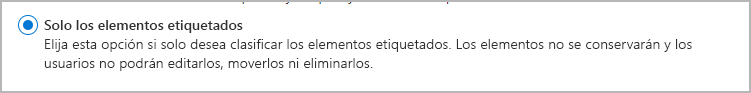
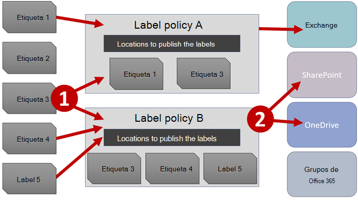

# Más información sobre directivas y etiquetas de retención

>*[Instrucciones de licencias de Microsoft 365 para la seguridad y el cumplimiento](https://aka.ms/ComplianceSD).*

Para la mayoría de las organizaciones, el volumen y la complejidad de los datos se incrementa diariamente: correo electrónico, documentos, mensajes instantáneos y mucho más. Administrar o gobernar esta información es importante, ya que necesita:
  
- **Cumplir de forma proactiva con las normas del sector y las directivas internas** que le exigen retener contenido durante un período mínimo de tiempo. Por ejemplo, la ley Sarbanes-Oxley puede exigirle que retenga determinados tipos de contenido durante siete años. 

- **Reducir el riesgo en caso de litigio o una infracción de seguridad** al eliminar de forma permanente contenido antiguo que ya no es necesario mantener. 
    
- **Ayudar a su organización a compartir los conocimientos de manera eficaz y ser más ágil** al asegurarse de que los usuarios trabajan solo con contenido actualizado y relevante para ellos. 
    
Las opciones de retención que configure pueden ayudarle a lograr todos estos objetivos. Por lo general, administrar el contenido requiere dos acciones:
  
- **Conservar** contenido para que no pueda eliminarse de forma permanente antes del fin del período de retención. 
    
- **Eliminar** contenido de forma permanente al final del período de retención. 
    

Con estas dos acciones de retención, puede establecer la configuración de retención para los siguientes resultados:

- Solo conservar: conserve el contenido para siempre o durante un determinado período de tiempo.
- Solo eliminar: elimine el contenido al cabo de un determinado período de tiempo.
- Conservar y, después, eliminar el contenido: conserve el contenido durante un determinado período de tiempo y, a continuación, elimínelo.

Esta configuración de retención funciona con contenido local y le ahorra los costes generales adicionales de crear y configurar almacenamiento añadido cuando necesita conservar contenido por motivos de cumplimiento. Además, no es necesario implementar procesos personalizados para copiar y sincronizar estos datos.

## Cómo funciona la configuración de retención con el contenido local

Cuando se establece la configuración de retención, el contenido permanece en su ubicación original. Los usuarios pueden seguir trabajando con sus documentos o buzones como si nada hubiera cambiado. Sin embargo, si modifican o eliminan el contenido incluido en la directiva de retención, se retendrá automáticamente una copia del contenido.
  
- Para sitios de SharePoint y OneDrive: la copia se conserva en la biblioteca de **Suspensión para conservación**.

- Para buzones de Exchange: la copia se conserva en la carpeta **Elementos recuperables**. 

- Para mensajes de Teams y Yammer: la copia se conserva en una carpeta oculta llamada **SubstrateHolds** dentro de la carpeta **Elementos recuperables** de Exchange.

> [!NOTE]
> La biblioteca de Suspensión para conservación consume almacenamiento que no está exento de la cuota de almacenamiento de un sitio. Es posible que tenga que aumentar el almacenamiento al usar la configuración de retención para los grupos de Microsoft 365 y SharePoint.
> 
Ni estas ubicaciones seguras ni el contenido retenido son visibles para la mayoría de los usuarios. En la mayoría de los casos, ni siquiera es necesario que los usuarios sepan que su contenido está sujeto a la configuración de retención.

Para obtener información más detallada sobre cómo funciona la configuración de retención con distintas cargas de trabajo, consulte los artículos siguientes:

- [Más información sobre las directivas de retención de SharePoint y OneDrive](retention-policies-sharepoint.md)
- [Más información sobre las directivas de retención para Microsoft Teams](retention-policies-teams.md)
- [Más información sobre la retención para Yammer](retention-policies-yammer.md)
- [Más información sobre las directivas de retención de Exchange](retention-policies-exchange.md)

## Directivas de retención y etiquetas de retención

Puede usar tanto las directivas de retención como las etiquetas de retención para asignar su configuración de retención al contenido. 

Use una directiva de retención para asignar la misma configuración de retención al contenido en el nivel de sitio o buzón y use una etiqueta de retención para asignar la configuración de retención en el nivel de elemento (carpeta, documento o correo electrónico).

Por ejemplo, si es necesario conservar todos los documentos de un sitio de SharePoint durante cinco años, es más eficaz usar una directiva de retención que aplicar la misma etiqueta de retención a todos los documentos del sitio. Sin embargo, si algunos documentos del sitio se deben conservar durante cinco años y otros durante diez años, no es posible hacerlo con una directiva de retención. Cuando tenga que especificar la configuración de retención en el nivel de elemento, use etiquetas de retención. 

A diferencia de las directivas de retención, la configuración de retención de las etiquetas de retención se mantendrá con el contenido si se copia o se mueve a una ubicación diferente dentro del espacio empresarial de Microsoft 365. Además, las etiquetas de retención tienen las siguientes funcionalidades que no son compatibles con las directivas de retención: 
 
- Opciones para iniciar el período de retención desde el momento en que se etiquetó el contenido o en función de un evento, en lugar de la antigüedad del contenido o cuando se modificó por última vez.

- Uso de [clasificadores que se pueden entrenar](classifier-learn-about.md) para identificar el contenido que se va a etiquetar.

- Aplicación de una etiqueta predeterminada a los documentos de SharePoint.

- Soporte de [revisión para eliminación](disposition-reviews.md)  para revisar el contenido antes de que se elimine de forma permanente.

- Marcado del contenido como un [registro](records-management.md#records) como parte de la configuración de la etiqueta para disponer siempre de una  [prueba de eliminación](disposition.md#disposition-of-records) cuando el contenido se elimine al final de su período de retención.

### Directivas de retención

Las directivas de retención se pueden aplicar a las siguientes ubicaciones:
- Correo electrónico de Exchange
- Sitio de SharePoint
- Cuentas de OneDrive
- Grupos de Microsoft 365
- Skype Empresarial
- Carpetas públicas de Exchange
- Mensajes de canal de Teams
- Chats de Teams
- Mensajes de la comunidad de Yammer
- Mensajes privados de Yammer

Puede aplicar una sola directiva en varias ubicaciones, o bien en determinadas ubicaciones o usuarios.

Para iniciar el período de retención, puede elegir cuándo se creó el contenido o, solo en el caso de los archivos y las ubicaciones de SharePoint, OneDrive y Grupos de Microsoft 365, cuándo se modificó el contenido por última vez.

Los elementos heredan la configuración de retención de su contenedor especificado en la directiva de retención. Si se mueven fuera del contenedor cuando la directiva está configurada para conservar el contenido, se conservará una copia de ese elemento en la ubicación segura de la carga de trabajo. Sin embargo, la configuración de retención no viaja con el contenido a su nueva ubicación. Si es necesario, use las etiquetas de retención en lugar de las directivas de retención.

### Etiquetas de retención

Use las etiquetas de retención para diferentes tipos de contenido que requieran una configuración de retención diferente. Por ejemplo:
  
- Formularios fiscales que deben conservarse durante un período mínimo de tiempo. 
    
- Materiales de prensa que deben eliminarse de forma permanente cuando alcanzan una antigüedad específica. 
    
- Información sobre la competencia que sea necesario conservar durante un determinado período de tiempo y, después, eliminar de forma permanente. 
    
- Visados de trabajo que tengan que marcarse como registros para que no se puedan editar ni eliminar. 
    
En todos estos casos, las etiquetas de retención le permiten aplicar la configuración de retención para el control de gobernanza en el nivel de elemento (documento o correo electrónico).
  
Con las etiquetas de retención, puede:
  
- **Permitir que personas de la organización apliquen una etiqueta de retención manualmente** a contenido en Outlook y Outlook en la Web, OneDrive, SharePoint y grupos de Microsoft 365. Los usuarios a menudo conocen mejor el tipo de contenido con el que están trabajando, por lo que pueden clasificarlo y aplicar la configuración de retención correspondiente. 
    
- **Aplicar etiquetas de retención a contenido automáticamente** si coincide con condiciones específicas, como: 
    - Tipos específicos de información confidencial.
    - Palabras clave específicas que coinciden con una consulta que haya creado.
    - Coincidencias de patrón para un clasificador que se puede entrenar.

- **Iniciar el período de retención desde el momento en que se etiquetó el contenido** para los documentos de los sitios de SharePoint y las cuentas de OneDrive, así como para elementos de correo electrónico salvo los elementos de calendario. Si aplica una etiqueta de retención con esta configuración a un elemento del calendario, el período de retención comienza desde el momento en que se envía.

- **Iniciar el período de retención cuando se produzca un evento**, por ejemplo, cuando los empleados abandonan la organización o cuando vencen los contratos.

- **Aplicar una etiqueta de retención predeterminada a una biblioteca, carpeta o conjunto de documentos** en SharePoint, de modo que todos los documentos almacenados en esa ubicación hereden la etiqueta de retención predeterminada.

Además, las etiquetas de retención admiten la [administración de registros](records-management.md) de correo electrónico y documentos en todas las aplicaciones y servicios de Microsoft 365. Puede usar una etiqueta de para marcar elementos como un registro. Cuando ocurre esto y el contenido permanece en Microsoft 365, la etiqueta coloca otras restricciones en el contenido que podrían ser necesarias por razones reglamentarias. Para más información, vea [Comparar restricciones de acciones permitidas o bloqueadas](records-management.md#compare-restrictions-for-what-actions-are-allowed-or-blocked).

Las etiquetas de retención, al igual que las [etiquetas de confidencialidad de ](sensitivity-labels.md), no se conservan si el contenido se mueve fuera de Microsoft 365.

No hay límite en el número de etiquetas de retención que se apoyan para un inquilino. Sin embargo, 10 000 es el número máximo de directivas que se admiten para un inquilino y éstas incluyen las directivas que aplican las etiquetas (directivas de etiquetas de retención y directivas de retención de aplicación automática), así como las directivas de retención.

#### Clasificar contenido sin aplicar acciones

Aunque el propósito principal de las etiquetas de retención es conservar o eliminar contenido, también puede usar las etiquetas de retención sin activar la retención u otras acciones. En este caso, se puede utilizar una etiqueta de retención simplemente como una etiqueta de texto, sin imponer ninguna acción.
  
Por ejemplo, puede crear y aplicar una etiqueta de retención denominada "revisar más adelante" sin acciones y, a continuación, usar esa etiqueta para buscar el contenido posteriormente.
  

#### Usar una etiqueta de retención como condición en una directiva DLP

Puede especificar una etiqueta de retención como condición en una directiva de prevención de pérdida de datos (DLP) para los documentos de SharePoint. Por ejemplo, configure una directiva DLP para evitar que los documentos se compartan fuera de la organización si se les aplicó una etiqueta de retención específica.

Para obtener más información, vea [Usar una etiqueta de retención como condición en una directiva DLP](data-loss-prevention-policies.md#using-a-retention-label-as-a-condition-in-a-dlp-policy).

#### Etiquetas de retención y directivas que se aplican a ellas

Las etiquetas de retención son bloques de creación independientes y reutilizables. La finalidad principal de una directiva de etiqueta es agrupar un conjunto de etiquetas de retención y especificar las ubicaciones donde quiere que aparezcan. Luego, los administradores y usuarios pueden aplicar esas etiquetas al contenido de estas ubicaciones.
  

  
Cuando se publican las etiquetas de retención, se incluyen en una directiva de etiqueta de retención que permite a los administradores y usuarios realizar ciertas selecciones:

- Se puede incluir una única etiqueta de retención en varias directivas de etiquetas de retención.

- Las directivas de etiquetas de retención especifican las ubicaciones donde se publicarán las etiquetas de retención.

- También puede incluirse una sola ubicación en numerosas directivas de etiquetas de retención.

Además de las directivas de etiquetas de retención, también puede crear una o varias directivas de aplicación automática, cada una con una sola etiqueta de retención. Con esta directiva, se aplica una etiqueta de retención automáticamente cuando se cumplan las condiciones especificadas en la directiva. 

#### Ubicaciones y directivas de etiquetas de retención

En función de la finalidad de las etiquetas de retención, pueden publicarse en distintas ubicaciones.
  
| Si la etiqueta de retención... | Entonces, se puede aplicar la directiva de etiqueta a... |
|:-----|:-----|
|Se publica para administradores y usuarios finales    |Exchange, SharePoint, OneDrive, Grupos de Microsoft 365    |
|Se aplica automáticamente en función de los tipos de información confidencial o clasificadores que se pueden entrenar    |Exchange (solo todos los buzones), SharePoint, OneDrive    |
|Se aplica automáticamente basándose en una consulta    |Exchange, SharePoint, OneDrive, Grupos de Microsoft 365    |
   
En Exchange, las etiquetas de aplicación automática solo se aplican a mensajes nuevos enviados (datos en tránsito), no a todos los elementos que estén actualmente en el buzón (datos en reposo). Además, las etiquetas de aplicación automática para tipos de información confidencial y clasificadores que se pueden entrenar solo se pueden aplicar a todos los buzones; es decir, no puede seleccionar buzones concretos.
  
Las carpetas públicas de Exchange y los mensajes de Skype, Teams y Yammer no admiten etiquetas de retención. Para conservar y eliminar contenido de estas ubicaciones, use en cambio directivas de retención.

#### Solo una etiqueta de retención a la vez

Solo se puede aplicar una etiqueta de retención al contenido (como un correo electrónico o un documento) al mismo tiempo: Un usuario final o administrador pueden aplicar una etiqueta de retención [manualmente](create-apply-retention-labels.md#manually-apply-retention-labels), o bien se puede aplicar automáticamente mediante cualquiera de los siguientes métodos:

- [Aplicar automáticamente para crear la directiva de etiqueta](apply-retention-labels-automatically.md)
- [Modelo de comprensión mediante documentos para SharePoint Syntex](https://docs.microsoft.com/microsoft-365/contentunderstanding/apply-a-retention-label-to-a-model)
- [Etiqueta predeterminada para SharePoint](create-apply-retention-labels.md#applying-a-default-retention-label-to-all-content-in-a-sharepoint-library-folder-or-document-set) o [Outlook](create-apply-retention-labels.md#applying-a-default-retention-label-to-an-outlook-folder)
- [Reglas de Outlook](create-apply-retention-labels.md#automatically-applying-a-retention-label-to-email-by-using-rules)

Para las etiquetas de retención estándar (no marcan los elementos como un [registro o un registro normativo](records-management.md#records)):

- Los administradores y los usuarios finales pueden cambiar o quitar manualmente una etiqueta de retención existente que se aplique al contenido. 

- Cuando el contenido ya tiene una etiqueta de retención aplicada, la etiqueta existente no se eliminará ni reemplazará automáticamente por otra etiqueta de retención con una posible excepción: si la etiqueta existente se aplicó como etiqueta predeterminada.
    
    Para más información sobre el comportamiento de la etiqueta cuando se aplica utilizando una etiqueta predeterminada:
    - Etiqueta predeterminada para SharePoint: [El comportamiento de la etiqueta cuando se usa una etiqueta predeterminada para SharePoint](create-apply-retention-labels.md#label-behavior-when-you-use-a-default-label-for-sharepoint)
    - Etiqueta predeterminada para Outlook: [Aplicar una etiqueta de retención predeterminada a una carpeta de Outlook](create-apply-retention-labels.md#applying-a-default-retention-label-to-an-outlook-folder)

- Si hay varias directivas de etiqueta de aplicación automática que podrían aplicar una etiqueta de retención y el contenido cumple las condiciones de varias directivas, se aplica la etiqueta de retención de la directiva de aplicación automática más antigua (por fecha de creación).

Cuando las etiquetas de retención marcan los elementos como un registro o un registro normativo, estas etiquetas nunca se cambian automáticamente. Solo los administradores del contenedor pueden cambiar o quitar manualmente las etiquetas de retención que marcan los elementos como un registro, pero no los registros reglamentarios. Para más información, vea [Comparar restricciones de acciones permitidas o bloqueadas](records-management.md#compare-restrictions-for-what-actions-are-allowed-or-blocked).

#### Supervisar las etiquetas de retención

Desde el Centro de cumplimiento de Microsoft 365, utilice la **Información general** > **sobre la clasificación de datos** para supervisar la forma en que se usan las etiquetas de retención en su inquilino e identificar el lugar en el que se ubican los elementos etiquetados. Para obtener más información, incluyendo requisitos previos importantes, consulte [Conozca sus datos: información general sobre la clasificación de datos](data-classification-overview.md).

Posteriormente, podrá profundizar en los detalles mediante el [explorador de contenido](data-classification-content-explorer.md) y el [explorador de actividades](data-classification-activity-explorer.md).

> [!TIP]
>Considere la posibilidad de usar cierta información sobre la clasificación de datos, como los clasificadores capacitados y los tipos de información confidencial, para ayudarle a identificar el contenido que podría necesitar retener, eliminar o administrar como registro.

El Centro de seguridad y cumplimiento de Office 365 tiene la información general equivalente para las etiquetas de retención de **Gobierno de información** > **Panel**, así como información más detallada sobre el **Gobierno de información** > **Explorador de actividad de etiquetas**. Para obtener más información acerca de cómo supervisar las etiquetas de retención de este antiguo centro de administración, consulte la siguiente documentación:
- [Ver los informes de gobierno de datos](view-the-data-governance-reports.md)
- [Ver el uso de etiquetas con el análisis de etiquetas](label-analytics.md)
- [Ver la actividad de etiquetas de documentos](view-label-activity-for-documents.md)

#### Usar la Búsqueda de contenido para encontrar todo el contenido relacionado con una etiqueta de retención específica

Después de asignar las etiquetas de retención al contenido (ya sea a través de los usuarios o aplicadas automáticamente), puede usar la Búsqueda de contenido para encontrar todo los elementos clasificados bajo una etiqueta de retención específica.

Cuando cree una búsqueda de contenido, elija la condición de **Etiqueta de retención**, y luego introduzca el nombre completo de la etiqueta de retención o parte del nombre de la etiqueta y utilice un comodín. Para obtener más información, consulte [Consultas de palabras clave y condiciones de búsqueda para la Búsqueda de Contenido](keyword-queries-and-search-conditions.md).
  

## Comparar las funcionalidades de las directivas de retención y las etiquetas de retención

La siguiente tabla le ayudará a identificar si debe usar una directiva de retención o una etiqueta de retención, según sus funcionalidades.

|Funcionalidad|Directiva de retención |Etiqueta de retención|
|:-----|:-----|:-----|:-----|
|Configuración de retención que puede conservar y, después, eliminar, solo conservar o solo eliminar. |Sí |Sí |
|Cargas de trabajo compatibles:  - Exchange  - SharePoint  - OneDrive  - Grupos de Microsoft 365  - Skype Empresarial  - Teams - Yammer|  Sí   Sí   Sí   Sí   Sí   Sí   Sí |   Sí, excepto carpetas públicas   Sí   Sí   Sí   No   No   No |
|Retención aplicada automáticamente | Sí | Sí |
|La retención aplicada se basa en las condiciones   : tipos de información confidencial, consultas KQL y clasificadores que se pueden entrenar| No | Sí |
|Retención aplicada manualmente | No | Sí |
|Presencia de interfaz de usuario para usuarios finales | No | Sí |
|Se mantiene si el contenido se mueve | No | Sí, dentro de su espacio empresarial de Microsoft 365 |
|Declara el elemento como un registro| No | Sí |
|Inicio del período de retención cuando se etiqueta o basado en un evento | No | Sí |
|Revisión para eliminación | No| Sí |
|Prueba de eliminación durante un máximo de 7 años | No |Sí, cuando el elemento se declara como registro|
|Auditoría de las actividades administrativas| Sí | Sí|
|Identificación de elementos sujetos a la retención:   - Búsqueda de contenido   - Página clasificación de datos, explorador de contenido, explorador de actividad |   No   No |   Sí   Sí|

Tenga en cuenta que puede usar tanto directivas de retención como etiquetas de retención como métodos de retención complementarios. Por ejemplo:

1. Puede crear y configurar una directiva de retención que elimine el contenido automáticamente al cabo de cinco años de la última modificación y aplicar la directiva a todas las cuentas de OneDrive.

2. Puede crear y configurar una etiqueta de retención que mantenga el contenido para siempre y agregarla a una directiva de etiquetas que publique en todas las cuentas de OneDrive. Debe explicar a los usuarios cómo aplicar manualmente esta etiqueta a documentos específicos que se deban excluir de la eliminación automática si no se modifican después de cinco años.

Para obtener más información acerca de cómo funcionan las directivas de retención y las etiquetas de retención conjuntamente y cómo determinar el resultado combinado, vea la siguiente sección en la que se explican los principios de la retención y las prioridades.

## Los principios de retención o qué tiene precedencia

Es posible o incluso probable que el contenido tenga varias etiquetas y directivas de retención aplicadas, cada una con una acción (conservar, eliminar o conservar y, después, eliminar) y un período de retención diferentes. ¿Qué tiene prioridad? 

A grandes rasgos, la retención siempre tiene prioridad sobre la eliminación y después tiene prioridad el período de retención más largo. 

Sin embargo, hay algunos factores más a tener en cuenta. El siguiente flujo le ayudará a entender el resultado; cada nivel actúa como un separador de nivel superior a inferior: si el resultado está determinado por el primer nivel, no es necesario pasar al nivel siguiente y así sucesivamente. El flujo se desplaza al siguiente nivel para determinar el resultado para el que la configuración de retención tiene prioridad solo si las reglas del nivel anterior no pueden determinar el resultado.

  
Explicación de los cuatro niveles diferentes:
  
1. **La retención gana a la eliminación.** Suponga que una directiva de retención está configurada para eliminar el correo electrónico de Exchange después de tres años, pero otra directiva de retención está configurada para que se conserve el correo electrónico de Exchange durante cinco años y después se elimine. Todo el contenido que llegue a tres años de antigüedad se eliminará y quedará oculto de la vista de los usuarios, pero se mantendrá en la carpeta elementos recuperables hasta que llegue a la antigüedad de cinco años, cuando se elimine de forma permanente. 
2. **El período de retención más largo gana**. Si el contenido está sujeto a varias configuraciones de retención que conservan contenido durante distintos períodos de tiempo, el contenido se conservará hasta el final del período de retención más largo.
    
3. **La inclusión explícita gana a la inclusión implícita**. Esto significa que: 
    
    1. Si un usuario asigna manualmente una etiqueta de retención con configuración de retención a un elemento, como un correo electrónico de Exchange o un documento de OneDrive, esa etiqueta de retención tiene prioridad sobre una directiva de retención asignada en el nivel de sitio o buzón y una etiqueta de retención predeterminada asignada por la biblioteca de documentos. Por ejemplo, si la etiqueta de retención explícita está configurada para conservar el contenido durante diez años, pero una directiva de retención asignada al sitio está configurada para que la conservación sea de solo cinco años, la etiqueta de retención tendrá prioridad.
    
    2. Si una directiva de retención incluye una ubicación específica, como el buzón de un usuario específico o una cuenta de OneDrive, esa directiva de retención tiene prioridad sobre otra directiva de retención que se aplica a los buzones de todos los usuarios o a las cuentas de OneDrive pero que no incluye específicamente el buzón de ese usuario.
    
4. **El período de eliminación más corto gana.** De forma similar, si el contenido está sujeto a varias configuraciones de retención que eliminan contenido sin un período de retención, se eliminará el contenido al final del período de retención más corto. 

Por último, una directiva o etiqueta de retención no puede eliminar permanentemente ningún contenido que esté en espera para eDiscovery. Cuando se libera la retención, el contenido vuelve a ser apto para el proceso de limpieza descrito anteriormente.

## Usar el Bloqueo de conservación para restringir los cambios en las directivas

Algunas organizaciones podrían tener que cumplir con reglas establecidas por los organismos reguladores, como la Regla 17a-4 de la Comisión de intercambio y valores (SEC), la cual exige que, después de activar una directiva de retención, esta no se pueda desactivar ni hacer menos restrictiva. 

El Bloqueo de conservación garantiza que su organización cumpla con los requisitos normativos, ya que bloquea una directiva de retención o directiva de etiqueta de retención de forma que nadie, ni siquiera el administrador, pueda desactivarla, eliminarla o hacer que sea menos restrictiva.
  
Usted aplica el Bloqueo de conservación después de crear la directiva o etiqueta de retención. Para obtener más información e instrucciones, consulte [Usar el Bloqueo de conservación para restringir los cambios en las directivas y etiquetas de retención](retention-preservation-lock.md).

## Lanzamiento de una directiva de retención

Siempre que sus directivas de retención no tengan ningún Bloqueo de conservación, podrá eliminar las directivas en cualquier momento, lo cual desactiva de forma eficaz la configuración de retención aplicada previamente. También puede mantener la directiva pero cambiar el estado de la ubicación a desactivado.
 
Al hacerlo, el contenido de SharePoint o de OneDrive que se retenga en la Biblioteca de suspensión para conservación no se eliminará de forma inmediata y permanente. A partir de ahora, y para evitar pérdidas accidentales de datos, existe un período de gracia de 30 días durante el cual la expiración del contenido para esa directiva no se produce en la biblioteca de conservación de documentos, de modo que puede restaurar desde allí el contenido si lo ve necesario. Además, no puede eliminar manualmente este contenido durante el período de gracia.

Puede cambiar el estado de la ubicación a activado durante el período de gracia y no se eliminará ningún contenido para esa directiva.

Este periodo de gracia de 30 días en SharePoint y OneDrive corresponde a la retención de retraso de 30 días de Exchange. Para obtener más información, consulte [Gestionar buzón con una retención de retraso](identify-a-hold-on-an-exchange-online-mailbox.md#managing-mailboxes-on-delay-hold).

## Auditar la configuración de retención

Las acciones del administrador en cuanto a las directivas y a las etiquetas de retención se guardan en el registro de auditoría cuando la [auditoría está habilitada](turn-audit-log-search-on-or-off.md). Por ejemplo, se genera un evento de auditoría cuando se crea, se configura o se elimina alguna directiva o etiqueta de retención. Para obtener la lista completa, consulte las [Actividades de las directivas y etiquetas de retención](search-the-audit-log-in-security-and-compliance.md#retention-policy-and-retention-label-activities).

## Cmdlets de PowerShell para directivas de retención y etiquetas de retención

Para usar los cmdlets de retención, primero debe [conectarse a PowerShell del Centro de seguridad y cumplimiento de Office 365](https://docs.microsoft.com/powershell/exchange/connect-to-scc-powershell). A continuación, use cualquiera de los siguientes cmdlets:

- [Get-ComplianceTag](https://docs.microsoft.com/powershell/module/exchange/get-compliancetag)

- [New-ComplianceTag](https://docs.microsoft.com/powershell/module/exchange/new-compliancetag)

- [Remove-ComplianceTag](https://docs.microsoft.com/powershell/module/exchange/remove-compliancetag)

- [Set-ComplianceTag](https://docs.microsoft.com/powershell/module/exchange/set-compliancetag)

- [Enable-ComplianceTagStorage](https://docs.microsoft.com/powershell/module/exchange/enable-compliancetagstorage)

- [Get-ComplianceTagStorage](https://docs.microsoft.com/powershell/module/exchange/get-compliancetagstorage)

- [Get-RetentionCompliancePolicy](https://docs.microsoft.com/powershell/module/exchange/get-retentioncompliancepolicy)

- [New-RetentionCompliancePolicy](https://docs.microsoft.com/powershell/module/exchange/new-retentioncompliancepolicy)

- [Remove-RetentionCompliancePolicy](https://docs.microsoft.com/powershell/module/exchange/remove-retentioncompliancepolicy)

- [Set-RetentionCompliancePolicy](https://docs.microsoft.com/powershell/module/exchange/set-retentioncompliancepolicy)

- [Get-RetentionComplianceRule](https://docs.microsoft.com/powershell/module/exchange/get-retentioncompliancerule)

- [New-RetentionComplianceRule](https://docs.microsoft.com/powershell/module/exchange/new-retentioncompliancerule)

- [Remove-RetentionComplianceRule](https://docs.microsoft.com/powershell/module/exchange/remove-retentioncompliancerule)

- [Set-RetentionComplianceRule](https://docs.microsoft.com/powershell/module/exchange/set-retentioncompliancerule)

## Cuándo usar directivas de retención y etiquetas de retención o suspensiones de eDiscovery

Si bien tanto la configuración de retenciones y las suspensiones[ que usted cree con un caso de eDiscovery](create-ediscovery-holds.md) pueden impedir que se eliminen los datos de forma permanente, están diseñados para diferentes escenarios. Para que le resulte más fácil comprender las diferencias y decidir qué usar, siga estas instrucciones:

- La configuración de retenciones que especifique en directivas de retención y etiquetas de retención está diseñada para que una estrategia de control de información a largo plazo pueda conservar o eliminar datos a efectos de requisitos de cumplimiento. Por lo general, el ámbito es amplio y el enfoque principal lo constituyen la ubicación y el contenido, en lugar de los usuarios individuales. El inicio y el final del período de retención es configurable y se incluye la opción de eliminar automáticamente contenido sin ninguna intervención adicional por parte del administrador.

- Las suspensiones para eDiscovery (tanto casos de Core eDiscovery como de eDiscovery avanzado) están diseñadas para una duración limitada, para conservar datos para una investigación legal. El ámbito es específico y se centra en el contenido propiedad de los usuarios identificados. El inicio y el final del período de conservación no se pueden configurar, sino que dependen de las acciones individuales del administrador y no existe ninguna opción para eliminar el contenido automáticamente al liberar la suspensión.

Resumen para comparar la retención con suspensiones:

|Consideración|Retención |Suspensiones de eDiscovery|
|:-----|:-----|:-----|:-----|
|Necesidad de negocio: |Cumplimiento |Legal |
|Ámbito de tiempo: |A largo plazo |A corto plazo |
|Foco: |Amplio, basado en contenido |Específico, basado en el usuario |
|Fecha de inicio y de finalización configurable: |Sí |No |
|Eliminación de contenido: |Sí (opcional) |No |
|Gastos generales de administración: |Bajo |Alto |

Si el contenido está sujeto tanto a la configuración de retención como a una suspensión de eDiscovery, tendrá prioridad conservar el contenido de la suspensión de eDiscovery. De esta forma, los [principios de retención](#the-principles-of-retention-or-what-takes-precedence) se amplían a las suspensiones de eDiscovery, ya que conservan los datos hasta que un administrador libera manualmente la suspensión. Sin embargo, aún con esta precedencia, no use suspensiones de eDiscovery para el control de la información a largo plazo. Si le preocupa la eliminación automática de datos, puede configurar las opciones de retención para que se conserven los elementos de forma indefinida, o usar la [revisión para eliminación](disposition.md#disposition-reviews) con etiquetas de retención.

Si usa herramientas de eDiscovery antiguas para conservar datos, consulte los siguientes recursos:

- Exchange: 
    - [Conservación local y retención por juicio](https://go.microsoft.com/fwlink/?linkid=846124)
    - [Cómo identificar el tipo de retención en un buzón de Exchange Online](https://docs.microsoft.com/microsoft-365/compliance/identify-a-hold-on-an-exchange-online-mailbox)

- SharePoint y OneDrive: 
    - [Agregar contenido a un caso y poner orígenes en espera en el Centro de eDiscovery](https://docs.microsoft.com/SharePoint/governance/add-content-to-a-case-and-place-sources-on-hold-in-the-ediscovery-center)

- [Retirada de herramientas heredadas de eDiscovery](legacy-ediscovery-retirement.md)

## Usar directivas de retención y etiquetas de retención en lugar de características más antiguas

Si tiene que conservar o eliminar contenido en 365 Microsoft de manera proactiva para la gobernanza de la información, le recomendamos que use las directivas de retención y las etiquetas de retención en lugar de las siguientes características antiguas.

Si actualmente usa esas características más antiguas, estas seguirán funcionando en paralelo con las directivas de retención y las etiquetas de retención. Sin embargo, le recomendamos que, en adelante, utilice directivas de retención y etiquetas de retención. Proporcionan un mecanismo único para administrar centralmente tanto la retención como la eliminación de contenido en Microsoft 365.

**Características anteriores de Exchange Online:**

- [Etiquetas de retención y directivas de retención](https://go.microsoft.com/fwlink/?linkid=846125), lo que también se conoce como [administración de registros de mensajes (MRM)](https://go.microsoft.com/fwlink/?linkid=846126) (solo eliminación)

**Características anteriores de SharePoint y OneDrive:**

- [Directivas de eliminación de documentos](https://support.office.com/article/Create-a-document-deletion-policy-in-SharePoint-Server-2016-4fe26e19-4849-4eb9-a044-840ab47458ff) (solo eliminación)
    
- [Configuración de administración de registros local](https://support.office.com/article/7707a878-780c-4be6-9cb0-9718ecde050a) (retención) 
    
- [Usar las directivas de cierre y eliminación de sitio](https://support.microsoft.com/es-ES/office/use-policies-for-site-closure-and-deletion-a8280d82-27fd-48c5-9adf-8a5431208ba5) (solo eliminación) 
    
- [Directivas de administración de información](intro-to-info-mgmt-policies.md) (solo eliminación)
     
Si ha configurado los sitios de SharePoint para directivas de tipo de contenido o directivas de administración de información para conservar el contenido de una lista o biblioteca, estas directivas se omiten cuando se aplica una directiva de retención. 

## Información relacionada

- [Límites de SharePoint Online](https://docs.microsoft.com/office365/servicedescriptions/sharepoint-online-service-description/sharepoint-online-limits)
- [Límites y especificaciones para Microsoft Teams](https://docs.microsoft.com/microsoftteams/limits-specifications-teams) 
- [Recursos para ayudarle a cumplir los requerimientos reglamentarios para la administración de registros y el gobierno de información](retention-regulatory-requirements.md)

## Pasos siguientes

Si está listo para crear directivas de retención, vea [Crear y configurar directivas de retención](create-retention-policies.md).

Para crear y aplicar etiquetas de retención:
- [Crear etiquetas de retención y aplicarlas en aplicaciones](create-apply-retention-labels.md)
- [Aplicar una etiqueta de retención automáticamente al contenido](apply-retention-labels-automatically.md)

