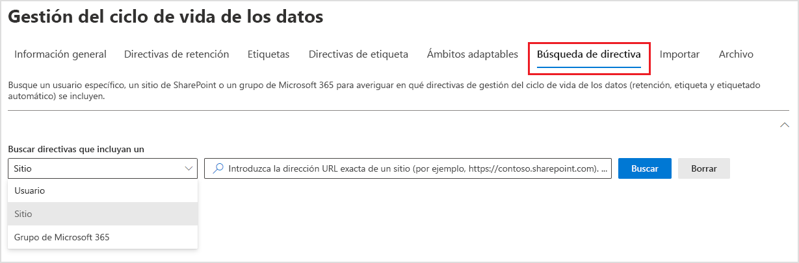

# Más información sobre directivas y etiquetas de retención

>*[Instrucciones de licencias de Microsoft 365 para la seguridad y el cumplimiento](/office365/servicedescriptions/microsoft-365-service-descriptions/microsoft-365-tenantlevel-services-licensing-guidance/microsoft-365-security-compliance-licensing-guidance).*

> [!NOTE]
> Si ve mensajes sobre directivas de retención en Teams o tiene preguntas sobre etiquetas de retención, póngase en contacto con el departamento de TI para obtener información sobre cómo las han configurado. Mientras tanto, los artículos siguientes pueden serle de utilidad:
> -  [Mensajes de Teams sobre directivas de retención](https://support.microsoft.com/office/teams-messages-about-retention-policies-c151fa2f-1558-4cf9-8e51-854e925b483b)
> - [Aplicar etiquetas de retención a archivos en SharePoint o OneDrive](https://support.microsoft.com/office/apply-retention-labels-to-files-in-sharepoint-or-onedrive-11a6835b-ec9f-40db-8aca-6f5ef18132df)
>
> La información de esta página es para administradores de TI que pueden crear directivas y etiquetas de retención por motivos de cumplimiento.

Para la mayoría de las organizaciones, el volumen y la complejidad de los datos se incrementa diariamente: correo electrónico, documentos, mensajes instantáneos y mucho más. Administrar o gobernar esta información es importante, ya que necesita:

- **Cumplir de forma proactiva con las normas del sector y las directivas internas** que le exigen retener contenido durante un período mínimo de tiempo. Por ejemplo, la ley Sarbanes-Oxley puede exigirle que retenga determinados tipos de contenido durante siete años.

- **Reducir el riesgo en caso de litigio o una infracción de seguridad** al eliminar de forma permanente contenido antiguo que ya no es necesario mantener.

- **Ayudar a su organización a compartir los conocimientos de manera eficaz y ser más ágil** al asegurarse de que los usuarios trabajan solo con contenido actualizado y relevante para ellos.

Las opciones de retención que configure pueden ayudarle a lograr estos objetivos. Por lo general, administrar el contenido requiere dos acciones:

| Acción| Objetivo |
|:-----|:-----|
|Conservar el contenido | Evite la eliminación permanente y facilite que siga disponible en eDiscovery |
|Eliminar contenido | Elimine el contenido de la organización de forma permanente|

Con estas dos acciones de retención, puede establecer la configuración de retención para los siguientes resultados:

- Solo conservar: conserve el contenido para siempre o durante un determinado período de tiempo.
- Solo eliminar: elimine el contenido al cabo de un determinado período de tiempo.
- Conserve y, después, elimine el contenido: conserve el contenido durante un determinado período de tiempo y, a continuación, elimínelo de forma permanente.

Esta configuración de retención funciona con contenido local y le ahorra los costes generales adicionales de crear y configurar almacenamiento añadido cuando necesita conservar contenido por motivos de cumplimiento. Además, no es necesario implementar procesos personalizados para copiar y sincronizar estos datos.

Use las secciones siguientes para obtener más información sobre cómo funcionan las directivas y las etiquetas de retención, cuándo usarlas y cómo se complementan entre sí. Y si ya está listo para empezar e implementar la configuración de retención en algunos escenarios comunes, consulte [Introducción a las directivas y etiquetas de retención](get-started-with-retention.md).

## Cómo funciona la configuración de retención con el contenido local

Cuando el contenido tiene asignada la configuración de retención, ese contenido permanece en su ubicación original. La mayoría de las veces, las personas continúan trabajando con sus documentos o correo como si nada hubiera cambiado. Pero si editan o eliminan contenido incluido en la directiva de retención, se conserva automáticamente una copia del contenido.
  
- Para sitios de SharePoint y OneDrive: la copia se conserva en la biblioteca de **Suspensión para conservación**.

- Para buzones de Exchange: la copia se conserva en la carpeta **Elementos recuperables**. 

- Para mensajes de Teams y Yammer: la copia se conserva en una carpeta oculta llamada **SubstrateHolds** dentro de la carpeta **Elementos recuperables** de Exchange.

> [!NOTE]
> Dado que la Biblioteca de suspensión para conservación se incluye en la cuota de almacenamiento de un sitio, es posible que deba aumentar el almacenamiento al usar la configuración de retención para los grupos de SharePoint y de Microsoft 365.
> 
Ni estas ubicaciones seguras ni el contenido retenido son visibles para la mayoría de los usuarios. En la mayoría de los casos, ni siquiera es necesario que los usuarios sepan que su contenido está sujeto a la configuración de retención.

Para obtener información más detallada sobre cómo funciona la configuración de retención con distintas cargas de trabajo, consulte los artículos siguientes:

- [Más información sobre las directivas de retención de SharePoint y OneDrive](retention-policies-sharepoint.md)
- [Más información sobre las directivas de retención para Microsoft Teams](retention-policies-teams.md)
- [Más información sobre la retención para Yammer](retention-policies-yammer.md)
- [Más información sobre las directivas de retención de Exchange](retention-policies-exchange.md)

## Directivas de retención y etiquetas de retención

Puede usar tanto las **directivas de retención** como las **etiquetas de retención con directivas de etiquetas** para asignar su configuración de retención al contenido. Puede usar solo uno de estos métodos o combinarlos.

Use una directiva de retención para asignar la misma configuración de retención al contenido en el nivel de sitio o buzón y use una etiqueta de retención para asignar la configuración de retención en el nivel de elemento (carpeta, documento o correo electrónico).

Por ejemplo, si es necesario conservar todos los documentos de un sitio de SharePoint durante cinco años, es más eficaz usar una directiva de retención que aplicar la misma etiqueta de retención a todos los documentos del sitio. Sin embargo, si algunos documentos del sitio se deben conservar durante cinco años y otros durante diez años, no es posible hacerlo con una directiva de retención. Cuando tenga que especificar la configuración de retención en el nivel de elemento, use etiquetas de retención. 

A diferencia de las directivas de retención, la configuración de retención de las etiquetas de retención se mantendrá con el contenido si se copia o se mueve a una ubicación diferente dentro del espacio empresarial de Microsoft 365. Además, las etiquetas de retención tienen las siguientes funcionalidades que no son compatibles con las directivas de retención: 
 
- Opciones para iniciar el período de retención desde el momento en que se etiquetó el contenido o en función de un evento, en lugar de la antigüedad del contenido o cuando se modificó por última vez.

- Uso de [clasificadores que se pueden entrenar](classifier-learn-about.md) para identificar el contenido que se va a etiquetar.

- Aplicación de una etiqueta predeterminada a los documentos de SharePoint.

- Soporte de [revisión para eliminación](./disposition.md)  para revisar el contenido antes de que se elimine de forma permanente.

- Marcado del contenido como un [registro](records-management.md#records) como parte de la configuración de la etiqueta para disponer siempre de una  [prueba de eliminación](disposition.md#disposition-of-records) cuando el contenido se elimine al final de su período de retención.

### Directivas de retención

Las directivas de retención se pueden aplicar a las siguientes ubicaciones:
- Correo electrónico de Exchange
- Sitio de SharePoint
- Cuentas de OneDrive
- Grupos de Microsoft 365
- Skype Empresarial
- Carpetas públicas de Exchange
- Mensajes de canal de Teams
- Chats de Teams
- Mensajes del canal privado de Teams
- Mensajes de la comunidad de Yammer
- Mensajes del usuario de Yammer

Puede aplicar una sola directiva en varias ubicaciones, o bien en determinadas ubicaciones o usuarios.

Para iniciar el período de retención, puede elegir cuándo se creó el contenido o, solo en el caso de los archivos y las ubicaciones de SharePoint, OneDrive y Grupos de Microsoft 365, cuándo se modificó el contenido por última vez.

Los elementos heredan la configuración de retención de su contenedor especificado en la directiva de retención. Si se mueven fuera del contenedor cuando la directiva está configurada para conservar el contenido, se conservará una copia de ese elemento en la ubicación segura de la carga de trabajo. Sin embargo, la configuración de retención no viaja con el contenido a su nueva ubicación. Si es necesario, use las etiquetas de retención en lugar de las directivas de retención.

### Etiquetas de retención

Use etiquetas de retención para diferentes tipos de contenido que requieran una configuración de retención diferente. Por ejemplo:
  
- Formularios fiscales que deben conservarse durante un período mínimo de tiempo. 
    
- Materiales de prensa que deben eliminarse de forma permanente cuando alcanzan una antigüedad específica. 
    
- Información sobre la competencia que sea necesario conservar durante un determinado período de tiempo y, después, eliminar de forma permanente. 
    
- Visados de trabajo que tengan que marcarse como registros para que no se puedan editar ni eliminar. 
    
En todos estos casos, las etiquetas de retención le permiten aplicar la configuración de retención para el control de gobernanza en el nivel de elemento (documento o correo electrónico).
  
Con las etiquetas de retención, puede:
  
- **Permitir que los usuarios de la organización apliquen manualmente una etiqueta de retención** a contenido de Outlook, Outlook en la Web, OneDrive, SharePoint y Grupos de Microsoft 365. Con frecuencia, los usuarios son los que mejor saben con qué tipo de contenido están trabajando, por lo que pueden clasificarlo y aplicar la configuración de retención adecuada. 
    
- **Aplicar etiquetas de retención al contenido automáticamente** si coincide con condiciones específicas, que incluyen datos adjuntos en la nube que se comparten en el correo electrónico o Teams, o cuando el contenido contiene: 
    - Tipos específicos de información confidencial.
    - Palabras clave específicas que coinciden con una consulta que haya creado.
    - Coincidencias de patrón para un clasificador que se puede entrenar.

- **Iniciar el período de retención desde el momento en que se etiquetó el contenido** para los documentos de los sitios de SharePoint y las cuentas de OneDrive, así como también para los elementos de correo electrónico.

- **Iniciar el período de retención cuando se produzca un evento**, por ejemplo, cuando los empleados abandonan la organización o cuando vencen los contratos.

- **Aplicar una etiqueta de retención predeterminada a una biblioteca, carpeta o conjunto de documentos** en SharePoint, de modo que todos los documentos almacenados en esa ubicación hereden la etiqueta de retención predeterminada.

Además, las etiquetas de retención admiten la [administración de registros](records-management.md) de correo electrónico y documentos en todas las aplicaciones y servicios de Microsoft 365. Puede usar una etiqueta de para marcar elementos como un registro. Cuando ocurre esto y el contenido permanece en Microsoft 365, la etiqueta coloca otras restricciones en el contenido que podrían ser necesarias por razones reglamentarias. Para más información, vea [Comparar restricciones de acciones permitidas o bloqueadas](records-management.md#compare-restrictions-for-what-actions-are-allowed-or-blocked).

Las etiquetas de retención, al igual que las [etiquetas de confidencialidad de ](sensitivity-labels.md), no se conservan si el contenido se mueve fuera de Microsoft 365.

#### Clasificar contenido sin aplicar acciones

Aunque el propósito principal de las etiquetas de retención es conservar o eliminar contenido, también puede usar las etiquetas de retención sin activar la retención u otras acciones. En este caso, se puede utilizar una etiqueta de retención simplemente como una etiqueta de texto, sin imponer ninguna acción.
  
Por ejemplo, puede crear y aplicar una etiqueta de retención denominada "revisar más adelante" sin acciones y, a continuación, usar esa etiqueta para buscar el contenido posteriormente.
  

#### Usar una etiqueta de retención como condición en una directiva DLP

Puede especificar una etiqueta de retención como condición en una directiva de prevención de pérdida de datos (DLP) para los documentos de SharePoint. Por ejemplo, configure una directiva DLP para evitar que los documentos se compartan fuera de la organización si se les aplicó una etiqueta de retención específica.

Para obtener más información, vea [Usar una etiqueta de retención como condición en una directiva DLP](data-loss-prevention-policies.md#using-a-retention-label-as-a-condition-in-a-dlp-policy).

#### Etiquetas de retención y directivas que se aplican a ellas

Cuando se publican las etiquetas de retención, se incluyen en una **directiva de etiqueta de retención** que permite que los administradores y usuarios las apliquen al contenido tal como se muestra en el siguiente diagrama:

1. Se puede incluir una única etiqueta de retención en varias directivas de etiquetas de retención.

2. Las directivas de etiquetas de retención especifican las ubicaciones donde se publicarán las etiquetas de retención. La misma ubicación se puede incluir en varias directivas de etiquetas de retención.

También puede crear una o varias **directivas de etiquetas de retención de aplicación automática**, cada una con una sola etiqueta de retención. Con esta directiva, se aplica una etiqueta de retención automáticamente cuando se cumplan las condiciones especificadas en la directiva.

#### Ubicaciones y directivas de etiquetas de retención

Las etiquetas de retención se pueden publicar en diferentes ubicaciones, en función de lo que haga la etiqueta de retención.
  
| Si la etiqueta de retención... | Entonces, se puede aplicar la directiva de etiqueta a... |
|:-----|:-----|
|Se publica para administradores y usuarios finales  |Exchange, SharePoint, OneDrive, Grupos de Microsoft 365  |
|Se aplica automáticamente en función de los tipos de información confidencial o clasificadores que se pueden entrenar  |Exchange, SharePoint, OneDrive  |
|Aplicación automática basada en palabras clave o en una consulta  |Exchange, SharePoint, OneDrive, Grupos de Microsoft 365  |
|Aplicación automática a datos adjuntos en la nube  |SharePoint, OneDrive, Grupos de Microsoft 365  |

Las carpetas públicas de Exchange y los mensajes de Skype, Teams y Yammer no admiten etiquetas de retención. Para conservar y eliminar contenido de estas ubicaciones, use más bien las directivas de retención.

#### Solo una etiqueta de retención a la vez

Solo se puede aplicar una etiqueta de retención al contenido (como un correo electrónico o un documento) al mismo tiempo: Un usuario final o administrador pueden aplicar una etiqueta de retención [manualmente](create-apply-retention-labels.md#manually-apply-retention-labels), o bien se puede aplicar automáticamente mediante cualquiera de los siguientes métodos:

- [Aplicar automáticamente para crear la directiva de etiqueta](apply-retention-labels-automatically.md)
- [Modelo de comprensión mediante documentos para SharePoint Syntex](../contentunderstanding/apply-a-retention-label-to-a-model.md)
- [Etiqueta predeterminada para SharePoint](create-apply-retention-labels.md#applying-a-default-retention-label-to-all-content-in-a-sharepoint-library-folder-or-document-set) o [Outlook](create-apply-retention-labels.md#applying-a-default-retention-label-to-an-outlook-folder)
- [Reglas de Outlook](create-apply-retention-labels.md#automatically-applying-a-retention-label-to-email-by-using-rules)

Para las etiquetas de retención estándar (no marcan los elementos como un [registro o un registro normativo](records-management.md#records)):

- Los administradores y los usuarios finales pueden cambiar o quitar manualmente una etiqueta de retención existente que se aplique al contenido. 

- Cuando el contenido ya tiene una etiqueta de retención aplicada, la etiqueta existente no se eliminará ni reemplazará automáticamente por otra etiqueta de retención con una posible excepción: si la etiqueta existente se aplicó como etiqueta predeterminada. Cuando se usa una etiqueta predeterminada, hay algunos casos en los que se puede reemplazar por otra etiqueta predeterminada o quitarse automáticamente. 
    
    Para más información sobre el comportamiento de la etiqueta cuando se aplica utilizando una etiqueta predeterminada:
    - Etiqueta predeterminada para SharePoint: [El comportamiento de la etiqueta cuando se usa una etiqueta predeterminada para SharePoint](create-apply-retention-labels.md#label-behavior-when-you-use-a-default-label-for-sharepoint)
    - Etiqueta predeterminada para Outlook: [Aplicar una etiqueta de retención predeterminada a una carpeta de Outlook](create-apply-retention-labels.md#applying-a-default-retention-label-to-an-outlook-folder)

- Si hay varias directivas de etiqueta de aplicación automática que podrían aplicar una etiqueta de retención y el contenido cumple las condiciones de varias directivas, se aplica la etiqueta de retención de la directiva de aplicación automática más antigua (por fecha de creación).

Cuando las etiquetas de retención marcan los elementos como un registro o un registro normativo, estas etiquetas nunca se cambian automáticamente. Solo los administradores del contenedor pueden cambiar o quitar manualmente las etiquetas de retención que marcan los elementos como un registro, pero no los registros reglamentarios. Para más información, vea [Comparar restricciones de acciones permitidas o bloqueadas](records-management.md#compare-restrictions-for-what-actions-are-allowed-or-blocked).

#### Supervisar las etiquetas de retención

En el Centro de cumplimiento de Microsoft 365, seleccione **Clasificación de datos** y en la página de **Información general** para supervisar cómo se usan las etiquetas de retención en el inquilino e identificar dónde se encuentran los elementos etiquetados. Para obtener más información, incluidos los requisitos previos importantes, consulte [Más información sobre la clasificación de datos](data-classification-overview.md).

Posteriormente, podrá profundizar en los detalles mediante el [explorador de contenido](data-classification-content-explorer.md) y el [explorador de actividades](data-classification-activity-explorer.md).

> [!TIP]
>Considere la posibilidad de usar cierta información sobre la clasificación de datos, como los clasificadores capacitados y los tipos de información confidencial, para ayudarle a identificar el contenido que podría necesitar retener, eliminar o administrar como registro.

#### Usar la Búsqueda de contenido para encontrar todo el contenido relacionado con una etiqueta de retención específica

Después de asignar las etiquetas de retención al contenido (ya sea a través de los usuarios o aplicadas automáticamente), puede usar la Búsqueda de contenido para encontrar todo los elementos clasificados bajo una etiqueta de retención específica.

Al crear una búsqueda de contenido, seleccione la condición de la **Etiqueta de retención** y, después, escriba el nombre completo de la etiqueta o una parte de este y use un carácter comodín. Para obtener más información, vea [Consultas de palabras clave y condiciones de búsqueda para la Búsqueda de contenido](keyword-queries-and-search-conditions.md).
  

## Comparar las funcionalidades de las directivas de retención y las etiquetas de retención

La siguiente tabla le ayudará a identificar si debe usar una directiva de retención o una etiqueta de retención, según sus funcionalidades.

|Funcionalidad|Directiva de retención |Etiqueta de retención|
|:-----|:-----|:-----|:-----|
|Configuración de retención que puede conservar y, después, eliminar, solo conservar o solo eliminar. |Sí |Sí |
|Cargas de trabajo compatibles:  - Exchange  - SharePoint  - OneDrive  - Grupos de Microsoft 365  - Skype Empresarial  - Teams - Yammer|  Sí   Sí   Sí   Sí   Sí   Sí   Sí |   Sí, excepto carpetas públicas   Sí   Sí   Sí   No   No   No |
|Retención aplicada automáticamente | Sí | Sí |
|La retención aplicada se basa en las condiciones   - tipos de información confidencial, consultas KQL y palabras clave, clasificadores de aprendizaje, archivos adjuntos en la nube| No | Sí |
|Retención aplicada manualmente | No | Sí |
|Interacción del usuario final | No | Sí |
|Se mantiene si el contenido se mueve | No | Sí, dentro de su espacio empresarial de Microsoft 365 |
|Declara el elemento como un registro| No | Sí |
|Inicio del período de retención cuando se etiqueta o basado en un evento | No | Sí |
|Revisión para eliminación | No| Sí |
|Prueba de eliminación durante un máximo de 7 años | No |Sí, cuando usa la revisión para eliminación o el elemento está marcado como registro|
|Auditoría de las actividades administrativas| Sí | Sí|
|Auditoría de acciones de retención| No | Sí \* |
|Identificación de elementos sujetos a la retención:   - Búsqueda de contenido   - Página clasificación de datos, explorador de contenido, explorador de actividad |   No   No |   Sí   Sí|

**Nota al pie.**

\* Para las etiquetas de retención que no marcan el contenido como registro o registro normativo, los eventos de auditoría se limitan a cuando un elemento de SharePoint o OneDrive tiene una etiqueta aplicada, cambiada o quitada. Para obtener los detalles de auditoría de las etiquetas de retención, consulte la sección [Acciones de retención de los registros de auditoría](#auditing-retention-actions) de esta página.

### Combinación de directivas de retención y etiquetas de retención

No tiene que elegir entre usar solo directivas de retención o solo etiquetas de retención. Ambos métodos se pueden usar juntos y, de hecho, se complementan entre sí para obtener una solución más completa. Por ejemplo:

1. Puede crear y configurar una directiva de retención que elimine el contenido automáticamente al cabo de cinco años de la última modificación y aplicar la directiva a todas las cuentas de OneDrive.

2. Puede crear y configurar una etiqueta de retención que mantenga el contenido para siempre y agregarla a una directiva de etiquetas que publique en todas las cuentas de OneDrive. Debe explicar a los usuarios cómo aplicar manualmente esta etiqueta a documentos específicos que se deban excluir de la eliminación automática si no se modifican después de cinco años.

Para obtener más información acerca de cómo funcionan las directivas de retención y las etiquetas de retención conjuntamente y cómo determinar el resultado combinado, vea la siguiente sección en la que se explican los principios de la retención y las prioridades.

## Ámbitos de directiva adaptables o estáticos para la retención

> [!NOTE]
> Los ámbitos de directiva adaptables como una nueva característica se encuentran actualmente en versión preliminar y están sujetos a cambios. La opción alternativa es un ámbito estático, que proporciona el mismo comportamiento antes de que se introdujesen ámbitos adaptables y se puede usar si los ámbitos adaptables no cumplen los requisitos empresariales.

Al crear una directiva de retención o una directiva de etiqueta de retención, debe elegir entre adaptable y estática para definir el ámbito de la directiva.

- Un **ámbito adaptable** usa una consulta que usted especifique, por lo que la pertenencia no es estática, sino dinámica, ya que se ejecuta diariamente en los atributos o propiedades que especifique para las ubicaciones seleccionadas. Puede usar varios ámbitos adaptables con una sola directiva.
    
    Ejemplo: los correos electrónicos y los documentos de OneDrive para ejecutivos requieren un período de retención más largo que los usuarios estándares. Cree una directiva de retención con un ámbito adaptable que use el puesto de trabajo del atributo Azure AD de "Ejecutivo" y, a continuación, seleccione las ubicaciones de correo electrónico de Exchange y cuentas de OneDrive para la directiva. No es necesario especificar direcciones de correo electrónico ni direcciones URL de OneDrive para estos usuarios porque el ámbito adaptable recupera automáticamente estos valores. Para los nuevos ejecutivos, no es necesario volver a configurar la directiva de retención porque estos nuevos usuarios con sus valores correspondientes para el correo electrónico y OneDrive se seleccionan automáticamente.

- Un **ámbito estático** no usa consultas y está limitado en la configuración, ya que puede aplicarse a todas las instancias de una ubicación especificada o usar la inclusión y exclusiones para instancias específicas de esa ubicación. Estas tres opciones a veces se conocen como "de toda la organización", "includes" y "excluye", respectivamente.
    
    Ejemplo: los correos electrónicos y los documentos de OneDrive para ejecutivos requieren un período de retención más largo que los usuarios estándares. Crea una directiva de retención con un ámbito estático que selecciona las ubicaciones de correo electrónico de Exchange y cuentas de OneDrive para la directiva. Para la ubicación del correo electrónico de Exchange, puede identificar un grupo que contenga solo los ejecutivos, por lo que debe especificar este grupo para la directiva de retención y la pertenencia al grupo con las direcciones de correo electrónico respectivas se recupera cuando se crea la directiva. Para la ubicación de cuentas OneDrive, debe identificar y, a continuación, especificar direcciones URL de OneDrive individuales para cada ejecutivo. Para los nuevos ejecutivos, debe volver a configurar la directiva de retención para agregar las nuevas direcciones de correo electrónico y direcciones URL de OneDrive. También debe actualizar las direcciones URL de OneDrive siempre que se produzca un cambio en el UPN de un ejecutivo.
    
    Las direcciones URL de OneDrive son especialmente difíciles de especificar de forma confiable porque, de forma predeterminada, estas direcciones URL no se crean hasta que el usuario accede a su OneDrive por primera vez. Y si el UPN de un usuario cambia, lo que es posible que no sepa, su dirección URL OneDrive cambia automáticamente.

Ventajas de usar ámbitos adaptables:

- No hay límites en el [número de elementos por directiva](retention-limits.md#maximum-number-of-items-per-policy). Aunque las directivas adaptables siguen estando sujetas a las limitaciones de [número máximo de directivas por inquilino](retention-limits.md#maximum-number-of-policies-per-tenant), la configuración más flexible probablemente dará como resultado muchas menos directivas.

- Objetivos más eficaces para sus requisitos de retención. Por ejemplo, puede asignar diferentes configuraciones de retención a los usuarios según su ubicación geográfica mediante el uso de atributos de Azure AD existentes sin la sobrecarga administrativa de crear y mantener grupos para este fin.

- La pertenencia basada en consultas proporciona resistencia frente a cambios empresariales que podrían no reflejarse de forma confiable en la pertenencia a grupos o en procesos externos que dependen de la comunicación entre departamentos.

- Una sola directiva de retención puede incluir ubicaciones para Microsoft Teams y Yammer, mientras que cuando se usa un ámbito estático, estas ubicaciones requieren su propia directiva de retención.
    
- Puede aplicar una configuración de retención específica solo a buzones inactivos. Esta configuración no es posible con un ámbito estático porque, en el momento en que se asigna la directiva, los ámbitos estáticos no admiten la inclusión específica de destinatarios con buzones inactivos.

Ventajas de usar ámbitos estáticos:

- Configuración más sencilla si quiere que todas las instancias se seleccionen automáticamente para una carga de trabajo.
    
    Para "includes" y "excludes", esta opción puede ser una configuración más sencilla inicialmente si el número de instancias que tiene que especificar es bajo y no cambia. Sin embargo, cuando este número de instancias empieza a aumentar y tiene cambios frecuentes en su organización que requieren que vuelva a configurar las directivas, los ámbitos adaptables pueden ser más fáciles de configurar y mucho más fáciles de mantener.

- Las ubicaciones **Skype empresarial** y **las carpetas públicas de Exchange** no admiten ámbitos adaptables. Para esas ubicaciones, debe usar un ámbito estático. 

Para obtener información de configuración, vea [Configurar ámbitos adaptables](retention-settings.md#configuration-information-for-adaptive-scopes).

Para ver un seminario web grabado (requiere registro), visite [Deep Dive on Adaptive Scopes](https://mipc.eventbuilder.com/event/45703).

> [!IMPORTANT]
> Actualmente, los ámbitos adaptables no admiten [Bloqueo de conservación para restringir los cambios en las directivas de retención y las directivas de etiquetas de retención](#use-preservation-lock-to-restrict-changes-to-policies).

## Búsqueda de directiva

> [!NOTE]
> La búsqueda de directivas está actualmente en versión preliminar y está sujeta a cambios.

Puede configurar varias directivas de retención para Microsoft 365, así como varias directivas de etiquetas de retención que publique o aplique automáticamente. Para buscar las directivas de retención que se asignan a usuarios, sitios y grupos de Microsoft 365 específicos, use **búsqueda de directivas** en la solución **Información de gobierno** del Centro de cumplimiento de Microsoft 365:

Debe especificar la dirección de correo electrónico exacta de un usuario, la dirección URL exacta de un sitio o la dirección de correo electrónico exacta de un grupo de Microsoft 365.

La opción para sitios incluye cuentas de OneDrive. Para obtener información sobre cómo especificar la dirección URL de la cuenta de OneDrive de un usuario, vea [Obtener una lista de todas las direcciones URL de OneDrive de usuario de su organización](/onedrive/list-onedrive-urls).

## Los principios de retención o qué tiene precedencia

A diferencia de las etiquetas de retención, puede aplicar más de una directiva de retención al mismo contenido. Cada directiva de retención puede resultar en una acción de retención y una acción de eliminación. Además, ese elemento también podría estar sujeto a estas acciones desde una etiqueta de retención.

En este escenario, cuando los elementos pueden estar sujetos a la configuración de retención múltiple que pueden entrar en conflicto entre sí, ¿qué es lo que tiene prioridad para determinar el resultado?

El resultado no es qué directiva de retención única o etiqueta de retención gana, sino cuánto tiempo se conserva un elemento (si corresponde) y cuándo se elimina un elemento (si corresponde). Estas dos acciones se calculan de forma independiente entre sí, a partir de todas las configuraciones de retención aplicadas a un elemento.

Por ejemplo, un elemento puede estar sujeto a una directiva de retención configurada para una acción de solo eliminación y otra directiva de retención configurada para conservar y, después, eliminar. En consecuencia, este elemento tiene solo una acción de retención, pero dos acciones de eliminación. Las acciones de retención y eliminación podrían estar en conflicto entre sí y las dos acciones de eliminación podrían tener una fecha en conflicto. Los principios de retención explican el resultado.

A grandes rasgos, la retención siempre tiene prioridad sobre la eliminación permanente y después tiene prioridad el período de retención más largo. Estas dos reglas sencillas siempre deciden durante cuánto tiempo se conservará un elemento.

Hay otros factores que determinan cuándo se eliminará un elemento, que incluyen que la acción de eliminación permanente de una etiqueta de retención siempre tiene prioridad sobre la acción de eliminación de una directiva de retención.

Use el siguiente flujo para comprender los resultados de la retención y eliminación de un solo elemento, donde cada nivel actúa para remediar conflictos, de arriba a abajo. Si el resultado lo determina el primer nivel debido a que no existen conflictos, no es necesario pasar al siguiente nivel, y así sucesivamente.

> [!IMPORTANT]
> Si usa etiquetas de retención: antes de aplicar los principios para determinar el resultado de varias opciones de retención en el mismo elemento, asegúrese de saber que [etiqueta de retención se aplica](#only-one-retention-label-at-a-time).

Antes de explicar cada principio con más detalle, es importante comprender la diferencia entre el período de retención del elemento y el período de retención especificado en la directiva o la etiqueta de retención. Esto se debe a que, aunque la configuración predeterminada es iniciar el período de retención cuando se crea un elemento, de modo que el final del período de retención sea corregido para el elemento, los archivos también admiten la configuración para iniciar el período de retención desde la última modificación del archivo. Con esta configuración alternativa, cada vez que se modifica el archivo, se restablece el inicio del período de retención, lo que amplía el final del período de retención del elemento. Las etiquetas de retención también admiten el inicio del período de retención cuando se etiquetan y al inicio de un evento.

Para aplicar los principios en acción con una serie de preguntas Sí y No, también puede usar el [diagrama de flujo de retención](retention-flowchart.md).

Explicación de los cuatro niveles diferentes:
  
1. **La retención gana a la eliminación.** El contenido no se eliminará permanentemente cuando también tenga configuraciones de retención para conservarlo. Aunque este principio garantiza que el contenido se conserve por motivos de cumplimiento, el proceso de eliminación se sigue iniciando y puede quitar el contenido de la vista y las búsquedas del usuario. Por ejemplo, un documento en SharePoint se mueve de la carpeta original a la carpeta Conservación de documentos. Sin embargo, se suspende la eliminación permanente. Para obtener más información sobre cómo y dónde se conserva el contenido, use los siguientes vínculos para cada carga de trabajo:
    
    - [Obtenga información acerca de cómo funciona la retención para SharePoint y OneDrive](retention-policies-sharepoint.md#how-retention-works-for-sharepoint-and-onedrive)
    - [Cómo funciona la retención con Microsoft Teams](retention-policies-teams.md#how-retention-works-with-microsoft-teams)
    - [Cómo funciona la retención con Yammer](retention-policies-yammer.md#how-retention-works-with-yammer)
    - [Cómo funciona la retención para Exchange](retention-policies-exchange.md#how-retention-works-for-exchange)
    
    **Ejemplo de este primer principio**: un mensaje de correo electrónico está sujeto a una directiva de retención para Exchange que está configurada para eliminar elementos tres años después de su creación y también tiene una etiqueta de retención aplicada que está configurada para conservar los elementos cinco años después de su creación.
    
    El mensaje de correo electrónico se conserva durante cinco años, ya que esta acción de retención tiene prioridad sobre la eliminación. El mensaje de correo electrónico se elimina permanentemente al final de los cinco años debido a la acción de eliminación que se suspendió mientras la acción de retención estaba en vigor.

2. **El período de retención más largo prevalece.** Si el contenido está sujeto a varias configuraciones de retención que conservan contenido durante distintos períodos de tiempo, el contenido se conservará hasta el final del período de retención más largo.
    
    > [!NOTE]
    > Es posible que un período de retención de 5 años en una etiqueta o directiva de retención supere un período de retención de 7 años en una etiqueta o directiva de retención, ya que el período de 5 años está configurado para comenzar en función de cuándo se modificó el archivo por última vez y el período de 7 años se configura para comenzar desde el momento en que se crea el archivo.
    
    **Ejemplo para este segundo principio**: los documentos del sitio de SharePoint de marketing están sujetos a dos directivas de retención. La primera directiva de retención está configurada para que todos los sitios de SharePoint conserven los elementos durante cinco años después de su creación. La segunda directiva de retención está configurada para que ciertos sitios de SharePoint conserven los elementos durante diez años.
    
    Los documentos de este sitio de SharePoint de marketing se conservan durante diez años, ya que este es el período de retención más largo.

3. **El explícito supera al implícito para las eliminaciones.** Con los conflictos de retención ahora resueltos, solo quedan los conflictos por eliminación: 
    
    1. Una etiqueta de retención (sin importar cómo se haya aplicado) ofrece una retención explícita en comparación con las directivas de retención, ya que la configuración de retención se aplica a un elemento individual en lugar de asignarse implícitamente desde un contenedor. Esto significa que una acción de eliminación de una etiqueta de retención siempre tiene prioridad sobre una acción de eliminación de cualquier directiva de retención.
        
        **Ejemplo del tercer principio (etiqueta)**: un documento está sujeto a dos directivas de retención que tienen una acción de eliminación de cinco años y diez años respectivamente, y también una etiqueta de retención con una acción de eliminación de siete años.
        
        El documento se elimina permanentemente siete años después porque la acción de eliminación de la etiqueta de retención tiene prioridad.
    
    2. Solo cuando tiene directivas de retención: si una directiva de retención para una ubicación usa un ámbito adaptable o un ámbito estático que incluye instancias específicas (como usuarios específicos para el correo electrónico de Exchange), esa directiva de retención tiene prioridad sobre un ámbito estático configurado para todas las instancias de la misma ubicación.
        
        Un ámbito estático que está configurado para todas las instancias de una ubicación a veces se conoce como una "directiva para toda la organización". Por ejemplo, **correo electrónico de Exchange** y la configuración predeterminada de **todos los destinatarios**. O bien, los **sitios de SharePoint** y la configuración predeterminada de **todos los sitios**. Cuando las directivas de retención no son de toda la organización, pero se han configurado con un ámbito adaptable o un ámbito estático que incluye instancias específicas, tienen la misma prioridad en este nivel.
        
        **Ejemplo 1 para este tercer principio (directivas)**: un mensaje de correo electrónico está sujeto a dos directivas de retención. La primera directiva de retención no tiene ámbito y elimina los elementos después de diez años. La segunda directiva de retención tiene como ámbito buzones específicos y elimina los elementos después de cinco años.
        
        El mensaje de correo electrónico se elimina permanentemente después de cinco años porque la acción de eliminación de la directiva de retención con ámbito tiene prioridad sobre la directiva de retención de toda la organización.
        
        **Ejemplo 2 de este tercer principio (directivas)**: un documento de la cuenta de OneDrive de un usuario está sujeto a dos directivas de retención. La primera directiva de retención tiene como ámbito incluir la cuenta de OneDrive de este usuario y tiene la acción de eliminar después de 10 años. La segunda directiva de retención tiene como ámbito incluir la cuenta de OneDrive de este usuario y tiene la acción de eliminar después de 7 años.
        
        No se puede determinar cuándo se eliminará permanentemente este documento en este nivel porque ambas directivas de retención tienen como ámbito incluir instancias específicas.

4. **El periodo de eliminación más corto prevalece.** Se aplica para determinar cuándo se eliminarán los elementos de las directivas de retención y el resultado no se haya podido resolver desde el nivel anterior: el contenido se elimina permanentemente al final del período de retención más corto.
    
    > [!NOTE]
    > Es posible que una directiva de retención que tenga un período de retención de 7 años supere a una directiva de retención de 5 años porque la primera directiva está configurada para iniciar el período de retención en función de cuándo se crea el archivo y la segunda directiva de retención desde la última modificación del archivo.
    
    **Ejemplo de este cuarto principio**: un documento de la cuenta de OneDrive de un usuario está sujeto a dos directivas de retención. La primera directiva de retención tiene como ámbito incluir la cuenta de OneDrive de este usuario y tiene la acción de eliminar 10 años después de que el archivo es creado. La segunda directiva de retención tiene como ámbito incluir la cuenta de OneDrive de este usuario y tiene una acción de eliminar de 7 años después de su creación.
    
    Este documento se eliminará permanentemente después de siete años ya que este es el período de retención más corto para el elemento desde estas dos directivas de retención.

Tenga en cuenta que los elementos sujetos a la retención de eDiscovery también se incluyen en el primer principio de retención; no se pueden eliminar permanentemente mediante ninguna directiva de retención o etiqueta de retención. Cuando se suspende esa retención, los principios de retención continúan aplicándose a ellos. Por ejemplo, podrían estar sujetos a un período de retención vigente o una acción de eliminación.

### Principios de ejemplos de retención que combinan acciones de retención y eliminación

Los ejemplos siguientes son más complejos para ilustrar los principios de retención cuando se combinan diferentes acciones de retención y eliminación. Para que los ejemplos sean más fáciles de seguir, todas las directivas y etiquetas de retención usan la configuración predeterminada de iniciar el período de retención cuando se crea el elemento para que el final del período de retención sea el mismo para el elemento.

1. Se aplicó la siguiente configuración de retención a un elemento:
    
    - Una directiva de retención que elimina después de cinco años
    - Una directiva de retención para conservar durante tres años y, después, eliminar
    - Una etiqueta de retención para conservar durante siete años
    
    **Resultado**: el elemento se conserva durante siete años porque la retención tiene prioridad sobre la eliminación y siete años es el período de retención más largo. Al final del período de retención, el elemento se elimina permanentemente por la acción de eliminación de las directivas de retención que se difirió mientras el elemento se conservó.
    
    Aunque las dos directivas de retención tienen fechas diferentes para las acciones de eliminación, lo más pronto que se puede eliminar permanentemente el elemento es al final del período de retención más largo, que es más largo que las dos fechas de eliminación. 

2.  Se aplicó la siguiente configuración de retención a un elemento:
    
    - Una directiva de retención para toda la organización que solo se elimina después de diez años
    - Una directiva de retención con ámbito de instancias específicas que se conserva durante cinco años y, a continuación, se elimina.
    - Una etiqueta de retención para conservar durante tres años y, después, eliminar
    
    **Resultado**: el elemento se conserva durante cinco años, ya que este es el período de retención más largo. Al final de ese período de retención, el elemento se eliminará permanentemente debido a la acción de eliminación de tres años a partir de la etiqueta de retención. La acción de eliminar de las etiquetas de retención tiene prioridad sobre la acción de eliminar de todas las directivas de retención. En este ejemplo, todos los conflictos se resuelven antes del tercer nivel.

## Usar el Bloqueo de conservación para restringir los cambios en las directivas

Algunas organizaciones podrían tener que cumplir con reglas establecidas por los organismos reguladores, como la Regla 17a-4 de la Comisión de intercambio y valores (SEC), la cual exige que, después de activar una directiva de retención, esta no se pueda desactivar ni hacer menos restrictiva. 

El Bloqueo de conservación garantiza que su organización cumpla con los requisitos normativos, ya que bloquea una directiva de retención o directiva de etiqueta de retención de forma que nadie, ni siquiera el administrador, pueda desactivarla, eliminarla o hacer que sea menos restrictiva.
  
Usted aplica el Bloqueo de conservación después de crear la directiva o etiqueta de retención. Para obtener más información e instrucciones, consulte [Usar el Bloqueo de conservación para restringir los cambios en las directivas y etiquetas de retención](retention-preservation-lock.md).

## Lanzamiento de una directiva de retención

Siempre que sus directivas de retención no tengan un bloqueo de conservación, puede eliminar sus directivas en cualquier momento, lo que desactiva efectivamente la configuración de retención para una directiva de retención, y las etiquetas de retención ya no se pueden aplicar desde las directivas de etiquetas de retención. Las etiquetas de retención aplicadas anteriormente permanecen con sus opciones de retención configuradas y, para estas etiquetas, puede actualizar el período de retención cuando no se basa en cuándo se etiquetaron los elementos.

También puede mantener una directiva, pero cambiar el estado de ubicación a desactivado o deshabilitar la directiva. Otra opción es volver a configurar la directiva para que ya no incluya usuarios, sitios, grupos específicos, entre otros. 

Información adicional para ubicaciones específicas:

- **Sitios de SharePoint y cuentas de OneDrive:**
    
    Al publicar una directiva de retención para sitios de SharePoint y cuentas de OneDrive, cualquier contenido sujeto a retención de la directiva se conserva durante 30 días para evitar la pérdida accidental de datos. Durante este período de gracia de 30 días, aún se conservarán los archivos eliminados (se seguirán agregando a la Biblioteca de suspensión para conservación), pero el trabajo de temporizador que limpia periódicamente la Biblioteca de suspensión para conservación se suspende para estos archivos para que pueda restaurarlos si es necesario.
    
    Una excepción a este período de gracia de 30 días es cuando actualiza la directiva para excluir uno o varios sitios para SharePoint o cuentas de OneDrive; en este caso, el trabajo de temporizador elimina los archivos de estas ubicaciones en la biblioteca de suspensión para conservación sin el retraso de 30 días.
    
    Para obtener más información sobre la Biblioteca de suspensión para conservación, consulte [Cómo funciona la retención para SharePoint y OneDrive](retention-policies-sharepoint.md#how-retention-works-for-sharepoint-and-onedrive).
    
    Debido al comportamiento durante el período de gracia, si vuelve a habilitar la directiva o vuelve a activar el estado de ubicación en un plazo de 30 días, la directiva se reanudará sin pérdida permanente de datos durante este tiempo.

- **Correo electrónico de Exchange y grupos de Microsoft 365**
    
    Al liberar una directiva de retención para buzones que están [inactivos](inactive-mailboxes-in-office-365.md) en el momento en que se publica la directiva:
    
    - Si la directiva de retención se aplica explícitamente a un buzón, la configuración de retención ya no se aplica. Sin la configuración de retención aplicada, un buzón inactivo se convierte en apto para la eliminación automática de la forma habitual.
        
        Una directiva de retención explícita requiere un ámbito de directiva adaptable o un ámbito de directiva estática con una configuración de inclusión que especifique un buzón activo en el momento en que se aplicó la directiva y más tarde quedó inactiva.
    
    - Si la directiva de retención se aplica implícitamente a un buzón de correo y la acción de retención configurada es retenerla, la directiva de retención continúa aplicándose y un buzón inactivo nunca podrá eliminarse automáticamente. Cuando la acción de retención ya no se aplica porque ha expirado el período de retención, el administrador de Exchange ahora puede [eliminar manualmente el buzón inactivo](delete-an-inactive-mailbox.md)
        
        Una directiva de retención implícita requiere un ámbito de directiva estático con la configuración de **Todos los destinatarios** (para correo electrónico de Exchange) o **Todos los grupos** (para Grupos de Microsoft 365).
    
    Para obtener más información sobre los buzones inactivos que tienen directivas de retención aplicadas, vea [buzones inactivos y directivas de retención de Microsoft 365](inactive-mailboxes-in-office-365.md#inactive-mailboxes-and-microsoft-365-retention-policies).

## Auditoría de las acciones y la configuración de retención

Cuando la [auditoría está habilitada](turn-audit-log-search-on-or-off.md), los eventos de auditoría para la retención se admiten tanto para la configuración de administración (directivas de retención y etiquetas de retención) como para las acciones de retención (solo etiquetas de retención).

### Auditoría de la configuración de retención

La configuración del administrador para las directivas y etiquetas de retención se registra como eventos de auditoría cuando se crea, se vuelve a configurar o se elimina una etiqueta o directiva de retención.

Para obtener la lista completa de los eventos de auditoría, consulte las [Actividades de las directivas de retención y las etiquetas de retención](search-the-audit-log-in-security-and-compliance.md#retention-policy-and-retention-label-activities).

### Auditoría de acciones de retención

Las acciones de retención que se registran como eventos de auditoría solo están disponibles para las etiquetas de retención y no para las directivas de retención:

- Cuando se aplica, cambia o quita una etiqueta de retención de un elemento en SharePoint o OneDrive:
    - En **Actividades de archivos y páginas**, seleccione **Etiqueta de retención cambiada para un archivo**. 

- Cuando un elemento etiquetado en SharePoint se marca como un registro, y un usuario lo desbloquea o bloquea:
    - En **Actividades de archivos y páginas**, seleccione **Estado de registro cambiado a desbloqueado** y **Estado de registro cambiado a bloqueado**.

- Cuando se aplica una etiqueta de retención que marca el contenido como un registro o un registro normativo a un elemento en Exchange:
    - En **Actividades del buzón de Exchange**, seleccione **Mensaje etiquetado como un registro**.

- Cuando un elemento etiquetado en SharePoint, OneDrive o Exchange se marca como un registro o registro normativo, y se elimina de manera permanente:
    - En **Actividades de archivos y páginas**, seleccione **Archivo eliminado marcado como un registro.**

- Cuando un revisor de eliminación realiza una acción para un elemento que ha llegado al final de su período de retención:
    -  Desde **Actividades de revisión para eliminación**, seleccione **Eliminación aprobada**, **Período de retención extendido**, **Elemento vuelto a etiquetar** o **Revisores agregados**

## Cmdlets de PowerShell para directivas de retención y etiquetas de retención

Para usar los cmdlets de retención, primero debe [conectar al Centro de seguridad y cumplimiento de Office 365 de PowerShell](/powershell/exchange/connect-to-scc-powershell). A continuación, use cualquiera de los siguientes cmdlets:

- [Get-ComplianceTag](/powershell/module/exchange/get-compliancetag)

- [New-ComplianceTag](/powershell/module/exchange/new-compliancetag)

- [Remove-ComplianceTag](/powershell/module/exchange/remove-compliancetag)

- [Set-ComplianceTag](/powershell/module/exchange/set-compliancetag)

- [Enable-ComplianceTagStorage](/powershell/module/exchange/enable-compliancetagstorage)

- [Get-ComplianceTagStorage](/powershell/module/exchange/get-compliancetagstorage)

- [Get-RecordReviewNotificationTemplateConfig](/powershell/module/exchange/get-recordreviewnotificationtemplateconfig)

- [Get-RetentionCompliancePolicy](/powershell/module/exchange/get-retentioncompliancepolicy)

- [New-RetentionCompliancePolicy](/powershell/module/exchange/new-retentioncompliancepolicy)

- [Remove-RetentionCompliancePolicy](/powershell/module/exchange/remove-retentioncompliancepolicy)

- [Set-RecordReviewNotificationTemplateConfig](/powershell/module/exchange/set-recordreviewnotificationtemplateconfig)

- [Set-RetentionCompliancePolicy](/powershell/module/exchange/set-retentioncompliancepolicy)

- [Get-RetentionComplianceRule](/powershell/module/exchange/get-retentioncompliancerule)

- [New-RetentionComplianceRule](/powershell/module/exchange/new-retentioncompliancerule)

- [Remove-RetentionComplianceRule](/powershell/module/exchange/remove-retentioncompliancerule)

- [Set-RetentionComplianceRule](/powershell/module/exchange/set-retentioncompliancerule)

## Cuándo usar directivas de retención y etiquetas de retención o suspensiones de eDiscovery

Si bien tanto la configuración de retenciones y las suspensiones[ que usted cree con un caso de eDiscovery](create-ediscovery-holds.md) pueden impedir que se eliminen los datos de forma permanente, están diseñados para diferentes escenarios. Para que le resulte más fácil comprender las diferencias y decidir qué usar, siga estas instrucciones:

- La configuración de retenciones que especifique en directivas de retención y etiquetas de retención está diseñada para que una estrategia de control de información a largo plazo pueda conservar o eliminar datos a efectos de requisitos de cumplimiento. Por lo general, el ámbito es amplio y el enfoque principal lo constituyen la ubicación y el contenido, en lugar de los usuarios individuales. El inicio y el final del período de retención es configurable y se incluye la opción de eliminar automáticamente contenido sin ninguna intervención adicional por parte del administrador.

- Las suspensiones para eDiscovery (tanto casos de Core eDiscovery como de eDiscovery avanzado) están diseñadas para una duración limitada, para conservar datos para una investigación legal. El ámbito es específico y se centra en el contenido propiedad de los usuarios identificados. El inicio y el final del período de conservación no se pueden configurar, sino que dependen de las acciones individuales del administrador y no existe ninguna opción para eliminar el contenido automáticamente al liberar la suspensión.

Resumen para comparar la retención con suspensiones:

|Consideración|Retención |Suspensiones de eDiscovery|
|:-----|:-----|:-----|:-----|
|Necesidad de negocio: |Cumplimiento |Legal |
|Ámbito de tiempo: |A largo plazo |A corto plazo |
|Foco: |Amplio, basado en contenido |Específico, basado en el usuario |
|Fecha de inicio y de finalización configurable: |Sí |No |
|Eliminación de contenido: |Sí (opcional) |No |
|Gastos generales de administración: |Bajo |Alto |

Si el contenido está sujeto tanto a la configuración de retención como a una suspensión de eDiscovery, tendrá prioridad conservar el contenido de la suspensión de eDiscovery. De esta forma, los [principios de retención](#the-principles-of-retention-or-what-takes-precedence) se amplían a las suspensiones de eDiscovery, ya que conservan los datos hasta que un administrador libera manualmente la suspensión. Sin embargo, aún con esta precedencia, no use suspensiones de eDiscovery para el control de la información a largo plazo. Si le preocupa la eliminación automática de datos, puede configurar las opciones de retención para que se conserven los elementos de forma indefinida, o usar la [revisión para eliminación](disposition.md#disposition-reviews) con etiquetas de retención.

Si usa herramientas de eDiscovery antiguas para conservar datos, consulte los siguientes recursos:

- Exchange: 
    - [Conservación local y retención por juicio](/exchange/security-and-compliance/in-place-and-litigation-holds)
    - [Cómo identificar el tipo de retención en un buzón de Exchange Online](./identify-a-hold-on-an-exchange-online-mailbox.md)

- SharePoint y OneDrive: 
    - [Agregar contenido a un caso y poner orígenes en espera en el Centro de eDiscovery](/SharePoint/governance/add-content-to-a-case-and-place-sources-on-hold-in-the-ediscovery-center)

- [Retirada de herramientas heredadas de eDiscovery](legacy-ediscovery-retirement.md)

## Usar directivas de retención y etiquetas de retención en lugar de características más antiguas

Si tiene que conservar o eliminar contenido en 365 Microsoft de manera proactiva para la gobernanza de la información, le recomendamos que use las directivas de retención y las etiquetas de retención en lugar de las siguientes características antiguas.

Si actualmente usa esas características más antiguas, estas seguirán funcionando en paralelo con las etiquetas de retención y directivas de Microsoft 365. Sin embargo, se recomienda que, a partir de ahora, use directivas y etiquetas de retención de Microsoft 365 para beneficiarse de una única solución para administrar tanto la retención como la eliminación de contenido en distintas cargas de trabajo en Microsoft 365.

**Características anteriores de Exchange Online:**

- [Etiquetas de retención y directivas de retención](/exchange/security-and-compliance/messaging-records-management/retention-tags-and-policies), lo que también se conoce como [administración de registros de mensajes (MRM)](/exchange/security-and-compliance/messaging-records-management/messaging-records-management) (solo eliminación)
    
    Sin embargo, si usa las siguientes características de MRM, tenga en cuenta que actualmente no son compatibles con las directivas de retención de Microsoft 365:
    
    - Una directiva de archivo para [buzones de archivo](enable-archive-mailboxes.md) para mover automáticamente los correos electrónicos del buzón principal de un usuario a su buzón de archivo después de un período de tiempo especificado. Una directiva de archivo (con cualquier configuración) se puede usar junto con una directiva de retención de Microsoft 365 que se aplica al buzón principal y de archivo de un usuario.
    
    - Directivas de retención aplicadas por un administrador a carpetas específicas dentro de un buzón. Una directiva de retención de Microsoft 365 se aplica a todas las carpetas del buzón. Sin embargo, un administrador puede configurar diferentes opciones de retención mediante etiquetas de retención que un usuario puede aplicar a las carpetas de Outlook como una [etiqueta de retención predeterminada](create-apply-retention-labels.md#applying-a-default-retention-label-to-an-outlook-folder).

- [Retención por juicio](create-a-litigation-hold.md) (solo retención)
    
   Aunque aún se admiten retenciones por juicio, se recomienda usar retención de Microsoft 365 o retención de eDiscovery, [según corresponda](#when-to-use-retention-policies-and-retention-labels-or-ediscovery-holds). 

**Características anteriores de SharePoint y OneDrive:**

- [Directivas de eliminación de documentos](https://support.office.com/article/Create-a-document-deletion-policy-in-SharePoint-Server-2016-4fe26e19-4849-4eb9-a044-840ab47458ff) (solo eliminación)
    
- [Configuración de administración de registros local](https://support.office.com/article/7707a878-780c-4be6-9cb0-9718ecde050a) (retención) 
    
- [Usar las directivas de cierre y eliminación de sitio](https://support.microsoft.com/en-us/office/use-policies-for-site-closure-and-deletion-a8280d82-27fd-48c5-9adf-8a5431208ba5) (solo eliminación)
    
- [Directivas de administración de información](intro-to-info-mgmt-policies.md) (solo eliminación)
     
Si ha configurado los sitios de SharePoint para directivas de tipo de contenido o directivas de administración de información para conservar el contenido de una lista o biblioteca, estas directivas se omiten cuando se aplica una directiva de retención. 

## Información relacionada

- [Límites de SharePoint Online](/office365/servicedescriptions/sharepoint-online-service-description/sharepoint-online-limits)
- [Límites y especificaciones para Microsoft Teams](/microsoftteams/limits-specifications-teams) 
- [Recursos para ayudarle a cumplir los requerimientos reglamentarios para la administración de registros y el gobierno de información](retention-regulatory-requirements.md)

## Instrucciones de configuración

Consulte [Introducción a las directivas de retención y las etiquetas de retención](get-started-with-retention.md). Este artículo contiene información sobre suscripciones, permisos y vínculos a instrucciones de configuración de un extremo a otro para escenarios de retención.
