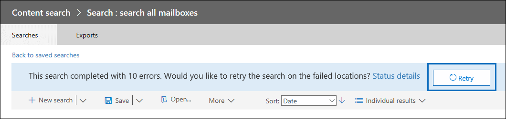

# <a name="retry-a-content-search-to-resolve-a-content-location-error"></a><span data-ttu-id="223b8-103">Reintentar una búsqueda de contenido para resolver un error de ubicación de contenido</span><span class="sxs-lookup"><span data-stu-id="223b8-103">Retry a Content Search to resolve a content location error</span></span>

<span data-ttu-id="223b8-104">Al usar la búsqueda de contenido en el Centro de seguridad y cumplimiento para buscar en un gran número de buzones, puede obtener errores de búsqueda similares al error:</span><span class="sxs-lookup"><span data-stu-id="223b8-104">When you use Content Search in the security and compliance center to search a large number of mailboxes, you may get search errors that are similar to the  error:</span></span>

```text
Error


The search on the following locations failed:

User1@contoso.com: Problem in processing the request. Please try again later. If you keep getting this error, contact your admin. (CS008-009)

User2@contoso.com: Application error occurred. Please try again later. (CS012-002)
```

<span data-ttu-id="223b8-105">Estos errores (con códigos de error de CS001-002, CS003-002, CS008-009, CS012-002 y otros errores del formulario CS0XX-0XX) indican que la búsqueda de contenido no pudo buscar ubicaciones de contenido específicas; en este ejemplo, no se buscaron dos buzones.</span><span class="sxs-lookup"><span data-stu-id="223b8-105">These errors (with error codes of CS001-002, CS003-002, CS008-009, CS012-002, and other errors of the form CS0XX-0XX) indicate that Content Search failed to search specific content locations; in this example, two mailboxes weren't searched.</span></span> <span data-ttu-id="223b8-106">Estos errores se muestran en la página desplegable de detalles de estado de la búsqueda de contenido.</span><span class="sxs-lookup"><span data-stu-id="223b8-106">These errors are displayed on the status details flyout page of the Content Search.</span></span>

## <a name="cause-of-content-location-errors"></a><span data-ttu-id="223b8-107">Causa de errores de ubicación de contenido</span><span class="sxs-lookup"><span data-stu-id="223b8-107">Cause of content location errors</span></span>

<span data-ttu-id="223b8-108">Al buscar un gran número de buzones, la búsqueda se distribuye entre miles de servidores en un centro de datos de Microsoft.</span><span class="sxs-lookup"><span data-stu-id="223b8-108">When searching a large number of mailboxes, the search is distributed across thousands of servers in a Microsoft datacenter.</span></span> <span data-ttu-id="223b8-109">En cualquier momento, servidores específicos podrían estar en estado de reinicio o en el proceso de con error a copias redundantes.</span><span class="sxs-lookup"><span data-stu-id="223b8-109">At any one time, specific servers could be in reboot state or in the process of failing over to redundant copies.</span></span> <span data-ttu-id="223b8-110">En cualquiera de estos casos, la solicitud de búsqueda de contenido para recuperar datos dará tiempo de espera. En el ejemplo anterior, los errores de los buzones que fallaron fueron el resultado del tiempo de ejecución de la búsqueda.</span><span class="sxs-lookup"><span data-stu-id="223b8-110">In either of these cases, the Content Search's request to retrieve data will time out. In the previous example, the errors for the mailboxes that failed were the result of the search timing out.</span></span>

## <a name="resolving-content-location-errors"></a><span data-ttu-id="223b8-111">Resolución de errores de ubicación de contenido</span><span class="sxs-lookup"><span data-stu-id="223b8-111">Resolving content location errors</span></span>

<span data-ttu-id="223b8-112">Reiniciar la búsqueda suele provocar errores similares en diferentes servidores.</span><span class="sxs-lookup"><span data-stu-id="223b8-112">Restarting the search will often result in similar errors on different servers.</span></span> <span data-ttu-id="223b8-113">En lugar de reiniciar la búsqueda, haga clic en el **botón Reintentar** que se muestra en la parte superior de la página de resultados de búsqueda.</span><span class="sxs-lookup"><span data-stu-id="223b8-113">Instead of restarting the search, click the **Retry** button that is displayed at the top of the search results page.</span></span>



<span data-ttu-id="223b8-115">Esto dará como resultado reintentar la búsqueda solo para los buzones que han fallado.</span><span class="sxs-lookup"><span data-stu-id="223b8-115">This will result in the retrying the search only for the mailboxes that failed.</span></span> <span data-ttu-id="223b8-116">Al reintentar la búsqueda, se conservan los demás resultados que se devolvieron correctamente.</span><span class="sxs-lookup"><span data-stu-id="223b8-116">When you retry the search, the other results that were successfully returned are retained.</span></span>

## <a name="tips-to-avoid-content-location-errors"></a><span data-ttu-id="223b8-117">Sugerencias evitar errores de ubicación de contenido</span><span class="sxs-lookup"><span data-stu-id="223b8-117">Tips to avoid content location errors</span></span>

<span data-ttu-id="223b8-118">Estas son algunas causas adicionales de errores de ubicación de contenido y algunas sugerencias para ayudarle a evitarlos al buscar grandes cantidades de buzones.</span><span class="sxs-lookup"><span data-stu-id="223b8-118">Here are some additional causes of content location errors and some tips to help you avoid them when searching large numbers of mailboxes.</span></span>

- <span data-ttu-id="223b8-119">El buzón que se está buscando puede estar ocupado debido a la actividad del usuario.</span><span class="sxs-lookup"><span data-stu-id="223b8-119">The mailbox being searched might be busy due to user activity.</span></span> <span data-ttu-id="223b8-120">En este caso, el servicio de búsqueda puede limitarse a sí mismo para evitar que el buzón no esté disponible.</span><span class="sxs-lookup"><span data-stu-id="223b8-120">In this case, the search service might throttle itself to prevent the mailbox from becoming unavailable.</span></span> <span data-ttu-id="223b8-121">Para evitar esto, intente ejecutar búsquedas durante el horario no comercial.</span><span class="sxs-lookup"><span data-stu-id="223b8-121">To avoid this, try running searches during non-business hours.</span></span>

- <span data-ttu-id="223b8-122">Es posible que la consulta de búsqueda recupere demasiado contenido del buzón.</span><span class="sxs-lookup"><span data-stu-id="223b8-122">The search query might be retrieving too much content from the mailbox.</span></span> <span data-ttu-id="223b8-123">Si es posible, intente restringir el ámbito de la búsqueda mediante palabras clave, intervalos de fechas y condiciones de búsqueda.</span><span class="sxs-lookup"><span data-stu-id="223b8-123">If possible, try to narrow the scope of the search by using keywords, date ranges, and search conditions.</span></span>

- <span data-ttu-id="223b8-124">Demasiadas palabras clave o frases de palabras clave al crear una consulta de búsqueda con la lista [de palabras clave](view-keyword-statistics-for-content-search.md#get-keyword-statistics-for-searches).</span><span class="sxs-lookup"><span data-stu-id="223b8-124">Too many keywords or keyword phrases when you create a search query using the [keywords list](view-keyword-statistics-for-content-search.md#get-keyword-statistics-for-searches).</span></span> <span data-ttu-id="223b8-125">Cuando se ejecuta una consulta de búsqueda que usa la lista de palabras clave, el servicio ejecuta básicamente una búsqueda independiente para cada fila de la lista de palabras clave para que se puedan generar estadísticas.</span><span class="sxs-lookup"><span data-stu-id="223b8-125">When you run a search query that uses the keywords list, the service essentially runs a separate search for each row in the keyword list so that statistics can be generated.</span></span> <span data-ttu-id="223b8-126">Si usa la lista de palabras clave en las consultas de búsqueda, minimice el número de filas de la lista de palabras clave o divida las palabras clave de número en listas más pequeñas y cree una búsqueda diferente para cada lista de palabras clave.</span><span class="sxs-lookup"><span data-stu-id="223b8-126">If you're using the keywords list in search queries, minimize the number of rows in the keyword list or divide the number keywords into smaller lists and create a different search for each keyword list.</span></span>

  > [!NOTE]
  > <span data-ttu-id="223b8-127">Para ayudar a reducir los problemas causados por listas de palabras clave grandes, ahora está limitado a un máximo de 20 filas en la lista de palabras clave de una consulta de búsqueda.</span><span class="sxs-lookup"><span data-stu-id="223b8-127">To help reduce issues caused by large keyword lists, you're now limited to a maximum of 20 rows in the keyword list of a search query.</span></span>

- <span data-ttu-id="223b8-128">Se están realizando demasiadas búsquedas en el mismo buzón al mismo tiempo.</span><span class="sxs-lookup"><span data-stu-id="223b8-128">Too many searches are being performed on the same mailbox at the same time.</span></span> <span data-ttu-id="223b8-129">Si es posible, intente ejecutar una búsqueda a la vez en cualquier buzón.</span><span class="sxs-lookup"><span data-stu-id="223b8-129">If possible, try to run one search at a time on any one mailbox.</span></span>

- <span data-ttu-id="223b8-130">Buscar demasiados buzones en una sola búsqueda.</span><span class="sxs-lookup"><span data-stu-id="223b8-130">Searching too many mailboxes in a single search.</span></span> <span data-ttu-id="223b8-131">La probabilidad de errores de ubicación de contenido aumenta al buscar un gran número de buzones.</span><span class="sxs-lookup"><span data-stu-id="223b8-131">The probability of content location errors increases when searching a large number of mailboxes.</span></span> <span data-ttu-id="223b8-132">Si es posible, intente ejecutar varias búsquedas para que cada búsqueda incluya un subconjunto de buzones en su organización.</span><span class="sxs-lookup"><span data-stu-id="223b8-132">If possible, try to run multiple searches so that each search includes a subset of  mailboxes in your organization.</span></span>

- <span data-ttu-id="223b8-133">Se está realizando el mantenimiento necesario en el buzón.</span><span class="sxs-lookup"><span data-stu-id="223b8-133">Required maintenance is being performed on the mailbox.</span></span> <span data-ttu-id="223b8-134">Aunque esta causa probablemente se produzca con poca frecuencia, espere un poco después de recibir el error de ubicación de contenido y vuelva a intentar la búsqueda.</span><span class="sxs-lookup"><span data-stu-id="223b8-134">Though this cause probably occurs infrequently, wait a little while after receiving the content location error and then retry the search.</span></span>
