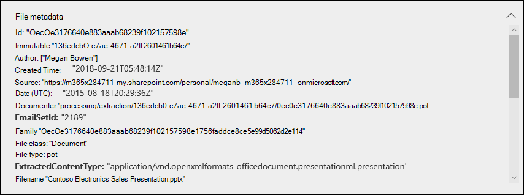
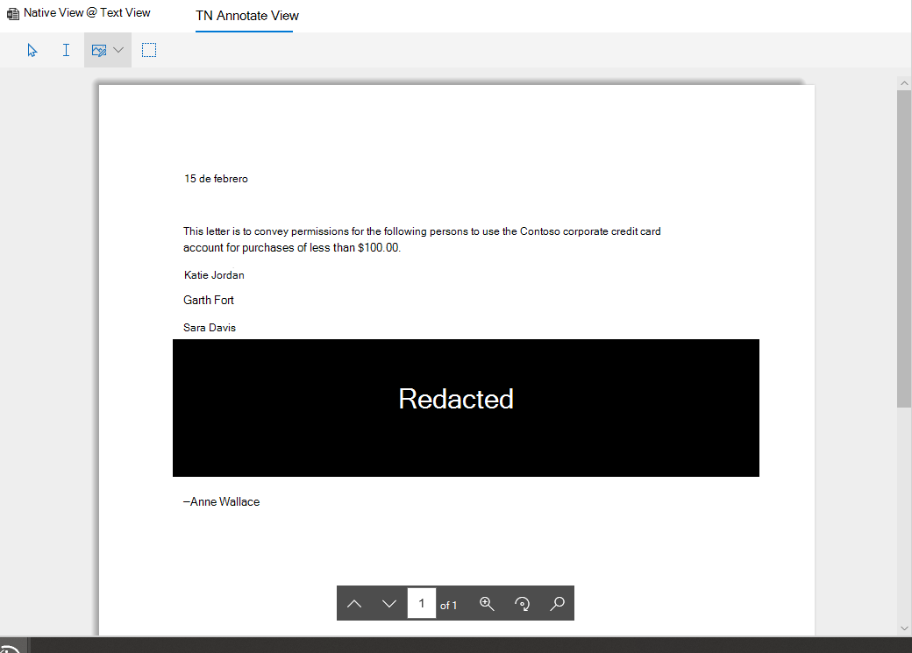

# Revisar los datos de pruebasReview the data in evidence

Los datos de un conjunto de evidencias en una investigación de datos son una instantánea de los resultados de búsqueda que se recopilaron y se agregaron al conjunto de evidencias.The data in an evidence set in a data investigation is a snapshot of the search results that you collected and added to the evidence set. Cuando se agregan resultados de búsqueda a la evidencia, se desencadena un proceso para extraer los archivos, los metadatos y el texto de los elementos devueltos por la búsqueda.When you add search results to evidence, a process is triggered to extract files, metadata, and text from the items returned by the search. A continuación, la herramienta de investigación de datos (vista previa) crea un nuevo índice (por un proceso denominado " *indización avanzada*") de todos los datos y agrega a un conjunto de evidencias en la pestaña **evidencia** .Then the Data Investigations (preview) tool then builds a new index (by a process called *Advanced indexing*) of all the data and adds to an evidence set on the **Evidence** tab. 

Para las investigaciones sensibles al tiempo, esto permite incluir rápidamente el entorno al eliminar los datos reales derramados o malintencionados que se encuentran en el origen de datos original, a la vez que permite investigar la evidencia que se ha vuelto a crear en un entorno de cuarentena, que en este caso son los datos copiados al conjunto de evidencias.For time-sensitive investigations, this allows you to quickly contain the environment by deleting the actual spilled or malicious data located in the at original data source, while at the same time allowing you to investigate the re-created evidence in a quarantined environment, which in this case is the data copied to the evidence set). Una vez recopilada y agregada la evidencia al conjunto de evidencias, puede revisar documentos individuales en su formato nativo, formato de texto o un formato casi nativo que puede usar para anotar y censurar documentos.After the evidence is collected and added to the evidence set, you can review individual documents in their native format, text format, or a near-native format that you can use to annotate and redact documents. Además, puede ejecutar consultas para restringir el conjunto de datos por intervalo de tiempo, tipos de archivo, propietarios de datos y muchas otras propiedades y condiciones de búsqueda.Additionally, you can run queries to narrow the data set by time range, file types, data owners, and many other properties and search conditions. Por ejemplo, mediante el uso de las condiciones de autor, remitente o destinatario, puede identificar rápidamente a las personas involucradas en el incidente y si los datos de la organización se han compartido con usuarios externos.For example, by using the Author, Sender, or Recipient conditions, you can quickly identify the people are involved in the incident and if any data from your organization has been shared with external users. Para obtener más información acerca de la búsqueda en datos en un conjunto de evidencias, vea [consultar los datos en evidencias](evidence-query.md).For more information about searching through data in an evidence set, see [Query the data in evidence](evidence-query.md).

Para agrupar documentos y obtener más ayuda para su revisión, seleccione un conjunto de evidencias en la pestaña **evidencia** y, a continuación, haga clic en **administrar evidencias**.To group documents and get more assistance for your review, select an evidence set on the **Evidence** tab, and then click **Manage evidence**. En el mosaico **Analytics** , haga clic en **recompilar análisis para todo el conjunto**.In the **Analytics** tile, click **Rebuild analytics for the whole set**. De esta forma, se ejecutarán análisis avanzados, como la detección de duplicados, el procesamiento de correo electrónico y el análisis de temas.This will run advanced analytics such as duplicate detection, email threading, and theme analysis. Posteriormente, puede ver los temas generales de los datos y también organizar los documentos por correo electrónico, casi duplicados y duplicados exactos para ayudarle en su investigación.Afterwards, you can see the general themes of the data and also organize documents by email threads, near duplicates, and exact duplicates to help your investigation. Para obtener más información, vea [ejecutar análisis para investigar con mayor rapidez](run-analytics-to-investigate-faster.md).For more information, see [Run analytics to investigate faster](run-analytics-to-investigate-faster.md).

## Ver documentos en pruebaView documents in evidence

La herramienta de investigación de datos (versión preliminar) le permite mostrar contenido en varios visores distintos, con un propósito diferente para cada visor.The Data Investigations (preview) tool allows you to display content in several different viewers, with each viewer having a different purpose. Estos visores son los siguientes:These viewers are:

- Metadatos de archivoFile metadata
- Vista nativaNative view
- Vista de textoText view
- Vista de anotarAnnotate view

Para tener acceso a cualquiera de estos visores, seleccione un documento en un conjunto de evidencias.To access any of these viewers, just select a document in an evidence set.

## Metadatos de archivoFile metadata

Esta vista muestra varias propiedades de metadatos asociadas con el documento seleccionado.This view displays various metadata properties associated with the selected document. Puede activar y desactivar esta vista haciendo clic en **metadatos del archivo**.You can toggle this view on and off by clicking **File metadata**. Al revisar un documento, puede ver los metadatos del archivo y seguir cambiando entre los distintos visores.When reviewing a document, you can view the file metadata and still change between the different viewers.

A continuación, se muestra un ejemplo de los metadatos de archivo para un documento.Here's an example of the file metadata for a document. Para obtener más información acerca de los campos de metadatos, vea [Document Metadata Fields in Data investigaciones (Preview)](document-metadata-fields.md).For more information about the metadata fields, see [Document metadata fields in Data Investigations (preview)](document-metadata-fields.md).

## Vista nativaNative view

El visor nativo muestra la vista más exacta de un documento en su formato nativo.The Native viewer displays the most accurate view of a document in its native format. La vista nativa es compatible con cientos de tipos de archivo y está destinada a mostrar documentos en la experiencia nativa más real posible.Native view is supported for hundreds of file types and is meant to display documents in the truest native experience possible. Para los archivos de Microsoft Office, el visor nativo usa la versión Web de las aplicaciones de Office.For Microsoft Office files, the Native viewer uses the web version of Office apps. Esto le permite ver contenido como comentarios en diferentes documentos de Office, fórmulas y filas o columnas ocultas en Excel y la vista de notas en PowerPoint.This allows you to view content such as comments in different Office documents, formulas and hidden rows/columns in Excel, and the Notes view in PowerPoint.

## Vista de textoText view

El visor de texto proporciona una vista del texto extraído de un archivo.The Text viewer provides a view of the extracted text of a file. Omite las imágenes incrustadas y el formato, pero esta vista es útil si está intentando revisar y comprender rápidamente el contenido de un documento.It ignores any embedded images and formatting, but this view is useful if you're trying to quickly review and understand the content in a document. La vista de texto también incluye estas características:Text view also includes these features:

  - Un contador de línea que hace que sea más fácil hacer referencia a partes específicas de un documento.A line counter, which makes it easier to reference specific portions of a document.

  - Buscar el resaltado de referencias que resalta los términos en el documento y en la barra de desplazamientoSearch hit highlighting that highlight terms in the document as well as on the scrollbar

  - Una vista de diferencias proporciona una vista de comparación que resalta las diferencias de texto al ver los documentos mediante el panel de **duplicados Near** .A diff view provides a comparison view that highlights the text differences when viewing documents using the **Near duplicates** panel.

**Ejemplo de contador de línea y resaltado de búsqueda en el texto y en la barra de desplazamiento****Example of line counter and search hit highlighting in text and scrollbar**

**Ejemplo de la vista diff****Example of the diff view**

## Vista de anotarAnnotate view

La vista anotar proporciona características que permiten aplicar marcado a un documento durante el proceso de revisión; Esto incluye estas herramientas:The Annotate view provides features that allow you to apply markup on a document during the review process; this  includes these tools:

  - **Redacciones de área** : puede dibujar un cuadro opaco en el documento que oculte el contenido confidencial.**Area redactions** – You can draw an opaque box on the document that hides sensitive content.

  - **Lápiz** : puede liberar a mano un documento para atraer la atención a determinadas partes del contenido**Pencil** – You can free-hand draw on a document to bring attention to certain portions of the content

  - **Seleccionar anotaciones** : puede seleccionar y eliminar anotaciones en un documento.**Select annotations** - You can select and delete annotations in a document.

  - **Alternar transparencia de anotación** : puede alternar la transparencia de las anotaciones (entre opaco y semitransparente) para poder ver el contenido detrás de la anotación.**Toggle annotation transparency** – You can toggle the transparency of annotations (between opaque and semi-transparent) so you can view the content behind the annotation. Esto incluye alternar la transparencia de las anotaciones de lápiz y las redacciones.This includes toggling the transparency of pencil annotations and redactions.

La vista anotar también proporciona las siguientes funciones de navegación:The Annotate view also provides the following navigation functionality:

  - **Página anterior**, **página siguiente**y **vaya a** los controles de navegación de páginas que se van a usar para documentos de varias páginas.**Previous page**, **Next page**, and **Go to page** - Navigation controls to use for multi-page documents.

  - **Zoom** : aumenta o disminuye el tamaño de los documentos en la vista anotar.**Zoom** – Increases or decreases the size of documents in Annotate view.

  - **Girar** : girar documentos en el sentido de las agujas del reloj.**Rotate** – Rotate documents clockwise.

  - **Buscar** : busca palabras clave en un documento y, a continuación, usa los controles anterior y siguiente para ver los aciertos (resaltados) en el documento.**Search** – Search for keywords in a document, and then use Previous and Next controls to view the hits (which are highlighted) within the document.

**Ejemplo de la vista anotar****Example of Annotate view**

> [!NOTE]
> Las anotaciones se aplican a una copia del documento que se agregó al conjunto de evidencias.Annotations are applied to a copy of the document that was added to the evidence set. No se han anotado los documentos originales en el servicio activo.The original documents in the live service aren't annotated.
