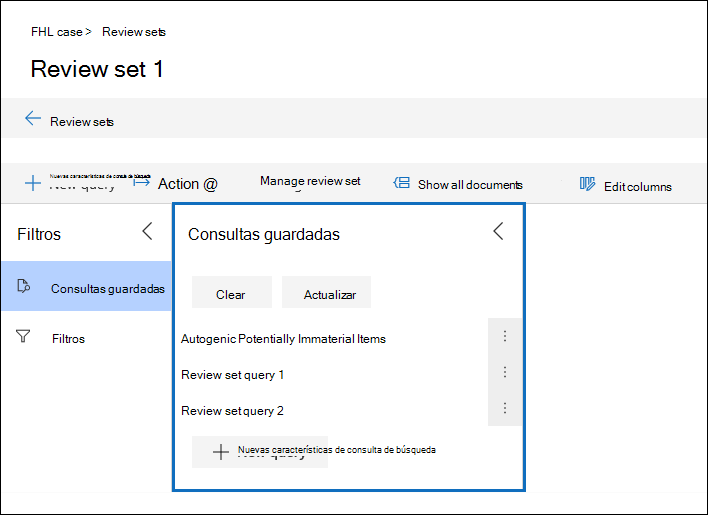

# Consultar los datos de un conjunto de revisiónQuery the data in a review set

En la mayoría de los casos, será útil poder profundizar más en los datos de un conjunto de revisión y organizar los datos para facilitar una revisión más eficiente.In most cases, it will be useful to be able to dig deeper into the data in a review set and organize that data to facilitate a more efficient review. Usar consultas en un conjunto de revisiones le ayudará a centrarse en un subconjunto de documentos que cumplan los criterios de la revisión.Using Queries in a review set helps you focus on a subset of documents that meet the criteria of your review.

## Crear y ejecutar una consulta en un conjunto de revisionesCreating and running a query in a review set

Para crear y ejecutar una consulta en los documentos de un conjunto de revisión, seleccione **nueva consulta** en el conjunto de revisiones.To create and run a query on the documents in a review set, select **New query** in the review set. Después de asignar un nombre a la consulta y definir las condiciones, seleccione **Guardar** para guardar y ejecutar la consulta.After you name your query and define the conditions, select **Save** to save and run the query. Para ejecutar una consulta que se ha guardado previamente, seleccione una consulta guardada.To run a query that has been previously saved, select a saved query.

## Creación de una consulta de conjunto de revisiónBuilding a review set query

Puede crear una consulta mediante una combinación de tarjetas de condición y lenguaje de consulta en la tarjeta de condición de palabras clave.You can build a query by using a combination of condition cards and query language in the Keywords condition card. También puede agrupar las tarjetas de condición como un bloque (denominado *grupo de condición*) para crear una consulta más compleja.You can also group condition cards together as a block (called a *condition group*) to build a more complex query. Para obtener una lista y una descripción de las propiedades de metadatos que puede buscar, consulte [Document Metadata Fields in Advanced eDiscovery](document-metadata-fields-in-Advanced-eDiscovery.md).For a list and description of metadata properties that you can search, see [Document metadata fields in Advanced eDiscovery](document-metadata-fields-in-Advanced-eDiscovery.md).

### Tarjetas de condiciónCondition cards

Cada campo de búsqueda de un conjunto de revisión tiene una tarjeta de condición correspondiente que puede usar para crear la consulta.Every searchable field in a review set has a corresponding condition card that you can use to build your query.

Hay varios tipos de tarjetas de condición:There are multiple types of condition cards:

- FREETEXT: se usa una tarjeta de condición FREETEXT para los campos de texto, como el asunto.Freetext: A freetext condition card is used for text fields such as subject. Puede enumerar varios términos de búsqueda separándolos con una coma.You can list multiple search terms by separating them out with a comma.

- Fecha: se usa una tarjeta de condición de fecha para los campos de fecha como última fecha de modificación.Date: A date condition card is used for date fields such as last modified date.

- Opciones de búsqueda: una tarjeta de condición de opciones de búsqueda proporcionará una lista de valores posibles para el campo en particular en su conjunto de revisión.Search options: A search options condition card will provide a list of possible values for the particular field in your review set. Se usa para los campos, como Sender, donde hay un número finito de valores posibles en su conjunto de revisión.This is used for fields, such as sender, where there is a finite number of possible values in your review set.

- Palabra clave: una tarjeta de condición de palabra clave es una instancia específica de la tarjeta de condición FREETEXT que puede usar para buscar términos o usar el lenguaje de consulta de tipo KQL en.Keyword: A keyword condition card is a specific instance of freetext condition card that you can use to search for terms, or use KQL-like query language in. Consulte a continuación para obtener más detalles.See below for more detail.

### Lenguaje de consultaQuery language

Además de las tarjetas de condición, puede usar un lenguaje de consulta similar a tipo KQL en la tarjeta Keywords para crear la consulta.In addition to condition cards, you can use a KQL-like query language in the Keywords card to build your query. El lenguaje de consulta para las consultas set de revisión admite operadores booleanos estándar, como **and**, **or**, **Not**y **Near**.The query language for review set queries supports standard Boolean operators, such as **AND**, **OR**, **NOT**, and **NEAR**. También admite caracteres comodín de un solo carácter (?) y un comodín de varios caracteres (\*).It also supports a single-character wildcard (?) and a multi-character wildcard (\*).

## FiltrosFilters

Además de las consultas que puede guardar, puede usar la revisión Set filters para aplicar rápidamente condiciones adicionales a una consulta de conjunto de revisión.In addition to queries that you can save, you can use review set filters to quickly apply additional conditions to a review set query. El uso de filtros ayuda a restringir aún más los resultados mostrados por una consulta de conjunto de revisión.Using filters help you further refine the results displayed by a review set query.

Los filtros difieren de las consultas de dos maneras significativas:Filters differ from queries in two significant ways:

- Los filtros son transitorios.Filters are transient. No se conservan más allá de la sesión existente.They don't persist beyond the existing session. Es decir, no se puede guardar un filtro.In other words, you can't save a filter. Las consultas se guardan en el conjunto de revisión y acceden a ellas cada vez que se abre el conjunto de revisión.Queries are saved to the review set, and access them whenever open the review set.

- Los filtros siempre son aditivos.Filters are always additive. Se aplican filtros además de la consulta del conjunto de revisiones actual.Filters are applied in addition to the current review set query. Si se aplica una consulta diferente, se reemplazarán los resultados devueltos por la consulta actual.Applying a different query will replace the results returned by the current query.
