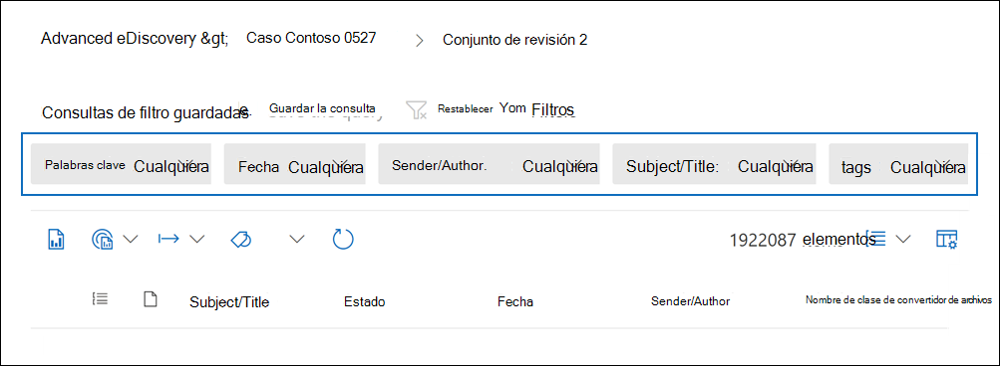
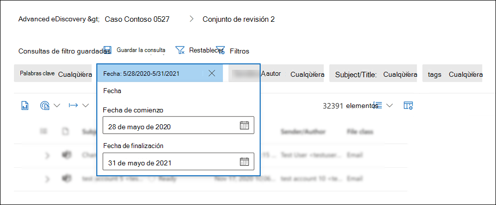
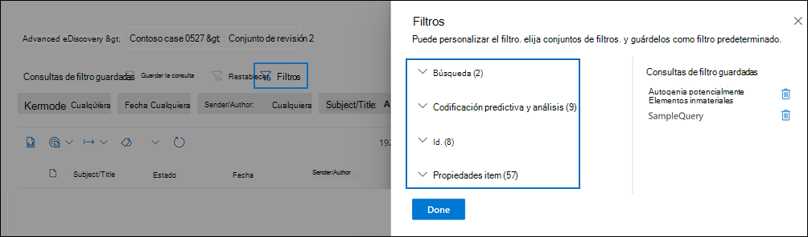
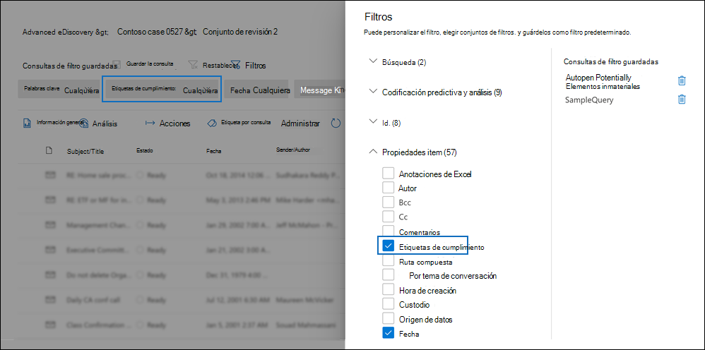
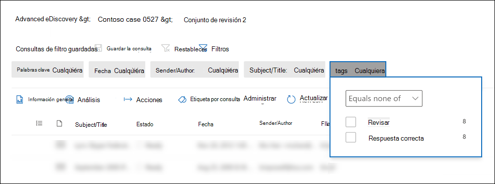
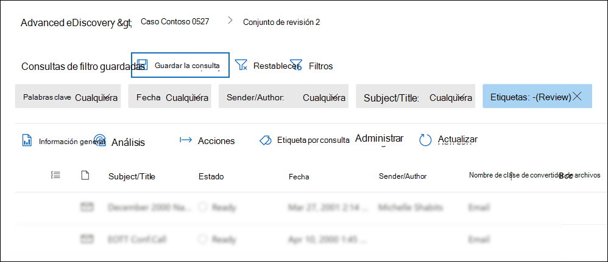
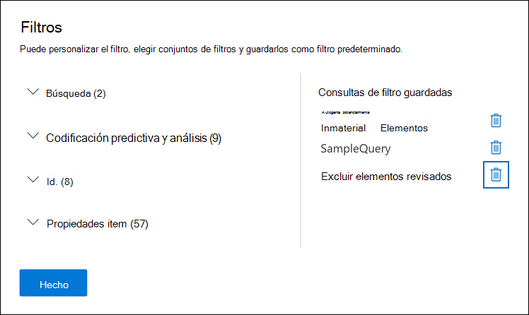
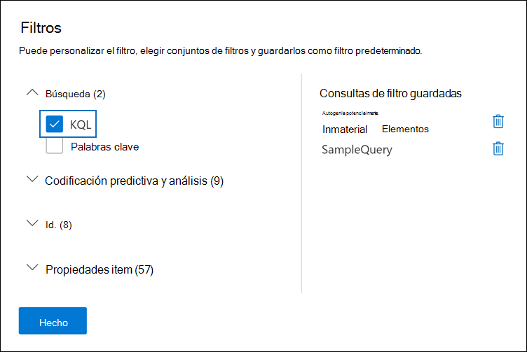
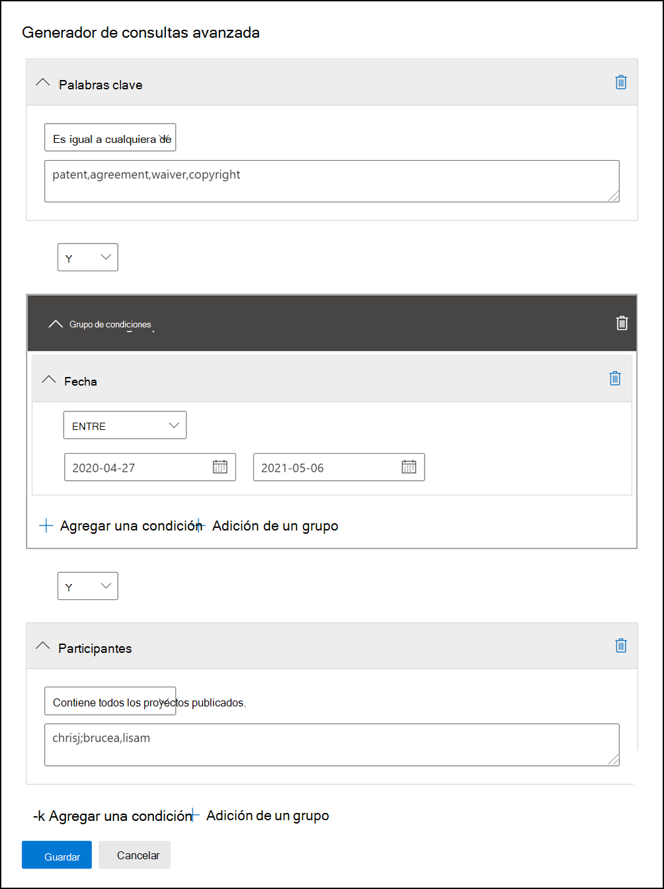

# Consultar y filtrar contenido en un conjunto de revisiónQuery and filter content in a review set

En la mayoría de los casos, será útil profundizar en el contenido de un conjunto de revisión y organizarlo para facilitar una revisión más eficaz.In most cases, it will be useful to dig deeper into the content in a review set and organize it to facilitate a more efficient review. El uso de filtros y consultas en un conjunto de revisión le ayuda a centrarse en un subconjunto de documentos que cumplan los criterios de la revisión.Using filters and queries in a review set helps you focus on a subset of documents that meet the criteria of your review.

## Filtros predeterminadosDefault filters

En un conjunto de revisión, hay cinco filtros predeterminados que se cargan previamente en el conjunto de revisión:In a review set, there are five default filters that are pre-loaded in the review set:

- Palabras claveKeywords
- FechaDate
- Sender/AuthorSender/Author
- Asunto/TítuloSubject/Title
- EtiquetasTags

Haga clic en cada filtro para expandirlo y asignar un valor.Click each filter to expand it and assign a value. Haga clic fuera del filtro para aplicar automáticamente el filtro al conjunto de revisión.Click outside the filter to automatically apply the filter to the review set. La siguiente captura de pantalla muestra el filtro Fecha configurado para mostrar documentos dentro de un intervalo de fechas.The following screenshot shows the Date filter configured to show documents within a date range.

## Agregar o quitar filtrosAdd or remove filters

Para agregar o quitar los filtros que se  muestran para el conjunto de revisión, seleccione Filtros para abrir el panel de filtro, que se muestra en una página desplegable.To add or remove filters that are displayed for the review set, select **Filters** to open the filter panel, which is displayed on a flyout page. 

Los filtros disponibles se organizan en cuatro secciones:The available filters are organized in four sections:

- **Búsqueda:** filtros que proporcionan distintas capacidades de búsqueda.**Search**: Filters that provide different search capabilities.

- **Analytics & codificación predictiva:** filtra las propiedades generadas y agregadas a los documentos al ejecutar el trabajo analítico de correo electrónico de **&** o al usar modelos de codificación predictiva.**Analytics & predictive coding**: Filters for properties generated and added to documents when you run the **Document & email analytic** job or use predictive coding models.

- **Identificadores:** filtra todas las propiedades de identificador de los documentos.**IDs**: Filters for all ID properties of documents.

- **Propiedades del elemento:** filtra las propiedades del documento.**Item properties**: Filters for document properties. 

Expanda cada sección y seleccione o anule la selección de filtros para agregarlos o quitarlos en el conjunto de filtros.Expand each section and select or deselect filters to add or remove them in the filter set. Al agregar un filtro, se muestra en el conjunto de filtros.When you add a filter, it's displayed in the filter set. 

> [!NOTE]
> Al expandir una sección en el panel de filtros, observará que los tipos de filtro predeterminados están seleccionados.When you expand a section in the filter panel, you'll notice that the default filter types are selected. Puede mantener estos seleccionados o anular la selección y quitarlos del conjunto de filtros.You can keep these selected or deselect them and removed them from the filter set. 

## Tipos de filtroFilter types

Cada campo que se puede buscar en un conjunto de revisión tiene un filtro correspondiente que puede usar para los elementos de filtro en función de un campo específico.Every searchable field in a review set has a corresponding filter that you can use for filter items based on a specific field.

Hay varios tipos de filtros:There are multiple types of filters:

- **Freetext:** se aplica un filtro de texto libre a campos de texto como "Subject".**Freetext**: A freetext filter is applied to text fields such as "Subject". Puede enumerar varios términos de búsqueda separlos con una coma.You can list multiple search terms by separating them with a comma.

- **Fecha:** se usa un filtro de fecha para campos de fecha como "Fecha de última modificación".**Date**: A date filter is used for date fields such as "Last modified date".

- **Opciones de** búsqueda: un filtro de opciones de búsqueda proporciona una lista de valores posibles (cada valor se muestra con una casilla que puede seleccionar) para campos concretos de la revisión.**Search options**: A search options filter provides a list of possible values (each value is displayed with a checkbox that you can select) for particular fields in the review. Este filtro se usa para campos, como "Sender", donde hay un número finito de valores posibles en el conjunto de revisión.This filter is used for fields, such as "Sender", where there is a finite number of possible values in the review set.

- **Palabra** clave: una condición de palabra clave es una instancia específica de condición de texto libre que puede usar para buscar términos.**Keyword**: A keyword condition is a specific instance of freetext condition that you can use to search for terms. También puede usar el lenguaje de consulta de tipo KQL en este tipo de filtro.You can also use KQL-like query language in this type of filter. Para obtener más información, vea las secciones Lenguaje de consulta y Generador de consultas avanzado en este tema.For more information, see the Query language and Advanced query builder sections in this topic.

## Incluir y excluir relaciones de filtroInclude and exclude filter relationships

Tiene la opción de cambiar la relación de incluir y excluir para un filtro determinado.You have the option to change the include and exclude relationship for a particular filter. Por ejemplo, en el filtro Etiqueta, puede excluir elementos **etiquetados** con una etiqueta determinada seleccionando Igual a ninguno en el filtro desplegable.For example, in the Tag filter, you can exclude items that are tagged with a particular tag by selecting **Equals none of** in the dropdown filter. 

## Guardar filtros como consultasSave filters as queries

Una vez que esté satisfecho con los filtros, puede guardar la combinación de filtros como una consulta de filtro.After you are satisfied with your filters, you can save the filter combination as a filter query. Esto le permite aplicar el filtro en las sesiones de revisión futuras.This lets you apply the filter in the future review sessions.

Para guardar un filtro, seleccione **Guardar la consulta** y así mismo.To save a filter, select **Save the query** and name it. Usted u otros revisores pueden ejecutar consultas de filtro guardadas previamente seleccionando el menú desplegable Consultas **de** filtro guardadas y seleccionando una consulta de filtro para aplicar a los documentos establecidos de revisión.You or other reviewers can run previously saved filter queries by selecting the **Saved filter queries** dropdown and selecting a filter query to apply to review set documents. 

Para eliminar una consulta de filtro, abra el panel de filtro y seleccione el icono de papelera junto a la consulta.To delete a filter query, open the filter panel and select the trashcan icon next to the query.

## Lenguaje de consultaQuery language

Además de usar filtros, también puede usar un lenguaje de consulta de tipo KQL en el filtro Palabras clave para crear la consulta de búsqueda del conjunto de revisión.In addition to using filters, you can also use a KQL-like query language in the Keywords filter to build your review set search query. El lenguaje de consulta para consultas de conjunto de revisión admite operadores booleanos estándar, como **AND**, **OR**, **NOT** y **NEAR**.The query language for review set queries supports standard Boolean operators, such as **AND**, **OR**, **NOT**, and **NEAR**. También admite un comodín de un solo carácter (?) y un comodín de varios caracteres (\*).It also supports a single-character wildcard (?) and a multi-character wildcard (\*).

## Generador de consultas avanzadaAdvanced query builder

También puede crear consultas más avanzadas para buscar documentos en un conjunto de revisión.You can also build more advanced queries to search for documents in a review set.

1. Abra el panel de filtro, seleccione **Filtros** y expanda la **sección** Búsqueda.Open the filter panel, select **Filters**, and expand the **Search** section.

  

2. Seleccione el filtro **KQL y** haga clic **en Abrir generador de consultas**.Select the **KQL** filter and click **Open query builder**.

   En este panel, puede crear consultas KQL complejas mediante el generador de consultas.In this panel, you can create complex KQL queries by using the query builder. Puede agregar condiciones o agregar grupos de condiciones que estén hechos de varias condiciones que estén conectadas lógicamente mediante relaciones **AND** **o OR.**You can add conditions or add condition groups that are made up of multiple conditions that are logically connected by **AND** or **OR** relationships.

   
