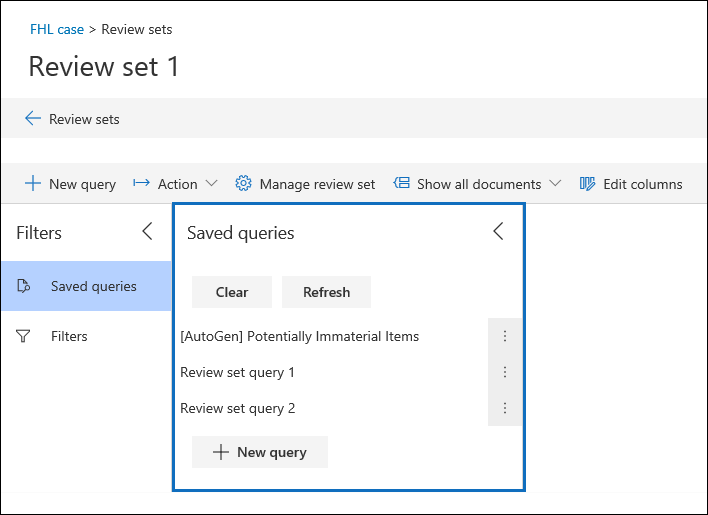

# Consultar los datos de un conjunto de revisiónQuery the data in a review set

En la mayoría de los casos, será útil profundizar en los datos de un conjunto de revisión y organizar esos datos para facilitar una revisión más eficaz.In most cases, it will be useful to be able to dig deeper into the data in a review set and organize that data to facilitate a more efficient review. El uso de consultas en un conjunto de revisión le ayuda a centrarse en un subconjunto de documentos que cumplen los criterios de la revisión.Using Queries in a review set helps you focus on a subset of documents that meet the criteria of your review.

## Creación y ejecución de una consulta en un conjunto de revisiónCreating and running a query in a review set

Para crear y ejecutar una consulta en los documentos de un conjunto de revisión, seleccione **Nueva consulta** en el conjunto de revisión.To create and run a query on the documents in a review set, select **New query** in the review set. Después de nombrar la consulta y definir las condiciones, seleccione **Guardar** para guardar y ejecutar la consulta.After you name your query and define the conditions, select **Save** to save and run the query. Para ejecutar una consulta que se haya guardado anteriormente, seleccione una consulta guardada.To run a query that has been previously saved, select a saved query.

## Creación de una consulta de conjunto de revisiónBuilding a review set query

Puede crear una consulta mediante una combinación de palabras clave, propiedades y condiciones en la condición De palabras clave.You can build a query by using a combination of keywords, properties, and conditions in the Keywords condition. También puede agrupar condiciones como un bloque (denominado grupo *de condiciones)* para crear una consulta más compleja.You can also group conditions as a block (called a *condition group*) to build a more complex query. Para obtener una lista y una descripción de las propiedades de metadatos que puede buscar, vea Campos de metadatos del documento [en eDiscovery avanzado.](document-metadata-fields-in-Advanced-eDiscovery.md)For a list and description of metadata properties that you can search, see [Document metadata fields in Advanced eDiscovery](document-metadata-fields-in-Advanced-eDiscovery.md).

### CondicionesConditions

Cada campo que permite búsquedas en un conjunto de revisión tiene una condición correspondiente que puede usar para crear la consulta.Every searchable field in a review set has a corresponding condition that you can use to build your query.

Existen varios tipos de condiciones:There are multiple types of conditions:

- Texto libre: se usa una condición de texto libre para campos de texto como el asunto.Freetext: A freetext condition is used for text fields such as subject. Puede enumerar varios términos de búsqueda si los separa con una coma.You can list multiple search terms by separating them out with a comma.

- Fecha: se usa una condición de fecha para campos de fecha como la fecha de la última modificación.Date: A date condition is used for date fields such as last modified date.

- Opciones de búsqueda: una condición de opciones de búsqueda proporcionará una lista de posibles valores para el campo concreto del conjunto de revisión.Search options: A search options condition will provide a list of possible values for the particular field in your review set. Esto se usa para campos, como el remitente, donde hay un número finito de valores posibles en el conjunto de revisión.This is used for fields, such as sender, where there is a finite number of possible values in your review set.

- Palabra clave: una condición de palabra clave es una instancia específica de la condición de texto libre que puede usar para buscar términos o usar lenguaje de consulta de tipo KQL en.Keyword: A keyword condition is a specific instance of freetext condition that you can use to search for terms, or use KQL-like query language in. Consulta a continuación para obtener más detalles.See below for more detail.

### Lenguaje de consultaQuery language

Además de las condiciones, puede usar un lenguaje de consulta de tipo KQL en la condición de palabras clave para crear la consulta.In addition to conditions, you can use a KQL-like query language in the Keywords condition to build your query. El lenguaje de consulta para consultas de conjunto de revisión admite operadores booleanos estándar, como **AND**, **OR**, **NOT** y **NEAR**.The query language for review set queries supports standard Boolean operators, such as **AND**, **OR**, **NOT**, and **NEAR**. También admite un carácter comodín de un solo carácter (?) y un carácter comodín de varios caracteres (\*).It also supports a single-character wildcard (?) and a multi-character wildcard (\*).

## FiltrosFilters

Además de las consultas que puede guardar, puede usar filtros de conjunto de revisión para aplicar rápidamente condiciones adicionales a una consulta de conjunto de revisión.In addition to queries that you can save, you can use review set filters to quickly apply additional conditions to a review set query. El uso de filtros ayuda a refinar aún más los resultados mostrados por una consulta de conjunto de revisión.Using filters help you further refine the results displayed by a review set query.

Los filtros difieren de las consultas de dos maneras significativas:Filters differ from queries in two significant ways:

- Los filtros son transitorios.Filters are transient. No se conservan más allá de la sesión existente.They don't persist beyond the existing session. En otras palabras, no puede guardar un filtro.In other words, you can't save a filter. Las consultas se guardan en el conjunto de revisión y acceden a ellas siempre que abran el conjunto de revisión.Queries are saved to the review set, and access them whenever open the review set.

- Los filtros siempre son aditivas.Filters are always additive. Los filtros se aplican además de la consulta del conjunto de revisión actual.Filters are applied in addition to the current review set query. La aplicación de una consulta diferente reemplazará los resultados devueltos por la consulta actual.Applying a different query will replace the results returned by the current query.
