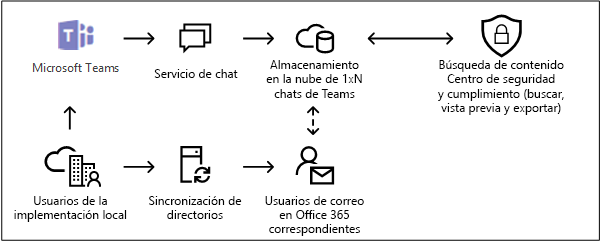
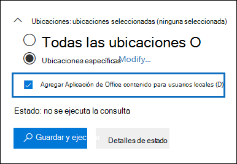

# <a name="searching-cloud-based-mailboxes-for-on-premises-users"></a>Búsqueda de buzones basados en la nube para usuarios locales

Si su organización tiene una implementación híbrida de Exchange (o si su organización sincroniza una organización de Exchange local con Office 365) y ha habilitado Microsoft Teams, los usuarios pueden usar la aplicación de chat Teams para la mensajería instantánea. Para un usuario basado en la nube, los datos del chat de Teams (también llamado*1xN chats*) se guardan en su buzón principal basado en la nube. Cuando un usuario local utiliza la aplicación de chat del equipo, su buzón principal se encuentra en el entorno local.. Para sortear esta limitación, Microsoft ha lanzado una nueva función en la que se crea un área de almacenamiento basada en la nube (llamada buzón de correo basado en la nube para usuarios locales) para almacenar los datos de chat de los equipos para los usuarios locales. Esto te permite usar la herramienta de búsqueda de contenido en el Centro de Seguridad y cumplimiento para buscar y exportar los datos de chat de los equipos para los usuarios locales. 
  
A continuación se presentan los requisitos y limitaciones para establecer buzones de correo basados en la nube para los usuarios locales:
  
- Las cuentas de usuario en su servicio de directorio local (como Active Directory) deben estar sincronizadas con Azure Active Directory, el servicio de directorio de Microsoft 365. Esto significa que se crea una cuenta de usuario de correo en Microsoft 365 y se asocia a un usuario cuyo buzón principal se encuentra en la organización local.

- Al usuario cuyo buzón principal se encuentre en la organización local se le debe asignar una licencia de Microsoft Teams y un mínimo de una licencia de Exchange Online Plan 1.

- El buzón de correo basado en la nube para los usuarios locales se utiliza sólo para almacenar los datos del chat de los equipos. Un usuario local no puede acceder al buzón de correo basado en la nube ni acceder de ninguna manera. No se puede usar para enviar o recibir mensajes de correo electrónico. 

- Debe enviar una solicitud al Soporte técnico de Microsoft para permitir que su organización busque datos de chat de equipos en los buzones de correo basados en la nube para usuarios locales. Consulte [Presentar una solicitud al Soporte técnico de Microsoft para habilitar esta función](#filing-a-request-with-microsoft-support-to-enable-this-feature) en este artículo. 

> [!NOTE]
> Las conversaciones del canal de los equipos siempre se almacenan en el buzón de correo en la nube asociado al equipo. Eso significa que puedes usar la Búsqueda de Contenido para buscar conversaciones de canal sin tener que presentar una solicitud de soporte. Para obtener más información sobre la búsqueda de conversaciones en los canales de los equipos, consulte [Búsqueda Microsoft Teams y Grupos de Microsoft 365](content-search.md#searching-microsoft-teams-and-microsoft-365-groups).
  
## <a name="how-it-works"></a>Funcionamiento

Si un usuario habilitado para Microsoft Teams tiene un buzón de correo en las instalaciones y su cuenta/identidad de usuario ha sido sincronizada a la nube, Microsoft crea un buzón basado en la nube para almacenar los datos del chat de Teams 1xN. Luego de que los datos del chat de Teams se almacenan en el buzón de correo basado en la nube, se indexan para la búsqueda. Esto le permite utilizar la Búsqueda de contenido (y las búsquedas asociadas a los casos de eDiscovery) para buscar, previsualizar y exportar los datos de chat de Teams para los usuarios locales. También puede usar los cmdlets de **\*ComplianceSearch** en el PowerShell del Centro de cumplimiento y seguridad para buscar los datos de charts de Teams de usuarios locales. 
  
El siguiente gráfico muestra el flujo de trabajo de cómo los datos del chat de Teams para los usuarios locales están disponibles para buscar, previsualizar y exportar.
  

  
Además de esta nueva capacidad, todavía puede utilizar la Búsqueda de contenido para buscar, previsualizar y exportar el contenido de Teams en el sitio SharePoint basado en la nube y el buzón de Exchange asociado con los datos de cada equipo de Microsoft y chat de 1xN Teams en el buzón de Exchange Online para los usuarios basados en la nube.

## <a name="filing-a-request-with-microsoft-support-to-enable-this-feature"></a>Presentar una solicitud al Soporte técnico de Microsoft para habilitar esta función

Debe presentar una solicitud al Soporte técnico de Microsoft para que su organización pueda utilizar la interfaz gráfica de usuario en el Centro de seguridad y cumplimiento para buscar datos de chat de Teams en los buzones de correo basados en la nube para los usuarios locales. Esta característica está disponible en el Centro de Seguridad y Cumplimiento PowerShell. No tiene que enviar una solicitud de soporte para usar PowerShell para buscar datos de chat de Teams para usuarios locales.
  
Incluya la siguiente información cuando envíe la solicitud al Soporte técnico de Microsoft:
  
- El nombre de dominio predeterminado de su organización.

- El nombre del espacio empresarial y la identificación del espacio empresarial de su organización. Puede encontrarlos en el portal de Azure Active Directory (en **Administrar** \> **Propiedades**). Vea [Buscar la identificación del espacio empresarial de Microsoft 365](https://docs.microsoft.com/onedrive/find-your-office-365-tenant-id).

- El siguiente título o descripción del propósito de la solicitud de apoyo: "Habilitar la búsqueda de contenido de la aplicación para usuarios locales". Esto ayuda a dirigir la solicitud al equipo de ingeniería de eDiscovery que implementará la solicitud.

Después de que se haga el cambio de ingeniería, el Soporte técnico de Microsoft le enviará una fecha estimada de despliegue. El proceso de despliegue suele tardar de 2 a 3 semanas después de presentar la solicitud de apoyo.
  
### <a name="what-happens-after-this-feature-is-enabled"></a>¿Qué sucede después de que se activa esta función?

Una vez implementada esta función en su organización, se realizan los siguientes cambios en la búsqueda de contenido y en las búsquedas asociadas a un caso de eDiscovery en el Centro de Seguridad y cumplimiento:
  
- La casilla de verificación** Agregar contenido de aplicaciones de Office para usuarios locales** se agrega en la sección **Ubicaciones** en la Búsqueda de contenido.

    
  
- Los usuarios locales aparecen en el selector de ubicaciones de contenido que se utiliza para seleccionar los buzones de correo de los usuarios para realizar búsquedas.

## <a name="searching-for-teams-chat-content-in-cloud-based-mailboxes-for-on-premises-users"></a>Buscar el contenido del chat de Teams en buzones de correo basados en la nube para los usuarios locales

Una vez habilitada la función, puede utilizar la búsqueda de contenido en el Centro de seguridad y cumplimiento para buscar datos de chat de equipos en los buzones de correo basados en la nube para los usuarios locales.
  
1. En el Centro de seguridad y cumplimiento, diríjase a la **Búsqueda** \> **Contenido de búsqueda**

2. En la página **Buscar**, haga clic en el **Nueva búsqueda**.

    Como se ha explicado anteriormente, la casilla de verificación **Agregar contenido de la aplicación de Office para usuarios locales** se muestra en la sección **Ubicaciones**. Está seleccionado de forma predeterminada.

3. Crear la consulta de la palabra clave y añadir condiciones a la consulta de búsqueda si es necesario. Para buscar sólo los datos de los chats de Teams, puede añadir la siguiente consulta en el cuadro**Palabras clave**:

    ```text
    kind:im
    ```

4. En este punto, puede elegir una de las siguientes opciones en **Ubicaciones**:

    - **Todas las ubicaciones:** Seleccione esta opción para buscar en los buzones de correo de todos los usuarios de su organización. Cuando seleccione la casilla de verificación, también se buscarán todos los buzones basados en la nube para los usuarios locales.

    - **Ubicaciones específicas:** Seleccione esta opción y luego haga clic en **Modificar** \> Elija usuarios, grupos o equipos para buscar en buzones específicos. Como se ha explicado anteriormente, el selector de localizaciones permite buscar usuarios en las instalaciones.

5. Guardar y ejecutar la búsqueda. Cualquier resultado de búsqueda de los buzones de correo basados en la nube para usuarios locales puede ser visto previamente como cualquier otro resultado de búsqueda. También puede exportar los resultados de la búsqueda (incluyendo cualquier dato del chat de los equipos) a un archivo PST. Para más información, consulte lo siguiente: 

    - [Crear una búsqueda](content-search.md#create-a-search)

    - [Vista previa de los resultados de búsqueda](content-search.md#preview-search-results)

    - [Exportar resultados del Contenido de búsqueda](export-search-results.md)

## <a name="using-powershell-to-search-for-teams-chat-data-in-cloud-based-mailboxes-for-on-premises-users"></a>Usando PowerShell para buscar datos de chat de Teams en buzones de correo basados en la nube para usuarios locales

Puede usar los cmdlets **New-ComplianceSearch** y **Set-ComplianceSearch** en el Centro de seguridad y cumplimiento PowerShell para buscar en el buzón basado en la nube a los usuarios locales. Como se explicó anteriormente, no es necesario presentar una solicitud de soporte para utilizar PowerShell para buscar datos de chat de Teams para usuarios locales. 
  
1. [Conectarse a PowerShell del Centro de seguridad y cumplimiento](https://docs.microsoft.com/powershell/exchange/office-365-scc/connect-to-scc-powershell/connect-to-scc-powershell).

2. Ejecute el siguiente comando de PowerShell para crear una búsqueda de contenido que busque en los buzones de correo basados en la nube de los usuarios locales.

    ```powershell
    New-ComplianceSearch <name of new search> -ContentMatchQuery <search query> -ExchangeLocation <on-premises user> -IncludeUserAppContent $true -AllowNotFoundExchangeLocationsEnabled $true  
    ```

    El parámetro *IncludeUserAppContent* se utiliza para especificar el buzón basado en la nube para el usuario o los usuarios que se especifican en el parámetro *ExchangeLocation*. La *AllowNotFoundExchangeLocationsEnabled* permite buzones de correo basados en la nube para los usuarios locales. Cuando se utiliza el `$true` valor de este parámetro, la búsqueda no intenta validar la existencia del buzón antes de que se ejecute. Esto es necesario para buscar en los buzones de correo basados en la nube a los usuarios locales porque este tipo de buzones no se resuelven como los buzones normales.

    El siguiente ejemplo busca los chats de Teams (que son mensajes instantáneos) que contienen la palabra clave "redstone" en el buzón basado en la nube de Sara Davis, quien es una usuario local de la organización Contoso.
  
    ```powershell
    New-ComplianceSearch "Redstone_Search" -ContentMatchQuery "redstone AND kind:im" -ExchangeLocation sarad@contoso.com -IncludeUserAppContent $true -AllowNotFoundExchangeLocationsEnabled $true  
    ```

   Después de crear una búsqueda, asegúrese de usar el cmdlet **Start-ComplianceSearch** para ejecutar la búsqueda. 
  
Para más información sobre el uso de estos cmdlets, consulte:
  
- [New-ComplianceSearch](https://docs.microsoft.com/powershell/module/exchange/new-compliancesearch)

- [Set-ComplianceSearch](https://docs.microsoft.com/powershell/module/exchange/set-compliancesearch)

- [Start-ComplianceSearch](https://docs.microsoft.com/powershell/module/exchange/start-compliancesearch)

## <a name="known-issues"></a>Problemas conocidos

- Actualmente, puede buscar, previsualizar y exportar contenido en buzones de correo basados en la nube para usuarios locales. También puede colocar un buzón de correo basado en la nube para un usuario local en una espera asociada a un caso de eDiscovery, y aplicar una política de retención para los chats de los equipos o canalizar mensajes a los buzones de correo basados en la nube para los usuarios locales. Sin embargo, en este momento, no se puede aplicar una política de retención para otras ubicaciones de contenido (como los buzones de Exchange y los sitios de SharePoint) a los buzones basados en la nube para los usuarios locales.

## <a name="frequently-asked-questions"></a>Preguntas más frecuentes

 **¿Dónde se encuentran los buzones de correo basados en la nube para los usuarios locales?**
  
Los buzones basados en la nube se crean y almacenan en el mismo centro de datos que su organización.
  
 **¿Existen otros requisitos además de la presentación de una solicitud de apoyo?**
  
 Como se ha explicado anteriormente, las identidades de los usuarios con buzones de correo electrónico local deben estar sincronizadas con su organización basada en la nube, de modo que se cree una cuenta de usuario de correo correspondiente para cada cuenta de usuario local en Office 365. Su organización también debe tener una suscripción empresarial a Office 365, como una suscripción a Office 365 Enterprise E1, E3 o E5.
  
 **¿Existe el riesgo de perder los datos del chat de los equipos si el buzón del usuario se migra a la nube?**
  
No. Cuando migre el buzón principal de un usuario local a la nube, los datos de chat de los equipos de ese usuario se migrarán a su nuevo buzón principal basado en la nube.
  
 **¿Puedo aplicar una retención de eDiscovery o las directivas de retención a los usuarios locales? **
  
Sí. Puede aplicar políticas de retención o retención de eDiscovery para los chats de los equipos y canalizar los mensajes a los buzones de correo basados en la nube para los usuarios locales.
  
 **¿Puede Content Search encontrar los chats de equipos más antiguos para los usuarios locales antes de la fecha en que mi organización envió la solicitud para habilitar esta función? **
  
Microsoft comenzó a almacenar los datos de chat de Teams para los usuarios locales el 31 de enero de 2018. Por lo tanto, si la identidad de un usuario local de Teams en las instalaciones ha sido sincronizada entre el Active Directory y Azure Active Directory desde esta fecha, entonces los datos de chat de Teams se almacenan en un buzón de correo basado en la nube y se pueden buscar usando la Búsqueda de Contenido. Microsoft también está trabajando en el almacenamiento de los datos de chat de los equipos de antes del 31 de enero de 2018 en los buzones de correo basados en la nube para los usuarios locales. Más información sobre esto, estará disponible pronto.

 **¿Necesitan los usuarios locales una licencia para almacenar los datos del chat de Teams en un buzón de correo basado en la nube?**
  
Sí. Para almacenar los datos de chat de Teams para un usuario local en un buzón de correo basado en la nube, se debe asignar al usuario una licencia de Microsoft Teams y una licencia de Exchange Online Plan en Office 365 (o Microsoft 365).
