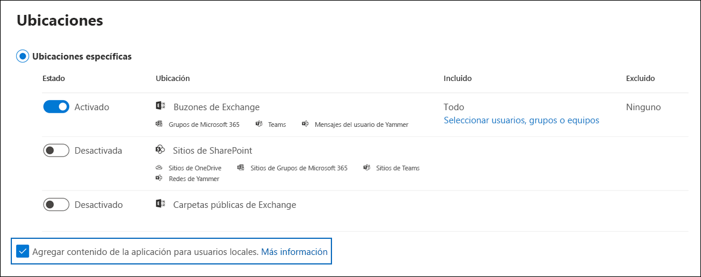

# <a name="search-for-teams-chat-data-for-on-premises-users"></a><span data-ttu-id="96b68-103">Buscar los datos de chat de Teams de usuarios locales</span><span class="sxs-lookup"><span data-stu-id="96b68-103">Search for Teams chat data for on-premises users</span></span>

<span data-ttu-id="96b68-104">Si su organización tiene una implementación híbrida de Exchange (o si su organización sincroniza una organización de Exchange local con Office 365) y ha habilitado Microsoft Teams, los usuarios locales pueden usar la aplicación de chat de Teams para su comunicación mediante mensajería instantánea.</span><span class="sxs-lookup"><span data-stu-id="96b68-104">If your organization has an Exchange hybrid deployment (or your organization synchronizes an on-premises Exchange organization with Office 365) and has enabled Microsoft Teams, on-premises users can use the Teams chat application for instant messaging.</span></span> <span data-ttu-id="96b68-105">Para un usuario basado en la nube, los datos del chat de Teams (también llamados *chats 1x1 o 1xN*) se guardan en su buzón principal basado en la nube.</span><span class="sxs-lookup"><span data-stu-id="96b68-105">For a cloud-based user, Teams chat data (also called *1x1 or 1xN chats*) is saved to their primary cloud-based mailbox.</span></span> <span data-ttu-id="96b68-106">Cuando un usuario local utiliza la aplicación de chat de Teams, sus mensajes de chat no se pueden almacenar en su buzón principal, el cual se encuentra en el entorno local.</span><span class="sxs-lookup"><span data-stu-id="96b68-106">When an on-premises user uses the Teams chat application, their chat messages can't be stored in their primary mailbox, which is located on-premises.</span></span> <span data-ttu-id="96b68-107">Para evitar esta limitación, Microsoft ha lanzado una nueva función que crea un área de almacenamiento basada en la nube, de tal manera que usted pueda usar las herramientas de eDiscovery para buscar y exportar los datos de chat de Teams de usuarios locales.</span><span class="sxs-lookup"><span data-stu-id="96b68-107">To get around this limitation, Microsoft has released a new feature where a cloud-based storage area is created so that you use eDiscovery tools to search for and export Teams chat data for on-premises users.</span></span>
  
<span data-ttu-id="96b68-108">A continuación, se presentan los requisitos y limitaciones para habilitar el almacenamiento basado en la nube para usuarios locales:</span><span class="sxs-lookup"><span data-stu-id="96b68-108">Here are the requirements and limitations for enabling cloud-based storage for on-premises users:</span></span>
  
- <span data-ttu-id="96b68-109">Las cuentas de usuario en su servicio de directorio local (como Active Directory) deben estar sincronizadas con Azure Active Directory, el servicio de directorio de Microsoft 365.</span><span class="sxs-lookup"><span data-stu-id="96b68-109">The user accounts in your on-premises directory service (such as Active Directory) must be synchronized with Azure Active Directory, the directory service in Microsoft 365.</span></span> <span data-ttu-id="96b68-110">Esto significa que se crea una cuenta de usuario de correo en Microsoft 365 y se asocia a un usuario cuyo buzón principal se encuentra en la organización local.</span><span class="sxs-lookup"><span data-stu-id="96b68-110">This means that a mail user account is created in Microsoft 365 and is associated with a user whose primary mailbox is located in the on-premises organization.</span></span>

- <span data-ttu-id="96b68-111">Al usuario cuyo buzón principal se encuentre en la organización local se le debe asignar una licencia de Microsoft Teams y un mínimo de una licencia de Exchange Online Plan 1.</span><span class="sxs-lookup"><span data-stu-id="96b68-111">The user whose primary mailbox is located in the on-premises organization must be assigned a Microsoft Teams license and a minimum of an Exchange Online Plan 1 license.</span></span>

- <span data-ttu-id="96b68-112">Si su organización no tiene una implementación híbrida de Exchange, debe sincronizar el esquema de Exchange local con Azure Active Directory.</span><span class="sxs-lookup"><span data-stu-id="96b68-112">If your organization doesn't have an Exchange hybrid deployment, you must synchronize your on-premises Exchange schema to Azure Active Directory.</span></span> <span data-ttu-id="96b68-113">En caso contrario, corre el riesgo de crear buzones duplicados basados en la nube en Exchange Online para aquellos usuarios que tengan un buzón en su organización de Exchange local.</span><span class="sxs-lookup"><span data-stu-id="96b68-113">If you don't do this, you might risk creating duplicate cloud-based mailboxes in Exchange Online for users that have a mailbox in your on-premises Exchange organization.</span></span>

- <span data-ttu-id="96b68-114">Solo los datos de chat de Teams asociados a un usuario local se almacenan en el área de almacenamiento basada en la nube.</span><span class="sxs-lookup"><span data-stu-id="96b68-114">Only the Teams chat data associated with an on-premises user is stored in the cloud-based storage area.</span></span> <span data-ttu-id="96b68-115">Un usuario local no puede acceder de ninguna manera a esta área de almacenamiento.</span><span class="sxs-lookup"><span data-stu-id="96b68-115">An on-premises user can't access this storage area in any way.</span></span>

> [!NOTE]
> <span data-ttu-id="96b68-116">Las conversaciones del canal de Teams siempre se almacenan en el buzón de correo en la nube asociado al equipo, por lo que puede buscar conversaciones del canal.</span><span class="sxs-lookup"><span data-stu-id="96b68-116">Teams channel conversations are always stored in the cloud-based mailbox that's associated with the Team, which means you can search for channel conversations.</span></span> <span data-ttu-id="96b68-117">Para obtener más información sobre la búsqueda de conversaciones en los canales de los equipos, consulte [Búsqueda Microsoft Teams y Grupos de Microsoft 365](content-search-reference.md#searching-microsoft-teams-and-microsoft-365-groups).</span><span class="sxs-lookup"><span data-stu-id="96b68-117">For more information about searching Teams channel conversations, see [Searching Microsoft Teams and Microsoft 365 Groups](content-search-reference.md#searching-microsoft-teams-and-microsoft-365-groups).</span></span>
  
## <a name="how-it-works"></a><span data-ttu-id="96b68-118">Cómo funciona</span><span class="sxs-lookup"><span data-stu-id="96b68-118">How it works</span></span>

<span data-ttu-id="96b68-119">Si un usuario habilitado para Microsoft Teams tiene un buzón en el entorno local y su cuenta de usuario o identidad se ha sincronizado en la nube, Microsoft crea un almacenamiento basado en la nube para asociarlo a los datos de chat 1xN de Teams del usuario local.</span><span class="sxs-lookup"><span data-stu-id="96b68-119">If a Microsoft Teams-enabled user has an on-premises mailbox and their user account/identity has been synched to the cloud, Microsoft creates cloud-based storage to associate the on-premises user's 1xN Teams chat data with.</span></span> <span data-ttu-id="96b68-120">Los datos de chat de Teams de los usuarios locales se indexan para la búsqueda.</span><span class="sxs-lookup"><span data-stu-id="96b68-120">Teams chat data for on-premises users is indexed for search.</span></span> <span data-ttu-id="96b68-121">Esto le permite utilizar la Búsqueda de contenido (y las búsquedas asociadas a los casos de Core eDiscovery y eDiscovery avanzado) para buscar, previsualizar y exportar los datos de chat de Teams de los usuarios locales.</span><span class="sxs-lookup"><span data-stu-id="96b68-121">This lets you Use Content search (and searches associated with Core eDiscovery and Advanced eDiscovery cases) to search, preview, and export Teams chat data for on-premises users.</span></span> <span data-ttu-id="96b68-122">También puede usar los cmdlets de **\*ComplianceSearch** en el PowerShell del Centro de cumplimiento y seguridad para buscar los datos de charts de Teams de usuarios locales.</span><span class="sxs-lookup"><span data-stu-id="96b68-122">You can also use **\*ComplianceSearch** cmdlets in the Security & Compliance Center PowerShell to search for Teams chat data for on-premises users.</span></span>
  
<span data-ttu-id="96b68-123">El siguiente gráfico muestra el flujo de trabajo de cómo los datos del chat de Teams para los usuarios locales están disponibles para buscar, previsualizar y exportar.</span><span class="sxs-lookup"><span data-stu-id="96b68-123">The following graphic shows the workflow of how Teams chat data for on-premises users is available to search, preview, and export.</span></span>
  

  
<span data-ttu-id="96b68-125">Además de esta nueva capacidad, también puede usar las herramientas de eDiscovery para buscar, previsualizar y exportar el contenido de Teams en el sitio SharePoint basado en la nube y el buzón de Exchange asociado con los datos de cada equipo de Microsoft y el chat de 1xN Teams en el buzón de Exchange Online para los usuarios basados en la nube.</span><span class="sxs-lookup"><span data-stu-id="96b68-125">In addition to this capability, you can also use eDiscovery tools to search, preview, and export Teams content in the cloud-based SharePoint site and Exchange mailbox associated with each Microsoft Team and 1xN Teams chat data in the Exchange Online mailbox for cloud-based users.</span></span>

### <a name="how-this-feature-is-supported-in-content-search-and-core-ediscovery-search-tools"></a><span data-ttu-id="96b68-126">¿Qué compatibilidad tiene esta característica en la Búsqueda de contenido y en las herramientas de búsqueda de Core eDiscovery?</span><span class="sxs-lookup"><span data-stu-id="96b68-126">How this feature is supported in Content search and Core eDiscovery search tools</span></span>

<span data-ttu-id="96b68-127">En los siguientes elementos de la interfaz de usuario en la Búsqueda de contenido y las herramientas de búsqueda de los casos de Core eDiscovery en el Centro de cumplimiento de Microsoft 365:</span><span class="sxs-lookup"><span data-stu-id="96b68-127">The following UI elements in Content search and in the search tool associated with Core eDiscovery cases in the Microsoft 365 compliance center:</span></span>
  
- <span data-ttu-id="96b68-128">La casilla **Agregar contenido de aplicación para usuarios locales** aparece en la página del asistente de **Ubicaciones** en la herramienta de búsqueda de contenido y está seleccionada de manera predeterminada.</span><span class="sxs-lookup"><span data-stu-id="96b68-128">The **Add app content for on-premises users** checkbox is displayed on the **Locations** wizard page in Content search tool and selected by default.</span></span> <span data-ttu-id="96b68-129">Mantenga seleccionada esta casilla para incluir el almacenamiento basado en la nube para los usuarios locales en una búsqueda de contenido.</span><span class="sxs-lookup"><span data-stu-id="96b68-129">Keep this checkbox selected to include the cloud-based storage for on-premises users in a content search.</span></span>

    
  
- <span data-ttu-id="96b68-131">Puede buscar usuarios locales cuando elija usuarios específicos que buscar.</span><span class="sxs-lookup"><span data-stu-id="96b68-131">You can search for on-premises users when you choose specific users to search for.</span></span>

## <a name="searching-for-teams-chat-content-for-on-premises-users"></a><span data-ttu-id="96b68-132">Buscar el contenido de chat de Teams de los usuarios locales</span><span class="sxs-lookup"><span data-stu-id="96b68-132">Searching for Teams chat content for on-premises users</span></span>

<span data-ttu-id="96b68-133">Aquí le explicamos cómo usar la Búsqueda de contenido en el Centro de cumplimiento de Microsoft 365 para buscar datos de chat de Teams para usuarios locales.</span><span class="sxs-lookup"><span data-stu-id="96b68-133">Here's how to use Content search in the Microsoft 365 compliance center to search for Teams chat data for on-premises users.</span></span>
  
1. <span data-ttu-id="96b68-134">En el Centro de cumplimiento de Microsoft 365, vaya a **Búsqueda de contenido**.</span><span class="sxs-lookup"><span data-stu-id="96b68-134">In the Microsoft 365 compliance center, go to **Content search**.</span></span>

2. <span data-ttu-id="96b68-135">En la pestaña **Búsquedas**, haga clic en **Nueva búsqueda** y asigne un nombre a la nueva búsqueda.</span><span class="sxs-lookup"><span data-stu-id="96b68-135">On the **Searches** tab, click **New search**, and name the new search.</span></span>

3. <span data-ttu-id="96b68-136">En la página **Ubicaciones**, establezca el botón de alternancia en **Activado** para los buzones de Exchange.</span><span class="sxs-lookup"><span data-stu-id="96b68-136">On the **Locations** page, set the toggle to **On** for Exchange mailboxes.</span></span> <span data-ttu-id="96b68-137">Observe que la casilla **Agregar contenido de aplicación para usuarios locales** se muestra y está activada de forma predeterminada.</span><span class="sxs-lookup"><span data-stu-id="96b68-137">Notice that the **Add app content for on-premises users** checkbox is displayed and selected by default.</span></span>

4. <span data-ttu-id="96b68-138">Para buscar contenido de Teams para usuarios específicos, seleccione **Elegir usuarios, grupos o equipos** y elija usuarios específicos para incluir en la búsqueda.</span><span class="sxs-lookup"><span data-stu-id="96b68-138">To search for Teams content for specific users, select **Choose user, groups, or teams** and choose specific users to include in the search.</span></span> <span data-ttu-id="96b68-139">En caso contrario, haga clic **Siguiente** para buscar contenido de Teams para todos los usuarios, incluidos los usuarios locales.</span><span class="sxs-lookup"><span data-stu-id="96b68-139">Otherwise, click **Next** to search for Teams content for all users, including  on-premises users</span></span>

5. <span data-ttu-id="96b68-140">En la página **Definir las condiciones de búsqueda**, cree una consulta de palabra clave y agregue condiciones a la consulta de búsqueda si es necesario.</span><span class="sxs-lookup"><span data-stu-id="96b68-140">On the **Define your search conditions** page, create a keyword query and add conditions to the search query if necessary.</span></span> <span data-ttu-id="96b68-141">Para buscar sólo los datos de los chats de Teams, puede añadir la siguiente consulta en el cuadro **Palabras clave**:</span><span class="sxs-lookup"><span data-stu-id="96b68-141">To only search for Team chats data, you can add the following query in the **Keywords** box:</span></span>

    ```text
    kind:im AND kind:microsoftteams
    ```

6. <span data-ttu-id="96b68-142">Envíe y ejecute la búsqueda.</span><span class="sxs-lookup"><span data-stu-id="96b68-142">Submit and run the search.</span></span> <span data-ttu-id="96b68-143">Se puede obtener una vista previa de cualquier resultado de la búsqueda de usuarios locales como de cualquier otro resultado de búsqueda.</span><span class="sxs-lookup"><span data-stu-id="96b68-143">Any search results for on-premises users can be previewed like any other search results.</span></span> <span data-ttu-id="96b68-144">También puede exportar los resultados de la búsqueda (incluyendo cualquier dato del chat de los equipos) a un archivo PST.</span><span class="sxs-lookup"><span data-stu-id="96b68-144">You can also export the search results (including any Teams chat data) to a PST file.</span></span> <span data-ttu-id="96b68-145">Para más información, consulte lo siguiente:</span><span class="sxs-lookup"><span data-stu-id="96b68-145">For more information, see:</span></span>

    - [<span data-ttu-id="96b68-146">Crear una búsqueda</span><span class="sxs-lookup"><span data-stu-id="96b68-146">Create a search</span></span>](content-search.md)

    - [<span data-ttu-id="96b68-147">Vista previa de los resultados de búsqueda</span><span class="sxs-lookup"><span data-stu-id="96b68-147">Preview search results</span></span>](preview-ediscovery-search-results.md)

    - [<span data-ttu-id="96b68-148">Exportar resultados de la búsqueda</span><span class="sxs-lookup"><span data-stu-id="96b68-148">Export search results</span></span>](export-search-results.md)

## <a name="using-powershell-to-search-for-teams-chat-data-for-on-premises-users"></a><span data-ttu-id="96b68-149">Usar PowerShell para buscar datos de chat de Teams de usuarios locales</span><span class="sxs-lookup"><span data-stu-id="96b68-149">Using PowerShell to search for Teams chat data for on-premises users</span></span>

<span data-ttu-id="96b68-150">Puede usar los cmdlets **New-ComplianceSearch** y **Set-ComplianceSearch** en el Centro de seguridad y cumplimiento de PowerShell para buscar los datos de chat de Teams de los usuarios locales.</span><span class="sxs-lookup"><span data-stu-id="96b68-150">You can use the **New-ComplianceSearch** and **Set-ComplianceSearch** cmdlets in the Security & Compliance Center PowerShell to search for Teams chat data for on-premises users.</span></span> <span data-ttu-id="96b68-151">Como se explicó anteriormente, no es necesario presentar una solicitud de soporte para utilizar PowerShell para buscar datos de chat de Teams para usuarios locales.</span><span class="sxs-lookup"><span data-stu-id="96b68-151">As previously explained, you don't have to submit a support request to use PowerShell to search for Teams chat data for on-premises users.</span></span>
  
1. <span data-ttu-id="96b68-152">[Conectarse a PowerShell del Centro de seguridad y cumplimiento](/powershell/exchange/connect-to-scc-powershell).</span><span class="sxs-lookup"><span data-stu-id="96b68-152">[Connect to Security & Compliance Center PowerShell](/powershell/exchange/connect-to-scc-powershell).</span></span>

2. <span data-ttu-id="96b68-153">Ejecute el siguiente comando de PowerShell para crear una búsqueda de contenido que busque datos de chat de Teams de usuarios locales.</span><span class="sxs-lookup"><span data-stu-id="96b68-153">Run the following PowerShell command to create a content search that searches for Teams chat data for on-premises users.</span></span>

    ```powershell
    New-ComplianceSearch <name of new search> -ContentMatchQuery <search query> -ExchangeLocation <on-premises user> -IncludeUserAppContent $true -AllowNotFoundExchangeLocationsEnabled $true  
    ```

    <span data-ttu-id="96b68-154">El parámetro *IncludeUserAppContent* se utiliza para especificar el almacenamiento basado en la nube del usuario o los usuarios que se especifican en el parámetro *ExchangeLocation*.</span><span class="sxs-lookup"><span data-stu-id="96b68-154">The *IncludeUserAppContent*  parameter is used to specify the cloud-based storage for the user or users who are specified by the  *ExchangeLocation*  parameter.</span></span> <span data-ttu-id="96b68-155">El parámetro *AllowNotFoundExchangeLocationsEnabled* permite buscar el almacenamiento basado en la nube de los usuarios locales.</span><span class="sxs-lookup"><span data-stu-id="96b68-155">The *AllowNotFoundExchangeLocationsEnabled*  allows you to search the cloud-based storage for on-premises users.</span></span> <span data-ttu-id="96b68-156">Cuando se utiliza el valor `$true` de este parámetro, la búsqueda no intenta validar la existencia del buzón antes de que se ejecute.</span><span class="sxs-lookup"><span data-stu-id="96b68-156">When you use the `$true` value for this parameter, the search doesn't try to validate the existence of the mailbox before it runs.</span></span> <span data-ttu-id="96b68-157">Esto es necesario para buscar el almacenamiento basado en la nube de los usuarios locales, ya que este almacenamiento basado en la nube no se resuelve como un buzón de correo basado en la nube.</span><span class="sxs-lookup"><span data-stu-id="96b68-157">This is required to search the cloud-based storage for on-premises users because this cloud-based storage doesn't resolve as a regular cloud-based mailbox.</span></span>

    <span data-ttu-id="96b68-158">El siguiente ejemplo busca los chats de Teams que contienen la palabra clave "redstone" en el almacenamiento basado en la nube de Sara Davis, quien es una usuaria local de la organización Contoso.</span><span class="sxs-lookup"><span data-stu-id="96b68-158">The following example searches for Teams chats that contain keyword "redstone" in the cloud-based storage for Sara Davis, who is an on-premises user in the Contoso organization.</span></span>
  
    ```powershell
    New-ComplianceSearch "Redstone_Search" -ContentMatchQuery "redstone AND (kind:im AND kind:microsoftteams)" -ExchangeLocation sarad@contoso.com -IncludeUserAppContent $true -AllowNotFoundExchangeLocationsEnabled $true  
    ```

   <span data-ttu-id="96b68-159">Después de crear una búsqueda, asegúrese de usar el cmdlet **Start-ComplianceSearch** para ejecutar la búsqueda.</span><span class="sxs-lookup"><span data-stu-id="96b68-159">After you create a search, be sure to use the **Start-ComplianceSearch** cmdlet to run the search.</span></span>
  
<span data-ttu-id="96b68-160">Para más información sobre el uso de estos cmdlets, consulte:</span><span class="sxs-lookup"><span data-stu-id="96b68-160">For more information using these cmdlets, see:</span></span>
  
- [<span data-ttu-id="96b68-161">New-ComplianceSearch</span><span class="sxs-lookup"><span data-stu-id="96b68-161">New-ComplianceSearch</span></span>](/powershell/module/exchange/new-compliancesearch)

- [<span data-ttu-id="96b68-162">Set-ComplianceSearch</span><span class="sxs-lookup"><span data-stu-id="96b68-162">Set-ComplianceSearch</span></span>](/powershell/module/exchange/set-compliancesearch)

- [<span data-ttu-id="96b68-163">Start-ComplianceSearch</span><span class="sxs-lookup"><span data-stu-id="96b68-163">Start-ComplianceSearch</span></span>](/powershell/module/exchange/start-compliancesearch)

## <a name="known-issues"></a><span data-ttu-id="96b68-164">Problemas conocidos</span><span class="sxs-lookup"><span data-stu-id="96b68-164">Known issues</span></span>

- <span data-ttu-id="96b68-165">Actualmente, puede buscar, previsualizar y exportar los datos de chat de Teams de usuarios locales.</span><span class="sxs-lookup"><span data-stu-id="96b68-165">Currently, you can search, preview, and export Teams chat data for on-premises users.</span></span> <span data-ttu-id="96b68-166">También puede poner en retención los datos de chat de Teams de usuarios locales asociados con un caso de Core eDiscovery o eDiscovery avanzado, y aplicar una directiva de retención para los chats o mensajes de canales de Teams de usuarios locales.</span><span class="sxs-lookup"><span data-stu-id="96b68-166">You can also place the Teams chat data for an on-premises user on a hold associated with a Core or Advanced eDiscovery case, and apply a retention policy for Teams chats or channel messages for on-premises users.</span></span> <span data-ttu-id="96b68-167">Sin embargo, en este momento, no se puede aplicar una directiva de retención para otras ubicaciones de contenido (como los buzones de Exchange y los sitios de SharePoint) para los usuarios locales.</span><span class="sxs-lookup"><span data-stu-id="96b68-167">However at this time, you can't apply a retention policy for other content locations (such as Exchange mailboxes and SharePoint sites) for on-premises users.</span></span>

## <a name="frequently-asked-questions"></a><span data-ttu-id="96b68-168">Preguntas frecuentes</span><span class="sxs-lookup"><span data-stu-id="96b68-168">Frequently asked questions</span></span>

<span data-ttu-id="96b68-169">**¿Tengo que enviar una solicitud de soporte para buscar mensajes de chat de usuarios locales?**</span><span class="sxs-lookup"><span data-stu-id="96b68-169">**Do I have to submit a support request to search for chat messages for on-premises users?**</span></span>

<span data-ttu-id="96b68-170">No.</span><span class="sxs-lookup"><span data-stu-id="96b68-170">No.</span></span> <span data-ttu-id="96b68-171">Esta característica está activada para todas las organizaciones.</span><span class="sxs-lookup"><span data-stu-id="96b68-171">This feature is enabled by default for all organizations.</span></span> <span data-ttu-id="96b68-172">En el pasado, hubiera tenido que ponerse en contacto con el Soporte técnico de Microsoft, pero ya no hace falta.</span><span class="sxs-lookup"><span data-stu-id="96b68-172">At one point, you did have to contact Microsoft Support but that is no longer the case.</span></span>
  
 <span data-ttu-id="96b68-173">**¿Pueden las herramientas de eDiscovery buscar datos de chat antiguos de Teams para usuarios locales antes de que esta característica se habilitara de forma predeterminada para todas las organizaciones?**</span><span class="sxs-lookup"><span data-stu-id="96b68-173">**Can eDiscovery tools find older Teams chat data for on-premises users before the time that this feature was enabled by default for all organizations?**</span></span>
  
<span data-ttu-id="96b68-p116">Microsoft comenzó a almacenar los datos de chat de Teams de los usuarios locales el 31 de enero de 2018. Por lo tanto, si la identidad de un usuario local de Teams se ha sincronizado entre su Active Directory local y Azure Active Directory en Microsoft 365 desde esta fecha, sus datos de chat de Teams se almacenarán en la nube y se podrán buscar con herramientas de eDiscovery.</span><span class="sxs-lookup"><span data-stu-id="96b68-p116">Microsoft started storing the Teams chat data for on-premises users on January 31, 2018. So, if the identity of an on-premises Teams user has been synched between you on-premises Active Directory and Azure Active Directory in Microsoft 365 since this date, then their Teams chat data is stored in the cloud and is searchable using eDiscovery tools.</span></span>

 <span data-ttu-id="96b68-176">**¿Los usuarios locales necesitan una licencia para almacenar sus datos de chat de Teams en la nube?**</span><span class="sxs-lookup"><span data-stu-id="96b68-176">**Do on-premises users need a license to store their Teams chat data in the cloud?**</span></span>
  
<span data-ttu-id="96b68-p117">Sí. Para que un usuario local pueda almacenar sus datos de chat de Teams en un almacenamiento basado en la nube, se debe asignar al usuario una licencia de Microsoft Teams y una licencia de un plan de Exchange Online en Office 365 (o Microsoft 365).</span><span class="sxs-lookup"><span data-stu-id="96b68-p117">Yes. To store Teams chat data for an on-premises user in a cloud-based storage, the user must be assigned a Microsoft Teams license and an Exchange Online Plan license in Office 365 (or Microsoft 365).</span></span>

<span data-ttu-id="96b68-179">**¿Dónde se ubica el almacenamiento en la nube de usuarios locales?**</span><span class="sxs-lookup"><span data-stu-id="96b68-179">**Where is the cloud-based storage for on-premises users located?**</span></span>
  
<span data-ttu-id="96b68-180">Los datos del chat de Teams se almacenan en la Ubicación de datos preferida (PDL) para un On-Premises User.</span><span class="sxs-lookup"><span data-stu-id="96b68-180">Teams chat data is stored in the Preferred Data Location (PDL) for an on-premises user.</span></span> <span data-ttu-id="96b68-181">La PDL respeta tanto los entornos Single-Geo y los Multi-Geo.</span><span class="sxs-lookup"><span data-stu-id="96b68-181">The PDL is honored in both Single-Geo and Multi-Geo environments.</span></span> <span data-ttu-id="96b68-182">Para más información, vea [Microsoft 365 Multi-Geo](../enterprise/microsoft-365-multi-geo.md).</span><span class="sxs-lookup"><span data-stu-id="96b68-182">For more information, see [Microsoft 365 Multi-Geo](../enterprise/microsoft-365-multi-geo.md).</span></span>

<span data-ttu-id="96b68-183">**¿Existe el riesgo de perder los datos del chat de los equipos si el buzón del usuario se migra a la nube?**</span><span class="sxs-lookup"><span data-stu-id="96b68-183">**Is there a risk of losing the Teams chat data if the user's on-premises mailbox is migrated to the cloud?**</span></span>
  
<span data-ttu-id="96b68-p119">No. Cuando migre el buzón principal de un usuario local a la nube, los datos de chat de Teams de ese usuario se migrarán a su nuevo buzón principal basado en la nube.</span><span class="sxs-lookup"><span data-stu-id="96b68-p119">No. When you migrate the primary mailbox of an on-premises user to the cloud, the Teams chat data for that user will be migrated to their new cloud-based primary mailbox.</span></span>
  
 <span data-ttu-id="96b68-186">**¿Puedo aplicar una retención de eDiscovery o las directivas de retención a los usuarios locales?**</span><span class="sxs-lookup"><span data-stu-id="96b68-186">**Can I apply an eDiscovery hold or retention policies to on-premises users?**</span></span>
  
<span data-ttu-id="96b68-187">Sí.</span><span class="sxs-lookup"><span data-stu-id="96b68-187">Yes.</span></span> <span data-ttu-id="96b68-188">Puede aplicar políticas de retención o retención de eDiscovery a los chats y mensajes de canales de los usuarios locales.</span><span class="sxs-lookup"><span data-stu-id="96b68-188">You can apply eDiscovery holds or retention policies for Teams chats and channel messages of on-premises users.</span></span> <span data-ttu-id="96b68-189">Sin embargo, para conservar el contenido de Teams para los usuarios locales, un usuario local debe tener asignada una licencia de Exchange Online Plan 2.</span><span class="sxs-lookup"><span data-stu-id="96b68-189">However, to preserve or retain Teams content for on-premises users, an on-premises user must be assigned an Exchange Online Plan 2 license.</span></span>
