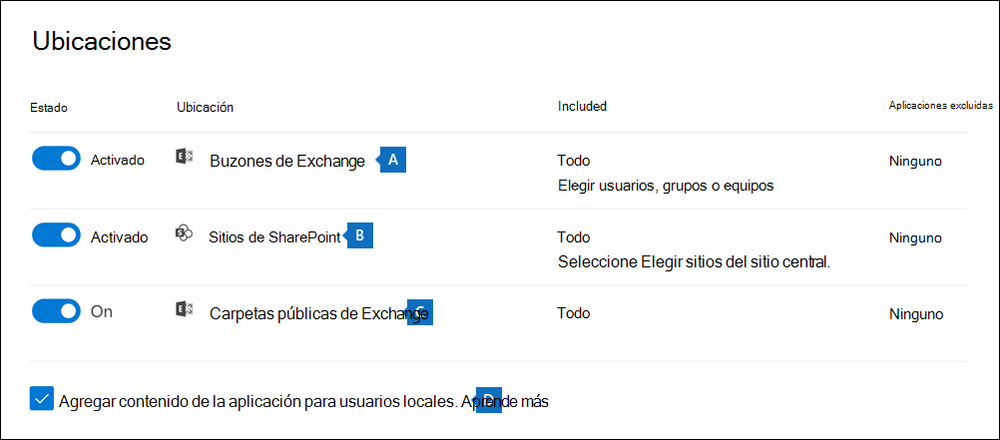
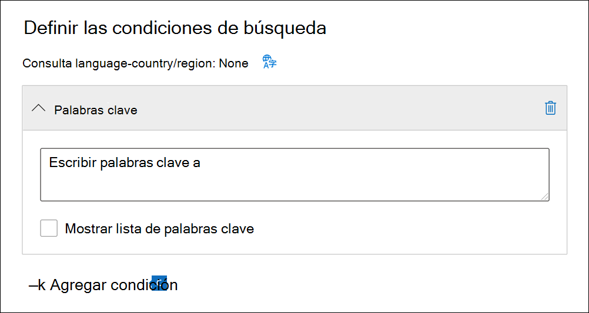

# Buscar contenido en un caso de exhibición de documentos electrónicos principal

Después de crear un caso de exhibición de documentos electrónicos principal y de que los interesados en el caso estén en espera, puede crear y ejecutar una o más búsquedas de contenido relevante para el caso. Las búsquedas asociadas con un caso de  exhibición de documentos electrónicos principales no aparecen en la página Búsqueda de contenido del centro de Microsoft 365 cumplimiento. Estas búsquedas se enumeran en la **página Búsquedas** del caso de exhibición de documentos electrónicos principales al que están asociadas las búsquedas. Esto también significa que los miembros del caso solo pueden acceder a las búsquedas asociadas a un caso.

Para crear una búsqueda de exhibición de documentos electrónicos principal:
  
1. Vaya a e inicie sesión con las credenciales de la cuenta de usuario a la que se han asignado los permisos de exhibición de documentos electrónicos adecuados y es miembro <https://compliance.microsoft.com> del caso.

2. En el panel de navegación izquierdo del centro de Microsoft 365 cumplimiento, haga clic en Mostrar todo **y,** a continuación, haga clic en **eDiscovery > Core**.

3. En la **página Exhibición de** documentos electrónicos principal, seleccione el caso en el que desea crear una búsqueda asociada y, a continuación, haga clic **en Abrir caso**.

4. En la **página principal** del caso, haga clic en la **pestaña Búsquedas** y, a continuación, haga clic **en Nueva búsqueda**.

   

   > [!NOTE]
   > La **opción Buscar por lista de** identificadores le permite buscar mensajes de correo electrónico específicos y otros elementos de buzón mediante una lista de Exchange identificadores. Para crear una búsqueda por lista de id., debe enviar un archivo CSV que identifique los elementos de buzón específicos que desee buscar. Para sabe cómo hacerlo, consulte [Preparar un archivo CSV para una búsqueda por lista de id.](csv-file-for-an-id-list-content-search.md)

5. En el **Asistente para nueva** búsqueda, escriba un nombre para la búsqueda y una descripción opcional que ayude a identificar la búsqueda. El nombre de la búsqueda debe ser único en la organización.

6. En la **página Ubicaciones,** elija las ubicaciones de contenido que desea buscar. Puede buscar buzones, sitios y carpetas públicas.

    
  
   1. **Exchange buzones** de correo: establece la alternancia en **Activar** y, a continuación, haz clic en Elegir **usuarios,** grupos o equipos para especificar los buzones que se colocarán en espera. Use el cuadro de búsqueda para buscar buzones de usuario y grupos de distribución (para colocar una retención en los buzones de los miembros del grupo) para colocar en espera. También puede buscar en el buzón asociado a un equipo de Microsoft (para mensajes de canal), Office 365 grupo y Yammer grupo. Para obtener más información acerca de los datos de la aplicación almacenados en buzones, vea Contenido almacenado en [buzones para eDiscovery](what-is-stored-in-exo-mailbox.md).

   2. **SharePoint:** establece la alternancia en **Activar**  y, a continuación, haz clic en Elegir sitios para especificar SharePoint sitios y OneDrive cuentas que se colocarán en espera. Escriba la dirección URL de cada sitio que quiere suspender. También puede agregar la dirección URL del sitio SharePoint para un grupo de Microsoft, Office 365 grupo o Yammer grupo.
  
   3. **Exchange carpetas públicas:** establece la alternancia en **Activar** para poner todas las carpetas públicas de la Exchange Online organización en espera. No puede elegir carpetas públicas específicas para poner en espera. Deje el botón de alternancia desactivado si no desea poner una retención en carpetas públicas.
  
   4. Mantenga esta casilla activada para buscar contenido Teams para los usuarios locales. Por ejemplo, si busca en todos los buzones de Exchange de la organización y esta casilla está activada, el almacenamiento basado en la nube que se usa para almacenar datos de chat Teams los usuarios locales se incluirá en el ámbito de la búsqueda. Para obtener más información, consulte [Buscar los datos de chat de Teams de usuarios locales](search-cloud-based-mailboxes-for-on-premises-users.md).

7. En la **página Definir las condiciones de búsqueda,** escriba una consulta de palabra clave y agregue condiciones a la consulta de búsqueda si es necesario.

   

   1. Especifique palabras clave, propiedades de mensaje, como fechas enviadas y recibidas, o propiedades de documento como nombres de archivo o la fecha en que se modificó por última vez un documento. También puede usar consultas más complejas con operadores booleanos como **Y**, **O**, **NOT** y **NEAR**. Si deja el cuadro de la palabra clave en blanco, todo el contenido en las ubicaciones especificadas se incluye en los resultados de la búsqueda. Para obtener más información, vea [Keyword queries and search conditions for eDiscovery](keyword-queries-and-search-conditions.md).

   2. También puede marcar la casilla **Mostrar lista de palabras clave** y escribir una palabra clave en cada fila. En este caso, las palabras clave de cada fila estarán conectadas por un operador lógico (**c:s**) funcionalmente similar al operador **O** en la consulta de búsqueda creada.

      ¿Por qué usar la lista de palabras clave? Puede obtener estadísticas que muestran cuántos elementos coinciden con cada palabra clave. Esto le ayudará a identificar rápidamente las palabras clave más (y menos) efectivas. También puede usar una frase de palabras clave (entre paréntesis) en una fila. Para obtener más información acerca de la lista de palabras clave y las estadísticas de búsqueda, vea [Get keyword statistics for searches](view-keyword-statistics-for-content-search.md#get-keyword-statistics-for-searches).

      > [!NOTE]
      > Para ayudar a reducir los problemas causados por listas de palabras clave grandes, estás limitado a un máximo de 20 filas en la lista de palabras clave.

   3. Puede agregar condiciones de búsqueda para restringir una búsqueda y devolver un conjunto de resultados más refinado. Cada condición agrega una cláusula a la consulta de búsqueda que se crea y se ejecuta cuando se inicia la búsqueda. Una condición se conecta lógicamente a la consulta de palabras clave (especificada en el cuadro de palabras clave) mediante el operador **c:c**, que tiene una función parecida al operador **Y**. Eso significa que los elementos tienen que satisfacer la consulta de palabra clave y una o más condiciones para que se incluyan en los resultados. De esta manera, las condiciones permiten restringir los resultados. Para obtener una lista y una descripción de las condiciones que puede usar en una consulta de búsqueda, consulte [Condiciones de búsqueda](keyword-queries-and-search-conditions.md#search-conditions).

8. Revise la configuración de búsqueda (y edite si es necesario) y, a continuación, envíe la búsqueda para iniciarla.

Una vez finalizada la búsqueda, puede obtener una vista previa de los resultados de la búsqueda. Si es necesario, haga **clic en Actualizar** en la página **Búsquedas** para mostrar la búsqueda que creó.

## Más información sobre la búsqueda de ubicaciones de contenido

- Al hacer clic **en Elegir usuarios, grupos** o equipos para especificar buzones de correo en los que buscar, el selector de buzones que se muestra está vacío. Esto se ha diseñado así para mejorar el rendimiento. Para agregar destinatarios a esta lista, haga clic en Elegir **usuarios,** grupos o equipos , escriba un nombre (un mínimo de tres caracteres) en el cuadro de búsqueda, active la casilla situada junto al nombre y, a continuación, haga clic en **Elegir**.

- Puede agregar buzones inactivos, Microsoft Teams, grupos de Yammer, grupos de Office 365 y grupos de distribución a la lista de buzones para buscar. No se admiten grupos de distribución dinámicos. Si agrega Microsoft Teams, Yammer grupos o grupos de Office 365, se busca en el buzón de grupo o equipo; los buzones de los miembros del grupo no se buscan.

- Para agregar sitios a la búsqueda, active la alternancia y, a continuación, haga clic **en Elegir sitios**. Escriba la dirección URL de cada sitio en el que desea buscar. También puede agregar la dirección URL del sitio SharePoint para un equipo de Microsoft, un grupo de Yammer o un grupo Office 365 grupo.
