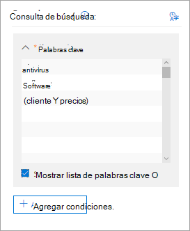
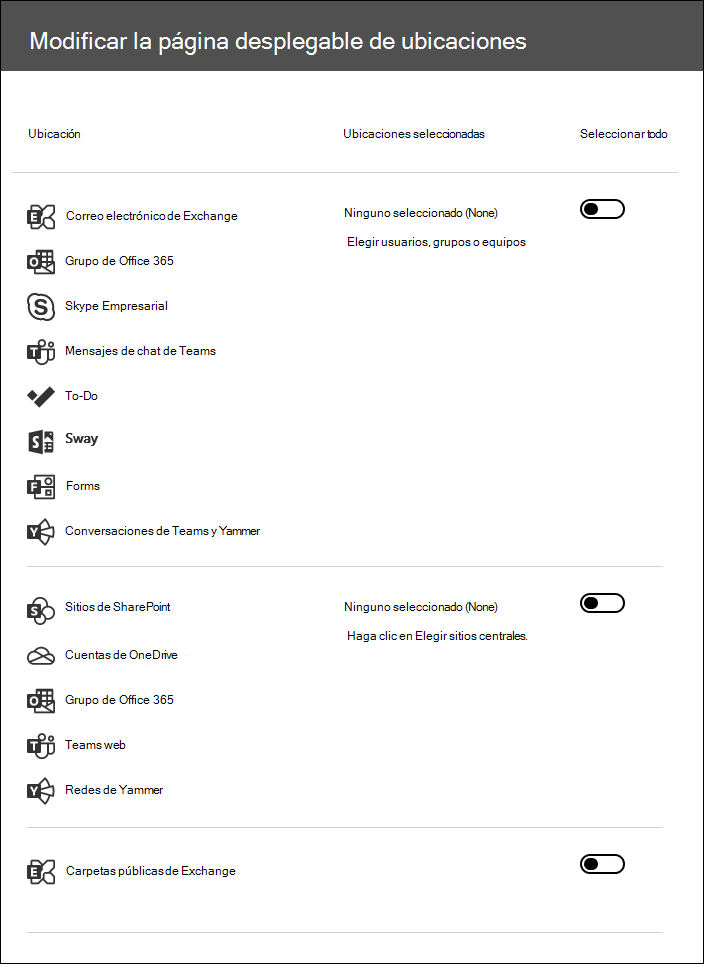

# Buscar contenido en un caso de exhibición de documentos electrónicos principalSearch for content in a Core eDiscovery case

Una vez que se crea un caso de exhibición de documentos electrónicos principal y se colocan en suspensión personas de interés en el caso, puede crear y ejecutar una o más búsquedas para el contenido relevante para el caso.After a Core eDiscovery case is created and people of interest in the case are placed on hold, you can create and run one or more searches for content relevant to the case. Las búsquedas asociadas a un caso de eDiscovery principal no aparecen en la página **búsqueda de contenido** en el centro de cumplimiento de Microsoft 365.Searches associated with a Core eDiscovery case aren't listed on the **Content search** page in the Microsoft 365 compliance center. Estas búsquedas se enumeran en la página **búsquedas** del núcleo eDiscover caso en el que se asocian las búsquedas.These searches are listed on the **Searches** page of the Core eDiscover case the searches are associated with. Esto también significa que solo se puede tener acceso a las búsquedas asociadas a un caso por los miembros de case.This also means that searches associated with a case can only be accessed by case members.

Para crear una búsqueda de exhibición de documentos electrónicos principal:To create a Core eDiscovery search:
  
1. Vaya a [https://compliance.microsoft.com](https://compliance.microsoft.com) e inicie sesión con las credenciales de la cuenta de usuario a la que se le han asignado los permisos de eDiscovery adecuados.Go to [https://compliance.microsoft.com](https://compliance.microsoft.com) and sign in using the credentials for user account that has been assigned the appropriate eDiscovery permissions.

2. En el panel de navegación izquierdo del centro de cumplimiento de Microsoft 365, haga clic en **Mostrar todos**y, a continuación, en **eDiscovery > Core**.In the left navigation pane of the Microsoft 365 compliance center, click **Show all**, and then click **eDiscovery > Core**.

3. En la página **principal de eDiscovery** , seleccione el caso en el que desea crear una búsqueda asociada y, a continuación, haga clic en **abrir caso**.On the **Core eDiscovery** page, select the case that you want to create an associated search, and then click **Open case**.

4. En la página **principal** del caso, haga clic en la ficha **búsquedas** .On the **Home** page for the case, click the **Searches** tab.
  
5. En la página **Buscar** , haga clic en **nueva búsqueda**.On the **Search** page, click **New search**.

6. En la página **Nueva búsqueda**, puede agregar palabras clave y condiciones para crear la consulta de búsqueda.On the **New search** page, you can add keywords and conditions to create the search query. 

    
  
   a.a. Puede especificar palabras clave, propiedades del mensaje, como las fechas de envío y recepción, o propiedades del documento, como nombres de archivo o la fecha en que se modificó por última vez un documento.You can specify keywords, message properties, such as sent and received dates, or document properties, such as file names or the date that a document was last changed. Puede usar consultas más complejas que usen un operador booleano, como **and**, **or**, **Not**, **Near**o **ONEAR**.You can use more complex queries that use a Boolean operator, such as **AND**, **OR**, **NOT**, **NEAR**, or **ONEAR**. Además, puede buscar información confidencial (como los números de la seguridad social) en documentos o buscar en documentos que se han compartido de forma externa.You can also search for sensitive information (such as social security numbers) in documents, or search for documents that have been shared externally. Si deja vacío el cuadro palabra clave, todo el contenido ubicado en las ubicaciones de contenido especificadas se incluirá en los resultados de la búsqueda.If you leave the keyword box empty, all content located in the specified content locations will be included in the search results.

   b.b. Puede hacer clic en la casilla **Mostrar lista de palabras clave** y escribir una palabra clave en cada fila.You can click the **Show keyword list** check box and the type a keyword in each row. Si hace esto, las palabras clave de cada fila están conectadas mediante el operador **or** en la consulta de búsqueda que se crea.If you do this, the keywords on each row are connected by the **OR** operator in the search query that's created. Puede escribir un máximo de 20 palabras clave en la lista.You can enter a maximum of 20 keywords to the list.

    
  
    ¿Por qué usar la lista de palabras clave?Why use the keyword list? Puede obtener estadísticas que muestran cuántos elementos coinciden con cada palabra clave.You can get statistics that show how many items match each keyword. Esto le ayudará a identificar rápidamente las palabras clave más (y menos) efectivas.This can help you quickly identify which keywords are the most (and least) effective. También puede usar una frase de palabras clave (entre paréntesis) en una fila.You can also use a keyword phrase (surrounded by parentheses) in a row. Para saber más sobre las estadísticas de búsqueda, consulte [Ver estadísticas de palabras clave para resultados de búsqueda de contenido](view-keyword-statistics-for-content-search.md).For more information about search statistics, see [View keyword statistics for Content Search results](view-keyword-statistics-for-content-search.md).

    Para obtener más información acerca del uso de la lista de palabras clave, vea [Building a Search Query](content-search.md#building-a-search-query).For more information about using the keywords list, see [Building a search query](content-search.md#building-a-search-query).

   c.c. Puede hacer clic en **condiciones** y agregar condiciones en una consulta de búsqueda para restringir una búsqueda y devolver un conjunto de resultados más refinado.You can click **Conditions** and add conditions to a search query to narrow a search and return a more refined set of results. Con cada condición, se agrega una cláusula a la consulta de búsqueda KQL que se crea y se ejecuta al iniciar la búsqueda.Each condition adds a clause to the KQL search query that is created and run when you start the search. Una condición está conectada de forma lógica con la consulta por palabra clave (especificada en el cuadro de palabra clave) mediante el operador **AND**.A condition is logically connected to the keyword query (specified in the keyword box) by the **AND** operator. Esto significa que los elementos deben cumplir con la consulta de palabras clave y cada condición que se va a incluir en los resultados.That means that items have to satisfy both the keyword query and each condition to be included in the results. De esta manera, las condiciones permiten restringir los resultados.This is how conditions help to narrow your results.

    Para obtener más información sobre cómo crear una consulta de búsqueda y el uso de las condiciones, consulte [Keyword queries for Content Search](keyword-queries-and-search-conditions.md).For more information about creating a search query and using conditions, see [Keyword queries for Content Search](keyword-queries-and-search-conditions.md).

7. En **ubicaciones: ubicaciones en espera**, elija las ubicaciones de contenido en las que desea realizar la búsqueda.Under **Locations: locations on hold**, choose the content locations that you want to search. Puede buscar buzones de correo, sitios y carpetas públicas en la misma búsqueda.You can search mailboxes, sites, and public folders in the same search.

    
  
    - **Todas las ubicaciones**.**All locations**. Seleccione esta opción para buscar en todas las ubicaciones de contenido de la organización.Select this option to search all content locations in your organization. Si selecciona esta opción, puede elegir buscar todos los buzones de Exchange (que incluye los buzones de todos los grupos de Microsoft Teams, Yammer y Office 365), todos los sitios de SharePoint y OneDrive para la empresa (que incluye los sitios de todos los grupos de Microsoft Teams, Yammer y Office 365) y todas las carpetas públicas.When you select this option, you can choose to search all Exchange mailboxes (which includes the mailboxes for all Microsoft Teams, Yammer Groups, and Office 365 Groups), all SharePoint and OneDrive for Business sites (which includes the sites for all Microsoft Teams, Yammer Groups, and Office 365 Groups), and all public folders.
    
    - **Todas las ubicaciones en espera**.**All locations on hold**. Seleccione esta opción para buscar en todas las ubicaciones de contenido que se han colocado en la suspensión de exhibición de documentos electrónicos en el caso.Select this option to search all the content locations that have been placed on eDiscovery hold in the case. Si el caso contiene varias suspensiones, se buscará en las ubicaciones de contenido de todas las suspensiones.If the case contains multiple holds, the content locations from all holds will be searched. Además, si se colocó una ubicación de contenido en una suspensión basada en consulta, solo se buscará en los elementos que están en espera cuando ejecute la búsqueda de contenido que está creando en este paso.Additionally, if a content location was placed on a query-based hold, only the items that are on hold will be searched when you run the content search that you're creating in this step. Por ejemplo, si un usuario se colocó en la suspensión de casos basada en consultas y conserva los elementos que se enviaron o se crearon antes de una fecha específica, sólo se buscará en esos elementos.For example, if a user was placed on query-based case hold that preserves items that were sent or created before a specific date, only those items would be searched. Esto se logra conectando la consulta de suspensión de casos y la consulta de búsqueda de contenido por un operador **and** .This is accomplished by connecting the case hold query and the content search query by an **AND** operator. Para obtener más información, vea [ubicaciones de búsqueda en la retención de exhibición de](create-ediscovery-holds.md#search-locations-on-ediscovery-hold)documentos electrónicos.For more information, see [Search locations on eDiscovery hold](create-ediscovery-holds.md#search-locations-on-ediscovery-hold).
    
    - **Ubicaciones específicas**.**Specific locations**. Seleccione esta opción para seleccionar los buzones y sitios en los que desea buscar.Select this option to select the mailboxes and sites that you want to search. Cuando seleccione esta opción y haga clic en **modificar**, aparecerá una lista de ubicaciones.When you select this option and click **Modify**, a list of locations appears. Puede elegir buscar en cualquiera o todos los usuarios, grupos, equipos o ubicaciones de sitio.You can choose to search any or all users, groups, teams, or site locations. También puede buscar en las carpetas públicas de su organización.You can also search the public folders in your organization.
    
      
  
     Si selecciona esta opción y busca en cualquier ubicación de contenido que esté en espera, las consultas de una suspensión de casos basada en consultas no se aplicarán a la consulta de búsqueda.If you select this option and search any content location that's on hold, any query from a query-based case hold won't be applied to the search query. En otras palabras, se busca en todo el contenido, no solo en el contenido que conserva una retención de casos basada en la consulta.In other words, all content is searched, not just the content that's preserved by a query-based case hold.

8. Una vez seleccionadas las ubicaciones de contenido para buscar, haga clic en **listo** y, a continuación, en **Guardar**.After you select the content locations to search, click **Done** and then click **Save**.

9. En la página **nueva búsqueda** , haga clic en **Guardar & ejecutar** y, a continuación, escriba un nombre para la búsqueda.On the **New search** page, click **Save & run** and then type a name for the search. Las búsquedas asociadas a un caso de eDiscovery principal deben tener nombres únicos en la organización de Office 365.Searches associated with a Core eDiscovery case must have names that are unique within your Office 365 organization.

10. Haga clic en **Guardar** para guardar la configuración de la búsqueda e iniciar la búsqueda.Click **Save** to save the search settings and start the search.

  Una vez finalizada la búsqueda, puede obtener una vista previa de los resultados de la búsqueda.After the search is completed, you can preview the search results. Si es necesario, haga clic en **Actualizar** en la página **búsquedas** para mostrar la búsqueda que ha creado en la lista.If necessary, click **Refresh** on the **Searches** page to display the search you created in the list.

11. Haga clic en la búsqueda para mostrar la página de flotante, que contiene estadísticas sobre la búsqueda y realizar otras tareas, como ver estadísticas de búsqueda y exportar los resultados de la búsqueda.Click the search to display the flyout page, which contains statistics about the search and to perform other tasks such as viewing search statistics and exporting the search results.

## Más información sobre la búsqueda de ubicaciones de contenidoMore information about searching content locations

- Al hacer clic en **elegir usuarios, grupos o equipos** para especificar los buzones en los que se va a buscar, el selector de buzones que se muestra está vacío.When you click **Choose users, groups, or teams** to specify mailboxes to search, the mailbox picker that's displayed is empty. Esto se ha diseñado así para mejorar el rendimiento.This is by design to enhance performance. Para agregar destinatarios a esta lista, haga clic en **elegir usuarios, grupos o equipos**, escriba un nombre (un mínimo de 3 caracteres) en el cuadro de búsqueda, active la casilla de verificación situada junto al nombre y, a continuación, haga clic en **elegir**.To add recipients to this list, click **Choose users, groups, or teams**, type a name (a minimum of 3 characters) in the search box, select the check box next to the name, and then click **Choose**.

- Puede Agregar buzones inactivos, Microsoft Teams, grupos de Yammer, grupos de Office 365 y grupos de distribución a la lista de buzones de correo para la búsqueda.You can add inactive mailboxes, Microsoft Teams, Yammer Groups, Office 365 Groups, and distribution groups to the list of mailboxes to search. No se admiten grupos de distribución dinámicos.Dynamic distribution groups aren't supported. Si agrega Microsoft Teams, grupos de Yammer o grupos de Office 365, se busca en el buzón de grupo o de equipo; no se busca en los buzones de los miembros del grupo.If you add Microsoft Teams, Yammer Groups, or Office 365 Groups, the group or team mailbox is searched; the mailboxes of the group members aren't searched.

- Para agregar sitios, haga clic en **elegir sitios**, haga clic en **elegir sitios** de nuevo y, a continuación, escriba la dirección URL de cada sitio que desee buscar.To add sites click **Choose sites**, click **Choose sites** again, and then type the URL for each site that you want to search. También puede Agregar la dirección URL del sitio de SharePoint para un equipo de Microsoft, un grupo de Yammer o un grupo de Office 365.You can also add the URL for the SharePoint site for a Microsoft Team, a Yammer Group, or an Office 365 Group.
