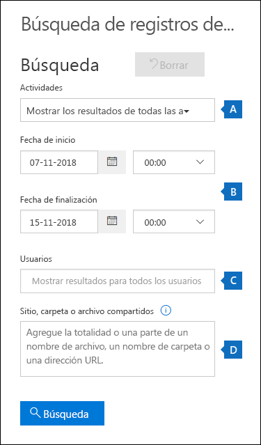
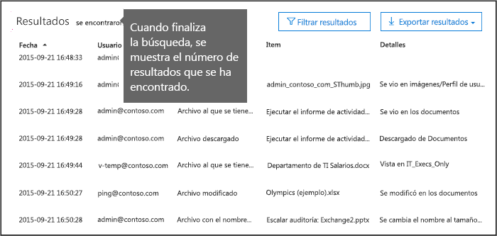
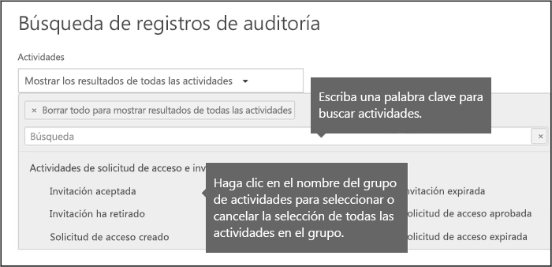
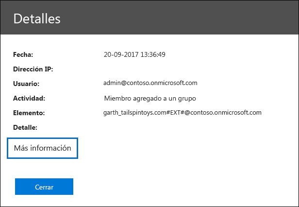
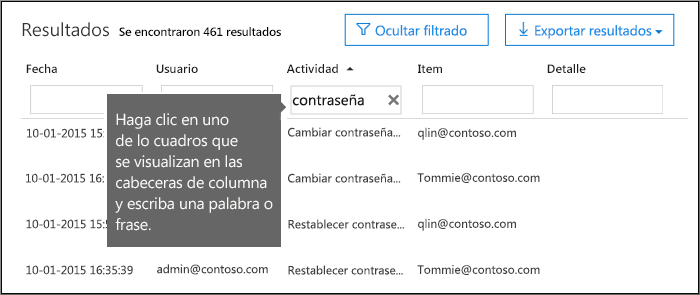
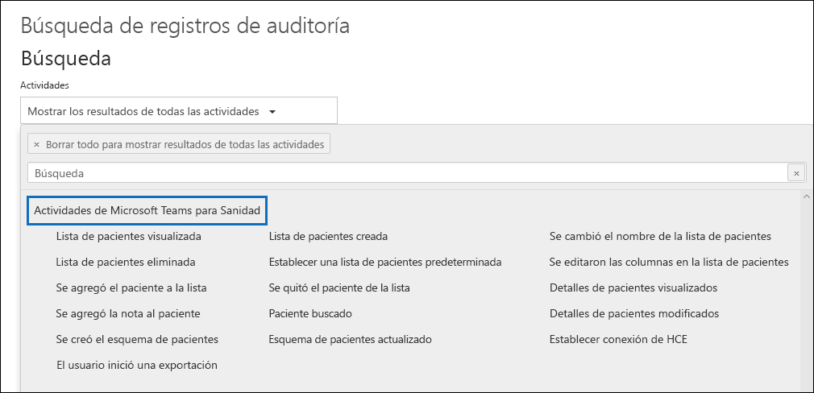
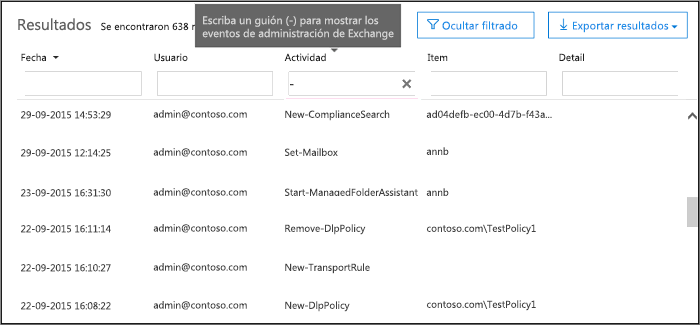

# <a name="search-the-audit-log-in-the-compliance-center"></a>Buscar el registro de auditoría en el centro de cumplimiento

¿Necesita averiguar si un usuario ha visto un documento determinado o si ha purgado un elemento de su buzón? Si es así, puede usar el centro de cumplimiento de Microsoft 365 para buscar en el registro de auditoría unificado para ver la actividad de usuarios y administradores en su organización. ¿Por qué un registro de auditoría unificado? Porque puede buscar los siguientes tipos de [Actividades administrativas y de usuario](#audited-activities) en Microsoft 365:

- Actividad de usuario en SharePoint Online y OneDrive para Empresas

- Actividad del usuario en Exchange en línea (registro de auditoría del buzón de Exchange)

- Actividad de administración en SharePoint en línea

- Actividad de administrador en Azure Active Directory (el servicio de directorio para Microsoft 365)

- Actividad de administración en Exchange en línea (registro de auditoría de administración de Exchange)

- Actividades de eDiscovery en el Centro de seguridad y cumplimiento

- Actividad de usuario y administrador en Power BI

- Actividad de usuario y administrador en Microsoft Teams

- Actividad de usuario y administrador en Dynamics 365

- Actividad de usuario y administrador en Yammer

- Actividad de usuario y administrador en Microsoft Power Automate

- Actividad de usuario y administrador en Microsoft Stream

- Actividad de analista y administrador en Microsoft Workplace Analytics

- Actividad de usuario y administrador en Microsoft Power Apps

- Actividad de usuario y administrador en Microsoft Forms

- Actividad de administrador y usuario para las etiquetas de confidencialidad de los sitios que usan SharePoint Online o Microsoft Teams

## <a name="requirements-to-search-the-audit-log"></a>Requisitos para realizar búsquedas en el registro de auditoría

Lea los elementos siguientes antes de iniciar la búsqueda en el registro de auditoría.

- Usted (u otro administrador) debe activar primero el registro de auditoría para poder empezar a buscar en el registro de auditoría. Para activarlo, haga clic en **Iniciar auditoría** en la página **Búsqueda de registros de auditoría** del Centro de seguridad y cumplimiento. (SI usted no ve este link, la auditoría ya se habrá activado para su organización) Después de que lo active, se muestra un mensaje que dice que el registro de auditoría se está preparando y que puede ejecutar una búsqueda en un par de horas después de que se complete la preparación. Solo tiene que hacer esto una vez. Para obtener más información, consulte [ Desactivar o activar la búsqueda de registros de auditoría ](turn-audit-log-search-on-or-off.md).

  > [!NOTE]
  > Estamos en el proceso de activar la auditoría de forma predeterminada. Hasta entonces, puede activarla como se describió anteriormente.

- Usted debe tener asignado el rol de Registros de auditoría o Registros de auditoría de solo lectura en Exchange Online para buscar en el registro de auditoría. De forma predeterminada, estos roles se asignan a los grupos de roles de Administración de la organización y Administración de cumplimiento en la página de **permisos** del centro de administración de Exchange. Tenga en cuenta que los administradores globales de Office 365 y Microsoft 365 pasan automáticamente a ser miembros del grupo de roles de Administración de la organización en el servicio de Exchange Online. Para darle a un usuario la capacidad de buscar en el registro de auditoría con el mínimo nivel de privilegios, puede crear un grupo de roles personalizado en Exchange Online, agregar el rol de Registros de auditoría o Registros de auditoría de solo lectura y, después, agregar el usuario como miembro del nuevo grupo de roles. Para obtener más información, consulte[Administrar grupos de roles en Exchange en línea](https://go.microsoft.com/fwlink/p/?LinkID=730688).

  > [!IMPORTANT]
  > Si asigna a un usuario el rol de Registros de auditoría o Registros de auditoría de solo lectura en la página de **permisos** del Centro de seguridad y cumplimiento, no podrán buscar en el registro de auditoría. Tiene que asignar los permisos en Exchange en línea. Esto se debe a que el cmdlet subyacente que se usa para buscar en el registro de auditoría es un cmdlet Exchange en línea.

- Cuando un usuario o administrador realiza una actividad auditada, se genera un registro de auditoría y se almacena en el registro de auditoría de la organización. La cantidad de tiempo que se retiene un registro de auditoría (y que se puede buscar en el registro de auditoría) depende de la suscripción a Office 365 o Microsoft 365 Enterprise y, específicamente, del tipo de licencia que se ha asignado a usuarios específicos.

  - En el caso de los usuarios que tienen asignada una licencia de Office 365 E5 o Microsoft 365 E5 (o usuarios con una licencia de complemento de Cumplimiento de Microsoft 365 E5 o de eDiscovery y auditoría de Microsoft 365 E5), los registros de auditoría de Azure Active Directory, Exchange y la actividad de SharePoint se conservan durante un año de forma predeterminada. Las organizaciones también pueden crear directivas de retención de registros de auditoría para conservar registros de auditoría de actividades en otros servicios durante un año. Para obtener más información, vea [administrar directivas de retención de los registros de auditoría](audit-log-retention-policies.md).

    > [!NOTE]
    > Si su organización ha participado en el programa de vista previa privado para la retención de registros de auditoría de un año, la duración de la retención de los registros de auditoría que se generaron antes de la fecha de lanzamiento de disponibilidad general no se restablecerá.

  - Para los usuarios que tengan asignadas otras licencias de Office 365 o Microsoft 365 (que no sean E5), los registros de auditoría se conservarán durante 90 días. Para obtener una lista de las suscripciones de Office 365 y Microsoft 365 que admiten el registro de auditoría unificado, consulte [la descripción del servicio del centro de seguridad y cumplimiento](https://docs.microsoft.com/office365/servicedescriptions/office-365-platform-service-description/office-365-securitycompliance-center).

    > [!NOTE]
    > Incluso si la auditoría de buzón está activada de forma predeterminada, es posible que los eventos de auditoría del buzón de algunos usuarios no se encuentren en búsquedas de registro de auditoría en el Centro de seguridad y cumplimiento a través de la API de Actividad de administración de Office 365. Para obtener más información, vea [Más información sobre el registro de auditoría del buzón de correo](enable-mailbox-auditing.md#more-information).

- Si desea desactivar la búsqueda en el registro de auditoría de su organización, puede ejecutar el comando siguiente en el PowerShell remoto conectado a su organización de Exchange Online:

  ```powershell
  Set-AdminAuditLogConfig -UnifiedAuditLogIngestionEnabled $false
  ```

    Para volver a activar la búsqueda de auditoría, puede ejecutar el comando siguiente en PowerShell de Exchange en línea :

  ```powershell
  Set-AdminAuditLogConfig -UnifiedAuditLogIngestionEnabled $true
  ```

  Para obtener más información, consulte[Desactivar la búsqueda de registros de auditoría](turn-audit-log-search-on-or-off.md).

- Como se indicó anteriormente, el cmdlet subyacente que se ha usado para buscar en el registro de auditoría es un cmdlet de Exchange en línea, que es **Search-UnifiedAuditLog**. Eso significa que puede usar este cmdlet para buscar en el registro de auditoría en lugar de usar la página de **Búsqueda de registros de auditoría** del Centro de seguridad y cumplimiento. Tiene que ejecutar este cmdlet en el PowerShell remoto conectado a su organización de Exchange en línea. Para obtener más información, consulte[Search-UnifiedAuditLog](https://go.microsoft.com/fwlink/p/?linkid=834776).

  Para obtener información sobre cómo exportar los resultados de búsqueda devueltos por el cmdlet **Search-UnifiedAuditLog** a un archivo CSV, consulte la sección "sugerencias para exportar y ver el registro de auditoría" [exportar, configurar y ver el registro de auditoría registros](export-view-audit-log-records.md#tips-for-exporting-and-viewing-the-audit-log).

- Si desea descargar mediante programación los datos del registro de auditoría, le recomendamos que use la API de Actividad de administración de Office 365 en lugar de usar un script de PowerShell. La API de Actividad de administración de Office 365 es un servicio REST de la web que puede usar para desarrollar operaciones, soluciones de supervisión de seguridad y cumplimiento para su organización. Para obtener más información, consulte[la referencia de la API de Actividad de administración de Office 365](https://docs.microsoft.com/office/office-365-management-api/office-365-management-activity-api-reference).

- El registro de auditoría correspondiente puede tardar hasta 30 minutos o 24 horas después de que se produzca el evento en mostrarse en los resultados de una búsqueda de registro de auditoría. En la siguiente tabla, se muestra el tiempo que tarda para los distintos servicios en Office 365..

  |Característica o servicio de Microsoft 365|30 minutos|24 horas|
  |:-----|:-----:|:-----:|
  |Microsoft Defender para Office 365 e Inteligencia sobre amenazas|||
  |Azure Active Directory (eventos de inicio de sesión de usuario)|||
  |Azure Active Directory (eventos administrativos)|||
  |Prevención de pérdida de datos|||
  |Dynamics 365 CRM|||
  |eDiscovery|||
  |Exchange en línea|||
  |Microsoft Power Automate|||
  |Microsoft Project|||
  |Microsoft Stream|||
  |Microsoft Teams|||
  |PowerApps|||
  |Power BI|||
  |Centro de seguridad y cumplimiento|||
  |Etiquetas de confidencialidad|||
  |SharePoint en línea y OneDrive para Empresas|||
  |Workplace Analytics|||
  |Yammer||||
  |Microsoft Forms||
  ||||

- Azure Active Directory (AD) es el servicio de directorio para Office 365. El registro de auditoría unificado contiene actividades de usuario, dominio, aplicación, grupo y de directorio que se han realizado en el Centro de administración de Microsoft 365 o en el Portal de administración de Azure. Para obtener una lista completa de los eventos de Azure AD, consulte[Eventos del informe de auditoría de Azure Active Directory](https://go.microsoft.com/fwlink/p/?LinkID=616549).

- El registro de auditoría de Power BI no está habilitado de forma predeterminada. Para buscar actividades de Power BI en el registro de auditoría, debe habilitar la auditoría en el portal de administración de Power BI. Para obtener instrucciones, consulte la sección "registros de auditoría"[en el portal de administración de Power BI](https://docs.microsoft.com/power-bi/service-admin-portal#audit-logs).

## <a name="search-the-audit-log"></a>Búsquedas en el registro de auditoría

> [!NOTE]
> Hubo un problema con las actividades de Azure AD que no están disponibles en la herramienta de búsqueda de registros de auditoría desde el 22 de octubre de 2020 hasta el 6 de noviembre de 2020. Entre estas actividades, se incluyen las actividades de administración de usuarios de Azure AD, las actividades de administración de grupos, las actividades de administración de aplicaciones, las actividades de administración de roles y las actividades de administración de directorios. Los eventos que faltan para el período de impacto estarán disponibles en los próximos días, y está previsto que se completen a más tardar el 20 de noviembre de 2020. En algunos casos, los clientes podrían notar la duplicación de datos de eventos para eventos generados entre el 26 de octubre, el 2020 y el 05 de noviembre de 2020.
    
Aquí se muestra el proceso para buscar el registro de auditoría en Office 365.

[Paso 1: Ejecute una búsqueda de registros de auditoría](#step-1-run-an-audit-log-search)

[Paso 2: Vea los resultados de la búsqueda](#step-2-view-the-search-results)

[Paso 3: Filtre los resultados de la búsqueda](#step-3-filter-the-search-results)

[Paso 4: Exportar los resultados de búsqueda a un archivo](#step-4-export-the-search-results-to-a-file)

### <a name="step-1-run-an-audit-log-search"></a>Paso 1: Ejecute una búsqueda de registros de auditoría

1. Vaya a [https://protection.office.com](https://protection.office.com).

    > [!TIP]
    > Use una sesión de exploración privada (no una sesión normal) para obtener acceso al centro de seguridad y cumplimiento, ya que esto evitará que las credenciales con las que inició sesión actualmente sean usadas. Para abrir una ventana de Exploración de InPrivate en Internet Explorer o en Microsoft Edge, pulse las teclas CTRL+SHIFT+P. Para abrir una sesión de explorador privada en Google Chrome (denominada ventana de incógnito), presione CTRL+MAYÚS+N.

2. Inicie sesión con su cuenta profesional o educativa.

3. En el panel izquierdo del Centro de seguridad y cumplimiento, haga clic en **buscar**, y luego haga clic en **buscar el registro de auditoría**.

    La página del **registro de auditoría de búsqueda** será mostrada.

    

    > [!NOTE]
    > Primeramente tiene que activar el registro de auditoría antes de que pueda ejecutar una búsqueda de registros de auditoría. Si se muestra el vínculo **Iniciar el registro de la actividad administrativa y de usuario**, haga clic en él para activar la auditoría. Si no ve este vínculo, la auditoría ya se ha activado para la organización.

4. Configurar los siguientes criterios de búsqueda: 

   1. **Actividades**: haga clic en la lista desplegable para mostrar las actividades que puede buscar. Las actividades administrativas y de usuario se organizan en grupos de actividades relacionadas. Puede seleccionar actividades específicas o puede hacer clic en el nombre del grupo de actividades para seleccionar todas las actividades del grupo. También puede hacer clic en una actividad seleccionada para borrar la selección. Después de que ejecute la búsqueda, solo se muestran las entradas seleccionadas del registro de auditoría de las actividades. Al seleccionar **Mostrar los resultados de todas las actividades**, se mostrarán los resultados de todas las actividades que el usuario o el grupo de usuarios seleccionado ha realizado.

      Se registran más de 100 actividades de usuario y de administrador en el registro de auditoría. Haga clic en la pestaña de **Actividades auditadas** en el tema de este artículo para ver las descripciones de todas las actividades en cada uno de los diferentes servicios.

   1. **Fecha de inicio** y **Fecha de finalización**: los últimos siete días se seleccionan de manera predeterminada. Seleccione un intervalo de fecha y hora para mostrar los eventos que han sucedido en ese período. La fecha y la hora se presentan en formato de Hora universal coordinada (UTC). El intervalo máximo de fecha que puede especificar es 90 días. Se muestra un error si el intervalo de fecha seleccionado es superior a 90 días.

      > [!TIP]
      > Si está usando el intervalo de fecha máximo de 90 días, seleccione la hora actual para la **Fecha de inicio**. De otro modo, recibirá un error que dice que la fecha de inicio es anterior a la fecha de finalización. Si ha activado la auditoría en los últimos 90 días, el intervalo máximo de fecha no puede comenzar antes de la fecha en la que se ha activado la auditoría.

   1. **Usuarios**: haga clic en este cuadro y, luego, seleccione uno o más usuarios para mostrarles los resultados de búsqueda. Las entradas del registro de auditoría de la actividad seleccionada realizada por los usuarios que selecciona en este cuadro, se muestran en la lista de resultados. Deje este cuadro en blanco para devolver las entradas de todos los usuarios (y cuentas de servicio) de su organización.

   1. **Archivo, carpeta o sitio**: escriba algunos o todos los nombres de carpeta o de archivo para buscar las actividades relacionadas con el archivo de la carpeta que contengan la palabra clave especifica. También puede especificar una dirección URL de un archivo o carpeta. Si usa una dirección URL, asegúrese de escribir la dirección URL completa, o si escribe solo una parte de esta, de no incluir espacios ni caracteres especiales.

      Deje este cuadro en blanco para devolver las entradas de todos los archivos y carpetas de la organización.

      > [!TIP]
      >
      > - Si busca todas las actividades relacionadas con un **sitio**, añada el símbolo comodín (\*) detrás de la dirección URL para devolver todas las entradas para ese sitio; por ejemplo, `"https://contoso-my.sharepoint.com/personal*"`.
      >
      > - Si está buscando todas las actividades relacionadas con un **archivo**, agregue el símbolo comodín (\*) antes del nombre de archivo para devolver todas las entradas para ese archivo; por ejemplo,`"*Customer_Profitability_Sample.csv"`.

5. Haga clic en **Búsqueda** para ejecutar la búsqueda mediante sus criterios de búsqueda. 

   Los resultados de búsqueda se cargan y, después de unos minutos, se muestran en **Resultados**. Cuando finaliza la búsqueda, se muestra el número de resultados que se ha encontrado. En el **panel resultados** se mostrará un máximo de 5 000 eventos en incrementos de 150 eventos. Si hay más de 5 000 eventos que cumplen los criterios de búsqueda, se muestran los 5 000 eventos más recientes.

   

#### <a name="tips-for-searching-the-audit-log"></a>Sugerencias para buscar el registro de auditoría

- Puede seleccionar actividades específicas de búsqueda haciendo clic en el nombre de la actividad. O puede buscar todas las actividades en un grupo (como **Actividades de archivos y carpetas**) haciendo clic en el nombre de grupo. Si se selecciona una actividad, puede hacer clic en ella para cancelar la selección. También puede usar el cuadro de búsqueda para mostrar las actividades que contengan la palabra clave que usted escriba.

  

- Tiene que seleccionar **Mostrar resultados para todas las actividades** en la lista de **Actividades** para mostrar los eventos del registro de auditoría de administración de Exchange. Los eventos de este registro de auditoría muestran un nombre de cmdlet (por ejemplo,**Set-Mailbox**) en la columna de **Actividad** en los resultados. Para obtener más información, haga clic en la pestaña **actividades auditadas** de este tema y luego haga clic en **actividades de administración de Exchange**.

  De forma similar, hay algunas actividades de auditoría que no tienen un elemento correspondiente en la lista **Actividades**. Si sabe el nombre de la operación para estas actividades, puede buscarlas todas y luego filtrar los resultados escribiendo el nombre de la operación en el cuadro de la columna de **Actividad**. Consulte [Paso 3: Filtrar los resultados de búsqueda](#step-3-filter-the-search-results) para obtener más información sobre cómo filtrar los resultados.

- Haga clic en **Borrar** para borrar los criterios actuales de búsqueda. El intervalo de fecha vuelve al predeterminado de los últimos siete días. También puede hacer clic en **Borrar todo para mostrar los resultados de todas las actividades** para cancelar todas las actividades seleccionadas.

- Si 5 000 resultados son encontrados, puede suponer que probablemente existen más de 5,000 eventos que cumplen los criterios de búsqueda. Puede restringir los criterios de búsqueda y volver a ejecutar la búsqueda para devolver menos resultados o puede exportar todos los resultados de búsqueda al seleccionar **Exportar resultado**\>**Descargar todos los resultados**.

### <a name="step-2-view-the-search-results"></a>Paso 2: Ver los resultados de la búsqueda

Los resultados de una búsqueda de registro de auditoría se muestran en **Resultados** en la página **Búsqueda de registros de auditoría**. Como se mencionó anteriormente se muestran un máximo de 5 000 eventos (más recientes) en incrementos de 150 eventos. Para mostrar más eventos puede usar la barra de desplazamiento en el panel **Resultados** o también puede presionar **Mayús+Fin** para mostrar los siguientes 150 eventos.

Los resultados contienen la siguiente información sobre cada evento que la búsqueda ha devuelto:

- **Fecha**: la fecha y la hora (en formato UTC) cuando se ha realizado el evento.

- **Dirección IP**: la dirección IP del dispositivo que se ha usado cuando la actividad se ha registrado. La dirección IP se muestra en el formato de dirección IPv4 o IPv6.

   > [!NOTE]
  > Para ciertos servicios, el valor que se visualiza en este campo podría ser la dirección IP de una aplicación de confianza (por ejemplo, aplicaciones de Office en la web) que llama al servicio en nombre de un usuario y no de la dirección IP del dispositivo utilizado por la persona que realizó la actividad. Asimismo, para la actividad del administrador (o la actividad que realiza una cuenta del sistema) para eventos relacionados con Azure Active Directory, la dirección IP no se registra y el valor que se muestra en este campo es `null`.

- **Usuario**: el usuario (o cuenta de servicio) que ha realizado la acción que ha desencadenado el evento.

- **Actividad**: la actividad que ha realizado el usuario. Este valor corresponde a las actividades que ha seleccionado en la lista desplegable de **Actividades**. Para un evento del registro de auditoría de administración de Exchange, el valor de esta columna es un cmdlet de Exchange.

- **Elemento**: el objeto que se ha creado o modificado como resultado de la actividad correspondiente. Por ejemplo, el archivo que se ha visto o modificado, o la cuenta de usuario que se ha actualizado. No todas las actividades tienen un valor en esta columna.

- **Detalle**: información adicional sobre una actividad. Nuevamente, no todas las actividades tendrán un valor.

> [!TIP]
> Haga clic en un encabezado de columna en **Resultados** para ordenarlos. Puede ordenar los resultados de la A hasta la Z o de la Z hasta la A. Haga clic en el encabezado **Fecha** para ordenar los resultados del más antiguo al más nuevo o al revés.

#### <a name="view-the-details-for-a-specific-event"></a>Ver los detalles de un evento específico

Puede ver más detalles sobre un evento al hacer clic en el registro de eventos de la lista de resultados de búsqueda. Se muestra una página de **detalles** que contiene las propiedades detalladas del registro de eventos. Las propiedades que se muestran dependen del servicio en el que se produce el evento. Para mostrar esos detalles, haga clic en **Más información**. Para ver descripciones, consulte[Propiedades detalladas del registro de auditoría](detailed-properties-in-the-office-365-audit-log.md)



### <a name="step-3-filter-the-search-results"></a>Paso 3: Filtrar los resultados de la búsqueda

Además de ordenar, también puede filtrar los resultados de una búsqueda de registro de auditoría. Esta es una característica excelente que puede ayudarle a filtrar rápidamente los resultados específicos de un usuario o actividad. Puede crear inicialmente una amplia búsqueda y, después, filtrar rápidamente los resultados para ver los eventos específicos. Luego puede restringir los criterios de búsqueda, y volver a ejecutar la búsqueda para volver a un conjunto de resultados más pequeño y conciso.

Para filtrar los resultados:

1. Ejecute una búsqueda de registros de auditoría.

2. Cuando se muestren los resultados, haga clic en **Filtrar resultados**.

   Los cuadros de palabra clave se muestran en cada encabezado de columna.

3. Haga clic en uno de lo cuadros que se visualizan en las cabeceras de columna y escriba una palabra o frase, dependiendo de la columna que esté filtrando. Los resultados se volverán a ajustar de manera dinámica para mostrar los eventos que coincidan con su filtro.

   

4. Para borrar un filtro, haga clic en la **X** en el cuadro de filtro o haga clic en **Ocultar filtrado**.

> [!TIP]
> Para mostrar los eventos del registro de auditoría de administración de Exchange, escriba un **-** (guion) en el cuadro de filtro **Actividad**. Esto mostrará los nombres de los cmdlet, que se muestran en la columna **Actividad** de los eventos de administración de Exchange. Luego usted puede ordenar los nombres de cmdlet en orden alfabético.

### <a name="step-4-export-the-search-results-to-a-file"></a>Paso 4: Exportar los resultados de búsqueda a un archivo

Puede exportar los resultados de una búsqueda de registro de auditoría a un archivo de valores separados por comas (CSV) en su computadora local. Puede abrir este archivo en Microsoft Excel y usar características como buscar, ordenar, filtrar y dividir una sola columna (que contiene múltiples propiedades) en columnas múltiples.

1. Ejecute una búsqueda de registro de auditoría, y luego revise los criterios de búsqueda hasta que tenga los resultados deseados.

2. Haga clic en **Exportar resultados** y seleccione una de las siguientes opciones:

   - **Guardar los resultados cargados**: elija esta opción para exportar solo las entradas que se muestran en los **Resultados** en la página de **Búsqueda de registros de auditoría**. El archivo CSV que se descarga contiene las mismas columnas (y datos) que se muestran en la página (Fecha, Usuario, Actividad, Elemento y Detalles). Se incluye una columna adicional (denominada **Más**) en el archivo CSV que contiene más información de la entrada del registro de auditoría. Como está exportando los mismos resultados que se han cargado (y visualizado) en la página **Búsqueda de registros de auditoría**, se exportan un máximo de 5 000 entradas.

   - **Descargar todos los resultados**: elija esta opción para exportar todas las entradas del registro de auditoría que cumplan los criterios de búsqueda. Para obtener un conjunto amplio de resultados de búsqueda, elija esta opción para descargar todas las entradas del registro de auditoría además de los 5 000 resultados que se muestran en la página **Búsqueda de registros de auditoría**. Esta opción descargará los datos sin procesar del registro de auditoría a un archivo CSV, y contiene información adicional de la entrada del registro de auditoría en una columna denominada **AuditData**. Puede tardar más en descargar el archivo si elige esta opción de exportación ya que el archivo puede ser mucho más grande que el que se descarga si eligiera otra opción.

     > [!IMPORTANT]
     > Puede descargar un máximo de 50 000 entradas en un archivo CSV desde una única búsqueda de registros de auditoría. Si se descargan 50 000 entradas en el archivo CSV, probablemente puede suponer que existen más de 50 000 eventos que cumplen los criterios de búsqueda. Para exportar más de este límite, pruebe a usar un intervalo de fecha para reducir el número de entradas de registro de auditoría. Puede que tenga que ejecutar varias búsquedas con intervalos de fecha de menor tamaño para exportar más de 50 000 entradas.

3. Después de que seleccione una opción de exportación, se muestra un mensaje en la parte inferior de la ventana que le solicita que abra el archivo CSV, lo guarde en la carpeta de descargas o que lo guarde en una carpeta específica.

#### <a name="more-information-about-exporting-and-viewing-audit-log-search-results"></a>Obtener más información sobre exportar y visualizar resultados de búsqueda del registro de auditoría

- Si descarga todos los resultados, el archivo CSV contiene una columna denominada **AuditData**, que contiene información adicional sobre cada evento. Los datos en esta columna se componen de un objeto JSON que contiene varias propiedades del registro de auditoría. Cada *propiedad: valor* par del objeto JSON es separado por una coma. Puede usar la herramienta de transformación de JSON en el editor de Power Query en Excel para dividir la columna **AuditData** en columnas múltiples de forma que cada propiedad del objeto JSON tenga su propia columna. Esto le permitirá ordenar y filtrar en una o más de estas propiedades. Para obtener instrucciones paso a paso para usar el editor de Power Query para transformar el objeto JSON, consulte[exportar, configurar y ver los archivos de registros de auditoría](export-view-audit-log-records.md). 

  Después de que divida la columna **AuditData**, puede filtrar en la columna de **Operaciones** para mostrar las propiedades detalladas de un tipo de actividad específico.

- La opción **Descargar todos los resultados** descarga los datos sin procesar del registro de auditoría en un archivo CSV. Este archivo contiene diferentes nombres de columna (CreationDate, Identificadores de usuario, Operaciones, AuditData) que los del archivo que se descarga si selecciona la opción **Guardar resultados cargados**. Los valores de los dos archivos CSV diferentes para la misma actividad también podrían ser distintos. Por ejemplo, la actividad de la columna **Acción** en el archivo CSV y podría tener un valor diferente que el nombre "sencillo" de usuario que se muestra en la columna de **Actividad** de la página de **Búsqueda de registros de auditoría**. Por ejemplo, MailboxLogin vs. el usuario ha iniciado sesión en el buzón.

- Cuando descargue todos los resultados de una consulta de búsqueda que contenga eventos de diferentes servicios, la columna **AuditData** del archivo CSV contiene diferentes propiedades en función del servicio en que se ha realizado la acción. Por ejemplo, las entradas de los registros de auditoría de Exchange y Azure AD incluyen una propiedad denominada **ResultStatus** que indica si la acción se ha realizado correctamente o no. Esta propiedad no se incluye para los eventos en SharePoint. De manera similar, los eventos de SharePoint tienen una propiedad que identifica la dirección URL del sitio para las actividades relacionadas con la carpeta y el archivo. Para mitigar este comportamiento, considere la posibilidad de usar diferentes búsquedas para exportar los resultados de las actividades de un único servicio.

  Para obtener una descripción de las propiedades que se enumeran en la columna **AuditData** del archivo CSV cuando descarga todos los resultados, y el servicio al que se aplica cada uno, consulte [Propiedades detalladas del registro de auditoría](detailed-properties-in-the-office-365-audit-log.md).

## <a name="audited-activities"></a>Actividades auditadas

Las tablas de esta sección describen las actividades que se auditan en Office 365. Puede buscar estos eventos al buscar el registro de auditoría en el centro de seguridad y cumplimiento.

En estas tablas se agrupan actividades relacionadas o las actividades de un servicio específico. La tabla incluye el nombre sencillo que se muestra en la lista desplegable de **Actividades** y el nombre de la operación correspondiente que aparece en la información detallada de una grabación de auditoría y en el archivo CSV cuando exporta los resultados de búsqueda. Para ver descripciones de la información detallada, consulte [ Propiedades detalladas del registro de auditoría](detailed-properties-in-the-office-365-audit-log.md)

Haga clic en uno de los vínculos siguientes para ir a una tabla en particular.

:::row:::
    :::column:::
        [Actividades de páginas y archivos](#file-and-page-activities)
    :::column-end:::
    :::column:::
        [Actividades de carpetas](#folder-activities)
    :::column-end:::
    :::column:::
        [Lista de actividades de SharePoint](#sharepoint-list-activities)
    :::column-end:::
:::row-end:::

:::row:::
    :::column:::
        [Actividades de solicitud de acceso y uso compartido](#sharing-and-access-request-activities)
    :::column-end:::
    :::column:::
        [Actividades de sincronización](#synchronization-activities)
    :::column-end:::
    :::column:::
        [Actividades de permisos del sitio](#site-permissions-activities)
    :::column-end:::
:::row-end:::

:::row:::
    :::column:::
        [Actividades de administración del sitio](#site-administration-activities)
    :::column-end:::
    :::column:::
        [Actividades de buzón de Exchange](#exchange-mailbox-activities)
    :::column-end:::
    :::column:::
        [Actividades de administración de usuarios](#user-administration-activities)
    :::column-end:::
:::row-end:::

:::row:::
    :::column:::
        [Actividades de administración de grupos de Azure AD](#azure-ad-group-administration-activities)
    :::column-end:::
    :::column:::
        [Actividades de administración de aplicaciones](#application-administration-activities)
    :::column-end:::
    :::column:::
        [Actividades de administración de roles](#role-administration-activities)
    :::column-end:::
:::row-end:::

:::row:::
    :::column:::
        [Actividades de administración de directorios](#directory-administration-activities)
    :::column-end:::
    :::column:::
        [Actividades de eDiscovery](#ediscovery-activities)
    :::column-end:::
    :::column:::
        [Actividades de eDiscovery avanzado](#advanced-ediscovery-activities)
    :::column-end:::
:::row-end:::

:::row:::
    :::column:::
        [Actividades de Power BI](#power-bi-activities)
    :::column-end:::
    :::column:::
        [Microsoft Workplace Analytics](#microsoft-workplace-analytics-activities)
    :::column-end:::
    :::column:::
        [Actividades de Microsoft Teams](#microsoft-teams-activities)
    :::column-end:::
:::row-end:::

:::row:::
    :::column:::
        [Actividades de Microsoft Teams para Sanidad](#microsoft-teams-healthcare-activities)
    :::column-end:::
    :::column:::
        [Actividades de Turnos en Microsoft Teams](#microsoft-teams-shifts-activities)
    :::column-end:::
    :::column:::
        [Actividades de Yammer](#yammer-activities)
    :::column-end:::
:::row-end:::

:::row:::
    :::column:::
        [ Actividades en Microsoft Power Automate ](#microsoft-power-automate-activities)
    :::column-end:::
    :::column:::
        [ Actividades en Microsoft Power Apps ](#microsoft-power-apps-activities)
    :::column-end:::
    :::column:::
        [Actividades de Microsoft Stream](#microsoft-stream-activities)
    :::column-end:::
:::row-end:::

:::row:::
    :::column:::
        [Actividades del explorador de contenido](#content-explorer-activities)
    :::column-end:::
    :::column:::
        [Actividades de cuarentena](#quarantine-activities)
    :::column-end:::
    :::column:::
        [Actividades de Microsoft Forms](#microsoft-forms-activities)
    :::column-end:::
:::row-end:::

:::row:::
    :::column:::
        [Actividades de la etiqueta de confidencialidad](#sensitivity-label-activities)
    :::column-end:::
    :::column:::
        [Actividades de las directivas y etiquetas de retención](#retention-policy-and-retention-label-activities).
    :::column-end:::
    :::column:::
        [Actividades de administración de Exchange](#exchange-admin-audit-log)
    :::column-end:::
:::row-end:::

### <a name="file-and-page-activities"></a>Actividades de páginas y archivos

En la siguiente tabla se describen las actividades de archivos y páginas en SharePoint en línea y OneDrive para la empresa.

|Nombre descriptivo|Operación|Descripción|
|:-----|:-----|:-----|
|Archivo al que se tiene acceso|FileAccessed|Cuenta de sistema o usuario que tiene acceso al archivo.|
|(ninguno)|FileAccessedExtended|Esto está relacionado con la actividad "Archivo al que se tiene acceso" (FileAccessed). Se registra un evento FileAccessedExtended cuando la misma persona tiene acceso continuamente a un archivo durante un largo período (hasta 3 horas). <br/><br/> El objetivo del registro de eventos FileAccessedExtended es reducir el número de eventos FileAccessed que se registran cuando se tiene acceso continuamente a un archivo. Esto ayuda a reducir el ruido de varios registros FileAccessed para lo que básicamente es la misma actividad de usuario y le permite centrarse en el evento FileAccessed inicial (el más importante).|
|Se ha cambiado la etiqueta de retención de un archivo|ComplianceSettingChanged|Se aplicó o se quitó una etiqueta de retención de un documento. Este evento se activa cuando una etiqueta de retención es aplicada manual o automáticamente a un mensaje.|
|Estado de registro cambiado a bloqueado|LockRecord|El estado de registro de una etiqueta de retención que clasifica un documento como un registro ha siso bloqueado. Esto significa que el documento no se puede modificar ni eliminar. Solo los usuarios que tengan al menos asignado el permiso de colaborador para un sitio podrán cambiar el estado de registro de un documento.|
|Cambiado el estado del registro a bloqueado|UnlockRecord|El estado de registro de una etiqueta de retención que clasifica un documento como un registro ha sido bloqueado. Esto significa que el documento puede ser modificado o eliminado. Solo los usuarios que tengan al menos asignado el permiso de colaborador para un sitio podrán cambiar el estado de registro de un documento.|
|Archivo verificado|FileCheckedIn|El usuario inserta en el repositorio un documento que se extrajo de una biblioteca de documentos.|
|Archivo extraído del repositorio|FileCheckedOut|El usuario extrae un documento ubicado en una biblioteca de documentos. Los usuarios pueden extraer y modificar documentos que se han compartido con ellos.|
|Archivo copiado|FileCopied|El usuario copia un documento desde un sitio. El archivo copiado puede guardarse en otra carpeta en el sitio.|
|Archivo eliminado|FileDeleted|El usuario elimina un documento de un sitio.|
|Archivo eliminado de la papelera de reciclaje|FileDeletedFirstStageRecycleBin|El usuario elimina un archivo de la papelera de reciclaje de un sitio.|
|Archivo eliminado de la papelera de reciclaje de segundo nivel|FileDeletedSecondStageRecycleBin|El usuario elimina un archivo de la papelera del segundo nivel de la papelera de reciclaje de un sitio.|
|Archivo eliminado marcado como un registro|RecordDelete|Se eliminó un documento o un correo electrónico que se marcó como un registro. Un documento se considera un registro cuando se le aplica una etiqueta de retención que marca el contenido como un registro.|
|Desfase detectado de la sensibilidad del documento |DocumentSensitivityMismatchDetected|El usuario carga un documento a un sitio protegido con una etiqueta de confidencialidad y el documento tiene una etiqueta de confidencialidad de mayor prioridad que la que se aplica al sitio. Por ejemplo, un documento con la etiqueta Confidential se carga en un sitio con la etiqueta General. <br/><br/> Este evento no se activa si el documento tiene una etiqueta de confidencialidad de menor prioridad que la que se ha aplicado al sitio. Por ejemplo, un documento con la etiqueta General se carga en un sitio con la etiqueta Confidential. Para obtener más información sobre la prioridad de las etiquetas de confidencialidad, vea [prioridad de etiquetas (el orden importa)](sensitivity-labels.md#label-priority-order-matters).|
|Malware detectado en archivo|FileMalwareDetected|El antivirus de SharePoint detecta el malware en un archivo.|
|Extracción del archivo descartada|FileCheckOutDiscarded|El usuario descarta (o deshace) la extracción del repositorio de un archivo. Eso significa que cualquier cambio que haya realizado en el archivo cuando estaba extraído del repositorio se descarta y no se guarda en la versión del documento de la biblioteca de documentos.|
|Archivo descargado|FileDownloaded|El usuario descarga un documento de un sitio.|
|Archivo modificado|FileModified|La cuenta del sistema o usuario modifica el contenido o las propiedades de un documento ubicado en un sitio.|
|(ninguno)|FileModifiedExtended|Esto está relacionado con la actividad "Archivo modificado" (FileModified). Se registra un evento FileModifiedExtended cuando la misma persona modifica constantemente un archivo durante un largo período de tiempo (hasta 3 horas). <br/><br/> El objetivo del registro de eventos FileModifiedExtended es reducir el número de eventos FileModified que se registran cuando se modifica continuamente un archivo. Esto ayuda a reducir el ruido de varios registros de FileModified para lo que básicamente es la misma actividad de usuario, y le permite centrarse en el evento FileModified inicial (el más importante).|
|Archivo movido|FileMoved|El usuario mueve un documento de su ubicación actual en un sitio a una nueva ubicación.|
|(ninguno)|FilePreviewed|El usuario obtiene la vista previa de un documento de SharePoint o de OneDrive para un sitio de Empresas. Estos sucesos suelen producirse en grandes volúmenes basándose en una sola actividad, como ver una galería de imágenes.|
|Consulta de búsqueda realizada|SearchQueryPerformed|La cuenta del sistema o el usuario lleva a cabo una búsqueda en SharePoint o OneDrive para la Empresa. Entre los escenarios comunes en los que una cuenta de servicio lleva a cabo una consulta de búsqueda se incluye aplicar una directiva de retención de eDiscovery a los sitios y cuentas de OneDrive, y aplicar automáticamente etiquetas de retención o confidencialidad al contenido del sitio.|
|Todas las versiones menores del archivo recicladas|FileVersionsAllMinorsRecycled|El usuario elimina todas las versiones secundarias del historial de versiones de un archivo. Las versiones eliminadas se mueven a la Papelera de reciclaje del sitio.|
|Todas las versiones del archivo recicladas|FileVersionsAllRecycled|El usuario elimina todas las versiones del historial de versiones de un archivo. Las versiones eliminadas se mueven a la Papelera de reciclaje del sitio.|
|Versión del archivo reciclada|FileVersionRecycled|El usuario elimina una versión del historial de versiones de un archivo. La versión eliminada se mueve a la Papelera de reciclaje del sitio.|
|Archivo al que se le ha cambiado el nombre|FileRenamed|El usuario cambia el nombre de un documento en un sitio.|
|Archivo restaurado|FileRestored|El usuario restaura un documento de la papelera de reciclaje de un sitio. |
|Archivo cargado|FileUploaded|El usuario carga un documento a una carpeta de un sitio. |
|Página visualizada|PageViewed|El usuario visualiza una página en un sitio. No incluye el uso de un explorador web para ver los archivos ubicados en una biblioteca de documentos.|
|(ninguno)|PageViewedExtended|Esto está relacionado con la actividad "Página visualizada" (PageViewed). Se registra un evento PageViewedExtended cuando la misma persona visualiza continuamente una página web durante un periodo extendido (hasta 3 horas). <br/><br/> El objetivo del registro de eventos PageViewedExtended es reducir el número de eventos PageViewed que se registran cuando se visualiza una página continuamente. Esto ayuda a reducir el ruido de varios registros de PageViewed para lo que básicamente es la misma actividad de usuario, y le permite centrarse en el evento inicial PageViewed(el más importante).|
|Ver señalado por el cliente|ClientViewSignaled|El cliente de un usuario (como un sitio web o una aplicación móvil) ha señalado que el usuario ha visto la página indicada. Esta actividad a menudo se registra después de un evento de PagePrefetched para una página. <br/><br/>**Nota**: Como el cliente señaliza eventos ClientViewSignaled, en lugar del servidor, es posible que el servidor no pueda registrar el evento y, por lo tanto, puede que no aparezca en el registro de auditoría. También es posible que la información del registro de auditoría no sea confiable. Sin embargo, dado que la identidad del usuario se valida por el token usado para crear la señal, la identidad del usuario que aparece en el registro de auditoría correspondiente es precisa. |
|(ninguno)|PagePrefetched|El cliente de un usuario (como el sitio web o la aplicación móvil) ha solicitado la página indicada para ayudar a mejorar el rendimiento si el usuario la explora. Este evento se registra para indicar que el contenido de la página se ha servido para el cliente del usuario. Este evento no es una indicación definitiva de que el usuario ha navegado hasta la página. <br/><br/> Cuando el cliente muestra el contenido de la página (de acuerdo con la solicitud del usuario), debe generarse un evento ClientViewSignaled. No todos los clientes son compatibles con la búsqueda previa, y por lo tanto, algunas actividades que se buscan previamente se pueden registrar como eventos PageViewed.|
||||

#### <a name="frequently-asked-questions-about-fileaccessed-and-filepreviewed-events"></a>Preguntas más frecuentes sobre los eventos FileAccessed y FilePreviewed

**¿Podrían algunas actividades no relacionadas con el usuario desencadenar los registros de auditoría de FilePreviewed que contienen un agente de usuario como "OneDriveMpc-Transform_Thumbnail"?**

No sabemos de escenarios donde las acciones no relacionadas con el usuario generen eventos como estos. Las acciones de usuario como abrir una tarjeta de perfil de usuario (haciendo clic en su nombre o dirección de correo electrónico en un mensaje en Outlook en la Web) generan eventos similares.

**¿Las llamadas a OneDriveMpc-Transform_Thumbnail siempre son desencadenadas por el usuario intencionalmente?**

No. Sin embargo, algunos eventos similares pueden registrarse como resultado de la búsqueda previa del explorador.

**Si vemos que un evento de FilePreviewed proviene de una dirección IP registrada por Microsoft, ¿significa que la vista previa se mostró en la pantalla del dispositivo del usuario?**

No. Es posible que el evento se haya registrado como resultado de la búsqueda previa del explorador.

**¿Hay algún escenario en el que se generen eventos FileAccessed cuando un usuario obtiene una vista previa de un documento?**

Tanto el evento FilePreviewed como el FileAccessed indican que la llamada de un usuario condujo a la lectura del archivo (o una lectura de la representación en miniatura del archivo). Aunque estos eventos están diseñados para alinearse con la vista previa frente a la intención de acceso, la distinción de eventos no es una garantía de la intención del usuario.

#### <a name="the-appsharepoint-user-in-audit-records"></a>El usuario app\@sharepoint en los registros de auditoría

En los registros de auditoría para actividades de archivo (y otras actividades relacionadas con SharePoint), puede que el usuario que aparezca como el autor de la actividad (identificado en los campos usuario y seudónimo) es app@sharepoint. Esto indica que el "usuario" que llevó a cabo la actividad era una aplicación. En este caso, se otorgó a la aplicación permisos en SharePoint para realizar acciones en toda la organización (como buscar en un sitio de SharePoint o en una cuenta de OneDrive) en nombre de un usuario, un administrador o un servicio. Este proceso de conceder permisos a una aplicación se denomina acceso *a SharePoint solo para aplicación*. Esto indica que la autenticación presentada en SharePoint para realizar una acción la realizó una aplicación, en lugar de un usuario. Por este motivo, el usuario app@sharepoint se identifica en ciertos registros de auditoría. Para obtener más información, lea [Conceder acceso a SharePoint solo para aplicación](https://docs.microsoft.com/sharepoint/dev/solution-guidance/security-apponly-azureacs).

Por ejemplo, app@sharepoint se identifica por lo general como el usuario para los eventos "Ha realizado una consulta de búsqueda" y "Archivo al que se obtuvo acceso". Esto se debe a que una aplicación que tenga acceso a SharePoint solo para aplicación, realiza consultas de búsqueda y obtiene acceso a los archivos cuando se apliquen directivas de retención a sitios y cuentas de OneDrive.

Aquí se muestran algunos otros escenarios en los que se puede identificar app@sharepoint en un registro de auditoría como el usuario que realizó una actividad:

- Grupos de Microsoft 365. Cuando un usuario o un administrador crea un grupo nuevo, se generan registros de auditoría para crear una colección de sitios, actualizar listas y agregar miembros a un grupo de SharePoint. Estas tareas se ejecutan en una aplicación en nombre del usuario que creó el grupo.

- Microsoft Teams. Como ocurre en los grupos de Microsoft 365, cuando se crea un equipo se generan registros de auditoría para crear una colección de sitios, actualizar listas y agregar miembros a un grupo de SharePoint.

- Características de cumplimiento. Estas se dan cuando un administrador implementa características de cumplimiento, como directivas de retención, suspensiones de eDiscovery y etiquetas de confidencialidad de aplicación automática.

En estas y otras situaciones, verá que se crearon varios registros de auditoría con app@sharepoint como usuario específico en un período de tiempo breve, a menudo con unos pocos segundos de separación. Esto indica que se activaron probablemente por la misma tarea iniciada por el usuario. Además, los campos ApplicationDisplayName y EventData del registro de auditoría pueden ayudarle a identificar el escenario o la aplicación que desencadenó el evento.

### <a name="folder-activities"></a>Actividades de carpetas

La siguiente tabla describe las actividades de archivos y páginas en SharePoint en línea y OneDrive para empresas. Como se ha explicado anteriormente, los registros de auditoría de algunas actividades de SharePoint indicarán que el usuario app@sharepoint ha realizado la actividad en nombre de usuario o administrador que inició la acción. Para obtener más información, lea [El usuario app\@sharepoint en los registros de auditoría](#the-appsharepoint-user-in-audit-records).

|Nombre descriptivo|Operación|Descripción|
|:-----|:-----|:-----|
|Carpeta copiada|FolderCopied|El usuario copia una carpeta de un sitio a otra ubicación en SharePoint o en OneDrive para Empresas.|
|Carpeta creada|FolderCreated|El usuario crea una carpeta en un sitio.|
|Carpeta eliminada|FolderDeleted|El usuario elimina una carpeta de un sitio.|
|Carpeta eliminada de la papelera de reciclaje|FolderDeletedFirstStageRecycleBin|El usuario elimina una carpeta de la papelera de reciclaje de un sitio.|
|Carpeta eliminada de la papelera de reciclaje de segundo nivel|FolderDeletedSecondStageRecycleBin|El usuario elimina una carpeta de la papelera de reciclaje de segundo nivel de un sitio.|
|Carpeta modificada|FolderModified|El usuario modifica una carpeta en un sitio. Esto incluye la modificación de los metadatos de carpeta, como el cambio de etiquetas y propiedades.|
|Carpeta movida|FolderMoved|El usuario mueve una carpeta a una ubicación diferente del sitio.|
|Carpeta con el nombre cambiado|FolderRenamed|El usuario cambia el nombre de una carpeta en un sitio.|
|Carpeta restaurada|FolderRestored|El usuario restaura una carpeta eliminada de la papelera de reciclaje de un sitio.|
||||

### <a name="sharepoint-list-activities"></a>Lista de actividades de SharePoint

En la siguiente tabla se describen las actividades relacionadas cuando los usuarios interactúan con listas y elementos de lista en SharePoint en línea. Como se ha explicado anteriormente, los registros de auditoría de algunas actividades de SharePoint indicarán que el usuario app@sharepoint ha realizado la actividad en nombre de usuario o administrador que inició la acción. Para obtener más información, lea [El usuario app\@sharepoint en los registros de auditoría](#the-appsharepoint-user-in-audit-records).

|Nombre descriptivo|Operación|Descripción|
|:-----|:-----|:-----|
|Lista creada|ListCreated|Un usuario ha creado una lista de SharePoint.|
|Columna de lista creada|ListColumnCreated|Un usuario ha creado una columna de lista de SharePoint. Una columna de lista es una columna que está adjunta a una o más listas de SharePoint.|
|Lista de tipo de contenido de lista creado|ListContentTypeCreated|Lista de tipo de contenido creado por un usuario. Una lista de tipo de contenido es un tipo de contenido que está adjunta a una o más listas de SharePoint.|
|Lista de ítems creada|ListItemCreated|Un usuario creó un elemento en una lista de SharePoint existente.|
|Una columna de sitio creada.|SiteColumnCreated|Un usuario ha creado una columna de sitio de SharePoint. Una columna de sitio es una columna que no está adjunta a una lista. Las columnas de sitio también son estructuras de metadatos que se pueden usar en cualquier lista en una web determinada.|
|Tipo de contenido de sitio creado|Sitio de ContentType creado|Tipo de contenido de sitio creado por un usuario. Un tipo de contenido de sitio es un tipo de contenido que está adjunto al sitio principal.|
|Lista eliminada|ListDeleted|Un usuario borró una lista de SharePoint.|
|Eliminar Columna de lista |Columna de lista eliminada|Un usuario borró una columna de lista de SharePoint.|
|Lista de tipo de contenido eliminado|ListContentTypeDeleted|Un usuario borró una lista de tipo de contenido.|
|Eliminar Lista de elementos |Lista de elementos eliminada|Un usuario borró una lista de elementos de SharePoint.|
|Columna de sitio eliminada.|SiteColumnDeleted|Un usuario borró una columna de sitio de SharePoint.|
|Tipo de contenido de sitio eliminado|SiteContentTypeDeleted|Un usuario borró un sitio de tipo de contenido.|
|Lista de elementos reciclados|ListItemRecycled|Un usuario movió una lista de elementos de SharePoint a la papelera de reciclaje.|
|Lista restaurada|ListRestored|Un usuario restauró una lista de SharePoint a la papelera de reciclaje.|
|Lista de elementos restaurada|ListItemRestored|Un usuario restauró una lista de SharePoint de la papelera de reciclaje.|
|Lista actualizada|ListUpdated|Un usuario ha actualizado una lista de SharePoint modificando una o más propiedades.|
|Columna de lista actualizada|ListColumnUpdated|Un usuario ha actualizado una lista de columna de SharePoint modificando una o más propiedades.|
|Lista de tipo de contenido actualizado|ListContentTypeUpdated|Un usuario ha actualizado una lista de tipo de contenido de SharePoint modificando una o más propiedades.|
|Lista de elementos actualizada|ListItemUpdated|Un usuario ha actualizado una lista de elementos de SharePoint modificando una o más propiedades.|
|Una columna de sitio actualizada.|SiteColumnUpdated|Un usuario ha actualizado una de columna de sitio de SharePoint modificando una o más propiedades.|
|Tipo de contenido de sitio actualizado|SiteContentTypeUpdated|Un usuario ha actualizado una lista de tipo de contenido modificando una o más propiedades.|
||||

### <a name="sharing-and-access-request-activities"></a>Actividades de solicitud de acceso y uso compartido

La siguiente tabla describe las actividades de solicitud de acceso y uso compartido de usuarios en SharePoint en línea y OneDrive para empresas. Para los eventos compartidos, la columna de **Detalles** según los **Resultados** identifica el nombre del usuario o grupo con el que se ha compartido el elemento y si el usuario o grupo es un miembro o un invitado de su organización. Para obtener más información, consulte [Usar la auditoría de uso compartido en el registro de auditoría](use-sharing-auditing.md).

> [!NOTE]
> Los usuarios pueden ser *miembros* o *invitados* basados en la propiedad UserType del objeto de usuario. Un miembro es normalmente un empleado, y un invitado es normalmente un colaborador externo de la organización. Cuando un usuario acepta una invitación de uso compartido (y todavía no forma parte de la organización), se crea una cuenta de invitado para él en el directorio de la organización. Una vez que el usuario invitado tenga una cuenta en su directorio, los recursos pueden compartirse directamente con él (sin requerir una invitación).

|Nombre descriptivo|Operación|Descripción|
|:-----|:-----|:-----|
|Nivel de permiso agregado a la colección de sitios|PermissionLevelAdded|Un nivel de permisos se agregó a una colección de sitios.|
|Solicitud de acceso aceptada|AccessRequestAccepted|Una solicitud de acceso a un sitio, carpeta o documento que se ha aceptado y al usuario solicitante se le ha concedido el acceso.|
|Invitación de uso compartido aceptada|SharingInvitationAccepted|El usuario (miembro o invitado) ha aceptado una invitación de uso compartido y se le ha concedido acceso a un recurso. Este evento incluye información sobre el usuario al que se ha invitado y la dirección de correo electrónico que se ha usado para aceptar la invitación (podrían ser diferentes). Esta actividad a menudo está acompañada por un segundo evento que describe cómo se le ha concedido acceso al usuario al recurso, por ejemplo, al agregar el usuario a un grupo que tiene acceso al recurso.|
|Invitación de uso compartido bloqueada|SharingInvitationBlocked|Una invitación para compartir enviada por un usuario de su organización está bloqueada por una normativa de uso compartido externa que permite o niega el uso compartido externo basándose en el dominio del usuario de destino. En este caso, la invitación para compartir se bloqueó porque: <br/> El dominio del usuario de destino no está incluido en la lista de dominios permitidos. <br/> O bien: <br/> El dominio del usuario de destino está incluido en la lista de dominios bloqueados. <br/> Para obtener más información acerca de cómo permitir o bloquear el uso compartido externo en función de los dominios, consulte [Dominios restringidos para el uso compartido en SharePoint en línea y OneDrive para Empresas](https://docs.microsoft.com/sharepoint/restricted-domains-sharing).|
|Solicitud de acceso creada|AccessRequestCreated|El usuario solicita acceso a un sitio, carpeta o documento al que no tiene permiso para acceder.|
|Vínculo creado que se puede compartir de la empresa |CompanyLinkCreated|El usuario ha creado un vínculo empresarial de recursos. los vínculos empresariales solo pueden usarse por los miembros de su organización. No pueden ser usados por invitados.|
|Vínculo anónimo creado|AnonymousLinkCreated|El usuario ha creado un vínculo anónimo a un recurso. Cualquier persona con este vínculo puede tener acceso al recurso sin tener que autenticarse.|
|Vínculo de seguridad creado|SecureLinkCreated|Se ha creado un vínculo de uso compartido seguro para este elemento.|
|Invitación de uso compartido creada|SharingInvitationCreated|El usuario ha compartido un recurso en o con un usuario que no está en el directorio de su organización. |
|Vínculo de seguridad eliminado|SecureLinkDeleted|Un vínculo para uso compartido seguro se ha eliminado.|
|Solicitud de acceso denegada |AccessRequestDenied|Una solicitud de acceso a un sitio, una carpeta o un documento se ha denegado.|
|Vínculo quitado que se puede compartir de la empresa|CompanyLinkRemoved|El usuario ha quitado un vínculo de toda la empresa a un recurso. El vínculo ya no puede usarse para tener acceso al recurso.|
|Vínculo anónimo quitado|AnonymousLinkRemoved|El usuario ha quitado un vínculo anónimo a un recurso. El vínculo ya no puede usarse para tener acceso al recurso.|
|Sitio, carpeta o archivo compartidos|SharingSet|El usuario (miembro o invitado) ha compartido un archivo, carpeta o sitio en SharePoint o OneDrive con un usuario en el directorio de la organización. El valor de la columna **Detalles** para esta actividad identifica el nombre del usuario que el recurso ha compartido y si este usuario es un miembro o un invitado. <br/><br/> Esta actividad a menudo está acompañada por un segundo evento que describe cómo se le ha concedido acceso al usuario a los recursos. Por ejemplo, al agregar el usuario a un grupo que tiene acceso al recurso.|
|Solicitud de acceso actualizada|AccessRequestUpdated|Se actualizó una solicitud de acceso a un elemento.|
|Vínculo anónimo actualizado |AnonymousLinkUpdated|El usuario ha actualizado un vínculo anónimo a un recurso. El campo actualizado se incluye en la propiedad EventData cuando exporta los resultados de búsqueda.|
|Invitación de uso compartido actualizada|SharingInvitationUpdated|Se actualizó una invitación para uso compartido externo.|
|Vínculo anónimo usado|AnonymousLinkUsed|Un usuario anónimo ha tenido acceso a un recurso mediante un vínculo anónimo. La identidad del usuario puede ser desconocida, pero puede obtener otros detalles como la dirección IP del usuario.|
|Sitio, carpeta o archivo no compartido|SharingRevoked|El usuario (miembro o invitado) no ha compartido un archivo, carpeta o sitio que se había compartido previamente con otro usuario.|
|Vínculo usado que se puede compartir de la empresa|CompanyLinkUsed|El usuario ha tenido acceso a un recurso mediante un vínculo de toda la empresa.|
|Vínculo seguro usado|SecureLinkUsed|Un usuario usó un vínculo seguro.|
|Usuario añadido a vínculo seguro|AddedToSecureLink|Se ha agregado un usuario a la lista de entidades que pueden usar un vínculo de uso compartido seguro.|
|Usuario quitado de un vínculo seguro|RemovedFromSecureLink|Se ha quitado un usuario de la lista de entidades que pueden usar un vínculo de uso compartido seguro.|
|Invitación de uso compartido retirada|SharingInvitationRevoked|El usuario ha retirado una invitación de uso compartido a un recurso. |
||||

### <a name="synchronization-activities"></a>Actividades de sincronización

La siguiente tabla enumera la sincronización de archivos de actividades en SharePoint en línea y OneDrive para empresas.

|Nombre descriptivo|Operación|Descripción|
|:-----|:-----|:-----|
|Equipo permitido para sincronizar archivos|ManagedSyncClientAllowed|El usuario establece correctamente una relación de sincronización con un sitio. La relación de sincronización es correcta porque el equipo del usuario es un miembro de un dominio que se ha agregado a la lista de dominios (denominada *lista de destinatarios seguros*) que puede obtener acceso a las bibliotecas de documentos de su organización. <br/><br/> Para obtener más información sobre esta característica, vea [Usar cmdlets de Windows PowerShell para habilitar la sincronización de OneDrive para los dominios que están en la lista de destinatarios seguros](https://go.microsoft.com/fwlink/p/?LinkID=534609).|
|Computadora bloqueada de los archivos de sincronización|UnmanagedSyncClientBlocked|El usuario intenta establecer una relación de sincronización con un sitio desde una computadora que no es un miembro del dominio de la organización o es un miembro de un dominio que no se ha agregado a la lista de dominios (denominada la *lista de destinatarios seguros)* que puede tener acceso a las librerías de documentos de su organización. La relación de sincronización no se permite y el equipo del usuario queda bloqueado para sincronizar, descargar o cargar archivos en una biblioteca de documentos. <br/><br/> Para obtener más información sobre esta característica, vea [Usar cmdlets de Windows PowerShell para habilitar la sincronización de OneDrive para los dominios que están en la lista de destinatarios seguros](https://go.microsoft.com/fwlink/p/?LinkID=534609).|
|Archivos descargados al equipo|FileSyncDownloadedFull|El usuario establece una relación de sincronización y descarga archivos correctamente la primera vez a su equipo desde la biblioteca de documentos.|
|Cambios de archivos descargados al equipo|FileSyncDownloadedPartial|El usuario descarga correctamente cualquier cambio a los archivos de una librería de documentos. Esta actividad indica que cualquier cambio que se realice en los archivos de la librería de documentos se descarga en el equipo del usuario. Solo se descargaron los cambios porque la biblioteca de documentos se había descargado anteriormente por el usuario (como se indica en la actividad **Archivos descargados al equipo**).|
|Archivos cargados a la biblioteca de documentos|FileSyncUploadedFull|El usuario establece una relación de sincronización y carga archivos correctamente la primera vez desde su equipo a la biblioteca de documentos.|
|Cambios de archivos cargados a la biblioteca de documentos|FileSyncUploadedPartial|El usuario carga correctamente los cambios a una librería de documentos. Este evento indica que cualquier cambio realizado en la versión local de un archivo de una biblioteca de documentos se carga correctamente en dicha biblioteca. Solo se cargaron los cambios porque esos archivos se habían cargado anteriormente por el usuario (como se indica en la actividad **Archivos cargados a la librería de documentos**).|
||||

### <a name="site-permissions-activities"></a>Actividades de sitios de permisos 

La siguiente tabla enumera eventos relacionan asignar permisos en SharePoint con usar grupos para dar (y revocar) acceso a sitios. Como se ha explicado anteriormente, los registros de auditoría de algunas actividades de SharePoint indicarán que el usuario app@sharepoint ha realizado la actividad en nombre de usuario o administrador que inició la acción. Para obtener más información, lea [El usuario app\@sharepoint en los registros de auditoría](#the-appsharepoint-user-in-audit-records).

|Nombre descriptivo|Operación|Descripción|
|:-----|:-----|:-----|
|Administradores de la colección de sitios agregados|SiteCollectionAdminAdded|El administrador de la colección de sitios o el propietario agrega una persona como administrador de la colección de sitios a un sitio. Los administradores de colección de sitios tienen permisos de control total para la colección de sitios y todos los subsitios. Esta actividad también se registra cuando un administrador se concede acceso a la cuenta de OneDrive de un usuario (editando el perfil de usuario en el Centro de administración de SharePoint o [mediante el Centro de administración de Microsoft 365](https://docs.microsoft.com/office365/admin/add-users/get-access-to-and-back-up-a-former-user-s-data)).|
|Usuario o grupo agregado al grupo de SharePoint|AddedToGroup|El usuario ha agregado a un miembro o un invitado a un grupo de SharePoint. Esto puede haber sido una acción intencionada o el resultado de otra actividad, como un evento de uso compartido.|
|Herencia de nivel de permisos interrumpida|PermissionLevelsInheritanceBroken|Se cambió a un elemento de forma que ya no hereda niveles de permisos de su elemento primario.|
|Herencia de uso compartido interrumpida|SharingInheritanceBroken|Se cambió a un elemento de forma que ya no hereda permisos de uso compartido de su elemento primario.|
|Grupo creado|GroupAdded|El administrador o el propietario del sitio crea un grupo para un sitio o realiza una tarea que da como resultado un grupo que se está creando. Por ejemplo, la primera vez que un usuario crea un vínculo para compartir un archivo, se agrega un grupo del sistema al sitio de OneDrive para la Empresa del usuario. Este evento también puede ser un resultado de que un usuario crease un vínculo con permisos de edición para un archivo compartido.|
|Grupo eliminado|GroupRemoved|El usuario elimina un grupo de un sitio. |
|Configuración de solicitud de acceso modificada|WebRequestAccessModified|La configuración de solicitud de acceso fueron modificadas en un sitio.|
|Configuración modificada "los miembros pueden compartir" |WebMembersCanShareModified|Los **miembros pueden compartir** la configuración se ha modificado en un sitio.|
|Nivel de permiso modificado en una colección de sitios|PermissionLevelModified|Un nivel de permisos se modificó en una colección de sitios.|
|Permisos de sitio modificados|SitePermissionsModified|El administrador o el propietario del sitio (o la cuenta de sistema) cambia el nivel de permisos que se asignan a un grupo en un sitio. Esta actividad también se registra si todos los permisos son removidos de un grupo. <br/><br/> **Nota**:Esta operación se ha dejado de usar en SharePoint en línea. Para buscar eventos relacionados, puede buscar otras actividades relacionadas con el permiso como **Administradores de la colección de sitios agregados**, **Usuario o grupo agregado a un grupo de SharePoint**,**Usuario permitido para crear grupos**, **Grupo creado** y **Grupo eliminado**.|
|Nivel de permiso eliminado de la colección de sitios|PermissionLevelRemoved|Un nivel de permisos se eliminó de una colección de sitios.|
|Administradores de la colección de sitios removidos|SiteCollectionAdminRemoved|El administrador de la colección de sitios o el propietario remueve una persona como administrador de la colección de sitios a un sitio. Esta actividad también se registra cuando un administrador se remueve así mismo de la lista de colección de administradores a la cuenta de OneDrive de un usuario (editando el perfil de usuario en el Centro de administración de SharePoint).  Para devolver esta actividad en los resultados de búsqueda del registro de auditoría, tiene que buscar todas las actividades.|
|Usuario o grupo removido al grupo de SharePoint|RemovedFromGroup|El usuario ha removido un miembro o invitado de un grupo de SharePoint. Esto puede haber sido una acción intencionada o el resultado de otra actividad, como un evento sin uso compartido.|
|Permisos de administrador del sitio solicitados|SiteAdminChangeRequest|Las solicitudes de usuario se agregan como un administrador de la colección de sitios para una colección de sitios. Los administradores de colección de sitios tienen permisos de control total para la colección de sitios y todos los sub sitios.|
|Herencia de uso compartido restaurada|SharingInheritanceReset|Se aplicó un cambio para que un elemento herede los permisos de uso compartido del elemento primario.|
|Grupo actualizado|GroupUpdated|El administrador o el propietario cambia la configuración de un grupo para un sitio. Esto puede incluir cambiar el nombre del grupo, quién puede ver o editar la pertenencia al grupo y cómo se controlan las solicitudes de pertenencia.|
||||

### <a name="site-administration-activities"></a>Actividades de administración del sitio

En la tabla siguiente se enumeran los eventos que se producen de las tareas de administración del sitio en SharePoint en línea. Como se ha explicado anteriormente, los registros de auditoría de algunas actividades de SharePoint indicarán que el usuario app@sharepoint ha realizado la actividad en nombre de usuario o administrador que inició la acción. Para obtener más información, lea [El usuario app\@sharepoint en los registros de auditoría](#the-appsharepoint-user-in-audit-records).

|Nombre descriptivo|Operación|Descripción|
|:-----|:-----|:-----|
|Ubicación de datos añadidos permitidos|AllowedDataLocationAdded|Un administrador global o de SharePoint ha agregado una ubicación de datos permitida en un entorno multi geo.|
|Agente de usuario exento agregado|ExemptUserAgentSet|El administrador global o de SharePoint agrega un agente de usuario a la lista de agentes de usuario exentos en el Centro de administración de SharePoint.|
|Se ha agregado el administrador de ubicación geográfica|GeoAdminAdded|Un administrador global o de SharePoint agregó un usuario como administrador geográfico de una ubicación.|
|Usuario permitido para crear grupos|AllowGroupCreationSet|El administrador de sitios o el propietario agrega un nivel de permisos a un sitio que permite que un usuario al que se le ha asignado ese permiso cree un grupo para ese sitio.|
|Desplazamiento geográfico de sitio cancelado|SiteGeoMoveCancelled|Un administrador global o de SharePoint canceló correctamente un desplazamiento geográfica de un sitio de SharePoint o de OneDrive. La funcionalidad multigeográfica permite que una organización disponga de varias geografías de centros de datos de Microsoft, denominadas geoáreas. Para obtener más información, consulte [Capacidades multigeográficas en OneDrive y SharePoint Online](https://go.microsoft.com/fwlink/?linkid=860840).|
|Normativa de uso compartido cambiada|SharingPolicyChanged|Un administrador global o de SharePoint cambió una normativa de uso compartido de SharePoint mediante el Portal de administración de Microsoft 365, el Portal de administración de SharePoint, o la Consola de administración en línea de SharePoint. Se registrará cualquier cambio en la configuración de la directiva de uso compartido de su organización. La normativa cambiada se identifica en el campo **ModifiedProperties** en las propiedades detalladas del registro de eventos.|
|Directiva de acceso del dispositivo cambiada|DeviceAccessPolicyChanged|Un administrador global o de SharePoint cambió la directiva de dispositivos no administrados para su organización. Esta directiva controla el acceso a SharePoint, OneDrive y Microsoft 365 desde dispositivos que no se han unido a su organización. La configuración de esta directiva requiere una suscripción de Enterprise Mobility + Security. Para obtener más información, consulte [Controlar el acceso desde dispositivos no administrados](https://docs.microsoft.com/sharepoint/control-access-from-unmanaged-devices).|
|Agente de usuario exento cambiado|CustomizeExemptUsers|El administrador global o de SharePoint ha personalizado la lista de agentes de usuario exentos en el Centro de administración de SharePoint. Puede especificar qué agentes de usuario están exentos de recibir una página web completa para indexar. Esto significa que cuando un agente de usuario que ha especificado como exento encuentra un formulario de InfoPath, el formulario se devolverá como un archivo XML en lugar de como una página web completa. Esto acelera la indexación de formularios de InfoPath.|
|Directiva de acceso de red cambiada|NetworkAccessPolicyChanged|Un administrador global o de SharePoint cambió la normativa de acceso basado en la ubicación (también denominada un límite de red de confianza) en el Centro de administración SharePoint o mediante el PowerShell de SharePoint en línea. Este tipo de controles de normativa tienen acceso a recursos de SharePoint y OneDrive de la organización en función de los intervalos de direcciones IP que especifique. Para obtener más información, consulte [Controlar el acceso a datos de SharePoint en línea y OneDrive en función de las ubicaciones de red](https://docs.microsoft.com/sharepoint/control-access-based-on-network-location).|
|Desplazamiento geográfico de sitio completado|SiteGeoMoveCompleted|El desplazamiento geográfico de un sitio que fue programado por un administrador global de su organización se ha completado correctamente. La funcionalidad multigeográfica permite que una organización disponga de varias geografías de centros de datos de Microsoft, denominadas geoáreas. Para obtener más información, consulte [Funcionalidades multi geográficas en OneDrive y SharePoint en línea en Office 365](https://go.microsoft.com/fwlink/?linkid=860840).|
|Conexión a enviar creada|SendToConnectionAdded|Un administrador global o de SharePoint crea una nueva conexión a enviar en la página administración de registros en el Centro de administración de SharePoint. Una conexión Enviar a especifica la configuración de un repositorio de documentos o un centro de registros. Cuando crea una conexión Enviar a, un Organizador de contenido puede enviar documentos a la ubicación especificada.|
|Colección de sitios creada|SiteCollectionCreated|Un administrador global o de SharePoint crea una colección de sitios en su organización de SharePoint en línea o un usuario aplica el sitio de OneDrive para empresas.|
|Orphaned hub site borrado|HubSiteOrphanHubDeleted|Un administrador global o de SharePoint ha eliminado un orphan hub site, que es un centro que no tiene ningún sitio asociado. Un orphaned hub es probable que se deba a la eliminación del centro del sitio original |
|Conexión a enviar eliminada|SendToConnectionRemoved|El administrador global o de SharePoint elimina una conexión a enviar en la página Administración de registros en el Centro de administración de SharePoint.|
|Sitio eliminado|SiteDeleted|El administrador del sitio elimina un sitio.|
|Vista previa del documento habilitada|PreviewModeEnabledSet|El administrador del sitio habilita la vista previa del documento para un sitio.|
|Flujo de trabajo heredado habilitado|LegacyWorkflowEnabledSet|El propietario o administrador del sitio agrega el tipo de contenido de tarea de SharePoint 2013 Workflow al sitio. Los administradores globales también pueden habilitar los flujos de trabajo para toda la organización en el Centro de administración de SharePoint.|
|Petición a Office habilitada|OfficeOnDemandSet|El administrador del sitio habilita Office a petición, lo que permite a los usuarios obtener acceso a la última versión de las aplicaciones de escritorio de Office. Office a petición se habilita en el Centro de administración de SharePoint y requiere una suscripción a Microsoft 365 que incluya aplicaciones de Office completas e instaladas.|
|Origen de resultados habilitado para las búsquedas de personas|PeopleResultsScopeSet|El administrador del sitio crea el origen de resultados de las búsquedas de personas para un sitio.|
|Fuentes RSS habilitadas|NewsFeedEnabledSet|El administrador o el propietario del sitio habilita las fuentes RSS para un sitio. Los administradores globales pueden habilitar las fuentes RSS para toda la organización en el Centro de administración de SharePoint.|
|Sitio unido al centro del sitio|HubSiteJoined|El propietario de un sitio lo asocia a un sitio central.|
|Sitio central registrado|HubSiteRegistered|Un administrador global o de SharePoint crea un sitio central. El resultado es que el sitio se registra para ser un sitio central.|
|Ubicación de datos permitidos removidos|AllowedDataLocationDeleted|Un administrador global o de SharePoint ha removido una ubicación de datos permitida en un entorno multi geográfico.|
|Se ha removido el administrador de ubicación geográfica|GeoAdminDeleted|Un administrador global o de SharePoint removió a un usuario como administrador geográfico de una ubicación.|
|Sitio renombrado|SiteRenamed|El administrador o el propietario del sitio cambia el nombre de un sitio|
|Desplazamiento geográfico de sitio programado|SiteGeoMoveScheduled|Un administrador global o de SharePoint desplazó geográficamente con éxito un sitio de SharePoint o de OneDrive. La funcionalidad multigeográfica permite que una organización disponga de varias geografías de centros de datos de Microsoft, denominadas geoáreas. Para obtener más información, consulte [Funcionalidades multi geográficas en OneDrive y SharePoint en línea en Office 365](https://go.microsoft.com/fwlink/?linkid=860840).|
|Establecer sitio del host|HostSiteSet|Un administrador global o de SharePoint cambia el sitio designado para hospedar sitios personales o de OneDrive para empresas. |
|Configurar una cuota de almacenamiento para una ubicación geográfica|GeoQuotaAllocated|Un administrador global o de SharePoint configuró cuota de almacenamiento para ubicación geográfica en un entorno multi geográfico.|
|Sitio no unido desde el sitio central.|HubSiteUnjoined|El propietario de un sitio lo disocia de un sitio a un sitio central.|
|Sitio central no registrado|HubSiteUnregistered|Un administrador global o de SharePoint elimina el registro del sitio como un sitio central. Si se elimina el registro de un sitio central, dejará de funcionar como un sitio central.|
||||

### <a name="exchange-mailbox-activities"></a>Actividades de buzón de Exchange

La siguiente tabla enumera las actividades que pueden registrarse mediante el registro de auditoría del buzón de correo. Las actividades de buzón realizadas por el propietario del buzón, usuario delegado o administrador se registran automáticamente en el registro de auditoría durante un máximo de 90 días. Es posible para un administrador desactivar el registro de auditoría de buzón para todos los usuarios de su organización. En este caso, no se registra ninguna acción de cualquier usuario en el buzón. Para más información, consulte [Administrar auditoría del buzón](enable-mailbox-auditing.md)..

 También puede buscar actividades de buzón usando el cmdlet[ Search-MailboxAuditLog](https://docs.microsoft.com/powershell/module/exchange/search-mailboxauditlog)en el PowerShell de Exchange en línea.

|Nombre descriptivo|Operación|Descripción|
|:-----|:-----|:-----|
|Elementos de buzón a los que se ha accedido|MailItemsAccessed|Se han leído mensajes o se obtuvo acceso a los mensajes del buzón. Los registros de auditoría de esta actividad se activan de una de estas dos maneras: cuando un cliente de correo (por ejemplo, Outlook) realiza una operación de vinculación en mensajes o cuando los protocolos de correo (como Exchange ActiveSync o IMAP) sincronizan elementos en una carpeta de correo. Esta actividad solo se registra para los usuarios que tengan una licencia de Office 365 o Microsoft 365 E5. Analizar los registros de auditoría de esta actividad es útil al investigar cuentas de correo electrónico vulnerables. Para obtener más información, vea la sección "Acceder a eventos fundamentales para las investigaciones" en [Auditoría avanzada](advanced-audit.md#access-to-crucial-events-for-investigations). |
|Permisos de buzón de delegado agregados|AddMailboxPermissions|Un administrador asignó el permiso de FullAccess del buzón a un usuario (conocido como delegado) para el buzón de otra persona. El permiso FullAccess permite al delegado abrir el buzón de la otra persona, así como leer y administrar el contenido del buzón.|
|Se ha agregado o quitado un usuario con acceso delegado a la carpeta calendario|UpdateCalendarDelegation|Se ha agregado o quitado un usuario como delegado hacia el calendario del buzón de otro usuario. La delegación de calendario otorga a otra persona en la misma organización permisos para administrar el calendario del propietario del buzón.|
|Se agregaron permisos a la carpeta|AddFolderPermissions|Un permiso de la carpeta se ha cambiado. Los permisos de carpeta controlan qué usuarios de su organización pueden tener acceso las carpetas de un buzón de correo y los mensajes que contienen.|
|Mensajes copiados a otra carpeta|Copiar|Se ha copiado un mensaje a otra carpeta.|
|Elementos del buzón creado|Crear|Se crea un elemento en la carpeta de Calendario, Contactos, Notas o Tareas en el buzón. Por ejemplo, se crea una nueva solicitud de reunión. No se audita la creación, el envío ni la recepción de un mensaje. Además, no se audita la creación de una carpeta del buzón.|
|Nueva regla de bandeja de entrada creada en la aplicación web de Outlook|New-InboxRule|El propietario de un buzón u otro usuario con acceso al buzón creó una regla de la bandeja de entrada en la aplicación web de Outlook.|
|Mensajes eliminados de la carpeta elementos eliminados|SoftDelete|Un mensaje se ha eliminado de manera permanente o se ha eliminado de la carpeta Elementos eliminados. Estos elementos se mueven a la carpeta Elementos recuperables. Los mensajes también se mueven a la carpeta elementos recuperables cuando un usuario lo selecciona y presiona **Mayús+Supr**.|
|Mensaje etiquetado como un registro|ApplyRecordLabel|Un mensaje se clasificó como un registro. Esto ocurre cuando una etiqueta de retención que clasifica el contenido como un registro se aplica manual o automáticamente a un mensaje.|
|Mensajes movidos a otra carpeta|Mover|Se ha movido un mensaje a otra carpeta.|
|Mensajes movidos a la carpeta Elementos eliminados|MoveToDeletedItems|Un mensaje se ha eliminado y movido a la carpeta Elementos eliminados.|
|Permiso de carpeta modificada|UpdateFolderPermissions|Un permiso de la carpeta se ha cambiado. Los permisos de carpeta controlan qué usuarios de su organización pueden tener acceso a las carpetas del buzón de correo y los mensajes que contienen.|
|Regla de bandeja de entrada modificada de la aplicación web de Outlook |Set-InboxRule|El propietario de un buzón u otro usuario con acceso al buzón modificó una regla de la bandeja de entrada usando la aplicación web de Outlook.|
|Mensajes que se han purgado del buzón|HardDelete|Un mensaje se ha purgado de la carpeta Elementos recuperables (eliminado permanentemente del buzón).|
|Permisos de buzón de delegado quitados|Remove-MailboxPermission|Un administrador quitó el permiso FullAccess (que se asignó a un delegado) del buzón de una persona. Una vez que se haya quitado el permiso FullAccess, el delegado no podrá abrir el buzón de la otra persona ni acceder a ningún contenido.|
|Permisos quitados de la carpeta|RemoveFolderPermissions|Un permiso de la carpeta se ha removido. Los permisos de carpeta controlan qué usuarios de su organización pueden tener acceso las carpetas de un buzón de correo y los mensajes que contienen.|
|Enviar mensaje|Enviar|Un mensaje ha sido enviado, respondido o reenviado. Esta actividad solo se registra para los usuarios que tengan una licencia de Office 365 o Microsoft 365 E5. Para obtener más información, vea la sección "Acceder a eventos fundamentales para las investigaciones" en [Auditoría avanzada](advanced-audit.md#access-to-crucial-events-for-investigations).|
|Mensaje enviado mediante los permisos de Enviar como|SendAs|Un mensaje se ha enviado con el permiso Enviar como. Esto significa que otro usuario envió el mensaje como si viniera del propietario del buzón.|
|Mensaje enviado mediante los permisos en nombre de|SendOnBehalf|Un mensaje se ha enviado con el permiso SendOnBehalf. Esto significa que otro usuario envió el mensaje a nombre del propietario del buzón. El mensaje indica al destinatario a nombre de quién se ha enviado el mensaje y quién lo ha enviado realmente.|
|Reglas de la bandeja de entrada actualizadas desde el cliente de Outlook|UpdateInboxRules|El propietario de un buzón u otro usuario con acceso al buzón, modificó una regla de la bandeja de entrada en el Outlook del cliente.|
|Mensaje actualizado|Actualizar|Un mensaje o sus propiedades han cambiado.|
|Usuario que ha iniciado sesión en un buzón|MailboxLogin|El usuario inició sesión en su buzón.|
|Etiquetar mensaje como un registro||Un usuario ha aplicado una etiqueta de retención a un mensaje de correo electrónico y esa etiqueta está configurada para marcar el elemento como un registro. |
||||

### <a name="user-administration-activities"></a>Actividades de administración de usuarios

En la tabla siguiente se enumeran las actividades de administración de usuarios que se registran cuando un administrador agrega o cambia una cuenta de usuario al usar el Centro de administración de Microsoft 365 o el Portal de administración de Azure.

|Actividad|Operación|Descripción|
|:-----|:-----|:-----|
|Usuario agregado|Agregar usuario|Secreó una cuenta de usuario.|
|Licencia de usuario cambiada|Cambiar licencia de usuario|La licencia que se ha asignado a un usuario ha cambiado. Para ver qué licencias han cambiado, vea la actividad correspondiente **Usuario actualizado**.|
|Contraseña de usuario cambiada|Cambiar contraseña de usuario|El usuario cambia su contraseña. El restablecimiento de contraseña de autoservicio tiene que estar habilitado (para todos los usuarios o los seleccionados) en la organización para que los usuarios puedan restablecer la contraseña. También puede realizar un seguimiento de la actividad de restablecimiento de contraseña de autoservicio de Azure Active Directory. Para obtener más información, consulte [Opciones de creación de informes para la administración de contraseñas de Azure AD](https://docs.microsoft.com/azure/active-directory/authentication/howto-sspr-reporting).
|Usuario eliminado|Eliminar usuario|Se ha eliminado una cuenta de usuario.|
|Restablecer contraseña de usuario|Restablecer contraseña de usuario|El administrador restablece la contraseña de un usuario.|
|Establecer una propiedad que fuerce al usuario a cambiar la contraseña|Forzar el cambio de la contraseña de usuario|Un administrador estableció la propiedad que obliga a un usuario a cambiar su contraseña la próxima vez que inicie sesión en Office 365.|
|Establecer propiedades de licencia|Establecer propiedades de licencia|Un administrador modificó las propiedades de una licencia asignada a un usuario.|
|Usuario actualizado|Actualizar usuario|Un administrador cambia una o más propiedades de una cuenta de usuario. Para obtener una lista de las propiedades de usuario que pueden actualizarse, consulte la sección "Actualizar atributos de usuario" en [Eventos del informe de auditoría de Azure Active Directory](https://go.microsoft.com/fwlink/p/?LinkID=616549).|
||||

### <a name="azure-ad-group-administration-activities"></a>Actividades de administración de grupos de Azure AD

En la siguiente tabla se enumeran las actividades de administración de grupos que se registran cuando un administrador o un usuario agrega o cambia un grupo de Microsoft 365 o cuando un administrador crea un grupo de seguridad mediante el Centro de administración de Microsoft 365 o el Portal de administración de Azure. Para obtener más información sobre los grupos de Office 365, consulte[Ver, crear y eliminar grupos en el Centro de administración de Microsoft Office 365](https://docs.microsoft.com/microsoft-365/admin/create-groups/create-groups).

|Nombre descriptivo|Operación|Descripción|
|:-----|:-----|:-----|
|Grupo agregado|Agregar grupo|Se ha creado un grupo.|
|Miembro agregado a un grupo|Agregar miembro a un grupo|Un miembro se ha agregado a un grupo.|
|Grupo eliminado|Eliminar grupo|Se ha eliminado un grupo.|
|Miembro quitado de un grupo|Quitar miembro de un grupo|Un miembro se ha quitado de un grupo.|
|Grupo actualizado|Actualizar grupo|Una propiedad de un grupo se ha cambiado.|
||||

### <a name="application-administration-activities"></a>Actividades de administración de aplicaciones

En la siguiente tabla se enumeran las actividades de administración de aplicaciones que se registran cuando un administrador agrega o cambia una aplicación que se ha registrado en Azure AD. Cualquier aplicación que se base en Azure AD para la autenticación debe registrarse en el directorio.

|Nombre descriptivo|Operación|Descripción|
|:-----|:-----|:-----|
|Entrada de delegación agregada|Agregar entrada de delegación|Un permiso de autenticación se ha creado o concedido a una aplicación en Azure AD.|
|Servicio principal agregado|Agregar servicio principal|Una aplicación se ha registrado en Azure AD. Una aplicación es representada mediante un servicio principal en el directorio.|
|Credenciales agregadas a una entidad de servicio |Agregar credenciales de entidad de servicio|Las credenciales se han agregado a una entidad de servicio en Azure AD. Una entidad de servicio representa una aplicación del directorio.|
|Entrada de delegación removida|Remover entrada de delegación|Un permiso de autenticación se ha removido de una aplicación en Azure AD.|
|Entidad de servicio removida del directorio|Remover entidad de servicio|Una aplicación se ha eliminado o no se ha su registro de Azure AD. Una aplicación es representada mediante un servicio principal en el directorio.|
|Credenciales removidas de un servicio principal|Remover credenciales de servicio principal|Las credenciales se han removido de un servicio principal en Azure AD. Una entidad de servicio representa una aplicación del directorio.|
|Establecer entrada de delegación|Establecer entrada de delegación|Un permiso de autenticación se ha actualizado en una aplicación en Azure AD.|
||||

### <a name="role-administration-activities"></a>Actividades de administración de roles

En la siguiente tabla se enumeran las actividades de administración de roles de Azure AD que se registran cuando un administrador controla los roles de administración en el Centro de administración de Microsoft 365 o en el Portal de administración de Azure.

|Nombre descriptivo|Operación|Descripción|
|:-----|:-----|:-----|
|Agregar miembro a un rol|Agregar miembro de rol a un rol|Se ha agregado un usuario a un rol de administrador en Microsoft 365.|
|Se ha removido un usuario de un rol de directorio |Quitar miembro de rol de un rol|Se ha eliminado un usuario desde un rol de administrador en Microsoft 365.|
|Establecer la información de contacto de la empresa|Establecer la información de contacto de la empresa|Se han actualizado las preferencias de contacto a nivel empresarial de la organización. Esto incluye las direcciones de correo electrónico del correo electrónico relacionado con las suscripciones enviado mediante Microsoft 365, así como las notificaciones técnicas sobre los servicios.|
||||

### <a name="directory-administration-activities"></a>Actividades de administración de directorios

En la siguiente tabla se enumeran las actividades relacionadas con los dominios y los directorios de Azure AD que se registran cuando un administrador gestiona la organización en el Centro de administración de Microsoft 365 o en el Portal de administración de Azure.

|Nombre descriptivo|Operación|Descripción|
|:-----|:-----|:-----|
|Dominio agregado a la empresa|Agregar dominio a la empresa|Se ha agregado un dominio a la organización.|
|Se ha agregado un socio al directorio|Agregar un socio a la empresa|Se ha agregado un socio (administrador delegado) a la organización.|
|Dominio removido de la empresa|Remover dominio de la empresa|Se ha quitado un dominio de la organización.|
|Se ha removido un socio del directorio|Remover un socio de la empresa|Se ha quitado un socio (administrador delegado) de la organización.|
|Establecer información de la organización|Establecer información de la organización|Se ha actualizado la información de empresa de la organización. Esto incluye las direcciones de correo electrónico del correo electrónico relacionado con las suscripciones enviado mediante Microsoft 365, así como las notificaciones técnicas sobre los servicios de Microsoft 365.|
|Establecer autenticación de dominio|Establecer autenticación de dominio|Se ha cambiado la configuración de la autenticación de dominio de la organización.|
|Se ha actualizado la configuración de federación para un dominio|Se ha establecido la configuración de federación en un dominio|Se ha cambiado la configuración de federación (uso compartido externo) de la organización.|
|Establecer normativas de contraseña|Establecer normativas de contraseña|Se han cambiado las restricciones de caracteres y longitud de las contraseñas de usuario de la organización.|
|Sincronización de Azure AD activada |Establecer la marca DirSyncEnabled en la empresa|Se ha establecido la propiedad que habilita un directorio para la Sincronización de Azure AD.|
|Dominio actualizado|Actualizar dominio|Se ha actualizado la configuración de un dominio en la organización.|
|Dominio comprobado|Comprobar dominio|Se ha comprobado que su organización es la propietaria de un dominio.|
|Se ha comprobado el dominio comprobado por correo electrónico|Comprobar el dominio comprobado por correo electrónico|Se ha usado la verificación de correo electrónico para comprobar que su organización es la propietaria de un dominio.|
||||

### <a name="ediscovery-activities"></a>Actividades de eDiscovery

La búsqueda de contenido y las actividades relacionadas con eDiscovery que son realizadas en el centro de seguridad y cumplimento o ejecutando los cmdlets correspondientes de PowerShell que están archivados en el registro de auditoría. Esto incluye las siguientes actividades:

- Crear y administrar casos de exhibición de documentos electrónicos

- Crear, iniciar y editar búsquedas de contenido

- Realizar acciones de búsqueda de contenido, como la vista previa, la exportación y la eliminación de resultados de búsqueda

- Configurar el filtrado de permisos para la búsqueda de contenido

- Administrar el rol de administrador de la exhibición de documentos electrónicos

Para obtener una lista y una descripción detallada de las actividades de eDiscovery que están registradas, vea [Buscar actividades de eDiscovery en el registro de auditoría](search-for-ediscovery-activities-in-the-audit-log.md).

> [!NOTE]
> Lleva un máximo de 30 minutos para eventos que resultan de las actividades indicadas en **Actividades de eDiscovery** y **Actividades de eDiscovery avanzado** en la lista desplegable **Actividades** que se muestra en los resultados de búsqueda. Por el contrario, lleva hasta 24 horas para los eventos correspondientes de actividades cmdlet de eDiscovery que aparezcan en los resultados de búsqueda.

### <a name="advanced-ediscovery-activities"></a>Actividades de eDiscovery avanzado

Puede buscar también en el registro de auditoría para actividades en eDiscovery avanzado. Para obtener una descripción de estas actividades, consulte la sección "Actividades de eDiscovery avanzado" en [Buscar actividades de eDiscovery en el registro de auditoría](search-for-ediscovery-activities-in-the-audit-log.md#advanced-ediscovery-activities).

### <a name="power-bi-activities"></a>Actividades de Power BI

Puede buscar el registro de auditoría actividades en Power BI. Para obtener información sobre las actividades de Power BI, consulte la sección "Actividades auditadas por Power BI"[en el uso de la auditoría en su organización](https://docs.microsoft.com/power-bi/service-admin-auditing#activities-audited-by-power-bi).

El registro de auditoría de Power BI no está habilitado de forma predeterminada. Para buscar actividades de Power BI en el registro de auditoría, debe habilitar la auditoría en el portal de administración de Power BI. Para obtener instrucciones, consulte la sección "registros de auditoría"[en el portal de administración de Power BI](https://docs.microsoft.com/power-bi/service-admin-portal#audit-logs).

### <a name="microsoft-workplace-analytics-activities"></a>Actividades de Microsoft Workplace Analytics

Workplace Analytics ofrece información sobre cómo colaboran los grupos en la organización. En la siguiente tabla se enumeran las actividades realizadas por los usuarios que tengan asignado el rol de administrador o de analista en Workplace Analytics. Los usuarios a los que se les ha asignado el rol de Analista tienen acceso total a todas las características del servicio y usan el producto para realizar el análisis. Los usuarios que tengan asignado el rol de administrador pueden configurar las opciones de privacidad y los valores predeterminados del sistema y podrán preparar, cargar y comprobar datos en la organización en Workplace Analytics Para obtener más información, consulte[Workplace Analytics](https://docs.microsoft.com/workplace-analytics/index-orig).

|Nombre descriptivo|Operación|Descripción|
|:-----|:-----|:-----|
|Vínculo de acceso de OData |AccessedOdataLink|El analista ha accedido al vínculo OData para una consulta.|
|Consulta cancelada|CanceledQuery|El analista canceló una consulta en ejecución.|
|Exclusión de reuniones creada|MeetingExclusionCreated|El analista creó una regla de exclusión de la reunión.|
|Resultado eliminado|DeletedResult|El analista ha eliminado un resultado de la consulta.|
|Reporte descargado|DownloadedReport|El analista ha descargado un archivo de resultado de la consulta.|
|Consulta ejecutada|ExecutedQuery|El analista ha ejecutado una consulta.|
|Configuración de acceso a datos actualizada|UpdatedDataAccessSetting|Configuración de acceso a datos de administrador actualizada|
|Configuración de privacidad actualizada|UpdatedPrivacySetting|Configuración de Privacidad de administrador actualizada; por ejemplo, grupo de tamaño mínimo.|
|Datos de la organización cargados.|UploadedOrgData|Archivo de datos de la organización cargado por el administrador.|
|Explorar vista|ViewedExplore|El analista visualizó una o más pestañas de la página de exploración.|
||||

### <a name="microsoft-teams-activities"></a>Actividades de Microsoft Teams

Puede buscar en el registro de auditoría actividades administrativas y de usuario de Microsoft Teams. Teams es un espacio de trabajo de Office 365 orientado a la conversación. Trae las conversaciones en Teams, las reuniones, los archivos y las notas de un equipo en un solo lugar. Para obtener descripciones de las actividades de Teams que se auditan, consulte [Buscar eventos en el registro de auditoría de Microsoft Teams](https://docs.microsoft.com/microsoftteams/audit-log-events#teams-activities).

### <a name="microsoft-teams-healthcare-activities"></a>Actividades de Microsoft Teams para Sanidad

Si su organización usa la [aplicación Pacientes](https://docs.microsoft.com/MicrosoftTeams/expand-teams-across-your-org/healthcare/patients-app-overview) en Microsoft Teams, puede buscar el registro de auditoría para las actividades relacionadas con el uso de la aplicación Pacientes. Si su entorno está configurado para admitir la aplicación Pacientes, un grupo adicional de actividad está disponible para estas actividades en la lista del selector **Actividades**.



Para obtener una descripción de las actividades de la aplicación Pacientes, consulte [Registros de auditoría de la aplicación para Pacientes](https://docs.microsoft.com/MicrosoftTeams/expand-teams-across-your-org/healthcare/patients-audit).

### <a name="microsoft-teams-shifts-activities"></a>Actividades de Turnos en Microsoft Teams

Si su organización usa la aplicación Turnos en Microsoft Teams, puede buscar en el registro de auditoría actividades relacionadas con el uso de la aplicación Turnos. Si su entorno está configurado para admitir la aplicación Turnos, habrá disponible un grupo adicional de esas actividades en la lista del selector **Actividades**.

Para obtener una descripción de las actividades de la aplicación Turnos, consulte [Buscar eventos en el registro de auditoría de Microsoft Teams](https://docs.microsoft.com/microsoftteams/audit-log-events#shifts-in-teams-activities).

### <a name="yammer-activities"></a>Actividades de Yammer

En la siguiente tabla, se enumeran las actividades de usuario y de administrador de Yammer que se registran en el registro de auditoría. Para devolver las actividades relacionadas con Yammer del registro de auditoría, tiene que seleccionar **Mostrar resultados de todas las actividades** en la lista **Actividades**. Use los cuadros de intervalo de fecha y la lista **Usuarios** para restringir los resultados de la búsqueda.

|Nombre descriptivo|Operación|Descripción|
|:-----|:-----|:-----|
|Directiva de retención de datos cambiada|SoftDeleteSettingsUpdated|Un administrador superior actualizó la configuración de la directiva de retención de datos de la red a eliminación permanente o eliminación temporal. Solo los administradores superiores pueden realizar esta operación.|
|Configuración de red cambiada|NetworkConfigurationUpdated|Un administrador superior o de red cambió la configuración de la red de Yammer. Esto incluye establecer el intervalo de exportación de datos y habilitar el chat.|
|Configuración del perfil de red cambiada|ProcessProfileFields|Un administrador superior o de red cambia la información que aparece en los perfiles de usuario para los usuarios de su red.|
|Modo de contenido privado cambiado|SupervisorAdminToggled|Un administrador superior activa o desactiva el *Modo de contenido privado*. Este modo permite a un administrador ver publicaciones de grupos privados y mensajes privados entre los usuarios (o grupos de usuarios). Solo los administradores superiores pueden realizar esta operación.|
|Configuración de seguridad cambiada|NetworkSecurityConfigurationUpdated|Un administrador superior actualizó la configuración de seguridad de la red de Yammer. Esto incluye establecer las directivas de expiración de contraseña y las restricciones de las direcciones IP. Solo los administradores superiores pueden realizar esta operación.|
|Archivo creado|FileCreated|El usuario cargó un archivo.|
|Grupo creado|GroupCreation|El usuario crea un grupo.|
|Grupo eliminado|GroupDeletion|Se eliminó un grupo de Yammer.|
|Mensaje eliminado|MessageDeleted|El usuario eliminó un mensaje.|
|Archivo descargado|FileDownloaded|El usuario descargó un archivo.|
|Datos exportados|DataExport|Un administrador superior exportó datos de la red de Yammer. Solo los administradores superiores pueden realizar esta operación.|
|Archivo compartido|FileShared|Un usuario compartió un archivo con otro usuario.|
|Usuario de red suspendido|NetworkUserSuspended|Un administrador de red o superior suspendió (desactivó) un usuario de Yammer.|
|Usuario suspendido|UserSuspension|Se suspendió una cuenta de usuario (se desactivó).|
|Descripción del archivo actualizado|FileUpdateDescription|Un usuario cambió la descripción de un archivo.|
|Nombre de archivo actualizado|FileUpdateName|Un usuario cambió el nombre de un archivo.|
|Archivo visualizado|FileVisited|Un usuario visualizó un archivo.|
||||

### <a name="microsoft-power-automate-activities"></a>Actividades en Microsoft Power Automate 

Puede buscar el registro de auditoría para actividades en Power Automate (antes llamado Microsoft Flow). Entre estas actividades se incluyen la creación, edición y eliminación de flujos, y cambios en los permisos de flujo. Para obtener información sobre las auditorías de las actividades en Power Automate, consulte el blog [Eventos de auditoría de Microsoft Flow ahora disponibles en el centro de cumplimiento y seguridad ](https://flow.microsoft.com/blog/security-and-compliance-center).

### <a name="microsoft-power-apps-activities"></a>Actividades en Microsoft Power Apps

Puede buscar el registro de auditorías para actividades relacionadas con aplicaciones en PowerApps. Entre estas actividades se incluyen la creación, el lanzamiento y la publicación de una aplicación. La asignación de permisos a las aplicaciones también se audita. Para obtener una descripción de todas las actividades de Power Apps, consulte [ Registro de actividades para Power Apps](https://docs.microsoft.com/power-platform/admin/logging-powerapps#what-events-are-audited).

### <a name="microsoft-stream-activities"></a>Actividades de Microsoft Stream

Puede buscar el registro de auditoría para actividades en Microsoft Stream. Entre estas actividades se incluyen las actividades de vídeo efectuadas por los usuarios, las actividades de canal de grupo y las actividades de administración, como la administración de usuarios, administración de la configuración de la organización y exportación de informes. Para obtener una descripción de estas actividades, consulte la sección "acciones registradas en Microsoft Stream " en [Registros de auditoría en Microsoft Stream](https://docs.microsoft.com/stream/audit-logs#actions-logged-in-stream).

### <a name="content-explorer-activities"></a>Actividades del explorador de contenido

En la tabla siguiente, se enumeran las actividades del explorador de contenido que se registran en el registro de auditoría. El explorador de contenido, al que se accede en la herramienta de clasificación de datos en el Centro de cumplimiento de Microsoft 365. Para obtener más información, consulte [Usar el explorador de contenido de clasificación de datos](data-classification-content-explorer.md).

|Nombre descriptivo|Operación|Descripción|
|:-----|:-----|:-----|
|Archivo al que se ha accedido|LabelContentExplorerAccessedItem|Un administrador (o un usuario que sea miembro del grupo de roles de Visor de contenido del explorador de contenido) usa el explorador de contenido para ver un mensaje de correo electrónico o un documento de OneDrive o SharePoint.|
||||

### <a name="quarantine-activities"></a>Actividades de cuarentena

En la tabla siguiente se enumeran las actividades de cuarentena que puede buscar en el registro de auditoría. Para obtener más información, consulte [Mensajes de correo electrónico en cuarentena en Office 365](../security/office-365-security/quarantine-email-messages.md).

|Nombre descriptivo|Operación|Descripción|
|:-----|:-----|:-----|
|Mensaje de cuarentena eliminado|QuarantineDelete|Un usuario eliminó un mensaje de correo que se consideró peligroso.|
|Mensaje de cuarentena exportado|QuarantineExport|Un usuario exportó un mensaje de correo que se consideró peligroso.|
|Vista previa de mensaje de cuarentena|QuarantinePreview|Un usuario consultó una vista previa de un mensaje de correo que se consideró peligroso.|
|Mensaje de cuarentena liberado|QuarantineRelease|Un usuario liberó de la cuarentena un mensaje de correo que se consideró peligroso.|
|Vista de encabezado mensaje de cuarentena|QuarantineViewHeader|Un usuario vio el encabezado de un mensaje de correo que se consideró peligroso.|
||||

### <a name="microsoft-forms-activities"></a>Actividades de Microsoft Forms

En la siguiente tabla, se enumeran las actividades de usuario y de administrador en Microsoft Forms que se registran en el registro de auditoría. Microsoft Forms es una herramienta de formularios, cuestionarios y encuestas utilizado para recopilar datos para su análisis. 

A continuación, en las descripciones, algunas operaciones contienen parámetros de actividad adicionales.

> [!NOTE]
> Si se lleva a cabo una actividad de Forms por parte de un coautor o alguien que responde anónimamente, se registrará de forma ligeramente distinta. Para obtener más información, consulte la sección [actividades de formularios que realizan los coautores y respondedores anónimos](#forms-activities-performed-by-coauthors-and-anonymous-responders).

|Nombre descriptivo|Operación|Descripción|
|:-----|:-----|:-----|
|Comentario creado|CreateComment|El propietario del formulario ha añadido comentarios o puntuaciones a un cuestionario.|
|Formulario creado|CreateForm|Un nuevo formulario ha sido creado por el propietario.|
|Formulario editado|EditForm|Al crear, eliminar o editar una pregunta, el propietario del formulario lo edita. La propiedad *EditOperation:string* indica el nombre de la operación de edición. Las posibles operaciones son:<br/>- CreateQuestion<br/>- CreateQuestionChoice <br/>- DeleteQuestion <br/>- DeleteQuestionChoice <br/>- DeleteFormImage <br/>- DeleteQuestionImage <br/>- UpdateQuestion <br/>- UpdateQuestionChoice <br/>-UploadFormImage/Bing/Onedrive <br/>- UploadQuestionImage <br/>-Cambiar tema <br><br>FormImage incluye cualquier lugar dentro de los formularios en los que el usuario pueda subir una imagen, como en la cadena de consulta o como tema en la imagen de fondo.|
|Formulario movido|MoveForm|Un formulario ha sido movido por el propietario. <br><br>La propiedad DestinationUserId: la cadena indica el ID de usuario de la persona que ha movido el formulario. La propiedad NewFormId: la cadena es el nuevo ID para el formulario recién copiado.|
|Formulario eliminado|DeleteForm|Un formulario ha sido eliminado por el propietario. Esto incluye SoftDelete (eliminar la opción utilizada y mover el formulario a la papelera de reciclaje) y HardDelete (Se vacía la papelera de reciclaje).|
|Formulario visto (tiempo de diseño)|ViewForm|Un formulario existente ha sido abierto por el propietario para su edición.|
|Vista previa del formulario|PreviewForm|Un formulario ha sido previsualizado por el propietario con la función vista previa.|
|Formulario exportado|ExportForm|Los resultados han sido exportado a Excel por el propietario del formulario. <br><br>La propiedad ExportFormat:string indicará si el archivo de Excel se puede descargar o ver en línea.|
|Formulario de participación permitida para su copia|AllowShareFormForCopy|Para compartir el formulario con otros usuarios el propietario ha creado un vínculo en una plantilla. Este evento es registrado cuando el propietario del formulario hace clic para generar una dirección URL en la plantilla.|
|Formulario de participación no permitida para su copia|DisallowShareFormForCopy|El propietario del formulario ha eliminado el vínculo en la plantilla.|
|Coautor de formulario agregado|AddFormCoauthor|Para ayudar a diseñar y ver respuestas el usuario utiliza un vínculo de colaboración. Este evento es registrado cuando un usuario utiliza una dirección URL de colisión (no ocurre cuando se genera la URL de colisión por primera vez).|
|Coautor de formulario quitado|RemoveFormCoauthor|El propietario del formulario ha eliminado el vínculo de colaboración.|
|Página de respuesta visualizada|ViewRuntimeForm|El usuario ha abierto una página de respuesta para su visualización. Este evento es registrado independientemente de si el usuario envía una respuesta o no.|
|Respuesta creada|CreateResponse|Es similar a recibir una nueva respuesta.  Un usuario ha enviado una respuesta a un formulario. <br><br>La propiedad ResponseId:string y la propiedad ResponderId:string indican el resultado que está siendo visualizado. <br><br>Para un respondedor anónimo, la propiedad de ResponderId será nula.|
|Respuesta actualizada|UpdateResponse|El propietario del formulario ha actualizado un comentario o la puntuación en un cuestionario. <br><br>La propiedad ResponseId:string y la propiedad ResponderId:string indican el resultado que está siendo visualizado. <br><br>Para un respondedor anónimo, la propiedad de ResponderId será nula.|
|Eliminar todas las respuestas |DeleteAllResponses|Todos los datos de respuesta han sido eliminadas por el propietario del formulario |
|Respuesta eliminada|DeleteResponse|El propietario del formulario ha eliminado una respuesta. <br><br>La propiedad ResponseId:string indicará la respuesta que está siendo eliminada.|
|Respuestas vistas|ViewResponses|El propietario del formulario ha visualizado la lista agregada de respuestas. <br><br>La Propiedad ViewType: la cadena indica si el propietario del formulario está visualizando la lista detallada o agregada.|
|Respuesta vista|ViewResponse|El propietario del formulario visualiza una respuesta concreta. <br><br>La propiedad ResponseId:string y la propiedad ResponderId:string indican el resultado que está siendo visualizado. <br><br>Para un respondedor anónimo, la propiedad de ResponderId será nula.|
|Vínculo de resumen creado|GetSummaryLink|El propietario del formulario ha creado un vínculo de resumen de resultados para ser compartidos.|
|Vínculo de resumen eliminado|DeleteSummaryLink|El enlace de resumen de resultados ha sido eliminado por el propietario del formulario.|
|Estado de phishing actualizado del formulario|UpdatePhishingStatus|Este evento se registra cada vez que se cambie el valor detallado del estado de seguridad interna, independientemente de que ha cambiado el estado de seguridad final (por ejemplo, el formulario ahora está cerrado o abierto). Esto significa que usted puede ver los eventos duplicados sin un cambio final en el Estado de Seguridad. Los posibles valores de estado de este evento son:<br/>-Deseche el <br/>-Derribado por la administración <br/>-Administrador desbloqueado <br/>-Bloqueado automáticamente <br/>-Desbloqueado automáticamente <br/>-El cliente informó <br/>-Restablecer informe de cliente|
|Estado de phising de usuario actualizado|UpdateUserPhishingStatus|Este evento se registra cuando se cambia el valor del estado de seguridad de usuario. El valor del estado del usuario en el registro de auditoría es **confirmado como Phisher** cuando el usuario ha creado un formulario de phishing que ha sido retirado por el equipo de seguridad de Microsoft Online. Si un administrador desbloquea al usuario, el valor de estado del usuario se establece en **Restablecer como usuario normal**.|
|Invitación a Forms Pro enviada|ProInvitation|El usuario hace clic para activar la versión de prueba Pro.|
|Configuración de formulario actualizada|UpdateFormSetting|La configuración del formulario ha sido actualizada por el propietario. <br><br>La propiedad FormSettingName: la cadena indica el nombre y el nuevo valor de la configuración.|
|Configuración del usuario actualizada |UpdateUserSetting|La configuración del usuario ha sido actualizada por el propietario del formulario. <br><br>La propiedad UserSettingName: la cadena indica el nombre y el nuevo valor de la configuración|
|Formularios en la lista|ListForms|La lista de formularios está siendo visualizada por el propietario. <br><br>La propiedad ViewType:string indicará sobre la visualización que busca el propietario del formulario: todos los formularios, compartidos conmigo o en grupos|
|Respuesta enviada|SubmitResponse|Un usuario envía una respuesta sobre un formulario. <br><br>La propiedad IsInternalForm:boolean indicará si el respondedor está dentro de la misma organización que el propietario del formulario.|
||||

#### <a name="forms-activities-performed-by-coauthors-and-anonymous-responders"></a>Actividades de Forms que realizan los coautores y respondedores anónimos

Forms es compatible con la colaboración cuando se diseñan formularios y al analizar las respuestas. Un colaborador de formulario se conoce como *coautor*. Los coautores pueden hacer todo lo que puede hacer el propietario de un formulario, excepto eliminar o mover un formulario. Forms también permite crear un formulario que se puede responder de forma anónima. Esto significa que no es necesario que la persona que responde haya iniciado sesión en la organización para responder a un formulario.

En la siguiente tabla se describen las actividades y la información de auditoría del registro de auditoría en relación con las actividades realizadas por los coautores y respondedores anónimos.

|Tipo de actividad|Usuario interno o externo|Identificador de usuario que ha iniciado sesión|Organización que ha iniciado sesión|Tipo de usuario de Forms|
|:-----|:-----|:-----|:-----|:-----|
|Actividades de coautoría|Interno|UPN|Organización del propietario del formulario|Coautor|
|Actividades de coautoría|Externo|UPN<br>|Organización del coautor<br>|Coautor|
|Actividades de coautoría|Externo|`urn:forms:coauthor#a0b1c2d3@forms.office.com`<br>(La segunda parte del Id. es un hash, que será diferente para distintos usuarios)|Organización del propietario del formulario<br>|Coautor|
|Actividades de respuesta|Externo|UPN<br>|Organización del usuario que responde<br>|Responder|
|Actividades de respuesta|Externo|`urn:forms:external#a0b1c2d3@forms.office.com`<br>(La segunda parte del Id. de usuario es un hash, que será diferente para distintos usuarios)|Organización del propietario del formulario|Responder|
|Actividades de respuesta|Anónimo|`urn:forms:anonymous#a0b1c2d3@forms.office.com`<br>(La segunda parte del Id. de usuario es un hash, que será diferente para distintos usuarios)|Organización del propietario del formulario|Responder|
||||

### <a name="sensitivity-label-activities"></a>Actividades de la etiqueta de confidencialidad

En la tabla siguiente se enumeran los eventos que se producen a partir de las tareas de etiquetado para los sitios de SharePoint Online y Teams.

|Nombre descriptivo|Operación|Descripción|
|:-----|:-----|:-----|
|Etiqueta de confidencialidad aplicada al sitio|SensitivityLabelApplied|Se ha aplicado una etiqueta de confidencialidad a un sitio de SharePoint o Teams.|
|Etiqueta de confidencialidad eliminada del sitio|SensitivityLabelRemoved|Se ha quitado una etiqueta de confidencialidad de un sitio de SharePoint o Teams.|
|Etiqueta de confidencialidad aplicada al archivo|FileSensitivityLabelApplied|Se ha aplicado una etiqueta de confidencialidad a un documento mediante Office en la web o una directiva de etiquetado automático.|
|Se ha cambiado la etiqueta de confidencialidad aplicada al archivo|FileSensitivityLabelChanged|Se ha aplicado una etiqueta de confidencialidad diferente a un documento mediante Office en la web o una directiva de etiquetado automático.|
|Etiqueta de confidencialidad eliminada del sitio|FileSensitivityLabelRemoved|Se ha quitado una etiqueta de confidencialidad de un documento con Office en la web, una directiva de etiquetado automático o con el cmdlet [Unlock-SPOSensitivityLabelEncryptedFile](https://docs.microsoft.com/powershell/module/sharepoint-online/unlock-sposensitivitylabelencryptedFile).|
||||

### <a name="retention-policy-and-retention-label-activities"></a>Actividades de las directivas y etiquetas de retención

|Nombre descriptivo|Operación|Descripción|
|:-----|:-----|:-----|
| Opciones configuradas para una directiva de retención |NewRetentionComplianceRule |El administrador estableció la configuración de retención para una nueva directiva de retención. La configuración de retención incluye cuánto tiempo se retienen los elementos y qué sucede con los elementos cuando expira el período de retención (como eliminar elementos, retener elementos o retenerlos y luego eliminarlos). Esta actividad también corresponde a la ejecución del cmdlet [New-RetentionComplianceRule](https://docs.microsoft.com/powershell/module/exchange/new-retentioncompliancerule).|
| Etiqueta de retención creada |NewComplianceTag |El administrador creó una etiqueta de retención nueva.|
| Directiva de retención creada |NewRetentionCompliancePolicy|El administrador creó una nueva directiva de retención.|
| Configuración eliminada de una directiva de retención| RemoveRetentionComplianceRule<br/>| El administrador eliminó las opciones de configuración de una directiva de retención. Lo más probable es que esta actividad se registre cuando un administrador elimina una directiva de retención o ejecuta el cmdlet [Remove-RetentionComplianceRule](https://docs.microsoft.com/powershell/module/exchange/Remove-RetentionComplianceRule).|
| Etiqueta de retención eliminada |RemoveComplianceTag | El administrador eliminó una etiqueta de retención.|
| Directiva de retención eliminada |RemoveRetentionCompliancePolicy<br/> |El administrador eliminó una directiva de retención. |
| Opción de registro normativo habilitada para etiquetas de retención<br/> |SetRestrictiveRetentionUI |El administrador ejecutó el cmdlet [Set-RegulatoryComplianceUI](https://docs.microsoft.com/powershell/module/exchange/set-regulatorycomplianceui) para que un administrador pueda seleccionar la opción de configuración de la interfaz de usuario para que una etiqueta de retención marque el contenido como un registro reglamentario.|
| Configuración actualizada para una directiva de retención | SetRetentionComplianceRule | El administrador cambió la configuración de retención de una directiva de retención existente. La configuración de retención incluye cuánto tiempo se retienen los elementos y qué sucede con los elementos cuando expira el período de retención (como eliminar elementos, retener elementos o retenerlos y luego eliminarlos). Esta actividad también corresponde a la ejecución del cmdlet [Set-RetentionComplianceRule](https://docs.microsoft.com/powershell/module/exchange/set-retentioncompliancerule). |
| Etiqueta de retención actualizada |SetComplianceTag  | El administrador actualizó una etiqueta de retención existente.|
| Directiva de retención actualizada |SetRetentionCompliancePolicy |El administrador actualizó una directiva de retención existente. Las actualizaciones que desencadenan este evento incluyen agregar o excluir ubicaciones de contenido a las que se aplica la directiva de retención.|

### <a name="exchange-admin-audit-log"></a>Registro de auditoría de administración de Exchange

El registro de auditoría de administrador de Exchange (que está habilitado de manera predeterminada en Office 365) registra un evento en el registro de auditoría cuando un administrador (o un usuario al que se le han asignado permisos administrativos) realiza un cambio en la organización de Exchange Online. Los cambios que se han realizado mediante el Centro de administración de Exchange o mediante la ejecución de un cmdlet en PowerShell en Exchange en línea se registran en el registro de auditoría del administrador de Exchange. Los cmdlets que comienzan con el verbo **Get-**, **Search-** o **Test-**, no se registran en el registro de auditoría. Para obtener más información detallada sobre el registro de auditoría del administrador en Exchange, consulte [Registro de auditoría de administrador](https://go.microsoft.com/fwlink/p/?LinkID=619225).

> [!IMPORTANT]
> Algunos cmdlets de Exchange Online que no se archivan en el registro de auditoría de administración de Exchange (o en el registro de auditoría). Muchos de estos cmdlets se relacionan con el mantenimiento del servicio de Exchange en línea y los ejecuta el personal del centro de datos de Microsoft o las cuentas de servicio. Estos cmdlets no se registran porque darían un gran número de eventos de auditoría "ruidosos". Si hay un cmdlet de Exchange Online que no se está auditando, envíe una sugerencia al [foro Security & Compliance User Voice](https://office365.uservoice.com/forums/289138-office-365-security-compliance) y solicite que se habilite para la auditoría. También puede enviar una solicitud de cambio de diseño (DCR) al Soporte técnico de Microsoft.

Aquí se muestran algunas sugerencias para buscar actividades de administrador de Exchange al buscar en el registro de auditoría:

- Para devolver las entradas del registro de auditoría de administrador Exchange, tiene que seleccionar **Mostrar resultados para todas las actividades** en la lista **Actividades**. Use los cuadros de intervalo de fecha y la lista de **Usuarios** para restringir los resultados de búsqueda para los cmdlets que se ejecutan mediante un administrador de Exchange específico dentro de un rango de fecha específico.

- Para mostrar los eventos del registro de auditoría de administración de Exchange, filtre los resultados de búsqueda y escriba un **-** (guion) en el cuadro de filtro **Actividad**. Esto mostrará los nombres de los cmdlet, que se muestran en la columna **Actividad** de los eventos de administración de Exchange. Luego usted puede ordenar los nombres de cmdlet en orden alfabético.

  

- Para obtener información sobre qué cmdlet se ha ejecutado, qué parámetros y valores de parámetro se han usado y qué objetos se han visto afectados, tendrá que exportar los resultados de búsqueda y seleccionar la opción **Descargar todos los resultados**. Para más información, consulte[Exportar, configurar y ver registros de registro de auditoría](export-view-audit-log-records.md)

- También puede usar el `Search-UnifiedAuditLog -RecordType ExchangeAdmin` comando de PowerShell Exchange en línea para devolver solo los registros de auditoría del registro de auditoría de administración de Exchange. Se puede tardar hasta 30 minutos después de ejecutar el cmdlet de Exchange para que se devuelva la entrada del registro de auditoría correspondiente en los resultados de la búsqueda. Para obtener más información, consulte [Search-UnifiedAuditLog](https://docs.microsoft.com/powershell/module/exchange/search-unifiedauditlog). Para obtener información sobre cómo exportar los resultados de búsqueda devueltos por el cmdlet **Search-UnifiedAuditLog** a un archivo CSV, consulte la sección "sugerencias para exportar y ver el registro de auditoría" [exportar, configurar y ver el registro de auditoría registros](export-view-audit-log-records.md#tips-for-exporting-and-viewing-the-audit-log).

- También puede ver los cambios que se han realizado mediante el Centro de administración de Exchange o mediante la ejecución de un **Search-AdminAuditLog** en PowerShell en Exchange en línea. Esta es una buena forma de buscar específicamente la actividad que realizan los administradores de Exchange Online. Para obtener instrucciones, consulte:

  - [Ver el registro de auditoría del administrador](https://technet.microsoft.com/library/dn342832%28v=exchg.150%29.aspx)

  - [Search-AdminAuditLog](https://docs.microsoft.com/powershell/module/exchange/search-adminauditlog)

   Tenga en cuenta que las mismas actividades de administrador de Exchange se registran tanto en el registro de auditoría de administración de Exchange como en el registro de auditoría.

## <a name="frequently-asked-questions"></a>Preguntas más frecuentes

**¿Qué servicios de Microsoft 365 se auditan actualmente?**

Se auditan los servicios más usados, como Exchange Online, SharePoint Online, OneDrive para la Empresa, Azure Active Directory, Microsoft Teams, Dynamics 365, Microsoft Defender para Office 365 y Power BI. Consulte el [principio de este artículo](search-the-audit-log-in-security-and-compliance.md) para obtener una lista de los servicios que se van a auditar.

**¿Qué actividades audita el servicio de auditoría en Office 365?**

Vea la sección[Actividades auditadas](#audited-activities) de este artículo para ver la lista y la descripción de las actividades que se auditan.

**¿Cuánto tiempo tarda un registro de auditoría en disponible después de que se produzca un evento?**

Los datos más auditados están disponibles un máximo de 30 minutos pero puede tomar 24 horas después de que se produzca el evento para el registro de auditoría correspondiente para ser mostrado los resultados de búsqueda. Consulte la tabla de la sección [Requisitos para realizar búsquedas en el registro de auditoría](#requirements-to-search-the-audit-log) de este artículo, donde se muestra el tiempo que tardan en estar disponibles los eventos de los diferentes servicios.

**¿Durante cuánto tiempo se conservan los registros de auditoría?**

Como se ha explicado anteriormente, los registros de auditoría para las actividades que realizan los usuarios que tienen asignada una licencia de Office 365 E5 o Microsoft E5 (o los usuarios con una licencia del complemento de Microsoft 365 E5) se conservan durante un año. Para todas las demás suscripciones que admiten el registro de auditoría unificado, los registros de auditoría se conservan durante 90 días.

**¿Puedo tener acceso a los datos de auditoría mediante programación?**

Sí. La API de Actividad de administración de Office 365 se usa para capturar los registros de auditoría mediante programación.  Para empezar, consulte [Empezar con el APÏ de Office 365 Management](https://docs.microsoft.com/office/office-365-management-api/get-started-with-office-365-management-apis).

**¿Hay otras formas de obtener registros de auditoría que no sean en el centro de seguridad y cumplimiento o con la API de Actividad de administración de Office 365?**

No. Estas son las dos únicas formas de obtener datos del servicio de auditoria.

**¿Necesito habilitar individualmente la auditoría en cada servicio en el que deseo capturar registros de auditoría?**

En la mayoría de los servicios, la auditoría se habilita de forma predeterminada tras activarla inicialmente para la organización (como se describe en la sección [Requisitos para realizar búsquedas en el registro de auditoría](#requirements-to-search-the-audit-log) de este artículo).

**¿El servicio de auditoría admite la con la desduplicación de registros?**

No. La canalización del servicio de auditoría está casi en tiempo real, y por lo tanto no es compatible con la des duplicación.

**¿Se audita el flujo de datos en todo el mundo?**

No. Actualmente, tenemos auditorías de canalización de implementaciones en las regiones NA (Norteamérica), EMEA (Europa, Oriente Medio y África) y APAC (Asia Pacífico). Sin embargo, es posible que flujos los datos en estas zonas para equilibrar la carga y solo durante las cuestiones de sitio en directo. Cuando realizamos estas actividades, los datos en tránsito se encriptan.

**¿Está la auditoría de datos encriptada?**

Los datos de auditoría se almacenan en buzones de Exchange (datos en reposo) en la misma región donde se implementa la canalización de auditoría unificada. Exchange no cifra los datos de los buzones en reposo. Sin embargo, el cifrado de nivel de servicio cifra todos los datos de los buzones, ya que los servidores de Exchange en centros de datos de Microsoft se cifran mediante BitLocker. Para obtener más información, consulte [Cifrado de Office 365 para Skype Empresarial, OneDrive para la Empresa, SharePoint Online y Exchange Online](office-365-encryption-for-skype-onedrive-sharepoint-and-exchange.md).

Los datos de correo en tránsito siempre se cifran.
