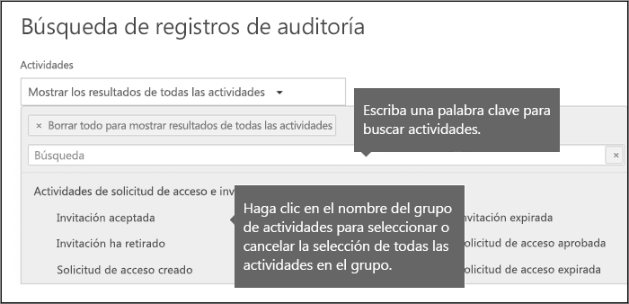
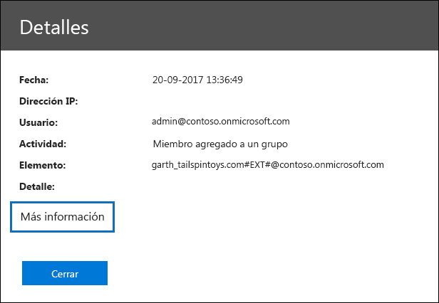
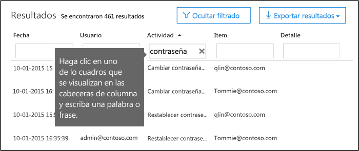
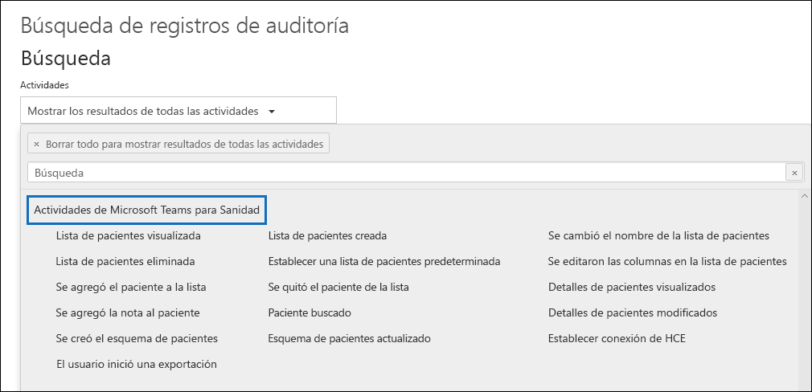
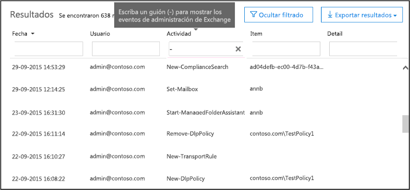

# <a name="search-the-audit-log-in-the-security--compliance-center"></a><span data-ttu-id="040a9-103">Buscar el registro de auditoría en el Centro de seguridad y cumplimiento</span><span class="sxs-lookup"><span data-stu-id="040a9-103">Search the audit log in the Security & Compliance Center</span></span>

## <a name="introduction"></a><span data-ttu-id="040a9-104">Introducción</span><span class="sxs-lookup"><span data-stu-id="040a9-104">Introduction</span></span>

<span data-ttu-id="040a9-105">¿Necesita averiguar si un usuario ha visto un documento determinado o si ha purgado un elemento de su buzón?</span><span class="sxs-lookup"><span data-stu-id="040a9-105">Need to find if a user viewed a specific document or purged an item from their mailbox?</span></span> <span data-ttu-id="040a9-106">Si es así, puede usar el Centro de seguridad y cumplimiento de Office 365 para buscar el registro de auditoría unificado y ver la actividad de usuarios y administradores en su organización de Office 365.</span><span class="sxs-lookup"><span data-stu-id="040a9-106">If so, you can use the Office 365 Security & Compliance Center to search the unified audit log to view user and administrator activity in your Office 365 organization.</span></span> <span data-ttu-id="040a9-107">¿Por qué un registro de auditoría unificado?</span><span class="sxs-lookup"><span data-stu-id="040a9-107">Why a unified audit log?</span></span> <span data-ttu-id="040a9-108">Porque puede buscar los siguientes tipos de actividades administrativas y de usuario en Office 365:</span><span class="sxs-lookup"><span data-stu-id="040a9-108">Because you can search for the following types of user and admin activity in Office 365:</span></span>

- <span data-ttu-id="040a9-109">Actividad de usuario en SharePoint Online y OneDrive para Empresas</span><span class="sxs-lookup"><span data-stu-id="040a9-109">User activity in SharePoint Online and OneDrive for Business</span></span>

- <span data-ttu-id="040a9-110">Actividad del usuario en Exchange en línea (registro de auditoría del buzón de Exchange)</span><span class="sxs-lookup"><span data-stu-id="040a9-110">User activity in Exchange Online (Exchange mailbox audit logging)</span></span>

- <span data-ttu-id="040a9-111">Actividad de administración en SharePoint en línea</span><span class="sxs-lookup"><span data-stu-id="040a9-111">Admin activity in SharePoint Online</span></span>

- <span data-ttu-id="040a9-112">Actividad de administrador en Azure Active Directory (el servicio de directorio para Office 365)</span><span class="sxs-lookup"><span data-stu-id="040a9-112">Admin activity in Azure Active Directory (the directory service for Office 365)</span></span>

- <span data-ttu-id="040a9-113">Actividad de administración en Exchange en línea (registro de auditoría de administración de Exchange)</span><span class="sxs-lookup"><span data-stu-id="040a9-113">Admin activity in Exchange Online (Exchange admin audit logging)</span></span>

- <span data-ttu-id="040a9-114">Actividad de usuario y de administrador en Sway</span><span class="sxs-lookup"><span data-stu-id="040a9-114">User and admin activity in Sway</span></span>

- <span data-ttu-id="040a9-115">Actividades de eDiscovery en el Centro de seguridad y cumplimiento</span><span class="sxs-lookup"><span data-stu-id="040a9-115">eDiscovery activities in the security and compliance center</span></span>

- <span data-ttu-id="040a9-116">Actividad de usuario y administrador en Power BI</span><span class="sxs-lookup"><span data-stu-id="040a9-116">User and admin activity in Power BI</span></span>

- <span data-ttu-id="040a9-117">Actividad de usuario y administrador en Microsoft Teams</span><span class="sxs-lookup"><span data-stu-id="040a9-117">User and admin activity in Microsoft Teams</span></span>

- <span data-ttu-id="040a9-118">Actividad de usuario y administrador en Dynamics 365</span><span class="sxs-lookup"><span data-stu-id="040a9-118">User and admin activity in Dynamics 365</span></span>

- <span data-ttu-id="040a9-119">Actividad de usuario y administrador en Yammer</span><span class="sxs-lookup"><span data-stu-id="040a9-119">User and admin activity in Yammer</span></span>

- <span data-ttu-id="040a9-120">Actividad de usuario y administrador en Microsoft Power Automate</span><span class="sxs-lookup"><span data-stu-id="040a9-120">User and admin activity in Microsoft Flow</span></span>

- <span data-ttu-id="040a9-121">Actividad de usuario y administrador en Microsoft Stream</span><span class="sxs-lookup"><span data-stu-id="040a9-121">User and admin activity in Microsoft Stream</span></span>

- <span data-ttu-id="040a9-122">Actividad de analista y administrador en Microsoft Workplace Analytics</span><span class="sxs-lookup"><span data-stu-id="040a9-122">Analyst and admin activity in Microsoft Workplace Analytics</span></span>

- <span data-ttu-id="040a9-123">Actividad de usuario y administrador en Microsoft Power Apps</span><span class="sxs-lookup"><span data-stu-id="040a9-123">User and admin activity in Microsoft PowerApps</span></span>

- <span data-ttu-id="040a9-124">Actividad de usuario y administrador en Microsoft Forms</span><span class="sxs-lookup"><span data-stu-id="040a9-124">User and admin activity in Microsoft Forms</span></span>

## <a name="before-you-begin"></a><span data-ttu-id="040a9-125">Antes de empezar</span><span class="sxs-lookup"><span data-stu-id="040a9-125">Before you begin</span></span>

<span data-ttu-id="040a9-126">Asegúrese de leer los siguientes elementos antes de iniciar la búsqueda del registro de auditoría de Office 365.</span><span class="sxs-lookup"><span data-stu-id="040a9-126">Be sure to read the following items before you start searching the Office 365 audit log.</span></span>

- <span data-ttu-id="040a9-127">Usted (u otro administrador) debe activar primero el registro de auditoría en Office 365 para poder empezar a buscar dicho registro.</span><span class="sxs-lookup"><span data-stu-id="040a9-127">You (or another admin) must first turn on audit logging before you can start searching the Office 365 audit log.</span></span> <span data-ttu-id="040a9-128">Para activarlo, haga clic en **Iniciar auditoría**en la página**Búsqueda de registros de auditoría**del Centro de seguridad y cumplimiento.</span><span class="sxs-lookup"><span data-stu-id="040a9-128">To turn it on, click **Turn on auditing** on the **Audit log search** page in the Security & Compliance Center.</span></span> <span data-ttu-id="040a9-129">(SI usted no ve este link, la auditoría ya se habrá activado para su organización) Después de que lo active, se muestra un mensaje que dice que el registro de auditoría se está preparando y que puede ejecutar una búsqueda en un par de horas después de que se complete la preparación.</span><span class="sxs-lookup"><span data-stu-id="040a9-129">(If you don't see this link, auditing has already been turned on for your organization.) After you turn it on, a message is displayed that says the audit log is being prepared and that you can run a search in a couple of hours after the preparation is complete.</span></span> <span data-ttu-id="040a9-130">Solo tiene que hacer esto una vez.</span><span class="sxs-lookup"><span data-stu-id="040a9-130">You only have to do this once.</span></span> <span data-ttu-id="040a9-131">Para obtener más información, consulte [ Desactivar o activar la búsqueda de registros de auditoría ](turn-audit-log-search-on-or-off.md).</span><span class="sxs-lookup"><span data-stu-id="040a9-131">For more information, see [Turn audit log search on or off](turn-audit-log-search-on-or-off.md).</span></span>

  > [!NOTE]
  > <span data-ttu-id="040a9-132">Estamos en el proceso de activar la auditoría de forma predeterminada.</span><span class="sxs-lookup"><span data-stu-id="040a9-132">We're in the process of turning on auditing by default.</span></span> <span data-ttu-id="040a9-133">Hasta entonces, puede activarla como se describió anteriormente.</span><span class="sxs-lookup"><span data-stu-id="040a9-133">Until then, you can turn it on as previously described.</span></span>

- <span data-ttu-id="040a9-134">Usted debe tener asignado el rol de Registros de auditoría o Registros de auditoría de solo lectura en Exchange en línea para buscar el registro de auditoría de Office 365.</span><span class="sxs-lookup"><span data-stu-id="040a9-134">You have to be assigned the View-Only Audit Logs or Audit Logs role in Exchange Online to search the Office 365 audit log.</span></span> <span data-ttu-id="040a9-135">De forma predeterminada, estos roles se asignan a los grupos de roles de Administración de la organización y Administración de cumplimiento en la página de**permisos**del centro de administración de Exchange.</span><span class="sxs-lookup"><span data-stu-id="040a9-135">By default, these roles are assigned to the Compliance Management and Organization Management role groups on the **Permissions** page in the Exchange admin center.</span></span> <span data-ttu-id="040a9-136">Nota: los Administradores globales en el Office 365 y Microsoft 365 pasan automáticamente a ser miembros del grupo de rol de funciones de la Administración de la organización en el servicio de Exchange en línea.</span><span class="sxs-lookup"><span data-stu-id="040a9-136">Note Global administrators in Office 365 and Microsoft 365 are automatically added as members of the Organization Management role group in Exchange Online.</span></span> <span data-ttu-id="040a9-137">Para darle a un usuario la capacidad de buscar el registro de auditoría de Office 365 con el mínimo nivel de privilegios, puede crear un grupo de roles personalizado en Exchange en línea, agregar el rol de Registros de auditoría o Registros de auditoría de solo lectura y, después, agregar el usuario como miembro del nuevo grupo de roles.</span><span class="sxs-lookup"><span data-stu-id="040a9-137">To give a user the ability to search the Office 365 audit log with the minimum level of privileges, you can create a custom role group in Exchange Online, add the View-Only Audit Logs or Audit Logs role, and then add the user as a member of the new role group.</span></span> <span data-ttu-id="040a9-138">Para obtener más información, consulte[Administrar grupos de roles en Exchange en línea](https://go.microsoft.com/fwlink/p/?LinkID=730688).</span><span class="sxs-lookup"><span data-stu-id="040a9-138">For more information, see [Manage role groups in Exchange Online](https://go.microsoft.com/fwlink/p/?LinkID=730688).</span></span>

  > [!IMPORTANT]
  > <span data-ttu-id="040a9-139">Si asigna a un usuario el rol de Registros de auditoría o Registros de auditoría de solo lectura en la página de **permisos** del centro de seguridad y cumplimiento, no podrán buscar el registro de auditoría de Office 365</span><span class="sxs-lookup"><span data-stu-id="040a9-139">If you assign a user the View-Only Audit Logs or Audit Logs role on the **Permissions** page in the Security & Compliance Center, they won't be able to search the Office 365 audit log.</span></span> <span data-ttu-id="040a9-140">Tiene que asignar los permisos en Exchange en línea.</span><span class="sxs-lookup"><span data-stu-id="040a9-140">You have to assign the permissions in Exchange Online.</span></span> <span data-ttu-id="040a9-141">Esto se debe a que el cmdlet subyacente que se usa para buscar en el registro de auditoría es un cmdlet Exchange en línea.</span><span class="sxs-lookup"><span data-stu-id="040a9-141">This is because the underlying cmdlet used to search the audit log is an Exchange Online cmdlet.</span></span>

- <span data-ttu-id="040a9-142">Cuando un usuario o administrador realiza una actividad auditada, se genera un registro de auditoría y se almacena en el registro de auditoría de Office 365 de su organización.</span><span class="sxs-lookup"><span data-stu-id="040a9-142">When an audited activity is performed by a user or admin, an audit record is generated and stored in the Office 365 audit log for your organization.</span></span> <span data-ttu-id="040a9-143">La cantidad de tiempo que se retiene un registro de auditoría (y que se puede buscar en el registro de auditoría) depende de la suscripción a Office 365 y, específicamente, del tipo de licencia que se ha asignado a un usuario específico.</span><span class="sxs-lookup"><span data-stu-id="040a9-143">The length of time that an audit record is retained (and searchable in the audit log) depends on your Office 365 subscription, and specifically the type of the license that is assigned to a specific user.</span></span>

  - <span data-ttu-id="040a9-144">**Office 365 E3:** Los registros de auditoría se conservan durante 90 días.</span><span class="sxs-lookup"><span data-stu-id="040a9-144">**Office 365 E3:** Audit records are retained for 90 days.</span></span> <span data-ttu-id="040a9-145">Eso significa que puede buscar en registro de auditoría las actividades que se han realizado en los últimos 90 días.</span><span class="sxs-lookup"><span data-stu-id="040a9-145">That means you can search the audit log for activities that were performed within the last 90 days.</span></span>

    > [!NOTE]
    > <span data-ttu-id="040a9-146">Incluso si la auditoría de buzón está activada de forma predeterminada, es posible que los eventos de auditoría del buzón de algunos usuarios no se encuentren en búsquedas de registro de auditoría en el Centro de seguridad y cumplimiento a través de la API de Actividad de administración de Office 365.</span><span class="sxs-lookup"><span data-stu-id="040a9-146">Even when mailbox auditing on by default is turned on, you might notice that mailbox audit events for some users aren't found in audit log searches in the Security & Compliance Center or via the Office 365 Management Activity API.</span></span> <span data-ttu-id="040a9-147">Para obtener más información, vea [Más información sobre el registro de auditoría del buzón de correo](enable-mailbox-auditing.md#more-information).</span><span class="sxs-lookup"><span data-stu-id="040a9-147">For more information, see [More information about mailbox audit logging](enable-mailbox-auditing.md#more-information).</span></span>

  - <span data-ttu-id="040a9-148">**Office 365 E5:** los registros de auditoría también se conservan durante 90 días.</span><span class="sxs-lookup"><span data-stu-id="040a9-148">**Office 365 E5:** Audit records are also retained for 90 days.</span></span> <span data-ttu-id="040a9-149">La retención mantenimiento de registros de auditoría para un año puede estar disponible en ocasiones para usuarios de E5 y usuarios con una licencia de E3 y una licencia de complemento a Cumplimiento avanzado de Office 365.</span><span class="sxs-lookup"><span data-stu-id="040a9-149">Retaining audit records for one year may eventually be available for E5 users and users with an E3 license and an Office 365 Advanced Compliance add-on license.</span></span>

    > [!NOTE]
    > <span data-ttu-id="040a9-150">El programa de la versión preliminar privada para el período de retención de un año para los registros de auditoría de las organizaciones E5 (o para los usuarios de las organizaciones E3 que tienen licencias de complemento a Cumplimiento avanzado) está cerrado a la nueva inscripción.</span><span class="sxs-lookup"><span data-stu-id="040a9-150">The private preview program for the one-year retention period for audit records for E5 organizations (or for users in E3 organizations that have Advanced Compliance add-on licenses) is closed to new enrollment.</span></span> <span data-ttu-id="040a9-151">Este artículo se actualizará cuando el período de retención de un año se encuentre disponible en vista previa pública o se publique para la disponibilidad general.</span><span class="sxs-lookup"><span data-stu-id="040a9-151">This article will be updated when the one-year retention period is available in public preview or released for general availability.</span></span>

- <span data-ttu-id="040a9-152">Si desea desactivar la búsqueda en el registro de auditoría de Office 365 de su organización, puede ejecutar el comando siguiente en el PowerShell remoto conectado a su organización Exchange en línea:</span><span class="sxs-lookup"><span data-stu-id="040a9-152">If you want to turn off audit log search in Office 365 for your organization, you can run the following command in remote PowerShell connected to your Exchange Online organization:</span></span>

  ```powershell
  Set-AdminAuditLogConfig -UnifiedAuditLogIngestionEnabled $false
  ```

    <span data-ttu-id="040a9-153">Para volver a activar la búsqueda de auditoría, puede ejecutar el comando siguiente en PowerShell de Exchange en línea :</span><span class="sxs-lookup"><span data-stu-id="040a9-153">To turn on audit search again, you can run the following command in Exchange Online PowerShell:</span></span>

  ```powershell
  Set-AdminAuditLogConfig -UnifiedAuditLogIngestionEnabled $true
  ```

  <span data-ttu-id="040a9-154">Para obtener más información, consulte[Desactivar la búsqueda de registros de auditoría en Office 365](turn-audit-log-search-on-or-off.md).</span><span class="sxs-lookup"><span data-stu-id="040a9-154">For more information, see [Turn off audit log search in Office 365](turn-audit-log-search-on-or-off.md).</span></span>

- <span data-ttu-id="040a9-155">Como se indicó anteriormente, el cmdlet subyacente que se ha usado para buscar en el registro de auditoría es un cmdlet de Exchange en línea, que es **Search-UnifiedAuditLog**.</span><span class="sxs-lookup"><span data-stu-id="040a9-155">As previously stated, the underlying cmdlet used to search the audit log is an Exchange Online cmdlet, which is **Search-UnifiedAuditLog**.</span></span> <span data-ttu-id="040a9-156">Eso significa que puede usar este cmdlet para buscar en el registro de auditoría de Office 365 en lugar de usar la página de**Búsqueda en el registro de auditoría** del centro de Seguridad y cumplimiento.</span><span class="sxs-lookup"><span data-stu-id="040a9-156">That means you can use this cmdlet to search the Office 365 audit log instead of using the **Audit log search** page in the Security & Compliance Center.</span></span> <span data-ttu-id="040a9-157">Tiene que ejecutar este cmdlet en el PowerShell remoto conectado a su organización de Exchange en línea.</span><span class="sxs-lookup"><span data-stu-id="040a9-157">You have to run this cmdlet in remote PowerShell connected to your Exchange Online organization.</span></span> <span data-ttu-id="040a9-158">Para obtener más información, consulte[Search-UnifiedAuditLog](https://go.microsoft.com/fwlink/p/?linkid=834776).</span><span class="sxs-lookup"><span data-stu-id="040a9-158">For more information, see [Search-UnifiedAuditLog](https://go.microsoft.com/fwlink/p/?linkid=834776).</span></span>

  <span data-ttu-id="040a9-159">Para obtener información sobre cómo exportar los resultados de búsqueda devueltos por el cmdlet **Search-UnifiedAuditLog**a un archivo CSV, consulte la sección "sugerencias para exportar y ver el registro de auditoría" [exportar, configurar y ver el registro de auditoría registros](export-view-audit-log-records.md#tips-for-exporting-and-viewing-the-audit-log).</span><span class="sxs-lookup"><span data-stu-id="040a9-159">For information about exporting the search results returned by the **Search-UnifiedAuditLog** cmdlet to a CSV file, see the "Tips for exporting and viewing the audit log" section in [Export, configure, and view audit log records](export-view-audit-log-records.md#tips-for-exporting-and-viewing-the-audit-log).</span></span>

- <span data-ttu-id="040a9-160">Si desea descargar mediante programación los datos del registro de auditoría de Office 365, le recomendamos que use la API de Actividad de administración de Office 365 en lugar de usar un script de PowerShell.</span><span class="sxs-lookup"><span data-stu-id="040a9-160">If you want to programmatically download data from the Office 365 audit log, we recommend that you use the Office 365 Management Activity API instead of using a PowerShell script.</span></span> <span data-ttu-id="040a9-161">La API de Actividad de administración de Office 365 es un servicio REST de la web que puede usar para desarrollar operaciones, soluciones de supervisión de seguridad y cumplimiento para su organización.</span><span class="sxs-lookup"><span data-stu-id="040a9-161">The Office 365 Management Activity API is a REST web service that you can use to develop operations, security, and compliance monitoring solutions for your organization.</span></span> <span data-ttu-id="040a9-162">Para obtener más información, consulte[la referencia de la API de Actividad de administración de Office 365](https://docs.microsoft.com/office/office-365-management-api/office-365-management-activity-api-reference).</span><span class="sxs-lookup"><span data-stu-id="040a9-162">For more information, see [Office 365 Management Activity API reference](https://docs.microsoft.com/office/office-365-management-api/office-365-management-activity-api-reference).</span></span>

- <span data-ttu-id="040a9-163">La entrada del registro de auditoría correspondiente puede tardar en aparecer en los resultados de búsqueda un máximo de 30 minutos o 24 horas después de que se produzca el evento.</span><span class="sxs-lookup"><span data-stu-id="040a9-163">It can take up to 30 minutes or up to 24 hours after an event occurs for the corresponding audit log entry to be displayed in the search results.</span></span> <span data-ttu-id="040a9-164">En la siguiente tabla, se muestra el tiempo que tarda para los distintos servicios en Office 365..</span><span class="sxs-lookup"><span data-stu-id="040a9-164">The following table shows the time it takes for the different services in Office 365.</span></span>

  |<span data-ttu-id="040a9-165">**Servicio de Office 365**</span><span class="sxs-lookup"><span data-stu-id="040a9-165">**Office 365 service**</span></span>|<span data-ttu-id="040a9-166">**30 minutos**</span><span class="sxs-lookup"><span data-stu-id="040a9-166">**30 minutes**</span></span>|<span data-ttu-id="040a9-167">**24 horas**</span><span class="sxs-lookup"><span data-stu-id="040a9-167">**24 hours**</span></span>|
  |:-----|:-----:|:-----:|
  |<span data-ttu-id="040a9-168">Esquema de Protección e Inteligencia contra amenazas</span><span class="sxs-lookup"><span data-stu-id="040a9-168">Advanced Threat Protection and Threat Intelligence</span></span>|||
  |<span data-ttu-id="040a9-170">Azure Active Directory (eventos de inicio de sesión de usuario)</span><span class="sxs-lookup"><span data-stu-id="040a9-170">Azure Active Directory (user login events)</span></span>|||
  |<span data-ttu-id="040a9-172">Azure Active Directory (eventos administrativos)</span><span class="sxs-lookup"><span data-stu-id="040a9-172">Azure Active Directory (admin events)</span></span>|||
  |<span data-ttu-id="040a9-174">Prevención de pérdida de datos</span><span class="sxs-lookup"><span data-stu-id="040a9-174">Data Loss Prevention</span></span>|||
  |<span data-ttu-id="040a9-176">Dynamics 365 CRM</span><span class="sxs-lookup"><span data-stu-id="040a9-176">Dynamics 365 CRM</span></span>|||
  |<span data-ttu-id="040a9-178">eDiscovery</span><span class="sxs-lookup"><span data-stu-id="040a9-178">eDiscovery</span></span>|||
  |<span data-ttu-id="040a9-180">Exchange en línea</span><span class="sxs-lookup"><span data-stu-id="040a9-180">Exchange Online</span></span>|||
  |<span data-ttu-id="040a9-182">Microsoft Power Automate</span><span class="sxs-lookup"><span data-stu-id="040a9-182">Microsoft Power Automate</span></span>|||
  |<span data-ttu-id="040a9-184">Microsoft Project</span><span class="sxs-lookup"><span data-stu-id="040a9-184">Microsoft Project</span></span>|||
  |<span data-ttu-id="040a9-186">Microsoft Stream</span><span class="sxs-lookup"><span data-stu-id="040a9-186">Microsoft Stream</span></span>|||
  |<span data-ttu-id="040a9-188">Microsoft Teams</span><span class="sxs-lookup"><span data-stu-id="040a9-188">Microsoft Teams</span></span>|||
  |<span data-ttu-id="040a9-190">Power BI</span><span class="sxs-lookup"><span data-stu-id="040a9-190">Power BI</span></span>|||
  |<span data-ttu-id="040a9-192">Centro de seguridad y cumplimiento</span><span class="sxs-lookup"><span data-stu-id="040a9-192">Security & Compliance Center</span></span>|||
  |<span data-ttu-id="040a9-194">SharePoint en línea y OneDrive para Empresas</span><span class="sxs-lookup"><span data-stu-id="040a9-194">SharePoint Online and OneDrive for Business</span></span>|||
  |<span data-ttu-id="040a9-196">Sway</span><span class="sxs-lookup"><span data-stu-id="040a9-196">Sway</span></span>|||
  |<span data-ttu-id="040a9-198">Workplace Analytics</span><span class="sxs-lookup"><span data-stu-id="040a9-198">Workplace Analytics</span></span>|||
  |<span data-ttu-id="040a9-200">Yammer</span><span class="sxs-lookup"><span data-stu-id="040a9-200">Yammer</span></span>||||
  |<span data-ttu-id="040a9-202">Microsoft Forms</span><span class="sxs-lookup"><span data-stu-id="040a9-202">Microsoft Forms</span></span>||
  ||||

- <span data-ttu-id="040a9-204">Azure Active Directory (AD) es el servicio de directorio para Office 365.</span><span class="sxs-lookup"><span data-stu-id="040a9-204">Azure Active Directory (Azure AD) is the directory service for Office 365.</span></span> <span data-ttu-id="040a9-205">El registro de auditoría unificado contiene actividades de usuario, dominio, aplicación, grupo y de directorio que se han realizado en el Centro de administración de Microsoft 365 o en el Portal de administración de Azure.</span><span class="sxs-lookup"><span data-stu-id="040a9-205">The unified audit log contains user, group, application, domain, and directory activities performed in the Microsoft 365 admin center or in the Azure management portal.</span></span> <span data-ttu-id="040a9-206">Para obtener una lista completa de los eventos de Azure AD, consulte[Eventos del informe de auditoría de Azure Active Directory](https://go.microsoft.com/fwlink/p/?LinkID=616549).</span><span class="sxs-lookup"><span data-stu-id="040a9-206">For a complete list of Azure AD events, see [Azure Active Directory Audit Report Events](https://go.microsoft.com/fwlink/p/?LinkID=616549).</span></span>

- <span data-ttu-id="040a9-207">El registro de auditoría de Power BI no está habilitado de forma predeterminada.</span><span class="sxs-lookup"><span data-stu-id="040a9-207">Audit logging for Power BI isn't enabled by default.</span></span> <span data-ttu-id="040a9-208">Para buscar actividades de Power BI en el registro de auditoría de Office 365, debe habilitar la auditoría en el portal de administración de Power BI.</span><span class="sxs-lookup"><span data-stu-id="040a9-208">To search for Power BI activities in the Office 365 audit log, you have to enable auditing in the Power BI admin portal.</span></span> <span data-ttu-id="040a9-209">Para obtener instrucciones, consulte la sección "registros de auditoría"[en el portal de administración de Power BI](https://docs.microsoft.com/power-bi/service-admin-portal#audit-logs).</span><span class="sxs-lookup"><span data-stu-id="040a9-209">For instructions, see the "Audit logs" section in [Power BI admin portal](https://docs.microsoft.com/power-bi/service-admin-portal#audit-logs).</span></span>

## <a name="search-the-audit-log"></a><span data-ttu-id="040a9-210">Búsquedas en el registro de auditoría</span><span class="sxs-lookup"><span data-stu-id="040a9-210">Search the audit log</span></span>

<span data-ttu-id="040a9-211">Aquí se muestra el proceso para buscar el registro de auditoría en Office 365.</span><span class="sxs-lookup"><span data-stu-id="040a9-211">Here's the process for searching the audit log in Office 365.</span></span>

[<span data-ttu-id="040a9-212">Paso 1: Ejecute una búsqueda de registros de auditoría</span><span class="sxs-lookup"><span data-stu-id="040a9-212">Step 1: Run an audit log search</span></span>](#step-1-run-an-audit-log-search)

[<span data-ttu-id="040a9-213">Paso 2: Vea los resultados de la búsqueda</span><span class="sxs-lookup"><span data-stu-id="040a9-213">Step 2: View the search results</span></span>](#step-2-view-the-search-results)

[<span data-ttu-id="040a9-214">Paso 3: Filtre los resultados de la búsqueda</span><span class="sxs-lookup"><span data-stu-id="040a9-214">Step 3: Filter the search results</span></span>](#step-3-filter-the-search-results)

[<span data-ttu-id="040a9-215">Paso 4: Exportar los resultados de búsqueda a un archivo</span><span class="sxs-lookup"><span data-stu-id="040a9-215">Step 4: Export the search results to a file</span></span>](#step-4-export-the-search-results-to-a-file)

### <a name="step-1-run-an-audit-log-search"></a><span data-ttu-id="040a9-216">Paso 1: Ejecute una búsqueda de registros de auditoría</span><span class="sxs-lookup"><span data-stu-id="040a9-216">Step 1: Run an audit log search</span></span>

1. <span data-ttu-id="040a9-217">Vaya a [https://protection.office.com](https://protection.office.com).</span><span class="sxs-lookup"><span data-stu-id="040a9-217">Go to [https://protection.office.com](https://protection.office.com).</span></span>

    > [!TIP]
    > <span data-ttu-id="040a9-218">Use una sesión de exploración privada (no una sesión normal) para obtener acceso al centro de seguridad y cumplimiento, ya que esto evitará que las credenciales con las que inició sesión actualmente sean usadas.</span><span class="sxs-lookup"><span data-stu-id="040a9-218">Use a private browsing session (not a regular session) to access the Security & Compliance Center because this will prevent the credential that you are currently logged on with from being used.</span></span> <span data-ttu-id="040a9-219">Para abrir una ventana de Exploración de InPrivate en Internet Explorer o en Microsoft Edge, pulse las teclas CTRL+SHIFT+P.</span><span class="sxs-lookup"><span data-stu-id="040a9-219">To open an InPrivate Browsing session in Internet Explorer or Microsoft Edge, just press CTRL+SHIFT+P.</span></span> <span data-ttu-id="040a9-220">Para abrir una sesión de explorador privada en Google Chrome (denominada ventana de incógnito), presione CTRL+MAYÚS+N.</span><span class="sxs-lookup"><span data-stu-id="040a9-220">To open a private browsing session in Google Chrome (called an incognito window), press CTRL+SHIFT+N.</span></span>

2. <span data-ttu-id="040a9-221">Inicie sesión en Office 365 con su cuenta profesional o educativa.</span><span class="sxs-lookup"><span data-stu-id="040a9-221">Sign in to Office 365 using your work or school account.</span></span>

3. <span data-ttu-id="040a9-222">En el panel izquierdo del Centro de seguridad y cumplimiento, haga clic en **buscar**, y luego haga clic en**buscar el registro de auditoría**.</span><span class="sxs-lookup"><span data-stu-id="040a9-222">In the left pane of the Security & Compliance Center, click **Search**, and then click **Audit log search**.</span></span>

    <span data-ttu-id="040a9-223">La página del**registro de auditoría de búsqueda**será mostrada.</span><span class="sxs-lookup"><span data-stu-id="040a9-223">The **Audit log search** page is displayed.</span></span>

    

    > [!NOTE]
    > <span data-ttu-id="040a9-225">Primeramente tiene que activar el registro de auditoría antes de que pueda ejecutar una búsqueda de registros de auditoría.</span><span class="sxs-lookup"><span data-stu-id="040a9-225">You have to first turn on audit logging before you can run an audit log search.</span></span> <span data-ttu-id="040a9-226">Si se muestra el vínculo**Iniciar el registro de la actividad administrativa y de usuario**, haga clic en él para activar la auditoría.</span><span class="sxs-lookup"><span data-stu-id="040a9-226">If the **Start recording user and admin activity** link is displayed, click it to turn on auditing.</span></span> <span data-ttu-id="040a9-227">Si no ve este vínculo, la auditoría ya se ha activado para la organización.</span><span class="sxs-lookup"><span data-stu-id="040a9-227">If you don't see this link, auditing has already been turned on for your organization.</span></span>

4. <span data-ttu-id="040a9-228">Configurar los siguientes criterios de búsqueda: </span><span class="sxs-lookup"><span data-stu-id="040a9-228">Configure the following search criteria:</span></span>

    <span data-ttu-id="040a9-229">a.</span><span class="sxs-lookup"><span data-stu-id="040a9-229">a.</span></span> <span data-ttu-id="040a9-230">**Actividades**: haga clic en la lista desplegable para mostrar las actividades que puede buscar.</span><span class="sxs-lookup"><span data-stu-id="040a9-230">**Activities**: Click the drop-down list to display the activities that you can search for.</span></span> <span data-ttu-id="040a9-231">Las actividades administrativas y de usuario se organizan en grupos de actividades relacionadas.</span><span class="sxs-lookup"><span data-stu-id="040a9-231">User and admin activities are organized in to groups of related activities.</span></span> <span data-ttu-id="040a9-232">Puede seleccionar actividades específicas o puede hacer clic en el nombre del grupo de actividades para seleccionar todas las actividades del grupo.</span><span class="sxs-lookup"><span data-stu-id="040a9-232">You can select specific activities or you can click the activity group name to select all activities in the group.</span></span> <span data-ttu-id="040a9-233">También puede hacer clic en una actividad seleccionada para borrar la selección.</span><span class="sxs-lookup"><span data-stu-id="040a9-233">You can also click a selected activity to clear the selection.</span></span> <span data-ttu-id="040a9-234">Después de que ejecute la búsqueda, solo se muestran las entradas seleccionadas del registro de auditoría de las actividades.</span><span class="sxs-lookup"><span data-stu-id="040a9-234">After you run the search, only the audit log entries for the selected activities are displayed.</span></span> <span data-ttu-id="040a9-235">Al seleccionar**Mostrar los resultados de todas las actividades**, se mostrarán los resultados de todas las actividades que el usuario o el grupo de usuarios seleccionado ha realizado.</span><span class="sxs-lookup"><span data-stu-id="040a9-235">Selecting **Show results for all activities** displays results for all activities performed by the selected user or group of users.</span></span>

    <span data-ttu-id="040a9-236">Se registran más de 100 actividades administrativas y de usuario en el registro de auditoría de Office 365.</span><span class="sxs-lookup"><span data-stu-id="040a9-236">Over 100 user and admin activities are logged in the Office 365 audit log.</span></span> <span data-ttu-id="040a9-237">Haga clic en la pestaña de**Actividades auditadas**en el tema de este artículo para ver las descripciones de todas las actividades en cada uno de los diferentes servicios de Office 365.</span><span class="sxs-lookup"><span data-stu-id="040a9-237">Click the **Audited activities** tab at the topic of this article to see the descriptions of every activity in each of the different Office 365 services.</span></span>

    <span data-ttu-id="040a9-238">b.</span><span class="sxs-lookup"><span data-stu-id="040a9-238">b.</span></span> <span data-ttu-id="040a9-239">**Fecha de inicio** y **Fecha de finalización**: los últimos siete días se seleccionan de manera predeterminada.</span><span class="sxs-lookup"><span data-stu-id="040a9-239">**Start date** and **End date**: The last seven days are selected by default.</span></span> <span data-ttu-id="040a9-240">Seleccione un intervalo de fecha y hora para mostrar los eventos que han sucedido en ese período.</span><span class="sxs-lookup"><span data-stu-id="040a9-240">Select a date and time range to display the events that occurred within that period.</span></span> <span data-ttu-id="040a9-241">La fecha y la hora se presentan en formato de Hora universal coordinada (UTC).</span><span class="sxs-lookup"><span data-stu-id="040a9-241">The date and time are presented in Coordinated Universal Time (UTC) format.</span></span> <span data-ttu-id="040a9-242">El intervalo máximo de fecha que puede especificar es 90 días.</span><span class="sxs-lookup"><span data-stu-id="040a9-242">The maximum date range that you can specify is 90 days.</span></span> <span data-ttu-id="040a9-243">Se muestra un error si el intervalo de fecha seleccionado es superior a 90 días.</span><span class="sxs-lookup"><span data-stu-id="040a9-243">An error is displayed if the selected date range is greater than 90 days.</span></span>

    > [!TIP]
    > <span data-ttu-id="040a9-244">Si está usando el intervalo de fecha máximo de 90 días, seleccione la hora actual para la **Fecha de inicio**.</span><span class="sxs-lookup"><span data-stu-id="040a9-244">If you're using the maximum date range of 90 days, select the current time for the **Start date**.</span></span> <span data-ttu-id="040a9-245">De otro modo, recibirá un error que dice que la fecha de inicio es anterior a la fecha de finalización.</span><span class="sxs-lookup"><span data-stu-id="040a9-245">Otherwise, you'll receive an error saying that the start date is earlier than the end date.</span></span> <span data-ttu-id="040a9-246">Si ha activado la auditoría en los últimos 90 días, el intervalo máximo de fecha no puede comenzar antes de la fecha en la que se ha activado la auditoría.</span><span class="sxs-lookup"><span data-stu-id="040a9-246">If you've turned on auditing within the last 90 days, the maximum date range can't start before the date that auditing was turned on.</span></span>

    <span data-ttu-id="040a9-247">c.</span><span class="sxs-lookup"><span data-stu-id="040a9-247">c.</span></span> <span data-ttu-id="040a9-248">**Usuarios**: haga clic en este cuadro y, luego, seleccione uno o más usuarios para mostrarles los resultados de búsqueda.</span><span class="sxs-lookup"><span data-stu-id="040a9-248">**Users**: Click in this box and then select one or more users to display search results for.</span></span> <span data-ttu-id="040a9-249">Las entradas del registro de auditoría de la actividad seleccionada realizada por los usuarios que selecciona en este cuadro, se muestran en la lista de resultados.</span><span class="sxs-lookup"><span data-stu-id="040a9-249">The audit log entries for the selected activity performed by the users you select in this box are displayed in the list of results.</span></span> <span data-ttu-id="040a9-250">Deje este cuadro en blanco para devolver las entradas de todos los usuarios (y cuentas de servicio) de su organización.</span><span class="sxs-lookup"><span data-stu-id="040a9-250">Leave this box blank to return entries for all users (and service accounts) in your organization.</span></span>

    <span data-ttu-id="040a9-251">d.</span><span class="sxs-lookup"><span data-stu-id="040a9-251">d.</span></span> <span data-ttu-id="040a9-252">**Archivo, carpeta o sitio**: escriba algunos o todos los nombres de carpeta o de archivo para buscar las actividades relacionadas con el archivo de la carpeta que contengan la palabra clave especifica.</span><span class="sxs-lookup"><span data-stu-id="040a9-252">**File, folder, or site**: Type some or all of a file or folder name to search for activity related to the file of folder that contains the specified keyword.</span></span> <span data-ttu-id="040a9-253">También puede especificar una dirección URL de un archivo o carpeta.</span><span class="sxs-lookup"><span data-stu-id="040a9-253">You can also specify a URL of a file or folder.</span></span> <span data-ttu-id="040a9-254">Si usa una dirección URL, asegúrese de escribir la dirección URL completa, o si escribe solo una parte de esta, de no incluir espacios ni caracteres especiales.</span><span class="sxs-lookup"><span data-stu-id="040a9-254">If you use a URL, be sure the type the full URL path or if you type a portion of the URL, don't include any special characters or spaces.</span></span>

    <span data-ttu-id="040a9-255">Deje este cuadro en blanco para devolver las entradas de todos los archivos y carpetas de la organización.</span><span class="sxs-lookup"><span data-stu-id="040a9-255">Leave this box blank to return entries for all files and folders in your organization.</span></span>

   <span data-ttu-id="040a9-256">**SUGERENCIAS**</span><span class="sxs-lookup"><span data-stu-id="040a9-256">**TIPS**</span></span>

   - <span data-ttu-id="040a9-257">Si busca todas las actividades relacionadas con un **sitio**, añada el símbolo comodín (\*) detrás de la dirección URL para que se devuelvan todas las entradas del sitio; por ejemplo, **"https://contoso-my.sharepoint.com/personal/\*"**.</span><span class="sxs-lookup"><span data-stu-id="040a9-257">If you're looking for all activities related to a **site**, add the wildcard symbol (\*) after the URL to return all entries for that site; for example, **"https://contoso-my.sharepoint.com/personal/\*"**.</span></span>

   - <span data-ttu-id="040a9-258">Si está buscando todas las actividades relacionadas con un **archivo**, agregue el símbolo comodín (\*) antes del nombre de archivo para devolver todas las entradas para ese archivo; por ejemplo,\*\* "\* Customer_Profitability_Sample.csv"\*\*.</span><span class="sxs-lookup"><span data-stu-id="040a9-258">If you're looking for all activities related to a **file**, add the wildcard symbol (\*) before the file name to return all entries for that file; for example, **"\*Customer_Profitability_Sample.csv"**.</span></span>

5. <span data-ttu-id="040a9-259">Haga clic en **Búsqueda** para ejecutar la búsqueda mediante sus criterios de búsqueda. </span><span class="sxs-lookup"><span data-stu-id="040a9-259">Click **Search** to run the search using your search criteria.</span></span>

   <span data-ttu-id="040a9-260">Los resultados de búsqueda se cargan y, después de unos minutos, se muestran en **Resultados**.</span><span class="sxs-lookup"><span data-stu-id="040a9-260">The search results are loaded, and after a few moments they are displayed under **Results**.</span></span> <span data-ttu-id="040a9-261">Cuando finaliza la búsqueda, se muestra el número de resultados que se ha encontrado.</span><span class="sxs-lookup"><span data-stu-id="040a9-261">When the search is finished, the number of results found is displayed.</span></span> <span data-ttu-id="040a9-262">En el**panel resultados** se mostrará un máximo de 5 000 eventos en incrementos de 150 eventos.</span><span class="sxs-lookup"><span data-stu-id="040a9-262">A maximum of 5,000 events will be displayed in the **Results** pane in increments of 150 events.</span></span> <span data-ttu-id="040a9-263">Si hay más de 5 000 eventos que cumplen los criterios de búsqueda, se muestran los 5 000 eventos más recientes.</span><span class="sxs-lookup"><span data-stu-id="040a9-263">If more than 5,000 events meet the search criteria, the most recent 5,000 events are displayed.</span></span>

   

#### <a name="tips-for-searching-the-audit-log"></a><span data-ttu-id="040a9-265">Sugerencias para buscar el registro de auditoría</span><span class="sxs-lookup"><span data-stu-id="040a9-265">Tips for searching the audit log</span></span>

- <span data-ttu-id="040a9-266">Puede seleccionar actividades específicas de búsqueda haciendo clic en el nombre de la actividad.</span><span class="sxs-lookup"><span data-stu-id="040a9-266">You can select specific activities to search for by clicking the activity name.</span></span> <span data-ttu-id="040a9-267">O puede buscar todas las actividades en un grupo (como **Actividades de archivos y carpetas**) haciendo clic en el nombre de grupo.</span><span class="sxs-lookup"><span data-stu-id="040a9-267">Or you can search for all activities in a group (such as **File and folder activities**) by clicking the group name.</span></span> <span data-ttu-id="040a9-268">Si se selecciona una actividad, puede hacer clic en ella para cancelar la selección.</span><span class="sxs-lookup"><span data-stu-id="040a9-268">If an activity is selected, you can click it to cancel the selection.</span></span> <span data-ttu-id="040a9-269">También puede usar el cuadro de búsqueda para mostrar las actividades que contengan la palabra clave que usted escriba.</span><span class="sxs-lookup"><span data-stu-id="040a9-269">You can also use the search box to display the activities that contain the keyword that you type.</span></span>

  

- <span data-ttu-id="040a9-271">Tiene que seleccionar **Mostrar resultados para todas las actividades** en la lista de**Actividades** para mostrar los eventos del registro de auditoría de administración de Exchange.</span><span class="sxs-lookup"><span data-stu-id="040a9-271">You have to select **Show results for all activities** in the **Activities** list to display events from the Exchange admin audit log.</span></span> <span data-ttu-id="040a9-272">Los eventos de este registro de auditoría muestran un nombre de cmdlet (por ejemplo,**Set-Mailbox**) en la columna de**Actividad**en los resultados.</span><span class="sxs-lookup"><span data-stu-id="040a9-272">Events from this audit log display a cmdlet name (for example, **Set-Mailbox**) in the **Activity** column in the results.</span></span> <span data-ttu-id="040a9-273">Para obtener más información, haga clic en la pestaña\*\* actividades auditadas**de este tema y luego haga clic en**actividades de administración de Exchange\*\*.</span><span class="sxs-lookup"><span data-stu-id="040a9-273">For more information, click the **Audited activities** tab in this topic and then click **Exchange admin activities**.</span></span>

  <span data-ttu-id="040a9-274">De forma similar, hay algunas actividades de auditoría que no tienen un elemento correspondiente en la lista **Actividades**.</span><span class="sxs-lookup"><span data-stu-id="040a9-274">Similarly, there are some auditing activities that don't have a corresponding item in the **Activities** list.</span></span> <span data-ttu-id="040a9-275">Si sabe el nombre de la operación para estas actividades, puede buscarlas todas y luego filtrar los resultados escribiendo el nombre de la operación en el cuadro de la columna de**Actividad**.</span><span class="sxs-lookup"><span data-stu-id="040a9-275">If you know the name of the operation for these activities, you can search for all activities, then filter the results by typing the name of the operation in the box for the **Activity** column.</span></span> <span data-ttu-id="040a9-276">Consulte [Paso 3: Filtrar los resultados de búsqueda](#step-3-filter-the-search-results) para obtener más información sobre cómo filtrar los resultados.</span><span class="sxs-lookup"><span data-stu-id="040a9-276">See [Step 3: Filter the search results](#step-3-filter-the-search-results) for more information about filtering the results.</span></span>

- <span data-ttu-id="040a9-277">Haga clic en **Borrar** para borrar los criterios actuales de búsqueda.</span><span class="sxs-lookup"><span data-stu-id="040a9-277">Click **Clear** to clear the current search criteria.</span></span> <span data-ttu-id="040a9-278">El intervalo de fecha vuelve al predeterminado de los últimos siete días.</span><span class="sxs-lookup"><span data-stu-id="040a9-278">The date range returns to the default of the last seven days.</span></span> <span data-ttu-id="040a9-279">También puede hacer clic en **Borrar todo para mostrar los resultados de todas las actividades** para cancelar todas las actividades seleccionadas.</span><span class="sxs-lookup"><span data-stu-id="040a9-279">You can also click **Clear all to show results for all activities** to cancel all selected activities.</span></span>

- <span data-ttu-id="040a9-280">Si 5 000 resultados son encontrados, puede suponer que probablemente existen más de 5,000 eventos que cumplen los criterios de búsqueda.</span><span class="sxs-lookup"><span data-stu-id="040a9-280">If 5,000 results are found, you can probably assume that there are more than 5,000 events that met the search criteria.</span></span> <span data-ttu-id="040a9-281">Puede restringir los criterios de búsqueda y volver a ejecutar la búsqueda para devolver menos resultados o puede exportar todos los resultados de búsqueda al seleccionar **Exportar resultado**\>**Descargar todos los resultados**.</span><span class="sxs-lookup"><span data-stu-id="040a9-281">You can either refine the search criteria and rerun the search to return fewer results, or you can export all of the search results by selecting **Export results** \> **Download all results**.</span></span>

### <a name="step-2-view-the-search-results"></a><span data-ttu-id="040a9-282">Paso 2: Ver los resultados de la búsqueda</span><span class="sxs-lookup"><span data-stu-id="040a9-282">Step 2: View the search results</span></span>

<span data-ttu-id="040a9-283">Los resultados de una búsqueda de registro de auditoría se muestran en **Resultados** en la página **Búsqueda de registros de auditoría**.</span><span class="sxs-lookup"><span data-stu-id="040a9-283">The results of an audit log search are displayed under **Results** on the **Audit log search** page.</span></span> <span data-ttu-id="040a9-284">Como se mencionó anteriormente se muestran un máximo de 5 000 eventos (más recientes) en incrementos de 150 eventos.</span><span class="sxs-lookup"><span data-stu-id="040a9-284">As previously stated a maximum of 5,000 (newest) events are displayed in increments of 150 events.</span></span> <span data-ttu-id="040a9-285">Para mostrar más eventos puede usar la barra de desplazamiento en el panel **Resultados** o también puede presionar **Mayús+Fin** para mostrar los siguientes 150 eventos.</span><span class="sxs-lookup"><span data-stu-id="040a9-285">To display more events you can use the scroll bar in the **Results** pane or you can press **Shift + End** to display the next 150 events.</span></span>

<span data-ttu-id="040a9-286">Los resultados contienen la siguiente información sobre cada evento que la búsqueda ha devuelto:</span><span class="sxs-lookup"><span data-stu-id="040a9-286">The results contain the following information about each event returned by the search:</span></span>

- <span data-ttu-id="040a9-287">**Fecha**: la fecha y la hora (en formato UTC) cuando se ha realizado el evento.</span><span class="sxs-lookup"><span data-stu-id="040a9-287">**Date**: The date and time (in UTC format) when the event occurred.</span></span>

- <span data-ttu-id="040a9-288">**Dirección IP**: la dirección IP del dispositivo que se ha usado cuando la actividad se ha registrado.</span><span class="sxs-lookup"><span data-stu-id="040a9-288">**IP address**: The IP address of the device that was used when the activity was logged.</span></span> <span data-ttu-id="040a9-289">La dirección IP se muestra en el formato de dirección IPv4 o IPv6.</span><span class="sxs-lookup"><span data-stu-id="040a9-289">The IP address is displayed in either an IPv4 or IPv6 address format.</span></span>

   > [!NOTE]
  > <span data-ttu-id="040a9-290">Para ciertos servicios, el valor que se visualiza en este campo podría ser la dirección IP de una aplicación de confianza (por ejemplo, aplicaciones de Office en la web) que llama al servicio en nombre de un usuario y no de la dirección IP del dispositivo utilizado por la persona que realizó la actividad.</span><span class="sxs-lookup"><span data-stu-id="040a9-290">For some services, the value displayed in this field might be the IP address for a trusted application (for example, Office on the web apps) calling into the service on behalf of a user and not the IP address of the device used by person who performed the activity.</span></span> <span data-ttu-id="040a9-291">Asimismo, para la actividad del administrador (o la actividad que realiza una cuenta del sistema) para eventos relacionados con Azure Active Directory, la dirección IP no se registra y el valor que se muestra en este campo es `null`.</span><span class="sxs-lookup"><span data-stu-id="040a9-291">Also, for admin activity (or activity performed by a system account) for Azure Active Directory-related events, the IP address isn't logged and the value displayed in this field is `null`.</span></span>

- <span data-ttu-id="040a9-292">**Usuario**: el usuario (o cuenta de servicio) que ha realizado la acción que ha desencadenado el evento.</span><span class="sxs-lookup"><span data-stu-id="040a9-292">**User**: The user (or service account) who performed the action that triggered the event.</span></span>

- <span data-ttu-id="040a9-293">**Actividad**: la actividad que ha realizado el usuario.</span><span class="sxs-lookup"><span data-stu-id="040a9-293">**Activity**: The activity performed by the user.</span></span> <span data-ttu-id="040a9-294">Este valor corresponde a las actividades que ha seleccionado en la lista desplegable de **Actividades**.</span><span class="sxs-lookup"><span data-stu-id="040a9-294">This value corresponds to the activities that you selected in the **Activities** drop down list.</span></span> <span data-ttu-id="040a9-295">Para un evento del registro de auditoría de administración de Exchange, el valor de esta columna es un cmdlet de Exchange.</span><span class="sxs-lookup"><span data-stu-id="040a9-295">For an event from the Exchange admin audit log, the value in this column is an Exchange cmdlet.</span></span>

- <span data-ttu-id="040a9-296">**Elemento**: el objeto que se ha creado o modificado como resultado de la actividad correspondiente.</span><span class="sxs-lookup"><span data-stu-id="040a9-296">**Item**: The object that was created or modified as a result of the corresponding activity.</span></span> <span data-ttu-id="040a9-297">Por ejemplo, el archivo que se ha visto o modificado, o la cuenta de usuario que se ha actualizado.</span><span class="sxs-lookup"><span data-stu-id="040a9-297">For example, the file that was viewed or modified or the user account that was updated.</span></span> <span data-ttu-id="040a9-298">No todas las actividades tienen un valor en esta columna.</span><span class="sxs-lookup"><span data-stu-id="040a9-298">Not all activities have a value in this column.</span></span>

- <span data-ttu-id="040a9-299">**Detalle**: información adicional sobre una actividad.</span><span class="sxs-lookup"><span data-stu-id="040a9-299">**Detail**: Additional information about an activity.</span></span> <span data-ttu-id="040a9-300">Nuevamente, no todas las actividades tendrán un valor.</span><span class="sxs-lookup"><span data-stu-id="040a9-300">Again, not all activities have a value.</span></span>

> [!TIP]
> <span data-ttu-id="040a9-301">Haga clic en un encabezado de columna en **Resultados** para ordenarlos.</span><span class="sxs-lookup"><span data-stu-id="040a9-301">Click a column header under **Results** to sort the results.</span></span> <span data-ttu-id="040a9-302">Puede ordenar los resultados de la A hasta la Z o de la Z hasta la A. Haga clic en el encabezado**Fecha** para ordenar los resultados del más antiguo al más nuevo o al revés.</span><span class="sxs-lookup"><span data-stu-id="040a9-302">You can sort the results from A to Z or Z to A. Click the **Date** header to sort the results from oldest to newest or newest to oldest.</span></span>

#### <a name="view-the-details-for-a-specific-event"></a><span data-ttu-id="040a9-303">Ver los detalles de un evento específico</span><span class="sxs-lookup"><span data-stu-id="040a9-303">View the details for a specific event</span></span>

<span data-ttu-id="040a9-304">Puede ver más detalles sobre un evento al hacer clic en el registro de eventos de la lista de resultados de búsqueda.</span><span class="sxs-lookup"><span data-stu-id="040a9-304">You can view more details about an event by clicking the event record in the list of search results.</span></span> <span data-ttu-id="040a9-305">Se muestra una página de**detalles** que contiene las propiedades detalladas del registro de eventos.</span><span class="sxs-lookup"><span data-stu-id="040a9-305">A **Details** page is displayed that contains the detailed properties from the event record.</span></span> <span data-ttu-id="040a9-306">Las propiedades que se muestran dependen del servicio de Office 365 en el que se produce el evento.</span><span class="sxs-lookup"><span data-stu-id="040a9-306">The properties that are displayed depend on the Office 365 service in which the event occurs.</span></span> <span data-ttu-id="040a9-307">Para mostrar esos detalles, haga clic en**Más información**.</span><span class="sxs-lookup"><span data-stu-id="040a9-307">To display these details, click **More information**.</span></span> <span data-ttu-id="040a9-308">Para descripciones, consulte[Propiedades detalladas del registro de auditoría de Office 365](detailed-properties-in-the-office-365-audit-log.md)</span><span class="sxs-lookup"><span data-stu-id="040a9-308">For descriptions, see [Detailed properties in the Office 365 audit log](detailed-properties-in-the-office-365-audit-log.md).</span></span>



### <a name="step-3-filter-the-search-results"></a><span data-ttu-id="040a9-310">Paso 3: Filtrar los resultados de la búsqueda</span><span class="sxs-lookup"><span data-stu-id="040a9-310">Step 3: Filter the search results</span></span>

<span data-ttu-id="040a9-311">Además de ordenar, también puede filtrar los resultados de una búsqueda de registro de auditoría.</span><span class="sxs-lookup"><span data-stu-id="040a9-311">In addition to sorting, you can also filter the results of an audit log search.</span></span> <span data-ttu-id="040a9-312">Esta es una característica excelente que puede ayudarle a filtrar rápidamente los resultados específicos de un usuario o actividad.</span><span class="sxs-lookup"><span data-stu-id="040a9-312">This is a great feature that can help you quickly filter the results for a specific user or activity.</span></span> <span data-ttu-id="040a9-313">Puede crear inicialmente una amplia búsqueda y, después, filtrar rápidamente los resultados para ver los eventos específicos.</span><span class="sxs-lookup"><span data-stu-id="040a9-313">You can initially create a wide search and then quickly filter the results to see specific events.</span></span> <span data-ttu-id="040a9-314">Luego puede restringir los criterios de búsqueda, y volver a ejecutar la búsqueda para volver a un conjunto de resultados más pequeño y conciso.</span><span class="sxs-lookup"><span data-stu-id="040a9-314">Then you can narrow the search criteria and rerun the search to return a smaller, more concise set of results.</span></span>

<span data-ttu-id="040a9-315">Para filtrar los resultados:</span><span class="sxs-lookup"><span data-stu-id="040a9-315">To filter the results:</span></span>

1. <span data-ttu-id="040a9-316">Ejecute una búsqueda de registros de auditoría.</span><span class="sxs-lookup"><span data-stu-id="040a9-316">Run an audit log search.</span></span>

2. <span data-ttu-id="040a9-317">Cuando se muestren los resultados, haga clic en **Filtrar resultados**.</span><span class="sxs-lookup"><span data-stu-id="040a9-317">When the results are displayed, click **Filter results**.</span></span>

   <span data-ttu-id="040a9-318">Los cuadros de palabra clave se muestran en cada encabezado de columna.</span><span class="sxs-lookup"><span data-stu-id="040a9-318">Keyword boxes are displayed under each column header.</span></span>

3. <span data-ttu-id="040a9-319">Haga clic en uno de lo cuadros que se visualizan en las cabeceras de columna y escriba una palabra o frase, dependiendo de la columna que esté filtrando.</span><span class="sxs-lookup"><span data-stu-id="040a9-319">Click one of the boxes under a column header and type a word or phrase, depending on the column you're filtering on.</span></span> <span data-ttu-id="040a9-320">Los resultados se volverán a ajustar de manera dinámica para mostrar los eventos que coincidan con su filtro.</span><span class="sxs-lookup"><span data-stu-id="040a9-320">The results will dynamically readjust to display the events that match your filter.</span></span>

   

4. <span data-ttu-id="040a9-322">Para borrar un filtro, haga clic en la**X**en el cuadro de filtro o haga clic en **Ocultar filtrado**.</span><span class="sxs-lookup"><span data-stu-id="040a9-322">To clear a filter, click the **X** in the filter box or click **Hide filtering**.</span></span>

> [!TIP]
> <span data-ttu-id="040a9-323">Para mostrar los eventos del registro de auditoría de administración de Exchange, escriba un**-** (guion) en el cuadro de filtro**Actividad**.</span><span class="sxs-lookup"><span data-stu-id="040a9-323">To display events from the Exchange admin audit log, type a **-** (dash) in the **Activity** filter box.</span></span> <span data-ttu-id="040a9-324">Esto mostrará los nombres de los cmdlet, que se muestran en la columna**Actividad** de los eventos de administración de Exchange.</span><span class="sxs-lookup"><span data-stu-id="040a9-324">This will display cmdlet names, which are displayed in the **Activity** column for Exchange admin events.</span></span> <span data-ttu-id="040a9-325">Luego usted puede ordenar los nombres de cmdlet en orden alfabético.</span><span class="sxs-lookup"><span data-stu-id="040a9-325">Then you can sort the cmdlet names in alphabetical order.</span></span>

### <a name="step-4-export-the-search-results-to-a-file"></a><span data-ttu-id="040a9-326">Paso 4: Exportar los resultados de búsqueda a un archivo</span><span class="sxs-lookup"><span data-stu-id="040a9-326">Step 4: Export the search results to a file</span></span>

<span data-ttu-id="040a9-327">Puede exportar los resultados de una búsqueda de registro de auditoría a un archivo de valores separados por comas (CSV) en su computadora local.</span><span class="sxs-lookup"><span data-stu-id="040a9-327">You can export the results of an audit log search to a comma-separated value (CSV) file on your local computer.</span></span> <span data-ttu-id="040a9-328">Puede abrir este archivo en Microsoft Excel y usar características como buscar, ordenar, filtrar y dividir una sola columna (que contiene múltiples propiedades) en columnas múltiples.</span><span class="sxs-lookup"><span data-stu-id="040a9-328">You can open this file in Microsoft Excel and use features such as search, sorting, filtering, and splitting a single column (that contains multiple properties) into multiple columns.</span></span>

1. <span data-ttu-id="040a9-329">Ejecute una búsqueda de registro de auditoría, y luego revise los criterios de búsqueda hasta que tenga los resultados deseados.</span><span class="sxs-lookup"><span data-stu-id="040a9-329">Run an audit log search, and then revise the search criteria until you have the desired results.</span></span>

2. <span data-ttu-id="040a9-330">Haga clic en **Exportar resultados** y seleccione una de las siguientes opciones:</span><span class="sxs-lookup"><span data-stu-id="040a9-330">Click **Export results** and select one of the following options:</span></span>

   - <span data-ttu-id="040a9-331">**Guardar los resultados cargados**: elija esta opción para exportar solo las entradas que se muestran en los **Resultados** en la página de **Búsqueda de registros de auditoría**.</span><span class="sxs-lookup"><span data-stu-id="040a9-331">**Save loaded results**: Choose this option to export only the entries that are displayed under **Results** on the **Audit log search** page.</span></span> <span data-ttu-id="040a9-332">El archivo CSV que se descarga contiene las mismas columnas (y datos) que se muestran en la página (Fecha, Usuario, Actividad, Elemento y Detalles).</span><span class="sxs-lookup"><span data-stu-id="040a9-332">The CSV file that is downloaded contains the same columns (and data) displayed on the page (Date, User, Activity, Item, and Details).</span></span> <span data-ttu-id="040a9-333">Se incluye una columna adicional (denominada **Más**) en el archivo CSV que contiene más información de la entrada del registro de auditoría.</span><span class="sxs-lookup"><span data-stu-id="040a9-333">An extra column (named **More**) is included in the CSV file that contains more information from the audit log entry.</span></span> <span data-ttu-id="040a9-334">Como está exportando los mismos resultados que se han cargado (y visualizado) en la página **Búsqueda de registros de auditoría**, se exportan un máximo de 5 000 entradas.</span><span class="sxs-lookup"><span data-stu-id="040a9-334">Because you're exporting the same results that are loaded (and viewable) on the **Audit log search** page, a maximum of 5,000 entries are exported.</span></span>

   - <span data-ttu-id="040a9-335">**Descargar todos los resultados**: elija esta opción para exportar todas las entradas del registro de auditoría de Office 365 que cumplen los criterios de búsqueda.</span><span class="sxs-lookup"><span data-stu-id="040a9-335">**Download all results**: Choose this option to export all entries from the Office 365 audit log that meet the search criteria.</span></span> <span data-ttu-id="040a9-336">Para obtener un conjunto amplio de resultados de búsqueda, elija esta opción para descargar todas las entradas del registro de auditoría además de los 5 000 resultados que se muestran en la página **Búsqueda de registros de auditoría**.</span><span class="sxs-lookup"><span data-stu-id="040a9-336">For a large set of search results, choose this option to download all entries from the audit log in addition to the 5,000 audit records that can be displayed on the **Audit log search** page.</span></span> <span data-ttu-id="040a9-337">Esta opción descargará los datos sin procesar del registro de auditoría a un archivo CSV, y contiene información adicional de la entrada del registro de auditoría en una columna denominada**AuditData**.</span><span class="sxs-lookup"><span data-stu-id="040a9-337">This option downloads the raw data from the audit log to a CSV file, and contains additional information from the audit log entry in a column named **AuditData**.</span></span> <span data-ttu-id="040a9-338">Puede tardar más en descargar el archivo si elige esta opción de exportación ya que el archivo puede ser mucho más grande que el que se descarga si eligiera otra opción.</span><span class="sxs-lookup"><span data-stu-id="040a9-338">It may take longer to download the file if you choose this export option because the file may be much larger than the one that's downloaded if you choose the other option.</span></span>

     > [!IMPORTANT]
     > <span data-ttu-id="040a9-339">Puede descargar un máximo de 50 000 entradas en un archivo CSV desde una única búsqueda de registros de auditoría.</span><span class="sxs-lookup"><span data-stu-id="040a9-339">You can download a maximum of 50,000 entries to a CSV file from a single audit log search.</span></span> <span data-ttu-id="040a9-340">Si se descargan 50 000 entradas en el archivo CSV, probablemente puede suponer que existen más de 50 000 eventos que cumplen los criterios de búsqueda.</span><span class="sxs-lookup"><span data-stu-id="040a9-340">If 50,000 entries are downloaded to the CSV file, you can probably assume there are more than 50,000 events that met the search criteria.</span></span> <span data-ttu-id="040a9-341">Para exportar más de este límite, pruebe a usar un intervalo de fecha para reducir el número de entradas de registro de auditoría.</span><span class="sxs-lookup"><span data-stu-id="040a9-341">To export more than this limit, try using a date range to reduce the number of audit log entries.</span></span> <span data-ttu-id="040a9-342">Puede que tenga que ejecutar varias búsquedas con intervalos de fecha de menor tamaño para exportar más de 50 000 entradas.</span><span class="sxs-lookup"><span data-stu-id="040a9-342">You might have to run multiple searches with smaller date ranges to export more than 50,000 entries.</span></span>

3. <span data-ttu-id="040a9-343">Después de que seleccione una opción de exportación, se muestra un mensaje en la parte inferior de la ventana que le solicita que abra el archivo CSV, lo guarde en la carpeta de descargas o que lo guarde en una carpeta específica.</span><span class="sxs-lookup"><span data-stu-id="040a9-343">After you select an export option, a message is displayed at the bottom of the window that prompts you to open the CSV file, save it to the Downloads folder, or save it to a specific folder.</span></span>

#### <a name="more-information-about-exporting-and-viewing-audit-log-search-results"></a><span data-ttu-id="040a9-344">Obtener más información sobre exportar y visualizar resultados de búsqueda del registro de auditoría</span><span class="sxs-lookup"><span data-stu-id="040a9-344">More information about exporting and viewing audit log search results</span></span>

- <span data-ttu-id="040a9-345">Si descarga todos los resultados, el archivo CSV contiene una columna denominada **AuditData**, que contiene información adicional sobre cada evento.</span><span class="sxs-lookup"><span data-stu-id="040a9-345">If you download all search results, the CSV file contains a column named **AuditData**, which contains additional information about each event.</span></span> <span data-ttu-id="040a9-346">Los datos en esta columna se componen de un objeto JSON que contiene varias propiedades del registro de auditoría.</span><span class="sxs-lookup"><span data-stu-id="040a9-346">The data in this column consists of a JSON object that contains multiple properties from the audit log record.</span></span> <span data-ttu-id="040a9-347">Cada*propiedad: valor*par del objeto JSON es separado por una coma.</span><span class="sxs-lookup"><span data-stu-id="040a9-347">Each *property:value* pair in the JSON object is separated by a comma.</span></span> <span data-ttu-id="040a9-348">Puede usar la herramienta de transformación de JSON en el editor de Power Query en Excel para dividir la columna\*\*AuditData \*\*en columnas múltiples de forma que cada propiedad del objeto JSON tenga su propia columna.</span><span class="sxs-lookup"><span data-stu-id="040a9-348">You can use the JSON transform tool in the Power Query Editor in Excel to split **AuditData** column into multiple columns so that each property in the JSON object has its own column.</span></span> <span data-ttu-id="040a9-349">Esto le permitirá ordenar y filtrar en una o más de estas propiedades.</span><span class="sxs-lookup"><span data-stu-id="040a9-349">This lets you sort and filter on one or more of these properties.</span></span> <span data-ttu-id="040a9-350">Para obtener instrucciones paso a paso para usar el editor de Power Query para transformar el objeto JSON, consulte[exportar, configurar y ver los archivos de registros de auditoría](export-view-audit-log-records.md). </span><span class="sxs-lookup"><span data-stu-id="040a9-350">For step-by-step instructions using the Power Query Editor to transform the JSON object, see [Export, configure, and view audit log records](export-view-audit-log-records.md).</span></span>

  <span data-ttu-id="040a9-351">Después de que divida la columna **AuditData**, puede filtrar en la columna de**Operaciones** para mostrar las propiedades detalladas de un tipo de actividad específico.</span><span class="sxs-lookup"><span data-stu-id="040a9-351">After you split the **AuditData** column, you can filter on the **Operations** column to display the detailed properties for a specific type of activity.</span></span>

- <span data-ttu-id="040a9-352">La opción **Descargar todos los resultados** descarga los datos sin procesar del registro de auditoría de Office 365 en un archivo CSV.</span><span class="sxs-lookup"><span data-stu-id="040a9-352">The **Download all results** option downloads the raw data from the Office 365 audit log to a CSV file.</span></span> <span data-ttu-id="040a9-353">Este archivo contiene diferentes nombres de columna (CreationDate, Identificadores de usuario, Operaciones, AuditData) que los del archivo que se descarga si selecciona la opción **Guardar resultados cargados**.</span><span class="sxs-lookup"><span data-stu-id="040a9-353">This file contains different column names (CreationDate, UserIds, Operation, AuditData) than the file that's downloaded if you select the **Save loaded results** option.</span></span> <span data-ttu-id="040a9-354">Los valores de los dos archivos CSV diferentes para la misma actividad también podrían ser distintos.</span><span class="sxs-lookup"><span data-stu-id="040a9-354">The values in the two different CSV files for the same activity may also be different.</span></span> <span data-ttu-id="040a9-355">Por ejemplo, la actividad de la columna **Acción**en el archivo CSV y podría tener un valor diferente que el nombre "sencillo" de usuario que se muestra en la columna de**Actividad** de la página de **Búsqueda de registros de auditoría**.</span><span class="sxs-lookup"><span data-stu-id="040a9-355">For example, the activity in the **Action** column in the CSV file and may have a different value than the "user-friendly" name that's displayed in the **Activity** column on the **Audit log search** page.</span></span> <span data-ttu-id="040a9-356">Por ejemplo, MailboxLogin vs. el usuario ha iniciado sesión en el buzón.</span><span class="sxs-lookup"><span data-stu-id="040a9-356">For example, MailboxLogin vs. User signed in to mailbox.</span></span>

- <span data-ttu-id="040a9-357">Cuando descargue todos los resultados de una consulta de búsqueda que contenga eventos de diferentes servicios de Office 365, la columna**AuditData**del archivo CSV contiene diferentes propiedades dependiendo del servicio en que se ha realizado la acción.</span><span class="sxs-lookup"><span data-stu-id="040a9-357">When you download all results from a search query that contains events from different Office 365 services, the **AuditData** column in the CSV file contains different properties depending on which service the action was performed in.</span></span> <span data-ttu-id="040a9-358">Por ejemplo, las entradas de los registros de auditoría de Exchange y Azure AD incluyen una propiedad denominada**ResultStatus** que indica si la acción se ha realizado correctamente o no.</span><span class="sxs-lookup"><span data-stu-id="040a9-358">For example, entries from Exchange and Azure AD audit logs include a property named **ResultStatus** that indicates if the action was successful or not.</span></span> <span data-ttu-id="040a9-359">Esta propiedad no se incluye para los eventos en SharePoint.</span><span class="sxs-lookup"><span data-stu-id="040a9-359">This property isn't included for events in SharePoint.</span></span> <span data-ttu-id="040a9-360">De manera similar, los eventos de SharePoint tienen una propiedad que identifica la dirección URL del sitio para las actividades relacionadas con la carpeta y el archivo.</span><span class="sxs-lookup"><span data-stu-id="040a9-360">Similarly, SharePoint events have a property that identifies the site URL for file and folder-related activities.</span></span> <span data-ttu-id="040a9-361">Para mitigar este comportamiento, considere la posibilidad de usar diferentes búsquedas para exportar los resultados de las actividades de un único servicio.</span><span class="sxs-lookup"><span data-stu-id="040a9-361">To mitigate this behavior, consider using different searches to export the results for activities from a single service.</span></span>

  <span data-ttu-id="040a9-362">Para obtener una descripción de las propiedades que se enumeran en la columna **AuditData** del archivo CSV cuando descarga todos los resultados, y el servicio se aplica en cada uno, consulte[Propiedades detalladas del registro de auditoría de Office 365](detailed-properties-in-the-office-365-audit-log.md).</span><span class="sxs-lookup"><span data-stu-id="040a9-362">For a description of many of the properties that are listed in the **AuditData** column in the CSV file when you download all results, and the service each one applies to, see [Detailed properties in the Office 365 audit log](detailed-properties-in-the-office-365-audit-log.md).</span></span>

## <a name="audited-activities"></a><span data-ttu-id="040a9-363">Actividades auditadas</span><span class="sxs-lookup"><span data-stu-id="040a9-363">Audited activities</span></span>

<span data-ttu-id="040a9-364">Las tablas de esta sección describen las actividades que se auditan en Office 365.</span><span class="sxs-lookup"><span data-stu-id="040a9-364">The tables in this section describe the activities that are audited in Office 365.</span></span> <span data-ttu-id="040a9-365">Puede buscar estos eventos al buscar el registro de auditoría en el centro de seguridad y cumplimiento.</span><span class="sxs-lookup"><span data-stu-id="040a9-365">You can search for these events by searching the audit log in the security and compliance center.</span></span>

<span data-ttu-id="040a9-366">En estas tablas se agrupan actividades relacionadas o las actividades de un servicio específico de Office 365.</span><span class="sxs-lookup"><span data-stu-id="040a9-366">These tables group related activities or the activities from a specific Office 365 service.</span></span> <span data-ttu-id="040a9-367">La tabla incluye el nombre sencillo que se muestra en la lista desplegable de**Actividades**y el nombre de la operación correspondiente que aparece en la información detallada de una grabación de auditoría y en el archivo CSV cuando exporta los resultados de búsqueda.</span><span class="sxs-lookup"><span data-stu-id="040a9-367">The tables include the friendly name that's displayed in the **Activities** drop-down list and the name of the corresponding operation that appears in the detailed information of an audit record and in the CSV file when you export the search results.</span></span> <span data-ttu-id="040a9-368">Para descripciones de la información detallada, consulte las[ Propiedades detalladas del registro de auditoría de Office 365](detailed-properties-in-the-office-365-audit-log.md)</span><span class="sxs-lookup"><span data-stu-id="040a9-368">For descriptions of the detailed information, see [Detailed properties in the Office 365 audit log](detailed-properties-in-the-office-365-audit-log.md).</span></span>

<span data-ttu-id="040a9-369">Haga clic en uno de los vínculos siguientes para ir a una tabla en particular.</span><span class="sxs-lookup"><span data-stu-id="040a9-369">Click one of the following links to go to a specific table.</span></span>

||||
|:-----|:-----|:-----|
|[<span data-ttu-id="040a9-370">Actividades de páginas y archivos</span><span class="sxs-lookup"><span data-stu-id="040a9-370">File and page activities</span></span>](#file-and-page-activities)|[<span data-ttu-id="040a9-371">Actividades de carpetas</span><span class="sxs-lookup"><span data-stu-id="040a9-371">Folder activities</span></span>](#folder-activities)|[<span data-ttu-id="040a9-372">Lista de actividades de SharePoint</span><span class="sxs-lookup"><span data-stu-id="040a9-372">SharePoint list activities</span></span>](#sharepoint-list-activities)|
|[<span data-ttu-id="040a9-373">Actividades de solicitud de acceso y uso compartido</span><span class="sxs-lookup"><span data-stu-id="040a9-373">Sharing and access request activities</span></span>](#sharing-and-access-request-activities)|[<span data-ttu-id="040a9-374">Actividades de sincronización</span><span class="sxs-lookup"><span data-stu-id="040a9-374">Synchronization activities</span></span>](#synchronization-activities)|[<span data-ttu-id="040a9-375">Actividades de permisos del sitio</span><span class="sxs-lookup"><span data-stu-id="040a9-375">Site permissions activities</span></span>](#site-permissions-activities)|
|[<span data-ttu-id="040a9-376">Actividades de administración del sitio</span><span class="sxs-lookup"><span data-stu-id="040a9-376">Site administration activities</span></span>](#site-administration-activities)|[<span data-ttu-id="040a9-377">Actividades de buzón de Exchange</span><span class="sxs-lookup"><span data-stu-id="040a9-377">Exchange mailbox activities</span></span>](#exchange-mailbox-activities)|[<span data-ttu-id="040a9-378">Actividades de Sway</span><span class="sxs-lookup"><span data-stu-id="040a9-378">Sway activities</span></span>](#sway-activities)|
|[<span data-ttu-id="040a9-379">Actividades de administración de usuarios</span><span class="sxs-lookup"><span data-stu-id="040a9-379">User administration activities</span></span>](#user-administration-activities)|[<span data-ttu-id="040a9-380">Actividades de administración de grupos de Azure AD</span><span class="sxs-lookup"><span data-stu-id="040a9-380">Azure AD group administration activities</span></span>](#azure-ad-group-administration-activities)|[<span data-ttu-id="040a9-381">Actividades de administración de aplicaciones</span><span class="sxs-lookup"><span data-stu-id="040a9-381">Application administration activities</span></span>](#application-administration-activities)|
|[<span data-ttu-id="040a9-382">Actividades de administración de roles</span><span class="sxs-lookup"><span data-stu-id="040a9-382">Role administration activities</span></span>](#role-administration-activities)|[<span data-ttu-id="040a9-383">Actividades de administración de directorios</span><span class="sxs-lookup"><span data-stu-id="040a9-383">Directory administration activities</span></span>](#directory-administration-activities)|[<span data-ttu-id="040a9-384">Actividades de eDiscovery</span><span class="sxs-lookup"><span data-stu-id="040a9-384">eDiscovery activities</span></span>](#ediscovery-activities)|
|[<span data-ttu-id="040a9-385">Actividades de eDiscovery avanzado</span><span class="sxs-lookup"><span data-stu-id="040a9-385">Advanced eDiscovery activities</span></span>](#advanced-ediscovery-activities)|[<span data-ttu-id="040a9-386">Actividades de Power BI</span><span class="sxs-lookup"><span data-stu-id="040a9-386">Power BI activities</span></span>](#power-bi-activities)|[<span data-ttu-id="040a9-387">Microsoft Workplace Analytics</span><span class="sxs-lookup"><span data-stu-id="040a9-387">Microsoft Workplace Analytics</span></span>](#microsoft-workplace-analytics-activities)|
|[<span data-ttu-id="040a9-388">Actividades de Microsoft Teams</span><span class="sxs-lookup"><span data-stu-id="040a9-388">Microsoft Teams activities</span></span>](#microsoft-teams-activities)|[<span data-ttu-id="040a9-389">Actividades de Microsoft Teams para Sanidad</span><span class="sxs-lookup"><span data-stu-id="040a9-389">Microsoft Teams Healthcare activities</span></span>](#microsoft-teams-healthcare-activities)|[<span data-ttu-id="040a9-390">Actividades de Yammer</span><span class="sxs-lookup"><span data-stu-id="040a9-390">Yammer activities</span></span>](#yammer-activities)|
|[<span data-ttu-id="040a9-391"> Actividades en Microsoft Power Automate </span><span class="sxs-lookup"><span data-stu-id="040a9-391">Microsoft Power Automate activities</span></span>](#microsoft-power-automate-activities)|[<span data-ttu-id="040a9-392"> Actividades en Microsoft Power Apps </span><span class="sxs-lookup"><span data-stu-id="040a9-392">Microsoft Power Apps activities</span></span>](#microsoft-power-apps-activities)|[<span data-ttu-id="040a9-393">Actividades de Microsoft Stream</span><span class="sxs-lookup"><span data-stu-id="040a9-393">Microsoft Stream activities</span></span>](#microsoft-stream-activities)|
|[<span data-ttu-id="040a9-394">Actividades de Microsoft Forms</span><span class="sxs-lookup"><span data-stu-id="040a9-394">Microsoft Forms activities</span></span>](#microsoft-forms-activities)|[<span data-ttu-id="040a9-395">Actividades de administración de Exchange</span><span class="sxs-lookup"><span data-stu-id="040a9-395">Exchange admin activities</span></span>](#exchange-admin-audit-log)|||
||||

### <a name="file-and-page-activities"></a><span data-ttu-id="040a9-396">Actividades de páginas y archivos</span><span class="sxs-lookup"><span data-stu-id="040a9-396">File and page activities</span></span>

<span data-ttu-id="040a9-397">En la siguiente tabla se describen las actividades de archivos y páginas en SharePoint en línea y OneDrive para la empresa.</span><span class="sxs-lookup"><span data-stu-id="040a9-397">The following table describes the file and page activities in SharePoint Online and OneDrive for Business.</span></span>

|<span data-ttu-id="040a9-398">**Nombre descriptivo**</span><span class="sxs-lookup"><span data-stu-id="040a9-398">**Friendly name**</span></span>|<span data-ttu-id="040a9-399">**Operación**</span><span class="sxs-lookup"><span data-stu-id="040a9-399">**Operation**</span></span>|<span data-ttu-id="040a9-400">**Descripción**</span><span class="sxs-lookup"><span data-stu-id="040a9-400">**Description**</span></span>|
|:-----|:-----|:-----|
|<span data-ttu-id="040a9-401">Archivo al que se tiene acceso</span><span class="sxs-lookup"><span data-stu-id="040a9-401">Accessed file</span></span>|<span data-ttu-id="040a9-402">FileAccessed</span><span class="sxs-lookup"><span data-stu-id="040a9-402">FileAccessed</span></span>|<span data-ttu-id="040a9-403">Cuenta de sistema o usuario que tiene acceso al archivo.</span><span class="sxs-lookup"><span data-stu-id="040a9-403">User or system account accesses a file.</span></span>|
|<span data-ttu-id="040a9-404">(ninguno)</span><span class="sxs-lookup"><span data-stu-id="040a9-404">(none)</span></span>|<span data-ttu-id="040a9-405">FileAccessedExtended</span><span class="sxs-lookup"><span data-stu-id="040a9-405">FileAccessedExtended</span></span>|<span data-ttu-id="040a9-406">Esto está relacionado con la actividad "Archivo al que se tiene acceso" (FileAccessed).</span><span class="sxs-lookup"><span data-stu-id="040a9-406">This is related to the "Accessed file" (FileAccessed) activity.</span></span> <span data-ttu-id="040a9-407">Se registra un evento FileAccessedExtended cuando la misma persona tiene acceso continuamente a un archivo durante un largo período (hasta 3 horas).</span><span class="sxs-lookup"><span data-stu-id="040a9-407">A FileAccessedExtended event is logged when the same person continually accesses a file for an extended period (up to 3 hours).</span></span> <br/><br/> <span data-ttu-id="040a9-408">El objetivo del registro de eventos FileAccessedExtended es reducir el número de eventos FileAccessed que se registran cuando se tiene acceso continuamente a un archivo.</span><span class="sxs-lookup"><span data-stu-id="040a9-408">The purpose of logging FileAccessedExtended events is to reduce the number of FileAccessed events that are logged when a file is continually accessed.</span></span> <span data-ttu-id="040a9-409">Esto ayuda a reducir el ruido de varios registros FileAccessed para lo que básicamente es la misma actividad de usuario y le permite centrarse en el evento FileAccessed inicial (el más importante).</span><span class="sxs-lookup"><span data-stu-id="040a9-409">This helps reduce the noise of multiple FileAccessed records for what is essentially the same user activity, and lets you focus on the initial (and more important) FileAccessed event.</span></span>|
|<span data-ttu-id="040a9-410">Etiqueta cambiada de política de cumplimiento </span><span class="sxs-lookup"><span data-stu-id="040a9-410">Changed compliance policy label</span></span>|<span data-ttu-id="040a9-411">ComplianceSettingChanged</span><span class="sxs-lookup"><span data-stu-id="040a9-411">ComplianceSettingChanged</span></span>|<span data-ttu-id="040a9-412">Se aplicó o se quitó una etiqueta de retención de un documento.</span><span class="sxs-lookup"><span data-stu-id="040a9-412">A retention label was applied to or removed from a document.</span></span> <span data-ttu-id="040a9-413">Este evento se activa cuando una etiqueta de retención es aplicada manual o automáticamente a un mensaje.</span><span class="sxs-lookup"><span data-stu-id="040a9-413">This event is triggered when a retention label is manually or automatically applied to a message.</span></span>|
|<span data-ttu-id="040a9-414">Estado de registro cambiado a bloqueado</span><span class="sxs-lookup"><span data-stu-id="040a9-414">Changed record status to locked</span></span>|<span data-ttu-id="040a9-415">LockRecord</span><span class="sxs-lookup"><span data-stu-id="040a9-415">LockRecord</span></span>|<span data-ttu-id="040a9-416">El estado de registro de una etiqueta de retención que clasifica un documento como un registro ha siso bloqueado.</span><span class="sxs-lookup"><span data-stu-id="040a9-416">The record status of a retention label that classifies a document as a record was locked.</span></span> <span data-ttu-id="040a9-417">Esto significa que el documento no se puede modificar ni eliminar.</span><span class="sxs-lookup"><span data-stu-id="040a9-417">This means the document can't be modified or deleted.</span></span> <span data-ttu-id="040a9-418">Solo los usuarios que tengan al menos asignado el permiso de colaborador para un sitio podrán cambiar el estado de registro de un documento.</span><span class="sxs-lookup"><span data-stu-id="040a9-418">Only users assigned at least the contributor permission for a site can change the record status of a document.</span></span>|
|<span data-ttu-id="040a9-419">Cambiado el estado del registro a bloqueado</span><span class="sxs-lookup"><span data-stu-id="040a9-419">Changed record status to unlocked</span></span>|<span data-ttu-id="040a9-420">UnlockRecord</span><span class="sxs-lookup"><span data-stu-id="040a9-420">UnlockRecord</span></span>|<span data-ttu-id="040a9-421">El estado de registro de una etiqueta de retención que clasifica un documento como un registro ha sido bloqueado.</span><span class="sxs-lookup"><span data-stu-id="040a9-421">The record status of a retention label that classifies a document as a record was unlocked.</span></span> <span data-ttu-id="040a9-422">Esto significa que el documento puede ser modificado o eliminado.</span><span class="sxs-lookup"><span data-stu-id="040a9-422">This means that the document can be modified or deleted.</span></span> <span data-ttu-id="040a9-423">Solo los usuarios que tengan al menos asignado el permiso de colaborador para un sitio podrán cambiar el estado de registro de un documento.</span><span class="sxs-lookup"><span data-stu-id="040a9-423">Only users assigned at least the contributor permission for a site can change the record status of a document.</span></span>|
|<span data-ttu-id="040a9-424">Archivo verificado</span><span class="sxs-lookup"><span data-stu-id="040a9-424">Checked in file</span></span>|<span data-ttu-id="040a9-425">FileCheckedIn</span><span class="sxs-lookup"><span data-stu-id="040a9-425">FileCheckedIn</span></span>|<span data-ttu-id="040a9-426">El usuario inserta en el repositorio un documento que se extrajo de una biblioteca de documentos.</span><span class="sxs-lookup"><span data-stu-id="040a9-426">User checks in a document that they checked out from a document library.</span></span>|
|<span data-ttu-id="040a9-427">Archivo extraído del repositorio</span><span class="sxs-lookup"><span data-stu-id="040a9-427">Checked out file</span></span>|<span data-ttu-id="040a9-428">FileCheckedOut</span><span class="sxs-lookup"><span data-stu-id="040a9-428">FileCheckedOut</span></span>|<span data-ttu-id="040a9-429">El usuario extrae un documento ubicado en una biblioteca de documentos.</span><span class="sxs-lookup"><span data-stu-id="040a9-429">User checks out a document located in a document library.</span></span> <span data-ttu-id="040a9-430">Los usuarios pueden extraer y modificar documentos que se han compartido con ellos.</span><span class="sxs-lookup"><span data-stu-id="040a9-430">Users can check out and make changes to documents that have been shared with them.</span></span>|
|<span data-ttu-id="040a9-431">Archivo copiado</span><span class="sxs-lookup"><span data-stu-id="040a9-431">Copied file</span></span>|<span data-ttu-id="040a9-432">FileCopied</span><span class="sxs-lookup"><span data-stu-id="040a9-432">FileCopied</span></span>|<span data-ttu-id="040a9-433">El usuario copia un documento desde un sitio.</span><span class="sxs-lookup"><span data-stu-id="040a9-433">User copies a document from a site.</span></span> <span data-ttu-id="040a9-434">El archivo copiado puede guardarse en otra carpeta en el sitio.</span><span class="sxs-lookup"><span data-stu-id="040a9-434">The copied file can be saved to another folder on the site.</span></span>|
|<span data-ttu-id="040a9-435">Archivo eliminado</span><span class="sxs-lookup"><span data-stu-id="040a9-435">Deleted file</span></span>|<span data-ttu-id="040a9-436">FileDeleted</span><span class="sxs-lookup"><span data-stu-id="040a9-436">FileDeleted</span></span>|<span data-ttu-id="040a9-437">El usuario elimina un documento de un sitio.</span><span class="sxs-lookup"><span data-stu-id="040a9-437">User deletes a document from a site.</span></span>|
|<span data-ttu-id="040a9-438">Archivo eliminado de la papelera de reciclaje</span><span class="sxs-lookup"><span data-stu-id="040a9-438">Deleted file from recycle bin</span></span>|<span data-ttu-id="040a9-439">FileDeletedFirstStageRecycleBin</span><span class="sxs-lookup"><span data-stu-id="040a9-439">FileDeletedFirstStageRecycleBin</span></span>|<span data-ttu-id="040a9-440">El usuario elimina un archivo de la papelera de reciclaje de un sitio.</span><span class="sxs-lookup"><span data-stu-id="040a9-440">User deletes a file from the recycle bin of a site.</span></span>|
|<span data-ttu-id="040a9-441">Archivo eliminado de la papelera de reciclaje de segundo nivel</span><span class="sxs-lookup"><span data-stu-id="040a9-441">Deleted file from second-stage recycle bin</span></span>|<span data-ttu-id="040a9-442">FileDeletedSecondStageRecycleBin</span><span class="sxs-lookup"><span data-stu-id="040a9-442">FileDeletedSecondStageRecycleBin</span></span>|<span data-ttu-id="040a9-443">El usuario elimina un archivo de la papelera del segundo nivel de la papelera de reciclaje de un sitio.</span><span class="sxs-lookup"><span data-stu-id="040a9-443">User deletes a file from the second-stage recycle bin of a site.</span></span>|
|<span data-ttu-id="040a9-444">Política de cumplimiento de etiqueta borrada</span><span class="sxs-lookup"><span data-stu-id="040a9-444">Deleted record compliance policy label</span></span>|<span data-ttu-id="040a9-445">ComplianceRecordDelete</span><span class="sxs-lookup"><span data-stu-id="040a9-445">ComplianceRecordDelete</span></span>|<span data-ttu-id="040a9-446">Un documento que se clasificó como un registro fue eliminado.</span><span class="sxs-lookup"><span data-stu-id="040a9-446">A document that was classified as a record was deleted.</span></span> <span data-ttu-id="040a9-447">Un documento se considera un registro cuando se le aplica una etiqueta de retención que clasifica el contenido como un registro.</span><span class="sxs-lookup"><span data-stu-id="040a9-447">A document is considered a record when a retention label that classifies content as a record is applied to the document.</span></span>|
|<span data-ttu-id="040a9-448">Desfase detectado de la sensibilidad del documento </span><span class="sxs-lookup"><span data-stu-id="040a9-448">Detected document sensitivity mismatch</span></span>|<span data-ttu-id="040a9-449">DocumentSensitivityMismatchDetected</span><span class="sxs-lookup"><span data-stu-id="040a9-449">DocumentSensitivityMismatchDetected</span></span>|<span data-ttu-id="040a9-450">El usuario carga un documento clasificado con una etiqueta de sensibilidad que tiene una prioridad mayor que la que se ha aplicado al sitio en el que se carga el documento.</span><span class="sxs-lookup"><span data-stu-id="040a9-450">User uploads a document classified with a sensitivity label that has a higher priority than the sensitivity label that's applied to the site the document is uploaded to.</span></span> <br/><br/> <span data-ttu-id="040a9-451">Este evento no se activa si la etiqueta de sensibilidad que se aplica a un sitio tiene una prioridad más alta que la etiqueta de sensibilidad que se ha aplicado a un documento cargado en el sitio.</span><span class="sxs-lookup"><span data-stu-id="040a9-451">This event isn't triggered if the sensitivity label applied to a site has a higher priority than the sensitivity label applied to a document that's uploaded to the site.</span></span> <span data-ttu-id="040a9-452">Para obtener más información acerca de la prioridad de las etiquetas de sensibilidad, consulte la sección "prioridad de etiqueta" en[Introducción a las etiquetas de carácter](sensitivity-labels.md#label-priority-order-matters).</span><span class="sxs-lookup"><span data-stu-id="040a9-452">For more information about sensitivity label priority, see the "Label priority" section in [Overview of sensitivity labels](sensitivity-labels.md#label-priority-order-matters).</span></span>|
|<span data-ttu-id="040a9-453">Malware detectado en archivo</span><span class="sxs-lookup"><span data-stu-id="040a9-453">Detected malware in file</span></span>|<span data-ttu-id="040a9-454">FileMalwareDetected</span><span class="sxs-lookup"><span data-stu-id="040a9-454">FileMalwareDetected</span></span>|<span data-ttu-id="040a9-455">El antivirus de SharePoint detecta el malware en un archivo.</span><span class="sxs-lookup"><span data-stu-id="040a9-455">SharePoint anti-virus engine detects malware in a file.</span></span>|
|<span data-ttu-id="040a9-456">Extracción del archivo descartada</span><span class="sxs-lookup"><span data-stu-id="040a9-456">Discarded file checkout</span></span>|<span data-ttu-id="040a9-457">FileCheckOutDiscarded</span><span class="sxs-lookup"><span data-stu-id="040a9-457">FileCheckOutDiscarded</span></span>|<span data-ttu-id="040a9-458">El usuario descarta (o deshace) la extracción del repositorio de un archivo.</span><span class="sxs-lookup"><span data-stu-id="040a9-458">User discards (or undos) a checked out file.</span></span> <span data-ttu-id="040a9-459">Eso significa que cualquier cambio que haya realizado en el archivo cuando estaba extraído del repositorio se descarta y no se guarda en la versión del documento de la biblioteca de documentos.</span><span class="sxs-lookup"><span data-stu-id="040a9-459">That means any changes they made to the file when it was checked out are discarded, and not saved to the version of the document in the document library.</span></span>|
|<span data-ttu-id="040a9-460">Archivo descargado</span><span class="sxs-lookup"><span data-stu-id="040a9-460">Downloaded file</span></span>|<span data-ttu-id="040a9-461">FileDownloaded</span><span class="sxs-lookup"><span data-stu-id="040a9-461">FileDownloaded</span></span>|<span data-ttu-id="040a9-462">El usuario descarga un documento de un sitio.</span><span class="sxs-lookup"><span data-stu-id="040a9-462">User downloads a document from a site.</span></span>|
|<span data-ttu-id="040a9-463">Archivo modificado</span><span class="sxs-lookup"><span data-stu-id="040a9-463">Modified file</span></span>|<span data-ttu-id="040a9-464">FileModified</span><span class="sxs-lookup"><span data-stu-id="040a9-464">FileModified</span></span>|<span data-ttu-id="040a9-465">La cuenta del sistema o usuario modifica el contenido o las propiedades de un documento ubicado en un sitio.</span><span class="sxs-lookup"><span data-stu-id="040a9-465">User or system account modifies the content or the properties of a document on a site.</span></span>|
|<span data-ttu-id="040a9-466">(ninguno)</span><span class="sxs-lookup"><span data-stu-id="040a9-466">(none)</span></span>|<span data-ttu-id="040a9-467">FileModifiedExtended</span><span class="sxs-lookup"><span data-stu-id="040a9-467">FileModifiedExtended</span></span>|<span data-ttu-id="040a9-468">Esto está relacionado con la actividad "Archivo modificado" (FileModified).</span><span class="sxs-lookup"><span data-stu-id="040a9-468">This is related to the "Modified file" (FileModified) activity.</span></span> <span data-ttu-id="040a9-469">Se registra un evento FileModifiedExtended cuando la misma persona modifica constantemente un archivo durante un largo período de tiempo (hasta 3 horas).</span><span class="sxs-lookup"><span data-stu-id="040a9-469">A FileModifiedExtended event is logged when the same person continually modifies a file for an extended period (up to 3 hours).</span></span> <br/><br/> <span data-ttu-id="040a9-470">El objetivo del registro de eventos FileModifiedExtended es reducir el número de eventos FileModified que se registran cuando se modifica continuamente un archivo.</span><span class="sxs-lookup"><span data-stu-id="040a9-470">The purpose of logging FileModifiedExtended events is to reduce the number of FileModified events that are logged when a file is continually modified.</span></span> <span data-ttu-id="040a9-471">Esto ayuda a reducir el ruido de varios registros de FileModified para lo que básicamente es la misma actividad de usuario, y le permite centrarse en el evento FileModified inicial (el más importante).</span><span class="sxs-lookup"><span data-stu-id="040a9-471">This helps reduce the noise of multiple FileModified records for what is essentially the same user activity, and lets you focus on the initial (and more important) FileModified event.</span></span>|
|<span data-ttu-id="040a9-472">Archivo movido</span><span class="sxs-lookup"><span data-stu-id="040a9-472">Moved file</span></span>|<span data-ttu-id="040a9-473">FileMoved</span><span class="sxs-lookup"><span data-stu-id="040a9-473">FileMoved</span></span>|<span data-ttu-id="040a9-474">El usuario mueve un documento de su ubicación actual en un sitio a una nueva ubicación.</span><span class="sxs-lookup"><span data-stu-id="040a9-474">User moves a document from its current location on a site to a new location.</span></span>|
|<span data-ttu-id="040a9-475">(ninguno)</span><span class="sxs-lookup"><span data-stu-id="040a9-475">(none)</span></span>|<span data-ttu-id="040a9-476">FilePreviewed</span><span class="sxs-lookup"><span data-stu-id="040a9-476">FilePreviewed</span></span>|<span data-ttu-id="040a9-477">El usuario obtiene la vista previa de un documento de SharePoint o de OneDrive para un sitio de Empresas.</span><span class="sxs-lookup"><span data-stu-id="040a9-477">User previews files on a SharePoint or OneDrive for Business site.</span></span> <span data-ttu-id="040a9-478">Estos sucesos suelen producirse en grandes volúmenes basándose en una sola actividad, como ver una galería de imágenes.</span><span class="sxs-lookup"><span data-stu-id="040a9-478">These events typically occur in high volumes based on a single activity, such as viewing an image gallery.</span></span>|
|<span data-ttu-id="040a9-479">Consulta de búsqueda realizada</span><span class="sxs-lookup"><span data-stu-id="040a9-479">Performed search query</span></span>|<span data-ttu-id="040a9-480">SearchQueryPerformed</span><span class="sxs-lookup"><span data-stu-id="040a9-480">SearchQueryPerformed</span></span>|<span data-ttu-id="040a9-481">La cuenta del sistema o el usuario lleva a cabo una búsqueda en SharePoint o OneDrive para la Empresa.</span><span class="sxs-lookup"><span data-stu-id="040a9-481">User or system account performs a search in SharePoint or OneDrive for Business.</span></span> <span data-ttu-id="040a9-482">Entre los escenarios comunes en los que una cuenta de servicio lleva a cabo una consulta de búsqueda se incluye aplicar una retención de eDiscovery o una directiva de retención a sitios y cuentas de OneDrive, y cuando las etiquetas de retención o sensibilidad se aplican automáticamente al contenido del sitio.</span><span class="sxs-lookup"><span data-stu-id="040a9-482">Some common scenarios where a service account performs a search query include applying an eDiscovery hold or retention policy to sites and OneDrive accounts, and when retention or sensitivity labels are auto-applied to site content.</span></span> <span data-ttu-id="040a9-483">En muchos de estos casos, el nombre de la cuenta de servicio que se registra en el campo de Usuario del registro de auditoría es **app@sharepoint**.</span><span class="sxs-lookup"><span data-stu-id="040a9-483">In many of these cases, the name of the service account that's logged in the User field of the audit record is **app@sharepoint**.</span></span> </br></br> <span data-ttu-id="040a9-484">**Sugerencia:** los campos ApplicationDisplayName y EventData en el registro de auditoría de la Actividad de la consulta de búsqueda realizada pueden ayudarle a identificar el escenario o servicio que desencadenó este evento.</span><span class="sxs-lookup"><span data-stu-id="040a9-484">**Tip:** The ApplicationDisplayName and EventData fields in the audit record for the Performed search query activity may help you identify the scenario or service that triggered this event.</span></span>|
|<span data-ttu-id="040a9-485">Todas las versiones menores del archivo recicladas</span><span class="sxs-lookup"><span data-stu-id="040a9-485">Recycled all minor versions of file</span></span>|<span data-ttu-id="040a9-486">FileVersionsAllMinorsRecycled</span><span class="sxs-lookup"><span data-stu-id="040a9-486">FileVersionsAllMinorsRecycled</span></span>|<span data-ttu-id="040a9-487">El usuario elimina todas las versiones secundarias del historial de versiones de un archivo.</span><span class="sxs-lookup"><span data-stu-id="040a9-487">User deletes all minor versions from the version history of a file.</span></span> <span data-ttu-id="040a9-488">Las versiones eliminadas se mueven a la Papelera de reciclaje del sitio.</span><span class="sxs-lookup"><span data-stu-id="040a9-488">The deleted versions are moved to the site's recycle bin.</span></span>|
|<span data-ttu-id="040a9-489">Todas las versiones del archivo recicladas</span><span class="sxs-lookup"><span data-stu-id="040a9-489">Recycled all versions of file</span></span>|<span data-ttu-id="040a9-490">FileVersionsAllRecycled</span><span class="sxs-lookup"><span data-stu-id="040a9-490">FileVersionsAllRecycled</span></span>|<span data-ttu-id="040a9-491">El usuario elimina todas las versiones del historial de versiones de un archivo.</span><span class="sxs-lookup"><span data-stu-id="040a9-491">User deletes all versions from the version history of a file.</span></span> <span data-ttu-id="040a9-492">Las versiones eliminadas se mueven a la Papelera de reciclaje del sitio.</span><span class="sxs-lookup"><span data-stu-id="040a9-492">The deleted versions are moved to the site's recycle bin.</span></span>|
|<span data-ttu-id="040a9-493">Versión del archivo reciclada</span><span class="sxs-lookup"><span data-stu-id="040a9-493">Recycled version of file</span></span>|<span data-ttu-id="040a9-494">FileVersionRecycled</span><span class="sxs-lookup"><span data-stu-id="040a9-494">FileVersionRecycled</span></span>|<span data-ttu-id="040a9-495">El usuario elimina una versión del historial de versiones de un archivo.</span><span class="sxs-lookup"><span data-stu-id="040a9-495">User deletes a version from the version history of a file.</span></span> <span data-ttu-id="040a9-496">La versión eliminada se mueve a la Papelera de reciclaje del sitio.</span><span class="sxs-lookup"><span data-stu-id="040a9-496">The deleted version is moved to the site's recycle bin.</span></span>|
|<span data-ttu-id="040a9-497">Archivo al que se le ha cambiado el nombre</span><span class="sxs-lookup"><span data-stu-id="040a9-497">Renamed file</span></span>|<span data-ttu-id="040a9-498">FileRenamed</span><span class="sxs-lookup"><span data-stu-id="040a9-498">FileRenamed</span></span>|<span data-ttu-id="040a9-499">El usuario cambia el nombre de un documento en un sitio.</span><span class="sxs-lookup"><span data-stu-id="040a9-499">User renames a document on a site.</span></span>|
|<span data-ttu-id="040a9-500">Archivo restaurado</span><span class="sxs-lookup"><span data-stu-id="040a9-500">Restored file</span></span>|<span data-ttu-id="040a9-501">FileRestored</span><span class="sxs-lookup"><span data-stu-id="040a9-501">FileRestored</span></span>|<span data-ttu-id="040a9-502">El usuario restaura un documento de la papelera de reciclaje de un sitio. </span><span class="sxs-lookup"><span data-stu-id="040a9-502">User restores a document from the recycle bin of a site.</span></span>|
|<span data-ttu-id="040a9-503">Archivo cargado</span><span class="sxs-lookup"><span data-stu-id="040a9-503">Uploaded file</span></span>|<span data-ttu-id="040a9-504">FileUploaded</span><span class="sxs-lookup"><span data-stu-id="040a9-504">FileUploaded</span></span>|<span data-ttu-id="040a9-505">El usuario carga un documento a una carpeta de un sitio. </span><span class="sxs-lookup"><span data-stu-id="040a9-505">User uploads a document to a folder on a site.</span></span>|
|<span data-ttu-id="040a9-506">Página visualizada</span><span class="sxs-lookup"><span data-stu-id="040a9-506">Viewed page</span></span>|<span data-ttu-id="040a9-507">PageViewed</span><span class="sxs-lookup"><span data-stu-id="040a9-507">PageViewed</span></span>|<span data-ttu-id="040a9-508">El usuario visualiza una página en un sitio.</span><span class="sxs-lookup"><span data-stu-id="040a9-508">User views a page on a site.</span></span> <span data-ttu-id="040a9-509">No incluye el uso de un explorador web para ver los archivos ubicados en una biblioteca de documentos.</span><span class="sxs-lookup"><span data-stu-id="040a9-509">This doesn't include using a Web browser to view files located in a document library.</span></span>|
|<span data-ttu-id="040a9-510">(ninguno)</span><span class="sxs-lookup"><span data-stu-id="040a9-510">(none)</span></span>|<span data-ttu-id="040a9-511">PageViewedExtended</span><span class="sxs-lookup"><span data-stu-id="040a9-511">PageViewedExtended</span></span>|<span data-ttu-id="040a9-512">Esto está relacionado con la actividad "Página visualizada" (PageViewed).</span><span class="sxs-lookup"><span data-stu-id="040a9-512">This is related to the "Viewed page" (PageViewed) activity.</span></span> <span data-ttu-id="040a9-513">Se registra un evento PageViewedExtended cuando la misma persona visualiza continuamente una página web durante un periodo extendido (hasta 3 horas).</span><span class="sxs-lookup"><span data-stu-id="040a9-513">A PageViewedExtended event is logged when the same person continually views a web page for an extended period (up to 3 hours).</span></span> <br/><br/> <span data-ttu-id="040a9-514">El objetivo del registro de eventos PageViewedExtended es reducir el número de eventos PageViewed que se registran cuando se visualiza una página continuamente.</span><span class="sxs-lookup"><span data-stu-id="040a9-514">The purpose of logging PageViewedExtended events is to reduce the number of PageViewed events that are logged when a page is continually viewed.</span></span> <span data-ttu-id="040a9-515">Esto ayuda a reducir el ruido de varios registros de PageViewed para lo que básicamente es la misma actividad de usuario, y le permite centrarse en el evento inicial PageViewed(el más importante).</span><span class="sxs-lookup"><span data-stu-id="040a9-515">This helps reduce the noise of multiple PageViewed records for what is essentially the same user activity, and lets you focus on the initial (and more important) PageViewed event.</span></span>|
|<span data-ttu-id="040a9-516">Ver señalado por el cliente</span><span class="sxs-lookup"><span data-stu-id="040a9-516">View signaled by client</span></span>|<span data-ttu-id="040a9-517">ClientViewSignaled</span><span class="sxs-lookup"><span data-stu-id="040a9-517">ClientViewSignaled</span></span>|<span data-ttu-id="040a9-518">El cliente de un usuario (como un sitio web o una aplicación móvil) ha señalado que el usuario ha visto la página indicada.</span><span class="sxs-lookup"><span data-stu-id="040a9-518">A user’s client (such as website or mobile app) has signaled that the indicated page has been viewed by the user.</span></span> <span data-ttu-id="040a9-519">Esta actividad a menudo se registra después de un evento de PagePrefetched para una página.</span><span class="sxs-lookup"><span data-stu-id="040a9-519">This activity is often logged following a PagePrefetched event for a page.</span></span> <br/><br/><span data-ttu-id="040a9-520">**Nota**: Como el cliente señaliza eventos ClientViewSignaled, en lugar del servidor, es posible que el servidor no pueda registrar el evento y, por lo tanto, puede que no aparezca en el registro de auditoría.</span><span class="sxs-lookup"><span data-stu-id="040a9-520">**NOTE**: Because ClientViewSignaled events are signaled by the client, rather than the server, it's possible the event may not be logged by the server and therefore may not appear in the audit log.</span></span> <span data-ttu-id="040a9-521">También es posible que la información del registro de auditoría no sea confiable.</span><span class="sxs-lookup"><span data-stu-id="040a9-521">It's also possible that information in the audit record may not be trustworthy.</span></span> <span data-ttu-id="040a9-522">Sin embargo, dado que la identidad del usuario se valida por símbolo usado para crear la señal, la identidad del usuario que aparece en el registro de auditoría correspondiente es precisa.</span><span class="sxs-lookup"><span data-stu-id="040a9-522">However, because the user’s identity is validated by the token used to create the signal, the user’s identity listed in the corresponding audit record is accurate.</span></span> |
|<span data-ttu-id="040a9-523">(ninguno)</span><span class="sxs-lookup"><span data-stu-id="040a9-523">(none)</span></span>|<span data-ttu-id="040a9-524">PagePrefetched</span><span class="sxs-lookup"><span data-stu-id="040a9-524">PagePrefetched</span></span>|<span data-ttu-id="040a9-525">El cliente de un usuario (como el sitio web o la aplicación móvil) ha solicitado la página indicada para ayudar a mejorar el rendimiento si el usuario lo explora.</span><span class="sxs-lookup"><span data-stu-id="040a9-525">A user’s client (such as website or mobile app) has requested the indicated page to help improve performance if the user browses to it.</span></span> <span data-ttu-id="040a9-526">Este evento se registra para indicar que el contenido de la página se ha puesto para el cliente del usuario.</span><span class="sxs-lookup"><span data-stu-id="040a9-526">This event is logged to indicate that the page content has been served to the user’s client.</span></span> <span data-ttu-id="040a9-527">Este evento no es una indicación definitiva de que el usuario ha navegado hasta la página.</span><span class="sxs-lookup"><span data-stu-id="040a9-527">This event isn't a definitive indication that the user navigated to the page.</span></span> <br/><br/> <span data-ttu-id="040a9-528">Cuando el contenido de la página es emitido por el cliente (de acuerdo con la solicitud del usuario), debe generarse un evento ClientViewSignaled.</span><span class="sxs-lookup"><span data-stu-id="040a9-528">When the page content is rendered by the client (as per the user’s request) a ClientViewSignaled event should be generated.</span></span> <span data-ttu-id="040a9-529">No todos los clientes son compatibles con la búsqueda previa, y por lo tanto, algunas actividades que se buscan previamente se pueden registrar como eventos PageViewed.</span><span class="sxs-lookup"><span data-stu-id="040a9-529">Not all clients support indicating a pre-fetch, and therefore some pre-fetched activities might instead be logged as PageViewed events.</span></span>|
||||

### <a name="folder-activities"></a><span data-ttu-id="040a9-530">Actividades de carpetas</span><span class="sxs-lookup"><span data-stu-id="040a9-530">Folder activities</span></span>

<span data-ttu-id="040a9-531">La siguiente tabla describe las actividades de archivos y páginas en SharePoint en línea y OneDrive para empresas.</span><span class="sxs-lookup"><span data-stu-id="040a9-531">The following table describes the folder activities in SharePoint Online and OneDrive for Business.</span></span>

|<span data-ttu-id="040a9-532">**Nombre descriptivo**</span><span class="sxs-lookup"><span data-stu-id="040a9-532">**Friendly name**</span></span>|<span data-ttu-id="040a9-533">**Operación**</span><span class="sxs-lookup"><span data-stu-id="040a9-533">**Operation**</span></span>|<span data-ttu-id="040a9-534">**Descripción**</span><span class="sxs-lookup"><span data-stu-id="040a9-534">**Description**</span></span>|
|:-----|:-----|:-----|
|<span data-ttu-id="040a9-535">Carpeta copiada</span><span class="sxs-lookup"><span data-stu-id="040a9-535">Copied folder</span></span>|<span data-ttu-id="040a9-536">FolderCopied</span><span class="sxs-lookup"><span data-stu-id="040a9-536">FolderCopied</span></span>|<span data-ttu-id="040a9-537">El usuario copia una carpeta de un sitio a otra ubicación en SharePoint o en OneDrive para Empresas.</span><span class="sxs-lookup"><span data-stu-id="040a9-537">User copies a folder from a site to another location in SharePoint or OneDrive for Business.</span></span>|
|<span data-ttu-id="040a9-538">Carpeta creada</span><span class="sxs-lookup"><span data-stu-id="040a9-538">Created folder</span></span>|<span data-ttu-id="040a9-539">FolderCreated</span><span class="sxs-lookup"><span data-stu-id="040a9-539">FolderCreated</span></span>|<span data-ttu-id="040a9-540">El usuario crea una carpeta en un sitio.</span><span class="sxs-lookup"><span data-stu-id="040a9-540">User creates a folder on a site.</span></span>|
|<span data-ttu-id="040a9-541">Carpeta eliminada</span><span class="sxs-lookup"><span data-stu-id="040a9-541">Deleted folder</span></span>|<span data-ttu-id="040a9-542">FolderDeleted</span><span class="sxs-lookup"><span data-stu-id="040a9-542">FolderDeleted</span></span>|<span data-ttu-id="040a9-543">El usuario elimina una carpeta de un sitio.</span><span class="sxs-lookup"><span data-stu-id="040a9-543">User deletes a folder from a site.</span></span>|
|<span data-ttu-id="040a9-544">Carpeta eliminada de la papelera de reciclaje</span><span class="sxs-lookup"><span data-stu-id="040a9-544">Deleted folder from recycle bin</span></span>|<span data-ttu-id="040a9-545">FolderDeletedFirstStageRecycleBin</span><span class="sxs-lookup"><span data-stu-id="040a9-545">FolderDeletedFirstStageRecycleBin</span></span>|<span data-ttu-id="040a9-546">El usuario elimina una carpeta de la papelera de reciclaje de un sitio.</span><span class="sxs-lookup"><span data-stu-id="040a9-546">User deletes a folder from the recycle bin on a site.</span></span>|
|<span data-ttu-id="040a9-547">Carpeta eliminada de la papelera de reciclaje de segundo nivel</span><span class="sxs-lookup"><span data-stu-id="040a9-547">Deleted folder from second-stage recycle bin</span></span>|<span data-ttu-id="040a9-548">FolderDeletedSecondStageRecycleBin</span><span class="sxs-lookup"><span data-stu-id="040a9-548">FolderDeletedSecondStageRecycleBin</span></span>|<span data-ttu-id="040a9-549">El usuario elimina una carpeta de la papelera de reciclaje de segundo nivel de un sitio.</span><span class="sxs-lookup"><span data-stu-id="040a9-549">User deletes a folder from the second-stage recycle bin on a site.</span></span>|
|<span data-ttu-id="040a9-550">Carpeta modificada</span><span class="sxs-lookup"><span data-stu-id="040a9-550">Modified folder</span></span>|<span data-ttu-id="040a9-551">FolderModified</span><span class="sxs-lookup"><span data-stu-id="040a9-551">FolderModified</span></span>|<span data-ttu-id="040a9-552">El usuario modifica una carpeta en un sitio.</span><span class="sxs-lookup"><span data-stu-id="040a9-552">User modifies a folder on a site.</span></span> <span data-ttu-id="040a9-553">Esto incluye la modificación de los metadatos de carpeta, como el cambio de etiquetas y propiedades.</span><span class="sxs-lookup"><span data-stu-id="040a9-553">This includes changing the folder metadata, such as changing tags and properties.</span></span>|
|<span data-ttu-id="040a9-554">Carpeta movida</span><span class="sxs-lookup"><span data-stu-id="040a9-554">Moved folder</span></span>|<span data-ttu-id="040a9-555">FolderMoved</span><span class="sxs-lookup"><span data-stu-id="040a9-555">FolderMoved</span></span>|<span data-ttu-id="040a9-556">El usuario mueve una carpeta a una ubicación diferente del sitio.</span><span class="sxs-lookup"><span data-stu-id="040a9-556">User moves a folder to a different location on a site.</span></span>|
|<span data-ttu-id="040a9-557">Carpeta con el nombre cambiado</span><span class="sxs-lookup"><span data-stu-id="040a9-557">Renamed folder</span></span>|<span data-ttu-id="040a9-558">FolderRenamed</span><span class="sxs-lookup"><span data-stu-id="040a9-558">FolderRenamed</span></span>|<span data-ttu-id="040a9-559">El usuario cambia el nombre de una carpeta en un sitio.</span><span class="sxs-lookup"><span data-stu-id="040a9-559">User renames a folder on a site.</span></span>|
|<span data-ttu-id="040a9-560">Carpeta restaurada</span><span class="sxs-lookup"><span data-stu-id="040a9-560">Restored folder</span></span>|<span data-ttu-id="040a9-561">FolderRestored</span><span class="sxs-lookup"><span data-stu-id="040a9-561">FolderRestored</span></span>|<span data-ttu-id="040a9-562">El usuario restaura una carpeta eliminada de la papelera de reciclaje de un sitio.</span><span class="sxs-lookup"><span data-stu-id="040a9-562">User restores a deleted folder from the recycle bin on a site.</span></span>|
||||

### <a name="sharepoint-list-activities"></a><span data-ttu-id="040a9-563">Lista de actividades de SharePoint</span><span class="sxs-lookup"><span data-stu-id="040a9-563">SharePoint list activities</span></span>

<span data-ttu-id="040a9-564">En la siguiente tabla se describen las actividades relacionadas cuando los usuarios interactúan con listas y elementos de lista en SharePoint en línea.</span><span class="sxs-lookup"><span data-stu-id="040a9-564">The following table describes activities related to when users interact with lists and list items in SharePoint Online.</span></span>

|<span data-ttu-id="040a9-565">**Nombre descriptivo**</span><span class="sxs-lookup"><span data-stu-id="040a9-565">**Friendly name**</span></span>|<span data-ttu-id="040a9-566">**Operación**</span><span class="sxs-lookup"><span data-stu-id="040a9-566">**Operation**</span></span>|<span data-ttu-id="040a9-567">**Descripción**</span><span class="sxs-lookup"><span data-stu-id="040a9-567">**Description**</span></span>|
|:-----|:-----|:-----|
|<span data-ttu-id="040a9-568">Lista creada</span><span class="sxs-lookup"><span data-stu-id="040a9-568">Created list</span></span>|<span data-ttu-id="040a9-569">ListCreated</span><span class="sxs-lookup"><span data-stu-id="040a9-569">ListCreated</span></span>|<span data-ttu-id="040a9-570">Un usuario ha creado una lista de SharePoint.</span><span class="sxs-lookup"><span data-stu-id="040a9-570">A user created a SharePoint list.</span></span>|
|<span data-ttu-id="040a9-571">Columna de lista creada</span><span class="sxs-lookup"><span data-stu-id="040a9-571">Created list column</span></span>|<span data-ttu-id="040a9-572">ListColumnCreated</span><span class="sxs-lookup"><span data-stu-id="040a9-572">ListColumnCreated</span></span>|<span data-ttu-id="040a9-573">Un usuario ha creado una columna de lista de SharePoint.</span><span class="sxs-lookup"><span data-stu-id="040a9-573">A user created a SharePoint list column.</span></span> <span data-ttu-id="040a9-574">Una columna de lista es una columna que está adjunta a una o más listas de SharePoint.</span><span class="sxs-lookup"><span data-stu-id="040a9-574">A list column is a column that's attached to one or more SharePoint lists.</span></span>|
|<span data-ttu-id="040a9-575">Lista de tipo de contenido de lista creado</span><span class="sxs-lookup"><span data-stu-id="040a9-575">Created list content type</span></span>|<span data-ttu-id="040a9-576">ListContentTypeCreated</span><span class="sxs-lookup"><span data-stu-id="040a9-576">ListContentTypeCreated</span></span>|<span data-ttu-id="040a9-577">Lista de tipo de contenido creado por un usuario.</span><span class="sxs-lookup"><span data-stu-id="040a9-577">A user created a list content type.</span></span> <span data-ttu-id="040a9-578">Una lista de tipo de contenido es un tipo de contenido que está adjunta a una o más listas de SharePoint.</span><span class="sxs-lookup"><span data-stu-id="040a9-578">A list content type is a content type that's attached to one or more SharePoint lists.</span></span>|
|<span data-ttu-id="040a9-579">Lista de ítems creada</span><span class="sxs-lookup"><span data-stu-id="040a9-579">Created list item</span></span>|<span data-ttu-id="040a9-580">ListItemCreated</span><span class="sxs-lookup"><span data-stu-id="040a9-580">ListItemCreated</span></span>|<span data-ttu-id="040a9-581">Un usuario creó un elemento en una lista de SharePoint existente.</span><span class="sxs-lookup"><span data-stu-id="040a9-581">A user created an item in an existing SharePoint list.</span></span>|
|<span data-ttu-id="040a9-582">Una columna de sitio creada.</span><span class="sxs-lookup"><span data-stu-id="040a9-582">Created site column</span></span>|<span data-ttu-id="040a9-583">SiteColumnCreated</span><span class="sxs-lookup"><span data-stu-id="040a9-583">SiteColumnCreated</span></span>|<span data-ttu-id="040a9-584">Un usuario ha creado una columna de sitio de SharePoint.</span><span class="sxs-lookup"><span data-stu-id="040a9-584">A user created a SharePoint site column.</span></span> <span data-ttu-id="040a9-585">Una columna de sitio es una columna que no está adjunta a una lista.</span><span class="sxs-lookup"><span data-stu-id="040a9-585">A site column is a column that isn't attached to a list.</span></span> <span data-ttu-id="040a9-586">Las columnas de sitio también son estructuras de metadatos que se pueden usar en cualquier lista en una web determinada.</span><span class="sxs-lookup"><span data-stu-id="040a9-586">A site column is also a metadata structure that can be used by any list in a given web.</span></span>|
|<span data-ttu-id="040a9-587">Tipo de contenido de sitio creado</span><span class="sxs-lookup"><span data-stu-id="040a9-587">Created site content type</span></span>|<span data-ttu-id="040a9-588">Sitio de ContentType creado</span><span class="sxs-lookup"><span data-stu-id="040a9-588">Site ContentType Created</span></span>|<span data-ttu-id="040a9-589">Tipo de contenido de sitio creado por un usuario.</span><span class="sxs-lookup"><span data-stu-id="040a9-589">A user created a site content type.</span></span> <span data-ttu-id="040a9-590">Un tipo de contenido de sitio es un tipo de contenido que está adjunto al sitio principal.</span><span class="sxs-lookup"><span data-stu-id="040a9-590">A site content type is a content type that's attached to the parent site.</span></span>|
|<span data-ttu-id="040a9-591">Lista eliminada</span><span class="sxs-lookup"><span data-stu-id="040a9-591">Deleted list</span></span>|<span data-ttu-id="040a9-592">ListDeleted</span><span class="sxs-lookup"><span data-stu-id="040a9-592">ListDeleted</span></span>|<span data-ttu-id="040a9-593">Un usuario borró una lista de SharePoint.</span><span class="sxs-lookup"><span data-stu-id="040a9-593">A user deleted a SharePoint list.</span></span>|
|<span data-ttu-id="040a9-594">Eliminar Columna de lista </span><span class="sxs-lookup"><span data-stu-id="040a9-594">Deleted list column</span></span>|<span data-ttu-id="040a9-595">Columna de lista eliminada</span><span class="sxs-lookup"><span data-stu-id="040a9-595">List Column Deleted</span></span>|<span data-ttu-id="040a9-596">Un usuario borró una columna de lista de SharePoint.</span><span class="sxs-lookup"><span data-stu-id="040a9-596">A user deleted a SharePoint list column.</span></span>|
|<span data-ttu-id="040a9-597">Lista de tipo de contenido eliminado</span><span class="sxs-lookup"><span data-stu-id="040a9-597">Deleted list content type</span></span>|<span data-ttu-id="040a9-598">ListContentTypeDeleted</span><span class="sxs-lookup"><span data-stu-id="040a9-598">ListContentTypeDeleted</span></span>|<span data-ttu-id="040a9-599">Un usuario borró una lista de tipo de contenido.</span><span class="sxs-lookup"><span data-stu-id="040a9-599">A user deleted a list content type.</span></span>|
|<span data-ttu-id="040a9-600">Eliminar Lista de elementos </span><span class="sxs-lookup"><span data-stu-id="040a9-600">Deleted list item</span></span>|<span data-ttu-id="040a9-601">Lista de elementos eliminada</span><span class="sxs-lookup"><span data-stu-id="040a9-601">List Item Deleted</span></span>|<span data-ttu-id="040a9-602">Un usuario borró una lista de elementos de SharePoint.</span><span class="sxs-lookup"><span data-stu-id="040a9-602">A user deleted a SharePoint list item.</span></span>|
|<span data-ttu-id="040a9-603">Columna de sitio eliminada.</span><span class="sxs-lookup"><span data-stu-id="040a9-603">Deleted site column</span></span>|<span data-ttu-id="040a9-604">SiteColumnDeleted</span><span class="sxs-lookup"><span data-stu-id="040a9-604">SiteColumnDeleted</span></span>|<span data-ttu-id="040a9-605">Un usuario borró una columna de sitio de SharePoint.</span><span class="sxs-lookup"><span data-stu-id="040a9-605">A user deleted a SharePoint site column.</span></span>|
|<span data-ttu-id="040a9-606">Tipo de contenido de sitio eliminado</span><span class="sxs-lookup"><span data-stu-id="040a9-606">Deleted site content type</span></span>|<span data-ttu-id="040a9-607">SiteContentTypeDeleted</span><span class="sxs-lookup"><span data-stu-id="040a9-607">SiteContentTypeDeleted</span></span>|<span data-ttu-id="040a9-608">Un usuario borró un sitio de tipo de contenido.</span><span class="sxs-lookup"><span data-stu-id="040a9-608">A user deleted a site content type.</span></span>|
|<span data-ttu-id="040a9-609">Lista de elementos reciclados</span><span class="sxs-lookup"><span data-stu-id="040a9-609">Recycled list item</span></span>|<span data-ttu-id="040a9-610">ListItemRecycled</span><span class="sxs-lookup"><span data-stu-id="040a9-610">ListItemRecycled</span></span>|<span data-ttu-id="040a9-611">Un usuario movió una lista de elementos de SharePoint a la papelera de reciclaje.</span><span class="sxs-lookup"><span data-stu-id="040a9-611">A user moved a SharePoint list item to the Recycle Bin.</span></span>|
|<span data-ttu-id="040a9-612">Lista restaurada</span><span class="sxs-lookup"><span data-stu-id="040a9-612">Restored list</span></span>|<span data-ttu-id="040a9-613">ListRestored</span><span class="sxs-lookup"><span data-stu-id="040a9-613">ListRestored</span></span>|<span data-ttu-id="040a9-614">Un usuario restauró una lista de SharePoint a la papelera de reciclaje.</span><span class="sxs-lookup"><span data-stu-id="040a9-614">A user restored a SharePoint list from the Recycle Bin.</span></span>|
|<span data-ttu-id="040a9-615">Lista de elementos restaurada</span><span class="sxs-lookup"><span data-stu-id="040a9-615">Restored list item</span></span>|<span data-ttu-id="040a9-616">ListItemRestored</span><span class="sxs-lookup"><span data-stu-id="040a9-616">ListItemRestored</span></span>|<span data-ttu-id="040a9-617">Un usuario restauró una lista de SharePoint de la papelera de reciclaje.</span><span class="sxs-lookup"><span data-stu-id="040a9-617">A user restored a SharePoint list item from the Recycle Bin.</span></span>|
|<span data-ttu-id="040a9-618">Lista actualizada</span><span class="sxs-lookup"><span data-stu-id="040a9-618">Updated list</span></span>|<span data-ttu-id="040a9-619">ListUpdated</span><span class="sxs-lookup"><span data-stu-id="040a9-619">ListUpdated</span></span>|<span data-ttu-id="040a9-620">Un usuario ha actualizado una lista de SharePoint modificando una o más propiedades.</span><span class="sxs-lookup"><span data-stu-id="040a9-620">A user updated a SharePoint list by modifying one or more properties.</span></span>|
|<span data-ttu-id="040a9-621">Columna de lista actualizada</span><span class="sxs-lookup"><span data-stu-id="040a9-621">Updated list column</span></span>|<span data-ttu-id="040a9-622">ListColumnUpdated</span><span class="sxs-lookup"><span data-stu-id="040a9-622">ListColumnUpdated</span></span>|<span data-ttu-id="040a9-623">Un usuario ha actualizado una lista de columna de SharePoint modificando una o más propiedades.</span><span class="sxs-lookup"><span data-stu-id="040a9-623">A user updated a SharePoint list column by modifying one or more properties.</span></span>|
|<span data-ttu-id="040a9-624">Lista de tipo de contenido actualizado</span><span class="sxs-lookup"><span data-stu-id="040a9-624">Updated list content type</span></span>|<span data-ttu-id="040a9-625">ListContentTypeUpdated</span><span class="sxs-lookup"><span data-stu-id="040a9-625">ListContentTypeUpdated</span></span>|<span data-ttu-id="040a9-626">Un usuario ha actualizado una lista de tipo de contenido de SharePoint modificando una o más propiedades.</span><span class="sxs-lookup"><span data-stu-id="040a9-626">A user updated a list content type by modifying one or more properties.</span></span>|
|<span data-ttu-id="040a9-627">Lista de elementos actualizada</span><span class="sxs-lookup"><span data-stu-id="040a9-627">Updated list item</span></span>|<span data-ttu-id="040a9-628">ListItemUpdated</span><span class="sxs-lookup"><span data-stu-id="040a9-628">ListItemUpdated</span></span>|<span data-ttu-id="040a9-629">Un usuario ha actualizado una lista de elementos de SharePoint modificando una o más propiedades.</span><span class="sxs-lookup"><span data-stu-id="040a9-629">A user updated a SharePoint list item by modifying one or more properties.</span></span>|
|<span data-ttu-id="040a9-630">Una columna de sitio actualizada.</span><span class="sxs-lookup"><span data-stu-id="040a9-630">Updated site column</span></span>|<span data-ttu-id="040a9-631">SiteColumnUpdated</span><span class="sxs-lookup"><span data-stu-id="040a9-631">SiteColumnUpdated</span></span>|<span data-ttu-id="040a9-632">Un usuario ha actualizado una de columna de sitio de SharePoint modificando una o más propiedades.</span><span class="sxs-lookup"><span data-stu-id="040a9-632">A user updated a SharePoint site column by modifying one or more properties.</span></span>|
|<span data-ttu-id="040a9-633">Tipo de contenido de sitio actualizado</span><span class="sxs-lookup"><span data-stu-id="040a9-633">Updated site content type</span></span>|<span data-ttu-id="040a9-634">SiteContentTypeUpdated</span><span class="sxs-lookup"><span data-stu-id="040a9-634">SiteContentTypeUpdated</span></span>|<span data-ttu-id="040a9-635">Un usuario ha actualizado una lista de tipo de contenido modificando una o más propiedades.</span><span class="sxs-lookup"><span data-stu-id="040a9-635">A user updated a site content type by modifying one or more properties.</span></span>|
||||

### <a name="sharing-and-access-request-activities"></a><span data-ttu-id="040a9-636">Actividades de solicitud de acceso y uso compartido</span><span class="sxs-lookup"><span data-stu-id="040a9-636">Sharing and access request activities</span></span>

<span data-ttu-id="040a9-637">La siguiente tabla describe las actividades de solicitud de acceso y uso compartido de usuarios en SharePoint en línea y OneDrive para empresas.</span><span class="sxs-lookup"><span data-stu-id="040a9-637">The following table describes the user sharing and access request activities in SharePoint Online and OneDrive for Business.</span></span> <span data-ttu-id="040a9-638">Para los eventos compartidos, la columna de**Detalles**según los**Resultados** identifica el nombre del usuario o grupo con el que se ha compartido el elemento y si el usuario o grupo es un miembro o un invitado de su organización.</span><span class="sxs-lookup"><span data-stu-id="040a9-638">For sharing events, the **Detail** column under **Results** identifies the name of the user or group the item was shared with and whether that user or group is a member or guest in your organization.</span></span> <span data-ttu-id="040a9-639">Para obtener más información, consulte[Usar la auditoría de uso compartido en el registro de auditoría de Office 365](use-sharing-auditing.md).</span><span class="sxs-lookup"><span data-stu-id="040a9-639">For more information, see [Use sharing auditing in the Office 365 audit log](use-sharing-auditing.md).</span></span>

> [!NOTE]
> <span data-ttu-id="040a9-640">Los usuarios pueden ser *miembros* o *invitados*basados en la propiedad UserType del objeto de usuario.</span><span class="sxs-lookup"><span data-stu-id="040a9-640">Users can be either  *members*  or  *guests*  based on the UserType property of the user object.</span></span> <span data-ttu-id="040a9-641">Un miembro es normalmente un empleado, y un invitado es normalmente un colaborador externo de la organización.</span><span class="sxs-lookup"><span data-stu-id="040a9-641">A member is usually an employee, and a guest is usually a collaborator outside of your organization.</span></span> <span data-ttu-id="040a9-642">Cuando un usuario acepta una invitación de uso compartido (y todavía no forma parte de la organización), se crea una cuenta de invitado para él en el directorio de la organización.</span><span class="sxs-lookup"><span data-stu-id="040a9-642">When a user accepts a sharing invitation (and isn't already part of your organization), a guest account is created for them in your organization's directory.</span></span> <span data-ttu-id="040a9-643">Una vez que el usuario invitado tenga una cuenta en su directorio, los recursos pueden compartirse directamente con él (sin requerir una invitación).</span><span class="sxs-lookup"><span data-stu-id="040a9-643">Once the guest user has an account in your directory, resources may be shared directly with them (without requiring an invitation).</span></span>

|<span data-ttu-id="040a9-644">**Nombre descriptivo**</span><span class="sxs-lookup"><span data-stu-id="040a9-644">**Friendly name**</span></span>|<span data-ttu-id="040a9-645">**Operación**</span><span class="sxs-lookup"><span data-stu-id="040a9-645">**Operation**</span></span>|<span data-ttu-id="040a9-646">**Descripción**</span><span class="sxs-lookup"><span data-stu-id="040a9-646">**Description**</span></span>|
|:-----|:-----|:-----|
|<span data-ttu-id="040a9-647">Nivel de permiso agregado a la colección de sitios</span><span class="sxs-lookup"><span data-stu-id="040a9-647">Added permission level to site collection</span></span>|<span data-ttu-id="040a9-648">PermissionLevelAdded</span><span class="sxs-lookup"><span data-stu-id="040a9-648">PermissionLevelAdded</span></span>|<span data-ttu-id="040a9-649">Un nivel de permisos se agregó a una colección de sitios.</span><span class="sxs-lookup"><span data-stu-id="040a9-649">A permission level was added to a site collection.</span></span>|
|<span data-ttu-id="040a9-650">Solicitud de acceso aceptada</span><span class="sxs-lookup"><span data-stu-id="040a9-650">Accepted access request</span></span>|<span data-ttu-id="040a9-651">AccessRequestAccepted</span><span class="sxs-lookup"><span data-stu-id="040a9-651">AccessRequestAccepted</span></span>|<span data-ttu-id="040a9-652">Una solicitud de acceso a un sitio, carpeta o documento que se ha aceptado y al usuario solicitante se le ha concedido el acceso.</span><span class="sxs-lookup"><span data-stu-id="040a9-652">An access request to a site, folder, or document was accepted and the requesting user has been granted access.</span></span>|
|<span data-ttu-id="040a9-653">Invitación de uso compartido aceptada</span><span class="sxs-lookup"><span data-stu-id="040a9-653">Accepted sharing invitation</span></span>|<span data-ttu-id="040a9-654">SharingInvitationAccepted</span><span class="sxs-lookup"><span data-stu-id="040a9-654">SharingInvitationAccepted</span></span>|<span data-ttu-id="040a9-655">El usuario (miembro o invitado) ha aceptado una invitación de uso compartido y se le ha concedido acceso a un recurso.</span><span class="sxs-lookup"><span data-stu-id="040a9-655">User (member or guest) accepted a sharing invitation and was granted access to a resource.</span></span> <span data-ttu-id="040a9-656">Este evento incluye información sobre el usuario al que se ha invitado y la dirección de correo electrónico que se ha usado para aceptar la invitación (podrían ser diferentes).</span><span class="sxs-lookup"><span data-stu-id="040a9-656">This event includes information about the user who was invited and the email address that was used to accept the invitation (they could be different).</span></span> <span data-ttu-id="040a9-657">Esta actividad a menudo está acompañada por un segundo evento que describe cómo se le ha concedido acceso al usuario al recurso, por ejemplo, al agregar el usuario a un grupo que tiene acceso al recurso.</span><span class="sxs-lookup"><span data-stu-id="040a9-657">This activity is often accompanied by a second event that describes how the user was granted access to the resource, for example, adding the user to a group that has access to the resource.</span></span>|
|<span data-ttu-id="040a9-658">Invitación de uso compartido bloqueada</span><span class="sxs-lookup"><span data-stu-id="040a9-658">Blocked sharing invitation</span></span>|<span data-ttu-id="040a9-659">SharingInvitationBlocked</span><span class="sxs-lookup"><span data-stu-id="040a9-659">SharingInvitationBlocked</span></span>|<span data-ttu-id="040a9-660">Una invitación para compartir enviada por un usuario de su organización está bloqueada por una normativa de uso compartido externa que permite o niega el uso compartido externo basándose en el dominio del usuario de destino.</span><span class="sxs-lookup"><span data-stu-id="040a9-660">A sharing invitation sent by a user in your organization is blocked because of an external sharing policy that either allows or denies external sharing based on the domain of the target user.</span></span> <span data-ttu-id="040a9-661">En este caso, la invitación para compartir se bloqueó porque:</span><span class="sxs-lookup"><span data-stu-id="040a9-661">In this case, the sharing invitation was blocked because:</span></span> <br/> <span data-ttu-id="040a9-662">El dominio del usuario de destino no está incluido en la lista de dominios permitidos.</span><span class="sxs-lookup"><span data-stu-id="040a9-662">The target user's domain isn't included in the list of allowed domains.</span></span> <br/> <span data-ttu-id="040a9-663">O bien:</span><span class="sxs-lookup"><span data-stu-id="040a9-663">Or</span></span> <br/> <span data-ttu-id="040a9-664">El dominio del usuario de destino está incluido en la lista de dominios bloqueados.</span><span class="sxs-lookup"><span data-stu-id="040a9-664">The target user's domain is included in the list of blocked domains.</span></span> <br/> <span data-ttu-id="040a9-665">Para obtener más información acerca de cómo permitir o bloquear el uso compartido externo en función de los dominios, consulte [Dominios restringidos para el uso compartido en SharePoint en línea y OneDrive para Empresas](https://support.office.com/article/5d7589cd-0997-4a00-a2ba-2320ec49c4e9).</span><span class="sxs-lookup"><span data-stu-id="040a9-665">For more information about allowing or blocking external sharing based on domains, see [Restricted domains sharing in SharePoint Online and OneDrive for Business](https://support.office.com/article/5d7589cd-0997-4a00-a2ba-2320ec49c4e9).</span></span>|
|<span data-ttu-id="040a9-666">Solicitud de acceso creada</span><span class="sxs-lookup"><span data-stu-id="040a9-666">Created access request</span></span>|<span data-ttu-id="040a9-667">AccessRequestCreated</span><span class="sxs-lookup"><span data-stu-id="040a9-667">AccessRequestCreated</span></span>|<span data-ttu-id="040a9-668">El usuario solicita acceso a un sitio, carpeta o documento al que no tiene permiso para acceder.</span><span class="sxs-lookup"><span data-stu-id="040a9-668">User requests access to a site, folder, or document they don't have permissions to access.</span></span>|
|<span data-ttu-id="040a9-669">Vínculo creado que se puede compartir de la empresa </span><span class="sxs-lookup"><span data-stu-id="040a9-669">Created a company shareable link</span></span>|<span data-ttu-id="040a9-670">CompanyLinkCreated</span><span class="sxs-lookup"><span data-stu-id="040a9-670">CompanyLinkCreated</span></span>|<span data-ttu-id="040a9-671">El usuario ha creado un vínculo empresarial de recursos.</span><span class="sxs-lookup"><span data-stu-id="040a9-671">User created a company-wide link to a resource.</span></span> <span data-ttu-id="040a9-672">los vínculos empresariales solo pueden usarse por los miembros de su organización.</span><span class="sxs-lookup"><span data-stu-id="040a9-672">company-wide links can only be used by members in your organization.</span></span> <span data-ttu-id="040a9-673">No pueden ser usados por invitados.</span><span class="sxs-lookup"><span data-stu-id="040a9-673">They can't be used by guests.</span></span>|
|<span data-ttu-id="040a9-674">Vínculo anónimo creado</span><span class="sxs-lookup"><span data-stu-id="040a9-674">Created an anonymous link</span></span>|<span data-ttu-id="040a9-675">AnonymousLinkCreated</span><span class="sxs-lookup"><span data-stu-id="040a9-675">AnonymousLinkCreated</span></span>|<span data-ttu-id="040a9-676">El usuario ha creado un vínculo anónimo a un recurso.</span><span class="sxs-lookup"><span data-stu-id="040a9-676">User created an anonymous link to a resource.</span></span> <span data-ttu-id="040a9-677">Cualquier persona con este vínculo puede tener acceso al recurso sin tener que autenticarse.</span><span class="sxs-lookup"><span data-stu-id="040a9-677">Anyone with this link can access the resource without having to be authenticated.</span></span>|
|<span data-ttu-id="040a9-678">Vínculo de seguridad creado</span><span class="sxs-lookup"><span data-stu-id="040a9-678">Created secure link</span></span>|<span data-ttu-id="040a9-679">SecureLinkCreated</span><span class="sxs-lookup"><span data-stu-id="040a9-679">SecureLinkCreated</span></span>|<span data-ttu-id="040a9-680">Se ha creado un vínculo de uso compartido seguro para este elemento.</span><span class="sxs-lookup"><span data-stu-id="040a9-680">A secure sharing link was created to this item.</span></span>|
|<span data-ttu-id="040a9-681">Invitación de uso compartido creada</span><span class="sxs-lookup"><span data-stu-id="040a9-681">Created sharing invitation</span></span>|<span data-ttu-id="040a9-682">SharingInvitationCreated</span><span class="sxs-lookup"><span data-stu-id="040a9-682">SharingInvitationCreated</span></span>|<span data-ttu-id="040a9-683">El usuario ha compartido un recurso en o con un usuario que no está en el directorio de su organización. </span><span class="sxs-lookup"><span data-stu-id="040a9-683">User shared a resource in SharePoint Online or OneDrive for Business with a user who isn't in your organization's directory.</span></span>|
|<span data-ttu-id="040a9-684">Vínculo de seguridad eliminado</span><span class="sxs-lookup"><span data-stu-id="040a9-684">Deleted secure link</span></span>|<span data-ttu-id="040a9-685">SecureLinkDeleted</span><span class="sxs-lookup"><span data-stu-id="040a9-685">SecureLinkDeleted</span></span>|<span data-ttu-id="040a9-686">Un vínculo para uso compartido seguro se ha eliminado.</span><span class="sxs-lookup"><span data-stu-id="040a9-686">A secure sharing link was deleted.</span></span>|
|<span data-ttu-id="040a9-687">Solicitud de acceso denegada </span><span class="sxs-lookup"><span data-stu-id="040a9-687">Denied access request</span></span>|<span data-ttu-id="040a9-688">AccessRequestDenied</span><span class="sxs-lookup"><span data-stu-id="040a9-688">AccessRequestDenied</span></span>|<span data-ttu-id="040a9-689">Una solicitud de acceso a un sitio, una carpeta o un documento se ha denegado.</span><span class="sxs-lookup"><span data-stu-id="040a9-689">An access request to a site, folder, or document was denied.</span></span>|
|<span data-ttu-id="040a9-690">Vínculo quitado que se puede compartir de la empresa</span><span class="sxs-lookup"><span data-stu-id="040a9-690">Removed a company shareable link</span></span>|<span data-ttu-id="040a9-691">CompanyLinkRemoved</span><span class="sxs-lookup"><span data-stu-id="040a9-691">CompanyLinkRemoved</span></span>|<span data-ttu-id="040a9-692">El usuario ha quitado un vínculo de toda la empresa a un recurso.</span><span class="sxs-lookup"><span data-stu-id="040a9-692">User removed a company-wide link to a resource.</span></span> <span data-ttu-id="040a9-693">El vínculo ya no puede usarse para tener acceso al recurso.</span><span class="sxs-lookup"><span data-stu-id="040a9-693">The link can no longer be used to access the resource.</span></span>|
|<span data-ttu-id="040a9-694">Vínculo anónimo quitado</span><span class="sxs-lookup"><span data-stu-id="040a9-694">Removed an anonymous link</span></span>|<span data-ttu-id="040a9-695">AnonymousLinkRemoved</span><span class="sxs-lookup"><span data-stu-id="040a9-695">AnonymousLinkRemoved</span></span>|<span data-ttu-id="040a9-696">El usuario ha quitado un vínculo anónimo a un recurso.</span><span class="sxs-lookup"><span data-stu-id="040a9-696">User removed an anonymous link to a resource.</span></span> <span data-ttu-id="040a9-697">El vínculo ya no puede usarse para tener acceso al recurso.</span><span class="sxs-lookup"><span data-stu-id="040a9-697">The link can no longer be used to access the resource.</span></span>|
|<span data-ttu-id="040a9-698">Sitio, carpeta o archivo compartidos</span><span class="sxs-lookup"><span data-stu-id="040a9-698">Shared file, folder, or site</span></span>|<span data-ttu-id="040a9-699">SharingSet</span><span class="sxs-lookup"><span data-stu-id="040a9-699">SharingSet</span></span>|<span data-ttu-id="040a9-700">El usuario (miembro o invitado) ha compartido un archivo, carpeta o sitio en SharePoint o OneDrive con un usuario en el directorio de la organización.</span><span class="sxs-lookup"><span data-stu-id="040a9-700">User (member or guest) shared a file, folder, or site in SharePoint or OneDrive for Business with a user in your organization's directory.</span></span> <span data-ttu-id="040a9-701">El valor de la columna **Detalles**para esta actividad identifica el nombre del usuario que el recurso ha compartido y si este usuario es un miembro o un invitado.</span><span class="sxs-lookup"><span data-stu-id="040a9-701">The value in the **Detail** column for this activity identifies the name of the user the resource was shared with and whether this user is a member or a guest.</span></span> <br/><br/> <span data-ttu-id="040a9-702">Esta actividad a menudo está acompañada por un segundo evento que describe cómo se le ha concedido acceso al usuario a los recursos.</span><span class="sxs-lookup"><span data-stu-id="040a9-702">This activity is often accompanied by a second event that describes how the user was granted access to the resource.</span></span> <span data-ttu-id="040a9-703">Por ejemplo, al agregar el usuario a un grupo que tiene acceso al recurso.</span><span class="sxs-lookup"><span data-stu-id="040a9-703">For example, adding the user to a group that has access to the resource.</span></span>|
|<span data-ttu-id="040a9-704">Solicitud de acceso actualizada</span><span class="sxs-lookup"><span data-stu-id="040a9-704">Updated access request</span></span>|<span data-ttu-id="040a9-705">AccessRequestUpdated</span><span class="sxs-lookup"><span data-stu-id="040a9-705">AccessRequestUpdated</span></span>|<span data-ttu-id="040a9-706">Se actualizó una solicitud de acceso a un elemento.</span><span class="sxs-lookup"><span data-stu-id="040a9-706">An access request to an item was updated.</span></span>|
|<span data-ttu-id="040a9-707">Vínculo anónimo actualizado </span><span class="sxs-lookup"><span data-stu-id="040a9-707">Updated an anonymous link</span></span>|<span data-ttu-id="040a9-708">AnonymousLinkUpdated</span><span class="sxs-lookup"><span data-stu-id="040a9-708">AnonymousLinkUpdated</span></span>|<span data-ttu-id="040a9-709">El usuario ha actualizado un vínculo anónimo a un recurso.</span><span class="sxs-lookup"><span data-stu-id="040a9-709">User updated an anonymous link to a resource.</span></span> <span data-ttu-id="040a9-710">El campo actualizado se incluye en la propiedad EventData cuando exporta los resultados de búsqueda.</span><span class="sxs-lookup"><span data-stu-id="040a9-710">The updated field is included in the EventData property when you export the search results.</span></span>|
|<span data-ttu-id="040a9-711">Invitación de uso compartido actualizada</span><span class="sxs-lookup"><span data-stu-id="040a9-711">Updated sharing invitation</span></span>|<span data-ttu-id="040a9-712">SharingInvitationUpdated</span><span class="sxs-lookup"><span data-stu-id="040a9-712">SharingInvitationUpdated</span></span>|<span data-ttu-id="040a9-713">Se actualizó una invitación para uso compartido externo.</span><span class="sxs-lookup"><span data-stu-id="040a9-713">An external sharing invitation was updated.</span></span>|
|<span data-ttu-id="040a9-714">Vínculo anónimo usado</span><span class="sxs-lookup"><span data-stu-id="040a9-714">Used an anonymous link</span></span>|<span data-ttu-id="040a9-715">AnonymousLinkUsed</span><span class="sxs-lookup"><span data-stu-id="040a9-715">AnonymousLinkUsed</span></span>|<span data-ttu-id="040a9-716">Un usuario anónimo ha tenido acceso a un recurso mediante un vínculo anónimo.</span><span class="sxs-lookup"><span data-stu-id="040a9-716">An anonymous user accessed a resource by using an anonymous link.</span></span> <span data-ttu-id="040a9-717">La identidad del usuario puede ser desconocida, pero puede obtener otros detalles como la dirección IP del usuario.</span><span class="sxs-lookup"><span data-stu-id="040a9-717">The user's identity might be unknown, but you can get other details such as the user's IP address.</span></span>|
|<span data-ttu-id="040a9-718">Sitio, carpeta o archivo no compartido</span><span class="sxs-lookup"><span data-stu-id="040a9-718">Unshared file, folder, or site</span></span>|<span data-ttu-id="040a9-719">SharingRevoked</span><span class="sxs-lookup"><span data-stu-id="040a9-719">SharingRevoked</span></span>|<span data-ttu-id="040a9-720">El usuario (miembro o invitado) no ha compartido un archivo, carpeta o sitio que se había compartido previamente con otro usuario.</span><span class="sxs-lookup"><span data-stu-id="040a9-720">User (member or guest) unshared a file, folder, or site that was previously shared with another user.</span></span>|
|<span data-ttu-id="040a9-721">Vínculo usado que se puede compartir de la empresa</span><span class="sxs-lookup"><span data-stu-id="040a9-721">Used a company shareable link</span></span>|<span data-ttu-id="040a9-722">CompanyLinkUsed</span><span class="sxs-lookup"><span data-stu-id="040a9-722">CompanyLinkUsed</span></span>|<span data-ttu-id="040a9-723">El usuario ha tenido acceso a un recurso mediante un vínculo de toda la empresa.</span><span class="sxs-lookup"><span data-stu-id="040a9-723">User accessed a resource by using a company-wide link.</span></span>|
|<span data-ttu-id="040a9-724">Vínculo seguro usado</span><span class="sxs-lookup"><span data-stu-id="040a9-724">Used secure link</span></span>|<span data-ttu-id="040a9-725">SecureLinkUsed</span><span class="sxs-lookup"><span data-stu-id="040a9-725">SecureLinkUsed</span></span>|<span data-ttu-id="040a9-726">Un usuario usó un vínculo seguro.</span><span class="sxs-lookup"><span data-stu-id="040a9-726">A user used a secure link.</span></span>|
|<span data-ttu-id="040a9-727">Usuario añadido a vínculo seguro</span><span class="sxs-lookup"><span data-stu-id="040a9-727">User added to secure link</span></span>|<span data-ttu-id="040a9-728">AddedToSecureLink</span><span class="sxs-lookup"><span data-stu-id="040a9-728">AddedToSecureLink</span></span>|<span data-ttu-id="040a9-729">Se ha agregado un usuario a la lista de entidades que pueden usar un vínculo de uso compartido seguro.</span><span class="sxs-lookup"><span data-stu-id="040a9-729">A user was added to the list of entities who can use a secure sharing link.</span></span>|
|<span data-ttu-id="040a9-730">Usuario quitado de un vínculo seguro</span><span class="sxs-lookup"><span data-stu-id="040a9-730">User removed from secure link</span></span>|<span data-ttu-id="040a9-731">RemovedFromSecureLink</span><span class="sxs-lookup"><span data-stu-id="040a9-731">RemovedFromSecureLink</span></span>|<span data-ttu-id="040a9-732">Se ha quitado un usuario de la lista de entidades que pueden usar un vínculo de uso compartido seguro.</span><span class="sxs-lookup"><span data-stu-id="040a9-732">A user was removed from the list of entities who can use a secure sharing link.</span></span>|
|<span data-ttu-id="040a9-733">Invitación de uso compartido retirada</span><span class="sxs-lookup"><span data-stu-id="040a9-733">Withdrew sharing invitation</span></span>|<span data-ttu-id="040a9-734">SharingInvitationRevoked</span><span class="sxs-lookup"><span data-stu-id="040a9-734">SharingInvitationRevoked</span></span>|<span data-ttu-id="040a9-735">El usuario ha retirado una invitación de uso compartido a un recurso. </span><span class="sxs-lookup"><span data-stu-id="040a9-735">User withdrew a sharing invitation to a resource.</span></span>|
||||

### <a name="synchronization-activities"></a><span data-ttu-id="040a9-736">Actividades de sincronización</span><span class="sxs-lookup"><span data-stu-id="040a9-736">Synchronization activities</span></span>

<span data-ttu-id="040a9-737">La siguiente tabla enumera la sincronización de archivos de actividades en SharePoint en línea y OneDrive para empresas.</span><span class="sxs-lookup"><span data-stu-id="040a9-737">The following table lists file synchronization activities in SharePoint Online and OneDrive for Business.</span></span>

|<span data-ttu-id="040a9-738">**Nombre descriptivo**</span><span class="sxs-lookup"><span data-stu-id="040a9-738">**Friendly name**</span></span>|<span data-ttu-id="040a9-739">**Operación**</span><span class="sxs-lookup"><span data-stu-id="040a9-739">**Operation**</span></span>|<span data-ttu-id="040a9-740">**Descripción**</span><span class="sxs-lookup"><span data-stu-id="040a9-740">**Description**</span></span>|
|:-----|:-----|:-----|
|<span data-ttu-id="040a9-741">Equipo permitido para sincronizar archivos</span><span class="sxs-lookup"><span data-stu-id="040a9-741">Allowed computer to sync files</span></span>|<span data-ttu-id="040a9-742">ManagedSyncClientAllowed</span><span class="sxs-lookup"><span data-stu-id="040a9-742">ManagedSyncClientAllowed</span></span>|<span data-ttu-id="040a9-743">El usuario establece correctamente una relación de sincronización con un sitio.</span><span class="sxs-lookup"><span data-stu-id="040a9-743">User successfully establishes a sync relationship with a site.</span></span> <span data-ttu-id="040a9-744">La relación de sincronización es correcta porque el equipo del usuario es un miembro de un dominio que se ha agregado a la lista de dominios (denominada \* lista de destinatarios seguros\*) que puede obtener acceso a las bibliotecas de documentos de su organización.</span><span class="sxs-lookup"><span data-stu-id="040a9-744">The sync relationship is successful because the user's computer is a member of a domain that's been added to the list of domains (called the *safe recipients list*) that can access document libraries in your organization.</span></span> <br/><br/> <span data-ttu-id="040a9-745">Para obtener más información sobre esta característica, vea [Usar cmdlets de Windows PowerShell para habilitar la sincronización de OneDrive para los dominios que están en la lista de destinatarios seguros](https://go.microsoft.com/fwlink/p/?LinkID=534609).</span><span class="sxs-lookup"><span data-stu-id="040a9-745">For more information about this feature, see [Use Windows PowerShell cmdlets to enable OneDrive sync for domains that are on the safe recipients list](https://go.microsoft.com/fwlink/p/?LinkID=534609).</span></span>|
|<span data-ttu-id="040a9-746">Computadora bloqueada de los archivos de sincronización</span><span class="sxs-lookup"><span data-stu-id="040a9-746">Blocked computer from syncing files</span></span>|<span data-ttu-id="040a9-747">UnmanagedSyncClientBlocked</span><span class="sxs-lookup"><span data-stu-id="040a9-747">UnmanagedSyncClientBlocked</span></span>|<span data-ttu-id="040a9-748">El usuario intenta establecer una relación de sincronización con un sitio desde una computadora que no es un miembro del dominio de la organización o es un miembro de un dominio que no se ha agregado a la lista de dominios (denominada la \*lista de destinatarios seguros) \*que puede tener acceso a las librerías de documentos de su organización.</span><span class="sxs-lookup"><span data-stu-id="040a9-748">User tries to establish a sync relationship with a site from a computer that isn't a member of your organization's domain or is a member of a domain that hasn't been added to the list of domains (called the  *safe recipients list)*  that can access document libraries in your organization.</span></span> <span data-ttu-id="040a9-749">La relación de sincronización no se permite y el equipo del usuario queda bloqueado para sincronizar, descargar o cargar archivos en una biblioteca de documentos.</span><span class="sxs-lookup"><span data-stu-id="040a9-749">The sync relationship is not allowed, and the user's computer is blocked from syncing, downloading, or uploading files on a document library.</span></span> <br/><br/> <span data-ttu-id="040a9-750">Para obtener más información sobre esta característica, vea [Usar cmdlets de Windows PowerShell para habilitar la sincronización de OneDrive para los dominios que están en la lista de destinatarios seguros](https://go.microsoft.com/fwlink/p/?LinkID=534609).</span><span class="sxs-lookup"><span data-stu-id="040a9-750">For information about this feature, see [Use Windows PowerShell cmdlets to enable OneDrive sync for domains that are on the safe recipients list](https://go.microsoft.com/fwlink/p/?LinkID=534609).</span></span>|
|<span data-ttu-id="040a9-751">Archivos descargados al equipo</span><span class="sxs-lookup"><span data-stu-id="040a9-751">Downloaded files to computer</span></span>|<span data-ttu-id="040a9-752">FileSyncDownloadedFull</span><span class="sxs-lookup"><span data-stu-id="040a9-752">FileSyncDownloadedFull</span></span>|<span data-ttu-id="040a9-753">El usuario establece una relación de sincronización y descarga archivos correctamente la primera vez a su equipo desde la biblioteca de documentos.</span><span class="sxs-lookup"><span data-stu-id="040a9-753">User establishes a sync relationship and successfully downloads files for the first time to their computer from a document library.</span></span>|
|<span data-ttu-id="040a9-754">Cambios de archivos descargados al equipo</span><span class="sxs-lookup"><span data-stu-id="040a9-754">Downloaded file changes to computer</span></span>|<span data-ttu-id="040a9-755">FileSyncDownloadedPartial</span><span class="sxs-lookup"><span data-stu-id="040a9-755">FileSyncDownloadedPartial</span></span>|<span data-ttu-id="040a9-756">El usuario descarga correctamente cualquier cambio a los archivos de una librería de documentos.</span><span class="sxs-lookup"><span data-stu-id="040a9-756">User successfully downloads any changes to files from a document library.</span></span> <span data-ttu-id="040a9-757">Esta actividad indica que cualquier cambio que se realice en los archivos de la librería de documentos se descarga en el equipo del usuario.</span><span class="sxs-lookup"><span data-stu-id="040a9-757">This activity indicates that any changes that were made to files in the document library were downloaded to the user's computer.</span></span> <span data-ttu-id="040a9-758">Solo se descargaron los cambios porque la biblioteca de documentos se había descargado anteriormente por el usuario (como se indica en la actividad **Archivos descargados al equipo**).</span><span class="sxs-lookup"><span data-stu-id="040a9-758">Only changes were downloaded because the document library was previously downloaded by the user (as indicated by the **Downloaded files to computer** activity).</span></span>|
|<span data-ttu-id="040a9-759">Archivos cargados a la biblioteca de documentos</span><span class="sxs-lookup"><span data-stu-id="040a9-759">Uploaded files to document library</span></span>|<span data-ttu-id="040a9-760">FileSyncUploadedFull</span><span class="sxs-lookup"><span data-stu-id="040a9-760">FileSyncUploadedFull</span></span>|<span data-ttu-id="040a9-761">El usuario establece una relación de sincronización y carga archivos correctamente la primera vez desde su equipo a la biblioteca de documentos.</span><span class="sxs-lookup"><span data-stu-id="040a9-761">User establishes a sync relationship and successfully uploads files for the first time from their computer to a document library.</span></span>|
|<span data-ttu-id="040a9-762">Cambios de archivos cargados a la biblioteca de documentos</span><span class="sxs-lookup"><span data-stu-id="040a9-762">Uploaded file changes to document library</span></span>|<span data-ttu-id="040a9-763">FileSyncUploadedPartial</span><span class="sxs-lookup"><span data-stu-id="040a9-763">FileSyncUploadedPartial</span></span>|<span data-ttu-id="040a9-764">El usuario carga correctamente los cambios a una librería de documentos.</span><span class="sxs-lookup"><span data-stu-id="040a9-764">User successfully uploads changes to files on a document library.</span></span> <span data-ttu-id="040a9-765">Este evento indica que cualquier cambio realizado en la versión local de un archivo de una biblioteca de documentos se carga correctamente en dicha biblioteca.</span><span class="sxs-lookup"><span data-stu-id="040a9-765">This event indicates that any changes made to the local version of a file from a document library are successfully uploaded to the document library.</span></span> <span data-ttu-id="040a9-766">Solo se cargaron los cambios porque esos archivos se habían cargado anteriormente por el usuario (como se indica en la actividad **Archivos cargados a la librería de documentos**).</span><span class="sxs-lookup"><span data-stu-id="040a9-766">Only changes are uploaded because those files were previously uploaded by the user (as indicated by the **Uploaded files to document library** activity).</span></span>|
||||

### <a name="site-permissions-activities"></a><span data-ttu-id="040a9-767">Actividades de sitios de permisos </span><span class="sxs-lookup"><span data-stu-id="040a9-767">Site permissions activities</span></span>

<span data-ttu-id="040a9-768">La siguiente tabla enumera eventos relacionan asignar permisos en SharePoint con usar grupos para dar (y revocar) acceso a sitios.</span><span class="sxs-lookup"><span data-stu-id="040a9-768">The following table lists events related to assigning permissions in SharePoint and using groups to give (and revoke) access to sites.</span></span>

|<span data-ttu-id="040a9-769">**Nombre descriptivo**</span><span class="sxs-lookup"><span data-stu-id="040a9-769">**Friendly name**</span></span>|<span data-ttu-id="040a9-770">**Operación**</span><span class="sxs-lookup"><span data-stu-id="040a9-770">**Operation**</span></span>|<span data-ttu-id="040a9-771">**Descripción**</span><span class="sxs-lookup"><span data-stu-id="040a9-771">**Description**</span></span>|
|:-----|:-----|:-----|
|<span data-ttu-id="040a9-772">Administradores de la colección de sitios agregados</span><span class="sxs-lookup"><span data-stu-id="040a9-772">Added site collection admin</span></span>|<span data-ttu-id="040a9-773">SiteCollectionAdminAdded</span><span class="sxs-lookup"><span data-stu-id="040a9-773">SiteCollectionAdminAdded</span></span>|<span data-ttu-id="040a9-774">El administrador de la colección de sitios o el propietario agrega una persona como administrador de la colección de sitios a un sitio.</span><span class="sxs-lookup"><span data-stu-id="040a9-774">Site collection administrator or owner adds a person as a site collection administrator for a site.</span></span> <span data-ttu-id="040a9-775">Los administradores de colección de sitios tienen permisos de control total para la colección de sitios y todos los subsitios.</span><span class="sxs-lookup"><span data-stu-id="040a9-775">Site collection administrators have full control permissions for the site collection and all subsites.</span></span> <span data-ttu-id="040a9-776">Esta actividad también se registra cuando un administrador se concede acceso a la cuenta de OneDrive de un usuario (editando el perfil de usuario en el Centro de administración de SharePoint o [mediante el Centro de administración de Microsoft 365](https://docs.microsoft.com/office365/admin/add-users/get-access-to-and-back-up-a-former-user-s-data)).</span><span class="sxs-lookup"><span data-stu-id="040a9-776">This activity is also logged when an admin gives themselves access to a user's OneDrive account (by editing the user profile in the SharePoint admin center or by [using the Microsoft 365 admin center](https://docs.microsoft.com/office365/admin/add-users/get-access-to-and-back-up-a-former-user-s-data)).</span></span>|
|<span data-ttu-id="040a9-777">Usuario o grupo agregado al grupo de SharePoint</span><span class="sxs-lookup"><span data-stu-id="040a9-777">Added user or group to SharePoint group</span></span>|<span data-ttu-id="040a9-778">AddedToGroup</span><span class="sxs-lookup"><span data-stu-id="040a9-778">AddedToGroup</span></span>|<span data-ttu-id="040a9-779">El usuario ha agregado a un miembro o un invitado a un grupo de SharePoint.</span><span class="sxs-lookup"><span data-stu-id="040a9-779">User added a member or guest to a SharePoint group.</span></span> <span data-ttu-id="040a9-780">Esto puede haber sido una acción intencionada o el resultado de otra actividad, como un evento de uso compartido.</span><span class="sxs-lookup"><span data-stu-id="040a9-780">This might have been an intentional action or the result of another activity, such as a sharing event.</span></span>|
|<span data-ttu-id="040a9-781">Herencia de nivel de permisos interrumpida</span><span class="sxs-lookup"><span data-stu-id="040a9-781">Broke permission level inheritance</span></span>|<span data-ttu-id="040a9-782">PermissionLevelsInheritanceBroken</span><span class="sxs-lookup"><span data-stu-id="040a9-782">PermissionLevelsInheritanceBroken</span></span>|<span data-ttu-id="040a9-783">Se cambió a un elemento de forma que ya no hereda niveles de permisos de su elemento primario.</span><span class="sxs-lookup"><span data-stu-id="040a9-783">An item was changed so that it no longer inherits permission levels from its parent.</span></span>|
|<span data-ttu-id="040a9-784">Herencia de uso compartido interrumpida</span><span class="sxs-lookup"><span data-stu-id="040a9-784">Broke sharing inheritance</span></span>|<span data-ttu-id="040a9-785">SharingInheritanceBroken</span><span class="sxs-lookup"><span data-stu-id="040a9-785">SharingInheritanceBroken</span></span>|<span data-ttu-id="040a9-786">Se cambió a un elemento de forma que ya no hereda permisos de uso compartido de su elemento primario.</span><span class="sxs-lookup"><span data-stu-id="040a9-786">An item was changed so that it no longer inherits sharing permissions from its parent.</span></span>|
|<span data-ttu-id="040a9-787">Grupo creado</span><span class="sxs-lookup"><span data-stu-id="040a9-787">Created group</span></span>|<span data-ttu-id="040a9-788">GroupAdded</span><span class="sxs-lookup"><span data-stu-id="040a9-788">GroupAdded</span></span>|<span data-ttu-id="040a9-789">El administrador o el propietario del sitio crea un grupo para un sitio o realiza una tarea que da como resultado un grupo que se está creando.</span><span class="sxs-lookup"><span data-stu-id="040a9-789">Site administrator or owner creates a group for a site, or performs a task that results in a group being created.</span></span> <span data-ttu-id="040a9-790">Por ejemplo, la primera vez que un usuario crea un vínculo para compartir un archivo, se agrega un grupo del sistema al sitio de OneDrive para la Empresa del usuario.</span><span class="sxs-lookup"><span data-stu-id="040a9-790">For example, the first time a user creates a link to share a file, a system group is added to the user's OneDrive for Business site.</span></span> <span data-ttu-id="040a9-791">Este evento también puede ser un resultado de que un usuario crease un vínculo con permisos de edición para un archivo compartido.</span><span class="sxs-lookup"><span data-stu-id="040a9-791">This event can also be a result of a user creating a link with edit permissions to a shared file.</span></span>|
|<span data-ttu-id="040a9-792">Grupo eliminado</span><span class="sxs-lookup"><span data-stu-id="040a9-792">Deleted group</span></span>|<span data-ttu-id="040a9-793">GroupRemoved</span><span class="sxs-lookup"><span data-stu-id="040a9-793">GroupRemoved</span></span>|<span data-ttu-id="040a9-794">El usuario elimina un grupo de un sitio. </span><span class="sxs-lookup"><span data-stu-id="040a9-794">User deletes a group from a site.</span></span>|
|<span data-ttu-id="040a9-795">Configuración de solicitud de acceso modificada</span><span class="sxs-lookup"><span data-stu-id="040a9-795">Modified access request setting</span></span>|<span data-ttu-id="040a9-796">WebRequestAccessModified</span><span class="sxs-lookup"><span data-stu-id="040a9-796">WebRequestAccessModified</span></span>|<span data-ttu-id="040a9-797">La configuración de solicitud de acceso fueron modificadas en un sitio.</span><span class="sxs-lookup"><span data-stu-id="040a9-797">The access request settings were modified on a site.</span></span>|
|<span data-ttu-id="040a9-798">Configuración modificada "los miembros pueden compartir" </span><span class="sxs-lookup"><span data-stu-id="040a9-798">Modified 'Members Can Share' setting</span></span>|<span data-ttu-id="040a9-799">WebMembersCanShareModified</span><span class="sxs-lookup"><span data-stu-id="040a9-799">WebMembersCanShareModified</span></span>|<span data-ttu-id="040a9-800">Los **miembros pueden compartir** la configuración se ha modificado en un sitio.</span><span class="sxs-lookup"><span data-stu-id="040a9-800">The **Members Can Share** setting was modified on a site.</span></span>|
|<span data-ttu-id="040a9-801">Nivel de permiso modificado en la colección de sitios</span><span class="sxs-lookup"><span data-stu-id="040a9-801">Modified permission level on site collection</span></span>|<span data-ttu-id="040a9-802">PermissionLevelModified</span><span class="sxs-lookup"><span data-stu-id="040a9-802">PermissionLevelModified</span></span>|<span data-ttu-id="040a9-803">Un nivel de permisos se modificó en una colección de sitios.</span><span class="sxs-lookup"><span data-stu-id="040a9-803">A permission level was changed on a site collection.</span></span>|
|<span data-ttu-id="040a9-804">Permisos de sitio modificados</span><span class="sxs-lookup"><span data-stu-id="040a9-804">Modified site permissions</span></span>|<span data-ttu-id="040a9-805">SitePermissionsModified</span><span class="sxs-lookup"><span data-stu-id="040a9-805">SitePermissionsModified</span></span>|<span data-ttu-id="040a9-806">El administrador o el propietario del sitio (o la cuenta de sistema) cambia el nivel de permisos que se asignan a un grupo en un sitio.</span><span class="sxs-lookup"><span data-stu-id="040a9-806">Site administrator or owner (or system account) changes the permission level that is assigned to a group on a site.</span></span> <span data-ttu-id="040a9-807">Esta actividad también se registra si todos los permisos son removidos de un grupo.</span><span class="sxs-lookup"><span data-stu-id="040a9-807">This activity is also logged if all permissions are removed from a group.</span></span> <br/><br/> <span data-ttu-id="040a9-808">**Nota**:Esta operación se ha dejado de usar en SharePoint en línea.</span><span class="sxs-lookup"><span data-stu-id="040a9-808">**NOTE**: This operation has been deprecated in SharePoint Online.</span></span> <span data-ttu-id="040a9-809">Para buscar eventos relacionados, puede buscar otras actividades relacionadas con el permiso como **Administradores de la colección de sitios agregados**, **Usuario o grupo agregado a un grupo de SharePoint**,**Usuario permitido para crear grupos**, **Grupo creado** y **Grupo eliminado**.</span><span class="sxs-lookup"><span data-stu-id="040a9-809">To find related events, you can search for other permission-related activities such as **Added site collection admin**, **Added user or group to SharePoint group**, **Allowed user to create groups**, **Created group**, and **Deleted group.**</span></span>|
|<span data-ttu-id="040a9-810">Nivel de permiso eliminado de la colección de sitios</span><span class="sxs-lookup"><span data-stu-id="040a9-810">Removed permission level from site collection</span></span>|<span data-ttu-id="040a9-811">PermissionLevelRemoved</span><span class="sxs-lookup"><span data-stu-id="040a9-811">PermissionLevelRemoved</span></span>|<span data-ttu-id="040a9-812">Un nivel de permisos se eliminó de una colección de sitios.</span><span class="sxs-lookup"><span data-stu-id="040a9-812">A permission level was removed from a site collection.</span></span>|
|<span data-ttu-id="040a9-813">Administradores de la colección de sitios removidos</span><span class="sxs-lookup"><span data-stu-id="040a9-813">Removed site collection admin</span></span>|<span data-ttu-id="040a9-814">SiteCollectionAdminRemoved</span><span class="sxs-lookup"><span data-stu-id="040a9-814">SiteCollectionAdminRemoved</span></span>|<span data-ttu-id="040a9-815">El administrador de la colección de sitios o el propietario remueve una persona como administrador de la colección de sitios a un sitio.</span><span class="sxs-lookup"><span data-stu-id="040a9-815">Site collection administrator or owner removes a person as a site collection administrator for a site.</span></span> <span data-ttu-id="040a9-816">Esta actividad también se registra cuando un administrador se remueve así mismo de la lista de colección de administradores a la cuenta de OneDrive de un usuario (editando el perfil de usuario en el Centro de administración de SharePoint).</span><span class="sxs-lookup"><span data-stu-id="040a9-816">This activity is also logged when an admin removes themselves from the list of site collection administrators for a user's OneDrive account (by editing the user profile in the SharePoint admin center).</span></span>  <span data-ttu-id="040a9-817">Para devolver esta actividad en los resultados de búsqueda del registro de auditoría, tiene que buscar todas las actividades.</span><span class="sxs-lookup"><span data-stu-id="040a9-817">To return this activity in the audit log search results, you have to search for all activities.</span></span>|
|<span data-ttu-id="040a9-818">Usuario o grupo removido al grupo de SharePoint</span><span class="sxs-lookup"><span data-stu-id="040a9-818">Removed user or group from SharePoint group</span></span>|<span data-ttu-id="040a9-819">RemovedFromGroup</span><span class="sxs-lookup"><span data-stu-id="040a9-819">RemovedFromGroup</span></span>|<span data-ttu-id="040a9-820">El usuario ha removido un miembro o invitado de un grupo de SharePoint.</span><span class="sxs-lookup"><span data-stu-id="040a9-820">User removed a member or guest from a SharePoint group.</span></span> <span data-ttu-id="040a9-821">Esto puede haber sido una acción intencionada o el resultado de otra actividad, como un evento sin uso compartido.</span><span class="sxs-lookup"><span data-stu-id="040a9-821">This might have been an intentional action or the result of another activity, such as an unsharing event.</span></span>|
|<span data-ttu-id="040a9-822">Permisos de administrador del sitio solicitados</span><span class="sxs-lookup"><span data-stu-id="040a9-822">Requested site admin permissions</span></span>|<span data-ttu-id="040a9-823">SiteAdminChangeRequest</span><span class="sxs-lookup"><span data-stu-id="040a9-823">SiteAdminChangeRequest</span></span>|<span data-ttu-id="040a9-824">Las solicitudes de usuario se agregan como un administrador de la colección de sitios para una colección de sitios.</span><span class="sxs-lookup"><span data-stu-id="040a9-824">User requests to be added as a site collection administrator for a site collection.</span></span> <span data-ttu-id="040a9-825">Los administradores de colección de sitios tienen permisos de control total para la colección de sitios y todos los sub sitios.</span><span class="sxs-lookup"><span data-stu-id="040a9-825">Site collection administrators have full control permissions for the site collection and all subsites.</span></span>|
|<span data-ttu-id="040a9-826">Herencia de uso compartido restaurada</span><span class="sxs-lookup"><span data-stu-id="040a9-826">Restored sharing inheritance</span></span>|<span data-ttu-id="040a9-827">SharingInheritanceReset</span><span class="sxs-lookup"><span data-stu-id="040a9-827">SharingInheritanceReset</span></span>|<span data-ttu-id="040a9-828">Se aplicó un cambio para que un elemento herede los permisos de uso compartido del elemento primario.</span><span class="sxs-lookup"><span data-stu-id="040a9-828">A change was made so that an item inherits sharing permissions from its parent.</span></span>|
|<span data-ttu-id="040a9-829">Grupo actualizado</span><span class="sxs-lookup"><span data-stu-id="040a9-829">Updated group</span></span>|<span data-ttu-id="040a9-830">GroupUpdated</span><span class="sxs-lookup"><span data-stu-id="040a9-830">GroupUpdated</span></span>|<span data-ttu-id="040a9-831">El administrador o el propietario cambia la configuración de un grupo para un sitio.</span><span class="sxs-lookup"><span data-stu-id="040a9-831">Site administrator or owner changes the settings of a group for a site.</span></span> <span data-ttu-id="040a9-832">Esto puede incluir cambiar el nombre del grupo, quién puede ver o editar la pertenencia al grupo y cómo se controlan las solicitudes de pertenencia.</span><span class="sxs-lookup"><span data-stu-id="040a9-832">This can include changing the group's name, who can view or edit the group membership, and how membership requests are handled.</span></span>|
||||

### <a name="site-administration-activities"></a><span data-ttu-id="040a9-833">Actividades de administración del sitio</span><span class="sxs-lookup"><span data-stu-id="040a9-833">Site administration activities</span></span>

<span data-ttu-id="040a9-834">En la tabla siguiente se enumeran los eventos que se producen de las tareas de administración del sitio en SharePoint en línea.</span><span class="sxs-lookup"><span data-stu-id="040a9-834">The following table lists events that result from site administration tasks in SharePoint Online.</span></span>

|<span data-ttu-id="040a9-835">**Nombre descriptivo**</span><span class="sxs-lookup"><span data-stu-id="040a9-835">**Friendly name**</span></span>|<span data-ttu-id="040a9-836">**Operación**</span><span class="sxs-lookup"><span data-stu-id="040a9-836">**Operation**</span></span>|<span data-ttu-id="040a9-837">**Descripción**</span><span class="sxs-lookup"><span data-stu-id="040a9-837">**Description**</span></span>|
|:-----|:-----|:-----|
|<span data-ttu-id="040a9-838">Ubicación de datos añadidos permitidos</span><span class="sxs-lookup"><span data-stu-id="040a9-838">Added allowed data location</span></span>|<span data-ttu-id="040a9-839">AllowedDataLocationAdded</span><span class="sxs-lookup"><span data-stu-id="040a9-839">AllowedDataLocationAdded</span></span>|<span data-ttu-id="040a9-840">Un administrador global o de SharePoint ha agregado una ubicación de datos permitida en un entorno multi geo.</span><span class="sxs-lookup"><span data-stu-id="040a9-840">A SharePoint or global administrator added an allowed data location in a multi-geo environment.</span></span>|
|<span data-ttu-id="040a9-841">Agente de usuario exento agregado</span><span class="sxs-lookup"><span data-stu-id="040a9-841">Added exempt user agent</span></span>|<span data-ttu-id="040a9-842">ExemptUserAgentSet</span><span class="sxs-lookup"><span data-stu-id="040a9-842">ExemptUserAgentSet</span></span>|<span data-ttu-id="040a9-843">El administrador global o de SharePoint agrega un agente de usuario a la lista de agentes de usuario exentos en el Centro de administración de SharePoint.</span><span class="sxs-lookup"><span data-stu-id="040a9-843">A SharePoint or global administrator added a user agent to the list of exempt user agents in the SharePoint admin center.</span></span>|
|<span data-ttu-id="040a9-844">Se ha agregado el administrador de ubicación geográfica</span><span class="sxs-lookup"><span data-stu-id="040a9-844">Added geo location admin</span></span>|<span data-ttu-id="040a9-845">GeoAdminAdded</span><span class="sxs-lookup"><span data-stu-id="040a9-845">GeoAdminAdded</span></span>|<span data-ttu-id="040a9-846">Un administrador global o de SharePoint agregó un usuario como administrador geográfico de una ubicación.</span><span class="sxs-lookup"><span data-stu-id="040a9-846">A SharePoint or global administrator added a user as a geo admin of a location.</span></span>|
|<span data-ttu-id="040a9-847">Usuario permitido para crear grupos</span><span class="sxs-lookup"><span data-stu-id="040a9-847">Allowed user to create groups</span></span>|<span data-ttu-id="040a9-848">AllowGroupCreationSet</span><span class="sxs-lookup"><span data-stu-id="040a9-848">AllowGroupCreationSet</span></span>|<span data-ttu-id="040a9-849">El administrador de sitios o el propietario agrega un nivel de permisos a un sitio que permite que un usuario al que se le ha asignado ese permiso cree un grupo para ese sitio.</span><span class="sxs-lookup"><span data-stu-id="040a9-849">Site administrator or owner adds a permission level to a site that allows a user assigned that permission to create a group for that site.</span></span>|
|<span data-ttu-id="040a9-850">Desplazamiento geográfico de sitio cancelado</span><span class="sxs-lookup"><span data-stu-id="040a9-850">Cancelled site geo move</span></span>|<span data-ttu-id="040a9-851">SiteGeoMoveCancelled</span><span class="sxs-lookup"><span data-stu-id="040a9-851">SiteGeoMoveCancelled</span></span>|<span data-ttu-id="040a9-852">Un administrador global o de SharePoint canceló correctamente un desplazamiento geográfica de un sitio de SharePoint o de OneDrive.</span><span class="sxs-lookup"><span data-stu-id="040a9-852">A SharePoint or global administrator successfully cancels a SharePoint or OneDrive site geo move.</span></span> <span data-ttu-id="040a9-853">La capacidad multi geográfica le permite una organización de Office 365 abarcar diversas ubicaciones geográficas de centro de datos de Office 365, que se denominan geográficas</span><span class="sxs-lookup"><span data-stu-id="040a9-853">The Multi-Geo capability lets an Office 365 organization span multiple Office 365 datacenter geographies, which are called geos.</span></span> <span data-ttu-id="040a9-854">Para obtener más información, consulte [Funcionalidades multi geográficas en OneDrive y SharePoint en línea en Office 365](https://go.microsoft.com/fwlink/?linkid=860840).</span><span class="sxs-lookup"><span data-stu-id="040a9-854">For more information, see [Multi-Geo Capabilities in OneDrive and SharePoint Online in Office 365](https://go.microsoft.com/fwlink/?linkid=860840).</span></span>|
|<span data-ttu-id="040a9-855">Normativa de uso compartido cambiada</span><span class="sxs-lookup"><span data-stu-id="040a9-855">Changed a sharing policy</span></span>|<span data-ttu-id="040a9-856">SharingPolicyChanged</span><span class="sxs-lookup"><span data-stu-id="040a9-856">SharingPolicyChanged</span></span>|<span data-ttu-id="040a9-857">Un administrador global o de SharePoint cambió una normativa de uso compartido de SharePoint mediante el portal de administración de Office 365, el portal de administración de SharePoint, o el shell de administración de SharePoint en línea.</span><span class="sxs-lookup"><span data-stu-id="040a9-857">A SharePoint or global administrator changed a SharePoint sharing policy by using the Office 365 admin portal, SharePoint admin portal, or SharePoint Online Management Shell.</span></span> <span data-ttu-id="040a9-858">Se registrará cualquier cambio en la configuración de la directiva de uso compartido de su organización.</span><span class="sxs-lookup"><span data-stu-id="040a9-858">Any change to the settings in the sharing policy in your organization will be logged.</span></span> <span data-ttu-id="040a9-859">La normativa cambiada se identifica en el campo**ModifiedProperties** en las propiedades detalladas del registro de eventos.</span><span class="sxs-lookup"><span data-stu-id="040a9-859">The policy that was changed is identified in the **ModifiedProperties** field in the detailed properties of the event record.</span></span>|
|<span data-ttu-id="040a9-860">Directiva de acceso del dispositivo cambiada</span><span class="sxs-lookup"><span data-stu-id="040a9-860">Changed device access policy</span></span>|<span data-ttu-id="040a9-861">DeviceAccessPolicyChanged</span><span class="sxs-lookup"><span data-stu-id="040a9-861">DeviceAccessPolicyChanged</span></span>|<span data-ttu-id="040a9-862">Un administrador global o de SharePoint cambió la directiva de dispositivos no administrados para su organización.</span><span class="sxs-lookup"><span data-stu-id="040a9-862">A SharePoint or global administrator changed the unmanaged devices policy for your organization.</span></span> <span data-ttu-id="040a9-863">Esta directiva controla el acceso a SharePoint, OneDrive y Office 365 desde dispositivos que no se ha unido a su organización.</span><span class="sxs-lookup"><span data-stu-id="040a9-863">This policy controls access to SharePoint, OneDrive, and Office 365 from devices that aren't joined to your organization.</span></span> <span data-ttu-id="040a9-864">La configuración de esta directiva requiere una suscripción de Enterprise Mobility + Security.</span><span class="sxs-lookup"><span data-stu-id="040a9-864">Configuring this policy requires an Enterprise Mobility + Security subscription.</span></span> <span data-ttu-id="040a9-865">Para obtener más información, consulte [Controlar el acceso desde dispositivos no administrados](https://support.office.com/article/5ae550c4-bd20-4257-847b-5c20fb053622).</span><span class="sxs-lookup"><span data-stu-id="040a9-865">For more information, see [Control access from unmanaged devices](https://support.office.com/article/5ae550c4-bd20-4257-847b-5c20fb053622).</span></span>|
|<span data-ttu-id="040a9-866">Agente de usuario exento cambiado</span><span class="sxs-lookup"><span data-stu-id="040a9-866">Changed exempt user agents</span></span>|<span data-ttu-id="040a9-867">CustomizeExemptUsers</span><span class="sxs-lookup"><span data-stu-id="040a9-867">CustomizeExemptUsers</span></span>|<span data-ttu-id="040a9-868">El administrador global o de SharePoint ha personalizado la lista de agentes de usuario exentos en el Centro de administración de SharePoint.</span><span class="sxs-lookup"><span data-stu-id="040a9-868">A SharePoint or global administrator customized the list of exempt user agents in the SharePoint admin center.</span></span> <span data-ttu-id="040a9-869">Puede especificar qué agentes de usuario están exentos de recibir una página web completa para indexar.</span><span class="sxs-lookup"><span data-stu-id="040a9-869">You can specify which user agents to exempt from receiving an entire web page to index.</span></span> <span data-ttu-id="040a9-870">Esto significa que cuando un agente de usuario que ha especificado como exento encuentra un formulario de InfoPath, el formulario se devolverá como un archivo XML en lugar de como una página web completa.</span><span class="sxs-lookup"><span data-stu-id="040a9-870">This means when a user agent you've specified as exempt encounters an InfoPath form, the form will be returned as an XML file, instead of an entire web page.</span></span> <span data-ttu-id="040a9-871">Esto acelera la indexación de formularios de InfoPath.</span><span class="sxs-lookup"><span data-stu-id="040a9-871">This makes indexing InfoPath forms faster.</span></span>|
|<span data-ttu-id="040a9-872">Directiva de acceso de red cambiada</span><span class="sxs-lookup"><span data-stu-id="040a9-872">Changed network access policy</span></span>|<span data-ttu-id="040a9-873">NetworkAccessPolicyChanged</span><span class="sxs-lookup"><span data-stu-id="040a9-873">NetworkAccessPolicyChanged</span></span>|<span data-ttu-id="040a9-874">Un administrador global o de SharePoint cambió la normativa de acceso basado en la ubicación (también denominada un límite de red de confianza) en el Centro de administración SharePoint o mediante el PowerShell de SharePoint en línea.</span><span class="sxs-lookup"><span data-stu-id="040a9-874">A SharePoint or global administrator changed the location-based access policy (also called a trusted network boundary) in the SharePoint admin center or by using SharePoint Online PowerShell.</span></span> <span data-ttu-id="040a9-875">Este tipo de controles de normativa tienen acceso a recursos de SharePoint y OneDrive de la organización en función de los intervalos de direcciones IP que especifique.</span><span class="sxs-lookup"><span data-stu-id="040a9-875">This type of policy controls who can access SharePoint and OneDrive resources in your organization based on authorized IP address ranges that you specify.</span></span> <span data-ttu-id="040a9-876">Para obtener más información, consulte [Controlar el acceso a datos de SharePoint en línea y OneDrive en función de las ubicaciones de red](https://support.office.com/article/b5a5f1f1-1174-4c6b-91d0-9273a6b6971f).</span><span class="sxs-lookup"><span data-stu-id="040a9-876">For more information, see [Control access to SharePoint Online and OneDrive data based on network location](https://support.office.com/article/b5a5f1f1-1174-4c6b-91d0-9273a6b6971f).</span></span>|
|<span data-ttu-id="040a9-877">Desplazamiento geográfico de sitio completado</span><span class="sxs-lookup"><span data-stu-id="040a9-877">Completed site geo move</span></span>|<span data-ttu-id="040a9-878">SiteGeoMoveCompleted</span><span class="sxs-lookup"><span data-stu-id="040a9-878">SiteGeoMoveCompleted</span></span>|<span data-ttu-id="040a9-879">El desplazamiento geográfico de un sitio que fue programado por un administrador global de su organización se ha completado correctamente.</span><span class="sxs-lookup"><span data-stu-id="040a9-879">A site geo move that was scheduled by a global administrator in your organization was successfully completed.</span></span> <span data-ttu-id="040a9-880">La capacidad multi geográfica le permite una organización de Office 365 abarcar diversas ubicaciones geográficas de centro de datos de Office 365, que se denominan geográficas</span><span class="sxs-lookup"><span data-stu-id="040a9-880">The Multi-Geo capability lets an Office 365 organization span multiple Office 365 datacenter geographies, which are called geos.</span></span> <span data-ttu-id="040a9-881">Para obtener más información, consulte [Funcionalidades multi geográficas en OneDrive y SharePoint en línea en Office 365](https://go.microsoft.com/fwlink/?linkid=860840).</span><span class="sxs-lookup"><span data-stu-id="040a9-881">For more information, see [Multi-Geo Capabilities in OneDrive and SharePoint Online in Office 365](https://go.microsoft.com/fwlink/?linkid=860840).</span></span>|
|<span data-ttu-id="040a9-882">Conexión a enviar creada</span><span class="sxs-lookup"><span data-stu-id="040a9-882">Created Sent To connection</span></span>|<span data-ttu-id="040a9-883">SendToConnectionAdded</span><span class="sxs-lookup"><span data-stu-id="040a9-883">SendToConnectionAdded</span></span>|<span data-ttu-id="040a9-884">Un administrador global o de SharePoint crea una nueva conexión a enviar en la página administración de registros en el Centro de administración de SharePoint.</span><span class="sxs-lookup"><span data-stu-id="040a9-884">A SharePoint or global administrator creates a new Send To connection on the Records management page in the SharePoint admin center.</span></span> <span data-ttu-id="040a9-885">Una conexión Enviar a especifica la configuración de un repositorio de documentos o un centro de registros.</span><span class="sxs-lookup"><span data-stu-id="040a9-885">A Send To connection specifies settings for a document repository or a records center.</span></span> <span data-ttu-id="040a9-886">Cuando crea una conexión Enviar a, un Organizador de contenido puede enviar documentos a la ubicación especificada.</span><span class="sxs-lookup"><span data-stu-id="040a9-886">When you create a Send To connection, a Content Organizer can submit documents to the specified location.</span></span>|
|<span data-ttu-id="040a9-887">Colección de sitios creada</span><span class="sxs-lookup"><span data-stu-id="040a9-887">Created site collection</span></span>|<span data-ttu-id="040a9-888">SiteCollectionCreated</span><span class="sxs-lookup"><span data-stu-id="040a9-888">SiteCollectionCreated</span></span>|<span data-ttu-id="040a9-889">Un administrador global o de SharePoint crea una colección de sitios en su organización de SharePoint en línea o un usuario aplica el sitio de OneDrive para empresas.</span><span class="sxs-lookup"><span data-stu-id="040a9-889">A SharePoint or global administrator creates a site collection in your SharePoint Online organization or a user provisions their OneDrive for Business site.</span></span>|
|<span data-ttu-id="040a9-890">Orphaned hub site borrado</span><span class="sxs-lookup"><span data-stu-id="040a9-890">Deleted orphaned hub site</span></span>|<span data-ttu-id="040a9-891">HubSiteOrphanHubDeleted</span><span class="sxs-lookup"><span data-stu-id="040a9-891">HubSiteOrphanHubDeleted</span></span>|<span data-ttu-id="040a9-892">Un administrador global o de SharePoint ha eliminado un orphan hub site, que es un centro que no tiene ningún sitio asociado.</span><span class="sxs-lookup"><span data-stu-id="040a9-892">A SharePoint or global administrator deleted an orphan hub site, which is a hub site that doesn't have any sites associated with it.</span></span> <span data-ttu-id="040a9-893">Un orphaned hub es probable que se deba a la eliminación del centro del sitio original </span><span class="sxs-lookup"><span data-stu-id="040a9-893">An orphaned hub is likely caused by the deletion of the original hub site.</span></span>|
|<span data-ttu-id="040a9-894">Conexión a enviar eliminada</span><span class="sxs-lookup"><span data-stu-id="040a9-894">Deleted Sent To connection</span></span>|<span data-ttu-id="040a9-895">SendToConnectionRemoved</span><span class="sxs-lookup"><span data-stu-id="040a9-895">SendToConnectionRemoved</span></span>|<span data-ttu-id="040a9-896">El administrador global o de SharePoint elimina una conexión a enviar en la página Administración de registros en el Centro de administración de SharePoint.</span><span class="sxs-lookup"><span data-stu-id="040a9-896">A SharePoint or global administrator deletes a Send To connection on the Records management page in the SharePoint admin center.</span></span>|
|<span data-ttu-id="040a9-897">Sitio eliminado</span><span class="sxs-lookup"><span data-stu-id="040a9-897">Deleted site</span></span>|<span data-ttu-id="040a9-898">SiteDeleted</span><span class="sxs-lookup"><span data-stu-id="040a9-898">SiteDeleted</span></span>|<span data-ttu-id="040a9-899">El administrador del sitio elimina un sitio.</span><span class="sxs-lookup"><span data-stu-id="040a9-899">Site administrator deletes a site.</span></span>|
|<span data-ttu-id="040a9-900">Vista previa del documento habilitada</span><span class="sxs-lookup"><span data-stu-id="040a9-900">Enabled document preview</span></span>|<span data-ttu-id="040a9-901">PreviewModeEnabledSet</span><span class="sxs-lookup"><span data-stu-id="040a9-901">PreviewModeEnabledSet</span></span>|<span data-ttu-id="040a9-902">El administrador del sitio habilita la vista previa del documento para un sitio.</span><span class="sxs-lookup"><span data-stu-id="040a9-902">Site administrator enables document preview for a site.</span></span>|
|<span data-ttu-id="040a9-903">Flujo de trabajo heredado habilitado</span><span class="sxs-lookup"><span data-stu-id="040a9-903">Enabled legacy workflow</span></span>|<span data-ttu-id="040a9-904">LegacyWorkflowEnabledSet</span><span class="sxs-lookup"><span data-stu-id="040a9-904">LegacyWorkflowEnabledSet</span></span>|<span data-ttu-id="040a9-905">El propietario o administrador del sitio agrega el tipo de contenido de tarea de SharePoint 2013 Workflow al sitio.</span><span class="sxs-lookup"><span data-stu-id="040a9-905">Site administrator or owner adds the SharePoint 2013 Workflow Task content type to the site.</span></span> <span data-ttu-id="040a9-906">Los administradores globales también pueden habilitar los flujos de trabajo para toda la organización en el Centro de administración de SharePoint.</span><span class="sxs-lookup"><span data-stu-id="040a9-906">Global administrators can also enable work flows for the entire organization in the SharePoint admin center.</span></span>|
|<span data-ttu-id="040a9-907">Petición a Office habilitada</span><span class="sxs-lookup"><span data-stu-id="040a9-907">Enabled Office on Demand</span></span>|<span data-ttu-id="040a9-908">OfficeOnDemandSet</span><span class="sxs-lookup"><span data-stu-id="040a9-908">OfficeOnDemandSet</span></span>|<span data-ttu-id="040a9-909">El administrador del sitio habilita Office a petición, lo que permite a los usuarios obtener acceso a la última versión de las aplicaciones de escritorio de Office.</span><span class="sxs-lookup"><span data-stu-id="040a9-909">Site administrator enables Office on Demand, which lets users access the latest version of Office desktop applications.</span></span> <span data-ttu-id="040a9-910">Office a petición se habilita en el Centro de administración de SharePoint y requiere una suscripción a Office 365 que incluye aplicaciones de Office completas e instaladas.</span><span class="sxs-lookup"><span data-stu-id="040a9-910">Office on Demand is enabled in the SharePoint admin center and requires an Office 365 subscription that includes full, installed Office applications.</span></span>|
|<span data-ttu-id="040a9-911">Origen de resultados habilitado para las búsquedas de personas</span><span class="sxs-lookup"><span data-stu-id="040a9-911">Enabled result source for People Searches</span></span>|<span data-ttu-id="040a9-912">PeopleResultsScopeSet</span><span class="sxs-lookup"><span data-stu-id="040a9-912">PeopleResultsScopeSet</span></span>|<span data-ttu-id="040a9-913">El administrador del sitio crea el origen de resultados de las búsquedas de personas para un sitio.</span><span class="sxs-lookup"><span data-stu-id="040a9-913">Site administrator creates the result source for People Searches for a site.</span></span>|
|<span data-ttu-id="040a9-914">Fuentes RSS habilitadas</span><span class="sxs-lookup"><span data-stu-id="040a9-914">Enabled RSS feeds</span></span>|<span data-ttu-id="040a9-915">NewsFeedEnabledSet</span><span class="sxs-lookup"><span data-stu-id="040a9-915">NewsFeedEnabledSet</span></span>|<span data-ttu-id="040a9-916">El administrador o el propietario del sitio habilita las fuentes RSS para un sitio.</span><span class="sxs-lookup"><span data-stu-id="040a9-916">Site administrator or owner enables RSS feeds for a site.</span></span> <span data-ttu-id="040a9-917">Los administradores globales pueden habilitar las fuentes RSS para toda la organización en el Centro de administración de SharePoint.</span><span class="sxs-lookup"><span data-stu-id="040a9-917">Global administrators can enable RSS feeds for the entire organization in the SharePoint admin center.</span></span>|
|<span data-ttu-id="040a9-918">Sitio unido al centro del sitio</span><span class="sxs-lookup"><span data-stu-id="040a9-918">Joined site to hub site</span></span>|<span data-ttu-id="040a9-919">HubSiteJoined</span><span class="sxs-lookup"><span data-stu-id="040a9-919">HubSiteJoined</span></span>|<span data-ttu-id="040a9-920">El propietario de un sitio lo asocia a un sitio central.</span><span class="sxs-lookup"><span data-stu-id="040a9-920">A site owner associates their site with a hub site.</span></span>|
|<span data-ttu-id="040a9-921">Sitio central registrado</span><span class="sxs-lookup"><span data-stu-id="040a9-921">Registered hub site</span></span>|<span data-ttu-id="040a9-922">HubSiteRegistered</span><span class="sxs-lookup"><span data-stu-id="040a9-922">HubSiteRegistered</span></span>|<span data-ttu-id="040a9-923">Un administrador global o de SharePoint crea un sitio central.</span><span class="sxs-lookup"><span data-stu-id="040a9-923">A SharePoint or global administrator creates a hub site.</span></span> <span data-ttu-id="040a9-924">El resultado es que el sitio se registra para ser un sitio central.</span><span class="sxs-lookup"><span data-stu-id="040a9-924">The results are that the site is registered to be a hub site.</span></span>|
|<span data-ttu-id="040a9-925">Ubicación de datos permitidos removidos</span><span class="sxs-lookup"><span data-stu-id="040a9-925">Removed allowed data location</span></span>|<span data-ttu-id="040a9-926">AllowedDataLocationDeleted</span><span class="sxs-lookup"><span data-stu-id="040a9-926">AllowedDataLocationDeleted</span></span>|<span data-ttu-id="040a9-927">Un administrador global o de SharePoint ha removido una ubicación de datos permitida en un entorno multi geográfico.</span><span class="sxs-lookup"><span data-stu-id="040a9-927">A SharePoint or global administrator removed an allowed data location in a multi-geo environment.</span></span>|
|<span data-ttu-id="040a9-928">Se ha removido el administrador de ubicación geográfica</span><span class="sxs-lookup"><span data-stu-id="040a9-928">Removed geo location admin</span></span>|<span data-ttu-id="040a9-929">GeoAdminDeleted</span><span class="sxs-lookup"><span data-stu-id="040a9-929">GeoAdminDeleted</span></span>|<span data-ttu-id="040a9-930">Un administrador global o de SharePoint removió a un usuario como administrador geográfico de una ubicación.</span><span class="sxs-lookup"><span data-stu-id="040a9-930">A SharePoint or global administrator removed a user as a geo admin of a location.</span></span>|
|<span data-ttu-id="040a9-931">Sitio renombrado</span><span class="sxs-lookup"><span data-stu-id="040a9-931">Renamed site</span></span>|<span data-ttu-id="040a9-932">SiteRenamed</span><span class="sxs-lookup"><span data-stu-id="040a9-932">SiteRenamed</span></span>|<span data-ttu-id="040a9-933">El administrador o el propietario del sitio cambia el nombre de un sitio</span><span class="sxs-lookup"><span data-stu-id="040a9-933">Site administrator or owner renames a site</span></span>|
|<span data-ttu-id="040a9-934">Desplazamiento geográfico de sitio programado</span><span class="sxs-lookup"><span data-stu-id="040a9-934">Scheduled site geo move</span></span>|<span data-ttu-id="040a9-935">SiteGeoMoveScheduled</span><span class="sxs-lookup"><span data-stu-id="040a9-935">SiteGeoMoveScheduled</span></span>|<span data-ttu-id="040a9-936">Un administrador global o de SharePoint desplazó geográficamente con éxito un sitio de SharePoint o de OneDrive.</span><span class="sxs-lookup"><span data-stu-id="040a9-936">A SharePoint or global administrator successfully schedules a SharePoint or OneDrive site geo move.</span></span> <span data-ttu-id="040a9-937">La capacidad multi geográfica le permite una organización de Office 365 abarcar diversas ubicaciones geográficas de centro de datos de Office 365, que se denominan geográficas</span><span class="sxs-lookup"><span data-stu-id="040a9-937">The Multi-Geo capability lets an Office 365 organization span multiple Office 365 datacenter geographies, which are called geos.</span></span> <span data-ttu-id="040a9-938">Para obtener más información, consulte [Funcionalidades multi geográficas en OneDrive y SharePoint en línea en Office 365](https://go.microsoft.com/fwlink/?linkid=860840).</span><span class="sxs-lookup"><span data-stu-id="040a9-938">For more information, see [Multi-Geo Capabilities in OneDrive and SharePoint Online in Office 365](https://go.microsoft.com/fwlink/?linkid=860840).</span></span>|
|<span data-ttu-id="040a9-939">Establecer sitio del host</span><span class="sxs-lookup"><span data-stu-id="040a9-939">Set host site</span></span>|<span data-ttu-id="040a9-940">HostSiteSet</span><span class="sxs-lookup"><span data-stu-id="040a9-940">HostSiteSet</span></span>|<span data-ttu-id="040a9-941">Un administrador global o de SharePoint cambia el sitio designado para hospedar sitios personales o de OneDrive para empresas. </span><span class="sxs-lookup"><span data-stu-id="040a9-941">A SharePoint or global administrator changes the designated site to host personal or OneDrive for Business sites.</span></span>|
|<span data-ttu-id="040a9-942">Configurar una cuota de almacenamiento para una ubicación geográfica</span><span class="sxs-lookup"><span data-stu-id="040a9-942">Set storage quota for geo location</span></span>|<span data-ttu-id="040a9-943">GeoQuotaAllocated</span><span class="sxs-lookup"><span data-stu-id="040a9-943">GeoQuotaAllocated</span></span>|<span data-ttu-id="040a9-944">Un administrador global o de SharePoint configuró cuota de almacenamiento para ubicación geográfica en un entorno multi geográfico.</span><span class="sxs-lookup"><span data-stu-id="040a9-944">A SharePoint or global administrator configured the storage quota for a geo location in a multi-geo environment.</span></span>|
|<span data-ttu-id="040a9-945">Sitio no unido desde el sitio central.</span><span class="sxs-lookup"><span data-stu-id="040a9-945">Unjoined site from hub site</span></span>|<span data-ttu-id="040a9-946">HubSiteUnjoined</span><span class="sxs-lookup"><span data-stu-id="040a9-946">HubSiteUnjoined</span></span>|<span data-ttu-id="040a9-947">El propietario de un sitio lo disocia de un sitio a un sitio central.</span><span class="sxs-lookup"><span data-stu-id="040a9-947">A site owner disassociates their site from a hub site.</span></span>|
|<span data-ttu-id="040a9-948">Sitio central no registrado</span><span class="sxs-lookup"><span data-stu-id="040a9-948">Unregistered hub site</span></span>|<span data-ttu-id="040a9-949">HubSiteUnregistered</span><span class="sxs-lookup"><span data-stu-id="040a9-949">HubSiteUnregistered</span></span>|<span data-ttu-id="040a9-950">Un administrador global o de SharePoint elimina el registro del sitio como un sitio central.</span><span class="sxs-lookup"><span data-stu-id="040a9-950">A SharePoint or global administrator unregisters a site as a hub site.</span></span> <span data-ttu-id="040a9-951">Si se elimina el registro de un sitio central, dejará de funcionar como un sitio central.</span><span class="sxs-lookup"><span data-stu-id="040a9-951">When a hub site is unregistered, it no longer functions as a hub site.</span></span>|
||||

### <a name="exchange-mailbox-activities"></a><span data-ttu-id="040a9-952">Actividades de buzón de Exchange</span><span class="sxs-lookup"><span data-stu-id="040a9-952">Exchange mailbox activities</span></span>

<span data-ttu-id="040a9-953">La siguiente tabla enumera las actividades que pueden registrarse mediante el registro de auditoría del buzón de correo.</span><span class="sxs-lookup"><span data-stu-id="040a9-953">The following table lists the activities that can be logged by mailbox audit logging.</span></span> <span data-ttu-id="040a9-954">Las actividades de buzón realizadas por el propietario del buzón, usuario delegado o administrador, son registradas automáticamente en el registro de auditoría de Office 365 por 90 días.</span><span class="sxs-lookup"><span data-stu-id="040a9-954">Mailbox activities performed by the mailbox owner, a delegated user, or an administrator are automatically logged in the Office 365 audit log for up to 90 days.</span></span> <span data-ttu-id="040a9-955">Es posible para un administrador desactivar el registro de auditoría de buzón para todos los usuarios de su organización.</span><span class="sxs-lookup"><span data-stu-id="040a9-955">It's possible for an admin to turn off mailbox audit logging for all users in your organization.</span></span> <span data-ttu-id="040a9-956">En este caso, no se registra ninguna acción de cualquier usuario en el buzón.</span><span class="sxs-lookup"><span data-stu-id="040a9-956">In this case, no mailbox actions for any user are logged.</span></span> <span data-ttu-id="040a9-957">Para más información, consulte [Administrar auditoría del buzón](enable-mailbox-auditing.md)..</span><span class="sxs-lookup"><span data-stu-id="040a9-957">For more information, see [Manage mailbox auditing](enable-mailbox-auditing.md).</span></span>

 <span data-ttu-id="040a9-958">También puede buscar actividades de buzón usando el cmdlet[ Search-MailboxAuditLog](https://docs.microsoft.com/powershell/module/exchange/policy-and-compliance-audit/search-mailboxauditlog)en el PowerShell de Exchange en línea.</span><span class="sxs-lookup"><span data-stu-id="040a9-958">You can also search for mailbox activities by using the [Search-MailboxAuditLog](https://docs.microsoft.com/powershell/module/exchange/policy-and-compliance-audit/search-mailboxauditlog) cmdlet in Exchange Online PowerShell.</span></span>

|<span data-ttu-id="040a9-959">**Nombre descriptivo**</span><span class="sxs-lookup"><span data-stu-id="040a9-959">**Friendly name**</span></span>|<span data-ttu-id="040a9-960">**Operación**</span><span class="sxs-lookup"><span data-stu-id="040a9-960">**Operation**</span></span>|<span data-ttu-id="040a9-961">**Descripción**</span><span class="sxs-lookup"><span data-stu-id="040a9-961">**Description**</span></span>|
|:-----|:-----|:-----|
|<span data-ttu-id="040a9-962">Permisos de buzón de delegado agregados</span><span class="sxs-lookup"><span data-stu-id="040a9-962">Added delegate mailbox permissions</span></span>|<span data-ttu-id="040a9-963">AddMailboxPermissions</span><span class="sxs-lookup"><span data-stu-id="040a9-963">AddMailboxPermissions</span></span>|<span data-ttu-id="040a9-964">Un administrador asignó el permiso de FullAccess del buzón a un usuario (conocido como delegado) para el buzón de otra persona.</span><span class="sxs-lookup"><span data-stu-id="040a9-964">An administrator assigned the FullAccess mailbox permission to a user (known as a delegate) to another person's mailbox.</span></span> <span data-ttu-id="040a9-965">El permiso FullAccess permite al delegado abrir el buzón de la otra persona, así como leer y administrar el contenido del buzón.</span><span class="sxs-lookup"><span data-stu-id="040a9-965">The FullAccess permission allows the delegate to open the other person's mailbox, and read and manage the contents of the mailbox.</span></span>|
|<span data-ttu-id="040a9-966">Se ha agregado o quitado un usuario con acceso delegado a la carpeta calendario</span><span class="sxs-lookup"><span data-stu-id="040a9-966">Added or removed user with delegate access to calendar folder</span></span>|<span data-ttu-id="040a9-967">UpdateCalendarDelegation</span><span class="sxs-lookup"><span data-stu-id="040a9-967">UpdateCalendarDelegation</span></span>|<span data-ttu-id="040a9-968">Se ha agregado o quitado un usuario como delegado hacia el calendario del buzón de otro usuario.</span><span class="sxs-lookup"><span data-stu-id="040a9-968">A user was added or removed as a delegate to the calendar of another user's mailbox.</span></span> <span data-ttu-id="040a9-969">La delegación de calendario otorga a otra persona en la misma organización permisos para administrar el calendario del propietario del buzón.</span><span class="sxs-lookup"><span data-stu-id="040a9-969">Calendar delegation gives someone else in the same organization permissions to manage the mailbox owner's calendar.</span></span>|
|<span data-ttu-id="040a9-970">Se agregaron permisos a la carpeta</span><span class="sxs-lookup"><span data-stu-id="040a9-970">Added permissions to folder</span></span>|<span data-ttu-id="040a9-971">AddFolderPermissions</span><span class="sxs-lookup"><span data-stu-id="040a9-971">AddFolderPermissions</span></span>|<span data-ttu-id="040a9-972">Un permiso de la carpeta se ha cambiado.</span><span class="sxs-lookup"><span data-stu-id="040a9-972">A folder permission was added.</span></span> <span data-ttu-id="040a9-973">Los permisos de carpeta controlan qué usuarios de su organización pueden tener acceso las carpetas de un buzón de correo y los mensajes que contienen.</span><span class="sxs-lookup"><span data-stu-id="040a9-973">Folder permissions control which users in your organization can access folders in a mailbox and the messages located in those folders.</span></span>|
|<span data-ttu-id="040a9-974">Mensajes copiados a otra carpeta</span><span class="sxs-lookup"><span data-stu-id="040a9-974">Copied messages to another folder</span></span>|<span data-ttu-id="040a9-975">Copiar</span><span class="sxs-lookup"><span data-stu-id="040a9-975">Copy</span></span>|<span data-ttu-id="040a9-976">Se ha copiado un mensaje a otra carpeta.</span><span class="sxs-lookup"><span data-stu-id="040a9-976">A message was copied to another folder.</span></span>|
|<span data-ttu-id="040a9-977">Elementos del buzón creado</span><span class="sxs-lookup"><span data-stu-id="040a9-977">Created mailbox item</span></span>|<span data-ttu-id="040a9-978">Crear</span><span class="sxs-lookup"><span data-stu-id="040a9-978">Create</span></span>|<span data-ttu-id="040a9-979">Se crea un elemento en la carpeta de Calendario, Contactos, Notas o Tareas en el buzón.</span><span class="sxs-lookup"><span data-stu-id="040a9-979">An item is created in the Calendar, Contacts, Notes, or Tasks folder in the mailbox.</span></span> <span data-ttu-id="040a9-980">Por ejemplo, se crea una nueva solicitud de reunión.</span><span class="sxs-lookup"><span data-stu-id="040a9-980">For example, a new meeting request is created.</span></span> <span data-ttu-id="040a9-981">No se audita la creación, el envío ni la recepción de un mensaje.</span><span class="sxs-lookup"><span data-stu-id="040a9-981">Creating, sending, or receiving a message isn't audited.</span></span> <span data-ttu-id="040a9-982">Además, no se audita la creación de una carpeta del buzón.</span><span class="sxs-lookup"><span data-stu-id="040a9-982">Also, creating a mailbox folder is not audited.</span></span>|
|<span data-ttu-id="040a9-983">Nueva regla de bandeja de entrada creada en la aplicación web de Outlook</span><span class="sxs-lookup"><span data-stu-id="040a9-983">Created new inbox rule in Outlook web app</span></span>|<span data-ttu-id="040a9-984">New-InboxRule</span><span class="sxs-lookup"><span data-stu-id="040a9-984">New-InboxRule</span></span>|<span data-ttu-id="040a9-985">El propietario de un buzón u otro usuario con acceso al buzón creó una regla de la bandeja de entrada en la aplicación web de Outlook.</span><span class="sxs-lookup"><span data-stu-id="040a9-985">A mailbox owner or other user with access to the mailbox created an inbox rule in the Outlook web app.</span></span>|
|<span data-ttu-id="040a9-986">Mensajes eliminados de la carpeta elementos eliminados</span><span class="sxs-lookup"><span data-stu-id="040a9-986">Deleted messages from Deleted Items folder</span></span>|<span data-ttu-id="040a9-987">SoftDelete</span><span class="sxs-lookup"><span data-stu-id="040a9-987">SoftDelete</span></span>|<span data-ttu-id="040a9-988">Un mensaje se ha eliminado de manera permanente o se ha eliminado de la carpeta Elementos eliminados.</span><span class="sxs-lookup"><span data-stu-id="040a9-988">A message was permanently deleted or deleted from the Deleted Items folder.</span></span> <span data-ttu-id="040a9-989">Estos elementos se mueven a la carpeta Elementos recuperables.</span><span class="sxs-lookup"><span data-stu-id="040a9-989">These items are moved to the Recoverable Items folder.</span></span> <span data-ttu-id="040a9-990">Los mensajes también se mueven a la carpeta elementos recuperables cuando un usuario lo selecciona y presiona **Mayús+Supr**.</span><span class="sxs-lookup"><span data-stu-id="040a9-990">Messages are also moved to the Recoverable Items folder when a user selects it and presses **Shift+Delete**.</span></span>|
|<span data-ttu-id="040a9-991">Mensaje etiquetado como un registro</span><span class="sxs-lookup"><span data-stu-id="040a9-991">Labeled message as a record</span></span>|<span data-ttu-id="040a9-992">ApplyRecordLabel</span><span class="sxs-lookup"><span data-stu-id="040a9-992">ApplyRecordLabel</span></span>|<span data-ttu-id="040a9-993">Un mensaje se clasificó como un registro.</span><span class="sxs-lookup"><span data-stu-id="040a9-993">A message was classified as a record.</span></span> <span data-ttu-id="040a9-994">Esto ocurre cuando una etiqueta de retención que clasifica el contenido como un registro se aplica manual o automáticamente a un mensaje.</span><span class="sxs-lookup"><span data-stu-id="040a9-994">This occurs when a retention label that classifies content as a record is manually or automatically applied to a message.</span></span>|
|<span data-ttu-id="040a9-995">Mensajes movidos a otra carpeta</span><span class="sxs-lookup"><span data-stu-id="040a9-995">Moved messages to another folder</span></span>|<span data-ttu-id="040a9-996">Mover</span><span class="sxs-lookup"><span data-stu-id="040a9-996">Move</span></span>|<span data-ttu-id="040a9-997">Se ha movido un mensaje a otra carpeta.</span><span class="sxs-lookup"><span data-stu-id="040a9-997">A message was moved to another folder.</span></span>|
|<span data-ttu-id="040a9-998">Mensajes movidos a la carpeta Elementos eliminados</span><span class="sxs-lookup"><span data-stu-id="040a9-998">Moved messages to Deleted Items folder</span></span>|<span data-ttu-id="040a9-999">MoveToDeletedItems</span><span class="sxs-lookup"><span data-stu-id="040a9-999">MoveToDeletedItems</span></span>|<span data-ttu-id="040a9-1000">Un mensaje se ha eliminado y movido a la carpeta Elementos eliminados.</span><span class="sxs-lookup"><span data-stu-id="040a9-1000">A message was deleted and moved to the Deleted Items folder.</span></span>|
|<span data-ttu-id="040a9-1001">Permiso de carpeta modificada</span><span class="sxs-lookup"><span data-stu-id="040a9-1001">Modified folder permission</span></span>|<span data-ttu-id="040a9-1002">UpdateFolderPermissions</span><span class="sxs-lookup"><span data-stu-id="040a9-1002">UpdateFolderPermissions</span></span>|<span data-ttu-id="040a9-1003">Un permiso de la carpeta se ha cambiado.</span><span class="sxs-lookup"><span data-stu-id="040a9-1003">A folder permission was changed.</span></span> <span data-ttu-id="040a9-1004">Los permisos de carpeta controlan qué usuarios de su organización pueden tener acceso a las carpetas del buzón de correo y los mensajes que contienen.</span><span class="sxs-lookup"><span data-stu-id="040a9-1004">Folder permissions control which users in your organization can access mailbox folders and the messages in the folder.</span></span>|
|<span data-ttu-id="040a9-1005">Regla de bandeja de entrada modificada de la aplicación web de Outlook </span><span class="sxs-lookup"><span data-stu-id="040a9-1005">Modified inbox rule from Outlook web app</span></span>|<span data-ttu-id="040a9-1006">Set-InboxRule</span><span class="sxs-lookup"><span data-stu-id="040a9-1006">Set-InboxRule</span></span>|<span data-ttu-id="040a9-1007">El propietario de un buzón u otro usuario con acceso al buzón modificó una regla de la bandeja de entrada usando la aplicación web de Outlook.</span><span class="sxs-lookup"><span data-stu-id="040a9-1007">A mailbox owner or other user with access to the mailbox modified an inbox rule using the Outlook web app.</span></span>|
|<span data-ttu-id="040a9-1008">Mensajes que se han purgado del buzón</span><span class="sxs-lookup"><span data-stu-id="040a9-1008">Purged messages from the mailbox</span></span>|<span data-ttu-id="040a9-1009">HardDelete</span><span class="sxs-lookup"><span data-stu-id="040a9-1009">HardDelete</span></span>|<span data-ttu-id="040a9-1010">Un mensaje se ha purgado de la carpeta Elementos recuperables (eliminado permanentemente del buzón).</span><span class="sxs-lookup"><span data-stu-id="040a9-1010">A message was purged from the Recoverable Items folder (permanently deleted from the mailbox).</span></span>|
|<span data-ttu-id="040a9-1011">Permisos de buzón de delegado quitados</span><span class="sxs-lookup"><span data-stu-id="040a9-1011">Removed delegate mailbox permissions</span></span>|<span data-ttu-id="040a9-1012">Remove-MailboxPermission</span><span class="sxs-lookup"><span data-stu-id="040a9-1012">Remove-MailboxPermission</span></span>|<span data-ttu-id="040a9-1013">Un administrador quitó el permiso FullAccess (que se asignó a un delegado) del buzón de una persona.</span><span class="sxs-lookup"><span data-stu-id="040a9-1013">An administrator removed the FullAccess permission (that was assigned to a delegate) from a person's mailbox.</span></span> <span data-ttu-id="040a9-1014">Una vez que se haya quitado el permiso FullAccess, el delegado no podrá abrir el buzón de la otra persona ni acceder a ningún contenido.</span><span class="sxs-lookup"><span data-stu-id="040a9-1014">After the FullAccess permission is removed, the delegate can't open the other person's mailbox or access any content in it.</span></span>|
|<span data-ttu-id="040a9-1015">Permisos quitados de la carpeta</span><span class="sxs-lookup"><span data-stu-id="040a9-1015">Removed permissions from folder</span></span>|<span data-ttu-id="040a9-1016">RemoveFolderPermissions</span><span class="sxs-lookup"><span data-stu-id="040a9-1016">RemoveFolderPermissions</span></span>|<span data-ttu-id="040a9-1017">Un permiso de la carpeta se ha removido.</span><span class="sxs-lookup"><span data-stu-id="040a9-1017">A folder permission was removed.</span></span> <span data-ttu-id="040a9-1018">Los permisos de carpeta controlan qué usuarios de su organización pueden tener acceso las carpetas de un buzón de correo y los mensajes que contienen.</span><span class="sxs-lookup"><span data-stu-id="040a9-1018">Folder permissions control which users in your organization can access folders in a mailbox and the messages located in those folders.</span></span>|
|<span data-ttu-id="040a9-1019">Mensaje enviado mediante los permisos de Enviar como</span><span class="sxs-lookup"><span data-stu-id="040a9-1019">Sent message using Send As permissions</span></span>|<span data-ttu-id="040a9-1020">SendAs</span><span class="sxs-lookup"><span data-stu-id="040a9-1020">SendAs</span></span>|<span data-ttu-id="040a9-1021">Un mensaje se ha enviado con el permiso Enviar como.</span><span class="sxs-lookup"><span data-stu-id="040a9-1021">A message was sent using the SendAs permission.</span></span> <span data-ttu-id="040a9-1022">Esto significa que otro usuario envió el mensaje como si viniera del propietario del buzón.</span><span class="sxs-lookup"><span data-stu-id="040a9-1022">This means that another user sent the message as though it came from the mailbox owner.</span></span>|
|<span data-ttu-id="040a9-1023">Mensaje enviado mediante los permisos en nombre de</span><span class="sxs-lookup"><span data-stu-id="040a9-1023">Sent message using Send On Behalf permissions</span></span>|<span data-ttu-id="040a9-1024">SendOnBehalf</span><span class="sxs-lookup"><span data-stu-id="040a9-1024">SendOnBehalf</span></span>|<span data-ttu-id="040a9-1025">Un mensaje se ha enviado con el permiso SendOnBehalf.</span><span class="sxs-lookup"><span data-stu-id="040a9-1025">A message was sent using the SendOnBehalf permission.</span></span> <span data-ttu-id="040a9-1026">Esto significa que otro usuario envió el mensaje a nombre del propietario del buzón.</span><span class="sxs-lookup"><span data-stu-id="040a9-1026">This means that another user sent the message on behalf of the mailbox owner.</span></span> <span data-ttu-id="040a9-1027">El mensaje indica al destinatario a nombre de quién se ha enviado el mensaje y quién lo ha enviado realmente.</span><span class="sxs-lookup"><span data-stu-id="040a9-1027">The message indicates to the recipient who the message was sent on behalf of and who actually sent the message.</span></span>|
|<span data-ttu-id="040a9-1028">Reglas de la bandeja de entrada actualizadas desde el cliente de Outlook</span><span class="sxs-lookup"><span data-stu-id="040a9-1028">Updated inbox rules from Outlook client</span></span>|<span data-ttu-id="040a9-1029">UpdateInboxRules</span><span class="sxs-lookup"><span data-stu-id="040a9-1029">UpdateInboxRules</span></span>|<span data-ttu-id="040a9-1030">El propietario de un buzón u otro usuario con acceso al buzón, modificó una regla de la bandeja de entrada en el Outlook del cliente.</span><span class="sxs-lookup"><span data-stu-id="040a9-1030">A mailbox owner or other user with access to the mailbox modified an inbox rule in the Outlook client.</span></span>|
|<span data-ttu-id="040a9-1031">Mensaje actualizado</span><span class="sxs-lookup"><span data-stu-id="040a9-1031">Updated message</span></span>|<span data-ttu-id="040a9-1032">Actualizar</span><span class="sxs-lookup"><span data-stu-id="040a9-1032">Update</span></span>|<span data-ttu-id="040a9-1033">Un mensaje o sus propiedades han cambiado.</span><span class="sxs-lookup"><span data-stu-id="040a9-1033">A message or its properties was changed.</span></span>|
|<span data-ttu-id="040a9-1034">Usuario que ha iniciado sesión en un buzón</span><span class="sxs-lookup"><span data-stu-id="040a9-1034">User signed in to mailbox</span></span>|<span data-ttu-id="040a9-1035">MailboxLogin</span><span class="sxs-lookup"><span data-stu-id="040a9-1035">MailboxLogin</span></span>|<span data-ttu-id="040a9-1036">El usuario inició sesión en su buzón.</span><span class="sxs-lookup"><span data-stu-id="040a9-1036">The user signed in to their mailbox.</span></span>|
||||

### <a name="sway-activities"></a><span data-ttu-id="040a9-1037">Actividades de Sway</span><span class="sxs-lookup"><span data-stu-id="040a9-1037">Sway activities</span></span>

<span data-ttu-id="040a9-1038">En la siguiente tabla se enumeran las actividades de usuario y de administrador de Sway.</span><span class="sxs-lookup"><span data-stu-id="040a9-1038">The following table lists user and admin activities in Sway.</span></span> <span data-ttu-id="040a9-1039">Sway es una aplicación de Office 365 que ayuda a los usuarios a recopilar, aplicar formato y compartir ideas, historias y presentaciones en un lienzo interactivo basado en la web.</span><span class="sxs-lookup"><span data-stu-id="040a9-1039">Sway is an Office 365 app that helps users gather, format, and share ideas, stories, and presentations on an interactive, web-based canvas.</span></span> <span data-ttu-id="040a9-1040">Para obtener más información, consulte [Preguntas más frecuentes sobre Sway: ayuda del administrador](https://support.office.com/article/446380fa-25bf-47b2-996c-e12cb2f9d075).</span><span class="sxs-lookup"><span data-stu-id="040a9-1040">For more information, see [Frequently asked questions about Sway - Admin Help](https://support.office.com/article/446380fa-25bf-47b2-996c-e12cb2f9d075).</span></span>

|<span data-ttu-id="040a9-1041">**Nombre descriptivo**</span><span class="sxs-lookup"><span data-stu-id="040a9-1041">**Friendly name**</span></span>|<span data-ttu-id="040a9-1042">**Operación**</span><span class="sxs-lookup"><span data-stu-id="040a9-1042">**Operation**</span></span>|<span data-ttu-id="040a9-1043">**Descripción**</span><span class="sxs-lookup"><span data-stu-id="040a9-1043">**Description**</span></span>|
|:-----|:-----|:-----|
|<span data-ttu-id="040a9-1044">El nivel de uso compartido de Sway ha cambiado</span><span class="sxs-lookup"><span data-stu-id="040a9-1044">Changed Sway share level</span></span>|<span data-ttu-id="040a9-1045">SwayChangeShareLevel</span><span class="sxs-lookup"><span data-stu-id="040a9-1045">SwayChangeShareLevel</span></span>|<span data-ttu-id="040a9-1046">El usuario cambió el nivel de uso compartido de un Sway.</span><span class="sxs-lookup"><span data-stu-id="040a9-1046">User changes the share level of a Sway.</span></span> <span data-ttu-id="040a9-1047">Este evento captura al usuario cambiando el ámbito del uso compartido asociado con un Sway; por ejemplo, público frente a dentro de la organización.</span><span class="sxs-lookup"><span data-stu-id="040a9-1047">This event captures the user changing the scope of sharing associated with a Sway; for example, public versus inside the organization.</span></span>|
|<span data-ttu-id="040a9-1048">Sway creado</span><span class="sxs-lookup"><span data-stu-id="040a9-1048">Created Sway</span></span>|<span data-ttu-id="040a9-1049">SwayCreate</span><span class="sxs-lookup"><span data-stu-id="040a9-1049">SwayCreate</span></span>|<span data-ttu-id="040a9-1050">El usuario crea un Sway.</span><span class="sxs-lookup"><span data-stu-id="040a9-1050">User creates a Sway.</span></span>|
|<span data-ttu-id="040a9-1051">Sway eliminado</span><span class="sxs-lookup"><span data-stu-id="040a9-1051">Deleted Sway</span></span>|<span data-ttu-id="040a9-1052">SwayDelete</span><span class="sxs-lookup"><span data-stu-id="040a9-1052">SwayDelete</span></span>|<span data-ttu-id="040a9-1053">El usuario elimina un Sway.</span><span class="sxs-lookup"><span data-stu-id="040a9-1053">User deletes a Sway.</span></span>|
|<span data-ttu-id="040a9-1054">Duplicación de Sway deshabilitada</span><span class="sxs-lookup"><span data-stu-id="040a9-1054">Disabled Sway duplication</span></span>|<span data-ttu-id="040a9-1055">SwayDisableDuplication</span><span class="sxs-lookup"><span data-stu-id="040a9-1055">SwayDisableDuplication</span></span>|<span data-ttu-id="040a9-1056">El usuario deshabilita la duplicación de un Sway.</span><span class="sxs-lookup"><span data-stu-id="040a9-1056">User disables duplication of a Sway.</span></span>|
|<span data-ttu-id="040a9-1057">Sway duplicado</span><span class="sxs-lookup"><span data-stu-id="040a9-1057">Duplicated Sway</span></span>|<span data-ttu-id="040a9-1058">SwayDuplicate</span><span class="sxs-lookup"><span data-stu-id="040a9-1058">SwayDuplicate</span></span>|<span data-ttu-id="040a9-1059">El usuario duplica un Sway.</span><span class="sxs-lookup"><span data-stu-id="040a9-1059">User duplicates a Sway.</span></span>|
|<span data-ttu-id="040a9-1060">Sway editado</span><span class="sxs-lookup"><span data-stu-id="040a9-1060">Edited Sway</span></span>|<span data-ttu-id="040a9-1061">SwayEdit</span><span class="sxs-lookup"><span data-stu-id="040a9-1061">SwayEdit</span></span>|<span data-ttu-id="040a9-1062">El usuario edita un Sway.</span><span class="sxs-lookup"><span data-stu-id="040a9-1062">User edits a Sway.</span></span>|
|<span data-ttu-id="040a9-1063">Duplicación de Sway habilitada</span><span class="sxs-lookup"><span data-stu-id="040a9-1063">Enabled Sway duplication</span></span>|<span data-ttu-id="040a9-1064">EnableDuplication</span><span class="sxs-lookup"><span data-stu-id="040a9-1064">EnableDuplication</span></span>|<span data-ttu-id="040a9-1065">El usuario habilita la duplicación de un Sway.</span><span class="sxs-lookup"><span data-stu-id="040a9-1065">User enables duplication of a Sway.</span></span> <span data-ttu-id="040a9-1066">La capacidad de un usuario para habilitar la duplicación de un Sway está habilitada de manera predeterminada.</span><span class="sxs-lookup"><span data-stu-id="040a9-1066">The ability for a user to enable duplication of a Sway is enabled by default.</span></span>|
|<span data-ttu-id="040a9-1067">Uso compartido de Sway revocado</span><span class="sxs-lookup"><span data-stu-id="040a9-1067">Revoked Sway sharing</span></span>|<span data-ttu-id="040a9-1068">SwayRevokeShare</span><span class="sxs-lookup"><span data-stu-id="040a9-1068">SwayRevokeShare</span></span>|<span data-ttu-id="040a9-1069">El usuario deja de compartir un Sway al revocar su acceso a él.</span><span class="sxs-lookup"><span data-stu-id="040a9-1069">User stops sharing a Sway by revoking access to it.</span></span> <span data-ttu-id="040a9-1070">Revocar el acceso cambia los vínculos asociados a un Sway.</span><span class="sxs-lookup"><span data-stu-id="040a9-1070">Revoking access changes the links associated with a Sway.</span></span>|
|<span data-ttu-id="040a9-1071">Sway compartido</span><span class="sxs-lookup"><span data-stu-id="040a9-1071">Shared Sway</span></span>|<span data-ttu-id="040a9-1072">SwayShare</span><span class="sxs-lookup"><span data-stu-id="040a9-1072">SwayShare</span></span>|<span data-ttu-id="040a9-1073">El usuario intenta compartir un Sway.</span><span class="sxs-lookup"><span data-stu-id="040a9-1073">User intends to share a Sway.</span></span> <span data-ttu-id="040a9-1074">Este evento captura la acción del usuario de hacer clic en un destino de uso compartido específico dentro del menú de uso compartido de Sway.</span><span class="sxs-lookup"><span data-stu-id="040a9-1074">This event captures the user action of clicking a specific share destination within the Sway share menu.</span></span> <span data-ttu-id="040a9-1075">El evento no indica si el usuario ha completado la acción de uso compartido.</span><span class="sxs-lookup"><span data-stu-id="040a9-1075">The event doesn't indicate whether the user completed the share action.</span></span>|
|<span data-ttu-id="040a9-1076">Uso compartido externo de Sway desactivado</span><span class="sxs-lookup"><span data-stu-id="040a9-1076">Turned off external sharing of Sway</span></span>|<span data-ttu-id="040a9-1077">SwayExternalSharingOff</span><span class="sxs-lookup"><span data-stu-id="040a9-1077">SwayExternalSharingOff</span></span>|<span data-ttu-id="040a9-1078">El administrador deshabilita el uso compartido externo de Sway para toda la organización mediante el Centro de administración de Microsoft 365.</span><span class="sxs-lookup"><span data-stu-id="040a9-1078">Administrator disables external Sway sharing for the entire organization by using the Microsoft 365 admin center.</span></span>|
|<span data-ttu-id="040a9-1079">Uso compartido externo de Sway activado</span><span class="sxs-lookup"><span data-stu-id="040a9-1079">Turned on external sharing of Sway</span></span>|<span data-ttu-id="040a9-1080">SwayExternalSharingOn</span><span class="sxs-lookup"><span data-stu-id="040a9-1080">SwayExternalSharingOn</span></span>|<span data-ttu-id="040a9-1081">El administrador habilita el uso compartido externo de Sway para toda la organización mediante el uso del Centro de administración de Microsoft 365.</span><span class="sxs-lookup"><span data-stu-id="040a9-1081">Administrator enables external Sway sharing for the entire organization by using the Microsoft 365 admin center.</span></span>|
|<span data-ttu-id="040a9-1082">Servicio de Sway desactivado</span><span class="sxs-lookup"><span data-stu-id="040a9-1082">Turned off Sway service</span></span>|<span data-ttu-id="040a9-1083">SwayServiceOff</span><span class="sxs-lookup"><span data-stu-id="040a9-1083">SwayServiceOff</span></span>|<span data-ttu-id="040a9-1084">El administrador deshabilita Sway para toda la organización mediante el Centro de administración de Microsoft 365.</span><span class="sxs-lookup"><span data-stu-id="040a9-1084">Administrator disables Sway for the entire organization by using the Microsoft 365 admin center.</span></span>|
|<span data-ttu-id="040a9-1085">Servicio de Sway encendido</span><span class="sxs-lookup"><span data-stu-id="040a9-1085">Turned on Sway service</span></span>|<span data-ttu-id="040a9-1086">SwayServiceOn</span><span class="sxs-lookup"><span data-stu-id="040a9-1086">SwayServiceOn</span></span>|<span data-ttu-id="040a9-1087">El administrador habilita Sway para toda la organización mediante el Centro de administración de Microsoft 365 (El servicio de Sway está habilitado de manera predeterminada).</span><span class="sxs-lookup"><span data-stu-id="040a9-1087">Administrator enables Sway for the entire organization by using the Microsoft 365 admin center (Sway service is enabled by default).</span></span>|
|<span data-ttu-id="040a9-1088">Sway visualizado</span><span class="sxs-lookup"><span data-stu-id="040a9-1088">Viewed Sway</span></span>|<span data-ttu-id="040a9-1089">SwayView</span><span class="sxs-lookup"><span data-stu-id="040a9-1089">SwayView</span></span>|<span data-ttu-id="040a9-1090">El usuario visualiza un Sway.</span><span class="sxs-lookup"><span data-stu-id="040a9-1090">User views a Sway.</span></span>|
||||

### <a name="user-administration-activities"></a><span data-ttu-id="040a9-1091">Actividades de administración de usuarios</span><span class="sxs-lookup"><span data-stu-id="040a9-1091">User administration activities</span></span>

<span data-ttu-id="040a9-1092">En la tabla siguiente se enumeran las actividades de administración de usuarios que se registran cuando un administrador agrega o cambia una cuenta de usuario al usar el Centro de administración de Microsoft 365 o el Portal de administración de Azure.</span><span class="sxs-lookup"><span data-stu-id="040a9-1092">The following table lists user administration activities that are logged when an admin adds or changes a user account by using the Microsoft 365 admin center or the Azure management portal.</span></span>

|<span data-ttu-id="040a9-1093">**Actividad**</span><span class="sxs-lookup"><span data-stu-id="040a9-1093">**Activity**</span></span>|<span data-ttu-id="040a9-1094">**Operación**</span><span class="sxs-lookup"><span data-stu-id="040a9-1094">**Operation**</span></span>|<span data-ttu-id="040a9-1095">**Descripción**</span><span class="sxs-lookup"><span data-stu-id="040a9-1095">**Description**</span></span>|
|:-----|:-----|:-----|
|<span data-ttu-id="040a9-1096">Usuario agregado</span><span class="sxs-lookup"><span data-stu-id="040a9-1096">Added user</span></span>|<span data-ttu-id="040a9-1097">Agregar usuario</span><span class="sxs-lookup"><span data-stu-id="040a9-1097">Add user</span></span>|<span data-ttu-id="040a9-1098">Se ha creado una cuenta de usuario de Office 365.</span><span class="sxs-lookup"><span data-stu-id="040a9-1098">An Office 365 user account was created.</span></span>|
|<span data-ttu-id="040a9-1099">Licencia de usuario cambiada</span><span class="sxs-lookup"><span data-stu-id="040a9-1099">Changed user license</span></span>|<span data-ttu-id="040a9-1100">Cambiar licencia de usuario</span><span class="sxs-lookup"><span data-stu-id="040a9-1100">Change user license</span></span>|<span data-ttu-id="040a9-1101">La licencia que se ha asignado a un usuario ha cambiado.</span><span class="sxs-lookup"><span data-stu-id="040a9-1101">The license assigned to a user what changed.</span></span> <span data-ttu-id="040a9-1102">Para ver qué licencias han cambiado, vea la actividad correspondiente **Usuario actualizado**.</span><span class="sxs-lookup"><span data-stu-id="040a9-1102">To see what licenses were changes, see the corresponding **Updated user** activity.</span></span>|
|<span data-ttu-id="040a9-1103">Contraseña de usuario cambiada</span><span class="sxs-lookup"><span data-stu-id="040a9-1103">Changed user password</span></span>|<span data-ttu-id="040a9-1104">Cambiar contraseña de usuario</span><span class="sxs-lookup"><span data-stu-id="040a9-1104">Change user password</span></span>|<span data-ttu-id="040a9-1105">Un administrador cambió la contraseña para un usuario.</span><span class="sxs-lookup"><span data-stu-id="040a9-1105">Administrator changed the password for a user.</span></span>|
|<span data-ttu-id="040a9-1106">Usuario eliminado</span><span class="sxs-lookup"><span data-stu-id="040a9-1106">Deleted user</span></span>|<span data-ttu-id="040a9-1107">Eliminar usuario</span><span class="sxs-lookup"><span data-stu-id="040a9-1107">Delete user</span></span>|<span data-ttu-id="040a9-1108">Una cuenta de usuario de Office 365 ha sido eliminada.</span><span class="sxs-lookup"><span data-stu-id="040a9-1108">An Office 365 user account was deleted.</span></span>|
|<span data-ttu-id="040a9-1109">Restablecer contraseña de usuario</span><span class="sxs-lookup"><span data-stu-id="040a9-1109">Reset user password</span></span>|<span data-ttu-id="040a9-1110">Restablecer contraseña de usuario</span><span class="sxs-lookup"><span data-stu-id="040a9-1110">Reset user password</span></span>|<span data-ttu-id="040a9-1111">Un administrador restableció la contraseña de un usuario.</span><span class="sxs-lookup"><span data-stu-id="040a9-1111">Administrator reset the password for a user.</span></span>|
|<span data-ttu-id="040a9-1112">Establecer una propiedad que fuerce al usuario a cambiar la contraseña</span><span class="sxs-lookup"><span data-stu-id="040a9-1112">Set property that forces user to change password</span></span>|<span data-ttu-id="040a9-1113">Forzar el cambio de la contraseña de usuario</span><span class="sxs-lookup"><span data-stu-id="040a9-1113">Set force change user password</span></span>|<span data-ttu-id="040a9-1114">Un administrador estableció la propiedad que obliga a un usuario a cambiar su contraseña la próxima vez que inicie sesión en Office 365.</span><span class="sxs-lookup"><span data-stu-id="040a9-1114">Administrator set the property that forces a user to change their password the next time the user sign in to Office 365.</span></span>|
|<span data-ttu-id="040a9-1115">Establecer propiedades de licencia</span><span class="sxs-lookup"><span data-stu-id="040a9-1115">Set license properties</span></span>|<span data-ttu-id="040a9-1116">Establecer propiedades de licencia</span><span class="sxs-lookup"><span data-stu-id="040a9-1116">Set license properties</span></span>|<span data-ttu-id="040a9-1117">Un administrador modificó las propiedades de una licencia asignada a un usuario.</span><span class="sxs-lookup"><span data-stu-id="040a9-1117">Administrator modifies the properties of a licensed assigned to a user.</span></span>|
|<span data-ttu-id="040a9-1118">Usuario actualizado</span><span class="sxs-lookup"><span data-stu-id="040a9-1118">Updated user</span></span>|<span data-ttu-id="040a9-1119">Actualizar usuario</span><span class="sxs-lookup"><span data-stu-id="040a9-1119">Update user</span></span>|<span data-ttu-id="040a9-1120">Un administrador cambia una o más propiedades de una cuenta de usuario.</span><span class="sxs-lookup"><span data-stu-id="040a9-1120">Administrator changes one or more properties of a user account.</span></span> <span data-ttu-id="040a9-1121">Para obtener una lista de las propiedades de usuario que pueden actualizarse, consulte la sección "Actualizar atributos de usuario" en [Eventos del informe de auditoría de Azure Active Directory](https://go.microsoft.com/fwlink/p/?LinkID=616549).</span><span class="sxs-lookup"><span data-stu-id="040a9-1121">For a list of the user properties that can be updated, see the "Update user attributes" section in [Azure Active Directory Audit Report Events](https://go.microsoft.com/fwlink/p/?LinkID=616549).</span></span>|
||||

### <a name="azure-ad-group-administration-activities"></a><span data-ttu-id="040a9-1122">Actividades de administración de grupos de Azure AD</span><span class="sxs-lookup"><span data-stu-id="040a9-1122">Azure AD group administration activities</span></span>

<span data-ttu-id="040a9-1123">En la siguiente tabla se enumeran las actividades de administración de grupos que se registran cuando un administrador o un usuario agrega o cambia un grupo de Office 365 o cuando un administrador crea un grupo de seguridad mediante el uso del Centro de administración de Microsoft 365 o el Portal de administración de Azure.</span><span class="sxs-lookup"><span data-stu-id="040a9-1123">The following table lists group administration activities that are logged when an admin or a user creates or changes an Office 365 group or when an admin creates a security group by using the Microsoft 365 admin center or the Azure management portal.</span></span> <span data-ttu-id="040a9-1124">Para obtener más información sobre los grupos de Office 365, consulte[Ver, crear y eliminar grupos en el Centro de administración de Microsoft Office 365](https://support.office.com/article/a6360120-2fc4-46af-b105-6a04dc5461c7).</span><span class="sxs-lookup"><span data-stu-id="040a9-1124">For more information about groups in Office 365, see [View, create, and delete Groups in the Microsoft 365 admin center](https://support.office.com/article/a6360120-2fc4-46af-b105-6a04dc5461c7).</span></span>

|<span data-ttu-id="040a9-1125">**Nombre descriptivo**</span><span class="sxs-lookup"><span data-stu-id="040a9-1125">**Friendly name**</span></span>|<span data-ttu-id="040a9-1126">**Operación**</span><span class="sxs-lookup"><span data-stu-id="040a9-1126">**Operation**</span></span>|<span data-ttu-id="040a9-1127">**Descripción**</span><span class="sxs-lookup"><span data-stu-id="040a9-1127">**Description**</span></span>|
|:-----|:-----|:-----|
|<span data-ttu-id="040a9-1128">Grupo agregado</span><span class="sxs-lookup"><span data-stu-id="040a9-1128">Added group</span></span>|<span data-ttu-id="040a9-1129">Agregar grupo</span><span class="sxs-lookup"><span data-stu-id="040a9-1129">Add group</span></span>|<span data-ttu-id="040a9-1130">Se ha creado un grupo.</span><span class="sxs-lookup"><span data-stu-id="040a9-1130">A group was created.</span></span>|
|<span data-ttu-id="040a9-1131">Miembro agregado a un grupo</span><span class="sxs-lookup"><span data-stu-id="040a9-1131">Added member to group</span></span>|<span data-ttu-id="040a9-1132">Agregar miembro a un grupo</span><span class="sxs-lookup"><span data-stu-id="040a9-1132">Add member to group</span></span>|<span data-ttu-id="040a9-1133">Un miembro se ha agregado a un grupo.</span><span class="sxs-lookup"><span data-stu-id="040a9-1133">A member was added to a group.</span></span>|
|<span data-ttu-id="040a9-1134">Grupo eliminado</span><span class="sxs-lookup"><span data-stu-id="040a9-1134">Deleted group</span></span>|<span data-ttu-id="040a9-1135">Eliminar grupo</span><span class="sxs-lookup"><span data-stu-id="040a9-1135">Delete group</span></span>|<span data-ttu-id="040a9-1136">Se ha eliminado un grupo.</span><span class="sxs-lookup"><span data-stu-id="040a9-1136">A group was deleted.</span></span>|
|<span data-ttu-id="040a9-1137">Miembro quitado de un grupo</span><span class="sxs-lookup"><span data-stu-id="040a9-1137">Removed member from group</span></span>|<span data-ttu-id="040a9-1138">Quitar miembro de un grupo</span><span class="sxs-lookup"><span data-stu-id="040a9-1138">Remove member from group</span></span>|<span data-ttu-id="040a9-1139">Un miembro se ha quitado de un grupo.</span><span class="sxs-lookup"><span data-stu-id="040a9-1139">A member was removed from a group.</span></span>|
|<span data-ttu-id="040a9-1140">Grupo actualizado</span><span class="sxs-lookup"><span data-stu-id="040a9-1140">Updated group</span></span>|<span data-ttu-id="040a9-1141">Actualizar grupo</span><span class="sxs-lookup"><span data-stu-id="040a9-1141">Update group</span></span>|<span data-ttu-id="040a9-1142">Una propiedad de un grupo se ha cambiado.</span><span class="sxs-lookup"><span data-stu-id="040a9-1142">A property of a group was changed.</span></span>|
||||

### <a name="application-administration-activities"></a><span data-ttu-id="040a9-1143">Actividades de administración de aplicaciones</span><span class="sxs-lookup"><span data-stu-id="040a9-1143">Application administration activities</span></span>

<span data-ttu-id="040a9-1144">En la siguiente tabla se enumeran las actividades de administración de aplicaciones que se registran cuando un administrador agrega o cambia una aplicación que se ha registrado en Azure AD.</span><span class="sxs-lookup"><span data-stu-id="040a9-1144">The following table lists application admin activities that are logged when an admin adds or changes an application that's registered in Azure AD.</span></span> <span data-ttu-id="040a9-1145">Cualquier aplicación que se base en Azure AD para la autenticación debe registrarse en el directorio.</span><span class="sxs-lookup"><span data-stu-id="040a9-1145">Any application that relies on Azure AD for authentication must be registered in the directory.</span></span>

|<span data-ttu-id="040a9-1146">**Nombre descriptivo**</span><span class="sxs-lookup"><span data-stu-id="040a9-1146">**Friendly name**</span></span>|<span data-ttu-id="040a9-1147">**Operación**</span><span class="sxs-lookup"><span data-stu-id="040a9-1147">**Operation**</span></span>|<span data-ttu-id="040a9-1148">**Descripción**</span><span class="sxs-lookup"><span data-stu-id="040a9-1148">**Description**</span></span>|
|:-----|:-----|:-----|
|<span data-ttu-id="040a9-1149">Entrada de delegación agregada</span><span class="sxs-lookup"><span data-stu-id="040a9-1149">Added delegation entry</span></span>|<span data-ttu-id="040a9-1150">Agregar entrada de delegación</span><span class="sxs-lookup"><span data-stu-id="040a9-1150">Add delegation entry</span></span>|<span data-ttu-id="040a9-1151">Un permiso de autenticación se ha creado o concedido a una aplicación en Azure AD.</span><span class="sxs-lookup"><span data-stu-id="040a9-1151">An authentication permission was created/granted to an application in Azure AD.</span></span>|
|<span data-ttu-id="040a9-1152">Servicio principal agregado</span><span class="sxs-lookup"><span data-stu-id="040a9-1152">Added service principal</span></span>|<span data-ttu-id="040a9-1153">Agregar servicio principal</span><span class="sxs-lookup"><span data-stu-id="040a9-1153">Add service principal</span></span>|<span data-ttu-id="040a9-1154">Una aplicación se ha registrado en Azure AD.</span><span class="sxs-lookup"><span data-stu-id="040a9-1154">An application was registered in Azure AD.</span></span> <span data-ttu-id="040a9-1155">Una aplicación es representada mediante un servicio principal en el directorio.</span><span class="sxs-lookup"><span data-stu-id="040a9-1155">An application is represented by a service principal in the directory.</span></span>|
|<span data-ttu-id="040a9-1156">Credenciales agregadas a una entidad de servicio </span><span class="sxs-lookup"><span data-stu-id="040a9-1156">Added credentials to a service principal</span></span>|<span data-ttu-id="040a9-1157">Agregar credenciales de entidad de servicio</span><span class="sxs-lookup"><span data-stu-id="040a9-1157">Add service principal credentials</span></span>|<span data-ttu-id="040a9-1158">Las credenciales se han agregado a una entidad de servicio en Azure AD.</span><span class="sxs-lookup"><span data-stu-id="040a9-1158">Credentials were added to a service principal in Azure AD.</span></span> <span data-ttu-id="040a9-1159">Una entidad de servicio representa una aplicación del directorio.</span><span class="sxs-lookup"><span data-stu-id="040a9-1159">A service principle represents an application in the directory.</span></span>|
|<span data-ttu-id="040a9-1160">Entrada de delegación removida</span><span class="sxs-lookup"><span data-stu-id="040a9-1160">Removed delegation entry</span></span>|<span data-ttu-id="040a9-1161">Remover entrada de delegación</span><span class="sxs-lookup"><span data-stu-id="040a9-1161">Remove delegation entry</span></span>|<span data-ttu-id="040a9-1162">Un permiso de autenticación se ha removido de una aplicación en Azure AD.</span><span class="sxs-lookup"><span data-stu-id="040a9-1162">An authentication permission was removed from an application in Azure AD.</span></span>|
|<span data-ttu-id="040a9-1163">Entidad de servicio removida del directorio</span><span class="sxs-lookup"><span data-stu-id="040a9-1163">Removed a service principal from the directory</span></span>|<span data-ttu-id="040a9-1164">Remover entidad de servicio</span><span class="sxs-lookup"><span data-stu-id="040a9-1164">Remove service principal</span></span>|<span data-ttu-id="040a9-1165">Una aplicación se ha eliminado o no se ha su registro de Azure AD.</span><span class="sxs-lookup"><span data-stu-id="040a9-1165">An application was deleted/unregistered from Azure AD.</span></span> <span data-ttu-id="040a9-1166">Una aplicación es representada mediante un servicio principal en el directorio.</span><span class="sxs-lookup"><span data-stu-id="040a9-1166">An application is represented by a service principal in the directory.</span></span>|
|<span data-ttu-id="040a9-1167">Credenciales removidas de un servicio principal</span><span class="sxs-lookup"><span data-stu-id="040a9-1167">Removed credentials from a service principal</span></span>|<span data-ttu-id="040a9-1168">Remover credenciales de servicio principal</span><span class="sxs-lookup"><span data-stu-id="040a9-1168">Remove service principal credentials</span></span>|<span data-ttu-id="040a9-1169">Las credenciales se han removido de un servicio principal en Azure AD.</span><span class="sxs-lookup"><span data-stu-id="040a9-1169">Credentials were removed from a service principal in Azure AD.</span></span> <span data-ttu-id="040a9-1170">Una entidad de servicio representa una aplicación del directorio.</span><span class="sxs-lookup"><span data-stu-id="040a9-1170">A service principle represents an application in the directory.</span></span>|
|<span data-ttu-id="040a9-1171">Establecer entrada de delegación</span><span class="sxs-lookup"><span data-stu-id="040a9-1171">Set delegation entry</span></span>|<span data-ttu-id="040a9-1172">Establecer entrada de delegación</span><span class="sxs-lookup"><span data-stu-id="040a9-1172">Set delegation entry</span></span>|<span data-ttu-id="040a9-1173">Un permiso de autenticación se ha actualizado en una aplicación en Azure AD.</span><span class="sxs-lookup"><span data-stu-id="040a9-1173">An authentication permission was updated for an application in Azure AD.</span></span>|
||||

### <a name="role-administration-activities"></a><span data-ttu-id="040a9-1174">Actividades de administración de roles</span><span class="sxs-lookup"><span data-stu-id="040a9-1174">Role administration activities</span></span>

<span data-ttu-id="040a9-1175">En la siguiente tabla se enumeran las actividades de administración de roles de Azure AD que se registran cuando un administrador controla los roles de administración en el Centro de administración de Microsoft 365 o en el Portal de administración de Azure.</span><span class="sxs-lookup"><span data-stu-id="040a9-1175">The following table lists Azure AD role administration activities that are logged when an admin manages admin roles in the Microsoft 365 admin center or in the Azure management portal.</span></span>

|<span data-ttu-id="040a9-1176">**Nombre descriptivo**</span><span class="sxs-lookup"><span data-stu-id="040a9-1176">**Friendly name**</span></span>|<span data-ttu-id="040a9-1177">**Operación**</span><span class="sxs-lookup"><span data-stu-id="040a9-1177">**Operation**</span></span>|<span data-ttu-id="040a9-1178">**Descripción**</span><span class="sxs-lookup"><span data-stu-id="040a9-1178">**Description**</span></span>|
|:-----|:-----|:-----|
|<span data-ttu-id="040a9-1179">Agregar un miembro a un rol</span><span class="sxs-lookup"><span data-stu-id="040a9-1179">Add member to Role</span></span>|<span data-ttu-id="040a9-1180">Agregar miembro de rol a un rol</span><span class="sxs-lookup"><span data-stu-id="040a9-1180">Add role member to role</span></span>|<span data-ttu-id="040a9-1181">Se ha agregado un usuario a un rol de administrador en Office 365.</span><span class="sxs-lookup"><span data-stu-id="040a9-1181">Added a user to an admin role in Office 365.</span></span>|
|<span data-ttu-id="040a9-1182">Se ha removido un usuario de un rol de directorio </span><span class="sxs-lookup"><span data-stu-id="040a9-1182">Removed a user from a directory role</span></span>|<span data-ttu-id="040a9-1183">Quitar miembro de rol de un rol</span><span class="sxs-lookup"><span data-stu-id="040a9-1183">Remove role member from role</span></span>|<span data-ttu-id="040a9-1184">Se ha removido un usuario desde un rol de administrador en Office 365.</span><span class="sxs-lookup"><span data-stu-id="040a9-1184">Removed a user to from an admin role in Office 365.</span></span>|
|<span data-ttu-id="040a9-1185">Establecer la información de contacto de la empresa</span><span class="sxs-lookup"><span data-stu-id="040a9-1185">Set company contact information</span></span>|<span data-ttu-id="040a9-1186">Establecer la información de contacto de la empresa</span><span class="sxs-lookup"><span data-stu-id="040a9-1186">Set company contact information</span></span>|<span data-ttu-id="040a9-1187">Se han actualizado las preferencias de contacto a nivel empresarial de su organización de Office 365.</span><span class="sxs-lookup"><span data-stu-id="040a9-1187">Updated the company-level contact preferences for your Office 365 organization.</span></span> <span data-ttu-id="040a9-1188">Esto incluye las direcciones de correo electrónico para el correo electrónico relacionado con las suscripciones enviadas mediante Office 365, así como las notificaciones técnicas sobre los servicios de Office 365.</span><span class="sxs-lookup"><span data-stu-id="040a9-1188">This includes email addresses for subscription-related email sent by Office 365, and technical notifications about Office 365 services.</span></span>|
||||

### <a name="directory-administration-activities"></a><span data-ttu-id="040a9-1189">Actividades de administración de directorios</span><span class="sxs-lookup"><span data-stu-id="040a9-1189">Directory administration activities</span></span>

<span data-ttu-id="040a9-1190">En la siguiente tabla se enumeran las actividades relacionadas con los dominios y los directorios de Azure AD que se registran cuando un administrador controla la organización de Office 365 en el Centro de administración de Microsoft 365 o en el Portal de administración de Azure.</span><span class="sxs-lookup"><span data-stu-id="040a9-1190">The following table lists Azure AD directory and domain-related activities that are logged when an administrator manages their Office 365 organization in the Microsoft 365 admin center or in the Azure management portal.</span></span>

|<span data-ttu-id="040a9-1191">**Nombre descriptivo**</span><span class="sxs-lookup"><span data-stu-id="040a9-1191">**Friendly name**</span></span>|<span data-ttu-id="040a9-1192">**Operación**</span><span class="sxs-lookup"><span data-stu-id="040a9-1192">**Operation**</span></span>|<span data-ttu-id="040a9-1193">**Descripción**</span><span class="sxs-lookup"><span data-stu-id="040a9-1193">**Description**</span></span>|
|:-----|:-----|:-----|
|<span data-ttu-id="040a9-1194">Dominio agregado a la empresa</span><span class="sxs-lookup"><span data-stu-id="040a9-1194">Added domain to company</span></span>|<span data-ttu-id="040a9-1195">Agregar dominio a la empresa</span><span class="sxs-lookup"><span data-stu-id="040a9-1195">Add domain to company</span></span>|<span data-ttu-id="040a9-1196">Se ha agregado un dominio a la organización de Office 365.</span><span class="sxs-lookup"><span data-stu-id="040a9-1196">Added a domain to your Office 365 organization.</span></span>|
|<span data-ttu-id="040a9-1197">Se ha agregado un socio al directorio</span><span class="sxs-lookup"><span data-stu-id="040a9-1197">Added a partner to the directory</span></span>|<span data-ttu-id="040a9-1198">Agregar un socio a la empresa</span><span class="sxs-lookup"><span data-stu-id="040a9-1198">Add partner to company</span></span>|<span data-ttu-id="040a9-1199">Se ha agregado un socio (administrador delegado) a su organización de Office 365.</span><span class="sxs-lookup"><span data-stu-id="040a9-1199">Added a partner (delegated administrator) to your Office 365 organization.</span></span>|
|<span data-ttu-id="040a9-1200">Dominio removido de la empresa</span><span class="sxs-lookup"><span data-stu-id="040a9-1200">Removed domain from company</span></span>|<span data-ttu-id="040a9-1201">Remover dominio de la empresa</span><span class="sxs-lookup"><span data-stu-id="040a9-1201">Remove domain from company</span></span>|<span data-ttu-id="040a9-1202">Se ha removido un dominio a la organización de Office 365.</span><span class="sxs-lookup"><span data-stu-id="040a9-1202">Removed a domain from your Office 365 organization.</span></span>|
|<span data-ttu-id="040a9-1203">Se ha removido un socio del directorio</span><span class="sxs-lookup"><span data-stu-id="040a9-1203">Removed a partner from the directory</span></span>|<span data-ttu-id="040a9-1204">Remover un socio de la empresa</span><span class="sxs-lookup"><span data-stu-id="040a9-1204">Remove partner from company</span></span>|<span data-ttu-id="040a9-1205">Se ha removido un socio (administrador delegado) de la organización de Office 365.</span><span class="sxs-lookup"><span data-stu-id="040a9-1205">Removed a partner (delegated administrator) from your Office 365 organization.</span></span>|
|<span data-ttu-id="040a9-1206">Establecer información de la organización</span><span class="sxs-lookup"><span data-stu-id="040a9-1206">Set company information</span></span>|<span data-ttu-id="040a9-1207">Establecer información de la organización</span><span class="sxs-lookup"><span data-stu-id="040a9-1207">Set company information</span></span>|<span data-ttu-id="040a9-1208">Se ha actualizado la información de la empresa para la organización de Office 365.</span><span class="sxs-lookup"><span data-stu-id="040a9-1208">Updated the company information for your Office 365 organization.</span></span> <span data-ttu-id="040a9-1209">Esto incluye las direcciones de correo electrónico para el correo electrónico relacionado con las suscripciones enviadas mediante Office 365, así como las notificaciones técnicas sobre los servicios de Office 365.</span><span class="sxs-lookup"><span data-stu-id="040a9-1209">This includes email addresses for subscription-related email sent by Office 365, and technical notifications about Office 365 services.</span></span>|
|<span data-ttu-id="040a9-1210">Establecer autenticación de dominio</span><span class="sxs-lookup"><span data-stu-id="040a9-1210">Set domain authentication</span></span>|<span data-ttu-id="040a9-1211">Establecer autenticación de dominio</span><span class="sxs-lookup"><span data-stu-id="040a9-1211">Set domain authentication</span></span>|<span data-ttu-id="040a9-1212">Se ha cambiado la configuración de la autenticación de dominio para la organización de Office 365.</span><span class="sxs-lookup"><span data-stu-id="040a9-1212">Changed the domain authentication setting for your Office 365 organization.</span></span>|
|<span data-ttu-id="040a9-1213">Se ha actualizado la configuración de federación para un dominio</span><span class="sxs-lookup"><span data-stu-id="040a9-1213">Updated the federation settings for a domain</span></span>|<span data-ttu-id="040a9-1214">Se ha establecido la configuración de federación en un dominio</span><span class="sxs-lookup"><span data-stu-id="040a9-1214">Set federation settings on domain</span></span>|<span data-ttu-id="040a9-1215">Se ha cambiado la configuración de federación (uso compartido externo) para la organización de Office 365.</span><span class="sxs-lookup"><span data-stu-id="040a9-1215">Changed the federation (external sharing) settings for your Office 365 organization.</span></span>|
|<span data-ttu-id="040a9-1216">Establecer normativas de contraseña</span><span class="sxs-lookup"><span data-stu-id="040a9-1216">Set password policy</span></span>|<span data-ttu-id="040a9-1217">Establecer normativas de contraseña</span><span class="sxs-lookup"><span data-stu-id="040a9-1217">Set password policy</span></span>|<span data-ttu-id="040a9-1218">Se han cambiado las restricciones de caracteres y longitud para las contraseñas de usuario de su organización de Office 365.</span><span class="sxs-lookup"><span data-stu-id="040a9-1218">Changed the length and character constraints for user passwords in your Office 365 organization.</span></span>|
|<span data-ttu-id="040a9-1219">Sincronización de Azure AD activada </span><span class="sxs-lookup"><span data-stu-id="040a9-1219">Turned on Azure AD sync</span></span>|<span data-ttu-id="040a9-1220">Establecer la marca DirSyncEnabled en la empresa</span><span class="sxs-lookup"><span data-stu-id="040a9-1220">Set DirSyncEnabled flag on company</span></span>|<span data-ttu-id="040a9-1221">Se ha establecido la propiedad que habilita un directorio para la Sincronización de Azure AD.</span><span class="sxs-lookup"><span data-stu-id="040a9-1221">Set the property that enables a directory for Azure AD Sync.</span></span>|
|<span data-ttu-id="040a9-1222">Dominio actualizado</span><span class="sxs-lookup"><span data-stu-id="040a9-1222">Updated domain</span></span>|<span data-ttu-id="040a9-1223">Actualizar dominio</span><span class="sxs-lookup"><span data-stu-id="040a9-1223">Update domain</span></span>|<span data-ttu-id="040a9-1224">Se ha actualizado la configuración de un dominio en su organización de Office 365.</span><span class="sxs-lookup"><span data-stu-id="040a9-1224">Updated the settings of a domain in your Office 365 organization.</span></span>|
|<span data-ttu-id="040a9-1225">Dominio comprobado</span><span class="sxs-lookup"><span data-stu-id="040a9-1225">Verified domain</span></span>|<span data-ttu-id="040a9-1226">Comprobar dominio</span><span class="sxs-lookup"><span data-stu-id="040a9-1226">Verify domain</span></span>|<span data-ttu-id="040a9-1227">Se ha comprobado que su organización es la propietaria de un dominio.</span><span class="sxs-lookup"><span data-stu-id="040a9-1227">Verified that your organization is the owner of a domain.</span></span>|
|<span data-ttu-id="040a9-1228">Se ha comprobado el dominio comprobado por correo electrónico</span><span class="sxs-lookup"><span data-stu-id="040a9-1228">Verified email verified domain</span></span>|<span data-ttu-id="040a9-1229">Comprobar el dominio comprobado por correo electrónico</span><span class="sxs-lookup"><span data-stu-id="040a9-1229">Verify email verified domain</span></span>|<span data-ttu-id="040a9-1230">Se ha usado la verificación de correo electrónico para comprobar que su organización es la propietaria de un dominio.</span><span class="sxs-lookup"><span data-stu-id="040a9-1230">Used email verification to verify that your organization is the owner of a domain.</span></span>|
||||

### <a name="ediscovery-activities"></a><span data-ttu-id="040a9-1231">Actividades de eDiscovery</span><span class="sxs-lookup"><span data-stu-id="040a9-1231">eDiscovery activities</span></span>

<span data-ttu-id="040a9-1232">La búsqueda de contenido y las actividades relacionadas con eDiscovery que son realizadas en el centro de seguridad y cumplimento o ejecutando los cmdlets correspondientes de PowerShell que están archivados en el registro de auditoría.</span><span class="sxs-lookup"><span data-stu-id="040a9-1232">Content Search and eDiscovery-related activities that are performed in the security and compliance center or by running the corresponding PowerShell cmdlets are logged in the audit log.</span></span> <span data-ttu-id="040a9-1233">Esto incluye las siguientes actividades:</span><span class="sxs-lookup"><span data-stu-id="040a9-1233">This includes the following activities:</span></span>

- <span data-ttu-id="040a9-1234">Crear y administrar casos de exhibición de documentos electrónicos</span><span class="sxs-lookup"><span data-stu-id="040a9-1234">Creating and managing eDiscovery cases</span></span>

- <span data-ttu-id="040a9-1235">Crear, iniciar y editar búsquedas de contenido</span><span class="sxs-lookup"><span data-stu-id="040a9-1235">Creating, starting, and editing Content Searches</span></span>

- <span data-ttu-id="040a9-1236">Realizar acciones de búsqueda de contenido, como la vista previa, la exportación y la eliminación de resultados de búsqueda</span><span class="sxs-lookup"><span data-stu-id="040a9-1236">Performing Content Search actions, such as previewing, exporting, and deleting search results</span></span>

- <span data-ttu-id="040a9-1237">Configurar el filtrado de permisos para la búsqueda de contenido</span><span class="sxs-lookup"><span data-stu-id="040a9-1237">Configuring permissions filtering for Content Search</span></span>

- <span data-ttu-id="040a9-1238">Administrar el rol de administrador de la exhibición de documentos electrónicos</span><span class="sxs-lookup"><span data-stu-id="040a9-1238">Managing the eDiscovery Administrator role</span></span>

<span data-ttu-id="040a9-1239">Para obtener una lista y una descripción detallada de las actividades de exhibición de documentos electrónicos que están registradas, vea [Buscar actividades de exhibición de documentos electrónicos en el registro de auditoría de Office 365](search-for-ediscovery-activities-in-the-audit-log.md).</span><span class="sxs-lookup"><span data-stu-id="040a9-1239">For a list and detailed description of the eDiscovery activities that are logged, see [Search for eDiscovery activities in the Office 365 audit log](search-for-ediscovery-activities-in-the-audit-log.md).</span></span>

> [!NOTE]
> <span data-ttu-id="040a9-1240">Lleva un máximo de 30 minutos para eventos que resultan de las actividades indicadas en **Actividades de eDiscovery** en la lista desplegable **Actividades** que se muestre en los resultados de búsqueda.</span><span class="sxs-lookup"><span data-stu-id="040a9-1240">It takes up to 30 minutes for events that result from the activities listed under **eDiscovery activities** in the **Activities** drop-down list to be displayed in the search results.</span></span> <span data-ttu-id="040a9-1241">Por el contrario, lleva hasta 24 horas para los eventos correspondientes de actividades cmdlet de eDiscovery que aparezcan en los resultados de búsqueda.</span><span class="sxs-lookup"><span data-stu-id="040a9-1241">Conversely, it takes up to 24 hours for the corresponding events from eDiscovery cmdlet activities to appear in the search results.</span></span>

### <a name="advanced-ediscovery-activities"></a><span data-ttu-id="040a9-1242">Actividades de eDiscovery avanzado</span><span class="sxs-lookup"><span data-stu-id="040a9-1242">Advanced eDiscovery activities</span></span>

<span data-ttu-id="040a9-1243">En la siguiente tabla se enumeran las actividades realizadas por los profesionales jurídicos y de IT que realizan tareas en eDiscovery avanzado en Microsoft 365.</span><span class="sxs-lookup"><span data-stu-id="040a9-1243">The following table lists activities that result from IT and legal professionals performing tasks in Advanced eDiscovery in Microsoft 365.</span></span> <span data-ttu-id="040a9-1244">Para más información, consulte[ información sobre la solución de eDiscovery avanzado en Microsoft 365](overview-ediscovery-20.md).</span><span class="sxs-lookup"><span data-stu-id="040a9-1244">For more information, see [Overview of the Advanced eDiscovery solution in Microsoft 365](overview-ediscovery-20.md).</span></span>

|<span data-ttu-id="040a9-1245">**Nombre descriptivo**</span><span class="sxs-lookup"><span data-stu-id="040a9-1245">**Friendly name**</span></span>|<span data-ttu-id="040a9-1246">**Operación**</span><span class="sxs-lookup"><span data-stu-id="040a9-1246">**Operation**</span></span>|<span data-ttu-id="040a9-1247">**Descripción**</span><span class="sxs-lookup"><span data-stu-id="040a9-1247">**Description**</span></span>|
|:-----|:-----|:-----|
|<span data-ttu-id="040a9-1248">Agregar datos a otro conjunto de revisión</span><span class="sxs-lookup"><span data-stu-id="040a9-1248">Added data to another review set</span></span>|<span data-ttu-id="040a9-1249">AddWorkingSetQueryToWorkingSet</span><span class="sxs-lookup"><span data-stu-id="040a9-1249">AddWorkingSetQueryToWorkingSet</span></span>|<span data-ttu-id="040a9-1250">El usuario ha agregado documentos de un conjunto de revisiones a un conjunto de revisiones diferente.</span><span class="sxs-lookup"><span data-stu-id="040a9-1250">User added documents from one review set to a different review set.</span></span>|
|<span data-ttu-id="040a9-1251">Datos agregados a otro conjunto de revisión</span><span class="sxs-lookup"><span data-stu-id="040a9-1251">Added data to review set</span></span>|<span data-ttu-id="040a9-1252">AddQueryToWorkingSet</span><span class="sxs-lookup"><span data-stu-id="040a9-1252">AddQueryToWorkingSet</span></span>|<span data-ttu-id="040a9-1253">El usuario agregó los resultados de una búsqueda de contenido asociada con un caso de eDiscovery avanzado a un conjunto de revisiones.</span><span class="sxs-lookup"><span data-stu-id="040a9-1253">User added the search results from a content search associated with an Advanced eDiscovery case to a review set.</span></span>|
|<span data-ttu-id="040a9-1254">Datos agregados que no son de Office 365 a un conjunto de revisión</span><span class="sxs-lookup"><span data-stu-id="040a9-1254">Added non-Office 365 data to review set</span></span>|<span data-ttu-id="040a9-1255">AddNonOffice365DataToWorkingSet</span><span class="sxs-lookup"><span data-stu-id="040a9-1255">AddNonOffice365DataToWorkingSet</span></span>|<span data-ttu-id="040a9-1256">Datos agregados que no son de Office 365 a un conjunto de revisión.</span><span class="sxs-lookup"><span data-stu-id="040a9-1256">User added non-Office 365 data to a review set.</span></span>|
|<span data-ttu-id="040a9-1257">Documentos corregidos agregados para revisar el conjunto</span><span class="sxs-lookup"><span data-stu-id="040a9-1257">Added remediated documents to review set</span></span>|<span data-ttu-id="040a9-1258">AddRemediatedData</span><span class="sxs-lookup"><span data-stu-id="040a9-1258">AddRemediatedData</span></span>|<span data-ttu-id="040a9-1259">El usuario carga documentos que tuvieron errores de indexación corregidos para un conjunto de revisiones.</span><span class="sxs-lookup"><span data-stu-id="040a9-1259">User uploads documents that had indexing errors that were fixed to a review set.</span></span>|
|<span data-ttu-id="040a9-1260">Datos analizados en el conjunto de revisiones</span><span class="sxs-lookup"><span data-stu-id="040a9-1260">Analyzed data in review set</span></span>|<span data-ttu-id="040a9-1261">RunAlgo</span><span class="sxs-lookup"><span data-stu-id="040a9-1261">RunAlgo</span></span>|<span data-ttu-id="040a9-1262">El usuario ejecuta el análisis en los documentos de un conjunto de revisiones.</span><span class="sxs-lookup"><span data-stu-id="040a9-1262">User ran  analytics on the  documents in a review set.</span></span>|
|<span data-ttu-id="040a9-1263">Documento anotados en el conjunto de revisiones</span><span class="sxs-lookup"><span data-stu-id="040a9-1263">Annotated document in review set</span></span>|<span data-ttu-id="040a9-1264">AnnotateDocument</span><span class="sxs-lookup"><span data-stu-id="040a9-1264">AnnotateDocument</span></span>|<span data-ttu-id="040a9-1265">El usuario anotó un documento en un conjunto de revisiones.</span><span class="sxs-lookup"><span data-stu-id="040a9-1265">User annotated a document in a review set.</span></span> <span data-ttu-id="040a9-1266">La anotación incluye contenido redactado en un documento.</span><span class="sxs-lookup"><span data-stu-id="040a9-1266">Annotation includes redacting content in a document.</span></span>|
|<span data-ttu-id="040a9-1267">Conjuntos de carga comparados</span><span class="sxs-lookup"><span data-stu-id="040a9-1267">Compared load sets</span></span>|<span data-ttu-id="040a9-1268">LoadComparisonJob</span><span class="sxs-lookup"><span data-stu-id="040a9-1268">LoadComparisonJob</span></span>|<span data-ttu-id="040a9-1269">El usuario comparó dos conjuntos de carga distintos en un conjunto de revisiones.</span><span class="sxs-lookup"><span data-stu-id="040a9-1269">User compared two different load sets in a review set.</span></span> <span data-ttu-id="040a9-1270">Un conjunto de carga es cuando los datos de una búsqueda de contenido asociados al caso se agregan a un conjunto de revisiones.</span><span class="sxs-lookup"><span data-stu-id="040a9-1270">A load set is when data from a content search that associated with the case is added to a review set.</span></span>|
|<span data-ttu-id="040a9-1271">Documentos redactados convertidos en PDF</span><span class="sxs-lookup"><span data-stu-id="040a9-1271">Converted redacted documents to PDF</span></span>|<span data-ttu-id="040a9-1272">BurnJob</span><span class="sxs-lookup"><span data-stu-id="040a9-1272">BurnJob</span></span>|<span data-ttu-id="040a9-1273">El usuario convirtió todos los documentos redactados en un conjunto de revisión en archivos PDF.</span><span class="sxs-lookup"><span data-stu-id="040a9-1273">User converted all the redacted documents in a review set to PDF files.</span></span>|
|<span data-ttu-id="040a9-1274">Creado el conjunto de revisiones</span><span class="sxs-lookup"><span data-stu-id="040a9-1274">Created review set</span></span>|<span data-ttu-id="040a9-1275">CreateWorkingSet</span><span class="sxs-lookup"><span data-stu-id="040a9-1275">CreateWorkingSet</span></span>|<span data-ttu-id="040a9-1276">El usuario creó un conjunto de revisiones.</span><span class="sxs-lookup"><span data-stu-id="040a9-1276">User created a review set.</span></span>|
|<span data-ttu-id="040a9-1277">Conjunto de búsqueda de revisiones creado</span><span class="sxs-lookup"><span data-stu-id="040a9-1277">Created review set search</span></span>|<span data-ttu-id="040a9-1278">CreateWorkingSetSearch</span><span class="sxs-lookup"><span data-stu-id="040a9-1278">CreateWorkingSetSearch</span></span>|<span data-ttu-id="040a9-1279">El usuario creó una consulta de búsqueda para buscar en los documentos de un conjunto de revisiones.</span><span class="sxs-lookup"><span data-stu-id="040a9-1279">User created a search query that searches the documents in a review set.</span></span>|
|<span data-ttu-id="040a9-1280">Etiqueta creada</span><span class="sxs-lookup"><span data-stu-id="040a9-1280">Created tag</span></span>|<span data-ttu-id="040a9-1281">CreateTag</span><span class="sxs-lookup"><span data-stu-id="040a9-1281">CreateTag</span></span>|<span data-ttu-id="040a9-1282">El usuario creó un grupo de etiquetas en un conjunto de revisiones.</span><span class="sxs-lookup"><span data-stu-id="040a9-1282">User created a tag group in a review set.</span></span> <span data-ttu-id="040a9-1283">Un grupo de etiquetas puede contener una o más etiquetas pequeñas.</span><span class="sxs-lookup"><span data-stu-id="040a9-1283">A tag group can contain one or more child tags.</span></span> <span data-ttu-id="040a9-1284">Las etiquetas se usan para etiquetar documentos en el conjunto de revisiones.</span><span class="sxs-lookup"><span data-stu-id="040a9-1284">These tags are then used to tag documents in the review set.</span></span>|
|<span data-ttu-id="040a9-1285">Conjunto de búsqueda de revisiones creado</span><span class="sxs-lookup"><span data-stu-id="040a9-1285">Deleted review set search</span></span>|<span data-ttu-id="040a9-1286">DeleteWorkingSetSearch</span><span class="sxs-lookup"><span data-stu-id="040a9-1286">DeleteWorkingSetSearch</span></span>|<span data-ttu-id="040a9-1287">El usuario eliminó una consulta de búsqueda en un conjunto de revisiones.</span><span class="sxs-lookup"><span data-stu-id="040a9-1287">User deleted a search query in a review set.</span></span>|
|<span data-ttu-id="040a9-1288">Etiquetas eliminadas</span><span class="sxs-lookup"><span data-stu-id="040a9-1288">Deleted tag</span></span>|<span data-ttu-id="040a9-1289">DeleteTag</span><span class="sxs-lookup"><span data-stu-id="040a9-1289">DeleteTag</span></span>|<span data-ttu-id="040a9-1290">El usuario eliminó un grupo de etiquetas en un conjunto de revisiones.</span><span class="sxs-lookup"><span data-stu-id="040a9-1290">User deleted a tag or a tag group in a review set.</span></span>|
|<span data-ttu-id="040a9-1291">Documento descargado</span><span class="sxs-lookup"><span data-stu-id="040a9-1291">Downloaded document</span></span>|<span data-ttu-id="040a9-1292">DownloadDocument</span><span class="sxs-lookup"><span data-stu-id="040a9-1292">DownloadDocument</span></span>|<span data-ttu-id="040a9-1293">El usuario ha descargado un documento de un conjunto de revisiones.</span><span class="sxs-lookup"><span data-stu-id="040a9-1293">User downloaded a document from a review set.</span></span>|
|<span data-ttu-id="040a9-1294">Etiqueta editada</span><span class="sxs-lookup"><span data-stu-id="040a9-1294">Edited tag</span></span>|<span data-ttu-id="040a9-1295">DownloadDocument</span><span class="sxs-lookup"><span data-stu-id="040a9-1295">DownloadDocument</span></span>|<span data-ttu-id="040a9-1296">El usuario cambió una etiqueta en un conjunto de revisiones.</span><span class="sxs-lookup"><span data-stu-id="040a9-1296">User changed a tag in a review set.</span></span>|
|<span data-ttu-id="040a9-1297">Documentos exportados desde un conjunto de revisión</span><span class="sxs-lookup"><span data-stu-id="040a9-1297">Exported documents from review set</span></span>|<span data-ttu-id="040a9-1298">ExportJob</span><span class="sxs-lookup"><span data-stu-id="040a9-1298">ExportJob</span></span>|<span data-ttu-id="040a9-1299">Documentos de usuario exportados desde un conjunto de revisión.</span><span class="sxs-lookup"><span data-stu-id="040a9-1299">User exported documents from a review set.</span></span>|
|<span data-ttu-id="040a9-1300">Configuración de carcaza modificados</span><span class="sxs-lookup"><span data-stu-id="040a9-1300">Modified case setting</span></span>|<span data-ttu-id="040a9-1301">UpdateCaseSettings</span><span class="sxs-lookup"><span data-stu-id="040a9-1301">UpdateCaseSettings</span></span>|<span data-ttu-id="040a9-1302">Los usuarios modificaron la configuración de una carcaza.</span><span class="sxs-lookup"><span data-stu-id="040a9-1302">User modified the settings for a case.</span></span> <span data-ttu-id="040a9-1303">Las opciones de configuración de carcazas incluyen información de casos, permisos de acceso y configuraciones que controlan el comportamiento de búsqueda y análisis.</span><span class="sxs-lookup"><span data-stu-id="040a9-1303">Case settings include case information, access permissions, and settings that control search and analytics behavior.</span></span>|
|<span data-ttu-id="040a9-1304">Conjunto de búsqueda de revisiones modificado</span><span class="sxs-lookup"><span data-stu-id="040a9-1304">Modified review set search</span></span>|<span data-ttu-id="040a9-1305">UpdateWorkingSetSearch</span><span class="sxs-lookup"><span data-stu-id="040a9-1305">UpdateWorkingSetSearch</span></span>|<span data-ttu-id="040a9-1306">El usuario editó una consulta de búsqueda en un conjunto de revisiones.</span><span class="sxs-lookup"><span data-stu-id="040a9-1306">User edited a search query in a review set.</span></span>|
|<span data-ttu-id="040a9-1307">Conjunto de búsqueda de revisiones previstas</span><span class="sxs-lookup"><span data-stu-id="040a9-1307">Previewed review set search</span></span>|<span data-ttu-id="040a9-1308">PreviewWorkingSetSearch</span><span class="sxs-lookup"><span data-stu-id="040a9-1308">PreviewWorkingSetSearch</span></span>|<span data-ttu-id="040a9-1309">Usuario obtiene una vista previa de los resultados de una consulta de búsqueda en un conjunto de revisiones.</span><span class="sxs-lookup"><span data-stu-id="040a9-1309">User previewed the results of a search query in a review set.</span></span>|
|<span data-ttu-id="040a9-1310">Documentos erróneos corregidos</span><span class="sxs-lookup"><span data-stu-id="040a9-1310">Remediated error documents</span></span>|<span data-ttu-id="040a9-1311">ErrorRemediationJob</span><span class="sxs-lookup"><span data-stu-id="040a9-1311">ErrorRemediationJob</span></span>|<span data-ttu-id="040a9-1312">El usuario corrige los archivos que contienen errores de escritura..</span><span class="sxs-lookup"><span data-stu-id="040a9-1312">User fixes files that contained indexing errors.</span></span>|
|<span data-ttu-id="040a9-1313">Documento etiquetado</span><span class="sxs-lookup"><span data-stu-id="040a9-1313">Tagged document</span></span>|<span data-ttu-id="040a9-1314">TagFiles</span><span class="sxs-lookup"><span data-stu-id="040a9-1314">TagFiles</span></span>|<span data-ttu-id="040a9-1315">El usuario etiquetó un documento en un conjunto de revisiones.</span><span class="sxs-lookup"><span data-stu-id="040a9-1315">User tags a document in a review set.</span></span>|
|<span data-ttu-id="040a9-1316">Resultados etiquetados de una consulta</span><span class="sxs-lookup"><span data-stu-id="040a9-1316">Tagged results of a query</span></span>|<span data-ttu-id="040a9-1317">TagJob</span><span class="sxs-lookup"><span data-stu-id="040a9-1317">TagJob</span></span>|<span data-ttu-id="040a9-1318">EL usuario etiqueta todos los documentos que coinciden con los criterios de la consulta de búsqueda en un conjunto de revisiones.</span><span class="sxs-lookup"><span data-stu-id="040a9-1318">User tags all of the documents that match the criteria of search query in a review set.</span></span>|
|<span data-ttu-id="040a9-1319">Documento anotados en el conjunto de revisiones</span><span class="sxs-lookup"><span data-stu-id="040a9-1319">Viewed document in review set</span></span>|<span data-ttu-id="040a9-1320">ViewDocument</span><span class="sxs-lookup"><span data-stu-id="040a9-1320">ViewDocument</span></span>|<span data-ttu-id="040a9-1321">El usuario visualizó un documento en un conjunto de revisiones.</span><span class="sxs-lookup"><span data-stu-id="040a9-1321">User viewed a document in a review set.</span></span>|
|||

### <a name="power-bi-activities"></a><span data-ttu-id="040a9-1322">Actividades de Power BI</span><span class="sxs-lookup"><span data-stu-id="040a9-1322">Power BI activities</span></span>

<span data-ttu-id="040a9-1323">Puede buscar el registro de auditoría actividades en Power BI.</span><span class="sxs-lookup"><span data-stu-id="040a9-1323">You can search the audit log for activities in Power BI.</span></span> <span data-ttu-id="040a9-1324">Para obtener información sobre las actividades de Power BI, consulte la sección "Actividades auditadas por Power BI"[en el uso de la auditoría en su organización](https://docs.microsoft.com/power-bi/service-admin-auditing#activities-audited-by-power-bi).</span><span class="sxs-lookup"><span data-stu-id="040a9-1324">For information about Power BI activities, see the "Activities audited by Power BI" section in [Using auditing within your organization](https://docs.microsoft.com/power-bi/service-admin-auditing#activities-audited-by-power-bi).</span></span>

<span data-ttu-id="040a9-1325">El registro de auditoría de Power BI no está habilitado de forma predeterminada.</span><span class="sxs-lookup"><span data-stu-id="040a9-1325">Audit logging for Power BI isn't enabled by default.</span></span> <span data-ttu-id="040a9-1326">Para buscar actividades de Power BI en el registro de auditoría de Office 365, debe habilitar la auditoría en el portal de administración de Power BI.</span><span class="sxs-lookup"><span data-stu-id="040a9-1326">To search for Power BI activities in the Office 365 audit log, you have to enable auditing in the Power BI admin portal.</span></span> <span data-ttu-id="040a9-1327">Para obtener instrucciones, consulte la sección "registros de auditoría"[en el portal de administración de Power BI](https://docs.microsoft.com/power-bi/service-admin-portal#audit-logs).</span><span class="sxs-lookup"><span data-stu-id="040a9-1327">For instructions, see the "Audit logs" section in [Power BI admin portal](https://docs.microsoft.com/power-bi/service-admin-portal#audit-logs).</span></span>

### <a name="microsoft-workplace-analytics-activities"></a><span data-ttu-id="040a9-1328">Actividades de Microsoft Workplace Analytics</span><span class="sxs-lookup"><span data-stu-id="040a9-1328">Microsoft Workplace Analytics activities</span></span>

<span data-ttu-id="040a9-1329">El Workplace Analytics ofrece información sobre cómo los grupos colaboran en la organización de Office 365.</span><span class="sxs-lookup"><span data-stu-id="040a9-1329">Workplace Analytics provides insight into how groups collaborate across your Office 365 organization.</span></span> <span data-ttu-id="040a9-1330">En la siguiente tabla se enumeran las actividades realizadas por los usuarios que tengan asignado el rol de administrador o de analista en Workplace Analytics.</span><span class="sxs-lookup"><span data-stu-id="040a9-1330">The following table lists activities performed by users that are assigned the Administrator role or the Analyst roles in Workplace Analytics.</span></span> <span data-ttu-id="040a9-1331">Los usuarios a los que se les ha asignado el rol de Analista tienen acceso total a todas las características del servicio y usan el producto para realizar el análisis.</span><span class="sxs-lookup"><span data-stu-id="040a9-1331">Users assigned the Analyst role have full access to all service features and use the product to do analysis.</span></span> <span data-ttu-id="040a9-1332">Los usuarios que tengan asignado el rol de administrador pueden configurar las opciones de privacidad y los valores predeterminados del sistema y podrán preparar, cargar y comprobar datos en la organización en Workplace Analytics</span><span class="sxs-lookup"><span data-stu-id="040a9-1332">Users assigned the Administrator role can configure privacy settings and system defaults, and can prepare, upload, and verify organizational data in Workplace Analytics.</span></span> <span data-ttu-id="040a9-1333">Para obtener más información, consulte[Workplace Analytics](https://docs.microsoft.com/workplace-analytics/index-orig).</span><span class="sxs-lookup"><span data-stu-id="040a9-1333">For more information, see [Workplace Analytics](https://docs.microsoft.com/workplace-analytics/index-orig).</span></span>

|<span data-ttu-id="040a9-1334">**Nombre descriptivo**</span><span class="sxs-lookup"><span data-stu-id="040a9-1334">**Friendly name**</span></span>|<span data-ttu-id="040a9-1335">**Operación**</span><span class="sxs-lookup"><span data-stu-id="040a9-1335">**Operation**</span></span>|<span data-ttu-id="040a9-1336">**Descripción**</span><span class="sxs-lookup"><span data-stu-id="040a9-1336">**Description**</span></span>|
|:-----|:-----|:-----|
|<span data-ttu-id="040a9-1337">Vínculo de acceso de OData </span><span class="sxs-lookup"><span data-stu-id="040a9-1337">Accessed OData link</span></span>|<span data-ttu-id="040a9-1338">AccessedOdataLink</span><span class="sxs-lookup"><span data-stu-id="040a9-1338">AccessedOdataLink</span></span>|<span data-ttu-id="040a9-1339">El analista ha accedido al vínculo OData para una consulta.</span><span class="sxs-lookup"><span data-stu-id="040a9-1339">Analyst accessed the OData link for a query.</span></span>|
|<span data-ttu-id="040a9-1340">Consulta cancelada</span><span class="sxs-lookup"><span data-stu-id="040a9-1340">Canceled query</span></span>|<span data-ttu-id="040a9-1341">CanceledQuery</span><span class="sxs-lookup"><span data-stu-id="040a9-1341">CanceledQuery</span></span>|<span data-ttu-id="040a9-1342">El analista canceló una consulta en ejecución.</span><span class="sxs-lookup"><span data-stu-id="040a9-1342">Analyst canceled a running query.</span></span>|
|<span data-ttu-id="040a9-1343">Exclusión de reuniones creada</span><span class="sxs-lookup"><span data-stu-id="040a9-1343">Created meeting exclusion</span></span>|<span data-ttu-id="040a9-1344">MeetingExclusionCreated</span><span class="sxs-lookup"><span data-stu-id="040a9-1344">MeetingExclusionCreated</span></span>|<span data-ttu-id="040a9-1345">El analista creó una regla de exclusión de la reunión.</span><span class="sxs-lookup"><span data-stu-id="040a9-1345">Analyst created a meeting exclusion rule.</span></span>|
|<span data-ttu-id="040a9-1346">Resultado eliminado</span><span class="sxs-lookup"><span data-stu-id="040a9-1346">Deleted result</span></span>|<span data-ttu-id="040a9-1347">DeletedResult</span><span class="sxs-lookup"><span data-stu-id="040a9-1347">DeletedResult</span></span>|<span data-ttu-id="040a9-1348">El analista ha eliminado un resultado de la consulta.</span><span class="sxs-lookup"><span data-stu-id="040a9-1348">Analyst deleted a query result.</span></span>|
|<span data-ttu-id="040a9-1349">Reporte descargado</span><span class="sxs-lookup"><span data-stu-id="040a9-1349">Downloaded report</span></span>|<span data-ttu-id="040a9-1350">DownloadedReport</span><span class="sxs-lookup"><span data-stu-id="040a9-1350">DownloadedReport</span></span>|<span data-ttu-id="040a9-1351">El analista ha descargado un archivo de resultado de la consulta.</span><span class="sxs-lookup"><span data-stu-id="040a9-1351">Analyst downloaded a query result file.</span></span>|
|<span data-ttu-id="040a9-1352">Consulta ejecutada</span><span class="sxs-lookup"><span data-stu-id="040a9-1352">Executed query</span></span>|<span data-ttu-id="040a9-1353">ExecutedQuery</span><span class="sxs-lookup"><span data-stu-id="040a9-1353">ExecutedQuery</span></span>|<span data-ttu-id="040a9-1354">El analista ha ejecutado una consulta.</span><span class="sxs-lookup"><span data-stu-id="040a9-1354">Analyst ran a query.</span></span>|
|<span data-ttu-id="040a9-1355">Configuración de acceso a datos actualizada</span><span class="sxs-lookup"><span data-stu-id="040a9-1355">Updated data access setting</span></span>|<span data-ttu-id="040a9-1356">UpdatedDataAccessSetting</span><span class="sxs-lookup"><span data-stu-id="040a9-1356">UpdatedDataAccessSetting</span></span>|<span data-ttu-id="040a9-1357">Configuración de acceso a datos de administrador actualizada</span><span class="sxs-lookup"><span data-stu-id="040a9-1357">Admin updated data access settings.</span></span>|
|<span data-ttu-id="040a9-1358">Configuración de privacidad actualizada</span><span class="sxs-lookup"><span data-stu-id="040a9-1358">Updated privacy setting</span></span>|<span data-ttu-id="040a9-1359">UpdatedPrivacySetting</span><span class="sxs-lookup"><span data-stu-id="040a9-1359">UpdatedPrivacySetting</span></span>|<span data-ttu-id="040a9-1360">Configuración de Privacidad de administrador actualizada; por ejemplo, grupo de tamaño mínimo.</span><span class="sxs-lookup"><span data-stu-id="040a9-1360">Admin updated privacy settings; for example,  minimum group size.</span></span>|
|<span data-ttu-id="040a9-1361">Datos de la organización cargados.</span><span class="sxs-lookup"><span data-stu-id="040a9-1361">Uploaded organization data</span></span>|<span data-ttu-id="040a9-1362">UploadedOrgData</span><span class="sxs-lookup"><span data-stu-id="040a9-1362">UploadedOrgData</span></span>|<span data-ttu-id="040a9-1363">Archivo de datos de la organización cargado por el administrador.</span><span class="sxs-lookup"><span data-stu-id="040a9-1363">Admin uploaded organizational data file.</span></span>|
|<span data-ttu-id="040a9-1364">Explorar vista</span><span class="sxs-lookup"><span data-stu-id="040a9-1364">Viewed Explore</span></span>|<span data-ttu-id="040a9-1365">ViewedExplore</span><span class="sxs-lookup"><span data-stu-id="040a9-1365">ViewedExplore</span></span>|<span data-ttu-id="040a9-1366">El analista visualizó una o más pestañas de la página de exploración.</span><span class="sxs-lookup"><span data-stu-id="040a9-1366">Analyst viewed visualizations in one or more Explore page tabs.</span></span>|
||||

### <a name="microsoft-teams-activities"></a><span data-ttu-id="040a9-1367">Actividades de Microsoft Teams</span><span class="sxs-lookup"><span data-stu-id="040a9-1367">Microsoft Teams activities</span></span>

<span data-ttu-id="040a9-1368">En la siguiente tabla se enumeran las actividades de usuario y administrador en Microsoft Teams que se archivan en el registro de auditoría de Office 365.</span><span class="sxs-lookup"><span data-stu-id="040a9-1368">The following table lists the user and admin activities in Microsoft Teams that are logged in the Office 365 audit log.</span></span> <span data-ttu-id="040a9-1369">Microsoft Teams es un espacio de trabajo centrado en la charla en Office 365.</span><span class="sxs-lookup"><span data-stu-id="040a9-1369">Microsoft Teams is a chat-centered workspace in Office 365.</span></span> <span data-ttu-id="040a9-1370">Trae las conversaciones en Teams, las reuniones, los archivos y las notas de un equipo en un solo lugar.</span><span class="sxs-lookup"><span data-stu-id="040a9-1370">It brings a team's conversations, meetings, files, and notes together into a single place.</span></span> <span data-ttu-id="040a9-1371">Para más información y vínculos con temas de ayuda, consulte:</span><span class="sxs-lookup"><span data-stu-id="040a9-1371">For more information and links to help topics, see:</span></span>

- [<span data-ttu-id="040a9-1372">Preguntas más frecuentes sobre Microsoft Teams: Ayuda para administradores</span><span class="sxs-lookup"><span data-stu-id="040a9-1372">Frequently asked questions about Microsoft Teams - Admin Help</span></span>](https://support.office.com/article/05cbe533-2181-4e95-a4b0-52cd7695fafc)

- [<span data-ttu-id="040a9-1373">Ayuda de Microsoft Teams</span><span class="sxs-lookup"><span data-stu-id="040a9-1373">Microsoft Teams help</span></span>](https://support.office.com/article/23156c0c-2c6e-49dd-8b7b-7c564b76508c)

|<span data-ttu-id="040a9-1374">**Nombre descriptivo**</span><span class="sxs-lookup"><span data-stu-id="040a9-1374">**Friendly name**</span></span>|<span data-ttu-id="040a9-1375">**Operación**</span><span class="sxs-lookup"><span data-stu-id="040a9-1375">**Operation**</span></span>|<span data-ttu-id="040a9-1376">**Descripción**</span><span class="sxs-lookup"><span data-stu-id="040a9-1376">**Description**</span></span>|
|:-----|:-----|:-----|
|<span data-ttu-id="040a9-1377">Bot agregado al equipo</span><span class="sxs-lookup"><span data-stu-id="040a9-1377">Added bot to team</span></span>|<span data-ttu-id="040a9-1378">BotAddedToTeam</span><span class="sxs-lookup"><span data-stu-id="040a9-1378">BotAddedToTeam</span></span>|<span data-ttu-id="040a9-1379">Un usuario agrega un bot a un equipo.</span><span class="sxs-lookup"><span data-stu-id="040a9-1379">A user adds a bot to a team.</span></span>|
|<span data-ttu-id="040a9-1380">Canal agregado</span><span class="sxs-lookup"><span data-stu-id="040a9-1380">Added channel</span></span>|<span data-ttu-id="040a9-1381">ChannelAdded</span><span class="sxs-lookup"><span data-stu-id="040a9-1381">ChannelAdded</span></span>|<span data-ttu-id="040a9-1382">Un usuario agrega un canal a un equipo.</span><span class="sxs-lookup"><span data-stu-id="040a9-1382">A user adds a channel to a team.</span></span>|
|<span data-ttu-id="040a9-1383">Conector agregado</span><span class="sxs-lookup"><span data-stu-id="040a9-1383">Added connector</span></span>|<span data-ttu-id="040a9-1384">ConnectorAdded</span><span class="sxs-lookup"><span data-stu-id="040a9-1384">ConnectorAdded</span></span>|<span data-ttu-id="040a9-1385">Un usuario agrega un conector a un canal.</span><span class="sxs-lookup"><span data-stu-id="040a9-1385">A user adds a connector to a channel.</span></span>|
|<span data-ttu-id="040a9-1386">Miembros agregados al equipo</span><span class="sxs-lookup"><span data-stu-id="040a9-1386">Added members to team</span></span>|<span data-ttu-id="040a9-1387">MemberAdded</span><span class="sxs-lookup"><span data-stu-id="040a9-1387">MemberAdded</span></span>|<span data-ttu-id="040a9-1388">El propietario de un equipo agrega miembros a un equipo.</span><span class="sxs-lookup"><span data-stu-id="040a9-1388">A team owner adds members to a team.</span></span>|
|<span data-ttu-id="040a9-1389">Pestaña agregada</span><span class="sxs-lookup"><span data-stu-id="040a9-1389">Added tab</span></span>|<span data-ttu-id="040a9-1390">TabAdded</span><span class="sxs-lookup"><span data-stu-id="040a9-1390">TabAdded</span></span>|<span data-ttu-id="040a9-1391">Un usuario agrega una pestaña a un canal.</span><span class="sxs-lookup"><span data-stu-id="040a9-1391">A user adds a tab to a channel.</span></span>|
|<span data-ttu-id="040a9-1392">Configuración de canal cambiada</span><span class="sxs-lookup"><span data-stu-id="040a9-1392">Changed channel setting</span></span>|<span data-ttu-id="040a9-1393">ChannelSettingChanged</span><span class="sxs-lookup"><span data-stu-id="040a9-1393">ChannelSettingChanged</span></span>|<span data-ttu-id="040a9-1394">La operación ChannelSettingChanged se registra cuando se realizan las siguientes actividades por un miembro del equipo.</span><span class="sxs-lookup"><span data-stu-id="040a9-1394">The ChannelSettingChanged operation is logged when the following activities are performed by a team member.</span></span> <span data-ttu-id="040a9-1395">Para cada una de estas actividades, se muestra una descripción de la opción de configuración que se modificó (mostrada entre paréntesis a continuación) mostrada en la columna **Elemento** de los resultados de la búsqueda en el registro de auditoría.</span><span class="sxs-lookup"><span data-stu-id="040a9-1395">For each of these activities, a description of the setting that was changed (shown in parentheses below) is displayed in the **Item** column in the audit log search results.</span></span> <br/><br/><span data-ttu-id="040a9-1396">- Cambia el nombre de un canal de equipo (**Nombre del canal**).</span><span class="sxs-lookup"><span data-stu-id="040a9-1396">• Changes the name of a team channel (**Channel name**).</span></span> <br/><br/><span data-ttu-id="040a9-1397">- Cambia la descripción de un canal de equipo (**Descripción del canal**).</span><span class="sxs-lookup"><span data-stu-id="040a9-1397">• Changes the description of a team channel (**Channel description**).</span></span>|
|<span data-ttu-id="040a9-1398">Configuración de organización cambiada</span><span class="sxs-lookup"><span data-stu-id="040a9-1398">Changed organization setting</span></span>|<span data-ttu-id="040a9-1399">TeamsTenantSettingChanged</span><span class="sxs-lookup"><span data-stu-id="040a9-1399">TeamsTenantSettingChanged</span></span>|<span data-ttu-id="040a9-1400">La operación OrganizationSettingChanged se registra cuando un administrador global realiza las siguientes actividades (mediante el Centro de administración de Microsoft 365); Tenga en cuenta que estas actividades afectarán a la configuración de Microsoft Teams de toda la organización.</span><span class="sxs-lookup"><span data-stu-id="040a9-1400">The TeamsTenantSettingChanged operation is logged when the following activities are performed by a global admin (using the Microsoft 365 admin center); note that these activities affect organization-wide Microsoft Teams settings.</span></span> <span data-ttu-id="040a9-1401">Para obtener más información, consulte [Configuración de administrador de Microsoft Teams](https://support.office.com/article/3966a3f5-7e0f-4ea9-a402-41888f455ba2).</span><span class="sxs-lookup"><span data-stu-id="040a9-1401">For more information, see [Administrator settings for Microsoft Teams](https://support.office.com/article/3966a3f5-7e0f-4ea9-a402-41888f455ba2).</span></span> <br/> <span data-ttu-id="040a9-1402">Para cada una de estas actividades, se muestra una descripción de la opción de configuración que se modificó (mostrada entre paréntesis a continuación) mostrada en la columna **Elemento** de los resultados de la búsqueda en el registro de auditoría.</span><span class="sxs-lookup"><span data-stu-id="040a9-1402">For each of these activities, a description of the setting that was changed (shown in parentheses below) is displayed in the **Item** column in the audit log search results.</span></span> <br/><br/><span data-ttu-id="040a9-1403">- Habilita o deshabilita Microsoft Teams para la organización (**Microsoft Teams**).</span><span class="sxs-lookup"><span data-stu-id="040a9-1403">• Enables or disables Microsoft Teams for the organization (**Microsoft Teams**).</span></span> <br/><br/><span data-ttu-id="040a9-1404">- Habilita o deshabilita la interoperabilidad entre Microsoft Teams y Skype Empresarial para la organización (**Interoperabilidad de Skype Empresarial**).</span><span class="sxs-lookup"><span data-stu-id="040a9-1404">• Enables or disables interoperability between Microsoft Teams and Skype for Business for the organization (**Skype for Business interoperability**).</span></span> <br/><br/><span data-ttu-id="040a9-1405">- Habilita o deshabilita la vista de organigrama en los clientes de Microsoft Teams (vista de organigrama **). <br/><br/>- Habilita o deshabilita la posibilidad que tienen los miembros del equipo para programar reuniones privadas (** Programación de reuniones privadas **). <br/><br/>- Habilita o deshabilita la posibilidad que tienen los miembros del equipo para programar reuniones de canal (Programación de reuniones de canal**).</span><span class="sxs-lookup"><span data-stu-id="040a9-1405">• Enables or disables the organizational chart view in Microsoft Teams clients (Org chart view **). <br/><br/>• Enables or disables the ability for team members to schedule private meetings (** Private meeting scheduling **). <br/><br/>• Enables or disables the ability for team members to schedule channel meetings (Channel meeting scheduling**).</span></span> <br/><br/><span data-ttu-id="040a9-1406">- Habilita o deshabilita las llamadas de vídeo en las reuniones de Teams (Vídeo para reuniones de Skype **). <br/><br/>- Habilita o deshabilita la pantalla compartida en las reuniones Microsoft Teams de la organización (** Uso compartido de pantalla para reuniones de Skype **). <br/><br/>- Habilita o deshabilita la posibilidad de agregar imágenes animadas (denominadas imágenes Giphy) a las conversaciones de Teams (Imágenes animadas**).</span><span class="sxs-lookup"><span data-stu-id="040a9-1406">• Enables or disables video calling in Teams meetings (Video for Skype meetings **). <br/><br/>• Enables or disables screen sharing in Microsoft Teams meetups for the organization (** Screen sharing for Skype meetings **). <br/><br/>• Enables or disables that ability to add animated images (called Giphys) to Teams conversations (Animated images**).</span></span> <br/><br/><span data-ttu-id="040a9-1407">- Cambia la configuración de la clasificación de contenido de la organización (**Clasificación de contenido**).</span><span class="sxs-lookup"><span data-stu-id="040a9-1407">• Changes the content rating setting for the organization (**Content rating**).</span></span> <span data-ttu-id="040a9-1408">La clasificación de contenido restringe el tipo de imagen animada que se puede mostrar en las conversaciones.</span><span class="sxs-lookup"><span data-stu-id="040a9-1408">The content rating restricts the type of animated image that can be displayed in conversations.</span></span> <br/><br/><span data-ttu-id="040a9-1409">- Habilita o deshabilita la posibilidad de que los miembros del equipo agreguen imágenes personalizables (denominadas memes personalizados) de Internet a las conversaciones del equipo (Imágenes personalizables de Internet **). <br/><br/>- Habilita o deshabilita la posibilidad de que los miembros del equipo agreguen imágenes editables (denominadas adhesivos) a las conversaciones del equipo (** Imágenes editables **). <br/><br/>- Habilita o deshabilita la posibilidad de que los miembros del equipo usen bots en canales y chats de Microsoft Teams (Bots en toda la organización**).</span><span class="sxs-lookup"><span data-stu-id="040a9-1409">• Enables or disables the ability for team members to add customizable images (called custom memes) from the Internet to team conversations (Customizable images from the Internet **). <br/><br/>• Enables or disables the ability for team members to add editable images (called stickers) to team conversations (** Editable images **).<br/><br/>• Enables or disables that ability for team members to use bots in Microsoft Teams chats and channels (Org-wide bots**).</span></span> <br/><br/><span data-ttu-id="040a9-1410">- Habilita bots específicos para Microsoft Teams.</span><span class="sxs-lookup"><span data-stu-id="040a9-1410">• Enables specific bots for Microsoft Teams.</span></span> <span data-ttu-id="040a9-1411">Esto no incluye a T-Bot, que es el robot de ayuda de Microsoft Teams que está disponible cuando se habilitan los bots para la organización (**Bots individuales**).</span><span class="sxs-lookup"><span data-stu-id="040a9-1411">This doesn't include the T-Bot, which is Teams help bot that's available when bots are enabled for the organization (**Individual bots**).</span></span> <br/><br/><span data-ttu-id="040a9-1412">- Habilita o deshabilita la posibilidad de que los miembros del equipo agreguen extensiones o pestañas (**Extensiones o pestañas**).</span><span class="sxs-lookup"><span data-stu-id="040a9-1412">• Enables or disables the ability for team members to add extensions or tabs (**Extensions or tabs**).</span></span> <br/><br/><span data-ttu-id="040a9-1413">- Habilita o deshabilita la carga lateral de los bots de propiedad para Microsoft Teams (**Carga lateral de bots**).</span><span class="sxs-lookup"><span data-stu-id="040a9-1413">• Enables or disables the side-loading of proprietary Bots for Microsoft Teams (**Side loading of Bots**).</span></span> <br/><br/><span data-ttu-id="040a9-1414">- Habilita o deshabilita la posibilidad de que los usuarios envíen mensajes de correo electrónico a un canal de Microsoft Teams (**Correo electrónico del canal**).</span><span class="sxs-lookup"><span data-stu-id="040a9-1414">• Enables or disables the ability for users to send email messages to a Microsoft Teams channel (**Channel email**).</span></span>|
|<span data-ttu-id="040a9-1415">Rol cambiado de miembros del equipo</span><span class="sxs-lookup"><span data-stu-id="040a9-1415">Changed role of members in team</span></span>|<span data-ttu-id="040a9-1416">MemberRoleChanged</span><span class="sxs-lookup"><span data-stu-id="040a9-1416">MemberRoleChanged</span></span>|<span data-ttu-id="040a9-1417">El propietario del equipo cambia el rol de los miembros del equipo.</span><span class="sxs-lookup"><span data-stu-id="040a9-1417">A team owner changes the role of members in a team.</span></span> <span data-ttu-id="040a9-1418">Los siguientes valores indican el tipo de rol asignado al usuario.</span><span class="sxs-lookup"><span data-stu-id="040a9-1418">The following values indicate the Role type assigned to the user.</span></span> <br/><br/> <span data-ttu-id="040a9-1419">**1** - Indica el rol del propietario.</span><span class="sxs-lookup"><span data-stu-id="040a9-1419">**1** - Indicates the Owner role.</span></span><br/><span data-ttu-id="040a9-1420">**2** - Indica el rol del miembro.</span><span class="sxs-lookup"><span data-stu-id="040a9-1420">**2** - Indicates the Member role.</span></span> <br/><span data-ttu-id="040a9-1421">**3**- Indica el rol del invitado.</span><span class="sxs-lookup"><span data-stu-id="040a9-1421">**3** - Indicates the Guest role.</span></span> <br/><br/> <span data-ttu-id="040a9-1422">La propiedad Miembros también incluye el nombre de su organización y la dirección de correo electrónico del miembro.</span><span class="sxs-lookup"><span data-stu-id="040a9-1422">The Members property also includes the name of your organization, and the member's email address.</span></span>|
|<span data-ttu-id="040a9-1423">Configuración de equipo cambiada</span><span class="sxs-lookup"><span data-stu-id="040a9-1423">Changed team setting</span></span>|<span data-ttu-id="040a9-1424">TeamSettingChanged</span><span class="sxs-lookup"><span data-stu-id="040a9-1424">TeamSettingChanged</span></span>|<span data-ttu-id="040a9-1425">La operación TeamSettingChanged se registra cuando se realizan las siguientes actividades por el dueño del equipo.</span><span class="sxs-lookup"><span data-stu-id="040a9-1425">The TeamSettingChanged operation is logged when the following activities are performed by a team owner.</span></span> <span data-ttu-id="040a9-1426">Para cada una de estas actividades, se muestra una descripción de la opción de configuración que se modificó (mostrada entre paréntesis a continuación) mostrada en la columna **Elemento** de los resultados de la búsqueda en el registro de auditoría.</span><span class="sxs-lookup"><span data-stu-id="040a9-1426">For each of these activities, a description of the setting that was changed (shown in parentheses below) is displayed in the **Item** column in the audit log search results.</span></span> <br/><br/><span data-ttu-id="040a9-1427">- Cambia el tipo de acceso para un equipo.</span><span class="sxs-lookup"><span data-stu-id="040a9-1427">• Changes the access type for a team.</span></span> <span data-ttu-id="040a9-1428">Los equipos se pueden establecer como privados o públicos (**Tipo de acceso de equipo**).</span><span class="sxs-lookup"><span data-stu-id="040a9-1428">Teams can be set as Private or Public (**Team access type**).</span></span> <span data-ttu-id="040a9-1429">Si un equipo es privado (valor predeterminado), los usuarios pueden acceder al equipo solo por invitación.</span><span class="sxs-lookup"><span data-stu-id="040a9-1429">When a team is private (the default setting), users can access the team only by invitation.</span></span> <span data-ttu-id="040a9-1430">Cuando un equipo es público, puede verlo cualquier persona.</span><span class="sxs-lookup"><span data-stu-id="040a9-1430">When a team is public, it's discoverable by anyone.</span></span> <br/><br/><span data-ttu-id="040a9-1431">- Cambia la clasificación de la información de un equipo (**Clasificación del equipo**).</span><span class="sxs-lookup"><span data-stu-id="040a9-1431">• Changes the information classification of a team (**Team classification**).</span></span> <br/> <span data-ttu-id="040a9-1432">Por ejemplo, los datos de equipo se pueden clasificar como impacto empresarial alto, impacto empresarial medio o impacto empresarial bajo.</span><span class="sxs-lookup"><span data-stu-id="040a9-1432">For example, team data can be classified as high business impact, medium business impact, or low business impact.</span></span><br/><br/><span data-ttu-id="040a9-1433">- Cambia el nombre de un equipo (**Nombre del equipo**).</span><span class="sxs-lookup"><span data-stu-id="040a9-1433">• Changes the name of a team (**Team name**).</span></span> <br/><br/><span data-ttu-id="040a9-1434">- Cambia la descripción de un equipo (descripción del equipo\*\*).</span><span class="sxs-lookup"><span data-stu-id="040a9-1434">• Changes the team description (Team description\*\*).</span></span> <br/><br/><span data-ttu-id="040a9-1435">- Cambios realizados en cualquiera de las opciones de configuración del equipo.</span><span class="sxs-lookup"><span data-stu-id="040a9-1435">• Changes made to any of the team settings.</span></span> <span data-ttu-id="040a9-1436">El propietario de un equipo puede obtener acceso a estas opciones de configuración en un cliente de Teams haciendo clic derecho en el equipo, luego **Administrar equipo** y haciendo clic en la pestaña **Configuración**. Para estas actividades, se muestra el nombre de la opción de configuración que se modificó en la columna de **Elemento** de los resultados de la búsqueda en el registro de auditoría.</span><span class="sxs-lookup"><span data-stu-id="040a9-1436">A team owner can access these settings in a Teams client by right-clicking a team, clicking **Manage team**, and then clicking the **Settings** tab. For these activities, the name of the setting that was changed is displayed in the **Item** column in the audit log search results.</span></span>|
|<span data-ttu-id="040a9-1437">Equipo creado</span><span class="sxs-lookup"><span data-stu-id="040a9-1437">Created team</span></span>|<span data-ttu-id="040a9-1438">TeamCreated</span><span class="sxs-lookup"><span data-stu-id="040a9-1438">TeamCreated</span></span>|<span data-ttu-id="040a9-1439">El usuario crea un equipo.</span><span class="sxs-lookup"><span data-stu-id="040a9-1439">A user creates a team.</span></span>|
|<span data-ttu-id="040a9-1440">Canal eliminado</span><span class="sxs-lookup"><span data-stu-id="040a9-1440">Deleted channel</span></span>|<span data-ttu-id="040a9-1441">ChannelDeleted</span><span class="sxs-lookup"><span data-stu-id="040a9-1441">ChannelDeleted</span></span>|<span data-ttu-id="040a9-1442">Un usuario elimina un canal de un equipo.</span><span class="sxs-lookup"><span data-stu-id="040a9-1442">A user deletes a channel from a team.</span></span>|
|<span data-ttu-id="040a9-1443">Equipo eliminado</span><span class="sxs-lookup"><span data-stu-id="040a9-1443">Deleted team</span></span>|<span data-ttu-id="040a9-1444">TeamDeleted</span><span class="sxs-lookup"><span data-stu-id="040a9-1444">TeamDeleted</span></span>|<span data-ttu-id="040a9-1445">Un propietario de equipo elimina un equipo.</span><span class="sxs-lookup"><span data-stu-id="040a9-1445">A team owner deletes a team.</span></span>|
|<span data-ttu-id="040a9-1446">Bot quitado del equipo</span><span class="sxs-lookup"><span data-stu-id="040a9-1446">Removed bot from team</span></span>|<span data-ttu-id="040a9-1447">BotRemovedFromTeam</span><span class="sxs-lookup"><span data-stu-id="040a9-1447">BotRemovedFromTeam</span></span>|<span data-ttu-id="040a9-1448">Un usuario quita un bot de un equipo.</span><span class="sxs-lookup"><span data-stu-id="040a9-1448">A user removes a bot from a team.</span></span>|
|<span data-ttu-id="040a9-1449">Conector quitado</span><span class="sxs-lookup"><span data-stu-id="040a9-1449">Removed connector</span></span>|<span data-ttu-id="040a9-1450">ConnectorRemoved</span><span class="sxs-lookup"><span data-stu-id="040a9-1450">ConnectorRemoved</span></span>|<span data-ttu-id="040a9-1451">Un usuario quita un conector de un canal.</span><span class="sxs-lookup"><span data-stu-id="040a9-1451">A user removes connector from a channel.</span></span>|
|<span data-ttu-id="040a9-1452">Miembros quitados del equipo</span><span class="sxs-lookup"><span data-stu-id="040a9-1452">Removed members from team</span></span>|<span data-ttu-id="040a9-1453">MemberRemoved</span><span class="sxs-lookup"><span data-stu-id="040a9-1453">MemberRemoved</span></span>|<span data-ttu-id="040a9-1454">El propietario de un equipo remueve miembros de un equipo.</span><span class="sxs-lookup"><span data-stu-id="040a9-1454">A team owner removes members from a team.</span></span>|
|<span data-ttu-id="040a9-1455">Pestaña removida</span><span class="sxs-lookup"><span data-stu-id="040a9-1455">Removed tab</span></span>|<span data-ttu-id="040a9-1456">TabRemoved</span><span class="sxs-lookup"><span data-stu-id="040a9-1456">TabRemoved</span></span>|<span data-ttu-id="040a9-1457">Un usuario quita una pestaña de un canal.</span><span class="sxs-lookup"><span data-stu-id="040a9-1457">A user removes a tab from a channel.</span></span>|
|<span data-ttu-id="040a9-1458">Conector actualizado</span><span class="sxs-lookup"><span data-stu-id="040a9-1458">Updated connector</span></span>|<span data-ttu-id="040a9-1459">ConnectorUpdated</span><span class="sxs-lookup"><span data-stu-id="040a9-1459">ConnectorUpdated</span></span>|<span data-ttu-id="040a9-1460">Un usuario ha modificado un conector en un canal.</span><span class="sxs-lookup"><span data-stu-id="040a9-1460">A user modified a connector in a channel.</span></span>|
|<span data-ttu-id="040a9-1461">Pestaña actualizada</span><span class="sxs-lookup"><span data-stu-id="040a9-1461">Updated tab</span></span>|<span data-ttu-id="040a9-1462">TabUpdated</span><span class="sxs-lookup"><span data-stu-id="040a9-1462">TabUpdated</span></span>|<span data-ttu-id="040a9-1463">Un usuario ha modificado una pestaña en un canal.</span><span class="sxs-lookup"><span data-stu-id="040a9-1463">A user modified a tab in a channel.</span></span>|
|<span data-ttu-id="040a9-1464">Usuario que ha iniciado sesión en Equipos</span><span class="sxs-lookup"><span data-stu-id="040a9-1464">User signed in to Teams</span></span>|<span data-ttu-id="040a9-1465">TeamsSessionStarted</span><span class="sxs-lookup"><span data-stu-id="040a9-1465">TeamsSessionStarted</span></span>|<span data-ttu-id="040a9-1466">Un usuario inicia sesión en un cliente de Microsoft Teams.</span><span class="sxs-lookup"><span data-stu-id="040a9-1466">A user signs in to a Microsoft Teams client.</span></span> <span data-ttu-id="040a9-1467">Este evento no captura las actividades de actualización de tokens.</span><span class="sxs-lookup"><span data-stu-id="040a9-1467">This event doesn't capture token refresh activities.</span></span>|
||||

### <a name="microsoft-teams-healthcare-activities"></a><span data-ttu-id="040a9-1468">Actividades de Microsoft Teams para Sanidad</span><span class="sxs-lookup"><span data-stu-id="040a9-1468">Microsoft Teams Healthcare activities</span></span>

<span data-ttu-id="040a9-1469">Si su organización usa la [aplicación Pacientes](https://docs.microsoft.com/MicrosoftTeams/expand-teams-across-your-org/healthcare/patients-app-overview) en Microsoft Teams, puede buscar el registro de auditoría para las actividades relacionadas con el uso de la aplicación Pacientes.</span><span class="sxs-lookup"><span data-stu-id="040a9-1469">If your organization is using the [Patients application](https://docs.microsoft.com/MicrosoftTeams/expand-teams-across-your-org/healthcare/patients-app-overview) in Microsoft Teams, you can search the audit log for activities related to the using the Patients app.</span></span> <span data-ttu-id="040a9-1470">Si su entorno está configurado para admitir la aplicación Pacientes, un grupo adicional de actividad está disponible para estas actividades en la lista del selector **Actividades**.</span><span class="sxs-lookup"><span data-stu-id="040a9-1470">If your environment is configured to support Patients app, an additional activity group for these activities is available in the **Activities** picker list.</span></span>



<span data-ttu-id="040a9-1472">Para obtener una descripción de las actividades de la aplicación Pacientes, consulte [Registros de auditoría de la aplicación para Pacientes](https://docs.microsoft.com/MicrosoftTeams/expand-teams-across-your-org/healthcare/patients-audit).</span><span class="sxs-lookup"><span data-stu-id="040a9-1472">For a description of the Patients app activities, see [Audit logs for Patients app](https://docs.microsoft.com/MicrosoftTeams/expand-teams-across-your-org/healthcare/patients-audit).</span></span>

### <a name="yammer-activities"></a><span data-ttu-id="040a9-1473">Actividades de Yammer</span><span class="sxs-lookup"><span data-stu-id="040a9-1473">Yammer activities</span></span>

<span data-ttu-id="040a9-1474">En la siguiente tabla se enumeran las actividades de usuario y de administrador de Yammer, que se archivan en el registro de auditoría de Office 365.</span><span class="sxs-lookup"><span data-stu-id="040a9-1474">The following table lists the user and admin activities in Yammer that are logged in the Office 365 audit log.</span></span> <span data-ttu-id="040a9-1475">Para devolver las actividades relacionadas con Yammer del registro de auditoría de Office 365, deberá seleccionar **Mostrar resultados para todas las actividades** en la lista de**Actividades**.</span><span class="sxs-lookup"><span data-stu-id="040a9-1475">To return Yammer-related activities from the Office 365 audit log, you have to select **Show results for all activities** in the **Activities** list.</span></span> <span data-ttu-id="040a9-1476">Use los cuadros de intervalo de fecha y la lista**Usuarios** para restringir los resultados de la búsqueda.</span><span class="sxs-lookup"><span data-stu-id="040a9-1476">Use the date range boxes and the **Users** list to narrow the search results.</span></span>

|<span data-ttu-id="040a9-1477">**Nombre descriptivo**</span><span class="sxs-lookup"><span data-stu-id="040a9-1477">**Friendly name**</span></span>|<span data-ttu-id="040a9-1478">**Operación**</span><span class="sxs-lookup"><span data-stu-id="040a9-1478">**Operation**</span></span>|<span data-ttu-id="040a9-1479">**Descripción**</span><span class="sxs-lookup"><span data-stu-id="040a9-1479">**Description**</span></span>|
|:-----|:-----|:-----|
|<span data-ttu-id="040a9-1480">Directiva de retención de datos cambiada</span><span class="sxs-lookup"><span data-stu-id="040a9-1480">Changed data retention policy</span></span>|<span data-ttu-id="040a9-1481">SoftDeleteSettingsUpdated</span><span class="sxs-lookup"><span data-stu-id="040a9-1481">SoftDeleteSettingsUpdated</span></span>|<span data-ttu-id="040a9-1482">Un administrador superior actualizó la configuración de la directiva de retención de datos de la red a eliminación permanente o eliminación temporal.</span><span class="sxs-lookup"><span data-stu-id="040a9-1482">Verified admin updates the setting for the network data retention policy to either Hard Delete or Soft Delete.</span></span> <span data-ttu-id="040a9-1483">Solo los administradores superiores pueden realizar esta operación.</span><span class="sxs-lookup"><span data-stu-id="040a9-1483">Only verified admins can perform this operation.</span></span>|
|<span data-ttu-id="040a9-1484">Configuración de red cambiada</span><span class="sxs-lookup"><span data-stu-id="040a9-1484">Changed network configuration</span></span>|<span data-ttu-id="040a9-1485">NetworkConfigurationUpdated</span><span class="sxs-lookup"><span data-stu-id="040a9-1485">NetworkConfigurationUpdated</span></span>|<span data-ttu-id="040a9-1486">Un administrador superior o de red cambió la configuración de la red de Yammer.</span><span class="sxs-lookup"><span data-stu-id="040a9-1486">Network or verified admin changes the Yammer network's configuration.</span></span> <span data-ttu-id="040a9-1487">Esto incluye establecer el intervalo de exportación de datos y habilitar el chat.</span><span class="sxs-lookup"><span data-stu-id="040a9-1487">This includes setting the interval for exporting data and enabling chat.</span></span>|
|<span data-ttu-id="040a9-1488">Configuración del perfil de red cambiada</span><span class="sxs-lookup"><span data-stu-id="040a9-1488">Changed network profile settings</span></span>|<span data-ttu-id="040a9-1489">ProcessProfileFields</span><span class="sxs-lookup"><span data-stu-id="040a9-1489">ProcessProfileFields</span></span>|<span data-ttu-id="040a9-1490">Un administrador superior o de red cambia la información que aparece en los perfiles de usuario para los usuarios de su red.</span><span class="sxs-lookup"><span data-stu-id="040a9-1490">Network or verified admin changes the information that appears on member profiles for network users network.</span></span>|
|<span data-ttu-id="040a9-1491">Modo de contenido privado cambiado</span><span class="sxs-lookup"><span data-stu-id="040a9-1491">Changed private content mode</span></span>|<span data-ttu-id="040a9-1492">SupervisorAdminToggled</span><span class="sxs-lookup"><span data-stu-id="040a9-1492">SupervisorAdminToggled</span></span>|<span data-ttu-id="040a9-1493">Un administrador superior activa o desactiva el *Modo de contenido privado*.</span><span class="sxs-lookup"><span data-stu-id="040a9-1493">Verified admin turns  *Private Content Mode*  on or off.</span></span> <span data-ttu-id="040a9-1494">Este modo permite a un administrador ver publicaciones de grupos privados y mensajes privados entre los usuarios (o grupos de usuarios).</span><span class="sxs-lookup"><span data-stu-id="040a9-1494">This mode lets an admin view the posts in private groups and view private messages between individual users (or groups of users).</span></span> <span data-ttu-id="040a9-1495">Solo los administradores superiores pueden realizar esta operación.</span><span class="sxs-lookup"><span data-stu-id="040a9-1495">Only verified admins only can perform this operation.</span></span>|
|<span data-ttu-id="040a9-1496">Configuración de seguridad cambiada</span><span class="sxs-lookup"><span data-stu-id="040a9-1496">Changed security configuration</span></span>|<span data-ttu-id="040a9-1497">NetworkSecurityConfigurationUpdated</span><span class="sxs-lookup"><span data-stu-id="040a9-1497">NetworkSecurityConfigurationUpdated</span></span>|<span data-ttu-id="040a9-1498">Un administrador superior actualizó la configuración de seguridad de la red de Yammer.</span><span class="sxs-lookup"><span data-stu-id="040a9-1498">Verified admin updates the Yammer network's security configuration.</span></span> <span data-ttu-id="040a9-1499">Esto incluye establecer las directivas de expiración de contraseña y las restricciones de las direcciones IP.</span><span class="sxs-lookup"><span data-stu-id="040a9-1499">This includes setting password expiration policies and restrictions on IP addresses.</span></span> <span data-ttu-id="040a9-1500">Solo los administradores superiores pueden realizar esta operación.</span><span class="sxs-lookup"><span data-stu-id="040a9-1500">Only verified admins can perform this operation.</span></span>|
|<span data-ttu-id="040a9-1501">Archivo creado</span><span class="sxs-lookup"><span data-stu-id="040a9-1501">Created file</span></span>|<span data-ttu-id="040a9-1502">FileCreated</span><span class="sxs-lookup"><span data-stu-id="040a9-1502">FileCreated</span></span>|<span data-ttu-id="040a9-1503">El usuario cargó un archivo.</span><span class="sxs-lookup"><span data-stu-id="040a9-1503">User uploads a file.</span></span>|
|<span data-ttu-id="040a9-1504">Grupo creado</span><span class="sxs-lookup"><span data-stu-id="040a9-1504">Created group</span></span>|<span data-ttu-id="040a9-1505">GroupCreation</span><span class="sxs-lookup"><span data-stu-id="040a9-1505">GroupCreation</span></span>|<span data-ttu-id="040a9-1506">El usuario crea un grupo.</span><span class="sxs-lookup"><span data-stu-id="040a9-1506">User creates a group.</span></span>|
|<span data-ttu-id="040a9-1507">Grupo eliminado</span><span class="sxs-lookup"><span data-stu-id="040a9-1507">Deleted group</span></span>|<span data-ttu-id="040a9-1508">GroupDeletion</span><span class="sxs-lookup"><span data-stu-id="040a9-1508">GroupDeletion</span></span>|<span data-ttu-id="040a9-1509">Se eliminó un grupo de Yammer.</span><span class="sxs-lookup"><span data-stu-id="040a9-1509">A group is deleted from Yammer.</span></span>|
|<span data-ttu-id="040a9-1510">Mensaje eliminado</span><span class="sxs-lookup"><span data-stu-id="040a9-1510">Deleted message</span></span>|<span data-ttu-id="040a9-1511">MessageDeleted</span><span class="sxs-lookup"><span data-stu-id="040a9-1511">MessageDeleted</span></span>|<span data-ttu-id="040a9-1512">El usuario eliminó un mensaje.</span><span class="sxs-lookup"><span data-stu-id="040a9-1512">User deletes a message.</span></span>|
|<span data-ttu-id="040a9-1513">Archivo descargado</span><span class="sxs-lookup"><span data-stu-id="040a9-1513">Downloaded file</span></span>|<span data-ttu-id="040a9-1514">FileDownloaded</span><span class="sxs-lookup"><span data-stu-id="040a9-1514">FileDownloaded</span></span>|<span data-ttu-id="040a9-1515">El usuario descargó un archivo.</span><span class="sxs-lookup"><span data-stu-id="040a9-1515">User downloads a file.</span></span>|
|<span data-ttu-id="040a9-1516">Datos exportados</span><span class="sxs-lookup"><span data-stu-id="040a9-1516">Exported data</span></span>|<span data-ttu-id="040a9-1517">DataExport</span><span class="sxs-lookup"><span data-stu-id="040a9-1517">DataExport</span></span>|<span data-ttu-id="040a9-1518">Un administrador superior exportó datos de la red de Yammer.</span><span class="sxs-lookup"><span data-stu-id="040a9-1518">Verified admin exports Yammer network data.</span></span> <span data-ttu-id="040a9-1519">Solo los administradores superiores pueden realizar esta operación.</span><span class="sxs-lookup"><span data-stu-id="040a9-1519">Only verified admins can perform this operation.</span></span>|
|<span data-ttu-id="040a9-1520">Archivo compartido</span><span class="sxs-lookup"><span data-stu-id="040a9-1520">Shared file</span></span>|<span data-ttu-id="040a9-1521">FileShared</span><span class="sxs-lookup"><span data-stu-id="040a9-1521">FileShared</span></span>|<span data-ttu-id="040a9-1522">Un usuario compartió un archivo con otro usuario.</span><span class="sxs-lookup"><span data-stu-id="040a9-1522">User shares a file with another user.</span></span>|
|<span data-ttu-id="040a9-1523">Usuario de red suspendido</span><span class="sxs-lookup"><span data-stu-id="040a9-1523">Suspended network user</span></span>|<span data-ttu-id="040a9-1524">NetworkUserSuspended</span><span class="sxs-lookup"><span data-stu-id="040a9-1524">NetworkUserSuspended</span></span>|<span data-ttu-id="040a9-1525">Un administrador de red o superior suspendió (desactivó) un usuario de Yammer.</span><span class="sxs-lookup"><span data-stu-id="040a9-1525">Network or verified admin suspends (deactivates) a user from Yammer.</span></span>|
|<span data-ttu-id="040a9-1526">Usuario suspendido</span><span class="sxs-lookup"><span data-stu-id="040a9-1526">Suspended user</span></span>|<span data-ttu-id="040a9-1527">UserSuspension</span><span class="sxs-lookup"><span data-stu-id="040a9-1527">UserSuspension</span></span>|<span data-ttu-id="040a9-1528">Se suspendió una cuenta de usuario (se desactivó).</span><span class="sxs-lookup"><span data-stu-id="040a9-1528">User account is suspended (deactivated).</span></span>|
|<span data-ttu-id="040a9-1529">Descripción del archivo actualizado</span><span class="sxs-lookup"><span data-stu-id="040a9-1529">Updated file description</span></span>|<span data-ttu-id="040a9-1530">FileUpdateDescription</span><span class="sxs-lookup"><span data-stu-id="040a9-1530">FileUpdateDescription</span></span>|<span data-ttu-id="040a9-1531">Un usuario cambió la descripción de un archivo.</span><span class="sxs-lookup"><span data-stu-id="040a9-1531">User changes the description of a file.</span></span>|
|<span data-ttu-id="040a9-1532">Nombre de archivo actualizado</span><span class="sxs-lookup"><span data-stu-id="040a9-1532">Updated file name</span></span>|<span data-ttu-id="040a9-1533">FileUpdateName</span><span class="sxs-lookup"><span data-stu-id="040a9-1533">FileUpdateName</span></span>|<span data-ttu-id="040a9-1534">Un usuario cambió el nombre de un archivo.</span><span class="sxs-lookup"><span data-stu-id="040a9-1534">User changes the name of a file.</span></span>|
|<span data-ttu-id="040a9-1535">Archivo visualizado</span><span class="sxs-lookup"><span data-stu-id="040a9-1535">Viewed file</span></span>|<span data-ttu-id="040a9-1536">FileVisited</span><span class="sxs-lookup"><span data-stu-id="040a9-1536">FileVisited</span></span>|<span data-ttu-id="040a9-1537">Un usuario visualizó un archivo.</span><span class="sxs-lookup"><span data-stu-id="040a9-1537">User views a file.</span></span>|
||||

### <a name="microsoft-power-automate-activities"></a><span data-ttu-id="040a9-1538">Actividades en Microsoft Power Automate </span><span class="sxs-lookup"><span data-stu-id="040a9-1538">Microsoft Power Automate activities</span></span>

<span data-ttu-id="040a9-1539">Puede buscar el registro de auditoría para actividades en Power Automate (antes llamado Microsoft Flow).</span><span class="sxs-lookup"><span data-stu-id="040a9-1539">You can search the audit log for activities in Power Automate (formerly called Microsoft Flow).</span></span> <span data-ttu-id="040a9-1540">Entre estas actividades se incluyen la creación, edición y eliminación de flujos, y cambios en los permisos de flujo.</span><span class="sxs-lookup"><span data-stu-id="040a9-1540">These activities include creating, editing, and deleting flows, and changing flow permissions.</span></span> <span data-ttu-id="040a9-1541">Para obtener información sobre las auditorías de las actividades en Power Automate, consulte el blog [Eventos de auditoría de Microsoft Flow ahora disponibles en el centro de cumplimiento y seguridad ](https://flow.microsoft.com/blog/security-and-compliance-center).</span><span class="sxs-lookup"><span data-stu-id="040a9-1541">For information about auditing for Flow activities, see the blog  [Microsoft Flow audit events now available in Security & Compliance Center](https://flow.microsoft.com/blog/security-and-compliance-center).</span></span>

### <a name="microsoft-power-apps-activities"></a><span data-ttu-id="040a9-1542">Actividades en Microsoft Power Apps</span><span class="sxs-lookup"><span data-stu-id="040a9-1542">Microsoft Power Apps activities</span></span>

<span data-ttu-id="040a9-1543">Puede buscar el registro de auditorías para actividades relacionadas con aplicaciones en PowerApps.</span><span class="sxs-lookup"><span data-stu-id="040a9-1543">You can search the audit log for app-related activities in PowerApps.</span></span> <span data-ttu-id="040a9-1544">Entre estas actividades se incluyen la creación, el lanzamiento y la publicación de una aplicación.</span><span class="sxs-lookup"><span data-stu-id="040a9-1544">These activities include creating, launching, and publishing an app.</span></span> <span data-ttu-id="040a9-1545">La asignación de permisos a las aplicaciones también se audita.</span><span class="sxs-lookup"><span data-stu-id="040a9-1545">Assigning permissions to apps is also audited.</span></span> <span data-ttu-id="040a9-1546">Para obtener una descripción de todas las actividades de Power Apps, consulte [ Registro de actividades para Power Apps](https://docs.microsoft.com/power-platform/admin/logging-powerapps#what-events-are-audited).</span><span class="sxs-lookup"><span data-stu-id="040a9-1546">For a description of all PowerApps activities, see [Activity logging for PowerApps](https://docs.microsoft.com/power-platform/admin/logging-powerapps#what-events-are-audited).</span></span>

### <a name="microsoft-stream-activities"></a><span data-ttu-id="040a9-1547">Actividades de Microsoft Stream</span><span class="sxs-lookup"><span data-stu-id="040a9-1547">Microsoft Stream activities</span></span>

<span data-ttu-id="040a9-1548">Puede buscar el registro de auditoría para actividades en Microsoft Stream.</span><span class="sxs-lookup"><span data-stu-id="040a9-1548">You can search the audit log for activities in Microsoft Stream.</span></span> <span data-ttu-id="040a9-1549">Entre estas actividades se incluyen las actividades de vídeo efectuadas por los usuarios, las actividades de canal de grupo y las actividades de administración, como la administración de usuarios, administración de la configuración de la organización y exportación de informes.</span><span class="sxs-lookup"><span data-stu-id="040a9-1549">These activities include video activities performed by users, group channel activities, and admin activities such as managing users, managing organization settings, and exporting reports.</span></span> <span data-ttu-id="040a9-1550">Para obtener una descripción de estas actividades, consulte la sección "actividades iniciadas en Microsoft Stream " en[ registros de auditoría de Microsoft Stream](https://docs.microsoft.com/stream/audit-logs).</span><span class="sxs-lookup"><span data-stu-id="040a9-1550">For a description of these activities, see the "Activities logged in Microsoft Stream" section in [Audit Logs in Microsoft Stream](https://docs.microsoft.com/stream/audit-logs).</span></span>

### <a name="microsoft-forms-activities"></a><span data-ttu-id="040a9-1551">Actividades de Microsoft Forms</span><span class="sxs-lookup"><span data-stu-id="040a9-1551">Microsoft Forms activities</span></span>

<span data-ttu-id="040a9-1552">En la siguiente tabla se enumeran las actividades de usuario y administración en Microsoft Forms que han sido archivadas en el registro de auditoría de Office 365.</span><span class="sxs-lookup"><span data-stu-id="040a9-1552">The following table lists the user and admin activities in Microsoft Forms that are logged in the Office 365 audit log.</span></span> <span data-ttu-id="040a9-1553">Microsoft Forms es una herramienta de formularios, cuestionarios y encuestas utilizado para recopilar datos para su análisis.</span><span class="sxs-lookup"><span data-stu-id="040a9-1553">Microsoft Forms is a forms/quiz/survey tool used to collect data for anlaysis.</span></span> 

<span data-ttu-id="040a9-1554">A continuación, en las descripciones, algunas operaciones contienen parámetros de actividad adicionales.</span><span class="sxs-lookup"><span data-stu-id="040a9-1554">Where noted below in the descriptions, some operations contain additional activity parameters.</span></span>

|<span data-ttu-id="040a9-1555">**Nombre descriptivo**</span><span class="sxs-lookup"><span data-stu-id="040a9-1555">**Friendly name**</span></span>|<span data-ttu-id="040a9-1556">**Operación**</span><span class="sxs-lookup"><span data-stu-id="040a9-1556">**Operation**</span></span>|<span data-ttu-id="040a9-1557">**Descripción**</span><span class="sxs-lookup"><span data-stu-id="040a9-1557">**Description**</span></span>|
|:-----|:-----|:-----|
|<span data-ttu-id="040a9-1558">Comentario creado</span><span class="sxs-lookup"><span data-stu-id="040a9-1558">Created comment</span></span>|<span data-ttu-id="040a9-1559">CreateComment</span><span class="sxs-lookup"><span data-stu-id="040a9-1559">CreateComment</span></span>|<span data-ttu-id="040a9-1560">El propietario del formulario ha añadido comentarios o puntuaciones a un cuestionario.</span><span class="sxs-lookup"><span data-stu-id="040a9-1560">Form owner adds comment or score to a quiz.</span></span>|
|<span data-ttu-id="040a9-1561">Formulario creado</span><span class="sxs-lookup"><span data-stu-id="040a9-1561">Created form</span></span>|<span data-ttu-id="040a9-1562">CreateForm</span><span class="sxs-lookup"><span data-stu-id="040a9-1562">CreateForm</span></span>|<span data-ttu-id="040a9-1563">Un nuevo formulario ha sido creado por el propietario.</span><span class="sxs-lookup"><span data-stu-id="040a9-1563">Form owner creates a new form.</span></span>|
|<span data-ttu-id="040a9-1564">Formulario editado</span><span class="sxs-lookup"><span data-stu-id="040a9-1564">Edited form</span></span>|<span data-ttu-id="040a9-1565">EditForm</span><span class="sxs-lookup"><span data-stu-id="040a9-1565">EditForm</span></span>|<span data-ttu-id="040a9-1566">Al crear, eliminar o editar una pregunta, el propietario del formulario lo edita.</span><span class="sxs-lookup"><span data-stu-id="040a9-1566">Form owner edits a form such, as creating, removing, or editing a question.</span></span> <br><br><span data-ttu-id="040a9-1567">La propiedad EditOperation: La cadena indica el nombre de la operación de edición.</span><span class="sxs-lookup"><span data-stu-id="040a9-1567">Property EditOperation:string indicates the edit operation name.</span></span> <span data-ttu-id="040a9-1568">Las operaciones posibles son: CreateQuestion, CreateQuestionChoice, DeleteQuestion, DeleteQuestionChoice, DeleteFormImage, DeleteQuestionImage, UpdateQuestion, UpdateQuestionChoice, UploadFormImage/Bing/Onedrive, UploadQuestionImage y ChangeTheme.</span><span class="sxs-lookup"><span data-stu-id="040a9-1568">Possible operations are: CreateQuestion, CreateQuestionChoice, DeleteQuestion, DeleteQuestionChoice, DeleteFormImage, DeleteQuestionImage, UpdateQuestion, UpdateQuestionChoice, UploadFormImage/Bing/Onedrive, UploadQuestionImage, and ChangeTheme.</span></span>  <br><br><span data-ttu-id="040a9-1569">La mayoría de los nombres de las operaciones se explican por sí solos.</span><span class="sxs-lookup"><span data-stu-id="040a9-1569">Most operation names are self-explanatory.</span></span> <br><br><span data-ttu-id="040a9-1570">FormImage incluye cualquier lugar dentro de los formularios en los que el usuario pueda subir una imagen, como en la cadena de consulta o como tema en la imagen de fondo.</span><span class="sxs-lookup"><span data-stu-id="040a9-1570">FormImage includes any place within Forms that user can upload an image, such as in a query or as a background theme.</span></span>|
|<span data-ttu-id="040a9-1571">Formulario movido</span><span class="sxs-lookup"><span data-stu-id="040a9-1571">Moved form</span></span>|<span data-ttu-id="040a9-1572">MoveForm</span><span class="sxs-lookup"><span data-stu-id="040a9-1572">MoveForm</span></span>|<span data-ttu-id="040a9-1573">Un formulario ha sido movido por el propietario.</span><span class="sxs-lookup"><span data-stu-id="040a9-1573">Form owner moves a form.</span></span> <br><br><span data-ttu-id="040a9-1574">La propiedad DestinationUserId: la cadena indica el ID de usuario de la persona que ha movido el formulario.</span><span class="sxs-lookup"><span data-stu-id="040a9-1574">Property DestinationUserId:string indicates the user ID of the person who moved the form.</span></span> <span data-ttu-id="040a9-1575">La propiedad NewFormId: la cadena es el nuevo ID para el formulario recién copiado.</span><span class="sxs-lookup"><span data-stu-id="040a9-1575">Property NewFormId:string is the new ID for the newly copied form.</span></span>|
|<span data-ttu-id="040a9-1576">Formulario eliminado</span><span class="sxs-lookup"><span data-stu-id="040a9-1576">Deleted form</span></span>|<span data-ttu-id="040a9-1577">DeleteForm</span><span class="sxs-lookup"><span data-stu-id="040a9-1577">DeleteForm</span></span>|<span data-ttu-id="040a9-1578">Un formulario ha sido eliminado por el propietario.</span><span class="sxs-lookup"><span data-stu-id="040a9-1578">Form owner deletes a form.</span></span> <span data-ttu-id="040a9-1579">Esto incluye SoftDelete (eliminar la opción utilizada y mover el formulario a la papelera de reciclaje) y HardDelete (Se vacía la papelera de reciclaje).</span><span class="sxs-lookup"><span data-stu-id="040a9-1579">This includes SoftDelete (delete option used and form moved to recycle bin) and HardDelete (Recycle bin is emptied).</span></span>|
|<span data-ttu-id="040a9-1580">Formulario visto (tiempo de diseño)</span><span class="sxs-lookup"><span data-stu-id="040a9-1580">Viewed form (design time)</span></span>|<span data-ttu-id="040a9-1581">ViewForm</span><span class="sxs-lookup"><span data-stu-id="040a9-1581">ViewForm</span></span>|<span data-ttu-id="040a9-1582">Un formulario existente ha sido abierto por el propietario para su edición.</span><span class="sxs-lookup"><span data-stu-id="040a9-1582">Form owner opens an existing form for editing.</span></span>|
|<span data-ttu-id="040a9-1583">Vista previa del formulario</span><span class="sxs-lookup"><span data-stu-id="040a9-1583">Previewed form</span></span>|<span data-ttu-id="040a9-1584">PreviewForm</span><span class="sxs-lookup"><span data-stu-id="040a9-1584">PreviewForm</span></span>|<span data-ttu-id="040a9-1585">Un formulario ha sido previsualizado por el propietario con la función vista previa.</span><span class="sxs-lookup"><span data-stu-id="040a9-1585">Form owner previews a form using the Preview function.</span></span>|
|<span data-ttu-id="040a9-1586">Formulario exportado</span><span class="sxs-lookup"><span data-stu-id="040a9-1586">Exported form</span></span>|<span data-ttu-id="040a9-1587">ExportForm</span><span class="sxs-lookup"><span data-stu-id="040a9-1587">ExportForm</span></span>|<span data-ttu-id="040a9-1588">Los resultados han sido exportado a Excel por el propietario del formulario.</span><span class="sxs-lookup"><span data-stu-id="040a9-1588">Form owner exports results to Excel.</span></span> <br><br><span data-ttu-id="040a9-1589">La propiedad ExportFormat:string indicará si el archivo de Excel se puede descargar o ver en línea.</span><span class="sxs-lookup"><span data-stu-id="040a9-1589">Property ExportFormat:string indicates if the Excel file is Download or Online.</span></span>|
|<span data-ttu-id="040a9-1590">Formulario de participación permitida para su copia</span><span class="sxs-lookup"><span data-stu-id="040a9-1590">Allowed share form for copy</span></span>|<span data-ttu-id="040a9-1591">AllowShareFormForCopy</span><span class="sxs-lookup"><span data-stu-id="040a9-1591">AllowShareFormForCopy</span></span>|<span data-ttu-id="040a9-1592">Para compartir el formulario con otros usuarios el propietario ha creado un vínculo en una plantilla.</span><span class="sxs-lookup"><span data-stu-id="040a9-1592">Form owner creates a template link to share the form with other users.</span></span> <span data-ttu-id="040a9-1593">Este evento es registrado cuando el propietario del formulario hace clic para generar una dirección URL en la plantilla.</span><span class="sxs-lookup"><span data-stu-id="040a9-1593">This event is logged when the form owner clicks to generate template URL.</span></span>|
|<span data-ttu-id="040a9-1594">Formulario de participación no permitida para su copia</span><span class="sxs-lookup"><span data-stu-id="040a9-1594">Disallowed share form for copy</span></span>|<span data-ttu-id="040a9-1595">DisallowShareFormForCopy</span><span class="sxs-lookup"><span data-stu-id="040a9-1595">DisallowShareFormForCopy</span></span>|<span data-ttu-id="040a9-1596">El propietario del formulario ha eliminado el vínculo en la plantilla.</span><span class="sxs-lookup"><span data-stu-id="040a9-1596">Form owner deletes template link.</span></span>|
|<span data-ttu-id="040a9-1597">Co-autor del formulario añadido</span><span class="sxs-lookup"><span data-stu-id="040a9-1597">Added form co-author</span></span>|<span data-ttu-id="040a9-1598">AddFormCoauthor</span><span class="sxs-lookup"><span data-stu-id="040a9-1598">AddFormCoauthor</span></span>|<span data-ttu-id="040a9-1599">Para ayudar a diseñar y ver respuestas el usuario utiliza un vínculo de colaboración.</span><span class="sxs-lookup"><span data-stu-id="040a9-1599">A user uses a collaboration link to help design for/view responses.</span></span> <span data-ttu-id="040a9-1600">Este evento es registrado cuando un usuario utiliza una dirección URL de colisión (no ocurre cuando se genera la URL de colisión por primera vez).</span><span class="sxs-lookup"><span data-stu-id="040a9-1600">This event is logged when a user uses a collab URL (not when collab URL is first generated).</span></span>|
|<span data-ttu-id="040a9-1601">Co-autor del formulario quitado</span><span class="sxs-lookup"><span data-stu-id="040a9-1601">Removed form co-author</span></span>|<span data-ttu-id="040a9-1602">RemoveFormCoauthor</span><span class="sxs-lookup"><span data-stu-id="040a9-1602">RemoveFormCoauthor</span></span>|<span data-ttu-id="040a9-1603">El propietario del formulario ha eliminado el vínculo de colaboración.</span><span class="sxs-lookup"><span data-stu-id="040a9-1603">Form owner deletes a collaboration link.</span></span>|
|<span data-ttu-id="040a9-1604">Página de respuesta visualizada</span><span class="sxs-lookup"><span data-stu-id="040a9-1604">Viewed response page</span></span>|<span data-ttu-id="040a9-1605">ViewRuntimeForm</span><span class="sxs-lookup"><span data-stu-id="040a9-1605">ViewRuntimeForm</span></span>|<span data-ttu-id="040a9-1606">El usuario ha abierto una página de respuesta para su visualización.</span><span class="sxs-lookup"><span data-stu-id="040a9-1606">User has opened a response page to view.</span></span> <span data-ttu-id="040a9-1607">Este evento es registrado independientemente de si el usuario envía una respuesta o no.</span><span class="sxs-lookup"><span data-stu-id="040a9-1607">This event is logged regardless of whether the user submits a response or not.</span></span>|
|<span data-ttu-id="040a9-1608">Respuesta creada</span><span class="sxs-lookup"><span data-stu-id="040a9-1608">Created response</span></span>|<span data-ttu-id="040a9-1609">CreateResponse</span><span class="sxs-lookup"><span data-stu-id="040a9-1609">CreateResponse</span></span>|<span data-ttu-id="040a9-1610">Es similar a recibir una nueva respuesta.</span><span class="sxs-lookup"><span data-stu-id="040a9-1610">Similar to receiving a new response.</span></span>  <span data-ttu-id="040a9-1611">Un usuario ha enviado una respuesta a un formulario.</span><span class="sxs-lookup"><span data-stu-id="040a9-1611">A user has submitted a response to a form.</span></span> <br><br><span data-ttu-id="040a9-1612">La propiedad ResponseId:string y la propiedad ResponderId:string indican el resultado que está siendo visualizado.</span><span class="sxs-lookup"><span data-stu-id="040a9-1612">Property ResponseId:string and Property ResponderId:string indicates which result is being viewed.</span></span> <br><br><span data-ttu-id="040a9-1613">Para un respondedor anónimo, la propiedad ResponderId será nula.</span><span class="sxs-lookup"><span data-stu-id="040a9-1613">For an anonymous responder, the ResponderId property will be null.</span></span>|
|<span data-ttu-id="040a9-1614">Respuesta actualizada</span><span class="sxs-lookup"><span data-stu-id="040a9-1614">Updated response</span></span>|<span data-ttu-id="040a9-1615">UpdateResponse</span><span class="sxs-lookup"><span data-stu-id="040a9-1615">UpdateResponse</span></span>|<span data-ttu-id="040a9-1616">El propietario del formulario ha actualizado un comentario o la puntuación en un cuestionario.</span><span class="sxs-lookup"><span data-stu-id="040a9-1616">Form owner has updated a comment or score on a quiz.</span></span> <br><br><span data-ttu-id="040a9-1617">La propiedad ResponseId:string y la propiedad ResponderId:string indican el resultado que está siendo visualizado.</span><span class="sxs-lookup"><span data-stu-id="040a9-1617">Property ResponseId:string and Property ResponderId:string indicates which result is being viewed.</span></span> <br><br><span data-ttu-id="040a9-1618">Para un respondedor anónimo, la propiedad de ResponderId será nula.</span><span class="sxs-lookup"><span data-stu-id="040a9-1618">For an anonymous responder, the ResponderId property will be null.</span></span>|
|<span data-ttu-id="040a9-1619">Eliminar todas las respuestas </span><span class="sxs-lookup"><span data-stu-id="040a9-1619">Deleted all responses</span></span>|<span data-ttu-id="040a9-1620">DeleteAllResponses</span><span class="sxs-lookup"><span data-stu-id="040a9-1620">DeleteAllResponses</span></span>|<span data-ttu-id="040a9-1621">Todos los datos de respuesta han sido eliminadas por el propietario del formulario </span><span class="sxs-lookup"><span data-stu-id="040a9-1621">Form owner deletes all response data.</span></span>|
|<span data-ttu-id="040a9-1622">Respuesta eliminada</span><span class="sxs-lookup"><span data-stu-id="040a9-1622">Deleted Response</span></span>|<span data-ttu-id="040a9-1623">DeleteResponse</span><span class="sxs-lookup"><span data-stu-id="040a9-1623">DeleteResponse</span></span>|<span data-ttu-id="040a9-1624">El propietario del formulario ha eliminado una respuesta.</span><span class="sxs-lookup"><span data-stu-id="040a9-1624">Form owner deletes one response.</span></span> <br><br><span data-ttu-id="040a9-1625">La propiedad ResponseId:string indicará la respuesta que está siendo eliminada.</span><span class="sxs-lookup"><span data-stu-id="040a9-1625">Property ResponseId:string indicates the response being deleted.</span></span>|
|<span data-ttu-id="040a9-1626">Respuestas vistas</span><span class="sxs-lookup"><span data-stu-id="040a9-1626">Viewed responses</span></span>|<span data-ttu-id="040a9-1627">ViewResponses</span><span class="sxs-lookup"><span data-stu-id="040a9-1627">ViewResponses</span></span>|<span data-ttu-id="040a9-1628">El propietario del formulario ha visualizado la lista agregada de respuestas.</span><span class="sxs-lookup"><span data-stu-id="040a9-1628">Form owner views the aggregated list of responses.</span></span> <br><br><span data-ttu-id="040a9-1629">La Propiedad ViewType: la cadena indica si el propietario del formulario está visualizando la lista detallada o agregada.</span><span class="sxs-lookup"><span data-stu-id="040a9-1629">Property ViewType:string indicates whether form owner is viewing Detail or Aggregate</span></span>|
|<span data-ttu-id="040a9-1630">Respuesta vista</span><span class="sxs-lookup"><span data-stu-id="040a9-1630">Viewed response</span></span>|<span data-ttu-id="040a9-1631">ViewResponse</span><span class="sxs-lookup"><span data-stu-id="040a9-1631">ViewResponse</span></span>|<span data-ttu-id="040a9-1632">El propietario del formulario visualiza una respuesta concreta.</span><span class="sxs-lookup"><span data-stu-id="040a9-1632">Form owner views a particular response.</span></span> <br><br><span data-ttu-id="040a9-1633">La propiedad ResponseId:string y la propiedad ResponderId:string indican el resultado que está siendo visualizado.</span><span class="sxs-lookup"><span data-stu-id="040a9-1633">Property ResponseId:string and Property ResponderId:string indicates which result is being viewed.</span></span> <br><br><span data-ttu-id="040a9-1634">Para un respondedor anónimo, la propiedad de ResponderId será nula.</span><span class="sxs-lookup"><span data-stu-id="040a9-1634">For an anonymous responder, the ResponderId property will be null.</span></span>|
|<span data-ttu-id="040a9-1635">Vínculo de resumen creado</span><span class="sxs-lookup"><span data-stu-id="040a9-1635">Created summary link</span></span>|<span data-ttu-id="040a9-1636">GetSummaryLink</span><span class="sxs-lookup"><span data-stu-id="040a9-1636">GetSummaryLink</span></span>|<span data-ttu-id="040a9-1637">El propietario del formulario ha creado un vínculo de resumen de resultados para ser compartidos.</span><span class="sxs-lookup"><span data-stu-id="040a9-1637">Form owner creates summary results link to share results.</span></span>|
|<span data-ttu-id="040a9-1638">Vínculo de resumen eliminado</span><span class="sxs-lookup"><span data-stu-id="040a9-1638">Deleted summary link</span></span>|<span data-ttu-id="040a9-1639">DeleteSummaryLink</span><span class="sxs-lookup"><span data-stu-id="040a9-1639">DeleteSummaryLink</span></span>|<span data-ttu-id="040a9-1640">El enlace de resumen de resultados ha sido eliminado por el propietario del formulario.</span><span class="sxs-lookup"><span data-stu-id="040a9-1640">Form owner deletes summary results link.</span></span>|
|<span data-ttu-id="040a9-1641">Estado de phishing actualizado del formulario</span><span class="sxs-lookup"><span data-stu-id="040a9-1641">Updated form phishing status</span></span>|<span data-ttu-id="040a9-1642">UpdatePhishingStatus</span><span class="sxs-lookup"><span data-stu-id="040a9-1642">UpdatePhishingStatus</span></span>|<span data-ttu-id="040a9-1643">Este evento se registra siempre que el valor detallado del estado de seguridad interna haya cambiado, independientemente de si ha cambiado el estado de seguridad final (por ejemplo, el formulario ahora se encuentra Cerrado o Abierto).</span><span class="sxs-lookup"><span data-stu-id="040a9-1643">This event is logged whenever the internal security status detailed value has changed, regardless of whether this changed the final Security State (for example, form is now Closed or Opened).</span></span> <span data-ttu-id="040a9-1644">Esto significa que usted puede ver eventos duplicados sin un cambio final en el Estado de Seguridad.</span><span class="sxs-lookup"><span data-stu-id="040a9-1644">This means you may see duplicate events without a final Security State change.</span></span>|
|<span data-ttu-id="040a9-1645">Invitación a Forms Pro enviada</span><span class="sxs-lookup"><span data-stu-id="040a9-1645">Sent Forms Pro invitation</span></span>|<span data-ttu-id="040a9-1646">ProInvitation</span><span class="sxs-lookup"><span data-stu-id="040a9-1646">ProInvitation</span></span>|<span data-ttu-id="040a9-1647">El usuario hace clic para activar la versión de prueba Pro.</span><span class="sxs-lookup"><span data-stu-id="040a9-1647">User clicks to activate a Pro trial.</span></span>|
|<span data-ttu-id="040a9-1648">Configuración de formulario actualizada</span><span class="sxs-lookup"><span data-stu-id="040a9-1648">Updated form setting</span></span>|<span data-ttu-id="040a9-1649">UpdateFormSetting</span><span class="sxs-lookup"><span data-stu-id="040a9-1649">UpdateFormSetting</span></span>|<span data-ttu-id="040a9-1650">La configuración del formulario ha sido actualizada por el propietario.</span><span class="sxs-lookup"><span data-stu-id="040a9-1650">Form owner updates a form setting.</span></span> <br><br><span data-ttu-id="040a9-1651">La propiedad FormSettingName: la cadena indica el nombre y el nuevo valor de la configuración.</span><span class="sxs-lookup"><span data-stu-id="040a9-1651">Property FormSettingName:string indicates the setting's name and new value.</span></span>|
|<span data-ttu-id="040a9-1652">Configuración del usuario actualizada </span><span class="sxs-lookup"><span data-stu-id="040a9-1652">Updated user setting</span></span>|<span data-ttu-id="040a9-1653">UpdateUserSetting</span><span class="sxs-lookup"><span data-stu-id="040a9-1653">UpdateUserSetting</span></span>|<span data-ttu-id="040a9-1654">La configuración del usuario ha sido actualizada por el propietario del formulario.</span><span class="sxs-lookup"><span data-stu-id="040a9-1654">Form owner updates a user setting.</span></span> <br><br><span data-ttu-id="040a9-1655">La propiedad UserSettingName: la cadena indica el nombre y el nuevo valor de la configuración</span><span class="sxs-lookup"><span data-stu-id="040a9-1655">Property UserSettingName:string indicates the setting's name and new value</span></span>|
|<span data-ttu-id="040a9-1656">Formularios en la lista</span><span class="sxs-lookup"><span data-stu-id="040a9-1656">Listed forms</span></span>|<span data-ttu-id="040a9-1657">ListForms</span><span class="sxs-lookup"><span data-stu-id="040a9-1657">ListForms</span></span>|<span data-ttu-id="040a9-1658">La lista de formularios está siendo visualizada por el propietario.</span><span class="sxs-lookup"><span data-stu-id="040a9-1658">Form owner is viewing a list of forms.</span></span> <br><br><span data-ttu-id="040a9-1659">La propiedad ViewType:string indicará sobre la visualización que busca el propietario del formulario: todos los formularios, compartidos conmigo o en grupos</span><span class="sxs-lookup"><span data-stu-id="040a9-1659">Property ViewType:string indicates which view the form owner is looking at: All Forms, Shared with Me, or Group Forms</span></span>|
|<span data-ttu-id="040a9-1660">Respuesta enviada</span><span class="sxs-lookup"><span data-stu-id="040a9-1660">Submitted response</span></span>|<span data-ttu-id="040a9-1661">SubmitResponse</span><span class="sxs-lookup"><span data-stu-id="040a9-1661">SubmitResponse</span></span>|<span data-ttu-id="040a9-1662">Un usuario envía una respuesta sobre un formulario.</span><span class="sxs-lookup"><span data-stu-id="040a9-1662">A user submits a response to a form.</span></span> <br><br><span data-ttu-id="040a9-1663">La propiedad IsInternalForm:boolean indicará si el respondedor está dentro de la misma organización que el propietario del formulario.</span><span class="sxs-lookup"><span data-stu-id="040a9-1663">Property IsInternalForm:boolean indicates if the responder is within the same organization as the form owner.</span></span>|
||||

### <a name="exchange-admin-audit-log"></a><span data-ttu-id="040a9-1664">Registro de auditoría de administración de Exchange</span><span class="sxs-lookup"><span data-stu-id="040a9-1664">Exchange admin audit log</span></span>

<span data-ttu-id="040a9-1665">El registro de auditoría de administrador de Exchange (que está habilitado de manera predeterminada en Office 365) registra un evento en el registro de auditoría de Office 365 cuando un administrador (o un usuario al que se le han asignado permisos administrativos) realiza un cambio en su organización de Exchange en línea.</span><span class="sxs-lookup"><span data-stu-id="040a9-1665">Exchange administrator audit logging (which is enabled by default in Office 365) logs an event in the Office 365 audit log when an administrator (or a user who has been assigned administrative permissions) makes a change in your Exchange Online organization.</span></span> <span data-ttu-id="040a9-1666">Los cambios que se han realizado mediante el Centro de administración de Exchange o mediante la ejecución de un cmdlet en PowerShell en Exchange en línea se registran en el registro de auditoría del administrador de Exchange.</span><span class="sxs-lookup"><span data-stu-id="040a9-1666">Changes made by using the Exchange admin center or by running a cmdlet in Exchange Online PowerShell are logged in the Exchange admin audit log.</span></span> <span data-ttu-id="040a9-1667">Los cmdlets que comienzan con el verbo **conseguir**, \*\* buscar\*\*o **probar**, no se registran en el registro de auditoría de Office 365.</span><span class="sxs-lookup"><span data-stu-id="040a9-1667">Cmdlets that begin with the verbs **Get-**, **Search-**, or **Test-** are not logged in the Office 365 audit log.</span></span> <span data-ttu-id="040a9-1668">Para obtener más información detallada sobre el registro de auditoría del administrador en Exchange, consulte [Registro de auditoría de administrador](https://go.microsoft.com/fwlink/p/?LinkID=619225).</span><span class="sxs-lookup"><span data-stu-id="040a9-1668">For more detailed information about admin audit logging in Exchange, see [Administrator audit logging](https://go.microsoft.com/fwlink/p/?LinkID=619225).</span></span>

> [!IMPORTANT]
> <span data-ttu-id="040a9-1669">Algunos cmdlets de Exchange en línea que no se archivan en el registro de auditoría de administración de Exchange (o en el registro de auditoría de Office 365).</span><span class="sxs-lookup"><span data-stu-id="040a9-1669">Some Exchange Online cmdlets that aren't logged in the Exchange admin audit log (or in the Office 365 audit log).</span></span> <span data-ttu-id="040a9-1670">Muchos de estos cmdlets se relacionan con el mantenimiento del servicio de Exchange en línea y los ejecuta el personal del centro de datos de Microsoft o las cuentas de servicio.</span><span class="sxs-lookup"><span data-stu-id="040a9-1670">Many of these cmdlets are related to maintaining the Exchange Online service and are run by Microsoft datacenter personnel or service accounts.</span></span> <span data-ttu-id="040a9-1671">Estos cmdlets no se registran porque darían un gran número de eventos de auditoría "ruidosos".</span><span class="sxs-lookup"><span data-stu-id="040a9-1671">These cmdlets aren't logged because they would result in a large number of "noisy" auditing events.</span></span> <span data-ttu-id="040a9-1672">Si hay un cmdlet de Exchange en línea que no se está auditando, envíe una sugerencia al foro de[ Office 365 Security & Compliance User Voice](https://office365.uservoice.com/forums/289138-office-365-security-compliance)y solicite que está habilitado para la auditoría.</span><span class="sxs-lookup"><span data-stu-id="040a9-1672">If there's an Exchange Online cmdlet that isn't being audited, please submit a suggestion to the [Office 365 Security & Compliance User Voice forum](https://office365.uservoice.com/forums/289138-office-365-security-compliance) and request that it is enabled for auditing.</span></span> <span data-ttu-id="040a9-1673">También puede enviar una solicitud de cambio de diseño (DCR) al Soporte técnico de Microsoft.</span><span class="sxs-lookup"><span data-stu-id="040a9-1673">You can also submit a design change request (DCR) to Microsoft Support.</span></span>

<span data-ttu-id="040a9-1674">Aquí se muestran algunas sugerencias para buscar actividades de administrador de Exchange al buscar en el registro de auditoría de Office 365:</span><span class="sxs-lookup"><span data-stu-id="040a9-1674">Here are some tips for searching for Exchange admin activities when searching the Office 365 audit log:</span></span>

- <span data-ttu-id="040a9-1675">Para devolver las entradas del registro de auditoría de administrador Exchange, tiene que seleccionar **Mostrar resultados para todas las actividades**en la lista**Actividades**.</span><span class="sxs-lookup"><span data-stu-id="040a9-1675">To return entries from the Exchange admin audit log, you have to select **Show results for all activities** in the **Activities** list.</span></span> <span data-ttu-id="040a9-1676">Use los cuadros de intervalo de fecha y la lista de**Usuarios** para restringir los resultados de búsqueda para los cmdlets que se ejecutan mediante un administrador de Exchange específico dentro de un rango de fecha específico.</span><span class="sxs-lookup"><span data-stu-id="040a9-1676">Use the date range boxes and the **Users** list to narrow the search results for cmdlets run by a specific Exchange administrator within a specific date range.</span></span>

- <span data-ttu-id="040a9-1677">Para mostrar los eventos del registro de auditoría de administración de Exchange, filtre los resultados de búsqueda y escriba un**-** (guion) en el cuadro de filtro **Actividad**.</span><span class="sxs-lookup"><span data-stu-id="040a9-1677">To display events from the Exchange admin audit log, filter the search results and type a **-** (dash) in the **Activity** filter box.</span></span> <span data-ttu-id="040a9-1678">Esto mostrará los nombres de los cmdlet, que se muestran en la columna**Actividad**de los eventos de administración de Exchange.</span><span class="sxs-lookup"><span data-stu-id="040a9-1678">This displays cmdlet names, which are displayed in the **Activity** column for Exchange admin events.</span></span> <span data-ttu-id="040a9-1679">Luego usted puede ordenar los nombres de cmdlet en orden alfabético.</span><span class="sxs-lookup"><span data-stu-id="040a9-1679">Then you can sort the cmdlet names in alphabetical order.</span></span>

  

- <span data-ttu-id="040a9-1681">Para obtener información sobre qué cmdlet se ha ejecutado, qué parámetros y valores de parámetro se han usado y qué objetos se han visto afectados, tendrá que exportar los resultados de búsqueda y seleccionar la opción **Descargar todos los resultados**.</span><span class="sxs-lookup"><span data-stu-id="040a9-1681">To get information about what cmdlet was run, which parameters and parameter values were used, and what objects were affected, you can export the search results by selecting the **Download all results** option.</span></span> <span data-ttu-id="040a9-1682">Para más información, consulte[Exportar, configurar y ver registros de registro de auditoría](export-view-audit-log-records.md)</span><span class="sxs-lookup"><span data-stu-id="040a9-1682">For more information, see [Export, configure, and view audit log records](export-view-audit-log-records.md).</span></span>

- <span data-ttu-id="040a9-1683">También puede usar el `Search-UnifiedAuditLog -RecordType ExchangeAdmin` comando de PowerShell Exchange en línea para devolver solo los registros de auditoría del registro de auditoría de administración de Exchange.</span><span class="sxs-lookup"><span data-stu-id="040a9-1683">You can also use the `Search-UnifiedAuditLog -RecordType ExchangeAdmin` command in Exchange Online PowerShell to return only audit records from the Exchange admin audit log.</span></span> <span data-ttu-id="040a9-1684">Se puede tardar hasta 30 minutos después de ejecutar el cmdlet de Exchange para que se devuelva la entrada del registro de auditoría correspondiente en los resultados de la búsqueda.</span><span class="sxs-lookup"><span data-stu-id="040a9-1684">It may take up to 30 minutes after an Exchange cmdlet is run for the corresponding audit log entry to be returned in the search results.</span></span> <span data-ttu-id="040a9-1685">Para obtener más información, consulte [Search-UnifiedAuditLog](https://docs.microsoft.com/powershell/module/exchange/policy-and-compliance-audit/search-unifiedauditlog).</span><span class="sxs-lookup"><span data-stu-id="040a9-1685">For more information, see [Search-UnifiedAuditLog](https://docs.microsoft.com/powershell/module/exchange/policy-and-compliance-audit/search-unifiedauditlog).</span></span> <span data-ttu-id="040a9-1686">Para obtener información sobre cómo exportar los resultados de búsqueda devueltos por el cmdlet **Search-UnifiedAuditLog**a un archivo CSV, consulte la sección "sugerencias para exportar y ver el registro de auditoría" [exportar, configurar y ver el registro de auditoría registros](export-view-audit-log-records.md#tips-for-exporting-and-viewing-the-audit-log).</span><span class="sxs-lookup"><span data-stu-id="040a9-1686">For information about exporting the search results returned by the **Search-UnifiedAuditLog** cmdlet to a CSV file, see the "Tips for exporting and viewing the audit log" section in [Export, configure, and view audit log records](export-view-audit-log-records.md#tips-for-exporting-and-viewing-the-audit-log).</span></span>

- <span data-ttu-id="040a9-1687">También puede ver los cambios que se han realizado mediante el Centro de administración de Exchange o mediante la ejecución de un **Search-AdminAuditLog** en PowerShell en Exchange en línea.</span><span class="sxs-lookup"><span data-stu-id="040a9-1687">You can also view events in the Exchange admin audit log by using the Exchange admin center or running the **Search-AdminAuditLog** in Exchange Online PowerShell.</span></span> <span data-ttu-id="040a9-1688">Esta es una buena forma de buscar específicamente la actividad que realizan los administradores de Exchange Online.</span><span class="sxs-lookup"><span data-stu-id="040a9-1688">This is a good way to specifically search for activity performed by Exchange Online administrators.</span></span> <span data-ttu-id="040a9-1689">Para obtener instrucciones, consulte:</span><span class="sxs-lookup"><span data-stu-id="040a9-1689">For instructions, see:</span></span>

  - [<span data-ttu-id="040a9-1690">Ver el registro de auditoría del administrador</span><span class="sxs-lookup"><span data-stu-id="040a9-1690">View the administrator audit log</span></span>](https://technet.microsoft.com/library/dn342832%28v=exchg.150%29.aspx)

  - [<span data-ttu-id="040a9-1691">Search-AdminAuditLog</span><span class="sxs-lookup"><span data-stu-id="040a9-1691">Search-AdminAuditLog</span></span>](https://docs.microsoft.com/powershell/module/exchange/policy-and-compliance-audit/search-adminauditlog)

   <span data-ttu-id="040a9-1692">Tenga en cuenta que las mismas actividades de administración de Exchange se registran tanto en el registro de auditoría de administración de Exchange como en el registro de auditoría de Office 365.</span><span class="sxs-lookup"><span data-stu-id="040a9-1692">Keep in mind that the same Exchange admin activities are logged in both the Exchange admin audit log and Office 365 audit log.</span></span>

## <a name="frequently-asked-questions"></a><span data-ttu-id="040a9-1693">Preguntas más frecuentes</span><span class="sxs-lookup"><span data-stu-id="040a9-1693">Frequently asked questions</span></span>

<span data-ttu-id="040a9-1694">**¿Dónde puedo encontrar información acerca de las características que ofrece el servicio de auditoría en Office 365?**</span><span class="sxs-lookup"><span data-stu-id="040a9-1694">**Where can I find about the features offered by the auditing service in Office 365?**</span></span>

<span data-ttu-id="040a9-1695">Para obtener más información sobre las características de auditoría e informes disponibles en Office 365, consulte[auditoría e informes en Office 365](https://docs.microsoft.com/Office365/Enterprise/office-365-auditing-and-reporting-overview).</span><span class="sxs-lookup"><span data-stu-id="040a9-1695">For more information about the auditing and reporting features available in Office 365, see [Auditing and Reporting in Office 365](https://docs.microsoft.com/Office365/Enterprise/office-365-auditing-and-reporting-overview).</span></span>

<span data-ttu-id="040a9-1696">**¿Cuáles son los distintos servicios de Office 365 que están actualmente auditados?**</span><span class="sxs-lookup"><span data-stu-id="040a9-1696">**What are different Office 365 services that are currently audited?**</span></span>

<span data-ttu-id="040a9-1697">Los servicios de Office 365 más usados como Exchange Online, SharePoint Online, OneDrive para la empresa, Azure Active Directory, Microsoft Teams, Dynamics 365, la protección contra amenazas avanzada y Power BI son auditados.</span><span class="sxs-lookup"><span data-stu-id="040a9-1697">The most used Office 365 services like Exchange Online, SharePoint Online, OneDrive for Business, Azure Active Directory, Microsoft Teams, Dynamics 365, Advanced Threat Protection, and Power BI are audited.</span></span> <span data-ttu-id="040a9-1698">Consulte el [principio de este artículo](search-the-audit-log-in-security-and-compliance.md) para obtener una lista de los servicios que se van a auditar.</span><span class="sxs-lookup"><span data-stu-id="040a9-1698">See the [beginning of this article](search-the-audit-log-in-security-and-compliance.md) for a list of services that are audited.</span></span>

<span data-ttu-id="040a9-1699">**¿Qué actividades audita el servicio de auditoría en Office 365?**</span><span class="sxs-lookup"><span data-stu-id="040a9-1699">**What activities are audited by auditing service in Office 365?**</span></span>

<span data-ttu-id="040a9-1700">Vea la sección[actividades auditadas](#audited-activities)de este artículo para obtener una lista y una descripción de las actividades que se auditan en Office 365.</span><span class="sxs-lookup"><span data-stu-id="040a9-1700">See the [Audited activities](#audited-activities) section in this article for a list and description of the activities that are audited in Office 365.</span></span>

<span data-ttu-id="040a9-1701">**¿Cuánto tiempo tarda un registro de auditoría en disponible después de que se produzca un evento?**</span><span class="sxs-lookup"><span data-stu-id="040a9-1701">**How long does it take for an auditing record to be available after an event has occurred?**</span></span>

<span data-ttu-id="040a9-1702">Los datos más auditados están disponibles un máximo de 30 minutos pero puede tomar 24 horas después de que se produzca el evento para el registro de auditoría correspondiente para ser mostrado los resultados de búsqueda.</span><span class="sxs-lookup"><span data-stu-id="040a9-1702">Most auditing data is available within 30 minutes but it may take up to 24 hours after an event occurs for the corresponding audit log entry to be displayed in the search results.</span></span> <span data-ttu-id="040a9-1703">Vea la tabla de la sección [antes de empezar](#before-you-begin)en este artículo, donde se muestra el tiempo que tarda para los eventos de los diferentes servicios de Office 365 para estar disponibles.</span><span class="sxs-lookup"><span data-stu-id="040a9-1703">See the table in the [Before you begin](#before-you-begin) section of this article that shows the time it takes for events in the different Office 365 services to be available.</span></span>

<span data-ttu-id="040a9-1704">**¿Durante cuánto tiempo se conservan los registros de auditoría?**</span><span class="sxs-lookup"><span data-stu-id="040a9-1704">**How long are the audit records retained for?**</span></span>

<span data-ttu-id="040a9-1705">Como se ha explicado anteriormente, el período de retención de los registros de auditoría depende de la suscripción a Office 365 de la organización.</span><span class="sxs-lookup"><span data-stu-id="040a9-1705">As previously explained, the retention period for audit records depends on your organization's Office 365 subscription.</span></span>

- <span data-ttu-id="040a9-1706">**Office 365 E3:** Los registros de auditoría se conservan durante 90 días.</span><span class="sxs-lookup"><span data-stu-id="040a9-1706">**Office 365 E3:** Audit records are retained for 90 days.</span></span>

- <span data-ttu-id="040a9-1707">**Office 365 E5:** Los registros de auditoría también se conservan durante 90 días.</span><span class="sxs-lookup"><span data-stu-id="040a9-1707">**Office 365 E5:** Audit records are also retained for 90 days.</span></span> <span data-ttu-id="040a9-1708">La retención mantenimiento de registros de auditoría para un año puede estar disponible en ocasiones para usuarios de E5 y usuarios con una licencia de E3 y una licencia de complemento a Cumplimiento avanzado de Office 365.</span><span class="sxs-lookup"><span data-stu-id="040a9-1708">Retaining audit records for one year may eventually be available for E5 users and users with an E3 license and an Office 365 Advanced Compliance add-on license.</span></span>

  > [!NOTE]
  > <span data-ttu-id="040a9-1709">Como se explicó anteriormente, el programa de la versión preliminar privada para el período de retención de un año para los registros de auditoría de las organizaciones E5 (o para las organizaciones E3 que tienen licencias de complemento a Cumplimiento avanzado) está cerrado a la nueva inscripción.</span><span class="sxs-lookup"><span data-stu-id="040a9-1709">As previously explained, the private preview program for the one-year retention period for audit records for E5 organizations (or E3 organizations that have Advanced Compliance add-on licenses) is closed to new enrollment.</span></span> <span data-ttu-id="040a9-1710">Este artículo se actualizará cuando el período de retención de un año se encuentre disponible en vista previa pública o se publique para la disponibilidad general.</span><span class="sxs-lookup"><span data-stu-id="040a9-1710">This article will be updated when the one-year retention period is available in public preview or released for general availability.</span></span>

<span data-ttu-id="040a9-1711">Asimismo, tenga en cuenta que la duración del período de retención de los registros de auditoría se basa en las licencias por usuario.</span><span class="sxs-lookup"><span data-stu-id="040a9-1711">Also note that the duration of the retention period for audit records is based on per-user licensing.</span></span> <span data-ttu-id="040a9-1712">Por ejemplo, si a un usuario de su organización se le asigna una licencia de Office 365 E3 o E5, los registros de auditoría de las actividades que realiza el usuario se conservan durante 90 días.</span><span class="sxs-lookup"><span data-stu-id="040a9-1712">For example, if a user in your organization is assigned an Office 365 E3 or E5 license, then the audit records for activities performed by that user are retained for 90 days.</span></span>

<span data-ttu-id="040a9-1713">**¿Puedo tener acceso a los datos de auditoría mediante programación?**</span><span class="sxs-lookup"><span data-stu-id="040a9-1713">**Can I access the auditing data programmatically?**</span></span>

<span data-ttu-id="040a9-1714">Sí.</span><span class="sxs-lookup"><span data-stu-id="040a9-1714">Yes.</span></span> <span data-ttu-id="040a9-1715">La API de Actividad de administración de Office 365 se usa para capturar los registros de auditoría mediante programación.</span><span class="sxs-lookup"><span data-stu-id="040a9-1715">The Office 365 Management Activity API is used to fetch the audit logs programmatically.</span></span>  <span data-ttu-id="040a9-1716">Para empezar, consulte [Empezar con el APÏ de Office 365 Management](https://docs.microsoft.com/office/office-365-management-api/get-started-with-office-365-management-apis).</span><span class="sxs-lookup"><span data-stu-id="040a9-1716">To get started, see [Get started with Office 365 Management APIs](https://docs.microsoft.com/office/office-365-management-api/get-started-with-office-365-management-apis).</span></span>

<span data-ttu-id="040a9-1717">**¿Hay otras formas de obtener registros de auditoría que no sean en el centro de seguridad y cumplimiento o con la API de Actividad de administración de Office 365?**</span><span class="sxs-lookup"><span data-stu-id="040a9-1717">**Are there other ways to get auditing logs other than using the security and compliance center or the Office 365 Management Activity API?**</span></span>

<span data-ttu-id="040a9-1718">No.</span><span class="sxs-lookup"><span data-stu-id="040a9-1718">No.</span></span> <span data-ttu-id="040a9-1719">Éstas son las dos formas de obtener datos del servicio de auditoria de Office 365.</span><span class="sxs-lookup"><span data-stu-id="040a9-1719">These are the only two ways to get data from the Office 365 auditing service.</span></span>

<span data-ttu-id="040a9-1720">**¿Necesito habilitar individualmente la auditoría en cada servicio en el que deseo capturar registros de auditoría?**</span><span class="sxs-lookup"><span data-stu-id="040a9-1720">**Do I need to individually enable auditing in each service that I want to capture audit logs for?**</span></span>

<span data-ttu-id="040a9-1721">En la mayoría de los servicios 365 de Office, la auditoría está habilitada de forma predeterminada después de activar la auditoría de su organización de Office 365 (como se describe en la [sección antes de empezar ](#before-you-begin)en este artículo).</span><span class="sxs-lookup"><span data-stu-id="040a9-1721">In most Office 365 services, auditing is enabled by default after you initially turn on auditing for your Office 365 organization (as described in the [Before you begin](#before-you-begin) section in this article).</span></span>

<span data-ttu-id="040a9-1722">**¿El servicio de auditoría de Office 365 es compatible con la des duplicación de registros?**</span><span class="sxs-lookup"><span data-stu-id="040a9-1722">**Does the Office 365 auditing service support de-duplication of records?**</span></span>

<span data-ttu-id="040a9-1723">No.</span><span class="sxs-lookup"><span data-stu-id="040a9-1723">No.</span></span> <span data-ttu-id="040a9-1724">La canalización del servicio de auditoría está casi en tiempo real, y por lo tanto no es compatible con la des duplicación.</span><span class="sxs-lookup"><span data-stu-id="040a9-1724">The auditing service pipeline is near real time, and therefore can't support de-duplication.</span></span>

<span data-ttu-id="040a9-1725">**¿Office 365 audita el flujo de datos en todo el mundo?**</span><span class="sxs-lookup"><span data-stu-id="040a9-1725">**Does Office 365 auditing data flow across geographies?**</span></span>

<span data-ttu-id="040a9-1726">No.</span><span class="sxs-lookup"><span data-stu-id="040a9-1726">No.</span></span> <span data-ttu-id="040a9-1727">Actualmente, tenemos auditorías de canalización de implementaciones en las regiones NA (Norteamérica), EMEA (Europa, Oriente Medio y África) y APAC (Asia Pacífico).</span><span class="sxs-lookup"><span data-stu-id="040a9-1727">We currently have auditing pipeline deployments in the NA (North America), EMEA (Europe, Middle East, and Africa) and APAC (Asia Pacific) regions.</span></span> <span data-ttu-id="040a9-1728">Sin embargo, es posible que flujos los datos en estas zonas para equilibrar la carga y solo durante las cuestiones de sitio en directo.</span><span class="sxs-lookup"><span data-stu-id="040a9-1728">However, we may flow the data across these regions for load-balancing and only during live-site issues.</span></span> <span data-ttu-id="040a9-1729">Cuando realizamos estas actividades, los datos en tránsito se encriptan.</span><span class="sxs-lookup"><span data-stu-id="040a9-1729">When we do perform these activities, the data in transit is encrypted.</span></span>

<span data-ttu-id="040a9-1730">**¿Está la auditoría de datos encriptada?**</span><span class="sxs-lookup"><span data-stu-id="040a9-1730">**Is auditing data encrypted?**</span></span>

<span data-ttu-id="040a9-1731">Los datos de auditoría se almacenan en buzones de Exchange (datos en reposo) en la misma región donde se implementa la canalización de auditoría.</span><span class="sxs-lookup"><span data-stu-id="040a9-1731">Auditing data is stored in Exchange mailboxes (data at rest) in the same region where the auditing pipeline is deployed.</span></span> <span data-ttu-id="040a9-1732">Estos datos no estan encriptados.</span><span class="sxs-lookup"><span data-stu-id="040a9-1732">This data is not encrypted.</span></span> <span data-ttu-id="040a9-1733">Sin embargo, los datos en tránsito siempre están encriptados.</span><span class="sxs-lookup"><span data-stu-id="040a9-1733">However, data in transit is always encrypted.</span></span>
