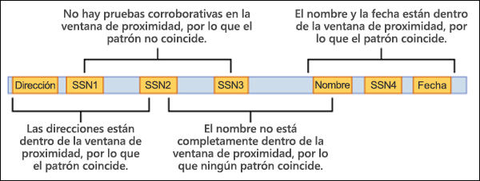

# <a name="learn-about-sensitive-information-types"></a><span data-ttu-id="3a70b-102">Obtener más información acerca de los tipos de información confidencial</span><span class="sxs-lookup"><span data-stu-id="3a70b-102">Learn about sensitive information types</span></span>

<span data-ttu-id="3a70b-103">Identificar y clasificar elementos confidenciales que están bajo el control de las organizaciones es el primer paso de la disciplina [de Protección de la información.](./information-protection.md)</span><span class="sxs-lookup"><span data-stu-id="3a70b-103">Identifying and classifying sensitive items that are under your organizations control is the first step in the [Information Protection discipline](./information-protection.md).</span></span>  <span data-ttu-id="3a70b-104">Microsoft 365 proporciona tres formas de identificar elementos para que se puedan clasificar:</span><span class="sxs-lookup"><span data-stu-id="3a70b-104">Microsoft 365 provides three ways of identifying items so that they can be classified:</span></span>

- <span data-ttu-id="3a70b-105">manualmente por los usuarios</span><span class="sxs-lookup"><span data-stu-id="3a70b-105">manually by users</span></span>
- <span data-ttu-id="3a70b-106">reconocimiento automatizado de patrones, como tipos de información confidencial</span><span class="sxs-lookup"><span data-stu-id="3a70b-106">automated pattern recognition, like sensitive information types</span></span>
- [<span data-ttu-id="3a70b-107">aprendizaje automático</span><span class="sxs-lookup"><span data-stu-id="3a70b-107">machine learning</span></span>](classifier-learn-about.md)

<span data-ttu-id="3a70b-108">Los tipos de información confidencial son clasificadores basados en patrones.</span><span class="sxs-lookup"><span data-stu-id="3a70b-108">Sensitive information types are pattern-based classifiers.</span></span> <span data-ttu-id="3a70b-109">Detectan información confidencial como seguridad social, tarjeta de crédito o números de cuenta bancaria para identificar elementos confidenciales, consulte [Definiciones](sensitive-information-type-entity-definitions.md) de entidades de tipos de información confidencial</span><span class="sxs-lookup"><span data-stu-id="3a70b-109">They detect sensitive information like social security, credit card, or bank account numbers to identify sensitive items, see [Sensitive information types entity definitions](sensitive-information-type-entity-definitions.md)</span></span>

## <a name="sensitive-information-types-are-used-in"></a><span data-ttu-id="3a70b-110">Los tipos de información confidencial se usan en</span><span class="sxs-lookup"><span data-stu-id="3a70b-110">Sensitive information types are used in</span></span>

- [<span data-ttu-id="3a70b-111">Directivas de prevención de pérdida de datos</span><span class="sxs-lookup"><span data-stu-id="3a70b-111">Data loss prevention policies</span></span>](dlp-learn-about-dlp.md) 
- [<span data-ttu-id="3a70b-112">Etiquetas de confidencialidad</span><span class="sxs-lookup"><span data-stu-id="3a70b-112">Sensitivity labels</span></span>](sensitivity-labels.md)
- [<span data-ttu-id="3a70b-113">Etiquetas de retención</span><span class="sxs-lookup"><span data-stu-id="3a70b-113">Retention labels</span></span>](retention.md)
- [<span data-ttu-id="3a70b-114">Administración de riesgos internos</span><span class="sxs-lookup"><span data-stu-id="3a70b-114">Insider risk management</span></span>](insider-risk-management.md)
- [<span data-ttu-id="3a70b-115">Cumplimiento de las comunicaciones</span><span class="sxs-lookup"><span data-stu-id="3a70b-115">Communication compliance</span></span>](communication-compliance.md)
- [<span data-ttu-id="3a70b-116">Directivas de etiquetado automático</span><span class="sxs-lookup"><span data-stu-id="3a70b-116">Auto-labelling policies</span></span>](apply-sensitivity-label-automatically.md#how-to-configure-auto-labeling-for-office-apps)

## <a name="fundamental-parts-of-a-sensitive-information-type"></a><span data-ttu-id="3a70b-117">Partes fundamentales de un tipo de información confidencial</span><span class="sxs-lookup"><span data-stu-id="3a70b-117">Fundamental parts of a sensitive information type</span></span>

<span data-ttu-id="3a70b-118">Cada entidad de tipo de información confidencial se define mediante estos campos:</span><span class="sxs-lookup"><span data-stu-id="3a70b-118">Every sensitive information type entity is defined by these fields:</span></span>

- <span data-ttu-id="3a70b-119">nombre: cómo se hace referencia al tipo de información confidencial</span><span class="sxs-lookup"><span data-stu-id="3a70b-119">name: how the sensitive information type is referred to</span></span>
- <span data-ttu-id="3a70b-120">descripción: describe lo que busca el tipo de información confidencial</span><span class="sxs-lookup"><span data-stu-id="3a70b-120">description: describes what the sensitive information type is looking for</span></span>
- <span data-ttu-id="3a70b-121">patrón: un patrón define lo que detecta un tipo de información confidencial.</span><span class="sxs-lookup"><span data-stu-id="3a70b-121">pattern: A pattern defines what a sensitive information type detects.</span></span> <span data-ttu-id="3a70b-122">Consta de los siguientes componentes</span><span class="sxs-lookup"><span data-stu-id="3a70b-122">It consists of the following components</span></span>
    - <span data-ttu-id="3a70b-123">Elemento principal: el elemento principal que busca el tipo de información confidencial.</span><span class="sxs-lookup"><span data-stu-id="3a70b-123">Primary element – the main element that the sensitive information type is looking for.</span></span> <span data-ttu-id="3a70b-124">Puede ser una expresión **regular con** o sin una validación de suma de comprobación, una lista de palabras **clave,** un **diccionario** de palabras clave o una **función**.</span><span class="sxs-lookup"><span data-stu-id="3a70b-124">It can be a **regular expression** with or without a checksum validation, a **keyword list**, a **keyword dictionary**, or a **function**.</span></span>
    - <span data-ttu-id="3a70b-125">Elemento de soporte: elementos que actúan como pruebas de soporte que ayudan a aumentar la confianza de la coincidencia.</span><span class="sxs-lookup"><span data-stu-id="3a70b-125">Supporting element – elements that act as supporting evidence that help in increasing the confidence of the match.</span></span> <span data-ttu-id="3a70b-126">Por ejemplo, la palabra clave "SSN" cerca de un número SSN.</span><span class="sxs-lookup"><span data-stu-id="3a70b-126">For example, keyword “SSN” in proximity of an SSN number.</span></span> <span data-ttu-id="3a70b-127">Puede ser una expresión regular con o sin validación de suma de comprobación, lista de palabras clave, diccionario de palabras clave.</span><span class="sxs-lookup"><span data-stu-id="3a70b-127">It can be a regular expression with or without a checksum validation, keyword list, keyword dictionary.</span></span>
    - <span data-ttu-id="3a70b-128">Nivel de confianza: los niveles de confianza (altos, medianos, bajos) reflejan la cantidad de evidencia de soporte que se detectó junto con el elemento principal.</span><span class="sxs-lookup"><span data-stu-id="3a70b-128">Confidence Level - Confidence levels (high, medium, low) reflect how much supporting evidence was detected along with the primary element.</span></span> <span data-ttu-id="3a70b-129">Cuanto más evidencia de soporte técnico contenga un elemento, mayor será la confianza de que un elemento coincidente contenga la información confidencial que está buscando.</span><span class="sxs-lookup"><span data-stu-id="3a70b-129">The more supporting evidence an item contains, the higher the confidence that a matched item contains the sensitive info you're looking for.</span></span>
    - <span data-ttu-id="3a70b-130">Proximidad: número de caracteres entre el elemento principal y el elemento de soporte técnico</span><span class="sxs-lookup"><span data-stu-id="3a70b-130">Proximity – Number of characters between primary and supporting element</span></span>



<span data-ttu-id="3a70b-132">Obtenga más información sobre los niveles de confianza en este vídeo</span><span class="sxs-lookup"><span data-stu-id="3a70b-132">Learn more about confidence levels in this video</span></span>


 > [!VIDEO https://www.microsoft.com/videoplayer/embed/RE4Hx60]  

### <a name="example-sensitive-information-type"></a><span data-ttu-id="3a70b-133">Tipo de información confidencial de ejemplo</span><span class="sxs-lookup"><span data-stu-id="3a70b-133">Example sensitive information type</span></span>


## <a name="argentina-national-identity-dni-number"></a><span data-ttu-id="3a70b-134">Número de identidad nacional (DNI) de Argentina</span><span class="sxs-lookup"><span data-stu-id="3a70b-134">Argentina national identity (DNI) number</span></span>

### <a name="format"></a><span data-ttu-id="3a70b-135">Formato</span><span class="sxs-lookup"><span data-stu-id="3a70b-135">Format</span></span>

<span data-ttu-id="3a70b-136">Ocho dígitos separados por puntos</span><span class="sxs-lookup"><span data-stu-id="3a70b-136">Eight digits separated by periods</span></span>

### <a name="pattern"></a><span data-ttu-id="3a70b-137">Patrón</span><span class="sxs-lookup"><span data-stu-id="3a70b-137">Pattern</span></span>

<span data-ttu-id="3a70b-138">Ocho dígitos:</span><span class="sxs-lookup"><span data-stu-id="3a70b-138">Eight digits:</span></span>
- <span data-ttu-id="3a70b-139">dos dígitos</span><span class="sxs-lookup"><span data-stu-id="3a70b-139">two digits</span></span>
- <span data-ttu-id="3a70b-140">un punto</span><span class="sxs-lookup"><span data-stu-id="3a70b-140">a period</span></span>
- <span data-ttu-id="3a70b-141">tres dígitos</span><span class="sxs-lookup"><span data-stu-id="3a70b-141">three digits</span></span>
- <span data-ttu-id="3a70b-142">un punto</span><span class="sxs-lookup"><span data-stu-id="3a70b-142">a period</span></span>
- <span data-ttu-id="3a70b-143">tres dígitos</span><span class="sxs-lookup"><span data-stu-id="3a70b-143">three digits</span></span>

### <a name="checksum"></a><span data-ttu-id="3a70b-144">Suma de comprobación</span><span class="sxs-lookup"><span data-stu-id="3a70b-144">Checksum</span></span>

<span data-ttu-id="3a70b-145">No</span><span class="sxs-lookup"><span data-stu-id="3a70b-145">No</span></span>

### <a name="definition"></a><span data-ttu-id="3a70b-146">Definición</span><span class="sxs-lookup"><span data-stu-id="3a70b-146">Definition</span></span>

<span data-ttu-id="3a70b-147">Una directiva DLP tiene confianza mediana en que se ha detectado este tipo de información confidencial si, en una proximidad de 300 caracteres:</span><span class="sxs-lookup"><span data-stu-id="3a70b-147">A DLP policy has medium confidence that it's detected this type of sensitive information if, within a proximity of 300 characters:</span></span>
- <span data-ttu-id="3a70b-148">La expresión regular Regex_argentina_national_id encuentra contenido que coincide con el patrón.</span><span class="sxs-lookup"><span data-stu-id="3a70b-148">The regular expression Regex_argentina_national_id finds content that matches the pattern.</span></span>
- <span data-ttu-id="3a70b-149">Se encuentra una palabra clave de Keyword_argentina_national_id.</span><span class="sxs-lookup"><span data-stu-id="3a70b-149">A keyword from Keyword_argentina_national_id is found.</span></span>

```xml
<!-- Argentina National Identity (DNI) Number -->
<Entity id="eefbb00e-8282-433c-8620-8f1da3bffdb2" recommendedConfidence="75" patternsProximity="300">
   <Pattern confidenceLevel="75">
      <IdMatch idRef="Regex_argentina_national_id"/>
      <Match idRef="Keyword_argentina_national_id"/>
  </Pattern>
</Entity>
```

### <a name="keywords"></a><span data-ttu-id="3a70b-150">Palabras clave</span><span class="sxs-lookup"><span data-stu-id="3a70b-150">Keywords</span></span>

#### <a name="keyword_argentina_national_id"></a><span data-ttu-id="3a70b-151">Keyword_argentina_national_id</span><span class="sxs-lookup"><span data-stu-id="3a70b-151">Keyword_argentina_national_id</span></span>

- <span data-ttu-id="3a70b-152">Número de identidad nacional de Argentina</span><span class="sxs-lookup"><span data-stu-id="3a70b-152">Argentina National Identity number</span></span> 
- <span data-ttu-id="3a70b-153">Identidad</span><span class="sxs-lookup"><span data-stu-id="3a70b-153">Identity</span></span> 
- <span data-ttu-id="3a70b-154">Identificación tarjeta de identidad nacional</span><span class="sxs-lookup"><span data-stu-id="3a70b-154">Identification National Identity Card</span></span> 
- <span data-ttu-id="3a70b-155">DNI</span><span class="sxs-lookup"><span data-stu-id="3a70b-155">DNI</span></span> 
- <span data-ttu-id="3a70b-156">Registro nacional de personas de NIC</span><span class="sxs-lookup"><span data-stu-id="3a70b-156">NIC National Registry of Persons</span></span> 
- <span data-ttu-id="3a70b-157">Documento Nacional de Identidad</span><span class="sxs-lookup"><span data-stu-id="3a70b-157">Documento Nacional de Identidad</span></span> 
- <span data-ttu-id="3a70b-158">Registro nacional de las personas</span><span class="sxs-lookup"><span data-stu-id="3a70b-158">Registro Nacional de las Personas</span></span> 
- <span data-ttu-id="3a70b-159">Identidad</span><span class="sxs-lookup"><span data-stu-id="3a70b-159">Identidad</span></span> 
- <span data-ttu-id="3a70b-160">Identificación</span><span class="sxs-lookup"><span data-stu-id="3a70b-160">Identificación</span></span> 

### <a name="more-on-confidence-levels"></a><span data-ttu-id="3a70b-161">Más información sobre los niveles de confianza</span><span class="sxs-lookup"><span data-stu-id="3a70b-161">More on confidence levels</span></span>

<span data-ttu-id="3a70b-162">En una definición de entidad de tipo de información **confidencial,** el nivel de confianza refleja la cantidad de evidencia compatible que se detecta además del elemento principal.</span><span class="sxs-lookup"><span data-stu-id="3a70b-162">In a sensitive information type entity definition, **confidence level** reflects how much supporting evidence is detected in addition to the primary element.</span></span> <span data-ttu-id="3a70b-163">Cuanto más evidencia de soporte técnico contenga un elemento, mayor será la confianza de que un elemento coincidente contenga la información confidencial que está buscando.</span><span class="sxs-lookup"><span data-stu-id="3a70b-163">The more supporting evidence an item contains, the higher the confidence that a matched item contains the sensitive info you're looking for.</span></span> <span data-ttu-id="3a70b-164">Por ejemplo, las coincidencias con un nivel de confianza alto contendrán evidencias más compatibles cerca del elemento principal, mientras que las coincidencias con un nivel de confianza bajo contendrán poca o ninguna evidencia compatible en proximidad.</span><span class="sxs-lookup"><span data-stu-id="3a70b-164">For example, matches with a high confidence level will contain more supporting evidence in close proximity of the primary element, whereas matches with a low confidence level would contain little to no supporting evidence in close proximity.</span></span> 

<span data-ttu-id="3a70b-165">Un nivel de confianza alto devuelve el menor número de falsos positivos, pero puede dar como resultado más falsos negativos.</span><span class="sxs-lookup"><span data-stu-id="3a70b-165">A high confidence level returns the fewest false positives but might result in more false negatives.</span></span> <span data-ttu-id="3a70b-166">Los niveles de confianza bajos o medianos devuelven más falsos positivos, pero de pocos a cero falsos negativos.</span><span class="sxs-lookup"><span data-stu-id="3a70b-166">Low or medium confidence levels returns more false positives but few to zero false negatives.</span></span>

- <span data-ttu-id="3a70b-167">**confianza baja:** valor de 65, los elementos coincidentes contendrán el menor número de falsos negativos, pero los más falsos positivos.</span><span class="sxs-lookup"><span data-stu-id="3a70b-167">**low confidence**: Value of 65, matched items will contain the fewest false negatives but the most false positives.</span></span> <span data-ttu-id="3a70b-168">La confianza baja devuelve todas las coincidencias de confianza baja, media y alta.</span><span class="sxs-lookup"><span data-stu-id="3a70b-168">Low confidence returns all low, medium, and high confidence matches.</span></span>
- <span data-ttu-id="3a70b-169">**confianza media:** valor de 75, los elementos coincidentes contendrán una cantidad promedio de falsos positivos y falsos negativos.</span><span class="sxs-lookup"><span data-stu-id="3a70b-169">**medium confidence**: Value of 75, matched items will contain an average amount of false positives and false negatives.</span></span> <span data-ttu-id="3a70b-170">La confianza media devuelve todas las coincidencias de confianza media y alta.</span><span class="sxs-lookup"><span data-stu-id="3a70b-170">Medium confidence returns all medium, and high confidence matches.</span></span>  
- <span data-ttu-id="3a70b-171">**elevada confianza:** valor de 85, los elementos coincidentes contendrán el menor número de falsos positivos, pero los negativos más falsos.</span><span class="sxs-lookup"><span data-stu-id="3a70b-171">**high confidence**: Value of 85, matched items will contain the fewest false positives but the most false negatives.</span></span> <span data-ttu-id="3a70b-172">La confianza alta solo devuelve coincidencias de confianza alta.</span><span class="sxs-lookup"><span data-stu-id="3a70b-172">High confidence only returns high confidence matches.</span></span>  

<span data-ttu-id="3a70b-173">Debe usar patrones de alto nivel de confianza con recuentos bajos, por ejemplo, de cinco a diez, y patrones de confianza bajos con recuentos más altos, por ejemplo, 20 o más.</span><span class="sxs-lookup"><span data-stu-id="3a70b-173">You should use high confidence level patterns with low counts, say five to ten, and low confidence patterns with higher counts, say 20 or more.</span></span>

> [!NOTE]
> <span data-ttu-id="3a70b-174">Si tiene directivas existentes o tipos de información confidencial personalizados (SIT) definidos con niveles de confianza basados en números (también conocidos como precisión), se asignarán automáticamente a los tres niveles de confianza discretos; confianza baja, confianza media y confianza alta, en toda la interfaz de usuario del Centro de seguridad y cumplimiento.</span><span class="sxs-lookup"><span data-stu-id="3a70b-174">If you have existing policies or custom sensitive information types (SITs) defined using number-based confidence levels (also know as accuracy), they will automatically be mapped to the three discrete confidence levels; low confidence, medium confidence, and high confidence, across the Security @ Compliance Center UI.</span></span>
> - <span data-ttu-id="3a70b-175">Todas las directivas con precisión mínima o patrones SIT personalizados con niveles de confianza de entre 76 y 100 se asignarán a una elevada confianza.</span><span class="sxs-lookup"><span data-stu-id="3a70b-175">All policies with minimum accuracy or custom SIT patterns with confidence levels of between 76 and 100 will be mapped to high confidence.</span></span> 
> - <span data-ttu-id="3a70b-176">Todas las directivas con precisión mínima o patrones SIT personalizados con niveles de confianza de entre 66 y 75 se asignarán a confianza mediana.</span><span class="sxs-lookup"><span data-stu-id="3a70b-176">All policies with minimum accuracy or custom SIT patterns with confidence levels of between 66 and 75 will be mapped to medium confidence.</span></span>
> - <span data-ttu-id="3a70b-177">Todas las directivas con precisión mínima o patrones SIT personalizados con niveles de confianza inferiores o iguales a 65 se asignarán a una confianza baja.</span><span class="sxs-lookup"><span data-stu-id="3a70b-177">All policies with minimum accuracy or custom SIT patterns with confidence levels less than or equal to 65 will be mapped to low confidence.</span></span> 

## <a name="creating-custom-sensitive-information-types"></a><span data-ttu-id="3a70b-178">Crear tipos de información confidencial personalizados</span><span class="sxs-lookup"><span data-stu-id="3a70b-178">Creating custom sensitive information types</span></span>

<span data-ttu-id="3a70b-179">Para crear tipos de información confidencial personalizados en el Centro de seguridad y cumplimiento, puede elegir una de estas opciones:</span><span class="sxs-lookup"><span data-stu-id="3a70b-179">To create custom sensitive information types in the Security & Compliance Center, you can choose from several options:</span></span>

- <span data-ttu-id="3a70b-180">**Usar la interfaz de usuario** Puede configurar un tipo de información confidencial personalizado mediante la interfaz de usuario del centro de cumplimiento y seguridad.</span><span class="sxs-lookup"><span data-stu-id="3a70b-180">**Use the UI** You can set up a custom sensitive information type using the Security & Compliance Center UI.</span></span> <span data-ttu-id="3a70b-181">Con este método, puede usar expresiones regulares, palabras clave y diccionarios de palabras clave.</span><span class="sxs-lookup"><span data-stu-id="3a70b-181">With this method, you can use regular expressions, keywords, and keyword dictionaries.</span></span> <span data-ttu-id="3a70b-182">Para obtener más información, consulte [Crear un tipo de información confidencial](create-a-custom-sensitive-information-type.md).</span><span class="sxs-lookup"><span data-stu-id="3a70b-182">To learn more, see [Create a custom sensitive information type](create-a-custom-sensitive-information-type.md).</span></span>

- <span data-ttu-id="3a70b-183">**Usar EDM** Puede establecer los tipos de información confidencial mediante la clasificación basada en la coincidencia exacta de los datos (EDM).</span><span class="sxs-lookup"><span data-stu-id="3a70b-183">**Use EDM** You can set up custom sensitive information types using Exact Data Match (EDM)-based classification.</span></span> <span data-ttu-id="3a70b-184">Este método le permite crear un tipo de información confidencial dinámico con una base de datos segura que puede actualizar periódicamente.</span><span class="sxs-lookup"><span data-stu-id="3a70b-184">This method enables you to create a dynamic sensitive information type using a secure database that you can refresh periodically.</span></span> <span data-ttu-id="3a70b-185">Vea [Crear un tipo de información confidencial personalizado con coincidencia exacta de datos](create-custom-sensitive-information-types-with-exact-data-match-based-classification.md).</span><span class="sxs-lookup"><span data-stu-id="3a70b-185">See [Create a custom sensitive information type with Exact Data Match based classification](create-custom-sensitive-information-types-with-exact-data-match-based-classification.md).</span></span>

- <span data-ttu-id="3a70b-186">**Usar PowerShell** Puede configurar los tipos de información confidencial con PowerShell.</span><span class="sxs-lookup"><span data-stu-id="3a70b-186">**Use PowerShell** You can set up custom sensitive information types using PowerShell.</span></span> <span data-ttu-id="3a70b-187">Aunque este método es más complejo que utilizar la interfaz de usuario, tendrá más opciones de configuración.</span><span class="sxs-lookup"><span data-stu-id="3a70b-187">Although this method is more complex than using the UI, you have more configuration options.</span></span> <span data-ttu-id="3a70b-188">Vea [Crear un tipo de información confidencial en el centro de cumplimiento y seguridad PowerShell](create-a-custom-sensitive-information-type-in-scc-powershell.md).</span><span class="sxs-lookup"><span data-stu-id="3a70b-188">See [Create a custom sensitive information type in Security & Compliance Center PowerShell](create-a-custom-sensitive-information-type-in-scc-powershell.md).</span></span>


> [!NOTE]
> <span data-ttu-id="3a70b-189">Los niveles de confianza mejorados están disponibles para su uso inmediato en Prevención de pérdida de datos para servicios Microsoft 365, Microsoft Information Protection para servicios Microsoft 365, Cumplimiento de comunicaciones, Gobierno de la información y Administración de registros.</span><span class="sxs-lookup"><span data-stu-id="3a70b-189">Improved confidence levels are available for immediate use within Data Loss Prevention for Microsoft 365 services, Microsoft Information Protection for Microsoft 365 services, Communication Compliance, Information Governance, and Records Management.</span></span>

> <span data-ttu-id="3a70b-190">Microsoft 365 Information Protection ahora es compatible con la vista previa de idiomas con conjunto de caracteres de doble byte para:</span><span class="sxs-lookup"><span data-stu-id="3a70b-190">Microsoft 365 Information Protection now  supports in preview double byte character set languages for:</span></span>
> - <span data-ttu-id="3a70b-191">Chino (simplificado)</span><span class="sxs-lookup"><span data-stu-id="3a70b-191">Chinese (simplified)</span></span>
> - <span data-ttu-id="3a70b-192">Chino (tradicional)</span><span class="sxs-lookup"><span data-stu-id="3a70b-192">Chinese (traditional)</span></span>
> - <span data-ttu-id="3a70b-193">Coreano</span><span class="sxs-lookup"><span data-stu-id="3a70b-193">Korean</span></span>
> - <span data-ttu-id="3a70b-194">Japonés</span><span class="sxs-lookup"><span data-stu-id="3a70b-194">Japanese</span></span>

><span data-ttu-id="3a70b-195">Este soporte está disponible para tipos de información confidencial.</span><span class="sxs-lookup"><span data-stu-id="3a70b-195">This support is available for sensitive information types.</span></span> <span data-ttu-id="3a70b-196">Para más información, consulte [Notas de la versión sobre la compatibilidad de Information Protection con juegos de caracteres de doble byte (vista previa)](mip-dbcs-relnotes.md).</span><span class="sxs-lookup"><span data-stu-id="3a70b-196">See, [Information protection support for double byte character sets release notes (preview)](mip-dbcs-relnotes.md) for more information.</span></span>

## <a name="for-further-information"></a><span data-ttu-id="3a70b-197">Para obtener más información</span><span class="sxs-lookup"><span data-stu-id="3a70b-197">For further information</span></span>
- [<span data-ttu-id="3a70b-198">Definiciones de entidad de tipos de información confidencial</span><span class="sxs-lookup"><span data-stu-id="3a70b-198">Sensitive information type entity definitions</span></span>](sensitive-information-type-entity-definitions.md)
- [<span data-ttu-id="3a70b-199">Crear un tipo personalizado de información confidencial</span><span class="sxs-lookup"><span data-stu-id="3a70b-199">Create a custom sensitive information type</span></span>](create-a-custom-sensitive-information-type.md)
- [<span data-ttu-id="3a70b-200">Crear un tipo de información confidencial personalizada en PowerShell</span><span class="sxs-lookup"><span data-stu-id="3a70b-200">Create a custom sensitive information type in PowerShell</span></span>](create-a-custom-sensitive-information-type-in-scc-powershell.md)

<span data-ttu-id="3a70b-201">Para obtener información sobre cómo usar tipos de información confidencial para cumplir con las normativas de privacidad de datos, vea [Deploy information protection for data privacy regulations with Microsoft 365](../solutions/information-protection-deploy.md) (aka.ms/m365dataprivacy).</span><span class="sxs-lookup"><span data-stu-id="3a70b-201">To learn how to use sensitive information types to comply with data privacy regulations, see [Deploy information protection for data privacy regulations with Microsoft 365](../solutions/information-protection-deploy.md)  (aka.ms/m365dataprivacy).</span></span>

<!-- fwlink for this topic https://go.microsoft.com/fwlink/?linkid=2135644-->