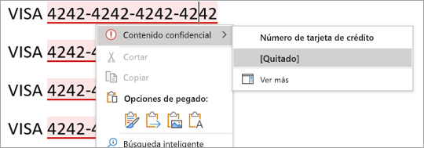

# Por qué elegir el etiquetado integrado en lugar del complemento de AIP para aplicaciones de Office

>*[Guía de licencias de Microsoft 365 para la seguridad y el cumplimiento](/office365/servicedescriptions/microsoft-365-service-descriptions/microsoft-365-tenantlevel-services-licensing-guidance/microsoft-365-security-compliance-licensing-guidance).*

Al usar [etiquetas de confidencialidad](sensitivity-labels.md) en aplicaciones de Microsoft 365 en equipos Windows, tiene la opción de utilizar el etiquetado integrado en las aplicaciones de Office o un complemento del [cliente de etiquetado unificado de Azure Information Protection (AIP)](/azure/information-protection/rms-client/aip-clientv2). 

El etiquetado integrado constituye la piedra angular de una [implementación de Microsoft Purview Information Protection](information-protection-solution.md), ya que esta tecnología de etiquetado se extiende entre plataformas (Windows, macOS, iOS, Android y la Web), así como en todas las aplicaciones y servicios de Microsoft, y mucho más. El etiquetado integrado también está diseñado para funcionar con otras funcionalidades de Microsoft Purview, como la clasificación de datos y la prevención de pérdida de datos (DLP) de Microsoft Purview.

Dado que las etiquetas integradas no usan un complemento de Office, se benefician de una mayor estabilidad y un mejor rendimiento. También admiten las características más recientes de Microsoft Purview, como los clasificadores avanzados.

De forma predeterminada, el etiquetado integrado está desactivado en las aplicaciones de Office para Windows cuando se instala el cliente de AIP. Puede cambiar este comportamiento predeterminado siguiendo las instrucciones de la sección siguiente, [Cómo deshabilitar el complemento de AIP para usar el etiquetado integrado para aplicaciones de Office](#how-to-disable-the-aip-add-in-to-use-built-in-labeling-for-office-apps).

Al mantener el cliente de AIP instalado pero deshabilitado en las aplicaciones de Office, las demás funcionalidades del cliente de AIP siguen siendo compatibles:

- Opciones de botón derecho en el explorador de archivos para que los usuarios puedan aplicar etiquetas a todos los tipos de archivo.

- Un visor para mostrar archivos cifrados para texto, imágenes o documentos PDF.

- Un módulo de PowerShell para detectar información confidencial en los archivos locales y aplicar o quitar las etiquetas y el cifrado de estos archivos.

- Un escáner para detectar información confidencial almacenada en almacenes de datos locales y, si quiere, etiquetar el contenido

Para obtener más información sobre estas capacidades que amplían el etiquetado más allá de las aplicaciones de Office, consulte la [Guía del administrador de clientes de etiquetado unificado de Azure Information Protection](/azure/information-protection/rms-client/clientv2-admin-guide) de la documentación de AIP.

Independientemente del etiquetado, puede seguir usando el módulo [AIPService](/powershell/module/aipservice) PowerShell para la administración a nivel de inquilino del servicio de cifrado. Por ejemplo, configure el acceso de superusuario cuando necesite quitar el cifrado para la recuperación de datos, realizar un seguimiento y revocar documentos abiertos por el cliente de AIP y configurar el período de validez de la licencia de uso para el acceso sin conexión. Para obtener más información, consulte [Administrar la protección de Azure Information Protection mediante PowerShell](/azure/information-protection/administer-powershell).

## Decidir si usar el etiquetado integrado para las aplicaciones de Office o el complemento de AIP

Ahora que el cliente de AIP está en [modo de mantenimiento](https://techcommunity.microsoft.com/t5/security-compliance-and-identity/announcing-aip-unified-labeling-client-maintenance-mode-and/ba-p/3043613), no se recomienda usar el complemento de AIP para las aplicaciones de Office por los siguientes motivos:

- No se admiten nuevas características de etiquetado.
- Los complementos son menos estables porque pueden entrar en conflicto con otros complementos que pueden provocar que las aplicaciones de Office se cuelguen, se bloqueen o deshabiliten automáticamente el complemento.
- Como complemento, se ejecuta más lentamente y los usuarios pueden deshabilitarlo para omitir los requisitos de etiquetado.
- Cualquier corrección de errores requerirá volver a instalar el cliente de Azure Information Protection.
- La experiencia de etiquetado para los usuarios es ligeramente diferente de las etiquetas integradas que los usuarios tienen en sus otros dispositivos (macOS, iOS y Android) y cuando usan Office para la Web. Esta diferencia podría aumentar los costos de aprendizaje y soporte técnico.
- Ya hay nuevas características de etiquetado de Office publicadas que [solo son compatibles con el etiquetado integrado](#features-supported-only-by-built-in-labeling-for-office-apps), y la lista crece constantemente.

Use el complemento de AIP para las aplicaciones de Windows Office solo si ya lo ha implementado para los usuarios y necesita tiempo para la migración al etiquetado integrado. O bien, si los usuarios necesitan una característica que no es compatible con el etiquetado integrado. Use la [información de paridad de características](#feature-parity-for-built-in-labeling-and-the-aip-add-in-for-office-apps) de esta página para ayudarle a identificar estas características.

## Características admitidas solo por el etiquetado integrado para aplicaciones de Office

> [!NOTE]
> Muchas características de etiquetado nuevas se encuentran en fase de planificación o desarrollo, por lo que se espera que la lista de esta sección crezca con el paso del tiempo.

Algunas características solo son compatibles con el etiquetado integrado para las aplicaciones de Office y no serán compatibles con el complemento de AIP. Estas incluyen: 

- Para el etiquetado automático y recomendado:
    - Acceso a servicios de clasificación inteligentes que incluyen [clasificadores capacitados](classifier-learn-about.md), [coincidencia exacta de datos (EDM)](sit-learn-about-exact-data-match-based-sits.md) y [entidades con nombre](named-entities-learn.md)
    - Detección de información confidencial a medida que los usuarios escriben
    - En Word, los usuarios pueden revisar y quitar el contenido confidencial identificado
- [Soporte de PDF](sensitivity-labels-office-apps.md#pdf-support) (en versión preliminar)
- En el caso de las etiquetas que permiten a los usuarios asignar permisos, se pueden conceder permisos diferentes (lectura o cambio) a usuarios o grupos
- Solo cifrar para correos electrónicos
- Visibilidad de etiquetas en la barra de estado
- Compatibilidad con el cambio de cuentas
- Los usuarios no pueden deshabilitar el etiquetado

Ejemplo que muestra cómo los usuarios pueden revisar y, opcionalmente, quitar contenido confidencial identificado en Word:

Para estar a la última con las nuevas funcionalidades de etiquetado disponibles para el etiquetado integrado, consulte las secciones [Novedades en Microsoft Purview](whats-new.md) y **Etiquetas de confidencialidad**.

## Cómo deshabilitar el complemento de AIP para usar el etiquetado integrado para las aplicaciones de Office

Cuando haya instalado el cliente de AIP para ampliar el etiquetado más allá de las aplicaciones de Office, pero quiera evitar que el complemento del cliente se cargue en las aplicaciones de Office, use la configuración de directiva de grupo **Lista de complementos administrados** como se documenta en [No hay complementos cargados debido a la configuración de directiva de grupo para los programas de Office 2013 y Office 2016](https://support.microsoft.com/help/2733070/no-add-ins-loaded-due-to-group-policy-settings-for-office-2013-and-off).

Para las aplicaciones de Windows Office que admiten el etiquetado integrado, use la configuración de Microsoft Word 2016, Excel 2016, PowerPoint 2016 y Outlook 2016, especifique los siguientes identificadores de programación (ProgID) para el cliente de AIP y establezca la opción en **0: el complemento siempre está deshabilitado (bloqueado)**

|Aplicación  |ProgID  |
|---------|---------|
|Word     |     `MSIP.WordAddin`    |
|Excel     |  `MSIP.ExcelAddin`       |
|PowerPoint     |   `MSIP.PowerPointAddin`      |
|Outlook | `MSIP.OutlookAddin` |
| | | 

Implementar esta configuración mediante la directiva de grupo o mediante el [Servicio de directiva de la nube de Office](/DeployOffice/overview-office-cloud-policy-service).

> [!IMPORTANT]
> Si utiliza la configuración de directiva de grupo **Usar la característica Confidencialidad de Office para aplicar y ver las etiquetas de confidencialidad** y la establece en **1**, hay algunas situaciones en las que el complemento de AIP puede seguir cargándose en las aplicaciones de Office. Bloquear la carga del complemento en cada aplicación impide que esto suceda.

Como alternativa, puede deshabilitar o quitar de forma interactiva el complemento de Office **Microsoft Azure Information Protection** de Word, Excel, PowerPoint y Outlook. Este método es adecuado para un solo ordenador y para pruebas ad hoc. Para obtener instrucciones, consulte [Ver, administrar e instalar complementos en los programas de Office](https://support.office.com/article/16278816-1948-4028-91e5-76dca5380f8d).

Independientemente del método que elija, los cambios surtirán efecto cuando se reinicien las aplicaciones de Office.

Si, después de realizar estos cambios, el botón **Confidencialidad** no se muestra en la cinta de Office, compruebe si se ha [desactivado](sensitivity-labels-office-apps.md#if-you-need-to-turn-off-built-in-labeling-in-office-apps-on-windows) el etiquetado de confidencialidad.  Aunque esta no es la configuración predeterminada, es posible que un administrador haya establecido explícitamente esta configuración mediante directiva de grupo o editando directamente el Registro.

> [!NOTE]
> Las etiquetas integradas requieren una edición de suscripción a las aplicaciones de Office. Si tiene ediciones independientes de Office, a veces denominadas "Office Perpetua", le recomendamos que actualice a Aplicaciones de Microsoft 365 para empresas para beneficiarse de las [capacidades de etiquetado más recientes](sensitivity-labels-office-apps.md#support-for-sensitivity-label-capabilities-in-apps).

Recuerde que, cuando use este método para deshabilitar el complemento de AIP, podrá seguir usando el cliente de AIP para ampliar el etiquetado más allá de las aplicaciones de Office.

## Paridad de características para el etiquetado integrado y el complemento de AIP para aplicaciones de Office

Muchas de las características de etiquetado compatibles con el complemento de AIP ahora son compatibles con el etiquetado integrado. Para obtener una lista más detallada de las funcionalidades, las versiones mínimas que podrían ser necesarias e información de configuración, vea [Administrar etiquetas de confidencialidad en aplicaciones de Office](sensitivity-labels-office-apps.md).

Hay más características planeadas y en desarrollo. Si hay una característica específica que le interese, consulte el [plan de desarrollo de Microsoft 365](https://aka.ms/MIPC/Roadmap) y considere la posibilidad de unirse a la [protección de la información de Microsoft en la versión preliminar privada de Office](https://aka.ms/MIP/PreviewRing).

Use la siguiente información para identificar si usa una característica del complemento de AIP que aún no es compatible con el etiquetado integrado:

|Característica o funcionalidad del complemento AIP|Etiquetado integrado |
|:-------------------------------|:----------------:|
|**Categoría: General** ||
|Informes y auditorías centrales|  [Más información](sensitivity-labels-office-apps.md#auditing-labeling-activities) |
|Nube de administración pública||
|El administrador puede deshabilitar el etiquetado   - Todas las aplicaciones|    [Más información](sensitivity-labels-office-apps.md#if-you-need-to-turn-off-built-in-labeling-in-office-apps-on-windows)|
|El administrador puede deshabilitar el etiquetado   - Por aplicación|  En planificación o desarrollo|
|**Categoría: Experiencia del usuario** ||
|Botón Etiquetado de la cinta de opciones||
|Compatibilidad con varios idiomas para nombres de etiquetas e información sobre herramientas|   [Más información](create-sensitivity-labels.md#example-configuration-to-configure-a-sensitivity-label-for-different-languages) |
|Colores de etiqueta| En planificación o desarrollo |
|Visibilidad de etiquetas en la barra de herramientas| En planificación o desarrollo |
|**Categoría: Acciones de etiquetado** ||
|Etiquetado manual |    [Más información](https://support.microsoft.com/office/apply-sensitivity-labels-to-your-files-and-email-in-office-2f96e7cd-d5a4-403b-8bd7-4cc636bae0f9) |
|Etiquetado obligatorio |   [Más información](sensitivity-labels.md#what-label-policies-can-do)|
|Etiquetado predeterminado   - Elementos nuevos y existentes   - Configuración independiente del correo electrónico|    [Más información](sensitivity-labels.md#what-label-policies-can-do) |
|Recomendado o automático |  [Más información](apply-sensitivity-label-automatically.md#how-to-configure-auto-labeling-for-office-apps) |
|Justificación de cambiar a una versión anterior |    [Más información](sensitivity-labels.md#what-label-policies-can-do)|
| **Categoría: marcas visuales** | |
|Encabezados, pies de página, marca de agua|   [Más información](sensitivity-labels.md#what-label-policies-can-do)|
|Marcado dinámico|   [Más información](sensitivity-labels-office-apps.md#dynamic-markings-with-variables)|
|Marcado visual por aplicación|   [Más información](sensitivity-labels-office-apps.md#setting-different-visual-markings-for-word-excel-powerpoint-and-outlook)|
| **Categoría: cifrado** | |
|Permisos definidos por el administrador |   [Más información](encryption-sensitivity-labels.md#assign-permissions-now) |
|Permisos definidos por el usuario   - No reenviar para Outlook   - Permisos personalizados de usuario y grupo para Word, Excel y PowerPoint|   [Más información](encryption-sensitivity-labels.md#let-users-assign-permissions)|
|Permisos definidos por el usuario   - Permisos personalizados de toda la organización especificando dominios para Word, Excel y PowerPoint | En planificación o desarrollo |
|Coautoría y autoguardado |   [Más información](sensitivity-labels-coauthoring.md) |
|Cifrado de claves doble | En planificación o desarrollo |
|Revocación de documentos para usuarios | En revisión |
| | |

### Compatibilidad con la configuración avanzada de PowerShell

El cliente AIP admite muchas personalizaciones mediante la [configuración avanzada de PowerShell](/azure/information-protection/rms-client/clientv2-admin-guide-customizations#configuring-advanced-settings-for-the-client-via-powershell). Algunas de estas opciones avanzadas ahora son compatibles con el etiquetado integrado, tal como se documenta en [New-Label](/powershell/module/exchange/new-label) o [Set-Label](/powershell/module/exchange/set-label), y [New-LabelPolicy](/powershell/module/exchange/new-labelpolicy) o [Set-LabelPolicy](/powershell/module/exchange/set-labelpolicy).

Sin embargo, es posible que no necesite usar PowerShell para configurar las opciones admitidas porque se incluyen en la configuración estándar del Centro de cumplimiento de Microsoft Purview. Por ejemplo, la capacidad de desactivar el etiquetado obligatorio para Outlook y establecer una etiqueta predeterminada diferente.

Las siguientes configuraciones del complemento AIP aún no son compatibles con el etiquetado integrado:

- [Herencia de etiquetas de archivos adjuntos a mensajes de correo electrónico](/azure/information-protection/rms-client/clientv2-admin-guide-customizations#for-email-messages-with-attachments-apply-a-label-that-matches-the-highest-classification-of-those-attachments)
- [S/MIME para Outlook](/azure/information-protection/rms-client/clientv2-admin-guide-customizations#configure-a-label-to-apply-smime-protection-in-outlook)
    - Esta configuración está empezando a [implementarse en versión preliminar para el etiquetado integrado en todas las plataformas](sensitivity-labels-office-apps.md#configure-a-label-to-apply-smime-protection-in-outlook)
- [Compartir en exceso los mensajes emergentes para Outlook](/azure/information-protection/rms-client/clientv2-admin-guide-customizations#implement-pop-up-messages-in-outlook-that-warn-justify-or-block-emails-being-sent)
- [Subetiqueta predeterminada para una etiqueta principal](/azure/information-protection/rms-client/clientv2-admin-guide-customizations#specify-a-default-sublabel-for-a-parent-label)
- [Quitar marcas de contenido externo](/azure/information-protection/rms-client/clientv2-admin-guide-customizations#remove-headers-and-footers-from-other-labeling-solution )

## Características no planeadas para ser compatibles con el etiquetado integrado para las aplicaciones de Office

Aunque se agregan nuevas funcionalidades para el etiquetado integrado continuamente, el complemento de Office AIP admite las siguientes funcionalidades que no se planea que estén disponibles en futuras versiones para el etiquetado integrado:

- Aplicación de etiquetas a formatos de Microsoft Office 97-2003, como archivos .doc
- Registro de uso local en el registro de eventos de Windows
- Equipos desconectados permanentemente
- Ediciones independientes de Office (a veces denominadas "Office Perpetua") en lugar de basadas en suscripciones

## Siguientes pasos

Si desea obtener instrucciones para crear y configurar estas capacidades de etiquetado, vea [Crear y configurar etiquetas de confidencialidad y sus directivas](create-sensitivity-labels.md).

> [!TIP]
> Si ya tiene etiquetas de confidencialidad en el Centro de cumplimiento de Microsoft Purview, no podrá optar a la creación automática de etiquetas predeterminadas. Sin embargo, es posible que considere útil hacer referencia a su configuración: [Etiquetas de confidencialidad predeterminadas](mip-easy-trials.md#default-sensitivity-labels). 
