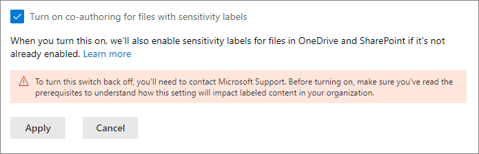
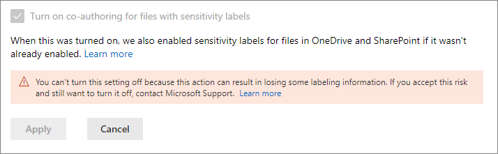

# Habilitar la coautoría para archivos cifrados con etiquetas de confidencialidad

>*[Instrucciones de licencias de Microsoft 365 para la seguridad y el cumplimiento](/office365/servicedescriptions/microsoft-365-service-descriptions/microsoft-365-tenantlevel-services-licensing-guidance/microsoft-365-security-compliance-licensing-guidance).*

> [!NOTE]
> Esta característica se encuentra en versión preliminar y está sujeta a cambios.

Habilite la configuración para admitir la [coautoría](https://support.office.com/article/ee1509b4-1f6e-401e-b04a-782d26f564a4) para las aplicaciones de escritorio de Office de modo que cuando las [etiquetas de confidencialidad](sensitivity-labels.md) etiquetan y cifran documentos, varios usuarios puedan editar estos documentos al mismo tiempo.

Sin esta configuración habilitada para su espacio empresarial, los usuarios deben extraer del repositorio un documento cifrado almacenado en SharePoint o OneDrive cuando usan aplicaciones de escritorio de Office. Como resultado, no pueden colaborar en tiempo real. O bien, deben usar Office en la Web cuando [las etiquetas de confidencialidad están habilitadas para los archivos de Office en SharePoint y OneDrive](sensitivity-labels-sharepoint-onedrive-files.md).

Además, habilitar esta funcionalidad hace que la característica de [Autoguardado](https://support.office.com/article/what-is-autosave-6d6bd723-ebfd-4e40-b5f6-ae6e8088f7a5) sea compatible con estos archivos cifrados y etiquetados.

Para leer el anuncio de lanzamiento inicial, consulte la publicación del blog [Anunciar la coautoría en documentos cifrados de protección de la información de Microsoft y actualizaciones de etiquetado](https://techcommunity.microsoft.com/t5/microsoft-security-and/announcing-co-authoring-on-microsoft-information-protection/ba-p/2164162).

## Cambios de metadatos para etiquetas de confidencialidad

> [!IMPORTANT]
> Después de habilitar la configuración para la coautoría, la información de etiquetado para los archivos sin cifrar ya no se guarda en las propiedades personalizadas.
> 
> No habilite esta configuración si usa aplicaciones, servicios, scripts o herramientas que lean o escriban metadatos de etiquetado en la ubicación anterior.

Antes de habilitar esta configuración para admitir la coautoría en las aplicaciones de escritorio de Office, es importante comprender que esta acción realiza cambios en los metadatos de etiquetado que se guardan y leen desde archivos de Office.

En los metadatos de etiquetado se incluye información que identifica el espacio empresarial y la etiqueta de confidencialidad aplicada. El cambio que realiza esta configuración es el formato de metadatos y la ubicación para los archivos Word, Excel y PowerPoint. No necesita realizar ninguna acción para archivos cifrados o correos electrónicos; el cambio de metadatos de los archivos cifrados es compatible con versiones anteriores y no hay cambios en los correos electrónicos. Sin embargo necesita ser consciente de los cambios de metadatos de los archivos cifrados que se pueden actualizar automáticamente pero que no son compatibles con versiones anteriores.

Este cambio afecta a los archivos que acaba de etiquetar y a los archivos que ya están etiquetados. Cuando use aplicaciones y servicios compatibles con la configuración de coautoría:
- Para los archivos que se etiquetaron recientemente, solo se usan el nuevo formato y la ubicación para los metadatos de etiquetado.
- Para los archivos que ya están etiquetados, la próxima vez que se abra y guarde el archivo, si el archivo tiene metadatos en el formato y la ubicación antiguos, se copiarán con el nuevo formato y ubicación.

Puede obtener más información sobre este cambio de metadatos en los siguientes recursos:

- Entrada de blog: [Próximos cambios del almacenamiento de metadatos de Microsoft Information Protection](https://techcommunity.microsoft.com/t5/microsoft-security-and/upcoming-changes-to-microsoft-information-protection-metadata/ba-p/1904418)

- Especificaciones abiertas: [2.6.3 Diferencias entre Labelinfo y Propiedades de documento personalizado](/openspecs/office_file_formats/ms-offcrypto/13939de6-c833-44ab-b213-e0088bf02341)

Debido a estos cambios, no habilite este valor si tiene aplicaciones, servicios, scripts o herramientas en la organización que leen o escriben metadatos de etiquetado en la ubicación anterior. Si los tiene, aquí hay algunas consecuencias como ejemplo:

- Un documento con etiquetas se muestra a los usuarios como no etiquetado.

- Un documento muestra una etiqueta no actualizada a los usuarios

- La coautoría y el autoguardado no funcionarán en un documento etiquetado y cifrado si otro usuario lo tiene abierto en una aplicación de escritorio de Office que no es compatible con los nuevos metadatos de etiquetación

- Una regla de flujo de correo de Exchange Online que [identifica etiquetas como propiedades personalizadas en datos adjuntos de Office](/azure/information-protection/configure-exo-rules#example-2-rule-that-applies-the-encrypt-only-option-to-emails-when-they-have-attachments-that-are-labeled-confidential--partners-and-these-emails-are-sent-outside-the-organization) no puede cifrar el correo electrónico y los datos adjuntos o las cifra incorrectamente

Consulte en la siguiente sección una lista de aplicaciones y servicios compatibles con esta configuración y los cambios en los metadatos de etiquetado.

## Requisitos previos

Asegúrese de entender los siguientes requisitos previos antes de activar esta característica.

- Debe ser un administrador global para activar esta característica.

- Las etiquetas de confidencialidad deben estar [habilitadas para archivos de Office en SharePoint y OneDrive](sensitivity-labels-sharepoint-onedrive-files.md) para el espacio empresarial. Si esta característica no está ya habilitada, se habilitará automáticamente al seleccionar la configuración para activar la coautoría para los archivos con etiquetas de confidencialidad.

- Aplicaciones de Microsoft 365 para empresas:
    - **Windows**: versión mínima 2105: 18 de junio
    - **macOS**: versión mínima 16.50
    - **iOS**: aún no compatible
    - **Android**: aún no compatible

- Todas las aplicaciones, servicios y herramientas operativas de su espacio empresarial deben admitir los nuevos [metadatos de etiquetado](#metadata-changes-for-sensitivity-labels). Si usa alguna de las siguientes, compruebe las versiones mínimas requeridas:
    
    - **Cliente de etiquetado unificado de Azure Information Protection para Windows y escáner:**
        - Una versión preliminar pública (con el nombre de instalación de AzInfoProtection_2.10.46_CoAuthoring_PublicPreview.exe) que puede instalar desde el [Centro de descarga de Microsoft](https://www.microsoft.com/en-us/download/details.aspx?id=53018)
    
    - **Aplicación de Sincronización de Microsoft OneDrive para Windows o macOS:**
        - Versión mínima de 19.002.0121.0008
    
    - **Prevención de pérdida de datos de punto de conexión (DLP de punto de conexión):**
        - Windows 10 1809 con KB 4601383
        - Windows 10 1903 y 1909 con KB 4601380
        - Windows 10 2004 con KB 4601382
    
    - **Aplicaciones y servicios que usan el SDK de Microsoft Information Protection:** 
        - Versión mínima de 1.7 

Los servicios de Microsoft 365 admiten automáticamente los nuevos metadatos de etiquetado cuando habilita esta característica. Por ejemplo:

- [Directivas de etiquetado automático](apply-sensitivity-label-automatically.md#how-to-configure-auto-labeling-policies-for-sharepoint-onedrive-and-exchange)
- [Directivas DLP que usan etiquetas de confidencialidad como condiciones](dlp-sensitivity-label-as-condition.md)
- [Microsoft Cloud App Security configurado para aplicar etiquetas de confidencialidad](/cloud-app-security/best-practices#discover-classify-label-and-protect-regulated-and-sensitive-data-stored-in-the-cloud)

## Limitaciones

Antes de habilitar la configuración de espacio empresarial para la coautoría de archivos cifrados con etiquetas de confidencialidad, asegúrese de comprender las siguientes limitaciones de esta característica.

- Debido a los [cambios en los metadatos de etiquetado](#metadata-changes-for-sensitivity-labels), todas las aplicaciones, servicios y herramientas operativas de su espacio empresarial deben admitir los nuevos metadatos de etiquetado para una experiencia de etiquetación coherente y confiable.
    
    Específico de Excel: Los metadatos para una etiqueta de confidencialidad que no aplica cifrado pueden eliminarse de un archivo si alguien edita y guarda el archivo con una versión de Excel que no admite los cambios de metadatos de etiquetado para etiquetas de confidencialidad.

- La coautoría y el autoguardado no son compatibles y no funcionan en documentos de Office etiquetados y cifrados que usan cualquiera de las siguientes [configuraciones para el cifrado](encryption-sensitivity-labels.md#configure-encryption-settings):
    - **Permitir que los usuarios asignen permisos cuando apliquen la etiqueta** y la casilla **En Word, PowerPoint y Excel, pedir a los usuarios que especifiquen permisos** seleccionada. Esta configuración se conoce a veces como "permisos definidos por el usuario".
    - **El acceso del usuario al contenido expira** establecido en un valor distinto de **Nunca**.
    - **Cifrado de clave doble** seleccionado.
    
    Para las etiquetas con cualquiera de estas configuraciones de cifrado, las etiquetas se muestran en las aplicaciones de Office. Sin embargo, cuando los usuarios seleccionan estas etiquetas y nadie más está editando el documento, se les advierte de que la coautoría y el Autoguardado no estarán disponibles. Si alguien más está editando el documento, los usuarios verán un mensaje que indica que no se pueden aplicar las etiquetas.

- Si usa el cliente de etiquetado unificado de Azure Information Protection: Compruebe la documentación de este cliente de etiquetado para ver [otros requisitos o limitaciones](/azure/information-protection/known-issues#known-issues-for-co-authoring-public-preview).

## Problemas conocidos para esta versión preliminar

Esta versión preliminar de coautoría para archivos cifrados con etiquetas de confidencialidad tiene los siguientes problemas conocidos:

- Los usuarios no podrán aplicar ninguna etiqueta en Office para la Web para archivos de Word, Excel y PowerPoint que sean superiores a 300 MB. Para estos archivos, puede usar las aplicaciones de escritorio de Office para aplicar una etiqueta, pero debe ser la única persona que tiene abierto el archivo.

- Al usar [directivas DLP que usan etiquetas de confidencialidad como condiciones](dlp-sensitivity-label-as-condition.md), los datos adjuntos no cifrados para correos electrónicos no son compatibles.

- Algunos documentos no son compatibles con etiquetas de confidencialidad debido a características como [protección con contraseña](https://support.microsoft.com/office/require-a-password-to-open-or-modify-a-workbook-10579f0e-b2d9-4c05-b9f8-4109a6bce643), [libros compartidos](https://support.microsoft.com/office/about-the-shared-workbook-feature-49b833c0-873b-48d8-8bf2-c1c59a628534), o contenido que incluya controles ActiveX. Otros motivos están documentados en [solución de problemas de coautoría en Office](https://support.microsoft.com/office/troubleshoot-co-authoring-in-office-bd481512-3f3a-4b6d-b7eb-ebf9d3626ae7). Para esos documentos, verá el mensaje **Error al cargar** y deberá seleccionar la opción **Descartar cambios**. Mientras no quede solucionado este problema, evite etiquetar los documentos que presentan dicho mensaje de error.

- Las aplicaciones de Office para iOS y Android no son compatibles.

## Cómo habilitar la coautoría en archivos con etiquetas de confidencialidad

> [!CAUTION]
> Habilitar este valor es una acción unidireccional. Mientras la característica está en versión preliminar, habilítela solo después de haber leído y comprendido los cambios de metadatos, los requisitos previos, las limitaciones y cualquier problema conocido documentado en esta página.

1. Inicie sesión en el [Centro de cumplimiento de Microsoft 365](https://compliance.microsoft.com) como administrador global de su espacio empresarial.

2. En el panel de navegación, seleccione **Configuración** > **Coautoría para archivos con archivos de confidencialidad**.

2. En la página **Coautoría para archivos con etiquetas de confidencialidad (versión preliminar)**, lea la descripción de resumen, los requisitos previos, lo que puede esperar y la advertencia de que no puede desactivar este valor después de activarlo.
    
    Después, seleccione **Activar la coautoría para archivos con etiquetas de confidencialidad** y **Aplicar**:
    
    

3. Espere 24 horas hasta que este valor se replique en su entorno antes de usar esta nueva característica para la coautoría.

## Póngase en contacto con el soporte técnico si necesita deshabilitar esta característica

> [!IMPORTANT]
> Si necesita deshabilitar esta característica, tenga en cuenta que la información de etiquetado se puede perder.

Cuando haya habilitado la coautoría para archivos con etiquetas de confidencialidad para su espacio empresarial, no podrá deshabilitar esta configuración usted mismo. Por eso es tan importante que compruebe y comprenda los requisitos previos, las consecuencias y las limitaciones antes de habilitar esta configuración.

Como puede ver en la captura de pantalla cuando esta configuración se ha activado, puede ponerse en contacto con el [Soporte técnico de Microsoft](../business-video/get-help-support.md) y solicitar desactivar esta configuración. Esta solicitud puede tardar varios días y necesitará demostrar que es un administrador global de su espacio empresarial. Se aplicarán los cargos de soporte técnico habituales. 

Si un ingeniero de soporte técnico deshabilita esta configuración para su espacio empresarial:

- Para las aplicaciones y servicios que admiten los nuevos metadatos de etiqueta, ahora vuelven al formato y la ubicación de los metadatos originales cuando se leen o se guardan las etiquetas.

- El nuevo formato de metadatos y la ubicación de los documentos de Office que se usaron mientras la configuración estaba habilitada no se copiarán al formato y ubicación originales. Como resultado, se perderá esta información de etiquetado para los archivos de Word, Excel y PowerPoint sin cifrar.

- La coautoría y el Autoguardado ya no funcionan en su espacio empresarial en los documentos etiquetados y cifrados.

- Las etiquetas de confidencialidad permanecen habilitadas para los archivos de Office en OneDrive y SharePoint.