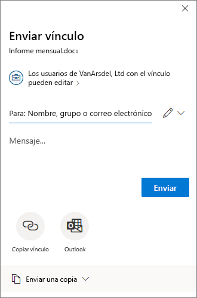

# <a name="use-sensitivity-labels-to-configure-the-default-sharing-link-type-for-sites-and-documents-in-sharepoint-and-onedrive"></a>Usar etiquetas de confidencialidad para configurar el tipo de vínculo de uso compartido predeterminado para los sitios y documentos en SharePoint y OneDrive

>*[Guía de licencias de Microsoft 365 para la seguridad y el cumplimiento](/office365/servicedescriptions/microsoft-365-service-descriptions/microsoft-365-tenantlevel-services-licensing-guidance/microsoft-365-security-compliance-licensing-guidance).*

Como configuración adicional a la que se ve en el Centro de cumplimiento de Microsoft 365 para [etiquetas de confidencialidad](sensitivity-labels.md), puede usar estas etiquetas para configurar las opciones para el tipo de vínculo de uso compartido predeterminado en un sitio de SharePoint o una cuenta de OneDrive y para documentos individuales. Esta configuración se selecciona automáticamente, pero no es muy visible para los usuarios cuando seleccionan el botón **Compartir** en sus aplicaciones de Office. Por ejemplo:



El tipo de vínculo de uso compartido predeterminado establece el ámbito (quién) y los permisos (ver o editar) que se seleccionan automáticamente cuando los usuarios comparten archivos y carpetas. Aunque los usuarios pueden invalidar esta configuración predeterminada antes de enviar el vínculo de uso compartido, la configuración que se elija proporciona una línea base segura. Normalmente, los usuarios no cambian la configuración antes de compartir.

En el nivel de sitio (sitio de SharePoint o cuenta de OneDrive), las etiquetas de confidencialidad proporcionan una alternativa práctica para establecer el tipo de vínculo de uso compartido predeterminado que se puede configurar para un sitio en el Centro de administración de SharePoint. Para obtener más información, consulte [Cambiar el tipo de vínculo predeterminado de un sitio](/sharepoint/change-default-sharing-link) en la documentación de SharePoint.

Esta configuración de nivel de sitio funciona bien para los sitios de SharePoint que tienen documentos con el mismo nivel de confidencialidad. Pero si los sitios contienen ciertos documentos con un mayor nivel de confidencialidad y que requieren una configuración más restrictiva, puede configurar una etiqueta de confidencialidad con opciones diferentes para el tipo de vínculo de uso compartido predeterminado y, a continuación, aplicar esta etiqueta a los documentos.

En este escenario en el que el sitio tiene la configuración predeterminada del tipo de vínculo de uso compartido y un documento de ese sitio tiene una configuración de tipo de vínculo predeterminada diferente, se aplicará la configuración de ámbito más restrictiva en el momento en que el usuario seleccione la opción de uso compartido para el documento. Por ejemplo:

- El tipo de vínculo de uso compartido predeterminado para el sitio se aplica a cualquier persona de la organización. Un documento de ese sitio se etiqueta con el tipo de vínculo de uso compartido predeterminado establecido para usuarios específicos. Cuando un usuario comparte ese documento, el tipo de vínculo de uso compartido predeterminado seleccionado se aplicará a usuarios específicos.

- El tipo de vínculo de uso compartido predeterminado para el sitio se aplica a usuarios específicos, con permisos de edición. Un documento de ese sitio se etiqueta con el tipo de vínculo de uso compartido predeterminado establecido para cualquier persona de la organización, con permisos de vista. Cuando un usuario comparte ese documento, el tipo de vínculo de uso compartido predeterminado seleccionado se aplicará a usuarios específicos con permisos de edición.

Configurar el tipo de vínculo predeterminado para los documentos también puede ser adecuado sin la configuración de nivel de sitio. Por ejemplo, aunque los sitios de SharePoint se organizan normalmente para hospedar el mismo tipo de documentos, no sucede lo mismo con las cuentas de OneDrive. Los usuarios suelen guardar una amplia variedad de archivos en OneDrive y a menudo incluyen tanto documentos personales como de trabajo. Es probable que no sea práctico establecer un tipo de vínculo predeterminado para todos los documentos de la cuenta de OneDrive de un usuario, pero los documentos individuales podrían beneficiarse de esta configuración. Por ejemplo:

- Los documentos etiquetados como **extremadamente confidenciales** tienen un tipo de vínculo de uso compartido predeterminado que restringe el uso compartido a usuarios específicos en lugar de a cualquier persona de la organización.
- Los documentos etiquetados como **General** tienen un tipo de vínculo de uso compartido predeterminado que restringe el uso compartido a los usuarios de la organización.
- Los documentos etiquetados como **Personal** tienen un tipo de vínculo de uso compartido predeterminado que permite compartir con cualquier usuario que tenga el vínculo.

## <a name="prerequisites"></a>Requisitos previos

Para aplicar el tipo de vínculo de uso compartido predeterminado para los sitios, las etiquetas de confidencialidad deben estar habilitadas para los contenedores. Si esta funcionalidad aún no está habilitada en el espacio empresarial, consulte [Cómo habilitar etiquetas de confidencialidad para contenedores y sincronizar etiquetas](sensitivity-labels-teams-groups-sites.md#how-to-enable-sensitivity-labels-for-containers-and-synchronize-labels).

Para aplicar el tipo de vínculo de uso compartido predeterminado para documentos de SharePoint y OneDrive, las etiquetas de confidencialidad deben estar habilitadas para estos servicios. Si esta funcionalidad aún no está habilitada en el espacio empresarial, vea [Cómo habilitar etiquetas de confidencialidad para SharePoint y OneDrive (participar)](sensitivity-labels-sharepoint-onedrive-files.md#how-to-enable-sensitivity-labels-for-sharepoint-and-onedrive-opt-in).

En una sesión de PowerShell, debe [conectarse al Centro de seguridad y cumplimiento de Office 365 PowerShell](/powershell/exchange/office-365-scc/connect-to-scc-powershell/connect-to-scc-powershell) para configurar las opciones del tipo de vínculo de uso compartido predeterminado.

> [!NOTE]
> Aunque no es necesario, es más fácil [crear y configurar etiquetas de confidencialidad en el Centro de cumplimiento de Microsoft 365](create-sensitivity-labels.md) y luego modificar las etiquetas con las opciones que configuran el tipo de vínculo de uso compartido predeterminado.

## <a name="how-to-configure-settings-for-the-default-sharing-link-type"></a>Cómo configurar las opciones para el tipo de vínculo de uso compartido predeterminado

Las opciones de configuración del tipo de vínculo de uso compartido predeterminado usan el parámetro de PowerShell *AdvancedSettings* con los cmdlets [Set-Label](/powershell/module/exchange/set-label) y [New-Label](/powershell/module/exchange/new-labelpolicy) del [Centro de seguridad y cumplimiento PowerShell](/powershell/exchange/scc-powershell):

- **DefaultSharingScope**: los valores disponibles son:
    - **SpecificPeople**: Establece el vínculo para compartir predeterminado para este sitio en el vínculo de “Usuarios específicos”
    - **Organización**: Establece el vínculo para compartir predeterminado para este sitio en el vínculo organización o en el vínculo que se puede compartir de la empresa.
    - **Anyone**: Establece el vínculo para compartir predeterminado de este sitio en Acceso anónimo o en un vínculo tipo Cualquiera.

- **DefaultShareLinkPermission**: los valores disponibles son:
    - **Ver**: establece el permiso de vínculo predeterminado para que el sitio "vea" los permisos
    - **Editar**: establece el permiso de vínculo predeterminado para que el sitio "edite" los permisos

Estos dos valores son el equivalente de los parámetros *DefaultSharingScope* y *DefaultShareLinkPermission* del cmdlet [Set-SPOSite](/powershell/module/sharepoint-online/set-sposite).

Ejemplos de PowerShell, donde el GUID de la etiqueta de confidencialidad es **8faca7b8-8d20-48a3-8ea2-0f96310a848e**:

- Para establecer el tipo de vínculo de uso compartido en Usuarios específicos:
    
    ````powershell
    Set-Label -Identity 8faca7b8-8d20-48a3-8ea2-0f96310a848e -AdvancedSettings @{DefaultSharingScope="SpecificPeople"}
    ````

- Para establecer los permisos de tipo de vínculo de uso compartido predeterminados en Editar:
    
    ````powershell
    Set-Label -Identity 8faca7b8-8d20-48a3-8ea2-0f96310a848e -AdvancedSettings @{DefaultShareLinkPermission="Edit"}
    ````

Para configurar las opciones del tipo de vínculo de uso compartido predeterminado para un sitio, el [ámbito de la etiqueta de confidencialidad](sensitivity-labels.md#label-scopes) debe incluir **grupos y sitios** al crear la etiqueta de confidencialidad en el Centro de cumplimiento de Microsoft 365. Una vez creado, verá que se muestra como **sitio, UnifiedGroup** en la columna **Ámbito** de la página **Etiquetas** y la configuración *ContentType* de PowerShell también muestra el mismo valor. Para los documentos, el ámbito debe incluir **Archivos y correo electrónico**, que se muestra como **Archivo, Correo electrónico**. Luego:

- Cuando el ámbito incluye **Grupos y sitios**, puede aplicar la etiqueta a un sitio, lo que establece el tipo de vínculo de uso compartido predeterminado para ese sitio. Para obtener información sobre cómo aplicar una etiqueta de confidencialidad a un sitio, consulte [Cómo aplicar etiquetas de confidencialidad a contenedores](sensitivity-labels-teams-groups-sites.md#how-to-apply-sensitivity-labels-to-containers).

- Cuando el ámbito de la etiqueta de confidencialidad incluye **Archivos y correo electrónico**, puede aplicar la etiqueta a los documentos, lo que establece el tipo de vínculo de uso compartido predeterminado para ese documento. La etiqueta se puede aplicar [manualmente](https://support.microsoft.com/office/apply-sensitivity-labels-to-your-files-and-email-in-office-2f96e7cd-d5a4-403b-8bd7-4cc636bae0f9) o [automáticamente](apply-sensitivity-label-automatically.md).

> [!TIP]
> También puede especificar que la etiqueta sea la etiqueta de confidencialidad predeterminada que se aplicará a los nuevos sitios o a los nuevos documentos, como una [configuración de directiva de etiqueta](sensitivity-labels.md#what-label-policies-can-do).

### <a name="powershell-tips-for-specifying-the-advanced-settings"></a>Sugerencias de PowerShell para especificar la configuración avanzada

Aunque puede especificar la etiqueta de confidencialidad por su nombre, se recomienda usar el GUID de etiqueta para evitar posibles confusiones sobre la especificación del nombre de la etiqueta o del nombre para mostrar. Para buscar el GUID y confirmar el ámbito de la etiqueta:

````powershell
Get-Label | Format-Table -Property DisplayName, Name, Guid, ContentType
````

Para quitar cualquiera de estas opciones avanzadas de una directiva de etiqueta, use la misma sintaxis de parámetros AdvancedSettings pero especifique un valor de cadena nulo. Por ejemplo:

````powershell
Set-Label -Identity 8faca7b8-8d20-48a3-8ea2-0f96310a848e -AdvancedSettings @{DefaultSharingScope=""}
````

