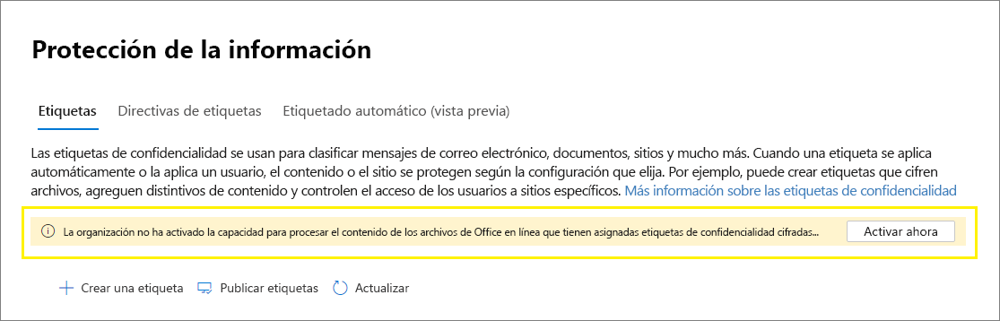

# <a name="enable-sensitivity-labels-for-office-files-in-sharepoint-and-onedrive"></a><span data-ttu-id="56ff5-103">Habilitar etiquetas de confidencialidad para los archivos de Office en SharePoint y OneDrive</span><span class="sxs-lookup"><span data-stu-id="56ff5-103">Enable sensitivity labels for Office files in SharePoint and OneDrive</span></span>

><span data-ttu-id="56ff5-104">*[Instrucciones de licencias de Microsoft 365 para la seguridad y el cumplimiento](/office365/servicedescriptions/microsoft-365-service-descriptions/microsoft-365-tenantlevel-services-licensing-guidance/microsoft-365-security-compliance-licensing-guidance).*</span><span class="sxs-lookup"><span data-stu-id="56ff5-104">*[Microsoft 365 licensing guidance for security & compliance](/office365/servicedescriptions/microsoft-365-service-descriptions/microsoft-365-tenantlevel-services-licensing-guidance/microsoft-365-security-compliance-licensing-guidance).*</span></span>

<span data-ttu-id="56ff5-105">Habilite las etiquetas de confidencialidad Office archivos SharePoint y OneDrive para que [](sensitivity-labels.md) los usuarios puedan aplicar las etiquetas de confidencialidad Office para la web.</span><span class="sxs-lookup"><span data-stu-id="56ff5-105">Enable sensitivity labels for Office files in SharePoint and OneDrive so that users can apply your [sensitivity labels](sensitivity-labels.md) in Office for the web.</span></span> <span data-ttu-id="56ff5-106">Cuando esta característica está habilitada,  los usuarios verán el botón Confidencialidad en la cinta de opciones para que puedan aplicar etiquetas y ver cualquier nombre de etiqueta aplicado en la barra de estado.</span><span class="sxs-lookup"><span data-stu-id="56ff5-106">When this feature is enabled, users will see the **Sensitivity** button on the ribbon so they can apply labels, and see any applied label name on the status bar.</span></span>

<span data-ttu-id="56ff5-107">Al habilitar esta característica, también SharePoint y OneDrive procesar el contenido de los archivos cifrados mediante una etiqueta de confidencialidad.</span><span class="sxs-lookup"><span data-stu-id="56ff5-107">Enabling this feature also results in SharePoint and OneDrive being able to process the contents of files that have been encrypted by using a sensitivity label.</span></span> <span data-ttu-id="56ff5-108">La etiqueta se puede aplicar en Office web o en aplicaciones de escritorio Office y cargarse o guardarse en SharePoint y OneDrive.</span><span class="sxs-lookup"><span data-stu-id="56ff5-108">The label can be applied in Office for the web, or in Office desktop apps and uploaded or saved in SharePoint and OneDrive.</span></span> <span data-ttu-id="56ff5-109">Hasta que habilite esta característica, estos servicios no podrán procesar archivos cifrados, lo que significa que la coautoría, la exhibición de documentos electrónicos, la prevención de pérdida de datos, la búsqueda y otras características de colaboración no funcionarán para estos archivos.</span><span class="sxs-lookup"><span data-stu-id="56ff5-109">Until you enable this feature, these services can't process encrypted files, which means that coauthoring, eDiscovery, Data Loss Prevention, search, and other collaborative features won't work for these files.</span></span>

<span data-ttu-id="56ff5-110">Después de habilitar las etiquetas de confidencialidad para los archivos Office en SharePoint y OneDrive, para los archivos nuevos y modificados que tienen una etiqueta de confidencialidad que aplica cifrado con una clave basada en la nube (y no usa cifrado de doble [clave):](double-key-encryption.md)</span><span class="sxs-lookup"><span data-stu-id="56ff5-110">After you enable sensitivity labels for Office files in SharePoint and OneDrive, for new and changed files that have a sensitivity label that applies encryption with a cloud-based key (and doesn't use [Double Key Encryption](double-key-encryption.md)):</span></span>

- <span data-ttu-id="56ff5-111">Para word, Excel archivos PowerPoint, SharePoint y OneDrive reconocen la etiqueta y ahora pueden procesar el contenido del archivo cifrado.</span><span class="sxs-lookup"><span data-stu-id="56ff5-111">For Word, Excel, and PowerPoint files, SharePoint and OneDrive recognize the label and can now process the contents of the encrypted file.</span></span>

- <span data-ttu-id="56ff5-112">Cuando los usuarios descargan o acceden a estos archivos desde SharePoint o OneDrive, la etiqueta de confidencialidad y cualquier configuración de cifrado de la etiqueta se aplican y permanecen en el archivo, dondequiera que se almacene.</span><span class="sxs-lookup"><span data-stu-id="56ff5-112">When users download or access these files from SharePoint or OneDrive, the sensitivity label and any encryption settings from the label are enforced and remain with the file, wherever it is stored.</span></span> <span data-ttu-id="56ff5-113">Asegúrese de proporcionar instrucciones al usuario para usar solo etiquetas para proteger documentos.</span><span class="sxs-lookup"><span data-stu-id="56ff5-113">Ensure you provide user guidance to use only labels to protect documents.</span></span> <span data-ttu-id="56ff5-114">Para obtener más información, vea [Information Rights Management (IRM) options and sensitivity labels](sensitivity-labels-office-apps.md#information-rights-management-irm-options-and-sensitivity-labels).</span><span class="sxs-lookup"><span data-stu-id="56ff5-114">For more information, see [Information Rights Management (IRM) options and sensitivity labels](sensitivity-labels-office-apps.md#information-rights-management-irm-options-and-sensitivity-labels).</span></span>

- <span data-ttu-id="56ff5-115">Cuando los usuarios cargan archivos etiquetados y cifrados en SharePoint o OneDrive, deben tener al menos derechos de vista en esos archivos.</span><span class="sxs-lookup"><span data-stu-id="56ff5-115">When users upload labeled and encrypted files to SharePoint or OneDrive, they must have at least view rights to those files.</span></span> <span data-ttu-id="56ff5-116">Por ejemplo, pueden abrir los archivos fuera de SharePoint.</span><span class="sxs-lookup"><span data-stu-id="56ff5-116">For example, they can open the files outside SharePoint.</span></span> <span data-ttu-id="56ff5-117">Si no tienen este derecho de uso mínimo, la carga se realiza correctamente, pero el servicio no reconoce la etiqueta y no puede procesar el contenido del archivo.</span><span class="sxs-lookup"><span data-stu-id="56ff5-117">If they don't have this minimum usage right, the upload is successful but the service doesn't recognize the label and can't process the file contents.</span></span>

- <span data-ttu-id="56ff5-118">Use Office web (Word, Excel, PowerPoint) para abrir y editar archivos Office que tienen etiquetas de confidencialidad que aplican cifrado.</span><span class="sxs-lookup"><span data-stu-id="56ff5-118">Use Office for the web (Word, Excel, PowerPoint) to open and edit Office files that have sensitivity labels that apply encryption.</span></span> <span data-ttu-id="56ff5-119">Se aplican los permisos asignados con el cifrado.</span><span class="sxs-lookup"><span data-stu-id="56ff5-119">The permissions that were assigned with the encryption are enforced.</span></span> <span data-ttu-id="56ff5-120">También puede usar el [etiquetado automático](apply-sensitivity-label-automatically.md) para estos documentos.</span><span class="sxs-lookup"><span data-stu-id="56ff5-120">You can also use [auto-labeling](apply-sensitivity-label-automatically.md) for these documents.</span></span>

- <span data-ttu-id="56ff5-121">Los usuarios externos pueden tener acceso a documentos etiquetados con cifrado mediante cuentas invitadas.</span><span class="sxs-lookup"><span data-stu-id="56ff5-121">External users can access documents that are labeled with encryption by using guest accounts.</span></span> <span data-ttu-id="56ff5-122">Para obtener más información, vea [Support for external users and labeled content](sensitivity-labels-office-apps.md#support-for-external-users-and-labeled-content).</span><span class="sxs-lookup"><span data-stu-id="56ff5-122">For more information, see [Support for external users and labeled content](sensitivity-labels-office-apps.md#support-for-external-users-and-labeled-content).</span></span> 

- <span data-ttu-id="56ff5-123">Office 365 eDiscovery admite la búsqueda de texto completo para estos archivos y las directivas de prevención de pérdida de datos (DLP) admiten contenido en estos archivos.</span><span class="sxs-lookup"><span data-stu-id="56ff5-123">Office 365 eDiscovery supports full-text search for these files and Data Loss Prevention (DLP) policies support content in these files.</span></span>

> [!NOTE]
> <span data-ttu-id="56ff5-124">Si el cifrado se ha aplicado con una clave local (una topología de administración de claves a menudo denominada "mantener su propia clave" o HYOK) o mediante cifrado de doble [clave,](double-key-encryption.md)el comportamiento del servicio para procesar el contenido del archivo no cambia.</span><span class="sxs-lookup"><span data-stu-id="56ff5-124">If encryption has been applied with an on-premises key (a key management topology often referred to as "hold your own key" or HYOK), or by using [Double Key Encryption](double-key-encryption.md), the service behavior for processing the file contents doesn't change.</span></span> <span data-ttu-id="56ff5-125">Por lo tanto, para estos archivos, la coautoría, la exhibición de documentos electrónicos, la prevención de pérdida de datos, la búsqueda y otras características de colaboración no funcionarán.</span><span class="sxs-lookup"><span data-stu-id="56ff5-125">So for these files, coauthoring, eDiscovery, Data Loss Prevention, search, and other collaborative features won't work.</span></span>
>
> <span data-ttu-id="56ff5-126">El SharePoint y OneDrive no cambia para los archivos existentes en estas ubicaciones que están etiquetados con cifrado mediante una sola clave basada en Azure.</span><span class="sxs-lookup"><span data-stu-id="56ff5-126">The SharePoint and OneDrive behavior also doesn't change for existing files in these locations that are labeled with encryption using a single Azure-based key.</span></span> <span data-ttu-id="56ff5-127">Para que estos archivos se beneficien de las nuevas funcionalidades después de habilitar etiquetas de confidencialidad para archivos Office en SharePoint y OneDrive, los archivos deben descargarse y cargarse de nuevo o editarse.</span><span class="sxs-lookup"><span data-stu-id="56ff5-127">For these files to benefit from the new capabilities after you enable sensitivity labels for Office files in SharePoint and OneDrive, the files must be either downloaded and uploaded again, or edited.</span></span>

<span data-ttu-id="56ff5-128">Después de habilitar etiquetas de confidencialidad para archivos Office en SharePoint [](search-the-audit-log-in-security-and-compliance.md#sensitivity-label-activities) y OneDrive, hay tres nuevos eventos de auditoría disponibles para supervisar las etiquetas de confidencialidad que se aplican a los documentos de SharePoint y OneDrive:</span><span class="sxs-lookup"><span data-stu-id="56ff5-128">After you enable sensitivity labels for Office files in SharePoint and OneDrive, three new [audit events](search-the-audit-log-in-security-and-compliance.md#sensitivity-label-activities) are available for monitoring sensitivity labels that are applied to documents in SharePoint and OneDrive:</span></span>
- <span data-ttu-id="56ff5-129">**Etiqueta de confidencialidad aplicada al archivo**</span><span class="sxs-lookup"><span data-stu-id="56ff5-129">**Applied sensitivity label to file**</span></span>
- <span data-ttu-id="56ff5-130">**Se ha cambiado la etiqueta de confidencialidad aplicada al archivo**</span><span class="sxs-lookup"><span data-stu-id="56ff5-130">**Changed sensitivity label applied to file**</span></span>
- <span data-ttu-id="56ff5-131">**Etiqueta de confidencialidad eliminada del sitio**</span><span class="sxs-lookup"><span data-stu-id="56ff5-131">**Removed sensitivity label from file**</span></span>

<span data-ttu-id="56ff5-132">Vea el siguiente vídeo (sin audio) para ver las nuevas funcionalidades en acción:</span><span class="sxs-lookup"><span data-stu-id="56ff5-132">Watch the following video (no audio) to see the new capabilities in action:</span></span>

> [!VIDEO https://www.microsoft.com/videoplayer/embed//RE4ornZ]

<span data-ttu-id="56ff5-133">Siempre tienes la opción de deshabilitar las etiquetas de confidencialidad de Office archivos en SharePoint y OneDrive ([opt-out](#how-to-disable-sensitivity-labels-for-sharepoint-and-onedrive-opt-out)) en cualquier momento.</span><span class="sxs-lookup"><span data-stu-id="56ff5-133">You always have the choice to disable sensitivity labels for Office files in SharePoint and OneDrive ([opt-out](#how-to-disable-sensitivity-labels-for-sharepoint-and-onedrive-opt-out)) at any time.</span></span>

<span data-ttu-id="56ff5-134">Si actualmente está protegiendo documentos en SharePoint mediante SharePoint Information Rights Management (IRM), asegúrese de comprobar la sección [SharePoint Information Rights Management (IRM)](#sharepoint-information-rights-management-irm-and-sensitivity-labels) y las etiquetas de confidencialidad de esta página.</span><span class="sxs-lookup"><span data-stu-id="56ff5-134">If you are currently protecting documents in SharePoint by using SharePoint Information Rights Management (IRM), be sure to check the [SharePoint Information Rights Management (IRM) and sensitivity labels](#sharepoint-information-rights-management-irm-and-sensitivity-labels) section on this page.</span></span> 

## <a name="requirements"></a><span data-ttu-id="56ff5-135">Requisitos</span><span class="sxs-lookup"><span data-stu-id="56ff5-135">Requirements</span></span>

<span data-ttu-id="56ff5-136">Estas nuevas funcionalidades solo funcionan con [etiquetas de](sensitivity-labels.md) confidencialidad.</span><span class="sxs-lookup"><span data-stu-id="56ff5-136">These new capabilities work with [sensitivity labels](sensitivity-labels.md) only.</span></span> <span data-ttu-id="56ff5-137">Si actualmente tiene etiquetas de Azure Information Protection, migre primero a etiquetas de confidencialidad para que pueda habilitar estas características para los nuevos archivos que cargue.</span><span class="sxs-lookup"><span data-stu-id="56ff5-137">If you currently have Azure Information Protection labels, first migrate them to sensitivity labels so that you can enable these features for new files that you upload.</span></span> <span data-ttu-id="56ff5-138">Para obtener más información acerca de este proceso, consulte [Cómo migrar las etiquetas de Azure Information Protection a etiquetas de confidencialidad unificadas](/azure/information-protection/configure-policy-migrate-labels)</span><span class="sxs-lookup"><span data-stu-id="56ff5-138">For instructions, see [How to migrate Azure Information Protection labels to unified sensitivity labels](/azure/information-protection/configure-policy-migrate-labels).</span></span>

<span data-ttu-id="56ff5-139">Usa la versión 19.002.0121.0008 de la aplicación de sincronización de OneDrive o posterior en Windows y la versión 19.002.0107.0008 o posterior en Mac.</span><span class="sxs-lookup"><span data-stu-id="56ff5-139">Use the OneDrive sync app version 19.002.0121.0008 or later on Windows, and version 19.002.0107.0008 or later on Mac.</span></span> <span data-ttu-id="56ff5-140">Ambas versiones se lanzaron el 28 de enero de 2019 y actualmente se lanzan a todos los anillos.</span><span class="sxs-lookup"><span data-stu-id="56ff5-140">Both these versions were released January 28, 2019, and are currently released to all rings.</span></span> <span data-ttu-id="56ff5-141">Para obtener más información, vea [OneDrive notas de la versión](https://support.office.com/article/845dcf18-f921-435e-bf28-4e24b95e5fc0).</span><span class="sxs-lookup"><span data-stu-id="56ff5-141">For more information, see the [OneDrive release notes](https://support.office.com/article/845dcf18-f921-435e-bf28-4e24b95e5fc0).</span></span> <span data-ttu-id="56ff5-142">Después de habilitar las etiquetas de confidencialidad para los archivos Office en SharePoint y OneDrive, se pedirá a los usuarios que ejecuten una versión anterior de la aplicación de sincronización que la actualicen.</span><span class="sxs-lookup"><span data-stu-id="56ff5-142">After you enable sensitivity labels for Office files in SharePoint and OneDrive, users who run an older version of the sync app are prompted to update it.</span></span>

## <a name="limitations"></a><span data-ttu-id="56ff5-143">Limitaciones</span><span class="sxs-lookup"><span data-stu-id="56ff5-143">Limitations</span></span>

- <span data-ttu-id="56ff5-144">SharePoint y OneDrive no pueden procesar algunos archivos etiquetados y cifrados desde aplicaciones de escritorio de Office cuando estos archivos contienen datos de PowerQuery, datos almacenados por complementos personalizados o elementos XML personalizados, como propiedades de página de portada, esquemas de tipo de contenido, panel de información de documentos personalizado y XSN personalizado.</span><span class="sxs-lookup"><span data-stu-id="56ff5-144">SharePoint and OneDrive can't process some files that are labeled and encrypted from Office desktop apps when these files contain PowerQuery data, data stored by custom add-ins, or custom XML parts such as Cover Page Properties, content type schemas, custom Document Information Panel, and Custom XSN.</span></span> <span data-ttu-id="56ff5-145">Esta limitación también se aplica a los archivos que tienen un [identificador](https://support.microsoft.com/office/enable-and-configure-unique-document-ids-ea7fee86-bd6f-4cc8-9365-8086e794c984) de documento agregado cuando se cargan.</span><span class="sxs-lookup"><span data-stu-id="56ff5-145">This limitation also applies to files that have a [Document ID](https://support.microsoft.com/office/enable-and-configure-unique-document-ids-ea7fee86-bd6f-4cc8-9365-8086e794c984) added when they are uploaded.</span></span>
    
    <span data-ttu-id="56ff5-146">Para estos archivos, aplique una etiqueta sin cifrado para que pueda abrirse más adelante en Office en la Web o indique a los usuarios que abran los archivos en sus aplicaciones de escritorio.</span><span class="sxs-lookup"><span data-stu-id="56ff5-146">For these files, either apply a label without encryption so that they can later be opened in Office on the web, or instruct users to open the files in their desktop apps.</span></span> <span data-ttu-id="56ff5-147">Los archivos etiquetados y cifrados solo en Office en la Web no se ven afectados.</span><span class="sxs-lookup"><span data-stu-id="56ff5-147">Files that are labeled and encrypted only in Office on the web aren't affected.</span></span>

- <span data-ttu-id="56ff5-148">SharePoint y OneDrive automáticamente no aplican etiquetas de confidencialidad a los archivos existentes que ya haya cifrado con etiquetas de Azure Information Protection.</span><span class="sxs-lookup"><span data-stu-id="56ff5-148">SharePoint and OneDrive don't automatically apply sensitivity labels to existing files that you've already encrypted using Azure Information Protection labels.</span></span> <span data-ttu-id="56ff5-149">En su lugar, para que las características funcionen después de habilitar las etiquetas de confidencialidad Office archivos de SharePoint y OneDrive, complete estas tareas:</span><span class="sxs-lookup"><span data-stu-id="56ff5-149">Instead, for the features to work after you enable sensitivity labels for Office files in SharePoint and OneDrive, complete these tasks:</span></span>
    
    1. <span data-ttu-id="56ff5-150">Asegúrese de haber [migrado las etiquetas](/azure/information-protection/configure-policy-migrate-labels) de [](create-sensitivity-labels.md#publish-sensitivity-labels-by-creating-a-label-policy) Azure Information Protection a etiquetas de confidencialidad y publicarlas desde el centro de Microsoft 365 cumplimiento.</span><span class="sxs-lookup"><span data-stu-id="56ff5-150">Make sure you have [migrated the Azure Information Protection labels](/azure/information-protection/configure-policy-migrate-labels) to sensitivity labels and [published them](create-sensitivity-labels.md#publish-sensitivity-labels-by-creating-a-label-policy) from the Microsoft 365 compliance center.</span></span>
    2. <span data-ttu-id="56ff5-151">Descargue los archivos etiquetados y, a continuación, cárbalos en su ubicación original en SharePoint o OneDrive.</span><span class="sxs-lookup"><span data-stu-id="56ff5-151">Download the labeled files and then upload them to their original location in SharePoint or OneDrive.</span></span>

- <span data-ttu-id="56ff5-152">SharePoint y OneDrive no pueden procesar archivos cifrados cuando la etiqueta que aplicó el cifrado tiene cualquiera de las siguientes [configuraciones de cifrado:](encryption-sensitivity-labels.md#configure-encryption-settings)</span><span class="sxs-lookup"><span data-stu-id="56ff5-152">SharePoint and OneDrive can't process encrypted files when the label that applied the encryption has any of the following [configurations for encryption](encryption-sensitivity-labels.md#configure-encryption-settings):</span></span>
    - <span data-ttu-id="56ff5-153">**Permitir que los usuarios asignen permisos cuando apliquen la etiqueta** y la casilla **En Word, PowerPoint y Excel, pedir a los usuarios que especifiquen permisos** seleccionada.</span><span class="sxs-lookup"><span data-stu-id="56ff5-153">**Let users assign permissions when they apply the label** and the checkbox **In Word, PowerPoint, and Excel, prompt users to specify permissions** is selected.</span></span> <span data-ttu-id="56ff5-154">Esta configuración a veces se conoce como "permisos definidos por el usuario".</span><span class="sxs-lookup"><span data-stu-id="56ff5-154">This setting is sometimes referred to as "user-defined permissions".</span></span>
    - <span data-ttu-id="56ff5-155">**El acceso del usuario al contenido expira** establecido en un valor distinto de **Nunca**.</span><span class="sxs-lookup"><span data-stu-id="56ff5-155">**User access to content expires** is set to a value other than **Never**.</span></span>
    - <span data-ttu-id="56ff5-156">**Cifrado de clave doble** seleccionado.</span><span class="sxs-lookup"><span data-stu-id="56ff5-156">**Double Key Encryption** is selected.</span></span>
    
    <span data-ttu-id="56ff5-157">Para las etiquetas con cualquiera de estas configuraciones de cifrado, las etiquetas no se muestran a los usuarios Office para la web.</span><span class="sxs-lookup"><span data-stu-id="56ff5-157">For labels with any of these encryption configurations, the labels aren't displayed to users in Office for the web.</span></span> <span data-ttu-id="56ff5-158">Además, las nuevas funcionalidades no se pueden usar con documentos etiquetados que ya tienen esta configuración de cifrado.</span><span class="sxs-lookup"><span data-stu-id="56ff5-158">Additionally, the new capabilities can't be used with labeled documents that already have these encryption settings.</span></span> <span data-ttu-id="56ff5-159">Por ejemplo, estos documentos no se devolverán en los resultados de búsqueda, incluso si se actualizan.</span><span class="sxs-lookup"><span data-stu-id="56ff5-159">For example, these documents won't be returned in search results, even if they are updated.</span></span>

- <span data-ttu-id="56ff5-160">Los usuarios pueden experimentar retrasos al poder abrir documentos cifrados en el siguiente escenario guardar como: mediante una versión de escritorio de Office, un usuario elige Guardar como para un documento que tiene una etiqueta de confidencialidad que aplica cifrado.</span><span class="sxs-lookup"><span data-stu-id="56ff5-160">Users might experience delays in being able to open encrypted documents in the following Save As scenario: Using a desktop version of Office, a user chooses Save As for a document that has a sensitivity label that applies encryption.</span></span> <span data-ttu-id="56ff5-161">El usuario selecciona SharePoint o OneDrive para la ubicación y, a continuación, intenta abrir inmediatamente ese documento en Office para la web.</span><span class="sxs-lookup"><span data-stu-id="56ff5-161">The user selects SharePoint or OneDrive for the location, and then immediately tries to open that document in Office for the web.</span></span> <span data-ttu-id="56ff5-162">Si el servicio sigue procesando el cifrado, el usuario ve un mensaje que indica que el documento debe abrirse en su aplicación de escritorio.</span><span class="sxs-lookup"><span data-stu-id="56ff5-162">If the service is still processing the encryption, the user sees a message that the document must be opened in their desktop app.</span></span> <span data-ttu-id="56ff5-163">Si lo intentan de nuevo en un par de minutos, el documento se abre correctamente en Office para la web.</span><span class="sxs-lookup"><span data-stu-id="56ff5-163">If they try again in a couple of minutes, the document successfully opens in Office for the web.</span></span> 

- <span data-ttu-id="56ff5-164">Para documentos cifrados, no se admite la impresión.</span><span class="sxs-lookup"><span data-stu-id="56ff5-164">For encrypted documents, printing is not supported.</span></span>

- <span data-ttu-id="56ff5-165">Para un documento cifrado que concede permisos de edición a un usuario, la copia no se puede bloquear en las versiones web de las Office web.</span><span class="sxs-lookup"><span data-stu-id="56ff5-165">For an encrypted document that grants edit permissions to a user, copying can't be blocked in the web versions of the Office apps.</span></span>

- <span data-ttu-id="56ff5-166">De forma predeterminada, Office aplicaciones de escritorio y aplicaciones móviles no admiten la co-autoría de archivos etiquetados con cifrado.</span><span class="sxs-lookup"><span data-stu-id="56ff5-166">By default, Office desktop apps and mobile apps don't support co-authoring for files that are labeled with encryption.</span></span> <span data-ttu-id="56ff5-167">Estas aplicaciones siguen abierto archivos etiquetados y cifrados en modo de edición exclusiva.</span><span class="sxs-lookup"><span data-stu-id="56ff5-167">These apps continue to open labeled and encrypted files in exclusive editing mode.</span></span>
    
    > [!NOTE]
    > <span data-ttu-id="56ff5-168">La co-autoría ahora se admite en versión preliminar.</span><span class="sxs-lookup"><span data-stu-id="56ff5-168">Co-authoring is now supported in preview.</span></span> <span data-ttu-id="56ff5-169">Para obtener más información, vea [Enable co-authoring for files encrypted with sensitivity labels](sensitivity-labels-coauthoring.md).</span><span class="sxs-lookup"><span data-stu-id="56ff5-169">For more information, see [Enable co-authoring for files encrypted with sensitivity labels](sensitivity-labels-coauthoring.md).</span></span>

- <span data-ttu-id="56ff5-170">Si un administrador cambia la configuración de una etiqueta publicada que ya se ha aplicado a los archivos descargados en el cliente de sincronización de los usuarios, es posible que los usuarios no puedan guardar los cambios que realicen en el archivo en su carpeta de sincronización de OneDrive.</span><span class="sxs-lookup"><span data-stu-id="56ff5-170">If an admin changes settings for a published label that's already applied to files downloaded to users' sync client, users might be unable to save changes they make to the file in their OneDrive Sync folder.</span></span> <span data-ttu-id="56ff5-171">Este escenario se aplica a los archivos etiquetados con cifrado y también cuando el cambio de etiqueta es de una etiqueta que no apliquen cifrado a una etiqueta que aplique cifrado.</span><span class="sxs-lookup"><span data-stu-id="56ff5-171">This scenario applies to files that are labeled with encryption, and also when the label change is from a label that didn't apply encryption to a label that does apply encryption.</span></span> <span data-ttu-id="56ff5-172">Los usuarios ven [un círculo rojo con un error de](https://support.office.com/article/what-do-the-onedrive-icons-mean-11143026-8000-44f8-aaa9-67c985aa49b3)icono de cruz blanca y se les pide que guarden nuevos cambios como una copia independiente.</span><span class="sxs-lookup"><span data-stu-id="56ff5-172">Users see a [red circle with a white cross icon error](https://support.office.com/article/what-do-the-onedrive-icons-mean-11143026-8000-44f8-aaa9-67c985aa49b3), and they are asked to save new changes as a separate copy.</span></span> <span data-ttu-id="56ff5-173">En su lugar, pueden cerrar y volver a abrir el archivo, o usar Office para la web.</span><span class="sxs-lookup"><span data-stu-id="56ff5-173">Instead, they can close and reopen the file, or use Office for the web.</span></span>

- <span data-ttu-id="56ff5-174">Si un documento etiquetado se carga en SharePoint o OneDrive y la etiqueta aplica cifrado mediante una cuenta de un nombre de entidad de seguridad de servicio, el documento no se puede abrir en Office para la web.</span><span class="sxs-lookup"><span data-stu-id="56ff5-174">If a labeled document is uploaded to SharePoint or OneDrive and the label applied encryption by using an account from a service principal name, the document can't be opened in Office for the web.</span></span> <span data-ttu-id="56ff5-175">Los escenarios de ejemplo incluyen Microsoft Cloud App Security y un archivo enviado a Teams por correo electrónico.</span><span class="sxs-lookup"><span data-stu-id="56ff5-175">Example scenarios include Microsoft Cloud App Security and a file sent to Teams by email.</span></span>

- <span data-ttu-id="56ff5-176">Los usuarios pueden experimentar problemas de guardado después de desconectarse o pasar a un modo de suspensión cuando, en lugar de usar Office para la web, usan las aplicaciones de escritorio y móviles para Word, Excel o PowerPoint.</span><span class="sxs-lookup"><span data-stu-id="56ff5-176">Users can experience save problems after going offline or into a sleep mode when instead of using Office for the web, they use the desktop and mobile apps for Word, Excel, or PowerPoint.</span></span> <span data-ttu-id="56ff5-177">Para estos usuarios, cuando reanudan su sesión de Aplicación de Office e intentan guardar los cambios, ven un mensaje de error de carga con una opción para guardar una copia en lugar de guardar el archivo original.</span><span class="sxs-lookup"><span data-stu-id="56ff5-177">For these users, when they resume their Office app session and try to save changes, they see an upload failure message with an option to save a copy instead of saving the original file.</span></span> 

- <span data-ttu-id="56ff5-178">Los documentos que se han cifrado de las siguientes maneras no se pueden abrir en Office para la web:</span><span class="sxs-lookup"><span data-stu-id="56ff5-178">Documents that have been encrypted in the following ways can't be opened in Office for the web:</span></span>
    - <span data-ttu-id="56ff5-179">Cifrado que usa una clave local ("mantener su propia clave" o HYOK)</span><span class="sxs-lookup"><span data-stu-id="56ff5-179">Encryption that uses an on-premises key ("hold your own key" or HYOK)</span></span>
    - <span data-ttu-id="56ff5-180">Cifrado que se aplicó mediante [el cifrado de doble clave](double-key-encryption.md)</span><span class="sxs-lookup"><span data-stu-id="56ff5-180">Encryption that was applied by using [Double Key Encryption](double-key-encryption.md)</span></span>
    - <span data-ttu-id="56ff5-181">Cifrado que se aplicó independientemente de una etiqueta, por ejemplo, aplicando directamente una plantilla de protección de Rights Management.</span><span class="sxs-lookup"><span data-stu-id="56ff5-181">Encryption that was applied independently from a label, for example, by directly applying a Rights Management protection template.</span></span>

- <span data-ttu-id="56ff5-182">Las [etiquetas configuradas para otros idiomas](create-sensitivity-labels.md#additional-label-settings-with-security--compliance-center-powershell) no son compatibles y solo muestran el idioma original.</span><span class="sxs-lookup"><span data-stu-id="56ff5-182">Labels configured for [other languages](create-sensitivity-labels.md#additional-label-settings-with-security--compliance-center-powershell) are not supported and display the original language only.</span></span>

- <span data-ttu-id="56ff5-183">Las capturas de pantalla no se pueden evitar para documentos cifrados.</span><span class="sxs-lookup"><span data-stu-id="56ff5-183">Screen captures can't be prevented for encrypted documents.</span></span> <span data-ttu-id="56ff5-184">Para obtener más información, vea [Can Rights Management prevent screen captures?](/azure/information-protection/faqs-rms#can-rights-management-prevent-screen-captures)</span><span class="sxs-lookup"><span data-stu-id="56ff5-184">For more information, see [Can Rights Management prevent screen captures?](/azure/information-protection/faqs-rms#can-rights-management-prevent-screen-captures)</span></span>

- <span data-ttu-id="56ff5-185">Si elimina una etiqueta que se ha aplicado a un documento en SharePoint o OneDrive, en lugar de quitar la etiqueta de la directiva de etiqueta aplicable, el documento cuando se descargue no se etiquetará ni se cifrará.</span><span class="sxs-lookup"><span data-stu-id="56ff5-185">If you delete a label that's been applied to a document in SharePoint or OneDrive, rather than remove the label from the applicable label policy, the document when downloaded won't be labeled or encrypted.</span></span> <span data-ttu-id="56ff5-186">En comparación, si el documento etiquetado se almacena fuera de SharePoint o OneDrive, el documento permanece cifrado si se elimina la etiqueta.</span><span class="sxs-lookup"><span data-stu-id="56ff5-186">In comparison, if the labeled document is stored outside SharePoint or OneDrive, the document remains encrypted if the label is deleted.</span></span> <span data-ttu-id="56ff5-187">Tenga en cuenta que aunque puede eliminar etiquetas durante una fase de prueba, es muy raro eliminar una etiqueta en un entorno de producción.</span><span class="sxs-lookup"><span data-stu-id="56ff5-187">Note that although you might delete labels during a testing phase, it's very rare to delete a label in a production environment.</span></span>

## <a name="how-to-enable-sensitivity-labels-for-sharepoint-and-onedrive-opt-in"></a><span data-ttu-id="56ff5-188">Cómo habilitar etiquetas de confidencialidad para SharePoint y OneDrive (opt-in)</span><span class="sxs-lookup"><span data-stu-id="56ff5-188">How to enable sensitivity labels for SharePoint and OneDrive (opt-in)</span></span>

<span data-ttu-id="56ff5-189">Puede habilitar las nuevas funcionalidades mediante el centro de Microsoft 365 de cumplimiento o mediante PowerShell.</span><span class="sxs-lookup"><span data-stu-id="56ff5-189">You can enable the new capabilities by using the Microsoft 365 compliance center, or by using PowerShell.</span></span> <span data-ttu-id="56ff5-190">Al igual que con todos los cambios de configuración de nivel de espacio empresarial para SharePoint y OneDrive, el cambio tarda unos 15 minutos en tener efecto.</span><span class="sxs-lookup"><span data-stu-id="56ff5-190">As with all tenant-level configuration changes for SharePoint and OneDrive, it takes about 15 minutes for the change to take effect.</span></span>

### <a name="use-the-compliance-center-to-enable-support-for-sensitivity-labels"></a><span data-ttu-id="56ff5-191">Usar el Centro de cumplimiento para habilitar la compatibilidad con etiquetas de confidencialidad</span><span class="sxs-lookup"><span data-stu-id="56ff5-191">Use the compliance center to enable support for sensitivity labels</span></span>

<span data-ttu-id="56ff5-192">Esta opción es la forma más sencilla de habilitar etiquetas de confidencialidad para SharePoint y OneDrive, pero debe iniciar sesión como administrador global de su inquilino.</span><span class="sxs-lookup"><span data-stu-id="56ff5-192">This option is the easiest way to enable sensitivity labels for SharePoint and OneDrive, but you must sign in as a global administrator for your tenant.</span></span>

1. <span data-ttu-id="56ff5-193">Inicie sesión en el centro [de Microsoft 365 cumplimiento](https://compliance.microsoft.com/) como administrador global y vaya a Protección de información **de**  >  **soluciones**</span><span class="sxs-lookup"><span data-stu-id="56ff5-193">Sign in to the [Microsoft 365 compliance center](https://compliance.microsoft.com/) as a global administrator, and navigate to **Solutions** > **Information protection**</span></span>
    
    <span data-ttu-id="56ff5-194">Si no ve esta opción inmediatamente, primero seleccione **Mostrar todo**.</span><span class="sxs-lookup"><span data-stu-id="56ff5-194">If you don't immediately see this option, first select **Show all**.</span></span> 

2. <span data-ttu-id="56ff5-195">Si ve un mensaje para activar la capacidad de procesar contenido en Office en línea, seleccione **Activar ahora**:</span><span class="sxs-lookup"><span data-stu-id="56ff5-195">If you see a message to turn on the ability to process content in Office online files, select **Turn on now**:</span></span>
    
    
    
    <span data-ttu-id="56ff5-197">El comando se ejecuta inmediatamente y cuando se actualiza la página, ya no verá el mensaje ni el botón.</span><span class="sxs-lookup"><span data-stu-id="56ff5-197">The command runs immediately and when the page is next refreshed, you no longer see the message or button.</span></span>

> [!NOTE]
> <span data-ttu-id="56ff5-198">Si ha Microsoft 365 Multi-Geo, debe usar PowerShell para habilitar estas funcionalidades para todas las ubicaciones geográficas.</span><span class="sxs-lookup"><span data-stu-id="56ff5-198">If you have Microsoft 365 Multi-Geo, you must use PowerShell to enable these capabilities for all your geo-locations.</span></span> <span data-ttu-id="56ff5-199">Consulte la siguiente sección para obtener detalles.</span><span class="sxs-lookup"><span data-stu-id="56ff5-199">See the next section for details.</span></span>

### <a name="use-powershell-to-enable-support-for-sensitivity-labels"></a><span data-ttu-id="56ff5-200">Usar PowerShell para habilitar la compatibilidad con etiquetas de confidencialidad</span><span class="sxs-lookup"><span data-stu-id="56ff5-200">Use PowerShell to enable support for sensitivity labels</span></span>

<span data-ttu-id="56ff5-201">Como alternativa al uso del centro de cumplimiento, puede habilitar la compatibilidad con etiquetas de confidencialidad mediante el cmdlet [Set-SPOTenant](/powershell/module/sharepoint-online/set-spotenant) desde SharePoint PowerShell en línea.</span><span class="sxs-lookup"><span data-stu-id="56ff5-201">As an alternative to using the compliance center, you can enable support for sensitivity labels by using the [Set-SPOTenant](/powershell/module/sharepoint-online/set-spotenant) cmdlet from SharePoint Online PowerShell.</span></span> 

<span data-ttu-id="56ff5-202">Si ha Microsoft 365 Multi-Geo, debe usar PowerShell para habilitar esta compatibilidad para todas las ubicaciones geográficas.</span><span class="sxs-lookup"><span data-stu-id="56ff5-202">If you have Microsoft 365 Multi-Geo, you must use PowerShell to enable this support for all your geo-locations.</span></span>

#### <a name="prepare-the-sharepoint-online-management-shell"></a><span data-ttu-id="56ff5-203">Preparar el Shell SharePoint administración en línea</span><span class="sxs-lookup"><span data-stu-id="56ff5-203">Prepare the SharePoint Online Management Shell</span></span>

<span data-ttu-id="56ff5-204">Antes de ejecutar el comando de PowerShell para habilitar etiquetas de confidencialidad para archivos Office en SharePoint y OneDrive, asegúrese de que está ejecutando SharePoint Online Management Shell versión 16.0.19418.12000 o posterior.</span><span class="sxs-lookup"><span data-stu-id="56ff5-204">Before you run the PowerShell command to enable sensitivity labels for Office files in SharePoint and OneDrive, ensure that you're running SharePoint Online Management Shell version 16.0.19418.12000 or later.</span></span> <span data-ttu-id="56ff5-205">Si ya tiene la versión más reciente, puede pasar al [siguiente procedimiento](#run-the-powershell-command-to-enable-support-for-sensitivity-labels) para ejecutar el comando de PowerShell.</span><span class="sxs-lookup"><span data-stu-id="56ff5-205">If you already have the latest version, you can skip to [next procedure](#run-the-powershell-command-to-enable-support-for-sensitivity-labels) to run the PowerShell command.</span></span>

1. <span data-ttu-id="56ff5-206">Si tiene instalada una versión anterior de Shell de SharePoint Online Management de la galería de PowerShell, puede actualizar el módulo ejecutando el siguiente cmdlet.</span><span class="sxs-lookup"><span data-stu-id="56ff5-206">If you have installed a previous version of the SharePoint Online Management Shell from PowerShell gallery, you can update the module by running the following cmdlet.</span></span>

    ```PowerShell
    Update-Module -Name Microsoft.Online.SharePoint.PowerShell
    ```

2. <span data-ttu-id="56ff5-207">Como alternativa, si ha instalado una versión anterior del Shell de administración en línea de  SharePoint desde el Centro de descarga de Microsoft, también puede ir a Agregar o quitar programas y desinstalar el Shell de administración en línea de SharePoint.</span><span class="sxs-lookup"><span data-stu-id="56ff5-207">Alternatively, if you have installed a previous version of the SharePoint Online Management Shell from the Microsoft Download Center, you can also go to **Add or remove programs** and uninstall the SharePoint Online Management Shell.</span></span>

3. <span data-ttu-id="56ff5-208">En un explorador web, vaya a la página del centro de descargas y [Descargue el Shell más reciente de administración de SharePoint Online](https://go.microsoft.com/fwlink/p/?LinkId=255251).</span><span class="sxs-lookup"><span data-stu-id="56ff5-208">In a web browser, go to the Download Center page and [Download the latest SharePoint Online Management Shell](https://go.microsoft.com/fwlink/p/?LinkId=255251).</span></span>

4. <span data-ttu-id="56ff5-209">Seleccione el idioma y, a continuación, haga clic en **Descargar**.</span><span class="sxs-lookup"><span data-stu-id="56ff5-209">Select your language and then click **Download**.</span></span>

5. <span data-ttu-id="56ff5-210">Elija entre el archivo .msi x64 y x86.</span><span class="sxs-lookup"><span data-stu-id="56ff5-210">Choose between the x64 and x86 .msi file.</span></span> <span data-ttu-id="56ff5-211">Descargue el archivo x64 si ejecuta la versión de 64 bits de Windows o el archivo x86 si ejecuta la versión de 32 bits.</span><span class="sxs-lookup"><span data-stu-id="56ff5-211">Download the x64 file if you run the 64-bit version of Windows or the x86 file if you run the 32-bit version.</span></span> <span data-ttu-id="56ff5-212">Si no lo sabe, vea ¿Qué versión [de Windows sistema operativo estoy ejecutando?](https://support.microsoft.com/help/13443/windows-which-operating-system)</span><span class="sxs-lookup"><span data-stu-id="56ff5-212">If you don’t know, see [Which version of Windows operating system am I running?](https://support.microsoft.com/help/13443/windows-which-operating-system)</span></span>

6. <span data-ttu-id="56ff5-213">Después de descargar el archivo, ejecute el archivo y siga los pasos del Asistente para la instalación.</span><span class="sxs-lookup"><span data-stu-id="56ff5-213">After you have downloaded the file, run the file and follow the steps in the Setup Wizard.</span></span>

#### <a name="run-the-powershell-command-to-enable-support-for-sensitivity-labels"></a><span data-ttu-id="56ff5-214">Ejecute el comando de PowerShell para habilitar la compatibilidad con etiquetas de confidencialidad</span><span class="sxs-lookup"><span data-stu-id="56ff5-214">Run the PowerShell command to enable support for sensitivity labels</span></span>

<span data-ttu-id="56ff5-215">Para habilitar las nuevas funcionalidades, use el cmdlet [Set-SPOTenant](/powershell/module/sharepoint-online/set-spotenant) con el *parámetro EnableAIPIntegration:*</span><span class="sxs-lookup"><span data-stu-id="56ff5-215">To enable the new capabilities, use the [Set-SPOTenant](/powershell/module/sharepoint-online/set-spotenant) cmdlet with the *EnableAIPIntegration* parameter:</span></span>

1. <span data-ttu-id="56ff5-216">Con una cuenta profesional o educativa que tenga privilegios de administrador global SharePoint administrador en Microsoft 365, conéctese a SharePoint.</span><span class="sxs-lookup"><span data-stu-id="56ff5-216">Using a work or school account that has global administrator or SharePoint admin privileges in Microsoft 365, connect to SharePoint.</span></span> <span data-ttu-id="56ff5-217">Para saber cómo hacerlo, consulte [Introducción al Shell de administración de SharePoint Online](/powershell/sharepoint/sharepoint-online/connect-sharepoint-online).</span><span class="sxs-lookup"><span data-stu-id="56ff5-217">To learn how, see [Getting started with SharePoint Online Management Shell](/powershell/sharepoint/sharepoint-online/connect-sharepoint-online).</span></span>
    
    <span data-ttu-id="56ff5-218">Nota: Si tiene Microsoft 365 Multi-Geo, use el parámetro -Url con [Conectar-SPOService](/powershell/module/sharepoint-online/connect-sposervice)y especifique la dirección URL del sitio del Centro de administración en línea de SharePoint para una de las ubicaciones geográficas.</span><span class="sxs-lookup"><span data-stu-id="56ff5-218">Note: If you have Microsoft 365 Multi-Geo, use the -Url parameter with [Connect-SPOService](/powershell/module/sharepoint-online/connect-sposervice), and specify the SharePoint Online Administration Center site URL for one of your geo-locations.</span></span>

2. <span data-ttu-id="56ff5-219">Ejecute el siguiente comando y presione **Y** para confirmar:</span><span class="sxs-lookup"><span data-stu-id="56ff5-219">Run the following command and press **Y** to confirm:</span></span>

    ```PowerShell
    Set-SPOTenant -EnableAIPIntegration $true
    ```
3. <span data-ttu-id="56ff5-220">Para Microsoft 365 Multi-Geo: repita los pasos 1 y 2 para cada una de las ubicaciones geográficas restantes.</span><span class="sxs-lookup"><span data-stu-id="56ff5-220">For Microsoft 365 Multi-Geo: Repeat steps 1 and 2 for each of your remaining geo-locations.</span></span>

## <a name="publishing-and-changing-sensitivity-labels"></a><span data-ttu-id="56ff5-221">Publicación y cambio de etiquetas de confidencialidad</span><span class="sxs-lookup"><span data-stu-id="56ff5-221">Publishing and changing sensitivity labels</span></span>

<span data-ttu-id="56ff5-222">Cuando use etiquetas de confidencialidad con SharePoint y OneDrive, tenga en cuenta que debe permitir el tiempo de replicación cuando publique nuevas etiquetas de confidencialidad o actualice las etiquetas de confidencialidad existentes.</span><span class="sxs-lookup"><span data-stu-id="56ff5-222">When you use sensitivity labels with SharePoint and OneDrive, keep in mind that you need to allow for replication time when you publish new sensitivity labels or update existing sensitivity labels.</span></span> <span data-ttu-id="56ff5-223">Esto es especialmente importante para las nuevas etiquetas que aplican cifrado.</span><span class="sxs-lookup"><span data-stu-id="56ff5-223">This is especially important for new labels that apply encryption.</span></span>

<span data-ttu-id="56ff5-224">Por ejemplo: creas y publicas una nueva etiqueta de confidencialidad que aplica cifrado y aparece muy rápidamente en la aplicación de escritorio de un usuario.</span><span class="sxs-lookup"><span data-stu-id="56ff5-224">For example: You create and publish a new sensitivity label that applies encryption and it very quickly appears in a user's desktop app.</span></span> <span data-ttu-id="56ff5-225">El usuario aplica esta etiqueta a un documento y, a continuación, la carga en SharePoint o OneDrive.</span><span class="sxs-lookup"><span data-stu-id="56ff5-225">The user applies this label to a document and then uploads it to SharePoint or OneDrive.</span></span> <span data-ttu-id="56ff5-226">Si la replicación de etiquetas no se ha completado para el servicio, las nuevas funcionalidades no se aplicarán a ese documento al cargarse.</span><span class="sxs-lookup"><span data-stu-id="56ff5-226">If the label replication hasn't completed for the service, the new capabilities won't be applied to that document on upload.</span></span> <span data-ttu-id="56ff5-227">Como resultado, el documento no se devolverá en la búsqueda ni en la exhibición de documentos electrónicos y el documento no se puede abrir en Office para la web.</span><span class="sxs-lookup"><span data-stu-id="56ff5-227">As a result, the document won't be returned in search or for eDiscovery and the document can't be opened in Office for the web.</span></span>  

<span data-ttu-id="56ff5-228">Los siguientes cambios se replican en una hora: etiquetas de confidencialidad nuevas y eliminadas, y configuración de directiva de etiquetas de confidencialidad que incluyen qué etiquetas están en la directiva.</span><span class="sxs-lookup"><span data-stu-id="56ff5-228">The following changes replicate within one hour: New and deleted sensitivity labels, and sensitivity label policy settings that include which labels are in the policy.</span></span>

<span data-ttu-id="56ff5-229">Los siguientes cambios se replican en 24 horas: cambios en la configuración de etiquetas de confidencialidad de las etiquetas existentes.</span><span class="sxs-lookup"><span data-stu-id="56ff5-229">The following changes replicate within 24 hours: Changes to sensitivity label settings for existing labels.</span></span>

<span data-ttu-id="56ff5-230">Dado que el retraso de replicación es de solo una hora para las nuevas etiquetas de confidencialidad, es poco probable que se ejecute en el escenario del ejemplo.</span><span class="sxs-lookup"><span data-stu-id="56ff5-230">Because the replication delay is only one hour for new sensitivity labels, you are unlikely to run into the scenario in the example.</span></span> <span data-ttu-id="56ff5-231">Pero, como medida de seguridad, se recomienda publicar nuevas etiquetas en unos pocos usuarios de prueba primero, esperar una hora y, a continuación, comprobar el comportamiento de la etiqueta en SharePoint y OneDrive.</span><span class="sxs-lookup"><span data-stu-id="56ff5-231">But as a safeguard, we recommend publishing new labels to just a few test users first, wait for an hour, and then verify the label behavior on SharePoint and OneDrive.</span></span> <span data-ttu-id="56ff5-232">Como paso final, haz que la etiqueta esté disponible para más usuarios agregando más usuarios a la directiva de etiqueta existente o agrega la etiqueta a una directiva de etiqueta existente para los usuarios estándar.</span><span class="sxs-lookup"><span data-stu-id="56ff5-232">As the final step, make the label available to more users by either adding more users to the existing label policy, or add the label to an existing label policy for your standard users.</span></span> <span data-ttu-id="56ff5-233">En el momento en que los usuarios estándar ven la etiqueta, ya se ha sincronizado con SharePoint y OneDrive.</span><span class="sxs-lookup"><span data-stu-id="56ff5-233">At the time your standard users see the label, it has already synchronized to SharePoint and OneDrive.</span></span>

## <a name="sharepoint-information-rights-management-irm-and-sensitivity-labels"></a><span data-ttu-id="56ff5-234">SharePoint Information Rights Management (IRM) y etiquetas de confidencialidad</span><span class="sxs-lookup"><span data-stu-id="56ff5-234">SharePoint Information Rights Management (IRM) and sensitivity labels</span></span>

<span data-ttu-id="56ff5-235">[SharePoint Information Rights Management (IRM)](set-up-irm-in-sp-admin-center.md) es una tecnología anterior para proteger los archivos en el nivel de lista y biblioteca mediante la aplicación de cifrado y restricciones cuando se descargan archivos.</span><span class="sxs-lookup"><span data-stu-id="56ff5-235">[SharePoint Information Rights Management (IRM)](set-up-irm-in-sp-admin-center.md) is an older technology to protect files at the list and library level by applying encryption and restrictions when files are downloaded.</span></span> <span data-ttu-id="56ff5-236">Esta tecnología de protección anterior está diseñada para impedir que los usuarios no autorizados abran el archivo mientras están fuera de SharePoint.</span><span class="sxs-lookup"><span data-stu-id="56ff5-236">This older protection technology is designed to prevent unauthorized users from opening the file while it's outside SharePoint.</span></span>

<span data-ttu-id="56ff5-237">En comparación, las etiquetas de confidencialidad proporcionan la configuración de protección de los marcados visuales (encabezados, pies de página, marcas de agua) además del cifrado.</span><span class="sxs-lookup"><span data-stu-id="56ff5-237">In comparison, sensitivity labels provide the protection settings of visual markings (headers, footers, watermarks) in addition to encryption.</span></span> <span data-ttu-id="56ff5-238">La configuración de cifrado [](/azure/information-protection/configure-usage-rights) admite toda la gama de derechos de uso para restringir lo que los usuarios pueden hacer con el contenido y se admiten las mismas etiquetas de confidencialidad para [muchos escenarios.](get-started-with-sensitivity-labels.md#common-scenarios-for-sensitivity-labels)</span><span class="sxs-lookup"><span data-stu-id="56ff5-238">The encryption settings support the full range of [usage rights](/azure/information-protection/configure-usage-rights) to restrict what users can do with the content, and the same sensitivity labels are supported for [many scenarios](get-started-with-sensitivity-labels.md#common-scenarios-for-sensitivity-labels).</span></span> <span data-ttu-id="56ff5-239">El uso del mismo método de protección con una configuración coherente entre cargas de trabajo y aplicaciones da como resultado una estrategia de protección coherente.</span><span class="sxs-lookup"><span data-stu-id="56ff5-239">Using the same protection method with consistent settings across workloads and apps results in a consistent protection strategy.</span></span>

<span data-ttu-id="56ff5-240">Sin embargo, puede usar ambas soluciones de protección juntos y el comportamiento es el siguiente:</span><span class="sxs-lookup"><span data-stu-id="56ff5-240">However, you can use both protection solutions together and the behavior is as follows:</span></span> 

- <span data-ttu-id="56ff5-241">Si carga un archivo con una etiqueta de confidencialidad que aplica cifrado, SharePoint no puede procesar el contenido de estos archivos por lo que la coautoría, la exhibición de documentos electrónicos, DLP y la búsqueda no son compatibles con estos archivos.</span><span class="sxs-lookup"><span data-stu-id="56ff5-241">If you upload a file with a sensitivity label that applies encryption, SharePoint can't process the content of these files so coauthoring, eDiscovery, DLP, and search are not supported for these files.</span></span>

- <span data-ttu-id="56ff5-242">Si etiqueta un archivo mediante Office para la web, se aplicará cualquier configuración de cifrado de la etiqueta.</span><span class="sxs-lookup"><span data-stu-id="56ff5-242">If you label a file using Office for the web, any encryption settings from the label are enforced.</span></span> <span data-ttu-id="56ff5-243">Para estos archivos, se admite la coautoría, la exhibición de documentos electrónicos, DLP y la búsqueda.</span><span class="sxs-lookup"><span data-stu-id="56ff5-243">For these files, coauthoring, eDiscovery, DLP, and search are supported.</span></span>

- <span data-ttu-id="56ff5-244">Si descarga un archivo etiquetado mediante Office para la web, la etiqueta se conserva y se aplica cualquier configuración de cifrado de la etiqueta en lugar de la configuración de restricción de IRM.</span><span class="sxs-lookup"><span data-stu-id="56ff5-244">If you download a file that's labeled by using Office for the web, the label is retained and any encryption settings from the label are enforced rather than the IRM restriction settings.</span></span>

- <span data-ttu-id="56ff5-245">Si descarga un archivo Office o PDF que no está cifrado con una etiqueta de confidencialidad, se aplica la configuración de IRM.</span><span class="sxs-lookup"><span data-stu-id="56ff5-245">If you download an Office or PDF file that isn't encrypted with a sensitivity label, IRM settings are applied.</span></span>

- <span data-ttu-id="56ff5-246">Si ha habilitado alguna de las opciones adicionales de la biblioteca IRM, que incluyen impedir que los usuarios carguen documentos que no sean compatibles con IRM, se aplicará esta configuración.</span><span class="sxs-lookup"><span data-stu-id="56ff5-246">If you have enabled any of the additional IRM library settings, which include preventing users from uploading documents that don't support IRM, these settings are enforced.</span></span>

<span data-ttu-id="56ff5-247">Con este comportamiento, puede estar seguro de que todos los archivos Office y PDF están protegidos contra el acceso no autorizado si se descargan, incluso si no están etiquetados.</span><span class="sxs-lookup"><span data-stu-id="56ff5-247">With this behavior, you can be assured that all Office and PDF files are protected from unauthorized access if they are downloaded, even if they aren't labeled.</span></span> <span data-ttu-id="56ff5-248">Sin embargo, los archivos etiquetados que se cargan no se beneficiarán de las nuevas funcionalidades.</span><span class="sxs-lookup"><span data-stu-id="56ff5-248">However, labeled files that are uploaded won't benefit from the new capabilities.</span></span>


## <a name="search-for-documents-by-sensitivity-label"></a><span data-ttu-id="56ff5-249">Buscar documentos por etiqueta de confidencialidad</span><span class="sxs-lookup"><span data-stu-id="56ff5-249">Search for documents by sensitivity label</span></span>

<span data-ttu-id="56ff5-250">Use la propiedad administrada **InformationProtectionLabelId** para buscar todos los documentos de SharePoint o OneDrive que tengan una etiqueta de confidencialidad específica.</span><span class="sxs-lookup"><span data-stu-id="56ff5-250">Use the managed property **InformationProtectionLabelId** to find all documents in SharePoint or OneDrive that have a specific sensitivity label.</span></span> <span data-ttu-id="56ff5-251">Use la siguiente sintaxis: `InformationProtectionLabelId:<GUID>`</span><span class="sxs-lookup"><span data-stu-id="56ff5-251">Use the following syntax: `InformationProtectionLabelId:<GUID>`</span></span>

<span data-ttu-id="56ff5-252">Por ejemplo, para buscar todos los documentos etiquetados como "Confidencial" y esa etiqueta tiene un GUID de "8faca7b8-8d20-48a3-8ea2-0f96310a848e", en el cuadro de búsqueda, escriba:</span><span class="sxs-lookup"><span data-stu-id="56ff5-252">For example, to search for all documents that have been labeled as "Confidential", and that label has a GUID of "8faca7b8-8d20-48a3-8ea2-0f96310a848e", in the search box, type:</span></span>

`InformationProtectionLabelId: 8faca7b8-8d20-48a3-8ea2-0f96310a848e`    

<span data-ttu-id="56ff5-253">Para obtener los GUID de las etiquetas de confidencialidad, use el cmdlet [Get-Label:](/powershell/module/exchange/get-label)</span><span class="sxs-lookup"><span data-stu-id="56ff5-253">To get the GUIDs for your sensitivity labels, use the [Get-Label](/powershell/module/exchange/get-label) cmdlet:</span></span>    

1. <span data-ttu-id="56ff5-254">En primer lugar, [conéctese a PowerShell del Centro de seguridad y cumplimiento de Office 365](/powershell/exchange/office-365-scc/connect-to-scc-powershell/connect-to-scc-powershell).</span><span class="sxs-lookup"><span data-stu-id="56ff5-254">First, [connect to Office 365 Security & Compliance Center PowerShell](/powershell/exchange/office-365-scc/connect-to-scc-powershell/connect-to-scc-powershell).</span></span> 
   
    <span data-ttu-id="56ff5-255">Por ejemplo, en una sesión de PowerShell que se ejecuta como administrador, inicie sesión con una cuenta de administrador global:</span><span class="sxs-lookup"><span data-stu-id="56ff5-255">For example, in a PowerShell session that you run as administrator, sign in with a global administrator account.</span></span>    

2. <span data-ttu-id="56ff5-256">A continuación, ejecute el siguiente comando:</span><span class="sxs-lookup"><span data-stu-id="56ff5-256">Then run the following command:</span></span>  

    ```powershell   
    Get-Label |ft Name, Guid    
    ``` 

<span data-ttu-id="56ff5-257">Para obtener más información acerca del uso de propiedades administradas, vea [Manage the search schema in SharePoint](/sharepoint/manage-search-schema).</span><span class="sxs-lookup"><span data-stu-id="56ff5-257">For more information about using managed properties, see [Manage the search schema in SharePoint](/sharepoint/manage-search-schema).</span></span>

## <a name="remove-encryption-for-a-labeled-document"></a><span data-ttu-id="56ff5-258">Quitar el cifrado de un documento etiquetado</span><span class="sxs-lookup"><span data-stu-id="56ff5-258">Remove encryption for a labeled document</span></span>

<span data-ttu-id="56ff5-259">Es posible que haya raras ocasiones en las que un SharePoint necesita quitar el cifrado de un documento almacenado en SharePoint.</span><span class="sxs-lookup"><span data-stu-id="56ff5-259">There might be rare occasions when a SharePoint administrator needs to remove encryption from a document stored in SharePoint.</span></span> <span data-ttu-id="56ff5-260">Cualquier usuario que tenga asignado el derecho de uso de [Rights Management](/azure/information-protection/configure-usage-rights#usage-rights-and-descriptions) de Exportar o control total para ese documento puede quitar el cifrado aplicado por el servicio Azure Rights Management de Azure Information Protection.</span><span class="sxs-lookup"><span data-stu-id="56ff5-260">Any user who has the [Rights Management usage right](/azure/information-protection/configure-usage-rights#usage-rights-and-descriptions) of Export or Full Control assigned to them for that document can remove encryption that was applied by the Azure Rights Management service from Azure Information Protection.</span></span> <span data-ttu-id="56ff5-261">Por ejemplo, los usuarios con cualquiera de estos derechos de uso pueden reemplazar una etiqueta que aplica cifrado con una etiqueta sin cifrado.</span><span class="sxs-lookup"><span data-stu-id="56ff5-261">For example, users with either of these usage rights can replace a label that applies encryption with a label without encryption.</span></span> <span data-ttu-id="56ff5-262">Como alternativa, un [superusual](/azure/information-protection/configure-super-users) podría descargar el archivo y guardar una copia local sin el cifrado.</span><span class="sxs-lookup"><span data-stu-id="56ff5-262">Alternatively, a [super user](/azure/information-protection/configure-super-users) could download the file and save a local copy without the encryption.</span></span>

<span data-ttu-id="56ff5-263">Como alternativa, un administrador global o un administrador de [SharePoint](/sharepoint/sharepoint-admin-role) pueden ejecutar el cmdlet [Unlock-SPOSensitivityLabelEncryptedFile,](/powershell/module/sharepoint-online/unlock-sposensitivitylabelencryptedFile) que quita tanto la etiqueta de confidencialidad como el cifrado.</span><span class="sxs-lookup"><span data-stu-id="56ff5-263">As an alternative, a global admin or [SharePoint admin](/sharepoint/sharepoint-admin-role) can run the [Unlock-SPOSensitivityLabelEncryptedFile](/powershell/module/sharepoint-online/unlock-sposensitivitylabelencryptedFile) cmdlet, which removes both the sensitivity label and the encryption.</span></span> <span data-ttu-id="56ff5-264">Este cmdlet se ejecuta incluso si el administrador no tiene permisos de acceso al sitio o archivo, o si el servicio Azure Rights Management no está disponible.</span><span class="sxs-lookup"><span data-stu-id="56ff5-264">This cmdlet runs even if the admin doesn't have access permissions to the site or file, or if the Azure Rights Management service is unavailable.</span></span> 

<span data-ttu-id="56ff5-265">Por ejemplo:</span><span class="sxs-lookup"><span data-stu-id="56ff5-265">For example:</span></span>

```powershell
Unlock-SPOSensitivityLabelEncryptedFile -FileUrl "https://contoso.com/sites/Marketing/Shared Documents/Doc1.docx" -JustificationText "Need to decrypt this file"
```

<span data-ttu-id="56ff5-266">Requisitos:</span><span class="sxs-lookup"><span data-stu-id="56ff5-266">Requirements:</span></span>

- <span data-ttu-id="56ff5-267">SharePoint Shell de administración en línea 16.0.20616.12000 o posterior.</span><span class="sxs-lookup"><span data-stu-id="56ff5-267">SharePoint Online Management Shell version 16.0.20616.12000 or later.</span></span>

- <span data-ttu-id="56ff5-268">El cifrado se ha aplicado mediante una etiqueta de confidencialidad con la configuración de cifrado definida por el administrador (la configuración de etiqueta [Asignar permisos ahora).](encryption-sensitivity-labels.md#assign-permissions-now)</span><span class="sxs-lookup"><span data-stu-id="56ff5-268">The encryption has been applied by a sensitivity label with admin-defined encryption settings (the [Assign permissions now](encryption-sensitivity-labels.md#assign-permissions-now) label settings).</span></span> <span data-ttu-id="56ff5-269">[El cifrado de clave](encryption-sensitivity-labels.md#double-key-encryption) doble no es compatible con este cmdlet.</span><span class="sxs-lookup"><span data-stu-id="56ff5-269">[Double Key Encryption](encryption-sensitivity-labels.md#double-key-encryption) is not supported for this cmdlet.</span></span>

<span data-ttu-id="56ff5-270">El texto de justificación [](search-the-audit-log-in-security-and-compliance.md#sensitivity-label-activities) se agrega al evento de auditoría de **la** etiqueta de confidencialidad Quitado del archivo y la acción de descifrado también se registra en el registro de uso de protección de [Azure Information Protection](/azure/information-protection/log-analyze-usage).</span><span class="sxs-lookup"><span data-stu-id="56ff5-270">The justification text is added to the [audit event](search-the-audit-log-in-security-and-compliance.md#sensitivity-label-activities) of **Removed sensitivity label from file**, and the decryption action is also recorded in the [protection usage logging for Azure Information Protection](/azure/information-protection/log-analyze-usage).</span></span>

## <a name="how-to-disable-sensitivity-labels-for-sharepoint-and-onedrive-opt-out"></a><span data-ttu-id="56ff5-271">Cómo deshabilitar etiquetas de confidencialidad para SharePoint y OneDrive (no participar)</span><span class="sxs-lookup"><span data-stu-id="56ff5-271">How to disable sensitivity labels for SharePoint and OneDrive (opt-out)</span></span>

<span data-ttu-id="56ff5-272">Si deshabilita estas nuevas funcionalidades, los archivos que cargó después de habilitar las etiquetas de confidencialidad para SharePoint y OneDrive seguirán estando protegidos por la etiqueta porque la configuración de etiquetas se sigue aplicando.</span><span class="sxs-lookup"><span data-stu-id="56ff5-272">If you disable these new capabilities, files that you uploaded after you enabled sensitivity labels for SharePoint and OneDrive continue to be protected by the label because the label settings continue to be enforced.</span></span> <span data-ttu-id="56ff5-273">Al aplicar etiquetas de confidencialidad a los nuevos archivos después de deshabilitar estas nuevas funcionalidades, la búsqueda de texto completo, la exhibición de documentos electrónicos y la coautoría ya no funcionarán.</span><span class="sxs-lookup"><span data-stu-id="56ff5-273">When you apply sensitivity labels to new files after you disable these new capabilities, full-text search, eDiscovery, and coauthoring will no longer work.</span></span>

<span data-ttu-id="56ff5-274">Para deshabilitar estas nuevas funcionalidades, debe usar PowerShell.</span><span class="sxs-lookup"><span data-stu-id="56ff5-274">To disable these new capabilities, you must use PowerShell.</span></span> <span data-ttu-id="56ff5-275">Con el Shell de administración en línea de SharePoint y el cmdlet [Set-SPOTenant,](/powershell/module/sharepoint-online/set-spotenant) especifique el mismo parámetro *EnableAIPIntegration* como se describe en la sección [Usar PowerShell](#use-powershell-to-enable-support-for-sensitivity-labels) para habilitar la compatibilidad con etiquetas de confidencialidad.</span><span class="sxs-lookup"><span data-stu-id="56ff5-275">Using the SharePoint Online Management Shell and the [Set-SPOTenant](/powershell/module/sharepoint-online/set-spotenant) cmdlet, specify the same *EnableAIPIntegration* parameter as described in the [Use PowerShell to enable support for sensitivity labels](#use-powershell-to-enable-support-for-sensitivity-labels) section.</span></span> <span data-ttu-id="56ff5-276">Pero esta vez, establece el valor del parámetro en false y presiona **Y** para confirmar:</span><span class="sxs-lookup"><span data-stu-id="56ff5-276">But this time, set the parameter value to false and press **Y** to confirm:</span></span>

```PowerShell
Set-SPOTenant -EnableAIPIntegration $false
```

<span data-ttu-id="56ff5-277">Si ha Microsoft 365 Multi-Geo, debe ejecutar este comando para cada una de las ubicaciones geográficas.</span><span class="sxs-lookup"><span data-stu-id="56ff5-277">If you have Microsoft 365 Multi-Geo, you must run this command for each of your geo-locations.</span></span>

## <a name="next-steps"></a><span data-ttu-id="56ff5-278">Pasos siguientes</span><span class="sxs-lookup"><span data-stu-id="56ff5-278">Next steps</span></span>

<span data-ttu-id="56ff5-279">Después de habilitar las etiquetas de confidencialidad para Office archivos en SharePoint y OneDrive, considere la posibilidad de etiquetar automáticamente estos archivos mediante directivas de etiquetado automático.</span><span class="sxs-lookup"><span data-stu-id="56ff5-279">After you've enabled sensitivity labels for Office files in SharePoint and OneDrive, consider automatically labeling these files by using auto-labeling policies.</span></span> <span data-ttu-id="56ff5-280">Para obtener más información, vea [Apply a sensitivity label to content automatically](apply-sensitivity-label-automatically.md).</span><span class="sxs-lookup"><span data-stu-id="56ff5-280">For more information, see [Apply a sensitivity label to content automatically](apply-sensitivity-label-automatically.md).</span></span>

<span data-ttu-id="56ff5-281">¿Necesita compartir los documentos etiquetados y cifrados con personas fuera de su organización?</span><span class="sxs-lookup"><span data-stu-id="56ff5-281">Need to share your labeled and encrypted documents with people outside your organization?</span></span>  <span data-ttu-id="56ff5-282">Consulte [Compartir documentos cifrados con usuarios externos](sensitivity-labels-office-apps.md#sharing-encrypted-documents-with-external-users).</span><span class="sxs-lookup"><span data-stu-id="56ff5-282">See [Sharing encrypted documents with external users](sensitivity-labels-office-apps.md#sharing-encrypted-documents-with-external-users).</span></span>