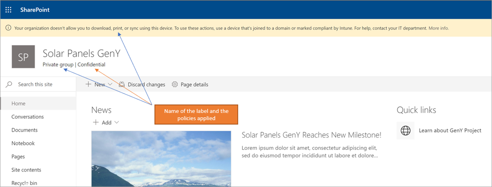

# <a name="use-sensitivity-labels-with-microsoft-teams-office-365-groups-and-sharepoint-sites-public-preview"></a><span data-ttu-id="84667-103">Usar etiquetas de confidencialidad con Microsoft Teams, grupos de Office 365 y sitios de SharePoint (versión preliminar pública)</span><span class="sxs-lookup"><span data-stu-id="84667-103">Use sensitivity labels with Microsoft Teams, Office 365 groups, and SharePoint sites (public preview)</span></span>

<span data-ttu-id="84667-104">Cuando cree etiquetas de confidencialidad en el [centro de cumplimiento de Microsoft 365](https://protection.office.com/), ahora podrá aplicarlas a Microsoft Teams, a los grupos de Office 365 y a los sitios de SharePoint.</span><span class="sxs-lookup"><span data-stu-id="84667-104">When you create sensitivity labels in the [Microsoft 365 compliance center](https://protection.office.com/), you can now apply them to Microsoft Teams, Office 365 groups, and SharePoint sites.</span></span> <span data-ttu-id="84667-105">Se pueden asociar directivas a las etiquetas para controlar:</span><span class="sxs-lookup"><span data-stu-id="84667-105">You can associate policies with the labels to control:</span></span>

- <span data-ttu-id="84667-106">Configuración pública/privada</span><span class="sxs-lookup"><span data-stu-id="84667-106">Public/private settings</span></span>
- <span data-ttu-id="84667-107">Acceso de invitados</span><span class="sxs-lookup"><span data-stu-id="84667-107">Guest access</span></span>
- <span data-ttu-id="84667-108">Acceso desde dispositivos no administrados</span><span class="sxs-lookup"><span data-stu-id="84667-108">Access from unmanaged devices</span></span>

<span data-ttu-id="84667-109">Al aplicar una etiqueta a un equipo o grupo, esta se aplica automáticamente al correspondiente sitio del equipo de SharePoint y viceversa.</span><span class="sxs-lookup"><span data-stu-id="84667-109">When you apply a label to a team or group, the label automatically applies to the connected SharePoint team site and the other way around.</span></span>

<span data-ttu-id="84667-110">Ahora también puede habilitar etiquetas de confidencialidad para los archivos de Office en SharePoint y OneDrive.</span><span class="sxs-lookup"><span data-stu-id="84667-110">You can now also enable sensitivity labels for Office files in SharePoint and OneDrive.</span></span> <span data-ttu-id="84667-111">Para más información, vea[ Habilitar etiquetas de confidencialidad para los archivos de Office en SharePoint y OneDrive (vista previa)](sensitivity-labels-sharepoint-onedrive-files.md).</span><span class="sxs-lookup"><span data-stu-id="84667-111">For more information, see [Enable sensitivity labels for Office files in SharePoint and OneDrive (public preview)](sensitivity-labels-sharepoint-onedrive-files.md).</span></span>

## <a name="about-the-public-preview-for-microsoft-teams-office-365-groups-and-sharepoint-sites"></a><span data-ttu-id="84667-112">Acerca de la versión preliminar pública para Microsoft Teams, grupos de Office 365 y sitios de SharePoint</span><span class="sxs-lookup"><span data-stu-id="84667-112">About the public preview for Microsoft Teams, Office 365 groups, and SharePoint sites</span></span>

<span data-ttu-id="84667-113">Las etiquetas de confidencialidad de Microsoft Teams, grupos de Office 365 y sitios de SharePoint se están introduciendo gradualmente para los inquilinos y es posible que haya cambios antes de la versión final.</span><span class="sxs-lookup"><span data-stu-id="84667-113">Sensitivity labels for Microsoft Teams, Office 365 groups, and SharePoint sites are gradually rolling out to tenants and might change before final release.</span></span>

<span data-ttu-id="84667-114">Esta versión preliminar pública no funciona con las redes de entrega de contenido (CDN) de Office 365.</span><span class="sxs-lookup"><span data-stu-id="84667-114">This public preview doesn't work with Office 365 Content Delivery Networks (CDNs).</span></span>

## <a name="overview"></a><span data-ttu-id="84667-115">Información general</span><span class="sxs-lookup"><span data-stu-id="84667-115">Overview</span></span>

<span data-ttu-id="84667-116">Cuando publica etiquetas de confidencialidad, los usuarios de Office 365 tienen acceso a la misma lista de etiquetas.</span><span class="sxs-lookup"><span data-stu-id="84667-116">When you publish sensitivity labels, users across Office 365 have access to the same list of labels.</span></span>

<span data-ttu-id="84667-117">Se muestran estas imágenes:</span><span class="sxs-lookup"><span data-stu-id="84667-117">These images show:</span></span>

- <span data-ttu-id="84667-118">Cómo se muestra la lista cuando se crea un nuevo sitio de grupo desde SharePoint</span><span class="sxs-lookup"><span data-stu-id="84667-118">How the list appears when you create a new team site from SharePoint</span></span>

- <span data-ttu-id="84667-119">Cuando se ve la lista en Word</span><span class="sxs-lookup"><span data-stu-id="84667-119">When you view the list in Word</span></span>

<span data-ttu-id="84667-120">Por ejemplo:</span><span class="sxs-lookup"><span data-stu-id="84667-120">For example:</span></span>


## <a name="enable-this-preview"></a><span data-ttu-id="84667-123">Habilitar esta versión preliminar</span><span class="sxs-lookup"><span data-stu-id="84667-123">Enable this preview</span></span>

<span data-ttu-id="84667-124">Debe usar la versión preliminar de [Azure Active Directory PowerShell para Graph (AzureAD)](https://docs.microsoft.com/powershell/azure/active-directory/overview?view=azureadps-2.0) (nombre de módulo **AzureADPreview**) para habilitar esta vista previa de las etiquetas de confidencialidad en Microsoft Teams, grupos de Office 365 y sitios de SharePoint:</span><span class="sxs-lookup"><span data-stu-id="84667-124">You must use the preview version of [Azure Active Directory PowerShell for Graph (AzureAD)](https://docs.microsoft.com/powershell/azure/active-directory/overview?view=azureadps-2.0) (module name **AzureADPreview**) to enable this preview of sensitivity labels with Microsoft Teams, Office 365 groups, and SharePoint sites:</span></span>

- <span data-ttu-id="84667-125">Si todavía no ha instalado ninguna de las versiones de los módulos de PowerShell de Azure AD, consulte [Instalar el módulo de Azure AD](https://docs.microsoft.com/powershell/azure/active-directory/install-adv2?view=azureadps-2.0-preview#installing-the-azure-ad-module) y siga las instrucciones para instalar la versión preliminar pública.</span><span class="sxs-lookup"><span data-stu-id="84667-125">If you haven't installed any version of the Azure AD PowerShell module before, see [Installing the Azure AD Module](https://docs.microsoft.com/powershell/azure/active-directory/install-adv2?view=azureadps-2.0-preview#installing-the-azure-ad-module) and follow the instructions to install the public preview release.</span></span>

- <span data-ttu-id="84667-126">Si tiene instalada la versión 2.0 de disponibilidad general para el módulo de PowerShell de Azure AD (AzureAD), deberá desinstalarla ejecutando `Uninstall-Module AzureAD` en su sesión de PowerShell y, a continuación, instalar la versión preliminar ejecutando `Install-Module AzureADPreview`.</span><span class="sxs-lookup"><span data-stu-id="84667-126">If you have the 2.0 general availability version of the Azure AD PowerShell module (AzureAD) installed, you must uninstall it by running `Uninstall-Module AzureAD` in your PowerShell session, and then install the preview version by running `Install-Module AzureADPreview`.</span></span>

- <span data-ttu-id="84667-127">Si ya ha instalado la versión preliminar, ejecute `Install-Module AzureADPreview` para asegurarse de que es la última versión de este módulo.</span><span class="sxs-lookup"><span data-stu-id="84667-127">If you have already installed the preview version, run `Install-Module AzureADPreview` to make sure it's the latest version of this module.</span></span>

<span data-ttu-id="84667-128">Ahora está listo para habilitar la versión preliminar de las etiquetas de confidencialidad con Microsoft Teams, grupos de Office 365 y sitios de SharePoint:</span><span class="sxs-lookup"><span data-stu-id="84667-128">You're now ready to enable the preview of sensitivity labels with Microsoft Teams, Office 365 groups, and SharePoint sites:</span></span>

1. <span data-ttu-id="84667-129">En una sesión de PowerShell, utilice una cuenta profesional o educativa con privilegios de administrador global para conectarse a Azure Active Directory.</span><span class="sxs-lookup"><span data-stu-id="84667-129">In a PowerShell session, using a work or school account that has global admin privileges, connect to Azure Active Directory.</span></span> <span data-ttu-id="84667-130">Por ejemplo, ejecute:</span><span class="sxs-lookup"><span data-stu-id="84667-130">For example, run:</span></span>
    
    ```powershell
    Connect-AzureAD
    ````
    
    <span data-ttu-id="84667-131">Para obtener instrucciones detalladas, consulte [conectarse a Azure AD](https://docs.microsoft.com/powershell/azure/active-directory/install-adv2?view=azureadps-2.0-preview#connect-to-azure-ad).</span><span class="sxs-lookup"><span data-stu-id="84667-131">For full instructions, see [Connect to Azure AD](https://docs.microsoft.com/powershell/azure/active-directory/install-adv2?view=azureadps-2.0-preview#connect-to-azure-ad).</span></span>

2. <span data-ttu-id="84667-132">Ejecute los comandos siguientes:</span><span class="sxs-lookup"><span data-stu-id="84667-132">Run the following commands:</span></span>
    
    ```powershell
    $setting=(Get-AzureADDirectorySetting | where -Property DisplayName -Value "Group.Unified" -EQ)
    if ($setting -eq $null)
    {
    $template = Get-AzureADDirectorySettingTemplate -Id 62375ab9-6b52-47ed-826b-58e47e0e304b
    $setting = $template.CreateDirectorySetting()
    $setting["EnableMIPLabels"] = "True"
    New-AzureADDirectorySetting -DirectorySetting $setting
    }
    else
    {
    $setting["EnableMIPLabels"] = "True"
    Set-AzureADDirectorySetting -Id $setting.Id -DirectorySetting $setting
    }
    ```
    
    > [!NOTE]
    > <span data-ttu-id="84667-133">Office 365 ya no usa las clasificaciones antiguas para nuevos grupos y sitios de SharePoint cuando se habilita esta versión preliminar.</span><span class="sxs-lookup"><span data-stu-id="84667-133">Office 365 no longer uses the old classifications for new groups and SharePoint sites when you enable this preview.</span></span> <span data-ttu-id="84667-134">Si ha utilizado la [clasificación de sitio de Azure AD](/sharepoint/dev/solution-guidance/modern-experience-site-classification) ($setting["ClassificationList"]), los grupos y sitios existentes siguen mostrando las clasificaciones antiguas.</span><span class="sxs-lookup"><span data-stu-id="84667-134">If you used [Azure AD site classification](/sharepoint/dev/solution-guidance/modern-experience-site-classification) ($setting["ClassificationList"]), existing groups and sites still display the old classifications.</span></span> <span data-ttu-id="84667-135">Conviértalos para que muestren las nuevas clasificaciones.</span><span class="sxs-lookup"><span data-stu-id="84667-135">To display the new classifications, convert them.</span></span> <span data-ttu-id="84667-136">Para obtener información sobre cómo convertirlos, consulte [Si utilizaba la clasificación clásica del sitio de Azure AD](#if-you-used-classic-azure-ad-site-classification).</span><span class="sxs-lookup"><span data-stu-id="84667-136">For information about how to convert them, see [If you used classic Azure AD site classification](#if-you-used-classic-azure-ad-site-classification).</span></span> 

3. <span data-ttu-id="84667-137">En la misma sesión de PowerShell, conéctese ahora al Centro de seguridad y cumplimiento con una cuenta profesional o educativa con privilegios de administrador global.</span><span class="sxs-lookup"><span data-stu-id="84667-137">In the same PowerShell session, now connect to the Security & Compliance Center by using a work or school account that has global admin privileges.</span></span> <span data-ttu-id="84667-138">Para obtener instrucciones, consulte [Conectarse a PowerShell del Centro de seguridad y cumplimiento de Office 365](/powershell/exchange/office-365-scc/connect-to-scc-powershell/connect-to-scc-powershell).</span><span class="sxs-lookup"><span data-stu-id="84667-138">For instructions, see [Connect to Office 365 Security & Compliance Center PowerShell](/powershell/exchange/office-365-scc/connect-to-scc-powershell/connect-to-scc-powershell).</span></span>

4. <span data-ttu-id="84667-139">Ejecute los siguientes comandos para sincronizar las etiquetas en Azure AD, de modo que se puedan usar con los grupos de Office 365:</span><span class="sxs-lookup"><span data-stu-id="84667-139">Run the following commands to synchronize your labels to Azure AD, so that they can used with Office 365 groups:</span></span>
    
    ```powershell
    Set-ExecutionPolicy RemoteSigned
    $UserCredential = Get-Credential
    $Session = New-PSSession -ConfigurationName Microsoft.Exchange -ConnectionUri https://ps.compliance.protection.outlook.com/powershell-liveid/ -Credential $UserCredential -Authentication Basic -AllowRedirection
    Import-PSSession $Session -DisableNameChecking
    Execute-AzureAdLabelSync
    ```
## <a name="set-site-and-group-settings-when-you-create-or-edit-sensitivity-labels"></a><span data-ttu-id="84667-140">Establezca los ajustes del sitio y los grupos al crear o editar etiquetas de confidencialidad</span><span class="sxs-lookup"><span data-stu-id="84667-140">Set site and group settings when you create or edit sensitivity labels</span></span>

<span data-ttu-id="84667-141">Una vez habilitada la versión preliminar, siga los mismos pasos para crear o editar etiquetas de confidencialidad.</span><span class="sxs-lookup"><span data-stu-id="84667-141">After you enable the preview, use the following steps to create or edit sensitivity labels.</span></span> <span data-ttu-id="84667-142">Debe seguir estos pasos para que se puedan usar las etiquetas de confidencialidad con sitios y grupos, incluso si ya tiene etiquetas definidas.</span><span class="sxs-lookup"><span data-stu-id="84667-142">You must complete these steps for the new sensitivity labels to work with sites and groups, even if you already have labels defined.</span></span> <span data-ttu-id="84667-143">Los cambios en estos ajustes pueden tardar hasta 24 horas en sincronizarse.</span><span class="sxs-lookup"><span data-stu-id="84667-143">Changes to these settings might take up to 24 hours to synchronize.</span></span>

1. <span data-ttu-id="84667-144">En el centro de cumplimiento de Microsoft 365, seleccione **Clasificación** > **Etiquetas de confidencialidad**.</span><span class="sxs-lookup"><span data-stu-id="84667-144">In the Microsoft 365 compliance center, select **Classification** > **Sensitivity labels**.</span></span>

2. <span data-ttu-id="84667-145">Seleccione**Crear una etiqueta**.</span><span class="sxs-lookup"><span data-stu-id="84667-145">Select **Create a label**.</span></span> <span data-ttu-id="84667-146">Si ya tiene una etiqueta, omita este paso.</span><span class="sxs-lookup"><span data-stu-id="84667-146">If you already have a label, skip to the next step.</span></span>

3. <span data-ttu-id="84667-147">Seleccione las opciones que desee y, a continuación, seleccione en la pestaña **Configuración de sitio y grupo**:</span><span class="sxs-lookup"><span data-stu-id="84667-147">Select the options you want, and then on the **Site and group settings** tab, choose:</span></span>
    
    - <span data-ttu-id="84667-148">Privacidad (Público/Privado): Privado significa que solo los miembros autorizados de la organización pueden ver el contenido del grupo.</span><span class="sxs-lookup"><span data-stu-id="84667-148">Privacy (Public/Private): Private means that only approved members in your organization can see what's inside the group.</span></span> <span data-ttu-id="84667-149">Ninguna otra persona de la organización puede ver lo que hay en el grupo.</span><span class="sxs-lookup"><span data-stu-id="84667-149">Anyone else in your organization can't see what's in the group.</span></span> [<span data-ttu-id="84667-150">Obtener más información</span><span class="sxs-lookup"><span data-stu-id="84667-150">Learn more</span></span>](https://support.office.com/article/36236e39-26d3-420b-b0ac-8072d2d2bedc)
    - <span data-ttu-id="84667-151">Acceso de invitado: Usted puede controlar si se pueden añadir invitados a un grupo.</span><span class="sxs-lookup"><span data-stu-id="84667-151">Guest access: You can control if guests can be added to a group.</span></span> [<span data-ttu-id="84667-152">Más información sobre cómo administrar el acceso de invitados en grupos de Office 365</span><span class="sxs-lookup"><span data-stu-id="84667-152">Learn about managing guest access in Office 365 Groups</span></span>](/office365/admin/create-groups/manage-guest-access-in-groups)
    - <span data-ttu-id="84667-153">Dispositivos no administrados: Esta opción le permite bloquear o limitar el acceso a contenido de SharePoint desde dispositivos que no sean unidos a Azure AD híbridos o compatibles con Intune.</span><span class="sxs-lookup"><span data-stu-id="84667-153">Unmanaged devices: This setting lets you block or limit access to SharePoint content from devices that aren't hybrid AD joined or compliant in Intune.</span></span> <span data-ttu-id="84667-154">Si selecciona Dispositivos no administrados, debe ir a Azure AD para finalizar la configuración de la directiva.</span><span class="sxs-lookup"><span data-stu-id="84667-154">If you select Unmanaged devices, you must go to Azure AD to finish setting up the policy.</span></span> <span data-ttu-id="84667-155">Para más información, vea [Control de acceso desde dispositivos no administrados](/sharepoint/control-access-from-unmanaged-devices).</span><span class="sxs-lookup"><span data-stu-id="84667-155">For info, see [Control access from unmanaged devices](/sharepoint/control-access-from-unmanaged-devices).</span></span>
    
    

> [!IMPORTANT]
> <span data-ttu-id="84667-157">La configuración de sitio y grupo solo surte efecto al aplicar una etiqueta a un equipo, grupo o sitio.</span><span class="sxs-lookup"><span data-stu-id="84667-157">Only the site and group settings take effect when you apply a label to a team, group, or site.</span></span> <span data-ttu-id="84667-158">El resto de opciones de configuración, como el cifrado y la marcación de contenido, no se aplican a todo el contenido del equipo, grupo o sitio.</span><span class="sxs-lookup"><span data-stu-id="84667-158">Other settings, such as encryption and content marking, aren't applied to all content within the team, group, or site.</span></span>
> 
> <span data-ttu-id="84667-159">De forma similar, si crea una etiqueta y no activa la configuración de sitio y de grupo, la etiqueta seguirá estando disponible cuando los usuarios creen equipos, grupos y sitios, pero estos se clasificarán sin aplicar ninguna configuración.</span><span class="sxs-lookup"><span data-stu-id="84667-159">Similarly, if you create a label and don't turn on site and group settings, the label will still be available when users create teams, groups, and sites, but it will classify without applying any settings.</span></span>

[<span data-ttu-id="84667-160">Más información sobre la publicación de etiquetas de confidencialidad</span><span class="sxs-lookup"><span data-stu-id="84667-160">Learn more about publishing sensitivity labels</span></span>](/microsoft-365/compliance/sensitivity-labels#what-label-policies-can-do)

## <a name="sensitivity-label-management"></a><span data-ttu-id="84667-161">Administración de etiquetas de confidencialidad</span><span class="sxs-lookup"><span data-stu-id="84667-161">Sensitivity label management</span></span>

> [!WARNING]
> <span data-ttu-id="84667-162">Para crear, modificar y eliminar las etiquetas de confidencialidad que usa para Microsoft Teams, grupos de Office 365 y sitios de SharePoint se requiere una cuidadosa coordinación con las directivas de etiquetas de publicación para los usuarios.</span><span class="sxs-lookup"><span data-stu-id="84667-162">Creating, modifying, and deleting sensitivity labels that you use for Microsoft Teams, Office 365 groups, and SharePoint sites requires careful coordination with publishing label policies to users.</span></span> 

<span data-ttu-id="84667-163">Evite errores de creación de sitios y grupos que puedan afectar a todos los usuarios con las instrucciones siguientes.</span><span class="sxs-lookup"><span data-stu-id="84667-163">Avoid creation errors for sites and groups that can affect all users by using the following guidance.</span></span>

<span data-ttu-id="84667-164">**Guardar y publicar etiquetas:**</span><span class="sxs-lookup"><span data-stu-id="84667-164">**Creating and publishing labels:**</span></span>

<span data-ttu-id="84667-165">Una vez se crea y se publica una etiqueta de confidencialidad, puede tardar hasta 24 horas en ser visible para los usuarios en los equipos, grupos y sitios.</span><span class="sxs-lookup"><span data-stu-id="84667-165">After a sensitivity label is created and published, it can take up to 24 hours for the label to become visible for users in teams, groups, and sites.</span></span> <span data-ttu-id="84667-166">Siga los pasos siguientes para publicar una etiqueta para todos los usuarios en el espacio empresarial:</span><span class="sxs-lookup"><span data-stu-id="84667-166">Use the following steps to publish a label for all users in the tenant:</span></span>

1. <span data-ttu-id="84667-167">Cree la etiqueta de confidencialidad y publíquela solo para algunas cuentas de usuario del espacio empresarial.</span><span class="sxs-lookup"><span data-stu-id="84667-167">Create the sensitivity label and publish it for just a few user accounts in the tenant.</span></span>

2. <span data-ttu-id="84667-168">Espere 24 horas.</span><span class="sxs-lookup"><span data-stu-id="84667-168">Wait for 24 hours.</span></span>

3. <span data-ttu-id="84667-169">Cuando transcurran 24 horas, utilice una de las cuentas de usuario que especificó en el paso 1 para crear un equipo, un grupo de Office 365 o un sitio de SharePoint con la etiqueta creada en el paso 1.</span><span class="sxs-lookup"><span data-stu-id="84667-169">After this 24 hours wait, use one of the user accounts you specified in step 1 to create a team, Office 365 group, or SharePoint site with the label that you created in step 1.</span></span>

4. <span data-ttu-id="84667-170">Si no se han producido errores durante la operación de creación del paso 3, publique la etiqueta para todos los usuarios de su espacio empresarial.</span><span class="sxs-lookup"><span data-stu-id="84667-170">If there are no errors during the creation operation for step 3, publish the label for all users in your tenant.</span></span> <span data-ttu-id="84667-171">Si hay errores, póngase en contacto con el soporte técnico de Microsoft.</span><span class="sxs-lookup"><span data-stu-id="84667-171">If there are errors, contact Microsoft Support.</span></span>

<span data-ttu-id="84667-172">**Modificar y eliminar etiquetas publicadas:**</span><span class="sxs-lookup"><span data-stu-id="84667-172">**Modifying and deleting published labels:**</span></span>

<span data-ttu-id="84667-173">Si modifica o elimina una etiqueta de confidencialidad incluida en una o varias directivas de etiquetas, estas acciones pueden ocasionar errores en la creación de todos los equipos, grupos y sitios.</span><span class="sxs-lookup"><span data-stu-id="84667-173">If you modify or delete a sensitivity label that is included in one or more label policies, these actions can result in creation failures for all teams, groups, and sites.</span></span> <span data-ttu-id="84667-174">Para evitarlo, siga las instrucciones que se indican a continuación:</span><span class="sxs-lookup"><span data-stu-id="84667-174">To avoid this situation, use the following guidance:</span></span>

1. <span data-ttu-id="84667-175">Elimine la etiqueta de confidencialidad de todas las directivas de etiqueta que la incluyan.</span><span class="sxs-lookup"><span data-stu-id="84667-175">Remove the sensitivity label from all label policies that include the label.</span></span>

2. <span data-ttu-id="84667-176">Espere 48 horas.</span><span class="sxs-lookup"><span data-stu-id="84667-176">Wait for 48 hours.</span></span>

3. <span data-ttu-id="84667-177">Transcurrida la espera de 48 horas, pruebe a crear un equipo, grupo o sitio y compruebe que la etiqueta ya no es visible.</span><span class="sxs-lookup"><span data-stu-id="84667-177">After the 48 hours wait, try creating a team, group, or site and confirm that the label is no longer visible.</span></span>

4. <span data-ttu-id="84667-178">Si la etiqueta de confidencialidad no es visible, ya la puede modificar o eliminar de forma segura.</span><span class="sxs-lookup"><span data-stu-id="84667-178">If the sensitivity label isn't visible, you can now safely modify or delete the label.</span></span> <span data-ttu-id="84667-179">Si la etiqueta sigue visible, póngase en contacto con el soporte técnico de Microsoft.</span><span class="sxs-lookup"><span data-stu-id="84667-179">If the label is still visible, contact Microsoft Support.</span></span>

## <a name="troubleshoot-sensitivity-label-deployment"></a><span data-ttu-id="84667-180">Resolución de problemas de implementación de etiquetas de confidencialidad</span><span class="sxs-lookup"><span data-stu-id="84667-180">Troubleshoot sensitivity label deployment</span></span>

### <a name="labels-not-visible-after-publishing"></a><span data-ttu-id="84667-181">Las etiquetas no son visibles tras su publicación</span><span class="sxs-lookup"><span data-stu-id="84667-181">Labels not visible after publishing</span></span>
<span data-ttu-id="84667-182">Si tiene problemas al crear un equipo o un grupo de Office 365 después de habilitar esta configuración o de modificar la descripción de una etiqueta de confidencialidad, guarde la etiqueta, espere algunas horas y, a continuación, vuelva a intentar crear el equipo o grupo.</span><span class="sxs-lookup"><span data-stu-id="84667-182">If you experience issues when you create a team or Office 365 group after you enable these settings or modify a sensitivity label's description, save the label, wait a few hours, and then try to create the team or group again.</span></span> <span data-ttu-id="84667-183">Para obtener más información, consulte [Programar la implementación tras crear o cambiar una etiqueta de confidencialidad](sensitivity-labels-sharepoint-onedrive-files.md#schedule-roll-out-after-you-create-or-change-a-sensitivity-label).</span><span class="sxs-lookup"><span data-stu-id="84667-183">For information, see [Schedule roll-out after you create or change a sensitivity label](sensitivity-labels-sharepoint-onedrive-files.md#schedule-roll-out-after-you-create-or-change-a-sensitivity-label).</span></span>

<span data-ttu-id="84667-184">Si sigue sin poder ver la nueva etiqueta de confidencialidad desde SharePoint Online, póngase en contacto con el soporte técnico de Microsoft.</span><span class="sxs-lookup"><span data-stu-id="84667-184">If you are still not able to see the new sensitivity label from SharePoint Online, contact Microsoft Support.</span></span>

### <a name="team-group-or-sharepoint-site-creation-errors"></a><span data-ttu-id="84667-185">Errores de creación de equipo, grupo o sitio de SharePoint</span><span class="sxs-lookup"><span data-stu-id="84667-185">Team, group, or SharePoint site creation errors</span></span>
<span data-ttu-id="84667-186">Si experimenta errores de creación durante la versión preliminar pública, tiene dos opciones:</span><span class="sxs-lookup"><span data-stu-id="84667-186">If you experience creation errors during the public preview, you have two options:</span></span>

- <span data-ttu-id="84667-187">Asegúrese de que las etiquetas de confidencialidad no son obligatorias para algún usuario.</span><span class="sxs-lookup"><span data-stu-id="84667-187">Ensure that sensitivity labels are not mandatory for any user.</span></span>

- <span data-ttu-id="84667-188">Puede desactivar las etiquetas de confidencialidad de Microsoft Teams, grupos Office 365 y sitios de SharePoint siguiendo las mismas instrucciones que se muestran en la sección [Habilitar esta versión preliminar](#enable-this-preview) en esta página.</span><span class="sxs-lookup"><span data-stu-id="84667-188">You can turn off sensitivity labels for Microsoft Teams, Office 365 groups, and SharePoint sites by using the same instructions from the [Enable this preview](#enable-this-preview) section on this page.</span></span> <span data-ttu-id="84667-189">Sin embargo, para deshabilitar la versión preliminar, busque la línea `$setting["EnableMIPLabels"] = "True"` y cambie el valor **True** a **False**.</span><span class="sxs-lookup"><span data-stu-id="84667-189">However, to disable the preview, search for the line `$setting["EnableMIPLabels"] = "True"`, and change the **True** value to **False**.</span></span>

## <a name="apply-a-sensitivity-label-to-a-new-team"></a><span data-ttu-id="84667-190">Aplicar una etiqueta de confidencialidad a un nuevo equipo</span><span class="sxs-lookup"><span data-stu-id="84667-190">Apply a sensitivity label to a new team</span></span>

<span data-ttu-id="84667-191">Los usuarios pueden seleccionar etiquetas de confidencialidad al crear nuevos equipos en Microsoft Teams.</span><span class="sxs-lookup"><span data-stu-id="84667-191">Users can select sensitivity labels when they create new teams in Microsoft Teams.</span></span> <span data-ttu-id="84667-192">Cuando seleccionan el nivel de confidencialidad, la configuración de privacidad cambia según las necesidades.</span><span class="sxs-lookup"><span data-stu-id="84667-192">When they select the sensitivity level, the privacy setting changes as necessary.</span></span> <span data-ttu-id="84667-193">En función de la configuración de acceso de invitado que haya seleccionado para la etiqueta, los usuarios pueden agregar al equipo personas de fuera de la organización.</span><span class="sxs-lookup"><span data-stu-id="84667-193">Depending on the guest access setting you selected for the label, users can or can't add people outside the organization to the team.</span></span>

[<span data-ttu-id="84667-194">Más información sobre las etiquetas de confidencialidad para Teams</span><span class="sxs-lookup"><span data-stu-id="84667-194">Learn more about sensitivity labels for Teams</span></span>](https://docs.microsoft.com/microsoftteams/sensitivity-labels)


<span data-ttu-id="84667-196">Después de crear el equipo, se muestra la etiqueta de confidencialidad en la esquina superior derecha de todos los canales.</span><span class="sxs-lookup"><span data-stu-id="84667-196">After you create the team, the sensitivity label appears in the upper-right corner of all channels.</span></span>


<span data-ttu-id="84667-198">El servicio aplica automáticamente la misma etiqueta de confidencialidad al grupo de Office 365 y al sitio de grupo de SharePoint conectado.</span><span class="sxs-lookup"><span data-stu-id="84667-198">The service automatically applies the same sensitivity label to the Office 365 group and the connected SharePoint team site.</span></span>

## <a name="apply-a-sensitivity-label-to-a-new-group"></a><span data-ttu-id="84667-199">Aplicar una etiqueta de confidencialidad a un nuevo grupo</span><span class="sxs-lookup"><span data-stu-id="84667-199">Apply a sensitivity label to a new group</span></span>

<span data-ttu-id="84667-200">En Outlook en la Web, el nuevo cuadro de **Confidencialidad** contiene las etiquetas publicadas.</span><span class="sxs-lookup"><span data-stu-id="84667-200">In Outlook on the web, the new **Sensitivity** box contains published labels.</span></span> <span data-ttu-id="84667-201">Si los usuarios desean más información, pueden hacer clic en el icono de ayuda para ver detalles sobre las etiquetas disponibles y las directivas asociadas.</span><span class="sxs-lookup"><span data-stu-id="84667-201">If users want more info, they can click the help icon to read details about the available labels and associated policies.</span></span>


## <a name="apply-a-sensitivity-label-to-a-new-site"></a><span data-ttu-id="84667-203">Aplicar una etiqueta de confidencialidad a un nuevo sitio</span><span class="sxs-lookup"><span data-stu-id="84667-203">Apply a sensitivity label to a new site</span></span>

<span data-ttu-id="84667-204">Los administradores y los usuarios finales pueden seleccionar etiquetas de confidencialidad al crear sitios modernos de grupo y de comunicación.</span><span class="sxs-lookup"><span data-stu-id="84667-204">Admins and end users can select sensitivity labels when they create modern team sites and communication sites.</span></span>

[<span data-ttu-id="84667-205">Más información sobre crear un sitio en el nuevo centro de administración de SharePoint</span><span class="sxs-lookup"><span data-stu-id="84667-205">Learn how to create a site in the new SharePoint admin center</span></span>](/sharepoint/create-site-collection)

<span data-ttu-id="84667-206">Cuando los usuarios crean sitios modernos de equipo y comunicación, ya hay una etiqueta de confidencialidad seleccionada de forma predeterminada.</span><span class="sxs-lookup"><span data-stu-id="84667-206">When users create modern team and communication sites, a sensitivity label is already selected by default.</span></span> <span data-ttu-id="84667-207">Los usuarios pueden seleccionar el icono de ayuda para obtener más información sobre las etiquetas.</span><span class="sxs-lookup"><span data-stu-id="84667-207">Users can select the help icon to learn more about the labels.</span></span>


<span data-ttu-id="84667-209">Cuando los usuarios exploren el sitio, podrán ver el nombre de la etiqueta y las directivas aplicadas.</span><span class="sxs-lookup"><span data-stu-id="84667-209">When users browse to the site, they can see the name of the label and applied policies.</span></span>



## <a name="manage-sensitivity-labels-in-the-sharepoint-admin-center"></a><span data-ttu-id="84667-211">Administrar etiquetas de confidencialidad en el centro de administración de SharePoint</span><span class="sxs-lookup"><span data-stu-id="84667-211">Manage sensitivity labels in the SharePoint admin center</span></span>

<span data-ttu-id="84667-212">Para ver y editar las etiquetas, use la página Sitios activos en el nuevo centro de administración de SharePoint.</span><span class="sxs-lookup"><span data-stu-id="84667-212">To view and edit the labels, use the Active sites page in the new SharePoint admin center.</span></span>


<span data-ttu-id="84667-214">[Obtenga más información para administrar sitios en el nuevo centro de administración de SharePoint](/sharepoint/manage-sites-in-new-admin-center).</span><span class="sxs-lookup"><span data-stu-id="84667-214">[Learn more about managing sites in the new SharePoint admin center](/sharepoint/manage-sites-in-new-admin-center).</span></span>

## <a name="change-site-and-group-settings-for-a-label"></a><span data-ttu-id="84667-215">Cambiar la configuración de sitio y grupo para una etiqueta</span><span class="sxs-lookup"><span data-stu-id="84667-215">Change site and group settings for a label</span></span>

<span data-ttu-id="84667-216">Siempre que haga un cambio en la configuración de sitio y de grupo de una etiqueta, debe ejecutar los comandos de PowerShell que se indican a continuación para que los equipos, sitios y grupos puedan usar la nueva configuración.</span><span class="sxs-lookup"><span data-stu-id="84667-216">Whenever you make a change to site and group settings for a label, you must run the following PowerShell commands so that your teams, sites, and groups can use the new settings.</span></span> <span data-ttu-id="84667-217">Se recomienda no cambiar la configuración del sitio y el grupo de una etiqueta después de haber aplicado la etiqueta a varios equipos, grupos o sitios.</span><span class="sxs-lookup"><span data-stu-id="84667-217">As a best practice, don't the change site and group settings for a label after you've applied the label to several teams, groups, or sites.</span></span>

1. <span data-ttu-id="84667-218">Ejecute los siguientes comandos para conectarse al PowerShell del Centro de seguridad y cumplimiento de Office 365 y obtener la lista de etiquetas de confidencialidad y sus GUID.</span><span class="sxs-lookup"><span data-stu-id="84667-218">Run the following commands to connect to Office 365 Security & Compliance Center PowerShell and get the list of sensitivity labels and their GUIDs.</span></span>
    
    ```powershell
    Set-ExecutionPolicy RemoteSigned
    $UserCredential = Get-Credential
    $Session = New-PSSession -ConfigurationName Microsoft.Exchange -ConnectionUri https://ps.compliance.protection.outlook.com/powershell-liveid -Authentication Basic -AllowRedirection -Credential $UserCredential
    Import-PSSession $Session
    Get-Label |ft Name, Guid
    ```

2. <span data-ttu-id="84667-219">Tome nota del GUID para la(s) etiqueta(s) que ha cambiado.</span><span class="sxs-lookup"><span data-stu-id="84667-219">Make a note of the GUID for the label or labels you have changed.</span></span>

3. <span data-ttu-id="84667-220">Ahora, conéctese al PowerShell de Exchange Online y ejecute el cmdlet Get-UnifiedGroup, especificando el GUID de la etiqueta en vez del GUID de ejemplo de "e48058ea-98e8-4940-8db0-ba1310fd955e":</span><span class="sxs-lookup"><span data-stu-id="84667-220">Now connect to Exchange Online PowerShell and run the Get-UnifiedGroup cmdlet, specifying your label GUID in place of the example GUID of "e48058ea-98e8-4940-8db0-ba1310fd955e":</span></span> 
    
    ```powershell
    Set-ExecutionPolicy RemoteSigned
    $UserCredential = Get-Credential
    $Session = New-PSSession -ConfigurationName Microsoft.Exchange -ConnectionUri https://outlook.office365.com/powershell-liveid/ -Credential $UserCredential -Authentication Basic -AllowRedirection
    Import-PSSession $Session
    $Groups= Get-UnifiedGroup | Where {$_.SensitivityLabel  -eq "e48058ea-98e8-4940-8db0-ba1310fd955e"}
    ```

4. <span data-ttu-id="84667-221">Para cada grupo, vuelva a aplicar la etiqueta de confidencialidad, especificando el GUID de la etiqueta en vez del GUID de ejemplo de "e48058ea-98e8-4940-8db0-ba1310fd955e":</span><span class="sxs-lookup"><span data-stu-id="84667-221">For each group, reapply the sensitivity label, specifying your label GUID in place of the example GUID of "e48058ea-98e8-4940-8db0-ba1310fd955e":</span></span>
    
    ```powershell
    foreach ($g in $groups)
    {Set-UnifiedGroup -Identity $g.Identity -SensitivityLabelId "e48058ea-98e8-4940-8db0-ba1310fd955e"}
    ```

## <a name="support-for-the-new-sensitivity-labels"></a><span data-ttu-id="84667-222">Soporte técnico para las nuevas etiquetas de confidencialidad</span><span class="sxs-lookup"><span data-stu-id="84667-222">Support for the new sensitivity labels</span></span>

<span data-ttu-id="84667-223">Las siguientes aplicaciones y servicios son compatibles con las etiquetas de confidencialidad en esta versión preliminar:</span><span class="sxs-lookup"><span data-stu-id="84667-223">The following apps and services support the sensitivity labels in this preview:</span></span>

- <span data-ttu-id="84667-224">Centro de cumplimiento de Microsoft 365</span><span class="sxs-lookup"><span data-stu-id="84667-224">Microsoft 365 compliance center</span></span>
- <span data-ttu-id="84667-225">SharePoint</span><span class="sxs-lookup"><span data-stu-id="84667-225">SharePoint</span></span>
- <span data-ttu-id="84667-226">Outlook en la Web</span><span class="sxs-lookup"><span data-stu-id="84667-226">Outlook on the web</span></span>
- <span data-ttu-id="84667-227">Teams</span><span class="sxs-lookup"><span data-stu-id="84667-227">Teams</span></span>
- <span data-ttu-id="84667-228">Centro de administración de SharePoint</span><span class="sxs-lookup"><span data-stu-id="84667-228">SharePoint admin center</span></span>
- <span data-ttu-id="84667-229">Centro de administración de Azure AD</span><span class="sxs-lookup"><span data-stu-id="84667-229">Azure AD admin center</span></span>

<span data-ttu-id="84667-230">No se pueden usar las siguientes aplicaciones y servicios para crear grupos de Office 365 con las nuevas etiquetas de confidencialidad:</span><span class="sxs-lookup"><span data-stu-id="84667-230">You can't use the following apps and services to create Office 365 groups with the new sensitivity labels:</span></span>

- <span data-ttu-id="84667-231">Outlook para Mac</span><span class="sxs-lookup"><span data-stu-id="84667-231">Outlook for the Mac</span></span>
- <span data-ttu-id="84667-232">Outlook para dispositivos móviles</span><span class="sxs-lookup"><span data-stu-id="84667-232">Outlook mobile</span></span>  
- <span data-ttu-id="84667-233">Outlook de escritorio para Windows</span><span class="sxs-lookup"><span data-stu-id="84667-233">Outlook desktop for Windows</span></span>
- <span data-ttu-id="84667-234">Formularios</span><span class="sxs-lookup"><span data-stu-id="84667-234">Forms</span></span>  
- <span data-ttu-id="84667-235">Dynamics 365</span><span class="sxs-lookup"><span data-stu-id="84667-235">Dynamics 365</span></span>  
- <span data-ttu-id="84667-236">Yammer</span><span class="sxs-lookup"><span data-stu-id="84667-236">Yammer</span></span>  
- <span data-ttu-id="84667-237">Stream</span><span class="sxs-lookup"><span data-stu-id="84667-237">Stream</span></span>  
- <span data-ttu-id="84667-238">Planner</span><span class="sxs-lookup"><span data-stu-id="84667-238">Planner</span></span>  
- <span data-ttu-id="84667-239">Proyecto</span><span class="sxs-lookup"><span data-stu-id="84667-239">Project</span></span>  
- <span data-ttu-id="84667-240">PowerBI</span><span class="sxs-lookup"><span data-stu-id="84667-240">PowerBI</span></span>  
- <span data-ttu-id="84667-241">Centro de administración de Teams</span><span class="sxs-lookup"><span data-stu-id="84667-241">Teams admin center</span></span>  
- <span data-ttu-id="84667-242">Centro de administración de Microsoft 365</span><span class="sxs-lookup"><span data-stu-id="84667-242">Microsoft 365 admin center</span></span>  
- <span data-ttu-id="84667-243">Centro de administración de Exchange</span><span class="sxs-lookup"><span data-stu-id="84667-243">Exchange admin center</span></span>

## <a name="if-you-used-classic-azure-ad-site-classification"></a><span data-ttu-id="84667-244">Si usó la clasificación clásica de sitio de Azure AD</span><span class="sxs-lookup"><span data-stu-id="84667-244">If you used classic Azure AD site classification</span></span>

<span data-ttu-id="84667-245">Office 365 ya no admite las clasificaciones antiguas para nuevos grupos y sitios de SharePoint una vez habilitada esta versión preliminar.</span><span class="sxs-lookup"><span data-stu-id="84667-245">Office 365 no longer supports the old classifications for new groups and SharePoint sites when you enable this preview.</span></span> <span data-ttu-id="84667-246">Sin embargo, los grupos y sitios existentes siguen mostrando las clasificaciones antiguas, a menos que usted los convierta.</span><span class="sxs-lookup"><span data-stu-id="84667-246">However, existing groups and sites still display the old classifications unless you convert them.</span></span> <span data-ttu-id="84667-247">Entre las clasificaciones antiguas se incluyen la clasificación de sitios "modernos" que usted haya configurado, probablemente a través de PowerShell de Azure AD o la biblioteca principal PnP, donde se definían valores para la configuración de `ClassificationList`.</span><span class="sxs-lookup"><span data-stu-id="84667-247">Old classifications include the "modern" sites classification you set up, possibly through Azure AD PowerShell or the PnP Core library, that defined values for the `ClassificationList` setting.</span></span>

<span data-ttu-id="84667-248">Por ejemplo, en PowerShell:</span><span class="sxs-lookup"><span data-stu-id="84667-248">For example, in PowerShell:</span></span>

```powershell
   ($setting["ClassificationList"])
```

<span data-ttu-id="84667-249">Para obtener más información sobre el método antiguo de clasificación, consulte [Clasificación de sitios "modernos" de SharePoint](https://docs.microsoft.com/sharepoint/dev/solution-guidance/modern-experience-site-classification).</span><span class="sxs-lookup"><span data-stu-id="84667-249">For more information about the old classification method, see [SharePoint "modern" sites classification](https://docs.microsoft.com/sharepoint/dev/solution-guidance/modern-experience-site-classification).</span></span>

<span data-ttu-id="84667-250">En función de la implementación actual, tiene dos opciones para convertir las clasificaciones antiguas en nuevas.</span><span class="sxs-lookup"><span data-stu-id="84667-250">Based on your current deployment, you have two options to convert your old classifications to the new classifications.</span></span>

### <a name="if-you-never-used-sensitivity-labels-unified-microsoft-information-protection-labels-for-files-and-email"></a><span data-ttu-id="84667-251">Si nunca ha usado etiquetas de confidencialidad (etiquetas unificadas de protección de información de Microsoft) para archivos y correo electrónico</span><span class="sxs-lookup"><span data-stu-id="84667-251">If you never used sensitivity labels (unified Microsoft Information Protection labels) for files and email</span></span>

<span data-ttu-id="84667-252">Le recomendamos que haga lo siguiente:</span><span class="sxs-lookup"><span data-stu-id="84667-252">We recommend that you:</span></span>

1. <span data-ttu-id="84667-253">Cree nuevas etiquetas de confidencialidad en el centro de cumplimiento de Microsoft 365 con los mismos nombres que las clasificaciones existentes.</span><span class="sxs-lookup"><span data-stu-id="84667-253">Create new sensitivity labels in the Microsoft 365 compliance center that have the same names as your existing classifications.</span></span>
2. <span data-ttu-id="84667-254">Use PowerShell para aplicar las nuevas etiquetas a los grupos de Office 365 y los sitios de SharePoint ya existentes mediante el mapeo de nombres.</span><span class="sxs-lookup"><span data-stu-id="84667-254">Use PowerShell to apply the new labels to existing Office 365 groups and SharePoint sites using name mapping.</span></span>
3. <span data-ttu-id="84667-255">Elimine las clasificaciones antiguas.</span><span class="sxs-lookup"><span data-stu-id="84667-255">Delete the old classifications.</span></span>

<span data-ttu-id="84667-256">Las aplicaciones y los servicios compatibles con las nuevas etiquetas de confidencialidad las mostrarán.</span><span class="sxs-lookup"><span data-stu-id="84667-256">Apps and services that support the new sensitivity labels will show them.</span></span> <span data-ttu-id="84667-257">Cree nuevos equipos, grupos y sitios con las nuevas etiquetas.</span><span class="sxs-lookup"><span data-stu-id="84667-257">You create new teams, groups, and sites with the new labels.</span></span> <span data-ttu-id="84667-258">Los usuarios todavía pueden crear grupos desde aplicaciones y servicios que no son compatibles con las nuevas etiquetas.</span><span class="sxs-lookup"><span data-stu-id="84667-258">Users can still create groups from apps and services that don't support the new labels.</span></span> <span data-ttu-id="84667-259">Sin embargo, los usuarios no pueden aplicar una etiqueta a estos grupos.</span><span class="sxs-lookup"><span data-stu-id="84667-259">However, users can't apply a label to these groups.</span></span> <span data-ttu-id="84667-260">Use PowerShell para aplicar las nuevas etiquetas de confidencialidad a estos grupos.</span><span class="sxs-lookup"><span data-stu-id="84667-260">Use PowerShell to apply the new sensitivity labels to these groups.</span></span>

<span data-ttu-id="84667-261">Puede conservar las clasificaciones antiguas; sin embargo, se recomienda encarecidamente usar PowerShell para aplicar las nuevas etiquetas de confidencialidad a estos grupos.</span><span class="sxs-lookup"><span data-stu-id="84667-261">You can keep your old classifications; however, we highly recommend using PowerShell to apply the new sensitivity labels to these groups.</span></span>

<span data-ttu-id="84667-262">Las aplicaciones y los servicios compatibles con las nuevas etiquetas de confidencialidad se crearán con las nuevas etiquetas.</span><span class="sxs-lookup"><span data-stu-id="84667-262">Apps and services that support the new sensitivity labels will get created with the new labels.</span></span> <span data-ttu-id="84667-263">Cuando los usuarios crean grupos desde aplicaciones y servicios que no son compatibles con las nuevas etiquetas, pueden seleccionar una clasificación.</span><span class="sxs-lookup"><span data-stu-id="84667-263">When users create groups from apps and services that don't support the new labels, they can select a classification.</span></span>

### <a name="if-you-use-sensitivity-labels-unified-microsoft-information-protection-labels-for-files-and-email"></a><span data-ttu-id="84667-264">Si utiliza etiquetas de confidencialidad (etiquetas unificadas de protección de información de Microsoft) para archivos y correo electrónico</span><span class="sxs-lookup"><span data-stu-id="84667-264">If you use sensitivity labels (unified Microsoft Information Protection labels) for files and email</span></span>

<span data-ttu-id="84667-265">Tan pronto como habilite esta versión preliminar, vaya a cada etiqueta en el centro de cumplimiento de Microsoft 365 y aplique las directivas que desee para los sitios y grupos.</span><span class="sxs-lookup"><span data-stu-id="84667-265">As soon as you enable this preview, go to each label in the Microsoft 365 compliance center and apply the policies you want for sites and groups.</span></span> <span data-ttu-id="84667-266">Los usuarios comenzarán a ver las etiquetas ya existentes disponibles para sitios y grupos.</span><span class="sxs-lookup"><span data-stu-id="84667-266">Users will start seeing your existing labels available for sites and groups.</span></span>

### <a name="prepare-the-sharepoint-online-management-shell-before-you-relabel-office-365-groups"></a><span data-ttu-id="84667-267">Preparar el Shell de administración de SharePoint Online antes de reetiquetar grupos de Office 365</span><span class="sxs-lookup"><span data-stu-id="84667-267">Prepare the SharePoint Online Management Shell before you relabel Office 365 groups</span></span>

<span data-ttu-id="84667-268">Antes de aplicar las nuevas etiquetas, asegúrese de que está ejecutando el Shell de administración de SharePoint Online más reciente.</span><span class="sxs-lookup"><span data-stu-id="84667-268">Before you apply new labels, ensure that you're running the latest SharePoint Online Management Shell.</span></span> <span data-ttu-id="84667-269">Si ya tiene instalada la versión más reciente, puede continuar y [Reetiquetar grupos de Office 365 con nuevas etiquetas de confidencialidad](#relabel-office-365-groups-with-new-sensitivity-labels).</span><span class="sxs-lookup"><span data-stu-id="84667-269">If you already have the latest version, you can go ahead and [Relabel Office 365 groups with new sensitivity labels](#relabel-office-365-groups-with-new-sensitivity-labels).</span></span>

<span data-ttu-id="84667-270">Para preparar el Shell de administración de SharePoint Online para la versión preliminar:</span><span class="sxs-lookup"><span data-stu-id="84667-270">To prepare the SharePoint Online Management Shell for the preview:</span></span>

1. <span data-ttu-id="84667-271">Si instaló una versión anterior del Shell de administración de SharePoint Online, vaya a **Agregar o quitar programas** y desinstale "Shell de administración de SharePoint Online".</span><span class="sxs-lookup"><span data-stu-id="84667-271">If you installed a previous version of the SharePoint Online Management Shell, go to **Add or remove programs** and uninstall “SharePoint Online Management Shell”.</span></span>

2. <span data-ttu-id="84667-272">En un explorador web, vaya a la página del centro de descargas y [Descargue el Shell más reciente de administración de SharePoint Online](https://go.microsoft.com/fwlink/p/?LinkId=255251).</span><span class="sxs-lookup"><span data-stu-id="84667-272">In a web browser, go to the Download Center page and [Download the latest SharePoint Online Management Shell](https://go.microsoft.com/fwlink/p/?LinkId=255251).</span></span>

3. <span data-ttu-id="84667-273">Seleccione el idioma y, a continuación, haga clic en **Descargar**.</span><span class="sxs-lookup"><span data-stu-id="84667-273">Select your language and then click **Download**.</span></span>

4. <span data-ttu-id="84667-274">Elija entre el archivo .msi x64 y x86.</span><span class="sxs-lookup"><span data-stu-id="84667-274">Choose between the x64 and x86 .msi file.</span></span> <span data-ttu-id="84667-275">Descargue el archivo x64 si está ejecutando la versión de 64 bits de Windows o el archivo x86 si está ejecutando la versión de 32 bits.</span><span class="sxs-lookup"><span data-stu-id="84667-275">Download the x64 file if you run the 64-bit version of Windows or the x86 file if you’re run the 32-bit version.</span></span> <span data-ttu-id="84667-276">Si no lo sabe, consulte [¿Qué versión del sistema operativo Windows estoy ejecutando?](https://support.microsoft.com/help/13443/windows-which-operating-system)</span><span class="sxs-lookup"><span data-stu-id="84667-276">If you don’t know, see [Which version of Windows operating system am I running?](https://support.microsoft.com/help/13443/windows-which-operating-system).</span></span>

5. <span data-ttu-id="84667-277">Después de descargar el archivo, ejecútelo y siga los pasos del asistente de configuración.</span><span class="sxs-lookup"><span data-stu-id="84667-277">After you download the file, run the file and follow the steps in the Setup Wizard.</span></span>

### <a name="relabel-office-365-groups-with-new-sensitivity-labels"></a><span data-ttu-id="84667-278">Reetiquetar grupos de Office 365 con nuevas etiquetas de confidencialidad</span><span class="sxs-lookup"><span data-stu-id="84667-278">Relabel Office 365 groups with new sensitivity labels</span></span>

1. <span data-ttu-id="84667-279">Asegúrese de que utiliza la versión más reciente del Shell de administración de SharePoint Online.</span><span class="sxs-lookup"><span data-stu-id="84667-279">Ensure that you're using the latest version of the SharePoint Online Management Shell.</span></span> <span data-ttu-id="84667-280">Para obtener instrucciones, consulte [Preparar el Shell de administración de SharePoint Online antes de reetiquetar grupos de Office 365](#prepare-the-sharepoint-online-management-shell-before-you-relabel-office-365-groups).</span><span class="sxs-lookup"><span data-stu-id="84667-280">For instructions, see [Prepare the SharePoint Online Management Shell before you relabel Office 365 groups](#prepare-the-sharepoint-online-management-shell-before-you-relabel-office-365-groups).</span></span>

2. <span data-ttu-id="84667-281">Utilice una cuenta profesional o educativa con privilegios de administrador global o de administrador de SharePoint en Office 365 para conectarse al Shell de administración de SharePoint Online.</span><span class="sxs-lookup"><span data-stu-id="84667-281">Using a work or school account that has global administrator or SharePoint admin privileges in Office 365, connect to SharePoint Online Management Shell.</span></span> <span data-ttu-id="84667-282">Para saber cómo hacerlo, consulte [Introducción al Shell de administración de SharePoint Online](/powershell/sharepoint/sharepoint-online/connect-sharepoint-online).</span><span class="sxs-lookup"><span data-stu-id="84667-282">To learn how, see [Getting started with SharePoint Online Management Shell](/powershell/sharepoint/sharepoint-online/connect-sharepoint-online).</span></span>

3. <span data-ttu-id="84667-283">Ejecute el comando siguiente para obtener la lista de etiquetas de confidencialidad y sus GUID.</span><span class="sxs-lookup"><span data-stu-id="84667-283">Run the following command to get the list of sensitivity labels and their GUIDs.</span></span>

    ```PowerShell
    Set-ExecutionPolicy RemoteSigned
    $UserCredential = Get-Credential
    $Session = New-PSSession -ConfigurationName Microsoft.Exchange -ConnectionUri https://ps.compliance.protection.outlook.com/powershell-liveid -Authentication Basic -AllowRedirection -Credential $UserCredential
    Import-PSSession $Session
    Get-Label |ft Name, Guid  
    ```

4. <span data-ttu-id="84667-284">Tome nota del GUID de la etiqueta que desea sobrescribir.</span><span class="sxs-lookup"><span data-stu-id="84667-284">Make a note of the GUID for the label you want to overwrite.</span></span> <span data-ttu-id="84667-285">Por ejemplo, etiqueta "General".</span><span class="sxs-lookup"><span data-stu-id="84667-285">For example, the "General" label.</span></span>

5. <span data-ttu-id="84667-286">Use el comando siguiente para obtener la lista de grupos que tienen la clasificación "General".</span><span class="sxs-lookup"><span data-stu-id="84667-286">Use the following command to get the list of groups that have the “General” classification.</span></span> <span data-ttu-id="84667-287">Al ejecutar este comando, se conectará al PowerShell de Exchange Online y ejecutará el cmdlet Get-UnifiedGroup.</span><span class="sxs-lookup"><span data-stu-id="84667-287">When you run this command, you'll connect to Exchange Online PowerShell and run the Get-UnifiedGroup cmdlet.</span></span>

   ```PowerShell
   Set-ExecutionPolicy RemoteSigned
   $UserCredential = Get-Credential
   $Session = New-PSSession -ConfigurationName Microsoft.Exchange -ConnectionUri https://outlook.office365.com/powershell-liveid/ -Credential $UserCredential -Authentication Basic -AllowRedirection
   Import-PSSession $Session
   $Groups= Get-UnifiedGroup | Where {$_.classification -eq "General"}
   ```

6. <span data-ttu-id="84667-288">Para cada grupo, agregue el nuevo GUID de etiqueta de confidencialidad.</span><span class="sxs-lookup"><span data-stu-id="84667-288">For each group, add the new sensitivity label GUID.</span></span>

    ```PowerShell
    foreach ($g in $groups)
    {Set-UnifiedGroup -Identity $g.Identity -SensitivityLabelId "457fa763-7c59-461c-b402-ad1ac6b703cc"}
    ```
