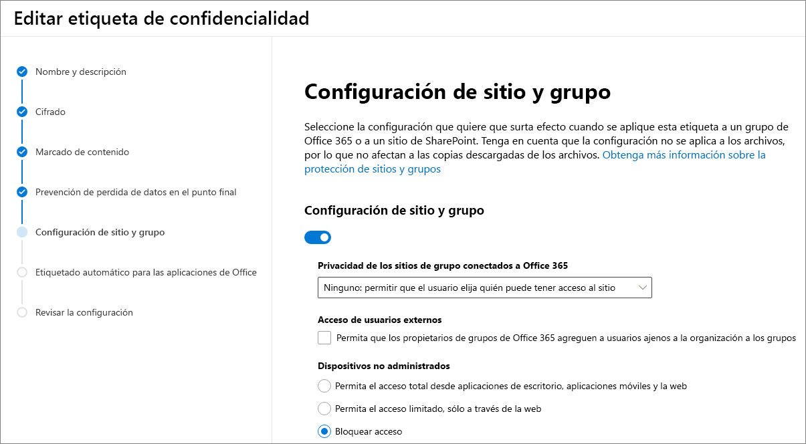

# <a name="use-sensitivity-labels-to-protect-content-in-microsoft-teams-microsoft-365-groups-and-sharepoint-sites-public-preview"></a>Usar etiquetas de confidencialidad para proteger el contenido en Microsoft Teams, los grupos de Microsoft 365 y los sitios de SharePoint (versión preliminar pública)

>*[Instrucciones de licencias de Microsoft 365 para la seguridad y el cumplimiento](https://aka.ms/ComplianceSD).*

Al crear etiquetas de confidencialidad en el [Centro de cumplimiento de Microsoft 365](https://protection.office.com/), ahora puede aplicarlas a los siguientes contenedores: sitios de Microsoft Teams, grupos de Microsoft 365 ([anteriormente denominados grupos de Office 365](https://techcommunity.microsoft.com/t5/microsoft-365-blog/office-365-groups-will-become-microsoft-365-groups/ba-p/1303601)) y sitios de SharePoint. Use la siguiente configuración de etiqueta para ayudar a proteger el contenido de estos contenedores:

- Privacidad (pública o privada) de los sitios de equipos conectados a grupos de Microsoft 365
- Acceso de usuarios externos
- Acceso desde dispositivos no administrados 

Cuando aplica esta etiqueta a un contenedor compatible, la etiqueta aplica automáticamente las opciones configuradas al grupo o sitio conectado. 

Sin embargo, el contenido de esos contenedores no hereda las etiquetas para configuraciones como el nombre de la etiqueta, las marcas visuales o el cifrado. Para que los usuarios puedan etiquetar los documentos en sitios de SharePoint o sitios de grupo, [habilitar las etiquetas de confidencialidad para los archivos de Office en SharePoint y OneDrive](sensitivity-labels-sharepoint-onedrive-files.md).

## <a name="about-the-public-preview-for-microsoft-teams-microsoft-365-groups-and-sharepoint-sites"></a>Acerca de la versión preliminar pública para Microsoft Teams, grupos de Microsoft 365 y sitios de SharePoint

Las etiquetas de confidencialidad de Microsoft Teams, grupos de Microsoft 365 y sitios de SharePoint se están introduciendo gradualmente para los espacios empresariales y es posible que haya cambios antes de la versión final. Esta versión preliminar pública no funciona con las redes de entrega de contenido (CDN) de Office 365.

Antes de habilitar esta versión preliminar y configurar las etiquetas de confidencialidad para la nueva configuración, los usuarios pueden ver y aplicar etiquetas de confidencialidad en sus aplicaciones. Por ejemplo, en Word:


Después de habilitar y configurar esta versión preliminar, los usuarios también pueden ver y aplicar etiquetas de confidencialidad en Microsoft Teams, en los grupos de Microsoft 365 y en los sitios de SharePoint. Por ejemplo, al crear un sitio de grupo de SharePoint:


## <a name="enable-this-preview-and-synchronize-labels"></a>Habilitar versión preliminar y sincronizar etiquetas

1. Dado que esta característica usa la funcionalidad de Azure AD, siga las instrucciones de la documentación de Azure AD para habilitar la versión preliminar: [asignar etiquetas de confidencialidad a grupos de Microsoft 365 en Azure Active Directory (versión preliminar)](https://docs.microsoft.com/azure/active-directory/users-groups-roles/groups-assign-sensitivity-labels).

2. Ahora[conéctese al PowerShell del Centro de seguridad y cumplimiento de Office 365](/powershell/exchange/office-365-scc/connect-to-scc-powershell/connect-to-scc-powershell). 
    
    Por ejemplo, en una sesión de PowerShell que se ejecuta como administrador, inicie sesión con una cuenta de administrador global:
    
    ```powershell
    Set-ExecutionPolicy RemoteSigned
    $UserCredential = Get-Credential
    $Session = New-PSSession -ConfigurationName Microsoft.Exchange -ConnectionUri https://ps.compliance.protection.outlook.com/powershell-liveid/ -Credential $UserCredential -Authentication Basic -AllowRedirection
    Import-PSSession $Session -DisableNameChecking
    ```

3. Ejecute los siguientes comandos para sincronizar las etiquetas de confidencialidad en Azure AD, de modo que se puedan usar con los grupos de Microsoft 365:
    
    ```powershell
    Execute-AzureAdLabelSync
    ```

## <a name="how-to-configure-site-and-group-settings-when-you-create-or-edit-sensitivity-labels"></a>Cómo configurar opciones del sitio y los grupos al crear o editar etiquetas de confidencialidad

Ya está listo para crear o editar las etiquetas de confidencialidad que quiera y que estén disponibles para sitios y grupos. El habilitar la versión preliminar hace que una nueva página sea visible en los asistentes de etiquetas de confidencialidad: **Configuración de sitio y grupo**

Si necesita ayuda para crear o editar una etiquetas de confidencialidad, vea las instrucciones en [Crear y configurar etiquetas de confidencialidad](create-sensitivity-labels.md#create-and-configure-sensitivity-labels).

En la nueva página **Configuración de sitio y grupo**, configure las opciones:

- **Privacidad de los sitios de equipos conectados a grupos de Office 365**: la configuración predeterminada de **Ninguna, permitir que el usuario elija quién puede tener acceso al sitio** se está implementando actualmente para los espacios empresariales. Mantenga esta configuración predeterminada cuando desee proteger el contenido del contenedor mediante el uso de la etiqueta de confidencialidad, pero permita que los usuarios configuren la configuración de privacidad ellos mismos.
    
    Seleccione **Pública** o**Privada** para establecer y bloquear la configuración de privacidad cuando aplica esta etiqueta al contenedor. Elija **Pública** si desea que alguien de su organización acceda al sitio del grupo o equipo donde se aplica esta etiqueta, o **Privada** si desea que el acceso esté restringido solo a miembros aprobados en su organización. 
    
    La configuración **Pública** o **Privada** reemplaza cualquier configuración de privacidad anterior que pueda configurarse para el equipo o grupo, y bloquea el valor de privacidad para que solo se pueda cambiar quitando primero la etiqueta de confidencialidad del contenedor. Después de quitar la etiqueta de confidencialidad, la configuración de privacidad de la etiqueta permanece y los usuarios ya pueden cambiarla de nuevo.

- **Acceso de usuarios externos**: controla si el propietario del grupo puede [agregar invitados al grupo](/office365/admin/create-groups/manage-guest-access-in-groups).

- **Dispositivos no administrados**: para [dispositivos sin administrar](/sharepoint/control-access-from-unmanaged-devices), permite acceso total, acceso de solo Web, o bloquear el acceso completamente. 



> [!IMPORTANT]
> La configuración de sitio y grupo solo surte efecto al aplicar una etiqueta a un equipo, grupo o sitio. El resto de opciones de configuración de etiqueta, como el cifrado y la marcación de contenido, no se aplican a todo el contenido del equipo, grupo o sitio.
> 
> Implementación gradual en espacios empresariales: solo las etiquetas con la configuración de sitio y de grupo estarán disponibles para seleccionarlas cuando los usuarios creen equipos, grupos y sitios. Si actualmente puede aplicar una etiqueta a un contenedor cuando la etiqueta no tiene habilitadas las configuraciones de sitio y grupo, solo se aplica el nombre de la etiqueta al contenedor.

Si la etiqueta de confidencialidad aún no se ha publicado, publíquela [agregándola a una directiva de etiqueta de confidencialidad](create-sensitivity-labels.md#publish-sensitivity-labels-by-creating-a-label-policy). Los usuarios que tienen asignada una directiva de etiqueta de confidencialidad que incluye esta etiqueta podrán seleccionarla para sitios y grupos.

En la Directiva de etiqueta, solo la configuración de directiva **aplicar esta etiqueta de forma predeterminada a los documentos y el correo electrónico** es aplicable cuando se aplica esta etiqueta a contenedores. No se aplican otras opciones de configuración de Directiva, como la etiqueta obligatoria, que requiere la justificación del usuario y un vínculo a la página de ayuda personalizada.

## <a name="sensitivity-label-management"></a>Administración de etiquetas de confidencialidad

> [!WARNING]
> Para crear, modificar y eliminar las etiquetas de confidencialidad que usa para Microsoft Teams, grupos de Microsoft 365 y sitios de SharePoint se requiere una cuidadosa coordinación con las directivas de etiquetas de publicación para los usuarios. 

Evite errores de creación de sitios y grupos que puedan afectar a todos los usuarios con las instrucciones siguientes.

**Guardar y publicar etiquetas:**

Una vez se crea y se publica una etiqueta de confidencialidad, puede tardar hasta 24 horas en ser visible para los usuarios en los equipos, grupos y sitios. Siga los pasos siguientes para publicar una etiqueta para todos los usuarios en el espacio empresarial:

1. Cree la etiqueta de confidencialidad y publíquela solo para algunas cuentas de usuario del espacio empresarial.

2. Espere 24 horas.

3. Cuando transcurran 24 horas, utilice una de las cuentas de usuario que especificó en el paso 1 para crear un equipo, un grupo de Microsoft 365 o un sitio de SharePoint con la etiqueta creada en el paso 1.

4. Si no se han producido errores durante la operación de creación del paso 3, publique la etiqueta para todos los usuarios de su espacio empresarial. Si hay errores, póngase en contacto con el [Soporte técnico de Microsoft](https://docs.microsoft.com/office365/admin/contact-support-for-business-products).

**Modificar y eliminar etiquetas publicadas:**

Si modifica o elimina una etiqueta de confidencialidad con la configuración del sitio y del grupo habilitada, y esa etiqueta se incluye en una o más directivas de etiquetas, estas acciones pueden provocar fallas de creación para todos los equipos, grupos y sitios. Para evitarlo, siga las instrucciones que se indican a continuación:

1. Elimine la etiqueta de confidencialidad de todas las directivas de etiqueta que la incluyan.

2. Espere 48 horas.

3. Transcurrida la espera de 48 horas, pruebe a crear un equipo, grupo o sitio y compruebe que la etiqueta ya no es visible.

4. Si la etiqueta de confidencialidad no es visible, ya la puede modificar o eliminar de forma segura. Si la etiqueta sigue visible, póngase en contacto con el [Soporte técnico de Microsoft](https://docs.microsoft.com/office365/admin/contact-support-for-business-products).

## <a name="assign-sensitivity-labels-to-microsoft-365-groups"></a>Asignar etiquetas de confidencialidad a grupos de Microsoft 365

Ya está listo para aplicar la etiqueta o las etiquetas de confidencialidad a los grupos de Microsoft 365. Regrese a la documentación de Azure AD para obtener instrucciones:

- [Asignar una etiqueta a un grupo nuevo en Azure Portal](https://docs.microsoft.com/azure/active-directory/users-groups-roles/groups-assign-sensitivity-labels#assign-a-label-to-a-new-group-in-azure-portal)

-  [Asignar una etiqueta a un grupo existente en Azure Portal](https://docs.microsoft.com/azure/active-directory/users-groups-roles/groups-assign-sensitivity-labels#assign-a-label-to-an-existing-group-in-azure-portal)

-  [Quitar una etiqueta a un grupo existente en Azure Portal](https://docs.microsoft.com/azure/active-directory/users-groups-roles/groups-assign-sensitivity-labels#remove-a-label-from-an-existing-group-in-azure-portal)

## <a name="apply-a-sensitivity-label-to-a-new-team"></a>Aplicar una etiqueta de confidencialidad a un nuevo equipo

Los usuarios pueden seleccionar etiquetas de confidencialidad al crear nuevos equipos en Microsoft Teams. Al seleccionar la etiqueta en la lista desplegable **confidencialidad**, es posible que la configuración de privacidad cambie para reflejar la configuración de la etiqueta. En función de la configuración de acceso de usuarios externos que haya seleccionado para la etiqueta, los usuarios pueden o no, agregar al equipo personas de fuera de la organización.

[Más información sobre las etiquetas de confidencialidad para Teams](https://docs.microsoft.com/microsoftteams/sensitivity-labels)


Después de crear el equipo, se muestra la etiqueta de confidencialidad en la esquina superior derecha de todos los canales.


El servicio aplica automáticamente la misma etiqueta de confidencialidad al grupo de Microsoft 365 y al sitio de grupo de SharePoint conectado.

## <a name="apply-a-sensitivity-label-to-a-new-group-in-outlook-on-the-web"></a>Aplicar una etiqueta de confidencialidad a un nuevo grupo en Outlook en la Web

En Outlook en la Web, al crear un grupo, puede seleccionar o cambiar la opción **confidencialidad** para las etiquetas publicadas:


## <a name="apply-a-sensitivity-label-to-a-new-site"></a>Aplicar una etiqueta de confidencialidad a un nuevo sitio

Los administradores y los usuarios finales pueden seleccionar las etiquetas de confidencialidad cuando [crean sitios de grupo y de comunicación modernos](/sharepoint/create-site-collection) y expandir la **configuración avanzada**:


En el cuadro desplegable se mostrarán los nombres de etiqueta de la selección, y en el icono de ayuda se mostrarán todos los nombres de etiqueta con la información sobre herramientas, que puede ayudar a los usuarios a determinar la etiqueta correcta que debe aplicar.

Cuando los usuarios exploren el sitio, podrán ver el nombre de la etiqueta y las directivas aplicadas. Por ejemplo, este sitio se ha etiquetado como **confidencial** y la configuración de privacidad se ha establecido en **privada**:


## <a name="view-sensitivity-labels-in-the-sharepoint-admin-center"></a>Ver etiquetas de confidencialidad en el Centro de administración de SharePoint

Para ver las etiquetas de confidencialidad aplicadas, use la página **Sitios activos** en el nuevo Centro de administración de SharePoint. Es posible que primero tenga que agregar la columna **confidencialidad**:


[Obtenga más información para administrar sitios en el nuevo centro de administración de SharePoint](/sharepoint/manage-sites-in-new-admin-center).

## <a name="change-site-and-group-settings-for-a-label"></a>Cambiar la configuración de sitio y grupo para una etiqueta

Siempre que haga un cambio en la configuración de sitio y de grupo de una etiqueta, debe ejecutar los comandos de PowerShell que se indican a continuación para que los equipos, sitios y grupos puedan usar la nueva configuración. Como mejor práctica, no cambie la configuración del sitio y del grupo para una etiqueta después de haber aplicado la etiqueta de sensibilidad a varios equipos, grupos o sitios.

1. En primer lugar, [conéctese a PowerShell del Centro de seguridad y cumplimiento de Office 365](/powershell/exchange/office-365-scc/connect-to-scc-powershell/connect-to-scc-powershell). 
    
    Por ejemplo, en una sesión de PowerShell que se ejecuta como administrador, inicie sesión con una cuenta de administrador global:
    
    ```powershell
    Set-ExecutionPolicy RemoteSigned
    $UserCredential = Get-Credential
    $Session = New-PSSession -ConfigurationName Microsoft.Exchange -ConnectionUri https://ps.compliance.protection.outlook.com/powershell-liveid/ -Credential $UserCredential -Authentication Basic -AllowRedirection
    Import-PSSession $Session -DisableNameChecking
    ```

2. Consiga la lista de etiquetas de sensibilidad y sus GUIDs usando el cmdlet[Get-Label](https://docs.microsoft.com/powershell/module/exchange/policy-and-compliance/get-label?view=exchange-ps):
    
    ```powershell
    Get-Label |ft Name, Guid
    ```

3. Tome nota del GUID para la(s) etiqueta(s) que ha cambiado.

4. Ahora[Conexión al PowerShell de Exchange Online](https://docs.microsoft.com/powershell/exchange/exchange-online/connect-to-exchange-online-powershell/connect-to-exchange-online-powershell?view=exchange-ps).
    
    Por ejemplo:
    
    ```powershell
    $UserCredential = Get-Credential
    $Session = New-PSSession -ConfigurationName Microsoft.Exchange -ConnectionUri https://outlook.office365.com/powershell-liveid/ -Credential $UserCredential -Authentication Basic -AllowRedirection
    Import-PSSession $Session
    ```
    
5. Ejecute el cmdlet[Get-UnifiedGroup](https://docs.microsoft.com/powershell/module/exchange/users-and-groups/get-unifiedgroup?view=exchange-ps), especificando su etiqueta GUID en lugar del ejemplo GUID de "e48058ea-98e8-4940-8db0-ba1310fd955e": 
    
    ```powershell
    $Groups= Get-UnifiedGroup | Where {$_.SensitivityLabel  -eq "e48058ea-98e8-4940-8db0-ba1310fd955e"}
    ```

6. Para cada grupo, vuelva a aplicar la etiqueta de confidencialidad, especificando el GUID de la etiqueta en vez del GUID de ejemplo de "e48058ea-98e8-4940-8db0-ba1310fd955e":
    
    ```powershell
    foreach ($g in $groups)
    {Set-UnifiedGroup -Identity $g.Identity -SensitivityLabelId "e48058ea-98e8-4940-8db0-ba1310fd955e"}
    ```

## <a name="support-for-the-sensitivity-labels"></a>Soporte técnico para las etiquetas de confidencialidad

Puede usar las etiquetas de confidencialidad que ha configurado para la configuración del sitio y el grupo con las siguientes aplicaciones y servicios:

- SharePoint en linea
- Teams
- Outlook en la Web
- Centro de administración de SharePoint
- Centro de administración de Azure AD

Otras aplicaciones y servicios que actualmente no puede usar las etiquetas de confidencialidad que ha configurado para la configuración del sitio y el grupo incluyen:

- Outlook para Mac
- Outlook para dispositivos móviles
- Outlook de escritorio para Windows
- Formularios
- Dynamics 365
- Yammer
- Stream
- Planner
- Proyecto
- PowerBI
- Centro de administración de Teams
- Centro de administración de Microsoft 365
- Centro de administración de Exchange


## <a name="classic-azure-ad-group-classification"></a>Clasificación del grupo Classic Azure AD

Microsoft 365 ya no admite las antiguas clasificaciones para los nuevos grupos de Microsoft 365 y sitios de SharePoint cuando se habilita esta versión preliminar. Sin embargo, los grupos y sitios existentes aún muestran los valores de clasificaciones antiguas a menos que las convierta para usar etiquetas de confidencialidad.

Como ejemplo de cómo podría haber utilizado la antigua clasificación de grupos para SharePoint, consulte [Clasificación de sitios "modernos" de SharePoint](https://docs.microsoft.com/sharepoint/dev/solution-guidance/modern-experience-site-classification).

Estas clasificaciones se configuraron con Azure AD PowerShell o la biblioteca principal de PnP y definiendo valores para la configuración de `ClassificationList`. Si su espacio empresarial tiene valores de clasificación definidos, se muestran al ejecutar el siguiente comando desde el módulo de [PowerShell de AzureADPreview](https://www.powershellgallery.com/packages/AzureADPreview):

```powershell
   ($setting["ClassificationList"])
```

Para convertir las clasificaciones antiguas en etiquetas de confidencialidad, siga uno de estos procedimientos:

- Usar etiquetas existentes: especifique la configuración de la etiqueta que desee para los sitios y grupos al editar las etiquetas de confidencialidad existentes que ya están publicadas.

- Crear etiquetas nuevas: especifique la configuración de la etiqueta que desee para los sitios y grupos creando y publicando nuevas etiquetas de confidencialidad que tengan los mismos nombres que las de las clasificaciones existentes.

Luego: 

1. Use PowerShell para aplicar las etiquetas de confidencialidad a los grupos de Microsoft 365 y a los sitios de SharePoint mediante la asignación de nombres. Vea la siguiente sección para obtener instrucciones.

2. Quitar las clasificaciones antiguas de los grupos y sitios existentes.

Aunque no se puede impedir que los usuarios creen grupos nuevos en aplicaciones y servicios que aún no admiten las etiquetas de confidencialidad, puede ejecutar un script de PowerShell periódico para buscar grupos nuevos que los usuarios han creado con las clasificaciones anteriores y convertirlos para usar etiquetas de confidencialidad. 

#### <a name="use-powershell-to-convert-classifications-for-microsoft-365-groups-to-sensitivity-labels"></a>Usar PowerShell para convertir clasificaciones de grupos de Microsoft 365 a etiquetas de confidencialidad

1. En primer lugar, [conéctese a PowerShell del Centro de seguridad y cumplimiento de Office 365](/powershell/exchange/office-365-scc/connect-to-scc-powershell/connect-to-scc-powershell). 
    
    Por ejemplo, en una sesión de PowerShell que se ejecuta como administrador, inicie sesión con una cuenta de administrador global:
    
    ```powershell
    Set-ExecutionPolicy RemoteSigned
    $UserCredential = Get-Credential
    $Session = New-PSSession -ConfigurationName Microsoft.Exchange -ConnectionUri https://ps.compliance.protection.outlook.com/powershell-liveid/ -Credential $UserCredential -Authentication Basic -AllowRedirection
    Import-PSSession $Session -DisableNameChecking
    ```

2. Consiga la lista de etiquetas de sensibilidad y sus GUIDs usando el cmdlet[Get-Label](https://docs.microsoft.com/powershell/module/exchange/policy-and-compliance/get-label?view=exchange-ps):
    
    ```powershell
    Get-Label |ft Name, Guid
    ```

3. Tome nota de los GUID para las etiquetas de confidencialidad que quiere aplicar a los grupos de Microsoft 365.

4. Ahora[Conexión al PowerShell de Exchange Online](https://docs.microsoft.com/powershell/exchange/exchange-online/connect-to-exchange-online-powershell/connect-to-exchange-online-powershell?view=exchange-ps).
    
    Por ejemplo:
    
    ```powershell
    $UserCredential = Get-Credential
    $Session = New-PSSession -ConfigurationName Microsoft.Exchange -ConnectionUri https://outlook.office365.com/powershell-liveid/ -Credential $UserCredential -Authentication Basic -AllowRedirection
    Import-PSSession $Session
    ```

5. Use el comando siguiente como ejemplo para obtener la lista de grupos que actualmente tienen la clasificación de "general":

   ```PowerShell
   $Groups= Get-UnifiedGroup | Where {$_.classification -eq "General"}
   ```

6. Para cada grupo, agregue la nueva etiqueta de sensibilidad GUID. Por ejemplo:

    ```PowerShell
    foreach ($g in $groups)
    {Set-UnifiedGroup -Identity $g.Identity -SensitivityLabelId "457fa763-7c59-461c-b402-ad1ac6b703cc"}
    ```

7. Repita los pasos 5 y 6 para el resto de sus clasificaciones de grupo.

## <a name="auditing-sensitivity-label-activities"></a>Auditar actividades de etiqueta de confidencialidad

Si alguien carga un documento en un sitio protegido con una etiqueta de confidencialidad y el documento tiene una etiqueta de confidencialidad de [mayor prioridad](sensitivity-labels.md#label-priority-order-matters) que la etiqueta de confidencialidad que se aplica al sitio, esta acción no está bloqueada. Por ejemplo, aplicó la etiqueta **general** a un sitio de SharePoint y alguien carga en este sitio un documento etiquetado como **confidencial**. Debido a que una etiqueta de confidencialidad con mayor prioridad identifica el contenido que es más confidencial que el contenido que tiene un orden de menor prioridad, esta situación podría ser un problema de seguridad.

Aunque la acción no está bloqueada, se audita y genera automáticamente un correo electrónico a la persona que cargó el documento y el administrador del sitio. Como resultado, tanto el usuario como los administradores pueden identificar los documentos que no están alineados con la prioridad de las etiquetas y tomar las medidas necesarias. Por ejemplo, eliminar o mover el documento cargado del sitio. 

No sería un problema de seguridad si el documento tiene una etiqueta de confidencialidad de menor prioridad que la etiqueta de confidencialidad aplicada al sitio. Por ejemplo, un documento con la etiqueta **general** se carga en un sitio con la etiqueta **confidencial**. En este escenario, no se genera un evento de auditoría ni un correo electrónico.

Para buscar el registro de auditoría para este evento, busque **Desfase detectado de la confidencialidad del documento** en la categoría de las **actividades de archivos y páginas**. 

El correo electrónico generado automáticamente tiene el asunto **Etiqueta de confidencialidad no compatible detectado** y el mensaje de correo electrónico explica que la etiqueta no coincide con un vínculo al documento cargado y al sitio. También contiene un vínculo a la documentación en el que se explica cómo los usuarios pueden cambiar la etiqueta de confidencialidad. Actualmente, estos correos electrónicos automatizados no se pueden deshabilitar o personalizar.

Cuando alguien agrega o quita una etiqueta de confidencialidad a un sitio o grupo, estas actividades también se auditan, pero sin generar un correo electrónico automáticamente. 

Todos estos eventos de auditoría se pueden encontrar en la categoría [Actividades de etiqueta de confidencialidad](search-the-audit-log-in-security-and-compliance.md#sensitivity-label-activities). Para obtener instrucciones sobre cómo buscar el registro de auditoría, vea [buscar el registro de auditoría en el Centro de seguridad y cumplimiento](search-the-audit-log-in-security-and-compliance.md).

## <a name="troubleshoot-sensitivity-label-deployment"></a>Solucionar el despliegue de la etiqueta de sensibilidad

¿Tiene problemas con las etiquetas de confidencialidad de Microsoft Teams, Grupos de Microsoft 365 y sitios de SharePoint? Compruebe lo siguiente:

### <a name="labels-not-visible-after-publishing"></a>Las etiquetas no son visibles tras su publicación
Si experimenta problemas al crear un sitio o un grupo de Microsoft 365 después de habilitar esta configuración o modificar el nombre o la información sobre herramientas de una etiqueta de confidencialidad, espere unas horas después de guardar los cambios en la etiqueta y luego intente crear el equipo o grupo nuevamente. Para obtener más información, consulte [Programar la implementación tras crear o cambiar una etiqueta de confidencialidad](sensitivity-labels-sharepoint-onedrive-files.md#schedule-roll-out-after-you-create-or-change-a-sensitivity-label).

Si sigue sin poder ver la nueva etiqueta de confidencialidad de SharePoint Online, póngase en contacto con el [Soporte técnico de Microsoft](https://docs.microsoft.com/office365/admin/contact-support-for-business-products).

### <a name="team-group-or-sharepoint-site-creation-errors"></a>Errores de creación de Teams, grupo o sitio de SharePoint
Si experimenta errores de creación durante la versión preliminar pública, puede desactivar las etiquetas de confidencialidad para Microsoft Teams, grupos de Microsoft 365 y sitios de SharePoint utilizando las mismas instrucciones de [Habilitar la compatibilidad de etiquetas de confidencialidad en PowerShell](https://docs.microsoft.com/azure/active-directory/users-groups-roles/groups-assign-sensitivity-labels#enable-sensitivity-label-support-in-powershell). Sin embargo, para deshabilitar la versión preliminar, en el paso 5, deshabilite la característica con `$setting["EnableMIPLabels"] = "False"`.

## <a name="additional-resources"></a>Recursos adicionales

Consulte la grabación y las preguntas contestadas sobre el [Uso de etiquetas de sensibilidad con Microsoft Teams, grupos de O365 y sitios de SharePoint Online](https://techcommunity.microsoft.com/t5/security-privacy-and-compliance/using-sensitivity-labels-with-microsoft-teams-o365-groups-and/ba-p/1221885#M1380).

