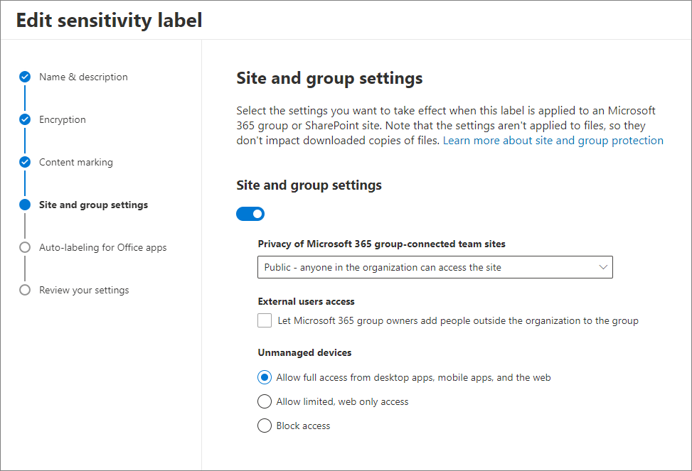
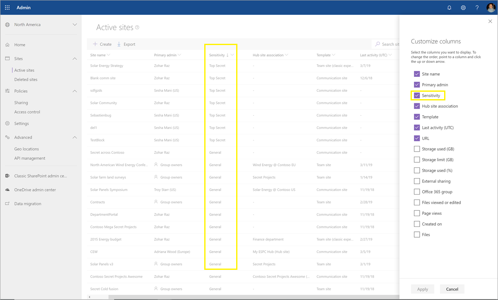

# <a name="use-sensitivity-labels-to-protect-content-in-microsoft-teams-microsoft-365-groups-and-sharepoint-sites-public-preview"></a><span data-ttu-id="14f3f-103">Usar etiquetas de confidencialidad para proteger el contenido en Microsoft Teams, los grupos de Microsoft 365 y los sitios de SharePoint (versión preliminar pública)</span><span class="sxs-lookup"><span data-stu-id="14f3f-103">Use sensitivity labels to protect content in Microsoft Teams, Microsoft 365 groups, and SharePoint sites (public preview)</span></span>

><span data-ttu-id="14f3f-104">*[Instrucciones de licencias de Microsoft 365 para la seguridad y el cumplimiento](https://aka.ms/ComplianceSD).*</span><span class="sxs-lookup"><span data-stu-id="14f3f-104">*[Microsoft 365 licensing guidance for security & compliance](https://aka.ms/ComplianceSD).*</span></span>

<span data-ttu-id="14f3f-105">Al crear etiquetas de confidencialidad en el [Centro de cumplimiento de Microsoft 365](https://protection.office.com/), ahora puede aplicarlas a los siguientes contenedores: sitios de Microsoft Teams, grupos de Microsoft 365 ([anteriormente denominados grupos de Office 365](https://techcommunity.microsoft.com/t5/microsoft-365-blog/office-365-groups-will-become-microsoft-365-groups/ba-p/1303601)) y sitios de SharePoint.</span><span class="sxs-lookup"><span data-stu-id="14f3f-105">When you create sensitivity labels in the [Microsoft 365 compliance center](https://protection.office.com/), you can now apply them to the following containers: Microsoft Teams sites, Microsoft 365 groups ([formerly Office 365 groups](https://techcommunity.microsoft.com/t5/microsoft-365-blog/office-365-groups-will-become-microsoft-365-groups/ba-p/1303601)), and SharePoint sites.</span></span> <span data-ttu-id="14f3f-106">Use la siguiente configuración de etiqueta para ayudar a proteger el contenido de estos contenedores:</span><span class="sxs-lookup"><span data-stu-id="14f3f-106">Use the following label settings to help protect the content in those containers:</span></span>

- <span data-ttu-id="14f3f-107">Privacidad (pública o privada) de los sitios de equipos conectados a grupos de Microsoft 365</span><span class="sxs-lookup"><span data-stu-id="14f3f-107">Privacy (public or private) of Microsoft 365 group-connected teams sites</span></span>
- <span data-ttu-id="14f3f-108">Acceso de usuarios externos</span><span class="sxs-lookup"><span data-stu-id="14f3f-108">External users access</span></span>
- <span data-ttu-id="14f3f-109">Acceso desde dispositivos no administrados</span><span class="sxs-lookup"><span data-stu-id="14f3f-109">Access from unmanaged devices</span></span> 

<span data-ttu-id="14f3f-110">Cuando aplica esta etiqueta a un contenedor compatible, la etiqueta aplica automáticamente las opciones configuradas al grupo o sitio conectado.</span><span class="sxs-lookup"><span data-stu-id="14f3f-110">When you apply this label to a supported container, the label automatically applies the configured options to the connected site or group.</span></span> 

<span data-ttu-id="14f3f-111">Sin embargo, el contenido de esos contenedores no hereda las etiquetas para configuraciones como el nombre de la etiqueta, las marcas visuales o el cifrado.</span><span class="sxs-lookup"><span data-stu-id="14f3f-111">Content in those containers however, do not inherit the labels for settings such as the label name, visual markings, or encryption.</span></span> <span data-ttu-id="14f3f-112">Para que los usuarios puedan etiquetar los documentos en sitios de SharePoint o sitios de grupo, [habilitar las etiquetas de confidencialidad para los archivos de Office en SharePoint y OneDrive](sensitivity-labels-sharepoint-onedrive-files.md).</span><span class="sxs-lookup"><span data-stu-id="14f3f-112">So that users can label their documents in SharePoint sites or team sites, [enable sensitivity labels for Office files in SharePoint and OneDrive](sensitivity-labels-sharepoint-onedrive-files.md).</span></span>

## <a name="about-the-public-preview-for-microsoft-teams-microsoft-365-groups-and-sharepoint-sites"></a><span data-ttu-id="14f3f-113">Acerca de la versión preliminar pública para Microsoft Teams, grupos de Microsoft 365 y sitios de SharePoint</span><span class="sxs-lookup"><span data-stu-id="14f3f-113">About the public preview for Microsoft Teams, Microsoft 365 groups, and SharePoint sites</span></span>

<span data-ttu-id="14f3f-114">Las etiquetas de confidencialidad de Microsoft Teams, grupos de Microsoft 365 y sitios de SharePoint están versión preliminar y es posible que haya cambios antes de la versión final.</span><span class="sxs-lookup"><span data-stu-id="14f3f-114">Sensitivity labels for Microsoft Teams, Microsoft 365 groups, and SharePoint sites is in preview and might change before final release.</span></span> <span data-ttu-id="14f3f-115">Esta versión preliminar pública no funciona con las redes de entrega de contenido (CDN) de Office 365.</span><span class="sxs-lookup"><span data-stu-id="14f3f-115">This public preview doesn't work with Office 365 Content Delivery Networks (CDNs).</span></span>

<span data-ttu-id="14f3f-116">Antes de habilitar esta versión preliminar y configurar las etiquetas de confidencialidad para la nueva configuración, los usuarios pueden ver y aplicar etiquetas de confidencialidad en sus aplicaciones.</span><span class="sxs-lookup"><span data-stu-id="14f3f-116">Before you enable this preview and configure sensitivity labels for the new settings, users can see and apply sensitivity labels in their apps.</span></span> <span data-ttu-id="14f3f-117">Por ejemplo, en Word:</span><span class="sxs-lookup"><span data-stu-id="14f3f-117">For example, from Word:</span></span>


<span data-ttu-id="14f3f-119">Después de habilitar y configurar esta versión preliminar, los usuarios también pueden ver y aplicar etiquetas de confidencialidad en Microsoft Teams, en los grupos de Microsoft 365 y en los sitios de SharePoint.</span><span class="sxs-lookup"><span data-stu-id="14f3f-119">After you enable and configure this preview, users can additionally see and apply sensitivity labels to Microsoft Teams, Microsoft 365 groups, and SharePoint sites.</span></span> <span data-ttu-id="14f3f-120">Por ejemplo, al crear un sitio de grupo de SharePoint:</span><span class="sxs-lookup"><span data-stu-id="14f3f-120">For example, when you create a new team site from SharePoint:</span></span>


## <a name="enable-this-preview-and-synchronize-labels"></a><span data-ttu-id="14f3f-122">Habilitar versión preliminar y sincronizar etiquetas</span><span class="sxs-lookup"><span data-stu-id="14f3f-122">Enable this preview and synchronize labels</span></span>

1. <span data-ttu-id="14f3f-123">Dado que esta característica usa la funcionalidad de Azure AD, siga las instrucciones de la documentación de Azure AD para habilitar la versión preliminar: [asignar etiquetas de confidencialidad a grupos de Microsoft 365 en Azure Active Directory (versión preliminar)](https://docs.microsoft.com/azure/active-directory/users-groups-roles/groups-assign-sensitivity-labels).</span><span class="sxs-lookup"><span data-stu-id="14f3f-123">Because this feature uses Azure AD functionality, follow the instructions in the Azure AD documentation to enable the preview: [Assign sensitivity labels to Microsoft 365 groups in Azure Active Directory (preview)](https://docs.microsoft.com/azure/active-directory/users-groups-roles/groups-assign-sensitivity-labels).</span></span>

2. <span data-ttu-id="14f3f-124">Ahora[conéctese al PowerShell del Centro de seguridad y cumplimiento de Office 365](/powershell/exchange/office-365-scc/connect-to-scc-powershell/connect-to-scc-powershell).</span><span class="sxs-lookup"><span data-stu-id="14f3f-124">Now [connect to Office 365 Security & Compliance Center PowerShell](/powershell/exchange/office-365-scc/connect-to-scc-powershell/connect-to-scc-powershell).</span></span> 
    
    <span data-ttu-id="14f3f-125">Por ejemplo, en una sesión de PowerShell que se ejecuta como administrador, inicie sesión con una cuenta de administrador global:</span><span class="sxs-lookup"><span data-stu-id="14f3f-125">For example, in a PowerShell session that you run as administrator, sign in with a global administrator account:</span></span>
    
    ```powershell
    Set-ExecutionPolicy RemoteSigned
    $UserCredential = Get-Credential
    $Session = New-PSSession -ConfigurationName Microsoft.Exchange -ConnectionUri https://ps.compliance.protection.outlook.com/powershell-liveid/ -Credential $UserCredential -Authentication Basic -AllowRedirection
    Import-PSSession $Session -DisableNameChecking
    ```

3. <span data-ttu-id="14f3f-126">Ejecute los siguientes comandos para sincronizar las etiquetas de confidencialidad en Azure AD, de modo que se puedan usar con los grupos de Microsoft 365:</span><span class="sxs-lookup"><span data-stu-id="14f3f-126">Run the following command to synchronize your sensitivity labels to Azure AD, so that they can be used with Microsoft 365 groups:</span></span>
    
    ```powershell
    Execute-AzureAdLabelSync
    ```

## <a name="how-to-configure-site-and-group-settings-when-you-create-or-edit-sensitivity-labels"></a><span data-ttu-id="14f3f-127">Cómo configurar opciones del sitio y los grupos al crear o editar etiquetas de confidencialidad</span><span class="sxs-lookup"><span data-stu-id="14f3f-127">How to configure site and group settings when you create or edit sensitivity labels</span></span>

<span data-ttu-id="14f3f-128">Ya está listo para crear o editar las etiquetas de confidencialidad que quiera y que estén disponibles para sitios y grupos.</span><span class="sxs-lookup"><span data-stu-id="14f3f-128">You're now ready to create or edit sensitivity labels that you want to be available for sites and groups.</span></span> <span data-ttu-id="14f3f-129">El habilitar la versión preliminar hace que una nueva página sea visible en los asistentes de etiquetas de confidencialidad: **Configuración de sitio y grupo**</span><span class="sxs-lookup"><span data-stu-id="14f3f-129">Enabling the preview makes a new page visible in the sensitivity labeling wizards: **Site and group settings**</span></span>

<span data-ttu-id="14f3f-130">Si necesita ayuda para crear o editar una etiquetas de confidencialidad, vea las instrucciones en [Crear y configurar etiquetas de confidencialidad](create-sensitivity-labels.md#create-and-configure-sensitivity-labels).</span><span class="sxs-lookup"><span data-stu-id="14f3f-130">If you need help with creating or editing a sensitivity label, see the instructions from [Create and configure sensitivity labels](create-sensitivity-labels.md#create-and-configure-sensitivity-labels).</span></span>

<span data-ttu-id="14f3f-131">En la nueva página **Configuración de sitio y grupo**, configure las opciones:</span><span class="sxs-lookup"><span data-stu-id="14f3f-131">On this new **Site and group settings** page, configure the settings:</span></span>

- <span data-ttu-id="14f3f-132">**Privacidad de los sitios de equipos conectados a grupos de Office 365**: mantenga el valor predeterminado de \*\*Público: cualquier persona de la organización puede acceder al sitio \*\* si quiere que todos en su organización accedan al sitio de grupo o grupo donde se aplica esta etiqueta.</span><span class="sxs-lookup"><span data-stu-id="14f3f-132">**Privacy of Office 365 group-connected teams sites**: Keep the default of **Public - anyone in the organization can access the site** if you want anyone in your organization to access the team site or group where this label is applied.</span></span>
    
    <span data-ttu-id="14f3f-133">Seleccione **Privado** si quiere que el acceso esté restringido solo a miembros aprobados de su organización.</span><span class="sxs-lookup"><span data-stu-id="14f3f-133">Select **Private** if you want access to be restricted to only approved members in your organization.</span></span>
    
    <span data-ttu-id="14f3f-134">Seleccione **Ninguno: permitir al usuario elegir quién puede acceder al sitio** cuando quiera proteger el contenido del contenedor mediante el uso de la etiqueta de confidencialidad, pero permitir que los usuarios configuren la configuración de privacidad ellos mismos.</span><span class="sxs-lookup"><span data-stu-id="14f3f-134">Select **None - let user chose who can access the site** when you want to protect content in the container by using the sensitivity label, but still let users configure the privacy setting themselves.</span></span>
    
    <span data-ttu-id="14f3f-135">Las opciones **Pública** o **Privada** para establecen y bloquean la configuración de privacidad cuando aplica esta etiqueta al contenedor.</span><span class="sxs-lookup"><span data-stu-id="14f3f-135">The settings of **Public** or **Private** set and lock the privacy setting when you apply this label to the container.</span></span> <span data-ttu-id="14f3f-136">La configuración elegida reemplaza cualquier configuración de privacidad anterior que pueda configurarse para el equipo o grupo, y bloquea el valor de privacidad para que solo se pueda cambiar quitando primero la etiqueta de confidencialidad del contenedor.</span><span class="sxs-lookup"><span data-stu-id="14f3f-136">Your chosen seting replaces any previous privacy setting that might be configured for the team or group, and locks the privacy value so it can be changed only by first removing the sensitivity label from the container.</span></span> <span data-ttu-id="14f3f-137">Después de quitar la etiqueta de confidencialidad, la configuración de privacidad de la etiqueta permanece y los usuarios ya pueden cambiarla de nuevo.</span><span class="sxs-lookup"><span data-stu-id="14f3f-137">After you remove the sensitivity label, the privacy setting from the label remains and users can now change it again.</span></span>

- <span data-ttu-id="14f3f-138">**Acceso de usuarios externos**: controla si el propietario del grupo puede [agregar invitados al grupo](/office365/admin/create-groups/manage-guest-access-in-groups).</span><span class="sxs-lookup"><span data-stu-id="14f3f-138">**External users access**: Control whether the group owner can [add guests to the group](/office365/admin/create-groups/manage-guest-access-in-groups).</span></span>

- <span data-ttu-id="14f3f-139">**Dispositivos no administrados**: para [dispositivos sin administrar](/sharepoint/control-access-from-unmanaged-devices), permite acceso total, acceso de solo Web, o bloquear el acceso completamente.</span><span class="sxs-lookup"><span data-stu-id="14f3f-139">**Unmanaged devices**: For [unmanaged devices](/sharepoint/control-access-from-unmanaged-devices), allow full access, web only access, or block access completely.</span></span> <span data-ttu-id="14f3f-140">Si ha configurado este parámetro a nivel de espacio empresarial o para sitio específico, la configuración que especifique aquí solo se aplicará si es más restrictiva.</span><span class="sxs-lookup"><span data-stu-id="14f3f-140">If you have configured this setting at the tenant level or for a specific site, the setting you specify here will be applied only if it's more restrictive.</span></span>



> [!IMPORTANT]
> <span data-ttu-id="14f3f-142">La configuración de sitio y grupo solo surte efecto al aplicar una etiqueta a un equipo, grupo o sitio.</span><span class="sxs-lookup"><span data-stu-id="14f3f-142">Only these site and group settings take effect when you apply a label to a team, group, or site.</span></span> <span data-ttu-id="14f3f-143">El resto de opciones de configuración de etiqueta, como el cifrado y la marcación de contenido, no se aplican a todo el contenido del equipo, grupo o sitio.</span><span class="sxs-lookup"><span data-stu-id="14f3f-143">Other label settings, such as encryption and content marking, aren't applied to the content within the team, group, or site.</span></span>
> 
> <span data-ttu-id="14f3f-144">Implementación gradual en espacios empresariales: solo las etiquetas con la configuración de sitio y de grupo estarán disponibles para seleccionarlas cuando los usuarios creen equipos, grupos y sitios.</span><span class="sxs-lookup"><span data-stu-id="14f3f-144">Gradually rolling out to tenants: Only labels with the site and group settings will be available to select when users create teams, groups, and sites.</span></span> <span data-ttu-id="14f3f-145">Si actualmente puede aplicar una etiqueta a un contenedor cuando la etiqueta no tiene habilitadas las configuraciones de sitio y grupo, solo se aplica el nombre de la etiqueta al contenedor.</span><span class="sxs-lookup"><span data-stu-id="14f3f-145">If you can currently apply a label to a container when the label doesn't have the site and group settings enabled, only the label name is applied to the container.</span></span>

<span data-ttu-id="14f3f-146">Si la etiqueta de confidencialidad aún no se ha publicado, publíquela [agregándola a una directiva de etiqueta de confidencialidad](create-sensitivity-labels.md#publish-sensitivity-labels-by-creating-a-label-policy).</span><span class="sxs-lookup"><span data-stu-id="14f3f-146">If your sensitivity label isn't already published, now publish it by [adding it to a sensitivity label policy](create-sensitivity-labels.md#publish-sensitivity-labels-by-creating-a-label-policy).</span></span> <span data-ttu-id="14f3f-147">Los usuarios que tienen asignada una directiva de etiqueta de confidencialidad que incluye esta etiqueta podrán seleccionarla para sitios y grupos.</span><span class="sxs-lookup"><span data-stu-id="14f3f-147">The users who are assigned a sensitivity label policy that includes this label will be able to select it for sites and groups.</span></span>

<span data-ttu-id="14f3f-148">En la Directiva de etiqueta, solo la configuración de directiva **aplicar esta etiqueta de forma predeterminada a los documentos y el correo electrónico** es aplicable cuando se aplica esta etiqueta a contenedores.</span><span class="sxs-lookup"><span data-stu-id="14f3f-148">From the label policy, only the policy setting **Apply this label by default to documents and email** is applicable when you apply this label to containers.</span></span> <span data-ttu-id="14f3f-149">No se aplican otras opciones de configuración de Directiva, como la etiqueta obligatoria, que requiere la justificación del usuario y un vínculo a la página de ayuda personalizada.</span><span class="sxs-lookup"><span data-stu-id="14f3f-149">Other policy settings are not applied, which include mandatory labeling, requiring user justification, and a link to the custom help page.</span></span>

## <a name="sensitivity-label-management"></a><span data-ttu-id="14f3f-150">Administración de etiquetas de confidencialidad</span><span class="sxs-lookup"><span data-stu-id="14f3f-150">Sensitivity label management</span></span>

> [!WARNING]
> <span data-ttu-id="14f3f-151">Para crear, modificar y eliminar las etiquetas de confidencialidad que usa para Microsoft Teams, grupos de Microsoft 365 y sitios de SharePoint se requiere una cuidadosa coordinación con las directivas de etiquetas de publicación para los usuarios.</span><span class="sxs-lookup"><span data-stu-id="14f3f-151">Creating, modifying, and deleting sensitivity labels that you use for Microsoft Teams, Microsoft 365 groups, and SharePoint sites requires careful coordination with publishing label policies to users.</span></span> 

<span data-ttu-id="14f3f-152">Evite errores de creación de sitios y grupos que puedan afectar a todos los usuarios con las instrucciones siguientes.</span><span class="sxs-lookup"><span data-stu-id="14f3f-152">Avoid creation errors for sites and groups that can affect all users by using the following guidance.</span></span>

<span data-ttu-id="14f3f-153">**Guardar y publicar etiquetas:**</span><span class="sxs-lookup"><span data-stu-id="14f3f-153">**Creating and publishing labels:**</span></span>

<span data-ttu-id="14f3f-154">Una vez se crea y se publica una etiqueta de confidencialidad, puede tardar hasta 24 horas en ser visible para los usuarios en los equipos, grupos y sitios.</span><span class="sxs-lookup"><span data-stu-id="14f3f-154">After a sensitivity label is created and published, it can take up to 24 hours for the label to become visible for users in teams, groups, and sites.</span></span> <span data-ttu-id="14f3f-155">Siga los pasos siguientes para publicar una etiqueta para todos los usuarios en el espacio empresarial:</span><span class="sxs-lookup"><span data-stu-id="14f3f-155">Use the following steps to publish a label for all users in the tenant:</span></span>

1. <span data-ttu-id="14f3f-156">Cree la etiqueta de confidencialidad y publíquela solo para algunas cuentas de usuario del espacio empresarial.</span><span class="sxs-lookup"><span data-stu-id="14f3f-156">Create the sensitivity label and publish it for just a few user accounts in the tenant.</span></span>

2. <span data-ttu-id="14f3f-157">Espere 24 horas.</span><span class="sxs-lookup"><span data-stu-id="14f3f-157">Wait for 24 hours.</span></span>

3. <span data-ttu-id="14f3f-158">Cuando transcurran 24 horas, utilice una de las cuentas de usuario que especificó en el paso 1 para crear un equipo, un grupo de Microsoft 365 o un sitio de SharePoint con la etiqueta creada en el paso 1.</span><span class="sxs-lookup"><span data-stu-id="14f3f-158">After this 24 hours wait, use one of the user accounts you specified in step 1 to create a team, Microsoft 365 group, or SharePoint site with the label that you created in step 1.</span></span>

4. <span data-ttu-id="14f3f-159">Si no se han producido errores durante la operación de creación del paso 3, publique la etiqueta para todos los usuarios de su espacio empresarial.</span><span class="sxs-lookup"><span data-stu-id="14f3f-159">If there are no errors during the creation operation for step 3, publish the label for all users in your tenant.</span></span> <span data-ttu-id="14f3f-160">Si hay errores, póngase en contacto con el [Soporte técnico de Microsoft](https://docs.microsoft.com/office365/admin/contact-support-for-business-products).</span><span class="sxs-lookup"><span data-stu-id="14f3f-160">If there are errors, contact [Microsoft Support](https://docs.microsoft.com/office365/admin/contact-support-for-business-products).</span></span>

<span data-ttu-id="14f3f-161">**Modificar y eliminar etiquetas publicadas:**</span><span class="sxs-lookup"><span data-stu-id="14f3f-161">**Modifying and deleting published labels:**</span></span>

<span data-ttu-id="14f3f-162">Si modifica o elimina una etiqueta de confidencialidad con la configuración del sitio y del grupo habilitada, y esa etiqueta se incluye en una o más directivas de etiquetas, estas acciones pueden provocar fallas de creación para todos los equipos, grupos y sitios.</span><span class="sxs-lookup"><span data-stu-id="14f3f-162">If you modify or delete a sensitivity label with the site and group settings enabled, and that label is included in one or more label policies, these actions can result in creation failures for all teams, groups, and sites.</span></span> <span data-ttu-id="14f3f-163">Para evitarlo, siga las instrucciones que se indican a continuación:</span><span class="sxs-lookup"><span data-stu-id="14f3f-163">To avoid this situation, use the following guidance:</span></span>

1. <span data-ttu-id="14f3f-164">Elimine la etiqueta de confidencialidad de todas las directivas de etiqueta que la incluyan.</span><span class="sxs-lookup"><span data-stu-id="14f3f-164">Remove the sensitivity label from all label policies that include the label.</span></span>

2. <span data-ttu-id="14f3f-165">Espere 48 horas.</span><span class="sxs-lookup"><span data-stu-id="14f3f-165">Wait for 48 hours.</span></span>

3. <span data-ttu-id="14f3f-166">Transcurrida la espera de 48 horas, pruebe a crear un equipo, grupo o sitio y compruebe que la etiqueta ya no es visible.</span><span class="sxs-lookup"><span data-stu-id="14f3f-166">After the 48 hours wait, try creating a team, group, or site and confirm that the label is no longer visible.</span></span>

4. <span data-ttu-id="14f3f-167">Si la etiqueta de confidencialidad no es visible, ya la puede modificar o eliminar de forma segura.</span><span class="sxs-lookup"><span data-stu-id="14f3f-167">If the sensitivity label isn't visible, you can now safely modify or delete the label.</span></span> <span data-ttu-id="14f3f-168">Si la etiqueta sigue visible, póngase en contacto con el [Soporte técnico de Microsoft](https://docs.microsoft.com/office365/admin/contact-support-for-business-products).</span><span class="sxs-lookup"><span data-stu-id="14f3f-168">If the label is still visible, contact [Microsoft Support](https://docs.microsoft.com/office365/admin/contact-support-for-business-products).</span></span>

## <a name="assign-sensitivity-labels-to-microsoft-365-groups"></a><span data-ttu-id="14f3f-169">Asignar etiquetas de confidencialidad a grupos de Microsoft 365</span><span class="sxs-lookup"><span data-stu-id="14f3f-169">Assign sensitivity labels to Microsoft 365 groups</span></span>

<span data-ttu-id="14f3f-170">Ya está listo para aplicar la etiqueta o las etiquetas de confidencialidad a los grupos de Microsoft 365.</span><span class="sxs-lookup"><span data-stu-id="14f3f-170">You're now ready to apply the sensitivity label or labels to Microsoft 365 groups.</span></span> <span data-ttu-id="14f3f-171">Regrese a la documentación de Azure AD para obtener instrucciones:</span><span class="sxs-lookup"><span data-stu-id="14f3f-171">Return to the Azure AD documentation for instructions:</span></span>

- [<span data-ttu-id="14f3f-172">Asignar una etiqueta a un grupo nuevo en Azure Portal</span><span class="sxs-lookup"><span data-stu-id="14f3f-172">Assign a label to a new group in Azure portal</span></span>](https://docs.microsoft.com/azure/active-directory/users-groups-roles/groups-assign-sensitivity-labels#assign-a-label-to-a-new-group-in-azure-portal)

-  [<span data-ttu-id="14f3f-173">Asignar una etiqueta a un grupo existente en Azure Portal</span><span class="sxs-lookup"><span data-stu-id="14f3f-173">Assign a label to an existing group in Azure portal</span></span>](https://docs.microsoft.com/azure/active-directory/users-groups-roles/groups-assign-sensitivity-labels#assign-a-label-to-an-existing-group-in-azure-portal)

-  <span data-ttu-id="14f3f-174">[Quitar una etiqueta a un grupo existente en Azure Portal](https://docs.microsoft.com/azure/active-directory/users-groups-roles/groups-assign-sensitivity-labels#remove-a-label-from-an-existing-group-in-azure-portal)</span><span class="sxs-lookup"><span data-stu-id="14f3f-174">[Remove a label from an existing group in Azure portal](https://docs.microsoft.com/azure/active-directory/users-groups-roles/groups-assign-sensitivity-labels#remove-a-label-from-an-existing-group-in-azure-portal).</span></span>

## <a name="apply-a-sensitivity-label-to-a-new-team"></a><span data-ttu-id="14f3f-175">Aplicar una etiqueta de confidencialidad a un nuevo equipo</span><span class="sxs-lookup"><span data-stu-id="14f3f-175">Apply a sensitivity label to a new team</span></span>

<span data-ttu-id="14f3f-176">Los usuarios pueden seleccionar etiquetas de confidencialidad al crear nuevos equipos en Microsoft Teams.</span><span class="sxs-lookup"><span data-stu-id="14f3f-176">Users can select sensitivity labels when they create new teams in Microsoft Teams.</span></span> <span data-ttu-id="14f3f-177">Al seleccionar la etiqueta en la lista desplegable **confidencialidad**, es posible que la configuración de privacidad cambie para reflejar la configuración de la etiqueta.</span><span class="sxs-lookup"><span data-stu-id="14f3f-177">When they select the label from the **Sensitivity** dropdown, the privacy setting might change to reflect the label configuration.</span></span> <span data-ttu-id="14f3f-178">En función de la configuración de acceso de usuarios externos que haya seleccionado para la etiqueta, los usuarios pueden o no, agregar al equipo personas de fuera de la organización.</span><span class="sxs-lookup"><span data-stu-id="14f3f-178">Depending on the external users access setting you selected for the label, users can or can't add people outside the organization to the team.</span></span>

[<span data-ttu-id="14f3f-179">Más información sobre las etiquetas de confidencialidad para Teams</span><span class="sxs-lookup"><span data-stu-id="14f3f-179">Learn more about sensitivity labels for Teams</span></span>](https://docs.microsoft.com/microsoftteams/sensitivity-labels)


<span data-ttu-id="14f3f-181">Después de crear el equipo, se muestra la etiqueta de confidencialidad en la esquina superior derecha de todos los canales.</span><span class="sxs-lookup"><span data-stu-id="14f3f-181">After you create the team, the sensitivity label appears in the upper-right corner of all channels.</span></span>


<span data-ttu-id="14f3f-183">El servicio aplica automáticamente la misma etiqueta de confidencialidad al grupo de Microsoft 365 y al sitio de grupo de SharePoint conectado.</span><span class="sxs-lookup"><span data-stu-id="14f3f-183">The service automatically applies the same sensitivity label to the Microsoft 365 group and the connected SharePoint team site.</span></span>

## <a name="apply-a-sensitivity-label-to-a-new-group-in-outlook-on-the-web"></a><span data-ttu-id="14f3f-184">Aplicar una etiqueta de confidencialidad a un nuevo grupo en Outlook en la Web</span><span class="sxs-lookup"><span data-stu-id="14f3f-184">Apply a sensitivity label to a new group in Outlook on the web</span></span>

<span data-ttu-id="14f3f-185">En Outlook en la Web, al crear un grupo, puede seleccionar o cambiar la opción **confidencialidad** para las etiquetas publicadas:</span><span class="sxs-lookup"><span data-stu-id="14f3f-185">In Outlook on the web, when you create a new group, you can select or change the **Sensitivity** option for published labels:</span></span>


## <a name="apply-a-sensitivity-label-to-a-new-site"></a><span data-ttu-id="14f3f-187">Aplicar una etiqueta de confidencialidad a un nuevo sitio</span><span class="sxs-lookup"><span data-stu-id="14f3f-187">Apply a sensitivity label to a new site</span></span>

<span data-ttu-id="14f3f-188">Los administradores y los usuarios finales pueden seleccionar las etiquetas de confidencialidad cuando [crean sitios de grupo y de comunicación modernos](/sharepoint/create-site-collection) y expandir la **configuración avanzada**:</span><span class="sxs-lookup"><span data-stu-id="14f3f-188">Admins and end users can select sensitivity labels when they [create modern team sites and communication sites](/sharepoint/create-site-collection), and expand **Advanced settings**:</span></span>


<span data-ttu-id="14f3f-190">En el cuadro desplegable se mostrarán los nombres de etiqueta de la selección, y en el icono de ayuda se mostrarán todos los nombres de etiqueta con la información sobre herramientas, que puede ayudar a los usuarios a determinar la etiqueta correcta que debe aplicar.</span><span class="sxs-lookup"><span data-stu-id="14f3f-190">The dropdown box displays the label names for the selection, and the help icon displays all the label names with their tooltip, which can help users determine the correct label to apply.</span></span>

<span data-ttu-id="14f3f-191">Cuando los usuarios exploren el sitio, podrán ver el nombre de la etiqueta y las directivas aplicadas.</span><span class="sxs-lookup"><span data-stu-id="14f3f-191">When the label is applied, and users browse to the site, they see the name of the label and applied policies.</span></span> <span data-ttu-id="14f3f-192">Por ejemplo, este sitio se ha etiquetado como **confidencial** y la configuración de privacidad se ha establecido en **privada**:</span><span class="sxs-lookup"><span data-stu-id="14f3f-192">For example, this site has been labeled as **Confidential**, and the privacy setting is set to **Private**:</span></span>


## <a name="view-sensitivity-labels-in-the-sharepoint-admin-center"></a><span data-ttu-id="14f3f-194">Ver etiquetas de confidencialidad en el Centro de administración de SharePoint</span><span class="sxs-lookup"><span data-stu-id="14f3f-194">View sensitivity labels in the SharePoint admin center</span></span>

<span data-ttu-id="14f3f-195">Para ver las etiquetas de confidencialidad aplicadas, use la página **Sitios activos** en el nuevo Centro de administración de SharePoint.</span><span class="sxs-lookup"><span data-stu-id="14f3f-195">To view the applied sensitivity labels, use the **Active sites** page in the new SharePoint admin center.</span></span> <span data-ttu-id="14f3f-196">Es posible que primero tenga que agregar la columna **confidencialidad**:</span><span class="sxs-lookup"><span data-stu-id="14f3f-196">You might need to first add the **Sensitivity** column:</span></span>



<span data-ttu-id="14f3f-198">[Obtenga más información para administrar sitios en el nuevo centro de administración de SharePoint](/sharepoint/manage-sites-in-new-admin-center).</span><span class="sxs-lookup"><span data-stu-id="14f3f-198">[Learn more about managing sites in the new SharePoint admin center](/sharepoint/manage-sites-in-new-admin-center).</span></span>

## <a name="change-site-and-group-settings-for-a-label"></a><span data-ttu-id="14f3f-199">Cambiar la configuración de sitio y grupo para una etiqueta</span><span class="sxs-lookup"><span data-stu-id="14f3f-199">Change site and group settings for a label</span></span>

<span data-ttu-id="14f3f-200">Siempre que haga un cambio en la configuración de sitio y de grupo de una etiqueta, debe ejecutar los comandos de PowerShell que se indican a continuación para que los equipos, sitios y grupos puedan usar la nueva configuración.</span><span class="sxs-lookup"><span data-stu-id="14f3f-200">Whenever you make a change to site and group settings for a label, you must run the following PowerShell commands so that your teams, sites, and groups can use the new settings.</span></span> <span data-ttu-id="14f3f-201">Como mejor práctica, no cambie la configuración del sitio y del grupo para una etiqueta después de haber aplicado la etiqueta de sensibilidad a varios equipos, grupos o sitios.</span><span class="sxs-lookup"><span data-stu-id="14f3f-201">As a best practice, don't the change site and group settings for a label after you've applied the sensitivity label to several teams, groups, or sites.</span></span>

1. <span data-ttu-id="14f3f-202">En primer lugar, [conéctese a PowerShell del Centro de seguridad y cumplimiento de Office 365](/powershell/exchange/office-365-scc/connect-to-scc-powershell/connect-to-scc-powershell).</span><span class="sxs-lookup"><span data-stu-id="14f3f-202">First, [connect to Office 365 Security & Compliance Center PowerShell](/powershell/exchange/office-365-scc/connect-to-scc-powershell/connect-to-scc-powershell).</span></span> 
    
    <span data-ttu-id="14f3f-203">Por ejemplo, en una sesión de PowerShell que se ejecuta como administrador, inicie sesión con una cuenta de administrador global:</span><span class="sxs-lookup"><span data-stu-id="14f3f-203">For example, in a PowerShell session that you run as administrator, sign in with a global administrator account:</span></span>
    
    ```powershell
    Set-ExecutionPolicy RemoteSigned
    $UserCredential = Get-Credential
    $Session = New-PSSession -ConfigurationName Microsoft.Exchange -ConnectionUri https://ps.compliance.protection.outlook.com/powershell-liveid/ -Credential $UserCredential -Authentication Basic -AllowRedirection
    Import-PSSession $Session -DisableNameChecking
    ```

2. <span data-ttu-id="14f3f-204">Consiga la lista de etiquetas de sensibilidad y sus GUIDs usando el cmdlet[Get-Label](https://docs.microsoft.com/powershell/module/exchange/get-label?view=exchange-ps):</span><span class="sxs-lookup"><span data-stu-id="14f3f-204">Get the list of sensitivity labels and their GUIDs by using the [Get-Label](https://docs.microsoft.com/powershell/module/exchange/get-label?view=exchange-ps) cmdlet:</span></span>
    
    ```powershell
    Get-Label |ft Name, Guid
    ```

3. <span data-ttu-id="14f3f-205">Tome nota del GUID para la(s) etiqueta(s) que ha cambiado.</span><span class="sxs-lookup"><span data-stu-id="14f3f-205">Make a note of the GUID for the label or labels you have changed.</span></span>

4. <span data-ttu-id="14f3f-206">Ahora[Conexión al PowerShell de Exchange Online](https://docs.microsoft.com/powershell/exchange/exchange-online/connect-to-exchange-online-powershell/connect-to-exchange-online-powershell?view=exchange-ps).</span><span class="sxs-lookup"><span data-stu-id="14f3f-206">Now [connect to Exchange Online PowerShell](https://docs.microsoft.com/powershell/exchange/exchange-online/connect-to-exchange-online-powershell/connect-to-exchange-online-powershell?view=exchange-ps).</span></span>
    
    <span data-ttu-id="14f3f-207">Por ejemplo:</span><span class="sxs-lookup"><span data-stu-id="14f3f-207">For example:</span></span>
    
    ```powershell
    $UserCredential = Get-Credential
    $Session = New-PSSession -ConfigurationName Microsoft.Exchange -ConnectionUri https://outlook.office365.com/powershell-liveid/ -Credential $UserCredential -Authentication Basic -AllowRedirection
    Import-PSSession $Session
    ```
    
5. <span data-ttu-id="14f3f-208">Ejecute el cmdlet[Get-UnifiedGroup](https://docs.microsoft.com/powershell/module/exchange/get-unifiedgroup?view=exchange-ps), especificando su etiqueta GUID en lugar del ejemplo GUID de "e48058ea-98e8-4940-8db0-ba1310fd955e":</span><span class="sxs-lookup"><span data-stu-id="14f3f-208">Run the [Get-UnifiedGroup](https://docs.microsoft.com/powershell/module/exchange/get-unifiedgroup?view=exchange-ps) cmdlet, specifying your label GUID in place of the example GUID of "e48058ea-98e8-4940-8db0-ba1310fd955e":</span></span> 
    
    ```powershell
    $Groups= Get-UnifiedGroup | Where {$_.SensitivityLabel  -eq "e48058ea-98e8-4940-8db0-ba1310fd955e"}
    ```

6. <span data-ttu-id="14f3f-209">Para cada grupo, vuelva a aplicar la etiqueta de confidencialidad, especificando el GUID de la etiqueta en vez del GUID de ejemplo de "e48058ea-98e8-4940-8db0-ba1310fd955e":</span><span class="sxs-lookup"><span data-stu-id="14f3f-209">For each group, reapply the sensitivity label, specifying your label GUID in place of the example GUID of "e48058ea-98e8-4940-8db0-ba1310fd955e":</span></span>
    
    ```powershell
    foreach ($g in $groups)
    {Set-UnifiedGroup -Identity $g.Identity -SensitivityLabelId "e48058ea-98e8-4940-8db0-ba1310fd955e"}
    ```

## <a name="support-for-the-sensitivity-labels"></a><span data-ttu-id="14f3f-210">Soporte técnico para las etiquetas de confidencialidad</span><span class="sxs-lookup"><span data-stu-id="14f3f-210">Support for the sensitivity labels</span></span>

<span data-ttu-id="14f3f-211">Puede usar las etiquetas de confidencialidad que ha configurado para la configuración del sitio y el grupo con las siguientes aplicaciones y servicios:</span><span class="sxs-lookup"><span data-stu-id="14f3f-211">You can use the sensitivity labels that you've configured for site and group settings with the following apps and services:</span></span>

- <span data-ttu-id="14f3f-212">SharePoint en linea</span><span class="sxs-lookup"><span data-stu-id="14f3f-212">SharePoint Online</span></span>
- <span data-ttu-id="14f3f-213">Teams</span><span class="sxs-lookup"><span data-stu-id="14f3f-213">Teams</span></span>
- <span data-ttu-id="14f3f-214">Outlook en la Web</span><span class="sxs-lookup"><span data-stu-id="14f3f-214">Outlook on the web</span></span>
- <span data-ttu-id="14f3f-215">Centro de administración de SharePoint</span><span class="sxs-lookup"><span data-stu-id="14f3f-215">SharePoint admin center</span></span>
- <span data-ttu-id="14f3f-216">Centro de administración de Azure AD</span><span class="sxs-lookup"><span data-stu-id="14f3f-216">Azure AD admin center</span></span>

<span data-ttu-id="14f3f-217">Otras aplicaciones y servicios que actualmente no puede usar las etiquetas de confidencialidad que ha configurado para la configuración del sitio y el grupo incluyen:</span><span class="sxs-lookup"><span data-stu-id="14f3f-217">Other apps and services that you can't currently use the sensitivity labels that you've configured for site and group settings include:</span></span>

- <span data-ttu-id="14f3f-218">Outlook para Mac</span><span class="sxs-lookup"><span data-stu-id="14f3f-218">Outlook for the Mac</span></span>
- <span data-ttu-id="14f3f-219">Outlook para dispositivos móviles</span><span class="sxs-lookup"><span data-stu-id="14f3f-219">Outlook mobile</span></span>
- <span data-ttu-id="14f3f-220">Outlook de escritorio para Windows</span><span class="sxs-lookup"><span data-stu-id="14f3f-220">Outlook desktop for Windows</span></span>
- <span data-ttu-id="14f3f-221">Formularios</span><span class="sxs-lookup"><span data-stu-id="14f3f-221">Forms</span></span>
- <span data-ttu-id="14f3f-222">Dynamics 365</span><span class="sxs-lookup"><span data-stu-id="14f3f-222">Dynamics 365</span></span>
- <span data-ttu-id="14f3f-223">Yammer</span><span class="sxs-lookup"><span data-stu-id="14f3f-223">Yammer</span></span>
- <span data-ttu-id="14f3f-224">Stream</span><span class="sxs-lookup"><span data-stu-id="14f3f-224">Stream</span></span>
- <span data-ttu-id="14f3f-225">Planner</span><span class="sxs-lookup"><span data-stu-id="14f3f-225">Planner</span></span>
- <span data-ttu-id="14f3f-226">Proyecto</span><span class="sxs-lookup"><span data-stu-id="14f3f-226">Project</span></span>
- <span data-ttu-id="14f3f-227">PowerBI</span><span class="sxs-lookup"><span data-stu-id="14f3f-227">PowerBI</span></span>
- <span data-ttu-id="14f3f-228">Centro de administración de Teams</span><span class="sxs-lookup"><span data-stu-id="14f3f-228">Teams admin center</span></span>
- <span data-ttu-id="14f3f-229">Centro de administración de Microsoft 365</span><span class="sxs-lookup"><span data-stu-id="14f3f-229">Microsoft 365 admin center</span></span>
- <span data-ttu-id="14f3f-230">Centro de administración de Exchange</span><span class="sxs-lookup"><span data-stu-id="14f3f-230">Exchange admin center</span></span>


## <a name="classic-azure-ad-group-classification"></a><span data-ttu-id="14f3f-231">Clasificación del grupo Classic Azure AD</span><span class="sxs-lookup"><span data-stu-id="14f3f-231">Classic Azure AD group classification</span></span>

<span data-ttu-id="14f3f-232">Microsoft 365 ya no admite las antiguas clasificaciones para los nuevos grupos de Microsoft 365 y sitios de SharePoint cuando se habilita esta versión preliminar.</span><span class="sxs-lookup"><span data-stu-id="14f3f-232">Microsoft 365 no longer supports the old classifications for new Microsoft 365 groups and SharePoint sites when you enable this preview.</span></span> <span data-ttu-id="14f3f-233">Sin embargo, los grupos y sitios existentes aún muestran los valores de clasificaciones antiguas a menos que las convierta para usar etiquetas de confidencialidad.</span><span class="sxs-lookup"><span data-stu-id="14f3f-233">However, existing groups and sites still display the old classification values unless you convert them to use sensitivity labels.</span></span>

<span data-ttu-id="14f3f-234">Como ejemplo de cómo podría haber utilizado la antigua clasificación de grupos para SharePoint, consulte [Clasificación de sitios "modernos" de SharePoint](https://docs.microsoft.com/sharepoint/dev/solution-guidance/modern-experience-site-classification).</span><span class="sxs-lookup"><span data-stu-id="14f3f-234">As an example of how you might have used the old group classification for SharePoint, see [SharePoint "modern" sites classification](https://docs.microsoft.com/sharepoint/dev/solution-guidance/modern-experience-site-classification).</span></span>

<span data-ttu-id="14f3f-235">Estas clasificaciones se configuraron con Azure AD PowerShell o la biblioteca principal de PnP y definiendo valores para la configuración de `ClassificationList`.</span><span class="sxs-lookup"><span data-stu-id="14f3f-235">These classifications were configured by using Azure AD PowerShell or the PnP Core library and defining values for the `ClassificationList` setting.</span></span> <span data-ttu-id="14f3f-236">Si su espacio empresarial tiene valores de clasificación definidos, se muestran al ejecutar el siguiente comando desde el módulo de [PowerShell de AzureADPreview](https://www.powershellgallery.com/packages/AzureADPreview):</span><span class="sxs-lookup"><span data-stu-id="14f3f-236">If your tenant has classification values defined, they are shown when you run the following command from the [AzureADPreview PowerShell module](https://www.powershellgallery.com/packages/AzureADPreview):</span></span>

```powershell
   ($setting["ClassificationList"])
```

<span data-ttu-id="14f3f-237">Para convertir las clasificaciones antiguas en etiquetas de confidencialidad, siga uno de estos procedimientos:</span><span class="sxs-lookup"><span data-stu-id="14f3f-237">To convert your old classifications to sensitivity labels, do one of the following:</span></span>

- <span data-ttu-id="14f3f-238">Usar etiquetas existentes: especifique la configuración de la etiqueta que desee para los sitios y grupos al editar las etiquetas de confidencialidad existentes que ya están publicadas.</span><span class="sxs-lookup"><span data-stu-id="14f3f-238">Use existing labels: Specify the label settings you want for sites and groups by editing existing sensitivity labels that are already published.</span></span>

- <span data-ttu-id="14f3f-239">Crear etiquetas nuevas: especifique la configuración de la etiqueta que desee para los sitios y grupos creando y publicando nuevas etiquetas de confidencialidad que tengan los mismos nombres que las de las clasificaciones existentes.</span><span class="sxs-lookup"><span data-stu-id="14f3f-239">Create new labels: Specify the label settings you want for sites and groups by creating and publishing new sensitivity labels that have the same names as your existing classifications.</span></span>

<span data-ttu-id="14f3f-240">Luego:</span><span class="sxs-lookup"><span data-stu-id="14f3f-240">Then:</span></span> 

1. <span data-ttu-id="14f3f-241">Use PowerShell para aplicar las etiquetas de confidencialidad a los grupos de Microsoft 365 y a los sitios de SharePoint mediante la asignación de nombres.</span><span class="sxs-lookup"><span data-stu-id="14f3f-241">Use PowerShell to apply the sensitivity labels to existing Microsoft 365 groups and SharePoint sites by using name mapping.</span></span> <span data-ttu-id="14f3f-242">Vea la siguiente sección para obtener instrucciones.</span><span class="sxs-lookup"><span data-stu-id="14f3f-242">See the next section for instructions.</span></span>

2. <span data-ttu-id="14f3f-243">Quitar las clasificaciones antiguas de los grupos y sitios existentes.</span><span class="sxs-lookup"><span data-stu-id="14f3f-243">Remove the old classifications from the existing groups and sites.</span></span>

<span data-ttu-id="14f3f-244">Aunque no se puede impedir que los usuarios creen grupos nuevos en aplicaciones y servicios que aún no admiten las etiquetas de confidencialidad, puede ejecutar un script de PowerShell periódico para buscar grupos nuevos que los usuarios han creado con las clasificaciones anteriores y convertirlos para usar etiquetas de confidencialidad.</span><span class="sxs-lookup"><span data-stu-id="14f3f-244">Although you can't prevent users from creating new groups in apps and services that don't yet support sensitivity labels, you can run a recurring PowerShell script to look for new groups that users have created with the old classifications, and convert these to use sensitivity labels.</span></span> 

#### <a name="use-powershell-to-convert-classifications-for-microsoft-365-groups-to-sensitivity-labels"></a><span data-ttu-id="14f3f-245">Usar PowerShell para convertir clasificaciones de grupos de Microsoft 365 a etiquetas de confidencialidad</span><span class="sxs-lookup"><span data-stu-id="14f3f-245">Use PowerShell to convert classifications for Microsoft 365 groups to sensitivity labels</span></span>

1. <span data-ttu-id="14f3f-246">En primer lugar, [conéctese a PowerShell del Centro de seguridad y cumplimiento de Office 365](/powershell/exchange/office-365-scc/connect-to-scc-powershell/connect-to-scc-powershell).</span><span class="sxs-lookup"><span data-stu-id="14f3f-246">First, [connect to Office 365 Security & Compliance Center PowerShell](/powershell/exchange/office-365-scc/connect-to-scc-powershell/connect-to-scc-powershell).</span></span> 
    
    <span data-ttu-id="14f3f-247">Por ejemplo, en una sesión de PowerShell que se ejecuta como administrador, inicie sesión con una cuenta de administrador global:</span><span class="sxs-lookup"><span data-stu-id="14f3f-247">For example, in a PowerShell session that you run as administrator, sign in with a global administrator account:</span></span>
    
    ```powershell
    Set-ExecutionPolicy RemoteSigned
    $UserCredential = Get-Credential
    $Session = New-PSSession -ConfigurationName Microsoft.Exchange -ConnectionUri https://ps.compliance.protection.outlook.com/powershell-liveid/ -Credential $UserCredential -Authentication Basic -AllowRedirection
    Import-PSSession $Session -DisableNameChecking
    ```

2. <span data-ttu-id="14f3f-248">Consiga la lista de etiquetas de sensibilidad y sus GUIDs usando el cmdlet[Get-Label](https://docs.microsoft.com/powershell/module/exchange/get-label?view=exchange-ps):</span><span class="sxs-lookup"><span data-stu-id="14f3f-248">Get the list of sensitivity labels and their GUIDs by using the [Get-Label](https://docs.microsoft.com/powershell/module/exchange/get-label?view=exchange-ps) cmdlet:</span></span>
    
    ```powershell
    Get-Label |ft Name, Guid
    ```

3. <span data-ttu-id="14f3f-249">Tome nota de los GUID para las etiquetas de confidencialidad que quiere aplicar a los grupos de Microsoft 365.</span><span class="sxs-lookup"><span data-stu-id="14f3f-249">Make a note of the GUIDs for the sensitivity labels you want to apply to your Microsoft 365 groups.</span></span>

4. <span data-ttu-id="14f3f-250">Ahora[Conexión al PowerShell de Exchange Online](https://docs.microsoft.com/powershell/exchange/exchange-online/connect-to-exchange-online-powershell/connect-to-exchange-online-powershell?view=exchange-ps).</span><span class="sxs-lookup"><span data-stu-id="14f3f-250">Now [connect to Exchange Online PowerShell](https://docs.microsoft.com/powershell/exchange/exchange-online/connect-to-exchange-online-powershell/connect-to-exchange-online-powershell?view=exchange-ps).</span></span>
    
    <span data-ttu-id="14f3f-251">Por ejemplo:</span><span class="sxs-lookup"><span data-stu-id="14f3f-251">For example:</span></span>
    
    ```powershell
    $UserCredential = Get-Credential
    $Session = New-PSSession -ConfigurationName Microsoft.Exchange -ConnectionUri https://outlook.office365.com/powershell-liveid/ -Credential $UserCredential -Authentication Basic -AllowRedirection
    Import-PSSession $Session
    ```

5. <span data-ttu-id="14f3f-252">Use el comando siguiente como ejemplo para obtener la lista de grupos que actualmente tienen la clasificación de "general":</span><span class="sxs-lookup"><span data-stu-id="14f3f-252">Use the following command as an example to get the list of groups that currently have the classification of "General":</span></span>

   ```PowerShell
   $Groups= Get-UnifiedGroup | Where {$_.classification -eq "General"}
   ```

6. <span data-ttu-id="14f3f-253">Para cada grupo, agregue la nueva etiqueta de sensibilidad GUID.</span><span class="sxs-lookup"><span data-stu-id="14f3f-253">For each group, add the new sensitivity label GUID.</span></span> <span data-ttu-id="14f3f-254">Por ejemplo:</span><span class="sxs-lookup"><span data-stu-id="14f3f-254">For example:</span></span>

    ```PowerShell
    foreach ($g in $groups)
    {Set-UnifiedGroup -Identity $g.Identity -SensitivityLabelId "457fa763-7c59-461c-b402-ad1ac6b703cc"}
    ```

7. <span data-ttu-id="14f3f-255">Repita los pasos 5 y 6 para el resto de sus clasificaciones de grupo.</span><span class="sxs-lookup"><span data-stu-id="14f3f-255">Repeat steps 5 and 6 for your remaining group classifications.</span></span>

## <a name="auditing-sensitivity-label-activities"></a><span data-ttu-id="14f3f-256">Auditar actividades de etiqueta de confidencialidad</span><span class="sxs-lookup"><span data-stu-id="14f3f-256">Auditing sensitivity label activities</span></span>

<span data-ttu-id="14f3f-257">Si alguien carga un documento en un sitio protegido con una etiqueta de confidencialidad y el documento tiene una etiqueta de confidencialidad de [mayor prioridad](sensitivity-labels.md#label-priority-order-matters) que la etiqueta de confidencialidad que se aplica al sitio, esta acción no está bloqueada.</span><span class="sxs-lookup"><span data-stu-id="14f3f-257">If somebody uploads a document to a site that's protected with a sensitivity label and their document has a [higher priority](sensitivity-labels.md#label-priority-order-matters) sensitivity label than the sensitivity label applied to the site, this action isn't blocked.</span></span> <span data-ttu-id="14f3f-258">Por ejemplo, aplicó la etiqueta **general** a un sitio de SharePoint y alguien carga en este sitio un documento etiquetado como **confidencial**.</span><span class="sxs-lookup"><span data-stu-id="14f3f-258">For example, you've applied the **General** label to a SharePoint site, and somebody uploads to this site a document labeled **Confidential**.</span></span> <span data-ttu-id="14f3f-259">Debido a que una etiqueta de confidencialidad con mayor prioridad identifica el contenido que es más confidencial que el contenido que tiene un orden de menor prioridad, esta situación podría ser un problema de seguridad.</span><span class="sxs-lookup"><span data-stu-id="14f3f-259">Because a sensitivity label with a higher priority identifies content that is more sensitivity than content that has a lower priority order, this situation could be a security concern.</span></span>

<span data-ttu-id="14f3f-260">Aunque la acción no está bloqueada, se audita y genera automáticamente un correo electrónico a la persona que cargó el documento y el administrador del sitio.</span><span class="sxs-lookup"><span data-stu-id="14f3f-260">Although the action isn't blocked, it is audited and automatically generates an email to the person who uploaded the document and the site administrator.</span></span> <span data-ttu-id="14f3f-261">Como resultado, tanto el usuario como los administradores pueden identificar los documentos que no están alineados con la prioridad de las etiquetas y tomar las medidas necesarias.</span><span class="sxs-lookup"><span data-stu-id="14f3f-261">As a result, both the user and administrators can identify documents that have this misalignment of label priority and take action if needed.</span></span> <span data-ttu-id="14f3f-262">Por ejemplo, eliminar o mover el documento cargado del sitio.</span><span class="sxs-lookup"><span data-stu-id="14f3f-262">For example, delete or move the uploaded document from the site.</span></span> 

<span data-ttu-id="14f3f-263">No sería un problema de seguridad si el documento tiene una etiqueta de confidencialidad de menor prioridad que la etiqueta de confidencialidad aplicada al sitio.</span><span class="sxs-lookup"><span data-stu-id="14f3f-263">It wouldn't be a security concern if the document has a lower priority sensitivity label than the sensitivity label applied to the site.</span></span> <span data-ttu-id="14f3f-264">Por ejemplo, un documento con la etiqueta **general** se carga en un sitio con la etiqueta **confidencial**.</span><span class="sxs-lookup"><span data-stu-id="14f3f-264">For example, a document labeled **General** is uploaded to a site labeled **Confidential**.</span></span> <span data-ttu-id="14f3f-265">En este escenario, no se genera un evento de auditoría ni un correo electrónico.</span><span class="sxs-lookup"><span data-stu-id="14f3f-265">In this scenario, an auditing event and email isn't generated.</span></span>

<span data-ttu-id="14f3f-266">Para buscar el registro de auditoría para este evento, busque **Desfase detectado de la confidencialidad del documento** en la categoría de las **actividades de archivos y páginas**.</span><span class="sxs-lookup"><span data-stu-id="14f3f-266">To search the audit log for this event, look for **Detected document sensitivity mismatch** from the **File and page activities** category.</span></span> 

<span data-ttu-id="14f3f-267">El correo electrónico generado automáticamente tiene el asunto **Etiqueta de confidencialidad no compatible detectado** y el mensaje de correo electrónico explica que la etiqueta no coincide con un vínculo al documento cargado y al sitio.</span><span class="sxs-lookup"><span data-stu-id="14f3f-267">The automatically generated email has the subject **Incompatible sensitivity label detected** and the email message explains the labeling mismatch with a link to the uploaded document and site.</span></span> <span data-ttu-id="14f3f-268">También contiene un vínculo a la documentación en el que se explica cómo los usuarios pueden cambiar la etiqueta de confidencialidad.</span><span class="sxs-lookup"><span data-stu-id="14f3f-268">It also contains a documentation link that explains how users can change the sensitivity label.</span></span> <span data-ttu-id="14f3f-269">Actualmente, estos correos electrónicos automatizados no se pueden deshabilitar o personalizar.</span><span class="sxs-lookup"><span data-stu-id="14f3f-269">Currently, these automated emails cannot be disabled or customized.</span></span>

<span data-ttu-id="14f3f-270">Cuando alguien agrega o quita una etiqueta de confidencialidad a un sitio o grupo, estas actividades también se auditan, pero sin generar un correo electrónico automáticamente.</span><span class="sxs-lookup"><span data-stu-id="14f3f-270">When somebody adds or removes a sensitivity label to or from a site or group, these activities are also audited but without automatically generating an email.</span></span> 

<span data-ttu-id="14f3f-271">Todos estos eventos de auditoría se pueden encontrar en la categoría [Actividades de etiqueta de confidencialidad](search-the-audit-log-in-security-and-compliance.md#sensitivity-label-activities).</span><span class="sxs-lookup"><span data-stu-id="14f3f-271">All these auditing events can be found in the [Sensitivity label activities](search-the-audit-log-in-security-and-compliance.md#sensitivity-label-activities) category.</span></span> <span data-ttu-id="14f3f-272">Para obtener instrucciones sobre cómo buscar el registro de auditoría, vea [buscar el registro de auditoría en el Centro de seguridad y cumplimiento](search-the-audit-log-in-security-and-compliance.md).</span><span class="sxs-lookup"><span data-stu-id="14f3f-272">For instructions to search the audit log, see [Search the audit log in the Security & Compliance Center](search-the-audit-log-in-security-and-compliance.md).</span></span>

## <a name="troubleshoot-sensitivity-label-deployment"></a><span data-ttu-id="14f3f-273">Solucionar el despliegue de la etiqueta de sensibilidad</span><span class="sxs-lookup"><span data-stu-id="14f3f-273">Troubleshoot sensitivity label deployment</span></span>

<span data-ttu-id="14f3f-274">¿Tiene problemas con las etiquetas de confidencialidad de Microsoft Teams, Grupos de Microsoft 365 y sitios de SharePoint?</span><span class="sxs-lookup"><span data-stu-id="14f3f-274">Having problems with sensitivity labels for Microsoft Teams, Microsoft 365 groups, and SharePoint sites?</span></span> <span data-ttu-id="14f3f-275">Compruebe lo siguiente:</span><span class="sxs-lookup"><span data-stu-id="14f3f-275">Check the following:</span></span>

### <a name="labels-not-visible-after-publishing"></a><span data-ttu-id="14f3f-276">Las etiquetas no son visibles tras su publicación</span><span class="sxs-lookup"><span data-stu-id="14f3f-276">Labels not visible after publishing</span></span>
<span data-ttu-id="14f3f-277">Si experimenta problemas al crear un sitio o un grupo de Microsoft 365 después de habilitar esta configuración o modificar el nombre o la información sobre herramientas de una etiqueta de confidencialidad, espere unas horas después de guardar los cambios en la etiqueta y luego intente crear el equipo o grupo nuevamente.</span><span class="sxs-lookup"><span data-stu-id="14f3f-277">If you experience issues when you create a site or Microsoft 365 group after you enable these settings or modify a sensitivity label's name or tooltip, wait a few hours after saving the label changes, and then try to create the team or group again.</span></span> <span data-ttu-id="14f3f-278">Para obtener más información, consulte [Programar la implementación tras crear o cambiar una etiqueta de confidencialidad](sensitivity-labels-sharepoint-onedrive-files.md#schedule-roll-out-after-you-create-or-change-a-sensitivity-label).</span><span class="sxs-lookup"><span data-stu-id="14f3f-278">For information, see [Schedule roll-out after you create or change a sensitivity label](sensitivity-labels-sharepoint-onedrive-files.md#schedule-roll-out-after-you-create-or-change-a-sensitivity-label).</span></span>

<span data-ttu-id="14f3f-279">Si sigue sin poder ver la nueva etiqueta de confidencialidad de SharePoint Online, póngase en contacto con el [Soporte técnico de Microsoft](https://docs.microsoft.com/office365/admin/contact-support-for-business-products).</span><span class="sxs-lookup"><span data-stu-id="14f3f-279">If you still can't see the new sensitivity label from SharePoint Online, contact [Microsoft Support](https://docs.microsoft.com/office365/admin/contact-support-for-business-products).</span></span>

### <a name="team-group-or-sharepoint-site-creation-errors"></a><span data-ttu-id="14f3f-280">Errores de creación de Teams, grupo o sitio de SharePoint</span><span class="sxs-lookup"><span data-stu-id="14f3f-280">Team, group, or SharePoint site creation errors</span></span>
<span data-ttu-id="14f3f-281">Si experimenta errores de creación durante la versión preliminar pública, puede desactivar las etiquetas de confidencialidad para Microsoft Teams, grupos de Microsoft 365 y sitios de SharePoint utilizando las mismas instrucciones de [Habilitar la compatibilidad de etiquetas de confidencialidad en PowerShell](https://docs.microsoft.com/azure/active-directory/users-groups-roles/groups-assign-sensitivity-labels#enable-sensitivity-label-support-in-powershell).</span><span class="sxs-lookup"><span data-stu-id="14f3f-281">If you experience creation errors during the public preview, you can turn off sensitivity labels for Microsoft Teams, Microsoft 365 groups, and SharePoint sites by using the same instructions from [Enable sensitivity label support in PowerShell](https://docs.microsoft.com/azure/active-directory/users-groups-roles/groups-assign-sensitivity-labels#enable-sensitivity-label-support-in-powershell).</span></span> <span data-ttu-id="14f3f-282">Sin embargo, para deshabilitar la versión preliminar, en el paso 5, deshabilite la característica con `$setting["EnableMIPLabels"] = "False"`.</span><span class="sxs-lookup"><span data-stu-id="14f3f-282">However, to disable the preview, in step 5, disable the feature by using `$setting["EnableMIPLabels"] = "False"`.</span></span>

## <a name="additional-resources"></a><span data-ttu-id="14f3f-283">Recursos adicionales</span><span class="sxs-lookup"><span data-stu-id="14f3f-283">Additional resources</span></span>

<span data-ttu-id="14f3f-284">Consulte la grabación y las preguntas contestadas sobre el [Uso de etiquetas de sensibilidad con Microsoft Teams, grupos de O365 y sitios de SharePoint Online](https://techcommunity.microsoft.com/t5/security-privacy-and-compliance/using-sensitivity-labels-with-microsoft-teams-o365-groups-and/ba-p/1221885#M1380).</span><span class="sxs-lookup"><span data-stu-id="14f3f-284">See the webinar recording and answered questions for [Using Sensitivity labels with Microsoft Teams, O365 Groups and SharePoint Online sites](https://techcommunity.microsoft.com/t5/security-privacy-and-compliance/using-sensitivity-labels-with-microsoft-teams-o365-groups-and/ba-p/1221885#M1380).</span></span>

