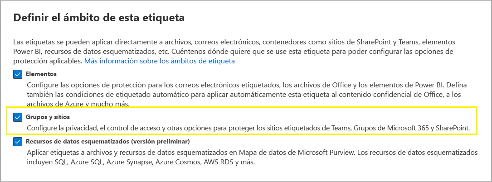

# <a name="use-sensitivity-labels-to-protect-content-in-microsoft-teams-microsoft-365-groups-and-sharepoint-sites"></a><span data-ttu-id="86150-103">Usar etiquetas de confidencialidad para proteger el contenido en Microsoft Teams, grupos de Microsoft 365 y sitios de SharePoint</span><span class="sxs-lookup"><span data-stu-id="86150-103">Use sensitivity labels to protect content in Microsoft Teams, Microsoft 365 groups, and SharePoint sites</span></span>

><span data-ttu-id="86150-104">*[Instrucciones de licencias de Microsoft 365 para la seguridad y el cumplimiento](/office365/servicedescriptions/microsoft-365-service-descriptions/microsoft-365-tenantlevel-services-licensing-guidance/microsoft-365-security-compliance-licensing-guidance).*</span><span class="sxs-lookup"><span data-stu-id="86150-104">*[Microsoft 365 licensing guidance for security & compliance](/office365/servicedescriptions/microsoft-365-service-descriptions/microsoft-365-tenantlevel-services-licensing-guidance/microsoft-365-security-compliance-licensing-guidance).*</span></span>

<span data-ttu-id="86150-105">Además de usar [etiquetas de confidencialidad](sensitivity-labels.md) para clasificar y proteger documentos y mensajes de correo electrónico, también puede usarlas para proteger el contenido en los siguientes contenedores: sitios de Microsoft Teams, grupos de Microsoft 365 ([anteriormente grupos de Office 365](https://techcommunity.microsoft.com/t5/microsoft-365-blog/office-365-groups-will-become-microsoft-365-groups/ba-p/1303601)), y sitios de SharePoint.</span><span class="sxs-lookup"><span data-stu-id="86150-105">In addition to using [sensitivity labels](sensitivity-labels.md) to classify and protect documents and emails, you can also use sensitivity labels to protect content in the following containers: Microsoft Teams sites, Microsoft 365 groups ([formerly Office 365 groups](https://techcommunity.microsoft.com/t5/microsoft-365-blog/office-365-groups-will-become-microsoft-365-groups/ba-p/1303601)), and SharePoint sites.</span></span> <span data-ttu-id="86150-106">Para esta clasificación y protección de nivel de contenedor, utilice la siguiente configuración de etiquetas:</span><span class="sxs-lookup"><span data-stu-id="86150-106">For this container-level classification and protection, use the following label settings:</span></span>

- <span data-ttu-id="86150-107">Privacidad (pública o privada) de los sitios de equipos y Grupos de Microsoft 365</span><span class="sxs-lookup"><span data-stu-id="86150-107">Privacy (public or private) of teams sites and Microsoft 365 groups</span></span>
- <span data-ttu-id="86150-108">Acceso de usuarios externos</span><span class="sxs-lookup"><span data-stu-id="86150-108">External user access</span></span>
- <span data-ttu-id="86150-109">Uso compartido externo desde sitios de SharePoint </span><span class="sxs-lookup"><span data-stu-id="86150-109">External sharing from SharePoint sites</span></span>
- <span data-ttu-id="86150-110">Acceso desde dispositivos no administrados</span><span class="sxs-lookup"><span data-stu-id="86150-110">Access from unmanaged devices</span></span>
- <span data-ttu-id="86150-111">Contextos de autenticación (en versión preliminar)</span><span class="sxs-lookup"><span data-stu-id="86150-111">Authentication contexts (in preview)</span></span>

> [!IMPORTANT]
> <span data-ttu-id="86150-112">La configuración para dispositivos no administrados y contextos de autenticación funciona junto con el acceso condicional de Azure Active Directory.</span><span class="sxs-lookup"><span data-stu-id="86150-112">The settings for unmanaged devices and authentication contexts work in conjunction with Azure Active Directory Conditional Access.</span></span> <span data-ttu-id="86150-113">Debe configurar esta característica dependiente si desea usar una etiqueta de confidencialidad para esta configuración.</span><span class="sxs-lookup"><span data-stu-id="86150-113">You must configure this dependent feature if you want to use a sensitivity label for these settings.</span></span> <span data-ttu-id="86150-114">Se incluye información adicional en las instrucciones siguientes.</span><span class="sxs-lookup"><span data-stu-id="86150-114">Additional information is included in the instructions that follow.</span></span>

<span data-ttu-id="86150-115">Cuando aplica esta etiqueta de confidencialidad a un contenedor compatible, la etiqueta aplica automáticamente la clasificación y la configuración de protección establecida al sitio o al grupo.</span><span class="sxs-lookup"><span data-stu-id="86150-115">When you apply this sensitivity label to a supported container, the label automatically applies the classification and configured protection settings to the site or group.</span></span>

<span data-ttu-id="86150-116">Sin embargo, el contenido de estos contenedores no hereda las etiquetas para la clasificación y configuración de archivos y mensajes de correo electrónico, como las marcas visuales y el cifrado.</span><span class="sxs-lookup"><span data-stu-id="86150-116">Content in these containers however, do not inherit the labels for the classification or settings for files and emails, such as visual markings and encryption.</span></span> <span data-ttu-id="86150-117">Para que los usuarios puedan etiquetar sus documentos en los sitios de SharePoint o de grupos, asegúrese de [habilitar las etiquetas de confidencialidad para archivos de Office en SharePoint y OneDrive](sensitivity-labels-sharepoint-onedrive-files.md).</span><span class="sxs-lookup"><span data-stu-id="86150-117">So that users can label their documents in SharePoint sites or team sites, make sure you've [enabled sensitivity labels for Office files in SharePoint and OneDrive](sensitivity-labels-sharepoint-onedrive-files.md).</span></span>

> [!NOTE]
> <span data-ttu-id="86150-118">Las etiquetas de sensibilidad para contenedores no son compatibles con las Redes de entrega de contenido (CDNs) de Office 365.</span><span class="sxs-lookup"><span data-stu-id="86150-118">Sensitivity labels for containers aren't supported with Office 365 Content Delivery Networks (CDNs).</span></span>

## <a name="using-sensitivity-labels-for-microsoft-teams-microsoft-365-groups-and-sharepoint-sites"></a><span data-ttu-id="86150-119">Uso de etiquetas de confidencialidad para Microsoft Teams, grupos de Microsoft 365 y sitios de SharePoint</span><span class="sxs-lookup"><span data-stu-id="86150-119">Using sensitivity labels for Microsoft Teams, Microsoft 365 groups, and SharePoint sites</span></span>

<span data-ttu-id="86150-p104">Antes de habilitar etiquetas de confidencialidad para contenedores y establecerlas para la nueva configuración, los usuarios pueden ver y aplicar etiquetas de confidencialidad en sus aplicaciones. Por ejemplo, en Word:</span><span class="sxs-lookup"><span data-stu-id="86150-p104">Before you enable sensitivity labels for containers and configure sensitivity labels for the new settings, users can see and apply sensitivity labels in their apps. For example, from Word:</span></span>


<span data-ttu-id="86150-p105">Después de habilitar y configurar las etiquetas de confidencialidad para los contenedores, los usuarios también pueden ver y aplicar etiquetas de confidencialidad a los sitios de grupo de Microsoft, los grupos de Microsoft 365 y los sitios de SharePoint. Por ejemplo, cuando crea un nuevo sitio de grupo desde SharePoint:</span><span class="sxs-lookup"><span data-stu-id="86150-p105">After you enable and configure sensitivity labels for containers, users can additionally see and apply sensitivity labels to Microsoft team sites, Microsoft 365 groups, and SharePoint sites. For example, when you create a new team site from SharePoint:</span></span>


## <a name="how-to-enable-sensitivity-labels-for-containers-and-synchronize-labels"></a><span data-ttu-id="86150-126">Cómo habilitar etiquetas de confidencialidad para contenedores y sincronizarlas</span><span class="sxs-lookup"><span data-stu-id="86150-126">How to enable sensitivity labels for containers and synchronize labels</span></span>

<span data-ttu-id="86150-127">Si aún no ha habilitado etiquetas de confidencialidad para contenedores, siga estos pasos como un procedimiento de un solo uso:</span><span class="sxs-lookup"><span data-stu-id="86150-127">If you haven't yet enabled sensitivity labels for containers, do the following set of steps as a one-time procedure:</span></span>

1. <span data-ttu-id="86150-128">Dado que esta característica usa la funcionalidad de Azure AD, siga las instrucciones de la documentación de Azure AD para habilitar la compatibilidad con etiquetas de confidencialidad: [Asignar etiquetas de confidencialidad a grupos de Microsoft 365 en Azure Active Directory](/azure/active-directory/users-groups-roles/groups-assign-sensitivity-labels).</span><span class="sxs-lookup"><span data-stu-id="86150-128">Because this feature uses Azure AD functionality, follow the instructions from the Azure AD documentation to enable sensitivity label support: [Assign sensitivity labels to Microsoft 365 groups in Azure Active Directory](/azure/active-directory/users-groups-roles/groups-assign-sensitivity-labels).</span></span>

2. <span data-ttu-id="86150-129">Ahora tiene que sincronizar sus etiquetas de confidencialidad en Azure AD.</span><span class="sxs-lookup"><span data-stu-id="86150-129">You now need to synchronize your sensitivity labels to Azure AD.</span></span> <span data-ttu-id="86150-130">En primer lugar, [conéctese a PowerShell del Centro de seguridad y cumplimiento](/powershell/exchange/office-365-scc/connect-to-scc-powershell/connect-to-scc-powershell).</span><span class="sxs-lookup"><span data-stu-id="86150-130">First, [connect to Security & Compliance Center PowerShell](/powershell/exchange/office-365-scc/connect-to-scc-powershell/connect-to-scc-powershell).</span></span>

   <span data-ttu-id="86150-131">Por ejemplo, en una sesión de PowerShell que se ejecuta como administrador, inicie sesión con una cuenta de administrador global:</span><span class="sxs-lookup"><span data-stu-id="86150-131">For example, in a PowerShell session that you run as administrator, sign in with a global administrator account.</span></span>

3. <span data-ttu-id="86150-132">Después, ejecute el siguiente comando para asegurarse de que sus etiquetas de confidencialidad se pueden usar con los grupos de Microsoft 365:</span><span class="sxs-lookup"><span data-stu-id="86150-132">Then run the following command to ensure your sensitivity labels can be used with Microsoft 365 groups:</span></span>

    ```powershell
    Execute-AzureAdLabelSync
    ```

## <a name="how-to-configure-groups-and-site-settings"></a><span data-ttu-id="86150-133">Cómo configurar los grupos y las opciones de configuración del sitio</span><span class="sxs-lookup"><span data-stu-id="86150-133">How to configure groups and site settings</span></span>

<span data-ttu-id="86150-134">Después de habilitar las etiquetas de confidencialidad para contenedores, como se describe en la sección anterior, puede configurar las opciones de protección para grupos y sitios en el asistente para etiquetas sensibles.</span><span class="sxs-lookup"><span data-stu-id="86150-134">After sensitivity labels are enabled for containers as described in the previous section, you can then configure protection settings for groups and sites in the sensitivity labeling wizard.</span></span> <span data-ttu-id="86150-135">Hasta que se habiliten las etiquetas de confidencialidad para contenedores, la configuración está visible en el asistente, pero no pueden configurarse.</span><span class="sxs-lookup"><span data-stu-id="86150-135">Until sensitivity labels are enabled for containers, the settings are visible in the wizard but you can't configure them.</span></span>

1. <span data-ttu-id="86150-136">Siga las instrucciones generales para [crear o editar una etiqueta de confidencialidad](create-sensitivity-labels.md#create-and-configure-sensitivity-labels) y asegúrese de que **Archivos y sitios** está seleccionada para el ámbito de la etiqueta:</span><span class="sxs-lookup"><span data-stu-id="86150-136">Follow the general instructions to [create or edit a sensitivity label](create-sensitivity-labels.md#create-and-configure-sensitivity-labels) and make sure you select **Groups & sites** for the label's scope:</span></span> 
    
    
    
    <span data-ttu-id="86150-138">Cuando solo este ámbito para la etiqueta esté seleccionado, la etiqueta no se mostrará en las aplicaciones de Office que admiten etiquetas de confidencialidad y no se podrá aplicar a archivos y mensajes de correo electrónico.</span><span class="sxs-lookup"><span data-stu-id="86150-138">When only this scope is selected for the label, the label won't be displayed in Office apps that support sensitivity labels and can't be applied to files and emails.</span></span> <span data-ttu-id="86150-139">Tener esta separación de etiquetas puede ser útil tanto para los usuarios como para los administradores, pero también puede aumentar la complejidad de la implementación de la etiqueta.</span><span class="sxs-lookup"><span data-stu-id="86150-139">Having this separation of labels can be helpful for both users and administrators, but can also add to the complexity of your label deployment.</span></span>
    
    <span data-ttu-id="86150-140">Por ejemplo, necesita revisar atentamente la [clasificación de etiquetas](sensitivity-labels.md#label-priority-order-matters), ya que SharePoint detecta cuándo se carga un documento con etiqueta en un sitio etiquetado.</span><span class="sxs-lookup"><span data-stu-id="86150-140">For example, you need to carefully review your [label ordering](sensitivity-labels.md#label-priority-order-matters) because SharePoint detects when a labeled document is uploaded to a labeled site.</span></span> <span data-ttu-id="86150-141">En este escenario, se generan automáticamente un evento de auditoría y un correo electrónico cuando el documento tiene una etiqueta de confidencialidad con mayor prioridad que la etiqueta del sitio.</span><span class="sxs-lookup"><span data-stu-id="86150-141">In this scenario, an audit event and email are automatically generated when the document has a higher priority sensitivity label than the site's label.</span></span> <span data-ttu-id="86150-142">Para obtener más información, vea la sección [Auditoría de actividades de etiquetas de confidencialidad](#auditing-sensitivity-label-activities) en esta página.</span><span class="sxs-lookup"><span data-stu-id="86150-142">For more information, see the [Auditing sensitivity label activities](#auditing-sensitivity-label-activities) section on this page.</span></span> 

2. <span data-ttu-id="86150-143">A continuación, en la página **Definir configuración de protección para grupos y sitios**, seleccione una o ambas opciones disponibles:</span><span class="sxs-lookup"><span data-stu-id="86150-143">Then, on the **Define protection settings for groups and sites** page, select one or both of the available options:</span></span>
    
    - <span data-ttu-id="86150-144">**Configuración de privacidad y acceso de usuarios externos** para establecer las opciones de configuración de **Privacidad** y **Acceso de usuarios externos**.</span><span class="sxs-lookup"><span data-stu-id="86150-144">**Privacy and external user access settings** to configure the **Privacy** and **External users access** settings.</span></span> 
    - <span data-ttu-id="86150-145">**Configuración de uso compartido externo y acceso condicional** para controlar las configuraciones de **Controlar el uso compartido externo de los sitios de SharePoint etiquetados** y **Usar el acceso condicional de Azure AD para proteger los sitios de SharePoint etiquetados**.</span><span class="sxs-lookup"><span data-stu-id="86150-145">**External sharing and Conditional Access settings** to configure the **Control external sharing from labeled SharePoint sites** and **Use Azure AD Conditional Access to protect labeled SharePoint sites** setting.</span></span>

3. <span data-ttu-id="86150-146">Si seleccionó **Configuración de privacidad y acceso de usuarios externos**, configure las siguientes opciones:</span><span class="sxs-lookup"><span data-stu-id="86150-146">If you selected **Privacy and external user access settings**, now configure the following settings:</span></span>
    
    - <span data-ttu-id="86150-147">**Privacidad**: mantenga la opción predeterminada **Público** si quiere que cualquier persona de su organización tenga acceso al sitio de grupo o al grupo al que se aplica esta etiqueta.</span><span class="sxs-lookup"><span data-stu-id="86150-147">**Privacy**: Keep the default of **Public** if you want anyone in your organization to access the team site or group where this label is applied.</span></span>
        
        <span data-ttu-id="86150-148">Seleccione **Privado** si quiere que el acceso esté restringido solo a miembros aprobados de su organización.</span><span class="sxs-lookup"><span data-stu-id="86150-148">Select **Private** if you want access to be restricted to only approved members in your organization.</span></span>
        
        <span data-ttu-id="86150-149">Seleccione **Ninguno** cuando desee proteger el contenido del contenedor mediante el uso de la etiqueta de confidencialidad, pero permita que los usuarios establezcan la configuración de privacidad ellos mismos.</span><span class="sxs-lookup"><span data-stu-id="86150-149">Select **None** when you want to protect content in the container by using the sensitivity label, but still let users configure the privacy setting themselves.</span></span>
        
        <span data-ttu-id="86150-150">Las opciones **Pública** o **Privada** para establecen y bloquean la configuración de privacidad cuando aplica esta etiqueta al contenedor.</span><span class="sxs-lookup"><span data-stu-id="86150-150">The settings of **Public** or **Private** set and lock the privacy setting when you apply this label to the container.</span></span> <span data-ttu-id="86150-151">La configuración elegida reemplaza cualquier configuración de privacidad anterior establecida para el equipo o grupo, y bloquea el valor de privacidad para que solo se pueda cambiar quitando primero la etiqueta de confidencialidad del contenedor.</span><span class="sxs-lookup"><span data-stu-id="86150-151">Your chosen setting replaces any previous privacy setting that might be configured for the team or group, and locks the privacy value so it can be changed only by first removing the sensitivity label from the container.</span></span> <span data-ttu-id="86150-152">Después de quitar la etiqueta de confidencialidad, la configuración de privacidad de la etiqueta permanece y los usuarios ya pueden cambiarla de nuevo.</span><span class="sxs-lookup"><span data-stu-id="86150-152">After you remove the sensitivity label, the privacy setting from the label remains and users can now change it again.</span></span>
    
    - <span data-ttu-id="86150-153">**Acceso de usuarios externos**: controla si el propietario del grupo puede [agregar invitados al grupo](/office365/admin/create-groups/manage-guest-access-in-groups).</span><span class="sxs-lookup"><span data-stu-id="86150-153">**External user access**: Control whether the group owner can [add guests to the group](/office365/admin/create-groups/manage-guest-access-in-groups).</span></span>

4. <span data-ttu-id="86150-154">Si seleccionó **Configuración de acceso al dispositivo y uso compartido externo del dispositivo**, configure las siguientes opciones:</span><span class="sxs-lookup"><span data-stu-id="86150-154">If you selected **Device external sharing and device access settings**, now configure the following settings:</span></span>
    
    - <span data-ttu-id="86150-155">**Controlar el uso compartido externo desde sitios de SharePoint etiquetados**: seleccione esta opción para seleccionar el uso compartido externo para cualquier usuario, invitados nuevos y existentes, invitados existentes o solo para los usuarios de su organización.</span><span class="sxs-lookup"><span data-stu-id="86150-155">**Control external sharing from labeled SharePoint sites**: Select this option to then select either external sharing for anyone, new and existing guests, existing guests, or only people in your organization.</span></span> <span data-ttu-id="86150-156">Para más información sobre esta configuración y opciones, consulte la documentación de SharePoint [Activar o desactivar el uso compartido externo de un sitio](/sharepoint/change-external-sharing-site).</span><span class="sxs-lookup"><span data-stu-id="86150-156">For more information about this configuration and settings, see the SharePoint documentation, [Turn external sharing on or off for a site](/sharepoint/change-external-sharing-site).</span></span>
    
    - <span data-ttu-id="86150-157">**Usar el acceso condicional de Azure AD para proteger los sitios de SharePoint etiquetados**: seleccione esta opción solo si su organización la tiene configurada y está usando el [Acceso condicional de Azure Active Directory](/azure/active-directory/conditional-access/overview).</span><span class="sxs-lookup"><span data-stu-id="86150-157">**Use Azure AD Conditional Access to protect labeled SharePoint sites**: Select this option only if your organization has configured and is using [Azure Active Directory Conditional Access](/azure/active-directory/conditional-access/overview).</span></span> <span data-ttu-id="86150-158">Luego, seleccione uno de los siguientes parámetros:</span><span class="sxs-lookup"><span data-stu-id="86150-158">Then, select one of the following settings:</span></span>
    
        - <span data-ttu-id="86150-159">**Determinar si los usuarios pueden acceder a los sitios de SharePoint desde dispositivos no administrados**: esta opción emplea la característica de SharePoint que usa el acceso condicional de Azure AD para bloquear o limitar el acceso a contenido de SharePoint y OneDrive desde dispositivos no administrados.</span><span class="sxs-lookup"><span data-stu-id="86150-159">**Determine whether users can access SharePoint sites from unmanaged devices**: This option uses the SharePoint feature that uses Azure AD Conditional Access to block or limit access to SharePoint and OneDrive content from unmanaged devices.</span></span> <span data-ttu-id="86150-160">Para obtener más información, consulte [Controlar el acceso desde dispositivos no administrados](/sharepoint/control-access-from-unmanaged-devices) en la documentación de SharePoint.</span><span class="sxs-lookup"><span data-stu-id="86150-160">For more information, see [Control access from unmanaged devices](/sharepoint/control-access-from-unmanaged-devices) from the SharePoint documentation.</span></span> <span data-ttu-id="86150-161">La opción que especifique para esta configuración de etiqueta constituye el equivalente a ejecutar un comando de PowerShell para un sitio, tal y como se describe en los pasos 3-5 en la sección de instrucciones de SharePoint [Bloquear o limitar el acceso a un sitio específico de SharePoint o a OneDrive](/sharepoint/control-access-from-unmanaged-devices#block-or-limit-access-to-a-specific-sharepoint-site-or-onedrive).</span><span class="sxs-lookup"><span data-stu-id="86150-161">The option you specify for this label setting is the equivalent of running a PowerShell command for a site, as described in steps 3-5 from the [Block or limit access to a specific SharePoint site or OneDrive](/sharepoint/control-access-from-unmanaged-devices#block-or-limit-access-to-a-specific-sharepoint-site-or-onedrive) section from the SharePoint instructions.</span></span>
            
            <span data-ttu-id="86150-162">Para obtener más información sobre la configuración, vea la opción [Más información sobre las dependencias para los dispositivos no administrados](#more-information-about-the-dependencies-for-the-unmanaged-devices-option) al final de esta sección.</span><span class="sxs-lookup"><span data-stu-id="86150-162">For additional configuration information, see [More information about the dependencies for the unmanaged devices option](#more-information-about-the-dependencies-for-the-unmanaged-devices-option) at the end of this section.</span></span>
            
        - <span data-ttu-id="86150-163">**Elegir un contexto de autenticación existente**: actualmente en versión preliminar, esta opción le permite exigir condiciones de acceso más estrictas cuando los usuarios acceden a sitios de SharePoint que tienen esta etiqueta aplicada.</span><span class="sxs-lookup"><span data-stu-id="86150-163">**Choose an existing authentication context**: Currently in preview, this option lets you enforce more stringent access conditions when users access SharePoint sites that have this label applied.</span></span> <span data-ttu-id="86150-164">Estas condiciones se aplican al seleccionar un contexto de autenticación existente que se ha creado y publicado para la implementación de acceso condicional de su organización.</span><span class="sxs-lookup"><span data-stu-id="86150-164">These conditions are enforced when you select an existing authentication context that has been created and published for your organization's Conditional Access deployment.</span></span> <span data-ttu-id="86150-165">Si los usuarios no cumplen las condiciones configuradas o usan aplicaciones que no admiten contextos de autenticación, se les denegará el acceso.</span><span class="sxs-lookup"><span data-stu-id="86150-165">If users don't meet the configured conditions or if they use apps that don't support authentication contexts, they are denied access.</span></span>
            
            <span data-ttu-id="86150-166">Para obtener más información de configuración, consulte [Más información sobre las dependencias de la opción de contexto de autenticación](#more-information-about-the-dependencies-for-the-authentication-context-option) al final de esta sección.</span><span class="sxs-lookup"><span data-stu-id="86150-166">For additional configuration information, see [More information about the dependencies for the authentication context option](#more-information-about-the-dependencies-for-the-authentication-context-option) at the end of this section.</span></span>
            
            <span data-ttu-id="86150-167">Ejemplos de esta configuración de etiquetas:</span><span class="sxs-lookup"><span data-stu-id="86150-167">Examples for this label configuration:</span></span>
            
             - <span data-ttu-id="86150-168">Elija un contexto de autenticación que esté configurado para requerir la [autenticación multifactor (MFA)](/azure/active-directory/conditional-access/untrusted-networks).</span><span class="sxs-lookup"><span data-stu-id="86150-168">You choose an authentication context that is configured to require [multi-factor authentication (MFA)](/azure/active-directory/conditional-access/untrusted-networks).</span></span> <span data-ttu-id="86150-169">Después, esta etiqueta se aplica a un sitio de SharePoint que contiene elementos altamente confidenciales.</span><span class="sxs-lookup"><span data-stu-id="86150-169">This label is then applied to a SharePoint site that contains highly confidential items.</span></span> <span data-ttu-id="86150-170">Como resultado, cuando los usuarios de una red que no son de confianza intentan acceder a un documento de este sitio, ven la solicitud de MFA que deben completar para poder acceder al documento.</span><span class="sxs-lookup"><span data-stu-id="86150-170">As a result, when users from an untrusted network attempt to access a document in this site, they see the MFA prompt that they must complete before they can access the document.</span></span>
             
             - <span data-ttu-id="86150-171">Elija un contexto de autenticación que esté configurado para las [directivas de condiciones de uso](/azure/active-directory/conditional-access/terms-of-use).</span><span class="sxs-lookup"><span data-stu-id="86150-171">You choose an authentication context that is configured for [terms of use (ToU) policies](/azure/active-directory/conditional-access/terms-of-use).</span></span> <span data-ttu-id="86150-172">Después, esta etiqueta se aplica a un sitio de SharePoint que contiene elementos que requieren la aceptación de términos de uso por motivos legales o de cumplimiento.</span><span class="sxs-lookup"><span data-stu-id="86150-172">This label is then applied to a SharePoint site that contains items that require a terms of use acceptance for legal or compliance reasons.</span></span> <span data-ttu-id="86150-173">Como resultado, cuando los usuarios intentan acceder a un documento de este sitio, ven un documento de términos de uso que deben aceptar para poder acceder al documento original.</span><span class="sxs-lookup"><span data-stu-id="86150-173">As a result, when users attempt to access a document in this site, they see a terms of use document that they must accept before they can access the original document.</span></span>

> [!IMPORTANT]
> <span data-ttu-id="86150-174">La configuración de sitio y grupo solo surte efecto al aplicar la etiqueta a un equipo, grupo o sitio.</span><span class="sxs-lookup"><span data-stu-id="86150-174">Only these site and group settings take effect when you apply the label to a team, group, or site.</span></span> <span data-ttu-id="86150-175">Si el [ámbito de la etiqueta](sensitivity-labels.md#label-scopes) incluye archivos y mensajes de correo electrónico, otras opciones de configuración de etiqueta, como el cifrado y la marcación de contenido, no se aplicarán a todo el contenido del equipo, grupo o sitio.</span><span class="sxs-lookup"><span data-stu-id="86150-175">If the [label's scope](sensitivity-labels.md#label-scopes) includes files and emails, other label settings such as encryption and content marking aren't applied to the content within the team, group, or site.</span></span>

<span data-ttu-id="86150-176">Si la etiqueta de confidencialidad aún no se ha publicado, publíquela [agregándola a una directiva de etiqueta de confidencialidad](create-sensitivity-labels.md#publish-sensitivity-labels-by-creating-a-label-policy).</span><span class="sxs-lookup"><span data-stu-id="86150-176">If your sensitivity label isn't already published, now publish it by [adding it to a sensitivity label policy](create-sensitivity-labels.md#publish-sensitivity-labels-by-creating-a-label-policy).</span></span> <span data-ttu-id="86150-177">Los usuarios que tienen asignada una directiva de etiqueta de confidencialidad que incluye esta etiqueta podrán seleccionarla para sitios y grupos.</span><span class="sxs-lookup"><span data-stu-id="86150-177">The users who are assigned a sensitivity label policy that includes this label will be able to select it for sites and groups.</span></span>

##### <a name="more-information-about-the-dependencies-for-the-unmanaged-devices-option"></a><span data-ttu-id="86150-178">Más información sobre la opción de dependencias para los dispositivos no administrados</span><span class="sxs-lookup"><span data-stu-id="86150-178">More information about the dependencies for the unmanaged devices option</span></span>

<span data-ttu-id="86150-179">Si no configura la directiva de acceso condicional dependiente para SharePoint tal y como se describe en [Utilizar las restricciones que exige la aplicación](/sharepoint/app-enforced-restrictions), la opción que especifique aquí no tendrá ningún efecto.</span><span class="sxs-lookup"><span data-stu-id="86150-179">If you don't configure the dependent conditional access policy for SharePoint as documented in [Use app-enforced restrictions](/sharepoint/app-enforced-restrictions), the option you specify here will have no effect.</span></span> <span data-ttu-id="86150-180">Además, no tendrá ningún efecto si es menos restrictiva que una configuración establecida en el nivel de inquilino.</span><span class="sxs-lookup"><span data-stu-id="86150-180">Additionally, it will have no effect if it's less restrictive than a configured setting at the tenant level.</span></span> <span data-ttu-id="86150-181">Si ha configurado una opción de configuración a nivel de toda la organización para dispositivos no administrados, elija una configuración de etiqueta que sea igual o más restrictiva.</span><span class="sxs-lookup"><span data-stu-id="86150-181">If you have configured an organization-wide setting for unmanaged devices, choose a label setting that's either the same or more restrictive</span></span>

<span data-ttu-id="86150-182">Por ejemplo, si la cuenta empresarial está configurada para **Permitir tan solo el acceso web limitado**, el valor de la etiqueta que permite el acceso total no tendrá ningún efecto, ya que es menos restrictivo.</span><span class="sxs-lookup"><span data-stu-id="86150-182">For example, if your tenant is configured for **Allow limited, web-only access**, the label setting that allows full access will have no effect because it's less restrictive.</span></span> <span data-ttu-id="86150-183">Para esta configuración a nivel de la cuenta empresarial, elija el valor de la etiqueta que permita bloquear el acceso (más restrictivo) o el valor de la etiqueta para acceso limitado (igual que la configuración de la cuenta empresarial).</span><span class="sxs-lookup"><span data-stu-id="86150-183">For this tenant-level setting, choose the label setting to block access (more restrictive) or the label setting for limited access (the same as the tenant setting).</span></span>

<span data-ttu-id="86150-184">Dado que puede configurar las opciones de configuración de SharePoint independientemente de la configuración de etiqueta, no hay ninguna comprobación en el asistente de etiquetas de confidencialidad que incluya las dependencias.</span><span class="sxs-lookup"><span data-stu-id="86150-184">Because you can configure the SharePoint settings separately from the label configuration, there's no check in the sensitivity label wizard that the dependencies are in place.</span></span> <span data-ttu-id="86150-185">Estas dependencias pueden configurarse después de crear y publicar la etiqueta, e incluso después de aplicarla.</span><span class="sxs-lookup"><span data-stu-id="86150-185">These dependencies can be configured after the label is created and published, and even after the label is applied.</span></span> <span data-ttu-id="86150-186">Sin embargo, si la etiqueta ya se ha aplicado, la configuración no tendrá efecto hasta que el usuario vuelva a autenticarse.</span><span class="sxs-lookup"><span data-stu-id="86150-186">However, if the label is already applied, the label setting won't take effect until after the user next authenticates.</span></span>

##### <a name="more-information-about-the-dependencies-for-the-authentication-context-option"></a><span data-ttu-id="86150-187">Más información sobre las dependencias de la opción de contexto de autenticación</span><span class="sxs-lookup"><span data-stu-id="86150-187">More information about the dependencies for the authentication context option</span></span>

<span data-ttu-id="86150-188">Para que aparezca en la lista desplegable para seleccionar, es necesario crear, configurar y publicar contextos de autenticación como parte de la configuración de acceso a condiciones de Azure Active Directory.</span><span class="sxs-lookup"><span data-stu-id="86150-188">To display in the drop-down list for selection, authentication contexts must be created, configured, and published as part of your Azure Active Directory Condition Access configuration.</span></span> <span data-ttu-id="86150-189">Para obtener más información e instrucciones, vea la sección [Configurar los contextos de autenticación](/azure/active-directory/conditional-access/concept-conditional-access-cloud-apps#configure-authentication-contexts) en de la documentación de acceso condicional de Azure AD.</span><span class="sxs-lookup"><span data-stu-id="86150-189">For more information and instructions, see the [Configure authentication contexts](/azure/active-directory/conditional-access/concept-conditional-access-cloud-apps#configure-authentication-contexts) section from the Azure AD Conditional Access documentation.</span></span>

<span data-ttu-id="86150-p123">No todas las aplicaciones admiten contextos de autenticación. Si un usuario con una aplicación no compatible se conecta al sitio que está configurado para un contexto de autenticación, verá un mensaje de acceso denegado o se le pedirá que se autentique, pero se le rechazará. Las aplicaciones que admiten contextos de autenticación actualmente:</span><span class="sxs-lookup"><span data-stu-id="86150-p123">Not all apps support authentication contexts. If a user with an unsupported app connects to the site that's configured for an authentication context, they see either an access denied message or they are prompted to authenticate but rejected. The apps that currently support authentication contexts:</span></span>

- <span data-ttu-id="86150-193">Office para la Web, que incluye Outlook para la Web</span><span class="sxs-lookup"><span data-stu-id="86150-193">Office for the web, which includes Outlook for the web</span></span>

- <span data-ttu-id="86150-194">Microsoft Planner</span><span class="sxs-lookup"><span data-stu-id="86150-194">Microsoft Planner</span></span>

- <span data-ttu-id="86150-195">Aplicaciones de Microsoft 365 para Word, Excel y PowerPoint; versiones mínimas:</span><span class="sxs-lookup"><span data-stu-id="86150-195">Microsoft 365 Apps for Word, Excel, and PowerPoint; minimum versions:</span></span>
    - <span data-ttu-id="86150-196">Windows: 2103</span><span class="sxs-lookup"><span data-stu-id="86150-196">Windows: 2103</span></span>
    - <span data-ttu-id="86150-197">macOS: 16.45.1202</span><span class="sxs-lookup"><span data-stu-id="86150-197">macOS: 16.45.1202</span></span>
    - <span data-ttu-id="86150-198">iOS: 2.48.303</span><span class="sxs-lookup"><span data-stu-id="86150-198">iOS: 2.48.303</span></span>
    - <span data-ttu-id="86150-199">Android: 16.0.13924.10000</span><span class="sxs-lookup"><span data-stu-id="86150-199">Android: 16.0.13924.10000</span></span>

- <span data-ttu-id="86150-200">Aplicaciones de Microsoft 365 para Outlook; versiones mínimas:</span><span class="sxs-lookup"><span data-stu-id="86150-200">Microsoft 365 Apps for Outlook; minimum versions:</span></span>
    - <span data-ttu-id="86150-201">Windows: 2103</span><span class="sxs-lookup"><span data-stu-id="86150-201">Windows: 2103</span></span>
    - <span data-ttu-id="86150-202">macOS: 16.45.1202</span><span class="sxs-lookup"><span data-stu-id="86150-202">macOS: 16.45.1202</span></span>
    - <span data-ttu-id="86150-203">iOS: 4.2109.0</span><span class="sxs-lookup"><span data-stu-id="86150-203">iOS: 4.2109.0</span></span>
    - <span data-ttu-id="86150-204">Android: 4.2025.1</span><span class="sxs-lookup"><span data-stu-id="86150-204">Android: 4.2025.1</span></span>

- <span data-ttu-id="86150-205">Aplicación de Sincronización de OneDrive, versiones mínimas:</span><span class="sxs-lookup"><span data-stu-id="86150-205">OneDrive sync app, minimum versions:</span></span>
    - <span data-ttu-id="86150-206">Windows: 21.002</span><span class="sxs-lookup"><span data-stu-id="86150-206">Windows: 21.002</span></span>
    - <span data-ttu-id="86150-207">macOS: 21.002</span><span class="sxs-lookup"><span data-stu-id="86150-207">macOS: 21.002</span></span>
    - <span data-ttu-id="86150-208">iOS: Rolling out in 12.30</span><span class="sxs-lookup"><span data-stu-id="86150-208">iOS: Rolling out in 12.30</span></span>
    - <span data-ttu-id="86150-209">Android: aún no compatible</span><span class="sxs-lookup"><span data-stu-id="86150-209">Android: Not yet supported</span></span>

<span data-ttu-id="86150-210">Limitaciones conocidas de esta versión preliminar:</span><span class="sxs-lookup"><span data-stu-id="86150-210">Known limitations for this preview:</span></span>

- <span data-ttu-id="86150-211">Para la aplicación de Sincronización de OneDrive, solo es compatible con OneDrive y no con otros sitios.</span><span class="sxs-lookup"><span data-stu-id="86150-211">For the OneDrive sync app, supported for OneDrive only and not for other sites.</span></span>

- <span data-ttu-id="86150-212">Es posible que las siguientes características y aplicaciones no sean compatibles con los contextos de autenticación, por lo que le recomendamos que compruebe que siguen funcionando cuando un usuario accede correctamente a un sitio mediante un contexto de autenticación:</span><span class="sxs-lookup"><span data-stu-id="86150-212">The following features and apps might be incompatible with authentication contexts, so we encourage you to check that these continue to work after a user successfully accesses  a site by using an authentication context:</span></span>
    
    - <span data-ttu-id="86150-213">Flujos de trabajo que usan PowerApps o Power Automate</span><span class="sxs-lookup"><span data-stu-id="86150-213">Workflows that use PowerApps or Power Automate</span></span>
    - <span data-ttu-id="86150-214">Aplicaciones de terceros</span><span class="sxs-lookup"><span data-stu-id="86150-214">Third-party apps</span></span>

## <a name="sensitivity-label-management"></a><span data-ttu-id="86150-215">Administración de etiquetas de confidencialidad</span><span class="sxs-lookup"><span data-stu-id="86150-215">Sensitivity label management</span></span>

<span data-ttu-id="86150-216">Use las siguientes instrucciones para crear, modificar o eliminar las etiquetas de confidencialidad configuradas para sitios y grupos.</span><span class="sxs-lookup"><span data-stu-id="86150-216">Use the following guidance for when you create, modify, or delete sensitivity labels that are configured for sites and groups.</span></span>

### <a name="creating-and-publishing-labels-that-are-configured-for-sites-and-groups"></a><span data-ttu-id="86150-217">Crear y publicar etiquetas configuradas para sitios y grupos</span><span class="sxs-lookup"><span data-stu-id="86150-217">Creating and publishing labels that are configured for sites and groups</span></span>

<span data-ttu-id="86150-218">Cuando se crea y se publica una nueva etiqueta de confidencialidad, los usuarios en los equipos, grupos y sitios pueden verla en un plazo de una hora.</span><span class="sxs-lookup"><span data-stu-id="86150-218">When a new sensitivity label is created and published, it's visible for users in teams, groups, and sites within one hour.</span></span> <span data-ttu-id="86150-219">Sin embargo, si modifica una etiqueta existente, permita que pasen hasta 24 horas.</span><span class="sxs-lookup"><span data-stu-id="86150-219">However, if you modify an existing label, allow up to 24 hours.</span></span> <span data-ttu-id="86150-220">Use las siguientes instrucciones para publicar una etiqueta para los usuarios establecida para la configuración de sitio y grupo:</span><span class="sxs-lookup"><span data-stu-id="86150-220">Use the following guidance to publish a label for your users when that label is configured for site and group settings:</span></span>

1. <span data-ttu-id="86150-221">Después de crear y configurar la etiqueta de confidencialidad, agréguela a una directiva de etiqueta que solo se aplique a algunos usuarios de prueba.</span><span class="sxs-lookup"><span data-stu-id="86150-221">After you create and configure the sensitivity label, add this label to a label policy that applies to just a few test users.</span></span>

2. <span data-ttu-id="86150-222">Espere a que se replique el cambio:</span><span class="sxs-lookup"><span data-stu-id="86150-222">Wait for the change to replicate:</span></span>

   - <span data-ttu-id="86150-223">Nueva etiqueta: espere una hora.</span><span class="sxs-lookup"><span data-stu-id="86150-223">New label: Wait for one hour.</span></span>
   - <span data-ttu-id="86150-224">Etiqueta existente: espere 24 horas.</span><span class="sxs-lookup"><span data-stu-id="86150-224">Existing label: Wait for 24 hours.</span></span>

3. <span data-ttu-id="86150-225">Después de este período, utilice una de las cuentas de usuario de prueba para crear un equipo, un grupo de Microsoft 365 o un sitio de SharePoint con la etiqueta creada en el paso 1.</span><span class="sxs-lookup"><span data-stu-id="86150-225">After this wait period, use one of the test user accounts to create a team, Microsoft 365 group, or SharePoint site with the label that you created in step 1.</span></span>

4. <span data-ttu-id="86150-226">Si no se producen errores durante el proceso de creación, significa que es seguro publicar la etiqueta en todos los usuarios de su inquilino.</span><span class="sxs-lookup"><span data-stu-id="86150-226">If there are no errors during this creation operation, you know it's safe to publish the label to all users in your tenant.</span></span>

### <a name="modifying-published-labels-that-are-configured-for-sites-and-groups"></a><span data-ttu-id="86150-227">Modificar las etiquetas publicadas que están configuradas para sitios y grupos</span><span class="sxs-lookup"><span data-stu-id="86150-227">Modifying published labels that are configured for sites and groups</span></span>

<span data-ttu-id="86150-228">Como práctica recomendada, no cambie la configuración de sitio y grupo para una etiqueta de confidencialidad cuando se haya aplicado a equipos, grupos o sitios.</span><span class="sxs-lookup"><span data-stu-id="86150-228">As a best practice, don't change the site and group settings for a sensitivity label after the label has been applied to teams, groups, or sites.</span></span> <span data-ttu-id="86150-229">Si lo hace, espere hasta 24 horas para que los cambios se repliquen en todos los contenedores que tienen la etiqueta aplicada.</span><span class="sxs-lookup"><span data-stu-id="86150-229">If you do, remember to wait for 24 hours for the changes to replicate to all containers that have the label applied.</span></span>

<span data-ttu-id="86150-230">Además, si los cambios incluyen la configuración **Acceso de usuarios externos**:</span><span class="sxs-lookup"><span data-stu-id="86150-230">In addition, if your changes include the **External users access** setting:</span></span>

- <span data-ttu-id="86150-p126">La nueva configuración se aplica a los nuevos usuarios, pero no a los existentes. Por ejemplo, si esta configuración se seleccionó anteriormente y, como resultado, los usuarios invitados accedieron al sitio, estos usuarios invitados aún pueden acceder al sitio después de que esta configuración se borre en la configuración de la etiqueta.</span><span class="sxs-lookup"><span data-stu-id="86150-p126">The new setting applies to new users but not to existing users. For example, if this setting was previously selected and as a result, guest users accessed the site, these guest users can still access the site after this setting is cleared in the label configuration.</span></span>

- <span data-ttu-id="86150-233">La configuración de privacidad de las propiedades de grupo hiddenMembership y roleEnabled no se actualiza.</span><span class="sxs-lookup"><span data-stu-id="86150-233">The privacy settings for the group properties hiddenMembership and roleEnabled aren't updated.</span></span>

### <a name="deleting-published-labels-that-are-configured-for-sites-and-groups"></a><span data-ttu-id="86150-234">Eliminar etiquetas publicadas que están configuradas para sitios y grupos</span><span class="sxs-lookup"><span data-stu-id="86150-234">Deleting published labels that are configured for sites and groups</span></span>

<span data-ttu-id="86150-p127">Si elimina una etiqueta de confidencialidad que tiene habilitada la configuración del sitio y del grupo, y esa etiqueta está incluida en una o más políticas de etiquetas, esta acción puede provocar fallas en la creación de nuevos equipos, grupos y sitios. Para evitar esta situación, utilice la siguiente guía:</span><span class="sxs-lookup"><span data-stu-id="86150-p127">If you delete a sensitivity label that has the site and group settings enabled, and that label is included in one or more label policies, this action can result in creation failures for new teams, groups, and sites. To avoid this situation, use the following guidance:</span></span>

1. <span data-ttu-id="86150-237">Elimine la etiqueta de confidencialidad de todas las directivas de etiqueta que la incluyan.</span><span class="sxs-lookup"><span data-stu-id="86150-237">Remove the sensitivity label from all label policies that include the label.</span></span>

2. <span data-ttu-id="86150-238">Espere una hora.</span><span class="sxs-lookup"><span data-stu-id="86150-238">Wait for one hour.</span></span>

3. <span data-ttu-id="86150-239">Después de este período, pruebe a crear un equipo, grupo o sitio y compruebe que la etiqueta ya no es visible.</span><span class="sxs-lookup"><span data-stu-id="86150-239">After this wait period, try creating a team, group, or site and confirm that the label is no longer visible.</span></span>

4. <span data-ttu-id="86150-240">Si la etiqueta de confidencialidad no es visible, ya puede eliminarla de forma segura.</span><span class="sxs-lookup"><span data-stu-id="86150-240">If the sensitivity label isn't visible, you can now safely delete the label.</span></span>

## <a name="how-to-apply-sensitivity-labels-to-containers"></a><span data-ttu-id="86150-241">Cómo aplicar etiquetas de confidencialidad a contenedores</span><span class="sxs-lookup"><span data-stu-id="86150-241">How to apply sensitivity labels to containers</span></span>

<span data-ttu-id="86150-242">Ya está listo para aplicar la etiqueta o las etiquetas de confidencialidad a los siguientes contenedores:</span><span class="sxs-lookup"><span data-stu-id="86150-242">You're now ready to apply the sensitivity label or labels to the following containers:</span></span>

- [<span data-ttu-id="86150-243">Grupo de Microsoft 365 en Azure AD</span><span class="sxs-lookup"><span data-stu-id="86150-243">Microsoft 365 group in Azure AD</span></span>](#apply-sensitivity-labels-to-microsoft-365-groups)
- [<span data-ttu-id="86150-244">Sitio de grupo de Microsoft Teams</span><span class="sxs-lookup"><span data-stu-id="86150-244">Microsoft Teams team site</span></span>](#apply-a-sensitivity-label-to-a-new-team)
- [<span data-ttu-id="86150-245">Grupo de Microsoft 365 en Outlook en la Web</span><span class="sxs-lookup"><span data-stu-id="86150-245">Microsoft 365 group in Outlook on the web</span></span>](#apply-a-sensitivity-label-to-a-new-group-in-outlook-on-the-web)
- [<span data-ttu-id="86150-246">Sitio de SharePoint</span><span class="sxs-lookup"><span data-stu-id="86150-246">SharePoint site</span></span>](#apply-a-sensitivity-label-to-a-new-site)

<span data-ttu-id="86150-247">Puede usar PowerShell si necesita [aplicar una etiqueta de sensibilidad a varios sitios](#use-powershell-to-apply-a-sensitivity-label-to-multiple-sites).</span><span class="sxs-lookup"><span data-stu-id="86150-247">You can use PowerShell if you need to [apply a sensitivity label to multiple sites](#use-powershell-to-apply-a-sensitivity-label-to-multiple-sites).</span></span>

### <a name="apply-sensitivity-labels-to-microsoft-365-groups"></a><span data-ttu-id="86150-248">Aplicar etiquetas de confidencialidad a grupos de Microsoft 365</span><span class="sxs-lookup"><span data-stu-id="86150-248">Apply sensitivity labels to Microsoft 365 groups</span></span>

<span data-ttu-id="86150-249">Ya está listo para aplicar la etiqueta o las etiquetas de confidencialidad a los grupos de Microsoft 365.</span><span class="sxs-lookup"><span data-stu-id="86150-249">You're now ready to apply the sensitivity label or labels to Microsoft 365 groups.</span></span> <span data-ttu-id="86150-250">Regrese a la documentación de Azure AD para obtener instrucciones:</span><span class="sxs-lookup"><span data-stu-id="86150-250">Return to the Azure AD documentation for instructions:</span></span>

- [<span data-ttu-id="86150-251">Asignar una etiqueta a un grupo nuevo en Azure Portal</span><span class="sxs-lookup"><span data-stu-id="86150-251">Assign a label to a new group in Azure portal</span></span>](/azure/active-directory/users-groups-roles/groups-assign-sensitivity-labels#assign-a-label-to-a-new-group-in-azure-portal)

- [<span data-ttu-id="86150-252">Asignar una etiqueta a un grupo existente en Azure Portal</span><span class="sxs-lookup"><span data-stu-id="86150-252">Assign a label to an existing group in Azure portal</span></span>](/azure/active-directory/users-groups-roles/groups-assign-sensitivity-labels#assign-a-label-to-an-existing-group-in-azure-portal)

- <span data-ttu-id="86150-253">[Quitar una etiqueta a un grupo existente en Azure Portal](/azure/active-directory/users-groups-roles/groups-assign-sensitivity-labels#remove-a-label-from-an-existing-group-in-azure-portal)</span><span class="sxs-lookup"><span data-stu-id="86150-253">[Remove a label from an existing group in Azure portal](/azure/active-directory/users-groups-roles/groups-assign-sensitivity-labels#remove-a-label-from-an-existing-group-in-azure-portal).</span></span>

### <a name="apply-a-sensitivity-label-to-a-new-team"></a><span data-ttu-id="86150-254">Aplicar una etiqueta de confidencialidad a un nuevo equipo</span><span class="sxs-lookup"><span data-stu-id="86150-254">Apply a sensitivity label to a new team</span></span>

<span data-ttu-id="86150-255">Los usuarios pueden seleccionar etiquetas de confidencialidad al crear nuevos equipos en Microsoft Teams.</span><span class="sxs-lookup"><span data-stu-id="86150-255">Users can select sensitivity labels when they create new teams in Microsoft Teams.</span></span> <span data-ttu-id="86150-256">Al seleccionar la etiqueta en la lista desplegable **confidencialidad**, es posible que la configuración de privacidad cambie para reflejar la configuración de la etiqueta.</span><span class="sxs-lookup"><span data-stu-id="86150-256">When they select the label from the **Sensitivity** dropdown, the privacy setting might change to reflect the label configuration.</span></span> <span data-ttu-id="86150-257">En función de la configuración de acceso de usuarios externos que haya seleccionado para la etiqueta, los usuarios pueden o no, agregar al equipo personas de fuera de la organización.</span><span class="sxs-lookup"><span data-stu-id="86150-257">Depending on the external users access setting you selected for the label, users can or can't add people outside the organization to the team.</span></span>

[<span data-ttu-id="86150-258">Más información sobre las etiquetas de confidencialidad para Teams</span><span class="sxs-lookup"><span data-stu-id="86150-258">Learn more about sensitivity labels for Teams</span></span>](/microsoftteams/sensitivity-labels)


<span data-ttu-id="86150-260">Después de crear el equipo, se muestra la etiqueta de confidencialidad en la esquina superior derecha de todos los canales.</span><span class="sxs-lookup"><span data-stu-id="86150-260">After you create the team, the sensitivity label appears in the upper-right corner of all channels.</span></span>


<span data-ttu-id="86150-262">El servicio aplica automáticamente la misma etiqueta de confidencialidad al grupo de Microsoft 365 y al sitio de grupo de SharePoint conectado.</span><span class="sxs-lookup"><span data-stu-id="86150-262">The service automatically applies the same sensitivity label to the Microsoft 365 group and the connected SharePoint team site.</span></span>

### <a name="apply-a-sensitivity-label-to-a-new-group-in-outlook-on-the-web"></a><span data-ttu-id="86150-263">Aplicar una etiqueta de confidencialidad a un nuevo grupo en Outlook en la Web</span><span class="sxs-lookup"><span data-stu-id="86150-263">Apply a sensitivity label to a new group in Outlook on the web</span></span>

<span data-ttu-id="86150-264">En Outlook en la Web, al crear un grupo, puede seleccionar o cambiar la opción **confidencialidad** para las etiquetas publicadas:</span><span class="sxs-lookup"><span data-stu-id="86150-264">In Outlook on the web, when you create a new group, you can select or change the **Sensitivity** option for published labels:</span></span>


### <a name="apply-a-sensitivity-label-to-a-new-site"></a><span data-ttu-id="86150-266">Aplicar una etiqueta de confidencialidad a un nuevo sitio</span><span class="sxs-lookup"><span data-stu-id="86150-266">Apply a sensitivity label to a new site</span></span>

<span data-ttu-id="86150-267">Los administradores y los usuarios finales pueden seleccionar las etiquetas de confidencialidad cuando [crean sitios de grupo y de comunicación modernos](/sharepoint/create-site-collection) y expandir la **configuración avanzada**:</span><span class="sxs-lookup"><span data-stu-id="86150-267">Admins and end users can select sensitivity labels when they [create modern team sites and communication sites](/sharepoint/create-site-collection), and expand **Advanced settings**:</span></span>


<span data-ttu-id="86150-269">En el cuadro desplegable se mostrarán los nombres de etiqueta de la selección, y en el icono de ayuda se mostrarán todos los nombres de etiqueta con la información sobre herramientas, que puede ayudar a los usuarios a determinar la etiqueta correcta que debe aplicar.</span><span class="sxs-lookup"><span data-stu-id="86150-269">The dropdown box displays the label names for the selection, and the help icon displays all the label names with their tooltip, which can help users determine the correct label to apply.</span></span>

<span data-ttu-id="86150-270">Cuando los usuarios exploren el sitio, podrán ver el nombre de la etiqueta y las directivas aplicadas.</span><span class="sxs-lookup"><span data-stu-id="86150-270">When the label is applied, and users browse to the site, they see the name of the label and applied policies.</span></span> <span data-ttu-id="86150-271">Por ejemplo, este sitio se ha etiquetado como **confidencial** y la configuración de privacidad se ha establecido en **privada**:</span><span class="sxs-lookup"><span data-stu-id="86150-271">For example, this site has been labeled as **Confidential**, and the privacy setting is set to **Private**:</span></span>


### <a name="use-powershell-to-apply-a-sensitivity-label-to-multiple-sites"></a><span data-ttu-id="86150-273">Usar PowerShell para aplicar una etiqueta de confidencialidad a varios sitios</span><span class="sxs-lookup"><span data-stu-id="86150-273">Use PowerShell to apply a sensitivity label to multiple sites</span></span>

<span data-ttu-id="86150-274">Puede usar los cmdlet [Set-SPOSite](/powershell/module/sharepoint-online/set-sposite) y [Set-SPOTenant](/powershell/module/sharepoint-online/set-spotenant) con el parámetro *SensitivityLabel* desde el [Shell de SharePoint Online Management](/powershell/sharepoint/sharepoint-online/connect-sharepoint-online) actual para aplicar una etiqueta de confidencialidad a muchos sitios.</span><span class="sxs-lookup"><span data-stu-id="86150-274">You can use the [Set-SPOSite](/powershell/module/sharepoint-online/set-sposite) and [Set-SPOTenant](/powershell/module/sharepoint-online/set-spotenant) cmdlet with the *SensitivityLabel* parameter from the current [SharePoint Online Management Shell](/powershell/sharepoint/sharepoint-online/connect-sharepoint-online) to apply a sensitivity label to many sites.</span></span> <span data-ttu-id="86150-275">Los sitios pueden ser cualquiera de los pertenecientes a la colección de sitios de SharePoint o un sitio de OneDrive.</span><span class="sxs-lookup"><span data-stu-id="86150-275">The sites can be any SharePoint site collection, or a OneDrive site.</span></span>

<span data-ttu-id="86150-276">Asegúrese de que tiene la versión 16.0.19418.12000 o posterior del Shell de administración de SharePoint Online.</span><span class="sxs-lookup"><span data-stu-id="86150-276">Make sure you have version 16.0.19418.12000 or later of the SharePoint Online Management Shell.</span></span>

1. <span data-ttu-id="86150-277">Abra una sesión de PowerShell con la opción **Ejecutar como administrador**.</span><span class="sxs-lookup"><span data-stu-id="86150-277">Open a PowerShell session with the **Run as Administrator** option.</span></span>

2. <span data-ttu-id="86150-278">Si no conoce el GUID de la etiqueta, vaya a: [Conectarse al PowerShell del Centro de seguridad y cumplimiento](/powershell/exchange/connect-to-scc-powershell) y obtenga la lista de etiquetas de confidencialidad y sus GUID.</span><span class="sxs-lookup"><span data-stu-id="86150-278">If you don't know your label GUID: [Connect to Security & Compliance Center PowerShell](/powershell/exchange/connect-to-scc-powershell) and get the list of sensitivity labels and their GUIDs.</span></span>

   ```powershell
   Get-Label |ft Name, Guid
   ```

3. <span data-ttu-id="86150-279">Ahora, [conéctese a SharePoint Online PowerShell](/powershell/sharepoint/sharepoint-online/connect-sharepoint-online) y almacene el GUID de etiqueta como una variable.</span><span class="sxs-lookup"><span data-stu-id="86150-279">Now [connect to SharePoint Online PowerShell](/powershell/sharepoint/sharepoint-online/connect-sharepoint-online) and store your label GUID as a variable.</span></span> <span data-ttu-id="86150-280">Por ejemplo:</span><span class="sxs-lookup"><span data-stu-id="86150-280">For example:</span></span>

   ```powershell
   $Id = [GUID]("e48058ea-98e8-4940-8db0-ba1310fd955e")
   ```

4. <span data-ttu-id="86150-p133">Cree una nueva variable que identifique varios sitios que tienen una cadena de identificación en común en su URL. Por ejemplo:</span><span class="sxs-lookup"><span data-stu-id="86150-p133">Create a new variable that identifies multiple sites that have an identifying string in common in their URL. For example:</span></span>

   ```powershell
   $sites = Get-SPOSite -IncludePersonalSite $true -Limit all -Filter "Url -like 'documents"
   ```

5. <span data-ttu-id="86150-p134">Ejecute el siguiente comando para aplicar la etiqueta a estos sitios. Usando nuestros ejemplos:</span><span class="sxs-lookup"><span data-stu-id="86150-p134">Run the following command to apply the label to these sites. Using our examples:</span></span>

   ```powershell
   $sites | ForEach-Object {Set-SPOTenant $_.url -SensitivityLabel $Id}
   ```

<span data-ttu-id="86150-285">Esta serie de comandos le permite etiquetar varios sitios en el espacio empresarial con la misma etiqueta de confidencialidad y, por este motivo, puede usar el cmdlet Set-SPOTenant, en lugar del cmdlet Set-SPOSite que se usa para la configuración por sitio.</span><span class="sxs-lookup"><span data-stu-id="86150-285">This series of commands lets you label multiple sites across your tenant with the same sensitivity label, which is why you use the Set-SPOTenant cmdlet, rather than the Set-SPOSite cmdlet that's for per-site configuration.</span></span> <span data-ttu-id="86150-286">Pero use el cmdlet Set-SPOSite cuando necesite aplicar una etiqueta diferente a sitios específicos repitiendo el comando siguiente en cada uno de estos sitios: `Set-SPOSite -Identity <URL> -SensitivityLabel "<labelguid>"`</span><span class="sxs-lookup"><span data-stu-id="86150-286">However, use the Set-SPOSite cmdlet when you need to apply a different label to specific sites by repeating the following command for each of these sites: `Set-SPOSite -Identity <URL> -SensitivityLabel "<labelguid>"`</span></span>

## <a name="view-and-manage-sensitivity-labels-in-the-sharepoint-admin-center"></a><span data-ttu-id="86150-287">Ver y administrar etiquetas de confidencialidad en el centro de administración de SharePoint</span><span class="sxs-lookup"><span data-stu-id="86150-287">View and manage sensitivity labels in the SharePoint admin center</span></span>

<span data-ttu-id="86150-288">Para ver, ordenar y buscar las etiquetas de confidencialidad aplicadas, use la página **Sitios activos** en el nuevo Centro de administración de SharePoint.</span><span class="sxs-lookup"><span data-stu-id="86150-288">To view, sort, and search the applied sensitivity labels, use the **Active sites** page in the new SharePoint admin center.</span></span> <span data-ttu-id="86150-289">Es posible que primero tenga que agregar la columna **confidencialidad**:</span><span class="sxs-lookup"><span data-stu-id="86150-289">You might need to first add the **Sensitivity** column:</span></span>


<span data-ttu-id="86150-291">Para obtener más información sobre la administración de sitios desde la página Sitios activos, incluido cómo agregar una columna, vea [Administrar sitios en el nuevo centro de administración de SharePoint](/sharepoint/manage-sites-in-new-admin-center).</span><span class="sxs-lookup"><span data-stu-id="86150-291">For more information about managing sites from the Active sites page, including how to add a column, see [Manage sites in the new SharePoint admin center](/sharepoint/manage-sites-in-new-admin-center).</span></span>

<span data-ttu-id="86150-292">También puede cambiar y aplicar una etiqueta desde esta página:</span><span class="sxs-lookup"><span data-stu-id="86150-292">You can also change and apply a label from this page:</span></span>

1. <span data-ttu-id="86150-293">Seleccione el nombre del sitio para abrir el panel de detalles.</span><span class="sxs-lookup"><span data-stu-id="86150-293">Select the site name to open the details pane.</span></span>

2. <span data-ttu-id="86150-294">Seleccione la pestaña **Directivas** y después, elija **Editar** para la configuración **Confidencialidad**.</span><span class="sxs-lookup"><span data-stu-id="86150-294">Select the **Policies** tab, and then select **Edit** for the **Sensitivity** setting.</span></span>

3. <span data-ttu-id="86150-295">En el panel **Editar configuración de confidencialidad**, seleccione la etiqueta de confidencialidad que desea aplicar al sitio y, a continuación, elija **Guardar**.</span><span class="sxs-lookup"><span data-stu-id="86150-295">From the **Edit sensitivity setting** pane, select the sensitivity label you want to apply to the site, and then select **Save**.</span></span>

## <a name="support-for-sensitivity-labels"></a><span data-ttu-id="86150-296">Compatibilidad con etiquetas de confidencialidad.</span><span class="sxs-lookup"><span data-stu-id="86150-296">Support for sensitivity labels</span></span>

<span data-ttu-id="86150-297">Las siguientes aplicaciones y servicios son compatibles con etiquetas de confidencialidad establecidas para la configuración de sitio y grupo:</span><span class="sxs-lookup"><span data-stu-id="86150-297">The following apps and services support sensitivity labels configured for sites and group settings:</span></span>

- <span data-ttu-id="86150-298">Centros de administración:</span><span class="sxs-lookup"><span data-stu-id="86150-298">Admin centers:</span></span>

  - <span data-ttu-id="86150-299">Centro de administración de SharePoint</span><span class="sxs-lookup"><span data-stu-id="86150-299">SharePoint admin center</span></span>
  - <span data-ttu-id="86150-300">Portal de Azure Active Directory</span><span class="sxs-lookup"><span data-stu-id="86150-300">Azure Active Directory portal</span></span>
  - <span data-ttu-id="86150-301">Centro de administración de Microsoft 365</span><span class="sxs-lookup"><span data-stu-id="86150-301">Microsoft 365 admin center</span></span>
  - <span data-ttu-id="86150-302">Centro de cumplimiento de Microsoft 365, Centro de seguridad de Microsoft 365 y Centro de seguridad y cumplimiento</span><span class="sxs-lookup"><span data-stu-id="86150-302">Microsoft 365 compliance center, Microsoft 365 security center, Security & Compliance Center</span></span>

- <span data-ttu-id="86150-303">Servicios y aplicaciones de usuario:</span><span class="sxs-lookup"><span data-stu-id="86150-303">User apps and services:</span></span>

  - <span data-ttu-id="86150-304">SharePoint</span><span class="sxs-lookup"><span data-stu-id="86150-304">SharePoint</span></span>
  - <span data-ttu-id="86150-305">Teams</span><span class="sxs-lookup"><span data-stu-id="86150-305">Teams</span></span>
  - <span data-ttu-id="86150-306">Outlook en la Web y para Windows, macOS, iOS y Android</span><span class="sxs-lookup"><span data-stu-id="86150-306">Outlook on the web and for Windows, macOS, iOS, and Android</span></span>
  - <span data-ttu-id="86150-307">Forms</span><span class="sxs-lookup"><span data-stu-id="86150-307">Forms</span></span>
  - <span data-ttu-id="86150-308">Stream</span><span class="sxs-lookup"><span data-stu-id="86150-308">Stream</span></span>
  - <span data-ttu-id="86150-309">Planner</span><span class="sxs-lookup"><span data-stu-id="86150-309">Planner</span></span> 

<span data-ttu-id="86150-310">Las siguientes aplicaciones y servicios actualmente no son compatibles con las etiquetas de confidencialidad establecidas para la configuración de sitios y grupos:</span><span class="sxs-lookup"><span data-stu-id="86150-310">The following apps and services don't currently support sensitivity labels configured for sites and group settings:</span></span>

- <span data-ttu-id="86150-311">Centros de administración:</span><span class="sxs-lookup"><span data-stu-id="86150-311">Admin centers:</span></span>

  - <span data-ttu-id="86150-312">Centro de administración de Teams</span><span class="sxs-lookup"><span data-stu-id="86150-312">Teams admin center</span></span>
  - <span data-ttu-id="86150-313">Centro de administración de Exchange</span><span class="sxs-lookup"><span data-stu-id="86150-313">Exchange admin center</span></span>

- <span data-ttu-id="86150-314">Servicios y aplicaciones de usuario:</span><span class="sxs-lookup"><span data-stu-id="86150-314">User apps and services:</span></span>

  - <span data-ttu-id="86150-315">Dynamics 365</span><span class="sxs-lookup"><span data-stu-id="86150-315">Dynamics 365</span></span>
  - <span data-ttu-id="86150-316">Yammer</span><span class="sxs-lookup"><span data-stu-id="86150-316">Yammer</span></span>
  - <span data-ttu-id="86150-317">Project</span><span class="sxs-lookup"><span data-stu-id="86150-317">Project</span></span>
  - <span data-ttu-id="86150-318">Power BI</span><span class="sxs-lookup"><span data-stu-id="86150-318">Power BI</span></span>

## <a name="classic-azure-ad-group-classification"></a><span data-ttu-id="86150-319">Clasificación de grupos de Azure AD clásica</span><span class="sxs-lookup"><span data-stu-id="86150-319">Classic Azure AD group classification</span></span>

<span data-ttu-id="86150-320">Microsoft 365 ya no admitirá las antiguas clasificaciones para los nuevos grupos de Microsoft 365 y sitios de SharePoint después de que habilite etiquetas de confidencialidad para contenedores.</span><span class="sxs-lookup"><span data-stu-id="86150-320">Microsoft 365 no longer supports the old classifications for new Microsoft 365 groups and SharePoint sites after you enable sensitivity labels for containers.</span></span> <span data-ttu-id="86150-321">Sin embargo, los grupos y sitios existentes que son compatibles con etiquetas de confidencialidad aún mostrarán los valores de clasificación antiguos hasta que los convierta para usar etiquetas de confidencialidad.</span><span class="sxs-lookup"><span data-stu-id="86150-321">However, existing groups and sites that support sensitivity labels still display the old classification values until you convert them to use sensitivity labels.</span></span>

<span data-ttu-id="86150-322">Como ejemplo de cómo podría haber utilizado la antigua clasificación de grupos para SharePoint, consulte [Clasificación de sitios "modernos" de SharePoint](/sharepoint/dev/solution-guidance/modern-experience-site-classification).</span><span class="sxs-lookup"><span data-stu-id="86150-322">As an example of how you might have used the old group classification for SharePoint, see [SharePoint "modern" sites classification](/sharepoint/dev/solution-guidance/modern-experience-site-classification).</span></span>

<span data-ttu-id="86150-323">Estas clasificaciones se configuraron con Azure AD PowerShell o la biblioteca principal de PnP y definiendo valores para la configuración de `ClassificationList`.</span><span class="sxs-lookup"><span data-stu-id="86150-323">These classifications were configured by using Azure AD PowerShell or the PnP Core library and defining values for the `ClassificationList` setting.</span></span> <span data-ttu-id="86150-324">Si su espacio empresarial tiene valores de clasificación definidos, se muestran al ejecutar el siguiente comando desde el módulo de [PowerShell de AzureADPreview](https://www.powershellgallery.com/packages/AzureADPreview):</span><span class="sxs-lookup"><span data-stu-id="86150-324">If your tenant has classification values defined, they are shown when you run the following command from the [AzureADPreview PowerShell module](https://www.powershellgallery.com/packages/AzureADPreview):</span></span>

```powershell
($setting["ClassificationList"])
```

<span data-ttu-id="86150-325">Para convertir las clasificaciones antiguas en etiquetas de confidencialidad, siga uno de estos procedimientos:</span><span class="sxs-lookup"><span data-stu-id="86150-325">To convert your old classifications to sensitivity labels, do one of the following:</span></span>

- <span data-ttu-id="86150-326">Usar etiquetas existentes: especifique la configuración de la etiqueta que desee para los sitios y grupos al editar las etiquetas de confidencialidad existentes que ya están publicadas.</span><span class="sxs-lookup"><span data-stu-id="86150-326">Use existing labels: Specify the label settings you want for sites and groups by editing existing sensitivity labels that are already published.</span></span>

- <span data-ttu-id="86150-327">Crear etiquetas nuevas: especifique la configuración de la etiqueta que desee para los sitios y grupos creando y publicando nuevas etiquetas de confidencialidad que tengan los mismos nombres que las de las clasificaciones existentes.</span><span class="sxs-lookup"><span data-stu-id="86150-327">Create new labels: Specify the label settings you want for sites and groups by creating and publishing new sensitivity labels that have the same names as your existing classifications.</span></span>

<span data-ttu-id="86150-328">Luego:</span><span class="sxs-lookup"><span data-stu-id="86150-328">Then:</span></span>

1. <span data-ttu-id="86150-p139">Use PowerShell para aplicar las etiquetas de confidencialidad a los grupos de Microsoft 365 y a los sitios de SharePoint mediante la asignación de nombres.</span><span class="sxs-lookup"><span data-stu-id="86150-p139">Use PowerShell to apply the sensitivity labels to existing Microsoft 365 groups and SharePoint sites by using name mapping. See the next section for instructions.</span></span>

2. <span data-ttu-id="86150-331">Quitar las clasificaciones antiguas de los grupos y sitios existentes.</span><span class="sxs-lookup"><span data-stu-id="86150-331">Remove the old classifications from the existing groups and sites.</span></span>

<span data-ttu-id="86150-332">Aunque no se puede impedir que los usuarios creen grupos nuevos en aplicaciones y servicios que aún no admiten las etiquetas de confidencialidad, puede ejecutar un script de PowerShell periódico para buscar grupos nuevos que los usuarios han creado con las clasificaciones anteriores y convertirlos para usar etiquetas de confidencialidad.</span><span class="sxs-lookup"><span data-stu-id="86150-332">Although you can't prevent users from creating new groups in apps and services that don't yet support sensitivity labels, you can run a recurring PowerShell script to look for new groups that users have created with the old classifications, and convert these to use sensitivity labels.</span></span>

<span data-ttu-id="86150-333">Para ayudarle a administrar la coexistencia de etiquetas de confidencialidad y clasificaciones de Azure AD para sitios y grupos, consulte [Clasificación y etiquetas de confidencialidad de Azure Active Directory para grupos de Microsoft 365](migrate-aad-classification-sensitivity-labels.md).</span><span class="sxs-lookup"><span data-stu-id="86150-333">To help you manage the coexistence of sensitivity labels and Azure AD classifications for sites and groups, see [Azure Active Directory classification and sensitivity labels for Microsoft 365 groups](migrate-aad-classification-sensitivity-labels.md).</span></span>

### <a name="use-powershell-to-convert-classifications-for-microsoft-365-groups-to-sensitivity-labels"></a><span data-ttu-id="86150-334">Usar PowerShell para convertir clasificaciones de grupos de Microsoft 365 a etiquetas de confidencialidad</span><span class="sxs-lookup"><span data-stu-id="86150-334">Use PowerShell to convert classifications for Microsoft 365 groups to sensitivity labels</span></span>

1. <span data-ttu-id="86150-335">En primer lugar, [conéctese a PowerShell del Centro de seguridad y cumplimiento](/powershell/exchange/office-365-scc/connect-to-scc-powershell/connect-to-scc-powershell).</span><span class="sxs-lookup"><span data-stu-id="86150-335">First, [connect to Security & Compliance Center PowerShell](/powershell/exchange/office-365-scc/connect-to-scc-powershell/connect-to-scc-powershell).</span></span>

   <span data-ttu-id="86150-336">Por ejemplo, en una sesión de PowerShell que se ejecuta como administrador, inicie sesión con una cuenta de administrador global:</span><span class="sxs-lookup"><span data-stu-id="86150-336">For example, in a PowerShell session that you run as administrator, sign in with a global administrator account:</span></span>

2. <span data-ttu-id="86150-337">Consiga la lista de etiquetas de sensibilidad y sus GUIDs usando el cmdlet[Get-Label](/powershell/module/exchange/get-label):</span><span class="sxs-lookup"><span data-stu-id="86150-337">Get the list of sensitivity labels and their GUIDs by using the [Get-Label](/powershell/module/exchange/get-label) cmdlet:</span></span>

   ```powershell
   Get-Label |ft Name, Guid
   ```

3. <span data-ttu-id="86150-338">Tome nota de los GUID para las etiquetas de confidencialidad que quiere aplicar a los grupos de Microsoft 365.</span><span class="sxs-lookup"><span data-stu-id="86150-338">Make a note of the GUIDs for the sensitivity labels you want to apply to your Microsoft 365 groups.</span></span>

4. <span data-ttu-id="86150-339">Ahora [conéctese a PowerShell en línea de Exchange](/powershell/exchange/connect-to-exchange-online-powershell) en una ventana independiente de Windows PowerShell.</span><span class="sxs-lookup"><span data-stu-id="86150-339">Now [connect to Exchange Online PowerShell](/powershell/exchange/connect-to-exchange-online-powershell) in a separate Windows PowerShell window.</span></span>

5. <span data-ttu-id="86150-340">Use el comando siguiente como ejemplo para obtener la lista de grupos que actualmente tienen la clasificación de "general":</span><span class="sxs-lookup"><span data-stu-id="86150-340">Use the following command as an example to get the list of groups that currently have the classification of "General":</span></span>

   ```PowerShell
   $Groups= Get-UnifiedGroup | Where {$_.classification -eq "General"}
   ```

6. <span data-ttu-id="86150-p140">Para cada grupo, agregue la nueva etiqueta de confidencialidad GUID. Por ejemplo:</span><span class="sxs-lookup"><span data-stu-id="86150-p140">For each group, add the new sensitivity label GUID. For example:</span></span>

    ```PowerShell
    foreach ($g in $groups)
    {Set-UnifiedGroup -Identity $g.Identity -SensitivityLabelId "457fa763-7c59-461c-b402-ad1ac6b703cc"}
    ```

7. <span data-ttu-id="86150-343">Repita los pasos 5 y 6 para el resto de sus clasificaciones de grupo.</span><span class="sxs-lookup"><span data-stu-id="86150-343">Repeat steps 5 and 6 for your remaining group classifications.</span></span>

## <a name="auditing-sensitivity-label-activities"></a><span data-ttu-id="86150-344">Auditar actividades de etiqueta de confidencialidad</span><span class="sxs-lookup"><span data-stu-id="86150-344">Auditing sensitivity label activities</span></span>

> [!IMPORTANT]
> <span data-ttu-id="86150-345">Si usa la separación de etiquetas seleccionando solo el ámbito **Grupos y sitios** para las etiquetas que protegen los contenedores: debido al evento de auditoría y correo electrónico **Desfase detectado de la confidencialidad del documento** descrito en esta sección, considere [ordenar esas etiquetas](sensitivity-labels.md#label-priority-order-matters)antes de que tengan un ámbito para **Archivos y mensajes de correo electrónico**.</span><span class="sxs-lookup"><span data-stu-id="86150-345">If you use label separation by selecting just the **Groups & sites** scope for labels that protect containers: Because of the **Detected document sensitivity mismatch** audit event and email described in this section, consider [ordering these labels](sensitivity-labels.md#label-priority-order-matters) before labels that have a scope for **Files & emails**.</span></span> 

<span data-ttu-id="86150-346">Si alguien carga un documento en un sitio protegido con una etiqueta de confidencialidad y el documento tiene una etiqueta de confidencialidad de [mayor prioridad](sensitivity-labels.md#label-priority-order-matters) que la etiqueta de confidencialidad que se aplica al sitio, esta acción no está bloqueada.</span><span class="sxs-lookup"><span data-stu-id="86150-346">If somebody uploads a document to a site that's protected with a sensitivity label and their document has a [higher priority](sensitivity-labels.md#label-priority-order-matters) sensitivity label than the sensitivity label applied to the site, this action isn't blocked.</span></span> <span data-ttu-id="86150-347">Por ejemplo, aplicó la etiqueta **general** a un sitio de SharePoint y alguien carga en este sitio un documento etiquetado como **confidencial**.</span><span class="sxs-lookup"><span data-stu-id="86150-347">For example, you've applied the **General** label to a SharePoint site, and somebody uploads to this site a document labeled **Confidential**.</span></span> <span data-ttu-id="86150-348">Debido a que una etiqueta de confidencialidad con mayor prioridad identifica el contenido que es más confidencial que el contenido que tiene un orden de menor prioridad, esta situación podría ser un problema de seguridad.</span><span class="sxs-lookup"><span data-stu-id="86150-348">Because a sensitivity label with a higher priority identifies content that is more sensitivity than content that has a lower priority order, this situation could be a security concern.</span></span>

<span data-ttu-id="86150-349">Aunque la acción no está bloqueada, se audita y, de forma predeterminada, genera un correo electrónico para la persona que cargó el documento y el administrador del sitio.</span><span class="sxs-lookup"><span data-stu-id="86150-349">Although the action isn't blocked, it is audited and by default, automatically generates an email to the person who uploaded the document and the site administrator.</span></span> <span data-ttu-id="86150-350">Como resultado, tanto el usuario como los administradores pueden identificar los documentos que no están alineados con la prioridad de las etiquetas y tomar las medidas necesarias.</span><span class="sxs-lookup"><span data-stu-id="86150-350">As a result, both the user and administrators can identify documents that have this misalignment of label priority and take action if needed.</span></span> <span data-ttu-id="86150-351">Por ejemplo, eliminar o mover el documento cargado del sitio.</span><span class="sxs-lookup"><span data-stu-id="86150-351">For example, delete or move the uploaded document from the site.</span></span>

<span data-ttu-id="86150-352">No sería un problema de seguridad si el documento tiene una etiqueta de confidencialidad de menor prioridad que la etiqueta de confidencialidad aplicada al sitio.</span><span class="sxs-lookup"><span data-stu-id="86150-352">It wouldn't be a security concern if the document has a lower priority sensitivity label than the sensitivity label applied to the site.</span></span> <span data-ttu-id="86150-353">Por ejemplo, un documento con la etiqueta **general** se carga en un sitio con la etiqueta **confidencial**.</span><span class="sxs-lookup"><span data-stu-id="86150-353">For example, a document labeled **General** is uploaded to a site labeled **Confidential**.</span></span> <span data-ttu-id="86150-354">En este escenario, no se generarán ni un evento de auditoría, ni un correo electrónico.</span><span class="sxs-lookup"><span data-stu-id="86150-354">In this scenario, an auditing event and email aren't generated.</span></span>

<span data-ttu-id="86150-355">Para buscar el registro de auditoría para este evento, busque **Desfase detectado de la confidencialidad del documento** en la categoría de las **actividades de archivos y páginas**.</span><span class="sxs-lookup"><span data-stu-id="86150-355">To search the audit log for this event, look for **Detected document sensitivity mismatch** from the **File and page activities** category.</span></span>

<span data-ttu-id="86150-356">El correo electrónico generado automáticamente tiene el asunto **Etiqueta de confidencialidad no compatible detectado** y el mensaje de correo electrónico explica que la etiqueta no coincide con un vínculo al documento cargado y al sitio.</span><span class="sxs-lookup"><span data-stu-id="86150-356">The automatically generated email has the subject **Incompatible sensitivity label detected** and the email message explains the labeling mismatch with a link to the uploaded document and site.</span></span> <span data-ttu-id="86150-357">También contiene un vínculo a la documentación en el que se explica cómo los usuarios pueden cambiar la etiqueta de confidencialidad.</span><span class="sxs-lookup"><span data-stu-id="86150-357">It also contains a documentation link that explains how users can change the sensitivity label.</span></span> <span data-ttu-id="86150-358">Estos correos electrónicos automatizados no se pueden personalizar, pero puede impedir que se envíen al usar el siguiente comando de PowerShell desde [Set-SPOTenant](/powershell/module/sharepoint-online/set-spotenant):</span><span class="sxs-lookup"><span data-stu-id="86150-358">These automated emails cannot be customized but you can prevent them from being sent when you use the following PowerShell command from [Set-SPOTenant](/powershell/module/sharepoint-online/set-spotenant):</span></span>

```PowerShell
Set-SPOTenant -BlockSendLabelMismatchEmail $True
```

<span data-ttu-id="86150-359">Cuando alguien agrega o quita una etiqueta de confidencialidad a un sitio o grupo, estas actividades también se auditan, pero sin generar un correo electrónico automáticamente.</span><span class="sxs-lookup"><span data-stu-id="86150-359">When somebody adds or removes a sensitivity label to or from a site or group, these activities are also audited but without automatically generating an email.</span></span>

<span data-ttu-id="86150-360">Todos estos eventos de auditoría se pueden encontrar en la categoría [Actividades de etiqueta de confidencialidad](search-the-audit-log-in-security-and-compliance.md#sensitivity-label-activities).</span><span class="sxs-lookup"><span data-stu-id="86150-360">All these auditing events can be found in the [Sensitivity label activities](search-the-audit-log-in-security-and-compliance.md#sensitivity-label-activities) category.</span></span> <span data-ttu-id="86150-361">Para obtener instrucciones sobre cómo buscar el registro de auditoría, vea [buscar el registro de auditoría en el Centro de seguridad y cumplimiento](search-the-audit-log-in-security-and-compliance.md).</span><span class="sxs-lookup"><span data-stu-id="86150-361">For instructions to search the audit log, see [Search the audit log in the Security & Compliance Center](search-the-audit-log-in-security-and-compliance.md).</span></span>

## <a name="how-to-disable-sensitivity-labels-for-containers"></a><span data-ttu-id="86150-362">Cómo deshabilitar etiquetas de confidencialidad para contenedores</span><span class="sxs-lookup"><span data-stu-id="86150-362">How to disable sensitivity labels for containers</span></span>

<span data-ttu-id="86150-363">Puede desactivar las etiquetas de confidencialidad para Microsoft Teams, grupos de Microsoft 365 y sitios de SharePoint siguiendo las mismas instrucciones que se indican en [Habilitar la compatibilidad con etiquetas de confidencialidad en PowerShell](/azure/active-directory/users-groups-roles/groups-assign-sensitivity-labels#enable-sensitivity-label-support-in-powershell).</span><span class="sxs-lookup"><span data-stu-id="86150-363">You can turn off sensitivity labels for Microsoft Teams, Microsoft 365 groups, and SharePoint sites by using the same instructions from [Enable sensitivity label support in PowerShell](/azure/active-directory/users-groups-roles/groups-assign-sensitivity-labels#enable-sensitivity-label-support-in-powershell).</span></span> <span data-ttu-id="86150-364">Sin embargo, para deshabilitar la característica, en el paso 5, especifique `$setting["EnableMIPLabels"] = "False"`.</span><span class="sxs-lookup"><span data-stu-id="86150-364">However, to disable the feature, in step 5, specify `$setting["EnableMIPLabels"] = "False"`.</span></span>

<span data-ttu-id="86150-365">Además de hacer que todas las opciones de configuración para grupos y sitios no estén disponibles cuando cree o edite etiquetas de confidencialidad, esta acción revierte la propiedad que usan los contenedores para su configuración.</span><span class="sxs-lookup"><span data-stu-id="86150-365">In addition to making all the settings unavailable for groups and sites when you create or edit sensitivity labels, this action reverts which property the containers use for their configuration.</span></span> <span data-ttu-id="86150-366">Al habilitar las etiquetas de confidencialidad para Microsoft Teams, grupos de Microsoft 365 y sitios de SharePoint se cambia la propiedad **Clasificación** (usada para la [clasificación de grupos de Azure AD](#classic-azure-ad-group-classification)) a **Confidencialidad**.</span><span class="sxs-lookup"><span data-stu-id="86150-366">Enabling sensitivity labels for Microsoft Teams, Microsoft 365 groups, and SharePoint sites switches the property used from **Classification** (used for [Azure AD group classification](#classic-azure-ad-group-classification)) to **Sensitivity**.</span></span> <span data-ttu-id="86150-367">Cuando deshabilita las etiquetas de confidencialidad para contenedores, estos ignoran la propiedad Confidencialidad y vuelven a usar la propiedad Clasificación.</span><span class="sxs-lookup"><span data-stu-id="86150-367">When you disable sensitivity labels for containers, the containers ignore the Sensitivity property and use the Classification property again.</span></span>

<span data-ttu-id="86150-368">Esto quiere decir que no se exigirá la configuración de etiquetas para sitios y grupos que se aplicó previamente a los contenedores, y los contenedores ya no mostrarán las etiquetas.</span><span class="sxs-lookup"><span data-stu-id="86150-368">This means that any label settings from sites and groups previously applied to containers won't be enforced, and containers no longer display the labels.</span></span>

<span data-ttu-id="86150-369">Si dichos contenedores tienen valores de clasificación de Azure AD aplicados, estos volverán a usar las clasificaciones.</span><span class="sxs-lookup"><span data-stu-id="86150-369">If these containers have Azure AD classification values applied to them, the containers revert to using the classifications again.</span></span> <span data-ttu-id="86150-370">Tenga en cuenta que cualquier nuevo sitio o grupo creado después de habilitar la característica no mostrará una etiqueta ni tendrá una clasificación.</span><span class="sxs-lookup"><span data-stu-id="86150-370">Be aware that any new sites or groups that were created after enabling the feature won't display a label or have a classification.</span></span> <span data-ttu-id="86150-371">Ahora puede aplicar valores de clasificación tanto a estos como a los nuevos contenedores.</span><span class="sxs-lookup"><span data-stu-id="86150-371">For these containers, and any new containers, you can now apply classification values.</span></span> <span data-ttu-id="86150-372">Para obtener más información, consulte [Clasificación de sitios "moderna" de SharePoint](/sharepoint/dev/solution-guidance/modern-experience-site-classification) y [Crear clasificaciones para grupos de Office en su organización](../enterprise/manage-microsoft-365-groups-with-powershell.md).</span><span class="sxs-lookup"><span data-stu-id="86150-372">For more information, see [SharePoint "modern" sites classification](/sharepoint/dev/solution-guidance/modern-experience-site-classification) and [Create classifications for Office groups in your organization](../enterprise/manage-microsoft-365-groups-with-powershell.md).</span></span>

## <a name="additional-resources"></a><span data-ttu-id="86150-373">Recursos adicionales</span><span class="sxs-lookup"><span data-stu-id="86150-373">Additional resources</span></span>

<span data-ttu-id="86150-374">Consulte la grabación y las preguntas contestadas sobre el [Uso de etiquetas de sensibilidad con Microsoft Teams, grupos de O365 y sitios de SharePoint Online](https://techcommunity.microsoft.com/t5/security-privacy-and-compliance/using-sensitivity-labels-with-microsoft-teams-o365-groups-and/ba-p/1221885#M1380).</span><span class="sxs-lookup"><span data-stu-id="86150-374">See the webinar recording and answered questions for [Using Sensitivity labels with Microsoft Teams, O365 Groups and SharePoint Online sites](https://techcommunity.microsoft.com/t5/security-privacy-and-compliance/using-sensitivity-labels-with-microsoft-teams-o365-groups-and/ba-p/1221885#M1380).</span></span>

<span data-ttu-id="86150-375">Este seminario web se grabó cuando la característica aún estaba en la versión preliminar, por lo que es posible que observe algunas discrepancias en la interfaz de usuario.</span><span class="sxs-lookup"><span data-stu-id="86150-375">This webinar was recorded when the feature was still in preview, so you might notice some discrepancies in the UI.</span></span> <span data-ttu-id="86150-376">Sin embargo, la información de esta característica aún es precisa, con las nuevas funciones que se documentan en esta página.</span><span class="sxs-lookup"><span data-stu-id="86150-376">However, the information for this feature is still accurate, with any new capabilities documented on this page.</span></span>