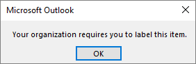

# Información sobre las etiquetas de confidencialidad

>*[Instrucciones de licencias de Microsoft 365 para la seguridad y el cumplimiento](/office365/servicedescriptions/microsoft-365-service-descriptions/microsoft-365-tenantlevel-services-licensing-guidance/microsoft-365-security-compliance-licensing-guidance).*

> [!NOTE]
> Si busca información acerca de las etiquetas de confidencialidad presentes en las aplicaciones de Office, consulte [Aplicar etiquetas de confidencialidad a sus archivos y correos electrónicos en Office](https://support.microsoft.com/topic/apply-sensitivity-labels-to-your-files-and-email-in-office-2f96e7cd-d5a4-403b-8bd7-4cc636bae0f9).
>
> La información de esta página es para los administradores de TI que pueden crear y configurar estas etiquetas.

To get their work done, people in your organization collaborate with others both inside and outside the organization. This means that content no longer stays behind a firewall—it can roam everywhere, across devices, apps, and services. And when it roams, you want it to do so in a secure, protected way that meets your organization's business and compliance policies.

Las etiquetas de confidencialidad de Microsoft Purview Information Protection le permiten clasificar y proteger los datos de su organización, a la vez que se asegura de que la productividad de los usuarios y su capacidad de colaboración no se vean obstaculizadas.

Ejemplo que muestra las etiquetas de confidencialidad disponibles en Excel, en la pestaña **Inicio** de la cinta de opciones. En este ejemplo, la etiqueta aplicada se muestra en la barra de estado:

Para aplicar etiquetas de confidencialidad, los usuarios tienen que haber iniciado sesión en Microsoft 365 con su cuenta profesional o educativa.

> [!NOTE]
> Para espacios empresariales de la Administración gubernamental de los EE. UU., las etiquetas de confidencialidad son compatibles con todas las plataformas.
>
> Si usa el escáner y el cliente de etiquetas unificadas de Azure Information Protection, consulte la [Descripción del servicio de Administración Pública de Azure Information Protection Premium](/enterprise-mobility-security/solutions/ems-aip-premium-govt-service-description).

Puede usar etiquetas de confidencialidad para:
  
- **Proporcionar opciones de configuración de protección que incluyan el cifrado y las marcas de contenido.** Por ejemplo, aplique una etiqueta "Confidencial" a un documento o correo electrónico y esa etiqueta cifrará el contenido y aplicará una marca de agua "Confidencial". Entre las marcas de contenido se incluyen encabezados, pies de página y marcas de agua, y el cifrado también puede restringir las acciones que pueden realizar los usuarios autorizados en el contenido.

- **Proteger el contenido de las aplicaciones de Office en distintos dispositivos y plataformas.** Compatible con Word, Excel, PowerPoint y Outlook en las aplicaciones de escritorio de Office y Office en la Web. Compatible con Windows, Mac OS, iOS y Android.

- **Protect content in third-party apps and services** by using Microsoft Defender for Cloud Apps. With Defender for Cloud Apps, you can detect, classify, label, and protect content in third-party apps and services, such as SalesForce, Box, or DropBox, even if the third-party app or service does not read or support sensitivity labels.

- **Proteger contenedores** que incluyan Teams, Grupos de Microsoft 365 y sitios de SharePoint. Por ejemplo, configurar las opciones de privacidad, el acceso de usuarios externos, el uso compartido externo y el acceso desde dispositivos no administrados.

- **Extender las etiquetas de confidencialidad a Power BI**: al activar esta función, puede aplicar y ver etiquetas en Power BI y proteger los datos cuando se guarden fuera del servicio.

- **Extender las etiquetas de confidencialidad a los recursos en la asignación de datos de Microsoft Purview**: cuando se activa esta capacidad, actualmente en versión preliminar, se pueden aplicar las etiquetas de confidencialidad a los archivos y activos de datos esquematizados en la asignación de datos de Microsoft Purview. Los recursos de datos esquematizados incluyen SQL, Azure SQL, Azure Synapse, Azure Cosmos y AWS RDS.

- **Extend sensitivity labels to third-party apps and services.** Using the Microsoft Information Protection SDK, third-party apps can read sensitivity labels and apply protection settings.

- **Clasificar contenido sin usar una configuración de protección.** También puede simplemente asignar una etiqueta como resultado de la clasificación del contenido. Esto proporciona a los usuarios una asignación visual de la clasificación de los nombres de etiqueta de la organización y pueden usar las etiquetas para crear informes de uso y ver los datos de la actividad de su contenido confidencial. También puede usar esta información para aplicar la configuración de protección más adelante.

En todos estos casos, las etiquetas de confidencialidad de Microsoft Purview pueden ayudarle a realizar las acciones correctas en el contenido adecuado. Con las etiquetas de confidencialidad, puede clasificar los datos en toda la organización, y aplicar la configuración de protección en función de dicha clasificación. Después, esa protección permanece con el contenido.

Para obtener más información sobre estos y otros escenarios que son compatibles con las etiquetas de confidencialidad, vea [Escenarios comunes para las etiquetas de confidencialidad](get-started-with-sensitivity-labels.md#common-scenarios-for-sensitivity-labels). Seguimos desarrollando nuevas funciones compatibles con las etiquetas de confidencialidad, por lo que también le puede resultar útil consultar el [Plan de desarrollo de Microsoft 365](https://www.microsoft.com/microsoft-365/roadmap?filters=Microsoft%20Information%20Protection&searchterms=label).

[!INCLUDE [purview-preview](../includes/purview-preview.md)]

## Qué es una etiqueta de confidencialidad

Cuando asigna una etiqueta de confidencialidad a un contenido, es como un sello que se le aplica que es:

- **Personalizable.** Según su organización y necesidades empresariales, puede crear categorías para diferentes niveles de contenido confidencial en su organización. Por ejemplo, Personal, Público, General, Confidencial y Altamente confidencial.

- **Clear text.** Because a label is stored in clear text in the metadata for files and emails, third-party apps and services can read it and then apply their own protective actions, if required.

- **Persistente.** Al estar almacenada en los metadatos de los archivos y mensajes de correo electrónico, la etiqueta permanece con el contenido, independientemente de dónde se guarde o almacene. La identificación de etiqueta única es la base para aplicar y exigir las directivas que usted configura.

Para los usuarios de su organización, una etiqueta de confidencialidad se muestra como una etiqueta en las aplicaciones que usan y se pueden integrar fácilmente en sus flujos de trabajo existentes.

Cada elemento que admite las etiquetas de confidencialidad puede tener una sola etiqueta aplicada. Los documentos y mensajes de correo electrónico pueden tener aplicadas tanto una etiqueta de confidencialidad como una [etiqueta de retención](retention.md#retention-labels).

> [!div class="mx-imgBorder"]
> 

## Qué pueden hacer las etiquetas de confidencialidad

After a sensitivity label is applied to an email or document, any configured protection settings for that label are enforced on the content. You can configure a sensitivity label to:

- **Cifrar** los mensajes de correo electrónico y documentos para evitar que personas no autorizadas tengan acceso a estos datos. Puede elegir qué usuarios o grupos tienen permisos para realizar las acciones y durante cuánto tiempo. Por ejemplo, puede elegir permitir que todos los usuarios de la organización puedan modificar un documento mientras que un grupo específico de otra organización solo pueda verlo. Como alternativa, en lugar de permisos definidos por el administrador, puede permitir a los usuarios asignar permisos al contenido al aplicar la etiqueta. 
    
    Para obtener más información sobre la configuración de **Cifrado** cuando cree o edite una etiqueta de confidencialidad, vea [Restringir el acceso a contenido con el cifrado en etiquetas de confidencialidad](encryption-sensitivity-labels.md).

- **Marcar el contenido** cuando utilice las aplicaciones de Office, agregando marcas de agua, encabezados o pies de página a correos electrónicos o documentos que tengan aplicada la etiqueta. Las marcas de agua se pueden aplicar en documentos, pero no en mensajes de correo electrónico. Encabezado y marca de agua de ejemplo:
    
    
    
    Las marcas dinámicas también se admiten mediante variables. Por ejemplo, inserte el nombre de la etiqueta o el nombre del documento en el encabezado, pie de página o marca de agua. Para obtener más información, vea [Marcadores dinámicos con variables](sensitivity-labels-office-apps.md#dynamic-markings-with-variables).
    
    ¿Necesita comprobar cuándo se aplican marcas de contenido? Consulte [Cuándo las aplicaciones de Office aplican marcado de contenido y cifrado](sensitivity-labels-office-apps.md#when-office-apps-apply-content-marking-and-encryption).
    
    If you have templates or workflows that are based on specific documents, test those documents with your chosen content markings before you make the label available for users. Some string length restrictions to be aware of:
    
    Las marcas de agua están limitadas a 255 caracteres. Los encabezados y pies de página tienen un límite de 1024 caracteres, excepto en Excel. Excel tiene un límite total de 255 caracteres para encabezados y pies de página, pero este límite incluye caracteres que no son visibles, como códigos de formato. Si se alcanza ese límite, la cadena que escriba no se mostrará en Excel.

- **Proteja el contenido de los contenedores como sitios y grupos** cuando habilita la capacidad de [Usar etiquetas de confidencialidad para proteger el contenido en Microsoft Teams, los grupos de Microsoft 365 y los sitios de SharePoint](sensitivity-labels-teams-groups-sites.md).
    
    No puede configurar las opciones de protección para grupos y sitios hasta que habilite esta capacidad. Esta configuración de etiqueta no da como resultado que los documentos o mensajes de correo electrónico sean etiquetados automáticamente, pero, en cambio, la configuración de la etiqueta protege el contenido, al controlar el acceso al contenedor donde puede almacenarse el contenido. Estas opciones incluyen los ajustes de privacidad, el acceso de usuarios externos, el uso compartido externo y el acceso desde dispositivos no administrados.

- **Apply the label automatically to files and emails, or recommend a label.** Choose how to identify sensitive information that you want labeled, and the label can be applied automatically, or you can prompt users to apply the label that you recommend. If you recommend a label, the prompt displays whatever text you choose. For example:
    
    
    
    Para obtener más información sobre la configuración del **etiquetado automático para archivos y correos electrónicos** cuando se crea o edita una etiqueta de confidencialidad, consulte [Aplicar una etiqueta de confidencialidad al contenido automáticamente](apply-sensitivity-label-automatically.md) para las aplicaciones de Office y [Etiquetado en la asignación de datos de Microsoft Purview](/azure/purview/create-sensitivity-label).

- **Establezca el tipo de vínculo de uso compartido predeterminado** para los sitios y documentos individuales de SharePoint. Para ayudar a evitar que los usuarios compartan demasiado, establezca el [ámbito y los permisos predeterminados](sensitivity-labels-default-sharing-link.md) para cuando los usuarios compartan documentos desde SharePoint y OneDrive.

### Ámbitos de etiqueta

Cuando cree una etiqueta de confidencialidad, se le pedirá que configure el ámbito de la etiqueta, el cual determinará dos cosas:
- Las opciones de etiqueta que puede configurar para esa etiqueta
- El lugar en el que los usuarios verán la etiqueta

Esta configuración de ámbito le permite tener etiquetas de confidencialidad que son solo para elementos como documentos y correos electrónicos, y no se pueden seleccionar para contenedores. De la misma forma, las etiquetas de confidencialidad que son solo para contenedores, no pueden seleccionarse para documentos y mensajes de correo electrónico. También puede seleccionar el ámbito de los recursos de datos esquematizados para el Mapa de Datos de Microsoft Purview:

De forma predeterminada, el ámbito **Elementos** (anteriormente denominado **Archivos y correos electrónicos**) siempre está seleccionado. Los demás ámbitos se seleccionan de manera predeterminada cuando se habilitan las características de su espacio empresarial:

- **Grupos y sitios**: consulte [Habilitar etiquetas de confidencialidad para contenedores y sincronizar etiquetas](sensitivity-labels-teams-groups-sites.md#how-to-enable-sensitivity-labels-for-containers-and-synchronize-labels)

- **Recursos de datos esquematizados**: [etiquete automáticamente el contenido en Azure Purview](/azure/purview/create-sensitivity-label)

Si cambia los valores predeterminados, de modo que no se seleccionen todos los ámbitos, verá la primera página de la configuración de los ámbitos que no ha seleccionado, pero no podrá establecer la configuración. Por ejemplo, si el ámbito para los elementos no está seleccionado, no puede seleccionar las opciones en la página siguiente:

En las páginas que no tengan opciones disponibles, seleccione **Siguiente** para continuar. O bien, seleccione **Atrás** para cambiar el ámbito de la etiqueta.

### Prioridad de etiqueta (el orden importa)

Al crear las etiquetas de confidencialidad en el portal de cumplimiento de Microsoft Purview, aparecen en una lista en la pestaña **Confidencialidad** en la página **Etiquetas**. En esta lista, el orden de las etiquetas es importante, ya que refleja su prioridad. Quiere que la etiqueta de confidencialidad más restrictiva, como la Extremadamente confidencial, aparezca en la **parte inferior** de la lista y la etiqueta de confidencialidad menos restrictiva, como la Pública, aparezca en la **parte superior**.

Solo puede aplicar una etiqueta de confidencialidad a un elemento, como un documento, un correo electrónico o un contenedor. Si configura una opción que exige a los usuarios proporcionar una justificación para cambiar una etiqueta a una clasificación inferior, el orden de esta lista identifica las clasificaciones más bajas. Sin embargo, esta opción no se aplica a las subetiquetas que comparten la prioridad de su etiqueta primaria.

Aunque, el orden de las subetiquetas se usa en el [ etiquetado automático](apply-sensitivity-label-automatically.md). Cuando configure etiquetas para aplicarlas automáticamente o como recomendación, pueden producirse varias coincidencias para más de una etiqueta. Para determinar la etiqueta que se va a aplicar o recomendar, se usa el orden de las etiquetas: se selecciona la última etiqueta de confidencialidad y, a continuación, si procede, la última subetiqueta.

### Subetiquetas (agrupación de etiquetas)

With sublabels, you can group one or more labels below a parent label that a user sees in an Office app. For example, under Confidential, your organization might use several different labels for specific types of that classification. In this example, the parent label Confidential is simply a text label with no protection settings, and because it has sublabels, it can't be applied to content. Instead, users must choose Confidential to view the sublabels, and then they can choose a sublabel to apply to content.

Las subetiquetas son simplemente una forma de presentar etiquetas a los usuarios en grupos lógicos. Las subetiquetas no heredan ninguna configuración de su etiqueta primaria, excepto su color de etiqueta. Al publicar una subetiqueta para un usuario, ese usuario puede aplicar esa subetiqueta al contenido y a los contenedores, pero no puede aplicar solo la etiqueta primaria.

No elija una etiqueta principal como predeterminada o configure una etiqueta principal para que se aplique automáticamente (o se recomiende). Si lo hace, no se puede aplicar la etiqueta primaria.

Ejemplo de cómo se muestran las subetiquetas para los usuarios:

### Modificar o eliminar una etiqueta de confidencialidad

Si elimina una etiqueta de confidencialidad del centro administración, la etiqueta no se quitará automáticamente del contenido, y cualquier configuración de protección se seguirá aplicando al contenido que tenía esa etiqueta aplicada.

Si edita una etiqueta de confidencialidad, la versión de la etiqueta que se aplicó al contenido es la que se aplica a ese contenido.

## Qué pueden hacer las directivas de etiqueta

Después de crear las etiquetas de confidencialidad, debe publicarlas para que estén disponibles para las personas y los servicios de su organización. Las etiquetas de confidencialidad se pueden aplicar a los documentos de Office y mensajes de correo electrónico y a otros elementos compatibles con las etiquetas de confidencialidad. 

A diferencia de las etiquetas de retención, que se publican en ubicaciones, como todos los buzones de Exchange, las etiquetas de confidencialidad se publican para los usuarios o los grupos. Las aplicaciones que son compatibles con las etiquetas de confidencialidad pueden mostrarlas a los usuarios y grupos como etiquetas aplicadas, o bien como etiquetas que pueden aplicar.

Cuando configura una directiva de etiqueta, puede:

- **Choose which users and groups see the labels.** Labels can be published to any specific user or email-enabled security group, distribution group, or Microsoft 365 group (which can have [dynamic membership](/azure/active-directory/users-groups-roles/groups-create-rule)) in Azure AD.

- **Especifique una etiqueta predeterminada** para los documentos y correos electrónicos sin etiqueta y para los contenedores nuevos (cuando haya [habilitado las etiquetas de confidencialidad para Microsoft Teams, grupos de Microsoft 365 y sitios de SharePoint](sensitivity-labels-teams-groups-sites.md)) y también una etiqueta predeterminada para el [contenido de Power BI](/power-bi/admin/service-security-sensitivity-label-default-label-policy). Puede especificar la misma etiqueta para los cuatro tipos de elementos o especificar etiquetas diferentes. Los usuarios pueden cambiar la etiqueta de confidencialidad predeterminada aplicada para que coincida mejor con el nivel de confidencialidad de su contenido o contenedor.
    
    > [!NOTE]
    > El etiquetado predeterminado para documentos existentes se admite recientemente para el etiquetado integrado para aplicaciones de Office. Para obtener más información sobre el lanzamiento por aplicación y las versiones mínimas, vea la [tabla de funciones](sensitivity-labels-office-apps.md#sensitivity-label-capabilities-in-word-excel-and-powerpoint) para Word, Excel y PowerPoint.
    
    Considere utilizar una etiqueta predeterminada para establecer un nivel base de configuración de protección que desee aplicar a todo su contenido. Sin embargo, sin el aprendizaje del usuario y otros controles, esta configuración también puede dar como resultado una etiqueta incorrecta. Por lo general, no es una buena idea seleccionar una etiqueta que aplique el cifrado como etiqueta predeterminada a los documentos. Por ejemplo, muchas organizaciones necesitan enviar y compartir documentos con usuarios externos que pueden no tener aplicaciones compatibles con el cifrado o que no usen una cuenta que pueda ser autorizada. Para obtener más información sobre este escenario, consulte [Uso compartido de documentos cifrados con usuarios externos](sensitivity-labels-office-apps.md#sharing-encrypted-documents-with-external-users).
    
    > [!IMPORTANT]
    > Cuando tenga [subetiquetas](#sublabels-grouping-labels), tenga cuidado de no configurar la etiqueta primaria como etiqueta predeterminada.

- **Solicitar una justificación para cambiar una etiqueta.** Si un usuario intenta quitar una etiqueta o reemplazarla por una etiqueta con un número de pedido inferior, puede solicitar que el usuario proporcione una justificación para realizar esa acción. Por ejemplo, un usuario abre un documento con la etiqueta Confidencial (número de pedido 3) y reemplaza dicha etiqueta por una llamada Público (número de pedido 1). Para las aplicaciones de Office, este mensaje de justificación se desencadena una vez por sesión de aplicación cuando se usa el etiquetado integrado y por archivo cuando se usa el cliente de etiquetado unificado de Azure Information Protection. Los administradores pueden leer el motivo de la justificación junto con el cambio de etiqueta en [explorador de actividades](data-classification-activity-explorer.md).

    

- **Solicite a los usuarios que apliquen una etiqueta** para documentos y correos electrónicos, solo documentos, para contenedores y contenido de Power BI. También conocidas como etiquetado obligatorio, estas opciones garantizan que se debe aplicar una etiqueta antes de que los usuarios puedan guardar documentos y enviar correos electrónicos, crear nuevos grupos o sitios y cuando usen contenido sin etiquetar para Power BI.
    
    For documents and emails, a label can be assigned manually by the user, automatically as a result of a condition that you configure, or be assigned by default (the default label option previously described). An example prompt when a user is required to assign a label:

    
    
    Para obtener más información sobre las etiquetas obligatorias para documentos y correos electrónicos, consulte [Requerir que los usuarios apliquen una etiqueta al correo electrónico y a los documentos](sensitivity-labels-office-apps.md#require-users-to-apply-a-label-to-their-email-and-documents).
    
    Para los contenedores, se debe asignar una etiqueta al momento de crear el grupo o sitio.
    
    Para obtener más información sobre el etiquetado obligatorio para Power BI, vea [Directiva de etiquetas obligatorias para Power BI](/power-bi/admin/service-security-sensitivity-label-mandatory-label-policy).
    
    Considere usar esta opción para mejorar la cobertura de la etiqueta. Sin embargo, sin el aprendizaje del usuario, estas opciones de configuración también pueden dar como resultado un etiquetado incorrecto. Además, a menos que también establezca una etiqueta predeterminada correspondiente, el etiquetado obligatorio puede frustrar a los usuarios debido a los avisos frecuentes.

- **Provide help link to a custom help page.** If your users aren't sure what your sensitivity labels mean or how they should be used, you can provide a Learn More URL that appears at the bottom of the **Sensitivity label** menu in the Office apps:

    

Después de crear una directiva de etiquetas que asigne nuevas etiquetas de confidencialidad a los usuarios y grupos, los usuarios comenzarán a ver las etiquetas en las aplicaciones de Office. Espere hasta 24 horas para que los cambios más recientes se repliquen en toda la organización.

No hay límite en el número de etiquetas de confidencialidad que puede crear y publicar, con una excepción: si la etiqueta aplica un cifrado que especifica los usuarios y permisos, hay un máximo de 500 etiquetas compatibles con esta configuración.  Sin embargo, como mejor práctica para reducir los gastos generales de administración y reducir la complejidad para sus usuarios, trate de mantener el número de etiquetas al mínimo. Las implementaciones reales han demostrado que la eficacia se reduce notablemente cuando los usuarios tienen más de cinco etiquetas principales o más de cinco subetiquetas por etiqueta principal.

### Prioridad de etiquetas de directivas (el orden importa)

Para que los usuarios dispongan de las etiquetas de confidencialidad, puede publicarlas en una directiva de etiquetas de confidencialidad, que se muestra en una lista en la página **Directivas de etiquetas**. Al igual que para las etiquetas de confidencialidad (consulte [Prioridad de etiquetas (el orden importa)](#label-priority-order-matters)), el orden de las directivas de etiquetas de confidencialidad es importante porque refleja su prioridad: la directiva de etiquetas con menor prioridad se muestra en la parte superior de la lista con el número de orden **más bajo**, y la directiva de etiquetas con mayor prioridad se muestra en la parte inferior de la lista con el número de orden **más alto**.

Una directiva de etiqueta consiste en lo siguiente:

- Un conjunto de etiquetas.
- Los usuarios y grupos a los que se asignará la directiva con etiquetas.
- El ámbito de la directiva y la configuración de directiva para ese ámbito (como la etiqueta predeterminada para los archivos y mensajes de correo electrónico).

Puede incluir un usuario en varias directivas de etiquetas, y el usuario recibirá todas las etiquetas de confidencialidad y la configuración de esas directiva. Si hay un conflicto en la configuración de varias directivas, se aplicará la configuración de la directiva con mayor prioridad (número de orden más alto). Es decir, la prioridad más alta gana en cada valor.

Si el comportamiento de la configuración de la directiva de etiquetas no es el que esperaba para un usuario o un grupo, compruebe el orden de las directivas de etiquetas de confidencialidad. Es posible que necesite mover la directiva hacia abajo. Para cambiar el orden de las directivas de etiquetas, seleccione una directiva de etiquetas de confidencialidad > seleccione los puntos suspensivos de Acciones para esa entrada > **Mover hacia abajo** o **Mover hacia arriba**. Por ejemplo:

En nuestro ejemplo de la captura de pantalla que muestra tres directivas de etiquetas, a todos los usuarios se les asigna la directiva de etiquetas estándar, por lo que es adecuado que tenga la menor prioridad (el número de orden más bajo, 0). Solo a los usuarios del departamento de TI se les asigna la segunda directiva, que tiene el número de orden 1. Para estos usuarios, si hay conflictos en la configuración entre su directiva y la directiva estándar, la configuración de su directiva gana porque tiene un número de orden mayor. 

Sucede algo parecido para los usuarios del departamento jurídico, a los que se les asigna la tercera directiva con una configuración distinta. Es probable que estos usuarios tengan una configuración más estricta, por lo que es adecuado que su directiva tenga el número de orden más alto. Es poco probable que un usuario del departamento jurídico esté en un grupo que también esté asignado a la directiva para el departamento de TI. Pero si lo está, el número de orden 2 (número de orden más alto) garantiza que la configuración del departamento jurídico siempre tenga prioridad si hay un conflicto.

> [!NOTE]
> Recuerde: si hay un conflicto de configuración para un usuario que tiene varias directivas asignadas, se aplicará la configuración de la directiva asignada con el número de orden más alto.

## Etiquetas de confidencialidad y Azure Information Protection

Las etiquetas de confidencialidad integradas en Aplicaciones de Microsoft 365 en Windows, macOS, iOS y Android se ven y se comportan de forma muy similar en estos dispositivos para proporcionar a los usuarios una experiencia de etiquetado coherente. Sin embargo, en equipos de Windows, también puede usar el [cliente de Azure Information Protection (AIP)](/azure/information-protection/rms-client/aip-clientv2). Este cliente está ahora en [modo de mantenimiento](https://techcommunity.microsoft.com/t5/security-compliance-and-identity/announcing-aip-unified-labeling-client-maintenance-mode-and/ba-p/3043613) y, cuando se instala, ya no es el cliente de etiquetado predeterminado para las aplicaciones de Office más recientes.

Si usa el cliente de AIP para el etiquetado en aplicaciones de Office, se recomienda pasar al etiquetado integrado. Para obtener más información, consulte [Migración del complemento de Azure Information Protection (AIP) al etiquetado integrado para aplicaciones de Office](sensitivity-labels-aip.md).

### Etiquetas de Azure Information Protection

La gestión de etiquetas para las etiquetas de Azure Information Protection en Microsoft Azure Portal quedó en desuso el **31 de marzo de 2021**. Más información en la página oficial de [notificación de desuso](https://techcommunity.microsoft.com/t5/azure-information-protection/announcing-timelines-for-sunsetting-label-management-in-the/ba-p/1226179).

Si su espacio empresarial aún no está en la [plataforma de etiquetas unificada](/azure/information-protection/faqs#how-can-i-determine-if-my-tenant-is-on-the-unified-labeling-platform), debe activar el etiquetado unificado antes de poder usar etiquetas de confidencialidad. Para obtener más información acerca de este proceso, consulte [Cómo migrar las etiquetas de Azure Information Protection a etiquetas de confidencialidad unificadas](/azure/information-protection/configure-policy-migrate-labels)

## Etiquetas de confidencialidad y el SDK de Microsoft Information Protection

Como las etiquetas de confidencialidad se almacenan en los metadatos de un documento, las aplicaciones y los servicios de terceros pueden leer y escribir en los metadatos de etiqueta para complementar la implementación de la etiqueta. Además, los desarrolladores de software pueden usar el [SDK de Microsoft Information Protection](/information-protection/develop/overview#microsoft-information-protection-sdk) para admitir por completo las características de etiquetado y cifrado en varias plataformas. Para obtener más información, consulte el [anuncio de disponibilidad general en el blog de la comunidad tecnológica](https://techcommunity.microsoft.com/t5/Microsoft-Information-Protection/Microsoft-Information-Protection-SDK-Now-Generally-Available/ba-p/263144). 

También puede conocer las [soluciones de los socios que se integran con Microsoft Purview Information Protection](https://techcommunity.microsoft.com/t5/Azure-Information-Protection/Microsoft-Information-Protection-showcases-integrated-partner/ba-p/262657).

## Instrucciones de implementación

Para planear la implementación y obtener una guía que incluye información sobre licencias, permisos, estrategia de implementación, una lista de escenarios admitidos y la documentación del usuario final, vea [Introducción a las etiquetas de confidencialidad](get-started-with-sensitivity-labels.md).

Para obtener información sobre cómo usar las etiquetas de confidencialidad para cumplir con las normativas de privacidad de los datos, vea [Implementar Information Protection para las normativas de privacidad de datos con Microsoft 365](../solutions/information-protection-deploy.md).
