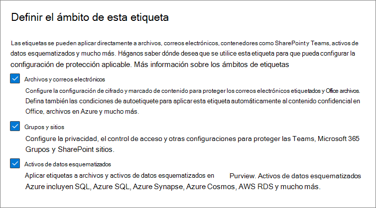
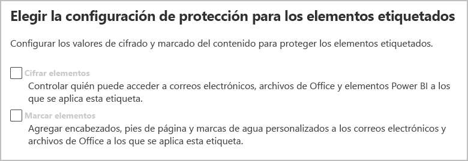
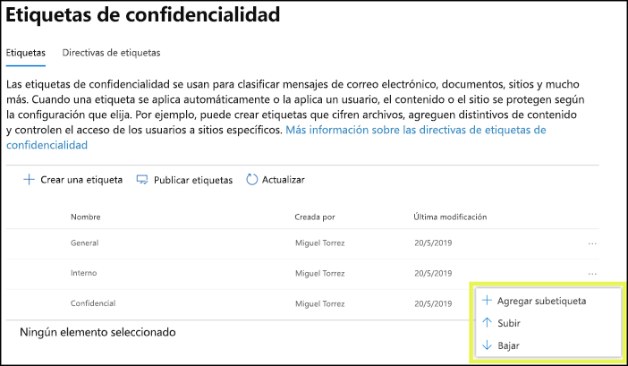
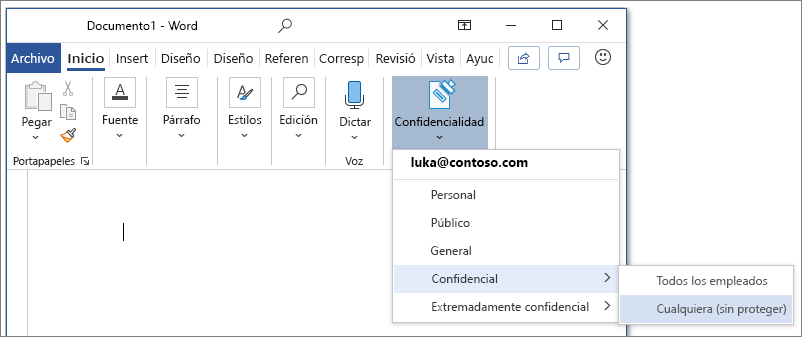
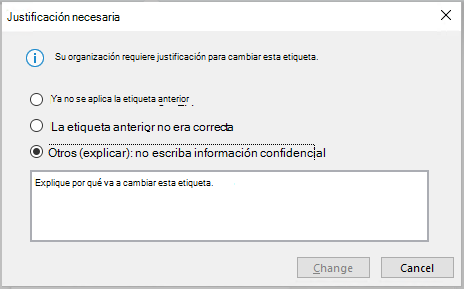
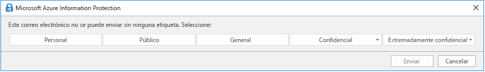
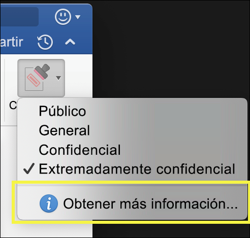
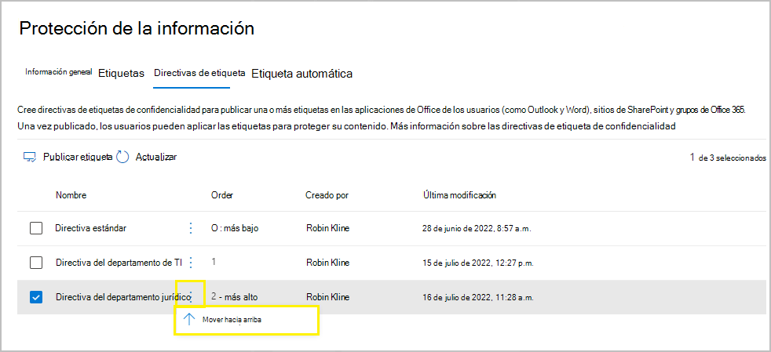

# Información sobre las etiquetas de confidencialidad

>*[Instrucciones de licencias de Microsoft 365 para la seguridad y el cumplimiento](https://aka.ms/ComplianceSD).*

> [!NOTE]
> Si busca información acerca de las etiquetas de confidencialidad presentes en las aplicaciones de Office, consulte [Aplicar etiquetas de confidencialidad a sus archivos y correos electrónicos en Office](https://support.microsoft.com/topic/apply-sensitivity-labels-to-your-files-and-email-in-office-2f96e7cd-d5a4-403b-8bd7-4cc636bae0f9).
>
> La información de esta página es para los administradores de TI que pueden crear y configurar estas etiquetas.

Para realizar su trabajo, las personas de su organización colaboran con otras tanto dentro como fuera de la organización. Esto significa que el contenido ya no se queda detrás de un firewall, sino que puede desplazarse a todas partes, a través de dispositivos, aplicaciones y servicios. Y cuando se desplaza, usted quiere que lo haga de una forma segura y protegida que cumpla con las directivas empresariales y de cumplimiento de normas de su organización.

Las etiquetas de confidencial de la solución de Microsoft Information Protection le permiten clasificar y proteger los datos de la organización, a la vez que se asegura de que no se obstaculice la productividad de los usuarios y su capacidad de colaboración.

Ejemplo que muestra las etiquetas de confidencialidad disponibles en Excel, en la pestaña **Inicio** de la cinta de opciones. En este ejemplo, la etiqueta aplicada se muestra en la barra de estado:

Para aplicar etiquetas de confidencialidad, los usuarios tienen que haber iniciado sesión en Microsoft 365 con su cuenta profesional o educativa.

> [!NOTE]
> Desde hace poco, las etiquetas de confidencialidad son compatibles con inquilinos de la Administración Pública de Estado Unidos (GCC y GCC-H). Para obtener más información, vea las notas de la versión para Aplicaciones de Microsoft 365 para empresas, [versión 2101: 26 de enero](https://docs.microsoft.com/officeupdates/current-channel#version-2101-january-26).
>
> Para el escáner y el cliente de etiquetas unificadas de Azure Information Protection, consulte la [Descripción del servicio de Administración Pública de Azure Information Protection Premium](https://docs.microsoft.com/enterprise-mobility-security/solutions/ems-aip-premium-govt-service-description).

Puede usar etiquetas de confidencialidad para:
  
- **Proporcionar opciones de configuración de protección que incluyan el cifrado y las marcas de contenido.** Por ejemplo, aplique una etiqueta "Confidencial" a un documento o correo electrónico y esa etiqueta cifrará el contenido y aplicará una marca de agua "Confidencial". Entre las marcas de contenido se incluyen encabezados, pies de página y marcas de agua, y el cifrado también puede restringir las acciones que pueden realizar los usuarios autorizados en el contenido.

- **Proteger el contenido de las aplicaciones de Office en distintos dispositivos y plataformas.** Compatible con Word, Excel, PowerPoint y Outlook en las aplicaciones de escritorio de Office y Office en la Web. Compatible con Windows, Mac OS, iOS y Android.

- **Proteger el contenido en los servicios y aplicaciones de terceros** con Microsoft Cloud App Security Con Cloud App Security, puede detectar, clasificar, etiquetar y proteger el contenido en los servicios y aplicaciones de terceros, como SalesForce, Box o Dropbox, incluso si la aplicación o servicio de terceros no puede leer o no tiene compatibilidad con etiquetas de confidencialidad.

- **Proteger contenedores** que incluyan Teams, Grupos de Microsoft 365 y sitios de SharePoint. Por ejemplo, configurar las opciones de privacidad, el acceso de usuarios externos, el uso compartido externo y el acceso desde dispositivos no administrados.

- **Extender las etiquetas de confidencialidad a Power BI**: al activar esta función, puede aplicar y ver etiquetas en Power BI y proteger los datos cuando se guarden fuera del servicio.

- **Extienda las etiquetas de confidencialidad a los activos en Azure Purview**: al activar esta opción, actualmente en versión preliminar, puede aplicar las etiquetas de confidencialidad a activos como columnas SQL, archivos en Azure Blob Storage y mucho más. 

- **Extienda las etiquetas de confidencialidad a los servicios y aplicaciones de terceros.** Con el SDK de la protección de la información de Microsoft, las aplicaciones de terceros pueden leer etiquetas de confidencialidad y aplicar configuraciones de protección.

- **Clasificar contenido sin usar una configuración de protección.** También puede simplemente asignar una etiqueta como resultado de la clasificación del contenido. Esto proporciona a los usuarios una asignación visual de la clasificación de los nombres de etiqueta de la organización y pueden usar las etiquetas para crear informes de uso y ver los datos de la actividad de su contenido confidencial. También puede usar esta información para aplicar la configuración de protección más adelante.

En todos estos casos, las etiquetas de confidencialidad de Microsoft 365 pueden ayudarle a realizar las acciones correctas en el contenido adecuado. Con las etiquetas de confidencialidad, puede clasificar los datos en toda la organización, y aplicar la configuración de protección en función de dicha clasificación.

Para obtener más información sobre estos y otros escenarios que son compatibles con las etiquetas de confidencialidad, vea [Escenarios comunes para las etiquetas de confidencialidad](get-started-with-sensitivity-labels.md#common-scenarios-for-sensitivity-labels). Se siguen desarrollando nuevas funciones compatibles con las etiquetas de confidencialidad, por lo que también le puede resultar útil consultar el [Plan de desarrollo de Microsoft 365](https://aka.ms/MIPC/Roadmap).

## Qué es una etiqueta de confidencialidad

Cuando asigna una etiqueta de confidencialidad a un contenido, es como un sello que se le aplica que es:

- **Personalizable.** Según su organización y necesidades empresariales, puede crear categorías para diferentes niveles de contenido confidencial en su organización. Por ejemplo, Personal, Público, General, Confidencial y Altamente confidencial.

- **Texto no cifrado.** Como la etiqueta se almacena en texto no cifrado en los metadatos de archivos y correos, las aplicaciones y servicios de terceros pueden leerla y luego aplicar sus propias acciones de protección, si es necesario.

- **Persistente.** Al estar almacenada en los metadatos de los archivos y mensajes de correo electrónico, la etiqueta se mueve con el contenido, a pesar de dónde se guarda o almacena. La identificación de etiqueta única es la base para aplicar y exigir las directivas que usted configura.

Para los usuarios, una etiqueta de confidencialidad se muestra como una etiqueta en las aplicaciones que usan y se pueden integrar fácilmente en sus flujos de trabajo existentes.

Cada elemento que admite las etiquetas de confidencialidad puede tener una sola etiqueta aplicada. Los documentos y mensajes de correo electrónico pueden tener aplicadas tanto una etiqueta de confidencialidad como una [etiqueta de retención](retention.md#retention-labels).

> [!div class="mx-imgBorder"]
> 

## Qué pueden hacer las etiquetas de confidencialidad

Después de aplicar una etiqueta de confidencialidad a un correo electrónico o documento, cualquier configuración de protección de esa etiqueta se aplica al contenido. Puede configurar una etiqueta de confidencialidad para:

- **Cifrar** los mensajes de correo electrónico y documentos para evitar que personas no autorizadas tengan acceso a estos datos. Puede elegir qué usuarios o grupos tienen permisos para realizar las acciones y durante cuánto tiempo. Por ejemplo, puede elegir permitir que todos los usuarios de la organización puedan modificar un documento mientras que un grupo específico de otra organización solo pueda verlo. Como alternativa, en lugar de permisos definidos por el administrador, puede permitir a los usuarios asignar permisos al contenido al aplicar la etiqueta. 
    
    Para obtener más información sobre la configuración de **Cifrado** cuando cree o edite una etiqueta de confidencialidad, vea [Restringir el acceso a contenido con el cifrado en etiquetas de confidencialidad](encryption-sensitivity-labels.md).

- **Marcar el contenido** cuando utilice las aplicaciones de Office, agregando marcas de agua, encabezados o pies de página a correos electrónicos o documentos que tengan aplicada la etiqueta. Las marcas de agua se pueden aplicar en documentos, pero no en mensajes de correo electrónico. Encabezado y marca de agua de ejemplo:
    
    
    
    ¿Necesita comprobar cuándo se aplican marcas de contenido? Consulte [Cuándo las aplicaciones de Office aplican marcado de contenido y cifrado](sensitivity-labels-office-apps.md#when-office-apps-apply-content-marking-and-encryption).
    
    Algunas, aunque no todas las aplicaciones admiten marcas dinámicas mediante el uso de variables. Por ejemplo, inserte el nombre de la etiqueta o el nombre del documento en el encabezado, pie de página o marca de agua. Para obtener más información, vea [Marcadores dinámicos con variables](sensitivity-labels-office-apps.md#dynamic-markings-with-variables).
    
    Longitudes de cadena: las marcas de agua están limitadas a 255 caracteres. Los encabezados y pies de página tienen un límite de 1024 caracteres, excepto en Excel. Excel tiene un límite total de 255 caracteres para encabezados y pies de página, pero este límite incluye caracteres que no son visibles, como códigos de formato. Si se alcanza ese límite, la cadena que escriba no se mostrará en Excel.

- **Proteja el contenido de los contenedores como sitios y grupos** cuando habilita la capacidad de [Usar etiquetas de confidencialidad para proteger el contenido en Microsoft Teams, los grupos de Microsoft 365 y los sitios de SharePoint](sensitivity-labels-teams-groups-sites.md).
    
    No puede configurar las opciones de protección para grupos y sitios hasta que habilite esta capacidad. Esta configuración de etiqueta no da como resultado que los documentos o mensajes de correo electrónico sean etiquetados automáticamente, pero, en cambio, la configuración de la etiqueta protege el contenido, al controlar el acceso al contenedor donde puede almacenarse el contenido. Estas opciones incluyen los ajustes de privacidad, el acceso de usuarios externos, el uso compartido externo y el acceso desde dispositivos no administrados.

- **Aplicar la etiqueta automáticamente a archivos y mensajes de correo electrónico o recomendar una etiqueta.** Elija cómo identificar la información confidencial que quiere etiquetar y la etiqueta se podrá aplicar automáticamente o podrá solicitar a los usuarios que apliquen la etiqueta que recomiende usar. Si recomienda una etiqueta, el mensaje mostrará el texto que elija. Por ejemplo:
    
    
    
    Para obtener más información sobre la configuración para **Etiquetar automáticamente archivos y mensajes de correo electrónico** al crear o editar una etiqueta de confidencialidad, vea [Aplicar una etiqueta de confidencialidad al contenido automáticamente](apply-sensitivity-label-automatically.md) para las aplicaciones de Office y [Etiquetar automáticamente los datos en Azure Purview](https://docs.microsoft.com/azure/purview/create-sensitivity-label).

### Ámbitos de etiqueta

Cuando cree una etiqueta de confidencialidad, se le pedirá que configure el ámbito de la etiqueta, el cual determinará dos cosas:
- Las opciones de etiqueta que puede configurar para esa etiqueta
- El lugar en el que los usuarios verán la etiqueta

Esta configuración de ámbito le permite tener etiquetas de confidencialidad únicamente para documentos y mensajes de correo electrónico, y no se pueden seleccionar para contenedores. De la misma forma, las etiquetas de confidencialidad que son solo para contenedores, no pueden seleccionarse para documentos y mensajes de correo electrónico. Como novedad, y actualmente en versión preliminar, también puede seleccionar el ámbito de activos de Azure Purview:

De forma predeterminada, el ámbito de **Archivos y correo electrónico** siempre están seleccionados. Los demás ámbitos se seleccionan de manera predeterminada cuando se habilitan las características de su espacio empresarial:

- **Grupos y sitios**: [habilitar etiquetas de confidencialidad para contenedores y sincronizarlas](sensitivity-labels-teams-groups-sites.md#how-to-enable-sensitivity-labels-for-containers-and-synchronize-labels)

- **Activos de Azure Purview (versión preliminar)**: [etiquetar automáticamente el contenido en Azure Purview](https://go.microsoft.com/fwlink/?linkid=2148989)

Si cambia los valores predeterminados, de modo que no se seleccionen todos los ámbitos, verá la primera página de la configuración de los ámbitos que no ha seleccionado, pero no podrá establecer la configuración. Por ejemplo, si el ámbito para archivos y mensajes de correo electrónico no está seleccionado, no podrá seleccionar las opciones en la página siguiente:

En las páginas que no tengan opciones disponibles, seleccione **Siguiente** para continuar. O bien, seleccione **Atrás** para cambiar el ámbito de la etiqueta.

### Prioridad de etiqueta (el orden importa)

Al crear las etiquetas de confidencialidad en el centro de administración, éstas aparecen en una lista en la pestaña **Confidencialidad** en la página de **Etiquetas**. En esta lista, el orden de las etiquetas es importante, ya que refleja su prioridad. Quiere que la etiqueta de confidencialidad más restrictiva, como la Extremadamente confidencial, aparezca en la **parte inferior** de la lista y la etiqueta de confidencialidad menos restrictiva, como la Pública, aparezca en la **parte superior**.

Solo puede aplicar una etiqueta de confidencialidad a un elemento, como un documento, un correo electrónico o un contenedor. Si configura una opción que exige a los usuarios proporcionar una justificación para cambiar una etiqueta a una clasificación inferior, el orden de esta lista identifica las clasificaciones más bajas. Sin embargo, esta opción no se aplica a las subetiquetas.

Aunque, el orden de las subetiquetas se usa en el [ etiquetado automático](apply-sensitivity-label-automatically.md). Cuando configure etiquetas para aplicarlas automáticamente o como recomendación, pueden producirse varias coincidencias para más de una etiqueta. Para determinar la etiqueta que se va a aplicar o recomendar, se usa el orden de las etiquetas: se selecciona la última etiqueta de confidencialidad y, a continuación, si procede, la última subetiqueta.

### Subetiquetas (agrupación de etiquetas)

Con las subetiquetas, puede agrupar una o varias etiquetas bajo una etiqueta principal que el usuario ve en la aplicación de Office. Por ejemplo, en Confidencial, su organización puede usar varias etiquetas distintas para determinados tipos dentro de esa clasificación. En este ejemplo, la etiqueta principal Confidencial es simplemente una etiqueta de texto sin ninguna configuración de protección y, como contiene subetiquetas, no se puede aplicar al contenido. En su lugar, los usuarios deben elegir Confidencial para ver las subetiquetas y, a continuación, pueden elegir una subetiqueta para que se aplique al contenido.

Las subetiquetas son simplemente una forma de presentar etiquetas a los usuarios en grupos lógicos. Las subetiquetas no heredan ninguna configuración de su etiqueta principal. Cuando publique una subetiqueta para un usuario, éste podrá aplicar dicha subetiqueta al contenido, pero no podrá aplicar solo la etiqueta principal.

No elija una etiqueta principal como predeterminada o configure una etiqueta principal para que se aplique automáticamente (o se recomiende). Si lo hace, la etiqueta principal no se aplicará al contenido.

Ejemplo de cómo se muestran las subetiquetas para los usuarios:

### Modificar o eliminar una etiqueta de confidencialidad

Si elimina una etiqueta de confidencialidad del centro administración, la etiqueta no se quitará automáticamente del contenido, y cualquier configuración de protección se seguirá aplicando al contenido que tenía esa etiqueta aplicada.

Si edita una etiqueta de confidencialidad, la versión de la etiqueta que se aplicó al contenido es la que se aplica a ese contenido.

## Qué pueden hacer las directivas de etiqueta

Después de crear las etiquetas de confidencialidad, debe publicarlas para que estén disponibles para las personas y los servicios de su organización. Las etiquetas de confidencialidad se pueden aplicar a los documentos de Office y mensajes de correo electrónico y a otros elementos compatibles con las etiquetas de confidencialidad. 

A diferencia de las etiquetas de retención, que se publican en ubicaciones, como todos los buzones de Exchange, las etiquetas de confidencialidad se publican para los usuarios o los grupos. Las aplicaciones que son compatibles con las etiquetas de confidencialidad pueden mostrarlas a los usuarios y grupos como etiquetas aplicadas, o bien como etiquetas que pueden aplicar.

Cuando configura una directiva de etiqueta, puede:

- **Elija qué usuarios y grupos ven las etiquetas.** Las etiquetas pueden publicarse para cualquier usuario específico o un grupo de seguridad activado por correo electrónico, un grupo de distribución o un grupo de Microsoft 365, que puede tener [suscripción dinámica](https://docs.microsoft.com/azure/active-directory/users-groups-roles/groups-create-rule) en Azure AD.

- **Aplicar una etiqueta predeterminada** a todos los documentos y correos electrónicos nuevos creados por los usuarios y grupos incluidos en la directiva de etiqueta y la misma etiqueta predeterminada a los contenedores (si ha habilitado [etiquetas de confidencialidad para Microsoft Teams, Grupos de Microsoft 365 y sitios de SharePoint](sensitivity-labels-teams-groups-sites.md)). Los usuarios siempre pueden cambiar la etiqueta predeterminada si no es la etiqueta adecuada para su documento o correo electrónico. 
    
    Considere utilizar una etiqueta predeterminada para establecer un nivel base de configuración de protección que desee aplicar a todo su contenido. Sin embargo, sin el aprendizaje del usuario y otros controles, esta configuración también puede dar como resultado una etiqueta incorrecta. Por lo general, no es una buena idea seleccionar una etiqueta que aplique el cifrado como etiqueta predeterminada a los documentos. Por ejemplo, muchas organizaciones necesitan enviar y compartir documentos con usuarios externos que pueden no tener aplicaciones compatibles con el cifrado o que no usen una cuenta que pueda ser autorizada. Para obtener más información sobre este escenario, consulte [Uso compartido de documentos cifrados con usuarios externos](sensitivity-labels-office-apps.md#sharing-encrypted-documents-with-external-users).

- **Solicitar una justificación para cambiar una etiqueta.** Si un usuario intenta quitar una etiqueta o reemplazarla por una etiqueta con un número de pedido inferior, puede solicitar que el usuario proporcione una justificación para realizar esa acción. Por ejemplo, un usuario abre un documento con la etiqueta Confidencial (número de pedido 3) y reemplaza dicha etiqueta por una llamada Público (número de pedido 1). Los administradores pueden leer el motivo de la justificación junto con el cambio de etiqueta en [explorador de actividades](data-classification-activity-explorer.md).

    

- **Requerir que los usuarios apliquen una etiqueta** con una opción para correo electrónico y documentos, y otra para contenedores. También conocidas como etiquetado obligatorio, estas opciones garantizan que se aplique una etiqueta antes de que los usuarios puedan guardar documentos y enviar mensajes de correo electrónico, y crear nuevos grupos o sitios.
    
    Para documentos y mensajes de correo electrónico, el usuario puede asignar la etiqueta manualmente; de forma automática, como resultado de una condición configurada; o bien, de forma predeterminada (la opción de etiqueta predeterminada descrita anteriormente). Un ejemplo de aviso que se muestra en Outlook cuando se requiere que un usuario asigne una etiqueta:

    
    
    > [!NOTE]
    > El etiquetado obligatoria para documentos y mensajes de correo electrónico no está disponible para todas las aplicaciones o para todas las plataformas. Para más información, consulte [Requerir que los usuarios apliquen una etiqueta al correo electrónico y a los documentos.](sensitivity-labels-office-apps.md#require-users-to-apply-a-label-to-their-email-and-documents)
    
    Para los contenedores, se debe asignar una etiqueta al momento de crear el grupo o sitio.
    
    Considere usar esta opción para mejorar la cobertura de la etiqueta. Sin embargo, sin el aprendizaje del usuario, estas opciones de configuración también pueden dar como resultado un etiquetado incorrecto. Además, a menos que también establezca una etiqueta predeterminada correspondiente, el etiquetado obligatorio puede frustrar a los usuarios debido a los avisos frecuentes.

- **Proporcione un vínculo de ayuda a una página de ayuda personalizada.** Si los usuarios no están seguros de lo que significan las etiquetas de confidencialidad o cómo deben usarse, puede proporcionar una URL con más información que aparecerá en la parte inferior del menú **Etiqueta de confidencialidad** en las aplicaciones de Office:

    

Después de crear una directiva de etiquetas que asigne nuevas etiquetas de confidencialidad a los usuarios y grupos, los usuarios comenzarán a ver las etiquetas en las aplicaciones de Office. Espere hasta 24 horas para que los cambios más recientes se repliquen en toda la organización.

No hay límite en el número de etiquetas de confidencialidad que puede crear y publicar, con una excepción: si la etiqueta aplica un cifrado, hay un máximo de 500 etiquetas que puede crear. Sin embargo, como mejor práctica para reducir los gastos generales de administración y reducir la complejidad para sus usuarios, trate de mantener el número de etiquetas al mínimo. Las implementaciones reales han demostrado que la eficacia se reduce notablemente cuando los usuarios tienen más de cinco etiquetas principales o más de cinco subetiquetas por etiqueta principal.

### Prioridad de etiquetas de directivas (el orden importa)

Para que los usuarios dispongan de sus etiquetas de confidencialidad, puede publicarlas en una directiva de etiqueta de confidencialidad, que se muestra en una lista en la pestaña de **Directivas de confidencialidad** en la página **Directivas de etiqueta**. Al igual que las etiquetas de confidencialidad (consulte [la sección anterior](#label-priority-order-matters) (el orden importa)), el orden de las directivas de etiqueta de confidencialidad es importante, puesto que refleja su prioridad. La directiva de etiqueta de menor prioridad se muestra en la parte **superior**, mientras que la directiva de mayor prioridad se muestra en la parte **inferior**.

Una directiva de etiqueta consiste en lo siguiente:

- Un conjunto de etiquetas.
- Los usuarios y grupos a los que se asignará la directiva con etiquetas.
- El ámbito de la directiva y la configuración de directiva para ese ámbito (como la etiqueta predeterminada para los archivos y mensajes de correo electrónico).

Puede incluir un usuario en varias directivas de etiquetas, y el usuario verá todas las etiquetas de confidencialidad de esas directiva. Sin embargo, el usuario conseguirá las configuraciones de directiva solo de la directiva de etiqueta de mayor prioridad.

Si no ve la configuración de la etiqueta o la configuración de la misma que esperaba para un usuario o un grupo, compruebe el orden de las directivas de etiqueta de sensibilidad. Para cambiar el orden de las directivas de etiqueta, seleccione una directiva de etiqueta de confidencialidad > seleccione los puntos suspensivos a la derecha > **Mover hacia abajo** o **Mover hacia arriba**.

Si usa etiquetas de retención además de etiquetas de carácter, es importante que recuerde que los temas prioritarios son las directivas de etiquetas de carácter, pero no para [las etiquetas de retención](retention.md#the-principles-of-retention-or-what-takes-precedence).

## Etiquetas de confidencialidad y Azure Information Protection

Si ha implementado etiquetas con Azure Information Protection, utilice las secciones siguientes para obtener información sobre cómo empezar a usar las etiquetas de confidencialidad.

### Etiquetas de Azure Information Protection

> [!NOTE]
> La gestión de etiquetas para las etiquetas de Azure Information Protection en Microsoft Azure Portal quedará en desuso el **31 de marzo de 2021**. Más información en la página oficial [notificación de desuso](https://techcommunity.microsoft.com/t5/azure-information-protection/announcing-timelines-for-sunsetting-label-management-in-the/ba-p/1226179).

Si utiliza etiquetas de protección de información azul porque su inquilino aún no está en la[ plataforma de etiquetado unificado](https://docs.microsoft.com/azure/information-protection/faqs#how-can-i-determine-if-my-tenant-is-on-the-unified-labeling-platform), le recomendamos que evite crear etiquetas de confidencialidad hasta que active el etiquetado unificado. En este escenario, las etiquetas que se muestran en el Azure Portal son etiquetas de Azure Information Protection en lugar de etiquetas de confidencialidad. El cliente de Azure Information Protection (clásico) puede usar estas etiquetas en los equipos con Windows, pero no los dispositivos que ejecuten macOS, iOS o Android. Para resolver este problema, [migre estas etiquetas](/azure/information-protection/configure-policy-migrate-labels) a etiquetas de confidencialidad. 

Los metadatos aplicados por los dos conjuntos de etiquetas son compatibles, por lo que no es necesario volver a etiquetar documentos y correos electrónicos cuando se haya completado la migración.

### Clientes de Azure Information Protection

Cuando se usan etiquetas de confidencialidad en Aplicaciones de Microsoft 365 para empresas en equipos con Windows, tiene la opción de usar un cliente de Azure Information Protection o usar etiquetas integradas en Office.

De forma predeterminada, la etiqueta integrada está desactivada en estas aplicaciones cuando el cliente de Azure Information Protection está instalado. Para obtener más información, incluido cómo cambiar este comportamiento predeterminado, consulte [cliente de etiquetas integrado de Office y cliente de Azure Information Protection](sensitivity-labels-office-apps.md#office-built-in-labeling-client-and-the-azure-information-protection-client).

Incluso si usa etiquetas integradas en las aplicaciones de Office, también puede usar el cliente de etiquetas Unificado de Azure Information Protection con etiquetas de confidencialidad para lo siguiente:

- Un escáner para detectar información confidencial almacenada localmente y, si quiere, etiquete el contenido

- Opciones de botón derecho en el explorador de archivos para que los usuarios puedan aplicar etiquetas a todos los tipos de archivo

- Un visor para mostrar archivos cifrados para texto, imágenes o documentos PDF

- Un módulo de PowerShell para detectar información confidencial en los archivos locales y aplicar o quitar las etiquetas y el cifrado de estos archivos.

Si no está familiarizado con Azure Information Protection, o si es un cliente de Azure Information Protection que acaba de migrar sus etiquetas, consulte [Elegir el cliente de etiquetas que se usará para los equipos Windows](https://docs.microsoft.com/azure/information-protection/rms-client/use-client#choose-which-labeling-client-to-use-for-windows-computers) en la documentación de Azure Information Protection.

## Etiquetas de confidencialidad y Microsoft Cloud App Security

Cuando hace uso de Cloud App Security (CAS), puede detectar, clasificar, etiquetar y proteger el contenido en los servicios y aplicaciones de terceros, como por ejemplo SalesForce, Box o Dropbox. 

Cloud App Security funciona con las etiquetas mismas y las de confidencialidad de Azure Information Protection:

- Si los centros de administración de etiquetas tienen una o más etiquetas de confidencialidad [publicadas](create-sensitivity-labels.md#publish-sensitivity-labels-by-creating-a-label-policy) para al menos un usuario: se usan las etiquetas de confidencialidad.

- Si los centros de administración de etiquetas no tienen etiquetas de confidencialidad publicadas: se usan las etiquetas de Azure Information Protection.

Para obtener instrucciones sobre cómo usar Cloud App Security con estas etiquetas, consulte [Integración de Azure Information Protection](https://docs.microsoft.com/cloud-app-security/azip-integration).

## Etiquetas de confidencialidad y el SDK de protección de la información de Microsoft

Como las etiquetas de sensibilidad se almacenan como texto sin formato en los metadatos de un documento, las aplicaciones y los servicios de terceros pueden leer y escribir en los metadatos de etiqueta para complementar la implementación de la etiqueta. Además, los desarrolladores de software pueden usar el [SDK de Microsoft Information Protection](https://docs.microsoft.com/information-protection/develop/overview#microsoft-information-protection-sdk) para admitir por completo las características de etiquetado y cifrado en varias plataformas. Para obtener más información, consulte el [anuncio de disponibilidad general en el blog de la comunidad tecnológica](https://techcommunity.microsoft.com/t5/Microsoft-Information-Protection/Microsoft-Information-Protection-SDK-Now-Generally-Available/ba-p/263144). 

También puede obtener más información sobre [las soluciones de asociados que se integran con la protección de la información de Microsoft](https://techcommunity.microsoft.com/t5/Azure-Information-Protection/Microsoft-Information-Protection-showcases-integrated-partner/ba-p/262657).

## Instrucciones de implementación

Para planear la implementación y obtener una guía que incluye información sobre licencias, permisos, estrategia de implementación, una lista de escenarios admitidos y la documentación del usuario final, vea [Introducción a las etiquetas de confidencialidad](get-started-with-sensitivity-labels.md).
