# Información general de etiquetas de confidencialidad

Para realizar su trabajo, las personas de su organización colaboran con otras tanto dentro como fuera de la organización. Esto significa que el contenido ya no se queda detrás de un firewall, sino que puede desplazarse a todas partes, a través de dispositivos, aplicaciones y servicios. Y cuando se desplaza, usted quiere que lo haga de una forma segura y protegida que cumpla con las directivas empresariales y de cumplimiento de normas de su organización.

Con las etiquetas de confidencialidad, puede clasificar y ayudar a proteger el contenido confidencial, sin poner impedimentos a la productividad y la capacidad de colaboración de los usuarios.

> [!NOTE]
> Las etiquetas de sensibilidad no están disponibles en la Government Community (GCC) de EE. UU.

Ejemplo de etiquetas de confidencialidad:

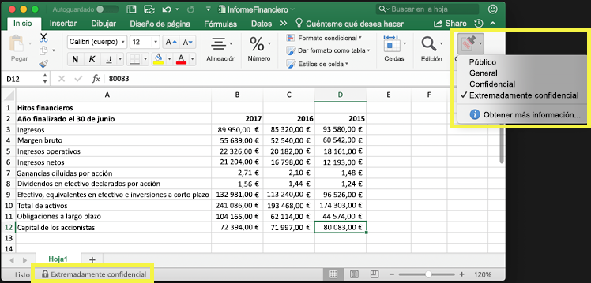

Las etiquetas de confidencialidad sólo se admiten para los espacios empresariales en la nube global (pública). Actualmente, las etiquetas de compatibilidad no son compatibles con los espacios empresariales de otras nubes, como las[nubes nacionales](https://docs.microsoft.com/azure/active-directory/develop/authentication-national-cloud).

Para aplicar etiquetas de confidencialidad, los usuarios tienen que haber iniciado sesión en Office con su cuenta profesional o educativa.

Puede usar etiquetas de confidencialidad para:
  
- **Aplicar opciones de protección como encriptación o marcas de agua en el contenido etiquetado.** Por ejemplo, los usuarios pueden aplicar una etiqueta Confidencial a un documento o correo electrónico, y esa etiqueta puede encriptar el contenido y aplicar una marca de agua Confidencial.

- **Proteger el contenido de las aplicaciones de Office en distintos dispositivos y plataformas.** Para obtener una lista de aplicaciones compatibles, vea [Etiquetas de confidencialidad en aplicaciones de Office](sensitivity-labels-office-apps.md).

- **Evitar que el contenido confidencial salga de su organización en dispositivos con Windows** utilizando endpoint protection de Microsoft Intune. Después de aplicar una etiqueta de confidencialidad a un contenido que se encuentra en un dispositivo Windows, endpoint protection puede impedir que el contenido se copie en una aplicación de terceros, como Twitter o Gmail, o en un almacenamiento extraíble, como una unidad USB.

- **Proteger el contenido en los servicios y aplicaciones de terceros** a través de Microsoft Cloud App Security Con Cloud App Security, puede detectar, clasificar, etiquetar y proteger el contenido en los servicios y aplicaciones de terceros, como SalesForce, Box o Dropbox, incluso si la aplicación o servicio de terceros no puede leer o no tiene compatibilidad con etiquetas de confidencialidad.

- **Extienda las etiquetas de confidencialidad a los servicios y aplicaciones de terceros.** Con el SDK de protección de la información de Microsoft, las aplicaciones de terceros en [estas plataformas](https://docs.microsoft.com/information-protection/develop/overview#microsoft-information-protection-sdk) pueden leer las etiquetas de confidencialidad y aplicar la configuración de protección.

- **Clasificar contenido sin usar una configuración de protección.** También puede asignar una clasificación al contenido (como un adhesivo) que se adhiera y traslade con el contenido cuando se use y comparta. Puede usar esta clasificación para crear informes de uso y ver los datos de actividad de contenido confidencial. También puede usar esta información para aplicar la configuración de protección más adelante.

En todos estos casos, las etiquetas de confidencialidad de Office 365 pueden ayudarle a realizar las acciones correctas en el contenido adecuado. Con las etiquetas de confidencialidad, puede clasificar los datos en toda la organización y aplicar la configuración de protección en función de dicha clasificación.
  
Las etiquetas de confidencialidad se crean en el Centro de cumplimiento de Microsoft 365, el Centro de seguridad de Microsoft 365 o Centro de seguridad y cumplimiento de Office 365 en **Clasificación** > **Etiquetas de confidencialidad**. Las etiquetas de confidencialidad se pueden usar en Azure Information Protection, las aplicaciones de Office y los servicios de Office 365.

Para los clientes de Azure Information Protection, puede usar las etiquetas de Azure Information Protection en los otros centros de administración y las etiquetas se sincronizarán con Azure Portal en caso de que decida realizar una configuración adicional o avanzada. Las etiquetas de Azure Information Protection y las etiquetas de confidencialidad de Office 365 son compatibles entre sí, lo que significa que, por ejemplo, si ha marcado contenido con Azure Information Protection, no tendrá que volver a clasificar o aplicar la etiqueta al contenido.

## Qué es una etiqueta de confidencialidad

Cuando asigna una etiqueta de confidencialidad a un documento o correo electrónico, es como un sello que se aplica al contenido que:

- **Es personalizable. ** Puede crear categorías para distintos niveles de contenido confidencial en su organización, como Personal, Público, General, Confidencial y Extremadamente confidencial.

- **Texto no cifrado.** Debido a que la etiqueta se almacena en texto no cifrado en los metadatos del contenido, las aplicaciones y servicios de terceros pueden leerla y luego aplicar sus propias acciones de protección, si es necesario.

- **Es persistente.** Cuando se aplica una etiqueta de confidencialidad al contenido, esta se conserva en los metadatos de ese documento o correo electrónico. Esto significa que la etiqueta se mueve con el contenido, incluyendo la configuración de protección, y estos datos se convierten en la base para aplicar directivas.

En las aplicaciones de Office, una etiqueta de confidencialidad se muestra como una etiqueta para los usuarios en un correo electrónico o documento.

Cada elemento de contenido puede tener una única etiqueta de confidencialidad aplicada. Un elemento puede tener a la vez una única etiqueta de confidencialidad y una única [etiqueta de retención](labels.md) aplicadas.

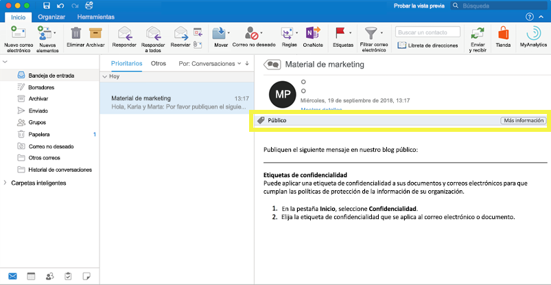

## Qué pueden hacer las etiquetas de confidencialidad

Además del correo electrónico y los documentos, las etiquetas de confidencialidad están disponibles en varias versiones de vista previa pública. Para obtener más información acerca de cómo se pueden usar las etiquetas de confidencialidad para archivos, equipos, grupos y sitios, vea estos artículos:

- [Habilitar etiquetas de confidencialidad para los archivos de Office en SharePoint y OneDrive (vista previa)](sensitivity-labels-sharepoint-onedrive-files.md)

- [Usar etiquetas de confidencialidad con Microsoft Teams, grupos de Office 365 y sitios de SharePoint (versión preliminar pública)](sensitivity-labels-teams-groups-sites.md)

Después de aplicar una etiqueta de confidencialidad a un documento o correo electrónico, cualquier configuración de protección de la etiqueta se aplica en el contenido. Con una etiqueta de confidencialidad, puede:

- **Cifre** solo el correo electrónico o el correo electrónico y los documentos. Puede elegir qué usuarios o grupos tienen permisos para realizar las acciones y durante cuánto tiempo. Por ejemplo, puede elegir permitir que los usuarios de un dominio específico ajeno a la organización tengan permisos para revisar el contenido solo 7 días después de que se haya marcado el contenido. Como alternativa, en lugar de asignar permisos usted mismo, puede permitir a los usuarios asignar permisos al contenido al aplicar la etiqueta. Para obtener más información, vea [Restringir el acceso al contenido mediante el cifrado en las etiquetas de confidencialidad](encryption-sensitivity-labels.md).

- **Marcar el contenido** agregando marcas de agua personalizadas, encabezados o pies de página a correos electrónicos o documentos que tengan aplicada la etiqueta. Solo puede aplicar marcas de agua a los documentos, no al correo electrónico, y tiene un límite de 255 caracteres. Además, los encabezados y pies de página se limitan a 1024 caracteres (excepto en Excel, donde están limitados a 255 caracteres o menos, en función de si el documento contiene otros encabezados o pies de página y otros factores).

    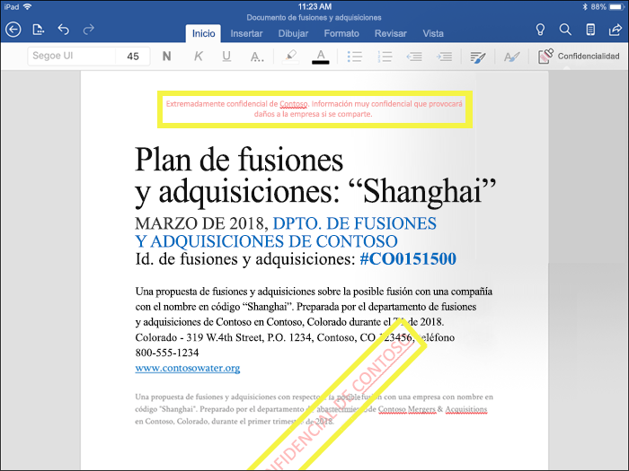

- **Evitar la pérdida de datos** activando la opción Endpoint Protection de Intune. Si se descarga contenido confidencial, puede ayudar a evitar la pérdida de datos en los dispositivos Windows. Por ejemplo, no se puede copiar contenido etiquetado en Dropbox, Gmail o en una unidad USB. Antes de que las etiquetas de confidencialidad puedan usar Windows Information Protection (WIP), primero necesita crear una directiva de protección de aplicaciones en el portal de Azure. Para obtener más información, consulte [Cómo Windows Information Protection protege los archivos con una etiqueta de confidencialidad](https://docs.microsoft.com/windows/security/information-protection/windows-information-protection/how-wip-works-with-labels?branch=vsts17546553).

- **Aplicar la etiqueta automáticamente al contenido que contenga información confidencial.** Puede elegir el tipo de información confidencial que desee etiquetar y la etiqueta se puede aplicar automáticamente o, si lo prefiere, puede pedir a los usuarios que apliquen una etiqueta específica. Si recomienda una etiqueta, el aviso muestra el texto que elija. Para obtener más información, vea [Aplicar una etiqueta de contenido sensible automáticamente](apply-sensitivity-label-automatically.md).

    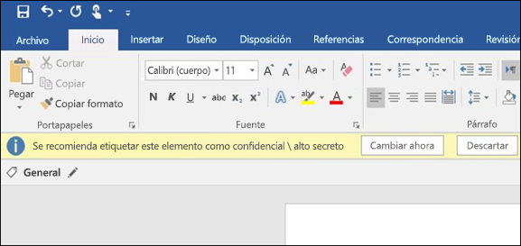

Todas estas opciones están disponibles cuando se crea una etiqueta de confidencialidad:

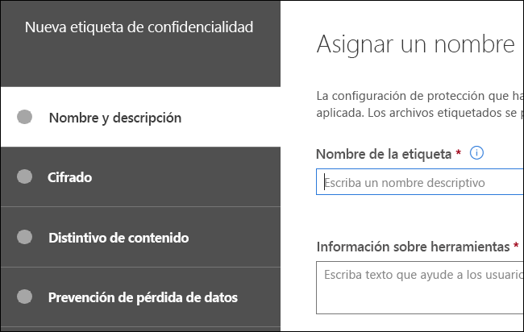

### Prioridad de etiqueta (el orden importa)

Al crear las etiquetas de confidencialidad en el centro de administración, éstas aparecen en una lista en la pestaña **Confidencialidad** en la página de **Etiquetas**. En esta lista, el orden de las etiquetas es importante, ya que refleja su prioridad. Quiere que la etiqueta de confidencialidad más restrictiva, como la Extremadamente confidencial, aparezca en la **parte inferior** de la lista y la etiqueta de confidencialidad menos restrictiva, como la Pública, aparezca en la **parte superior**.

Puede aplicar una sola etiqueta de confidencialidad a un documento o correo electrónico. Si configura una opción que exige a los usuarios proporcionar una justificación para cambiar una etiqueta a una clasificación inferior, el orden de esta lista identifica las clasificaciones más bajas. Sin embargo, esta opción no se aplica a las subetiquetas.

Aunque, el orden de las subetiquetas se usa en el [ etiquetado automático](apply-sensitivity-label-automatically.md). Cuando configure etiquetas para aplicarlas automáticamente o como recomendación, pueden producirse varias coincidencias para más de una etiqueta. Para determinar la etiqueta que se va a aplicar o recomendar, se usa el orden de las etiquetas: se selecciona la última etiqueta de confidencialidad y, a continuación, si procede, la última subetiqueta.

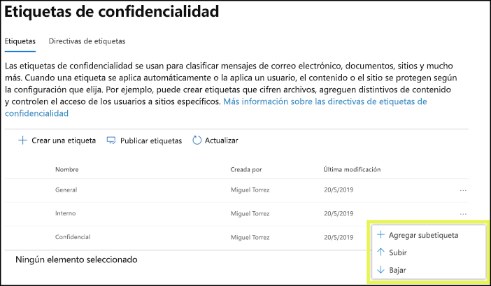

### Subetiquetas (agrupación de etiquetas)

Con las subetiquetas, puede agrupar una o varias etiquetas bajo una etiqueta principal que el usuario ve en la aplicación de Office. Por ejemplo, en Confidencial, su organización puede usar varias etiquetas distintas para determinados tipos dentro de esa clasificación. En este ejemplo, la etiqueta principal Confidencial es simplemente una etiqueta de texto sin ninguna configuración de protección y, como contiene subetiquetas, no se puede aplicar al contenido. En su lugar, los usuarios deben elegir Confidencial para ver las subetiquetas y, a continuación, pueden elegir una subetiqueta para que se aplique al contenido.

Las subetiquetas son simplemente una forma de presentar etiquetas a los usuarios en grupos lógicos. Las subetiquetas no heredan ninguna configuración de su etiqueta principal. Cuando publique una subetiqueta para un usuario, éste podrá aplicar dicha subetiqueta al contenido, pero no podrá aplicar solo la etiqueta principal.

No elija una etiqueta principal como etiqueta predeterminada ni configure una etiqueta principal para que se aplique automáticamente o se recomiende, ya que la etiqueta principal no se aplicará al contenido de las aplicaciones de Office que usan el cliente de etiquetado unificado de Azure Information Protection.

Ejemplo de cómo se muestran las subetiquetas para los usuarios:

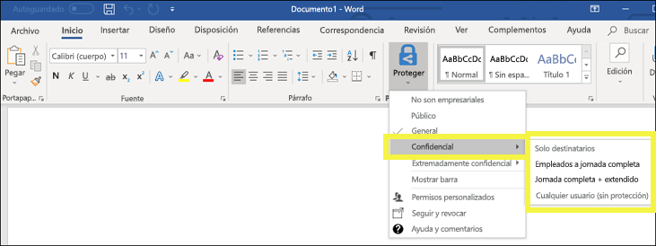

### Modificar o eliminar una etiqueta de confidencialidad

Si elimina una etiqueta de confidencialidad, no se quita la etiqueta del contenido y cualquier configuración de protección se seguirá aplicando al contenido.

Si edita una etiqueta de confidencialidad, la versión de la etiqueta que se aplicó al contenido es la que se aplica a ese contenido.

## Qué pueden hacer las directivas de etiqueta

Después de crear las etiquetas de confidencialidad, deberá publicarlas para que estén disponibles para las personas de su organización, que podrán después aplicar las etiquetas al contenido. A diferencia de las etiquetas de retención, que se publican en ubicaciones, como en todos los buzones de Exchange, las etiquetas de confidencialidad se publican para usuarios o grupos. Las etiquetas de confidencialidad aparecerán entonces en las aplicaciones de Office para esos usuarios y grupos.

Con una directiva de etiqueta, puede:

- **Elegir qué usuarios y grupos ven las etiquetas.** Las etiquetas pueden publicarse en cualquier grupo de seguridad habilitado para correo electrónico, grupo de distribución, grupo de Office 365 o grupo de distribución dinámico.

- **Aplicar una etiqueta predeterminada** a todos los nuevos documentos y correos electrónicos creados por los usuarios y grupos incluidos en la directiva de etiqueta. Esta etiqueta predeterminada puede establecer un nivel base de configuración de protección que desee aplicar a todo su contenido.

- **Requerir una justificación para cambiar una etiqueta.** Si el contenido está marcado como Confidencial y un usuario quiere quitar esa etiqueta o reemplazarla por una clasificación inferior (por ejemplo, una etiqueta llamada Pública), puede exigir al usuario que proporcione una justificación para realizar esta acción. Actualmente, el motivo de justificación no es enviado a [la etiqueta Analítica](label-analytics.md) para que el administrador pueda revisarla. No obstante, la [cliente de etiquetas unificada de Azure Information Protection](https://docs.microsoft.com/azure/information-protection/rms-client/aip-clientv2) envía esta información a [Azure Information Protection Analytics](https://docs.microsoft.com/azure/information-protection/reports-aip).

    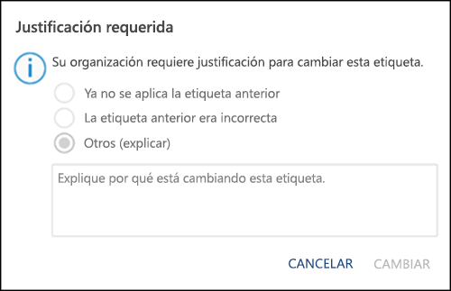

- **Requerir que los usuarios apliquen una etiqueta a su correo electrónico y documentos.** Si desea que todo el contenido de un usuario esté etiquetado, puede requerir que se aplique una etiqueta a todos los documentos guardados y correos electrónicos enviados. La etiqueta se puede asignar manualmente por el usuario de manera automática como resultado de una condición o se puede asignar de forma predeterminada (la opción de etiqueta predeterminada descrita anteriormente). Este es el aviso que aparece en Outlook cuando se pide a un usuario que asigne una etiqueta.

    > [!NOTE]
    > Las etiquetas obligatorias requieren una suscripción de Azure Information Protection. Para usar esta característica, debe descargar e instalar el [cliente de protección de Azure Information Protection](https://www.microsoft.com/download/details.aspx?id=53018) o el posterior [cliente de etiquetas unificado de Azure Information Protection](https://docs.microsoft.com/azure/information-protection/rms-client/install-unifiedlabelingclient-app). Asimismo, el cliente solo se ejecuta en Windows, por lo que esta característica aún no se admite en Mac, iOS y Android.

    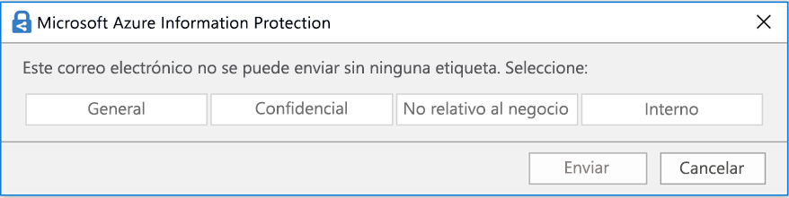

- **Proporcionar un vínculo de ayuda a una página de ayuda personalizada.** Si los usuarios no están seguros de lo que significan las etiquetas de confidencialidad o cómo deben usarse, puede proporcionar una URL con más información que aparecerá en la parte inferior del menú **Etiqueta de confidencialidad** en las aplicaciones de Office.

    

Después de crear una directiva de etiqueta y asignar etiquetas de confidencialidad a usuarios y grupos, dichos usuarios podrán ver esas etiquetas disponibles en las aplicaciones de Office en una hora o menos.

No hay límite en el número de etiquetas de sensibilidad que puede crear y publicar, con una excepción: si la etiqueta aplica un cifrado, hay un máximo de 500 etiquetas. Sin embargo, como mejor práctica para reducir los gastos generales de administración y reducir la complejidad para sus usuarios, trate de mantener el número de etiquetas al mínimo. Las implementaciones de palabras reales han demostrado que la eficacia se reduce notablemente cuando los usuarios tienen más de cinco etiquetas principales o más de cinco subetiquetas por etiqueta principal.

### Prioridad de etiquetas de directivas (el orden importa)

Para que los usuarios dispongan de sus etiquetas de confidencialidad, puede publicarlas en una directiva de etiqueta de confidencialidad, que se muestra en una lista en la pestaña de **Directivas de confidencialidad** en la página **Directivas de etiqueta**. Al igual que las etiquetas de confidencialidad (consulte [la sección anterior](#label-priority-order-matters) (el orden importa)), el orden de las directivas de etiqueta de confidencialidad es importante, puesto que refleja su prioridad. La directiva de etiqueta de menor prioridad se muestra en la parte **superior**, mientras que la directiva de mayor prioridad se muestra en la parte **inferior**.

Una directiva de etiqueta consiste en lo siguiente:

- Un conjunto de etiquetas.
- El alcance de la directiva de etiqueta, es decir, los usuarios y grupos incluidos en la directiva.
- La configuración de la directiva de etiqueta arriba descrita (etiqueta predeterminada, justificación, etiqueta obligatoria y vínculo de ayuda).

Puede incluir un usuario en varias políticas de etiquetas, y el usuario verá todas las etiquetas de confidencialidad de esas políticas. Sin embargo, el usuario solo verá la configuración de directiva de la directiva de etiqueta de mayor prioridad.

Si un usuario o grupo de su organización no ve una opción para la directiva de etiqueta prevista, como una etiqueta predeterminada u obligatoria, compruebe el orden de las directivas de etiqueta de confidencialidad. Para cambiar el orden de las directivas de etiqueta, seleccione una directiva de etiqueta de carácter > seleccione los puntos suspensivos a la derecha > **Mover abajo** o **Mover arriba**.

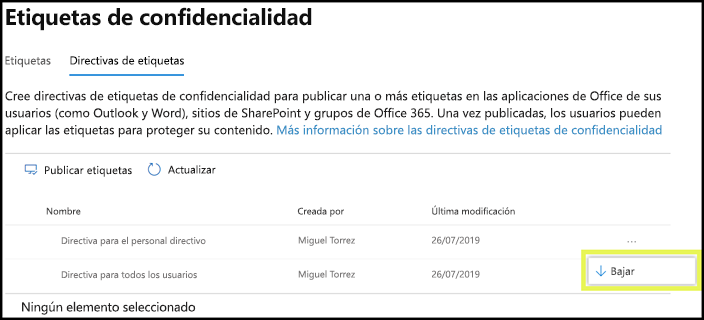

Si bien la prioridad es importante en las directivas de etiqueta de confidencialidad, esta **no** afecta a las directivas de etiqueta de retención. Como se explica en [Principios de retención o qué tiene prioridad](labels.md#the-principles-of-retention-or-what-takes-precedence), el contenido puede estar sujeto a diferentes directivas de retención.

## Introducción a las etiquetas de confidencialidad

Comenzar a utilizar las etiquetas de confidencialidad es un proceso rápido:

1. **Defina las etiquetas.** En primer lugar, establezca su taxonomía para definir los diferentes niveles de confidencialidad del contenido Utilice nombres o términos comunes que tengan sentido para sus usuarios. Por ejemplo, puede empezar con etiquetas como Personal, Público, General, Confidencial y Altamente confidencial. Puede utilizar subetiquetas para agrupar etiquetas similares por categoría. Además, cuando crea una etiqueta, se requiere una sugerencia de herramienta, que aparece en las aplicaciones de Office cuando un usuario pasa el cursor sobre una opción de etiqueta en la cinta.

2. **Defina la función de cada etiqueta.** A continuación, configure los ajustes de protección que desea asociar a cada etiqueta. Por ejemplo, el contenido de menor confidencialidad (como una etiqueta "General") podría simplemente tener un encabezado o pie de página aplicado a él, mientras que el contenido de mayor confidencialidad (como una etiqueta "Confidencial") podría tener una marca de agua, encriptación y WIP aplicado a él, para ayudar a asegurar que sólo los usuarios privilegiados puedan acceder a él.

3. **Defina quién obtiene las etiquetas.** Después de definir las etiquetas de su organización, se publican en una directiva de etiqueta que controla qué usuarios y grupos pueden ver esas etiquetas. Una misma etiqueta puede reutilizarse: defínala una vez y después podrá incluirla en varias directivas de etiqueta asignadas a diferentes usuarios. Pero para que una etiqueta pueda asignarse a un contenido, primero debe publicar dicha etiqueta para que esté disponible en las aplicaciones de Office y otros servicios. Si acaba de empezar, puede probar las etiquetas de confidencialidad asignándolas solo a unas pocas personas.

Aquí se muestran los pasos básicos que llevan a cabo el administrador, el usuario y la aplicación de Office para hacer funcionar las etiquetas de confidencialidad.

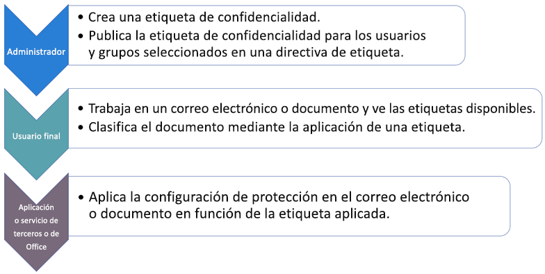

## Dónde pueden aparecer las etiquetas de confidencialidad

Las etiquetas de confidencialidad aparecen en el interfaz de usuario de las aplicaciones de Office, y pueden seleccionarse desde el botón **Confidencialidad** en la pestaña Inicio de la cinta. Para ver la disponibilidad actual del etiquetado incorporado para aplicaciones y plataformas específicas, vea [ Soporte técnico para las funciones de etiqueta de confidencialidad en aplicaciones](sensitivity-labels-office-apps.md#support-for-sensitivity-label-capabilities-in-apps).

Si utiliza el cliente de etiquetado unificado de Azure Information Protection para sus equipos de Windows, hay disponibles características adicionales para las etiquetas de confidencialidad. Para más información, consulte [Compare los clientes de etiquetado para equipos con Windows](https://docs.microsoft.com/azure/information-protection/rms-client/use-client#compare-the-labeling-clients-for-windows-computers).

### Aplicaciones de Office en Windows

En las aplicaciones de Office de los dispositivos que ejecutan Windows, las etiquetas de confidencialidad aparecen en el botón **Confidencialidad**, en la pestaña **Inicio** de la cinta. 

Cuando se utiliza el etiquetado incorporado, la etiqueta aplicada también aparece en la barra de estado en la parte inferior de la ventana:

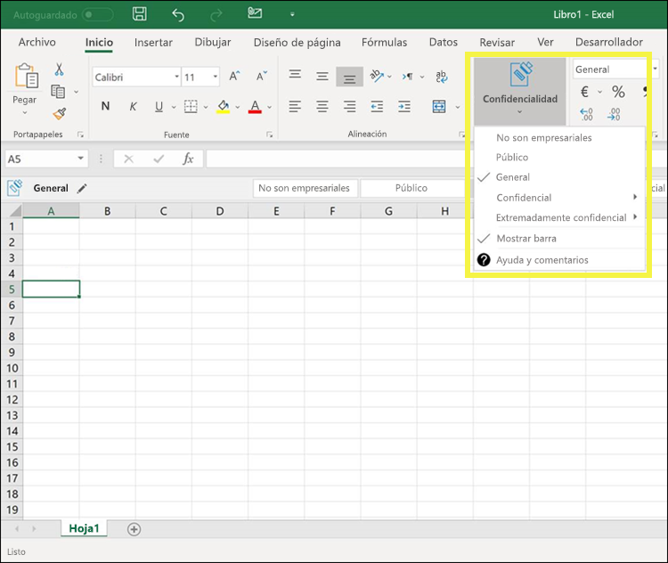

### Aplicaciones de Office en la web

Para obtener información acerca del uso de etiquetas de sensibilidad con aplicaciones de Office en la Web, consulte [Aplicar etiquetas de sensibilidad a los documentos y al correo electrónico dentro de Office - Web](https://support.office.com/article/2f96e7cd-d5a4-403b-8bd7-4cc636bae0f9).

### Aplicaciones de Office en Mac

En las aplicaciones de Office en los dispositivos Mac, las etiquetas de sensibilidad aparecen en el botón **Sensibilidad**, en la ficha **Inicio** de la cinta. La etiqueta aplicada también aparece en la barra de estado en la parte inferior de la ventana:

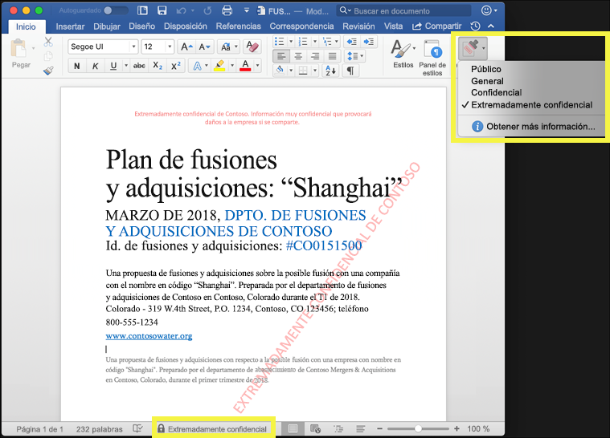

### Aplicaciones de Office en iOS

En las aplicaciones de Office de los dispositivos iOS, las etiquetas de sensibilidad aparecen en el botón **Sensitivity**, en la ficha **Inicio** de la cinta. La etiqueta aplicada también aparece en la barra de estado en la parte inferior de la ventana:

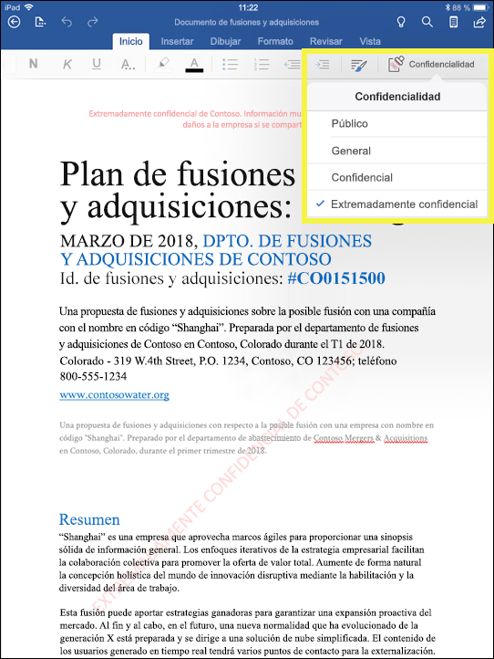

### Aplicaciones de Office en Android

En las aplicaciones de Office de los dispositivos Android, las etiquetas de sensibilidad aparecen en el botón **Sensibilidad**, en la ficha **Inicio** de la cinta. La etiqueta aplicada también aparece en la barra de estado en la parte inferior de la ventana:

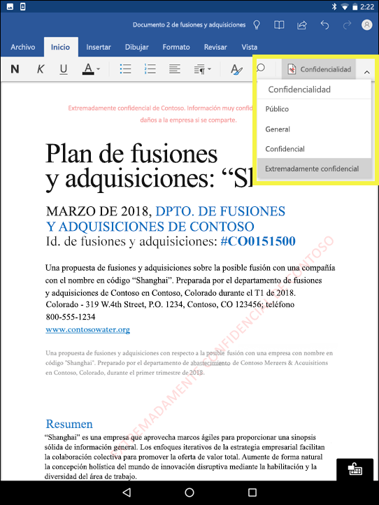

### Obtener más información sobre las etiquetas de confidencialidad en aplicaciones de Office

- [Aplicar etiquetas de confidencialidad en sus documentos y correo electrónico en Office](https://support.office.com/article/apply-sensitivity-labels-to-your-documents-and-email-within-office-2f96e7cd-d5a4-403b-8bd7-4cc636bae0f9)
- [Problemas conocidos al aplicar etiquetas de confidencialidad en sus archivos de Office](https://support.office.com/article/known-issues-when-you-apply-sensitivity-labels-to-your-office-files-b169d687-2bbd-4e21-a440-7da1b2743edc)
- [Etiquetas de confidencialidad en las aplicaciones de Office](sensitivity-labels-office-apps.md)

## Cómo funcionan las etiquetas de confidencialidad con etiquetas existentes de Azure Information Protection

Los usuarios de Azure Information Protection pueden clasificar y etiquetar el contenido de Windows mediante el cliente de etiquetado unificado de Azure Information Protection. Las etiquetas existentes de Azure Information Protection funcionan a la perfección con las nuevas etiquetas de sensibilidad, también conocidas como etiquetas unificadas. Esto significa que puede:

- Mantener las etiquetas existentes de Azure Information Protection en documentos y correos electrónicos.
- Mantener la configuración de etiquetas existente de Azure Information Protection.

Si utiliza etiquetas de protección de información azul porque su inquilino aún no está en la[ plataforma de etiquetado unificado](https://docs.microsoft.com/azure/information-protection/faqs#how-can-i-determine-if-my-tenant-is-on-the-unified-labeling-platform), le recomendamos que evite crear nuevas etiquetas en otros centros de administración hasta que active el etiquetado unificado. Para obtener más información acerca de este proceso, consulte [Cómo migrar las etiquetas de protección de información azul a etiquetas de sensibilidad unificadas](https://docs.microsoft.com/azure/information-protection/configure-policy-migrate-labels).

## Etiquetas de confidencialidad y el cliente de Azure Information Protection

Las aplicaciones de Office 365 ProPlus desactivan automáticamente el etiquetado incorporado para las etiquetas de sensibilidad en las aplicaciones de Windows Office si se instala el Azure Information Protection para clientes.
Para cambiar este comportamiento predeterminado de modo que pueda usar el etiquetado integrado, consulte [Acerca del cliente de etiquetado integrado de Office](sensitivity-labels-office-apps.md#about-the-office-built-in-labeling-client).

## Proteger el contenido en dispositivos Windows utilizando endpoint protection de Microsoft Intune

Al crear una etiqueta de confidencialidad, tiene la opción de indicar a Windows que los archivos con esta etiqueta deben protegerse contra la fuga de datos cuando este contenido se almacene en los dispositivos de Windows. Esta opción puede ayudar a garantizar que el contenido con esta etiqueta se pueda compartir o copiar sólo en las ubicaciones autorizadas, incluso cuando se almacene en un punto final. En esencia, al activar esta opción para una etiqueta de confidencialidad se le indica a Windows que se trata de datos extra críticos que garantizan restricciones de uso adicionales.

Al activar esta opción, Windows puede leer, entender y actuar sobre las etiquetas de confidencialidad de documentos y aplicar automáticamente Windows Information Protection (WIP) en el contenido, independientemente de cómo llegue a un dispositivo administrado de Windows. Esto ayuda a proteger los archivos etiquetados de filtraciones accidentales, con encriptación o sin ella.

Por ejemplo, Windows puede comprender que un documento de Word que se encuentra en el equipo de un usuario tiene una etiqueta Confidencial aplicada y WIP puede aplicar una directiva de protección de aplicaciones para evitar que se copien o compartan los datos en cualquier ubicación no profesional desde ese dispositivo (como un OneDrive personal, cuentas de correo electrónico personales, redes sociales o unidades USB).

Si un usuario intenta cargar contenido con la etiqueta a una cuenta personal de Gmail, aparecerá este mensaje.

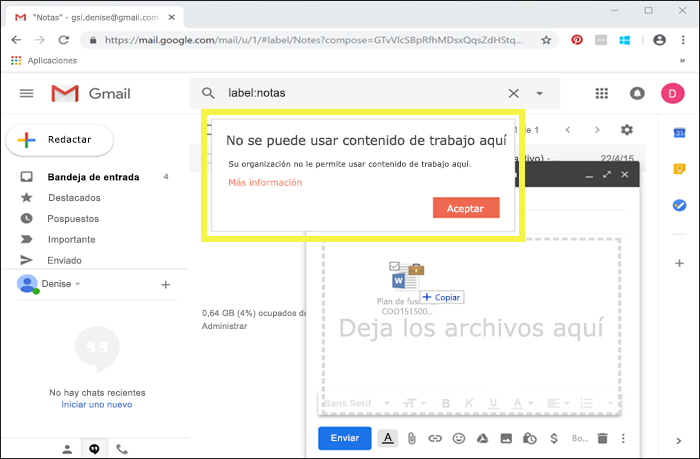

Y si un usuario intenta guardar el contenido etiquetado en una unidad USB, verá el siguiente mensaje:

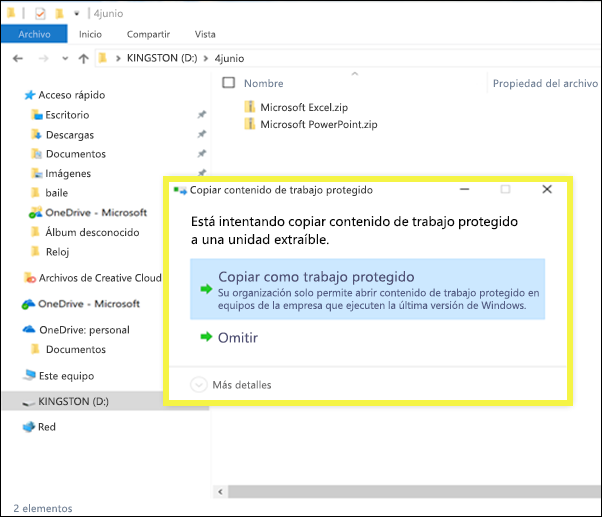

### Requisitos previos importantes para el uso de WIP

Para que las etiquetas de confidencialidad puedan usar WIP, primero debe realizar los requisitos previos que se describen aquí: [Cómo Windows Information Protection protege los archivos con una etiqueta de confidencialidad](https://docs.microsoft.com/windows/security/information-protection/windows-information-protection/how-wip-works-with-labels?branch=vsts17546553). En este tema se describen los siguientes requisitos previos:

- Asegúrese de que está ejecutando Windows 10, versión 1809 o posterior.
- [Configure la protección contra amenazas avanzada de Microsoft defender (ATP de Microsoft Defender (ATP de Microsoft Defender)](https://docs.microsoft.com/windows/security/threat-protection/), que analiza el contenido de una etiqueta y aplica la protección de información de Windows (WIP) correspondiente. ATP realiza algunas acciones independientemente del trabajo en curso, como, por ejemplo, informar de las anomalías.
- Crear una directiva de Windows Information Protection (WIP) que se aplica a dispositivos de punto final. Puede hacer esto en cualquiera de estas ubicaciones:

  - [Crear una directiva de Windows Information Protection (WIP) con MDM usando Azure Portal para Microsoft Intune](https://docs.microsoft.com/windows/security/information-protection/windows-information-protection/create-wip-policy-using-intune-azure)
  - [Crear e implementar una directiva de Windows Information Protection (WIP) con System Center Configuration Manager](https://docs.microsoft.com/windows/security/information-protection/windows-information-protection/create-wip-policy-using-sccm)

## Proteger el contenido en los servicios y aplicaciones de terceros con Microsoft Cloud App Security

Proteger el contenido en los servicios y aplicaciones de terceros con Cloud App Security (CAS). Con CAS, puede detectar, clasificar, etiquetar y proteger el contenido en los servicios y aplicaciones de terceros, como SalesForce, Box o Dropbox. Por ejemplo, Dropbox podría no entender una etiqueta de confidencialidad, pero CAS puede actuar y proteger el contenido con la etiqueta en esa ubicación.

Para obtener más información, vea [Aplicar automáticamente etiquetas de clasificación de Azure Information Protection](https://docs.microsoft.com/cloud-app-security/use-case-information-protection).

### Requisitos previos importantes para el uso de WIP

Para que las etiquetas de confidencialidad puedan usar CAS, primero debe realizar los requisitos previos que se describen aquí: [Aplicar automáticamente etiquetas de clasificación de Azure Information Protection](https://docs.microsoft.com/cloud-app-security/use-case-information-protection). En este tema se describen los siguientes requisitos previos:

- [Habilitar Cloud App Security y Azure Information Protection](https://docs.microsoft.com/cloud-app-security/azip-integration) para su espacio empresarial.
- [Conectar la aplicación](https://docs.microsoft.com/cloud-app-security/enable-instant-visibility-protection-and-governance-actions-for-your-apps) con Cloud App Security.

## Ampliar las etiquetas de confidencialidad a servicios y aplicaciones de terceros con el SDK de Microsoft Information Protection

Como una etiqueta de confidencialidad se almacena como texto no cifrado en los metadatos de un documento, los servicios y aplicaciones de terceros pueden decidir si identificar y proteger el contenido que está marcado con una etiqueta. La compatibilidad con otras aplicaciones y servicios siempre se encuentra en expansión.

Con el [SDK de Microsoft Information Protection](https://docs.microsoft.com/information-protection/develop/), las aplicaciones y los servicios de terceros pueden leer y aplicar etiquetas de confidencialidad y protección a los documentos. El SDK admite aplicaciones en [estas plataformas](https://docs.microsoft.com/information-protection/develop/overview#microsoft-information-protection-sdk).

Con el SDK, puede etiquetar y proteger el contenido de forma que funcione con otras aplicaciones y servicios de Microsoft Information Protection, como aplicaciones de Office, servicios de Office 365, el escáner de Azure Information Protection, Microsoft Cloud App Security y otras soluciones de partners. Por ejemplo, obtenga más información sobre la [compatibilidad con etiquetas de confidencialidad de Adobe Acrobat](https://techcommunity.microsoft.com/t5/Azure-Information-Protection/Starting-October-use-Adobe-Acrobat-Reader-for-PDFs-protected-by/ba-p/262738).

Para obtener más información sobre el SDK de Microsoft Information Protection, consulte el [anuncio en el blog Tech Community](https://techcommunity.microsoft.com/t5/Microsoft-Information-Protection/Microsoft-Information-Protection-SDK-Now-Generally-Available/ba-p/263144). También puede consultar [soluciones de partners que se integran con Microsoft Information Protection](https://techcommunity.microsoft.com/t5/Azure-Information-Protection/Microsoft-Information-Protection-showcases-integrated-partner/ba-p/262657).

## Permisos necesarios para crear etiquetas de confidencialidad

Los miembros de su equipo de cumplimiento que vayan a crear etiquetas de confidencialidad en el Centro de cumplimiento de Microsoft 365, Centro de seguridad de Microsoft 365 o el Centro de seguridad y cumplimiento de Office 365. Por defecto, su administrador de inquilino tiene acceso a estos centros de administración y puede dar acceso a los oficiales de cumplimiento y a otras personas, sin darles todos los permisos de un administrador de inquilino. Para este acceso administrativo limitado delegado, vaya a la página de **Permisos**de uno de estos centros de administración, y luego agregue miembros al grupo de roles **Administrador de Cumplimiento** o **Administrador de Seguridad**.

Para más información, vea [Conceder acceso a los usuarios para el Centro de seguridad y cumplimiento de Office 365](https://docs.microsoft.com/microsoft-365/security/office-365-security/grant-access-to-the-security-and-compliance-center).

Estos permisos solo son necesarios para crear y aplicar una directiva de etiquetas. La aplicación de directivas no necesita acceso al contenido.